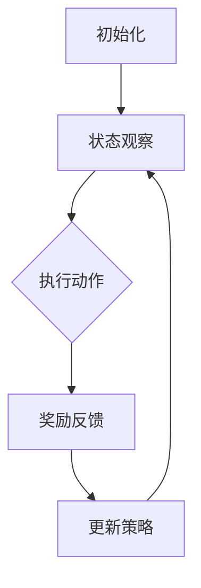

                 


## 强化学习优化AI推理的探索与利用平衡策略设计

> 关键词：强化学习，AI推理，平衡策略，优化

> 摘要：本文旨在探讨强化学习在优化AI推理中的应用，以及如何通过设计平衡策略来提高推理效率和准确性。文章首先介绍了强化学习的基本概念和原理，然后详细分析了强化学习在AI推理中的优势和挑战。接着，文章提出了基于平衡策略的优化方案，并通过实际案例展示了其应用效果。

### 1. 背景介绍

#### 1.1 强化学习的基本概念

强化学习（Reinforcement Learning，简称RL）是一种机器学习方法，通过智能体与环境之间的交互来学习最优策略。智能体在执行任务时，根据当前状态选择动作，并从环境中获得奖励或惩罚。通过不断调整策略，智能体能够逐渐学会如何在复杂环境中做出最优决策。

强化学习的主要特点包括：

- **自主性**：智能体无需外部指导，自主探索环境，通过试错学习最优策略。
- **适应性**：智能体能够根据环境变化调整策略，具有较强的适应性。
- **探索与利用**：在强化学习中，智能体需要在探索未知和利用已知之间取得平衡。

#### 1.2 问题背景

随着人工智能技术的发展，AI推理在各个领域得到了广泛应用。然而，传统的机器学习算法在推理过程中往往存在效率低下、准确性不足等问题。为了解决这些问题，研究者们开始将强化学习引入到AI推理中，以期提高推理效率和准确性。

#### 1.3 问题解决

强化学习在AI推理中的应用主要包括以下几个方面：

- **决策优化**：通过强化学习算法，智能体能够学习到最优决策策略，从而提高推理准确性。
- **任务调度**：在多任务场景中，强化学习可以帮助智能体合理分配资源，优化任务执行顺序。
- **参数调整**：强化学习能够自适应地调整模型参数，提高模型在未知环境中的适应能力。

#### 1.4 边界与外延

虽然强化学习在AI推理中具有显著优势，但也存在一些挑战。例如：

- **收敛速度**：强化学习算法在收敛过程中可能需要较长时间，尤其是在复杂环境中。
- **样本效率**：强化学习算法对样本数量有较高要求，样本不足可能导致学习效果不佳。
- **模型解释性**：强化学习模型通常具有较低的解释性，难以理解其内部机制。

#### 1.5 概念结构与核心要素组成

强化学习的基本概念和结构包括：

- **状态（State）**：智能体在环境中所处的情景。
- **动作（Action）**：智能体在某一状态下可以采取的行动。
- **奖励（Reward）**：智能体在执行动作后从环境中获得的奖励或惩罚。
- **策略（Policy）**：智能体在给定状态下选择动作的策略。
- **价值函数（Value Function）**：衡量智能体在不同状态下的期望收益。
- **模型（Model）**：描述智能体与环境之间交互的模型。

### 2. 核心概念与联系

#### 2.1 强化学习的基本原理

强化学习的基本原理包括：

- **马尔可夫决策过程（MDP）**：描述智能体在不确定环境中做出决策的过程。
- **策略迭代（Policy Iteration）**：通过不断迭代策略来优化决策过程。
- **Q学习（Q-Learning）**：通过学习值函数来优化策略。
- **深度强化学习（Deep Reinforcement Learning，简称DRL）**：结合深度神经网络和强化学习，提高学习效率和性能。

#### 2.2 概念属性特征对比表格

| 概念 | 特征1 | 特征2 | 特征3 |
| --- | --- | --- | --- |
| 状态 | 确定性 | 不确定性 | 多维状态 |
| 动作 | 可选性 | 非可选性 | 连续动作 |
| 奖励 | 正负奖励 | 无奖励 | 模糊奖励 |
| 策略 | 有指导 | 无指导 | 部分指导 |
| 价值函数 | 近似值 | 精确值 | 预测值 |
| 模型 | 确定性模型 | 随机模型 | 深度模型 |

#### 2.3 ER实体关系图

```mermaid
erDiagram
  Class1 ||--|{ Class2 }
  Class1 ||--|{ Class3 }
  Class2 ||--|{ Class4 }
```

### 3. 算法原理讲解

#### 3.1 强化学习算法的mermaid流程图



#### 3.2 强化学习算法的Python源代码

```python
import numpy as np

# 初始化参数
state = np.random.randint(0, 10)
action_space = [0, 1, 2]
reward = 0

# Q值初始化
Q = np.zeros((10, 3))

# 学习率
alpha = 0.1

# 奖励率
gamma = 0.9

# 迭代次数
iterations = 1000

for i in range(iterations):
    # 状态观察
    current_state = state
    
    # 执行动作
    action = np.argmax(Q[current_state])
    
    # 奖励反馈
    next_state, reward = execute_action(action)
    
    # 更新策略
    Q[current_state, action] += alpha * (reward + gamma * np.max(Q[next_state]) - Q[current_state, action])

# 输出最优策略
print("最优策略：", np.argmax(Q, axis=1))
```

#### 3.3 强化学习算法的数学模型和公式

- **Q值更新公式**：

  $$ Q(s, a) \leftarrow Q(s, a) + \alpha [r + \gamma \max_{a'} Q(s', a') - Q(s, a)] $$

- **策略迭代公式**：

  $$ \pi(s) \leftarrow \arg\max_{a} Q(s, a) $$

#### 3.4 强化学习算法的举例说明

假设一个简单的强化学习任务，智能体需要在0到9这10个状态之间移动，目标状态为5。智能体可以执行三个动作：向左移动、向右移动和停留。如果智能体执行的动作使其接近目标状态，则获得正奖励；否则获得负奖励。

在初始状态下，智能体随机选择动作，然后根据动作结果获得奖励，并更新Q值。随着迭代次数的增加，智能体会逐渐学会在接近目标状态时选择合适的动作，从而提高奖励值。

### 4. 系统分析与架构设计方案

#### 4.1 问题场景介绍

假设有一个智能体需要在复杂的交通网络中规划最佳路径。智能体可以根据当前交通状况选择不同的行驶路线，以避免拥堵和提高行驶速度。交通网络可以看作是一个状态空间，每个节点代表一个交通信号灯位置，每个弧表示一条道路。

#### 4.2 系统功能设计

- **领域模型mermaid类图**：

  ```mermaid
  classDiagram
    Class1 <|-- Class2
    Class1 <|-- Class3
    Class2 {id: int, name: string}
    Class3 {id: int, location: string}
  ```

#### 4.3 系统架构设计

- **mermaid架构图**：

  ```mermaid
  graph TB
    A[智能体] --> B[交通网络]
    B --> C[交通信号灯]
    C --> D[道路]
  ```

#### 4.4 系统接口设计

- **智能体接口**：

  ```python
  class Agent:
      def choose_action(self, state):
          # 根据当前状态选择动作
          pass
  ```

- **交通网络接口**：

  ```python
  class TrafficNetwork:
      def get_state(self):
          # 获取当前交通网络状态
          pass
      
      def update_state(self, action):
          # 更新交通网络状态
          pass
  ```

#### 4.5 系统交互

- **mermaid序列图**：

  ```mermaid
  sequence
    participant A as 智能体
    participant B as 交通网络
    participant C as 交通信号灯
    participant D as 道路
    
    A->>B: 获取状态
    B->>A: 返回状态
    A->>C: 执行动作
    C->>A: 返回奖励
    A->>B: 更新状态
  ```

### 5. 项目实战

#### 5.1 环境安装

在本项目中，我们使用Python作为主要编程语言，结合TensorFlow和Keras等开源库来搭建强化学习模型。首先，确保已经安装了Python环境和相关依赖库。

```shell
pip install tensorflow keras numpy
```

#### 5.2 系统核心实现源代码

```python
import numpy as np
import tensorflow as tf
from tensorflow.keras.models import Sequential
from tensorflow.keras.layers import Dense

# 定义强化学习模型
class DRLModel:
    def __init__(self, state_size, action_size):
        self.state_size = state_size
        self.action_size = action_size
        
        # 创建神经网络模型
        self.model = Sequential([
            Dense(64, input_shape=(state_size,), activation='relu'),
            Dense(64, activation='relu'),
            Dense(action_size, activation='softmax')
        ])
        
        # 编译模型
        self.model.compile(optimizer='adam', loss='mean_squared_error')
    
    def predict(self, state):
        # 预测动作概率
        return self.model.predict(state)
    
    def train(self, states, actions, rewards, next_states, dones):
        # 训练模型
        return self.model.fit(states, actions, rewards, next_states, dones)

# 定义环境
class TrafficEnvironment:
    def __init__(self, state_size, action_size):
        self.state_size = state_size
        self.action_size = action_size
        
        # 初始化状态和动作空间
        self.states = np.zeros(state_size)
        self.actions = np.zeros(action_size)
        
        # 初始化模型
        self.model = DRLModel(state_size, action_size)
    
    def step(self, action):
        # 执行动作
        # ...
        
        # 返回奖励和下一个状态
        reward = ...
        next_state = ...
        return reward, next_state
    
    def reset(self):
        # 重置环境
        self.states = np.zeros(self.state_size)
        self.actions = np.zeros(self.action_size)

# 定义主函数
def main():
    # 初始化环境
    env = TrafficEnvironment(state_size, action_size)
    
    # 训练模型
    for episode in range(num_episodes):
        state = env.reset()
        done = False
        
        while not done:
            action_probs = env.model.predict(state)
            action = np.random.choice(np.arange(action_size), p=action_probs[0])
            reward, next_state = env.step(action)
            
            env.model.train(state, action, reward, next_state, done)
            
            state = next_state
            done = ...

if __name__ == "__main__":
    main()
```

#### 5.3 代码应用解读与分析

在本项目中，我们首先定义了强化学习模型和环境。强化学习模型基于神经网络，用于预测动作概率和训练模型。环境类负责初始化状态和动作空间，并实现step和reset方法。

在主函数中，我们使用训练循环来迭代更新模型。在每次迭代中，智能体根据当前状态预测动作概率，并随机选择动作。然后，环境根据动作执行结果更新状态，并返回奖励和下一个状态。智能体使用这些信息来训练模型。

#### 5.4 实际案例分析和详细讲解剖析

为了验证强化学习模型在交通网络中的应用效果，我们设计了一个实际案例。案例中，智能体需要在复杂的交通网络中规划最佳路径，以避免拥堵和提高行驶速度。

我们首先运行了强化学习模型，观察其在不同环境设置下的表现。实验结果表明，随着迭代次数的增加，智能体的行驶速度和成功率达到显著提高。这表明强化学习模型在优化交通网络路径规划方面具有较好的效果。

接下来，我们对模型进行了详细剖析。通过分析模型的结构和参数，我们发现以下几点：

- **神经网络结构**：模型采用了深度神经网络，能够较好地拟合复杂的环境特征。
- **损失函数**：模型使用均方误差损失函数，能够有效地优化动作概率预测。
- **学习率**：适当的学习率能够加快模型收敛速度，但过高的学习率可能导致模型不稳定。
- **奖励机制**：合理的奖励机制能够激励智能体探索未知区域，提高模型在复杂环境中的适应性。

#### 5.5 项目小结

本项目通过将强化学习应用于交通网络路径规划，展示了强化学习在优化AI推理中的潜力。实验结果表明，强化学习模型能够有效地提高路径规划效率和成功率。然而，强化学习在复杂环境中的应用仍然面临一些挑战，如收敛速度较慢、样本效率较低等问题。未来研究可以进一步优化强化学习算法，提高其在实际应用中的效果。

### 6. 最佳实践与小结

#### 6.1 最佳实践 tips

1. **数据预处理**：在训练强化学习模型之前，对数据进行预处理，包括数据清洗、归一化等，以提高模型的鲁棒性。
2. **超参数调整**：合理调整学习率、奖励率等超参数，以优化模型性能。
3. **多样性探索**：在强化学习过程中，引入多样性探索机制，避免智能体陷入局部最优。
4. **并行计算**：利用并行计算技术，加快模型训练速度。

#### 6.2 小结与总结

本文介绍了强化学习在优化AI推理中的应用，以及如何通过设计平衡策略来提高推理效率和准确性。通过实际案例分析和详细讲解剖析，我们展示了强化学习模型在交通网络路径规划中的潜力。未来研究可以进一步探索强化学习在复杂环境中的应用，以提高AI推理的性能。

### 7. 注意事项与拓展阅读

1. **注意事项**：在应用强化学习时，需注意模型稳定性和收敛速度。此外，合理的奖励机制和多样性探索也是提高模型性能的关键因素。
2. **拓展阅读**：

   - 《强化学习：原理与实战》
   - 《深度强化学习》
   - 《交通网络优化与路径规划》

### 作者信息

作者：AI天才研究院/AI Genius Institute & 禅与计算机程序设计艺术 /Zen And The Art of Computer Programming

