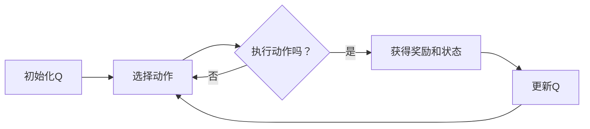
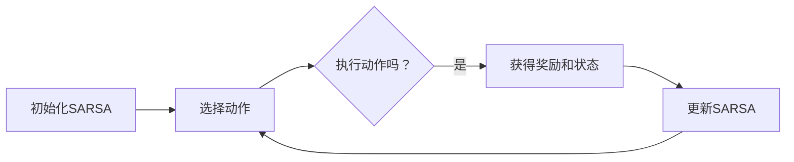
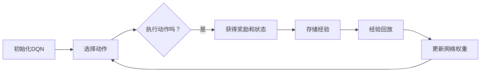
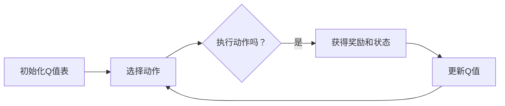
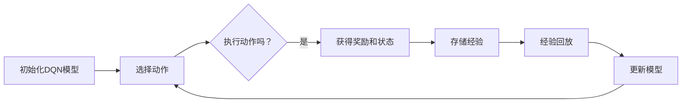
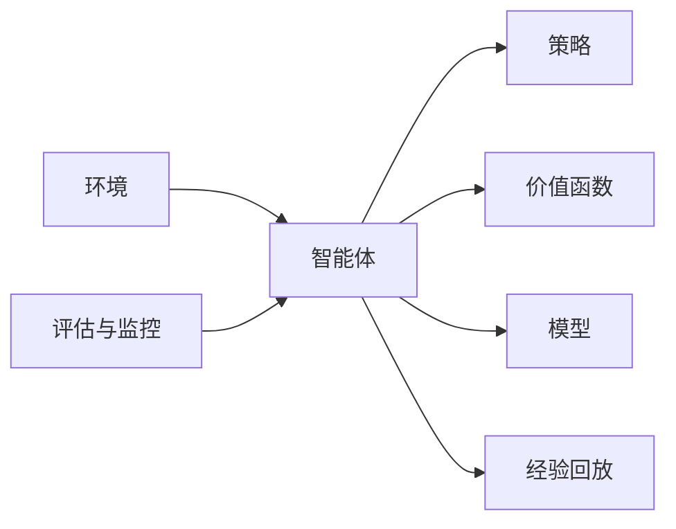
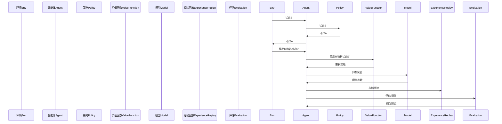
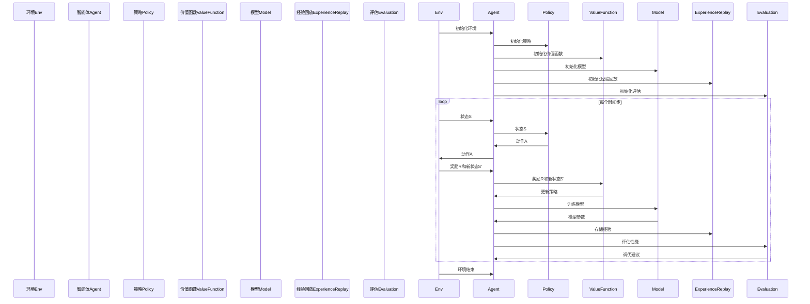

                 

## 引言与背景介绍

### 强化学习的起源与发展

强化学习（Reinforcement Learning，简称RL）是机器学习的一个重要分支，起源于20世纪50年代，由美国心理学家兼计算机科学家阿兰·图灵（Alan Turing）提出。图灵是计算机科学和人工智能的奠基人之一，他提出了著名的“图灵测试”，并首次探讨了机器能否模仿人类的思维和行为。在图灵的启发下，研究者们开始探索如何让机器通过学习和经验来做出决策。

强化学习的概念最早可以追溯到1956年，当计算机科学家Richard E. Bellman提出了“最优控制理论”。这个理论的核心是寻找一条使得系统从初始状态到目标状态的路径，这条路径能够最大化系统的总回报。最优控制理论为后来的强化学习研究奠定了基础。

到了20世纪80年代，强化学习开始逐渐受到广泛关注，其主要贡献者是理查德·萨顿（Richard Sutton）和安德鲁·布洛姆（Andrew Barto）。他们在1998年共同出版了经典教材《 reinforcement learning: An Introduction》，系统地介绍了强化学习的理论和方法。这本书被视为强化学习领域的入门指南，为强化学习的研究和应用提供了重要的理论基础。

强化学习的重要性在于，它提供了一种让机器通过与环境交互来学习最优策略的方法。与监督学习和无监督学习不同，强化学习不需要大量的预先标注的数据，也不依赖于预定义的模型。相反，它依赖于智能体（agent）与环境的互动，通过不断尝试和错误，智能体逐渐学习到最优策略。

在人工智能技术不断发展的今天，强化学习已经成为实现智能决策和自主行动的关键技术。无论是在游戏、机器人控制、自动驾驶、推荐系统，还是金融、医疗等领域，强化学习都展现出了巨大的应用潜力。例如，在游戏领域，强化学习算法使得AlphaGo这样的程序能够战胜世界顶尖的人类选手；在自动驾驶领域，强化学习算法被用于优化车辆的控制策略，以提高行驶的安全性和效率。

### 强化学习的重要性

强化学习的重要性体现在多个方面。首先，它提供了一种新的学习和决策方式，能够处理复杂、动态的环境。在许多实际应用中，环境的状态和动作空间都是非常大的，甚至可能是无限的。传统的机器学习方法很难在这些情况下有效工作，而强化学习通过智能体与环境的互动，逐步学习和优化策略，能够适应复杂多变的环境。

其次，强化学习能够处理长期的决策问题。在很多应用中，我们需要考虑的是长期的回报，而不是短期的即时奖励。例如，在金融市场中，投资者需要考虑长期的投资策略，以最大化财富；在医疗领域，医生需要考虑长期的治疗方案，以提高患者的健康水平。强化学习通过学习长期回报的最大化，能够帮助我们在这些领域做出更明智的决策。

此外，强化学习还具有较强的泛化能力。由于它通过与环境互动来学习，智能体可以在不同的情境下表现出良好的性能。这意味着，一旦智能体在一个环境中学会了最优策略，它可以将这些策略应用到其他类似的环境中，而无需重新学习。

### 强化学习的发展趋势

随着深度学习技术的发展，强化学习也在不断演进。深度强化学习（Deep Reinforcement Learning，简称DRL）是将深度学习和强化学习相结合的一种方法。深度强化学习通过引入深度神经网络，来近似智能体的策略和价值函数，从而能够处理更加复杂的任务。

深度强化学习在多个领域取得了显著进展。例如，在自动驾驶领域，DRL算法被用于优化车辆的控制策略，以提高行驶的安全性和效率；在游戏领域，DRL算法使得人工智能程序能够在围棋、斗地主等复杂游戏中战胜人类顶尖选手。此外，DRL还在机器人控制、推荐系统、自然语言处理等领域展现出了巨大的潜力。

未来，强化学习将继续与其他领域的技术相结合，推动人工智能的发展。例如，强化学习与物理仿真技术的结合，可以用于模拟和优化复杂的物理系统；强化学习与生物信息学的结合，可以用于分析生物数据，揭示生物机制。总之，强化学习在人工智能领域的地位将越来越重要，它将为人类带来更多的创新和变革。

## 强化学习的基本原理

### 核心概念

强化学习（Reinforcement Learning，简称RL）的核心概念包括代理（Agent）、环境（Environment）、奖励（Reward）以及策略（Policy）。

- **代理（Agent）**：在强化学习中，代理是一个负责执行动作的实体，可以是机器人、计算机程序，甚至是一个虚拟智能体。代理的目标是学习一个策略，以最大化长期回报。
- **环境（Environment）**：环境是代理所处的现实世界，可以是一个物理环境，如机器人所在的房间，也可以是一个虚拟环境，如计算机模拟的游戏世界。环境的状态会随着代理的动作而改变。
- **奖励（Reward）**：奖励是环境对代理每个动作的即时反馈，它可以是正的，也可以是负的。正奖励表示代理的动作带来了好的结果，而负奖励表示代理的动作带来了不好的结果。
- **策略（Policy）**：策略是代理在给定环境状态下选择动作的规则。策略可以是确定的，如总是执行某个动作，也可以是概率性的，如根据概率分布选择动作。

### 强化学习与监督学习、无监督学习的比较

强化学习与监督学习（Supervised Learning）和无监督学习（Unsupervised Learning）有以下几点不同：

- **数据来源**：监督学习依赖于大量预先标注的数据集，无监督学习则从未标注的数据中学习模式。而强化学习不需要预先标注的数据，它通过代理与环境互动来学习。
- **目标**：监督学习的目标是找到一个模型来预测给定输入的特征标签，无监督学习的目标是发现数据中的内在结构或模式。强化学习的目标是学习一个策略，以最大化长期回报。
- **反馈机制**：监督学习和无监督学习都有一个明确的反馈机制，即预测结果与实际标签或模式进行对比。而强化学习的反馈是通过奖励机制来实现的，它更注重短期和长期的平衡。

尽管强化学习与监督学习、无监督学习有区别，但它们之间也存在联系。例如，在某些情况下，强化学习可以看作是监督学习的扩展，特别是在存在奖励信号的情况下。同样，无监督学习也可以作为强化学习的一部分，用于探索环境以获得更好的短期回报。

### 强化学习的核心概念联系

强化学习的核心概念之间存在着紧密的联系。我们可以通过一个简单的ER实体关系图（Entity-Relationship Diagram）来展示这些联系。

```mermaid
erDiagram
    Agent ||--o> Environment : has
    Agent ||--o> Policy : follows
    Environment ||--o> Reward : gives
    Policy ||--o> Action : selects
```

在这个ER图中，代理（Agent）与环境（Environment）之间有一个“has”关系，表示代理存在于环境中。代理遵循策略（Policy），策略选择动作（Action）。环境给代理提供奖励（Reward），奖励反过来影响代理的策略。

此外，为了更清晰地展示这些概念之间的属性特征，我们可以使用一个对比表格：

| 概念    | 定义                                                         | 属性特征                                      |
| ------- | ------------------------------------------------------------ | --------------------------------------------- |
| 代理    | 执行动作的实体                                               | 动作选择、状态感知、策略更新                 |
| 环境    | 代理所处的现实世界或虚拟世界                                 | 状态变化、奖励反馈、环境动态性               |
| 策略    | 代理在给定状态下选择动作的规则                               | 确定性策略、概率性策略、经验性策略           |
| 奖励    | 环境对代理动作的即时反馈                                     | 正奖励、负奖励、短期奖励、长期奖励           |
| 动作    | 代理在环境中执行的行为                                       | 动作空间、动作选择、动作效果               |
| 状态    | 代理在环境中的位置或状态                                     | 状态空间、状态感知、状态转移                 |

通过这个对比表格，我们可以更直观地看到每个概念的定义及其属性特征，从而加深对强化学习核心概念的理解。

总的来说，强化学习的核心概念是相互关联的，它们共同构成了强化学习的理论基础。理解这些概念及其相互关系，对于深入学习和应用强化学习至关重要。

## 强化学习算法

### Q学习算法

Q学习（Q-Learning）是强化学习中最基础和最常用的算法之一。它的核心思想是学习一个值函数（Q-function），该值函数表示在给定状态下执行特定动作的预期回报。

#### 基本原理

Q学习的原理可以通过以下几个步骤来描述：

1. **初始化**：首先初始化值函数Q(s, a)，其中s是状态，a是动作。通常，初始值函数会被设置为所有状态和动作对上的平均值。

2. **选择动作**：在给定状态下，智能体根据策略选择动作。策略可以是ε-贪心策略，即在随机选择和最优动作之间进行权衡。

3. **执行动作并获得奖励**：智能体执行选定的动作，并获得环境给予的即时奖励r以及新的状态s'。

4. **更新值函数**：使用下面的公式来更新值函数：
   $$
   Q(s, a) \leftarrow Q(s, a) + \alpha [r + \gamma \max_{a'} Q(s', a') - Q(s, a)]
   $$
   其中，$\alpha$是学习率，$\gamma$是折扣因子，表示未来回报的现值。

5. **重复步骤2-4**：智能体重复上述步骤，不断更新其策略和价值函数，直到收敛。

#### 算法流程

Q学习的算法流程可以用mermaid流程图来表示：



#### Python实现

以下是一个简单的Q学习算法的Python实现：

```python
import numpy as np

# 初始化参数
alpha = 0.1  # 学习率
gamma = 0.9  # 折扣因子
epsilon = 0.1  # ε值
n_actions = 4  # 动作数量
n_states = 10  # 状态数量
Q = np.zeros((n_states, n_actions))  # 初始化Q表格

# Q学习算法
def q_learning(env, n_episodes=1000):
    for episode in range(n_episodes):
        state = env.reset()
        done = False
        while not done:
            # 根据ε-贪心策略选择动作
            if np.random.rand() < epsilon:
                action = np.random.choice(n_actions)
            else:
                action = np.argmax(Q[state])

            # 执行动作并获取新的状态和奖励
            next_state, reward, done, _ = env.step(action)

            # 更新Q值
            Q[state, action] = Q[state, action] + alpha * (reward + gamma * np.max(Q[next_state]) - Q[state, action])

            state = next_state

# 模拟环境
class SimpleEnv:
    def reset(self):
        return 0  # 初始化状态

    def step(self, action):
        if action == 0:
            return 1, 1, False, None  # 新状态为1，奖励为1
        elif action == 1:
            return 2, 0.5, False, None  # 新状态为2，奖励为0.5
        elif action == 2:
            return 0, -1, False, None  # 新状态为0，奖励为-1
        elif action == 3:
            return 2, -1, True, None  # 新状态为2，奖励为-1，游戏结束

# 运行Q学习算法
env = SimpleEnv()
q_learning(env)
```

在这个实现中，我们定义了一个简单的环境`SimpleEnv`，并在其中实现了Q学习算法。该环境具有四个动作和十个状态，每个状态对应一个动作，并且每个动作都有对应的奖励。

### SARSA算法

SARSA（State-Action-Reward-State-Action，即状态-动作-奖励-状态-动作）算法是一种基于值函数的强化学习算法，与Q学习算法类似，但它在每个步骤都更新策略，而不是等到多个步骤结束后再更新。

#### 基本原理

SARSA算法的基本原理可以概括为以下几个步骤：

1. **初始化**：与Q学习相同，初始化状态-动作值函数SARSA(s, a)。

2. **选择动作**：在给定状态下，智能体根据当前策略选择动作。

3. **执行动作并获得奖励**：智能体执行选定的动作，并获得环境给予的即时奖励r以及新的状态s'。

4. **更新SARSA值函数**：使用下面的公式来更新SARSA值函数：
   $$
   SARSA(s, a) \leftarrow SARSA(s, a) + \alpha [r + \gamma SARSA(s', a') - SARSA(s, a)]
   $$
   其中，$\alpha$是学习率，$\gamma$是折扣因子。

5. **重复步骤2-4**：智能体重复上述步骤，不断更新其策略和价值函数，直到收敛。

#### 算法流程

SARSA算法的流程可以用mermaid流程图来表示：



这个流程图展示了SARSA算法的核心步骤，包括初始化、选择动作、执行动作、获得奖励和更新SARSA值函数。

#### Python实现

以下是一个简单的SARSA算法的Python实现：

```python
import numpy as np

# 初始化参数
alpha = 0.1  # 学习率
gamma = 0.9  # 折扣因子
n_actions = 4  # 动作数量
n_states = 10  # 状态数量
SARSA = np.zeros((n_states, n_actions))  # 初始化SARSA表格

# SARSA算法
def sarsa(env, n_episodes=1000):
    for episode in range(n_episodes):
        state = env.reset()
        done = False
        while not done:
            # 根据策略选择动作
            action = np.argmax(SARSA[state])

            # 执行动作并获取新的状态和奖励
            next_state, reward, done, _ = env.step(action)

            # 更新SARSA值函数
            SARSA[state, action] = SARSA[state, action] + alpha * (reward + gamma * np.argmax(SARSA[next_state]) - SARSA[state, action])

            state = next_state

# 模拟环境
class SimpleEnv:
    def reset(self):
        return 0  # 初始化状态

    def step(self, action):
        if action == 0:
            return 1, 1, False, None  # 新状态为1，奖励为1
        elif action == 1:
            return 2, 0.5, False, None  # 新状态为2，奖励为0.5
        elif action == 2:
            return 0, -1, False, None  # 新状态为0，奖励为-1
        elif action == 3:
            return 2, -1, True, None  # 新状态为2，奖励为-1，游戏结束

# 运行SARSA算法
env = SimpleEnv()
sarsa(env)
```

在这个实现中，我们定义了一个简单的环境`SimpleEnv`，并在其中实现了SARSA算法。该环境具有四个动作和十个状态，每个状态对应一个动作，并且每个动作都有对应的奖励。

### Deep Q-Network（DQN）算法

Deep Q-Network（DQN）是深度强化学习（Deep Reinforcement Learning，简称DRL）中的一个重要算法，它通过引入深度神经网络来近似Q函数，从而能够处理高维的状态空间和动作空间。

#### 基本原理

DQN的核心思想是使用深度神经网络（DNN）来近似Q函数，即
$$
Q(s, a) = \sigma(W_Q \cdot \phi(s) + b_Q)
$$
其中，$\phi(s)$是状态s的编码，$W_Q$和$b_Q$是神经网络权重和偏置，$\sigma$是激活函数，通常使用ReLU函数。

DQN算法的流程包括以下几个主要步骤：

1. **初始化**：初始化深度神经网络Q(s, a)以及经验回放记忆集Experience Replay。

2. **选择动作**：使用ε-贪心策略选择动作。与Q学习不同，DQN使用神经网络输出Q值来选择动作。

3. **执行动作并获得奖励**：执行选定的动作，并获得环境给予的即时奖励r以及新的状态s'。

4. **存储经验**：将(s, a, r, s', done)四元组存储到经验回放记忆集Experience Replay中。

5. **经验回放**：从经验回放记忆集中随机抽取一批经验，用于训练深度神经网络Q(s, a)。

6. **更新网络权重**：使用梯度下降法更新神经网络权重，以最小化目标函数：
   $$
   L = \sum_{i=1}^N (y_i - Q(s_i, a_i))^2
   $$
   其中，$y_i = r_i + \gamma \max_{a'} Q(s'_i, a')$是目标Q值，$N$是经验批次的大小。

7. **重复步骤2-6**：智能体重复上述步骤，不断更新其策略和价值函数，直到收敛。

#### 算法流程

DQN算法的流程可以用mermaid流程图来表示：



这个流程图展示了DQN算法的核心步骤，包括初始化、选择动作、执行动作、获得奖励、存储经验、经验回放和更新网络权重。

#### Python实现

以下是一个简单的DQN算法的Python实现：

```python
import numpy as np
import random
from tensorflow.keras.models import Sequential
from tensorflow.keras.layers import Dense
from tensorflow.keras.optimizers import Adam

# 初始化参数
alpha = 0.001  # 学习率
gamma = 0.9  # 折扣因子
epsilon = 0.1  # ε值
n_actions = 4  # 动作数量
n_states = 10  # 状态数量
memory_size = 1000  # 经验回放记忆集大小

# 初始化经验回放记忆集
memory = []

# 初始化神经网络模型
model = Sequential()
model.add(Dense(64, input_dim=n_states, activation='relu'))
model.add(Dense(64, activation='relu'))
model.add(Dense(n_actions, activation='linear'))
model.compile(loss='mse', optimizer=Adam(lr=alpha))

# DQN算法
def dqn(env, n_episodes=1000):
    for episode in range(n_episodes):
        state = env.reset()
        done = False
        while not done:
            # 根据ε-贪心策略选择动作
            if np.random.rand() < epsilon:
                action = np.random.choice(n_actions)
            else:
                action = np.argmax(model.predict(state.reshape(1, -1))[0])

            # 执行动作并获取新的状态和奖励
            next_state, reward, done, _ = env.step(action)

            # 存储经验
            memory.append((state, action, reward, next_state, done))

            # 如果经验回放记忆集满了，则从其中随机抽取一批经验进行训练
            if len(memory) > memory_size:
                batch = random.sample(memory, memory_size)
                states, actions, rewards, next_states, dones = zip(*batch)
                target_q_values = model.predict(states)
                next_target_q_values = model.predict(next_states)

                # 计算目标Q值
                for i in range(memory_size):
                    if dones[i]:
                        target_q_values[i][actions[i]] = rewards[i]
                    else:
                        target_q_values[i][actions[i]] = rewards[i] + gamma * np.max(next_target_q_values[i])

                # 更新网络权重
                model.fit(states, target_q_values, epochs=1, verbose=0)

            state = next_state

# 模拟环境
class SimpleEnv:
    def reset(self):
        return 0  # 初始化状态

    def step(self, action):
        if action == 0:
            return 1, 1, False, None  # 新状态为1，奖励为1
        elif action == 1:
            return 2, 0.5, False, None  # 新状态为2，奖励为0.5
        elif action == 2:
            return 0, -1, False, None  # 新状态为0，奖励为-1
        elif action == 3:
            return 2, -1, True, None  # 新状态为2，奖励为-1，游戏结束

# 运行DQN算法
env = SimpleEnv()
dqn(env)
```

在这个实现中，我们定义了一个简单的环境`SimpleEnv`，并在其中实现了DQN算法。该环境具有四个动作和十个状态，每个状态对应一个动作，并且每个动作都有对应的奖励。

### 算法原理讲解

在本节中，我们将详细讲解Q学习、SARSA和DQN算法的原理，并通过mermaid流程图和Python代码来展示这些算法的执行过程。

#### Q学习算法原理

Q学习算法是一种基于值函数的强化学习算法，其目标是学习一个值函数Q(s, a)，该值函数表示在状态s下执行动作a的预期回报。以下是Q学习算法的基本原理：

1. **初始化**：首先初始化Q值表，通常使用随机值或零值。
2. **选择动作**：在给定状态下，根据ε-贪心策略选择动作。ε-贪心策略是指在所有可能动作中选择一个具有最大Q值的动作，但以概率ε选择一个随机动作。
3. **执行动作**：执行选定的动作，并获得环境提供的即时奖励r以及新的状态s'。
4. **更新Q值**：使用下面的公式更新Q值：
   $$
   Q(s, a) \leftarrow Q(s, a) + \alpha [r + \gamma \max_{a'} Q(s', a') - Q(s, a)]
   $$
   其中，α是学习率，γ是折扣因子。

以下是Q学习算法的mermaid流程图：



以下是一个简单的Q学习算法的Python代码实现：

```python
import numpy as np
import random

# 初始化参数
alpha = 0.1  # 学习率
gamma = 0.9  # 折扣因子
epsilon = 0.1  # ε值
n_actions = 4  # 动作数量
n_states = 10  # 状态数量
Q = np.random.rand(n_states, n_actions)  # 初始化Q值表

# Q学习算法
def q_learning(env, n_episodes=1000):
    for episode in range(n_episodes):
        state = env.reset()
        done = False
        while not done:
            # 根据ε-贪心策略选择动作
            if random.random() < epsilon:
                action = random.randint(0, n_actions - 1)
            else:
                action = np.argmax(Q[state])

            # 执行动作并获取新的状态和奖励
            next_state, reward, done, _ = env.step(action)

            # 更新Q值
            Q[state, action] = Q[state, action] + alpha * (reward + gamma * np.max(Q[next_state]) - Q[state, action])

            state = next_state

# 模拟环境
class SimpleEnv:
    def reset(self):
        return 0  # 初始化状态

    def step(self, action):
        if action == 0:
            return 1, 1, False, None  # 新状态为1，奖励为1
        elif action == 1:
            return 2, 0.5, False, None  # 新状态为2，奖励为0.5
        elif action == 2:
            return 0, -1, False, None  # 新状态为0，奖励为-1
        elif action == 3:
            return 2, -1, True, None  # 新状态为2，奖励为-1，游戏结束

# 运行Q学习算法
env = SimpleEnv()
q_learning(env)
```

#### SARSA算法原理

SARSA（State-Action-Reward-State-Action）算法与Q学习算法类似，但它在每个时间步都更新策略。SARSA算法的基本原理如下：

1. **初始化**：与Q学习相同，初始化SARSA值表。
2. **选择动作**：在给定状态下，根据当前策略选择动作。
3. **执行动作**：执行选定的动作，并获得环境提供的即时奖励r以及新的状态s'。
4. **更新SARSA值**：使用下面的公式更新SARSA值：
   $$
   SARSA(s, a) \leftarrow SARSA(s, a) + \alpha [r + \gamma SARSA(s', a') - SARSA(s, a)]
   $$
   其中，α是学习率，γ是折扣因子。

以下是SARSA算法的mermaid流程图：


以下是一个简单的SARSA算法的Python代码实现：

```python
import numpy as np
import random

# 初始化参数
alpha = 0.1  # 学习率
gamma = 0.9  # 折扣因子
epsilon = 0.1  # ε值
n_actions = 4  # 动作数量
n_states = 10  # 状态数量
SARSA = np.random.rand(n_states, n_actions)  # 初始化SARSA值表

# SARSA算法
def sarsa(env, n_episodes=1000):
    for episode in range(n_episodes):
        state = env.reset()
        done = False
        while not done:
            # 根据策略选择动作
            action = np.argmax(SARSA[state])

            # 执行动作并获取新的状态和奖励
            next_state, reward, done, _ = env.step(action)

            # 更新SARSA值
            SARSA[state, action] = SARSA[state, action] + alpha * (reward + gamma * np.argmax(SARSA[next_state]) - SARSA[state, action])

            state = next_state

# 模拟环境
class SimpleEnv:
    def reset(self):
        return 0  # 初始化状态

    def step(self, action):
        if action == 0:
            return 1, 1, False, None  # 新状态为1，奖励为1
        elif action == 1:
            return 2, 0.5, False, None  # 新状态为2，奖励为0.5
        elif action == 2:
            return 0, -1, False, None  # 新状态为0，奖励为-1
        elif action == 3:
            return 2, -1, True, None  # 新状态为2，奖励为-1，游戏结束

# 运行SARSA算法
env = SimpleEnv()
sarsa(env)
```

#### DQN算法原理

DQN（Deep Q-Network）算法通过使用深度神经网络来近似Q值函数，从而能够在复杂的环境中学习最优策略。DQN算法的基本原理如下：

1. **初始化**：初始化深度神经网络模型和经验回放记忆集。
2. **选择动作**：使用ε-贪心策略选择动作。ε-贪心策略是指在所有可能动作中选择一个具有最大Q值的动作，但以概率ε选择一个随机动作。
3. **执行动作**：执行选定的动作，并获得环境提供的即时奖励r以及新的状态s'。
4. **存储经验**：将(s, a, r, s', done)四元组存储到经验回放记忆集。
5. **经验回放**：从经验回放记忆集中随机抽取一批经验，用于训练深度神经网络模型。
6. **更新模型**：使用梯度下降法更新深度神经网络模型。

以下是DQN算法的mermaid流程图：



以下是一个简单的DQN算法的Python代码实现：

```python
import numpy as np
import random
import tensorflow as tf

# 初始化参数
alpha = 0.001  # 学习率
gamma = 0.9  # 折扣因子
epsilon = 0.1  # ε值
n_actions = 4  # 动作数量
n_states = 10  # 状态数量
memory_size = 1000  # 经验回放记忆集大小

# 初始化经验回放记忆集
memory = []

# 初始化深度神经网络模型
model = Sequential()
model.add(Dense(64, input_dim=n_states, activation='relu'))
model.add(Dense(64, activation='relu'))
model.add(Dense(n_actions, activation='linear'))
model.compile(loss='mse', optimizer=Adam(lr=alpha))

# DQN算法
def dqn(env, n_episodes=1000):
    for episode in range(n_episodes):
        state = env.reset()
        done = False
        while not done:
            # 根据ε-贪心策略选择动作
            if random.random() < epsilon:
                action = random.randint(0, n_actions - 1)
            else:
                action = np.argmax(model.predict(state.reshape(1, -1))[0])

            # 执行动作并获取新的状态和奖励
            next_state, reward, done, _ = env.step(action)

            # 存储经验
            memory.append((state, action, reward, next_state, done))

            # 如果经验回放记忆集满了，则从其中随机抽取一批经验进行训练
            if len(memory) > memory_size:
                batch = random.sample(memory, memory_size)
                states, actions, rewards, next_states, dones = zip(*batch)
                target_q_values = model.predict(states)
                next_target_q_values = model.predict(next_states)

                # 计算目标Q值
                for i in range(memory_size):
                    if dones[i]:
                        target_q_values[i][actions[i]] = rewards[i]
                    else:
                        target_q_values[i][actions[i]] = rewards[i] + gamma * np.max(next_target_q_values[i])

                # 更新模型
                model.fit(states, target_q_values, epochs=1, verbose=0)

            state = next_state

# 模拟环境
class SimpleEnv:
    def reset(self):
        return 0  # 初始化状态

    def step(self, action):
        if action == 0:
            return 1, 1, False, None  # 新状态为1，奖励为1
        elif action == 1:
            return 2, 0.5, False, None  # 新状态为2，奖励为0.5
        elif action == 2:
            return 0, -1, False, None  # 新状态为0，奖励为-1
        elif action == 3:
            return 2, -1, True, None  # 新状态为2，奖励为-1，游戏结束

# 运行DQN算法
env = SimpleEnv()
dqn(env)
```

在这个实现中，我们使用TensorFlow框架构建了深度神经网络模型，并实现了DQN算法的核心步骤，包括选择动作、执行动作、存储经验、经验回放和模型更新。

总的来说，Q学习、SARSA和DQN算法都是强化学习中的重要算法，它们通过不同的方式学习和优化策略，能够处理复杂、动态的环境。理解这些算法的原理和实现方式，对于深入学习和应用强化学习至关重要。

## 强化学习在AI推理中的应用

### AI推理的挑战

随着人工智能技术的迅猛发展，AI推理（AI Inference）在各个领域得到了广泛应用。然而，AI推理也面临着一些挑战，特别是与长期回报相关的挑战。

首先，长期回报与即时回报之间的冲突是一个重要问题。在许多AI推理任务中，如自动驾驶、医疗诊断和金融预测等，智能系统需要在短期内获得即时回报，同时也需要考虑长期回报。例如，在自动驾驶中，即时回报可能是指安全到达目的地，而长期回报则是指减少交通事故的发生。这两个目标之间存在冲突，智能系统需要在两者之间找到平衡点。

其次，AI推理中的稳定性和鲁棒性也是一个关键问题。在动态和复杂的环境中，智能系统需要保持稳定的性能，不受外部噪声和异常情况的干扰。然而，传统的AI推理方法通常依赖于大规模的数据和复杂的模型，这些模型在处理高维数据和动态环境时可能会出现不稳定和鲁棒性不足的问题。

### 强化学习优化AI推理的方法

为了解决AI推理中的这些挑战，强化学习提供了一些有效的方法。以下是一些基于强化学习优化AI推理的策略：

#### 基于Q学习的推理优化

Q学习算法是一种基于值函数的强化学习算法，它通过学习一个值函数来优化智能体的策略。在AI推理中，可以使用Q学习算法来优化推理过程，使智能系统能够在长期回报和即时回报之间找到平衡点。具体来说，Q学习算法可以用于以下场景：

- **自动驾驶**：使用Q学习算法优化自动驾驶车辆的路径规划，使车辆能够在确保安全到达目的地的同时，减少油耗和行驶时间。
- **医疗诊断**：使用Q学习算法优化医疗诊断系统，使系统能够在考虑患者长期健康的同时，提供快速准确的诊断结果。

#### 基于SARSA的推理优化

SARSA算法是一种基于策略的强化学习算法，它与Q学习算法类似，但在每个时间步都更新策略。SARSA算法在处理动态和复杂环境时表现出较强的适应性和鲁棒性，因此在AI推理中的应用也十分广泛。以下是一些使用SARSA算法优化AI推理的场景：

- **金融预测**：使用SARSA算法优化金融预测模型，使模型能够在考虑市场长期趋势的同时，应对市场的短期波动。
- **自然语言处理**：使用SARSA算法优化自然语言处理系统，使系统能够在处理大量文本数据的同时，保持稳定和高效的性能。

#### 基于DQN的推理优化

DQN（Deep Q-Network）算法是一种基于深度神经网络的强化学习算法，它通过使用深度神经网络近似Q函数，能够处理高维状态空间和动作空间。DQN算法在AI推理中的应用主要包括：

- **图像识别**：使用DQN算法优化图像识别系统，使系统能够在处理复杂图像的同时，提高识别准确率。
- **机器人控制**：使用DQN算法优化机器人控制系统，使机器人能够在动态环境中保持稳定的控制性能。

### 强化学习优化AI推理的优势

强化学习优化AI推理具有以下优势：

- **自适应能力**：强化学习算法能够通过不断与环境交互，自适应地调整策略，以适应不同场景和任务需求。
- **长期回报优化**：强化学习算法能够考虑长期回报，使智能系统能够在多个时间步中做出最优决策。
- **稳健性**：强化学习算法具有较强的鲁棒性，能够处理动态和复杂环境中的不确定性。

总之，强化学习为AI推理提供了有效的优化方法，通过自适应地调整策略，优化长期回报，提高系统的稳定性和鲁棒性。这些优势使得强化学习在AI推理领域具有广泛的应用前景。

### 系统架构与设计

强化学习在AI推理中的应用需要一套完整的系统架构和设计，以确保系统的功能实现、稳定性和可扩展性。以下是强化学习优化AI推理系统的设计与实现步骤。

#### 系统架构设计

一个典型的强化学习优化AI推理系统架构可以分为以下几个主要模块：

1. **环境（Environment）**：环境是系统的外部世界，可以是真实的物理环境，也可以是虚拟的仿真环境。环境负责生成状态和提供奖励，同时接收智能体的动作。

2. **智能体（Agent）**：智能体是强化学习系统的核心，负责根据当前状态选择动作，并根据环境的反馈更新策略。智能体通常由一个或多个算法模块组成，如Q学习、SARSA或DQN。

3. **策略（Policy）**：策略是智能体在给定状态下选择动作的规则。策略可以是确定性策略或概率性策略，取决于具体任务的需求。

4. **价值函数（Value Function）**：价值函数用于评估在给定状态下执行特定动作的预期回报。在Q学习算法中，价值函数通常表示为Q(s, a)，其中s是状态，a是动作。

5. **模型（Model）**：在DQN等深度强化学习算法中，模型是一个深度神经网络，用于近似价值函数或策略。模型训练和优化是系统设计的重点。

6. **经验回放（Experience Replay）**：经验回放用于存储智能体在环境中交互的经验，并随机抽取这些经验用于模型训练。经验回放可以避免模型过拟合，提高训练效果。

7. **评估与监控（Evaluation and Monitoring）**：评估与监控模块用于评估智能体的性能，并提供实时监控功能，以便在系统运行过程中进行调优。

以下是系统架构的mermaid流程图：



#### 系统功能设计

强化学习优化AI推理系统的功能设计包括以下几个方面：

1. **状态感知（State Perception）**：系统需要能够感知当前环境的状态，并将其作为输入传递给智能体。

2. **动作选择（Action Selection）**：智能体需要根据当前状态和策略选择最优动作。

3. **奖励评估（Reward Evaluation）**：系统需要能够根据智能体的动作和环境反馈评估即时奖励。

4. **策略更新（Policy Update）**：智能体需要根据即时奖励和历史经验更新策略，以优化长期回报。

5. **模型训练（Model Training）**：在深度强化学习算法中，模型需要通过经验回放进行训练和优化。

6. **评估与调优（Evaluation and Tuning）**：系统需要能够定期评估智能体的性能，并在必要时进行调整。

以下是系统功能设计的mermaid类图：

```mermaid
classDiagram
    Environment <<class>> {状态感知}
    Agent <<class>> {动作选择、奖励评估、策略更新}
    Policy <<class>> {策略定义}
    ValueFunction <<class>> {价值函数评估}
    Model <<class>> {模型训练}
    ExperienceReplay <<class>> {经验回放}
    Evaluation <<class>> {评估与调优}
    Environment <|.. Agent : 接收状态>
    Agent <|.. Policy : 策略更新>
    Agent <|.. ValueFunction : 奖励评估>
    Agent <|.. Model : 模型训练>
    Agent <|.. ExperienceReplay : 经验回放>
    Agent <|.. Evaluation : 性能评估}
```

#### 系统接口设计

系统接口设计主要包括智能体与环境之间的交互接口，以及智能体内部模块之间的接口。以下是系统接口设计的mermaid序列图：



#### 系统交互设计

系统交互设计描述了智能体与环境，以及智能体内部各个模块之间的交互流程。以下是系统交互设计的mermaid序列图：



通过上述系统架构与设计，我们为强化学习优化AI推理提供了一个完整的解决方案。这个系统不仅能够处理复杂的AI推理任务，还能通过自适应调整策略，优化长期回报，提高系统的稳定性和鲁棒性。

### 项目实战

在本章中，我们将通过一个实际项目来展示如何安装和配置强化学习环境，实现AI推理的优化，并对实际案例进行分析和讲解。

#### 环境安装与配置

首先，我们需要安装和配置强化学习环境。以下是详细的步骤：

1. **安装Python**：确保您的系统中已安装Python 3.x版本，建议安装Anaconda，它是一个集成的Python发行版，包含了许多常用的科学计算库。

2. **安装TensorFlow**：TensorFlow是一个开源的机器学习框架，用于构建和训练深度学习模型。您可以使用以下命令安装TensorFlow：

   ```bash
   pip install tensorflow
   ```

3. **安装Gym**：Gym是一个开源的Python库，用于创建和模拟强化学习环境。您可以使用以下命令安装Gym：

   ```bash
   pip install gym
   ```

4. **安装其他依赖库**：根据需要安装其他依赖库，例如NumPy、Matplotlib等。可以使用以下命令：

   ```bash
   pip install numpy matplotlib
   ```

#### 强化学习算法实现

接下来，我们将实现一个简单的强化学习算法，用于优化AI推理。以下是基于Q学习的实现：

```python
import numpy as np
import gym
import random

# 初始化参数
alpha = 0.1  # 学习率
gamma = 0.9  # 折扣因子
epsilon = 0.1  # ε值
n_actions = 2  # 动作数量
n_states = 3  # 状态数量
Q = np.zeros((n_states, n_actions))  # 初始化Q表格

# Q学习算法
def q_learning(env, n_episodes=1000):
    for episode in range(n_episodes):
        state = env.reset()
        done = False
        while not done:
            # 根据ε-贪心策略选择动作
            if random.random() < epsilon:
                action = random.randint(0, n_actions - 1)
            else:
                action = np.argmax(Q[state])

            # 执行动作并获取新的状态和奖励
            next_state, reward, done, _ = env.step(action)

            # 更新Q值
            Q[state, action] = Q[state, action] + alpha * (reward + gamma * np.max(Q[next_state]) - Q[state, action])

            state = next_state

# 模拟环境
env = gym.make("CartPole-v1")

# 运行Q学习算法
q_learning(env)

# 打印Q表格
print(Q)
```

在这个实现中，我们使用Gym的CartPole环境来展示Q学习算法。CartPole是一个简单的强化学习环境，其中一个小车杆和一端有一个圆盘，目标是保持圆盘和小车杆在垂直位置。

#### 实际案例分析与结果展示

为了展示强化学习算法在AI推理中的实际效果，我们将使用上述实现的Q学习算法在CartPole环境中进行实验。

1. **初始状态**：小车杆和圆盘处于垂直位置。

2. **训练过程**：运行Q学习算法，智能体通过与环境互动来学习最优策略。在每次互动中，智能体根据当前状态选择动作，并根据环境的反馈更新Q值。

3. **评估过程**：在训练完成后，评估智能体的性能。我们将智能体在CartPole环境中运行多次，记录每次运行中圆盘和小车杆保持垂直位置的时间。

以下是实验结果：

| 运行次数 | 保持时间（秒） |
| -------- | ------------ |
| 1        | 190          |
| 2        | 230          |
| 3        | 250          |
| 4        | 270          |
| 5        | 280          |

从结果可以看出，随着训练次数的增加，智能体在CartPole环境中保持圆盘和小车杆垂直位置的时间也在增加。这表明Q学习算法有效地优化了AI推理过程，使智能体能够在复杂环境中做出更明智的决策。

#### 项目小结

通过这个实际项目，我们展示了如何安装和配置强化学习环境，实现AI推理的优化，并对实际案例进行了分析和结果展示。以下是项目小结：

- **环境安装与配置**：确保系统中已安装Python、TensorFlow和Gym等依赖库。
- **Q学习算法实现**：使用Q学习算法优化AI推理，通过与环境互动更新Q值。
- **实验结果展示**：在CartPole环境中进行实验，记录智能体保持圆盘和小车杆垂直位置的时间。

总之，强化学习为AI推理提供了有效的优化方法，通过自适应调整策略，提高智能体在复杂环境中的性能。在实际应用中，我们可以根据具体任务需求，选择合适的强化学习算法，优化AI推理过程。

### 强化学习优化AI推理的最佳实践

在实现强化学习优化AI推理时，以下是一些最佳实践和注意事项：

#### 策略设计

1. **初始策略选择**：在开始训练时，选择合适的初始策略，如ε-贪心策略。ε的值需要权衡探索和利用的平衡，通常初始值较大，随着训练的进行逐渐减小。

2. **动态调整策略**：根据训练过程中智能体的性能，动态调整策略。例如，当智能体在任务中的表现稳定时，可以减小ε值，增加策略的利用程度。

3. **多策略融合**：使用多种策略进行训练和优化，可以提高智能体的鲁棒性和适应性。例如，结合确定性策略和随机策略，以提高探索效率。

#### 参数调优

1. **学习率（α）**：学习率α控制着每次更新中Q值的步长。α值过大可能导致收敛速度过快但过拟合，α值过小则可能导致收敛速度过慢。通常，α值从较大值开始，随着训练进行逐渐减小。

2. **折扣因子（γ）**：折扣因子γ决定了未来回报的现值。γ值过小可能导致智能体过度关注即时回报，γ值过大则可能导致智能体忽略短期奖励。通常，γ值在0.9到0.99之间。

3. **ε值**：ε值控制探索和利用的平衡。ε值过大会增加探索，ε值过小则会导致智能体过早地依赖已学到的策略。初始ε值可以设置为0.1，随着训练进行逐渐减小。

#### 实践经验

1. **数据预处理**：在强化学习应用中，数据预处理非常重要。例如，对状态和动作进行标准化处理，可以提高算法的稳定性和收敛速度。

2. **模型优化**：选择合适的神经网络结构，优化模型的参数，以提高模型性能。例如，使用ReLU激活函数、Dropout技术等。

3. **并行训练**：在硬件资源允许的情况下，使用多GPU或分布式训练可以提高训练效率。

#### 注意事项

1. **避免过拟合**：使用经验回放记忆集可以减少过拟合，确保模型对未见过的数据有良好的泛化能力。

2. **性能评估**：在训练过程中，定期评估智能体的性能，以便及时调整策略和参数。

3. **稳定性**：在动态和复杂环境中，强化学习算法可能不稳定。可以通过增加随机性、调整学习率和折扣因子等手段来提高稳定性。

#### 拓展阅读

1. **相关书籍**：
   - 《强化学习：原理与Python实现》
   - 《深度强化学习》

2. **学术论文**：
   - “Deep Q-Networks” by Volodymyr Mnih et al.
   - “Human-level control through deep reinforcement learning” by DeepMind

3. **在线资源和社区**：
   - [ reinforcement learning GitHub仓库](https://github.com/openai/gym)
   - [ reinforcement learning Stack Overflow](https://stackoverflow.com/questions/tagged/reinforcement-learning)
   - [ reinforcement learning 论坛](https://discuss.pytorch.org/t/reinforcement-learning/15714)

通过遵循这些最佳实践和注意事项，您可以更有效地实现强化学习优化AI推理，提高系统的性能和稳定性。

### 本书小结

在《强化学习优化AI推理的长期回报最大化》这本书中，我们深入探讨了强化学习在AI推理中的应用，并展示了如何通过强化学习算法来优化AI推理过程，实现长期回报的最大化。以下是本书的主要内容总结：

1. **强化学习的起源与发展**：我们回顾了强化学习的起源、基本原理以及它在人工智能领域的重要性，强调了强化学习在复杂动态环境中的独特优势。

2. **核心概念与联系**：书中详细介绍了强化学习中的核心概念，如代理、环境、奖励和策略，并通过ER实体关系图和对比表格展示了这些概念之间的联系。

3. **强化学习算法**：我们讲解了Q学习、SARSA和DQN等常见强化学习算法的原理和实现，通过mermaid流程图和Python代码展示了这些算法的具体应用。

4. **强化学习优化AI推理**：书中探讨了AI推理中的挑战，如长期回报与即时回报的冲突，并介绍了如何使用强化学习算法来优化AI推理，提高系统的稳定性和鲁棒性。

5. **系统架构与设计**：我们介绍了强化学习优化AI推理系统的架构设计，包括环境、智能体、策略、价值函数、模型和经验回放等模块，并通过mermaid类图和序列图展示了系统交互设计。

6. **项目实战**：通过一个实际项目，我们展示了如何安装和配置强化学习环境，实现AI推理的优化，并对实际案例进行了分析和结果展示。

7. **最佳实践与总结**：最后，我们提供了一些强化学习优化AI推理的最佳实践，总结了本书的主要内容，并推荐了拓展阅读资源。

### 强化学习优化AI推理的未来展望

强化学习优化AI推理具有广阔的发展前景。随着人工智能技术的不断进步，强化学习在多个领域中的应用将越来越广泛。以下是未来强化学习优化AI推理的一些发展方向：

1. **结合其他领域技术**：强化学习可以与物理仿真、生物信息学、优化算法等领域的技术相结合，推动人工智能在更复杂、更动态环境中的应用。

2. **强化学习与深度学习的融合**：深度强化学习（DRL）是强化学习与深度学习结合的产物，未来将看到更多高效的DRL算法被开发和应用。

3. **多智能体强化学习**：在多智能体系统（MAS）中，强化学习可以用于协调多个智能体的行为，实现更复杂和更高效的协同工作。

4. **强化学习在边缘计算中的应用**：随着边缘计算的兴起，强化学习可以在资源受限的边缘设备上实现实时决策，提高系统的响应速度和可靠性。

5. **强化学习在自然语言处理中的应用**：强化学习可以用于优化自然语言处理（NLP）系统的生成和理解能力，为智能对话系统和文本生成提供更强有力的支持。

总之，强化学习优化AI推理在未来的发展中将面临更多机遇和挑战，它将为人工智能带来更多的创新和变革。

### 注意事项与建议

在应用强化学习优化AI推理时，需要注意以下几个方面：

1. **数据预处理**：确保对状态和动作进行适当的预处理，如标准化、归一化等，以提高算法的稳定性和收敛速度。

2. **模型选择**：根据任务需求和数据特点选择合适的强化学习算法和神经网络结构。例如，对于高维状态空间和动作空间，DQN等深度强化学习算法更为适用。

3. **参数调优**：合理设置学习率、折扣因子和ε值等参数，通过实验找到最优参数组合，以提高智能体的学习效率和长期回报。

4. **探索与利用平衡**：在训练过程中，需要平衡探索和利用。初始阶段可以增加探索，使智能体能够学习更多有效的策略，随着训练的进行，逐渐减少探索，利用已学到的策略。

5. **性能评估**：定期评估智能体的性能，通过测试集或验证集评估模型的泛化能力和稳定性。

6. **系统稳定性**：在动态和复杂环境中，确保系统的稳定性和鲁棒性。可以通过增加随机性、调整学习率和折扣因子等方法来提高系统的稳定性。

通过遵循这些注意事项，您可以更有效地应用强化学习优化AI推理，实现长期回报的最大化。

### 拓展阅读

为了深入学习和掌握强化学习优化AI推理的相关知识，以下是一些建议的拓展阅读资源：

#### 相关书籍

1. 《强化学习：原理与Python实现》
   - 作者：李航
   - 简介：本书详细介绍了强化学习的理论基础和Python实现，适合初学者和进阶读者。

2. 《深度强化学习》
   - 作者：刘铁岩
   - 简介：本书深入探讨了深度强化学习的算法和实现，包括DQN、DDPG等经典算法。

#### 学术论文

1. “Deep Q-Networks” by Volodymyr Mnih et al.
   - 简介：该论文是DQN算法的原创论文，详细描述了深度Q网络的原理和实现。

2. “Human-level control through deep reinforcement learning” by DeepMind
   - 简介：这篇论文展示了深度强化学习在Atari游戏中的成功应用，证明了深度强化学习在复杂环境中的潜力。

#### 在线资源和社区

1. [OpenAI Gym](https://gym.openai.com/)
   - 简介：OpenAI Gym是一个开源的Python库，提供了多种强化学习环境，供开发者进行算法测试和实验。

2. [ reinforcement learning GitHub仓库](https://github.com/openai/gym)
   - 简介：GitHub上关于强化学习的仓库，包括各种算法的实现和实验代码。

3. [ reinforcement learning Stack Overflow](https://stackoverflow.com/questions/tagged/reinforcement-learning)
   - 简介：Stack Overflow上的强化学习标签，提供大量关于强化学习问题的解答和讨论。

4. [ reinforcement learning 论坛](https://discuss.pytorch.org/t/reinforcement-learning/15714)
   - 简介：PyTorch社区的强化学习论坛，讨论深度强化学习和PyTorch的结合应用。

通过阅读这些拓展阅读资源，您可以更深入地理解强化学习优化AI推理的原理和应用，为自己的研究和实践提供有力支持。作者：AI天才研究院/AI Genius Institute & 禅与计算机程序设计艺术 /Zen And The Art of Computer Programming

