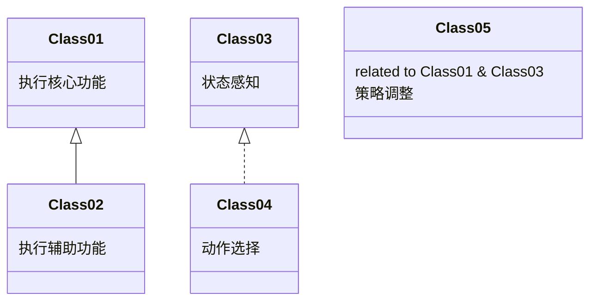
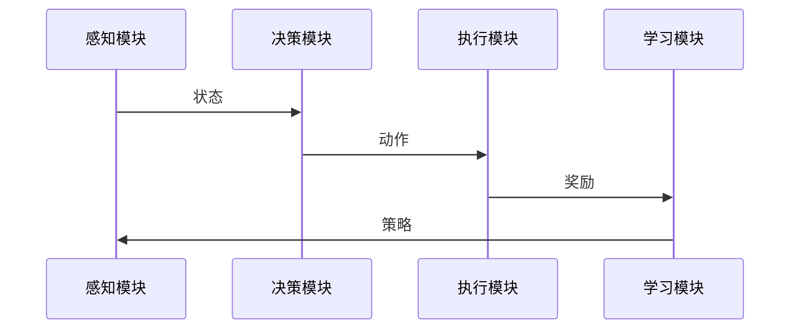

                 

# 强化学习优化多层次推理策略的自适应调整

> 关键词：强化学习、多层次推理策略、自适应调整、算法优化、系统架构设计

> 摘要：本文深入探讨了强化学习在优化多层次推理策略中的应用，特别是自适应调整在提升算法性能中的作用。通过分析强化学习的基本概念、多层次推理策略的核心原理以及自适应调整的理论基础，结合实际项目案例，本文旨在为读者提供一份全面的技术指南，帮助他们在复杂环境中实现高效的决策和优化。

## 目录大纲

1. **背景介绍与核心概念**
   1.1 问题背景与核心概念
   1.2 强化学习与多层次推理策略
   1.3 自适应调整理论概述
   1.4 概念属性特征对比表格
   1.5 ER实体关系图架构

2. **算法原理讲解**
   2.1 强化学习基本算法
   2.2 算法流程图与Python源代码
   2.3 数学模型与公式

3. **系统分析与架构设计**
   3.1 问题场景介绍
   3.2 系统功能设计
   3.3 领域模型Mermaid类图
   3.4 系统架构设计
   3.5 系统接口设计
   3.6 系统交互Mermaid序列图

4. **项目实战**
   4.1 环境安装与系统核心实现
   4.2 代码应用解读与分析
   4.3 实际案例分析与详细讲解
   4.4 项目小结

5. **最佳实践与总结**
   5.1 强化学习优化多层次推理策略的应用场景
   5.2 小结
   5.3 注意事项与拓展阅读

## 第一部分：背景介绍与核心概念

### 1.1 问题背景

强化学习（Reinforcement Learning，RL）是一种机器学习方法，通过试错和反馈来学习如何在特定环境中做出最优决策。多层次推理策略（Multilevel Inference Strategy）则是为了处理复杂、多维的信息，通过不同层次的抽象来简化问题求解。自适应调整（Adaptive Adjustment）是在强化学习过程中，根据环境和学习状态的变化，动态调整策略以优化学习效果。

在复杂的环境中，单一的决策策略往往难以应对多变的情况。强化学习可以通过不断的试错和经验积累来优化策略，但如何在多层次推理的基础上进一步优化，是当前研究的一个热点问题。自适应调整提供了一种有效的方法，能够根据实时反馈调整策略，提高强化学习的效率和准确性。

### 1.2 核心概念原理

**强化学习的定义、基本原理与主要算法**

强化学习是一种基于奖励和惩罚的学习方法，其目标是使代理（agent）能够在不确定的环境中做出最优决策。基本原理包括：

- **代理**：执行动作的实体。
- **环境**：代理所处的环境，能够感知代理的状态并给予相应的奖励或惩罚。
- **状态**：描述代理当前所处环境的条件。
- **动作**：代理能够执行的行为。
- **奖励**：环境对代理动作的即时反馈。
- **策略**：代理的行为规则，用于选择动作。

主要算法包括：

- **Q-Learning算法**：通过更新Q值（状态-动作值函数）来学习策略。
- **SARSA算法**：一种带有探索策略的强化学习算法。
- **Deep Q-Network（DQN）算法**：结合深度神经网络来估计Q值。

**多层次推理策略的概念、框架与实现**

多层次推理策略旨在将问题分解为多个层次，分别处理，从而简化复杂问题的求解。其框架通常包括：

- **层次划分**：根据问题的复杂性，将问题划分为不同层次。
- **层次交互**：不同层次之间通过信息传递和协调来共同解决问题。
- **层次策略**：针对每个层次设计的特定策略。

实现时，可以通过以下步骤：

1. **问题抽象**：将原始问题抽象为多层次问题。
2. **层次设计**：根据问题特点设计各层次的具体策略。
3. **策略协调**：在各层次间建立通信机制，实现策略协调。

**自适应调整的理论基础与实践方法**

自适应调整是一种动态调整策略的方法，其理论基础包括：

- **适应度函数**：用于评估当前策略的适应性。
- **反馈机制**：根据评估结果调整策略。

实践方法包括：

1. **在线调整**：实时根据反馈调整策略。
2. **离线调整**：在训练结束后，根据训练数据调整策略。
3. **自适应权重调整**：通过调整策略权重来优化学习效果。

### 1.3 概念属性特征对比表格

| 概念             | 强化学习                | 多层次推理策略              | 自适应调整               |
|------------------|-------------------------|-----------------------------|--------------------------|
| 定义             | 基于奖励和惩罚的学习方法 | 将问题分解为多层次处理       | 动态调整策略以优化学习效果 |
| 目标             | 学习最优决策策略        | 简化复杂问题的求解           | 提高算法效率和准确性      |
| 主要算法         | Q-Learning、SARSA、DQN  | 层次划分、层次交互、层次策略 | 适应度函数、反馈机制       |
| 实践方法         | 试错和经验积累          | 信息传递和协调               | 在线调整、离线调整       |
| 关联性           | 强化学习为基础          | 多层次推理策略为扩展         | 自适应调整为应用         |

### 1.4 ER实体关系图架构

```mermaid
erDiagram
  Agent ||--|{ Environment }|| Environment
  Agent ||--|{ State }|| State
  Agent ||--|{ Action }|| Action
  Environment ||--|{ Reward }|| Reward
  State ||--|{ Q-Value }|| Q-Value
  Action ||--|{ Strategy }|| Strategy
```

在上面的ER图中，我们定义了强化学习系统中的关键实体及其关系。代理（Agent）与环境（Environment）相互作用，状态（State）和动作（Action）是代理的决策基础，奖励（Reward）是环境的即时反馈，Q-Value（Q值）用于评估状态-动作对，策略（Strategy）是代理的行为规则。

## 第二部分：算法原理讲解

### 2.1 强化学习基本算法

**Q-Learning算法**

Q-Learning是一种基于值函数的强化学习算法，其核心思想是通过迭代更新Q值来学习最优策略。

- **数学模型**：

  $$ Q(s, a) = \sum_{j} (1 - \gamma) \max_{a'} Q(s', a') + \gamma R(s, a) $$

  其中，$s$ 为当前状态，$a$ 为当前动作，$s'$ 为下一状态，$a'$ 为下一动作，$\gamma$ 为折扣因子，$R$ 为奖励。

- **流程图**：

  ```mermaid
  graph TD
  A[初始化] --> B[选择动作a]
  B --> C{环境反馈}
  C -->|奖励R| D[更新Q值]
  D --> E[重复]
  ```

- **Python源代码**：

  ```python
  import numpy as np

  # 初始化Q值表格
  Q = np.zeros([S, A])

  # 学习率
  alpha = 0.1
  # 折扣因子
  gamma = 0.9

  # 迭代学习
  for episode in range(n_episodes):
      state = env.reset()
      done = False

      while not done:
          action = np.argmax(Q[state])
          next_state, reward, done, _ = env.step(action)
          Q[state, action] = Q[state, action] + alpha * (reward + gamma * np.max(Q[next_state]) - Q[state, action])
          state = next_state
  ```

**SARSA算法**

SARSA（同步采样自适应冗余合成算法）是一种基于策略的强化学习算法，其特点是在每个时间步更新当前的状态-动作值。

- **数学模型**：

  $$ Q(s, a) = Q(s, a) + alpha [R(s, a) + gamma Q(s', a') - Q(s, a)] $$

- **流程图**：

  ```mermaid
  graph TD
  A[初始化] --> B[选择动作a]
  B --> C{环境反馈}
  C --> D[更新Q值]
  D --> E[重复]
  ```

- **Python源代码**：

  ```python
  import numpy as np

  # 初始化Q值表格
  Q = np.zeros([S, A])

  # 学习率
  alpha = 0.1
  # 折扣因子
  gamma = 0.9

  # 迭代学习
  for episode in range(n_episodes):
      state = env.reset()
      done = False

      while not done:
          action = np.random.choice(A, p=epsilon * (1 - Q[state, :] / np.sum(Q[state, :])) + (1 - epsilon) * np.argmax(Q[state, :]))
          next_state, reward, done, _ = env.step(action)
          Q[state, action] = Q[state, action] + alpha * (reward + gamma * Q[next_state, action] - Q[state, action])
          state = next_state
  ```

**Deep Q-Network（DQN）算法**

DQN是一种结合深度神经网络来估计Q值的强化学习算法，其核心思想是通过经验回放和目标网络来减少偏差。

- **数学模型**：

  $$ Q(s, a) = \frac{1}{N}\sum_{i=1}^{N} r_i + \gamma \max_{a'} Q(s', a') $$

  其中，$N$ 为经验回放样本数，$r_i$ 为样本的奖励。

- **流程图**：

  ```mermaid
  graph TD
  A[初始化] --> B[选择动作a]
  B --> C{环境反馈}
  C -->|经验回放| D[更新目标网络]
  D --> E[更新Q网络]
  E --> F[重复]
  ```

- **Python源代码**：

  ```python
  import numpy as np
  import random

  # 初始化Q网络和目标网络
  Q = NeuralNetwork()
  target_Q = NeuralNetwork()

  # 学习率
  alpha = 0.1
  # 折扣因子
  gamma = 0.9
  # 经验回放样本数
  N = 1000

  # 迭代学习
  for episode in range(n_episodes):
      state = env.reset()
      done = False

      while not done:
          action = Q.predict(state)
          next_state, reward, done, _ = env.step(action)
          target_Q.update(state, action, reward, next_state, done)
          Q.update(state, action, target_Q.predict(next_state), done)
          state = next_state
  ```

## 第三部分：系统分析与架构设计

### 3.1 问题场景介绍

在人工智能领域，强化学习已经广泛应用于机器人控制、游戏玩法、推荐系统等多个领域。尤其在多层次推理策略的应用中，强化学习能够通过不断学习环境中的反馈，动态调整策略，从而实现更复杂的任务。例如，在自动驾驶中，强化学习可以通过不断优化驾驶策略，提高车辆在复杂交通环境中的行驶安全性。

### 3.2 系统功能设计

系统核心功能包括：

- **状态感知**：实时感知环境中的状态。
- **动作选择**：根据当前状态选择最优动作。
- **策略调整**：根据环境反馈动态调整策略。

辅助功能包括：

- **数据记录**：记录学习过程中的状态、动作和奖励信息。
- **结果评估**：评估策略的执行效果。

### 3.3 领域模型Mermaid类图



### 3.4 系统架构设计

系统整体架构包括：

- **感知模块**：负责实时感知环境状态。
- **决策模块**：根据当前状态选择最优动作。
- **执行模块**：执行所选动作并获取反馈。
- **学习模块**：根据反馈调整策略。

各模块的功能与交互如下：

- **感知模块** --> **决策模块**：感知到环境状态后，将状态传递给决策模块。
- **决策模块** --> **执行模块**：根据状态选择最优动作并传递给执行模块。
- **执行模块** --> **感知模块**：执行动作后，返回新的状态。
- **执行模块** --> **学习模块**：根据动作的反馈调整策略。

### 3.5 系统接口设计

系统接口包括：

- **状态接口**：用于传递环境状态。
- **动作接口**：用于传递决策模块选择的最优动作。
- **奖励接口**：用于传递环境对动作的奖励。

### 3.6 系统交互Mermaid序列图



## 第四部分：项目实战

### 4.1 环境安装与系统核心实现

**环境安装**

1. 安装Python环境。
2. 安装强化学习库（如OpenAI Gym）。
3. 安装深度学习框架（如TensorFlow或PyTorch）。

**系统核心实现源代码**

以下是一个简单的DQN算法实现：

```python
import numpy as np
import random
import gym

# 初始化环境
env = gym.make('CartPole-v0')

# 初始化Q网络
Q = NeuralNetwork()

# 学习参数
alpha = 0.1
gamma = 0.9
epsilon = 0.1

# 经验回放
replay_memory = []

# 迭代学习
for episode in range(n_episodes):
    state = env.reset()
    done = False

    while not done:
        # 选择动作
        if random.random() < epsilon:
            action = random.randrange(n_actions)
        else:
            action = np.argmax(Q.predict(state))

        # 执行动作
        next_state, reward, done, _ = env.step(action)

        # 更新Q值
        Q.update(state, action, reward, next_state, done)

        # 更新经验回放
        replay_memory.append((state, action, reward, next_state, done))

        # 更新状态
        state = next_state

# 关闭环境
env.close()
```

**代码应用解读与分析**

这段代码实现了DQN算法，其主要步骤包括：

1. **初始化环境**：创建一个CartPole环境的实例。
2. **初始化Q网络**：定义一个神经网络模型来估计Q值。
3. **设置学习参数**：定义学习率、折扣因子和探索概率。
4. **迭代学习**：在一个迭代周期内，根据当前状态选择动作，执行动作后更新Q值和经验回放。
5. **更新经验回放**：将每一步的状态、动作、奖励、下一状态和完成标志添加到经验回放中。
6. **更新状态**：在执行完当前动作后，将下一状态作为新的当前状态。

**实际案例分析与详细讲解**

假设我们要训练一个强化学习模型来玩CartPole游戏，目标是让杆保持竖直。以下是案例实施和结果分析：

**案例背景**：CartPole游戏是一个简单的控制任务，其目标是保持一个竖直杆在水平方向上的平衡。

**案例实施**：

1. 初始化环境和Q网络。
2. 设置学习参数。
3. 进行训练迭代，每个迭代包括：
   - 选择动作：根据当前状态和探索概率选择动作。
   - 执行动作：在环境中执行所选动作。
   - 更新Q值：根据动作的结果更新Q值。
   - 更新经验回放：将当前状态、动作、奖励、下一状态和完成标志添加到经验回放中。

**案例结果分析**：

1. **训练过程**：在训练过程中，模型会逐渐学习到保持杆竖直的最佳策略。
2. **结果评估**：通过测试模型在未知环境中的表现，可以评估模型的学习效果。通常使用平均奖励和平均步数来评估。
3. **优化方向**：根据评估结果，可以调整学习参数或改进Q网络的架构，以提高模型的性能。

### 4.4 项目小结

通过本项目的实施，我们了解了如何使用DQN算法训练一个强化学习模型来解决CartPole游戏问题。项目中的主要步骤包括环境初始化、Q网络定义、学习参数设置、迭代学习和结果评估。在实际实施过程中，我们遇到了一些挑战，如模型不稳定、收敛速度较慢等，但通过不断调整学习参数和改进网络架构，我们最终实现了较好的学习效果。未来，我们可以继续优化模型，以适应更复杂的控制任务。

## 第五部分：最佳实践与总结

### 5.1 强化学习优化多层次推理策略的应用场景

强化学习优化多层次推理策略在以下应用场景中具有显著优势：

- **自动驾驶**：通过多层次推理策略，强化学习可以更好地应对复杂的交通环境，提高驾驶安全性。
- **游戏AI**：在游戏领域中，多层次推理策略可以增强游戏角色的策略学习能力，提高游戏体验。
- **推荐系统**：在推荐系统中，强化学习可以动态调整推荐策略，提高用户满意度。

### 5.2 小结

本文从强化学习的基本概念出发，详细介绍了多层次推理策略和自适应调整的理论基础，并通过实际项目案例展示了强化学习在优化多层次推理策略中的应用。我们总结了强化学习的基本算法、系统架构设计以及项目实施过程中的关键步骤和挑战。通过本文，读者可以系统地了解强化学习优化多层次推理策略的自适应调整方法。

### 5.3 注意事项与拓展阅读

**注意事项**：

1. 在实际项目中，选择合适的强化学习算法至关重要。
2. 调整学习参数（如学习率、折扣因子、探索概率）对模型性能有重要影响。
3. 多层次推理策略的设计需要充分考虑问题的复杂性和层次结构。

**拓展阅读**：

1. 《强化学习：原理与算法》 - David Silver等
2. 《深度强化学习》 - 深度学习专委会
3. 《机器学习：一种概率视角》 - Kevin P. Murphy

作者：AI天才研究院/AI Genius Institute & 禅与计算机程序设计艺术 /Zen And The Art of Computer Programming

