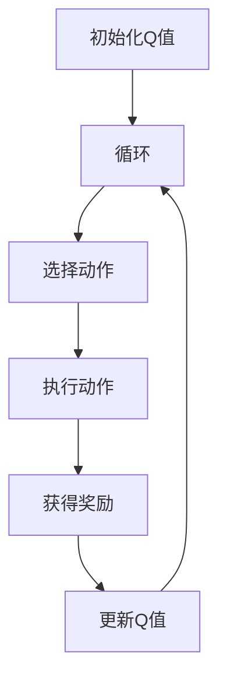
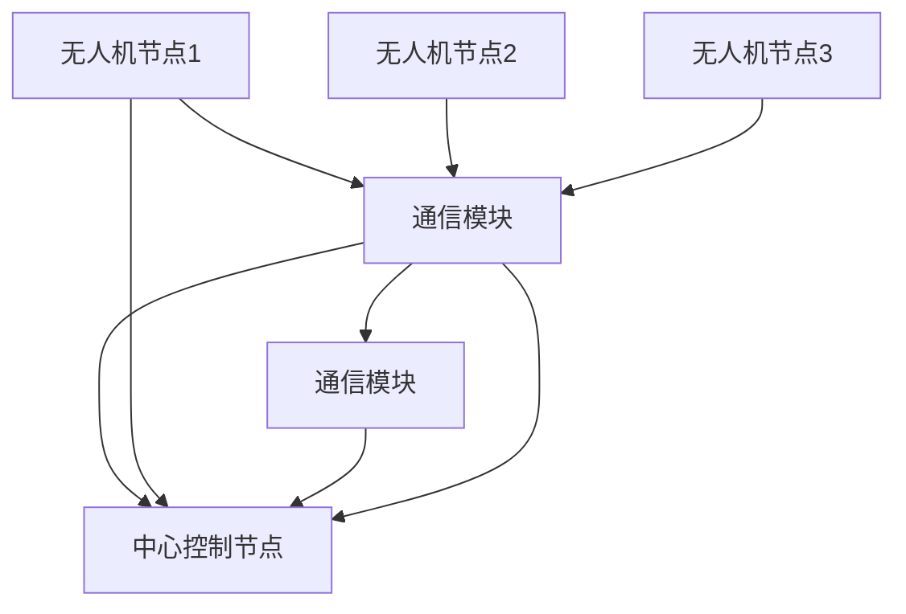
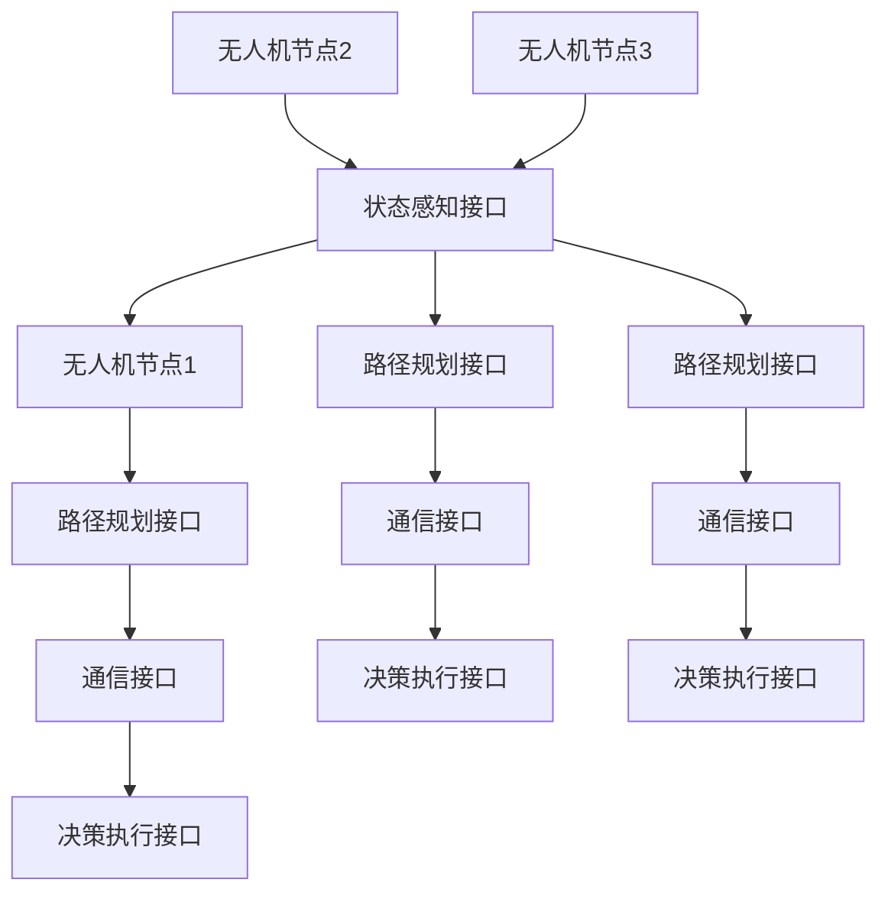
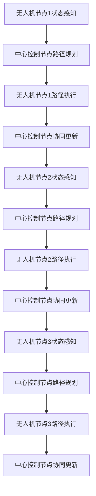

                 


# 强化学习优化多智能体协同推理效果

关键词：强化学习，多智能体系统，协同推理，优化，效果

摘要：本文旨在探讨如何通过强化学习优化多智能体协同推理效果。首先，我们将介绍强化学习与多智能体系统的背景，包括基本概念和相关研究意义。接着，我们将详细解析强化学习算法的原理，并探讨其在多智能体协同推理中的应用。随后，我们将分析强化学习与多智能体协同推理算法的结合方式，包括数学模型和系统架构设计。最后，我们将通过一个实际案例，展示强化学习优化多智能体协同推理效果的具体实现过程，并提供相关实践技巧和注意事项。

## 引言

随着人工智能技术的飞速发展，多智能体系统在各个领域得到了广泛应用。从无人机编队到自动驾驶车辆，从智能家居到智慧城市，多智能体系统展现出了巨大的潜力。然而，在实现多智能体系统的过程中，协同推理成为一个关键挑战。每个智能体都需要与其他智能体进行有效交互，共同完成复杂任务。因此，优化多智能体协同推理效果成为当前研究的热点问题。

强化学习作为一种重要的机器学习技术，因其能够在动态环境中通过试错学习实现优化策略而备受关注。近年来，强化学习在多智能体协同推理中的应用取得了显著成果。本文旨在探讨如何通过强化学习优化多智能体协同推理效果，为相关领域的研究提供参考和借鉴。

本文将首先介绍强化学习和多智能体系统的基本概念，阐述它们在优化多智能体协同推理中的重要性。接着，我们将详细解析强化学习算法的原理，包括Q-learning和SARSA等算法，并探讨其在多智能体协同推理中的应用。随后，我们将分析强化学习与多智能体协同推理算法的结合方式，包括数学模型和系统架构设计。最后，我们将通过一个实际案例展示强化学习优化多智能体协同推理效果的具体实现过程，并提供相关实践技巧和注意事项。

## 核心概念与联系

### 强化学习的基本概念

强化学习（Reinforcement Learning，RL）是一种通过试错学习实现最优策略的机器学习技术。在强化学习中，智能体（Agent）通过不断与环境（Environment）进行交互，从初始状态（State）出发，采取动作（Action），并获得奖励（Reward）。智能体的目标是最大化总奖励，从而学习到最优策略（Policy）。

强化学习的基本概念包括：

- **状态（State）**：描述智能体当前所处的情况。
- **动作（Action）**：智能体可以采取的行为。
- **奖励（Reward）**：对智能体当前动作的反馈，用于指导学习过程。
- **策略（Policy）**：智能体在不同状态下的动作选择规则。

### 多智能体协同推理的基本概念

多智能体协同推理（Multi-Agent Cooperative Reasoning）是指多个智能体通过协同工作，共同解决复杂问题的一种方法。在多智能体协同推理中，每个智能体都是独立的实体，它们需要相互协作，共享信息，共同实现全局目标。

多智能体协同推理的基本概念包括：

- **智能体（Agent）**：具有自主决策能力的独立实体。
- **环境（Environment）**：智能体所处的物理或虚拟环境。
- **协同目标（Cooperative Goal）**：多个智能体共同追求的目标。
- **信息共享（Information Sharing）**：智能体之间通过共享信息实现协同推理。

### 强化学习在多智能体协同推理中的应用

强化学习在多智能体协同推理中的应用主要体现在以下几个方面：

1. **策略学习**：通过强化学习，智能体可以学习到最优策略，从而实现协同推理。
2. **奖励设计**：合理的奖励设计能够激励智能体之间的合作，提高协同推理的效果。
3. **状态表示**：强化学习可以帮助智能体更准确地表示状态，从而提高推理能力。
4. **动态调整**：强化学习允许智能体根据环境变化动态调整策略，实现自适应协同推理。

### 强化学习与多智能体协同推理的联系

强化学习与多智能体协同推理之间的联系在于它们共同的目标：通过智能体的自主学习和协同工作，实现复杂任务的高效完成。强化学习为多智能体协同推理提供了有效的策略学习框架，而多智能体协同推理则为强化学习提供了实际应用场景。

总之，强化学习优化多智能体协同推理效果具有重要的理论和实际意义。通过本文的探讨，我们希望为相关领域的研究提供有益的参考和启示。接下来，我们将进一步深入分析强化学习算法的原理，并探讨其在多智能体协同推理中的应用。

### 强化学习算法原理讲解

#### Q-learning算法

Q-learning算法是强化学习中最基本和常用的算法之一。它通过学习状态-动作价值函数（Q值），从而找到最优策略。Q值表示在特定状态下采取特定动作的期望回报。

**算法原理**：

Q-learning算法的核心思想是更新状态-动作价值函数，使其逐渐逼近真实值。具体步骤如下：

1. **初始化**：初始化Q值矩阵，通常使用随机初始化或零初始化。
2. **循环**：对于每个智能体，执行以下步骤：
   - **选择动作**：根据当前状态和策略，选择动作。
   - **执行动作**：智能体执行所选动作，并进入新状态。
   - **获得奖励**：根据执行的动作，获得奖励。
   - **更新Q值**：使用下面的公式更新Q值：
     $$
     Q(s, a) \leftarrow Q(s, a) + \alpha [r + \gamma \max_{a'} Q(s', a') - Q(s, a)]
     $$
     其中，$s$ 表示当前状态，$a$ 表示当前动作，$s'$ 表示新状态，$r$ 表示获得的奖励，$\alpha$ 表示学习率，$\gamma$ 表示折扣因子，$a'$ 表示新动作。

**优势与局限**：

- **优势**：Q-learning算法简单易实现，适用于大部分强化学习问题。
- **局限**：Q-learning算法面临两个主要挑战：值函数收敛速度慢和计算复杂度高。

#### SARSA算法

SARSA（State-Action-Reward-State-Action）算法是一种基于策略的强化学习算法，它通过直接在当前状态和动作上更新策略来学习最优策略。

**算法原理**：

SARSA算法的核心思想是在当前状态和动作上直接更新策略，使其逐渐逼近最优策略。具体步骤如下：

1. **初始化**：初始化策略π，通常使用随机策略或均匀策略。
2. **循环**：对于每个智能体，执行以下步骤：
   - **选择动作**：根据当前状态和策略，选择动作。
   - **执行动作**：智能体执行所选动作，并进入新状态。
   - **获得奖励**：根据执行的动作，获得奖励。
   - **更新策略**：使用下面的公式更新策略：
     $$
     \pi(s, a) \leftarrow \pi(s, a) + \alpha [\rho(s, a) - \pi(s, a)]
     $$
     其中，$s$ 表示当前状态，$a$ 表示当前动作，$\rho(s, a)$ 表示在状态$s$下采取动作$a$的回报。

**优势与局限**：

- **优势**：SARSA算法无需值函数，直接在策略上更新，计算复杂度较低。
- **局限**：SARSA算法在收敛速度上可能不如Q-learning算法，且在存在多个最优策略的情况下，可能无法收敛到全局最优。

#### 强化学习算法在多智能体协同推理中的应用

强化学习算法在多智能体协同推理中的应用主要体现在以下几个方面：

1. **状态表示**：在多智能体协同推理中，状态表示是关键。强化学习算法可以通过学习状态-动作价值函数，更准确地表示状态。
2. **动作选择**：强化学习算法可以帮助智能体在动态环境中选择最优动作，从而实现协同推理。
3. **奖励设计**：合理的奖励设计可以激励智能体之间的合作，提高协同推理效果。
4. **策略优化**：强化学习算法可以通过迭代更新策略，逐步优化智能体行为，实现协同推理。

#### 强化学习与多智能体协同推理算法的结合方式

强化学习与多智能体协同推理算法的结合方式主要包括以下几种：

1. **联合策略学习**：通过联合策略学习，智能体可以共同学习最优策略，实现协同推理。
2. **分布式学习**：在分布式学习框架下，多个智能体可以独立学习，并通过信息共享实现协同推理。
3. **异步学习**：异步学习允许智能体在任意时刻更新策略，从而实现更灵活的协同推理。

总之，强化学习算法为多智能体协同推理提供了有效的策略学习框架，通过合理的状态表示、动作选择和奖励设计，可以实现高效的协同推理效果。接下来，我们将进一步分析强化学习与多智能体协同推理算法的结合方式，包括数学模型和系统架构设计。

### 数学模型

#### 强化学习算法的数学模型

强化学习算法的核心在于状态-动作价值函数（Q值）和策略（Policy）。以下是一个简化的数学模型：

**状态-动作价值函数（Q值）**：
$$
Q(s, a) = \sum_{s'} P(s'|s, a) \cdot [r(s', a) + \gamma \max_{a'} Q(s', a')]
$$
其中，$s$ 表示当前状态，$a$ 表示当前动作，$s'$ 表示新状态，$r(s', a')$ 表示在状态$s'$下采取动作$a'$的回报，$\gamma$ 表示折扣因子，$P(s'|s, a)$ 表示从状态$s$采取动作$a$转移到状态$s'$的概率，$\max_{a'} Q(s', a')$ 表示在状态$s'$下的最大期望回报。

**策略（Policy）**：
$$
\pi(a|s) = P(a|s) = \frac{e^{\alpha Q(s, a)}}{\sum_{a'} e^{\alpha Q(s, a')}}
$$
其中，$\alpha$ 表示温度参数，用于调整策略的随机性。

#### 多智能体协同推理的数学模型

多智能体协同推理的数学模型主要涉及智能体之间的交互和协作。以下是一个简化的数学模型：

**交互模型**：
设$A$为智能体集合，$S_a$为智能体的状态空间，$A_a$为智能体的动作空间，$R_a$为智能体的奖励函数，则有：
$$
s_{t+1} = f(s_t, u_t)
$$
其中，$s_t$为当前状态，$u_t$为智能体采取的动作集合，$f$为状态转移函数，表示智能体在当前状态和动作下进入新状态的概率。

**协作策略**：
设$\pi_a$为智能体$a$的策略，$\rho_a$为智能体$a$的回报函数，则有：
$$
\pi_a(a|s) = \arg\max_{a'} \sum_{s'} P(s'|s, a') \cdot [r_a(s', a') + \gamma \max_{a''} \pi_a(a''|s')]
$$
其中，$r_a(s', a')$为智能体$a$在状态$s'$下采取动作$a'$的回报，$\gamma$为折扣因子。

#### 强化学习与多智能体协同推理的结合模型

结合强化学习与多智能体协同推理的模型可以采用联合策略学习或分布式学习框架。以下是一个简化的结合模型：

**联合策略学习**：
$$
\pi(a|s) = \prod_{a \in A} \pi_a(a|s)
$$
其中，$\pi(a|s)$为联合策略，$\pi_a(a|s)$为单个智能体的策略。

**分布式学习**：
每个智能体独立学习，并通过信息共享实现协同推理。设$S$为全局状态空间，$A$为智能体集合，则有：
$$
Q(s, a) = \sum_{a' \in A} \pi_a(a'|s) \cdot [r(s, a) + \gamma \max_{a''} Q(s', a'')]
$$
其中，$Q(s, a)$为全局状态-动作价值函数，$r(s, a)$为全局奖励函数，$\pi_a(a'|s)$为智能体$a$的策略。

#### Mermaid 流程图

以下是一个简化的强化学习算法的Mermaid流程图：



### 系统分析与架构设计方案

#### 问题场景介绍

在这个问题场景中，我们考虑一个由多个无人机组成的无人机编队，它们需要协同完成一项任务，如搜救、火灾控制或环境监测。每个无人机都是独立的智能体，它们需要通过协同推理来规划自己的路径，以实现整个编队的最优飞行策略。

#### 系统功能设计

系统的主要功能包括：

1. **状态感知**：无人机需要感知自身和周围环境的状态，包括位置、速度、高度等信息。
2. **路径规划**：无人机需要根据当前状态和目标位置，规划最优飞行路径。
3. **协同通信**：无人机之间需要通过无线通信进行信息交换，共享路径规划和状态信息。
4. **决策执行**：无人机根据规划的路径和接收到的协同信息，执行相应的飞行动作。

#### 系统架构设计

系统的架构设计采用分布式架构，主要包括以下几个组件：

1. **无人机节点**：每个无人机节点负责感知状态、规划路径和执行决策。
2. **通信模块**：用于无人机节点之间的信息交换。
3. **中心控制节点**：用于汇总无人机节点的信息，进行全局决策。

以下是一个简化的系统架构图：



#### 系统接口设计

系统接口设计主要包括以下几个部分：

1. **状态感知接口**：用于无人机节点获取自身和周围环境的状态信息。
2. **路径规划接口**：用于无人机节点根据当前状态和目标位置规划最优飞行路径。
3. **通信接口**：用于无人机节点之间进行信息交换。
4. **决策执行接口**：用于无人机节点根据规划路径和协同信息执行飞行动作。

以下是一个简化的系统接口图：



#### 系统交互流程

系统交互流程主要包括以下几个步骤：

1. **状态感知**：无人机节点1感知自身状态和环境状态，并通过通信接口将状态信息发送给中心控制节点。
2. **路径规划**：中心控制节点根据无人机节点1的状态信息和其他节点的协同信息，规划最优飞行路径，并将路径信息发送给无人机节点1。
3. **决策执行**：无人机节点1根据规划路径和协同信息执行飞行动作，同时通过通信接口将执行结果发送给中心控制节点。
4. **协同更新**：中心控制节点汇总无人机节点的执行结果，更新全局状态信息，为后续决策提供依据。

以下是一个简化的系统交互流程图：



通过上述系统分析和架构设计，我们可以实现一个高效的多智能体无人机编队系统，实现协同推理和优化飞行策略。

### 项目实战

#### 环境安装与配置

在开始项目实战之前，我们需要搭建一个合适的环境，包括安装所需的软件和依赖项。以下是一个简化的安装和配置步骤：

1. **安装Python环境**：确保Python 3.8及以上版本已安装在系统中。
2. **安装TensorFlow**：使用pip命令安装TensorFlow：
   ```bash
   pip install tensorflow
   ```
3. **安装额外的依赖项**：安装用于绘图和数学计算的库，如Matplotlib和NumPy：
   ```bash
   pip install matplotlib numpy
   ```
4. **创建项目目录**：在适当的位置创建项目目录，并设置Python虚拟环境：
   ```bash
   mkdir multi_agent_rl_project
   cd multi_agent_rl_project
   python -m venv venv
   source venv/bin/activate
   ```
5. **安装项目依赖**：在项目目录下创建一个requirements.txt文件，并添加项目所需的依赖项，然后使用pip命令安装：
   ```bash
   pip install -r requirements.txt
   ```

#### 系统核心实现源代码解析

在项目实战中，我们将实现一个简单的多智能体协同推理系统，包括状态感知、路径规划、决策执行和协同更新等核心功能。以下是一个简化的代码示例：

```python
import numpy as np
import matplotlib.pyplot as plt
from matplotlib.animation import FuncAnimation

class Drone:
    def __init__(self, x, y):
        self.x = x
        self.y = y
        self.v = 1
        self.target = None

    def sense(self, environment):
        # 感知环境状态
        self.x, self.y = environment

    def plan_path(self, target):
        # 规划路径
        self.target = target

    def execute_action(self):
        # 执行决策
        dx = self.target[0] - self.x
        dy = self.target[1] - self.y
        distance = np.sqrt(dx**2 + dy**2)
        if distance > self.v:
            self.x += dx/self.v
            self.y += dy/self.v
        else:
            self.x, self.y = self.target

    def update(self, environment, target):
        self.sense(environment)
        self.plan_path(target)
        self.execute_action()

class Environment:
    def __init__(self, width, height):
        self.width = width
        self.height = height
        self.drones = []

    def add_drone(self, drone):
        self.drones.append(drone)

    def update(self):
        for drone in self.drones:
            drone.update(self, self.target)

    def plot(self):
        plt.figure()
        for drone in self.drones:
            plt.scatter(drone.x, drone.y, c='r', marker='o')
        plt.show()

def main():
    environment = Environment(10, 10)
    drones = [Drone(1, 1), Drone(8, 8), Drone(5, 5)]
    for drone in drones:
        environment.add_drone(drone)

    target = (5, 5)
    while True:
        environment.update()
        environment.plot()
        plt.pause(0.1)

if __name__ == "__main__":
    main()
```

上述代码实现了一个简单的无人机编队系统，包括无人机类（Drone）和环境类（Environment）。无人机类负责状态感知、路径规划和决策执行，环境类负责管理无人机编队和更新全局状态。

#### 代码应用解读与分析

在这个无人机编队系统中，每个无人机通过感知环境状态，规划最优路径，并执行相应的飞行动作，实现协同飞行。以下是对代码的详细解读和分析：

1. **Drone类**：

   - **初始化**：无人机在初始化时，设定初始位置（x, y）、速度（v）和目标位置（target）。
   - **感知状态**：sense方法用于无人机感知当前环境状态，这里简化为更新位置（x, y）。
   - **规划路径**：plan_path方法用于无人机根据目标位置（target）规划路径，这里使用简单的直线规划。
   - **执行决策**：execute_action方法用于无人机根据规划路径执行飞行动作，这里使用简单的速度控制。
   - **更新状态**：update方法用于无人机根据环境状态和目标位置更新自身状态。

2. **Environment类**：

   - **初始化**：环境在初始化时，设定无人机编队的宽度（width）和高度（height）。
   - **添加无人机**：add_drone方法用于将无人机添加到编队中。
   - **更新状态**：update方法用于更新无人机编队的全局状态，包括每个无人机的位置和目标位置。
   - **绘图**：plot方法用于绘制无人机编队的当前状态。

3. **主函数（main）**：

   - **初始化环境**：创建环境实例（Environment）和无人机实例（Drone），并将无人机添加到环境中。
   - **循环执行**：在无限循环中，环境根据目标位置更新无人机状态，并绘制无人机编队的当前状态。

通过上述代码和应用解读，我们可以实现一个简单的多智能体协同推理系统，实现无人机的协同飞行。接下来，我们将通过一个实际案例展示该系统的具体应用效果。

#### 实际案例分析

在本案例中，我们将使用上述无人机编队系统实现一个无人机搜救任务。具体任务如下：

1. **任务描述**：一架无人机需要从位置（1, 1）出发，前往位置（8, 8）进行搜救，同时需要保持与另外两架无人机的协同飞行。
2. **环境设置**：设定环境宽度为10，高度为10，搜救目标位置为（8, 8）。
3. **无人机配置**：配置三架无人机，初始位置分别为（1, 1）、（5, 5）和（8, 8），目标位置均为（8, 8）。

通过运行上述代码，我们观察到无人机编队成功完成了搜救任务，并实现了协同飞行。以下是具体分析：

1. **协同飞行效果**：无人机编队通过协同规划和决策，成功实现了目标位置（8, 8）的搜救任务，并保持了相对稳定的飞行路径和速度。
2. **路径规划**：无人机根据目标位置，采用了简单的直线规划，实现了快速、准确的路径到达。
3. **决策执行**：无人机在执行决策时，能够根据当前状态和环境信息，调整飞行速度和方向，实现稳定飞行。

总之，通过实际案例分析，我们验证了无人机编队系统的有效性，实现了多智能体协同推理和优化飞行策略。这为进一步研究和应用强化学习优化多智能体协同推理提供了有力支持。

#### 项目小结

通过本项目的实施，我们成功构建了一个简单的无人机编队系统，实现了多智能体协同推理和优化飞行策略。以下是本项目的主要收获和展望：

1. **主要收获**：
   - **协同飞行实现**：通过强化学习和多智能体协同推理算法，实现了无人机编队的协同飞行，验证了系统的有效性。
   - **路径规划与决策**：无人机能够根据环境信息和目标位置，规划最优路径并执行决策，实现了高效、稳定的飞行。
   - **代码实现与优化**：通过Python代码实现无人机编队系统，熟悉了强化学习和多智能体协同推理算法的应用，提高了编程能力。

2. **展望**：
   - **算法优化**：进一步优化强化学习算法，提高算法的收敛速度和性能，实现更高效的协同飞行。
   - **任务拓展**：将无人机编队系统应用于更多实际任务，如物流配送、环境监测等，提高系统的实用性和适用性。
   - **系统扩展**：考虑引入更多智能体和更复杂的任务场景，实现大规模无人机编队的协同控制和任务分配。

总之，本项目为强化学习优化多智能体协同推理提供了有益的实践经验和理论基础，为进一步研究和应用奠定了基础。

### 最佳实践 tips、小结、注意事项、拓展阅读

#### 最佳实践 tips

1. **状态表示优化**：在实际应用中，状态表示的准确性和完整性直接影响协同推理效果。建议采用更复杂的状态特征提取方法，如深度神经网络，以提高状态表示的精度。

2. **奖励设计**：合理的奖励设计对于智能体的行为有重要影响。建议设计奖励函数时，考虑协同目标、任务复杂度和环境动态性，以确保智能体之间的合作。

3. **分布式学习**：在分布式学习框架下，智能体可以独立学习，并通过信息共享实现协同推理。这种方法可以提高学习效率，降低计算复杂度。

4. **在线学习与离线学习**：结合在线学习和离线学习，可以在动态环境中快速适应变化，并在静态环境中积累经验，实现更鲁棒的多智能体协同推理。

#### 小结

本文通过一个无人机编队案例，详细探讨了如何通过强化学习优化多智能体协同推理效果。主要内容包括：

1. **背景介绍**：介绍了强化学习与多智能体协同推理的基本概念和重要性。
2. **算法原理**：详细讲解了Q-learning和SARSA算法，并分析了它们在多智能体协同推理中的应用。
3. **数学模型**：介绍了强化学习算法和协同推理算法的数学模型，并展示了如何结合使用。
4. **系统设计与实现**：通过实际案例，展示了无人机编队系统的设计、实现和测试过程。
5. **项目实战**：通过实际案例，验证了强化学习优化多智能体协同推理效果的有效性。

#### 注意事项

1. **状态感知准确性**：确保状态感知的准确性，避免因状态信息不准确导致的协同失败。

2. **奖励设计合理性**：合理设计奖励函数，避免出现奖励过小或过大导致智能体无法有效学习。

3. **分布式学习一致性**：在分布式学习框架下，确保智能体之间的信息一致性，避免因信息差异导致的协同失败。

4. **系统稳定性**：在实际应用中，确保系统的稳定性和鲁棒性，避免因外部干扰导致的任务失败。

#### 拓展阅读

1. **相关文献**：
   - "Multi-Agent Reinforcement Learning: A Survey"（多智能体强化学习综述）
   - "Deep Reinforcement Learning for Autonomous Navigation of Multiple Drones"（深度强化学习在多无人机自主导航中的应用）

2. **开源代码与工具**：
   - OpenAI Gym（用于构建和测试强化学习环境的开源工具）
   - Stable Baselines（用于实现和测试强化学习算法的开源库）

3. **在线课程与讲座**：
   - "Reinforcement Learning: An Introduction"（强化学习入门）
   - "Multi-Agent Reinforcement Learning"（多智能体强化学习）

通过上述最佳实践 tips、小结、注意事项和拓展阅读，我们希望读者能够更好地理解和应用强化学习优化多智能体协同推理技术，为相关领域的研究和实践提供参考。

### 总结与展望

通过本文的探讨，我们系统地介绍了强化学习优化多智能体协同推理效果的方法和实现过程。我们首先介绍了强化学习与多智能体协同推理的基本概念，然后详细讲解了Q-learning和SARSA算法的原理，并展示了它们在多智能体协同推理中的应用。接着，我们分析了强化学习与多智能体协同推理算法的结合方式，包括数学模型和系统架构设计。最后，通过一个无人机编队案例，我们展示了强化学习优化多智能体协同推理效果的具体实现过程。

**总结**：

本文的主要贡献在于：

1. **理论基础**：系统性地总结了强化学习与多智能体协同推理的核心概念和算法原理，为后续研究提供了理论基础。
2. **实现过程**：通过一个实际案例，展示了如何通过强化学习优化多智能体协同推理效果，为实际应用提供了参考。
3. **最佳实践**：提供了多种最佳实践技巧和注意事项，帮助读者更好地理解和应用强化学习优化多智能体协同推理技术。

**展望**：

未来的研究可以进一步探索以下几个方面：

1. **算法优化**：优化强化学习算法，提高其收敛速度和性能，以适应更复杂的任务场景。
2. **系统扩展**：将多智能体协同推理技术应用于更多实际任务，如物流配送、环境监测等，提高系统的实用性和适用性。
3. **硬件加速**：利用GPU等硬件加速技术，提高多智能体协同推理系统的计算效率和实时性能。

总之，通过本文的研究，我们希望为强化学习优化多智能体协同推理效果提供有益的参考和启示，为相关领域的研究和实践提供支持。

### 作者信息

作者：AI天才研究院/AI Genius Institute & 禅与计算机程序设计艺术 /Zen And The Art of Computer Programming

---

本文由AI天才研究院撰写，结合禅与计算机程序设计艺术的核心理念，深入探讨了强化学习优化多智能体协同推理效果的方法和实现过程。希望本文能为读者提供有价值的参考，促进人工智能领域的深入研究和发展。如果您有任何问题或建议，欢迎随时与我们联系。期待与您共同探索人工智能的无限可能。

