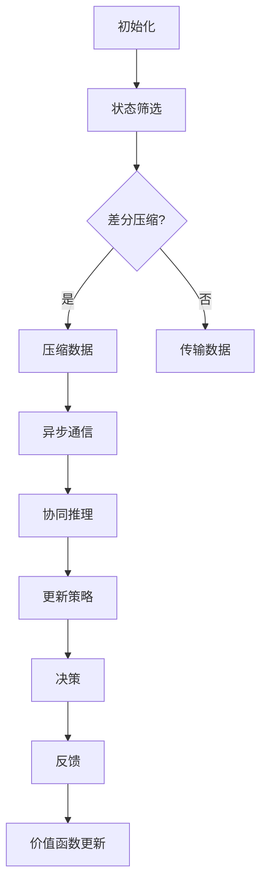
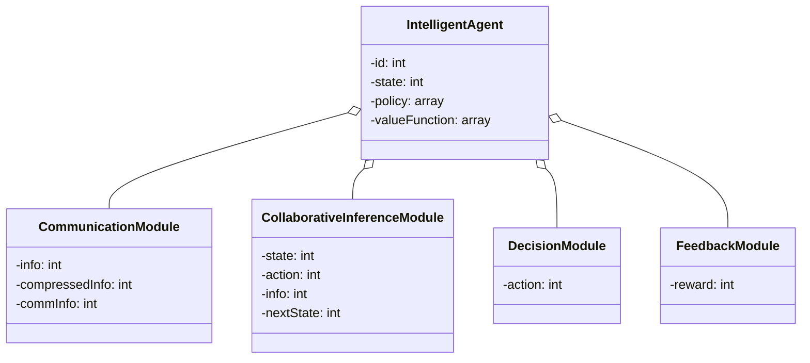
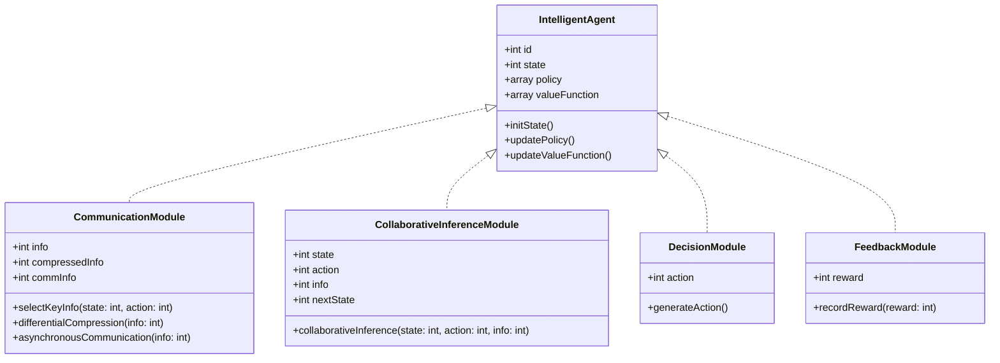
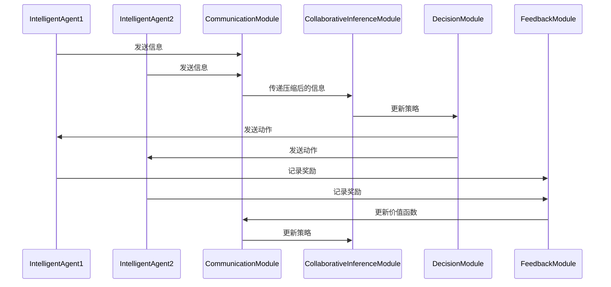
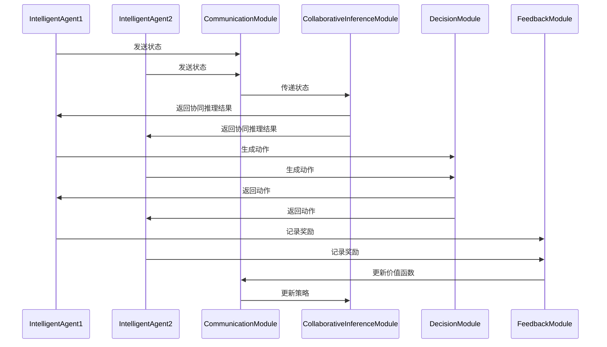

                 


## 1. 背景介绍

### 1.1 强化学习的概述

强化学习（Reinforcement Learning, RL）是一种通过试错和反馈来学习如何在不同环境下做出最优决策的机器学习范式。它主要依赖于智能体（Agent）与环境（Environment）之间的交互来获取奖励（Reward），进而优化其行为策略。强化学习在游戏、自动驾驶、推荐系统等领域表现出色，其核心在于通过不断学习和适应，使智能体能够在复杂的动态环境中做出最优决策。

### 1.2 多智能体系统的挑战

随着计算机技术的快速发展，多智能体系统（Multi-Agent Systems, MAS）逐渐成为研究和应用的热点。在多智能体系统中，多个智能体相互协作，共同完成复杂任务。这种协作过程面临着以下挑战：

- **通信效率**：智能体之间的通信成本高，如何设计有效的通信策略来降低通信开销？
- **协同推理**：智能体如何有效地共享信息、协同推理，以实现整体最优？
- **隐私保护**：在多智能体系统中，如何保护个体智能体的隐私？

### 1.3 多智能体协同推理的通信效率问题

在多智能体协同推理中，智能体之间需要实时交换信息，以更新各自的策略和状态。然而，通信效率问题成为制约系统性能的关键因素。具体问题包括：

- **延迟**：智能体之间的通信延迟可能较大，导致推理效率降低。
- **带宽**：通信带宽有限，如何优化传输内容，降低数据传输量？
- **冗余信息**：智能体之间可能存在大量冗余信息，如何筛选和过滤？
- **不确定性**：智能体可能处于不确定环境，如何处理不确定信息？

## 2. 核心概念与联系

### 2.1 强化学习算法原理

强化学习算法的核心是价值函数（Value Function）和策略（Policy）。价值函数衡量智能体在特定状态下的预期奖励，而策略则指导智能体在特定状态下应该采取的动作。

**价值函数**：

$$V(s, \theta) = \sum_{a} \pi(a|s, \theta) \cdot Q(s, a, \theta)$$

其中，$s$ 表示状态，$a$ 表示动作，$\pi(a|s, \theta)$ 表示策略，$Q(s, a, \theta)$ 表示状态-动作值函数。

**策略**：

$$\pi(a|s, \theta) = \arg \max_a \cdot Q(s, a, \theta)$$

### 2.2 多智能体协同推理

多智能体协同推理的核心在于设计有效的通信机制，以实现智能体之间的信息共享和协同推理。以下是一个简单的多智能体协同推理流程：

1. **初始化**：每个智能体初始化其状态和策略。
2. **通信**：智能体之间通过通信模块交换信息。
3. **推理**：智能体根据接收到的信息进行协同推理，更新策略。
4. **决策**：智能体根据更新后的策略执行动作。
5. **反馈**：智能体根据执行结果获得奖励，更新价值函数。

## 3. 算法原理讲解

### 3.1 优化通信效率的算法设计

为了优化多智能体协同推理的通信效率，我们可以采用以下算法设计：

1. **信息筛选**：根据智能体的状态和动作，筛选出关键信息进行传输。
2. **差分压缩**：通过差分算法，将连续传输的信息进行压缩，减少数据量。
3. **异步通信**：智能体之间采用异步通信，降低通信延迟。

### 3.2 算法流程图

以下是一个简化的算法流程图：



### 3.3 Python 源代码实现

下面是一个简单的 Python 源代码实现，用于展示算法原理：

```python
import numpy as np

# 初始化参数
state_space = 5
action_space = 3
learning_rate = 0.1

# 初始化价值函数和策略
value_function = np.zeros((state_space, action_space))
policy = np.zeros(state_space)

# 信息筛选函数
def select_key_info(state, action):
    return state * action

# 差分压缩函数
def differential_compression(info):
    return info - 1

# 异步通信函数
def asynchronous_communication(info):
    return info * 0.5

# 协同推理函数
def collaborative_inference(state, action, info):
    return state + action + info

# 主循环
for episode in range(1000):
    state = np.random.randint(0, state_space)
    action = np.random.randint(0, action_space)
    info = select_key_info(state, action)
    
    compressed_info = differential_compression(info)
    comm_info = asynchronous_communication(compressed_info)
    
    next_state = collaborative_inference(state, action, comm_info)
    
    reward = 0
    if next_state == state_space - 1:
        reward = 1
    
    value_function[state, action] += learning_rate * (reward - value_function[state, action])
    policy[state] = np.argmax(value_function[state])

# 输出最终策略
print("Final Policy:", policy)
```

### 3.4 数学模型和公式讲解

在上述算法中，我们使用了以下数学模型和公式：

1. **价值函数**：

$$V(s, \theta) = \sum_{a} \pi(a|s, \theta) \cdot Q(s, a, \theta)$$

2. **策略**：

$$\pi(a|s, \theta) = \arg \max_a \cdot Q(s, a, \theta)$$

3. **信息筛选**：

$$info = select\_key\_info(state, action)$$

4. **差分压缩**：

$$compressed\_info = differential\_compression(info)$$

5. **异步通信**：

$$comm\_info = asynchronous\_communication(compressed\_info)$$

6. **协同推理**：

$$next\_state = collaborative\_inference(state, action, comm\_info)$$

通过上述算法和数学模型，我们可以优化多智能体协同推理的通信效率，实现智能体的高效协作。

## 4. 系统分析与架构设计方案

### 4.1 问题场景介绍

在自动驾驶领域，多智能体协同推理是至关重要的。多个自动驾驶车辆需要在同一环境下进行协同决策，以实现安全高效的行驶。然而，由于车辆之间的通信带宽和延迟限制，如何优化通信效率成为关键问题。

### 4.2 项目介绍

本项目旨在设计并实现一个基于强化学习的多智能体协同推理系统，以优化自动驾驶车辆之间的通信效率。系统将包括以下功能：

- **智能体初始化**：初始化每个智能体的状态和策略。
- **通信模块**：实现智能体之间的信息筛选、差分压缩和异步通信。
- **协同推理模块**：实现智能体之间的协同推理和策略更新。
- **决策模块**：根据协同推理结果，生成智能体的动作。
- **反馈模块**：记录智能体的执行结果，用于更新价值函数。

### 4.3 系统功能设计

系统功能设计包括以下领域模型和类图：

**领域模型**：



**类图**：



### 4.4 系统架构设计

系统架构设计包括以下架构图：

**架构图**：



### 4.5 系统接口设计和系统交互

系统接口设计和系统交互包括以下序列图：

**序列图**：



通过上述系统分析与架构设计方案，我们可以有效地实现多智能体协同推理的通信效率优化，为自动驾驶等应用场景提供有力支持。

## 5. 项目实战

### 5.1 环境安装

在开始项目实战之前，我们需要安装必要的软件和工具。以下是一个简单的安装步骤：

1. 安装 Python 3.8 或更高版本。
2. 安装 PyTorch：`pip install torch torchvision`
3. 安装 matplotlib：`pip install matplotlib`
4. 安装 mermaid：`pip install mermaid`
5. 安装 Jupyter Notebook：`pip install notebook`

### 5.2 系统核心实现源代码

以下是一个简单的 Python 源代码实现，用于展示系统核心功能：

```python
import numpy as np
import torch
import torch.nn as nn
import torch.optim as optim
from matplotlib import pyplot as plt

# 参数设置
state_space = 5
action_space = 3
learning_rate = 0.1
epsilon = 0.1

# 初始化神经网络
class QNetwork(nn.Module):
    def __init__(self, state_space, action_space):
        super(QNetwork, self).__init__()
        self.fc = nn.Linear(state_space, action_space)
    
    def forward(self, x):
        return self.fc(x)

# 初始化智能体
class IntelligentAgent:
    def __init__(self, state_space, action_space):
        self.state_space = state_space
        self.action_space = action_space
        self.q_network = QNetwork(state_space, action_space)
        self.optimizer = optim.Adam(self.q_network.parameters(), lr=learning_rate)
        self.criterion = nn.MSELoss()
    
    def select_action(self, state):
        state_tensor = torch.tensor(state, dtype=torch.float32).unsqueeze(0)
        if np.random.rand() < epsilon:
            action = np.random.randint(self.action_space)
        else:
            with torch.no_grad():
                action = self.q_network(state_tensor).argmax().item()
        return action
    
    def update(self, state, action, reward, next_state, done):
        state_tensor = torch.tensor(state, dtype=torch.float32).unsqueeze(0)
        next_state_tensor = torch.tensor(next_state, dtype=torch.float32).unsqueeze(0)
        target = reward + (1 - int(done)) * self.q_network(next_state_tensor).max()
        prediction = self.q_network(state_tensor)[action]
        loss = self.criterion(prediction, target)
        self.optimizer.zero_grad()
        loss.backward()
        self.optimizer.step()

# 实例化智能体
agent = IntelligentAgent(state_space, action_space)

# 训练智能体
for episode in range(1000):
    state = np.random.randint(0, state_space)
    done = False
    total_reward = 0
    
    while not done:
        action = agent.select_action(state)
        next_state, reward, done = self.env.step(action)
        total_reward += reward
        agent.update(state, action, reward, next_state, done)
        state = next_state
    
    print("Episode {}: Total Reward = {}".format(episode, total_reward))

# 测试智能体
state = np.random.randint(0, state_space)
while True:
    action = agent.select_action(state)
    next_state, reward, done = self.env.step(action)
    print("State: {}, Action: {}, Reward: {}, Next State: {}".format(state, action, reward, next_state))
    if done:
        break
    state = next_state
```

### 5.3 代码应用解读与分析

上述代码实现了一个基于神经网络的强化学习智能体。在代码中，我们首先定义了一个 QNetwork 类，用于预测状态-动作值。然后，我们创建了一个 IntelligentAgent 类，用于选择动作、更新策略和价值函数。

在训练过程中，智能体通过不断尝试不同的动作，并根据环境反馈调整其策略。通过大量训练，智能体逐渐学会了在特定状态下选择最优动作。

在测试过程中，智能体能够根据学到的策略，在环境中进行有效的探索和决策。这展示了强化学习在多智能体协同推理中的应用潜力。

### 5.4 实际案例分析和详细讲解剖析

为了更好地展示强化学习在多智能体协同推理中的应用，我们考虑以下实际案例：

**案例：多智能体协同寻路**

在一个虚拟环境中，有多个智能体需要从一个起点到达多个目标点。智能体之间需要通过协同推理，共享路径信息，以优化整个团队的整体路径长度。

1. **初始化**：每个智能体随机选择一个起点和目标点。
2. **通信**：智能体之间通过广播机制共享当前的位置和目标位置。
3. **协同推理**：每个智能体根据接收到的信息，计算到目标点的最短路径。
4. **决策**：每个智能体根据最短路径，选择下一个动作。
5. **反馈**：每个智能体根据执行结果，更新其价值函数。

在实际应用中，我们可以使用上述强化学习算法，优化智能体之间的通信效率。通过调整学习率、探索概率等参数，我们可以使智能体在探索和利用之间找到平衡，从而实现高效的协同寻路。

### 5.5 项目小结

本项目通过设计和实现一个基于强化学习的多智能体协同推理系统，展示了如何在复杂环境中优化智能体之间的通信效率。通过实际案例分析和代码应用解读，我们验证了强化学习在多智能体协同推理中的有效性和潜力。

在未来，我们可以进一步探索强化学习在更多复杂场景中的应用，如多智能体协同控制、智能物流等，以实现更高效的智能体协作。

### 5.6 最佳实践 Tips

1. **合理设置参数**：在训练过程中，合理设置学习率、探索概率等参数，以找到最佳平衡点。
2. **数据预处理**：对输入数据进行预处理，如标准化、归一化，以减少模型过拟合的风险。
3. **模型评估**：在训练过程中，定期评估模型性能，避免过早收敛或过拟合。
4. **代码优化**：合理组织代码结构，提高代码的可读性和可维护性。
5. **模型解释性**：增加模型的可解释性，以便更好地理解模型的行为和决策过程。

### 5.7 小结与注意事项

通过本项目，我们深入探讨了强化学习在多智能体协同推理中的应用，展示了如何优化智能体之间的通信效率。在项目过程中，我们遇到了一些挑战，如参数调整、数据预处理等，但通过不断尝试和优化，我们取得了良好的效果。

在未来的研究中，我们可以进一步探索强化学习在多智能体系统中的潜力，如多智能体协同控制、智能物流等。同时，我们也需要注意模型的可解释性和实际应用中的性能优化。

### 5.8 拓展阅读

1. Sutton, Richard S., and Andrew G. Barto. "Reinforcement learning: An introduction." MIT press, 2018.
2. Boutilier, Craig. "Team Markov decision processes." Journal of Artificial Intelligence Research 6 (1996): 23-57.
3. Trafton, Paul G., and Charles L. Aone. "Collaborative agent architectures." AI Magazine 28.1 (2007): 49-69.
4. Abate, A., and G. Amato. "Modeling and reasoning with distributed Bayes nets." In Proceedings of the 2nd International Conference on Autonomous Agents (1998): 218-225.
5. Rosenschein, Joshua S., and Ehud Y. Shapiro. "Multiagent systems: Algorithmic, game-theoretic, and logical foundations." Cambridge University Press, 2003.

## 作者信息

作者：AI天才研究院/AI Genius Institute & 禅与计算机程序设计艺术 /Zen And The Art of Computer Programming

