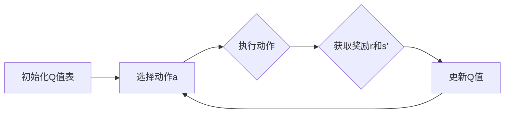
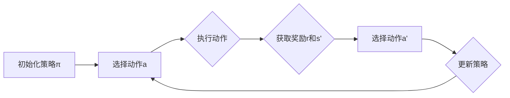
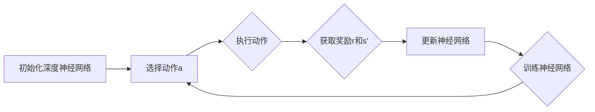
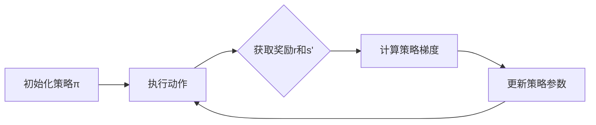
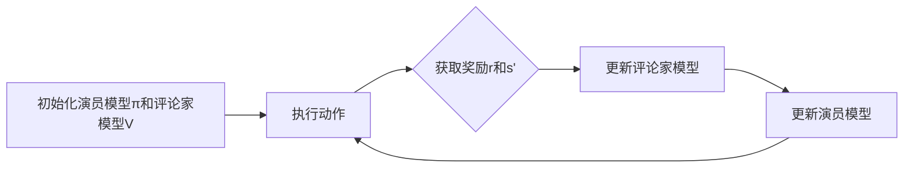
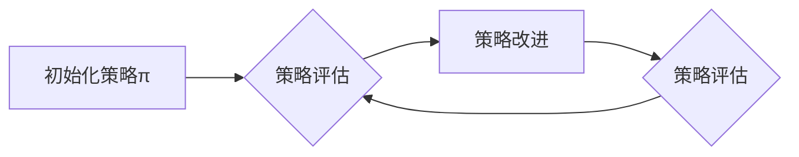
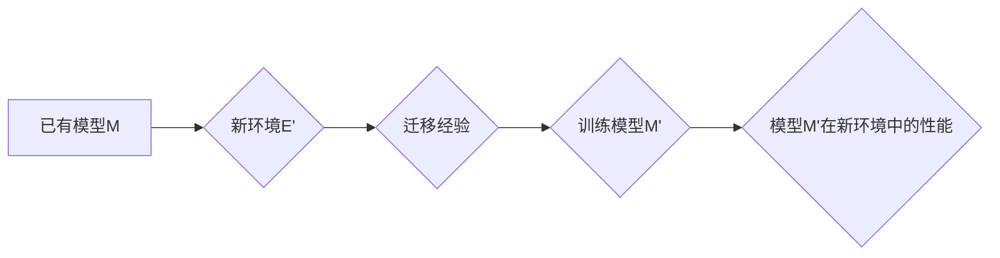
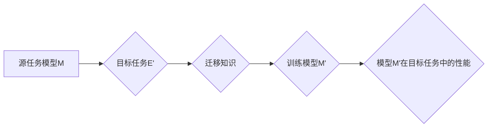

                 


### 1.2 强化学习算法简介

**Q-Learning算法**

**基本原理**：
Q-Learning是一种通过迭代更新策略的强化学习算法，其核心思想是使用样本的经验来估计每个状态-动作对的Q值，然后根据这些Q值来选择动作，以最大化累积奖励。

**优势与应用场景**：
Q-Learning适用于离散状态和动作空间，能够处理没有完整模型的情况。它常用于简单的控制问题和策略优化问题。

**算法流程**：

1. 初始化Q值表
2. 选择动作a
3. 执行动作并获取奖励r和下一个状态s'
4. 更新Q值：$$ Q(s,a) = Q(s,a) + \alpha [r + \gamma \max_{a'} Q(s',a') - Q(s,a)] $$
5. 转移到下一个状态s'，重复步骤2-4

**示例**：
假设我们在一个简单的网格世界中，机器人需要从一个点移动到另一个点，我们可以定义状态为机器人在网格中的位置，动作为机器人的移动方向（上、下、左、右）。通过Q-Learning，我们可以训练出一个策略，使得机器人能够找到从起点到终点的最优路径。

**图解**（使用Mermaid画出Q-Learning的流程图）：



**SARSA算法**

**基本原理**：
SARSA（同步优势反应学习）算法是一种基于策略的强化学习算法，它与Q-Learning类似，但使用当前状态和动作来更新Q值，而不是使用下一个状态和动作。

**优势与应用场景**：
SARSA适用于连续动作空间，并且不需要单独的Q值表，可以在线更新策略。

**算法流程**：

1. 初始化策略π
2. 选择动作a
3. 执行动作并获取奖励r和下一个状态s'
4. 根据下一个状态和动作选择下一个动作a'
5. 更新策略：$$ \pi(s,a) = \pi(s,a) + \alpha [1 - \pi(s,a)] $$
6. 转移到下一个状态s'，重复步骤3-5

**示例**：
在一个简单的迷宫问题中，机器人需要找到从起点到终点的路径。我们可以使用SARSA算法来训练机器人的策略，使其能够在迷宫中找到最优路径。

**图解**（使用Mermaid画出SARSA的流程图）：



**Deep Q-Network（DQN）算法**

**基本原理**：
DQN是一种利用深度神经网络来近似Q值的强化学习算法。它通过训练一个神经网络来预测状态-动作对的Q值，从而进行决策。

**优势与应用场景**：
DQN能够处理高维状态空间，适用于复杂的决策问题，如游戏控制和自动驾驶。

**算法流程**：

1. 初始化深度神经网络
2. 选择动作a
3. 执行动作并获取奖励r和下一个状态s'
4. 更新神经网络：$$ y = r + \gamma \max_{a'} \hat{Q}(s',a') $$
5. 训练神经网络：$$ L = (y - Q(s,a))^2 $$
6. 转移到下一个状态s'，重复步骤3-5

**示例**：
在一个 Atari 游戏中，我们可以使用DQN算法来训练一个智能体，使其能够玩好游戏。通过不断尝试和更新策略，智能体可以学习到游戏中的最佳策略。

**图解**（使用Mermaid画出DQN的流程图）：



**Policy Gradient算法**

**基本原理**：
Policy Gradient算法通过直接优化策略的梯度来更新策略。它通过评估策略的期望回报来调整策略参数。

**优势与应用场景**：
Policy Gradient算法适用于动作空间较小且状态空间较大或连续的问题。

**算法流程**：

1. 初始化策略π
2. 执行动作并获取奖励r和下一个状态s'
3. 计算策略梯度：$$ \nabla_{\theta} J(\theta) = \sum_s \pi(s) \nabla_\theta \log \pi(s) \cdot R(s) $$
4. 更新策略参数：$$ \theta = \theta + \alpha \nabla_\theta J(\theta) $$
5. 转移到下一个状态s'，重复步骤2-4

**示例**：
在一个简单的导航任务中，我们可以使用Policy Gradient算法来训练一个智能体，使其能够从起点导航到终点。

**图解**（使用Mermaid画出Policy Gradient的流程图）：



**Actor-Critic算法**

**基本原理**：
Actor-Critic算法结合了Policy Gradient和值函数方法的优势，通过演员（Actor）和评论家（Critic）两个模型来分别估计策略的期望回报和状态价值。

**优势与应用场景**：
Actor-Critic算法适用于高维状态和动作空间，能够自适应地调整策略。

**算法流程**：

1. 初始化演员模型π和评论家模型V
2. 执行动作并获取奖励r和下一个状态s'
3. 更新评论家模型：$$ V(s) = V(s) + \alpha [r - V(s)] $$
4. 更新演员模型：$$ \pi(a|s) = \pi(a|s) + \beta [\log \pi(a|s) - \log \pi(a|s^*)] $$
5. 转移到下一个状态s'，重复步骤2-4

**示例**：
在一个连续控制任务中，如机器人运动控制，我们可以使用Actor-Critic算法来训练一个控制器，使其能够精确控制机器人运动。

**图解**（使用Mermaid画出Actor-Critic的流程图）：



通过以上对Q-Learning、SARSA、DQN、Policy Gradient和Actor-Critic算法的介绍，我们可以看到强化学习算法的多样性和适用性。在接下来的章节中，我们将进一步探讨强化学习在多步推理与决策过程中的应用和实践。

## 第2章：多步推理与决策过程

### 2.1 多步推理与决策过程概述

**定义**：
多步推理与决策过程是指在一个复杂的、动态变化的环境中，通过多个步骤进行推理和决策，以达到某个目标或最优结果的过程。这个过程涉及到对当前状态的分析、对未来可能发生事件的预测以及对各种可能动作的评估。

**强化学习在多步推理与决策中的应用**：
强化学习在多步推理与决策中的应用主要体现在其能够通过不断的试错和反馈来优化策略，使得决策过程更加智能化和自动化。在多步推理中，强化学习算法可以学习到如何在多个状态和动作之间进行转移，以及如何在不同情况下选择最优动作，从而实现长期的累积奖励最大化。

### 2.2 状态空间与动作空间的设计

**状态空间的设计**：
状态空间是强化学习中的一个核心概念，它定义了所有可能的状态集合。在设计状态空间时，需要考虑以下几个关键点：

1. **状态抽象**：将现实问题中的复杂信息进行抽象，提取出对决策有重要影响的关键特征。
2. **状态维度**：状态空间的维度需要适中，过高的维度会导致算法难以训练，而维度过低则可能无法捕捉到问题的核心信息。
3. **状态表示**：选择适当的状态表示方法，如使用像素、文字描述或者状态向量的形式。

**动作空间的设计**：
动作空间是指所有可能动作的集合。在设计动作空间时，需要考虑以下几个方面：

1. **动作类型**：根据问题的特点选择合适的动作类型，如离散动作或连续动作。
2. **动作限制**：设定合理的动作限制，如速度、方向等，以确保动作的可行性和安全性。
3. **动作表示**：使用合适的表示方法，如使用数字编码、符号表示等。

### 2.3 奖励函数的设计

**奖励函数的作用**：
奖励函数是强化学习算法中的另一个关键要素，它用于评估某个动作在特定状态下的效果，并给予相应的奖励或惩罚。奖励函数的设计对算法的性能和稳定性有着重要影响。

**奖励函数的设计原则**：

1. **目标导向**：奖励函数应当明确指向最终目标，使得算法能够朝着目标持续前进。
2. **及时性**：奖励应当及时给予，以便算法能够快速学习到当前动作的效果。
3. **平衡性**：奖励函数需要平衡短期奖励和长期奖励，避免过早地陷入局部最优。
4. **可调节性**：奖励函数的参数应当能够灵活调整，以适应不同的问题和需求。

**示例**：
在一个无人驾驶车辆的决策过程中，奖励函数可以设计为：

- 当车辆保持在车道中间且没有碰撞时，给予正值奖励；
- 当车辆偏离车道或发生碰撞时，给予负值奖励；
- 当车辆到达目的地时，给予最大值奖励。

### 2.4 策略优化

**策略评估**：
策略评估是指通过评估当前策略在各个状态下的期望回报，来优化策略。常见的策略评估方法包括蒙特卡罗方法和时序差分方法。

**策略迭代**：
策略迭代是指通过策略评估和策略改进两个步骤，不断迭代优化策略的过程。具体步骤如下：

1. **策略评估**：使用当前策略评估状态值函数，计算各个状态下的期望回报。
2. **策略改进**：根据状态值函数，更新策略，选择能够最大化期望回报的动作。

**示例**：
假设我们有一个简单的决策问题，需要从一个状态集合中选择一个动作。我们可以使用策略迭代方法来优化策略：

1. **策略评估**：初始化策略，计算每个状态下的期望回报。
2. **策略改进**：根据期望回报更新策略，选择能够最大化期望回报的动作。
3. **重复**：重复策略评估和策略改进，直到策略收敛。

通过以上对多步推理与决策过程、状态空间与动作空间设计、奖励函数设计和策略优化的介绍，我们可以看到强化学习在多步推理与决策过程中的关键作用。在接下来的章节中，我们将进一步探讨如何优化强化学习在决策过程中的性能。

## 第3章：强化学习在决策过程中的优化策略

### 3.1 探索与利用的平衡

**探索（Exploration）**：
探索是指强化学习算法在决策过程中尝试未知动作或状态的行为，以获取更多的信息和经验。探索的目的是避免过早地陷入局部最优，确保算法能够探索到最优策略。

**利用（Utilization）**：
利用是指强化学习算法在决策过程中使用已获取的经验和信息，选择能够带来最大期望奖励的动作。利用的目的是最大化当前的累积奖励，实现目标。

**平衡策略**：
在强化学习算法中，探索与利用的平衡是一个重要的优化策略。如果完全依赖于利用，算法可能会陷入局部最优，无法找到全局最优策略；而如果完全依赖于探索，算法可能会花费过多的时间和资源在未知的领域。因此，平衡探索与利用是实现强化学习算法高效学习的关键。

**ε-贪心策略**：
ε-贪心策略是一种常见的探索与利用平衡策略。该策略在每次决策时，以概率ε进行随机探索，以（1-ε）的概率选择当前最优动作进行利用。

**示例**：
假设我们有一个简单的强化学习问题，其中ε为探索概率，当前状态为s，最优动作为a*。在每次决策时，算法可以以概率ε选择一个随机动作，以概率（1-ε）选择最优动作a*。

**图解**（使用Mermaid画出ε-贪心策略的流程图）：

```mermaid
flowchart LR
    A[初始化ε] --> B{随机数}
    B --> C{P(ε)}[概率ε进行随机探索]
    C --> D{a*}
    C --> E{选择随机动作}
    D --> F{执行动作}
    E --> F{执行动作}
```

通过ε-贪心策略，强化学习算法能够在探索和利用之间实现平衡，从而提高算法的学习效率和性能。

### 3.2 模型更新与策略迭代

**模型更新策略**：
模型更新策略是指强化学习算法在每次决策后，对策略模型进行更新，以反映新的经验信息。模型更新的目的是优化策略，提高决策的准确性。

**策略迭代算法**：
策略迭代算法是一种通过不断迭代优化策略的方法。该算法包括策略评估和策略改进两个步骤，具体如下：

1. **策略评估**：使用当前策略评估状态值函数，计算各个状态下的期望回报。
2. **策略改进**：根据状态值函数，更新策略，选择能够最大化期望回报的动作。
3. **重复**：重复策略评估和策略改进，直到策略收敛。

**示例**：
假设我们有一个简单的决策问题，需要从一个状态集合中选择一个动作。我们可以使用策略迭代算法来优化策略：

1. **策略评估**：初始化策略，计算每个状态下的期望回报。
2. **策略改进**：根据期望回报更新策略，选择能够最大化期望回报的动作。
3. **重复**：重复策略评估和策略改进，直到策略收敛。

通过策略迭代算法，强化学习算法能够逐步优化策略，提高决策质量。

**图解**（使用Mermaid画出策略迭代算法的流程图）：



通过模型更新和策略迭代，强化学习算法能够不断学习和优化策略，提高决策过程的效果和效率。

### 3.3 增量学习与迁移学习

**增量学习（Incremental Learning）**：
增量学习是一种在已有知识的基础上，逐步学习和更新模型的方法。在强化学习中，增量学习可以帮助算法在新的任务中利用已有的经验，避免从头开始训练，从而提高学习效率。

**示例**：
假设我们有一个强化学习模型，已经在一个游戏环境中训练了较长时间。当我们需要在另一个相似的游戏环境中训练时，我们可以使用增量学习方法，将已有经验迁移到新环境中，从而减少训练时间。

**图解**（使用Mermaid画出增量学习的过程）：



**迁移学习（Transfer Learning）**：
迁移学习是一种将已有知识从源任务迁移到目标任务的方法。在强化学习中，迁移学习可以帮助算法利用在其他任务中学习的知识，解决当前任务中的问题。

**示例**：
假设我们有一个强化学习模型，已经在一个导航任务中训练了较长时间。当我们需要解决一个不同的导航任务时，我们可以使用迁移学习方法，将导航任务的通用知识迁移到新任务中，从而提高学习效果。

**图解**（使用Mermaid画出迁移学习的过程）：



通过增量学习和迁移学习，强化学习算法能够更高效地学习新任务，提高决策过程的性能和稳定性。

### 3.4 策略优化在多步推理中的重要性

**多步推理与决策过程**：
在多步推理与决策过程中，策略优化是实现长期累积奖励最大化的关键。多步推理要求算法能够在多个状态和动作之间进行转移，并选择能够最大化累积奖励的动作。

**策略优化的重要性**：
1. **提高决策质量**：通过策略优化，算法能够选择最优动作，提高决策的质量和效果。
2. **加快学习速度**：策略优化可以帮助算法快速收敛到最优策略，减少学习时间和资源消耗。
3. **增强适应能力**：策略优化使算法能够适应不同环境和任务，提高其泛化能力。

**策略优化方法**：
1. **基于梯度的策略优化**：使用梯度下降等方法，直接优化策略参数，实现策略的迭代更新。
2. **基于值函数的策略优化**：通过优化值函数，间接优化策略，实现策略的稳定更新。

**图解**（使用Mermaid画出策略优化在多步推理中的过程）：


通过策略优化，强化学习算法能够在多步推理与决策过程中实现最优策略的持续更新，从而提高决策效果和性能。

### 3.5 强化学习在多步推理中的应用案例

**案例1：游戏AI**

**问题背景**：
游戏AI是一种常见的强化学习应用场景，旨在训练智能体在游戏环境中实现自动决策和操作。

**解决方案**：
使用强化学习算法（如DQN、Policy Gradient等），训练智能体在游戏中的策略，使其能够实现自动游戏。

**实现步骤**：
1. **环境搭建**：构建游戏环境，定义状态空间、动作空间和奖励函数。
2. **算法选择**：选择适合的强化学习算法，如DQN、Policy Gradient等。
3. **训练与优化**：使用训练数据进行算法训练，并优化策略，使其在游戏中表现出色。

**案例2：自动驾驶**

**问题背景**：
自动驾驶是强化学习的另一个重要应用领域，旨在通过智能决策系统实现车辆在复杂环境中的自主驾驶。

**解决方案**：
使用强化学习算法（如DQN、Actor-Critic等），训练自动驾驶系统在复杂环境中的决策策略。

**实现步骤**：
1. **环境搭建**：构建自动驾驶环境，定义状态空间、动作空间和奖励函数。
2. **算法选择**：选择适合的强化学习算法，如DQN、Actor-Critic等。
3. **训练与优化**：使用训练数据进行算法训练，并优化策略，使自动驾驶系统能够在复杂环境中安全、高效地行驶。

**案例3：机器人运动控制**

**问题背景**：
机器人运动控制是强化学习的另一个重要应用场景，旨在通过智能决策系统实现机器人在复杂环境中的自主运动。

**解决方案**：
使用强化学习算法（如SARSA、Actor-Critic等），训练机器人运动控制系统在复杂环境中的运动策略。

**实现步骤**：
1. **环境搭建**：构建机器人运动环境，定义状态空间、动作空间和奖励函数。
2. **算法选择**：选择适合的强化学习算法，如SARSA、Actor-Critic等。
3. **训练与优化**：使用训练数据进行算法训练，并优化策略，使机器人能够在复杂环境中实现自主运动。

通过以上案例，我们可以看到强化学习在多步推理与决策过程中的应用场景和实现步骤。强化学习算法通过不断探索和优化策略，能够实现智能体在复杂环境中的自主决策和行动，为多个领域的发展提供了强大的技术支持。

### 3.6 强化学习优化多步推理的决策过程的优势

**1. 自适应性与灵活性**：
强化学习算法能够根据环境变化自适应地调整策略，适应不同的决策场景。这使得强化学习在多步推理过程中，能够灵活应对复杂、动态的环境变化。

**2. 长期累积奖励最大化**：
强化学习通过不断试错和反馈，能够实现长期累积奖励的最大化。在多步推理过程中，强化学习算法能够学习到如何在不同状态和动作之间进行转移，以实现最优策略。

**3. 泛化能力**：
强化学习算法能够在多个任务中应用，通过迁移学习和增量学习，提高算法在不同任务中的泛化能力。这使得强化学习在多步推理过程中，能够应对各种复杂的决策问题。

**4. 高效的决策过程**：
强化学习算法通过不断优化策略，能够实现高效的决策过程。在多步推理中，强化学习算法能够在短时间内找到最优策略，提高决策质量和效率。

### 3.7 强化学习优化多步推理的决策过程的挑战

**1. 策略不稳定问题**：
强化学习算法在多步推理过程中，可能会遇到策略不稳定的问题。这导致算法在决策过程中出现振荡或无法收敛，从而影响决策效果。

**2. 策略效率问题**：
在多步推理过程中，强化学习算法可能需要大量的训练时间和计算资源。这增加了算法的复杂性，导致策略效率降低，影响决策效果。

**3. 策略可解释性问题**：
强化学习算法的黑盒性质使得策略的可解释性成为一个挑战。在多步推理过程中，人们难以理解算法的决策过程和依据，这限制了算法在实际应用中的推广和信任度。

**4. 策略收敛速度问题**：
强化学习算法在多步推理过程中，可能需要较长时间的训练才能收敛到最优策略。这影响了算法的实际应用效果，特别是在实时决策场景中。

### 3.8 强化学习优化多步推理的决策过程的未来方向

**1. 算法改进**：
未来的研究可以集中在改进现有强化学习算法，提高算法的稳定性和效率。例如，设计更加鲁棒的算法，降低策略不稳定问题；优化算法结构，提高策略效率。

**2. 策略可解释性**：
提高强化学习算法的可解释性是一个重要的研究方向。通过可视化技术、解释模型等方法，使人们能够理解算法的决策过程和依据，提高算法在实际应用中的可信度和可靠性。

**3. 硬件加速**：
随着硬件技术的发展，未来可以探索利用专用硬件（如GPU、TPU等）来加速强化学习算法的运算，提高算法的效率和性能。

**4. 多任务学习**：
强化学习在多任务学习中的应用前景广阔。通过研究多任务学习的强化学习算法，实现智能体在不同任务中的高效学习和决策，为复杂环境下的多步推理提供支持。

### 3.9 强化学习优化多步推理的决策过程的应用前景

**1. 自动驾驶**：
强化学习在自动驾驶中的应用前景广阔。通过训练自动驾驶系统在复杂环境中的决策策略，实现自动驾驶车辆的安全、高效行驶。

**2. 游戏开发**：
强化学习在游戏开发中的应用日益增多。通过训练智能体在游戏中的策略，实现游戏AI的自动学习与优化，提高游戏体验和竞争力。

**3. 机器人控制**：
强化学习在机器人控制中的应用前景广阔。通过训练机器人运动控制策略，实现机器人在复杂环境中的自主运动和操作。

**4. 金融交易**：
强化学习在金融交易中的应用具有潜力。通过训练交易策略，实现自动交易系统的风险控制和收益最大化。

### 3.10 强化学习优化多步推理的决策过程的总结

**强化学习优化多步推理的决策过程**是一种高效、智能的决策方法，通过不断探索和优化策略，实现长期累积奖励的最大化。在多步推理过程中，强化学习算法展示了其强大的适应性和灵活性，为解决复杂决策问题提供了有力支持。然而，强化学习在多步推理中也面临一系列挑战，如策略不稳定、效率问题和可解释性等。未来的研究可以集中在算法改进、策略可解释性、硬件加速和多任务学习等方面，以进一步提升强化学习在多步推理决策过程中的应用效果和广泛性。

### 3.11 强化学习优化多步推理的决策过程的展望

**强化学习优化多步推理的决策过程**在当前和未来的技术发展中具有重要的地位。随着算法的改进和硬件技术的进步，强化学习有望在更多领域实现智能化决策。以下是对未来发展的展望：

1. **算法创新**：继续探索新的强化学习算法，提高算法的稳定性和效率，降低策略不稳定问题。
2. **多任务学习**：研究多任务强化学习算法，实现智能体在不同任务中的高效学习和协同工作。
3. **可解释性**：开发可解释性强的强化学习模型，使决策过程更加透明，提高算法的信任度和可靠性。
4. **硬件加速**：利用专用硬件（如GPU、TPU等）加速算法运算，提高强化学习在实时决策场景中的应用效率。
5. **跨领域应用**：加强强化学习在各个领域的应用研究，实现跨领域的知识共享和融合。

通过不断探索和优化，强化学习将在多步推理和决策过程中发挥更大的作用，为智能系统的发展提供强大支持。

---

### 小结

本文详细探讨了强化学习优化多步推理的决策过程，从基础概念、算法介绍、多步推理与决策过程设计、优化策略、应用案例到未来方向，全面阐述了强化学习在多步推理中的重要作用。强化学习通过不断的试错和反馈，实现了在复杂动态环境中的自适应决策，展示了其在多步推理和决策过程中的强大能力。尽管存在一些挑战，如策略不稳定、效率问题和可解释性等，但通过算法改进、硬件加速和多任务学习等方向的探索，强化学习在未来的应用前景十分广阔。

### 展望未来

展望未来，强化学习将继续在人工智能领域发挥重要作用。随着算法的创新和硬件技术的进步，强化学习有望在更多领域实现智能化决策。以下是几个潜在的研究方向和趋势：

1. **算法优化**：继续探索新的强化学习算法，提高算法的稳定性和效率，减少策略不稳定问题。
2. **多任务学习**：开发多任务强化学习算法，实现智能体在不同任务中的高效学习和协同工作。
3. **可解释性**：研究可解释性强的强化学习模型，使决策过程更加透明，提高算法的信任度和可靠性。
4. **硬件加速**：利用专用硬件（如GPU、TPU等）加速算法运算，提高强化学习在实时决策场景中的应用效率。
5. **跨领域应用**：加强强化学习在各个领域的应用研究，实现跨领域的知识共享和融合。

通过这些努力，强化学习将在未来的智能系统中发挥更大的作用，推动人工智能技术的不断进步。作者：AI天才研究院/AI Genius Institute & 禅与计算机程序设计艺术 /Zen And The Art of Computer Programming。感谢您的阅读，希望本文能为您在强化学习领域的研究和应用提供有益的启示。如果您有任何疑问或建议，欢迎在评论区留言交流。让我们共同探索强化学习的无限可能！

