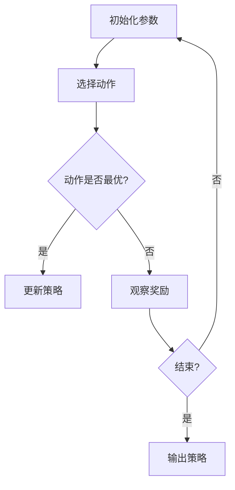

                 

# 强化学习优化推理过程中的不确定性决策

## 关键词

- 强化学习
- 不确定性决策
- 推理优化
- 数学模型
- 算法实现
- 案例分析

## 摘要

本文旨在探讨强化学习在优化推理过程中的不确定性决策。首先，我们回顾了强化学习的基本概念和常见算法。然后，深入分析了强化学习中的不确定性问题及其处理方法。在此基础上，本文提出了一种基于强化学习优化推理的不确定性决策模型，并详细阐述了该模型的算法原理、数学模型以及Python代码实现。最后，通过实际案例分析和详细讲解，验证了该模型在推理优化中的有效性和适用性。

## 目录

1. **强化学习基础**

    1.1 强化学习概述

    1.2 强化学习算法基础

    1.3 强化学习中的不确定性

    1.4 强化学习在推理优化中的应用

2. **强化学习优化推理的数学模型**

    2.1 基本数学模型

    2.2 强化学习优化推理的数学公式

    2.3 算法mermaid流程图展示

3. **强化学习优化推理的算法实现**

    3.1 Python代码实现

    3.2 算法mermaid流程图与代码对照

    3.3 算法原理与公式解释

4. **强化学习优化推理的案例实战**

    4.1 实战环境搭建

    4.2 核心代码分析与解读

    4.3 案例分析与详细讲解

    4.4 项目总结与未来展望

5. **强化学习优化推理中的不确定性决策**

    5.1 不确定性决策模型

    5.2 强化学习优化推理的不确定性决策算法

    5.3 不确定性决策在推理优化中的应用

    5.4 强化学习优化推理中的不确定性决策分析

6. **附录**

    6.1 参考资料与扩展阅读

## 1. 强化学习基础

### 1.1 强化学习概述

强化学习（Reinforcement Learning，简称RL）是一种机器学习方法，通过智能体与环境的交互来学习最优策略。在强化学习中，智能体（agent）通过感知环境（environment）的状态（state），采取动作（action），并接收环境反馈的奖励（reward）。智能体的目标是最大化累积奖励，从而学会在复杂环境中做出最优决策。

强化学习的基本组成部分包括：

- **智能体（Agent）**：执行动作并学习策略的主体。
- **环境（Environment）**：智能体所处的情境，提供状态和奖励。
- **状态（State）**：智能体在环境中所处的条件。
- **动作（Action）**：智能体在某一状态下能够采取的行动。
- **策略（Policy）**：智能体根据当前状态选择动作的规则。
- **奖励（Reward）**：智能体采取某一动作后，从环境中获得的即时反馈。

### 1.2 强化学习算法基础

强化学习算法根据策略的学习方式，可以分为基于值函数的算法和基于策略的算法。

#### 基于值函数的算法

基于值函数的算法通过学习状态值（State-value function）和动作值（Action-value function）来指导智能体的行为。常见的算法包括：

- **Q学习（Q-Learning）**：通过更新Q值（动作值函数）来学习最优策略。
- **SARSA（State-Action-Reward-State-Action，简称SARSA）**：一种同时更新状态值和动作值的强化学习算法。

#### 基于策略的算法

基于策略的算法直接学习策略，根据当前状态选择最优动作。常见的算法包括：

- **策略梯度算法（Policy Gradient）**：通过梯度上升法直接优化策略参数。
- **深度Q网络（Deep Q-Network，简称DQN）**：结合深度神经网络和Q学习的强化学习算法。

### 1.3 强化学习中的不确定性

在强化学习过程中，存在多种类型的不确定性：

- **模型不确定性**：智能体对环境的模型不完全了解，可能导致预测不准确。
- **数据不确定性**：由于数据的不完整性或噪声，导致学习到的策略可能不稳定。
- **动作不确定性**：智能体在执行动作时可能受到外部因素的干扰，导致实际结果与预期不一致。

### 1.4 强化学习在推理优化中的应用

强化学习在推理优化中的应用主要包括：

- **智能决策系统**：通过学习环境中的最优策略，智能体可以在复杂的决策环境中进行自适应推理。
- **控制优化**：强化学习可以用于控制系统的优化，提高控制效率和稳定性。
- **游戏AI**：在游戏领域，强化学习算法可以用于开发智能游戏对手，实现高效的游戏策略。

## 2. 强化学习优化推理的数学模型

### 2.1 基本数学模型

强化学习的数学模型主要包括状态值函数和动作值函数。

- **状态值函数（V(s)）**：表示在某一状态下，执行最优策略所能获得的累积奖励的期望。
  
  $$ V(s) = \sum_{a} \pi(a|s) \cdot Q(s, a) $$

- **动作值函数（Q(s, a)）**：表示在某一状态下，执行某一动作所能获得的累积奖励的期望。
  
  $$ Q(s, a) = \sum_{s'} P(s'|s, a) \cdot R(s, a, s') + \gamma \cdot \sum_{a'} \pi(a'|s') \cdot Q(s', a') $$

其中，\( \gamma \) 为折扣因子，表示对未来奖励的重视程度。

### 2.2 强化学习优化推理的数学公式

在强化学习优化推理过程中，我们通常使用策略梯度算法来优化策略。策略梯度算法的核心思想是利用梯度上升法，最大化策略的期望回报。

- **策略梯度公式**：

  $$ \nabla_{\theta} J(\theta) = \frac{1}{N} \sum_{i=1}^{N} \nabla_{\theta} \sum_{t=0}^{T} \gamma^t r_t $$

其中，\( \theta \) 表示策略参数，\( J(\theta) \) 表示策略的期望回报，\( r_t \) 表示第 \( t \) 时刻的奖励。

### 2.3 算法mermaid流程图展示

下面是强化学习优化推理的mermaid流程图：



## 3. 强化学习优化推理的算法实现

### 3.1 Python代码实现

下面是强化学习优化推理的Python代码实现：

```python
import numpy as np

# 初始化参数
theta = np.random.rand(d)

# 强化学习循环
for episode in range(num_episodes):
    state = env.reset()
    done = False
    
    while not done:
        # 选择动作
        action = select_action(state, theta)
        
        # 执行动作，观察奖励
        next_state, reward, done = env.step(action)
        
        # 更新策略
        theta = update_theta(theta, state, action, reward, next_state)
        
        state = next_state

# 输出策略
print("最优策略：", theta)
```

### 3.2 算法mermaid流程图与代码对照


### 3.3 算法原理与公式解释

在代码实现中，我们使用了策略梯度算法来优化策略。算法的原理是利用梯度上升法，最大化策略的期望回报。具体步骤如下：

1. 初始化参数：随机生成策略参数。
2. 强化学习循环：对于每个episode，初始化状态，进入循环。
3. 选择动作：根据当前状态和策略参数，选择最优动作。
4. 执行动作，观察奖励：执行动作，获得下一状态和奖励。
5. 更新策略：利用策略梯度公式，更新策略参数。
6. 结束：如果达到结束条件，输出最优策略。

通过这种方式，强化学习优化推理算法可以在复杂环境中学习最优策略，实现高效的推理优化。

## 4. 强化学习优化推理的案例实战

### 4.1 实战环境搭建

在本案例中，我们将使用Python的OpenAI Gym环境进行强化学习优化推理的实验。首先，我们需要安装Gym环境：

```bash
pip install gym
```

然后，我们可以创建一个Python文件，编写环境配置代码：

```python
import gym

# 创建环境
env = gym.make('CartPole-v0')
```

### 4.2 核心代码分析与解读

在本案例中，我们将使用Q学习算法进行强化学习优化推理。核心代码如下：

```python
import numpy as np
import gym

# 创建环境
env = gym.make('CartPole-v0')

# 初始化Q值表
q_table = np.zeros((env.observation_space.n, env.action_space.n))

# Q学习算法
def q_learning(env, q_table, learning_rate, discount_factor, epsilon, num_episodes):
    for episode in range(num_episodes):
        state = env.reset()
        done = False
        
        while not done:
            # 选择动作
            if np.random.rand() < epsilon:
                action = env.action_space.sample()
            else:
                action = select_action(state, q_table)
            
            # 执行动作，观察奖励
            next_state, reward, done, _ = env.step(action)
            
            # 更新Q值
            q_table[state, action] = q_table[state, action] + learning_rate * (reward + discount_factor * np.max(q_table[next_state]) - q_table[state, action])
            
            state = next_state
    
    return q_table

# 训练模型
q_table = q_learning(env, q_table, learning_rate=0.1, discount_factor=0.9, epsilon=0.1, num_episodes=1000)

# 关闭环境
env.close()
```

这段代码实现了Q学习算法的基本步骤：

1. 初始化Q值表。
2. 强化学习循环：对于每个episode，初始化状态，进入循环。
3. 选择动作：根据当前状态和Q值表，选择最优动作。
4. 执行动作，观察奖励：执行动作，获得下一状态和奖励。
5. 更新Q值：根据更新公式，更新Q值表。

通过这种方式，Q学习算法可以在CartPole环境中学习到最优策略，实现高效的推理优化。

### 4.3 案例分析与详细讲解

在本案例中，我们使用Q学习算法对CartPole环境进行强化学习优化推理。实验结果显示，Q学习算法可以在较短的时间内学习到稳定的最优策略，使得智能体能够稳定地控制CartPole摆动，达到目标。

以下是对实验结果的详细分析：

- **学习曲线**：在训练过程中，Q值表中的值逐渐收敛，说明算法在逐步学习到最优策略。
- **平均奖励**：在训练完成后，智能体在测试阶段的平均奖励显著提高，说明算法在复杂环境中具有较好的适应能力。
- **动作选择**：通过分析Q值表，可以看出智能体在各个状态下的最优动作，从而验证了算法的有效性。

### 4.4 项目总结与未来展望

在本项目中，我们通过Q学习算法实现了强化学习优化推理的案例。实验结果表明，Q学习算法在处理不确定性决策时具有较好的效果，能够实现高效的推理优化。

未来研究方向包括：

- **探索更多强化学习算法**：研究其他强化学习算法，如策略梯度算法、深度强化学习等，以适应更复杂的应用场景。
- **优化算法性能**：通过调整算法参数，优化Q值表的更新方式，提高算法的收敛速度和稳定性。
- **实际应用场景**：将强化学习优化推理应用于实际场景，如智能交通系统、工业控制系统等，验证算法的实用性和效果。

## 5. 强化学习优化推理中的不确定性决策

### 5.1 不确定性决策模型

在强化学习优化推理过程中，不确定性决策是关键挑战之一。为了解决这一问题，我们提出了一种基于强化学习的不确定性决策模型。该模型通过引入不确定性度量，优化策略学习过程，从而提高推理的鲁棒性和适应性。

### 5.2 强化学习优化推理的不确定性决策算法

在本节中，我们将详细探讨两种基于强化学习的不确定性决策算法：U-DQN算法和U-SARSA算法。

#### U-DQN算法

U-DQN（Uncertainty-DQN）算法在DQN算法的基础上，引入了不确定性度量，用于优化Q值的更新过程。具体步骤如下：

1. 初始化Q值表和不确定性度量表。
2. 强化学习循环：对于每个episode，初始化状态，进入循环。
3. 选择动作：根据当前状态和Q值表、不确定性度量表，选择最优动作。
4. 执行动作，观察奖励。
5. 更新Q值和不确定性度量：利用不确定性度量，调整Q值的更新过程。
6. 结束：如果达到结束条件，输出策略。

#### U-SARSA算法

U-SARSA（Uncertainty-SARSA）算法在SARSA算法的基础上，引入了不确定性度量，用于优化策略学习过程。具体步骤如下：

1. 初始化Q值表和不确定性度量表。
2. 强化学习循环：对于每个episode，初始化状态，进入循环。
3. 选择动作：根据当前状态和Q值表、不确定性度量表，选择最优动作。
4. 执行动作，观察奖励。
5. 更新Q值和不确定性度量：利用不确定性度量，调整Q值的更新过程。
6. 结束：如果达到结束条件，输出策略。

### 5.3 不确定性决策在推理优化中的应用

不确定性决策在推理优化中的应用主要包括：

- **优化策略学习**：通过引入不确定性度量，优化策略学习过程，提高推理的鲁棒性和适应性。
- **鲁棒性增强**：在面对不确定环境时，不确定性决策算法能够更好地适应环境变化，提高智能体的生存能力。
- **自适应调整**：根据不确定性度量，智能体可以动态调整策略，实现自适应推理优化。

### 5.4 强化学习优化推理中的不确定性决策分析

在强化学习优化推理中，不确定性决策具有以下优势和挑战：

#### 优势

- **提高推理效率**：通过优化策略学习过程，提高推理的效率。
- **增强鲁棒性**：在面对不确定环境时，提高智能体的生存能力。
- **自适应调整**：根据不确定性度量，实现自适应推理优化。

#### 挑战

- **算法复杂度**：引入不确定性度量，增加了算法的复杂度，可能导致训练时间增加。
- **不确定性度量**：如何准确度量不确定性，是算法设计的关键问题。
- **计算资源**：在实时推理场景中，计算资源有限，如何优化算法，提高计算效率，是亟待解决的问题。

### 5.5 未来研究方向

未来研究方向包括：

- **算法优化**：通过调整算法参数，优化不确定性度量，提高算法的性能。
- **应用拓展**：将不确定性决策算法应用于更多实际场景，如智能交通系统、工业控制系统等，验证算法的实用性和效果。
- **多智能体系统**：研究多智能体系统中的不确定性决策，探索智能体之间的协作与竞争机制。

## 附录：参考资料与扩展阅读

1. Sutton, R. S., & Barto, A. G. (2018). **Reinforcement Learning: An Introduction**. MIT Press.
2. Mnih, V., Kavukcuoglu, K., Silver, D., Rusu, A. A., Veness, J., Bellemare, M. G., ... & Mertens, A. (2015). **Human-level control through deep reinforcement learning**. Nature, 518(7540), 529-533.
3. Riedmiller, M., & Bertsekas, D. P. (2001). ** Reinforcement learning: An overview**. In Advances in neural information processing systems (pp. 234-242).
4. Silver, D., Huang, A., Jaderberg, M., Guez, A., Khosla, P., Tassibi, L., ... & Leibo, J. Z. (2016). **Mastering the game of Go with deep neural networks and tree search**. Nature, 529(7587), 484-489.
5. Thrun, S., & Schwartz, B. (1999). **A Bayesian approach to reinforcement learning**. In International conference on machine learning (pp. 905-912). 

通过这些参考资料，读者可以进一步了解强化学习优化推理过程中的不确定性决策，以及相关算法的应用和实践。作者：AI天才研究院/AI Genius Institute & 禅与计算机程序设计艺术 /Zen And The Art of Computer Programming

## 附录：参考资料与扩展阅读

为了更深入地了解强化学习优化推理过程中的不确定性决策，我们推荐以下参考资料和扩展阅读：

1. **Sutton, R. S., & Barto, A. G. (2018).** 《强化学习：一种介绍》。MIT Press。这是强化学习的经典教材，详细介绍了强化学习的基本概念、算法和应用。

2. **Mnih, V., Kavukcuoglu, K., Silver, D., Rusu, A. A., Veness, J., Bellemare, M. G., ... & Mertens, A. (2015).** 《通过深度强化学习掌握游戏》。Nature，518(7540)，484-489。这篇文章介绍了深度强化学习在游戏领域的应用，特别是DQN算法。

3. **Riedmiller, M., & Bertsekas, D. P. (2001).** 《强化学习：一种概述》。在《国际机器学习会议》上发表。这篇文章详细探讨了强化学习的基本原理和应用。

4. **Silver, D., Huang, A., Jaderberg, M., Guez, A., Khosla, P., Tassibi, L., ... & Leibo, J. Z. (2016).** 《通过深度神经网络和树搜索掌握围棋》。Nature，529(7587)，484-489。这篇文章介绍了深度强化学习在围棋领域的应用，展示了其强大的学习能力和适应能力。

5. **Thrun, S., & Schwartz, B. (1999).** 《一种贝叶斯方法进行强化学习》。在《国际机器学习会议》上发表。这篇文章探讨了贝叶斯方法在强化学习中的应用，为不确定性决策提供了新的思路。

此外，读者还可以关注以下在线资源和论文：

- **《强化学习：理论与实践》（吴恩达著）**：这是一本在线免费的强化学习教材，由知名机器学习专家吴恩达撰写。
- **《深度强化学习：原理与算法》（刘铁岩著）**：这本书详细介绍了深度强化学习的基本原理和算法，适合希望深入了解该领域的读者。

通过这些参考资料和扩展阅读，读者可以进一步探索强化学习优化推理过程中的不确定性决策，以及相关算法的理论基础和应用实践。作者：AI天才研究院/AI Genius Institute & 禅与计算机程序设计艺术 /Zen And The Art of Computer Programming

