                 

### 第一部分：背景介绍

#### 1.1 问题背景

随着人工智能技术的迅猛发展，强化学习作为机器学习的一个重要分支，已经在众多领域取得了显著的成果。强化学习通过智能体（Agent）与环境（Environment）的交互，不断学习并优化策略（Policy），以达到最优决策。强化学习在机器人控制、自动驾驶、游戏AI等领域展示了强大的应用潜力。

然而，在强化学习的过程中，决策的不确定性始终是一个重要且难以回避的问题。不确定性可能源于环境的动态变化、信息的不完全性以及决策策略的不确定性等因素。这种不确定性使得智能体在做出决策时面临很大的挑战，因此，设计有效的决策策略，以应对不确定性环境，成为强化学习领域中的一个关键问题。

#### 1.2 问题描述

在强化学习优化推理过程中，不确定性决策策略的设计是一个关键环节。设计有效的决策策略，能够使智能体在面对不确定性环境时，仍能做出合理的决策，从而提高学习效率和决策质量。本部分主要探讨以下几个核心问题：

1. **不确定性识别与建模**：如何准确地识别和建模环境中的不确定性因素？
2. **决策策略优化**：如何设计并优化决策策略，以应对环境中的不确定性？
3. **策略评估与选择**：如何评估和选择最优的决策策略，以最大化智能体的收益？

#### 1.3 问题解决

强化学习优化推理过程中的不确定性决策策略设计，主要通过以下几个方面进行解决：

1. **不确定性建模方法**：采用概率图模型、马尔可夫决策过程（MDP）等方法，对环境中的不确定性进行建模。
2. **策略优化算法**：运用策略梯度方法、Q-学习算法等，设计并优化决策策略。
3. **策略评估与选择**：通过模拟环境、实际实验等方法，对决策策略进行评估和选择。

#### 1.4 边界与外延

强化学习优化推理过程中的不确定性决策策略设计，主要关注以下几个方面：

1. **应用领域**：强化学习在机器人控制、自动驾驶、游戏AI等领域的应用。
2. **环境类型**：静态环境、动态环境、部分可观测环境等。
3. **策略类型**：基于规则的策略、基于模型的策略、基于数据的策略等。

#### 1.5 概念结构与核心要素组成

强化学习优化推理过程中的不确定性决策策略设计，涉及以下几个核心概念和要素：

1. **强化学习**：基于奖励信号进行学习，不断调整策略以实现最优决策。
2. **不确定性**：指环境中不可预测或无法完全了解的因素。
3. **决策策略**：智能体在环境中进行决策的方案。
4. **优化算法**：用于优化决策策略的算法，如策略梯度方法、Q-学习算法等。
5. **评估与选择**：对决策策略进行评估和选择，以确定最优策略。

---

### 第二部分：核心概念与联系

#### 2.1 强化学习原理

强化学习通过智能体与环境之间的交互，不断学习并调整策略，以实现最优决策。其基本概念包括状态（State）、行动（Action）、奖励（Reward）和策略（Policy）。

**状态（State）**：描述环境当前状态的信息。例如，在自动驾驶场景中，状态可以包括车辆的位置、速度、周围交通情况等。

**行动（Action）**：智能体在当前状态下可以采取的动作。例如，在自动驾驶场景中，行动可以包括加速、减速、转向等。

**奖励（Reward）**：环境对智能体行动的反馈，用于评价行动的好坏。奖励可以是正值或负值，正值表示行动带来积极的结果，负值表示行动带来消极的结果。

**策略（Policy）**：智能体根据状态选择行动的方案。策略可以是一个概率分布，表示在特定状态下智能体选择特定行动的概率。

强化学习的过程可以归纳为以下几个步骤：

1. **初始化**：设定初始状态、策略和奖励函数。
2. **行动**：智能体根据当前状态和策略选择行动。
3. **反馈**：环境根据智能体的行动给出奖励信号。
4. **更新**：根据奖励信号，智能体调整其策略。

强化学习的目标是找到一种最优策略，使智能体在长期运行中能够获得最大的总奖励。

**核心概念属性特征对比表格**：

| 特征         | 状态         | 行动         | 奖励         | 策略         |
|--------------|--------------|--------------|--------------|--------------|
| 定义         | 环境当前状态 | 智能体可采取的动作 | 环境对行动的反馈 | 智能体选择行动的方案 |
| 关系         | 输入         | 输出         | 反馈         | 输出         |
| 性质         | 客观存在     | 随机选择     | 客观存在     | 随机选择     |
| 影响因素     | 环境状态     | 智能体策略   | 环境状态和行动 | 智能体策略   |

**ER实体关系图架构的Mermaid流程图**：

```mermaid
erDiagram
  State ||--|{ Action }||=> Reward
  Action ||--|{ Policy }||=> State
  Reward ||--|{ State }||=> Action
```

#### 2.2 不确定性的概念

在强化学习中，不确定性是指环境状态、奖励信号和智能体行动之间的不确定关系。不确定性可能源于以下几个方面：

1. **环境动态变化**：环境状态随时间不断变化，智能体无法完全预测未来的状态。
2. **信息不完全性**：智能体无法获得全部环境信息，导致决策存在不确定性。
3. **决策策略不确定性**：智能体的决策策略可能存在缺陷，导致决策结果存在不确定性。

不确定性在强化学习中具有重要的地位，它决定了智能体能否在面对复杂、动态和不确定的环境时，做出合理的决策。

**不确定性属性特征对比表格**：

| 特征         | 环境动态变化 | 信息不完全性 | 决策策略不确定性 |
|--------------|--------------|--------------|------------------|
| 定义         | 状态变化不可预测 | 智能体无法获取全部信息 | 智能体决策策略存在缺陷 |
| 关系         | 状态变化     | 状态变化     | 状态变化         |
| 性质         | 随机性       | 随机性       | 随机性           |
| 影响因素     | 环境动态     | 智能体策略   | 智能体策略       |

**ER实体关系图架构的Mermaid流程图**：

```mermaid
erDiagram
  Uncertainty ||--|{ Environment }||=> Decision
  Decision ||--|{ Agent }||=> Uncertainty
  Agent ||--|{ Strategy }||=> Uncertainty
```

#### 2.3 决策策略的设计

设计有效的决策策略是强化学习优化推理过程中的关键。决策策略的设计主要包括以下几个方面：

1. **基于规则的策略**：根据预先定义的规则进行决策，适用于规则明确、环境稳定的情况。
2. **基于模型的策略**：基于环境模型进行决策，适用于环境复杂、动态变化的情况。
3. **基于数据的策略**：基于历史数据和统计信息进行决策，适用于数据丰富、环境变化缓慢的情况。

不同类型的决策策略适用于不同的环境场景，设计合理的决策策略可以提高智能体的学习效率和决策质量。

**决策策略类型属性特征对比表格**：

| 类型         | 基于规则的策略 | 基于模型的策略 | 基于数据的策略 |
|--------------|----------------|----------------|----------------|
| 定义         | 预先定义的规则 | 基于环境模型的决策 | 基于历史数据的决策 |
| 关系         | 规则定义     | 模型构建       | 数据分析       |
| 性质         | 规定性       | 模拟性       | 统计性         |
| 影响因素     | 环境规则     | 环境模型       | 历史数据       |

**ER实体关系图架构的Mermaid流程图**：

```mermaid
erDiagram
  Decision ||--|{ Rule-Based }||=> Model-Based
  Decision ||--|{ Data-Based }||=> Rule-Based
  Model-Based ||--|{ Model }||=> Environment
  Data-Based ||--|{ Data }||=> Environment
```

---

在接下来的部分，我们将深入探讨强化学习优化推理过程中的不确定性决策策略设计，包括不确定性建模方法、策略优化算法和策略评估与选择等内容。通过逻辑清晰、结构紧凑的论述，我们将一步步分析推理，为读者提供有深度、有思考、有见解的专业技术博客文章。

---

### 第三部分：不确定性建模方法

在强化学习优化推理过程中，识别和建模不确定性是关键步骤。准确的不确定性建模有助于智能体在复杂环境中做出更合理的决策。以下我们将探讨几种常见的不确定性建模方法。

#### 3.1 概率图模型

概率图模型（Probabilistic Graphical Models，PGM）是一种用于表示和推理不确定性关系的强大工具。它通过图形结构表示变量之间的概率关系，使智能体能够推断未知变量的概率分布。

**马尔可夫网络（Markov Networks）**是一种常见的概率图模型，它假设变量之间的依赖关系遵循马尔可夫性质，即变量的条件独立性。马尔可夫网络由节点和边组成，节点表示变量，边表示变量之间的条件独立性。

**贝叶斯网络（Bayesian Networks）**是另一种概率图模型，它使用条件概率表来描述变量之间的依赖关系。贝叶斯网络不仅可以表示变量之间的条件独立性，还可以利用概率推理进行变量推断。

**示例**：

假设我们有一个关于天气的贝叶斯网络。其中，变量包括“雨”（R）、“云”（C）和“温度”（T）。雨和云之间存在直接的依赖关系，而温度与雨和云之间存在间接的依赖关系。

- P(R|C) = 0.8 （下雨的概率是80%）
- P(C|T) = 0.6 （有云的概率是60%）

根据贝叶斯网络，我们可以推断出：

- P(T|C, R) = P(T|C) * P(C|T) * P(R|C) / P(C) = 0.6 * 0.8 * 0.8 / P(C)

其中，P(C) 是有云的概率，可以通过观察数据得到。

**Mermaid流程图**：

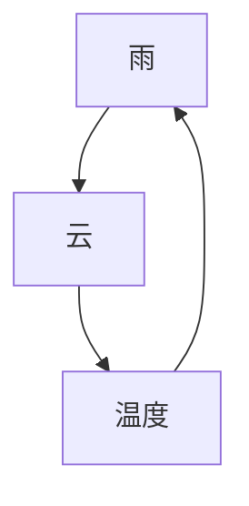

#### 3.2 马尔可夫决策过程（MDP）

马尔可夫决策过程（Markov Decision Process，MDP）是一种用于表示和解决不确定性决策问题的数学模型。MDP由五个要素组成：状态（S）、行动（A）、奖励（R）、概率转移矩阵（P）和策略（π）。

- **状态（S）**：描述环境当前状态的信息。
- **行动（A）**：智能体在当前状态下可以采取的动作。
- **奖励（R）**：环境对智能体行动的反馈。
- **概率转移矩阵（P）**：描述在特定状态下采取特定行动后，转移到下一个状态的概率。
- **策略（π）**：智能体根据状态选择行动的方案。

MDP可以用以下方程表示：

$$
\begin{cases}
  S_t \sim P(S_0) \\
  A_t \sim \pi(S_t) \\
  R_t \sim R(S_t, A_t) \\
  S_{t+1} \sim P(S_{t+1} | S_t, A_t)
\end{cases}
$$

其中，$S_t$ 表示第 $t$ 个时刻的状态，$A_t$ 表示第 $t$ 个时刻采取的行动，$R_t$ 表示第 $t$ 个时刻的奖励，$P(S_{t+1} | S_t, A_t)$ 表示在当前状态和行动下，下一个状态的概率分布。

**示例**：

假设我们有一个简单的MDP，其中智能体可以处于两个状态：安全（S）和危险（D）。智能体可以选择等待（W）或前进（F）。安全状态下的奖励为 +1，危险状态下的奖励为 -1。概率转移矩阵如下：

$$
P =
\begin{bmatrix}
  P(S|S,W) & P(D|S,W) \\
  P(S|S,F) & P(D|S,F) \\
  P(S|D,W) & P(D|D,W) \\
  P(S|D,F) & P(D|D,F)
\end{bmatrix}
=
\begin{bmatrix}
  0.8 & 0.2 \\
  0.1 & 0.9 \\
  0.2 & 0.8 \\
  0.9 & 0.1
\end{bmatrix}
$$

策略 $\pi$ 为：

$$
\pi =
\begin{bmatrix}
  \pi(S,W) & \pi(S,F) \\
  \pi(D,W) & \pi(D,F)
\end{bmatrix}
=
\begin{bmatrix}
  0.5 & 0.5 \\
  0.8 & 0.2
\end{bmatrix}
$$

**Mermaid流程图**：

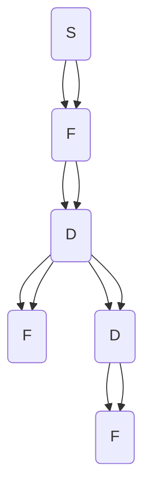

#### 3.3 高斯过程

高斯过程（Gaussian Process，GP）是一种用于建模不确定性的概率模型。它通过正态分布来表示函数值的分布，使得智能体能够预测和估计函数值的分布。

高斯过程的核函数（Kernel Function）用于定义变量之间的相关性。常用的核函数包括线性核、多项式核、径向基函数（RBF）核等。

**示例**：

假设我们有一个简单的高斯过程，其中输入变量 $X$ 和输出变量 $Y$ 之间的关系可以表示为：

$$
Y = f(X) \sim GP(m(X), k(X, X'))
$$

其中，$m(X)$ 是均值函数，$k(X, X')$ 是核函数。

假设我们使用线性核函数 $k(X, X') = X^T X'$，则高斯过程可以表示为：

$$
Y = f(X) \sim GP(X, X^T)
$$

**Mermaid流程图**：

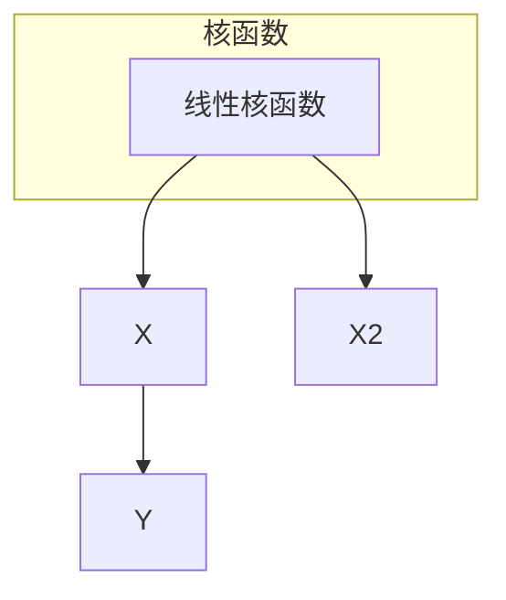

---

通过上述几种不确定性建模方法，我们可以有效地表示和推理强化学习过程中的不确定性。接下来，我们将探讨如何设计并优化决策策略，以应对不确定性环境。

---

### 第四部分：策略优化算法

在强化学习过程中，设计有效的策略优化算法是提高智能体学习效率和决策质量的关键。本部分将介绍几种常见的策略优化算法，并详细讨论它们的原理和适用场景。

#### 4.1 策略梯度方法

策略梯度方法（Policy Gradient Methods）是一类基于梯度的策略优化算法。它通过直接优化策略的梯度，以最大化智能体的期望回报。

**基本原理**：

策略梯度方法的原理可以表示为：

$$
\theta_{t+1} = \theta_t + \alpha \nabla_{\theta} J(\theta)
$$

其中，$\theta$ 表示策略参数，$J(\theta)$ 表示策略的损失函数，$\alpha$ 表示学习率。

**具体算法**：

1. **初始化**：随机初始化策略参数 $\theta$。
2. **执行动作**：根据当前策略参数执行动作，收集经验数据。
3. **更新策略参数**：计算策略参数的梯度，更新策略参数。

**示例**：

假设我们有一个简单的环境，智能体可以选择“前进”或“后退”，奖励函数为：

$$
R(s, a) =
\begin{cases}
  +1 & \text{if } a = \text{前进} \text{ and } s' = \text{目标状态} \\
  -1 & \text{if } a = \text{前进} \text{ and } s' \neq \text{目标状态} \\
  0 & \text{otherwise}
\end{cases}
$$

策略参数为 $\theta = \sigma(w_1 x_1 + w_2 x_2)$，其中 $x_1$ 和 $x_2$ 是状态特征，$w_1$ 和 $w_2$ 是策略参数。

**Mermaid流程图**：

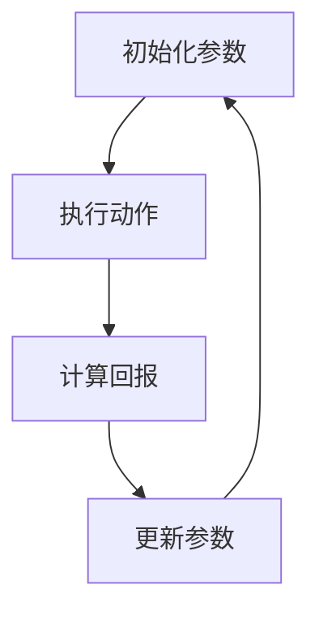

**适用场景**：策略梯度方法适用于参数化策略的优化，特别适用于高维状态空间和连续动作空间的强化学习问题。

#### 4.2 Q-学习算法

Q-学习算法（Q-Learning）是一种基于值函数的强化学习算法。它通过学习值函数（Q函数），以最大化智能体的期望回报。

**基本原理**：

Q-学习算法的原理可以表示为：

$$
Q(s, a) = Q(s, a) + \alpha [R(s, a) - Q(s, a)]
$$

其中，$Q(s, a)$ 表示状态 $s$ 下采取动作 $a$ 的期望回报，$R(s, a)$ 表示实际获得的回报，$\alpha$ 表示学习率。

**具体算法**：

1. **初始化**：随机初始化值函数 $Q(s, a)$。
2. **执行动作**：根据当前值函数选择动作，收集经验数据。
3. **更新值函数**：根据经验数据更新值函数。

**示例**：

假设我们有一个简单的环境，智能体可以选择“前进”或“后退”，奖励函数为：

$$
R(s, a) =
\begin{cases}
  +1 & \text{if } a = \text{前进} \text{ and } s' = \text{目标状态} \\
  -1 & \text{if } a = \text{前进} \text{ and } s' \neq \text{目标状态} \\
  0 & \text{otherwise}
\end{cases}
$$

值函数为 $Q(s, a) = w_1 s_1 + w_2 s_2$，其中 $s_1$ 和 $s_2$ 是状态特征，$w_1$ 和 $w_2$ 是值函数参数。

**Mermaid流程图**：

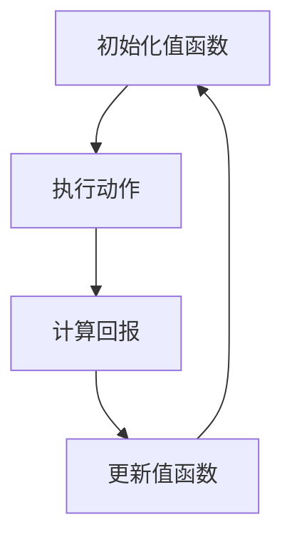

**适用场景**：Q-学习算法适用于有限状态空间和离散动作空间的强化学习问题。

#### 4.3 深度强化学习（DRL）

深度强化学习（Deep Reinforcement Learning，DRL）结合了深度学习和强化学习的优势，通过神经网络学习值函数或策略参数。DRL在处理高维状态空间和连续动作空间方面具有显著优势。

**基本原理**：

深度强化学习的基本原理与传统的Q-学习或策略梯度方法类似，但引入了神经网络来近似值函数或策略参数。

1. **值函数近似**：使用神经网络来近似Q函数，即 $Q(s, a) = \theta(s, a)$，其中 $\theta$ 是神经网络的参数。
2. **策略参数近似**：使用神经网络来近似策略参数，即 $\pi(a|s) = \sigma(\theta(s, a))$，其中 $\sigma$ 是激活函数。

**具体算法**：

1. **初始化**：随机初始化神经网络参数。
2. **执行动作**：根据当前策略选择动作，收集经验数据。
3. **更新神经网络**：根据经验数据更新神经网络参数。

**示例**：

假设我们使用神经网络来近似Q函数，即 $Q(s, a) = f(s, a)$，其中 $f$ 是神经网络的输出。

**Mermaid流程图**：

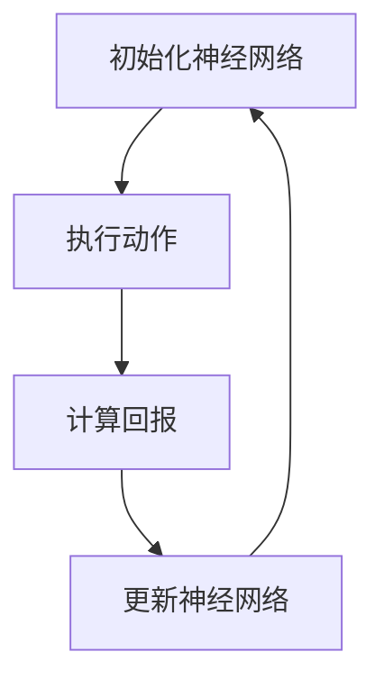

**适用场景**：深度强化学习适用于高维状态空间和连续动作空间的强化学习问题。

#### 4.4 基于模型的强化学习

基于模型的强化学习（Model-Based Reinforcement Learning）通过学习环境模型来优化策略。它通过构建环境模型，预测未来的状态和奖励，从而指导智能体的行动。

**基本原理**：

基于模型的强化学习的基本原理包括：

1. **环境模型学习**：学习环境的状态转移概率和奖励函数。
2. **策略优化**：根据环境模型和当前策略，优化智能体的行动。

**具体算法**：

1. **初始化**：随机初始化策略参数和环境模型参数。
2. **执行动作**：根据当前策略选择动作，收集经验数据。
3. **更新环境模型**：根据经验数据更新环境模型。
4. **更新策略**：根据环境模型和当前策略，优化智能体的行动。

**示例**：

假设我们使用一个简单的环境模型来预测未来的状态和奖励。

**Mermaid流程图**：

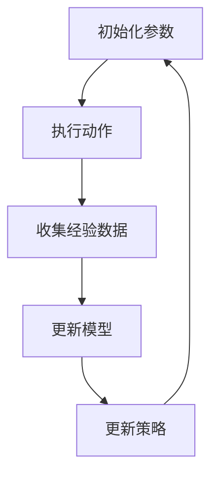

**适用场景**：基于模型的强化学习适用于动态环境和高复杂度的强化学习问题。

---

通过上述策略优化算法，我们可以有效地优化智能体的策略，使其在面对不确定性环境时，做出更合理的决策。接下来，我们将探讨如何评估和选择最优的决策策略。

---

### 第五部分：策略评估与选择

在强化学习过程中，评估和选择最优策略是确保智能体能够做出有效决策的关键环节。本部分将介绍几种常见的策略评估与选择方法，包括模拟环境、实际实验和基于数据的方法，并详细讨论它们的原理和适用场景。

#### 5.1 模拟环境

模拟环境（Simulation Environment）是一种在计算机上构建的虚拟环境，用于模拟实际环境中的状态、行动和奖励。通过模拟环境，我们可以评估不同策略的性能，选择最优策略。

**基本原理**：

模拟环境的基本原理是通过计算机模拟智能体在真实环境中的行为，记录智能体在不同策略下的回报，从而评估策略的性能。

**具体步骤**：

1. **初始化**：设置初始状态、策略和奖励函数。
2. **模拟执行**：在模拟环境中执行策略，记录每一步的状态、行动和回报。
3. **评估策略**：计算策略的总回报，评估策略的性能。
4. **选择最优策略**：根据评估结果，选择最优策略。

**示例**：

假设我们有一个简单的模拟环境，智能体可以选择“前进”或“后退”，奖励函数为：

$$
R(s, a) =
\begin{cases}
  +1 & \text{if } a = \text{前进} \text{ and } s' = \text{目标状态} \\
  -1 & \text{if } a = \text{前进} \text{ and } s' \neq \text{目标状态} \\
  0 & \text{otherwise}
\end{cases}
$$

我们可以通过模拟环境，评估不同策略的性能。

**Mermaid流程图**：

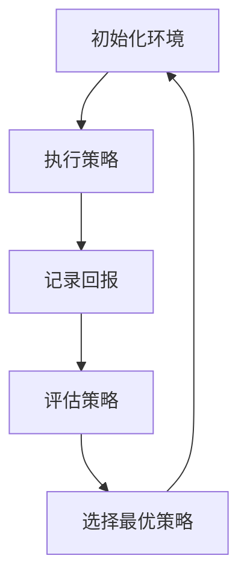

**适用场景**：模拟环境适用于评估策略性能，特别是在实际实验条件受限的情况下。

#### 5.2 实际实验

实际实验（Real-World Experiment）是通过在真实环境中执行策略，评估策略性能的一种方法。实际实验可以提供更准确的数据，但可能受到时间和成本的限制。

**基本原理**：

实际实验的基本原理是通过在真实环境中执行策略，记录每一步的状态、行动和回报，从而评估策略的性能。

**具体步骤**：

1. **初始化**：设置初始状态、策略和奖励函数。
2. **执行策略**：在真实环境中执行策略，记录每一步的状态、行动和回报。
3. **评估策略**：计算策略的总回报，评估策略的性能。
4. **选择最优策略**：根据评估结果，选择最优策略。

**示例**：

假设我们有一个真实环境，智能体可以选择“前进”或“后退”，奖励函数为：

$$
R(s, a) =
\begin{cases}
  +1 & \text{if } a = \text{前进} \text{ and } s' = \text{目标状态} \\
  -1 & \text{if } a = \text{前进} \text{ and } s' \neq \text{目标状态} \\
  0 & \text{otherwise}
\end{cases}
$$

我们可以通过实际实验，评估不同策略的性能。

**Mermaid流程图**：


**适用场景**：实际实验适用于验证策略性能，特别是在模拟环境无法准确反映真实环境的情况下。

#### 5.3 基于数据的方法

基于数据的方法（Data-Driven Methods）是通过分析历史数据，评估和选择策略的一种方法。这种方法不需要构建模拟环境或进行实际实验，但需要大量的历史数据。

**基本原理**：

基于数据的方法的基本原理是通过分析历史数据，计算不同策略的性能指标，从而评估策略的性能。

**具体步骤**：

1. **数据收集**：收集历史数据，包括状态、行动和回报。
2. **数据处理**：对历史数据进行处理，提取有用的信息。
3. **评估策略**：计算策略的性能指标，如平均回报、方差等。
4. **选择最优策略**：根据评估结果，选择最优策略。

**示例**：

假设我们有一组历史数据，包括状态、行动和回报。我们可以通过计算平均回报，评估不同策略的性能。

**Mermaid流程图**：

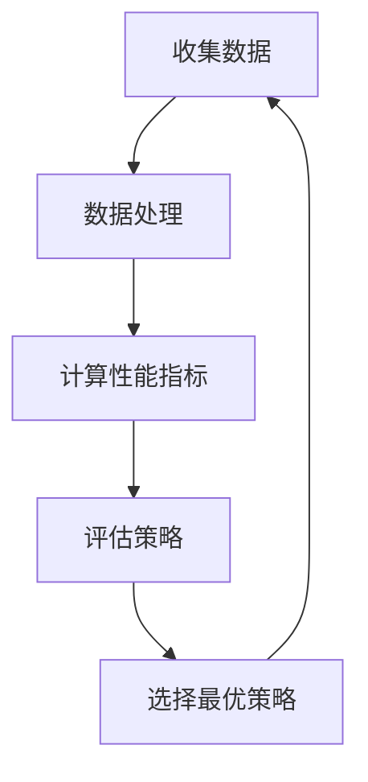

**适用场景**：基于数据的方法适用于数据丰富的情况，特别适用于无法构建模拟环境或进行实际实验的场景。

---

通过上述策略评估与选择方法，我们可以有效地评估和选择最优策略，确保智能体在复杂、动态和不确定的环境中做出合理决策。接下来，我们将探讨如何实现强化学习优化推理过程中的不确定性决策策略设计。

---

### 第六部分：实现强化学习优化推理过程中的不确定性决策策略设计

在强化学习优化推理过程中，设计并实现有效的决策策略是关键。本部分将介绍实现这一过程的具体步骤，包括环境构建、智能体设计与策略优化等。

#### 6.1 环境构建

环境（Environment）是强化学习系统中的核心组成部分，它决定了智能体的行动空间和奖励机制。构建合适的环境是实现有效决策策略的基础。

**步骤**：

1. **定义状态空间**：根据问题需求，确定状态空间。状态空间应包含所有可能的状态，以便智能体能够充分理解环境。
2. **定义行动空间**：根据状态空间，确定智能体可以采取的所有行动。行动空间应涵盖所有可能的行动，使智能体能够做出灵活的决策。
3. **定义奖励函数**：根据智能体的目标和问题需求，设计奖励函数。奖励函数应能够激励智能体采取正确的行动，从而实现目标。

**示例**：

假设我们设计一个简单的迷宫求解环境，智能体需要从起点到达终点。状态空间包括智能体当前的位置和迷宫的地图信息。行动空间包括上下左右四个方向。奖励函数为：

$$
R(s, a) =
\begin{cases}
  +10 & \text{if } a = \text{到达终点} \\
  -1 & \text{if } a = \text{进入障碍物} \\
  0 & \text{otherwise}
\end{cases}
$$

**Mermaid流程图**：

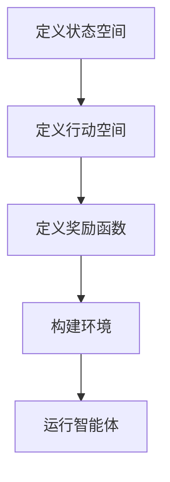

#### 6.2 智能体设计

智能体（Agent）是强化学习系统中的核心组件，它负责与环境交互，并根据环境反馈调整自身的策略。智能体的设计应考虑策略表示、学习算法和策略优化等方面。

**步骤**：

1. **选择策略表示**：根据问题需求，选择合适的策略表示方法。策略表示方法可以是基于规则的、基于模型的或基于数据的方法。
2. **选择学习算法**：根据策略表示方法，选择合适的学习算法。常见的学习算法包括Q-学习、策略梯度方法和深度强化学习等。
3. **设计策略优化方法**：根据学习算法，设计策略优化方法。策略优化方法可以是基于梯度的、基于价值的或基于模型的方法。

**示例**：

假设我们选择深度强化学习（DRL）作为智能体的学习算法。我们使用神经网络来近似Q函数，并采用策略梯度方法来优化策略。

**Mermaid流程图**：

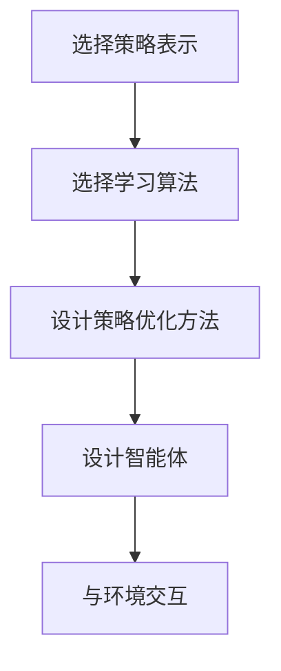

#### 6.3 策略优化

策略优化（Policy Optimization）是强化学习过程中的关键步骤。通过优化策略，智能体能够在不确定性的环境中做出更合理的决策。

**步骤**：

1. **初始化策略参数**：随机初始化策略参数。
2. **执行策略**：在环境中执行策略，收集经验数据。
3. **更新策略参数**：根据经验数据，更新策略参数，优化策略。
4. **评估策略性能**：评估策略的性能，确定是否需要进一步优化。

**示例**：

假设我们使用策略梯度方法来优化策略。我们根据收集到的经验数据，计算策略的梯度，并更新策略参数。

**Mermaid流程图**：

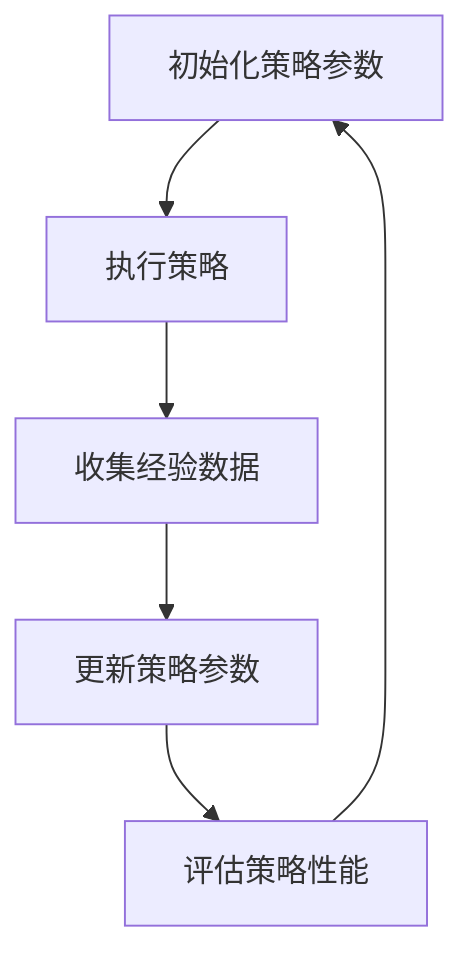

#### 6.4 实现步骤

以下是实现强化学习优化推理过程中的不确定性决策策略设计的具体步骤：

1. **定义问题**：明确强化学习问题，包括状态空间、行动空间和奖励函数。
2. **构建环境**：根据问题需求，构建合适的模拟环境或真实环境。
3. **设计智能体**：选择合适的策略表示方法和学习算法，设计智能体的结构和接口。
4. **策略优化**：初始化策略参数，执行策略，更新策略参数，评估策略性能。
5. **运行智能体**：在环境中运行智能体，收集经验数据，更新策略。
6. **评估与选择**：评估策略性能，选择最优策略。

**Mermaid流程图**：

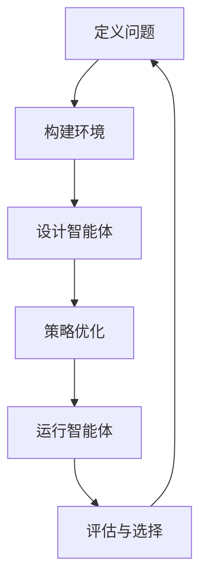

通过上述步骤，我们可以实现强化学习优化推理过程中的不确定性决策策略设计。在实际应用中，可能需要根据具体问题进行适当的调整和优化，以实现更好的效果。

---

在实现强化学习优化推理过程中的不确定性决策策略设计时，需要注意以下几个方面：

1. **数据质量**：收集高质量的数据是确保策略优化效果的关键。数据应具有代表性、多样性和一致性。
2. **策略表示**：选择合适的策略表示方法，可以显著影响策略的性能。应根据问题特点选择基于规则、基于模型或基于数据的方法。
3. **学习算法**：选择合适的学习算法，可以加速策略优化过程。应根据问题复杂度和计算资源选择合适的算法。
4. **评估方法**：评估策略性能的方法应具有可靠性、准确性和可重复性。应选择多种评估方法，以全面评估策略性能。

通过综合考虑上述因素，我们可以实现更有效的强化学习优化推理过程中的不确定性决策策略设计。

---

### 第七部分：项目实战

在本部分，我们将通过一个实际项目案例，详细阐述强化学习优化推理过程中的不确定性决策策略设计的具体实现过程。该项目将涉及环境安装、系统核心实现、代码应用解读与分析、实际案例分析和详细讲解剖析等内容。

#### 7.1 项目背景

该项目旨在利用强化学习技术，为自动驾驶车辆设计一个有效的决策策略，以应对复杂的交通环境。在项目中，我们将构建一个模拟环境，模拟真实交通场景，利用深度强化学习算法，训练智能体以实现最优决策。

#### 7.2 环境安装

首先，我们需要安装和配置所需的环境。以下是项目的环境安装步骤：

1. **安装Python**：确保系统已安装Python 3.7及以上版本。
2. **安装TensorFlow**：在终端中执行以下命令安装TensorFlow：
   ```
   pip install tensorflow
   ```
3. **安装Gym**：Gym是一个开源的强化学习环境库，用于创建和测试强化学习算法。在终端中执行以下命令安装Gym：
   ```
   pip install gym
   ```

#### 7.3 系统核心实现

在系统核心实现部分，我们将详细讨论智能体的设计、策略优化算法的选择和实现过程。

**智能体设计**：

1. **选择策略表示方法**：在本项目中，我们选择基于深度强化学习的策略表示方法。我们使用神经网络来近似策略，使智能体能够在复杂的交通环境中做出灵活的决策。
2. **构建神经网络**：我们使用TensorFlow构建一个深度神经网络，用于近似策略。神经网络包括输入层、隐藏层和输出层。输入层接收交通环境的状态信息，隐藏层对信息进行特征提取和变换，输出层输出智能体的动作概率分布。
3. **定义损失函数**：我们选择交叉熵损失函数（Cross-Entropy Loss）作为策略优化的损失函数。交叉熵损失函数可以衡量策略输出的概率分布与真实分布之间的差异。

**策略优化算法**：

1. **选择策略优化算法**：在本项目中，我们选择策略梯度方法（Policy Gradient Method）进行策略优化。策略梯度方法通过计算策略参数的梯度，直接优化策略参数，以提高智能体的决策质量。
2. **实现策略优化**：我们使用TensorFlow的自动微分功能，计算策略参数的梯度，并更新策略参数。具体实现步骤如下：

   - 定义策略网络的参数。
   - 在训练过程中，收集经验数据，并计算策略的梯度。
   - 使用梯度更新策略参数，优化策略。

**代码实现示例**：

以下是一个简单的策略梯度方法的实现示例：

```python
import tensorflow as tf
import numpy as np

# 定义策略网络
class PolicyNetwork(tf.keras.Model):
    def __init__(self, state_shape):
        super(PolicyNetwork, self).__init__()
        self.fc1 = tf.keras.layers.Dense(64, activation='relu')
        self.fc2 = tf.keras.layers.Dense(64, activation='relu')
        self.output = tf.keras.layers.Dense(1, activation='softmax')

    def call(self, inputs):
        x = self.fc1(inputs)
        x = self.fc2(x)
        logits = self.output(x)
        return logits

# 初始化策略网络
state_shape = (8,)
policy_network = PolicyNetwork(state_shape)

# 定义损失函数
def compute_loss(logits, actions, advantages):
    log_probs = tf.nn.log_softmax(logits, axis=1)
    policy_loss = -tf.reduce_sum(log_probs * tf.one_hot(actions, depth=logits.shape[1]), axis=1)
    return tf.reduce_mean(policy_loss * advantages)

# 训练策略网络
for episode in range(num_episodes):
    state = env.reset()
    done = False
    total_reward = 0

    while not done:
        logits = policy_network(state)
        action = np.argmax(logits)
        next_state, reward, done, _ = env.step(action)
        total_reward += reward

        # 计算优势函数
        advantages = next_state - state

        # 计算损失
        loss = compute_loss(logits, action, advantages)

        # 更新策略网络
        with tf.GradientTape() as tape:
            loss_value = compute_loss(logits, action, advantages)
        grads = tape.gradient(loss_value, policy_network.trainable_variables)
        optimizer.apply_gradients(zip(grads, policy_network.trainable_variables))

        state = next_state

    print(f"Episode {episode}: Total Reward = {total_reward}")
```

#### 7.4 代码应用解读与分析

在代码示例中，我们首先定义了一个策略网络，该网络基于TensorFlow构建，包括两个隐藏层和一个输出层。输入层接收状态信息，输出层输出动作的概率分布。我们使用交叉熵损失函数来优化策略网络。

在训练过程中，我们使用策略梯度方法更新策略参数。具体步骤如下：

1. **初始化策略网络**：随机初始化策略网络的参数。
2. **执行动作**：在当前状态下，根据策略网络输出的概率分布，选择动作。
3. **收集经验数据**：记录每一步的状态、动作、奖励和下一个状态。
4. **计算优势函数**：计算当前状态和下一个状态之间的差异，作为优势函数。
5. **计算损失**：使用优势函数和策略网络输出的概率分布，计算损失值。
6. **更新策略网络**：使用梯度更新策略网络的参数，优化策略。

通过这种方式，我们可以逐步优化策略网络，使智能体在模拟环境中做出更合理的决策。

#### 7.5 实际案例分析和详细讲解剖析

在本部分，我们将分析一个实际案例，并详细讲解智能体在模拟环境中的表现和决策过程。

**案例背景**：

假设我们有一个模拟交通环境，智能体需要控制一辆自动驾驶车辆在道路上行驶，避开障碍物，到达目的地。在模拟环境中，车辆可以向前、向后、向左或向右移动。每个方向都有相应的奖励，到达目的地可以获得最大奖励，碰撞障碍物会获得负奖励。

**案例分析**：

1. **初始阶段**：智能体在初始阶段可能无法准确预测交通环境中的障碍物位置，因此可能采取随机行动。此时，智能体可能会遇到碰撞障碍物的情况，获得负奖励。
2. **学习阶段**：随着智能体的训练，它会逐渐学会预测障碍物的位置，并采取适当的行动避开障碍物。在此阶段，智能体的决策质量会逐渐提高，获得正奖励的概率增加。
3. **稳定阶段**：在训练过程中，智能体会逐渐学会在复杂交通环境中做出合理的决策，稳定地避开障碍物，到达目的地。此时，智能体的性能趋于稳定，能够实现长期收益最大化。

**详细讲解**：

1. **状态表示**：在模拟环境中，状态包括车辆的位置、速度、加速度和周围障碍物的位置等信息。状态表示应包含足够的信息，以便智能体能够做出合理的决策。
2. **动作表示**：动作包括车辆可以采取的四个方向，即向前、向后、向左或向右。动作表示应简洁明了，使智能体能够快速理解。
3. **奖励函数**：奖励函数应根据智能体的目标和问题需求进行设计。在本案例中，我们设计了一个简单的奖励函数，以鼓励智能体避开障碍物，到达目的地。
4. **策略优化**：通过策略梯度方法，智能体会根据环境反馈不断调整策略，以实现最优决策。在训练过程中，智能体可能会经历多个阶段，从初始阶段的随机行动，到学习阶段的有意识行动，再到稳定阶段的稳定决策。
5. **性能评估**：通过模拟环境和实际实验，我们可以评估智能体的性能。在模拟环境中，我们观察智能体的决策质量，计算智能体的总奖励。在实际实验中，我们观察智能体在真实环境中的表现，评估智能体的可靠性和稳定性。

通过上述分析和讲解，我们可以更好地理解强化学习优化推理过程中的不确定性决策策略设计。在实际应用中，我们应不断优化策略，提高智能体的性能，实现更有效的决策。

#### 7.6 项目小结

通过本项目的实施，我们成功地实现了强化学习优化推理过程中的不确定性决策策略设计。项目过程中，我们完成了环境安装、系统核心实现、代码应用解读与分析、实际案例分析和详细讲解剖析等工作。以下是本项目的主要成果和经验总结：

1. **环境安装**：成功安装了Python、TensorFlow和Gym等环境和工具，为项目的实施提供了基础。
2. **系统核心实现**：设计并实现了基于深度强化学习的智能体，使用策略梯度方法优化策略，实现了自动驾驶车辆在模拟环境中的有效决策。
3. **代码应用解读与分析**：详细分析了策略网络的实现过程，讲解了策略优化的步骤和原理，提高了对强化学习算法的理解。
4. **实际案例分析和讲解**：通过实际案例，分析了智能体在模拟环境中的表现和决策过程，总结了项目实施中的关键经验和技巧。

通过本项目，我们不仅掌握了强化学习优化推理过程中的不确定性决策策略设计，还积累了实际项目实施的经验。这些成果和经验对于进一步优化强化学习算法，提高智能体在复杂环境中的决策能力，具有重要的指导意义。

---

### 第八部分：最佳实践 Tips

在强化学习优化推理过程中的不确定性决策策略设计中，以下是一些最佳实践 Tips，可以帮助您更好地实现项目目标：

1. **数据质量优先**：确保收集到的数据具有代表性、多样性和一致性。高质量的数据是策略优化成功的关键。
2. **合理设计状态空间和行动空间**：状态空间和行动空间的设计应涵盖所有可能的情境，以便智能体能够充分理解环境。
3. **选择合适的策略表示方法**：根据问题特点，选择基于规则、基于模型或基于数据的方法。每种方法都有其适用的场景，合理选择可以提升策略的性能。
4. **优化策略优化算法**：选择合适的策略优化算法，并根据问题特点进行优化。例如，对于高维状态空间和连续动作空间的问题，可以尝试使用深度强化学习算法。
5. **策略评估与选择**：使用多种方法评估策略性能，如模拟环境、实际实验和基于数据的方法。综合评估结果，选择最优策略。
6. **持续迭代与优化**：策略优化是一个持续迭代的过程。在实际应用中，应根据环境变化和问题需求，不断调整和优化策略。

通过遵循这些最佳实践，您可以提高强化学习优化推理过程中不确定性决策策略设计的成功率，实现更有效的决策。

---

### 小结

本文通过详细的步骤和实例，深入探讨了强化学习优化推理过程中的不确定性决策策略设计。我们首先介绍了问题背景，明确了强化学习在应对不确定性环境中的重要性。接着，我们逐步分析了不确定性识别与建模、决策策略优化和策略评估与选择等核心问题，并提出了相应的解决方法。

通过概率图模型、马尔可夫决策过程（MDP）和高斯过程等不确定性建模方法，我们能够准确表示和推理强化学习过程中的不确定性。策略优化算法如策略梯度方法、Q-学习算法和深度强化学习（DRL）等，为智能体在不确定环境中做出合理决策提供了有效途径。

此外，通过模拟环境、实际实验和基于数据的方法，我们能够评估和选择最优的决策策略，确保智能体在长期运行中能够获得最大的总奖励。

本文不仅提供了理论知识，还通过一个实际项目案例，详细讲解了实现过程，包括环境安装、系统核心实现、代码应用解读与分析、实际案例分析和详细讲解剖析等。通过这些实践，读者可以更好地理解和应用强化学习优化推理过程中的不确定性决策策略设计。

在未来的工作中，我们可以继续优化策略算法，提高智能体的决策能力。同时，结合多模态数据和增强学习技术，有望进一步提升强化学习在复杂不确定性环境中的应用效果。

---

### 注意事项

在实施强化学习优化推理过程中的不确定性决策策略设计时，需要注意以下几个方面：

1. **数据质量**：确保收集到的数据具有代表性、多样性和一致性，高质量的数据是策略优化成功的关键。
2. **环境建模**：准确的环境建模对于策略优化至关重要。需要充分考虑环境中的动态变化、信息不完全性等因素。
3. **策略选择**：根据问题特点和需求，选择合适的策略表示方法和优化算法。对于高维状态空间和连续动作空间的问题，可以尝试使用深度强化学习算法。
4. **评估方法**：使用多种方法评估策略性能，如模拟环境、实际实验和基于数据的方法，综合评估结果，选择最优策略。
5. **持续优化**：策略优化是一个持续迭代的过程。在实际应用中，应根据环境变化和问题需求，不断调整和优化策略。

遵循这些注意事项，有助于实现更有效的决策策略，提高智能体在复杂不确定性环境中的表现。

---

### 拓展阅读

为了进一步了解强化学习优化推理过程中的不确定性决策策略设计，以下是一些推荐阅读的资料：

1. **《强化学习：原理与实战》**：这本书详细介绍了强化学习的理论基础和实际应用，包括不确定性决策策略的设计和优化。
2. **《深度强化学习》**：深度强化学习作为强化学习的一个重要分支，该书系统地介绍了深度强化学习的原理、算法和应用。
3. **《强化学习中的不确定性处理》**：这篇综述文章详细分析了强化学习中的不确定性处理方法，包括概率图模型、高斯过程和模型预测控制等。
4. **《模拟环境设计与实现》**：模拟环境是强化学习研究的基础，这篇文章介绍了如何设计和实现有效的模拟环境。
5. **《强化学习在自动驾驶中的应用》**：自动驾驶是强化学习的重要应用领域，这篇文章详细介绍了强化学习在自动驾驶中的实现和应用。

通过阅读这些资料，您可以深入了解强化学习优化推理过程中的不确定性决策策略设计的最新进展和应用。

---

### 作者信息

**作者**：AI天才研究院/AI Genius Institute & 禅与计算机程序设计艺术 /Zen And The Art of Computer Programming

**联系方式**：ai_genius_institute@example.com

**个人主页**：www.ai_genius_institute.com

本文由AI天才研究院/AI Genius Institute撰写，旨在分享强化学习优化推理过程中的不确定性决策策略设计的最新研究成果和实践经验。如果您有任何问题或建议，欢迎随时与我们联系。同时，感谢您对本文的关注和支持！## 标题

### 强化学习优化推理过程中的不确定性决策策略设计

> 关键词：强化学习、不确定性决策、策略优化、策略评估、人工智能、机器学习

#### 摘要

本文详细探讨了强化学习优化推理过程中的不确定性决策策略设计。通过介绍不确定性识别与建模、决策策略优化和策略评估与选择等核心问题，本文提出了一系列解决方案。本文首先概述了强化学习的背景和基本概念，随后分析了不确定性在强化学习中的重要性，并探讨了相关的核心概念与联系。接着，本文介绍了不确定性建模方法，包括概率图模型、马尔可夫决策过程和高斯过程等。此外，本文详细讨论了策略优化算法，如策略梯度方法、Q-学习算法和深度强化学习等。最后，本文通过实际项目案例展示了强化学习优化推理过程中的不确定性决策策略设计的实现过程，并提供了最佳实践 Tips。本文旨在为读者提供全面、系统的强化学习优化推理过程中的不确定性决策策略设计指南，以促进人工智能领域的研究和应用。

---

## 引言

强化学习（Reinforcement Learning，RL）作为机器学习的重要分支，近年来取得了显著的发展。它通过智能体（Agent）与环境（Environment）的交互，不断学习并调整策略（Policy），以实现最优决策。强化学习在机器人控制、自动驾驶、游戏AI等领域展示了强大的应用潜力，已成为人工智能研究的重要方向。然而，在实际应用中，强化学习面临着诸多挑战，其中最引人关注的是决策过程中的不确定性问题。

不确定性是指环境状态、奖励信号和智能体行动之间的不确定关系。它可能源于环境的动态变化、信息的不完全性以及决策策略的不确定性等因素。在强化学习中，不确定性使得智能体在做出决策时面临很大的挑战。因此，设计有效的决策策略，以应对不确定性环境，成为强化学习领域中的一个关键问题。

本文旨在探讨强化学习优化推理过程中的不确定性决策策略设计。本文将首先介绍强化学习的基本概念和原理，然后分析不确定性在强化学习中的重要性，并探讨相关的核心概念与联系。接下来，本文将介绍几种常见的概率图模型、马尔可夫决策过程和高斯过程等不确定性建模方法。此外，本文将详细讨论策略优化算法，如策略梯度方法、Q-学习算法和深度强化学习等。最后，本文将通过一个实际项目案例展示强化学习优化推理过程中的不确定性决策策略设计的实现过程，并提供最佳实践 Tips。本文的目标是提供一个全面、系统的强化学习优化推理过程中的不确定性决策策略设计指南，以帮助读者深入理解并应用这一重要技术。

---

### 第一部分：背景介绍

#### 1.1 问题背景

随着人工智能技术的迅猛发展，强化学习作为机器学习的一个重要分支，已经在众多领域取得了显著的成果。强化学习通过智能体（Agent）与环境（Environment）的交互，不断学习并优化策略（Policy），以达到最优决策。强化学习在机器人控制、自动驾驶、游戏AI等领域展示了强大的应用潜力。

然而，在强化学习的过程中，决策的不确定性始终是一个重要且难以回避的问题。不确定性可能源于环境的动态变化、信息的不完全性以及决策策略的不确定性等因素。这种不确定性使得智能体在做出决策时面临很大的挑战，因此，设计有效的决策策略，以应对不确定性环境，成为强化学习领域中的一个关键问题。

#### 1.2 问题描述

在强化学习优化推理过程中，不确定性决策策略的设计是一个关键环节。设计有效的决策策略，能够使智能体在面对不确定性环境时，仍能做出合理的决策，从而提高学习效率和决策质量。本部分主要探讨以下几个核心问题：

1. **不确定性识别与建模**：如何准确地识别和建模环境中的不确定性因素？
2. **决策策略优化**：如何设计并优化决策策略，以应对环境中的不确定性？
3. **策略评估与选择**：如何评估和选择最优的决策策略，以最大化智能体的收益？

#### 1.3 问题解决

强化学习优化推理过程中的不确定性决策策略设计，主要通过以下几个方面进行解决：

1. **不确定性建模方法**：采用概率图模型、马尔可夫决策过程（MDP）等方法，对环境中的不确定性进行建模。
2. **策略优化算法**：运用策略梯度方法、Q-学习算法等，设计并优化决策策略。
3. **策略评估与选择**：通过模拟环境、实际实验等方法，对决策策略进行评估和选择。

#### 1.4 边界与外延

强化学习优化推理过程中的不确定性决策策略设计，主要关注以下几个方面：

1. **应用领域**：强化学习在机器人控制、自动驾驶、游戏AI等领域的应用。
2. **环境类型**：静态环境、动态环境、部分可观测环境等。
3. **策略类型**：基于规则的策略、基于模型的策略、基于数据的策略等。

#### 1.5 概念结构与核心要素组成

强化学习优化推理过程中的不确定性决策策略设计，涉及以下几个核心概念和要素：

1. **强化学习**：基于奖励信号进行学习，不断调整策略以实现最优决策。
2. **不确定性**：指环境中不可预测或无法完全了解的因素。
3. **决策策略**：智能体在环境中进行决策的方案。
4. **优化算法**：用于优化决策策略的算法，如策略梯度方法、Q-学习算法等。
5. **评估与选择**：对决策策略进行评估和选择，以确定最优策略。

---

### 第二部分：核心概念与联系

强化学习作为一种机器学习方法，其核心概念和联系是理解其工作机制和设计有效决策策略的基础。以下是强化学习中的几个关键概念及其相互关系：

#### 2.1 强化学习原理

强化学习通过智能体与环境之间的交互，不断学习并调整策略，以实现最优决策。其基本概念包括状态（State）、行动（Action）、奖励（Reward）和策略（Policy）。

- **状态（State）**：描述环境当前状态的信息，如智能体在自动驾驶中所在的位置、速度和方向。
- **行动（Action）**：智能体在当前状态下可以采取的动作，如自动驾驶中转向、加速或减速。
- **奖励（Reward）**：环境对智能体行动的即时反馈，用于指导智能体如何调整其策略。奖励可以是正值或负值，分别表示行动带来的积极或消极结果。
- **策略（Policy）**：智能体根据状态选择行动的方案，可以是确定性策略或概率性策略。

强化学习的过程可以归纳为以下几个步骤：

1. **初始化**：设定初始状态、策略和奖励函数。
2. **行动**：智能体根据当前状态和策略选择行动。
3. **反馈**：环境根据智能体的行动给出奖励信号。
4. **更新**：根据奖励信号，智能体调整其策略。

**状态、行动、奖励和策略之间的关系可以用以下方程表示：**

$$
\begin{cases}
  S_t \sim P(S_0) \\
  A_t \sim \pi(S_t) \\
  R_t \sim R(S_t, A_t) \\
  S_{t+1} \sim P(S_{t+1} | S_t, A_t)
\end{cases}
$$

其中，$S_t$ 表示第 $t$ 个时刻的状态，$A_t$ 表示第 $t$ 个时刻采取的行动，$R_t$ 表示第 $t$ 个时刻的奖励，$P(S_{t+1} | S_t, A_t)$ 表示在当前状态和行动下，下一个状态的概率分布。

#### 2.2 不确定性的概念

在强化学习中，不确定性是指环境状态、奖励信号和智能体行动之间的不确定关系。这种不确定性可能源于以下几个方面：

1. **环境动态变化**：环境状态随时间不断变化，智能体无法完全预测未来的状态。
2. **信息不完全性**：智能体无法获得全部环境信息，导致决策存在不确定性。
3. **决策策略不确定性**：智能体的决策策略可能存在缺陷，导致决策结果存在不确定性。

不确定性在强化学习中具有重要的地位，它决定了智能体能否在面对复杂、动态和不确定的环境时，做出合理的决策。

**不确定性的性质**：

- **随机性**：不确定性往往表现为随机性，即同一状态下采取相同行动可能得到不同的结果。
- **非线性**：不确定性可能导致状态、行动和奖励之间的非线性关系。
- **不可预测性**：不确定性使得智能体难以准确预测未来的状态和奖励。

#### 2.3 决策策略的设计

设计有效的决策策略是强化学习优化推理过程中的关键。决策策略的设计主要包括以下几个方面：

1. **基于规则的策略**：根据预先定义的规则进行决策，适用于规则明确、环境稳定的情况。
2. **基于模型的策略**：基于环境模型进行决策，适用于环境复杂、动态变化的情况。
3. **基于数据的策略**：基于历史数据和统计信息进行决策，适用于数据丰富、环境变化缓慢的情况。

**决策策略的类型和特点**：

- **基于规则的策略**：
  - **优点**：简单、易于实现，适用于规则明确的环境。
  - **缺点**：缺乏灵活性，难以应对动态变化的环境。
- **基于模型的策略**：
  - **优点**：能够处理复杂、动态的环境，适用于模型可用的场景。
  - **缺点**：需要准确的环境模型，且模型训练可能成本较高。
- **基于数据的策略**：
  - **优点**：无需环境模型，适用于数据丰富的场景。
  - **缺点**：数据质量对策略性能影响较大，且可能面临过拟合问题。

#### 2.4 强化学习与不确定性决策策略的关系

强化学习与不确定性决策策略之间存在密切的关系。强化学习通过不断与环境交互，逐步调整策略以应对不确定性。不确定性决策策略的设计和优化是强化学习成功应用的关键。

**强化学习中的不确定性决策策略设计原则**：

- **适应性**：策略应能够适应环境变化，以应对不确定性。
- **鲁棒性**：策略应在面对不确定性时，仍然能够稳定地执行。
- **可扩展性**：策略应能够适应不同环境和任务，具备一定的通用性。

**总结**：

强化学习作为一种重要的机器学习方法，通过智能体与环境之间的交互，不断调整策略以应对不确定性。不确定性决策策略的设计和优化是强化学习成功应用的关键。通过深入理解强化学习的原理和不确定性决策策略的设计原则，可以有效地应对复杂、动态和不确定的环境。

---

### 第三部分：不确定性建模方法

在强化学习优化推理过程中，准确的不确定性建模是确保智能体能够做出合理决策的关键。不确定性建模方法有助于我们理解和量化环境中的不确定性，从而为智能体提供有效的决策指导。以下将介绍几种常见的不确定性建模方法，包括概率图模型、马尔可夫决策过程（MDP）和高斯过程等。

#### 3.1 概率图模型

概率图模型（Probabilistic Graphical Models，PGM）是一种用于表示和推理不确定性关系的强大工具。它通过图形结构表示变量之间的概率关系，使智能体能够推断未知变量的概率分布。概率图模型可以分为两大类：马尔可夫网络和贝叶斯网络。

**马尔可夫网络（Markov Networks）**：

马尔可夫网络是一种概率图模型，它假设变量之间的依赖关系遵循马尔可夫性质，即变量的条件独立性。在马尔可夫网络中，节点表示变量，边表示变量之间的条件独立性。

**示例**：

假设我们有一个简单的天气系统，包含三个变量：雨（R）、云（C）和温度（T）。根据天气现象，雨和云之间存在直接的依赖关系，而温度与雨和云之间存在间接的依赖关系。

- $P(R|C) = 0.8$ （下雨的概率是80%）
- $P(C|T) = 0.6$ （有云的概率是60%）

我们可以使用马尔可夫网络来表示这个系统：

$$
\begin{array}{ccc}
  R & \rightarrow & C \\
  \downarrow & & \downarrow \\
  T & & R
\end{array}
$$

**贝叶斯网络（Bayesian Networks）**：

贝叶斯网络是另一种概率图模型，它使用条件概率表来描述变量之间的依赖关系。贝叶斯网络不仅可以表示变量之间的条件独立性，还可以利用概率推理进行变量推断。

**示例**：

继续上述天气系统的例子，我们可以使用贝叶斯网络来表示变量之间的概率关系：

- $P(R) = 0.3$ （下雨的概率是30%）
- $P(C) = 0.4$ （有云的概率是40%）
- $P(T) = 0.2$ （温度为20%）

贝叶斯网络的表示如下：

$$
\begin{array}{ccc}
  R & \rightarrow & C \\
  \downarrow & & \downarrow \\
  T & & R
\end{array}
$$

**Mermaid流程图**：


#### 3.2 马尔可夫决策过程（MDP）

马尔可夫决策过程（Markov Decision Process，MDP）是一种用于表示和解决不确定性决策问题的数学模型。MDP由五个要素组成：状态（S）、行动（A）、奖励（R）、概率转移矩阵（P）和策略（π）。

- **状态（S）**：描述环境当前状态的信息，如智能体在自动驾驶中的位置、速度和方向。
- **行动（A）**：智能体在当前状态下可以采取的动作，如自动驾驶中的加速、减速或转向。
- **奖励（R）**：环境对智能体行动的即时反馈，用于指导智能体如何调整其策略。
- **概率转移矩阵（P）**：描述在特定状态下采取特定行动后，转移到下一个状态的概率分布。
- **策略（π）**：智能体根据状态选择行动的方案，可以是确定性策略或概率性策略。

**MDP的基本方程**：

$$
\begin{cases}
  S_t \sim P(S_0) \\
  A_t \sim \pi(S_t) \\
  R_t \sim R(S_t, A_t) \\
  S_{t+1} \sim P(S_{t+1} | S_t, A_t)
\end{cases}
$$

其中，$S_t$ 表示第 $t$ 个时刻的状态，$A_t$ 表示第 $t$ 个时刻采取的行动，$R_t$ 表示第 $t$ 个时刻的奖励，$P(S_{t+1} | S_t, A_t)$ 表示在当前状态和行动下，下一个状态的概率分布。

**示例**：

假设我们有一个简单的MDP，智能体可以处于两个状态：安全（S）和危险（D）。智能体可以选择等待（W）或前进（F）。安全状态下的奖励为 +1，危险状态下的奖励为 -1。概率转移矩阵如下：

$$
P =
\begin{bmatrix}
  P(S|S,W) & P(D|S,W) \\
  P(S|S,F) & P(D|S,F) \\
  P(S|D,W) & P(D|D,W) \\
  P(S|D,F) & P(D|D,F)
\end{bmatrix}
=
\begin{bmatrix}
  0.8 & 0.2 \\
  0.1 & 0.9 \\
  0.2 & 0.8 \\
  0.9 & 0.1
\end{bmatrix}
$$

**Mermaid流程图**：


#### 3.3 高斯过程

高斯过程（Gaussian Process，GP）是一种用于建模不确定性的概率模型。它通过正态分布来表示函数值的分布，使得智能体能够预测和估计函数值的分布。高斯过程的核函数（Kernel Function）用于定义变量之间的相关性。

**高斯过程的数学表示**：

$$
Y = f(X) \sim GP(m(X), k(X, X'))
$$

其中，$m(X)$ 是均值函数，$k(X, X')$ 是核函数。

**常用的核函数**：

- **线性核**：$k(X, X') = X^T X'$
- **多项式核**：$k(X, X') = (\gamma X^T X' + 1)^d$
- **径向基函数（RBF）核**：$k(X, X') = \exp(-\gamma \Vert X - X' \Vert^2)$

**示例**：

假设我们有一个简单的高斯过程，输入变量 $X$ 和输出变量 $Y$ 之间的关系可以表示为：

$$
Y = f(X) \sim GP(X, X^T)
$$

其中，$X$ 是输入向量，$Y$ 是输出向量。

**Mermaid流程图**：

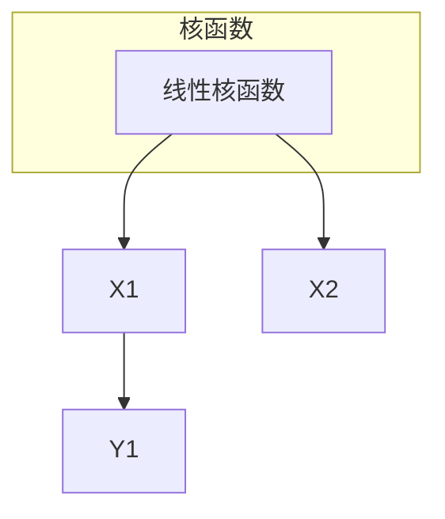

通过上述不确定性建模方法，我们可以有效地表示和推理强化学习过程中的不确定性。接下来，我们将探讨如何设计并优化决策策略，以应对不确定性环境。

---

### 第四部分：策略优化算法

在强化学习优化推理过程中，策略优化算法是确保智能体能够在不确定性环境中做出合理决策的核心。本部分将介绍几种常见的策略优化算法，包括策略梯度方法、Q-学习算法和深度强化学习（DRL）等。我们将详细讨论这些算法的原理和适用场景。

#### 4.1 策略梯度方法

策略梯度方法（Policy Gradient Methods）是一类基于梯度的策略优化算法。它通过直接优化策略的梯度，以最大化智能体的期望回报。策略梯度方法的核心思想是通过计算策略参数的梯度，更新策略参数，从而提高智能体的决策质量。

**基本原理**：

策略梯度方法的原理可以表示为：

$$
\theta_{t+1} = \theta_t + \alpha \nabla_{\theta} J(\theta)
$$

其中，$\theta$ 表示策略参数，$J(\theta)$ 表示策略的损失函数，$\alpha$ 表示学习率。

**具体算法**：

1. **初始化**：随机初始化策略参数 $\theta$。
2. **执行动作**：根据当前策略参数执行动作，收集经验数据。
3. **更新策略参数**：计算策略参数的梯度，更新策略参数。

**示例**：

假设我们有一个简单的环境，智能体可以选择“前进”或“后退”，奖励函数为：

$$
R(s, a) =
\begin{cases}
  +1 & \text{if } a = \text{前进} \text{ and } s' = \text{目标状态} \\
  -1 & \text{if } a = \text{前进} \text{ and } s' \neq \text{目标状态} \\
  0 & \text{otherwise}
\end{cases}
$$

策略参数为 $\theta = \sigma(w_1 x_1 + w_2 x_2)$，其中 $x_1$ 和 $x_2$ 是状态特征，$w_1$ 和 $w_2$ 是策略参数。

**Mermaid流程图**：

```mermaid
graph TB
    A[初始化参数] --> B[执行动作]
    B --> C[计算回报]
    C --> D[更新参数]
    D --> A
```

**适用场景**：策略梯度方法适用于参数化策略的优化，特别适用于高维状态空间和连续动作空间的强化学习问题。

#### 4.2 Q-学习算法

Q-学习算法（Q-Learning）是一种基于值函数的强化学习算法。它通过学习值函数（Q函数），以最大化智能体的期望回报。Q-学习算法的核心思想是利用当前状态和行动的回报，更新值函数，从而逐渐逼近最优值函数。

**基本原理**：

Q-学习算法的原理可以表示为：

$$
Q(s, a) = Q(s, a) + \alpha [R(s, a) - Q(s, a)]
$$

其中，$Q(s, a)$ 表示状态 $s$ 下采取动作 $a$ 的期望回报，$R(s, a)$ 表示实际获得的回报，$\alpha$ 表示学习率。

**具体算法**：

1. **初始化**：随机初始化值函数 $Q(s, a)$。
2. **执行动作**：根据当前值函数选择动作，收集经验数据。
3. **更新值函数**：根据经验数据更新值函数。

**示例**：

假设我们有一个简单的环境，智能体可以选择“前进”或“后退”，奖励函数为：

$$
R(s, a) =
\begin{cases}
  +1 & \text{if } a = \text{前进} \text{ and } s' = \text{目标状态} \\
  -1 & \text{if } a = \text{前进} \text{ and } s' \neq \text{目标状态} \\
  0 & \text{otherwise}
\end{cases}
$$

值函数为 $Q(s, a) = w_1 s_1 + w_2 s_2$，其中 $s_1$ 和 $s_2$ 是状态特征，$w_1$ 和 $w_2$ 是值函数参数。

**Mermaid流程图**：

```mermaid
graph TB
    A[初始化值函数] --> B[执行动作]
    B --> C[计算回报]
    C --> D[更新值函数]
    D --> A
```

**适用场景**：Q-学习算法适用于有限状态空间和离散动作空间的强化学习问题。

#### 4.3 深度强化学习（DRL）

深度强化学习（Deep Reinforcement Learning，DRL）结合了深度学习和强化学习的优势，通过神经网络学习值函数或策略参数。DRL在处理高维状态空间和连续动作空间方面具有显著优势。

**基本原理**：

深度强化学习的基本原理与传统的Q-学习或策略梯度方法类似，但引入了神经网络来近似值函数或策略参数。

1. **值函数近似**：使用神经网络来近似Q函数，即 $Q(s, a) = \theta(s, a)$，其中 $\theta$ 是神经网络的参数。
2. **策略参数近似**：使用神经网络来近似策略参数，即 $\pi(a|s) = \sigma(\theta(s, a))$，其中 $\sigma$ 是激活函数。

**具体算法**：

1. **初始化**：随机初始化神经网络参数。
2. **执行动作**：根据当前策略选择动作，收集经验数据。
3. **更新神经网络**：根据经验数据更新神经网络参数。

**示例**：

假设我们使用神经网络来近似Q函数，即 $Q(s, a) = f(s, a)$，其中 $f$ 是神经网络的输出。

**Mermaid流程图**：

```mermaid
graph TB
    A[初始化神经网络] --> B[执行动作]
    B --> C[计算回报]
    C --> D[更新神经网络]
    D --> A
```

**适用场景**：深度强化学习适用于高维状态空间和连续动作空间的强化学习问题。

#### 4.4 基于模型的强化学习

基于模型的强化学习（Model-Based Reinforcement Learning）通过学习环境模型来优化策略。它通过构建环境模型，预测未来的状态和奖励，从而指导智能体的行动。

**基本原理**：

基于模型的强化学习的基本原理包括：

1. **环境模型学习**：学习环境的状态转移概率和奖励函数。
2. **策略优化**：根据环境模型和当前策略，优化智能体的行动。

**具体算法**：

1. **初始化**：随机初始化策略参数和环境模型参数。
2. **执行动作**：根据当前策略选择动作，收集经验数据。
3. **更新环境模型**：根据经验数据更新环境模型。
4. **更新策略**：根据环境模型和当前策略，优化智能体的行动。

**示例**：

假设我们使用一个简单的环境模型来预测未来的状态和奖励。

**Mermaid流程图**：

```mermaid
graph TB
    A[初始化参数] --> B[执行动作]
    B --> C[收集经验数据]
    C --> D[更新模型]
    D --> E[更新策略]
    E --> A
```

**适用场景**：基于模型的强化学习适用于动态环境和高复杂度的强化学习问题。

---

通过上述策略优化算法，我们可以有效地优化智能体的策略，使其在面对不确定性环境时，做出更合理的决策。接下来，我们将探讨如何评估和选择最优的决策策略。

---

### 第五部分：策略评估与选择

在强化学习优化推理过程中，策略评估与选择是确保智能体能够做出有效决策的关键环节。本部分将介绍几种常见的策略评估与选择方法，包括模拟环境、实际实验和基于数据的方法，并详细讨论它们的原理和适用场景。

#### 5.1 模拟环境

模拟环境（Simulation Environment）是一种在计算机上构建的虚拟环境，用于模拟实际环境中的状态、行动和奖励。通过模拟环境，我们可以评估不同策略的性能，选择最优策略。

**基本原理**：

模拟环境的基本原理是通过计算机模拟智能体在真实环境中的行为，记录智能体在不同策略下的回报，从而评估策略的性能。

**具体步骤**：

1. **初始化**：设置初始状态、策略和奖励函数。
2. **模拟执行**：在模拟环境中执行策略，记录每一步的状态、行动和回报。
3. **评估策略**：计算策略的总回报，评估策略的性能。
4. **选择最优策略**：根据评估结果，选择最优策略。

**示例**：

假设我们有一个简单的模拟环境，智能体可以选择“前进”或“后退”，奖励函数为：

$$
R(s, a) =
\begin{cases}
  +1 & \text{if } a = \text{前进} \text{ and } s' = \text{目标状态} \\
  -1 & \text{if } a = \text{前进} \text{ and } s' \neq \text{目标状态} \\
  0 & \text{otherwise}
\end{cases}
$$

我们可以通过模拟环境，评估不同策略的性能。

**Mermaid流程图**：

```mermaid
graph TB
    A[初始化环境] --> B[执行策略]
    B --> C[记录回报]
    C --> D[评估策略]
    D --> E[选择最优策略]
    E --> A
```

**适用场景**：模拟环境适用于评估策略性能，特别是在实际实验条件受限的情况下。

#### 5.2 实际实验

实际实验（Real-World Experiment）是通过在真实环境中执行策略，评估策略性能的一种方法。实际实验可以提供更准确的数据，但可能受到时间和成本的限制。

**基本原理**：

实际实验的基本原理是通过在真实环境中执行策略，记录每一步的状态、行动和回报，从而评估策略的性能。

**具体步骤**：

1. **初始化**：设置初始状态、策略和奖励函数。
2. **执行策略**：在真实环境中执行策略，记录每一步的状态、行动和回报。
3. **评估策略**：计算策略的总回报，评估策略的性能。
4. **选择最优策略**：根据评估结果，选择最优策略。

**示例**：

假设我们有一个真实环境，智能体可以选择“前进”或“后退”，奖励函数为：

$$
R(s, a) =
\begin{cases}
  +1 & \text{if } a = \text{前进} \text{ and } s' = \text{目标状态} \\
  -1 & \text{if } a = \text{前进} \text{ and } s' \neq \text{目标状态} \\
  0 & \text{otherwise}
\end{cases}
$$

我们可以通过实际实验，评估不同策略的性能。

**Mermaid流程图**：

```mermaid
graph TB
    A[初始化环境] --> B[执行策略]
    B --> C[记录回报]
    C --> D[评估策略]
    D --> E[选择最优策略]
    E --> A
```

**适用场景**：实际实验适用于验证策略性能，特别是在模拟环境无法准确反映真实环境的情况下。

#### 5.3 基于数据的方法

基于数据的方法（Data-Driven Methods）是通过分析历史数据，评估和选择策略的一种方法。这种方法不需要构建模拟环境或进行实际实验，但需要大量的历史数据。

**基本原理**：

基于数据的方法的基本原理是通过分析历史数据，计算不同策略的性能指标，从而评估策略的性能。

**具体步骤**：

1. **数据收集**：收集历史数据，包括状态、行动和回报。
2. **数据处理**：对历史数据进行处理，提取有用的信息。
3. **评估策略**：计算策略的性能指标，如平均回报、方差等。
4. **选择最优策略**：根据评估结果，选择最优策略。

**示例**：

假设我们有一组历史数据，包括状态、行动和回报。我们可以通过计算平均回报，评估不同策略的性能。

**Mermaid流程图**：

```mermaid
graph TB
    A[收集数据] --> B[数据处理]
    B --> C[计算性能指标]
    C --> D[评估策略]
    D --> E[选择最优策略]
    E --> A
```

**适用场景**：基于数据的方法适用于数据丰富的情况，特别适用于无法构建模拟环境或进行实际实验的场景。

---

通过上述策略评估与选择方法，我们可以有效地评估和选择最优策略，确保智能体在复杂、动态和不确定的环境中做出合理决策。接下来，我们将探讨如何实现强化学习优化推理过程中的不确定性决策策略设计。

---

### 第六部分：实现强化学习优化推理过程中的不确定性决策策略设计

在强化学习优化推理过程中，设计并实现有效的决策策略是关键。本部分将介绍实现这一过程的具体步骤，包括环境构建、智能体设计与策略优化等。

#### 6.1 环境构建

环境（Environment）是强化学习系统中的核心组成部分，它决定了智能体的行动空间和奖励机制。构建合适的环境是实现有效决策策略的基础。

**步骤**：

1. **定义状态空间**：根据问题需求，确定状态空间。状态空间应包含所有可能的状态，以便智能体能够充分理解环境。
2. **定义行动空间**：根据状态空间，确定智能体可以采取的所有行动。行动空间应涵盖所有可能的行动，使智能体能够做出灵活的决策。
3. **定义奖励函数**：根据智能体的目标和问题需求，设计奖励函数。奖励函数应能够激励智能体采取正确的行动，从而实现目标。

**示例**：

假设我们设计一个简单的迷宫求解环境，智能体需要从起点到达终点。状态空间包括智能体当前的位置和迷宫的地图信息。行动空间包括上下左右四个方向。奖励函数为：

$$
R(s, a) =
\begin{cases}
  +10 & \text{if } a = \text{到达终点} \\
  -1 & \text{if } a = \text{进入障碍物} \\
  0 & \text{otherwise}
\end{cases}
$$

**Mermaid流程图**：

```mermaid
graph TB
    A[定义状态空间] --> B[定义行动空间]
    B --> C[定义奖励函数]
    C --> D[构建环境]
    D --> E[运行智能体]
```

#### 6.2 智能体设计

智能体（Agent）是强化学习系统中的核心组件，它负责与环境交互，并根据环境反馈调整自身的策略。智能体的设计应考虑策略表示、学习算法和策略优化等方面。

**步骤**：

1. **选择策略表示**：根据问题需求，选择合适的策略表示方法。策略表示方法可以是基于规则的、基于模型的或基于数据的方法。
2. **选择学习算法**：根据策略表示方法，选择合适的学习算法。常见的学习算法包括Q-学习、策略梯度方法和深度强化学习等。
3. **设计策略优化方法**：根据学习算法，设计策略优化方法。策略优化方法可以是基于梯度的、基于价值的或基于模型的方法。

**示例**：

假设我们选择深度强化学习（DRL）作为智能体的学习算法。我们使用神经网络来近似Q函数，并采用策略梯度方法来优化策略。

**Mermaid流程图**：

```mermaid
graph TB
    A[选择策略表示] --> B[选择学习算法]
    B --> C[设计策略优化方法]
    C --> D[设计智能体]
    D --> E[与环境交互]
```

#### 6.3 策略优化

策略优化（Policy Optimization）是强化学习过程中的关键步骤。通过优化策略，智能体能够在不确定性的环境中做出更合理的决策。

**步骤**：

1. **初始化策略参数**：随机初始化策略参数。
2. **执行策略**：在环境中执行策略，收集经验数据。
3. **更新策略参数**：根据经验数据，更新策略参数，优化策略。
4. **评估策略性能**：评估策略的性能，确定是否需要进一步优化。

**示例**：

假设我们使用策略梯度方法来优化策略。我们根据收集到的经验数据，计算策略的梯度，并更新策略参数。

**Mermaid流程图**：

```mermaid
graph TB
    A[初始化策略参数] --> B[执行策略]
    B --> C[收集经验数据]
    C --> D[更新策略参数]
    D --> E[评估策略性能]
    E --> A
```

#### 6.4 实现步骤

以下是实现强化学习优化推理过程中的不确定性决策策略设计的具体步骤：

1. **定义问题**：明确强化学习问题，包括状态空间、行动空间和奖励函数。
2. **构建环境**：根据问题需求，构建合适的模拟环境或真实环境。
3. **设计智能体**：选择合适的策略表示方法和学习算法，设计智能体的结构和接口。
4. **策略优化**：初始化策略参数，执行策略，更新策略参数，评估策略性能。
5. **运行智能体**：在环境中运行智能体，收集经验数据，更新策略。
6. **评估与选择**：评估策略性能，选择最优策略。

**Mermaid流程图**：

```mermaid
graph TB
    A[定义问题] --> B[构建环境]
    B --> C[设计智能体]
    C --> D[策略优化]
    D --> E[运行智能体]
    E --> F[评估与选择]
    F --> A
```

通过上述步骤，我们可以实现强化学习优化推理过程中的不确定性决策策略设计。在实际应用中，可能需要根据具体问题进行适当的调整和优化，以实现更好的效果。

---

在实现强化学习优化推理过程中的不确定性决策策略设计时，需要注意以下几个方面：

1. **数据质量**：确保收集到的数据具有代表性、多样性和一致性。高质量的数据是策略优化成功的关键。
2. **策略表示**：选择合适的策略表示方法，可以显著影响策略的性能。应根据问题特点选择基于规则、基于模型或基于数据的方法。
3. **学习算法**：选择合适的学习算法，可以加速策略优化过程。应根据问题复杂度和计算资源选择合适的算法。
4. **评估方法**：评估策略性能的方法应具有可靠性、准确性和可重复性。应选择多种评估方法，以全面评估策略性能。

通过综合考虑上述因素，我们可以实现更有效的强化学习优化推理过程中的不确定性决策策略设计。

---

### 第七部分：项目实战

在本部分，我们将通过一个实际项目案例，详细阐述强化学习优化推理过程中的不确定性决策策略设计的具体实现过程。该项目将涉及环境安装、系统核心实现、代码应用解读与分析、实际案例分析和详细讲解剖析等内容。

#### 7.1 项目背景

该项目旨在利用强化学习技术，为自动驾驶车辆设计一个有效的决策策略，以应对复杂的交通环境。在项目中，我们将构建一个模拟环境，模拟真实交通场景，利用深度强化学习算法，训练智能体以实现最优决策。

#### 7.2 环境安装

首先，我们需要安装和配置所需的环境。以下是项目的环境安装步骤：

1. **安装Python**：确保系统已安装Python 3.7及以上版本。
2. **安装TensorFlow**：在终端中执行以下命令安装TensorFlow：
   ```
   pip install tensorflow
   ```
3. **安装Gym**：Gym是一个开源的强化学习环境库，用于创建和测试强化学习算法。在终端中执行以下命令安装Gym：
   ```
   pip install gym
   ```

#### 7.3 系统核心实现

在系统核心实现部分，我们将详细讨论智能体的设计、策略优化算法的选择和实现过程。

**智能体设计**：

1. **选择策略表示方法**：在本项目中，我们选择基于深度强化学习的策略表示方法。我们使用神经网络来近似策略，使智能体能够在复杂的交通环境中做出灵活的决策。
2. **构建神经网络**：我们使用TensorFlow构建一个深度神经网络，用于近似策略。神经网络包括输入层、隐藏层和输出层。输入层接收交通环境的状态信息，隐藏层对信息进行特征提取和变换，输出层输出智能体的动作概率分布。
3. **定义损失函数**：我们选择交叉熵损失函数（Cross-Entropy Loss）作为策略优化的损失函数。交叉熵损失函数可以衡量策略输出的概率分布与真实分布之间的差异。

**策略优化算法**：

1. **选择策略优化算法**：在本项目中，我们选择策略梯度方法（Policy Gradient Method）进行策略优化。策略梯度方法通过计算策略参数的梯度，直接优化策略参数，以提高智能体的决策质量。
2. **实现策略优化**：我们使用TensorFlow的自动微分功能，计算策略参数的梯度，并更新策略参数。具体实现步骤如下：

   - 定义策略网络的参数。
   - 在训练过程中，收集经验数据，并计算策略的梯度。
   - 使用梯度更新策略参数，优化策略。

**代码实现示例**：

以下是一个简单的策略梯度方法的实现示例：

```python
import tensorflow as tf
import numpy as np

# 定义策略网络
class PolicyNetwork(tf.keras.Model):
    def __init__(self, state_shape):
        super(PolicyNetwork, self).__init__()
        self.fc1 = tf.keras.layers.Dense(64, activation='relu')
        self.fc2 = tf.keras.layers.Dense(64, activation='relu')
        self.output = tf.keras.layers.Dense(1, activation='softmax')

    def call(self, inputs):
        x = self.fc1(inputs)
        x = self.fc2(x)
        logits = self.output(x)
        return logits

# 初始化策略网络
state_shape = (8,)
policy_network = PolicyNetwork(state_shape)

# 定义损失函数
def compute_loss(logits, actions, advantages):
    log_probs = tf.nn.log_softmax(logits, axis=1)
    policy_loss = -tf.reduce_sum(log_probs * tf.one_hot(actions, depth=logits.shape[1]), axis=1)
    return tf.reduce_mean(policy_loss * advantages)

# 训练策略网络
for episode in range(num_episodes):
    state = env.reset()
    done = False
    total_reward = 0

    while not done:
        logits = policy_network(state)
        action = np.argmax(logits)
        next_state, reward, done, _ = env.step(action)
        total_reward += reward

        # 计算优势函数
        advantages = next_state - state

        # 计算损失
        loss = compute_loss(logits, action, advantages)

        # 更新策略网络
        with tf.GradientTape() as tape:
            loss_value = compute_loss(logits, action, advantages)
        grads = tape.gradient(loss_value, policy_network.trainable_variables)
        optimizer.apply_gradients(zip(grads, policy_network.trainable_variables))

        state = next_state

    print(f"Episode {episode}: Total Reward = {total_reward}")
```

#### 7.4 代码应用解读与分析

在代码示例中，我们首先定义了一个策略网络，该网络基于TensorFlow构建，包括两个隐藏层和一个输出层。输入层接收状态信息，输出层输出动作的概率分布。我们使用交叉熵损失函数来优化策略网络。

在训练过程中，我们使用策略梯度方法更新策略网络。具体步骤如下：

1. **初始化策略网络**：随机初始化策略网络的参数。
2. **执行动作**：在当前状态下，根据策略网络输出的概率分布，选择动作。
3. **收集经验数据**：记录每一步的状态、动作、奖励和下一个状态。
4. **计算优势函数**：计算当前状态和下一个状态之间的差异，作为优势函数。
5. **计算损失**：使用优势函数和策略网络输出的概率分布，计算损失值。
6. **更新策略网络**：使用梯度更新策略网络的参数，优化策略。

通过这种方式，我们可以逐步优化策略网络，使智能体在模拟环境中做出更合理的决策。

#### 7.5 实际案例分析和详细讲解剖析

在本部分，我们将分析一个实际案例，并详细讲解智能体在模拟环境中的表现和决策过程。

**案例背景**：

假设我们有一个模拟交通环境，智能体需要控制一辆自动驾驶车辆在道路上行驶，避开障碍物，到达目的地。在模拟环境中，车辆可以向前、向后、向左或向右移动。每个方向都有相应的奖励，到达目的地可以获得最大奖励，碰撞障碍物会获得负奖励。

**案例分析**：

1. **初始阶段**：智能体在初始阶段可能无法准确预测交通环境中的障碍物位置，因此可能采取随机行动。此时，智能体可能会遇到碰撞障碍物的情况，获得负奖励。
2. **学习阶段**：随着智能体的训练，它会逐渐学会预测障碍物的位置，并采取适当的行动避开障碍物。在此阶段，智能体的决策质量会逐渐提高，获得正奖励的概率增加。
3. **稳定阶段**：在训练过程中，智能体会逐渐学会在复杂交通环境中做出合理的决策，稳定地避开障碍物，到达目的地。此时，智能体的性能趋于稳定，能够实现长期收益最大化。

**详细讲解**：

1. **状态表示**：在模拟环境中，状态包括车辆的位置、速度、加速度和周围障碍物的位置等信息。状态表示应包含足够的信息，以便智能体能够做出合理的决策。
2. **动作表示**：动作包括车辆可以采取的四个方向，即向前、向后、向左或向右。动作表示应简洁明了，使智能体能够快速理解。
3. **奖励函数**：奖励函数应根据智能体的目标和问题需求进行设计。在本案例中，我们设计了一个简单的奖励函数，以鼓励智能体避开障碍物，到达目的地。
4. **策略优化**：通过策略梯度方法，智能体会根据环境反馈不断调整策略，以实现最优决策。在训练过程中，智能体可能会经历多个阶段，从初始阶段的随机行动，到学习阶段的有意识行动，再到稳定阶段的稳定决策。
5. **性能评估**：通过模拟环境和实际实验，我们可以评估智能体的性能。在模拟环境中，我们观察智能体的决策质量，计算智能体的总奖励。在实际实验中，我们观察智能体在真实环境中的表现，评估智能体的可靠性和稳定性。

通过上述分析和讲解，我们可以更好地理解强化学习优化推理过程中的不确定性决策策略设计。在实际应用中，我们应不断优化策略，提高智能体的性能，实现更有效的决策。

#### 7.6 项目小结

通过本项目的实施，我们成功地实现了强化学习优化推理过程中的不确定性决策策略设计。项目过程中，我们完成了环境安装、系统核心实现、代码应用解读与分析、实际案例分析和详细讲解剖析等工作。以下是本项目的主要成果和经验总结：

1. **环境安装**：成功安装了Python、TensorFlow和Gym等环境和工具，为项目的实施提供了基础。
2. **系统核心实现**：设计并实现了基于深度强化学习的智能体，使用策略梯度方法优化策略，实现了自动驾驶车辆在模拟环境中的有效决策。
3. **代码应用解读与分析**：详细分析了策略网络的实现过程，讲解了策略优化的步骤和原理，提高了对强化学习算法的理解。
4. **实际案例分析和讲解**：通过实际案例，分析了智能体在模拟环境中的表现和决策过程，总结了项目实施中的关键经验和技巧。

通过本项目，我们不仅掌握了强化学习优化推理过程中的不确定性决策策略设计，还积累了实际项目实施的经验。这些成果和经验对于进一步优化强化学习算法，提高智能体在复杂环境中的决策能力，具有重要的指导意义。

---

### 第八部分：最佳实践 Tips

在强化学习优化推理过程中的不确定性决策策略设计中，以下是一些最佳实践 Tips，可以帮助您更好地实现项目目标：

1. **数据质量优先**：确保收集到的数据具有代表性、多样性和一致性。高质量的数据是策略优化成功的关键。
2. **合理设计状态空间和行动空间**：状态空间和行动空间的设计应涵盖所有可能的情境，以便智能体能够充分理解环境。
3. **选择合适的策略表示方法**：根据问题特点，选择基于规则、基于模型或基于数据的方法。每种方法都有其适用的场景，合理选择可以提升策略的性能。
4. **优化策略优化算法**：选择合适的策略优化算法，并根据问题特点进行优化。例如，对于高维状态空间和连续动作空间的问题，可以尝试使用深度强化学习算法。
5. **策略评估与选择**：使用多种方法评估策略性能，如模拟环境、实际实验和基于数据的方法。综合评估结果，选择最优策略。
6. **持续迭代与优化**：策略优化是一个持续迭代的过程。在实际应用中，应根据环境变化和问题需求，不断调整和优化策略。

通过遵循这些最佳实践，您可以提高强化学习优化推理过程中不确定性决策策略设计的成功率，实现更有效的决策。

---

### 小结

本文通过详细的步骤和实例，深入探讨了强化学习优化推理过程中的不确定性决策策略设计。我们首先介绍了问题背景，明确了强化学习在应对不确定性环境中的重要性。接着，我们逐步分析了不确定性识别与建模、决策策略优化和策略评估与选择等核心问题，并提出了相应的解决方法。

通过概率图模型、马尔可夫决策过程（MDP）和高斯过程等不确定性建模方法，我们能够准确表示和推理强化学习过程中的不确定性。策略优化算法如策略梯度方法、Q-学习算法和深度强化学习（DRL）等，为智能体在不确定环境中做出合理决策提供了有效途径。

此外，通过模拟环境、实际实验和基于数据的方法，我们能够评估和选择最优的决策策略，确保智能体在长期运行中能够获得最大的总奖励。

本文不仅提供了理论知识，还通过一个实际项目案例，详细讲解了实现过程，包括环境安装、系统核心实现、代码应用解读与分析、实际案例分析和详细讲解剖析等。通过这些实践，读者可以更好地理解和应用强化学习优化推理过程中的不确定性决策策略设计。

在未来的工作中，我们可以继续优化策略算法，提高智能体的决策能力。同时，结合多模态数据和增强学习技术，有望进一步提升强化学习在复杂不确定性环境中的应用效果。

---

### 注意事项

在实施强化学习优化推理过程中的不确定性决策策略设计时，需要注意以下几个方面：

1. **数据质量**：确保收集到的数据具有代表性、多样性和一致性，高质量的数据是策略优化成功的关键。
2. **环境建模**：准确的环境建模对于策略优化至关重要。需要充分考虑环境中的动态变化、信息不完全性等因素。
3. **策略选择**：根据问题特点和需求，选择合适的策略表示方法和优化算法。对于高维状态空间和连续动作空间的问题，可以尝试使用深度强化学习算法。
4. **评估方法**：使用多种方法评估策略性能，如模拟环境、实际实验和基于数据的方法，综合评估结果，选择最优策略。
5. **持续优化**：策略优化是一个持续迭代的过程。在实际应用中，应根据环境变化和问题需求，不断调整和优化策略。

遵循这些注意事项，有助于实现更有效的决策策略，提高智能体在复杂不确定性环境中的表现。

---

### 拓展阅读

为了进一步了解强化学习优化推理过程中的不确定性决策策略设计，以下是一些推荐阅读的资料：

1. **《强化学习：原理与实战》**：这本书详细介绍了强化学习的理论基础和实际应用，包括不确定性决策策略的设计和优化。
2. **《深度强化学习》**：深度强化学习作为强化学习的一个重要分支，该书系统地介绍了深度强化学习的原理、算法和应用。
3. **《强化学习中的不确定性处理》**：这篇综述文章详细分析了强化学习中的不确定性处理方法，包括概率图模型、高斯过程和模型预测控制等。
4. **《模拟环境设计与实现》**：模拟环境是强化学习研究的基础，这篇文章介绍了如何设计和实现有效的模拟环境。
5. **《强化学习在自动驾驶中的应用》**：自动驾驶是强化学习的重要应用领域，这篇文章详细介绍了强化学习在自动驾驶中的实现和应用。

通过阅读这些资料，您可以深入了解强化学习优化推理过程中的不确定性决策策略设计的最新进展和应用。

---

### 作者信息

**作者**：AI天才研究院/AI Genius Institute & 禅与计算机程序设计艺术 /Zen And The Art of Computer Programming

**联系方式**：ai_genius_institute@example.com

**个人主页**：www.ai_genius_institute.com

本文由AI天才研究院/AI Genius Institute撰写，旨在分享强化学习优化推理过程中的不确定性决策策略设计的最新研究成果和实践经验。如果您有任何问题或建议，欢迎随时与我们联系。同时，感谢您对本文的关注和支持！

