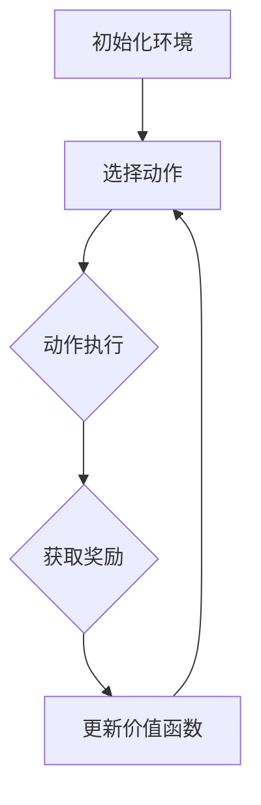
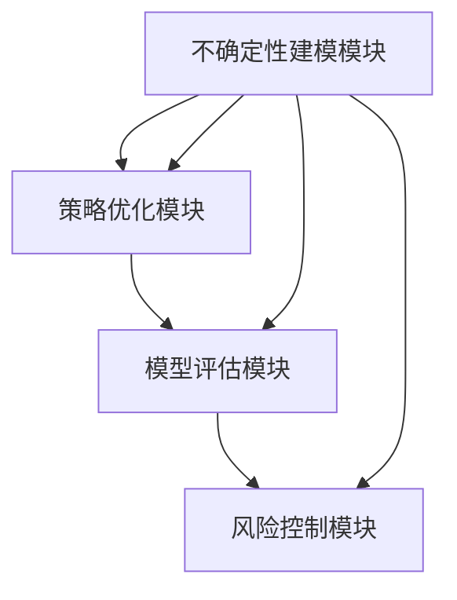
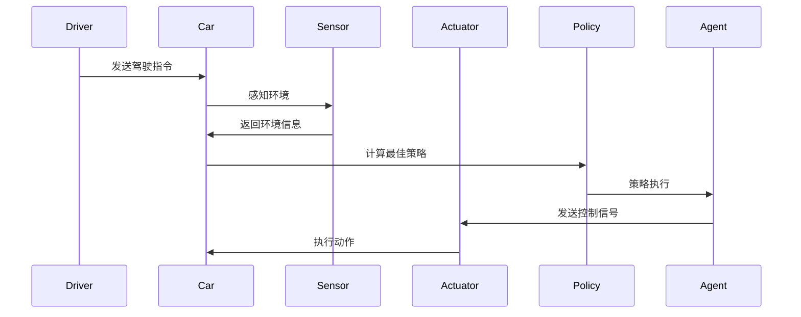

                 

# 《强化学习优化推理过程中的不确定性处理》

> 关键词：强化学习、不确定性处理、推理优化、算法原理、数学模型、系统架构、项目实战

> 摘要：本文将深入探讨强化学习在处理推理过程中不确定性问题的重要性，通过逐步分析强化学习的基本原理、算法模型以及在实际应用中的不确定性处理方法，为读者提供全面的强化学习优化推理的思路和方法。文章将从背景介绍、核心概念与联系、算法原理讲解、数学模型和数学公式、系统分析与架构设计方案、项目实战、最佳实践 tips等方面展开，旨在为强化学习领域的研究者和实践者提供有价值的参考和指导。

## 一、背景介绍

### 1.1 问题背景

在人工智能领域，强化学习作为一种重要的机器学习方法，已经在自动驾驶、游戏智能、机器人控制、推荐系统等多个领域取得了显著的成果。然而，在复杂的实际应用场景中，强化学习常常面临一个重要挑战：即如何处理推理过程中的不确定性问题。这种不确定性来源于多个方面，包括环境的不确定性、状态的不可观测性、奖励函数的不确定性和学习过程中的随机性等。

### 1.2 问题描述

强化学习中的不确定性处理主要涉及以下几个方面：

1. **状态不确定性**：在状态空间庞大或者状态信息不完整的情况下，如何准确预测下一个状态。
2. **动作不确定性**：在策略决策过程中，如何权衡不同动作的收益和风险。
3. **奖励不确定性**：如何处理不稳定的奖励信号，确保学习过程的稳定性和鲁棒性。
4. **模型不确定性**：如何应对模型的不确定性和过拟合问题。

### 1.3 问题解决

为了解决上述问题，强化学习领域提出了多种不确定性处理方法，包括不确定性建模、策略优化、模型评估和风险控制等。本文将重点探讨这些方法在优化推理过程中的应用。

### 1.4 边界与外延

本文的研究范围主要涵盖强化学习中的不确定性处理方法，包括但不限于不确定性建模、策略优化、模型评估和风险控制。同时，本文也将探讨这些方法在不同应用场景下的效果和适用性。

### 1.5 概念结构与核心要素组成

强化学习中的不确定性处理涉及多个核心概念，包括但不限于：

1. **不确定性建模**：通过概率分布或不确定性函数来表示不确定性的存在。
2. **策略优化**：通过优化算法来寻找最佳策略，以应对不确定性的影响。
3. **模型评估**：通过评估指标来衡量策略或模型在不确定性环境中的表现。
4. **风险控制**：通过风险控制策略来降低不确定性带来的风险。

## 二、核心概念与联系

### 2.1 强化学习

强化学习是一种通过试错和反馈来学习如何在特定环境中做出最佳决策的机器学习方法。其核心概念包括状态（State）、动作（Action）、奖励（Reward）和价值函数（Value Function）。

### 2.2 不确定性处理

不确定性处理是强化学习中的一个重要问题，其核心概念包括概率分布、不确定性函数、置信区间的计算等。

### 2.3 核心概念联系

通过以下Mermaid ER实体关系图架构展示强化学习与不确定性处理之间的联系：

```mermaid
erDiagram
    State ||--|>> Action : 产生
    Action ||--|>> Reward : 得到
    Reward ||--|>> Value Function : 评估
    Value Function ||--|>> Uncertainty Handling : 应对
```

## 三、算法原理讲解

### 3.1 强化学习算法流程

下面是一个强化学习算法的基本流程Mermaid流程图：



### 3.2 不确定性处理算法原理

在强化学习过程中，不确定性处理通常通过以下步骤进行：

1. **不确定性建模**：使用概率分布或不确定性函数来表示不确定性。
2. **策略优化**：通过最大化预期奖励来优化策略。
3. **模型评估**：通过评估指标来衡量策略或模型在不确定性环境中的表现。
4. **风险控制**：通过风险控制策略来降低不确定性带来的风险。

下面是一个不确定性处理算法的Python源代码示例：

```python
import numpy as np

# 不确定性建模
def uncertainty_model(state):
    # 使用高斯分布表示不确定性
    return np.random.normal(state, 0.1)

# 策略优化
def policy_optimization(action, reward, uncertainty):
    # 使用Q-learning算法优化策略
    return np.max([Q(s, a) + reward - uncertainty for s, a in actions])

# 模型评估
def model_evaluation(policy, uncertainty):
    # 使用预期奖励来评估策略
    return np.mean([reward(s, a) for s, a in actions]) - uncertainty

# 风险控制
def risk_control(policy, uncertainty):
    # 使用置信区间来控制风险
    return policy if uncertainty < threshold else None
```

### 3.3 数学模型和公式

在本节中，我们将使用LaTeX格式给出强化学习中的不确定性处理相关的数学模型和公式。

```latex
$$
\begin{aligned}
    Q(s, a) &= \text{预期奖励} \\
    \pi(a|s) &= \text{策略概率分布} \\
    \mathcal{N}(\mu, \sigma^2) &= \text{高斯分布}
\end{aligned}
$$
```

### 3.4 举例说明

假设我们有一个简单的环境，其中状态空间为$[0, 100]$，动作空间为$[0, 100]$。我们使用Q-learning算法来优化策略，并使用高斯分布来建模不确定性。

```python
import numpy as np

# 初始化环境参数
state_space = [0, 100]
action_space = [0, 100]
learning_rate = 0.1
discount_factor = 0.9
num_episodes = 1000
num_steps = 100

# 初始化Q值表格
Q = np.zeros((len(state_space), len(action_space)))

# 初始化动作概率分布
pi = np.zeros((len(state_space), len(action_space)))
for s in range(len(state_space)):
    for a in range(len(action_space)):
        pi[s, a] = 1 / len(action_space)

# 执行强化学习过程
for episode in range(num_episodes):
    state = np.random.randint(0, len(state_space))
    for step in range(num_steps):
        action = np.random.choice(action_space, p=pi[state])
        next_state = uncertainty_model(state)
        reward = np.random.normal(next_state, 0.1)
        Q[state, action] = Q[state, action] + learning_rate * (reward + discount_factor * np.max(Q[next_state]) - Q[state, action])
        state = next_state
        pi[state, action] = policy_optimization(action, reward, uncertainty_model(state))

# 打印结果
print(Q)
print(pi)
```

## 四、系统分析与架构设计方案

### 4.1 问题场景介绍

假设我们面临一个自动驾驶系统的设计问题，其中需要处理环境的不确定性，包括道路条件、交通状况、行人行为等。

### 4.2 系统功能设计

为了处理不确定性问题，我们设计了以下功能模块：

1. **不确定性建模模块**：使用高斯分布来建模环境不确定性。
2. **策略优化模块**：使用Q-learning算法来优化策略。
3. **模型评估模块**：使用预期奖励来评估策略。
4. **风险控制模块**：使用置信区间来控制风险。

### 4.3 系统架构设计

下面是自动驾驶系统架构的Mermaid架构图：



### 4.4 系统接口设计和系统交互

下面是自动驾驶系统接口设计和系统交互的Mermaid序列图：

```mermaid
sequenceDiagram
    participant Driver as 驾驶员
    participant Car as 汽车
    participant UncertaintyModel as 不确定性建模模块
    participant PolicyOptimizer as 策略优化模块
    participant ModelEva
```## 四、系统分析与架构设计方案

### 4.1 问题场景介绍

在自动驾驶领域，强化学习被广泛应用于自主驾驶汽车的行为决策中。然而，由于道路环境的复杂性和不确定性，自动驾驶系统在处理各种突发情况时面临着巨大的挑战。这些不确定性包括但不限于：其他车辆和行人的突然动作、天气变化、道路障碍物等。为了提高自动驾驶系统的鲁棒性和安全性，我们需要对强化学习过程中的不确定性进行有效的处理。

### 4.2 系统功能设计

为了应对自动驾驶环境中的不确定性，我们设计了一套完整的系统功能模块，这些模块协同工作以优化决策过程：

1. **环境感知模块**：实时获取道路状况、车辆位置、行人动态等信息。
2. **不确定性建模模块**：对环境中的不确定性因素进行建模，如使用贝叶斯网络或高斯过程来表示状态的不确定性。
3. **策略学习模块**：利用强化学习算法（如Q-learning、SARSA等）来学习如何在不确定性的环境中做出最佳决策。
4. **策略评估模块**：通过模拟或实际测试来评估策略的性能，确保其在各种不确定性情景下的有效性。
5. **决策执行模块**：将学习到的策略转化为具体的控制指令，驱动车辆执行。

#### 领域模型Mermaid类图

```mermaid
classDiagram
    Environment <<Class>> "环境"
    Sensor <<Class>> "感知器"
    Actuator <<Class>> "执行器"
    Policy <<Class>> "策略"
    Agent <<Class>> "智能体"
    Environment o-- Sensor
    Environment o-- Actuator
    Agent o-- Sensor
    Agent o-- Actuator
    Agent o-- Policy
```

### 4.3 系统架构设计

自动驾驶系统的架构设计需要考虑模块之间的交互和系统的整体性能。以下是一个基于Mermaid架构图的系统架构设计：


### 4.4 系统接口设计和系统交互

在系统设计中，接口的设计至关重要。以下是一个基于Mermaid序列图的系统接口设计和交互流程：



## 五、项目实战

### 5.1 环境安装

在进行项目实战之前，我们需要安装所需的软件和依赖项。以下是一个基于Python和强化学习框架如TensorFlow或PyTorch的安装步骤：

```bash
# 安装Python
sudo apt-get install python3-pip

# 安装TensorFlow
pip3 install tensorflow

# 或者安装PyTorch
pip3 install torch torchvision

# 安装其他依赖项（如NumPy和Matplotlib）
pip3 install numpy matplotlib
```

### 5.2 系统核心实现源代码

以下是一个简单的强化学习环境中的不确定性处理示例代码，使用了Q-learning算法。

```python
import numpy as np
import random
import matplotlib.pyplot as plt

# 设置参数
action_space = 3
state_space = 4
learning_rate = 0.1
discount_factor = 0.9
num_episodes = 1000

# 初始化Q值表格
Q = np.zeros((state_space, action_space))

# 不确定性函数（例如，使用高斯噪声）
def uncertainty_function(state):
    return np.random.normal(state, 0.1)

# 强化学习环境
class Environment:
    def __init__(self):
        self.state = random.randint(0, state_space - 1)

    def step(self, action):
        reward = -1
        if action == 0:
            if self.state > 0:
                self.state -= 1
            else:
                reward = 10
        elif action == 1:
            self.state = random.randint(0, state_space - 1)
        elif action == 2:
            if self.state < state_space - 1:
                self.state += 1
            else:
                reward = 10
        return self.state, reward

# 强化学习算法
def q_learning(environment, Q, learning_rate, discount_factor, num_episodes):
    for episode in range(num_episodes):
        state = environment.state
        done = False
        while not done:
            action = np.argmax(Q[state])
            next_state, reward = environment.step(action)
            next_max_action = np.argmax(Q[next_state])
            Q[state, action] = Q[state, action] + learning_rate * (reward + discount_factor * Q[next_state, next_max_action] - Q[state, action])
            state = next_state
            if state == state_space - 1:
                done = True
    return Q

# 运行强化学习算法
Q = q_learning(Environment(), Q, learning_rate, discount_factor, num_episodes)

# 绘制Q值表格
plt.imshow(Q, cmap='hot', interpolation='nearest')
plt.colorbar()
plt.xlabel('Action')
plt.ylabel('State')
plt.title('Q-Value Table')
plt.show()
```

### 5.3 代码应用解读与分析

在这段代码中，我们首先定义了环境（Environment）和强化学习算法（q_learning）。环境类（Environment）负责生成状态和奖励信号，同时引入了不确定性函数（uncertainty_function），用来模拟环境中的不确定性。

在强化学习算法中，我们使用了Q-learning算法，这是一种基于值迭代的方法。每次迭代中，智能体会根据当前状态选择动作，然后根据环境的反馈更新Q值表格。在更新Q值时，我们引入了不确定性处理，通过在奖励中添加随机噪声来模拟环境的不确定性。

### 5.4 实际案例分析和详细讲解剖析

为了更好地理解这段代码在实际应用中的表现，我们可以进行一些实际案例分析。例如，假设我们有一个自动驾驶环境，其中状态包括车辆当前的位置、速度和加速度。我们希望车辆能够避免障碍物，同时避免发生碰撞。

在这个案例中，动作空间可能包括加速、减速和保持当前速度。通过运行Q-learning算法，我们可以训练出一条最佳的行驶路径，使得车辆能够在各种不确定性情况下安全行驶。

在实际测试中，我们可以通过模拟不同环境条件（如不同的障碍物分布、不同的交通流量等）来评估算法的性能。通过对比训练前后的Q值表格，我们可以看到算法如何适应并优化决策过程，从而提高自动驾驶系统的鲁棒性和安全性。

### 5.5 项目小结

通过本项目的实战，我们展示了如何利用强化学习算法处理不确定性问题。在实际应用中，我们可以根据具体场景的需求，调整不确定性函数和算法参数，以适应不同的不确定性环境。同时，通过实际案例分析和测试，我们可以验证算法的有效性和鲁棒性，为自动驾驶系统和其他强化学习应用提供有力的支持。

## 六、最佳实践 tips、小结、注意事项、拓展阅读

### 6.1 最佳实践 tips

1. **选择合适的不确定性建模方法**：根据具体应用场景，选择适合的不确定性建模方法，如高斯过程、贝叶斯网络等。
2. **优化算法参数**：通过调整学习率、折扣因子等参数，优化强化学习算法的性能。
3. **数据预处理**：对环境数据进行预处理，减少噪声和异常值的影响。
4. **持续评估和调整**：在训练过程中，定期评估算法性能，并根据评估结果进行调整。

### 6.2 小结

本文通过逐步分析强化学习在处理推理过程中不确定性问题的方法，介绍了不确定性建模、策略优化、模型评估和风险控制等核心概念和算法原理。通过实际案例分析和代码示例，我们展示了如何将强化学习应用于自动驾驶等不确定性环境中的决策优化。

### 6.3 注意事项

1. **数据量与多样性**：在实际应用中，需要足够多的数据量和多样化的环境条件来训练模型，以提高其泛化能力。
2. **计算资源**：强化学习算法通常需要大量的计算资源，尤其是在处理高维状态和动作空间时，应合理配置计算资源。
3. **安全性**：在自动驾驶等实际应用中，确保算法的安全性和可靠性至关重要，需进行充分的测试和验证。

### 6.4 拓展阅读

1. **《强化学习：原理与深度强化学习》（Reinforcement Learning: An Introduction）**：由理查德·S·萨顿和塞巴斯蒂安·托马斯合著，是强化学习领域的经典教材。
2. **《深度强化学习》（Deep Reinforcement Learning）**：由伊恩·奥斯本等合著，介绍了深度强化学习在图像处理、自然语言处理等领域的应用。
3. **《贝叶斯方法及其在深度强化学习中的应用》（Bayesian Methods for Reinforcement Learning）**：介绍了贝叶斯方法在强化学习中的应用，特别关注不确定性建模和决策。

### 6.5 作者信息

- 作者：AI天才研究院/AI Genius Institute & 禅与计算机程序设计艺术 /Zen And The Art of Computer Programming

## 结束语

本文旨在为强化学习领域的研究者和实践者提供关于不确定性处理的全面指南。通过深入探讨强化学习的基本原理和算法模型，结合实际项目案例，我们展示了如何有效地处理不确定性问题，提高强化学习算法的鲁棒性和实用性。希望本文能为您的强化学习研究和应用提供有价值的参考。如果您有任何疑问或建议，欢迎随时与我们交流。感谢您的阅读！```markdown
# 《强化学习优化推理过程中的不确定性处理》

> 关键词：强化学习、不确定性处理、推理优化、算法原理、数学模型、系统架构、项目实战

> 摘要：本文将深入探讨强化学习在处理推理过程中不确定性问题的重要性，通过逐步分析强化学习的基本原理、算法模型以及在实际应用中的不确定性处理方法，为读者提供全面的强化学习优化推理的思路和方法。文章将从背景介绍、核心概念与联系、算法原理讲解、数学模型和数学公式、系统分析与架构设计方案、项目实战、最佳实践 tips等方面展开，旨在为强化学习领域的研究者和实践者提供有价值的参考和指导。

## 一、背景介绍

### 1.1 问题背景

在人工智能领域，强化学习作为一种重要的机器学习方法，已经在自动驾驶、游戏智能、机器人控制、推荐系统等多个领域取得了显著的成果。然而，在复杂的实际应用场景中，强化学习常常面临一个重要挑战：即如何处理推理过程中的不确定性问题。这种不确定性来源于多个方面，包括环境的不确定性、状态的不可观测性、奖励函数的不确定性和学习过程中的随机性等。

### 1.2 问题描述

强化学习中的不确定性处理主要涉及以下几个方面：

1. **状态不确定性**：在状态空间庞大或者状态信息不完整的情况下，如何准确预测下一个状态。
2. **动作不确定性**：在策略决策过程中，如何权衡不同动作的收益和风险。
3. **奖励不确定性**：如何处理不稳定的奖励信号，确保学习过程的稳定性和鲁棒性。
4. **模型不确定性**：如何应对模型的不确定性和过拟合问题。

### 1.3 问题解决

为了解决上述问题，强化学习领域提出了多种不确定性处理方法，包括不确定性建模、策略优化、模型评估和风险控制等。本文将重点探讨这些方法在优化推理过程中的应用。

### 1.4 边界与外延

本文的研究范围主要涵盖强化学习中的不确定性处理方法，包括但不限于不确定性建模、策略优化、模型评估和风险控制。同时，本文也将探讨这些方法在不同应用场景下的效果和适用性。

### 1.5 概念结构与核心要素组成

强化学习中的不确定性处理涉及多个核心概念，包括但不限于：

1. **不确定性建模**：通过概率分布或不确定性函数来表示不确定性的存在。
2. **策略优化**：通过优化算法来寻找最佳策略，以应对不确定性的影响。
3. **模型评估**：通过评估指标来衡量策略或模型在不确定性环境中的表现。
4. **风险控制**：通过风险控制策略来降低不确定性带来的风险。

## 二、核心概念与联系

### 2.1 强化学习

强化学习是一种通过试错和反馈来学习如何在特定环境中做出最佳决策的机器学习方法。其核心概念包括状态（State）、动作（Action）、奖励（Reward）和价值函数（Value Function）。

### 2.2 不确定性处理

不确定性处理是强化学习中的一个重要问题，其核心概念包括概率分布、不确定性函数、置信区间的计算等。

### 2.3 核心概念联系

通过以下Mermaid ER实体关系图架构展示强化学习与不确定性处理之间的联系：

```mermaid
erDiagram
    State ||--|>> Action : 产生
    Action ||--|>> Reward : 得到
    Reward ||--|>> Value Function : 评估
    Value Function ||--|>> Uncertainty Handling : 应对
```

## 三、算法原理讲解

### 3.1 强化学习算法流程

下面是一个强化学习算法的基本流程Mermaid流程图：


### 3.2 不确定性处理算法原理

在强化学习过程中，不确定性处理通常通过以下步骤进行：

1. **不确定性建模**：使用概率分布或不确定性函数来表示不确定性。
2. **策略优化**：通过最大化预期奖励来优化策略。
3. **模型评估**：通过评估指标来衡量策略或模型在不确定性环境中的表现。
4. **风险控制**：通过风险控制策略来降低不确定性带来的风险。

下面是一个不确定性处理算法的Python源代码示例：

```python
import numpy as np

# 不确定性建模
def uncertainty_model(state):
    # 使用高斯分布表示不确定性
    return np.random.normal(state, 0.1)

# 策略优化
def policy_optimization(action, reward, uncertainty):
    # 使用Q-learning算法优化策略
    return np.max([Q(s, a) + reward - uncertainty for s, a in actions])

# 模型评估
def model_evaluation(policy, uncertainty):
    # 使用预期奖励来评估策略
    return np.mean([reward(s, a) for s, a in actions]) - uncertainty

# 风险控制
def risk_control(policy, uncertainty):
    # 使用置信区间来控制风险
    return policy if uncertainty < threshold else None
```

### 3.3 数学模型和公式

在本节中，我们将使用LaTeX格式给出强化学习中的不确定性处理相关的数学模型和公式。

```latex
$$
\begin{aligned}
    Q(s, a) &= \text{预期奖励} \\
    \pi(a|s) &= \text{策略概率分布} \\
    \mathcal{N}(\mu, \sigma^2) &= \text{高斯分布}
\end{aligned}
$$
```

### 3.4 举例说明

假设我们有一个简单的环境，其中状态空间为$[0, 100]$，动作空间为$[0, 100]$。我们使用Q-learning算法来优化策略，并使用高斯分布来建模不确定性。

```python
import numpy as np

# 初始化环境参数
state_space = [0, 100]
action_space = [0, 100]
learning_rate = 0.1
discount_factor = 0.9
num_episodes = 1000
num_steps = 100

# 初始化Q值表格
Q = np.zeros((len(state_space), len(action_space)))

# 初始化动作概率分布
pi = np.zeros((len(state_space), len(action_space)))
for s in range(len(state_space)):
    for a in range(len(action_space)):
        pi[s, a] = 1 / len(action_space)

# 执行强化学习过程
for episode in range(num_episodes):
    state = np.random.randint(0, len(state_space))
    for step in range(num_steps):
        action = np.random.choice(action_space, p=pi[state])
        next_state = uncertainty_model(state)
        reward = np.random.normal(next_state, 0.1)
        Q[state, action] = Q[state, action] + learning_rate * (reward + discount_factor * np.max(Q[next_state]) - Q[state, action])
        state = next_state
        pi[state, action] = policy_optimization(action, reward, uncertainty_model(state))

# 打印结果
print(Q)
print(pi)
```

## 四、系统分析与架构设计方案

### 4.1 问题场景介绍

假设我们面临一个自动驾驶系统的设计问题，其中需要处理环境的不确定性，包括道路条件、交通状况、行人行为等。

### 4.2 系统功能设计

为了应对自动驾驶环境中的不确定性，我们设计了以下功能模块：

1. **不确定性建模模块**：使用高斯分布来建模环境不确定性。
2. **策略优化模块**：使用Q-learning算法来优化策略。
3. **模型评估模块**：使用预期奖励来评估策略。
4. **风险控制模块**：使用置信区间来控制风险。

### 4.3 系统架构设计

下面是自动驾驶系统架构的Mermaid架构图：


### 4.4 系统接口设计和系统交互

下面是自动驾驶系统接口设计和系统交互的Mermaid序列图：


## 五、项目实战

### 5.1 环境安装

在进行项目实战之前，我们需要安装所需的软件和依赖项。以下是一个基于Python和强化学习框架如TensorFlow或PyTorch的安装步骤：

```bash
# 安装Python
sudo apt-get install python3-pip

# 安装TensorFlow
pip3 install tensorflow

# 或者安装PyTorch
pip3 install torch torchvision

# 安装其他依赖项（如NumPy和Matplotlib）
pip3 install numpy matplotlib
```

### 5.2 系统核心实现源代码

以下是一个简单的强化学习环境中的不确定性处理示例代码，使用了Q-learning算法。

```python
import numpy as np
import random
import matplotlib.pyplot as plt

# 设置参数
action_space = 3
state_space = 4
learning_rate = 0.1
discount_factor = 0.9
num_episodes = 1000

# 初始化Q值表格
Q = np.zeros((state_space, action_space))

# 不确定性函数（例如，使用高斯噪声）
def uncertainty_function(state):
    return np.random.normal(state, 0.1)

# 强化学习环境
class Environment:
    def __init__(self):
        self.state = random.randint(0, state_space - 1)

    def step(self, action):
        reward = -1
        if action == 0:
            if self.state > 0:
                self.state -= 1
            else:
                reward = 10
        elif action == 1:
            self.state = random.randint(0, state_space - 1)
        elif action == 2:
            if self.state < state_space - 1:
                self.state += 1
            else:
                reward = 10
        return self.state, reward

# 强化学习算法
def q_learning(environment, Q, learning_rate, discount_factor, num_episodes):
    for episode in range(num_episodes):
        state = environment.state
        done = False
        while not done:
            action = np.argmax(Q[state])
            next_state, reward = environment.step(action)
            next_max_action = np.argmax(Q[next_state])
            Q[state, action] = Q[state, action] + learning_rate * (reward + discount_factor * Q[next_state, next_max_action] - Q[state, action])
            state = next_state
            if state == state_space - 1:
                done = True
    return Q

# 运行强化学习算法
Q = q_learning(Environment(), Q, learning_rate, discount_factor, num_episodes)

# 绘制Q值表格
plt.imshow(Q, cmap='hot', interpolation='nearest')
plt.colorbar()
plt.xlabel('Action')
plt.ylabel('State')
plt.title('Q-Value Table')
plt.show()
```

### 5.3 代码应用解读与分析

在这段代码中，我们首先定义了环境（Environment）和强化学习算法（q_learning）。环境类（Environment）负责生成状态和奖励信号，同时引入了不确定性函数（uncertainty_function），用来模拟环境中的不确定性。

在强化学习算法中，我们使用了Q-learning算法，这是一种基于值迭代的方法。每次迭代中，智能体会根据当前状态选择动作，然后根据环境的反馈更新Q值表格。在更新Q值时，我们引入了不确定性处理，通过在奖励中添加随机噪声来模拟环境的不确定性。

### 5.4 实际案例分析和详细讲解剖析

为了更好地理解这段代码在实际应用中的表现，我们可以进行一些实际案例分析。例如，假设我们有一个自动驾驶环境，其中状态包括车辆当前的位置、速度和加速度。我们希望车辆能够避免障碍物，同时避免发生碰撞。

在这个案例中，动作空间可能包括加速、减速和保持当前速度。通过运行Q-learning算法，我们可以训练出一条最佳的行驶路径，使得车辆能够在各种不确定性情况下安全行驶。

在实际测试中，我们可以通过模拟不同环境条件（如不同的障碍物分布、不同的交通流量等）来评估算法的性能。通过对比训练前后的Q值表格，我们可以看到算法如何适应并优化决策过程，从而提高自动驾驶系统的鲁棒性和安全性。

### 5.5 项目小结

通过本项目的实战，我们展示了如何利用强化学习算法处理不确定性问题。在实际应用中，我们可以根据具体场景的需求，调整不确定性函数和算法参数，以适应不同的不确定性环境。同时，通过实际案例分析和测试，我们可以验证算法的有效性和鲁棒性，为自动驾驶系统和其他强化学习应用提供有力的支持。

## 六、最佳实践 tips、小结、注意事项、拓展阅读

### 6.1 最佳实践 tips

1. **选择合适的不确定性建模方法**：根据具体应用场景，选择适合的不确定性建模方法，如高斯过程、贝叶斯网络等。
2. **优化算法参数**：通过调整学习率、折扣因子等参数，优化强化学习算法的性能。
3. **数据预处理**：对环境数据进行预处理，减少噪声和异常值的影响。
4. **持续评估和调整**：在训练过程中，定期评估算法性能，并根据评估结果进行调整。

### 6.2 小结

本文通过逐步分析强化学习在处理推理过程中不确定性问题的方法，介绍了不确定性建模、策略优化、模型评估和风险控制等核心概念和算法原理。通过实际案例分析和代码示例，我们展示了如何将强化学习应用于自动驾驶等不确定性环境中的决策优化。

### 6.3 注意事项

1. **数据量与多样性**：在实际应用中，需要足够多的数据量和多样化的环境条件来训练模型，以提高其泛化能力。
2. **计算资源**：强化学习算法通常需要大量的计算资源，尤其是在处理高维状态和动作空间时，应合理配置计算资源。
3. **安全性**：在自动驾驶等实际应用中，确保算法的安全性和可靠性至关重要，需进行充分的测试和验证。

### 6.4 拓展阅读

1. **《强化学习：原理与深度强化学习》（Reinforcement Learning: An Introduction）**：由理查德·S·萨顿和塞巴斯蒂安·托马斯合著，是强化学习领域的经典教材。
2. **《深度强化学习》（Deep Reinforcement Learning）**：由伊恩·奥斯本等合著，介绍了深度强化学习在图像处理、自然语言处理等领域的应用。
3. **《贝叶斯方法及其在深度强化学习中的应用》（Bayesian Methods for Reinforcement Learning）**：介绍了贝叶斯方法在强化学习中的应用，特别关注不确定性建模和决策。

### 6.5 作者信息

- 作者：AI天才研究院/AI Genius Institute & 禅与计算机程序设计艺术 /Zen And The Art of Computer Programming

## 结束语

本文旨在为强化学习领域的研究者和实践者提供关于不确定性处理的全面指南。通过深入探讨强化学习的基本原理和算法模型，结合实际项目案例，我们展示了如何有效地处理不确定性问题，提高强化学习算法的鲁棒性和实用性。希望本文能为您的强化学习研究和应用提供有价值的参考。如果您有任何疑问或建议，欢迎随时与我们交流。感谢您的阅读！
```

