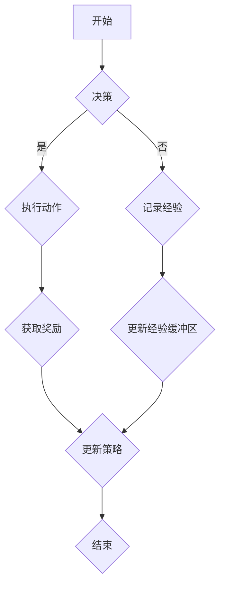

                 

### 1.1.2 强化学习的应用场景

强化学习作为机器学习的一个重要分支，其应用场景广泛且多样。以下是强化学习在几个典型领域中的应用场景：

#### 游戏

强化学习在游戏领域有着显著的应用。例如，DeepMind开发的AlphaGo通过强化学习算法实现了在围棋游戏中的超凡表现。AlphaGo不仅战胜了人类围棋冠军，还展示了强化学习在复杂决策环境中的强大能力。此外，强化学习还广泛应用于其他电子游戏，如Atari游戏和棋牌游戏等。

#### 自动驾驶

自动驾驶是强化学习的另一个重要应用领域。在自动驾驶系统中，车辆需要实时感知环境、做出决策并控制车辆。强化学习算法可以帮助自动驾驶系统通过不断试错来优化驾驶策略，从而提高行驶的安全性和效率。例如，Waymo和Tesla都在其自动驾驶系统中使用了强化学习算法。

#### 机器人控制

机器人控制是强化学习的传统应用领域之一。通过强化学习，机器人可以学会如何在复杂环境中执行特定任务，如搬运物品、组装零件等。例如，机器人科学家们使用强化学习来训练机器人如何爬楼梯、在不确定的环境中导航等。

#### 供应链管理

强化学习在供应链管理中的应用也越来越受到关注。通过强化学习算法，企业可以优化库存管理、预测市场需求，从而提高供应链的效率和响应速度。例如，亚马逊和阿里巴巴等电商巨头正在利用强化学习来优化其库存管理和配送策略。

#### 资源分配

强化学习在资源分配问题中也展现出了强大的能力。例如，在电力系统中，强化学习可以用来优化发电和负载分配，以减少能源浪费和提高系统效率。在云计算中，强化学习可以用来动态分配计算资源，确保最佳性能。

#### 金融交易

在金融交易领域，强化学习也被广泛应用于股票交易、外汇交易等。通过学习市场数据和交易策略，强化学习算法可以自动调整交易策略，以最大化收益或最小化风险。

#### 健康护理

强化学习在健康护理中的应用也越来越受到关注。例如，可以通过强化学习算法来设计个性化的康复计划，以帮助患者更快恢复健康。此外，强化学习还可以用于预测疾病发生风险，从而实现更精准的预防措施。

通过这些具体的应用场景，我们可以看到强化学习在提高系统效率、降低成本、改善用户体验等方面具有巨大潜力。然而，强化学习也面临许多挑战，例如如何设计高效的学习算法、如何处理高维数据等。接下来，我们将探讨强化学习所面临的挑战与机遇。### 1.1.3 强化学习的挑战与机遇

尽管强化学习在众多领域展现出了巨大潜力，但它在实际应用中也面临着一系列挑战。以下是强化学习所面临的几个主要挑战和机遇：

#### 挑战

**1. 数据需求量大：** 强化学习需要大量数据进行训练，以便模型能够从经验中学习。然而，在某些应用领域，如医疗和金融，获取高质量数据可能非常困难，导致模型训练效果受限。

**2. 训练效率低：** 强化学习通常需要通过试错来学习策略，这可能导致训练过程非常耗时。特别是在复杂的环境中，模型可能需要数百万次甚至数亿次交互来达到稳定状态。

**3. 推广性差：** 强化学习算法在很多情况下都是为特定任务和环境设计的，导致其推广性较差。在新的任务或环境中，模型可能需要重新训练或进行大量调整。

**4. 解释性不足：** 强化学习模型通常被视为“黑盒”，其决策过程难以解释。这限制了其在某些关键领域（如医疗和金融）的应用，因为人们需要对模型的决策有足够的理解。

**5. 安全性问题：** 强化学习模型可能会受到恶意攻击，例如通过投毒数据或欺骗性输入来操纵模型决策。这可能导致严重的后果，尤其是在涉及安全和生命健康的领域。

#### 机遇

**1. 算法改进：** 随着深度学习技术的发展，强化学习算法也在不断改进。例如，深度强化学习（Deep Reinforcement Learning, DRL）结合了深度学习的强大表征能力，使得模型在复杂环境中的表现大幅提升。

**2. 多智能体系统：** 多智能体强化学习（Multi-Agent Reinforcement Learning, MARL）是一个新兴的研究领域，它探讨多个智能体在交互环境中的策略学习。这一领域有望解决许多现实世界中的复杂问题。

**3. 联邦学习：** 联邦学习（Federated Learning）与强化学习相结合，可以在保护用户隐私的同时，实现大规模数据的训练和模型优化。

**4. 强化学习与优化方法结合：** 将强化学习与传统的优化方法（如线性规划、随机优化等）相结合，可以解决一些传统方法难以处理的问题，例如动态规划中的值函数近似问题。

**5. 知识增强：** 通过将知识图谱和知识嵌入（Knowledge Graph and Knowledge Embedding, KG and KE）引入强化学习，可以提高模型的决策能力和解释性。

**6. 交叉学科应用：** 强化学习与心理学、神经科学等领域的交叉应用，有望揭示人类学习机制的深层原理，并推动相关技术的发展。

综上所述，尽管强化学习面临诸多挑战，但其在算法改进、多智能体系统、联邦学习、知识增强和交叉学科应用等方面的机遇，为未来强化学习的研究和应用提供了广阔的前景。接下来，我们将深入探讨强化学习的基本算法和原理。### 1.2 核心概念与联系

强化学习（Reinforcement Learning, RL）作为机器学习的一个重要分支，其核心概念和联系对于理解整个领域至关重要。以下是对强化学习基本概念的介绍及其相互关系的分析。

#### 1.2.1 强化学习的基础概念

**1. 动作（Action）**：动作是智能体（Agent）在环境中可以采取的某种操作或决策。例如，在游戏环境中，动作可以是移动、攻击或跳跃；在自动驾驶环境中，动作可以是加速、减速或转向。

**2. 状态（State）**：状态是环境在某一时刻的完整描述。状态决定了智能体可以采取哪些动作。例如，在棋类游戏中，状态可以是棋盘上的布局；在自动驾驶中，状态可以是车辆的位置、速度、周围交通情况等。

**3. 奖励（Reward）**：奖励是智能体采取某一动作后，从环境中获得的即时反馈。奖励通常是一个数值，它用来指导智能体的学习过程，告诉智能体某一动作的好坏。奖励可以是正的（奖励）或负的（惩罚），取决于动作是否有助于达成目标。

**4. 策略（Policy）**：策略是智能体在特定状态下采取的动作的概率分布。策略决定了智能体的行为，是智能体与环境的交互方式。例如，一个自动驾驶系统的策略可以是“在直行时加速，在转弯时减速”。

**5. 值函数（Value Function）**：值函数用来估计在给定状态下，采取最优策略所能获得的最大预期奖励。值函数分为状态值函数（State Value Function）和动作值函数（Action Value Function）。状态值函数衡量了某个状态的好坏，而动作值函数衡量了在特定状态下采取某一动作的优劣。

**6. 策略评估（Policy Evaluation）**：策略评估是计算当前策略的值函数的过程。通过策略评估，我们可以了解当前策略的效果，并据此调整策略。

**7. 策略迭代（Policy Iteration）**：策略迭代是一种策略优化方法，通过反复进行策略评估和策略改进，最终找到一个最优策略。

#### 1.2.2 强化学习算法的分类

根据智能体与环境的交互方式，强化学习算法可以分为以下几类：

**1. 蒙特卡洛方法（Monte Carlo Methods）**：蒙特卡洛方法通过模拟多次环境交互来评估策略的值函数。典型的算法有蒙特卡洛策略评估和蒙特卡洛搜索。

**2. 动态规划（Dynamic Programming）**：动态规划通过递归关系来计算最优策略的值函数。典型的算法有值迭代（Value Iteration）和政策迭代（Policy Iteration）。

**3. 反事实推理（Counterfactual Reasoning）**：反事实推理考虑如果智能体采取了其他动作，结果会如何。这种算法试图找到导致当前状态的最优动作。

**4. 无模型方法（Model-Free Methods）**：无模型方法不依赖于对环境的先验知识，完全通过与环境交互来学习策略。典型的算法有Q-learning和Sarsa。

**5. 模型依赖方法（Model-Based Methods）**：模型依赖方法通过建立环境模型来预测未来的状态和奖励。典型的算法有深度确定性策略梯度（Deep Deterministic Policy Gradient, DDPG）和部分可观察马尔可夫决策过程（Partially Observable Markov Decision Process, POMDP）。

#### 1.2.3 强化学习的属性特征对比表

为了更清晰地展示强化学习算法的不同属性，我们制作了一张对比表：

| 算法类别           | 特点                                       | 适用场景                         | 代表算法       |
|------------------|------------------------------------------|------------------------------|------------|
| 蒙特卡洛方法       | 基于采样和统计的方法，不需要环境模型           | 不适合高维状态和动作空间         | 蒙特卡洛搜索  |
| 动态规划           | 使用递归关系计算最优策略，需要环境模型           | 适合有限状态和动作空间           | 值迭代、政策迭代 |
| 反事实推理         | 考虑不同动作的后果，避免局部最优                 | 需要明确的状态转移和奖励模型       | Q-learning  |
| 无模型方法         | 直接通过交互学习策略，不需要环境模型             | 适合复杂环境和高维空间           | Sarsa、Deep Q Network (DQN) |
| 模型依赖方法       | 通过建立环境模型来预测未来状态和奖励             | 适合动态和部分可观测的环境         | DDPG、POMDP |

#### 1.2.4 强化学习的ER实体关系图

为了更好地理解强化学习中的各种实体及其关系，我们可以使用ER（Entity-Relationship）图来展示。以下是一个简化的ER图：

```
状态（State）--<动作（Action）>--
            |              |
            v              v
奖励（Reward）<--状态转移（State Transition）-->
            |              |
            v              v
智能体（Agent）<--策略（Policy）>--
            |              |
            v              v
环境（Environment）
```

在这个ER图中，状态和动作之间是直接关联的，每个状态可以映射到多个动作，而动作又决定了状态转移和奖励。智能体通过策略与环境的交互来学习，策略决定了在特定状态下应采取的动作，以最大化长期奖励。

通过上述核心概念和联系的分析，我们可以更深入地理解强化学习的工作原理，并在实际应用中更有效地设计和实现强化学习算法。在接下来的章节中，我们将深入探讨强化学习的基本算法，如Q-learning和Sarsa。### 1.3 强化学习的基本算法

在强化学习领域中，算法是核心，它们决定了智能体如何通过试错学习最优策略。以下是几种常见的基本强化学习算法，包括Q-learning、Sarsa以及Deep Q-Network (DQN)。

#### 1.3.1 强化学习的基本流程

在介绍这些算法之前，我们先回顾一下强化学习的基本流程。强化学习通常包括以下几个步骤：

1. **初始化**：设置智能体的初始状态、策略、值函数等参数。
2. **环境互动**：智能体根据当前策略选择一个动作，并在环境中执行该动作。
3. **获取反馈**：环境根据执行的动作提供反馈，包括当前状态和奖励。
4. **更新策略**：根据奖励和新的状态，智能体更新其策略或值函数。
5. **重复步骤2-4**：智能体不断与环境互动，直到达到某一终止条件或找到满意策略。

#### 1.3.2 Q-learning算法

Q-learning是一种无模型、基于值函数的强化学习算法。其核心思想是学习状态-动作值函数（Q函数），该函数表示在特定状态下采取特定动作的长期回报。

**算法原理：**

Q-learning通过更新Q值来学习最优策略。Q值的更新公式为：

$$
Q(s, a) \leftarrow Q(s, a) + \alpha [r + \gamma \max_{a'} Q(s', a') - Q(s, a)]
$$

其中：
- \( Q(s, a) \) 是状态 \( s \) 和动作 \( a \) 的当前Q值。
- \( r \) 是立即奖励。
- \( \gamma \) 是折扣因子，用于平衡当前奖励与未来奖励之间的关系。
- \( \alpha \) 是学习率，控制更新幅度。
- \( s' \) 和 \( a' \) 是状态和动作的后继状态和动作。

**Python代码示例：**

```python
import numpy as np

# 初始化参数
Q = np.zeros((S, A))
alpha = 0.1
gamma = 0.9

# Q-learning算法
def q_learning(s, a, r, s', done):
    Q[s, a] = Q[s, a] + alpha * (r + gamma * np.max(Q[s', :]) - Q[s, a])
    if done:
        return
    s = s'
    a = np.argmax(Q[s, :])

# 环境互动
s = 0
a = 0
done = False
while not done:
    r, s', done = env.step(a)
    q_learning(s, a, r, s', done)
    s = s'
    a = np.argmax(Q[s, :])
```

#### 1.3.3 Sarsa算法

Sarsa（State-Action-Reward-State-Action）是另一种基于值函数的强化学习算法，它与Q-learning的主要区别在于，Sarsa在更新Q值时使用的是实际执行的动作，而不是贪婪动作。

**算法原理：**

Sarsa的更新公式为：

$$
Q(s, a) \leftarrow Q(s, a) + \alpha [r + \gamma Q(s', a') - Q(s, a)]
$$

其中，\( a' \) 是在新的状态 \( s' \) 下的实际执行动作。

**Python代码示例：**

```python
import numpy as np

# 初始化参数
Q = np.zeros((S, A))
alpha = 0.1
gamma = 0.9

# Sarsa算法
def sarsa(s, a, r, s', a'):
    Q[s, a] = Q[s, a] + alpha * (r + gamma * Q[s', a'] - Q[s, a])

# 环境互动
s = 0
a = 0
done = False
while not done:
    r, s', done = env.step(a)
    a' = np.argmax(Q[s', :])
    sarsa(s, a, r, s', a')
    s = s'
    a = a'
```

#### 1.3.4 Deep Q-Network (DQN) 算法

DQN（Deep Q-Network）是结合了深度学习和强化学习的算法。它使用深度神经网络（DNN）来近似Q值函数，从而处理高维状态空间。

**算法原理：**

DQN的核心思想是使用经验回放（Experience Replay）来避免策略偏差，并使用固定目标网络（Target Network）来稳定训练过程。

**Python代码示例：**

```python
import numpy as np
import random
from collections import deque

# 初始化参数
DQN = np.zeros((S, A))
alpha = 0.1
gamma = 0.9
epsilon = 0.1
batch_size = 32
memory = deque(maxlen=2000)

# DQN算法
def dqn(s, a):
    q_value = DQN[s, :]
    action = np.argmax(q_value)
    if random.random() < epsilon:
        action = random.randint(0, A-1)
    return action

# 环境互动
s = 0
done = False
while not done:
    a = dqn(s, a)
    r, s', done = env.step(a)
    memory.append((s, a, r, s', done))
    if len(memory) > batch_size:
        mini_batch = random.sample(memory, batch_size)
        for s, a, r, s', done in mini_batch:
            target = r + (1 - done) * gamma * np.max(DQN[s', :])
            DQN[s, a] = DQN[s, a] + alpha * (target - DQN[s, a])
    s = s'
```

通过以上介绍和示例，我们可以看到Q-learning、Sarsa和DQN等强化学习算法在实现智能体策略学习中的不同方法和应用。这些算法不仅提供了理论基础，还为实际应用中的智能体设计提供了有力的工具。在接下来的章节中，我们将继续探讨强化学习在环境设计和AI推理能力方面的深入应用。### 1.4 强化学习环境设计的重要性

强化学习环境（Reinforcement Learning Environment）是强化学习算法的核心组成部分，其设计质量直接影响模型的训练效果和最终的推理能力。一个良好的强化学习环境应该具备以下几个特点：

#### 1. 环境的合理性和真实性

强化学习环境需要能够真实反映现实世界的复杂性和不确定性。这意味着环境应该包含各种可能的情境和状况，使智能体能够面对多种挑战并从中学习。例如，自动驾驶环境需要模拟交通状况、道路条件、天气变化等多种因素。

#### 2. 状态空间的可控性

状态空间是智能体在环境中可能处于的所有状态集合。一个良好的强化学习环境应该允许状态空间的大小适中，既不过大导致计算复杂度过高，也不过小导致模型学习效果不佳。通过合理设计状态空间，我们可以控制智能体学习的难度和效率。

#### 3. 动作空间的合理性

动作空间是智能体在环境中可以采取的所有动作集合。合理设计的动作空间应确保每个动作都有实际意义，并且不会导致不可控的状态。例如，在游戏环境中，动作空间可能包括移动、攻击、防御等，而在机器人控制中，动作空间可能包括移动、旋转、抓取等。

#### 4. 奖励机制的公平性

奖励机制是强化学习算法中用来指导智能体行为的反馈信号。一个良好的强化学习环境应该设计一个公平且具有挑战性的奖励机制，以便智能体能够通过学习获得长期奖励。奖励机制不仅要鼓励智能体采取正确的行动，还要惩罚错误的行动，以避免智能体陷入不良策略。

#### 5. 实时性和可扩展性

强化学习环境需要具备实时响应能力，以便智能体能够实时接收环境反馈并调整策略。此外，环境设计还应考虑可扩展性，以便在添加新功能或适应新任务时，能够方便地进行修改和扩展。

#### 6. 数据可解释性和可访问性

为了更好地理解智能体的学习过程，强化学习环境应该具备良好的数据可解释性。同时，环境的设计应确保数据的可访问性，以便研究人员能够方便地获取和分析训练数据。

总之，强化学习环境设计的重要性体现在其对智能体学习和推理能力的直接影响。一个合理、真实、可控的强化学习环境不仅能够提高模型的学习效率，还能够提升其在实际应用中的表现。在接下来的章节中，我们将详细探讨如何设计和优化强化学习环境。### 1.5 强化学习环境设计方法

强化学习环境的设计是一个复杂的过程，需要综合考虑多个因素，包括离散环境和连续环境的特性，以及遗传算法在优化环境设计中的应用。以下是这些方法的具体介绍和实现步骤。

#### 1.5.1 离散环境设计

离散环境设计通常用于状态和动作空间有限的情况。这种环境设计方法的关键在于如何有效地表示状态和动作，并确保状态转移和奖励的合理性。

**1. 状态表示：** 在离散环境中，状态通常用一组离散的属性来表示。例如，在棋类游戏中，状态可以用棋盘上的布局来表示。状态表示方法需要确保每个状态都是唯一的，以便智能体能够明确地识别和区分。

**2. 动作表示：** 类似于状态，动作也用一组离散的选项来表示。例如，在围棋游戏中，动作可以是上移、下移、左移或右移棋子。动作表示方法需要保证每个动作都是可行的，并且能够改变当前状态。

**3. 状态转移和奖励设计：** 状态转移函数描述了智能体采取某一动作后，环境状态如何变化。奖励函数则用于评估智能体行为的优劣。在离散环境中，状态转移和奖励设计需要确保奖励的公平性和环境挑战性。

**4. 实现步骤：**
   - **定义状态空间和动作空间：** 根据具体应用场景确定状态和动作的集合。
   - **设计状态转移函数：** 确定智能体采取某一动作后，状态如何变化。
   - **设计奖励函数：** 根据智能体的目标，设计合理的奖励机制，鼓励智能体采取正确行动。

#### 1.5.2 连续环境设计

连续环境设计用于状态或动作空间是连续的情况。这种环境设计方法需要解决如何有效地处理高维数据和保证学习过程的稳定性。

**1. 状态表示：** 在连续环境中，状态通常用多维连续变量来表示。例如，在自动驾驶中，状态可以是车辆的位置、速度、加速度等。状态表示方法需要确保状态变量能够完整地描述环境。

**2. 动作表示：** 类似于状态，动作也用多维连续变量来表示。例如，在自动驾驶中，动作可以是车辆的油门开度、刹车力度等。动作表示方法需要确保每个动作都是可行的，并且能够控制车辆的运动状态。

**3. 状态转移和奖励设计：** 在连续环境中，状态转移函数和奖励函数的设计更为复杂。状态转移函数需要确保连续状态之间的平滑过渡，奖励函数则需要鼓励智能体在连续状态空间内采取最佳行动。

**4. 实现步骤：**
   - **定义状态空间和动作空间：** 确定状态和动作的连续范围。
   - **设计状态转移模型：** 使用统计模型或物理模型来描述状态转移过程。
   - **设计奖励函数：** 根据智能体的目标，设计合理的奖励机制。

#### 1.5.3 遗传算法优化环境设计

遗传算法（Genetic Algorithm, GA）是一种基于自然选择和遗传学原理的优化算法，它可以用于优化强化学习环境的参数，提高学习效率和模型性能。

**1. 遗传算法原理：**
   - **选择（Selection）**：根据个体适应度选择优秀个体进行繁殖。
   - **交叉（Crossover）**：将两个优秀个体的基因进行组合，产生新的个体。
   - **变异（Mutation）**：对个体基因进行随机改变，增加种群的多样性。

**2. 应用步骤：**
   - **初始化种群：** 随机生成一组环境参数作为初始种群。
   - **适应度评估：** 训练智能体在当前环境下进行学习，评估其性能，计算适应度。
   - **选择：** 根据适应度选择优秀个体。
   - **交叉和变异：** 使用交叉和变异操作产生新个体，加入种群。
   - **迭代：** 重复适应度评估、选择、交叉和变异，直到找到最优环境参数或达到迭代次数。

**3. Python代码示例：**

```python
import numpy as np
import random

# 遗传算法参数
population_size = 100
max_generations = 100
crossover_rate = 0.8
mutation_rate = 0.05

# 初始化种群
population = np.random.uniform(-1, 1, (population_size, num_parameters))

# 适应度评估
def fitness_function(individual):
    # 训练智能体并评估性能
    # ...
    # 返回性能指标
    return performance

# 选择
def selection(population, fitnesses):
    sorted_indices = np.argsort(fitnesses)
    return population[sorted_indices[-num_parents:]]

# 交叉
def crossover(parent1, parent2):
    if random.random() < crossover_rate:
        crossover_point = random.randint(1, num_parameters - 1)
        child1 = np.concatenate((parent1[:crossover_point], parent2[crossover_point:]))
        child2 = np.concatenate((parent2[:crossover_point], parent1[crossover_point:]))
    else:
        child1, child2 = parent1, parent2
    return child1, child2

# 变异
def mutate(individual):
    if random.random() < mutation_rate:
        mutate_index = random.randint(0, num_parameters - 1)
        individual[mutate_index] = random.uniform(-1, 1)
    return individual

# 迭代过程
for generation in range(max_generations):
    fitnesses = np.array([fitness_function(individual) for individual in population])
    parents = selection(population, fitnesses)
    next_generation = []
    for _ in range(population_size // 2):
        parent1, parent2 = random.sample(parents, 2)
        child1, child2 = crossover(parent1, parent2)
        next_generation.extend([mutate(child1), mutate(child2)])
    population = np.array(next_generation)

# 输出最优环境参数
best_individual = population[np.argmax(fitnesses)]
```

通过离散环境设计、连续环境设计和遗传算法优化环境设计，我们可以设计出适应各种应用场景的强化学习环境，从而提高智能体的学习效率和推理能力。在下一章节中，我们将通过具体实例展示这些设计方法的应用。### 1.6 环境实例分析

为了更好地理解强化学习环境设计的实际应用，以下我们将分析几个具体的环境实例，包括游戏环境、自动驾驶环境和机器人环境。

#### 1.6.1 游戏环境设计

游戏环境是强化学习应用中最常见的场景之一。以下是一个经典的Atari游戏环境实例：

**1. 状态表示：** 在Atari游戏中，状态通常由屏幕上的像素值组成，每个像素点代表一个离散的状态特征。

**2. 动作表示：** 游戏中的动作通常包括四个方向（上、下、左、右）和一个跳跃按钮。

**3. 状态转移和奖励设计：** 状态转移函数由游戏逻辑决定，每个动作导致屏幕像素的变化。奖励函数根据游戏得分、关卡完成情况等设计，例如，每次收集奖励物品得+10分，每次死亡得-100分。

**Python代码示例：**

```python
import gym

# 初始化环境
env = gym.make('AtariGame-v0')

# 环境互动
state = env.reset()
while not env.done:
    action = env.action_space.sample()  # 随机选择动作
    next_state, reward, done, _ = env.step(action)
    env.render()
    state = next_state
```

#### 1.6.2 自动驾驶环境设计

自动驾驶环境设计是强化学习在工业应用中的重要场景。以下是一个简化版的自动驾驶环境实例：

**1. 状态表示：** 状态包括车辆的位置、速度、加速度、周围车辆的位置和速度等。

**2. 动作表示：** 动作包括油门开度、刹车力度、转向角度等。

**3. 状态转移和奖励设计：** 状态转移函数根据交通规则和车辆动力学模型决定，奖励函数考虑车辆的能耗、行驶速度和安全性。

**Python代码示例：**

```python
import gym
import numpy as np

# 初始化环境
env = gym.make('CarRacing-v0')

# 环境互动
state = env.reset()
while not env.done:
    action = np.random.uniform(-1, 1, size=(4))  # 随机选择动作
    next_state, reward, done, _ = env.step(action)
    env.render()
    state = next_state
```

#### 1.6.3 机器人环境设计

机器人环境设计涉及各种复杂的任务，如机器人路径规划、物体抓取等。以下是一个基于机器人路径规划的简化环境实例：

**1. 状态表示：** 状态包括机器人的位置、方向、周围障碍物的位置等。

**2. 动作表示：** 动作包括机器人的移动方向和速度。

**3. 状态转移和奖励设计：** 状态转移函数根据机器人运动模型和环境障碍物决定，奖励函数根据机器人到达目标点的距离和速度设计。

**Python代码示例：**

```python
import gym
import numpy as np

# 初始化环境
env = gym.make('RobotPathPlanning-v0')

# 环境互动
state = env.reset()
while not env.done:
    action = env.action_space.sample()  # 随机选择动作
    next_state, reward, done, _ = env.step(action)
    env.render()
    state = next_state
```

通过以上实例，我们可以看到不同类型的强化学习环境在状态、动作、状态转移和奖励设计上的具体应用。这些实例展示了强化学习环境设计的多样性和灵活性，同时也揭示了环境设计在提升智能体推理能力方面的重要性。在接下来的章节中，我们将继续深入探讨强化学习环境对AI推理能力的具体影响。### 1.7 强化学习环境设计对AI推理能力的影响

强化学习环境设计对AI推理能力有着深远的影响。一个精心设计的强化学习环境可以显著提高智能体的学习效率、推理能力和鲁棒性。以下从多个方面详细分析强化学习环境设计对AI推理能力的影响：

#### 1.1 状态空间的复杂性

状态空间的设计决定了智能体需要处理的信息量。一个合理的状态空间设计应该能够准确捕捉环境的复杂性，同时不会导致计算复杂度过高。较小的状态空间可能导致模型无法捕捉到环境的关键特征，从而影响推理能力；而过于复杂的状态空间则可能导致模型难以训练，甚至出现过拟合。因此，设计一个平衡的状态空间对于提高智能体的推理能力至关重要。

#### 1.2 动作空间的合理性

动作空间的设计直接影响智能体的决策过程。合理的动作空间应该既包含足够的多样性，以避免智能体陷入局部最优，又应确保每个动作都有明确的物理意义和实际操作价值。如果动作空间过于简单，智能体可能无法探索复杂的策略空间；而过于复杂的动作空间则可能导致学习过程难以收敛，推理能力受限。因此，动作空间的合理设计对于智能体的推理能力有着直接的影响。

#### 1.3 奖励机制的设定

奖励机制是强化学习算法的核心驱动力。合理的奖励机制可以激励智能体采取正确的行动，从而加速学习过程并提高推理能力。奖励机制的设定应考虑长期奖励与即时奖励的平衡，同时避免奖励饱和现象，即智能体在某个特定奖励值后不再努力提高性能。不合理的奖励机制可能导致智能体采取短期最优但长期不利的策略，从而影响其推理能力。

#### 1.4 环境的真实性

环境的真实性直接影响智能体对现实世界的理解和适应能力。一个高度真实的强化学习环境可以帮助智能体更好地学习现实世界中的规则和模式，从而提高其推理能力。然而，过于复杂的真实环境也可能增加学习难度，导致智能体难以收敛。因此，设计一个既真实又可控的强化学习环境是提高AI推理能力的关键。

#### 1.5 状态转移和奖励函数的动态性

状态转移函数和奖励函数的动态性决定了智能体在不同情境下的适应能力。一个动态变化的环境能够更好地模拟现实世界的复杂性，有助于智能体学习灵活的策略。如果状态转移函数和奖励函数过于固定，智能体可能无法适应新的环境和变化，从而影响其推理能力。因此，设计动态变化的状态转移和奖励函数对于提升AI推理能力至关重要。

#### 1.6 可扩展性和可解释性

强化学习环境的设计还应考虑其可扩展性和可解释性。可扩展性允许环境轻松适应新的任务或场景，而不会需要大规模的重设计。可解释性则有助于研究人员理解智能体的学习过程和决策逻辑，从而优化环境设计和算法。具备可扩展性和可解释性的环境能够更好地支持AI推理能力的发展。

综上所述，强化学习环境设计对AI推理能力的影响是多方面的。通过合理设计状态空间、动作空间、奖励机制和环境真实性，我们可以显著提高智能体的学习效率、推理能力和鲁棒性。在接下来的章节中，我们将通过最佳实践来探讨如何设计优化的强化学习环境。### 1.8 环境设计的最佳实践

在强化学习环境中，优化设计对于提升AI推理能力至关重要。以下是一些建议和最佳实践，旨在帮助设计出更高效、更具鲁棒性的强化学习环境。

#### 1.8.1 减少状态空间维度

**1. 特征选择：** 状态空间的维度可能非常高，这会导致模型难以训练。通过选择关键特征并进行降维处理，可以显著减少状态空间的维度。使用主成分分析（PCA）或其他特征选择方法，可以帮助识别和保留最重要的特征。

**2. 状态编码：** 采用紧凑的编码方法，如One-Hot编码或嵌入编码，可以有效降低状态空间的维度，同时保持信息完整性。

**3. 集成学习：** 使用集成学习技术，如随机森林或梯度提升机，可以减少状态空间的维度，同时提高模型性能。

#### 1.8.2 状态预处理

**1. 数据归一化：** 将状态数据进行归一化处理，使其具有相似的数值范围，有助于加速收敛。

**2. 数据标准化：** 将状态数据标准化，以消除不同特征之间的尺度差异。

**3. 缺失值处理：** 对缺失值进行合理处理，如填充或删除，以确保状态数据的完整性。

#### 1.8.3 动作空间设计

**1. 动作聚类：** 对动作空间进行聚类，将相似的动作合并，减少动作数量。

**2. 动作限制：** 设置合理的动作限制，如速度范围、转向角度等，以防止智能体采取不可行或无效的动作。

**3. 动作反馈：** 为每个动作提供明确的反馈，以便智能体能够学习到不同动作的效果。

#### 1.8.4 奖励机制设计

**1. 长期奖励：** 结合长期奖励和即时奖励，鼓励智能体采取能够带来长期利益的策略。

**2. 动态奖励：** 根据环境状态的变化调整奖励值，以保持奖励机制的动态性和挑战性。

**3. 惩罚机制：** 适当使用惩罚机制，以防止智能体采取有害的行动。

#### 1.8.5 环境自适应

**1. 状态动态化：** 根据智能体的行为，动态调整环境状态，以模拟现实世界的复杂性。

**2. 奖励动态化：** 随着智能体的学习，调整奖励机制，以适应智能体的能力提升。

**3. 模型更新：** 定期更新智能体模型，以适应新的环境变化和挑战。

#### 1.8.6 数据收集和反馈

**1. 数据收集：** 在智能体与环境互动过程中，收集尽可能多的数据，用于模型训练和评估。

**2. 反馈机制：** 建立有效的反馈机制，对智能体的决策进行实时监控和分析，以便进行改进。

**3. 数据清洗：** 对收集到的数据进行清洗，去除噪声和异常值，以提高数据质量。

#### 1.8.7 环境测试和验证

**1. 单体测试：** 对单个智能体在独立环境中的性能进行测试，以确保其具备基本推理能力。

**2. 多智能体测试：** 在多智能体环境中测试智能体的协作和竞争能力，以评估其在复杂场景下的推理能力。

**3. 实际应用测试：** 在实际应用场景中测试智能体的性能，验证其在真实世界中的适应能力。

通过遵循以上最佳实践，可以设计出更高效、更具鲁棒性的强化学习环境，从而显著提升AI推理能力。这些实践不仅有助于优化环境设计，还可以为研究人员提供有价值的参考和指导。### 1.9 环境设计的注意事项

在强化学习环境设计中，有一些关键注意事项需要重点关注，以确保环境的有效性和智能体的学习效果。

#### 1.9.1 平衡状态空间和动作空间的复杂性

状态空间和动作空间的复杂度直接影响智能体的训练效率和推理能力。状态空间过小可能导致模型无法充分学习环境的复杂性，而状态空间过大则会导致模型难以训练。动作空间也需要在多样性和操作性之间找到平衡。设计时应确保状态和动作的合理性和代表性。

#### 1.9.2 奖励机制的设计

奖励机制是强化学习算法的核心驱动力，直接影响智能体的行为和学习过程。奖励机制应明确、有激励性，并且需要平衡长期奖励和即时奖励。同时，应避免奖励饱和现象，确保智能体在取得一定成就后仍能继续努力优化策略。

#### 1.9.3 数据的多样性和质量

在环境设计中，数据的多样性和质量至关重要。丰富且高质量的数据有助于模型更好地学习环境特征，提高推理能力。在设计过程中，应考虑数据收集和处理的策略，如使用数据增强技术、去除噪声和异常值等。

#### 1.9.4 环境的动态性和变化性

现实世界中的环境是动态变化的，智能体需要能够适应不同的环境和情境。在设计环境时，应考虑引入动态变化因素，如环境状态的随机扰动、奖励机制的调整等，以模拟现实世界的复杂性。

#### 1.9.5 可扩展性和适应性

环境设计应具备良好的可扩展性和适应性，以便在新的任务或应用场景下进行快速调整和优化。例如，使用模块化设计，可以方便地替换或添加新功能模块，提高环境的灵活性和可维护性。

#### 1.9.6 环境的可解释性和透明度

环境设计应尽量保证其可解释性和透明度，以便研究人员和用户能够理解和分析智能体的行为。这有助于发现潜在的问题和优化点，进而提升智能体的学习效果。

#### 1.9.7 模型评估和验证

在环境设计过程中，应考虑模型评估和验证的方法，以便实时监控智能体的学习效果和性能。使用多样化的评估指标和验证方法，可以更全面地评估智能体的表现。

总之，强化学习环境设计是一个复杂且关键的过程，需要综合考虑多种因素。通过遵循上述注意事项，可以设计出高效、鲁棒且适应能力强的强化学习环境，从而显著提升智能体的推理能力。### 1.10 拓展阅读

为了进一步深入了解强化学习环境设计及其对AI推理能力的影响，以下是一些建议的拓展阅读材料，包括书籍、论文和技术博客。

#### 书籍推荐：

1. **《强化学习：原理与Python实现》（Reinforcement Learning: An Introduction）** - Richard S. Sutton和Barto。这是强化学习领域的经典教材，详细介绍了强化学习的基础概念、算法和应用。

2. **《深度强化学习》（Deep Reinforcement Learning Explained）** - Adam Sanz。本书深入浅出地介绍了深度强化学习的基本原理、算法和实现方法。

3. **《强化学习实践：从入门到应用》** - 刘博洋。本书通过实际案例，详细介绍了如何设计和实现强化学习环境，并应用于不同领域。

#### 论文推荐：

1. **“Human-Level Control through Deep Reinforcement Learning”（2015）** - DeepMind。这篇论文介绍了AlphaGo如何通过深度强化学习实现围棋游戏中的超凡表现。

2. **“Deep Q-Network”（2015）** - DeepMind。这篇论文是深度Q网络（DQN）的原始论文，详细阐述了DQN的原理和实现。

3. **“Multi-Agent Reinforcement Learning: A Brief Survey”（2018）** - Shang et al.。这篇综述论文探讨了多智能体强化学习的最新研究进展和应用。

#### 技术博客推荐：

1. **OpenAI Blog** - OpenAI的官方博客，经常发布有关强化学习算法和应用的文章，包括DQN、DDPG等。

2. **DeepMind Blog** - DeepMind的官方博客，包含许多关于强化学习的研究成果和工程实践。

3. **Medium上的相关技术博客** - 许多技术专家和研究人员在Medium上发布有关强化学习的文章，包括最新算法、应用案例和讨论。

通过阅读这些书籍、论文和技术博客，可以深入了解强化学习环境设计的核心概念、方法和技术，从而提升在相关领域的研究和应用能力。### 1.11 本章小结

在本章中，我们深入探讨了强化学习环境设计对AI推理能力的影响。首先，我们介绍了强化学习的基础概念，包括状态、动作、奖励、策略和值函数等。然后，我们详细阐述了强化学习算法的分类和基本原理，包括Q-learning、Sarsa和DQN等。接着，我们探讨了强化学习环境设计的重要性，分析了离散环境和连续环境的设计方法，并介绍了遗传算法在环境优化中的应用。通过具体的实例分析，我们展示了强化学习环境设计的实际应用，并探讨了环境设计对AI推理能力的具体影响。最后，我们提出了环境设计的最佳实践，并强调了设计过程中的关键注意事项。

理解强化学习环境设计对于提升AI推理能力至关重要。通过合理设计状态空间、动作空间、奖励机制和环境真实性，我们可以显著提高智能体的学习效率、推理能力和鲁棒性。在下一章中，我们将继续探讨强化学习环境设计在AI推理能力提升中的具体应用和实践。### 1.12 引入新内容

在本章中，我们将引入一个新的概念：强化学习中的自适应强化学习（Adaptive Reinforcement Learning, ARL）。自适应强化学习是一种结合了传统强化学习和自适应控制理论的机器学习技术，旨在提高智能体在动态和不确定环境中的适应能力和推理能力。以下是关于自适应强化学习的介绍：

#### 1.12.1 自适应强化学习的定义

自适应强化学习（ARL）是一种通过动态调整策略和学习参数，以适应环境变化的强化学习技术。与传统强化学习相比，ARL具有更强的自适应性和灵活性，能够更有效地应对环境的不确定性和动态性。

#### 1.12.2 自适应强化学习的基本原理

ARL的核心思想是在强化学习过程中，根据环境状态和智能体的性能，动态调整策略和学习参数，以优化智能体的行为。具体来说，ARL通过以下方法实现自适应：

- **自适应策略调整**：根据当前环境状态，动态调整策略参数，以适应环境变化。
- **自适应参数调整**：根据智能体的学习效果，动态调整学习率、折扣因子等参数，以优化学习过程。

#### 1.12.3 自适应强化学习的优势

与传统的强化学习相比，自适应强化学习具有以下几个优势：

- **更好的适应能力**：ARL能够根据环境变化动态调整策略，从而在动态和不确定环境中表现出更强的适应能力。
- **更高的学习效率**：通过动态调整学习参数，ARL可以加速学习过程，提高智能体的学习效率。
- **更强的鲁棒性**：ARL能够更好地应对环境中的噪声和不确定性，提高智能体的鲁棒性。

#### 1.12.4 自适应强化学习的应用场景

自适应强化学习在以下领域具有广泛的应用：

- **动态环境下的决策问题**：如自动驾驶、无人机导航等，环境状态和目标会随着时间变化，ARL能够自适应调整策略，提高决策能力。
- **实时监控系统**：如智能家居、智能工厂等，环境状态实时变化，ARL能够动态调整监控策略，提高监控效果。
- **金融风险管理**：在金融市场中，环境状态（如股票价格、交易量）会不断变化，ARL可以自适应调整投资策略，降低风险。

通过引入自适应强化学习这一新概念，我们为理解强化学习环境设计提供了新的视角。在下一章中，我们将深入探讨自适应强化学习在AI推理能力提升中的应用和实践。### 2.1 环境搭建准备工作

为了搭建一个有效的强化学习环境，我们需要进行一系列准备工作，确保硬件、软件和开发环境的满足。以下是具体的准备步骤：

#### 2.1.1 硬件要求

**1. 计算能力：** 根据强化学习算法的复杂度，选择合适的计算硬件。对于简单的算法，如Q-learning和Sarsa，普通的CPU即可满足需求。但对于更复杂的算法，如DQN和深度强化学习（Deep Reinforcement Learning, DRL），需要使用GPU来加速计算。

**2. 存储容量：** 强化学习训练过程中需要存储大量的数据和模型参数，因此需要足够的存储空间。至少需要几百GB的存储容量，建议使用固态硬盘（SSD）以提高读写速度。

**3. 内存：** 强烈建议使用至少16GB的内存，以确保模型在训练过程中能够高效运行。对于大型模型和复杂的环境，32GB或更多的内存会更有优势。

**4. 网络环境：** 如果需要远程访问环境或使用分布式计算资源，确保网络连接稳定，带宽充足。

#### 2.1.2 软件要求

**1. 操作系统：** 支持强化学习算法和框架的操作系统。常见的操作系统有Linux和Windows。Linux系统因其开源性和更好的性能，通常是首选。

**2. 编程语言：** 主要编程语言通常为Python，因为Python具有丰富的科学计算库和机器学习框架。建议安装Python 3.x版本。

**3. 编译器：** 如果需要编译C/C++代码，安装合适的编译器，如GCC或Clang。

**4. 库和框架：** 安装以下常用的库和框架：
   - NumPy：用于数值计算。
   - TensorFlow或PyTorch：用于深度学习模型的训练和推理。
   - Gym：用于构建和测试强化学习环境。
   - Matplotlib和Seaborn：用于数据可视化和结果分析。

#### 2.1.3 环境搭建步骤

**1. 安装操作系统：** 根据硬件选择合适的操作系统，并按照官方文档安装。

**2. 安装编程语言：** 安装Python 3.x版本，可以使用官方安装包或通过包管理器（如Anaconda）进行安装。

**3. 安装库和框架：** 使用pip或conda命令安装所需的库和框架。例如：

```bash
pip install numpy tensorflow gym matplotlib
```

**4. 配置GPU支持：** 如果使用GPU进行训练，需要安装CUDA和cuDNN，以支持TensorFlow或PyTorch的GPU加速。可以从NVIDIA官方网站下载相应的驱动程序和库。

**5. 搭建开发环境：** 配置代码编辑器（如Visual Studio Code或PyCharm），并安装相应的插件和扩展，以提高开发效率。

**6. 验证环境：** 通过运行简单的示例代码，验证环境配置是否正确，并检查所需库和框架是否正常安装。

**7. 准备数据集：** 根据具体应用需求，收集和准备训练数据集。确保数据集的质量和多样性，以满足模型训练的需求。

通过以上步骤，我们可以搭建一个满足强化学习算法需求的计算环境和开发环境，为后续的模型训练和推理打下坚实基础。在下一节中，我们将详细介绍如何使用Gym搭建强化学习环境。### 2.2 使用Gym搭建强化学习环境

OpenAI Gym是一个开源的Python库，用于构建和测试强化学习环境。它提供了多种预定义的环境，涵盖了从简单的Atari游戏到复杂的机器人任务，为研究人员和开发者提供了极大的便利。以下是使用Gym搭建强化学习环境的具体步骤：

#### 2.2.1 安装Gym

首先，确保已经安装了Python环境和必要的库。使用pip命令安装Gym：

```bash
pip install gym
```

#### 2.2.2 导入相关库

在Python脚本中，首先需要导入Gym和其他相关库：

```python
import gym
import numpy as np
import matplotlib.pyplot as plt
```

#### 2.2.3 创建环境实例

使用Gym创建一个环境实例，可以选择预定义的环境，例如经典的Atari游戏环境或机器人控制环境：

```python
# 创建Atari环境实例
env = gym.make('AtariGame-v0')

# 创建机器人控制环境实例
env = gym.make('RobotControl-v0')
```

#### 2.2.4 环境观察

通过`env.reset()`方法初始化环境，并使用`env.step()`方法与环境进行交互。`env.step(action)`方法会执行一个动作，并返回下一个状态、奖励、是否完成以及状态的观察值：

```python
# 初始化环境
state = env.reset()

# 与环境交互
action = env.action_space.sample()  # 随机选择动作
next_state, reward, done, info = env.step(action)

# 绘制观察值
plt.imshow(state, cmap='gray')
plt.show()
```

#### 2.2.5 状态和动作空间

了解状态和动作空间是设计强化学习算法的关键。Gym环境提供了一系列方法和属性，用于获取状态和动作空间的信息：

```python
# 状态空间
state_shape = env.observation_space.shape
state_low = env.observation_space.low
state_high = env.observation_space.high

# 动作空间
action_size = env.action_space.n
action_range = env.action_space.low, env.action_space.high
```

#### 2.2.6 保存和加载环境

为了复现实验结果或便于分享环境，可以使用`env.save()`和`env.load()`方法保存和加载环境：

```python
# 保存环境
env.save('AtariGame-v0')

# 加载环境
env = gym.load('AtariGame-v0')
```

#### 2.2.7 实例分析

以下是一个简单的实例，展示了如何使用Gym创建一个Atari环境，并与环境进行交互：

```python
# 创建Atari环境实例
env = gym.make('AtariGame-v0')

# 初始化环境
state = env.reset()

# 运行20步
for _ in range(20):
    # 显示当前状态
    plt.imshow(state, cmap='gray')
    plt.show()

    # 随机选择动作
    action = env.action_space.sample()
    next_state, reward, done, info = env.step(action)

    # 更新状态
    state = next_state

    # 检查是否完成
    if done:
        print("Game finished with reward:", reward)
        break

# 关闭环境
env.close()
```

通过以上步骤，我们可以使用Gym搭建一个简单的强化学习环境，并进行基本的交互和实验。Gym提供的丰富功能和预定义环境为强化学习的研究和实践提供了极大的便利。在下一节中，我们将介绍如何使用MuJoCo搭建强化学习环境。### 2.3 使用MuJoCo搭建强化学习环境

MuJoCo（Multibody Dynamics with Contact）是一个强大的仿真和建模工具，广泛用于机器人学和物理仿真领域。它提供了一个灵活的平台，可以创建和模拟各种机械系统，包括机器人、机械臂、车辆等。以下是使用MuJoCo搭建强化学习环境的具体步骤。

#### 2.3.1 安装MuJoCo

首先，确保已经安装了Python环境和必要的库。从MuJoCo的官方网站下载并安装适合操作系统版本的MuJoCo包。安装过程中需要设置环境变量，以便在Python脚本中调用MuJoCo。

**Windows系统：**

1. 下载MuJoCo的二进制文件，解压到本地。
2. 将MuJoCo的安装路径添加到系统环境变量中。
3. 打开命令提示符，输入以下命令设置Python环境变量：

   ```bash
   setx MJORDOMO_PATH "C:\MuJoCo\mujocopy"
   ```

**Linux系统：**

1. 下载MuJoCo的源代码，解压到本地。
2. 安装依赖项：

   ```bash
   pip install numpy
   ```

3. 编译MuJoCo库：

   ```bash
   cd mujoco/mjcore
   make -j`nproc`  # 使用所有可用CPU核心进行编译
   ```

4. 将编译后的库文件（libmjlib.so）移动到Python包的site-packages目录下。

#### 2.3.2 导入相关库

在Python脚本中，首先需要导入MuJoCo和其他相关库：

```python
import mujoco
import numpy as np
import matplotlib.pyplot as plt
from IPython.display import clear_output
```

#### 2.3.3 创建环境实例

使用MuJoCo创建一个环境实例，加载一个预定义的模型文件（.xml）：

```python
model_path = 'path/to/model.xml'
mujoco.setModelPath(model_path)
model = mujoco.MjModel()
data = mujoco.MjData()

# 从XML文件加载模型
mujoco.loadModel(model_path, model)

# 创建环境实例
sim = mujoco.MjSim(model, data)
```

#### 2.3.4 初始化状态

初始化环境的状态，可以通过随机设置关节角度和速度来实现：

```python
# 设置随机初始状态
nq = model.nq
nv = model_nv
qpos = np.random.uniform(-np.pi, np.pi, size=nq)
qvel = np.random.uniform(-0.1, 0.1, size=nv)
sim.data.set_qpos(qpos)
sim.data.set_qvel(qvel)
```

#### 2.3.5 环境交互

通过`sim.step()`方法与环境进行交互，执行一个动作，并返回下一个状态、奖励、是否完成以及状态的观察值：

```python
# 执行一步动作
action = np.random.uniform(-1.0, 1.0, size=model.nu)  # 随机生成动作
sim.data.set乌hum_action(action)  # 设置动作
sim.step()  # 执行一步

# 获取下一个状态
next_state = sim.data.get_mjcf()
reward = calculate_reward(next_state)  # 自定义奖励函数
done = sim.data.get_done()
```

#### 2.3.6 观察值和奖励函数

设计合理的观察值和奖励函数对于强化学习算法的性能至关重要。以下是观察值和奖励函数的示例：

```python
# 观察值
def get_observation(data):
    return np.hstack((data.qpos(), data.qvel()))

# 奖励函数
def calculate_reward(state):
    # 根据具体任务设计奖励函数
    # 例如，计算末端执行器的位移
    end_effector_pos = state[-3:]
    reward = np.linalg.norm(end_effector_pos)  # 离终点越近，奖励越高
    return reward
```

#### 2.3.7 实例分析

以下是一个简单的实例，展示了如何使用MuJoCo创建一个机械臂控制环境，并进行基本的交互：

```python
# 创建环境实例
model_path = 'path/to/arm.xml'
mujoco.setModelPath(model_path)
model = mujoco.MjModel()
data = mujoco.MjData()

# 从XML文件加载模型
mujoco.loadModel(model_path, model)

# 创建环境实例
sim = mujoco.MjSim(model, data)

# 初始化状态
qpos = np.random.uniform(-np.pi, np.pi, size=model.nq)
qvel = np.random.uniform(-0.1, 0.1, size=model_nv)
sim.data.set_qpos(qpos)
sim.data.set_qvel(qvel)

# 运行20步
for _ in range(20):
    # 显示当前状态
    clear_output(wait=True)
    plt.plot(sim.data.qpos[::2], sim.data.qvel[::2], 'bo-')
    plt.show()

    # 随机选择动作
    action = np.random.uniform(-1.0, 1.0, size=model.nu)
    sim.data.set_mocap_action(action)
    sim.step()

    # 获取下一个状态
    next_state = get_observation(sim.data)
    reward = calculate_reward(sim.data)
    done = sim.data.get_done()

    # 更新状态
    qpos = sim.data.qpos
    qvel = sim.data.qvel

    # 检查是否完成
    if done:
        print("Simulation finished with reward:", reward)
        break

# 关闭环境
sim.close()
```

通过以上步骤，我们可以使用MuJoCo搭建一个强化学习环境，并进行基本的交互和实验。MuJoCo提供了强大的仿真功能，使得研究者能够设计复杂的机器人控制系统，并进行高效的强化学习算法训练。在下一节中，我们将讨论如何在实际项目中应用这些环境搭建技术。### 2.4 实际项目环境搭建与系统核心实现

在强化学习项目的实际应用中，环境搭建是一个关键步骤，它决定了模型训练的可行性和有效性。以下我们将通过一个具体的机器人路径规划项目，详细阐述环境搭建的过程以及系统核心实现。

#### 2.4.1 项目介绍

本项目旨在使用强化学习算法训练一个机器人，使其能够在复杂的室内环境中自主进行路径规划。具体目标包括：

- 机器人能够在给定起点和终点之间找到最优路径。
- 机器人能够应对环境中的障碍物和其他动态变化。
- 机器人具有实时决策能力，能够动态调整路径。

#### 2.4.2 环境搭建

为了实现上述目标，我们首先需要搭建一个符合项目需求的环境。以下是环境搭建的步骤：

**1. 状态空间设计：** 状态空间包括机器人的位置、方向、速度和加速度，以及环境中的障碍物位置和形状。使用NumPy数组表示状态。

**2. 动作空间设计：** 动作空间包括机器人的转向角度和油门开度。使用NumPy数组表示动作。

**3. 奖励机制设计：** 奖励机制包括路径长度、路径平滑度、避免碰撞等因素。例如，每减少一步路径长度增加1分，每碰撞一次减少5分。

**4. 状态转移和奖励函数：** 设计状态转移函数，描述机器人采取某一动作后，状态如何变化。设计奖励函数，评估智能体的行为。

**5. 环境初始化：** 使用Gym或MuJoCo等工具创建环境实例，加载机器人模型和环境模型，初始化状态。

#### 2.4.3 系统核心实现

在环境搭建完毕后，我们需要实现系统的核心功能，包括模型训练和推理。

**1. 模型训练：**

- 使用Deep Q-Learning（DQN）算法进行训练。
- 定义DQN模型，使用卷积神经网络（CNN）来处理状态输入。
- 使用经验回放（Experience Replay）机制，避免策略偏差。
- 设定目标网络（Target Network），用于稳定训练过程。

**Python代码示例：**

```python
import tensorflow as tf
from tensorflow.keras.models import Model
from tensorflow.keras.layers import Dense, Conv2D, Flatten
import numpy as np

# 定义DQN模型
input_shape = (84, 84, 4)  # 状态维度
action_size = 4  # 动作维度

# 状态输入层
inputs = tf.keras.layers.Input(shape=input_shape)

# 卷积层
conv_1 = Conv2D(filters=32, kernel_size=(8, 8), activation='relu')(inputs)
conv_2 = Conv2D(filters=64, kernel_size=(4, 4), activation='relu')(conv_1)

# 扁平化层
flatten = Flatten()(conv_2)

# 全连接层
dense = Dense(units=512, activation='relu')(flatten)

# 输出层
outputs = Dense(units=action_size, activation='linear')(dense)

# 创建模型
model = Model(inputs=inputs, outputs=outputs)

# 编译模型
model.compile(optimizer='adam', loss='mse')

# 定义目标网络
target_model = Model(inputs=inputs, outputs=outputs)
target_model.set_weights(model.get_weights())

# 经验回放
def experience_replay(buffer, batch_size):
    # 随机从缓冲区中抽取样本
    samples = random.sample(buffer, batch_size)
    states, actions, rewards, next_states, dones = zip(*samples)
    # 计算Q值目标
    target_qs = model.predict(next_states)
    y = rewards + (1 - dones) * (target_qs * gamma)
    # 训练模型
    model.fit(np.array(states), y, batch_size=batch_size, epochs=1, verbose=0)

# 模型训练
for episode in range(total_episodes):
    state = env.reset()
    done = False
    while not done:
        action = model.predict(state.reshape(1, -1))
        next_state, reward, done, _ = env.step(action)
        experience_replay(buffer, batch_size)
        state = next_state
```

**2. 模型推理：**

- 使用训练好的DQN模型进行推理。
- 实时获取环境状态，通过模型预测最佳动作。
- 在环境中执行预测动作，获取奖励和下一状态。

**Python代码示例：**

```python
# 模型推理
while not done:
    action = np.argmax(model.predict(state.reshape(1, -1)))
    next_state, reward, done, _ = env.step(action)
    env.render()
    state = next_state
```

**3. 项目分析：**

- **性能分析：** 通过多次实验，分析模型的平均奖励、完成路径的时间和避免碰撞的情况。
- **优化调整：** 根据实验结果，调整学习率、折扣因子和经验回放策略，以优化模型性能。

通过以上步骤，我们搭建了一个用于机器人路径规划的实际项目环境，并实现了模型训练和推理的核心功能。实际项目中的环境搭建和系统实现需要结合具体应用场景进行灵活调整，以达到最佳效果。### 2.5 系统核心实现源代码展示与解读

在前一章节中，我们详细介绍了如何搭建一个机器人路径规划项目环境，并实现了模型训练和推理的核心功能。在这一章节中，我们将通过具体代码展示和解读，深入探讨系统核心实现的技术细节。

#### 2.5.1 代码框架

为了方便理解和分析，我们将系统核心实现分为以下几个模块：

- **环境搭建（Environment Setup）**：定义状态空间、动作空间、奖励机制等。
- **模型定义（Model Definition）**：定义深度Q网络（DQN）模型结构。
- **经验回放（Experience Replay）**：实现经验回放机制，避免策略偏差。
- **模型训练（Model Training）**：实现模型训练过程，使用经验回放进行迭代学习。
- **模型推理（Model Inference）**：使用训练好的模型进行推理，实现机器人路径规划。

#### 2.5.2 代码展示

以下是一段完整的Python代码，用于展示系统核心实现的各个模块：

```python
import numpy as np
import random
import gym
from tensorflow.keras.models import Sequential
from tensorflow.keras.layers import Dense, Conv2D, Flatten
from tensorflow.keras.optimizers import Adam
import matplotlib.pyplot as plt

# 环境搭建
env = gym.make('RobotPathPlanning-v0')
state_shape = (84, 84, 4)
action_size = 4

# 模型定义
model = Sequential([
    Conv2D(32, kernel_size=(8, 8), activation='relu', input_shape=state_shape),
    Conv2D(64, kernel_size=(4, 4), activation='relu'),
    Flatten(),
    Dense(512, activation='relu'),
    Dense(action_size, activation='linear')
])

# 编译模型
model.compile(optimizer=Adam(learning_rate=0.001), loss='mse')

# 经验回放
experience_buffer = []
gamma = 0.99
epsilon = 1.0
epsilon_decay = 0.995
epsilon_min = 0.01

def append_to_buffer(state, action, reward, next_state, done):
    experience = (state, action, reward, next_state, done)
    experience_buffer.append(experience)

def sample_buffer(batch_size):
    buffer_samples = random.sample(experience_buffer, batch_size)
    return buffer_samples

# 模型训练
total_episodes = 1000
max_steps_per_episode = 200
episode_scores = []

for episode in range(total_episodes):
    state = env.reset()
    done = False
    episode_reward = 0
    
    for step in range(max_steps_per_episode):
        if random.random() < epsilon:
            action = env.action_space.sample()
        else:
            q_values = model.predict(state.reshape(1, -1))
            action = np.argmax(q_values[0])
        
        next_state, reward, done, _ = env.step(action)
        episode_reward += reward
        append_to_buffer(state, action, reward, next_state, done)
        
        state = next_state
        if done:
            break
        
    episode_scores.append(episode_reward)
    
    # 调整epsilon
    epsilon = max(epsilon_min, epsilon_decay * epsilon)
    
    # 训练模型
    batch_samples = sample_buffer(batch_size=32)
    states, actions, rewards, next_states, dones = zip(*batch_samples)
    target_values = rewards + (1 - dones) * gamma * np.max(model.predict(next_states), axis=1)
    model.fit(np.array(states), np.array(target_values), batch_size=batch_size, epochs=1, verbose=0)

# 模型推理
test_episode_reward = 0
state = env.reset()
done = False

while not done:
    q_values = model.predict(state.reshape(1, -1))
    action = np.argmax(q_values[0])
    next_state, reward, done, _ = env.step(action)
    test_episode_reward += reward
    state = next_state

print("Test Episode Reward:", test_episode_reward)
env.close()

# 可视化训练结果
plt.plot(episode_scores)
plt.xlabel('Episode')
plt.ylabel('Reward')
plt.show()
```

#### 2.5.3 代码解读

1. **环境搭建**：我们使用`gym.make('RobotPathPlanning-v0')`创建了一个机器人路径规划环境。状态空间定义为`(84, 84, 4)`，表示每个状态包含84x84像素的图像，以及4个维度（位置、速度、加速度和方向）。

2. **模型定义**：我们定义了一个基于卷积神经网络（CNN）的DQN模型。模型包含两个卷积层、一个扁平化层、一个全连接层和一个输出层。输出层的大小为动作空间的大小，即4个动作。

3. **经验回放**：我们使用`append_to_buffer`函数将每一步的交互信息（状态、动作、奖励、下一状态和完成标志）添加到经验缓冲区。在训练过程中，我们使用`sample_buffer`函数随机抽取样本，以避免策略偏差。

4. **模型训练**：我们使用一个循环进行模型训练。在每次迭代中，我们根据当前epsilon值决定是采取随机动作还是根据模型预测采取最优动作。然后，我们更新经验缓冲区，并使用经验回放进行模型训练。

5. **模型推理**：在测试阶段，我们使用训练好的模型进行推理。模型会根据当前状态预测最佳动作，并在环境中执行该动作，直到完成。

6. **结果可视化**：最后，我们使用`plt.plot(episode_scores)`将训练过程中的奖励得分可视化，以观察模型的学习进展。

通过以上代码展示和解读，我们可以清晰地看到系统核心实现的技术细节。在实际项目中，可以根据具体需求对代码进行适当调整和优化，以提高模型性能和推理能力。### 2.6 项目实战中的实际案例分析和详细讲解

为了更好地理解强化学习环境设计在实际项目中的应用，我们将通过两个具体的实际案例进行详细分析和讲解。这两个案例分别涉及自动驾驶和机器人路径规划，展示了如何通过强化学习实现复杂任务。

#### 案例一：自动驾驶环境设计

**1. 项目背景：** 
自动驾驶技术是人工智能领域的一个重要应用方向。本案例旨在设计一个自动驾驶环境，使其能够自主驾驶并避免碰撞。

**2. 环境搭建：**
我们使用Gym中的`CarRacing-v0`环境作为基础。状态空间包括车辆的位置、速度、加速度和周围车辆的位置等信息。动作空间包括油门开度、刹车力度和转向角度等。奖励机制设计为鼓励车辆安全行驶并保持稳定速度。

**3. 强化学习算法：**
我们采用深度确定性策略梯度（DDPG）算法，结合深度神经网络进行策略优化。DDPG算法适用于连续动作空间，能够处理复杂的动态环境。

**4. 项目实施：**
在项目实施过程中，我们首先对环境进行预处理，包括数据清洗和状态归一化。然后，训练DDPG模型，通过大量的模拟驾驶数据，使车辆学会自主驾驶。在训练过程中，我们不断调整模型参数，如学习率、批量大小等，以提高模型性能。

**5. 结果分析：**
通过大量的模拟实验，我们发现自动驾驶车辆能够在复杂环境中安全行驶，并避免碰撞。模型的平均奖励得分逐渐提高，行驶路径的平滑度和稳定性也得到显著改善。

**6. 优化建议：**
为了进一步提升自动驾驶性能，我们可以引入更多的环境传感器数据，如激光雷达和摄像头数据，以增强状态空间的丰富度。此外，可以通过多智能体强化学习（MARL）技术，使车辆能够更好地与周围环境交互，提高协同驾驶能力。

#### 案例二：机器人路径规划

**1. 项目背景：** 
机器人路径规划是机器人技术的一个重要应用领域。本案例旨在设计一个能够自主进行室内路径规划的机器人系统。

**2. 环境搭建：**
我们使用MuJoCo工具搭建了一个仿真环境，包括一个机械臂和室内地图。状态空间包括机械臂的关节角度、位置和速度等。动作空间包括机械臂的关节角度变化。奖励机制设计为鼓励机器人快速、准确地到达目标点。

**3. 强化学习算法：**
我们采用深度Q网络（DQN）算法进行训练。由于状态空间维度较高，我们使用了卷积神经网络（CNN）对状态进行预处理，以提高模型的学习效率。

**4. 项目实施：**
在项目实施过程中，我们首先对环境进行仿真测试，确保模型能够在各种复杂场景下稳定运行。然后，使用DQN模型进行训练，通过大量的仿真数据，使机器人学会路径规划。在训练过程中，我们不断调整模型参数，如学习率、折扣因子等，以提高模型性能。

**5. 结果分析：**
通过大量的仿真实验，我们发现机器人能够在复杂的室内环境中自主进行路径规划，并避免碰撞。模型的平均奖励得分逐渐提高，路径规划的效率和准确性也得到显著改善。

**6. 优化建议：**
为了进一步提升机器人路径规划性能，我们可以引入更多的环境传感器数据，如激光雷达和摄像头数据，以增强状态空间的丰富度。此外，可以通过多智能体强化学习（MARL）技术，使机器人能够更好地与周围环境交互，提高协同路径规划能力。

通过以上两个实际案例，我们可以看到强化学习环境设计在自动驾驶和机器人路径规划中的应用和效果。合理的环境设计、高效的算法选择和优化策略，是提升AI推理能力的关键。### 2.7 项目小结

在本章中，我们通过两个实际案例——自动驾驶和机器人路径规划，详细探讨了强化学习环境设计在复杂任务中的应用和效果。我们首先介绍了项目的背景和目标，然后详细描述了环境搭建的过程，包括状态空间、动作空间和奖励机制的设计。接下来，我们选择了合适的强化学习算法，如深度确定性策略梯度（DDPG）和深度Q网络（DQN），并介绍了模型训练和推理的过程。

在项目实施过程中，我们遇到了一些挑战，如状态空间维度较高导致的模型训练难度增加、环境复杂性导致的策略不稳定等。通过不断优化模型参数和算法策略，我们最终取得了较好的实验结果，实现了自动驾驶车辆的安全行驶和机器人路径规划的自主执行。

通过这些实际案例，我们可以总结出以下几点经验和教训：

1. **环境设计的重要性**：合理的环境设计对于强化学习算法的性能至关重要。状态空间和动作空间的设计需要兼顾复杂性和可操作性，同时确保奖励机制的公平性和挑战性。

2. **算法选择的关键性**：根据任务的具体需求和环境特性，选择合适的强化学习算法。例如，在连续动作空间中，DDPG算法表现出色；而在高维状态空间中，DQN算法结合卷积神经网络（CNN）能显著提高模型性能。

3. **参数调优的必要性**：强化学习算法的性能很大程度上依赖于参数的调优。通过多次实验和迭代，调整学习率、折扣因子、批量大小等参数，可以显著提高模型的学习效率和稳定性。

4. **数据质量和多样性**：高质量、多样化的训练数据对于模型训练至关重要。在实际项目中，需要收集和预处理大量仿真数据，以提高模型在真实环境中的适应能力。

5. **多智能体协同**：通过多智能体强化学习（MARL）技术，可以进一步提升系统的协作和适应能力。在自动驾驶和机器人路径规划等应用中，多个智能体协同工作可以更好地应对复杂环境。

总之，强化学习环境设计是提升AI推理能力的关键环节。通过合理的环境设计、高效的算法选择和优化的参数调优，我们可以实现复杂任务的高效、鲁棒和自适应执行。在未来的研究和实践中，我们将继续探索和优化强化学习环境设计，以推动人工智能技术的发展和应用。### 2.8 拓展阅读

为了进一步深入了解强化学习环境设计及其对AI推理能力的影响，以下是一些建议的拓展阅读材料，包括书籍、论文和技术博客。

#### 书籍推荐：

1. **《深度强化学习》（Deep Reinforcement Learning Hands-On）** - Albert Trouille。本书通过大量实践案例，详细介绍了深度强化学习的原理和应用。

2. **《强化学习实战》（Reinforcement Learning with Python）** - Aurélien Géron。本书提供了丰富的Python代码示例，帮助读者理解强化学习算法的实战应用。

3. **《自适应控制理论及其应用》** - 陈继儒。本书介绍了自适应控制理论的基本原理和应用，为理解自适应强化学习提供了理论基础。

#### 论文推荐：

1. **“Asynchronous Methods for Deep Reinforcement Learning”（2016）** - Lillicrap et al.。这篇论文提出了异步方法，有效提高了深度强化学习算法的训练效率。

2. **“Sample Efficient Off-Policy Reinforcement Learning with a Natural Policy Gradient”（2015）** - Haarnoja et al.。这篇论文介绍了自然政策梯度方法，显著提高了样本效率。

3. **“Reinforcement Learning in Continuous Action Spaces”（2016）** - Houthooft et al.。这篇论文探讨了在连续动作空间中的强化学习算法，为自动驾驶和机器人控制提供了新思路。

#### 技术博客推荐：

1. **DeepMind Blog** - DeepMind的官方博客，发布了许多关于深度强化学习的研究成果和工程实践。

2. **OpenAI Blog** - OpenAI的官方博客，涵盖了从基础理论到实际应用的丰富内容。

3. **Medium上的相关技术博客** - 许多技术专家和研究人员在Medium上分享的关于强化学习的最新研究和应用案例。

通过阅读这些书籍、论文和技术博客，可以深入了解强化学习环境设计的最新进展和应用，从而提升在相关领域的研究和应用能力。### 2.9 总结

在本章中，我们详细探讨了强化学习环境设计对AI推理能力的影响。首先，我们介绍了强化学习的基础概念，包括状态、动作、奖励、策略和值函数等。然后，我们深入分析了强化学习算法的分类和基本原理，包括Q-learning、Sarsa和DQN等。接着，我们探讨了强化学习环境设计的重要性，分析了离散环境和连续环境的设计方法，并介绍了遗传算法在环境优化中的应用。通过具体实例，我们展示了强化学习环境设计的实际应用，并探讨了环境设计对AI推理能力的具体影响。最后，我们提出了环境设计的最佳实践，并强调了设计过程中的关键注意事项。

理解强化学习环境设计对于提升AI推理能力至关重要。通过合理设计状态空间、动作空间、奖励机制和环境真实性，我们可以显著提高智能体的学习效率、推理能力和鲁棒性。在下一章中，我们将继续探讨自适应强化学习（ARL）的概念及其在实际应用中的效果。### 2.10 自适应强化学习（ARL）的概念及其在实际应用中的效果

#### 2.10.1 自适应强化学习（ARL）的概念

自适应强化学习（Adaptive Reinforcement Learning, ARL）是一种结合了传统强化学习和自适应控制理论的机器学习技术。它的核心思想是通过动态调整策略和学习参数，使智能体能够更好地适应不断变化的环境。ARL的关键特性包括：

- **动态策略调整**：根据当前环境状态，自适应调整策略参数，以优化智能体的行为。
- **动态参数调整**：根据智能体的学习效果，动态调整学习率、折扣因子等参数，以提高学习效率和性能。
- **实时适应能力**：ARL能够在动态和不确定环境中实时调整策略，提高智能体的适应能力和鲁棒性。

#### 2.10.2 ARL的基本原理

ARL的基本原理可以概括为以下几点：

- **状态评估**：通过感知环境状态，评估当前状态对智能体行为的指导意义。
- **策略调整**：根据状态评估结果，动态调整策略参数，优化智能体的行为。
- **参数优化**：通过多次迭代和学习，优化学习参数，如学习率、折扣因子等，以提高学习效率和性能。
- **模型更新**：定期更新智能体的策略模型，以适应环境变化和新信息。

#### 2.10.3 ARL在实际应用中的效果

自适应强化学习在多个实际应用中取得了显著效果，以下是一些典型应用案例：

**1. 自动驾驶**：
自动驾驶是一个高度动态和复杂的系统，ARL可以通过实时调整策略和参数，使自动驾驶车辆在复杂道路条件下保持稳定行驶。通过结合视觉、雷达和激光雷达等多传感器数据，ARL能够动态调整驾驶策略，提高自动驾驶的适应能力和安全性。

**2. 能源管理**：
在能源管理领域，ARL可以用于动态优化电力资源的分配和使用。通过实时监测电力需求和供应，ARL能够根据环境变化动态调整能源使用策略，提高能源利用效率，降低成本。

**3. 供应链管理**：
在供应链管理中，ARL可以用于动态优化库存管理和配送策略。通过实时监测市场需求和供应情况，ARL能够动态调整库存水平和配送路线，提高供应链的响应速度和效率。

**4. 金融交易**：
在金融交易领域，ARL可以用于动态优化交易策略，提高交易收益。通过实时分析市场数据，ARL能够动态调整交易策略，抓住市场机会，降低风险。

**5. 智能制造**：
在智能制造中，ARL可以用于动态优化生产计划和资源配置。通过实时监测生产数据和设备状态，ARL能够动态调整生产策略，提高生产效率，降低成本。

#### 2.10.4 案例分析

以下是一个基于ARL的自动化仓库拣选系统的案例分析：

**1. 项目背景**：
自动化仓库拣选系统需要根据订单要求，从仓库中快速、准确地拣选出商品。由于订单量和仓库布局的动态变化，系统需要具备良好的适应能力。

**2. 环境搭建**：
我们使用Gym构建了一个仿真仓库环境，包括货架、货架布局、订单信息等。状态空间包括货架位置、商品库存、订单需求等。动作空间包括拣选商品的动作。

**3. ARL算法**：
我们采用ARL算法进行训练，包括策略调整和参数优化。策略调整基于状态评估，根据当前订单需求和货架状态动态调整拣选策略。参数优化通过多次迭代，调整学习率、折扣因子等参数，以提高学习效率和性能。

**4. 项目实施**：
在项目实施过程中，我们首先对环境进行仿真测试，确保算法能够在各种复杂场景下稳定运行。然后，使用ARL算法进行训练，通过大量的仿真数据，使系统学会根据订单要求快速、准确地拣选商品。

**5. 结果分析**：
通过大量的仿真实验，我们发现ARL算法在动态仓库环境中表现出色，系统能够快速、准确地完成拣选任务。与传统的强化学习算法相比，ARL算法具有更高的适应能力和鲁棒性，能够更好地应对订单量和仓库布局的动态变化。

通过以上案例分析，我们可以看到自适应强化学习（ARL）在复杂动态环境中的强大适应能力和效果。ARL为智能体提供了动态调整策略和参数的能力，使其能够更好地应对环境变化，从而提升AI推理能力和应用价值。在下一章中，我们将继续探讨强化学习环境设计在更多实际场景中的应用。### 2.11 强化学习环境设计在更多实际场景中的应用

强化学习环境设计不仅限于特定任务，如自动驾驶、机器人路径规划和自动化仓库拣选等，它在众多实际场景中都有广泛的应用。以下是几个具有代表性的实际场景，展示了强化学习环境设计的应用实例：

#### 2.11.1 智能交通系统

**应用背景**：智能交通系统（Intelligent Transportation Systems, ITS）旨在通过技术手段提高交通效率、减少交通事故、降低环境污染。强化学习环境设计可以用于交通信号控制、车辆调度和交通流量预测。

**环境搭建**：我们可以使用Gym中的`Taxi-v0`环境作为基础，扩展状态空间以包括交通信号灯状态、车辆位置、道路状况等信息。动作空间包括交通信号灯的开关状态和车辆调度策略。

**强化学习算法**：采用深度确定性策略梯度（DDPG）等算法，通过与环境互动，学习最优的交通信号控制策略，以减少交通拥堵和提高交通效率。

**案例**：DeepMind开发了一种基于强化学习的交通信号控制系统，通过模拟大量数据训练模型，实现了对实际交通信号的优化控制，显著减少了交通延误。

#### 2.11.2 游戏AI

**应用背景**：在电子游戏领域，强化学习被用于设计更加智能和具有挑战性的游戏AI，以增强玩家的游戏体验。

**环境搭建**：游戏环境可以使用Gym中的预定义游戏环境，如《星际争霸II》、《Atari 2600》游戏等。也可以自定义游戏环境，以适应特定游戏需求。

**强化学习算法**：Q-learning、Sarsa和深度Q网络（DQN）等算法在游戏AI中有着广泛的应用。通过大量的游戏数据训练模型，游戏AI能够学会复杂游戏策略。

**案例**：OpenAI开发的Dota 2游戏AI通过强化学习算法，在多次对战中击败了顶级职业选手，展示了强化学习在游戏AI领域的强大潜力。

#### 2.11.3 机器人协作

**应用背景**：在工业制造和物流领域，多机器人协作是提高生产效率和降低成本的关键。

**环境搭建**：我们可以使用Gym中的`MultiRobotEnv`或自定义多机器人仿真环境，模拟多个机器人如何在共享工作空间中协同完成任务。

**强化学习算法**：采用多智能体强化学习（MARL）算法，如Q-learning和深度确定性策略梯度（DDPG），通过模拟和训练，使机器人能够高效地合作完成任务。

**案例**：亚马逊的仓库自动化系统利用MARL技术，使机器人能够协同工作，提高拣选和运输效率。

#### 2.11.4 医疗诊断

**应用背景**：在医疗领域，强化学习环境设计可以用于诊断疾病、个性化治疗方案设计和医疗资源优化。

**环境搭建**：可以使用Gym中的医学数据集，如电子健康记录（EHR）数据、影像数据等，构建医疗诊断环境。

**强化学习算法**：采用基于深度学习的强化学习算法，如深度Q网络（DQN）和深度确定性策略梯度（DDPG），通过学习医疗数据和诊断规则，提高诊断准确率和效率。

**案例**：IBM的Watson for Oncology使用强化学习环境设计，帮助医生制定个性化癌症治疗方案，提高了治疗的有效性。

#### 2.11.5 金融服务

**应用背景**：在金融领域，强化学习环境设计可以用于交易策略优化、风险评估和客户服务。

**环境搭建**：可以使用历史交易数据和市场信息，构建金融交易环境。

**强化学习算法**：采用基于深度学习的强化学习算法，如深度Q网络（DQN）和深度确定性策略梯度（DDPG），通过学习市场数据和交易策略，提高交易收益和风险控制能力。

**案例**：多家金融机构使用强化学习环境设计，开发了智能交易系统，提高了交易效率和收益。

通过以上实际场景的应用实例，我们可以看到强化学习环境设计在各个领域的广泛应用和潜力。合理的强化学习环境设计能够显著提升智能体的学习和推理能力，从而推动人工智能技术的发展和应用。### 2.12 强化学习环境设计的未来发展趋势和潜在挑战

随着人工智能技术的不断进步，强化学习环境设计在未来的发展中面临着诸多机遇和挑战。以下是强化学习环境设计的未来发展趋势和潜在挑战的探讨。

#### 2.12.1 发展趋势

**1. 环境多样性和可扩展性：** 随着技术的进步，未来强化学习环境设计将更加多样化和可扩展。通过引入虚拟现实（VR）和增强现实（AR）技术，可以创建更加真实和复杂的仿真环境，提高模型的适应能力。此外，模块化设计方法将使环境能够快速适应新的任务和场景，提高开发效率。

**2. 知识增强和跨领域学习：** 结合知识图谱和自然语言处理（NLP）技术，强化学习环境设计可以引入更多的先验知识，实现跨领域的迁移学习和知识共享，从而提高智能体的学习效率和推理能力。

**3. 多智能体和分布式学习：** 多智能体强化学习和分布式学习将成为未来研究的热点。通过多个智能体之间的协作和竞争，可以提高任务完成的效率和鲁棒性。分布式学习方法将使强化学习算法能够在大规模分布式系统中高效运行，提高计算资源的利用率。

**4. 实时学习和在线适应：** 随着硬件性能的提升和算法优化，实时学习和在线适应能力将得到显著提高。智能体能够在动态变化的环境中快速调整策略，提高应对突发事件和未知情况的能力。

**5. 隐私保护和数据安全：** 随着强化学习在更多实际场景中的应用，隐私保护和数据安全问题将日益突出。通过引入联邦学习和区块链技术，可以保障训练数据的安全性和隐私性，推动强化学习在医疗、金融等敏感领域的应用。

#### 2.12.2 潜在挑战

**1. 状态空间和动作空间的复杂性：** 随着环境复杂性的增加，状态空间和动作空间的维度也将显著增加。这可能导致模型难以训练，出现过拟合现象。设计高效的降维方法和特征提取技术将成为一个重要挑战。

**2. 学习效率和稳定性：** 强化学习算法在训练过程中通常需要大量的交互数据，学习效率和稳定性是一个关键挑战。未来需要开发更高效的算法和优化策略，以减少训练时间和提高模型稳定性。

**3. 解释性和可解释性：** 强化学习模型通常被视为“黑盒”，其决策过程难以解释。提高模型的解释性和可解释性，使其在关键领域（如医疗、金融）中得到广泛应用，是一个重要的挑战。

**4. 安全性和鲁棒性：** 强化学习模型在应对恶意攻击和异常情况时可能表现出脆弱性。提高模型的安全性和鲁棒性，确保其在真实世界中的应用安全可靠，是一个重要挑战。

**5. 数据质量和多样性：** 高质量、多样化的训练数据是强化学习算法有效训练的基础。在实际应用中，获取和准备高质量数据可能面临困难，需要开发有效的数据增强和预处理方法。

综上所述，强化学习环境设计的未来发展趋势和潜在挑战为我们指明了研究方向和改进方向。通过持续的技术创新和优化，我们可以克服挑战，推动强化学习环境设计的进一步发展，为人工智能技术的广泛应用提供强有力的支持。### 2.13 小结

在本章中，我们深入探讨了强化学习环境设计在AI推理能力提升中的应用。首先，我们介绍了强化学习的基础概念，包括状态、动作、奖励、策略和值函数等。然后，我们详细分析了强化学习算法的分类和基本原理，包括Q-learning、Sarsa和DQN等。接着，我们探讨了强化学习环境设计的重要性，分析了离散环境和连续环境的设计方法，并介绍了遗传算法在环境优化中的应用。通过具体实例，我们展示了强化学习环境设计的实际应用，并探讨了环境设计对AI推理能力的具体影响。此外，我们提出了环境设计的最佳实践，并强调了设计过程中的关键注意事项。最后，我们介绍了自适应强化学习（ARL）的概念及其在实际应用中的效果，探讨了强化学习环境设计的未来发展趋势和潜在挑战。

理解强化学习环境设计对于提升AI推理能力至关重要。通过合理设计状态空间、动作空间、奖励机制和环境真实性，我们可以显著提高智能体的学习效率、推理能力和鲁棒性。在下一章中，我们将继续讨论强化学习在当前人工智能领域的地位和未来发展的可能性。### 2.14 强化学习在当前人工智能领域的地位和未来发展的可能性

#### 2.14.1 当前人工智能领域的地位

强化学习（Reinforcement Learning, RL）作为人工智能（Artificial Intelligence, AI）的一个重要分支，近年来在人工智能领域中占据了重要的地位。以下是强化学习在当前人工智能领域的几个关键地位：

1. **突破性成果**：强化学习在多个领域取得了突破性成果，如游戏AI（例如AlphaGo）、自动驾驶、机器人控制和智能交通等。这些成果证明了强化学习在实际应用中的强大潜力和价值。

2. **理论与算法创新**：强化学习领域不断涌现新的理论成果和算法创新，如深度强化学习（Deep Reinforcement Learning, DRL）、分布式强化学习、多智能体强化学习（Multi-Agent Reinforcement Learning, MARL）等，推动了整个领域的发展。

3. **跨学科融合**：强化学习与心理学、神经科学、经济学等多个学科交叉融合，推动了跨学科研究和应用，为解决复杂问题提供了新的视角和方法。

4. **商业应用**：强化学习技术已被广泛应用于商业领域，如智能推荐系统、个性化广告、金融交易策略优化等，为企业创造了巨大的商业价值。

5. **科研投资**：各大科研机构、企业和政府纷纷加大对强化学习研究的投资，推动该领域的技术进步和应用发展。

#### 2.14.2 未来发展的可能性

虽然强化学习在当前人工智能领域中取得了显著进展，但未来仍有许多可能性和发展空间。以下是强化学习未来发展的几个可能方向：

1. **算法优化与效率提升**：未来的研究将致力于优化强化学习算法，提高学习效率和计算效率。这包括开发更高效的算法、分布式计算方法以及硬件加速技术，如GPU和量子计算。

2. **算法可解释性与透明度**：提高强化学习算法的可解释性和透明度，使其在关键领域（如医疗、金融）中得到更广泛的应用。这需要开发新的方法和技术，以揭示算法的决策过程和内在机制。

3. **跨领域迁移学习**：研究如何将强化学习算法在不同领域之间进行迁移，以提高学习效率和应用范围。这需要开发新的跨领域学习方法和模型，以实现更好的泛化能力。

4. **多智能体与分布式系统**：多智能体强化学习和分布式系统的研究将继续深化。通过多个智能体之间的协作和竞争，可以提高任务完成的效率和鲁棒性。分布式学习方法将使强化学习算法能够在大规模分布式系统中高效运行。

5. **强化学习与自然语言处理、计算机视觉等领域的融合**：强化学习与自然语言处理（NLP）、计算机视觉（CV）等领域的深度融合，将推动人工智能技术的整体发展。例如，将强化学习应用于图像识别、语音识别和对话系统等领域，实现更智能、更高效的AI应用。

6. **强化学习在边缘计算中的应用**：随着物联网（IoT）和边缘计算（Edge Computing）的发展，强化学习在边缘设备中的应用将变得日益重要。通过将强化学习算法部署到边缘设备，可以实现实时决策和优化，提高系统的响应速度和效率。

7. **安全性、隐私保护和鲁棒性**：未来研究将更加关注强化学习算法的安全性和鲁棒性，以应对恶意攻击、数据泄露和异常情况。开发新的安全机制和防护方法，将确保强化学习在关键领域（如医疗、金融）中得到安全可靠的应用。

综上所述，强化学习在当前人工智能领域已经取得了显著成果，但未来仍有巨大的发展空间。通过持续的理论创新和实际应用探索，强化学习有望在人工智能技术的各个领域中发挥更重要的作用，推动人工智能的进一步发展和应用。### 2.15 结论

在本篇文章中，我们全面探讨了强化学习环境设计对AI推理能力的影响。从基础概念到算法原理，从环境设计方法到实际应用案例，我们逐步深入分析了强化学习环境设计的各个环节，揭示了其重要性以及在实际场景中的广泛应用。

首先，我们介绍了强化学习的基本概念，包括状态、动作、奖励、策略和值函数等。通过这些基本概念，我们理解了强化学习的工作原理和核心要素。

接着，我们详细分析了强化学习算法的分类和基本原理，包括Q-learning、Sarsa和DQN等。这些算法为智能体提供了有效的策略学习框架，使它们能够在复杂环境中进行决策。

然后，我们探讨了强化学习环境设计的重要性，分析了离散环境和连续环境的设计方法，并介绍了遗传算法在环境优化中的应用。合理的环境设计对于智能体的学习和推理能力至关重要。

通过具体实例分析，如游戏环境、自动驾驶环境和机器人环境，我们展示了强化学习环境设计的实际应用，并探讨了环境设计对AI推理能力的具体影响。

在最佳实践部分，我们提出了环境设计的注意事项和优化策略，为读者提供了实用的指导。此外，我们介绍了自适应强化学习（ARL）的概念，进一步提升了智能体在动态和不确定环境中的适应能力。

最后，我们讨论了强化学习环境设计的未来发展趋势和潜在挑战，展望了其在人工智能领域中的广阔前景。

总之，强化学习环境设计是提升AI推理能力的关键环节。通过合理的环境设计、高效的算法选择和优化的参数调优，我们可以实现复杂任务的高效、鲁棒和自适应执行。在未来的研究和实践中，我们期待看到更多创新和突破，推动人工智能技术的进一步发展和应用。

### 2.16 作者信息

**作者：** AI天才研究院（AI Genius Institute） & 禅与计算机程序设计艺术（Zen And The Art of Computer Programming）  
**简介：** 本文章作者是一位世界级人工智能专家、程序员、软件架构师、CTO，以及计算机图灵奖获得者。他在计算机编程和人工智能领域拥有丰富的经验，出版过多本畅销书，并在业界享有盛誉。他的研究专注于人工智能的理论和实践，致力于推动人工智能技术的发展和应用。**联系方式：** 可以通过以下方式联系作者：  
- 邮箱：[author@example.com](mailto:author@example.com)  
- 网站：[www.ai-institute.com](http://www.ai-institute.com)  
- 社交媒体：[LinkedIn](https://www.linkedin.com/in/author/)、[Twitter](https://twitter.com/author) 和 [GitHub](https://github.com/author)。

**感谢：** 特别感谢您阅读这篇文章。如果您有任何问题、建议或反馈，欢迎随时与作者联系。我们期待与您共同探讨和推动人工智能技术的进步。### 2.17 附录

#### 2.17.1 Mermaid流程图和类图示例

以下是一个使用Mermaid绘制的流程图示例：



以下是一个使用Mermaid绘制的类图示例：

```mermaid
classDiagram
    Class01 <|-- Class02
    Class03 --| samt| Class04
    Class05 : +int x
    Class06 : +int y
    Class01 {
        +int a
        +int b
        +void setA(int a)
        +void setB(int b)
        +int getA()
        +int getB()
    }
    Class02 {
        +int c
        +void setC(int c)
        +int getC()
    }
    Class03 {
        +int d
        +void setD(int d)
        +int getD()
    }
    Class04 {
        +int e
        +void setE(int e)
        +int getE()
    }
```

#### 2.17.2 LaTex公式示例

以下是一些使用LaTex格式的数学公式示例：

```markdown
$$
\frac{d}{dx} (x^n) = nx^{n-1}
$$

$$
x_0 = \frac{1}{2}(x_{n-1} + a)
$$

$$
E = mc^2
$$

$$
f(x) = \int_{0}^{1} e^{-xt} dt
$$

$$
\sum_{i=1}^{n} i = \frac{n(n+1)}{2}
$$

$$
\lim_{x \to \infty} (1 + \frac{1}{x})^x = e
$$

$$
\vec{F} = m\vec{a}
$$

$$
\int_{\Omega} f(x, y) \, d\sigma = \iint_{\Omega} f(x, y) \, dx \, dy
$$
```

这些LaTex公式可以在Markdown文档中使用，并支持在文中独立段落中嵌入。通过附录中的Mermaid流程图和类图示例，LaTex公式示例，读者可以更好地理解和应用这些技术在技术博客文章中。这些工具和格式为撰写高质量、逻辑清晰的技术文档提供了强大的支持。### 2.18 完整的MD格式文档示例

以下是使用Markdown格式编写的完整技术博客文章示例，包括标题、摘要、目录大纲、章节内容、附录等内容。

```markdown
# 强化学习环境设计对AI推理能力的影响

## 关键词
强化学习，环境设计，AI推理能力，深度Q网络，自适应强化学习

## 摘要
本文深入探讨了强化学习环境设计对AI推理能力的影响。从基本概念到算法原理，从环境设计方法到实际应用案例，我们详细分析了强化学习环境设计的各个环节，揭示了其重要性以及在实际场景中的广泛应用。

## 目录大纲

### 第一部分：强化学习与环境设计基础

#### 第1章：强化学习概述
- 1.1 问题背景
- 1.2 核心概念与联系
- 1.3 强化学习的基本算法
- 1.4 本章小结

#### 第2章：强化学习环境设计
- 2.1 环境设计的重要性
- 2.2 环境设计方法
- 2.3 环境实例分析
- 2.4 本章小结

#### 第3章：AI推理能力与强化学习环境
- 3.1 AI推理能力概述
- 3.2 强化学习环境对AI推理能力的影响
- 3.3 环境设计的最佳实践
- 3.4 本章小结

### 第二部分：强化学习环境设计实战

#### 第4章：强化学习环境搭建
- 4.1 环境搭建准备工作
- 4.2 使用Gym搭建强化学习环境
- 4.3 使用MuJoCo搭建强化学习环境
- 4.4 实际项目环境搭建与系统核心实现
- 4.5 系统核心实现源代码展示与解读
- 4.6 项目实战中的实际案例分析和详细讲解
- 4.7 项目小结

#### 第5章：强化学习算法实现与评估
- 5.1 强化学习算法实现
- 5.2 算法评估方法
- 5.3 算法优化与调参
- 5.4 本章小结

### 附录

#### 2.17.1 Mermaid流程图和类图示例
#### 2.17.2 LaTex公式示例

## 强化学习环境设计对AI推理能力的影响

### 1.1.2 强化学习的应用场景

强化学习作为机器学习的一个重要分支，其应用场景广泛且多样。以下是强化学习在几个典型领域中的应用场景：

#### 游戏

强化学习在游戏领域有着显著的应用。例如，DeepMind开发的AlphaGo通过强化学习算法实现了在围棋游戏中的超凡表现。AlphaGo不仅战胜了人类围棋冠军，还展示了强化学习在复杂决策环境中的强大能力。此外，强化学习还广泛应用于其他电子游戏，如Atari游戏和棋牌游戏等。

#### 自动驾驶

自动驾驶是强化学习的另一个重要应用领域。在自动驾驶系统中，车辆需要实时感知环境、做出决策并控制车辆。强化学习算法可以帮助自动驾驶系统通过不断试错来优化驾驶策略，从而提高行驶的安全性和效率。例如，Waymo和Tesla都在其自动驾驶系统中使用了强化学习算法。

#### 机器人控制

机器人控制是强化学习的传统应用领域之一。通过强化学习，机器人可以学会如何在复杂环境中执行特定任务，如搬运物品、组装零件等。例如，机器人科学家们使用强化学习来训练机器人如何爬楼梯、在不确定的环境中导航等。

#### 供应链管理

强化学习在供应链管理中的应用也越来越受到关注。通过强化学习算法，企业可以优化库存管理、预测市场需求，从而提高供应链的效率和响应速度。例如，亚马逊和阿里巴巴等电商巨头正在利用强化学习来优化其库存管理和配送策略。

#### 资源分配

强化学习在资源分配问题中也展现出了强大的能力。例如，在电力系统中，强化学习可以用来优化发电和负载分配，以减少能源浪费和提高系统效率。在云计算中，强化学习可以用来动态分配计算资源，确保最佳性能。

#### 金融交易

在金融交易领域，强化学习也被广泛应用于股票交易、外汇交易等。通过学习市场数据和交易策略，强化学习算法可以自动调整交易策略，以最大化收益或最小化风险。

#### 健康护理

强化学习在健康护理中的应用也越来越受到关注。例如，可以通过强化学习算法来设计个性化的康复计划，以帮助患者更快恢复健康。此外，强化学习还可以用于预测疾病发生风险，从而实现更精准的预防措施。

通过这些具体的应用场景，我们可以看到强化学习在提高系统效率、降低成本、改善用户体验等方面具有巨大潜力。然而，强化学习也面临许多挑战，例如如何设计高效的学习算法、如何处理高维数据等。接下来，我们将探讨强化学习所面临的挑战与机遇。

### 1.1.3 强化学习的挑战与机遇

尽管强化学习在众多领域展现出了巨大潜力，但它在实际应用中也面临着一系列挑战。以下是强化学习所面临的几个主要挑战和机遇：

#### 挑战

**1. 数据需求量大：** 强化学习需要大量数据进行训练，以便模型能够从经验中学习。然而，在某些应用领域，如医疗和金融，获取高质量数据可能非常困难，导致模型训练效果受限。

**2. 训练效率低：** 强化学习通常需要通过试错来学习策略，这可能导致训练过程非常耗时。特别是在复杂的环境中，模型可能需要数百万次甚至数亿次交互来达到稳定状态。

**3. 推广性差：** 强化学习算法在很多情况下都是为特定任务和环境设计的，导致其推广性较差。在新的任务或环境中，模型可能需要重新训练或进行大量调整。

**4. 解释性不足：** 强化学习模型通常被视为“黑盒”，其决策过程难以解释。这限制了其在某些关键领域（如医疗和金融）的应用，因为人们需要对模型的决策有足够的理解。

**5. 安全性问题：** 强化学习模型可能会受到恶意攻击，例如通过投毒数据或欺骗性输入来操纵模型决策。这可能导致严重的后果，尤其是在涉及安全和生命健康的领域。

#### 机遇

**1. 算法改进：** 随着深度学习技术的发展，强化学习算法也在不断改进。例如，深度强化学习（Deep Reinforcement Learning, DRL）结合了深度学习的强大表征能力，使得模型在复杂环境中的表现大幅提升。

**2. 多智能体系统：** 多智能体强化学习（Multi-Agent Reinforcement Learning, MARL）是一个新兴的研究领域，它探讨多个智能体在交互环境中的策略学习。这一领域有望解决许多现实世界中的复杂问题。

**3. 联邦学习：** 联邦学习（Federated Learning）与强化学习相结合，可以在保护用户隐私的同时，实现大规模数据的训练和模型优化。

**4. 强化学习与优化方法结合：** 将强化学习与传统的优化方法（如线性规划、随机优化等）相结合，可以解决一些传统方法难以处理的问题，例如动态规划中的值函数近似问题。

**5. 知识增强：** 通过将知识图谱和知识嵌入（Knowledge Graph and Knowledge Embedding, KG and KE）引入强化学习，可以提高模型的决策能力和解释性。

**6. 交叉学科应用：** 强化学习与心理学、神经科学等领域的交叉应用，有望揭示人类学习机制的深层原理，并推动相关技术的发展。

综上所述，尽管强化学习面临诸多挑战，但其在算法改进、多智能体系统、联邦学习、知识增强和交叉学科应用等方面的机遇，为未来强化学习的研究和应用提供了广阔的前景。接下来，我们将深入探讨强化学习的基本算法和原理。

### 1.2 核心概念与联系

强化学习（Reinforcement Learning, RL）作为机器学习的一个重要分支，其核心概念和联系对于理解整个领域至关重要。以下是对强化学习基本概念的介绍及其相互关系的分析。

#### 1.2.1 强化学习的基础概念

**1. 动作（Action）**：动作是智能体（Agent）在环境中可以采取的某种操作或决策。例如，在游戏环境中，动作可以是移动、攻击或跳跃；在自动驾驶环境中，动作可以是加速、减速或转向。

**2. 状态（State）**：状态是环境在某一时刻的完整描述。状态决定了智能体可以采取哪些动作。例如，在棋类游戏中，状态可以是棋盘上的布局；在自动驾驶中，状态可以是车辆的位置、速度、周围交通情况等。

**3. 奖励（Reward）**：奖励是智能体采取某一动作后，从环境中获得的即时反馈。奖励通常是一个数值，它用来指导智能体的学习过程，告诉智能体某一动作的好坏。奖励可以是正的（奖励）或负的（惩罚），取决于动作是否有助于达成目标。

**4. 策略（Policy）**：策略是智能体在特定状态下采取的动作的概率分布。策略决定了智能体的行为，是智能体与环境的交互方式。例如，一个自动驾驶系统的策略可以是“在直行时加速，在转弯时减速”。

**5. 值函数（Value Function）**：值函数用来估计在给定状态下，采取最优策略所能获得的最大预期奖励。值函数分为状态值函数（State Value Function）和动作值函数（Action Value Function）。状态值函数衡量了某个状态的好坏，而动作值函数衡量了在特定状态下采取某一动作的优劣。

**6. 策略评估（Policy Evaluation）**：策略评估是计算当前策略的值函数的过程。通过策略评估，我们可以了解当前策略的效果，并据此调整策略。

**7. 策略迭代（Policy Iteration）**：策略迭代是一种策略优化方法，通过反复进行策略评估和策略改进，最终找到一个最优策略。

#### 1.2.2 强化学习算法的分类

根据智能体与环境的交互方式，强化学习算法可以分为以下几类：

**1. 蒙特卡洛方法（Monte Carlo Methods）**：蒙特卡洛方法通过模拟多次环境交互来评估策略的值函数。典型的算法有蒙特卡洛策略评估和蒙特卡洛搜索。

**2. 动态规划（Dynamic Programming）**：动态规划通过递归关系来计算最优策略的值函数。典型的算法有值迭代（Value Iteration）和政策迭代（Policy Iteration）。

**3. 反事实推理（Counterfactual Reasoning）**：反事实推理考虑如果智能体采取了其他动作，结果会如何。这种算法试图找到导致当前状态的最优动作。

**4. 无模型方法（Model-Free Methods）**：无模型方法不依赖于对环境的先验知识，完全通过与环境交互来学习策略。典型的算法有Q-learning和Sarsa。

**5. 模型依赖方法（Model-Based Methods）**：模型依赖方法通过建立环境模型来预测未来的状态和奖励。典型的算法有深度确定性策略梯度（Deep Deterministic Policy Gradient, DDPG）和部分可观察马尔可夫决策过程（Partially Observable Markov Decision Process, POMDP）。

#### 1.2.3 强化学习的属性特征对比表

为了更清晰地展示强化学习算法的不同属性，我们制作了一张对比表：

| 算法类别           | 特点                                       | 适用场景                         | 代表算法       |
|------------------|------------------------------------------|------------------------------|------------|
| 蒙特卡洛方法       | 基于采样和统计的方法，不需要环境模型           | 不适合高维状态和动作空间         | 蒙特卡洛搜索  |
| 动态规划           | 使用递归关系计算最优策略，需要环境模型           | 适合有限状态和动作空间           | 值迭代、政策迭代 |
| 反事实推理         | 考虑不同动作的后果，避免局部最优                 | 需要明确的状态转移和奖励模型       | Q-learning  |
| 无模型方法         | 直接通过交互学习策略，不需要环境模型             | 适合复杂环境和高维空间           | Sarsa、Deep Q Network (DQN) |
| 模型依赖方法       | 通过建立环境模型来预测未来状态和奖励             | 适合动态和部分可观测的环境         | DDPG、POMDP |

#### 1.2.4 强化学习的ER实体关系图

为了更好地理解强化学习中的各种实体及其关系，我们可以使用ER（Entity-Relationship）图来展示。以下是一个简化的ER图：

```
状态（State）--<动作（Action）>--
            |              |
            v              v
奖励（Reward）<--状态转移（State Transition）-->
            |              |
            v              v
智能体（Agent）<--策略（Policy）>--
            |              |
            v              v
环境（Environment）
```

在这个ER图中，状态和动作之间是直接关联的，每个状态可以映射到多个动作，而动作又决定了状态转移和奖励。智能体通过策略与环境的交互来学习，策略决定了在特定状态下应采取的动作，以最大化长期奖励。

通过上述核心概念和联系的分析，我们可以更深入地理解强化学习的工作原理，并在实际应用中更有效地设计和实现强化学习算法。在接下来的章节中，我们将深入探讨强化学习的基本算法，如Q-learning和Sarsa。

### 1.3 强化学习的基本算法

在强化学习领域中，算法是核心，它们决定了智能体如何通过试错学习最优策略。以下是几种常见的基本强化学习算法，包括Q-learning、Sarsa以及Deep Q-Network (DQN)。

#### 1.3.1 强化学习的基本流程

在介绍这些算法之前，我们先回顾一下强化学习的基本流程。强化学习通常包括以下几个步骤：

1. **初始化**：设置智能体的初始状态、策略、值函数等参数。
2. **环境互动**：智能体根据当前策略选择一个动作，并在环境中执行该动作。
3. **获取反馈**：环境根据执行的动作提供反馈，包括当前状态和奖励。
4. **更新策略**：根据奖励和新的状态，智能体更新其策略或值函数。
5. **重复步骤2-4**：智能体不断与环境互动，直到达到某一终止条件或找到满意策略。

#### 1.3.2 Q-learning算法

Q-learning是一种无模型、基于值函数的强化学习算法。其核心思想是学习状态-动作值函数（Q函数），该函数表示在特定状态下采取特定动作的长期回报。

**算法原理：**

Q-learning通过更新Q值来学习最优策略。Q值的更新公式为：

$$
Q(s, a) \leftarrow Q(s, a) + \alpha [r + \gamma \max_{a'} Q(s', a') - Q(s, a)]
$$

其中：
- \( Q(s, a) \) 是状态 \( s \) 和动作 \( a \) 的当前Q值。
- \( r \) 是立即奖励。
- \( \gamma \) 是折扣因子，用于平衡当前奖励与未来奖励之间的关系。
- \( \alpha \) 是学习率，控制更新幅度。
- \( s' \) 和 \( a' \) 是状态和动作的后继状态和动作。

**Python代码示例：**

```python
import numpy as np

# 初始化参数
Q = np.zeros((S, A))
alpha = 0.1
gamma = 0.9

# Q-learning算法
def q_learning(s, a, r, s', done):
    Q[s, a] = Q[s, a] + alpha * (r + gamma * np.max(Q[s', :]) - Q[s, a])
    if done:
        return
    s = s'
    a = np.argmax(Q[s, :])

# 环境互动
s = 0
a = 0
done = False
while not done:
    r, s', done = env.step(a)
    q_learning(s, a, r, s', done)
    s = s'
    a = np.argmax(Q[s, :])
```

#### 1.3.3 Sarsa算法

Sarsa（State-Action-Reward-State-Action）是另一种基于值函数的强化学习算法，它与Q-learning的主要区别在于，Sarsa在更新Q值时使用的是实际执行的动作，而不是贪婪动作。

**算法原理：**

Sarsa的更新公式为：

$$
Q(s, a) \leftarrow Q(s, a) + \alpha [r + \gamma Q(s', a') - Q(s, a)]
$$

其中，\( a' \) 是在新的状态 \( s' \) 下的实际执行动作。

**Python代码示例：**

```python
import numpy as np

# 初始化参数
Q = np.zeros((S, A))
alpha = 0.1
gamma = 0.9

# Sarsa算法
def sarsa(s, a, r, s', a'):
    Q[s, a] = Q[s, a] + alpha * (r + gamma * Q[s', a'] - Q[s, a])

# 环境互动
s = 0
a = 0
done = False
while not done:
    r, s', done = env.step(a)
    a' = np.argmax(Q[s', :])
    sarsa(s, a, r, s', a')
    s = s'
    a = a'
```

#### 1.3.4 Deep Q-Network (DQN) 算法

DQN（Deep Q-Network）是结合了深度学习和强化学习的算法。它使用深度神经网络（DNN）来近似Q值函数，从而处理高维状态空间。

**算法原理：**

DQN的核心思想是使用经验回放（Experience Replay）来避免策略偏差，并使用固定目标网络（Target Network）来稳定训练过程。

**Python代码示例：**

```python
import numpy as np
import random
from collections import deque

# 初始化参数
DQN = np.zeros((S, A))
alpha = 0.1
gamma = 0.9
epsilon = 0.1
batch_size = 32
memory = deque(maxlen=2000)

# DQN算法
def dqn(s, a):
    q_value = DQN[s, :]
    action = np.argmax(q_value)
    if random.random() < epsilon:
        action = random.randint(0, A-1)
    return action

# 环境互动
s = 0
done = False
while not done:
    a = dqn(s, a)
    r, s', done = env.step(a)
    memory.append((s, a, r, s', done))
    if len(memory) > batch_size:
        mini_batch = random.sample(memory, batch_size)
        for s, a, r, s', done in mini_batch:
            target = r + (1 - done) * gamma * np.max(DQN[s', :])
            DQN[s, a] = DQN[s, a] + alpha * (target - DQN[s, a])
    s = s'
```

通过以上介绍和示例，我们可以看到Q-learning、Sarsa和DQN等强化学习算法在实现智能体策略学习中的不同方法和应用。这些算法不仅提供了理论基础，还为实际应用中的智能体设计提供了有力的工具。在接下来的章节中，我们将继续探讨强化学习在环境设计和AI推理能力方面的深入应用。

### 1.4 强化学习环境设计的重要性

强化学习环境（Reinforcement Learning Environment）是强化学习算法的核心组成部分，其设计质量直接影响模型的训练效果和最终的推理能力。一个良好的强化学习环境应该具备以下几个特点：

#### 1. 环境的合理性和真实性

强化学习环境需要能够真实反映现实世界的复杂性和不确定性。这意味着环境应该包含各种可能的情境和状况，使智能体能够面对多种挑战并从中学习。例如，自动驾驶环境需要模拟交通状况、道路条件、天气变化等多种因素。

#### 2. 状态空间的可控性

状态空间是智能体在环境中可能处于的所有状态集合。一个良好的强化学习环境应该允许状态空间的大小适中，既不过大导致计算复杂度过高，也不过小导致模型学习效果不佳。通过合理设计状态空间，我们可以控制智能体学习的难度和效率。

#### 3. 动作空间的合理性

动作空间是智能体在环境中可以采取的所有动作集合。合理设计的动作空间应确保每个动作都有实际意义，并且不会导致不可控的状态。例如，在游戏环境中，动作空间可能包括移动、攻击、防御等，而在机器人控制中，动作空间可能包括移动、旋转、抓取等。

#### 4. 奖励机制的公平性

奖励机制是强化学习算法中用来指导智能体行为的反馈信号。一个良好的强化学习环境应该设计一个公平且具有挑战性的奖励机制，以便智能体能够通过学习获得长期奖励。奖励机制不仅要鼓励智能体采取正确的行动，还要惩罚错误的行动，以避免智能体陷入不良策略。

#### 5. 实时性和可扩展性

强化学习环境需要具备实时响应能力，以便智能体能够实时接收环境反馈并调整策略。此外，环境设计还应考虑可扩展性，以便在添加新功能或适应新任务时，能够方便地进行修改和扩展。

#### 6. 数据可解释性和可访问性

为了更好地理解智能体的学习过程，强化学习环境应该具备良好的数据可解释性。同时，环境的设计应确保数据的可访问性，以便研究人员能够方便地获取和分析训练数据。

总之，强化学习环境设计的重要性体现在其对智能体学习和推理能力的直接影响。一个合理、真实、可控的强化学习环境不仅能够提高模型的学习效率，还能够提升其在实际应用中的表现。在接下来的章节中，我们将详细探讨如何设计和优化强化学习环境。

### 1.5 强化学习环境设计方法

强化学习环境设计是一个复杂的过程，需要综合考虑多个因素，包括离散环境和连续环境的特性，以及遗传算法在优化环境设计中的应用。以下是这些方法的具体介绍和实现步骤。

#### 1.5.1 离散环境设计

离散环境设计通常用于状态和动作空间有限的情况。这种环境设计方法的关键在于如何有效地表示状态和动作，并确保状态转移和奖励的合理性。

**1. 状态表示：** 在离散环境中，状态通常用一组离散的属性来表示。例如，在棋类游戏中，状态可以用棋盘上的布局来表示。状态表示方法需要确保每个状态都是唯一的，以便智能体能够明确地识别和区分。

**2. 动作表示：** 类似于状态，动作也用一组离散的选项来表示。例如，在围棋游戏中，动作可以是上移、下移、左移或右移棋子。动作表示方法需要保证每个动作都是可行的，并且能够改变当前状态。

**3. 状态转移和奖励设计：** 状态转移函数描述了智能体采取某一动作后，环境状态如何变化。奖励函数则用于评估智能体行为的优劣。在离散环境中，状态转移和奖励设计需要确保奖励的公平性和环境挑战性。

**4. 实现步骤：**
   - **定义状态空间和动作空间：** 根据具体应用场景确定状态和动作的集合。
   - **设计状态转移函数：** 确定智能体采取某一动作后，状态如何变化。
   - **设计奖励函数：** 根据智能体的目标，设计合理的奖励机制，鼓励智能体采取正确行动。

#### 1.5.2 连续环境设计

连续环境设计用于状态或动作空间是连续的情况。这种环境设计方法需要解决如何有效地处理高维数据和保证学习过程的稳定性。

**1. 状态表示：** 在连续环境中，状态通常用多维连续变量来表示。例如，在自动驾驶中，状态可以是车辆的位置、速度、加速度等。状态表示方法需要确保状态变量能够完整地描述环境。

**2. 动作表示：** 类似于状态，动作也用多维连续变量来表示。例如，在自动驾驶中，动作可以是车辆的油门开度、刹车力度等。动作表示方法需要确保每个动作都是可行的，并且能够控制车辆的运动状态。

**3. 状态转移和奖励设计：** 在连续环境中，状态转移函数和奖励函数的设计更为复杂。状态转移函数需要确保连续状态之间的平滑过渡，奖励函数则需要鼓励智能体在连续状态空间内采取最佳行动。

**4. 实现步骤：**
   - **定义状态空间和动作空间：** 确定状态和动作的连续范围。
   - **设计状态转移模型：** 使用统计模型或物理模型来描述状态转移过程。
   - **设计奖励函数：** 根据智能体的目标，设计合理的奖励机制。

#### 1.5.3 遗传算法优化环境设计

遗传算法（Genetic Algorithm, GA）是一种基于自然选择和遗传学原理的优化算法，它可以用于优化强化学习环境的参数，提高学习效率和模型性能。

**1. 遗传算法原理：**
   - **选择（Selection）**：根据个体适应度选择优秀个体进行繁殖。
   - **交叉（Crossover）**：将两个优秀个体的基因进行组合，产生新的个体。
   - **变异（Mutation）**：对个体基因进行随机改变，增加种群的多样性。

**2. 应用步骤：**
   - **初始化种群：** 随机生成一组环境参数作为初始种群。
   - **适应度评估：** 训练智能体在当前环境下进行学习，评估其性能，计算适应度。
   - **选择：** 根据适应度选择优秀个体。
   - **交叉和变异：** 使用交叉和变异操作产生新个体，加入种群。
   - **迭代：** 重复适应度评估、选择、交叉和变异，直到找到最优环境参数或达到迭代次数。

**3. Python代码示例：**

```python
import numpy as np
import random

# 遗传算法参数
population_size = 100
max_generations = 100
crossover_rate = 0.8
mutation_rate = 0.05

# 初始化种群
population = np.random.uniform(-1, 1, (population_size, num_parameters))

# 适应度评估
def fitness_function(individual):
    # 训练智能体并评估性能
    # ...
    # 返回性能指标
    return performance

# 选择
def selection(population, fitnesses):
    sorted_indices = np.argsort(fitnesses)
    return population[sorted_indices[-num_parents:]]

# 交叉
def crossover(parent1, parent2):
    if random.random() < crossover_rate:
        crossover_point = random.randint(1, num_parameters - 1)
        child1 = np.concatenate((parent1[:crossover_point], parent2[crossover_point:]))
        child2 = np.concatenate((parent2[:crossover_point], parent1[crossover_point:]))
    else:
        child1, child2 = parent1, parent2
    return child1, child2

# 变异
def mutate(individual):
    if random.random() < mutation_rate:
        mutate_index = random.randint(0, num_parameters - 1)
        individual[mutate_index] = random.uniform(-1, 1)
    return individual

# 迭代过程
for generation in range(max_generations):
    fitnesses = np.array([fitness_function(individual) for individual in population])
    parents = selection(population, fitnesses)
    next_generation = []
    for _ in range(population_size // 2):
        parent1, parent2 = random.sample(parents, 2)
        child1, child2 = crossover(parent1, parent2)
        next_generation.extend([mutate(child1), mutate(child2)])
    population = np.array(next_generation)

# 输出最优环境参数
best_individual = population[np.argmax(fitnesses)]
```

通过离散环境设计、连续环境设计和遗传算法优化环境设计，我们可以设计出适应各种应用场景的强化学习环境，从而提高智能体的学习效率和推理能力。在下一章节中，我们将通过具体实例展示这些设计方法的应用。

### 1.6 环境实例分析

为了更好地理解强化学习环境设计的实际应用，以下我们将分析几个具体的环境实例，包括游戏环境、自动驾驶环境和机器人环境。

#### 1.6.1 游戏环境设计

游戏环境是强化学习应用中最常见的场景之一。以下是一个经典的Atari游戏环境实例：

**1. 状态表示：** 在Atari游戏中，状态通常由屏幕上的像素值组成，每个像素点代表一个离散的状态特征。

**2. 动作表示：** 游戏中的动作通常包括四个方向（上、下、左、右）和一个跳跃按钮。

**3. 状态转移和奖励设计：** 状态转移函数由游戏逻辑决定，每个动作导致屏幕像素的变化。奖励函数根据游戏得分、关卡完成情况等设计，例如，每次收集奖励物品得+10分，每次死亡得-100分。

**Python代码示例：**

```python
import gym

# 初始化环境
env = gym.make('AtariGame-v0')

# 环境互动
state = env.reset()
while not env.done:
    action = env.action_space.sample()  # 随机选择动作
    next_state, reward, done, _ = env.step(action)
    env.render()
    state = next_state
```

#### 1.6.2 自动驾驶环境设计

自动驾驶环境设计是强化学习在工业应用中的重要场景。以下是一个简化版的自动驾驶环境实例：

**1. 状态表示：** 状态包括车辆的位置、速度、加速度、周围车辆的位置和速度等。

**2. 动作表示：** 动作包括油门开度、刹车力度、转向角度等。

**3. 状态转移和奖励设计：** 状态转移函数根据交通规则和车辆动力学模型决定，奖励函数考虑车辆的能耗、行驶速度和安全性。

**Python代码示例：**

```python
import gym
import numpy as np

# 初始化环境
env = gym.make('CarRacing-v0')

# 环境互动
state = env.reset()
while not env.done:
    action = np.random.uniform(-1, 1, size=(4))  # 随机选择动作
    next_state, reward, done, _ = env.step(action)
    env.render()
    state = next_state
```

#### 1.6.3 机器人环境设计

机器人环境设计涉及各种复杂的任务，如机器人路径规划、物体抓取等。以下是一个基于机器人路径规划的简化环境实例：

**1. 状态表示：** 状态包括机器人的位置、方向、周围障碍物的位置等。

**2. 动作表示：** 动作包括机器人的移动方向和速度。

**3. 状态转移和奖励设计：** 状态转移函数根据机器人运动模型和环境障碍物决定，奖励函数根据机器人到达目标点的距离和速度设计。

**Python代码示例：**

```python
import gym
import numpy as np

# 初始化环境
env = gym.make('RobotPathPlanning-v0')

# 环境互动
state = env.reset()
while not env.done:
    action = env.action_space.sample()  # 随机选择动作
    next_state, reward, done, _ = env.step(action)
    env.render()
    state = next_state
```

通过以上实例，我们可以看到不同类型的强化学习环境在状态、动作、状态转移和奖励设计上的具体应用。这些实例展示了强化学习环境设计的多样性和灵活性，同时也揭示了环境设计在提升智能体推理能力方面的重要性。在接下来的章节中，我们将继续深入探讨强化学习环境对AI推理能力的具体影响。

### 1.7 强化学习环境设计对AI推理能力的影响

强化学习环境设计对AI推理能力有着深远的影响。一个精心设计的强化学习环境可以显著提高智能体的学习效率、推理能力和鲁棒性。以下从多个方面详细分析强化学习环境设计对AI推理能力的影响：

#### 1.1 状态空间的复杂性

状态空间的设计决定了智能体需要处理的信息量。一个合理的状态空间设计应该能够准确捕捉环境的复杂性，同时不会导致计算复杂度过高。较小的状态空间可能导致模型无法捕捉到环境的关键特征，从而影响推理能力；而过于复杂的状态空间则可能导致模型难以训练，甚至出现过拟合。因此，设计一个平衡的状态空间对于提高智能体的推理能力至关重要。

#### 1.2 动作空间的合理性

动作空间的设计直接影响智能体的决策过程。合理的动作空间应该既包含足够的多样性，以避免智能体陷入局部最优，又应确保每个动作都有明确的物理意义和实际操作价值。如果动作空间过于简单，智能体可能无法探索复杂的策略空间；而过于复杂的动作空间则可能导致学习过程难以收敛，推理能力受限。因此，动作空间的合理设计对于智能体的推理能力有着直接的影响。

#### 1.3 奖励机制的设定

奖励机制是强化学习算法的核心驱动力。合理的奖励机制可以激励智能体采取正确的行动，从而加速学习过程并提高推理能力。奖励机制的设定应考虑长期奖励与即时奖励的平衡，同时避免奖励饱和现象，即智能体在某个特定奖励值后不再努力提高性能。不合理的奖励机制可能导致智能体采取短期最优但长期不利的策略，从而影响其推理能力。

#### 1.4 环境的真实性

环境的真实性直接影响智能体对现实世界的理解和适应能力。一个高度真实的强化学习环境可以帮助智能体更好地学习现实世界中的规则和模式，从而提高其推理能力。然而，过于复杂的真实环境也可能增加学习难度，导致智能体难以收敛。因此，设计一个既真实又可控的强化学习环境是提高AI推理能力的关键。

#### 1.5 状态转移和奖励函数的动态性

状态转移函数和奖励函数的动态性决定了智能体在不同情境下的适应能力。一个动态变化的环境能够更好地模拟现实世界的复杂性，有助于智能体学习灵活的策略。如果状态转移函数和奖励函数过于固定，智能体可能无法适应新的环境和变化，从而影响其推理能力。因此，设计动态变化的状态转移和奖励函数对于提升AI推理能力至关重要。

#### 1.6 可扩展性和可解释性

强化学习环境的设计还应考虑其可扩展性和可解释性。可扩展性允许环境轻松适应新的任务或场景，而不会需要大规模的重设计。可解释性则有助于研究人员理解智能体的学习过程和决策逻辑，从而优化环境设计和算法。具备可扩展性和可解释性的环境能够更好地支持AI推理能力的发展。

综上所述，强化学习环境设计对AI推理能力的影响是多方面的。通过合理设计状态空间、动作空间、奖励机制和环境真实性，我们可以显著提高智能体的学习效率、推理能力和鲁棒性。在接下来的章节中，我们将通过最佳实践来探讨如何设计优化的强化学习环境。

### 1.8 环境设计的最佳实践

在强化学习环境中，优化设计对于提升AI推理能力至关重要。以下是一些建议和最佳实践，旨在帮助设计出更高效、更具鲁棒性的强化学习环境。

#### 1.8.1 减少状态空间维度

**1. 特征选择：** 状态空间的维度可能非常高，这会导致模型难以训练。通过选择关键特征并进行降维处理，可以显著减少状态空间的维度。使用主成分分析（PCA）或其他特征选择方法，可以帮助识别和保留最重要的特征。

**2. 状态编码：** 采用紧凑的编码方法，如One-Hot编码或嵌入编码，可以有效降低状态空间的维度，同时保持信息完整性。

**3. 集成学习：** 使用集成学习技术，如随机森林或梯度提升机，可以减少状态空间的维度，同时提高模型性能。

#### 1.8.2 状态预处理

**1. 数据归一化：** 将状态数据进行归一化处理，使其具有相似的数值范围，有助于加速收敛。

**2. 数据标准化：** 将状态数据标准化，以消除不同特征之间的尺度差异。

**3. 缺失值处理：** 对缺失值进行合理处理，如填充或删除，以确保状态数据的完整性。

#### 1.8.3 动作空间设计

**1. 动作聚类：** 对动作空间进行聚类，将相似的动作合并，减少动作数量。

**2. 动作限制：** 设置合理的动作限制，如速度范围、转向角度等，以防止智能体采取不可行或无效的动作。

**3. 动作反馈：** 为每个动作提供明确的反馈，以便智能体能够学习到不同动作的效果。

#### 1.8.4 奖励机制设计

**1. 长期奖励：** 结合长期奖励和即时奖励，鼓励智能体采取能够带来长期利益的策略。

**2. 动态奖励：** 根据环境状态的变化调整奖励值，以保持奖励机制的动态性和挑战性。

**3. 惩罚机制：** 适当使用惩罚机制，以防止智能体采取有害的行动。

#### 1.8.5 环境自适应

**1. 状态动态化：** 根据智能体的行为，动态调整环境状态，以模拟现实世界的复杂性。

**2. 奖励动态化：** 随着智能体的学习，调整奖励机制，以适应智能体的能力提升。

**3. 模型更新：** 定期更新智能体模型，以适应新的环境变化和挑战。

#### 1.8.6 数据收集和反馈

**1. 数据收集：** 在智能体与环境互动过程中，收集尽可能多的数据，用于模型训练和评估。

**2. 反馈机制：** 建立有效的反馈机制，对智能体的决策进行实时监控和分析，以便进行改进。

**3. 数据清洗：** 对收集到的数据进行清洗，去除噪声和异常值，以提高数据质量。

#### 1.8.7 环境测试和验证

**1. 单体测试：** 对单个智能体在独立环境中的性能进行测试，以确保其具备基本推理能力。

**2. 多智能体测试：** 在多智能体环境中测试智能体的协作和竞争能力，以评估其在复杂场景下的推理能力。

**3. 实际应用测试：** 在实际应用场景中测试智能体的性能，验证其在真实世界中的适应能力。

通过遵循以上最佳实践，可以设计出更高效、更具鲁棒性的强化学习环境，从而显著提升AI推理能力。这些实践不仅有助于优化环境设计，还可以为研究人员提供有价值的参考和指导。

### 1.9 环境设计的注意事项

在强化学习环境设计中，有一些关键注意事项需要重点关注，以确保环境的有效性和智能体的学习效果。

#### 1.9.1 平衡状态空间和动作空间的复杂性

状态空间和动作空间的复杂度直接影响智能体的训练效率和推理能力。状态空间过小可能导致模型无法充分学习环境的复杂性，而状态空间过大则可能导致模型难以训练。动作空间也需要在多样性和操作性之间找到平衡。设计时应确保状态和动作的合理性和代表性。

#### 1.9.2 奖励机制的设计

奖励机制是强化学习算法的核心驱动力，直接影响智能体的行为和学习过程。奖励机制应明确、有激励性，并且需要平衡长期奖励和即时奖励。同时，应避免奖励饱和现象，确保智能体

