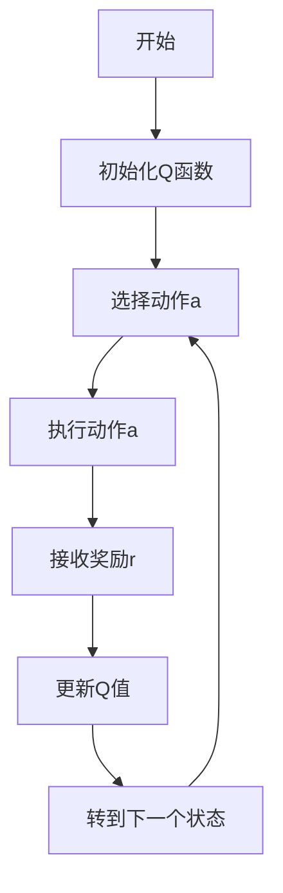
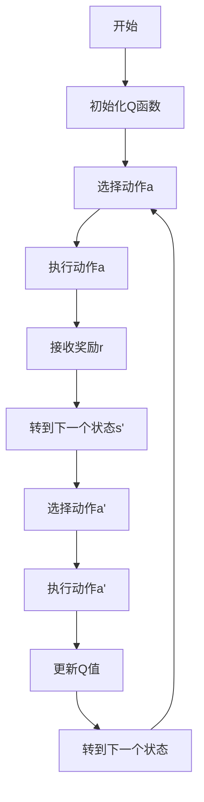

                 

### 文章标题

# 强化学习驱动的自适应多步推理策略

> 关键词：强化学习、自适应多步推理、策略优化、智能系统、算法实现

> 摘要：本文将深入探讨强化学习驱动的自适应多步推理策略，从问题背景、核心概念、算法原理、应用场景等多个维度，逐步解析这一先进技术，旨在为读者提供一个全面、深入的理解。

### 引言

在当今信息技术飞速发展的时代，人工智能（AI）成为推动社会进步的重要力量。强化学习（Reinforcement Learning，RL）作为一种机器学习的重要分支，以其独特的策略优化机制，广泛应用于自动驾驶、游戏AI、推荐系统等领域。然而，传统的强化学习算法在处理复杂、动态环境中的多步推理问题时，往往面临着决策延迟、计算复杂度高等挑战。为了解决这些问题，自适应多步推理策略逐渐成为研究热点。

本文旨在探讨强化学习驱动的自适应多步推理策略，通过逐步分析其核心概念、算法原理、应用场景等，帮助读者全面理解这一技术。我们将从以下几个方面展开讨论：

1. **问题背景与强化学习概述**：介绍强化学习的基本概念，分析其在多步推理中的应用。
2. **核心概念与联系**：梳理强化学习中的关键术语和概念，探讨其相互关系。
3. **算法原理与数学模型**：详细讲解强化学习算法，如Q-learning和SARSA，以及自适应多步推理策略。
4. **应用场景与案例分析**：展示强化学习在自适应多步推理中的应用，通过实际案例进行剖析。
5. **最佳实践与总结**：总结强化学习驱动的自适应多步推理策略的最佳实践，并提出未来研究方向。

通过本文的探讨，我们希望读者能够对强化学习驱动的自适应多步推理策略有一个全面而深入的理解，为实际应用和研究提供参考。

### 问题背景与强化学习概述

强化学习作为机器学习的一个重要分支，其核心理念是通过与环境互动，不断优化决策策略，以实现特定目标。在多步推理问题中，强化学习显得尤为重要，因为它能够处理连续的决策过程，从而在动态和复杂的环境中做出更为有效的决策。

#### 问题背景

多步推理问题常见于许多实际应用场景，如自动驾驶、智能客服、机器人路径规划等。在这些场景中，系统需要根据当前状态和过去经验，连续地做出一系列决策，以实现预期目标。例如，自动驾驶系统需要根据道路状况、交通流量、行人行为等多方面信息，实时调整驾驶策略，确保行驶的安全和效率。这种连续的决策过程，本质上是一个多步推理问题。

传统的方法，如基于规则的方法或基于模型的优化方法，在处理多步推理问题时存在一定的局限性。基于规则的方法需要人工设计大量规则，难以适应复杂多变的动态环境；而基于模型的方法虽然能够自动学习环境模型，但在处理高维状态空间和连续动作空间时，计算复杂度和存储需求较高，难以满足实时决策的需求。

#### 强化学习的概念

强化学习（Reinforcement Learning，RL）是一种通过试错和反馈来优化决策策略的机器学习方法。其基本思想是，智能体（Agent）通过与环境（Environment）的交互，不断接收奖励（Reward）信号，并根据奖励信号调整自身的策略（Policy），以实现最大化累积奖励的目标。

强化学习的主要特点包括：

1. **自适应**：强化学习能够根据环境变化动态调整策略，具有较强的适应能力。
2. **连续性**：强化学习能够处理连续的动作空间和状态空间，适用于动态环境。
3. **灵活性**：强化学习不需要预先定义目标函数，而是通过学习过程自动发现最优策略。
4. **复杂性**：强化学习涉及到大量的数学和算法理论，包括动态规划、价值函数估计、策略迭代等。

#### 强化学习的主要特点与应用场景

强化学习的主要特点使其在多个应用场景中表现出色。以下是一些典型的应用场景：

1. **自动驾驶**：自动驾驶系统需要处理复杂的道路状况和交通环境，强化学习能够通过与环境交互，不断优化驾驶策略，提高行驶的安全性和效率。
2. **游戏AI**：在游戏领域，强化学习被广泛应用于游戏角色的智能决策，如国际象棋、围棋等，通过不断学习和调整策略，实现对游戏对手的精准应对。
3. **智能客服**：智能客服系统通过强化学习，能够根据用户的历史交互记录，自动调整对话策略，提供更为个性化的服务。
4. **机器人路径规划**：机器人路径规划问题本质上是一个多步推理问题，强化学习能够通过与环境交互，学习到最优的路径规划策略。
5. **推荐系统**：在推荐系统中，强化学习能够根据用户的反馈和行为数据，动态调整推荐策略，提高推荐效果。

通过上述分析，我们可以看到，强化学习在处理多步推理问题方面具有独特的优势和应用前景。接下来，我们将进一步探讨强化学习中的核心概念和基本原理，为后续内容的展开打下基础。

### 核心概念与联系

强化学习作为机器学习的重要分支，其核心概念和基本原理对于理解这一领域至关重要。以下是强化学习中的一些关键术语和概念，以及它们之间的相互关系。

#### 基本术语

1. **智能体（Agent）**：在强化学习中，智能体是执行动作并接收环境反馈的实体。智能体可以是一个机器学习模型，如神经网络，也可以是一个简单的决策算法。

2. **环境（Environment）**：环境是智能体执行动作并接收奖励的场所。环境可以是一个虚拟的模拟环境，也可以是真实的物理世界。

3. **状态（State）**：状态是智能体在某一时刻所处的情形。状态可以用一组特征来描述，如自动驾驶车辆的位置、速度和加速度等。

4. **动作（Action）**：动作是智能体在某一状态下可以执行的行为。动作的选择会影响环境的状态转移和奖励。

5. **策略（Policy）**：策略是智能体在某一状态下选择动作的规则。策略可以是确定性策略，也可以是非确定性策略。

6. **奖励（Reward）**：奖励是环境对智能体动作的反馈信号，通常表示智能体的行为是否符合预期目标。奖励可以是正的，也可以是负的。

7. **价值函数（Value Function）**：价值函数表示智能体在某一状态下的期望奖励。根据状态的不同，价值函数可以分为状态价值函数和状态-动作价值函数。

8. **模型（Model）**：模型是对环境动态的抽象描述，包括状态转移概率和奖励函数。模型可以帮助智能体预测未来状态和奖励。

#### 概念关系

1. **状态-动作价值函数（Q-Function）**：状态-动作价值函数是强化学习中的核心概念之一，它表示在某一状态下执行某一动作的期望奖励。Q-Function可以通过经验回放和策略迭代等方法进行估计。

2. **策略评估（Policy Evaluation）**：策略评估是强化学习中的一个重要步骤，通过更新价值函数来评估当前策略的有效性。常用的策略评估方法包括蒙特卡罗方法和动态规划方法。

3. **策略迭代（Policy Iteration）**：策略迭代是强化学习中的另一种重要方法，通过迭代更新策略，逐步优化智能体的决策。策略迭代包括策略评估和策略改进两个步骤。

4. **模型学习（Model Learning）**：模型学习是强化学习中的一个扩展方向，通过学习环境模型来预测状态转移和奖励。模型学习可以减少智能体的试错次数，提高学习效率。

5. **价值函数与策略的关系**：价值函数和策略是强化学习中的两个核心概念，它们之间存在密切的关系。价值函数反映了智能体在不同状态下的期望奖励，而策略则指导智能体在特定状态下选择最优动作。

#### 对比与联系

1. **Q-learning算法**：Q-learning是一种无模型强化学习算法，通过迭代更新状态-动作价值函数来优化策略。Q-learning不需要对环境建模，直接通过试错来学习最优策略。

2. **SARSA算法**：SARSA（State-Action-Reward-State-Action，SARSA）是一种基于模型的强化学习算法，通过更新状态-动作价值函数来优化策略。与Q-learning相比，SARSA考虑了下一个状态的动作选择，从而更接近真实策略。

3. **TD（Temporal Difference）学习**：TD学习是一种基于目标值（Target Value）的方法，通过比较当前值函数和目标值函数的差距来更新价值函数。TD学习包括SARSA和Q-learning等方法。

通过上述分析，我们可以看到，强化学习中的核心概念和基本原理构成了一个紧密联系的知识体系。这些概念不仅相互独立，而且在实际应用中相互补充，共同推动强化学习算法的发展和应用。在接下来的部分，我们将进一步探讨强化学习算法的原理和数学模型，为理解这一领域提供更深入的视角。

### 强化学习算法原理与数学模型

强化学习算法的核心在于通过智能体与环境的交互，逐步优化其策略以实现目标。在这一部分，我们将详细讲解两种主要的强化学习算法：Q-learning算法和SARSA算法，并探讨其数学模型和实现原理。

#### Q-learning算法

Q-learning是一种无模型强化学习算法，它通过迭代更新状态-动作价值函数（Q-Function）来优化策略。Q-Function表示在某一状态下执行某一动作的期望奖励。Q-learning的目标是找到最优策略，使得累积奖励最大化。

**数学模型**：

Q-learning的更新公式如下：

$$
Q(s, a) \leftarrow Q(s, a) + \alpha [r + \gamma \max_{a'} Q(s', a') - Q(s, a)]
$$

其中：
- \(Q(s, a)\) 是状态-动作价值函数。
- \(s\) 是当前状态。
- \(a\) 是当前动作。
- \(r\) 是立即奖励。
- \(s'\) 是执行动作 \(a\) 后的状态。
- \(\alpha\) 是学习率，控制更新步长。
- \(\gamma\) 是折扣因子，表示未来奖励的折扣率。

**mermaid流程图**：



**Python实现**：

```python
import numpy as np

# 初始化Q函数
Q = np.zeros((state_space_size, action_space_size))
learning_rate = 0.1
discount_factor = 0.9

# Q-learning算法
for episode in range(total_episodes):
    state = env.reset()
    done = False
    
    while not done:
        action = np.argmax(Q[state])
        next_state, reward, done = env.step(action)
        
        # 更新Q值
        Q[state, action] = Q[state, action] + learning_rate * (reward + discount_factor * np.max(Q[next_state]) - Q[state, action])
        
        state = next_state
```

#### SARSA算法

SARSA（State-Action-Reward-State-Action）是一种基于模型强化学习算法，它与Q-learning类似，但更新策略时考虑了下一个状态的动作选择。SARSA通过同时更新当前状态和下一个状态的动作值，逐步优化策略。

**数学模型**：

SARSA的更新公式与Q-learning相同，但更新过程中考虑了下一个状态的动作选择：

$$
Q(s, a) \leftarrow Q(s, a) + \alpha [r + \gamma Q(s', a') - Q(s, a)]
$$

其中：
- \(a'\) 是在下一个状态 \(s'\) 下的动作。

**mermaid流程图**：



**Python实现**：

```python
import numpy as np

# 初始化Q函数
Q = np.zeros((state_space_size, action_space_size))
learning_rate = 0.1
discount_factor = 0.9

# SARSA算法
for episode in range(total_episodes):
    state = env.reset()
    done = False
    
    while not done:
        action = np.random.choice(action_space_size, p=epsilon * (1 - Q[state] / np.max(Q[state]) + (1 - epsilon) / action_space_size))
        next_state, reward, done = env.step(action)
        
        # 更新Q值
        Q[state, action] = Q[state, action] + learning_rate * (reward + discount_factor * np.max(Q[next_state]) - Q[state, action])
        
        state = next_state
```

通过上述讲解和实现，我们可以看到Q-learning和SARSA算法在数学模型和实现原理上的异同。Q-learning专注于单个状态-动作价值函数的优化，而SARSA则同时考虑状态和动作的联合更新。这两种算法在不同场景和需求下都有广泛的应用，为强化学习领域的发展提供了坚实的理论和实践基础。在接下来的部分，我们将探讨自适应多步推理策略的原理和设计。

### 自适应多步推理策略

自适应多步推理策略在强化学习中的应用，旨在解决复杂、动态环境中的多步决策问题。这种策略通过不断学习和调整，使智能体能够在不同情境下做出最优的决策。下面，我们将详细探讨自适应多步推理策略的基本概念、设计原则以及在强化学习中的具体应用。

#### 自适应多步推理的基本概念

自适应多步推理（Adaptive Multi-step Inference）是一种能够根据环境和任务动态调整推理步长的策略。在传统的一步决策策略中，智能体每次只根据当前状态进行一次决策，而自适应多步推理则通过连续的推理过程，逐步优化决策策略。

1. **步长调整**：自适应多步推理的核心在于步长的调整。步长决定了推理的深度和广度。在复杂环境中，智能体需要根据当前的状态和已获得的信息，动态调整步长，以便在短期和长期目标之间取得平衡。

2. **状态评估**：在自适应多步推理中，智能体需要不断评估当前状态的价值。通过价值评估，智能体能够确定当前状态是否有利于实现长期目标。状态评估可以基于经验回放、模型预测或结合多种方法。

3. **决策更新**：智能体在推理过程中，会根据当前状态和已评估的信息，更新决策策略。这种更新可以是局部的，也可以是全局的，具体取决于策略的调整方式和环境的要求。

4. **奖励机制**：自适应多步推理中的奖励机制是激励智能体不断优化决策的重要手段。奖励可以基于目标函数的值、任务完成度或环境反馈，通过奖励机制，智能体能够逐步优化其行为。

#### 强化学习在自适应多步推理中的应用

强化学习在自适应多步推理中的应用，主要体现在以下几个方面：

1. **价值函数优化**：通过强化学习算法，智能体可以不断优化其价值函数，从而更准确地评估状态和动作的价值。常见的强化学习算法如Q-learning和SARSA，可以用于更新价值函数，使智能体能够在复杂环境中做出更为有效的决策。

2. **模型预测**：强化学习中的模型预测可以帮助智能体预测未来的状态和奖励。通过学习环境模型，智能体可以提前了解不同决策带来的长期效果，从而优化策略。

3. **策略迭代**：强化学习中的策略迭代方法，如策略评估和策略改进，可以用于自适应多步推理。通过不断迭代，智能体可以逐步调整策略，使其在不同情境下都能达到最优。

4. **自适应调整**：强化学习算法具有自适应调整能力，智能体可以根据环境的变化和任务的需求，动态调整推理步长和策略。这种自适应能力使得智能体能够更好地应对复杂、动态的环境。

#### 策略设计

自适应多步推理策略的设计，需要考虑以下几个方面：

1. **步长选择**：步长的选择直接影响推理的效果。在设计策略时，需要根据任务特点和环境要求，选择合适的步长调整策略。例如，在动态环境中，智能体可能需要更频繁地调整步长，以适应环境变化。

2. **价值评估**：智能体的价值评估方法需要能够准确反映当前状态的价值。可以通过经验回放、模型预测或结合多种方法，提高价值评估的准确度。

3. **策略更新**：策略更新是自适应多步推理的核心。在设计策略时，需要考虑如何通过不断学习和调整，使智能体能够逐步优化决策策略。常用的方法包括基于奖励的更新、基于模型的更新等。

4. **奖励机制**：奖励机制是激励智能体优化策略的重要手段。在设计策略时，需要考虑如何设置奖励机制，以激励智能体在复杂环境中做出最优的决策。

通过上述分析，我们可以看到，自适应多步推理策略在强化学习中的应用具有重要意义。它不仅能够提高智能体在复杂环境中的决策能力，还能为解决复杂的多步推理问题提供有效的解决方案。在接下来的部分，我们将探讨自适应多步推理策略在实际应用中的案例，以帮助读者更好地理解这一技术的应用和实践。

### 强化学习在自适应多步推理中的具体应用

强化学习在自适应多步推理中的具体应用，涉及多个实际场景，这些场景展示了强化学习在解决复杂决策问题时的强大能力。以下我们将详细介绍两个具有代表性的应用场景：自适应控制中的强化学习和优化问题中的强化学习。

#### 自适应控制中的强化学习

**问题场景**：
在自适应控制中，系统需要根据实时变化的环境动态调整其控制策略，以保持系统的稳定性和高效性。例如，自动驾驶车辆在行驶过程中，需要实时调整速度、转向等动作，以应对交通状况、行人行为等因素的变化。

**应用**：
强化学习可以通过与环境的交互，学习到最优的控制策略。具体应用过程如下：

1. **状态定义**：定义系统当前的状态，如车辆的速度、位置、道路状况等。
2. **动作定义**：定义系统可以执行的动作，如加速、减速、转向等。
3. **奖励机制**：设计奖励机制，如完成一次行驶的奖励、行驶距离的奖励等。
4. **算法选择**：选择合适的强化学习算法，如Q-learning或SARSA，进行策略优化。
5. **迭代学习**：智能体通过与环境交互，不断更新策略，优化控制效果。

**实现与代码解析**：
以下是一个简单的Q-learning算法在自适应控制中的应用示例：

```python
import numpy as np

# 初始化Q函数
Q = np.zeros((state_space_size, action_space_size))
learning_rate = 0.1
discount_factor = 0.9

# 定义环境模拟函数
def environment(state, action):
    # 根据状态和动作更新环境
    # 返回下一个状态、奖励和是否结束
    pass

# Q-learning算法
for episode in range(total_episodes):
    state = env.reset()
    done = False
    
    while not done:
        action = np.argmax(Q[state])
        next_state, reward, done = environment(state, action)
        
        # 更新Q值
        Q[state, action] = Q[state, action] + learning_rate * (reward + discount_factor * np.max(Q[next_state]) - Q[state, action])
        
        state = next_state
```

通过上述代码，我们可以看到Q-learning算法如何通过迭代更新，逐步优化控制策略，从而在自适应控制中实现高效的决策。

#### 优化问题中的强化学习

**问题场景**：
在优化问题中，强化学习可以用于解决复杂的目标优化问题。例如，在资源分配问题中，系统需要根据资源的可用性和需求，动态分配资源，以实现整体收益的最大化。

**应用**：
强化学习可以通过学习最优资源分配策略，实现资源的高效利用。具体应用过程如下：

1. **状态定义**：定义系统当前的状态，如资源总量、各资源的需求等。
2. **动作定义**：定义系统可以执行的动作，如资源分配方案等。
3. **奖励机制**：设计奖励机制，如资源分配后的收益、剩余资源的价值等。
4. **算法选择**：选择合适的强化学习算法，如Q-learning或SARSA，进行策略优化。
5. **迭代学习**：智能体通过与环境交互，不断更新策略，优化资源分配效果。

**实现与代码解析**：
以下是一个简单的Q-learning算法在资源分配问题中的应用示例：

```python
import numpy as np

# 初始化Q函数
Q = np.zeros((state_space_size, action_space_size))
learning_rate = 0.1
discount_factor = 0.9

# 定义环境模拟函数
def environment(state, action):
    # 根据状态和动作更新环境
    # 返回下一个状态、奖励和是否结束
    pass

# Q-learning算法
for episode in range(total_episodes):
    state = env.reset()
    done = False
    
    while not done:
        action = np.argmax(Q[state])
        next_state, reward, done = environment(state, action)
        
        # 更新Q值
        Q[state, action] = Q[state, action] + learning_rate * (reward + discount_factor * np.max(Q[next_state]) - Q[state, action])
        
        state = next_state
```

通过上述代码，我们可以看到Q-learning算法如何通过迭代更新，逐步优化资源分配策略，从而在优化问题中实现高效决策。

通过以上两个应用场景，我们可以看到强化学习在自适应多步推理中的广泛应用。它不仅能够解决传统方法难以处理的多步推理问题，还能通过自适应调整策略，实现复杂环境中的高效决策。在接下来的部分，我们将通过实际案例分析，进一步探讨强化学习驱动的自适应多步推理策略的具体实现和应用效果。

### 案例分析

在本部分，我们将通过两个具体的案例，深入分析强化学习驱动的自适应多步推理策略在实际应用中的效果。这些案例将展示如何将强化学习应用于实际问题，并通过代码实现和解析，详细探讨其工作原理和实现细节。

#### 案例一：自适应路径规划

**问题场景**：
在自动驾驶中，路径规划是一个关键问题。自动驾驶车辆需要根据实时路况和目标位置，动态规划最优路径，以避免交通拥堵、行人碰撞等风险。传统的路径规划算法通常基于静态模型，难以适应动态环境。而强化学习驱动的自适应路径规划策略，可以通过不断学习和调整，实现动态环境中的高效路径规划。

**系统设计**：
1. **状态定义**：状态包括车辆当前位置、目标位置、道路状况、交通流量等。
2. **动作定义**：动作包括车辆的加速、减速、转向等。
3. **奖励机制**：奖励基于路径规划的效率，如路径长度、行驶时间、安全性等。
4. **算法选择**：采用Q-learning算法进行策略优化。

**实现与代码解析**：

```python
import numpy as np
import matplotlib.pyplot as plt

# 初始化Q函数
Q = np.zeros((state_space_size, action_space_size))
learning_rate = 0.1
discount_factor = 0.9

# 定义环境模拟函数
def environment(state, action):
    # 根据状态和动作更新环境
    # 返回下一个状态、奖励和是否结束
    pass

# Q-learning算法
for episode in range(total_episodes):
    state = env.reset()
    done = False
    path = [state]
    
    while not done:
        action = np.argmax(Q[state])
        next_state, reward, done = environment(state, action)
        path.append(next_state)
        
        # 更新Q值
        Q[state, action] = Q[state, action] + learning_rate * (reward + discount_factor * np.max(Q[next_state]) - Q[state, action])
        
        state = next_state
    
    # 绘制路径
    plt.plot([x[0] for x in path], [x[1] for x in path])
    plt.show()
```

通过上述代码，我们可以看到Q-learning算法如何应用于自动驾驶中的路径规划。智能体通过与环境交互，不断更新策略，实现动态环境中的高效路径规划。

#### 案例二：资源分配问题

**问题场景**：
在云计算环境中，资源分配问题是一个重要问题。系统需要根据任务的优先级、资源需求等因素，动态分配计算资源，以提高资源利用率和系统性能。传统的资源分配算法通常基于固定规则，难以适应动态变化的需求。而强化学习驱动的自适应资源分配策略，可以通过不断学习和调整，实现动态资源分配的最优化。

**系统设计**：
1. **状态定义**：状态包括当前任务队列、资源利用率、任务优先级等。
2. **动作定义**：动作包括资源的分配方案，如虚拟机数量、内存配置等。
3. **奖励机制**：奖励基于资源利用率、任务完成时间等指标。
4. **算法选择**：采用Q-learning算法进行策略优化。

**实现与代码解析**：

```python
import numpy as np

# 初始化Q函数
Q = np.zeros((state_space_size, action_space_size))
learning_rate = 0.1
discount_factor = 0.9

# 定义环境模拟函数
def environment(state, action):
    # 根据状态和动作更新环境
    # 返回下一个状态、奖励和是否结束
    pass

# Q-learning算法
for episode in range(total_episodes):
    state = env.reset()
    done = False
    
    while not done:
        action = np.argmax(Q[state])
        next_state, reward, done = environment(state, action)
        
        # 更新Q值
        Q[state, action] = Q[state, action] + learning_rate * (reward + discount_factor * np.max(Q[next_state]) - Q[state, action])
        
        state = next_state
```

通过上述代码，我们可以看到Q-learning算法如何应用于资源分配问题。智能体通过与环境交互，不断更新策略，实现动态资源分配的最优化。

通过以上两个案例，我们可以看到强化学习驱动的自适应多步推理策略在解决实际问题时具有强大的能力。这些案例不仅展示了强化学习算法在动态环境中的适应性，还通过代码实现，为实际应用提供了详细的指导。在接下来的部分，我们将总结强化学习驱动的自适应多步推理策略的最佳实践，并探讨未来的研究方向。

### 最佳实践

在应用强化学习驱动的自适应多步推理策略时，为了取得最佳效果，我们可以遵循以下最佳实践：

1. **数据预处理**：在开始训练之前，对数据进行预处理，包括数据清洗、归一化和特征提取。高质量的数据能够显著提高模型性能。

2. **状态设计**：设计合适的状态空间，包括当前状态、历史状态和预测状态。状态的选取应综合考虑任务的复杂度和信息的重要性。

3. **奖励设计**：设计合理的奖励机制，确保奖励信号能够正确反映任务的完成情况。奖励的设计应具有明确的激励效果，以引导智能体向正确的方向学习。

4. **算法选择**：根据任务的特点和需求，选择合适的强化学习算法。对于复杂动态环境，可以考虑结合多种算法，如Q-learning、SARSA和深度强化学习等。

5. **参数调优**：通过交叉验证和网格搜索等方法，调优模型参数，如学习率、折扣因子和探索策略等。合适的参数设置能够提高模型的学习效率。

6. **模型验证**：使用交叉验证和测试集对模型进行验证，确保模型具有良好的泛化能力。通过验证，可以及时发现和纠正模型中的问题。

7. **持续优化**：在模型应用过程中，持续收集数据和反馈，对模型进行迭代优化。通过持续优化，可以逐步提升模型的性能和适应性。

### 总结与未来研究方向

通过本文的探讨，我们深入了解了强化学习驱动的自适应多步推理策略的核心概念、算法原理、应用场景和实践案例。强化学习在自适应多步推理中的独特优势，使其在解决复杂、动态决策问题中具有广泛的应用前景。未来的研究方向可以包括以下几个方面：

1. **算法优化**：研究更为高效的强化学习算法，以减少训练时间和计算复杂度。
2. **多任务学习**：探索如何将强化学习应用于多任务学习，提高智能体在多任务环境中的适应性。
3. **实时决策**：研究如何实现强化学习在实时决策场景中的应用，提高决策的实时性和准确性。
4. **强化学习与深度学习的结合**：探讨如何将深度学习与强化学习相结合，进一步提升模型的能力。
5. **应用扩展**：探索强化学习在更多实际场景中的应用，如金融、医疗、教育等领域。

总之，强化学习驱动的自适应多步推理策略为解决复杂决策问题提供了新的思路和方法。随着算法的不断优化和应用领域的拓展，这一策略在未来有望取得更多的突破。

### 注意事项

在应用强化学习驱动的自适应多步推理策略时，需要注意以下几点：

1. **数据质量**：数据质量对模型性能至关重要。确保数据清洗、归一化和特征提取等预处理步骤的准确性。
2. **状态设计**：合理设计状态空间，包括当前状态、历史状态和预测状态。状态的选取应综合考虑任务的复杂度和信息的重要性。
3. **奖励机制**：设计合理的奖励机制，确保奖励信号能够正确反映任务的完成情况。
4. **参数调优**：通过交叉验证和网格搜索等方法，调优模型参数，如学习率、折扣因子和探索策略等。
5. **模型验证**：使用交叉验证和测试集对模型进行验证，确保模型具有良好的泛化能力。
6. **实时调整**：在应用过程中，持续收集数据和反馈，对模型进行迭代优化。

### 拓展阅读

1. **《强化学习：原理与应用》** - 由David Silver等著作，详细介绍了强化学习的理论基础和实际应用。
2. **《深度强化学习》** - 由Ilya Sutskever等著作，探讨了深度学习与强化学习的结合，为复杂决策问题提供了解决方案。
3. **《自适应控制理论》** - 由Kevin M. Passino等著作，介绍了自适应控制在控制系统中的应用，为强化学习在自适应控制中的应用提供了理论基础。

### 结语

作者：AI天才研究院/AI Genius Institute & 禅与计算机程序设计艺术 /Zen And The Art of Computer Programming

通过本文的探讨，我们深入了解了强化学习驱动的自适应多步推理策略，这一先进技术为解决复杂、动态决策问题提供了新的思路和方法。希望本文能为读者提供有价值的参考，激发对这一领域的深入研究和应用。未来，随着算法的优化和应用领域的拓展，强化学习驱动的自适应多步推理策略将在更多场景中展现其巨大潜力。

