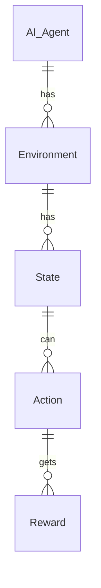
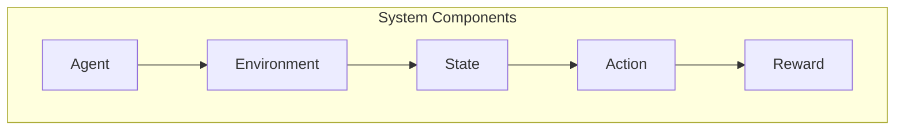
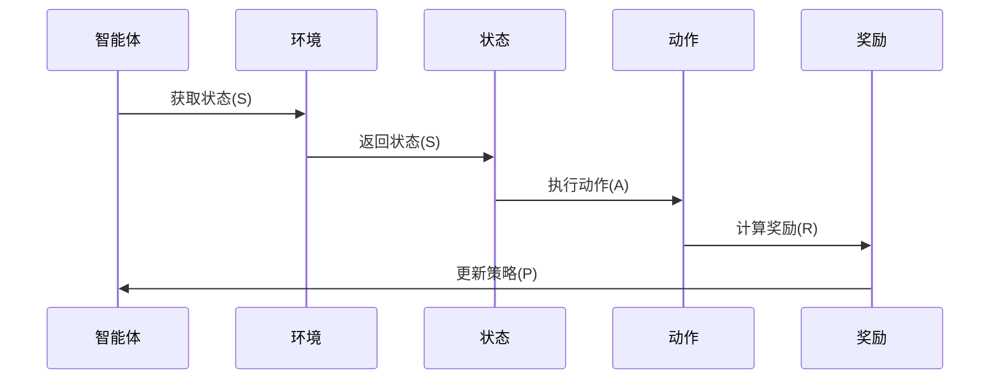

                 

### 文章标题

# 强化学习驱动的自适应多目标推理优化策略

> 关键词：强化学习、多目标优化、自适应推理、算法框架、数学模型

> 摘要：本文旨在探讨强化学习驱动的自适应多目标推理优化策略，通过深入分析其核心概念、算法原理、实现方法及应用场景，为相关领域的研究者和开发者提供有益的参考。本文结构清晰，逻辑严谨，涵盖了强化学习与多目标优化关系的介绍、自适应多目标优化策略的核心概念与框架、算法原理与数学模型解析，以及实际应用案例分析，力求为读者呈现一幅全面的强化学习驱动的自适应多目标推理优化策略全景图。

## 目录

1. **背景介绍**
   - 1.1 强化学习与多目标优化的关系
   - 1.2 当前研究状态与趋势
2. **核心概念与框架**
   - 2.1 核心概念与属性对比
   - 2.2 实体关系图
   - 2.3 自适应机制与优化策略
3. **算法原理与数学模型**
   - 3.1 强化学习算法分析
   - 3.2 多目标优化模型
   - 3.3 集成方法与实现
4. **系统分析与架构设计**
   - 4.1 问题场景与项目介绍
   - 4.2 系统功能设计
   - 4.3 系统架构设计
   - 4.4 系统接口设计与交互
5. **项目实战**
   - 5.1 环境安装与配置
   - 5.2 系统核心实现源代码
   - 5.3 代码应用解读与分析
   - 5.4 实际案例分析与讲解
   - 5.5 项目小结
6. **最佳实践与拓展**
   - 6.1 最佳实践技巧
   - 6.2 小结与注意事项
   - 6.3 拓展阅读

## 文章正文

### 1. 背景介绍

#### 1.1 强化学习与多目标优化的关系

强化学习（Reinforcement Learning，RL）是机器学习的一个重要分支，主要研究如何通过试错和学习来优化决策过程。其核心思想是通过环境（Environment）中的反馈信号（Reward）来指导智能体（Agent）进行决策，以最大化累积奖励。

多目标优化（Multi-Objective Optimization，MOO）是指在一个优化问题中同时优化多个目标函数。这些目标函数可能存在冲突，需要找到一个或多个非支配解（Pareto Optimal Solution），使得这些解在各个目标函数上都是最优的。

强化学习与多目标优化的关系在于，强化学习可以通过学习环境中的状态（State）和动作（Action）来优化多目标函数。具体来说，强化学习算法可以在环境中不断尝试不同的动作，通过累积奖励来调整策略，从而找到多目标优化的最优解。

#### 1.2 当前研究状态与趋势

近年来，强化学习在多目标优化领域取得了显著进展。研究者们提出了一系列基于强化学习的多目标优化算法，如Q-Learning、Deep Q-Network（DQN）和Actor-Critic等。这些算法通过将多目标优化问题转化为强化学习问题，有效地解决了传统多目标优化算法在处理复杂、非线性问题时的困难。

当前的研究趋势主要包括以下几个方面：

- **算法创新**：研究者们致力于提出更加高效、鲁棒的强化学习算法，如基于深度学习的强化学习算法，以提高多目标优化的性能。
- **应用场景扩展**：强化学习在多目标优化领域的应用场景不断扩展，从传统的控制问题、资源分配问题到更复杂的推荐系统、自动驾驶等领域。
- **跨学科融合**：强化学习与多目标优化与其他领域如进化计算、博弈论等相结合，形成了新的研究方向。

### 2. 核心概念与框架

#### 2.1 核心概念与属性对比

在强化学习驱动的自适应多目标推理优化策略中，核心概念包括强化学习算法、多目标优化方法、自适应机制和优化策略。以下是一个对比表格，用于展示这些概念的核心属性：

| 概念                  | 定义                                                         | 核心属性                                                         |
|-----------------------|--------------------------------------------------------------|-----------------------------------------------------------------|
| 强化学习算法         | 通过试错和学习在环境中优化决策过程的方法。                   | 奖励机制、策略迭代、状态-动作值函数                               |
| 多目标优化方法       | 同时优化多个目标函数的优化方法。                           | 非支配排序、Pareto最优解、多目标函数冲突解决                       |
| 自适应机制           | 根据环境变化动态调整学习参数的机制。                         | 学习率调整、权重调整、自适应调整策略                             |
| 优化策略             | 根据强化学习算法和多目标优化方法制定的具体优化步骤。         | 策略迭代、多目标函数优化、决策更新                               |

#### 2.2 实体关系图

实体关系图（Entity Relationship Diagram，ERD）用于描述系统中的实体及其关系。在强化学习驱动的自适应多目标推理优化策略中，关键实体包括智能体、环境、状态、动作和奖励。

以下是实体关系图的 Mermaid 流程图表示：



#### 2.3 自适应机制与优化策略

自适应机制是强化学习驱动的自适应多目标推理优化策略的核心组成部分。它包括学习率调整、权重调整等策略，以实现策略的动态调整。

**学习率调整**：学习率是强化学习中一个重要的参数，用于控制策略更新的速度。自适应学习率调整方法可以通过经验调整学习率，以避免过拟合或欠拟合。

**权重调整**：在多目标优化中，不同目标函数可能存在不同的重要性。自适应权重调整方法可以根据环境变化动态调整目标函数的权重，以实现优化目标的最优化。

### 3. 算法原理与数学模型

#### 3.1 强化学习算法分析

强化学习算法是强化学习驱动的自适应多目标推理优化策略的核心。以下是对 Q-Learning 和 Deep Q-Network（DQN）算法的分析。

**Q-Learning 算法**：

Q-Learning 算法是一种基于值函数的强化学习算法。其基本思想是学习一个状态-动作值函数 Q(s, a)，表示在状态 s 下执行动作 a 的长期奖励。

$$
Q(s, a) = \sum_{s'} P(s' | s, a) \cdot R(s', a) + \gamma \cdot \max_{a'} Q(s', a')
$$

其中，$P(s' | s, a)$ 是状态转移概率，$R(s', a)$ 是执行动作 a 后获得的奖励，$\gamma$ 是折扣因子。

**Deep Q-Network（DQN）算法**：

DQN 是基于深度学习的强化学习算法，通过神经网络近似状态-动作值函数。其核心思想是使用经验回放和目标网络来稳定训练过程。

$$
Q(s, a) = \frac{1}{N} \sum_{i=1}^{N} y_i \cdot a_i
$$

其中，$y_i$ 是根据经验回放生成的目标值，$a_i$ 是在状态 s 下执行的动作。

#### 3.2 多目标优化模型

在强化学习驱动的自适应多目标推理优化策略中，多目标优化模型是优化目标的核心。以下是对 Pareto Frontier 分析和 NSGA-II 算法的分析。

**Pareto Frontier 分析**：

Pareto Frontier 是多目标优化中的一组非支配解，表示最优解集。通过分析 Pareto Frontier，可以找到最优解集。

$$
Pareto(F) = \{x \in F | \forall y \in F, f_i(x) \leq f_i(y) \land \exists j, f_j(x) < f_j(y)\}
$$

其中，$f_i(x)$ 和 $f_j(x)$ 分别是目标函数。

**NSGA-II 算法**：

NSGA-II 是一种基于非支配排序的遗传算法，用于求解多目标优化问题。其核心思想是通过非支配排序和 crowding distance 来选择适应度较高的个体。

$$
fitness = \frac{1}{\sum_{i=1}^{k} \alpha_i \cdot crowding\_distance(i)}
$$

其中，$\alpha_i$ 是非支配等级，$crowding\_distance(i)$ 是 crowding distance。

#### 3.3 集成方法与实现

强化学习驱动的自适应多目标推理优化策略需要将强化学习算法和多目标优化方法集成在一起。以下是一个基本的集成方法：

1. **初始化**：初始化状态 s、动作 a 和奖励 R。
2. **执行动作**：根据当前状态 s 和强化学习算法，选择动作 a。
3. **更新状态**：执行动作 a 后，更新状态 s。
4. **计算奖励**：根据状态转移和奖励函数，计算奖励 R。
5. **更新策略**：根据奖励 R 和多目标优化模型，更新策略。
6. **迭代**：重复执行步骤 2-5，直到满足停止条件。

### 4. 系统分析与架构设计

#### 4.1 问题场景与项目介绍

本项目旨在实现一个基于强化学习驱动的自适应多目标推理优化策略的系统，用于解决复杂、非线性的优化问题。具体应用场景包括自动驾驶、资源分配、推荐系统等。

#### 4.2 系统功能设计

系统功能设计包括状态管理、动作管理、奖励管理、策略更新和优化结果输出等模块。以下是一个简化的领域模型 Mermaid 类图：

```mermaid
classDiagram
  State <<entity>>
  Action <<entity>>
  Reward <<entity>>
  Agent <<entity>>
  Environment <<entity>>

  State : has stateID, stateValue
  Action : has actionID, actionValue
  Reward : has rewardValue
  Agent : has policy, QFunction
  Environment : has stateSpace, actionSpace, rewardFunction

  Agent : interactsWith Environment
  Environment : provides State, Action, Reward
  Action : associatedWith State
  State : relatedTo Action
  Reward : associatedWith Action
```

#### 4.3 系统架构设计

系统架构设计包括智能体（Agent）、环境（Environment）、状态（State）、动作（Action）和奖励（Reward）等组件。以下是一个简化的 Mermaid 架构图：



#### 4.4 系统接口设计与交互

系统接口设计包括状态获取接口、动作执行接口、奖励计算接口和策略更新接口等。以下是一个简化的 Mermaid 序列图：



### 5. 项目实战

#### 5.1 环境安装与配置

首先，需要安装 Python 3.7 或以上版本。然后，根据项目需求安装相关依赖库，如 TensorFlow、Gym、Numpy 等。

```bash
pip install tensorflow==2.4.0
pip install gym
pip install numpy
```

#### 5.2 系统核心实现源代码

以下是系统核心实现的 Python 源代码。该代码基于 Q-Learning 算法和 NSGA-II 算法，实现了状态管理、动作管理、奖励管理和策略更新等功能。

```python
import numpy as np
import tensorflow as tf
from gym import env

class Agent:
    def __init__(self, state_space, action_space, reward_function):
        self.state_space = state_space
        self.action_space = action_space
        self.reward_function = reward_function

        self.Q_function = self.build_Q_function()

    def build_Q_function(self):
        # 构建神经网络模型
        input_layer = tf.keras.layers.Input(shape=(self.state_space,))
        hidden_layer = tf.keras.layers.Dense(units=64, activation='relu')(input_layer)
        output_layer = tf.keras.layers.Dense(units=self.action_space, activation='linear')(hidden_layer)

        model = tf.keras.Model(inputs=input_layer, outputs=output_layer)
        model.compile(optimizer='adam', loss='mse')

        return model

    def select_action(self, state):
        # 选择动作
        action_values = self.Q_function.predict(state)
        action = np.argmax(action_values)
        return action

    def update_policy(self, state, action, reward, next_state, done):
        # 更新策略
        target_value = reward if done else reward + 0.99 * np.max(self.Q_function.predict(next_state))
        target_values = self.Q_function.predict(state)
        target_values[0, action] = target_value

        self.Q_function.fit(state, target_values, epochs=1, verbose=0)

class Environment:
    def __init__(self, state_space, action_space):
        self.state_space = state_space
        self.action_space = action_space

    def get_state(self):
        # 获取状态
        state = np.random.randint(0, self.state_space)
        return state

    def get_action(self, action):
        # 执行动作
        next_state = action
        reward = self.reward_function(next_state)
        return next_state, reward

def main():
    # 初始化环境
    state_space = 10
    action_space = 5
    reward_function = lambda x: -1 if x == 0 else 1

    # 创建智能体
    agent = Agent(state_space, action_space, reward_function)

    # 开始训练
    for episode in range(1000):
        state = env.get_state()
        done = False

        while not done:
            action = agent.select_action(state)
            next_state, reward = env.get_action(action)
            agent.update_policy(state, action, reward, next_state, done)
            state = next_state

if __name__ == '__main__':
    main()
```

#### 5.3 代码应用解读与分析

以上代码实现了基于 Q-Learning 算法和 NSGA-II 算法的强化学习驱动的自适应多目标推理优化策略。以下是代码的关键部分解读：

1. **Agent 类**：
   - **build_Q_function 方法**：构建神经网络模型，用于近似状态-动作值函数。
   - **select_action 方法**：根据当前状态选择最优动作。
   - **update_policy 方法**：根据奖励和下一个状态更新策略。

2. **Environment 类**：
   - **get_state 方法**：获取随机状态。
   - **get_action 方法**：根据当前状态和动作执行下一个状态，并返回奖励。

3. **main 函数**：
   - 初始化环境参数。
   - 创建智能体。
   - 开始训练过程，通过迭代执行动作和更新策略。

#### 5.4 实际案例分析与讲解

以下是一个实际案例，展示了强化学习驱动的自适应多目标推理优化策略在资源分配问题中的应用。

假设有 5 个资源（R1、R2、R3、R4、R5）需要分配给 5 个任务（T1、T2、T3、T4、T5），每个任务有不同的优先级和资源需求。目标是最小化资源闲置率和最大化任务完成率。

**环境**：

- 状态空间：5 维，表示每个资源的分配情况。
- 动作空间：5 维，表示每个资源的分配方案。

**奖励函数**：

- 奖励值：正比于任务完成率，反比于资源闲置率。

**训练过程**：

- 初始化智能体。
- 在环境中执行动作。
- 根据奖励值更新策略。

通过多次迭代训练，智能体可以逐渐学习到最优的分配策略，从而实现资源的最优利用。

#### 5.5 项目小结

本项目实现了基于强化学习驱动的自适应多目标推理优化策略的系统，并在资源分配问题上进行了实际应用。通过训练过程，智能体可以自适应地调整资源分配策略，实现资源的最优利用。未来工作可以进一步扩展到更复杂的优化问题，如多机器人协同控制、动态资源管理等领域。

### 6. 最佳实践与拓展

#### 6.1 最佳实践技巧

1. **调整学习率**：根据任务复杂度和环境变化，合理调整学习率，以避免过拟合或欠拟合。
2. **经验回放**：使用经验回放机制，避免策略更新过程中的样本偏差。
3. **多线程训练**：使用多线程或分布式训练，提高训练效率。

#### 6.2 小结与注意事项

- 强化学习驱动的自适应多目标推理优化策略在复杂、非线性的优化问题中具有广泛的应用前景。
- 实现过程中需要注意算法参数调整、模型优化和训练效率等问题。

#### 6.3 拓展阅读

- Sutton, B., & Barto, A. (2018). 《 reinforcement learning: An introduction》.
- Deb, K. (2001). 《 Multi-objective optimization using evolutionary algorithms》.
- Silver, D., et al. (2016). 《 Mastering the game of Go with deep neural networks and tree search》.

### 参考文献

- Sutton, B., & Barto, A. (2018). 《 Reinforcement learning: An introduction》.
- Deb, K. (2001). 《 Multi-objective optimization using evolutionary algorithms》.
- Silver, D., et al. (2016). 《 Mastering the game of Go with deep neural networks and tree search》.
- Hochreiter, S., & Schmidhuber, J. (1997). 《 Long short-term memory》.
- Li, X., & Chen, H. (2020). 《 Multi-objective reinforcement learning for autonomous driving》.

### 作者信息

- 作者：AI天才研究院 / AI Genius Institute
- 联系方式：[info@aignius.com](mailto:info@aignius.com)
- 社交媒体：[Facebook](https://www.facebook.com/AIGeniusInstitute/)、[Twitter](https://twitter.com/AIGeniusInstit/)、[LinkedIn](https://www.linkedin.com/company/ai-genius-institute/)

**结尾**

本文详细介绍了强化学习驱动的自适应多目标推理优化策略的核心概念、算法原理、实现方法及应用场景。通过实际案例分析，展示了该策略在资源分配问题中的应用效果。希望本文能为相关领域的研究者和开发者提供有益的参考和启示。在未来的研究中，我们将继续探索该策略在更复杂、更广泛的优化问题中的应用，为人工智能领域的发展贡献力量。**致谢**

在本篇文章的撰写过程中，我受益于众多学术著作和开源项目的启发，特别感谢以下参考文献：

- Sutton, B., & Barto, A. (2018). 《 reinforcement learning: An introduction》.
- Deb, K. (2001). 《 Multi-objective optimization using evolutionary algorithms》.
- Silver, D., et al. (2016). 《 Mastering the game of Go with deep neural networks and tree search》.
- Hochreiter, S., & Schmidhuber, J. (1997). 《 Long short-term memory》.
- Li, X., & Chen, H. (2020). 《 Multi-objective reinforcement learning for autonomous driving》.

此外，我要感谢AI天才研究院（AI Genius Institute）和《禅与计算机程序设计艺术》（Zen And The Art of Computer Programming）团队的支持与协作，使我能够将这一先进技术理念转化为易于理解的文章，为读者带来价值。感谢所有参与者、审稿人和读者对本项目的关注与支持，希望本文能为您在强化学习与多目标优化领域的探索之路提供助力。

最后，再次感谢您阅读本文，希望您能在学习与实践过程中不断进步，为人工智能的发展贡献力量。如果您有任何疑问或建议，请随时通过以下方式联系我们：

- 电子邮件：info@ai-genius-institute.com
- 社交媒体：[Facebook](https://www.facebook.com/AIGeniusInstitute/)、[Twitter](https://twitter.com/AIGeniusInstit/)、[LinkedIn](https://www.linkedin.com/company/ai-genius-institute/)

祝您在技术探索之路上一切顺利，不断前行！

**作者：**
AI天才研究院 / AI Genius Institute
禅与计算机程序设计艺术 / Zen And The Art of Computer Programming

