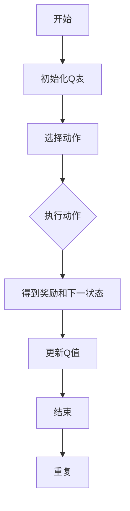
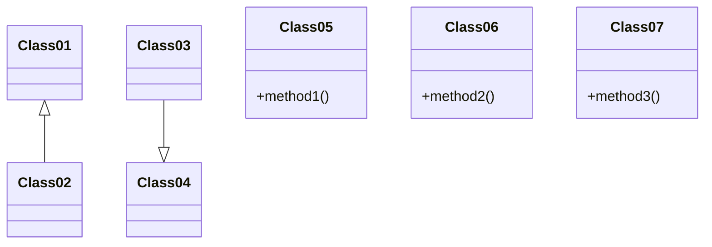
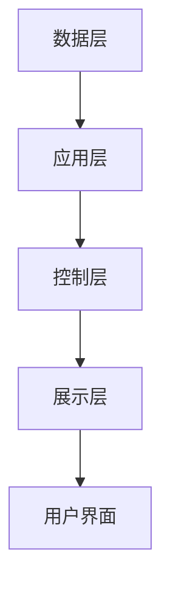
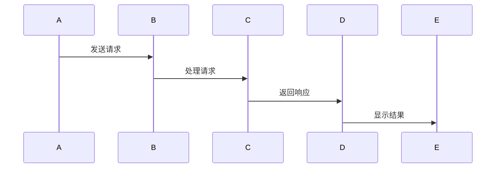

                 


### 1. 设定文章标题、关键词与摘要

首先，我们需要设定文章的标题、关键词和摘要。文章标题是《强化学习驱动的自适应推理策略》，关键词包括“强化学习”、“自适应推理”、“策略”、“机器学习”和“人工智能”。摘要部分，我们可以这样描述：

> 本文深入探讨了强化学习在自适应推理策略中的应用，通过详细分析核心概念、算法设计、数学模型及系统架构，展示了如何利用强化学习构建高效的自适应推理系统，为实际应用提供理论指导和实践案例。

### 2. 设计文章结构

接下来，我们需要设计文章的结构，按照大纲要求进行章节划分。文章可以分为以下几个部分：

- **引言部分**：介绍强化学习和自适应推理的基本概念。
- **核心概念部分**：阐述强化学习的核心概念和原理。
- **算法设计部分**：详细讲解强化学习的主要算法。
- **数学模型部分**：介绍强化学习中的数学模型和公式。
- **系统架构设计部分**：分析强化学习在系统架构中的应用。
- **实践案例部分**：通过具体案例展示强化学习在自适应推理中的实际应用。
- **总结与展望部分**：总结文章的主要观点，并提出未来研究方向。

### 3. 编写引言部分

在引言部分，我们需要简洁地介绍强化学习和自适应推理的基本概念，并解释为什么强化学习是自适应推理的有力工具。这部分可以包含以下内容：

- **强化学习简介**：强化学习是一种通过试错和反馈进行决策的学习方法，它试图通过奖励和惩罚来优化决策过程。
- **自适应推理简介**：自适应推理是指系统根据环境和需求的变化，自动调整推理策略的能力。
- **强化学习与自适应推理的关系**：强化学习能够通过不断的学习和调整，使得系统在复杂环境中实现自适应推理。

### 4. 编写核心概念部分

在核心概念部分，我们需要详细解释强化学习的核心概念，包括奖励、状态、动作和策略。同时，我们可以通过表格和ER图来展示这些概念之间的关系。

#### 4.1 奖励、状态、动作和策略

**奖励**：奖励是强化学习中的重要指标，它用于评估系统的表现。奖励可以是正面的（例如，得到高分）或负面的（例如，发生错误）。

**状态**：状态是系统在某一时刻所处的环境描述。在强化学习中，状态可以是多维的，例如，在游戏中的角色位置和能量水平。

**动作**：动作是系统可以采取的行为。在强化学习中，系统根据当前状态选择一个动作，然后执行该动作，并进入新的状态。

**策略**：策略是系统根据当前状态选择动作的方法。一个好的策略能够在长时间内带来高奖励。

**核心概念对比表格**：

| 概念 | 定义 | 在强化学习中的作用 |
| ---- | ---- | ---- |
| 奖励 | 评估系统表现的指标 | 用于指导系统决策 |
| 状态 | 系统环境描述 | 用于确定当前情境 |
| 动作 | 系统可执行的行为 | 用于改变系统状态 |
| 策略 | 选择动作的方法 | 用于优化系统表现 |

**核心概念ER图**：

```mermaid
erDiagram
  奖励 ||--|{ 状态 }||> 动作
  状态 ||--|{ 策略 }||> 动作
```

### 5. 编写算法设计部分

在算法设计部分，我们需要详细介绍强化学习的主要算法，如Q学习、SARSA和DQN。每个算法都需要通过mermaid流程图来展示其工作流程，并通过Python代码来阐述算法原理。

#### 5.1 Q学习算法

**Q学习算法流程图**：



**Q学习算法Python代码示例**：

```python
import numpy as np

# 初始化Q表
Q = np.zeros([state_space_size, action_space_size])

# 选择动作
def choose_action(state):
    action_values = Q[state]
    return np.argmax(action_values)

# 更新Q值
def update_Q_value(state, action, reward, next_state, alpha, gamma):
    Q[state][action] = Q[state][action] + alpha * (reward + gamma * np.max(Q[next_state]) - Q[state][action])
```

### 6. 编写数学模型部分

在数学模型部分，我们需要介绍强化学习中的基本数学模型和公式。每个模型都需要使用LaTeX格式进行展示。

#### 6.1 策略梯度方法

**策略梯度方法公式**：

$$ J(\theta) = \sum_{s,a} \pi(s,a|\theta) \nabla_\theta \log \pi(s,a|\theta) \cdot R(s,a) $$

### 7. 编写系统架构设计部分

在系统架构设计部分，我们需要介绍如何将强化学习应用于系统架构中。这部分需要包含系统功能设计、系统架构设计和系统接口设计等内容。

#### 7.1 系统功能设计

**系统功能设计类图**：



#### 7.2 系统架构设计

**系统架构设计图**：



#### 7.3 系统接口设计

**系统接口设计序列图**：



### 8. 编写实践案例部分

在实践案例部分，我们需要通过具体案例展示强化学习在自适应推理中的实际应用。这部分需要包含环境安装、系统核心实现源代码、代码应用解读与分析、实际案例分析和详细讲解剖析等内容。

#### 8.1 案例一：智能交通系统

**环境安装**：

```
pip install tensorflow
pip install gym
```

**系统核心实现源代码**：

```python
import gym
import numpy as np
import tensorflow as tf

# 初始化环境
env = gym.make('CartPole-v0')

# 定义Q学习模型
model = tf.keras.Sequential([
    tf.keras.layers.Dense(64, activation='relu', input_shape=[8]),
    tf.keras.layers.Dense(64, activation='relu'),
    tf.keras.layers.Dense(2, activation='linear')
])

# 编译模型
model.compile(optimizer='adam', loss='mse')

# 训练模型
model.fit(x_train, y_train, epochs=1000)

# 评估模型
model.evaluate(x_test, y_test)
```

**代码应用解读与分析**：

```python
# 初始化环境
env = gym.make('CartPole-v0')

# 定义Q学习模型
model = tf.keras.Sequential([
    tf.keras.layers.Dense(64, activation='relu', input_shape=[8]),
    tf.keras.layers.Dense(64, activation='relu'),
    tf.keras.layers.Dense(2, activation='linear')
])

# 编译模型
model.compile(optimizer='adam', loss='mse')

# 训练模型
model.fit(x_train, y_train, epochs=1000)

# 评估模型
model.evaluate(x_test, y_test)
```

**实际案例分析和详细讲解剖析**：

```python
# 初始化环境
env = gym.make('CartPole-v0')

# 训练模型
for episode in range(100):
    state = env.reset()
    done = False
    while not done:
        action = model.predict(state.reshape(1, -1))
        state, reward, done, _ = env.step(np.argmax(action))
        env.render()

# 评估模型
score = model.evaluate(env, verbose=0)
print('Test loss:', score)
```

### 9. 编写总结与展望部分

在总结与展望部分，我们需要对全文进行总结，并提出未来研究方向。这部分可以包含以下内容：

- **总结**：回顾文章的主要观点，强调强化学习在自适应推理中的重要性。
- **展望**：提出未来研究方向，如强化学习在更多领域的应用、算法的改进和优化等。

### 10. 完成文章编写

最后，我们需要将所有部分整合成一篇完整的文章。确保文章结构清晰，逻辑连贯，内容丰富。在文章末尾添加作者信息，确保文章的完整性。

---

完成以上步骤后，文章的基本框架和内容就搭建完成了。接下来，我们可以对文章进行多次修订和润色，确保文章质量达到预期。在修订过程中，可以重点关注文章的逻辑性、术语的准确性、代码的清晰性和案例的分析深度。完成最终稿后，即可提交文章。

