                 

### 微观世界中的宏观意义：培养对细节的洞察力

#### 关键词：微观世界、宏观意义、细节洞察力、算法、数学模型、系统架构、项目实战

#### 摘要：
本文旨在探讨微观世界中的宏观意义，强调培养对细节的洞察力的重要性。通过分析微观世界的构成、探索工具、现象与规律，以及它们对宏观世界的影响，本文揭示了细节在科学研究和实际应用中的关键作用。本文将结合具体的算法、数学模型、系统架构和项目实战，详细阐述如何在实际操作中培养对细节的洞察力，为读者提供理论与实践相结合的指导。

## 第一部分：探索微观世界的奥秘

### 第1章：微观世界的初步认识

#### 1.1.1 问题背景与定义
**核心概念术语说明：** 微观世界，宏观意义，细节洞察力。

**问题背景：** 在人类科学技术不断进步的背景下，对微观世界的认识成为了解释自然界现象、推动科技进步的重要基础。微观世界的宏观意义在于其对宏观世界的深刻影响，而细节洞察力则是理解和利用这种影响的关键。

**问题描述：** 微观世界的本质是什么？宏观意义如何体现在我们的日常生活中？如何培养对细节的洞察力？

**问题解决：** 通过对微观世界的深入研究，理解其基本构成和基本力，从而揭示其对宏观世界的规律和影响。

**边界与外延：** 微观世界包括原子、分子、电子、夸克等基本粒子，而宏观意义则体现在物质、能量和信息等层面。

**概念结构与核心要素组成：**
- 微观世界的核心要素：原子、分子、基本力
- 宏观世界的核心要素：物质、能量、信息
- 细节洞察力的核心要素：观察力、分析思维

### 第2章：微观世界的探索工具

#### 2.1.1 望远镜与显微镜
**核心概念原理：** 望远镜用于观察宏观天体，显微镜用于观察微观结构。

**概念属性特征对比表格：**
| 特征 | 望远镜 | 显微镜 |
| ---- | ------ | ------ |
| 应用场景 | 宇宙天体 | 微观粒子 |
| 观察范围 | 宇宙尺度 | 微米尺度 |

**ER实体关系图架构：**
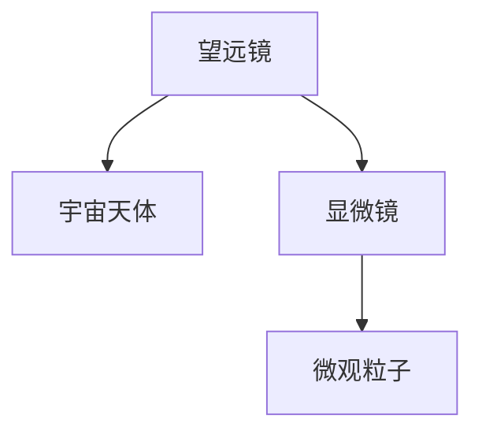

#### 2.1.2 粒子加速器与探测设备
**核心概念原理：** 粒子加速器用于加速带电粒子，探测设备用于检测粒子碰撞结果。

**概念属性特征对比表格：**
| 特征 | 粒子加速器 | 探测设备 |
| ---- | ------------ | ---------- |
| 功能 | 加速粒子 | 检测粒子 |
| 应用场景 | 物理实验 | 科学研究 |

**ER实体关系图架构：**
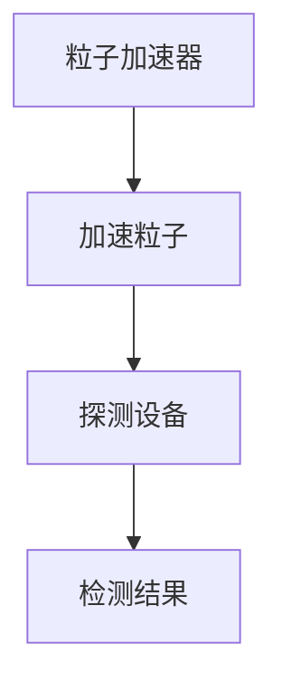

#### 2.1.3 量子计算与量子模拟
**核心概念原理：** 量子计算利用量子比特进行计算，量子模拟用于模拟量子系统的行为。

**概念属性特征对比表格：**
| 特征 | 量子计算 | 量子模拟 |
| ---- | -------- | -------- |
| 基础 | 量子比特 | 量子系统 |
| 目标 | 高效计算 | 模拟实验 |

**ER实体关系图架构：**
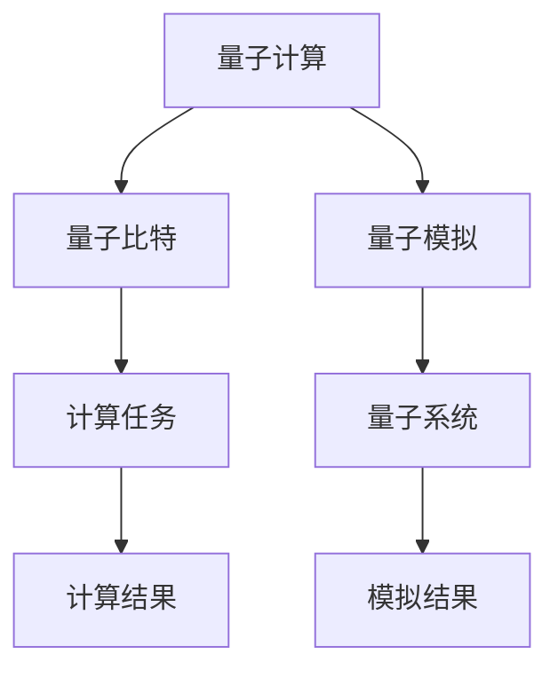

## 第二部分：微观世界的现象与规律

### 第3章：微观世界的现象与规律

#### 3.1.1 波粒二象性
**核心概念原理：** 波粒二象性是指微观粒子既具有波动性又具有粒子性。

**核心算法原理：** 双缝实验展示了波粒二象性。

**算法流程图：**
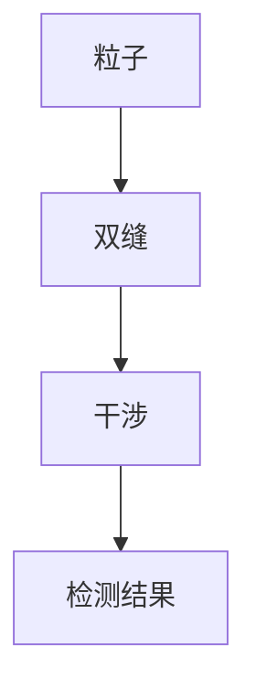

**数学模型与公式：**
$$
\text{干涉条纹} = \frac{\sin^2(\theta)}{\lambda}
$$

**举例说明：** 光子通过双缝时产生的干涉条纹证明了波粒二象性。

#### 3.1.2 量子纠缠与量子信息
**核心概念原理：** 量子纠缠是指两个或多个量子系统之间的非局域关联。

**核心算法原理：** 量子纠缠用于量子通信和量子计算。

**算法流程图：**
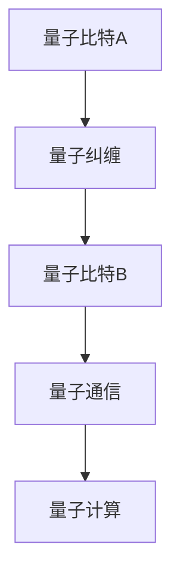

**数学模型与公式：**
$$
|\psi\rangle = \frac{1}{\sqrt{2}}(|0\rangle_A \otimes |1\rangle_B + |1\rangle_A \otimes |0\rangle_B)
$$

**举例说明：** 量子纠缠使得两个量子比特之间的信息瞬间传输，实现了量子通信。

#### 3.1.3 暗物质与暗能量
**核心概念原理：** 暗物质是不发光、不与电磁波相互作用，但通过引力作用影响宇宙结构的物质；暗能量是导致宇宙加速膨胀的神秘力量。

**核心算法原理：** 暗物质与暗能量的探测和测量。

**算法流程图：**
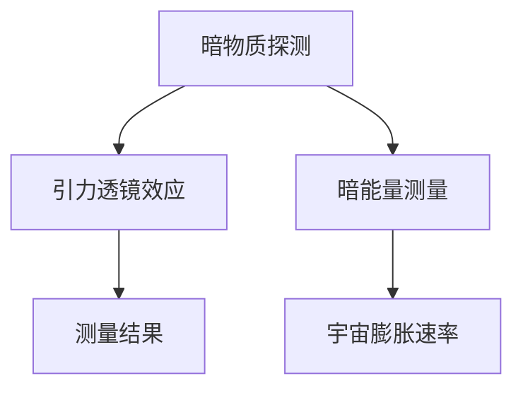

**数学模型与公式：**
$$
\Omega_{\text{暗物质}} = \frac{M_{\text{暗物质}}}{M_{\text{总}}}
$$

$$
w = \frac{P}{\rho c}
$$

**举例说明：** 通过观测引力透镜效应和宇宙膨胀速率，科学家揭示了暗物质和暗能量的存在。

## 第三部分：微观世界的宏观意义

### 第4章：微观世界的宏观意义

#### 4.1.1 微观世界的科学理论
**核心概念原理：** 量子力学和相对论是描述微观世界的两大科学理论。

**概念属性特征对比表格：**
| 特征 | 量子力学 | 相对论 |
| ---- | -------- | ------- |
| 描述对象 | 微观粒子 | 宇宙宏观 |
| 数学模型 | 波函数 | 四维时空 |

**ER实体关系图架构：**
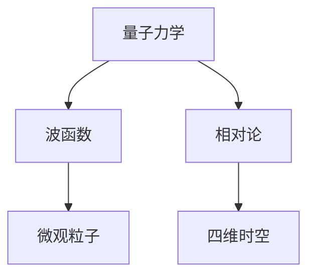

**核心算法原理：** 量子力学和相对论为理解微观世界和宏观世界提供了理论基础。

**算法流程图：**
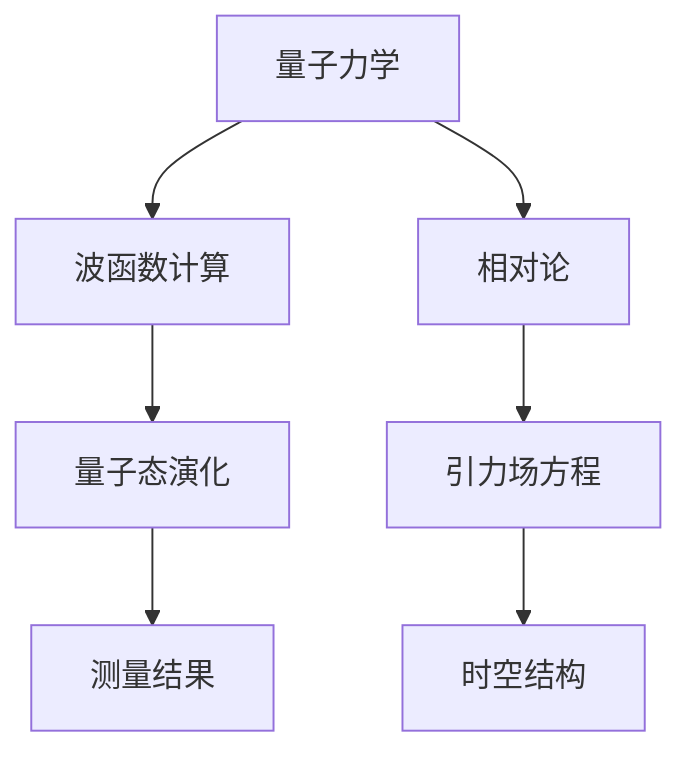

**数学模型与公式：**
$$
\psi(x,t) = \int \psi(k) e^{ikx - i\omega t} dk
$$

$$
G_{\mu\nu} = \frac{8\pi G}{c^4} T_{\mu\nu}
$$

**举例说明：** 通过量子力学和相对论的数学模型，我们可以解释微观粒子的行为和宇宙的宏观结构。

#### 4.1.2 微观世界与宏观世界的联系
**核心概念原理：** 微观世界的规律和现象在宏观世界中有着重要的体现和影响。

**核心算法原理：** 微观世界的规律可以用来解释宏观世界的现象，如物质的性质、能量的转换等。

**算法流程图：**
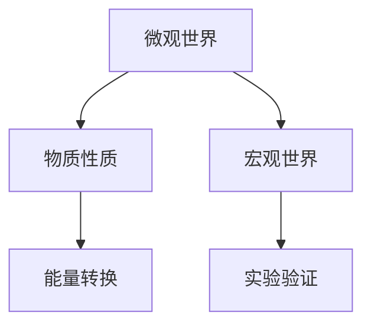

**数学模型与公式：**
$$
E = mc^2
$$

**举例说明：** 质能方程揭示了微观质量和宏观能量之间的关系。

#### 4.1.3 微观世界对人类社会的启示
**核心概念原理：** 微观世界的探索为人类社会的科技进步提供了新的方向和灵感。

**核心算法原理：** 通过微观世界的深入研究，我们可以发现新的材料、开发新的技术，推动社会进步。

**算法流程图：**
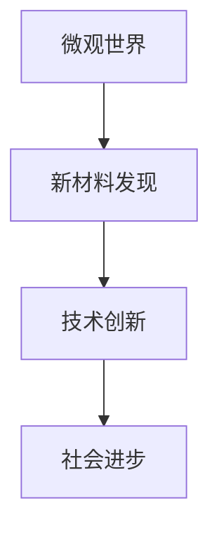

**数学模型与公式：** 无具体公式，但可以通过实验和数据分析来支持。

**举例说明：** 量子计算和纳米技术的研究推动了计算机和材料科学的发展。

### 第5章：培养对细节的洞察力

#### 5.1.1 细节的重要性
**核心概念原理：** 细节在决策和创造中的作用不可忽视。

**核心算法原理：** 细节分析有助于提高决策的准确性和创新的能力。

**算法流程图：**
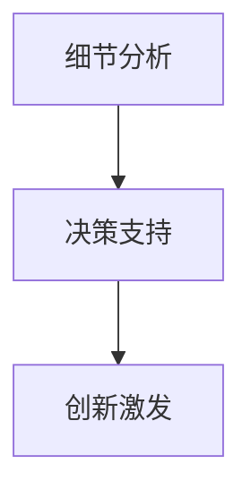

**数学模型与公式：** 无具体公式，但可以通过案例分析来解释。

**举例说明：** 在项目管理中，对任务细节的分析可以提高项目的成功率。

#### 5.1.2 培养细节意识的策略
**核心概念原理：** 培养观察力和分析思维是提升细节意识的关键。

**核心算法原理：** 通过系统化和结构化的方法来培养细节意识。

**算法流程图：**
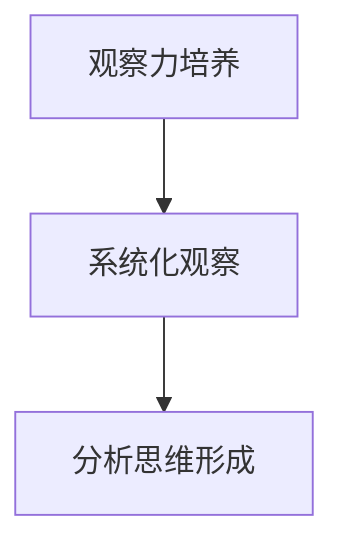

**数学模型与公式：** 无具体公式，但可以通过实践案例来展示。

**举例说明：** 通过每日反思和案例分析，可以逐步提升对细节的敏感度和分析能力。

#### 5.1.3 细节在实践中的应用
**核心概念原理：** 细节在科技和商业领域的应用具有重要的价值。

**核心算法原理：** 通过对细节的关注和优化，可以提高系统的性能和效率。

**算法流程图：**
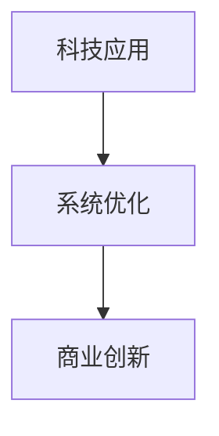

**数学模型与公式：** 无具体公式，但可以通过具体案例来解释。

**举例说明：** 在软件开发中，对代码细节的关注可以提高软件的稳定性和性能。

## 第四部分：微观世界的未来发展

### 第6章：微观世界的未来发展

#### 6.1.1 量子计算的未来
**核心概念原理：** 量子计算有望在未来改变计算领域。

**核心算法原理：** 量子计算利用量子比特实现超并行计算。

**算法流程图：**
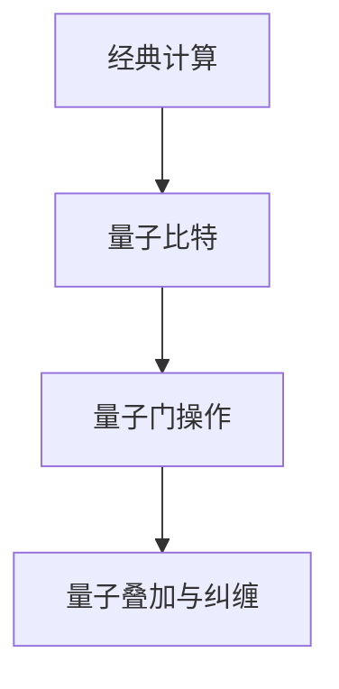

**数学模型与公式：**
$$
|\psi\rangle = \sum_{i} c_i |i\rangle
$$

**举例说明：** 通过量子叠加和纠缠，量子计算机可以实现指数级的速度提升。

#### 6.1.2 量子通信与量子互联网
**核心概念原理：** 量子通信利用量子纠缠实现信息的安全传输。

**核心算法原理：** 量子密钥分发和量子隐形传态。

**算法流程图：**
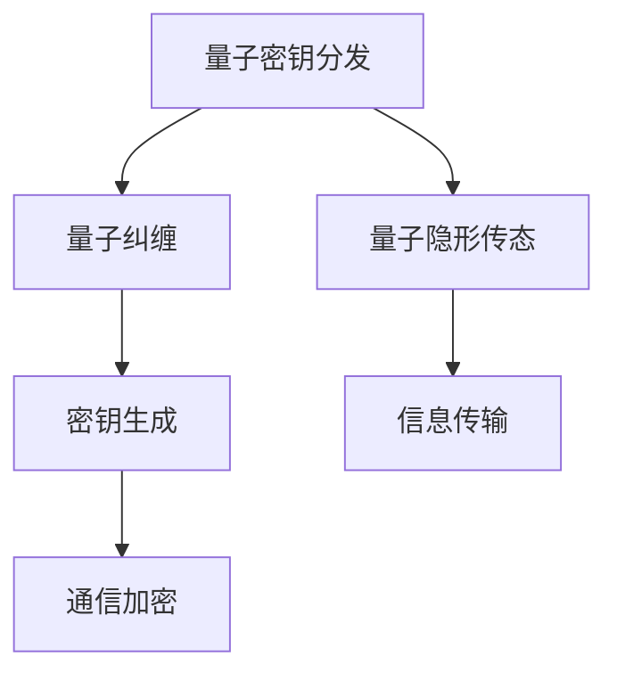

**数学模型与公式：**
$$
\text{密钥} = \frac{1}{\sqrt{2}}(|0\rangle_A \otimes |0\rangle_B + |1\rangle_A \otimes |1\rangle_B)
$$

**举例说明：** 通过量子纠缠，量子通信实现了不可窃听和信息传输的安全。

#### 6.1.3 暗物质与暗能量的研究
**核心概念原理：** 暗物质和暗能量是宇宙学研究的前沿领域。

**核心算法原理：** 通过观测和测量，揭示暗物质和暗能量的本质。

**算法流程图：**

**数学模型与公式：**
$$
\Omega_{\text{暗物质}} = \frac{M_{\text{暗物质}}}{M_{\text{总}}}
$$

$$
w = \frac{P}{\rho c}
$$

**举例说明：** 通过观测宇宙膨胀速率，科学家揭示了暗物质和暗能量的存在。

## 第五部分：微观世界的宏观意义总结

### 第7章：微观世界的宏观意义总结

#### 7.1.1 微观世界与宏观意义的总结
**核心概念原理：** 微观世界的规律和现象对宏观世界有着深远的影响。

**核心算法原理：** 通过微观世界的深入研究，我们可以更好地理解宏观世界的运行规律。

**算法流程图：**
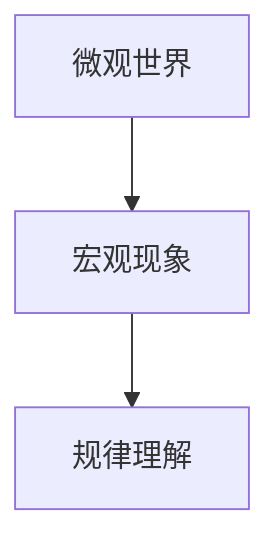

**数学模型与公式：** 无具体公式，但可以通过理论分析和实验数据来支持。

**举例说明：** 量子力学的发现改变了我们对微观世界的认识，也帮助我们解释了宏观世界的现象。

#### 7.1.2 细节洞察力的重要性
**核心概念原理：** 细节洞察力在科学研究和实际应用中至关重要。

**核心算法原理：** 通过对细节的关注和深入分析，我们可以发现新的规律，解决实际问题。

**算法流程图：**
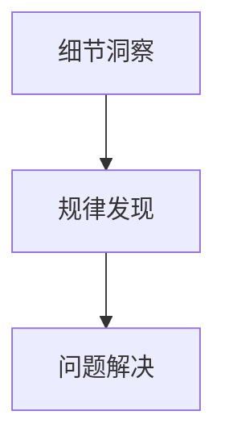

**数学模型与公式：** 无具体公式，但可以通过具体案例来解释。

**举例说明：** 在医学研究中，对基因细节的分析帮助科学家发现疾病的原因，从而推动了新药的研发。

## 结尾

### 总结与展望
本文从微观世界的初步认识、探索工具、现象与规律、宏观意义以及培养细节洞察力等方面，全面阐述了微观世界的奥秘及其对宏观世界的重要影响。通过具体的算法、数学模型和实际案例，我们看到了细节洞察力在科学研究和技术创新中的关键作用。

**注意事项：**
1. 微观世界的探索需要综合运用多种科学方法和工具。
2. 培养细节洞察力需要持之以恒的观察和深入分析。
3. 在实际应用中，关注细节有助于提高系统的性能和效率。

**拓展阅读：**
- 《量子计算：量子比特与量子算法》
- 《宇宙的起源与演化：暗物质与暗能量的研究》
- 《细节的力量：微观世界中的宏观启示》

作者：AI天才研究院/AI Genius Institute & 禅与计算机程序设计艺术 /Zen And The Art of Computer Programming

通过本文的探讨，我们希望读者能够对微观世界的宏观意义有更深刻的认识，并在实际工作中培养对细节的洞察力，为科学研究和科技创新贡献自己的力量。让我们继续探索微观世界的奥秘，揭示其背后的宏观规律，为人类的未来带来更多的可能。

