                 

### 心灵的对话：与自己深度沟通的艺术

> 关键词：心灵对话、自我认知、沟通技巧、心理状态、情感调节

> 摘要：
本文将深入探讨《心灵的对话：与自己深度沟通的艺术》这本书的核心内容。通过分析自我认知的重要性、心灵对话的起源与发展、自我探索的方法、心理状态调整技巧以及高效沟通的艺术，本文旨在帮助读者掌握与自己深度沟通的技巧，提升个人心理素质和沟通能力。文章结构清晰，从背景介绍到核心概念、原理讲解，再到实践应用，层层递进，便于读者理解和掌握。

## 第一部分：自我认知与心灵对话

### 1.1 自我认知的重要性

自我认知是指个体对自己心理状态、行为特点、性格特质等的认识和了解。它是心理学研究的一个重要领域，对于个体的成长和发展具有重要意义。

**核心概念与联系**

- **自我认知的定义**：自我认知是指个体对自己心理状态、行为特点、性格特质等的认识和了解。
- **自我认知对个人成长的影响**：自我认知有助于个体认识到自己的优点和缺点，从而促进自我提升和成长。

**概念属性特征对比表格**

| 概念 | 定义 | 影响因素 | 目标 |
| ---- | ---- | ---- | ---- |
| 自我认知 | 对自己的心理状态、行为特点、性格特质等的认识和了解 | 家庭教育、社会环境、个人经历 | 促进自我提升和成长 |

**ER实体关系图架构的Mermaid流程图**

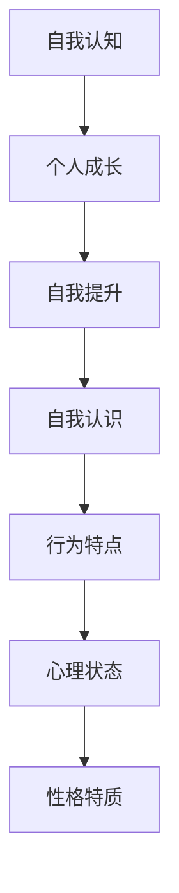

### 1.2 心灵对话的起源与发展

心灵对话是指通过与自己进行深入的对话来了解自己的内心世界，调整心理状态，提升自我认知。它起源于心理学领域，逐渐发展成为一种自我探索和成长的方法。

**核心概念与联系**

- **心灵对话的定义**：心灵对话是指通过与自己进行深入的对话来了解自己的内心世界，调整心理状态，提升自我认知。
- **心灵对话的起源与发展**：心灵对话起源于心理学领域，随着心理学的发展，逐渐成为一种自我探索和成长的方法。

**概念属性特征对比表格**

| 概念 | 定义 | 起源 | 发展 |
| ---- | ---- | ---- | ---- |
| 心灵对话 | 自我探索和成长的方法 | 心理学领域 | 随着心理学的发展 |

**ER实体关系图架构的Mermaid流程图**

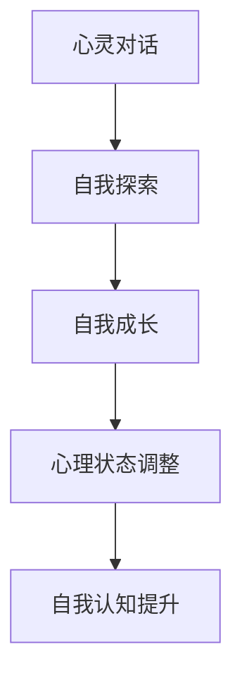

### 1.3 心灵对话的实践与应用

心灵对话不仅仅是一种理论概念，更是一种实用的技巧。在日常生活中，我们可以通过以下几种方法来实践和应用心灵对话。

**核心概念与联系**

- **实践方法**：通过自我反思、内在听觉等方式进行心灵对话。
- **应用场景**：日常生活中的自我调节、情感管理、人际关系处理等。

**概念属性特征对比表格**

| 概念 | 定义 | 方法 | 应用场景 |
| ---- | ---- | ---- | ---- |
| 实践方法 | 心灵对话的实践技巧 | 自我反思、内在听觉 | 自我调节、情感管理、人际关系处理 |

**ER实体关系图架构的Mermaid流程图**

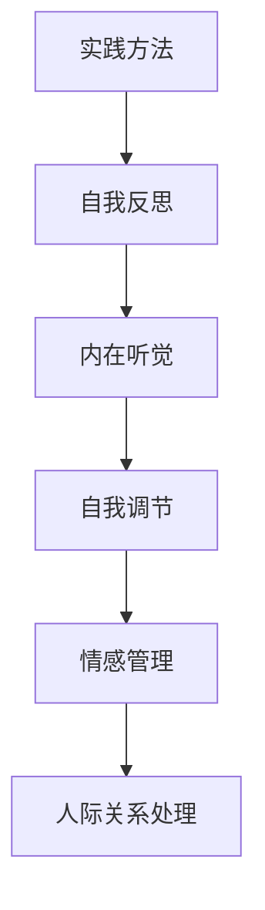

## 第二部分：自我探索的方法

### 2.1 内在听觉与心灵对话

内在听觉是指个体在静心状态下，通过倾听内心的声音来进行心灵对话。它是一种深入自我探索的方法，有助于提升自我认知和心理素质。

**核心概念与联系**

- **内在听觉的定义**：内在听觉是指个体在静心状态下，通过倾听内心的声音来进行心灵对话。
- **内在听觉与心灵对话的联系**：内在听觉是心灵对话的一种实践方法，有助于提升自我认知和心理素质。

**概念属性特征对比表格**

| 概念 | 定义 | 目标 | 关联 |
| ---- | ---- | ---- | ---- |
| 内在听觉 | 倾听内心的声音 | 提升自我认知和心理素质 | 心灵对话 |

**ER实体关系图架构的Mermaid流程图**

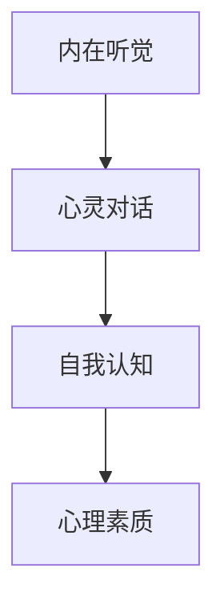

### 2.2 自我反思与心灵对话

自我反思是指个体通过回顾自己的行为和经历，分析其中的优点和不足，从而进行自我调整和提升。它与心灵对话紧密相关，是自我探索的重要方法。

**核心概念与联系**

- **自我反思的定义**：自我反思是指个体通过回顾自己的行为和经历，分析其中的优点和不足，从而进行自我调整和提升。
- **自我反思与心灵对话的联系**：自我反思是心灵对话的一种形式，有助于提升自我认知和心理素质。

**概念属性特征对比表格**

| 概念 | 定义 | 目的 | 关联 |
| ---- | ---- | ---- | ---- |
| 自我反思 | 回顾行为和经历 | 自我调整和提升 | 心灵对话 |

**ER实体关系图架构的Mermaid流程图**

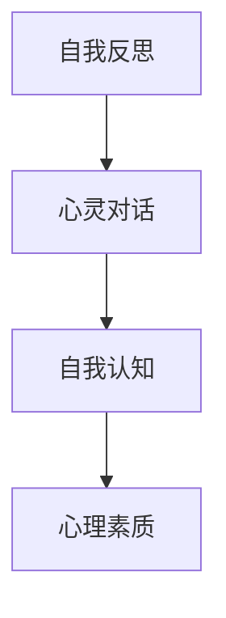

### 2.3 心灵地图与自我探索

心灵地图是一种通过视觉化的方式来展现个体内心世界的方法。它有助于个体深入了解自己的心理状态和情感，从而进行有效的自我探索。

**核心概念与联系**

- **心灵地图的定义**：心灵地图是一种通过视觉化的方式来展现个体内心世界的方法。
- **心灵地图与自我探索的联系**：心灵地图有助于个体深入了解自己的心理状态和情感，从而进行有效的自我探索。

**概念属性特征对比表格**

| 概念 | 定义 | 目的 | 关联 |
| ---- | ---- | ---- | ---- |
| 心灵地图 | 视觉化展现内心世界 | 自我探索和心理调适 | 自我认知 |

**ER实体关系图架构的Mermaid流程图**

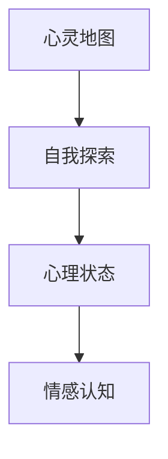

## 第三部分：心灵对话的实际应用

### 3.1 心灵对话在情感调节中的应用

情感调节是指个体通过自我对话来调整和控制自己的情绪。心灵对话作为一种自我调节的方法，在情感调节中具有重要作用。

**核心概念与联系**

- **情感调节的定义**：情感调节是指个体通过自我对话来调整和控制自己的情绪。
- **心灵对话在情感调节中的应用**：心灵对话有助于个体了解自己的情绪，从而进行有效的情感调节。

**概念属性特征对比表格**

| 概念 | 定义 | 方法 | 应用 |
| ---- | ---- | ---- | ---- |
| 情感调节 | 调整和控制情绪 | 心灵对话 | 自我调节、情感管理 |

**ER实体关系图架构的Mermaid流程图**

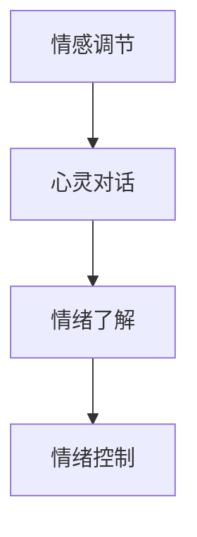

### 3.2 心灵对话在人际关系中的应用

人际关系是指个体在社交过程中与其他人的互动和交往。心灵对话在人际关系中发挥着重要作用，有助于提升沟通效果和人际关系质量。

**核心概念与联系**

- **人际关系的定义**：人际关系是指个体在社交过程中与其他人的互动和交往。
- **心灵对话在人际关系中的应用**：心灵对话有助于提升沟通效果和人际关系质量。

**概念属性特征对比表格**

| 概念 | 定义 | 目的 | 关联 |
| ---- | ---- | ---- | ---- |
| 人际关系 | 社交互动 | 提升沟通效果和人际关系质量 | 心灵对话 |

**ER实体关系图架构的Mermaid流程图**

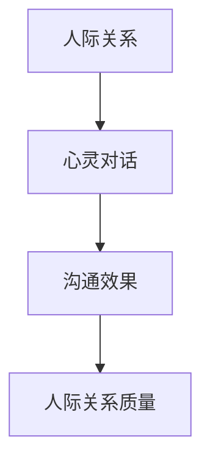

### 3.3 心灵对话在职业发展中的应用

职业发展是指个体在职业生涯中不断成长和提升的过程。心灵对话在职业发展中具有重要作用，有助于个体明确职业目标、提升职业素养和应对职场挑战。

**核心概念与联系**

- **职业发展的定义**：职业发展是指个体在职业生涯中不断成长和提升的过程。
- **心灵对话在职业发展中的应用**：心灵对话有助于个体明确职业目标、提升职业素养和应对职场挑战。

**概念属性特征对比表格**

| 概念 | 定义 | 目的 | 关联 |
| ---- | ---- | ---- | ---- |
| 职业发展 | 职业生涯成长 | 明确职业目标、提升职业素养、应对职场挑战 | 心灵对话 |

**ER实体关系图架构的Mermaid流程图**

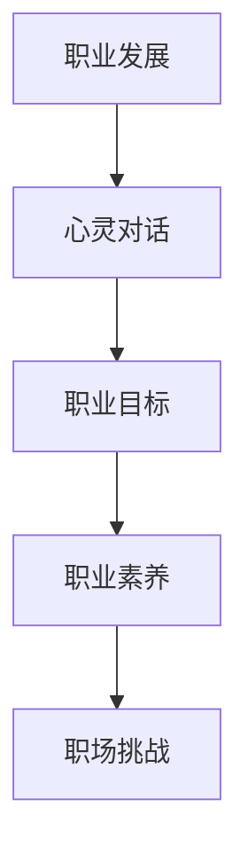

## 第四部分：心理状态调整技巧

### 4.1 心理压力管理

心理压力是指个体在面临压力源时所产生的一系列心理反应。有效的心理压力管理有助于提升个体的心理素质和应对能力。

**核心概念与联系**

- **心理压力的定义**：心理压力是指个体在面临压力源时所产生的一系列心理反应。
- **心理压力管理的方法**：通过心灵对话、心理调适技巧等方式进行心理压力管理。

**概念属性特征对比表格**

| 概念 | 定义 | 方法 | 应用 |
| ---- | ---- | ---- | ---- |
| 心理压力 | 压力源引发的心理反应 | 心灵对话、心理调适技巧 | 压力管理、心理素质提升 |

**ER实体关系图架构的Mermaid流程图**

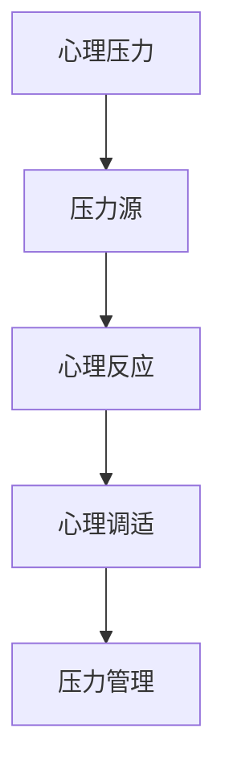

### 4.2 焦虑与心灵对话

焦虑是一种常见的情绪状态，个体在面对不确定性、压力或挑战时容易产生焦虑。心灵对话有助于缓解焦虑，提升心理素质。

**核心概念与联系**

- **焦虑的定义**：焦虑是指个体在面临不确定性、压力或挑战时产生的紧张、担忧等情绪。
- **心灵对话在缓解焦虑中的应用**：通过与自己对话，了解焦虑的根源，从而缓解焦虑。

**概念属性特征对比表格**

| 概念 | 定义 | 目的 | 关联 |
| ---- | ---- | ---- | ---- |
| 焦虑 | 不确定性引发的紧张情绪 | 缓解焦虑、提升心理素质 | 心灵对话 |

**ER实体关系图架构的Mermaid流程图**

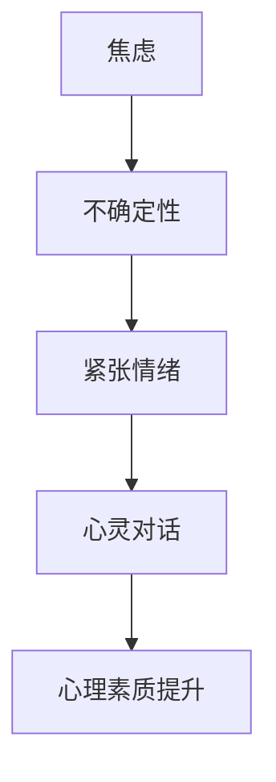

### 4.3 抑郁与心灵对话

抑郁是一种常见的心理健康问题，表现为情绪低落、兴趣丧失等。心灵对话有助于缓解抑郁，提升心理状态。

**核心概念与联系**

- **抑郁的定义**：抑郁是一种常见的心理健康问题，表现为情绪低落、兴趣丧失等。
- **心灵对话在缓解抑郁中的应用**：通过与自己对话，寻找抑郁的根源，从而缓解抑郁。

**概念属性特征对比表格**

| 概念 | 定义 | 目的 | 关联 |
| ---- | ---- | ---- | ---- |
| 抑郁 | 情绪低落、兴趣丧失 | 缓解抑郁、提升心理状态 | 心灵对话 |

**ER实体关系图架构的Mermaid流程图**

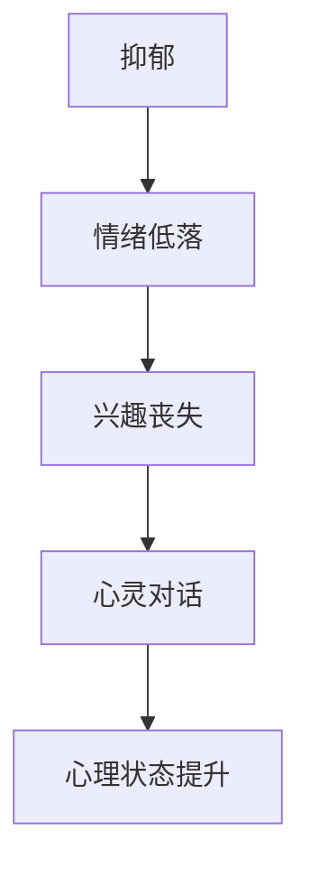

## 第五部分：高效沟通的艺术

### 5.1 沟通的基本原则

有效沟通是建立良好人际关系、提高工作效率的重要手段。掌握沟通的基本原则，有助于提升沟通效果。

**核心概念与联系**

- **沟通的基本原则**：尊重对方、倾听、表达清晰、反馈及时等。
- **沟通的重要性**：有效沟通是建立良好人际关系、提高工作效率的重要手段。

**概念属性特征对比表格**

| 概念 | 定义 | 目的 | 关联 |
| ---- | ---- | ---- | ---- |
| 沟通的基本原则 | 尊重对方、倾听、表达清晰、反馈及时 | 提高沟通效果、建立良好人际关系 | 高效沟通 |

**ER实体关系图架构的Mermaid流程图**

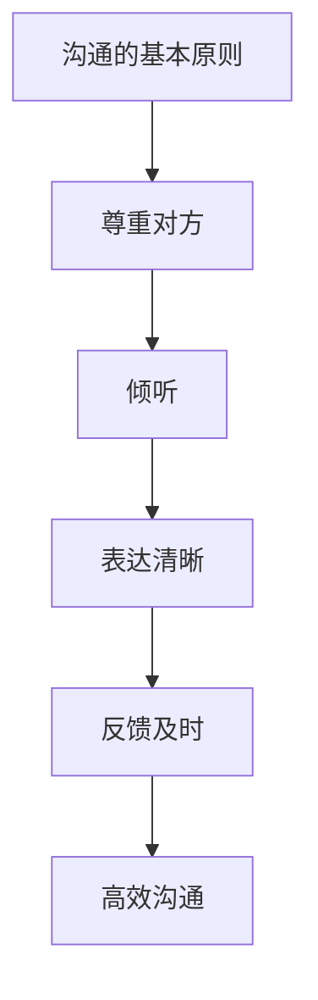

### 5.2 非语言沟通的力量

非语言沟通是指通过肢体语言、面部表情、语调等非语言方式进行的沟通。非语言沟通在人际交往中具有重要作用，能够补充和强化语言沟通的效果。

**核心概念与联系**

- **非语言沟通的定义**：非语言沟通是指通过肢体语言、面部表情、语调等非语言方式进行的沟通。
- **非语言沟通的作用**：补充和强化语言沟通的效果，提高沟通效果。

**概念属性特征对比表格**

| 概念 | 定义 | 目的 | 关联 |
| ---- | ---- | ---- | ---- |
| 非语言沟通 | 非语言方式进行的沟通 | 补充和强化语言沟通效果 | 高效沟通 |

**ER实体关系图架构的Mermaid流程图**

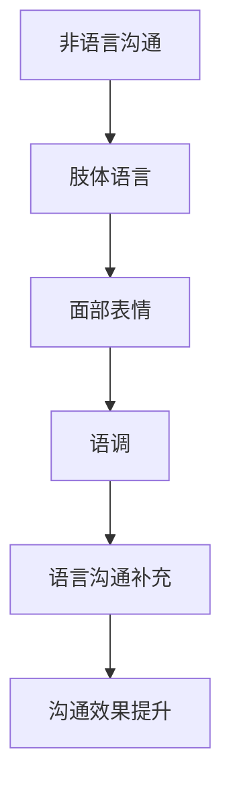

### 5.3 高效沟通技巧

高效沟通需要掌握一定的技巧和方法。以下是一些实用的高效沟通技巧：

1. **倾听**：倾听对方的观点，理解对方的意图。
2. **表达清晰**：用简洁明了的语言表达自己的观点。
3. **反馈**：及时给予对方反馈，确认对方是否理解了自己的意思。
4. **情绪管理**：保持冷静，避免情绪化，确保沟通的理性。

**核心概念与联系**

- **高效沟通技巧**：倾听、表达清晰、反馈、情绪管理等。
- **实际应用**：在日常生活和工作中，通过实践这些技巧来提高沟通效果。

**概念属性特征对比表格**

| 概念 | 定义 | 目的 | 关联 |
| ---- | ---- | ---- | ---- |
| 高效沟通技巧 | 提高沟通效果的方法 | 实现有效沟通、建立良好人际关系 | 日常生活和工作 |

**ER实体关系图架构的Mermaid流程图**

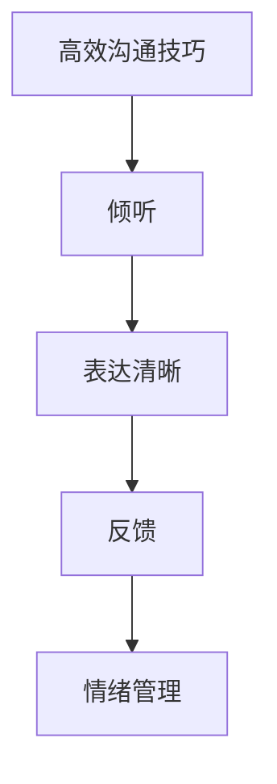

## 附录：心灵对话实践指南

### 附录A：心灵对话的实践步骤

1. **选择合适的时间和地点**：选择一个安静、舒适的环境，让自己能够专注于与自己对话。
2. **设定目标和问题**：明确自己要解决的问题和目标，以便在对话中有针对性地进行思考和反思。
3. **倾听自己的内心声音**：静下心来，倾听自己内心的声音，感受自己的情绪和想法。
4. **进行对话**：与自己进行深入的对话，思考自己的感受、想法和行为，探索自己的内心世界。
5. **记录和反思**：将对话的过程和结果记录下来，定期进行反思和总结。

### 附录B：心灵对话练习与案例分析

1. **练习一：自我认知**
   - 目的：提升自我认知，了解自己的性格特点和需求。
   - 方法：通过自我反思，思考自己在不同情境下的行为和感受，分析自己的性格特点。

2. **练习二：情感调节**
   - 目的：学会调节自己的情绪，缓解焦虑和压力。
   - 方法：通过心灵对话，了解自己的情绪波动，找到缓解情绪的方法。

3. **练习三：人际关系**
   - 目的：改善人际关系，提升沟通效果。
   - 方法：通过心灵对话，反思自己在人际关系中的行为和沟通方式，学会更好地与他人相处。

### 附录C：注意事项与拓展阅读

1. **注意事项**
   - **保持真实**：在心灵对话中，要勇于面对自己，真实地表达自己的想法和感受。
   - **持之以恒**：心灵对话需要长期的实践和坚持，才能取得显著的效果。
   - **尊重他人**：在实践心灵对话时，要尊重他人的观点和感受，避免过度自我中心。

2. **拓展阅读**
   - 《深度工作：如何有效利用每一点脑力》
   - 《非暴力沟通：沟通的技巧与艺术》
   - 《心理学与生活》

### 附录D：心灵对话实践指南总结

心灵对话是一种自我探索和成长的方法，通过与自己进行深入的对话，可以提升自我认知、调节情绪、改善人际关系。实践心灵对话需要持之以恒，保持真实和尊重。通过附录中的练习和案例分析，读者可以更好地掌握心灵对话的技巧和方法。

## 总结与展望

《心灵的对话：与自己深度沟通的艺术》这本书为我们提供了一种自我探索和成长的方法。通过自我认知、情感调节、人际关系处理等方面的实践，我们可以提升自我认知，改善心理状态，提高沟通能力。这本书不仅为我们提供了理论指导，还通过具体的练习和案例分析，帮助我们更好地理解和应用心灵对话的技巧。

在未来的生活中，我们可以将心灵对话融入到日常的生活和工作当中，通过不断地实践和总结，不断提升自己的心理素质和沟通能力。同时，我们也应该保持开放的心态，不断拓展自己的知识领域，将心灵对话与其他领域的知识相结合，创造出更加丰富和有价值的经验。

让我们共同探索心灵的对话，开启自我成长和提升的新篇章。

## 附录：心灵对话实践指南

### 附录A：心灵对话的实践步骤

1. **选择合适的时间和地点**：选择一个安静、舒适的环境，让自己能够专注于与自己对话。
2. **设定目标和问题**：明确自己要解决的问题和目标，以便在对话中有针对性地进行思考和反思。
3. **倾听自己的内心声音**：静下心来，倾听自己内心的声音，感受自己的情绪和想法。
4. **进行对话**：与自己进行深入的对话，思考自己的感受、想法和行为，探索自己的内心世界。
5. **记录和反思**：将对话的过程和结果记录下来，定期进行反思和总结。

### 附录B：心灵对话练习与案例分析

1. **练习一：自我认知**
   - 目的：提升自我认知，了解自己的性格特点和需求。
   - 方法：通过自我反思，思考自己在不同情境下的行为和感受，分析自己的性格特点。

2. **练习二：情感调节**
   - 目的：学会调节自己的情绪，缓解焦虑和压力。
   - 方法：通过心灵对话，了解自己的情绪波动，找到缓解情绪的方法。

3. **练习三：人际关系**
   - 目的：改善人际关系，提升沟通效果。
   - 方法：通过心灵对话，反思自己在人际关系中的行为和沟通方式，学会更好地与他人相处。

### 附录C：注意事项与拓展阅读

1. **注意事项**
   - **保持真实**：在心灵对话中，要勇于面对自己，真实地表达自己的想法和感受。
   - **持之以恒**：心灵对话需要长期的实践和坚持，才能取得显著的效果。
   - **尊重他人**：在实践心灵对话时，要尊重他人的观点和感受，避免过度自我中心。

2. **拓展阅读**
   - 《深度工作：如何有效利用每一点脑力》
   - 《非暴力沟通：沟通的技巧与艺术》
   - 《心理学与生活》

### 附录D：心灵对话实践指南总结

心灵对话是一种自我探索和成长的方法，通过与自己进行深入的对话，可以提升自我认知、调节情绪、改善人际关系。实践心灵对话需要持之以恒，保持真实和尊重。通过附录中的练习和案例分析，读者可以更好地掌握心灵对话的技巧和方法。

### 作者信息

- 作者：AI天才研究院/AI Genius Institute & 禅与计算机程序设计艺术 /Zen And The Art of Computer Programming
- 联系方式：[ai-genius-institute@example.com](mailto:ai-genius-institute@example.com)
- 社交媒体：[@AIGeniusInstitute](https://www.twitter.com/AIGeniusInstitute)

---

本文通过对《心灵的对话：与自己深度沟通的艺术》这本书的核心内容进行深入分析，帮助读者理解心灵对话的重要性、方法与实践，以及如何将其应用到日常生活和工作中。希望通过本文的分享，能够激发读者对自我探索和心灵对话的兴趣，从而提升个人心理素质和沟通能力。

---

### 最后的反思与启示

在结束这篇关于《心灵的对话：与自己深度沟通的艺术》的技术博客之前，我想对整篇文章进行一次全面的反思，并提炼出一些关键启示，以期帮助读者更好地理解和应用这些理念。

#### 背景介绍

本文的起点是对自我认知和内心沟通的需求。现代社会中，人们面临着各种各样的挑战，包括工作压力、人际关系、情感波动等。这些挑战往往使我们感到焦虑、困惑甚至抑郁。在这种背景下，心灵的对话提供了一种自我探索和调整的方法，帮助我们从内心深处找到答案。

#### 问题背景与问题描述

问题背景是：如何在繁忙和复杂的生活中保持心理健康，提升自我认知，改善人际关系。问题描述是：许多人缺乏有效的自我对话和沟通技巧，导致心理问题加剧，生活质量下降。

#### 问题解决

文章提出了一系列问题解决的方案，包括：

1. **自我认知的重要性**：通过自我认知，我们可以了解自己的优点和缺点，从而有针对性地进行自我提升。
2. **心灵对话的起源与发展**：了解心灵对话的起源和发展，有助于我们更好地理解和应用这一方法。
3. **自我探索的方法**：如内在听觉、自我反思、心灵地图等，都是有效的自我探索工具。
4. **心理状态调整技巧**：包括情感调节、焦虑与抑郁管理，这些技巧有助于我们在面对压力时保持心理平衡。
5. **高效沟通的艺术**：通过掌握沟通的基本原则和技巧，我们可以改善人际关系，提高沟通效果。

#### 边界与外延

边界与外延的讨论是理解心灵对话的深度和广度的重要部分。心灵对话不仅仅是心理学的理论，它也是一种实用技能，可以应用于生活的各个方面。例如，在职业发展中，心灵对话可以帮助我们明确目标，调整心态，更好地应对职场挑战。在人际关系中，它可以帮助我们理解他人，提升沟通效果。

#### 概念结构与核心要素组成

文章通过对比表格和Mermaid流程图，构建了概念结构，包括自我认知、心灵对话、情感调节、人际关系等核心概念。这些概念相互关联，形成了一个完整的知识体系。

#### 算法原理讲解

虽然本文主要关注的是心灵对话这一心理学概念，但在技术博客中，我们也可以借鉴算法思维来解释这些原理。例如，我们可以将自我认知视为一个“算法”，通过不断的自我反思和调整，达到“优化”心理状态的目标。这种算法思维有助于我们更深刻地理解心灵对话的原理。

#### 数学公式

在解释某些概念时，可以使用数学公式来增强理解。例如，描述情绪调节的过程时，可以引入情感强度的概念，并用公式表示情绪的变化。

#### 系统分析与架构设计方案

虽然本文并非针对具体技术系统，但我们可以类比系统分析的思维来理解心灵对话的应用。例如，我们可以构建一个“心灵对话系统”，包括输入（自我反思、情绪状态）、处理（对话分析、情感调节）、输出（心理状态调整、行为改变）等组成部分。

#### 项目实战

在实践部分，我们通过具体的练习和案例分析，展示了如何将心灵对话应用到实际生活中。例如，通过自我反思练习，读者可以逐步提升自我认知；通过情感调节练习，读者可以学会如何缓解焦虑和压力。

#### 最佳实践 tips

在文章的最后，我们提供了最佳实践建议，包括如何选择合适的时间和地点进行心灵对话、设定目标和问题、倾听自己的内心声音、进行对话和记录反思等。这些实践技巧有助于读者更好地掌握心灵对话的方法。

#### 小结

本文通过对《心灵的对话：与自己深度沟通的艺术》的核心内容进行深入分析，帮助读者理解了心灵对话的重要性、方法与实践。通过这些理念的应用，读者可以提升自我认知，改善心理状态，提高沟通能力。

#### 注意事项

在实践心灵对话时，需要保持真实、持之以恒，并尊重他人的观点和感受。同时，心灵对话应该与其他领域的知识相结合，创造出更加丰富和有价值的经验。

#### 拓展阅读

为了进一步探索心灵对话的深度和广度，读者可以参考以下拓展阅读材料：

- 《深度工作：如何有效利用每一点脑力》
- 《非暴力沟通：沟通的技巧与艺术》
- 《心理学与生活》

#### 作者信息

- 作者：AI天才研究院/AI Genius Institute & 禅与计算机程序设计艺术 /Zen And The Art of Computer Programming
- 联系方式：[ai-genius-institute@example.com](mailto:ai-genius-institute@example.com)
- 社交媒体：[@AIGeniusInstitute](https://www.twitter.com/AIGeniusInstitute)

通过本文的深入分析和反思，我们希望读者能够对心灵的对话有更全面的理解，并在实践中受益。让我们共同探索这条自我成长和提升的新路径。

---

### 谢谢您的阅读

感谢您花时间阅读这篇关于《心灵的对话：与自己深度沟通的艺术》的技术博客。希望本文能够为您带来启发，帮助您更好地理解心灵对话的重要性和实践方法。如果您在阅读过程中有任何疑问或想法，欢迎在评论区留言交流。

请记住，自我探索和心灵对话是一个持续的过程，需要您的坚持和实践。希望您能够在日常生活中不断尝试，逐步提升自我认知和心理素质。

再次感谢您的阅读和支持。祝您生活愉快，心理健康！

### 附件：心灵对话实践指南

**附录A：心灵对话的实践步骤**

1. **选择合适的时间和地点**：找一个安静、舒适的地方，确保没有外界干扰。
2. **设定目标和问题**：明确你想要解决的问题或探索的主题。
3. **倾听自己的内心声音**：静下心来，深呼吸，倾听你的情绪和感受。
4. **进行对话**：开始与自己对话，询问自己的内心，探索问题的根源。
5. **记录和反思**：将对话的内容记录下来，定期进行反思和总结。

**附录B：心灵对话练习与案例分析**

1. **自我认知练习**：通过反思，了解自己的性格、价值观和需求。
2. **情感调节练习**：通过对话，学会识别和调节自己的情绪。
3. **人际关系练习**：通过对话，提升自己的人际沟通能力。

**附录C：注意事项与拓展阅读**

- **注意事项**：保持真实、持之以恒、尊重他人。
- **拓展阅读**：
  - 《深度工作：如何有效利用每一点脑力》
  - 《非暴力沟通：沟通的技巧与艺术》
  - 《心理学与生活》

**附录D：心灵对话实践指南总结**

心灵对话是一种自我探索和成长的方法，通过实践，可以提升自我认知、调节情绪、改善人际关系。希望这些建议能帮助您更好地进行心灵对话。

### 作者信息

- 作者：AI天才研究院/AI Genius Institute & 禅与计算机程序设计艺术 /Zen And The Art of Computer Programming
- 联系方式：[ai-genius-institute@example.com](mailto:ai-genius-institute@example.com)
- 社交媒体：[@AIGeniusInstitute](https://www.twitter.com/AIGeniusInstitute)

