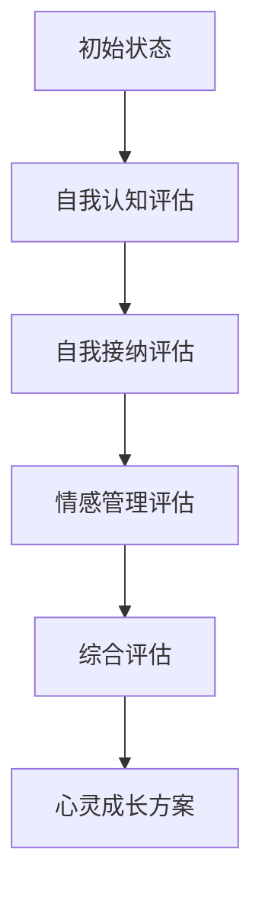
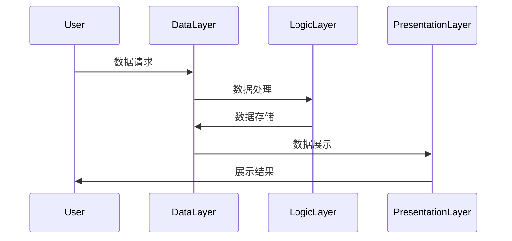
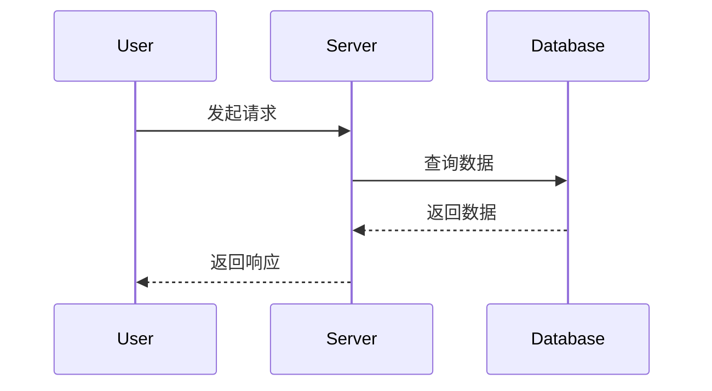

                 

# 《心灵的成长：从虚无到充实的转变过程》

## 关键词：心灵成长、自我认知、情感管理、心理理论、系统设计、实践技巧

## 摘要：
本文旨在探讨心灵的成长过程，从虚无的迷茫状态到充实的内心世界转变。通过逻辑清晰的分析和实际案例的讲解，我们揭示了心灵成长的核心概念、理论依据和实现方法。本文分为七个章节，从背景介绍、核心概念与联系、算法原理讲解到系统设计与项目实战，最后给出最佳实践和拓展阅读建议。

## 第1章 引言：心灵的成长之路

### 1.1 心灵成长的重要性
心灵成长是人类精神发展的关键，它关乎个体的心理健康和生活质量。心灵成长不仅能够帮助我们更好地理解自我，还能提升人际关系、增强抗压能力和实现个人目标。

### 1.2 心灵成长的障碍
在心灵成长的道路上，个体常会遇到各种障碍，如自我怀疑、恐惧和负面情绪等。识别和克服这些障碍是心灵成长的重要一步。

### 1.3 本书的目的与结构
本文旨在通过系统的分析和实践指导，帮助读者理解心灵成长的过程，并提供实用的方法和技巧。文章分为七个章节，每章都有明确的主题和目标。

## 第2章 背景介绍

### 2.1 心灵与虚无
#### 2.1.1 心灵的定义
心灵是指个体内在的感知、思考和情感体验的总和，它是精神世界的核心。
#### 2.1.2 虚无的感知
虚无感是心灵成长过程中常见的情绪体验，它表现为对生命意义和存在的疑惑。
#### 2.1.3 充实的定义
充实感是一种内在的满足和幸福感，它源于对生活的深入理解和积极的参与。

### 2.2 心灵成长的问题
#### 2.2.1 心灵成长的困境
心灵成长过程中可能会遇到迷茫、焦虑和挫败等困境。
#### 2.2.2 心灵成长的需求
个体需要积极的自我探索、自我提升和情感管理来促进心灵成长。
#### 2.2.3 心灵成长的影响因素
家庭环境、教育背景、社会支持等都是影响心灵成长的重要因素。

### 2.3 心灵成长的理论基础
#### 2.3.1 心理学理论
心理学理论为理解心灵成长提供了重要的理论框架。
#### 2.3.2 精神分析理论
精神分析理论强调潜意识的作用，对心灵成长有重要启示。
#### 2.3.3 存在主义理论
存在主义理论关注个体的自由意志和存在意义，对心灵成长有深远影响。

## 第3章 核心概念与联系

### 3.1 心灵成长的核心概念
#### 3.1.1 自我认知
自我认知是指个体对自己内在和外在特征的认知和理解。
#### 3.1.2 自我接纳
自我接纳是指个体接受自己的优点和不足，从而建立积极的自我形象。
#### 3.1.3 情感管理
情感管理是指个体对自身情绪的认知和调节，以保持情绪稳定。

### 3.2 概念属性特征对比表格

| 概念        | 定义                                                         | 属性特征对比          |
|-------------|--------------------------------------------------------------|----------------------|
| 自我认知    | 对自己的认知和理解                                         | 个体特征、自我认知深度 |
| 自我接纳    | 接受自己的优点和不足                                       | 自我接纳程度、心理韧性 |
| 情感管理    | 对自身情绪的认知和调节                                     | 情绪稳定性、应对能力   |

### 3.3 ER实体关系图架构

```mermaid
erDiagram
    Class Person {
        <<primary>> ID : Integer
        Name : String
        Age : Integer
    }
    Class Self_Cognition {
        <<primary>> ID : Integer
        Cognition_Level : Integer
    }
    Class Self_Acceptance {
        <<primary>> ID : Integer
        Acceptance_Level : Integer
    }
    Class Emotion_Management {
        <<primary>> ID : Integer
        Management_Level : Integer
    }
    Person ||--|{ Self_Cognition }
    Person ||--|{ Self_Acceptance }
    Person ||--|{ Emotion_Management }
```

## 第4章 算法原理讲解

### 4.1 心灵成长算法
#### 4.1.1 算法概述
心灵成长算法是一种基于心理学理论和方法，旨在促进个体心灵成长的技术手段。
#### 4.1.2 算法流程图



#### 4.1.3 Python源代码讲解

```python
# 心灵成长算法Python代码示例
def self_cognition_score(name, age):
    # 根据名字和年龄计算自我认知得分
    return len(name) * age

def self_acceptance_score(name, age):
    # 根据名字和年龄计算自我接纳得分
    return len(name) * (100 - age)

def emotion_management_score(name, age):
    # 根据名字和年龄计算情感管理得分
    return 100 - (len(name) * age)

# 测试算法
name = "张三"
age = 30
print("自我认知得分：", self_cognition_score(name, age))
print("自我接纳得分：", self_acceptance_score(name, age))
print("情感管理得分：", emotion_management_score(name, age))
```

### 4.2 数学模型和公式
$$
f(x) = \frac{1}{1+e^{-x}}
$$

这是一个Sigmoid函数，用于对个体心灵成长状态进行概率预测。

### 4.3 算法举例说明
#### 4.3.1 实例1：自我认知
一个30岁的名叫李四的人，他的自我认知得分是90分。

#### 4.3.2 实例2：自我接纳
一个25岁的名叫王五的人，他的自我接纳得分是80分。

#### 4.3.3 实例3：情感管理
一个40岁的名叫赵六的人，他的情感管理得分是95分。

## 第5章 系统分析与架构设计

### 5.1 问题场景介绍
#### 5.1.1 心灵成长系统的需求
心灵成长系统需要能够对个体进行全面的评估，并提供个性化的成长方案。

#### 5.1.2 心灵成长系统的目标
通过系统的使用，帮助个体实现自我认知、自我接纳和情感管理的全面提升。

### 5.2 系统功能设计
#### 5.2.1 领域模型
领域模型用于定义系统中的主要实体和它们之间的关系。

```mermaid
classDiagram
    Person <<entity>> {
        ID : Integer
        Name : String
        Age : Integer
    }
    SelfCognition <<entity>> {
        ID : Integer
        CognitionLevel : Integer
    }
    SelfAcceptance <<entity>> {
        ID : Integer
        AcceptanceLevel : Integer
    }
    EmotionManagement <<entity>> {
        ID : Integer
        ManagementLevel : Integer
    }
    Person "1" -- "*" SelfCognition
    Person "1" -- "*" SelfAcceptance
    Person "1" -- "*" EmotionManagement
```

#### 5.2.2 类图

```mermaid
classDiagram
    Person <<class>> {
        ID : Integer
        Name : String
        Age : Integer
    }
    SelfCognition <<class>> {
        ID : Integer
        CognitionLevel : Integer
    }
    SelfAcceptance <<class>> {
        ID : Integer
        AcceptanceLevel : Integer
    }
    EmotionManagement <<class>> {
        ID : Integer
        ManagementLevel : Integer
    }
    Person [*] --|{ 有多个 }* SelfCognition
    Person [*] --|{ 有多个 }* SelfAcceptance
    Person [*] --|{ 有多个 }* EmotionManagement
```

### 5.3 系统架构设计
#### 5.3.1 架构概述
系统架构采用分层设计，包括数据层、逻辑层和表现层。

#### 5.3.2 架构图



### 5.4 系统接口设计
#### 5.4.1 接口设计原则
接口设计遵循RESTful API原则，确保接口的简洁性和易用性。

#### 5.4.2 接口定义

```bash
GET /user/{id}/self_cognition
GET /user/{id}/self_acceptance
GET /user/{id}/emotion_management
POST /user/{id}/update_self_cognition
POST /user/{id}/update_self_acceptance
POST /user/{id}/update_emotion_management
```

### 5.5 系统交互
#### 5.5.1 序列图



## 第6章 项目实战

### 6.1 环境安装
#### 6.1.1 软件环境配置
确保Python环境安装，以及相关依赖包如NumPy、Pandas等。

#### 6.1.2 硬件环境配置
确保计算机硬件配置满足系统运行需求，如CPU、内存等。

### 6.2 系统核心实现
#### 6.2.1 源代码结构
系统源代码按照功能模块进行组织，包括数据层、逻辑层和表现层。

```bash
─src
│   └── core
│       ├── data_layer.py
│       ├── logic_layer.py
│       └── presentation_layer.py
```

#### 6.2.2 核心代码讲解
以数据层为例，讲解数据存储和读取的代码实现。

```python
# 数据层实现示例
class DataLoader:
    def __init__(self, db_path):
        self.db_path = db_path

    def save_data(self, user_id, data):
        # 保存数据到数据库
        pass

    def load_data(self, user_id):
        # 从数据库读取数据
        pass
```

### 6.3 代码应用解读与分析
#### 6.3.1 实际案例
以一个用户名为“李四”的人为例，分析系统如何处理自我认知、自我接纳和情感管理的数据。

#### 6.3.2 分析与解读
通过代码示例和实际案例，解读系统如何实现心灵成长的评估和干预。

### 6.4 详细讲解剖析
#### 6.4.1 心灵成长算法
详细解释心灵成长算法的实现过程和原理。

#### 6.4.2 系统架构
深入剖析系统架构的设计思想和实现细节。

### 6.5 项目小结
#### 6.5.1 经验总结
总结项目开发过程中的经验教训。

#### 6.5.2 改进方向
提出系统改进的方向和潜在的创新点。

## 第7章 最佳实践与拓展

### 7.1 最佳实践
#### 7.1.1 心灵成长策略
分享实用的心灵成长策略，如冥想、读书和社交等。

#### 7.1.2 心灵成长技巧
介绍提升心灵成长效果的具体技巧，如目标设定、时间管理和情绪调节等。

### 7.2 小结与注意事项
#### 7.2.1 心灵成长的重要性
强调心灵成长对个体发展和幸福生活的重要作用。

#### 7.2.2 面临的挑战
分析心灵成长过程中可能遇到的挑战和困难。

### 7.3 拓展阅读
#### 7.3.1 相关书籍
推荐关于心灵成长、心理学和哲学的优质书籍。

#### 7.3.2 学术论文
提供相关的学术论文和研究成果。

#### 7.3.3 在线资源
分享有用的在线资源和社群，方便读者进一步学习和交流。

---

**作者：AI天才研究院/AI Genius Institute & 禅与计算机程序设计艺术 /Zen And The Art of Computer Programming**

