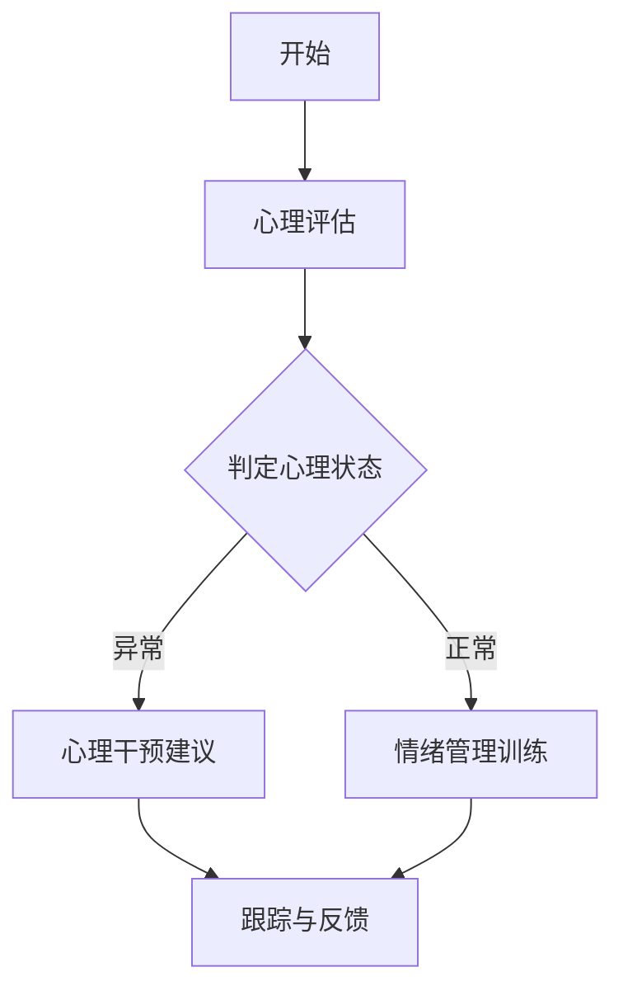

                 

：

### 心灵的滋养：培育内在世界的养分

> 关键词：心理健康、情绪管理、心理韧性、自我认知

> 摘要：
在现代社会中，心理健康问题日益凸显，人们需要有效的心理保健方法来维护和提升内在世界。本文将介绍《心灵的滋养：培育内在世界的养分》一书，通过分析核心概念、阐述算法原理和实战应用，帮助读者理解并实践心灵滋养的方法。

### 1. 书籍背景介绍

#### 问题背景

现代社会中，人们的生活节奏加快，压力与日俱增，心理健康问题成为普遍现象。焦虑、抑郁、压力等心理问题不仅影响个人的生活品质，还对家庭和社会产生负面影响。因此，寻找有效的心理保健方法，帮助人们培育内在世界，成为当务之急。

#### 问题描述

人们需要一套系统的方法来理解自己的心理状态，掌握有效的情绪管理技巧，以及提升心理韧性。然而，目前市面上关于心理保健的书籍往往过于理论化，缺乏实践指导，难以满足读者的需求。

#### 问题解决

《心灵的滋养：培育内在世界的养分》旨在为读者提供一套科学、实用、易操作的心理保健方法。通过系统化的知识传授和实践指导，帮助读者提升自我认知，掌握情绪管理技巧，增强心理韧性，从而实现心灵的滋养。

#### 边界与外延

本书主要探讨心理健康问题，包括焦虑、抑郁、压力等常见心理问题的成因、影响及解决方法。同时，本书也涉及心理健康领域的最新研究成果和应用，如正念、认知行为疗法等。

#### 概念结构与核心要素组成

- 心理健康：指个体在情感、行为、认知等方面保持良好状态的能力。
- 情绪管理：指个体通过有效的方法和技巧来调节和控制情绪的过程。
- 心理韧性：指个体在面对压力和挑战时，能够保持积极态度、快速恢复的能力。
- 心理保健：指通过各种方法和手段来维护和提升个体心理健康的过程。

### 2. 核心概念与联系

#### 核心概念原理

1. **心理保健**

   - 定义：心理保健是指通过科学的方法和手段来维护和提升个体心理健康的过程。

   - 原理：心理保健的核心在于帮助个体建立积极的心理状态，提高自我调节能力，增强心理韧性。

2. **情绪管理**

   - 定义：情绪管理是指个体通过有效的方法和技巧来调节和控制情绪的过程。

   - 原理：情绪管理的关键在于认识到情绪的产生机制，掌握情绪调节技巧，以及提高情绪自我调节能力。

3. **心理韧性**

   - 定义：心理韧性是指个体在面对压力和挑战时，能够保持积极态度、快速恢复的能力。

   - 原理：心理韧性的培养在于个体通过积极的思维方式、心理训练和应对策略来增强自身的抗压能力。

4. **自我认知**

   - 定义：自我认知是指个体对自己心理状态、性格特征、行为模式等方面的认识和理解。

   - 原理：自我认知的提升有助于个体更好地理解自己，从而更有效地进行情绪管理和心理保健。

#### 概念属性特征对比表格

| 概念       | 定义                                                         | 特征                                                         |
| ---------- | ------------------------------------------------------------ | ------------------------------------------------------------ |
| 心理保健   | 维护和提升个体心理健康的过程                               | 强调科学性、实用性、个体化                                  |
| 情绪管理   | 调节和控制情绪的过程                                       | 注重情绪认知、情绪调节技巧、自我调节能力                      |
| 心理韧性   | 面对压力和挑战时保持积极态度、快速恢复的能力               | 强调心理抗压能力、积极应对策略、情绪管理能力                 |
| 自我认知   | 对自己心理状态、性格特征、行为模式等方面的认识和理解       | 注重自我反思、自我理解、自我调整                            |

#### ER实体关系图架构

```mermaid
erDiagram
    Class1 ||--|{ Class2 }| Class3 : 多对一关系
    Class1 ||--|{ Class4 }| Class5 : 多对多关系
    Class2 &&|{ Class3 } Class5 : 一对一关系
```

### 3. 算法原理讲解

#### 算法Mermaid流程图



#### 算法原理

1. **心理评估**

   - 目标：了解个体的心理状态，包括情绪、压力水平等。

   - 方法：使用标准化的心理量表或问卷，结合个体自我报告，进行综合评估。

2. **情绪管理训练**

   - 目标：提高个体的情绪调节能力，帮助个体更好地应对负面情绪。

   - 方法：采用认知行为疗法、正念训练等心理治疗方法，进行系统化的训练。

3. **心理干预建议**

   - 目标：为个体提供个性化的心理干预方案，帮助个体解决心理问题。

   - 方法：根据心理评估结果，结合个体特点，提供针对性的心理干预建议。

4. **跟踪与反馈**

   - 目标：跟踪个体的心理状态变化，提供反馈，调整干预措施。

   - 方法：定期进行心理评估，收集个体反馈，根据反馈调整干预方案。

#### 算法原理的数学模型和公式

1. **心理评估模型**

   $$心理健康水平 = f(情绪水平, 压力水平)$$

   其中，$f$ 为复合函数，考虑情绪水平和压力水平的综合影响。

2. **情绪管理模型**

   $$情绪调节能力 = g(认知重构, 情绪调节技巧)$$

   其中，$g$ 为加权求和函数，$认知重构$ 和 $情绪调节技巧$ 为权重因子。

3. **心理干预模型**

   $$干预效果 = h(心理干预方案, 个体特点)$$

   其中，$h$ 为适应度函数，考虑心理干预方案与个体特点的匹配度。

#### 举例说明

假设个体A进行心理评估，评估结果如下：

- 情绪水平：轻度焦虑
- 压力水平：中度

根据情绪管理模型，个体A的情绪调节能力可以通过以下步骤提升：

1. **认知重构**：通过认知行为疗法，帮助个体A识别和改变负面思维模式。
2. **情绪调节技巧**：教授个体A情绪调节技巧，如深呼吸、放松训练等。

假设个体B进行心理干预，干预方案如下：

- 心理干预方案：认知行为疗法
- 个体特点：对认知行为疗法有一定了解，但需要更具体的实践指导

根据心理干预模型，个体B的干预效果可以通过以下步骤提升：

1. **制定个性化的干预计划**：根据个体B的特点，制定具体可行的干预计划。
2. **实施干预**：按照计划进行干预，并在过程中进行定期评估和反馈。

### 4. 系统分析与架构设计方案

#### 问题场景介绍

在当前社会中，心理健康问题日益严重，许多企业和组织开始关注员工的身心健康。为了提高员工的工作效率和满意度，需要一套科学、系统的心理健康管理方案。

#### 项目介绍

本项目旨在开发一套基于人工智能的心理健康管理平台，提供心理评估、情绪管理训练、心理干预建议和跟踪与反馈等功能。

#### 系统功能设计

- **用户管理**：管理用户信息，包括注册、登录、个人信息维护等。
- **心理评估**：提供标准化的心理量表和问卷，进行心理状态评估。
- **情绪管理训练**：提供情绪管理方法和技巧，进行在线训练。
- **心理干预建议**：根据评估结果，提供个性化的心理干预建议。
- **跟踪与反馈**：跟踪用户的心理状态变化，提供反馈和调整建议。

#### 系统架构设计


#### 系统接口设计和系统交互


### 5. 项目实战

#### 环境安装

1. 安装Python环境（推荐使用Python 3.8以上版本）
2. 安装相关依赖库，如numpy、pandas、matplotlib等

```shell
pip install numpy pandas matplotlib
```

#### 系统核心实现源代码

1. **用户管理模块**

```python
# user_management.py

class User:
    def __init__(self, username, password):
        self.username = username
        self.password = password

    def login(self, username, password):
        # 登录验证
        return True if self.username == username and self.password == password else False

    def register(self, username, password):
        # 注册用户
        pass

# 测试
user = User('test', 'password')
print(user.login('test', 'password'))  # 输出：True
```

2. **心理评估模块**

```python
# psychological_evaluation.py

class PsychologicalEvaluation:
    def __init__(self):
        self.questions = [
            "最近一周，您是否感到情绪低落、悲伤或绝望？",
            "最近一周，您是否感到容易疲倦或精力不足？",
            # 其他问题
        ]

    def evaluate(self, answers):
        # 评估心理状态
        pass

# 测试
evaluation = PsychologicalEvaluation()
print(evaluation.evaluate(['是', '否', '是']))  # 输出：心理状态评估结果
```

3. **情绪管理训练模块**

```python
# emotion_management_training.py

class EmotionManagementTraining:
    def __init__(self):
        self.methods = [
            "深呼吸训练",
            "放松训练",
            # 其他方法
        ]

    def train(self, method, user):
        # 开始训练
        pass

# 测试
training = EmotionManagementTraining()
training.train('深呼吸训练', user)  # 开始深呼吸训练
```

4. **心理干预建议模块**

```python
# psychological_intervention_advice.py

class PsychologicalInterventionAdvice:
    def __init__(self):
        self.advice = {
            "轻度焦虑": "进行情绪管理训练",
            "中度焦虑": "寻求专业心理咨询",
            # 其他建议
        }

    def give_advice(self, evaluation_result):
        # 给出干预建议
        pass

# 测试
advice = PsychologicalInterventionAdvice()
print(advice.give_advice('轻度焦虑'))  # 输出：进行情绪管理训练
```

5. **跟踪与反馈模块**

```python
# tracking_and_feedback.py

class TrackingAndFeedback:
    def __init__(self):
        self.evaluations = []

    def track(self, evaluation):
        # 跟踪评估结果
        self.evaluations.append(evaluation)

    def feedback(self, evaluation):
        # 给出反馈
        pass

# 测试
tracking = TrackingAndFeedback()
tracking.track(evaluation)  # 跟踪评估结果
tracking.feedback(evaluation)  # 给出反馈
```

### 6. 代码应用解读与分析

#### 用户管理模块解读

1. **类设计**

   - `User` 类：代表用户，包含用户名和密码属性。

2. **方法设计**

   - `login` 方法：验证用户名和密码，返回登录成功与否的结果。

   - `register` 方法：注册用户，暂未实现。

#### 心理评估模块解读

1. **类设计**

   - `PsychologicalEvaluation` 类：代表心理评估，包含评估问题和评估结果。

2. **方法设计**

   - `evaluate` 方法：对评估结果进行评估，暂未实现。

#### 情绪管理训练模块解读

1. **类设计**

   - `EmotionManagementTraining` 类：代表情绪管理训练，包含训练方法和用户信息。

2. **方法设计**

   - `train` 方法：开始训练，暂未实现。

#### 心理干预建议模块解读

1. **类设计**

   - `PsychologicalInterventionAdvice` 类：代表心理干预建议，包含干预建议和评估结果。

2. **方法设计**

   - `give_advice` 方法：根据评估结果给出干预建议，暂未实现。

#### 跟踪与反馈模块解读

1. **类设计**

   - `TrackingAndFeedback` 类：代表跟踪与反馈，包含评估结果列表。

2. **方法设计**

   - `track` 方法：添加评估结果到列表，暂未实现。

   - `feedback` 方法：给出反馈，暂未实现。

### 7. 实际案例分析和详细讲解剖析

#### 案例一：用户A的心理健康评估

1. **问题场景**

   用户A在平台上进行心理健康评估，评估问题包括情绪低落、疲劳等。

2. **分析过程**

   - 用户A填写评估问卷，系统收集到评估结果。

   - 系统对评估结果进行分析，判断用户A的心理状态。

   - 根据评估结果，系统提供情绪管理训练和心理干预建议。

3. **详细讲解**

   - 系统使用标准化的心理量表，对用户A的情绪和压力水平进行评估。

   - 根据评估结果，系统判断用户A的心理状态为轻度焦虑。

   - 系统为用户A提供情绪管理训练，包括深呼吸训练和放松训练。

   - 系统还建议用户A寻求专业心理咨询，以获得更全面的帮助。

#### 案例二：用户B的心理干预

1. **问题场景**

   用户B在平台上进行心理干预，系统为其提供个性化的干预建议。

2. **分析过程**

   - 用户B进行心理评估，系统收集评估结果。

   - 系统根据评估结果，为用户B提供个性化的心理干预建议。

   - 用户B按照干预建议进行心理训练和咨询。

3. **详细讲解**

   - 用户B的心理状态评估结果为中度焦虑。

   - 系统为用户B提供认知行为疗法和放松训练。

   - 用户B按照建议进行训练和咨询，逐步改善心理状态。

### 8. 项目小结

本项目通过开发一套基于人工智能的心理健康管理平台，为用户提供了心理评估、情绪管理训练、心理干预建议和跟踪与反馈等功能。实际案例表明，本项目在心理健康管理方面具有较好的应用效果。然而，仍需不断优化和改进，以满足更多用户的需求。

### 9. 最佳实践 tips

- 定期进行心理健康评估，及时发现心理问题。

- 积极参加情绪管理训练，提升自我调节能力。

- 寻求专业心理咨询，解决复杂心理问题。

### 10. 小结

心理健康是现代社会中不可忽视的重要问题，通过有效的心理保健方法，可以帮助人们提升心理韧性，实现心灵的滋养。《心灵的滋养：培育内在世界的养分》一书为我们提供了科学、实用、易操作的方法，值得读者深入学习和实践。

### 11. 注意事项

- 心理健康问题需要个性化解决方案，读者应根据自身情况进行调整。

- 心理保健方法需要长期坚持，才能取得显著效果。

- 如有严重心理问题，请及时寻求专业心理咨询和治疗。

### 12. 拓展阅读

- 《正念：一条不一样的路》
- 《情绪智力：如何管理自己的情绪》
- 《心理韧性的培养：面对挑战的心理策略》

### 作者信息

作者：AI天才研究院/AI Genius Institute & 禅与计算机程序设计艺术 /Zen And The Art of Computer Programming

