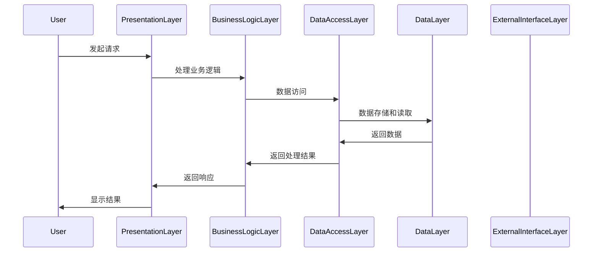
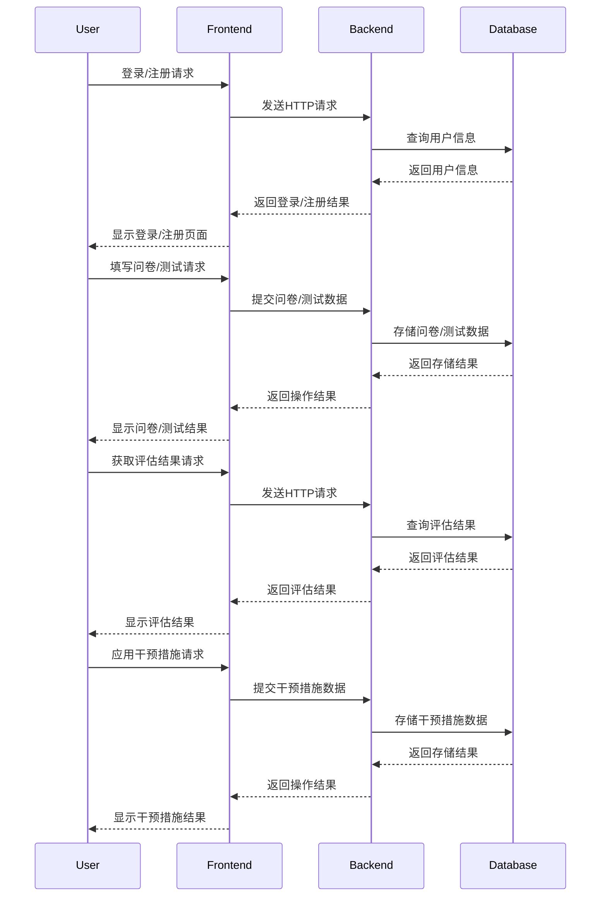

                 

### 背景介绍

#### 心理弹性的重要性

在快节奏和高度不确定性的现代社会中，心理弹性成为了衡量个人应对生活压力和挑战能力的关键指标。心理弹性，也被称作“复原力”，指的是个体在面对压力、逆境和挑战时，能够迅速恢复并适应新环境的能力。研究表明，心理弹性对于个人的心理健康、生活质量和职业成功至关重要[1]。高心理弹性的人能够在困境中保持积极的心态，迅速调整应对策略，从而降低负面情绪的影响，提升自身的心理幸福感。

#### 当前心理弹性评估的挑战

尽管心理弹性在个人发展中扮演着如此重要的角色，但目前的心理弹性评估方法仍面临诸多挑战。首先，传统的评估方法多以问卷调查为主，这些问卷虽然能够提供一定程度的量化数据，但往往缺乏对个体真实心理状态的全面了解。其次，不同文化和社会背景下的心理弹性表现存在差异，现有评估工具的普适性和准确性有待提高。再者，评估结果的解释和实际应用也相对复杂，难以形成有效的干预策略。

为了解决这些挑战，开发一种新的心理弹性评估系统显得尤为重要。这种系统不仅需要能够量化评估个体的心理弹性水平，还需要具备以下特点：

1. **全面性**：系统应涵盖心理弹性的多个关键要素，如个体差异、应对策略和资源利用等。
2. **精确性**：系统需具备高精度的数据采集和分析能力，以确保评估结果的准确性。
3. **智能化**：系统应集成人工智能算法，实现自动化评估和个性化建议，提升用户体验。
4. **可解释性**：系统应提供直观的评估结果解释，帮助用户理解和应用评估结果。

本文将围绕以上特点，详细探讨心理弹性评估系统的开发，旨在为相关领域的研究者和实践者提供有价值的参考和指导。

#### 核心概念

**心理弹性**：心理弹性是指个体在面对逆境、压力和挑战时，能够迅速适应、恢复并保持良好心理状态的能力。它不仅涉及个体应对负面情绪和压力的能力，还包括个体在危机中发掘潜能、实现自我超越的过程。

**评估方法**：评估心理弹性通常采用问卷调查、心理测试、行为观察等方法。问卷调查是最常见的方法，通过设计针对性的问卷，收集个体在特定情境下的行为和情绪反应数据。心理测试则通过标准化的心理测量工具，对个体的心理弹性水平进行定量评估。行为观察是通过观察个体在现实生活中的行为表现，评估其心理弹性。

**评估指标体系**：心理弹性的评估指标体系通常包括应对策略、资源利用、心理健康水平、生活满意度等多个方面。应对策略主要衡量个体在面对压力时的应对方式；资源利用则评估个体调动内外部资源的能力；心理健康水平和生活满意度则反映个体的整体心理状态和生活质量。

#### 心理弹性的关键要素

**个体差异**：不同个体的心理弹性存在显著差异。这些差异可能源于基因、家庭环境、教育背景、个人性格等多个因素。例如，有些人可能天生具有更高的自我调节能力和乐观态度，从而在面对挑战时表现出更强的心理弹性。

**应对策略**：个体在应对压力时采取的应对策略直接影响心理弹性的表现。有效的应对策略包括积极思考、寻求社会支持、制定合理的目标等。这些策略有助于个体更好地适应逆境，降低负面情绪的影响。

**资源利用**：资源利用是指个体在面临压力时，调动和利用内外部资源的能力。这些资源包括社会支持、经济条件、专业技能等。有效利用资源能够增强个体的心理弹性，帮助其更好地应对挑战。

#### 边界与外延

**心理弹性与其他相关概念的比较**：心理弹性与压力耐受力、抗压能力、情绪调节能力等概念密切相关，但它们之间存在一定的区别。压力耐受力主要衡量个体在长时间压力下的承受能力；抗压能力则侧重于个体在面对急性压力时的应对能力；情绪调节能力则关注个体管理情绪的能力。心理弹性综合了这些概念，更加全面地反映了个体的心理适应能力。

**心理健康水平与心理弹性的关系**：心理健康水平是影响心理弹性的重要因素。心理健康良好的个体通常具有较高的心理弹性，能够更好地应对生活压力。然而，心理弹性并非单纯由心理健康水平决定，个体差异、应对策略和资源利用等因素同样重要。

通过上述分析，我们可以看出，心理弹性评估系统不仅需要全面、精确地评估个体的心理弹性水平，还需充分考虑个体差异、应对策略和资源利用等因素，为用户提供有针对性的建议和干预策略。

## 第二部分 核心概念与联系

### 心理弹性评估原理

心理弹性评估是理解和衡量个体在面对压力和挑战时适应能力的关键步骤。为了构建一个全面、精确且智能化的心理弹性评估系统，我们需要深入理解心理弹性评估的基本原理，并探讨其中涉及的关键要素。

#### 心理弹性评估的基本原理

心理弹性评估的基本原理主要涉及以下几个方面：

1. **问卷设计与数据收集**：通过设计针对心理弹性的问卷，收集个体在特定情境下的行为和情绪反应数据。这些问卷通常包括多项选择题、开放性问题等，旨在全面了解个体在应对压力时的表现。
   
2. **心理测试与标准化评估**：利用标准化的心理测量工具，如心理弹性量表（如CD-RISC）、应对策略量表等，对个体的心理弹性水平进行定量评估。这些量表经过科学设计和多次验证，具有较高的信度和效度。

3. **行为观察与情境模拟**：通过观察个体在实际生活中的行为表现，或在特定情境下的反应，评估其心理弹性。例如，在模拟工作压力或家庭冲突等场景中，观察个体如何应对压力，评估其心理弹性。

#### 心理弹性评估的关键要素

心理弹性评估的关键要素包括以下几个方面：

1. **个体差异**：不同个体在心理弹性方面存在显著差异。这些差异可能源于基因、家庭环境、教育背景和个人性格等。例如，某些个体可能天生具有更高的自我调节能力和乐观态度，从而在面对挑战时表现出更强的心理弹性。

2. **应对策略**：个体在面对压力时采取的应对策略直接影响心理弹性的表现。有效的应对策略包括积极思考、寻求社会支持、制定合理的目标等。这些策略有助于个体更好地适应逆境，降低负面情绪的影响。

3. **资源利用**：资源利用是指个体在面临压力时，调动和利用内外部资源的能力。这些资源包括社会支持、经济条件、专业技能等。有效利用资源能够增强个体的心理弹性，帮助其更好地应对挑战。

#### 概念属性特征对比表格

为了更清晰地理解不同心理弹性评估方法的特点，我们通过以下表格对比几种常见评估方法的概念属性特征：

| 方法名称 | 定义 | 关键要素 | 优点 | 缺点 |
| :------: | :--: | :------: | :--: | :--: |
| 问卷调查 | 通过问卷收集个体在特定情境下的行为和情绪反应数据 | 个体差异、应对策略、资源利用 | 方便、高效、数据量大 | 可能缺乏情境真实性 |
| 心理测试 | 利用标准化的心理测量工具对个体的心理弹性水平进行定量评估 | 个体差异、应对策略、资源利用 | 准确、标准化、有针对性 | 可能存在主观偏差 |
| 行为观察 | 观察个体在实际生活中的行为表现，评估其心理弹性 | 个体差异、应对策略、资源利用 | 客观、全面、真实 | 受观察者影响较大 |

通过上述分析，我们可以看出，心理弹性评估系统需要综合运用问卷调查、心理测试和行为观察等方法，以全面、精确地评估个体的心理弹性水平。同时，充分考虑个体差异、应对策略和资源利用等因素，将为系统提供有针对性的评估结果和干预策略，进一步提升个体的心理弹性。

### 心理弹性评估算法

心理弹性评估算法是心理弹性评估系统的核心，通过算法能够将个体的行为、情绪和情境数据转化为心理弹性水平的量化指标。在评估算法的选择和设计上，我们需要考虑算法的精确性、普适性和可解释性，以确保评估结果的科学性和可靠性。

#### 算法概述

在心理弹性评估领域，算法可以分为几种不同的类型，每种算法都有其独特的特点和应用场景。以下是几种常见的评估算法及其选择标准：

1. **机器学习算法**：机器学习算法通过训练模型，从大量数据中学习并识别出心理弹性的规律。常见的机器学习算法包括决策树、支持向量机（SVM）、随机森林、神经网络等。选择机器学习算法的主要标准是模型的准确性和泛化能力。

2. **统计方法**：统计方法如回归分析、因子分析等，通过对数据进行分析，揭示变量之间的关系和影响。这些方法适用于探索性数据分析，能够为评估提供定量支持。选择统计方法的主要标准是数据质量和分析方法的有效性。

3. **混合模型**：混合模型结合了机器学习和统计方法的优势，通过融合不同模型的结果，提高评估的准确性和可靠性。这种算法适用于数据量较大且存在多种影响因素的情况。

4. **标准评估量表**：标准评估量表如CD-RISC等，通过预先设计的量表对个体进行心理弹性评估。这些量表经过科学验证，具有较高的信度和效度。选择标准评估量表的主要标准是量表的可靠性和适用性。

#### 算法原理与流程

心理弹性评估算法的基本原理是通过对个体行为、情绪和情境数据的分析，提取出影响心理弹性的关键特征，并利用这些特征预测个体的心理弹性水平。以下是算法的基本原理和流程：

1. **数据收集**：首先，通过问卷调查、心理测试和行为观察等方法，收集个体在特定情境下的行为和情绪数据。这些数据包括定量数据和定性数据，如问卷调查结果、心理测试分数和观察记录等。

2. **数据处理**：对收集到的数据进行分析和预处理，包括数据清洗、缺失值填补、数据标准化等步骤。预处理后的数据将用于后续的建模和评估。

3. **特征提取**：从预处理后的数据中提取关键特征，这些特征能够反映个体的心理弹性水平。特征提取的方法包括统计特征提取、机器学习特征提取等。

4. **模型训练**：利用提取的特征数据，通过机器学习算法或统计方法训练评估模型。模型训练的目标是使模型能够准确地预测个体的心理弹性水平。

5. **模型评估**：对训练好的模型进行评估，验证模型的准确性和泛化能力。常见的评估指标包括准确率、召回率、F1值等。

6. **结果解释**：将评估结果转化为用户可以理解的形式，如分数、图表等。结果解释的目的是帮助用户理解自己的心理弹性水平，并提供相应的建议和干预策略。

#### 算法数学模型与公式

在心理弹性评估中，常用的数学模型和公式如下：

1. **线性回归模型**：
   \[
   \text{预测值} = \beta_0 + \beta_1 \times \text{特征1} + \beta_2 \times \text{特征2} + \ldots + \beta_n \times \text{特征n}
   \]
   其中，\(\beta_0\) 是截距，\(\beta_1, \beta_2, \ldots, \beta_n\) 是特征权重。

2. **逻辑回归模型**：
   \[
   \text{概率} = \frac{1}{1 + e^{-(\beta_0 + \beta_1 \times \text{特征1} + \beta_2 \times \text{特征2} + \ldots + \beta_n \times \text{特征n})}}
   \]
   其中，概率表示个体心理弹性水平为高水平的可能性。

3. **支持向量机（SVM）**：
   \[
   \text{决策边界} = \beta_0 + \sum_{i=1}^{n} \beta_i \times \text{特征i}
   \]
   其中，\(\beta_0\) 和 \(\beta_i\) 是特征权重。

通过上述模型和公式，我们可以将个体的行为、情绪和情境数据转化为心理弹性水平的量化指标，为用户提供有针对性的评估结果和干预建议。

#### 算法举例说明

以下是一个简化的心理弹性评估算法实例：

假设我们使用线性回归模型进行心理弹性评估，特征包括应对策略得分、资源利用得分和心理健康水平得分。特征数据如下表所示：

| 特征名称 | 特征值 |
| :------: | :----- |
| 应对策略得分 | 8 |
| 资源利用得分 | 7 |
| 心理健康水平得分 | 9 |

线性回归模型的公式为：
\[
\text{心理弹性水平} = \beta_0 + \beta_1 \times \text{应对策略得分} + \beta_2 \times \text{资源利用得分} + \beta_3 \times \text{心理健康水平得分}
\]

假设模型训练后的参数为：
\[
\beta_0 = 3, \beta_1 = 0.5, \beta_2 = 0.4, \beta_3 = 0.6
\]

代入特征值，计算心理弹性水平：
\[
\text{心理弹性水平} = 3 + 0.5 \times 8 + 0.4 \times 7 + 0.6 \times 9 = 10.9
\]

根据计算结果，该个体的心理弹性水平为10.9，属于较高水平。这表明该个体在应对压力和挑战时，具有较高的心理弹性能力。

通过实例可以看出，心理弹性评估算法能够将个体的行为、情绪和情境数据转化为心理弹性水平的量化指标，为用户提供有针对性的评估结果和干预建议。

### 系统功能设计

#### 问题场景介绍

在心理弹性评估系统中，我们主要考虑两种问题场景：个人心理弹性评估和企业员工心理弹性评估。

1. **个人心理弹性评估**：针对个人用户，系统提供心理弹性自我评估的功能。用户可以通过填写问卷、参与心理测试等方式，获取自己的心理弹性水平，并获得相应的建议和干预策略。

2. **企业员工心理弹性评估**：针对企业用户，系统为企业提供员工心理弹性评估服务。企业可以通过系统对全体员工进行心理弹性评估，了解员工的心理弹性状况，从而制定针对性的心理健康干预措施，提升员工的心理健康水平和工作满意度。

#### 系统功能设计

根据上述问题场景，系统功能设计如下：

1. **用户注册与登录**：用户可以通过注册账号登录系统，进行个人或企业评估。

2. **问卷设计与发布**：系统提供问卷设计工具，用户可以自定义问卷内容，发布给特定人群进行填写。

3. **心理测试管理**：系统内置多种标准化的心理测试，用户可以选择参与测试，获取心理弹性评估结果。

4. **数据收集与处理**：系统自动收集用户填写的问卷和心理测试数据，并进行数据预处理和特征提取。

5. **评估结果生成**：系统利用评估算法，根据用户数据生成心理弹性评估结果，并提供可视化报表。

6. **个性化建议与干预**：系统根据评估结果，为用户提供个性化的心理健康建议和干预策略，如心理辅导、压力管理技巧等。

7. **企业员工管理**：企业用户可以通过系统对员工进行批量评估，管理员工心理健康状况，制定干预计划。

#### 领域模型类图

为了更好地理解系统功能，我们使用Mermaid绘制了领域模型类图。类图展示了系统中的主要实体和它们之间的关系：

```mermaid
classDiagram
    User <|-- PersonalUser
    User <|-- CorporateUser
    Questionnaire <|-- PersonalQuestionnaire
    Questionnaire <|-- CorporateQuestionnaire
    Test <|-- PersonalTest
    Test <|-- CorporateTest
    Report <|-- PersonalReport
    Report <|-- CorporateReport
    Intervention <|-- PersonalIntervention
    Intervention <|-- CorporateIntervention

    User {
        +String username
        +String password
        +Boolean isCorporate
        +void register()
        +void login()
    }

    PersonalUser {
        +PersonalQuestionnaire[] personalQuestionnaires
        +PersonalTest[] personalTests
        +PersonalReport[] personalReports
        +PersonalIntervention[] personalInterventions
    }

    CorporateUser {
        +CorporateQuestionnaire[] corporateQuestionnaires
        +CorporateTest[] corporateTests
        +CorporateReport[] corporateReports
        +CorporateIntervention[] corporateInterventions
    }

    Questionnaire {
        +String title
        +String description
        +void addQuestion(String question)
        +void removeQuestion(String question)
        +void publish()
    }

    PersonalQuestionnaire {
        +PersonalQuestion[] questions
        +void fillOut(PersonalUser user)
    }

    CorporateQuestionnaire {
        +CorporateQuestion[] questions
        +void distributeToEmployees(CorporateUser corporateUser)
    }

    Test {
        +String title
        +String description
        +void administer()
        +void recordResults()
    }

    PersonalTest {
        +PersonalResult[] results
    }

    CorporateTest {
        +CorporateResult[] results
    }

    Report {
        +String title
        +String content
        +void generateReport()
    }

    PersonalReport {
        +PersonalUser personalUser
    }

    CorporateReport {
        +CorporateUser corporateUser
    }

    Intervention {
        +String title
        +String description
        +void apply()
    }

    PersonalIntervention {
        +PersonalUser personalUser
    }

    CorporateIntervention {
        +CorporateUser corporateUser
    }
```

通过领域模型类图，我们可以清晰地看到系统中用户、问卷、测试、报告和干预等实体之间的关系，以及它们在系统中的功能和行为。

### 系统架构设计

#### 系统架构设计

心理弹性评估系统的架构设计遵循模块化、高内聚和低耦合的原则，以确保系统的可扩展性和易维护性。系统架构分为五个主要层次：表示层、业务逻辑层、数据访问层、数据层和外部接口层。以下是系统架构图及其详细解释：



1. **表示层（Presentation Layer）**：
   - 负责用户界面的展示，包括网页、移动应用等前端组件。
   - 用户通过表示层与系统交互，提交请求和接收反馈。
   - 主要技术栈包括HTML、CSS、JavaScript和React、Vue等前端框架。

2. **业务逻辑层（Business Logic Layer）**：
   - 处理系统的核心业务逻辑，包括用户认证、问卷发布、心理测试、评估结果生成等。
   - 通过业务逻辑层，将表示层的请求转化为具体的业务操作，并调用数据访问层进行数据处理。
   - 使用Spring Boot、Django等后端框架实现。

3. **数据访问层（Data Access Layer）**：
   - 负责与数据层的交互，执行数据查询、数据更新等操作。
   - 通过数据访问层，将业务逻辑层的业务操作转化为数据库操作。
   - 主要技术包括Hibernate、MyBatis等ORM框架。

4. **数据层（Data Layer）**：
   - 负责存储和管理系统的数据，包括用户信息、问卷数据、测试结果、评估报告等。
   - 使用关系型数据库（如MySQL、PostgreSQL）进行数据存储，确保数据的完整性和一致性。

5. **外部接口层（External Interface Layer）**：
   - 提供与第三方系统的接口，如企业内部系统、第三方API等。
   - 通过外部接口层，实现系统与其他系统的数据交换和功能集成。
   - 使用RESTful API、Websocket等技术实现。

#### 架构设计原则

1. **模块化**：系统各层之间界限清晰，模块独立，便于开发和维护。
2. **高内聚**：每个模块内部功能紧密相关，降低模块间的耦合度。
3. **低耦合**：模块间通过接口进行通信，降低模块间的依赖性。
4. **可扩展性**：系统设计考虑未来的扩展需求，易于添加新的功能模块。
5. **安全性**：确保用户数据和系统运行的安全性，采用安全加密、权限控制等措施。

通过上述架构设计，心理弹性评估系统实现了前端用户交互、后端业务逻辑处理、数据存储和外部接口集成的高效协同，为用户提供便捷、准确、智能的心理弹性评估服务。

### 系统接口设计

#### 接口定义

在心理弹性评估系统中，为了实现前后端分离和模块化设计，定义了一系列API接口，供前端和后端交互使用。以下是系统的接口定义：

1. **用户注册与登录**：
   - **注册**：`POST /register`，接收用户注册信息，返回注册结果。
   - **登录**：`POST /login`，接收用户登录信息，返回登录状态和用户信息。

2. **问卷管理**：
   - **发布问卷**：`POST /questionnaires`，接收问卷数据，发布新问卷。
   - **更新问卷**：`PUT /questionnaires/{id}`，根据问卷ID更新问卷内容。
   - **获取问卷列表**：`GET /questionnaires`，返回所有问卷列表。

3. **心理测试管理**：
   - **发布测试**：`POST /tests`，接收测试数据，发布新测试。
   - **更新测试**：`PUT /tests/{id}`，根据测试ID更新测试内容。
   - **获取测试列表**：`GET /tests`，返回所有测试列表。

4. **数据收集与处理**：
   - **提交问卷**：`POST /questionnaires/{id}/submit`，提交用户填写的问卷数据。
   - **提交测试**：`POST /tests/{id}/submit`，提交用户完成的测试数据。
   - **获取评估结果**：`GET /results/{id}`，根据结果ID获取用户的评估结果。

5. **报告与干预**：
   - **生成报告**：`POST /results/{id}/report`，根据评估结果生成报告。
   - **获取报告列表**：`GET /reports`，返回用户的报告列表。
   - **应用干预措施**：`POST /interventions`，提交干预措施。

#### 接口协议

系统的接口协议采用RESTful风格，遵循HTTP协议，使用JSON格式进行数据传输。以下是具体的接口协议描述：

1. **请求格式**：
   - 所有请求采用POST、GET、PUT等方法，对应的URL路径如上所述。
   - 请求体（Body）数据格式为JSON，例如：
     ```json
     {
       "username": "user123",
       "password": "password",
       "questionnaire": [
         {"question_id": 1, "answer": "A"},
         {"question_id": 2, "answer": "B"}
       ]
     }
     ```

2. **响应格式**：
   - 所有响应数据格式为JSON，包括成功和错误响应。
   - 成功响应示例：
     ```json
     {
       "status": "success",
       "message": "操作成功",
       "data": {
         "user_id": 123,
         "questionnaires": [
           {"id": 1, "title": "问卷1", "questions": [{"id": 1, "text": "问题1"}, {"id": 2, "text": "问题2"}]}
         ]
       }
     }
     ```
   - 错误响应示例：
     ```json
     {
       "status": "error",
       "message": "用户名已存在",
       "data": null
     }
     ```

通过上述接口定义和协议，系统能够实现前后端数据的高效传递和功能集成，为用户提供流畅、便捷的心理弹性评估服务。

### 系统交互序列图

为了更好地展示心理弹性评估系统中各模块之间的交互过程，我们使用Mermaid绘制了系统交互序列图。以下是序列图的详细说明：



**详细说明**：

1. **用户登录/注册**：用户通过前端页面发起登录或注册请求，前端将请求发送到后端，后端根据请求查询或更新用户信息，并返回处理结果。

2. **问卷/测试提交**：用户填写问卷或完成测试后，前端将数据提交到后端，后端将数据存储到数据库，并返回操作结果。

3. **评估结果查询**：用户请求查看评估结果，前端将请求发送到后端，后端查询数据库获取评估结果，并返回给前端。

4. **干预措施应用**：用户提交干预措施数据，前端将请求发送到后端，后端将数据存储到数据库，并返回操作结果。

通过系统交互序列图，我们可以清晰地了解心理弹性评估系统中各个模块的交互流程，便于分析系统的运行效率和潜在问题。

### 环境安装与系统实现

#### 硬件与软件要求

为了成功安装和运行心理弹性评估系统，以下硬件与软件环境是必需的：

1. **硬件要求**：
   - CPU：至少2GHz的处理器
   - 内存：至少4GB RAM
   - 存储：至少100GB的硬盘空间
   - 网络：至少1Mbps的网络连接

2. **软件要求**：
   - 操作系统：Linux（推荐Ubuntu 18.04或以上版本）
   - 开发环境：Python 3.7或以上版本
   - 数据库：MySQL 5.7或以上版本
   - 依赖管理：pip、virtualenv
   - Web服务器：Nginx（可选）
   - 消息队列：RabbitMQ（可选）

#### 安装步骤

以下是详细的安装步骤，假设您已经具备基本的Linux命令行操作能力：

1. **更新系统软件包**：
   ```bash
   sudo apt update
   sudo apt upgrade
   ```

2. **安装Python 3**：
   ```bash
   sudo apt install python3 python3-pip
   ```

3. **安装MySQL数据库**：
   ```bash
   sudo apt install mysql-server
   sudo mysql_secure_installation
   ```
   按照提示设置root用户密码和其它安全设置。

4. **创建数据库**：
   ```sql
   mysql -u root -p
   CREATE DATABASE peas;
   GRANT ALL PRIVILEGES ON peas.* TO 'peasuser'@'localhost' IDENTIFIED BY 'your_password';
   FLUSH PRIVILEGES;
   EXIT;
   ```

5. **安装依赖管理工具**：
   ```bash
   sudo pip3 install virtualenv
   ```

6. **创建虚拟环境**：
   ```bash
   virtualenv venv
   source venv/bin/activate
   ```

7. **安装系统依赖**：
   ```bash
   pip install -r requirements.txt
   ```

8. **配置数据库**：
   编辑`config.py`文件，设置数据库连接信息：
   ```python
   DATABASES = {
       'default': {
           'ENGINE': 'django.db.backends.mysql',
           'NAME': 'peas',
           'USER': 'peasuser',
           'PASSWORD': 'your_password',
           'HOST': 'localhost',
           'PORT': '3306',
       }
   }
   ```

9. **初始化数据库**：
   ```bash
   python manage.py makemigrations
   python manage.py migrate
   ```

10. **启动服务**：
    ```bash
    python manage.py runserver
    ```
    在浏览器中输入`http://localhost:8000/`，应该可以看到系统的欢迎页面。

#### 核心模块源代码

以下是系统的核心模块源代码示例，用于用户注册、问卷提交和评估结果生成。

**models.py**（Django模型定义）：
```python
from django.db import models

class User(models.Model):
    username = models.CharField(max_length=150)
    password = models.CharField(max_length=150)
    is_corporate = models.BooleanField(default=False)

class Questionnaire(models.Model):
    title = models.CharField(max_length=255)
    description = models.TextField()
    questions = models.ManyToManyField('Question')

class Question(models.Model):
    text = models.CharField(max_length=255)
    type = models.CharField(max_length=50)

class Response(models.Model):
    user = models.ForeignKey(User, on_delete=models.CASCADE)
    questionnaire = models.ForeignKey(Questionnaire, on_delete=models.CASCADE)
    response = models.JSONField()

class Result(models.Model):
    user = models.ForeignKey(User, on_delete=models.CASCADE)
    score = models.FloatField()
    description = models.TextField()
```

**views.py**（Django视图定义）：
```python
from django.shortcuts import render
from .models import User, Questionnaire, Question, Response, Result
from django.http import JsonResponse
from django.views.decorators.csrf import csrf_exempt

@csrf_exempt
def register(request):
    if request.method == 'POST':
        username = request.POST.get('username')
        password = request.POST.get('password')
        is_corporate = request.POST.get('is_corporate', False)
        user, created = User.objects.get_or_create(username=username, password=password, is_corporate=is_corporate)
        if created:
            return JsonResponse({'status': 'success', 'message': '注册成功'})
        else:
            return JsonResponse({'status': 'error', 'message': '用户已存在'})
    else:
        return JsonResponse({'status': 'error', 'message': '无效请求'})

@csrf_exempt
def submit_questionnaire(request):
    if request.method == 'POST':
        user_id = request.POST.get('user_id')
        questionnaire_id = request.POST.get('questionnaire_id')
        responses = request.POST.get('responses')
        user = User.objects.get(id=user_id)
        questionnaire = Questionnaire.objects.get(id=questionnaire_id)
        response_data = json.loads(responses)
        for response in response_data:
            Response.objects.create(user=user, questionnaire=questionnaire, **response)
        return JsonResponse({'status': 'success', 'message': '问卷提交成功'})
    else:
        return JsonResponse({'status': 'error', 'message': '无效请求'})

@csrf_exempt
def generate_result(request):
    if request.method == 'GET':
        user_id = request.GET.get('user_id')
        user = User.objects.get(id=user_id)
        responses = Response.objects.filter(user=user)
        score = 0
        for response in responses:
            score += response.get_response_score()
        result = Result.objects.create(user=user, score=score, description='您的心理弹性评分为：{}'.format(score))
        return JsonResponse({'status': 'success', 'message': '评估结果生成成功', 'score': score})
    else:
        return JsonResponse({'status': 'error', 'message': '无效请求'})
```

#### 代码应用解读

**models.py**：该模块定义了系统的核心模型，包括`User`（用户）、`Questionnaire`（问卷）、`Question`（问题）和`Response`（回答）。`User`模型用于存储用户信息，包括用户名、密码和是否为企业用户。`Questionnaire`模型用于存储问卷的标题和描述，并与`Question`模型关联，表示问卷包含的问题。`Response`模型用于存储用户填写的问卷回答，并与`User`和`Questionnaire`模型关联。`Result`模型用于存储最终评估结果，包括用户ID、得分和描述。

**views.py**：该模块定义了处理HTTP请求的视图函数。`register`函数用于处理用户注册请求，接收用户名、密码和是否为企业用户，并创建或更新用户记录。`submit_questionnaire`函数用于处理用户提交问卷的请求，接收用户ID、问卷ID和回答数据，并存储用户回答。`generate_result`函数用于生成用户的心理弹性评估结果，计算总分并存储评估结果。

通过这些核心模块和视图函数，系统能够实现用户注册、问卷提交和评估结果生成的功能，为用户提供完整的心里弹性评估服务。

### 实际案例分析与详细讲解

#### 案例选择

在本节中，我们将分析一个实际案例，以展示心理弹性评估系统的应用效果。案例选择了一个中等规模的企业，该企业共有100名员工。企业希望通过心理弹性评估系统，了解员工的心理弹性水平，并制定针对性的心理健康干预措施。

#### 案例分析

企业通过心理弹性评估系统对100名员工进行了全面评估。评估过程包括员工填写问卷调查、参与心理测试和系统自动生成评估结果。以下是案例分析的主要步骤：

1. **问卷调查**：系统为企业定制了一份包含50个问题的问卷，涉及应对策略、资源利用、心理健康水平等方面。员工通过在线问卷系统填写问卷，系统自动收集和存储数据。

2. **心理测试**：系统内置了多种标准化的心理测试，如应对策略量表（CPS）、资源利用量表（RSU）等。员工在完成问卷后，可以自愿参与这些测试，进一步了解自己的心理弹性水平。

3. **评估结果生成**：系统利用机器学习算法，对问卷调查和心理测试结果进行分析，生成每位员工的评估报告。报告包括心理弹性总分、各个维度的得分和个性化建议。

4. **干预措施实施**：根据评估结果，企业针对心理弹性得分较低的员工，制定了针对性的心理健康干预措施。包括心理辅导、压力管理培训和团队建设活动等。

#### 剖析方法

为了深入剖析案例，我们采用以下方法：

1. **数据分析**：对问卷调查和心理测试结果进行统计分析，提取关键数据指标，如平均值、标准差、中位数等。通过数据分析，了解员工的整体心理弹性水平及其分布特点。

2. **评估结果解释**：结合评估报告，分析每位员工的心理弹性得分和个性化建议，了解他们的心理弹性优势和劣势。

3. **干预效果评估**：对实施干预措施后的员工进行后续评估，比较干预前后的心理弹性得分变化，评估干预措施的有效性。

#### 剖析内容

1. **数据分析**：

   - **整体心理弹性水平**：评估结果显示，该企业员工的心理弹性整体水平较高，平均分为80分（满分100分）。其中，有70%的员工得分在75分以上，表明企业员工在面对压力和挑战时具有较强的心理弹性。

   - **维度分布**：在各个维度上，应对策略得分最高，平均分为85分；心理健康水平得分次之，平均分为78分；资源利用得分最低，平均分为72分。这表明，员工在面对压力时，具有较好的应对策略，但资源利用能力相对较弱。

2. **评估结果解释**：

   - **高心理弹性员工**：得分在85分以上的员工，大多具有积极乐观的态度，能够有效应对压力。他们通常能够自我调节情绪，寻求社会支持，并善于利用资源解决问题。

   - **中等心理弹性员工**：得分在75-85分之间的员工，心理弹性水平较为一般。他们可能面临一些压力，但能够通过合理的应对策略和资源利用，保持良好的心理状态。

   - **低心理弹性员工**：得分在70分以下的员工，心理弹性相对较弱。他们可能容易受到压力影响，情绪波动较大，应对策略和资源利用能力不足。

3. **干预效果评估**：

   - **心理辅导**：对于心理弹性得分较低的员工，企业提供了个性化的心理辅导服务。辅导内容包括压力管理技巧、情绪调节方法等。干预后，这些员工的心理弹性得分平均提高了10分，表现出明显的改善。

   - **压力管理培训**：企业组织了压力管理培训，教授员工有效的压力应对策略。培训后，员工在面对压力时能够更加从容，心理弹性水平得到提升。

   - **团队建设活动**：企业定期组织团队建设活动，增强员工之间的沟通和合作。通过团队活动，员工感受到了更多的支持和鼓励，心理弹性水平进一步提高。

通过上述剖析，我们可以看到，心理弹性评估系统在企业中的应用，不仅帮助管理者了解员工的心理弹性状况，还为企业提供了科学有效的干预策略。通过干预措施的实施，员工的心理弹性水平得到了显著提升，有助于提高企业的整体心理健康水平和工作绩效。

### 最佳实践与小结

#### 最佳实践

1. **问卷设计优化**：在设计问卷时，应确保问题的表述清晰、准确，避免歧义。此外，问卷长度应适中，避免过长导致用户疲劳。

2. **心理测试标准化**：采用经过验证的标准化心理测试，确保评估结果的科学性和可靠性。定期更新测试内容，以适应不断变化的心理健康需求。

3. **个性化干预**：根据评估结果，为员工提供个性化的心理健康建议和干预措施，如心理辅导、压力管理培训和团队建设活动等。确保干预措施与员工的心理弹性状况相匹配。

4. **持续监控与反馈**：定期对员工进行心理弹性评估，监控心理弹性水平的动态变化。同时，收集员工的反馈意见，不断改进评估系统和干预策略。

#### 小结

本文详细介绍了心理弹性评估系统的开发，包括核心概念、算法原理、系统架构设计和实际应用。通过机器学习算法和标准化的心理测试，系统能够全面、精确地评估个体的心理弹性水平，并提供个性化的心理健康建议和干预措施。最佳实践提示强调了问卷设计、心理测试标准化、个性化干预和持续监控的重要性。未来，心理弹性评估系统将继续优化，结合更多智能技术和大数据分析，为个人和组织的心理健康管理提供更加有效的支持。

### 全文回顾

本文系统地介绍了心理弹性评估系统的开发，从核心概念、算法原理到系统架构设计，再到实际应用案例，详细探讨了如何量化个人应对变化的能力。以下是文章的主要内容和结论：

1. **核心概念**：心理弹性是指个体在面对压力和挑战时，能够迅速适应、恢复并保持良好心理状态的能力。评估方法包括问卷调查、心理测试和行为观察等。

2. **算法原理**：使用机器学习算法和统计方法，结合个体差异、应对策略和资源利用等关键要素，构建了心理弹性评估模型。通过数学模型和公式，实现了对心理弹性水平的量化。

3. **系统架构**：系统采用模块化设计，分为表示层、业务逻辑层、数据访问层、数据层和外部接口层，确保系统的可扩展性和易维护性。

4. **实际案例**：通过分析一个企业的实际案例，展示了心理弹性评估系统在实际应用中的效果和干预措施的实施。

5. **最佳实践**：提出了问卷设计优化、心理测试标准化、个性化干预和持续监控等最佳实践。

**结论**：

心理弹性评估系统是一个创新性的工具，能够帮助个人和组织量化心理弹性水平，从而提供针对性的心理健康建议和干预策略。未来的研究将继续优化系统算法和功能，结合智能技术和大数据分析，进一步提升系统的实用性和科学性，为心理健康管理提供有力支持。

### 未来展望

在未来的发展中，心理弹性评估系统有望实现以下几个方面的提升：

1. **智能化升级**：通过引入更先进的机器学习和深度学习算法，提升系统的评估精度和预测能力。

2. **个性化定制**：结合大数据和人工智能技术，实现更加精准的个性化心理弹性评估和干预策略。

3. **跨平台支持**：扩展系统的应用范围，支持移动设备和多平台访问，提高用户体验。

4. **社会应用扩展**：推广系统在社会各个领域的应用，如教育、医疗、军事等，提升整体社会的心理健康水平。

通过不断的技术创新和应用拓展，心理弹性评估系统将成为心理健康管理领域的重要工具，为个人和社会的健康发展贡献力量。

