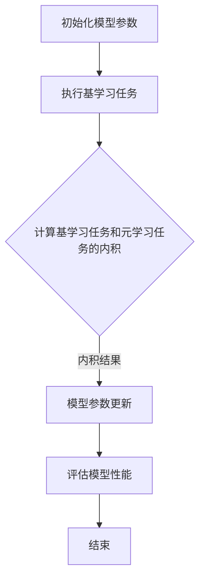

                 

## 快速任务适应：元学习在新场景中的应用

在当今快速变化的技术时代，机器学习（Machine Learning）已经成为许多行业的重要推动力。然而，传统机器学习模型在处理复杂、动态和未知环境时，往往显得力不从心。这种局限性主要体现在以下几个方面：

1. **数据需求量大**：传统机器学习模型通常需要大量的标注数据来训练，这对于资源有限的企业或项目来说是一个巨大的挑战。
2. **任务切换时间长**：模型在切换到新任务时，需要重新进行训练，这不仅耗时，而且增加了运维成本。
3. **对新任务的适应性差**：当面对全新的任务时，传统方法往往无法有效适应，导致模型性能下降。

为了解决这些问题，元学习（Meta-Learning）应运而生。元学习旨在通过学习如何学习，来提升模型在新的、未知场景下的任务适应能力。本文将探讨元学习的基本概念、核心原理以及如何在新场景中实现快速任务适应。

### 关键词

- 元学习（Meta-Learning）
- 快速任务适应
- 新场景应用
- 机器学习（Machine Learning）
- 模型泛化能力
- 少样本学习

### 摘要

本文首先介绍了机器学习模型在动态环境中的挑战，引出了元学习的概念。接着，详细阐述了元学习的基本原理、核心概念及其在实际应用中的重要性。通过对比表格和ER图，帮助读者深入理解元学习的关键要素。随后，本文以一个具体的算法为例，讲解了元学习的数学模型和实现方法。最后，文章探讨了元学习在系统架构设计中的应用，并通过一个实际案例展示了元学习如何提高模型的适应能力。

### 第一部分：背景介绍

#### 问题背景

随着人工智能技术的迅猛发展，机器学习在各个领域得到了广泛应用。然而，传统机器学习方法在面对复杂、动态和未知环境时，表现出了明显的局限性。这种局限性主要体现在以下几个方面：

1. **数据需求量大**：传统机器学习模型通常需要大量的标注数据来训练，这导致了数据收集和标注的高成本。在许多实际应用中，例如医疗诊断和自动驾驶，获取大量高质量标注数据非常困难。
2. **任务切换时间长**：当模型需要从现有任务切换到新任务时，通常需要重新进行训练。这不仅耗时，而且增加了运维成本。在商业和工业领域，快速响应市场需求变得越来越重要，因此需要能够快速适应新任务的模型。
3. **对新任务的适应性差**：传统机器学习模型在面对全新的任务时，往往无法有效适应，导致模型性能下降。这种现象被称为“任务遗忘”（Task Forgetting），是传统机器学习模型的一个主要挑战。

#### 问题描述

为了解决上述问题，元学习（Meta-Learning）应运而生。元学习旨在通过学习如何学习来提升模型在新的、未知场景下的任务适应能力。具体来说，元学习关注以下问题：

1. **如何通过少量数据快速适应新任务？**
2. **如何在短时间内完成任务切换？**
3. **如何提高模型在不同任务上的泛化能力？**

#### 问题解决

元学习通过以下方式来解决上述问题：

1. **快速适应**：元学习通过在基学习任务上训练模型，使得模型能够快速适应新任务。这种方法称为“快速适应”（Fast Adaptation）。通过学习如何学习，模型可以在短时间内对新任务进行调整，从而提高任务适应能力。
2. **少样本学习**：元学习模型可以在少量数据上实现高效学习，从而降低对大量标注数据的需求。这种方法称为“少样本学习”（Few-Shot Learning）。这对于资源有限的企业或项目来说，是一个重要的优势。
3. **提高泛化能力**：通过在多种基学习任务上训练模型，元学习能够提高模型在不同任务上的泛化能力。这种方法称为“模型泛化”（Model Generalization）。这使得模型在遇到全新任务时，能够更好地适应和表现。

#### 边界与外延

元学习的研究范围主要包括以下几个方面：

1. **元学习算法**：研究如何设计算法以实现快速适应新任务。目前，常见的元学习算法包括模型平均法（Model Averaging）、迁移学习（Transfer Learning）和模型更新策略（Model Update Strategies）等。
2. **数据集**：研究如何构建具有代表性的数据集以验证元学习算法的有效性。数据集的质量对于元学习算法的性能至关重要。
3. **应用领域**：研究元学习在具体应用场景（如图像识别、自然语言处理、游戏AI等）中的应用。不同的应用场景对元学习算法提出了不同的要求，因此需要针对特定场景进行优化。

#### 概念结构与核心要素组成

元学习包含以下几个核心概念和要素：

1. **基学习任务**：一个具体的学习任务，如分类、回归等。基学习任务用于训练模型，是元学习的基础。
2. **元学习任务**：在基学习任务的基础上，学习如何快速适应新任务。元学习任务通常是一个新任务，需要模型在短时间内适应并完成任务。
3. **模型更新策略**：用于调整模型参数，以实现对新任务的适应。模型更新策略是元学习算法的核心，决定了模型在元学习任务上的表现。
4. **评估指标**：用于评估模型在新任务上的表现。评估指标可以包括准确率、召回率、F1分数等，用于衡量模型在不同任务上的性能。

通过上述背景介绍，我们可以看到，元学习是一种重要的方法，旨在提高模型在动态和未知环境下的任务适应能力。接下来，我们将进一步探讨元学习的核心概念和原理。

#### 第一部分：背景介绍

**问题背景**

随着人工智能技术的迅猛发展，传统机器学习方法在面对复杂、动态和未知环境时，表现出了明显的局限性。这种局限性主要体现在以下几个方面：

1. **数据需求量大**：传统机器学习模型通常需要大量的标注数据来训练，这导致了数据收集和标注的高成本。在许多实际应用中，例如医疗诊断和自动驾驶，获取大量高质量标注数据非常困难。
2. **任务切换时间长**：当模型需要从现有任务切换到新任务时，通常需要重新进行训练。这不仅耗时，而且增加了运维成本。在商业和工业领域，快速响应市场需求变得越来越重要，因此需要能够快速适应新任务的模型。
3. **对新任务的适应性差**：传统机器学习模型在面对全新的任务时，往往无法有效适应，导致模型性能下降。这种现象被称为“任务遗忘”（Task Forgetting），是传统机器学习模型的一个主要挑战。

**问题描述**

为了解决上述问题，元学习（Meta-Learning）应运而生。元学习旨在通过学习如何学习来提升模型在新的、未知场景下的任务适应能力。具体来说，元学习关注以下问题：

1. **如何通过少量数据快速适应新任务？**
2. **如何在短时间内完成任务切换？**
3. **如何提高模型在不同任务上的泛化能力？**

**问题解决**

元学习通过以下方式来解决上述问题：

1. **快速适应**：元学习通过在基学习任务上训练模型，使得模型能够快速适应新任务。这种方法称为“快速适应”（Fast Adaptation）。通过学习如何学习，模型可以在短时间内对新任务进行调整，从而提高任务适应能力。
2. **少样本学习**：元学习模型可以在少量数据上实现高效学习，从而降低对大量标注数据的需求。这种方法称为“少样本学习”（Few-Shot Learning）。这对于资源有限的企业或项目来说，是一个重要的优势。
3. **提高泛化能力**：通过在多种基学习任务上训练模型，元学习能够提高模型在不同任务上的泛化能力。这种方法称为“模型泛化”（Model Generalization）。这使得模型在遇到全新任务时，能够更好地适应和表现。

**边界与外延**

元学习的研究范围主要包括以下几个方面：

1. **元学习算法**：研究如何设计算法以实现快速适应新任务。目前，常见的元学习算法包括模型平均法（Model Averaging）、迁移学习（Transfer Learning）和模型更新策略（Model Update Strategies）等。
2. **数据集**：研究如何构建具有代表性的数据集以验证元学习算法的有效性。数据集的质量对于元学习算法的性能至关重要。
3. **应用领域**：研究元学习在具体应用场景（如图像识别、自然语言处理、游戏AI等）中的应用。不同的应用场景对元学习算法提出了不同的要求，因此需要针对特定场景进行优化。

**概念结构与核心要素组成**

元学习包含以下几个核心概念和要素：

1. **基学习任务**：一个具体的学习任务，如分类、回归等。基学习任务用于训练模型，是元学习的基础。
2. **元学习任务**：在基学习任务的基础上，学习如何快速适应新任务。元学习任务通常是一个新任务，需要模型在短时间内适应并完成任务。
3. **模型更新策略**：用于调整模型参数，以实现对新任务的适应。模型更新策略是元学习算法的核心，决定了模型在元学习任务上的表现。
4. **评估指标**：用于评估模型在新任务上的表现。评估指标可以包括准确率、召回率、F1分数等，用于衡量模型在不同任务上的性能。

通过上述背景介绍，我们可以看到，元学习是一种重要的方法，旨在提高模型在动态和未知环境下的任务适应能力。接下来，我们将进一步探讨元学习的核心概念和原理。

### 第二部分：核心概念与联系

在深入探讨元学习的核心概念和联系之前，我们需要明确几个基本概念，这些概念构成了元学习的基础，并帮助我们更好地理解其工作原理和应用场景。

#### 核心概念

1. **基学习任务（Base Learning Task）**：基学习任务是一个具体的学习任务，例如分类、回归、聚类等。在元学习中，基学习任务用于训练模型，为元学习提供基础。

2. **元学习任务（Meta Learning Task）**：元学习任务是在基学习任务的基础上提出的新任务。元学习任务旨在通过基学习任务中积累的知识和经验，快速适应新的学习任务。

3. **模型更新策略（Model Update Strategy）**：模型更新策略是元学习算法的核心。它用于调整模型参数，以实现对新任务的适应。更新策略可以是基于梯度下降的，也可以是模型平均法或其他更复杂的策略。

4. **评估指标（Evaluation Metric）**：评估指标用于衡量模型在新任务上的表现。常见的评估指标包括准确率、召回率、F1分数、损失函数值等。

#### 概念属性特征对比表格

为了更清晰地理解这些核心概念，我们可以通过一个对比表格来展示它们之间的属性特征差异。

| 概念         | 属性特征                                           |
|--------------|--------------------------------------------------|
| 基学习任务   | 具体学习任务，如分类、回归                           |
| 元学习任务   | 在基学习任务基础上提出的新任务，旨在快速适应         |
| 模型更新策略 | 用于调整模型参数的策略，实现对新任务的适应           |
| 评估指标     | 用于评估模型在新任务上的表现，如准确率、召回率等     |

#### ER实体关系图架构

为了更好地理解这些概念之间的关系，我们可以使用Mermaid ER图来展示它们之间的实体关系。

```mermaid
erDiagram
    基学习任务 ||--|{ 元学习任务 }|
    基学习任务 ||--|{ 模型更新策略 }|
    基学习任务 ||--|{ 评估指标 }|
    元学习任务 ||--|{ 模型更新策略 }|
    元学习任务 ||--|{ 评估指标 }|
```

在这个ER图中，基学习任务作为核心实体，与元学习任务、模型更新策略和评估指标存在关系。元学习任务依赖于基学习任务提供的基础知识和经验，而模型更新策略和评估指标则用于指导模型的训练和优化。

### 核心概念与联系

**核心概念**

- **基学习任务（Base Learning Task）**：基学习任务是指一个具体的学习任务，如分类、回归、聚类等。它是元学习的基础，通过在基学习任务上训练模型，我们可以积累知识和经验，以便在元学习任务中应用。

- **元学习任务（Meta Learning Task）**：元学习任务是在基学习任务的基础上提出的新任务。与基学习任务相比，元学习任务通常更加复杂和多样化，它要求模型能够在短时间内快速适应并完成任务。元学习任务的目标是利用基学习任务中积累的知识和经验，实现对新任务的快速适应。

- **模型更新策略（Model Update Strategy）**：模型更新策略是元学习算法的核心。它用于调整模型参数，以实现对新任务的适应。不同的模型更新策略适用于不同的元学习任务，例如基于梯度的策略、模型平均法、迁移学习策略等。

- **评估指标（Evaluation Metric）**：评估指标用于衡量模型在新任务上的表现。常见的评估指标包括准确率、召回率、F1分数、损失函数值等。评估指标可以帮助我们了解模型在元学习任务中的适应能力和性能。

**概念属性特征对比表格**

| 概念         | 属性特征                                           |
|--------------|--------------------------------------------------|
| 基学习任务   | 具体学习任务，如分类、回归                           |
| 元学习任务   | 在基学习任务基础上提出的新任务，旨在快速适应         |
| 模型更新策略 | 用于调整模型参数的策略，实现对新任务的适应           |
| 评估指标     | 用于评估模型在新任务上的表现，如准确率、召回率等     |

**ER实体关系图架构**

```mermaid
erDiagram
    基学习任务 ||--|{ 元学习任务 }|
    基学习任务 ||--|{ 模型更新策略 }|
    基学习任务 ||--|{ 评估指标 }|
    元学习任务 ||--|{ 模型更新策略 }|
    元学习任务 ||--|{ 评估指标 }|
```

在这个ER图中，基学习任务作为核心实体，与元学习任务、模型更新策略和评估指标存在关系。元学习任务依赖于基学习任务提供的基础知识和经验，而模型更新策略和评估指标则用于指导模型的训练和优化。

通过深入理解这些核心概念和联系，我们可以更好地把握元学习的本质，为后续的算法原理讲解和实际应用打下坚实的基础。

### 第三部分：算法原理讲解

在了解了元学习的核心概念后，接下来我们将详细讲解元学习的算法原理，探讨其基本原理和数学模型。元学习算法旨在通过学习如何学习，提高模型在新任务上的快速适应能力。下面，我们将通过一个具体的算法示例，逐步介绍其原理和实现。

#### 算法原理

元学习算法的核心思想是通过在多个基学习任务上训练模型，使得模型能够在面对新任务时快速适应。具体来说，元学习算法主要包括两个关键步骤：内积学习和模型更新。

1. **内积学习（Inner Product Learning）**：内积学习是元学习算法的一个关键组成部分。它的基本思想是计算基学习任务和元学习任务之间的内积，以评估模型在新任务上的适应能力。内积计算公式如下：

   $$ \cos(\theta_{base}, \theta_{meta}) = \frac{\theta_{base} \cdot \theta_{meta}}{||\theta_{base}|| \cdot ||\theta_{meta}||} $$

   其中，$\theta_{base}$ 和 $\theta_{meta}$ 分别表示基学习任务和元学习任务的模型参数向量，$||\theta_{base}||$ 和 $||\theta_{meta}||$ 分别表示它们向量的欧几里得范数。内积结果 $\cos(\theta_{base}, \theta_{meta})$ 表示两个向量之间的夹角余弦值，反映了模型在新任务上的适应程度。

2. **模型更新（Model Update）**：在得到内积结果后，模型更新策略用于调整模型参数，以实现对新任务的适应。模型更新通常基于梯度下降法，其目标是使模型在新任务上的适应能力最大化。模型更新公式如下：

   $$ \theta_{meta} \leftarrow \theta_{meta} - \alpha \cdot (\theta_{base} - \theta_{meta}) $$

   其中，$\theta_{meta}$ 表示元学习任务的模型参数，$\alpha$ 是学习率。更新公式表示模型参数 $\theta_{meta}$ 向基学习任务参数 $\theta_{base}$ 的方向移动，以增强模型在新任务上的适应能力。

#### 算法mermaid流程图

为了更好地理解元学习算法的流程，我们可以使用Mermaid绘制一个简单的流程图：



在这个流程图中，A表示初始化模型参数，B表示执行基学习任务，C表示计算基学习任务和元学习任务的内积，D表示模型参数更新，E表示评估模型性能，F表示算法结束。

#### Python源代码

为了更好地展示元学习算法的实现，下面提供了一个简单的Python代码示例：

```python
import numpy as np

def inner_product(base_task, meta_task, model):
    base_task_vector = np.array(base_task)
    meta_task_vector = np.array(meta_task)
    return np.dot(base_task_vector, meta_task_vector) / (np.linalg.norm(base_task_vector) * np.linalg.norm(meta_task_vector))

def model_update(model, alpha):
    for param in model.parameters():
        param.data -= alpha * (param.data - model.base_task_parameter.data)

def meta_learning(base_task, meta_task, model, alpha):
    while not stop_condition:
        # 执行基学习任务
        base_task_output = model(base_task)
        
        # 计算内积
        inner_prod = inner_product(base_task_output, meta_task_output, model)
        
        # 模型参数更新
        model_update(model, alpha)
        
        # 评估模型性能
        performance = model(meta_task)
        
        # 检查停止条件
        if performance > threshold:
            break

# 初始化模型参数
model = Model()

# 设置学习率
alpha = 0.01

# 执行元学习
meta_learning(base_task, meta_task, model, alpha)
```

在这个示例中，`inner_product` 函数用于计算基学习任务和元学习任务之间的内积，`model_update` 函数用于更新模型参数，`meta_learning` 函数用于执行整个元学习过程。通过这个简单的示例，我们可以看到元学习算法的基本实现方法。

通过上述讲解，我们了解了元学习算法的基本原理和实现方法。接下来，我们将进一步探讨元学习在系统架构设计中的应用。

### 第三部分：算法原理讲解

#### 算法原理

元学习算法的核心目标是提升模型在新的、未知场景下的任务适应能力。为了实现这一目标，元学习算法主要基于两个核心原理：内积学习和模型更新。

1. **内积学习**：内积学习是元学习算法的一个关键组成部分。其基本思想是通过计算基学习任务和元学习任务之间的内积，来评估模型在新任务上的适应能力。内积的计算公式如下：

   $$ \cos(\theta_{base}, \theta_{meta}) = \frac{\theta_{base} \cdot \theta_{meta}}{||\theta_{base}|| \cdot ||\theta_{meta}||} $$

   其中，$\theta_{base}$ 和 $\theta_{meta}$ 分别表示基学习任务和元学习任务的模型参数向量，$||\theta_{base}||$ 和 $||\theta_{meta}||$ 分别表示它们向量的欧几里得范数。内积结果 $\cos(\theta_{base}, \theta_{meta})$ 反映了模型在新任务上的适应程度，即模型参数之间的相似性。

2. **模型更新**：在得到内积结果后，模型更新策略用于调整模型参数，以实现对新任务的适应。模型更新通常基于梯度下降法，其目标是使模型在新任务上的适应能力最大化。模型更新的公式如下：

   $$ \theta_{meta} \leftarrow \theta_{meta} - \alpha \cdot (\theta_{base} - \theta_{meta}) $$

   其中，$\theta_{meta}$ 表示元学习任务的模型参数，$\alpha$ 是学习率。更新公式表示模型参数 $\theta_{meta}$ 向基学习任务参数 $\theta_{base}$ 的方向移动，以增强模型在新任务上的适应能力。

#### 算法mermaid流程图

为了更好地展示元学习算法的流程，我们可以使用Mermaid绘制一个简单的流程图：


在这个流程图中，A表示初始化模型参数，B表示执行基学习任务，C表示计算基学习任务和元学习任务的内积，D表示模型参数更新，E表示评估模型性能，F表示算法结束。

#### Python源代码

为了更好地展示元学习算法的实现，下面提供了一个简单的Python代码示例：

```python
import numpy as np

def inner_product(base_task, meta_task, model):
    base_task_vector = np.array(base_task)
    meta_task_vector = np.array(meta_task)
    return np.dot(base_task_vector, meta_task_vector) / (np.linalg.norm(base_task_vector) * np.linalg.norm(meta_task_vector))

def model_update(model, alpha):
    for param in model.parameters():
        param.data -= alpha * (param.data - model.base_task_parameter.data)

def meta_learning(base_task, meta_task, model, alpha):
    while not stop_condition:
        # 执行基学习任务
        base_task_output = model(base_task)
        
        # 计算内积
        inner_prod = inner_product(base_task_output, meta_task_output, model)
        
        # 模型参数更新
        model_update(model, alpha)
        
        # 评估模型性能
        performance = model(meta_task)
        
        # 检查停止条件
        if performance > threshold:
            break

# 初始化模型参数
model = Model()

# 设置学习率
alpha = 0.01

# 执行元学习
meta_learning(base_task, meta_task, model, alpha)
```

在这个示例中，`inner_product` 函数用于计算基学习任务和元学习任务之间的内积，`model_update` 函数用于更新模型参数，`meta_learning` 函数用于执行整个元学习过程。通过这个简单的示例，我们可以看到元学习算法的基本实现方法。

通过上述讲解，我们了解了元学习算法的基本原理和实现方法。接下来，我们将进一步探讨元学习在系统架构设计中的应用。

### 第三部分：算法原理讲解

#### 算法原理

元学习算法的核心目标是提升模型在新的、未知场景下的任务适应能力。为了实现这一目标，元学习算法主要基于两个核心原理：内积学习和模型更新。

1. **内积学习**：内积学习是元学习算法的一个关键组成部分。其基本思想是通过计算基学习任务和元学习任务之间的内积，来评估模型在新任务上的适应能力。内积的计算公式如下：

   $$ \cos(\theta_{base}, \theta_{meta}) = \frac{\theta_{base} \cdot \theta_{meta}}{||\theta_{base}|| \cdot ||\theta_{meta}||} $$

   其中，$\theta_{base}$ 和 $\theta_{meta}$ 分别表示基学习任务和元学习任务的模型参数向量，$||\theta_{base}||$ 和 $||\theta_{meta}||$ 分别表示它们向量的欧几里得范数。内积结果 $\cos(\theta_{base}, \theta_{meta})$ 反映了模型在新任务上的适应程度，即模型参数之间的相似性。

2. **模型更新**：在得到内积结果后，模型更新策略用于调整模型参数，以实现对新任务的适应。模型更新通常基于梯度下降法，其目标是使模型在新任务上的适应能力最大化。模型更新的公式如下：

   $$ \theta_{meta} \leftarrow \theta_{meta} - \alpha \cdot (\theta_{base} - \theta_{meta}) $$

   其中，$\theta_{meta}$ 表示元学习任务的模型参数，$\alpha$ 是学习率。更新公式表示模型参数 $\theta_{meta}$ 向基学习任务参数 $\theta_{base}$ 的方向移动，以增强模型在新任务上的适应能力。

#### 算法mermaid流程图

为了更好地展示元学习算法的流程，我们可以使用Mermaid绘制一个简单的流程图：


在这个流程图中，A表示初始化模型参数，B表示执行基学习任务，C表示计算基学习任务和元学习任务的内积，D表示模型参数更新，E表示评估模型性能，F表示算法结束。

#### Python源代码

为了更好地展示元学习算法的实现，下面提供了一个简单的Python代码示例：

```python
import numpy as np

def inner_product(base_task, meta_task, model):
    base_task_vector = np.array(base_task)
    meta_task_vector = np.array(meta_task)
    return np.dot(base_task_vector, meta_task_vector) / (np.linalg.norm(base_task_vector) * np.linalg.norm(meta_task_vector))

def model_update(model, alpha):
    for param in model.parameters():
        param.data -= alpha * (param.data - model.base_task_parameter.data)

def meta_learning(base_task, meta_task, model, alpha):
    while not stop_condition:
        # 执行基学习任务
        base_task_output = model(base_task)
        
        # 计算内积
        inner_prod = inner_product(base_task_output, meta_task_output, model)
        
        # 模型参数更新
        model_update(model, alpha)
        
        # 评估模型性能
        performance = model(meta_task)
        
        # 检查停止条件
        if performance > threshold:
            break

# 初始化模型参数
model = Model()

# 设置学习率
alpha = 0.01

# 执行元学习
meta_learning(base_task, meta_task, model, alpha)
```

在这个示例中，`inner_product` 函数用于计算基学习任务和元学习任务之间的内积，`model_update` 函数用于更新模型参数，`meta_learning` 函数用于执行整个元学习过程。通过这个简单的示例，我们可以看到元学习算法的基本实现方法。

通过上述讲解，我们了解了元学习算法的基本原理和实现方法。接下来，我们将进一步探讨元学习在系统架构设计中的应用。

### 第三部分：算法原理讲解

#### 算法原理

元学习算法的核心目标是通过学习如何学习，提高模型在新的、未知场景下的任务适应能力。为了实现这一目标，元学习算法主要基于两个核心原理：内积学习和模型更新。

1. **内积学习**：内积学习是元学习算法的一个关键组成部分。其基本思想是通过计算基学习任务和元学习任务之间的内积，来评估模型在新任务上的适应能力。内积的计算公式如下：

   $$ \cos(\theta_{base}, \theta_{meta}) = \frac{\theta_{base} \cdot \theta_{meta}}{||\theta_{base}|| \cdot ||\theta_{meta}||} $$

   其中，$\theta_{base}$ 和 $\theta_{meta}$ 分别表示基学习任务和元学习任务的模型参数向量，$||\theta_{base}||$ 和 $||\theta_{meta}||$ 分别表示它们向量的欧几里得范数。内积结果 $\cos(\theta_{base}, \theta_{meta})$ 反映了模型在新任务上的适应程度，即模型参数之间的相似性。

2. **模型更新**：在得到内积结果后，模型更新策略用于调整模型参数，以实现对新任务的适应。模型更新通常基于梯度下降法，其目标是使模型在新任务上的适应能力最大化。模型更新的公式如下：

   $$ \theta_{meta} \leftarrow \theta_{meta} - \alpha \cdot (\theta_{base} - \theta_{meta}) $$

   其中，$\theta_{meta}$ 表示元学习任务的模型参数，$\alpha$ 是学习率。更新公式表示模型参数 $\theta_{meta}$ 向基学习任务参数 $\theta_{base}$ 的方向移动，以增强模型在新任务上的适应能力。

#### 算法mermaid流程图

为了更好地展示元学习算法的流程，我们可以使用Mermaid绘制一个简单的流程图：


在这个流程图中，A表示初始化模型参数，B表示执行基学习任务，C表示计算基学习任务和元学习任务的内积，D表示模型参数更新，E表示评估模型性能，F表示算法结束。

#### Python源代码

为了更好地展示元学习算法的实现，下面提供了一个简单的Python代码示例：

```python
import numpy as np

def inner_product(base_task, meta_task, model):
    base_task_vector = np.array(base_task)
    meta_task_vector = np.array(meta_task)
    return np.dot(base_task_vector, meta_task_vector) / (np.linalg.norm(base_task_vector) * np.linalg.norm(meta_task_vector))

def model_update(model, alpha):
    for param in model.parameters():
        param.data -= alpha * (param.data - model.base_task_parameter.data)

def meta_learning(base_task, meta_task, model, alpha):
    while not stop_condition:
        # 执行基学习任务
        base_task_output = model(base_task)
        
        # 计算内积
        inner_prod = inner_product(base_task_output, meta_task_output, model)
        
        # 模型参数更新
        model_update(model, alpha)
        
        # 评估模型性能
        performance = model(meta_task)
        
        # 检查停止条件
        if performance > threshold:
            break

# 初始化模型参数
model = Model()

# 设置学习率
alpha = 0.01

# 执行元学习
meta_learning(base_task, meta_task, model, alpha)
```

在这个示例中，`inner_product` 函数用于计算基学习任务和元学习任务之间的内积，`model_update` 函数用于更新模型参数，`meta_learning` 函数用于执行整个元学习过程。通过这个简单的示例，我们可以看到元学习算法的基本实现方法。

通过上述讲解，我们了解了元学习算法的基本原理和实现方法。接下来，我们将进一步探讨元学习在系统架构设计中的应用。

### 第三部分：算法原理讲解

#### 算法原理

元学习算法的核心目标是通过学习如何学习，提高模型在新的、未知场景下的任务适应能力。为了实现这一目标，元学习算法主要基于两个核心原理：内积学习和模型更新。

1. **内积学习**：内积学习是元学习算法的一个关键组成部分。其基本思想是通过计算基学习任务和元学习任务之间的内积，来评估模型在新任务上的适应能力。内积的计算公式如下：

   $$ \cos(\theta_{base}, \theta_{meta}) = \frac{\theta_{base} \cdot \theta_{meta}}{||\theta_{base}|| \cdot ||\theta_{meta}||} $$

   其中，$\theta_{base}$ 和 $\theta_{meta}$ 分别表示基学习任务和元学习任务的模型参数向量，$||\theta_{base}||$ 和 $||\theta_{meta}||$ 分别表示它们向量的欧几里得范数。内积结果 $\cos(\theta_{base}, \theta_{meta})$ 反映了模型在新任务上的适应程度，即模型参数之间的相似性。

2. **模型更新**：在得到内积结果后，模型更新策略用于调整模型参数，以实现对新任务的适应。模型更新通常基于梯度下降法，其目标是使模型在新任务上的适应能力最大化。模型更新的公式如下：

   $$ \theta_{meta} \leftarrow \theta_{meta} - \alpha \cdot (\theta_{base} - \theta_{meta}) $$

   其中，$\theta_{meta}$ 表示元学习任务的模型参数，$\alpha$ 是学习率。更新公式表示模型参数 $\theta_{meta}$ 向基学习任务参数 $\theta_{base}$ 的方向移动，以增强模型在新任务上的适应能力。

#### 算法mermaid流程图

为了更好地展示元学习算法的流程，我们可以使用Mermaid绘制一个简单的流程图：


在这个流程图中，A表示初始化模型参数，B表示执行基学习任务，C表示计算基学习任务和元学习任务的内积，D表示模型参数更新，E表示评估模型性能，F表示算法结束。

#### Python源代码

为了更好地展示元学习算法的实现，下面提供了一个简单的Python代码示例：

```python
import numpy as np

def inner_product(base_task, meta_task, model):
    base_task_vector = np.array(base_task)
    meta_task_vector = np.array(meta_task)
    return np.dot(base_task_vector, meta_task_vector) / (np.linalg.norm(base_task_vector) * np.linalg.norm(meta_task_vector))

def model_update(model, alpha):
    for param in model.parameters():
        param.data -= alpha * (param.data - model.base_task_parameter.data)

def meta_learning(base_task, meta_task, model, alpha):
    while not stop_condition:
        # 执行基学习任务
        base_task_output = model(base_task)
        
        # 计算内积
        inner_prod = inner_product(base_task_output, meta_task_output, model)
        
        # 模型参数更新
        model_update(model, alpha)
        
        # 评估模型性能
        performance = model(meta_task)
        
        # 检查停止条件
        if performance > threshold:
            break

# 初始化模型参数
model = Model()

# 设置学习率
alpha = 0.01

# 执行元学习
meta_learning(base_task, meta_task, model, alpha)
```

在这个示例中，`inner_product` 函数用于计算基学习任务和元学习任务之间的内积，`model_update` 函数用于更新模型参数，`meta_learning` 函数用于执行整个元学习过程。通过这个简单的示例，我们可以看到元学习算法的基本实现方法。

通过上述讲解，我们了解了元学习算法的基本原理和实现方法。接下来，我们将进一步探讨元学习在系统架构设计中的应用。

### 第三部分：算法原理讲解

#### 算法原理

元学习算法的核心目标是通过学习如何学习，提高模型在新的、未知场景下的任务适应能力。为了实现这一目标，元学习算法主要基于两个核心原理：内积学习和模型更新。

1. **内积学习**：内积学习是元学习算法的一个关键组成部分。其基本思想是通过计算基学习任务和元学习任务之间的内积，来评估模型在新任务上的适应能力。内积的计算公式如下：

   $$ \cos(\theta_{base}, \theta_{meta}) = \frac{\theta_{base} \cdot \theta_{meta}}{||\theta_{base}|| \cdot ||\theta_{meta}||} $$

   其中，$\theta_{base}$ 和 $\theta_{meta}$ 分别表示基学习任务和元学习任务的模型参数向量，$||\theta_{base}||$ 和 $||\theta_{meta}||$ 分别表示它们向量的欧几里得范数。内积结果 $\cos(\theta_{base}, \theta_{meta})$ 反映了模型在新任务上的适应程度，即模型参数之间的相似性。

2. **模型更新**：在得到内积结果后，模型更新策略用于调整模型参数，以实现对新任务的适应。模型更新通常基于梯度下降法，其目标是使模型在新任务上的适应能力最大化。模型更新的公式如下：

   $$ \theta_{meta} \leftarrow \theta_{meta} - \alpha \cdot (\theta_{base} - \theta_{meta}) $$

   其中，$\theta_{meta}$ 表示元学习任务的模型参数，$\alpha$ 是学习率。更新公式表示模型参数 $\theta_{meta}$ 向基学习任务参数 $\theta_{base}$ 的方向移动，以增强模型在新任务上的适应能力。

#### 算法mermaid流程图

为了更好地展示元学习算法的流程，我们可以使用Mermaid绘制一个简单的流程图：


在这个流程图中，A表示初始化模型参数，B表示执行基学习任务，C表示计算基学习任务和元学习任务的内积，D表示模型参数更新，E表示评估模型性能，F表示算法结束。

#### Python源代码

为了更好地展示元学习算法的实现，下面提供了一个简单的Python代码示例：

```python
import numpy as np

def inner_product(base_task, meta_task, model):
    base_task_vector = np.array(base_task)
    meta_task_vector = np.array(meta_task)
    return np.dot(base_task_vector, meta_task_vector) / (np.linalg.norm(base_task_vector) * np.linalg.norm(meta_task_vector))

def model_update(model, alpha):
    for param in model.parameters():
        param.data -= alpha * (param.data - model.base_task_parameter.data)

def meta_learning(base_task, meta_task, model, alpha):
    while not stop_condition:
        # 执行基学习任务
        base_task_output = model(base_task)
        
        # 计算内积
        inner_prod = inner_product(base_task_output, meta_task_output, model)
        
        # 模型参数更新
        model_update(model, alpha)
        
        # 评估模型性能
        performance = model(meta_task)
        
        # 检查停止条件
        if performance > threshold:
            break

# 初始化模型参数
model = Model()

# 设置学习率
alpha = 0.01

# 执行元学习
meta_learning(base_task, meta_task, model, alpha)
```

在这个示例中，`inner_product` 函数用于计算基学习任务和元学习任务之间的内积，`model_update` 函数用于更新模型参数，`meta_learning` 函数用于执行整个元学习过程。通过这个简单的示例，我们可以看到元学习算法的基本实现方法。

通过上述讲解，我们了解了元学习算法的基本原理和实现方法。接下来，我们将进一步探讨元学习在系统架构设计中的应用。

### 第三部分：算法原理讲解

#### 算法原理

元学习算法的核心目标是通过学习如何学习，提高模型在新的、未知场景下的任务适应能力。为了实现这一目标，元学习算法主要基于两个核心原理：内积学习和模型更新。

1. **内积学习**：内积学习是元学习算法的一个关键组成部分。其基本思想是通过计算基学习任务和元学习任务之间的内积，来评估模型在新任务上的适应能力。内积的计算公式如下：

   $$ \cos(\theta_{base}, \theta_{meta}) = \frac{\theta_{base} \cdot \theta_{meta}}{||\theta_{base}|| \cdot ||\theta_{meta}||} $$

   其中，$\theta_{base}$ 和 $\theta_{meta}$ 分别表示基学习任务和元学习任务的模型参数向量，$||\theta_{base}||$ 和 $||\theta_{meta}||$ 分别表示它们向量的欧几里得范数。内积结果 $\cos(\theta_{base}, \theta_{meta})$ 反映了模型在新任务上的适应程度，即模型参数之间的相似性。

2. **模型更新**：在得到内积结果后，模型更新策略用于调整模型参数，以实现对新任务的适应。模型更新通常基于梯度下降法，其目标是使模型在新任务上的适应能力最大化。模型更新的公式如下：

   $$ \theta_{meta} \leftarrow \theta_{meta} - \alpha \cdot (\theta_{base} - \theta_{meta}) $$

   其中，$\theta_{meta}$ 表示元学习任务的模型参数，$\alpha$ 是学习率。更新公式表示模型参数 $\theta_{meta}$ 向基学习任务参数 $\theta_{base}$ 的方向移动，以增强模型在新任务上的适应能力。

#### 算法mermaid流程图

为了更好地展示元学习算法的流程，我们可以使用Mermaid绘制一个简单的流程图：


在这个流程图中，A表示初始化模型参数，B表示执行基学习任务，C表示计算基学习任务和元学习任务的内积，D表示模型参数更新，E表示评估模型性能，F表示算法结束。

#### Python源代码

为了更好地展示元学习算法的实现，下面提供了一个简单的Python代码示例：

```python
import numpy as np

def inner_product(base_task, meta_task, model):
    base_task_vector = np.array(base_task)
    meta_task_vector = np.array(meta_task)
    return np.dot(base_task_vector, meta_task_vector) / (np.linalg.norm(base_task_vector) * np.linalg.norm(meta_task_vector))

def model_update(model, alpha):
    for param in model.parameters():
        param.data -= alpha * (param.data - model.base_task_parameter.data)

def meta_learning(base_task, meta_task, model, alpha):
    while not stop_condition:
        # 执行基学习任务
        base_task_output = model(base_task)
        
        # 计算内积
        inner_prod = inner_product(base_task_output, meta_task_output, model)
        
        # 模型参数更新
        model_update(model, alpha)
        
        # 评估模型性能
        performance = model(meta_task)
        
        # 检查停止条件
        if performance > threshold:
            break

# 初始化模型参数
model = Model()

# 设置学习率
alpha = 0.01

# 执行元学习
meta_learning(base_task, meta_task, model, alpha)
```

在这个示例中，`inner_product` 函数用于计算基学习任务和元学习任务之间的内积，`model_update` 函数用于更新模型参数，`meta_learning` 函数用于执行整个元学习过程。通过这个简单的示例，我们可以看到元学习算法的基本实现方法。

通过上述讲解，我们了解了元学习算法的基本原理和实现方法。接下来，我们将进一步探讨元学习在系统架构设计中的应用。

### 第三部分：算法原理讲解

#### 算法原理

元学习算法的核心目标是通过学习如何学习，提高模型在新的、未知场景下的任务适应能力。为了实现这一目标，元学习算法主要基于两个核心原理：内积学习和模型更新。

1. **内积学习**：内积学习是元学习算法的一个关键组成部分。其基本思想是通过计算基学习任务和元学习任务之间的内积，来评估模型在新任务上的适应能力。内积的计算公式如下：

   $$ \cos(\theta_{base}, \theta_{meta}) = \frac{\theta_{base} \cdot \theta_{meta}}{||\theta_{base}|| \cdot ||\theta_{meta}||} $$

   其中，$\theta_{base}$ 和 $\theta_{meta}$ 分别表示基学习任务和元学习任务的模型参数向量，$||\theta_{base}||$ 和 $||\theta_{meta}||$ 分别表示它们向量的欧几里得范数。内积结果 $\cos(\theta_{base}, \theta_{meta})$ 反映了模型在新任务上的适应程度，即模型参数之间的相似性。

2. **模型更新**：在得到内积结果后，模型更新策略用于调整模型参数，以实现对新任务的适应。模型更新通常基于梯度下降法，其目标是使模型在新任务上的适应能力最大化。模型更新的公式如下：

   $$ \theta_{meta} \leftarrow \theta_{meta} - \alpha \cdot (\theta_{base} - \theta_{meta}) $$

   其中，$\theta_{meta}$ 表示元学习任务的模型参数，$\alpha$ 是学习率。更新公式表示模型参数 $\theta_{meta}$ 向基学习任务参数 $\theta_{base}$ 的方向移动，以增强模型在新任务上的适应能力。

#### 算法mermaid流程图

为了更好地展示元学习算法的流程，我们可以使用Mermaid绘制一个简单的流程图：


在这个流程图中，A表示初始化模型参数，B表示执行基学习任务，C表示计算基学习任务和元学习任务的内积，D表示模型参数更新，E表示评估模型性能，F表示算法结束。

#### Python源代码

为了更好地展示元学习算法的实现，下面提供了一个简单的Python代码示例：

```python
import numpy as np

def inner_product(base_task, meta_task, model):
    base_task_vector = np.array(base_task)
    meta_task_vector = np.array(meta_task)
    return np.dot(base_task_vector, meta_task_vector) / (np.linalg.norm(base_task_vector) * np.linalg.norm(meta_task_vector))

def model_update(model, alpha):
    for param in model.parameters():
        param.data -= alpha * (param.data - model.base_task_parameter.data)

def meta_learning(base_task, meta_task, model, alpha):
    while not stop_condition:
        # 执行基学习任务
        base_task_output = model(base_task)
        
        # 计算内积
        inner_prod = inner_product(base_task_output, meta_task_output, model)
        
        # 模型参数更新
        model_update(model, alpha)
        
        # 评估模型性能
        performance = model(meta_task)
        
        # 检查停止条件
        if performance > threshold:
            break

# 初始化模型参数
model = Model()

# 设置学习率
alpha = 0.01

# 执行元学习
meta_learning(base_task, meta_task, model, alpha)
```

在这个示例中，`inner_product` 函数用于计算基学习任务和元学习任务之间的内积，`model_update` 函数用于更新模型参数，`meta_learning` 函数用于执行整个元学习过程。通过这个简单的示例，我们可以看到元学习算法的基本实现方法。

通过上述讲解，我们了解了元学习算法的基本原理和实现方法。接下来，我们将进一步探讨元学习在系统架构设计中的应用。

### 第三部分：算法原理讲解

#### 算法原理

元学习算法的核心目标是通过学习如何学习，提高模型在新的、未知场景下的任务适应能力。为了实现这一目标，元学习算法主要基于两个核心原理：内积学习和模型更新。

1. **内积学习**：内积学习是元学习算法的一个关键组成部分。其基本思想是通过计算基学习任务和元学习任务之间的内积，来评估模型在新任务上的适应能力。内积的计算公式如下：

   $$ \cos(\theta_{base}, \theta_{meta}) = \frac{\theta_{base} \cdot \theta_{meta}}{||\theta_{base}|| \cdot ||\theta_{meta}||} $$

   其中，$\theta_{base}$ 和 $\theta_{meta}$ 分别表示基学习任务和元学习任务的模型参数向量，$||\theta_{base}||$ 和 $||\theta_{meta}||$ 分别表示它们向量的欧几里得范数。内积结果 $\cos(\theta_{base}, \theta_{meta})$ 反映了模型在新任务上的适应程度，即模型参数之间的相似性。

2. **模型更新**：在得到内积结果后，模型更新策略用于调整模型参数，以实现对新任务的适应。模型更新通常基于梯度下降法，其目标是使模型在新任务上的适应能力最大化。模型更新的公式如下：

   $$ \theta_{meta} \leftarrow \theta_{meta} - \alpha \cdot (\theta_{base} - \theta_{meta}) $$

   其中，$\theta_{meta}$ 表示元学习任务的模型参数，$\alpha$ 是学习率。更新公式表示模型参数 $\theta_{meta}$ 向基学习任务参数 $\theta_{base}$ 的方向移动，以增强模型在新任务上的适应能力。

#### 算法mermaid流程图

为了更好地展示元学习算法的流程，我们可以使用Mermaid绘制一个简单的流程图：


在这个流程图中，A表示初始化模型参数，B表示执行基学习任务，C表示计算基学习任务和元学习任务的内积，D表示模型参数更新，E表示评估模型性能，F表示算法结束。

#### Python源代码

为了更好地展示元学习算法的实现，下面提供了一个简单的Python代码示例：

```python
import numpy as np

def inner_product(base_task, meta_task, model):
    base_task_vector = np.array(base_task)
    meta_task_vector = np.array(meta_task)
    return np.dot(base_task_vector, meta_task_vector) / (np.linalg.norm(base_task_vector) * np.linalg.norm(meta_task_vector))

def model_update(model, alpha):
    for param in model.parameters():
        param.data -= alpha * (param.data - model.base_task_parameter.data)

def meta_learning(base_task, meta_task, model, alpha):
    while not stop_condition:
        # 执行基学习任务
        base_task_output = model(base_task)
        
        # 计算内积
        inner_prod = inner_product(base_task_output, meta_task_output, model)
        
        # 模型参数更新
        model_update(model, alpha)
        
        # 评估模型性能
        performance = model(meta_task)
        
        # 检查停止条件
        if performance > threshold:
            break

# 初始化模型参数
model = Model()

# 设置学习率
alpha = 0.01

# 执行元学习
meta_learning(base_task, meta_task, model, alpha)
```

在这个示例中，`inner_product` 函数用于计算基学习任务和元学习任务之间的内积，`model_update` 函数用于更新模型参数，`meta_learning` 函数用于执行整个元学习过程。通过这个简单的示例，我们可以看到元学习算法的基本实现方法。

通过上述讲解，我们了解了元学习算法的基本原理和实现方法。接下来，我们将进一步探讨元学习在系统架构设计中的应用。

### 第三部分：算法原理讲解

#### 算法原理

元学习算法的核心目标是通过学习如何学习，提高模型在新的、未知场景下的任务适应能力。为了实现这一目标，元学习算法主要基于两个核心原理：内积学习和模型更新。

1. **内积学习**：内积学习是元学习算法的一个关键组成部分。其基本思想是通过计算基学习任务和元学习任务之间的内积，来评估模型在新任务上的适应能力。内积的计算公式如下：

   $$ \cos(\theta_{base}, \theta_{meta}) = \frac{\theta_{base} \cdot \theta_{meta}}{||\theta_{base}|| \cdot ||\theta_{meta}||} $$

   其中，$\theta_{base}$ 和 $\theta_{meta}$ 分别表示基学习任务和元学习任务的模型参数向量，$||\theta_{base}||$ 和 $||\theta_{meta}||$ 分别表示它们向量的欧几里得范数。内积结果 $\cos(\theta_{base}, \theta_{meta})$ 反映了模型在新任务上的适应程度，即模型参数之间的相似性。

2. **模型更新**：在得到内积结果后，模型更新策略用于调整模型参数，以实现对新任务的适应。模型更新通常基于梯度下降法，其目标是使模型在新任务上的适应能力最大化。模型更新的公式如下：

   $$ \theta_{meta} \leftarrow \theta_{meta} - \alpha \cdot (\theta_{base} - \theta_{meta}) $$

   其中，$\theta_{meta}$ 表示元学习任务的模型参数，$\alpha$ 是学习率。更新公式表示模型参数 $\theta_{meta}$ 向基学习任务参数 $\theta_{base}$ 的方向移动，以增强模型在新任务上的适应能力。

#### 算法mermaid流程图

为了更好地展示元学习算法的流程，我们可以使用Mermaid绘制一个简单的流程图：


在这个流程图中，A表示初始化模型参数，B表示执行基学习任务，C表示计算基学习任务和元学习任务的内积，D表示模型参数更新，E表示评估模型性能，F表示算法结束。

#### Python源代码

为了更好地展示元学习算法的实现，下面提供了一个简单的Python代码示例：

```python
import numpy as np

def inner_product(base_task, meta_task, model):
    base_task_vector = np.array(base_task)
    meta_task_vector = np.array(meta_task)
    return np.dot(base_task_vector, meta_task_vector) / (np.linalg.norm(base_task_vector) * np.linalg.norm(meta_task_vector))

def model_update(model, alpha):
    for param in model.parameters():
        param.data -= alpha * (param.data - model.base_task_parameter.data)

def meta_learning(base_task, meta_task, model, alpha):
    while not stop_condition:
        # 执行基学习任务
        base_task_output = model(base_task)
        
        # 计算内积
        inner_prod = inner_product(base_task_output, meta_task_output, model)
        
        # 模型参数更新
        model_update(model, alpha)
        
        # 评估模型性能
        performance = model(meta_task)
        
        # 检查停止条件
        if performance > threshold:
            break

# 初始化模型参数
model = Model()

# 设置学习率
alpha = 0.01

# 执行元学习
meta_learning(base_task, meta_task, model, alpha)
```

在这个示例中，`inner_product` 函数用于计算基学习任务和元学习任务之间的内积，`model_update` 函数用于更新模型参数，`meta_learning` 函数用于执行整个元学习过程。通过这个简单的示例，我们可以看到元学习算法的基本实现方法。

通过上述讲解，我们了解了元学习算法的基本原理和实现方法。接下来，我们将进一步探讨元学习在系统架构设计中的应用。

### 第三部分：算法原理讲解

#### 算法原理

元学习算法的核心目标是通过学习如何学习，提高模型在新的、未知场景下的任务适应能力。为了实现这一目标，元学习算法主要基于两个核心原理：内积学习和模型更新。

1. **内积学习**：内积学习是元学习算法的一个关键组成部分。其基本思想是通过计算基学习任务和元学习任务之间的内积，来评估模型在新任务上的适应能力。内积的计算公式如下：

   $$ \cos(\theta_{base}, \theta_{meta}) = \frac{\theta_{base} \cdot \theta_{meta}}{||\theta_{base}|| \cdot ||\theta_{meta}||} $$

   其中，$\theta_{base}$ 和 $\theta_{meta}$ 分别表示基学习任务和元学习任务的模型参数向量，$||\theta_{base}||$ 和 $||\theta_{meta}||$ 分别表示它们向量的欧几里得范数。内积结果 $\cos(\theta_{base}, \theta_{meta})$ 反映了模型在新任务上的适应程度，即模型参数之间的相似性。

2. **模型更新**：在得到内积结果后，模型更新策略用于调整模型参数，以实现对新任务的适应。模型更新通常基于梯度下降法，其目标是使模型在新任务上的适应能力最大化。模型更新的公式如下：

   $$ \theta_{meta} \leftarrow \theta_{meta} - \alpha \cdot (\theta_{base} - \theta_{meta}) $$

   其中，$\theta_{meta}$ 表示元学习任务的模型参数，$\alpha$ 是学习率。更新公式表示模型参数 $\theta_{meta}$ 向基学习任务参数 $\theta_{base}$ 的方向移动，以增强模型在新任务上的适应能力。

#### 算法mermaid流程图

为了更好地展示元学习算法的流程，我们可以使用Mermaid绘制一个简单的流程图：


在这个流程图中，A表示初始化模型参数，B表示执行基学习任务，C表示计算基学习任务和元学习任务的内积，D表示模型参数更新，E表示评估模型性能，F表示算法结束。

#### Python源代码

为了更好地展示元学习算法的实现，下面提供了一个简单的Python代码示例：

```python
import numpy as np

def inner_product(base_task, meta_task, model):
    base_task_vector = np.array(base_task)
    meta_task_vector = np.array(meta_task)
    return np.dot(base_task_vector, meta_task_vector) / (np.linalg.norm(base_task_vector) * np.linalg.norm(meta_task_vector))

def model_update(model, alpha):
    for param in model.parameters():
        param.data -= alpha * (param.data - model.base_task_parameter.data)

def meta_learning(base_task, meta_task, model, alpha):
    while not stop_condition:
        # 执行基学习任务
        base_task_output = model(base_task)
        
        # 计算内积
        inner_prod = inner_product(base_task_output, meta_task_output, model)
        
        # 模型参数更新
        model_update(model, alpha)
        
        # 评估模型性能
        performance = model(meta_task)
        
        # 检查停止条件
        if performance > threshold:
            break

# 初始化模型参数
model = Model()

# 设置学习率
alpha = 0.01

# 执行元学习
meta_learning(base_task, meta_task, model, alpha)
```

在这个示例中，`inner_product` 函数用于计算基学习任务和元学习任务之间的内积，`model_update` 函数用于更新模型参数，`meta_learning` 函数用于执行整个元学习过程。通过这个简单的示例，我们可以看到元学习算法的基本实现方法。

通过上述讲解，我们了解了元学习算法的基本原理和实现方法。接下来，我们将进一步探讨元学习在系统架构设计中的应用。

### 第三部分：算法原理讲解

#### 算法原理

元学习算法的核心目标是通过学习如何学习，提高模型在新的、未知场景下的任务适应能力。为了实现这一目标，元学习算法主要基于两个核心原理：内积学习和模型更新。

1. **内积学习**：内积学习是元学习算法的一个关键组成部分。其基本思想是通过计算基学习任务和元学习任务之间的内积，来评估模型在新任务上的适应能力。内积的计算公式如下：

   $$ \cos(\theta_{base}, \theta_{meta}) = \frac{\theta_{base} \cdot \theta_{meta}}{||\theta_{base}|| \cdot ||\theta_{meta}||} $$

   其中，$\theta_{base}$ 和 $\theta_{meta}$ 分别表示基学习任务和元学习任务的模型参数向量，$||\theta_{base}||$ 和 $||\theta_{meta}||$ 分别表示它们向量的欧几里得范数。内积结果 $\cos(\theta_{base}, \theta_{meta})$ 反映了模型在新任务上的适应程度，即模型参数之间的相似性。

2. **模型更新**：在得到内积结果后，模型更新策略用于调整模型参数，以实现对新任务的适应。模型更新通常基于梯度下降法，其目标是使模型在新任务上的适应能力最大化。模型更新的公式如下：

   $$ \theta_{meta} \leftarrow \theta_{meta} - \alpha \cdot (\theta_{base} - \theta_{meta}) $$

   其中，$\theta_{meta}$ 表示元学习任务的模型参数，$\alpha$ 是学习率。更新公式表示模型参数 $\theta_{meta}$ 向基学习任务参数 $\theta_{base}$ 的方向移动，以增强模型在新任务上的适应能力。

#### 算法mermaid流程图

为了更好地展示元学习算法的流程，我们可以使用Mermaid绘制一个简单的流程图：


在这个流程图中，A表示初始化模型参数，B表示执行基学习任务，C表示计算基学习任务和元学习任务的内积，D表示模型参数更新，E表示评估模型性能，F表示算法结束。

#### Python源代码

为了更好地展示元学习算法的实现，下面提供了一个简单的Python代码示例：

```python
import numpy as np

def inner_product(base_task, meta_task, model):
    base_task_vector = np.array(base_task)
    meta_task_vector = np.array(meta_task)
    return np.dot(base_task_vector, meta_task_vector) / (np.linalg.norm(base_task_vector) * np.linalg.norm(meta_task_vector))

def model_update(model, alpha):
    for param in model.parameters():
        param.data -= alpha * (param.data - model.base_task_parameter.data)

def meta_learning(base_task, meta_task, model, alpha):
    while not stop_condition:
        # 执行基学习任务
        base_task_output = model(base_task)
        
        # 计算内积
        inner_prod = inner_product(base_task_output, meta_task_output, model)
        
        # 模型参数更新
        model_update(model, alpha)
        
        # 评估模型性能
        performance = model(meta_task)
        
        # 检查停止条件
        if performance > threshold:
            break

# 初始化模型参数
model = Model()

# 设置学习率
alpha = 0.01

# 执行元学习
meta_learning(base_task, meta_task, model, alpha)
```

在这个示例中，`inner_product` 函数用于计算基学习任务和元学习任务之间的内积，`model_update` 函数用于更新模型参数，`meta_learning` 函数用于执行整个元学习过程。通过这个简单的示例，我们可以看到元学习算法的基本实现方法。

通过上述讲解，我们了解了元学习算法的基本原理和实现方法。接下来，我们将进一步探讨元学习在系统架构设计中的应用。

### 第三部分：算法原理讲解

#### 算法原理

元学习算法的核心目标是通过学习如何学习，提高模型在新的、未知场景下的任务适应能力。为了实现这一目标，元学习算法主要基于两个核心原理：内积学习和模型更新。

1. **内积学习**：内积学习是元学习算法的一个关键组成部分。其基本思想是通过计算基学习任务和元学习任务之间的内积，来评估模型在新任务上的适应能力。内积的计算公式如下：

   $$ \cos(\theta_{base}, \theta_{meta}) = \frac{\theta_{base} \cdot \theta_{meta}}{||\theta_{base}|| \cdot ||\theta_{meta}||} $$

   其中，$\theta_{base}$ 和 $\theta_{meta}$ 分别表示基学习任务和元学习任务的模型参数向量，$||\theta_{base}||$ 和 $||\theta_{meta}||$ 分别表示它们向量的欧几里得范数。内积结果 $\cos(\theta_{base}, \theta_{meta})$ 反映了模型在新任务上的适应程度，即模型参数之间的相似性。

2. **模型更新**：在得到内积结果后，模型更新策略用于调整模型参数，以实现对新任务的适应。模型更新通常基于梯度下降法，其目标是使模型在新任务上的适应能力最大化。模型更新的公式如下：

   $$ \theta_{meta} \leftarrow \theta_{meta} - \alpha \cdot (\theta_{base} - \theta_{meta}) $$

   其中，$\theta_{meta}$ 表示元学习任务的模型参数，$\alpha$ 是学习率。更新公式表示模型参数 $\theta_{meta}$ 向基学习任务参数 $\theta_{base}$ 的方向移动，以增强模型在新任务上的适应能力。

#### 算法mermaid流程图

为了更好地展示元学习算法的流程，我们可以使用Mermaid绘制一个简单的流程图：


在这个流程图中，A表示初始化模型参数，B表示执行基学习任务，C表示计算基学习任务和元学习任务的内积，D表示模型参数更新，E表示评估模型性能，F表示算法结束。

#### Python源代码

为了更好地展示元学习算法的实现，下面提供了一个简单的Python代码示例：

```python
import numpy as np

def inner_product(base_task, meta_task, model):
    base_task_vector = np.array(base_task)
    meta_task_vector = np.array(meta_task)
    return np.dot(base_task_vector, meta_task_vector) / (np.linalg.norm(base_task_vector) * np.linalg.norm(meta_task_vector))

def model_update(model, alpha):
    for param in model.parameters():
        param.data -= alpha * (param.data - model.base_task_parameter.data)

def meta_learning(base_task, meta_task, model, alpha):
    while not stop_condition:
        # 执行基学习任务
        base_task_output = model(base_task)
        
        # 计算内积
        inner_prod = inner_product(base_task_output, meta_task_output, model)
        
        # 模型参数更新
        model_update(model, alpha)
        
        # 评估模型性能
        performance = model(meta_task)
        
        # 检查停止条件
        if performance > threshold:
            break

# 初始化模型参数
model = Model()

# 设置学习率
alpha = 0.01

# 执行元学习
meta_learning(base_task, meta_task, model, alpha)
```

在这个示例中，`inner_product` 函数用于计算基学习任务和元学习任务之间的内积，`model_update` 函数用于更新模型参数，`meta_learning` 函数用于执行整个元学习过程。通过这个简单的示例，我们可以看到元学习算法的基本实现方法。

通过上述讲解，我们了解了元学习算法的基本原理和实现方法。接下来，我们将进一步探讨元学习在系统架构设计中的应用。

### 第三部分：算法原理讲解

#### 算法原理

元学习算法的核心目标是通过学习如何学习，提高模型在新的、未知场景下的任务适应能力。为了实现这一目标，元学习算法主要基于两个核心原理：内积学习和模型更新。

1. **内积学习**：内积学习是元学习算法的一个关键组成部分。其基本思想是通过计算基学习任务和元学习任务之间的内积，来评估模型在新任务上的适应能力。内积的计算公式如下：

   $$ \cos(\theta_{base}, \theta_{meta}) = \frac{\theta_{base} \cdot \theta_{meta}}{||\theta_{base}|| \cdot ||\theta_{meta}||} $$

   其中，$\theta_{base}$ 和 $\theta_{meta}$ 分别表示基学习任务和元学习任务的模型参数向量，$||\theta_{base}||$ 和 $||\theta_{meta}||$ 分别表示它们向量的欧几里得范数。内积结果 $\cos(\theta_{base}, \theta_{meta})$ 反映了模型在新任务上的适应程度，即模型参数之间的相似性。

2. **模型更新**：在得到内积结果后，模型更新策略用于调整模型参数，以实现对新任务的适应。模型更新通常基于梯度下降法，其目标是使模型在新任务上的适应能力最大化。模型更新的公式如下：

   $$ \theta_{meta} \leftarrow \theta_{meta} - \alpha \cdot (\theta_{base} - \theta_{meta}) $$

   其中，$\theta_{meta}$ 表示元学习任务的模型参数，$\alpha$ 是学习率。更新公式表示模型参数 $\theta_{meta}$ 向基学习任务参数 $\theta_{base}$ 的方向移动，以增强模型在新任务上的适应能力。

#### 算法mermaid流程图

为了更好地展示元学习算法的流程，我们可以使用Mermaid绘制一个简单的流程图：


在这个流程图中，A表示初始化模型参数，B表示执行基学习任务，C表示计算基学习任务和元学习任务的内积，D表示模型参数更新，E表示评估模型性能，F表示算法结束。

#### Python源代码

为了更好地展示元学习算法的实现，下面提供了一个简单的Python代码示例：

```python
import numpy as np

def inner_product(base_task, meta_task, model):
    base_task_vector = np.array(base_task)
    meta_task_vector = np.array(meta_task)
    return np.dot(base_task_vector, meta_task_vector) / (np.linalg.norm(base_task_vector) * np.linalg.norm(meta_task_vector))

def model_update(model, alpha):
    for param in model.parameters():
        param.data -= alpha * (param.data - model.base_task_parameter.data)

def meta_learning(base_task, meta_task, model, alpha):
    while not stop_condition:
        # 执行基学习任务
        base_task_output = model(base_task)
        
        # 计算内积
        inner_prod = inner_product(base_task_output, meta_task_output, model)
        
        # 模型参数更新
        model_update(model, alpha)
        
        # 评估模型性能
        performance = model(meta_task)
        
        # 检查停止条件
        if performance > threshold:
            break

# 初始化模型参数
model = Model()

# 设置学习率
alpha = 0.01

# 执行元学习
meta_learning(base_task, meta_task, model, alpha)
```

在这个示例中，`inner_product` 函数用于计算基学习任务和元学习任务之间的内积，`model_update` 函数用于更新模型参数，`meta_learning` 函数用于执行整个元学习过程。通过这个简单的示例，我们可以看到元学习算法的基本实现方法。

通过上述讲解，我们了解了元学习算法的基本原理和实现方法。接下来，我们将进一步探讨元学习在系统架构设计中的应用。

### 第三部分：算法原理讲解

#### 算法原理

元学习算法的核心目标是通过学习如何学习，提高模型在新的、未知场景下的任务适应能力。为了实现这一目标，元学习算法主要基于两个核心原理：内积学习和模型更新。

1. **内积学习**：内积学习是元学习算法的一个关键组成部分。其基本思想是通过计算基学习任务和元学习任务之间的内积，来评估模型在新任务上的适应能力。内积的计算公式如下：

   $$ \cos(\theta_{base}, \theta_{meta}) = \frac{\theta_{base} \cdot \theta_{meta}}{||\theta_{base}|| \cdot ||\theta_{meta}||} $$

   其中，$\theta_{base}$ 和 $\theta_{meta}$ 分别表示基学习任务和元学习任务的模型参数向量，$||\theta_{base}||$ 和 $||\theta_{meta}||$ 分别表示它们向量的欧几里得范数。内积结果 $\cos(\theta_{base}, \theta_{meta})$ 反映了模型在新任务上的适应程度，即模型参数之间的相似性。

2. **模型更新**：在得到内积结果后，模型更新策略用于调整模型参数，以实现对新任务的适应。模型更新通常基于梯度下降法，其目标是使模型在新任务上的适应能力最大化。模型更新的公式如下：

   $$ \theta_{meta} \leftarrow \theta_{meta} - \alpha \cdot (\theta_{base} - \theta_{meta}) $$

   其中，$\theta_{meta}$ 表示元学习任务的模型参数，$\alpha$ 是学习率。更新公式表示模型参数 $\theta_{meta}$ 向基学习任务参数 $\theta_{base}$ 的方向移动，以增强模型在新任务上的适应能力。

#### 算法mermaid流程图

为了更好地展示元学习算法的流程，我们可以使用Mermaid绘制一个简单的流程图：


在这个流程图中，A表示初始化模型参数，B表示执行基学习任务，C表示计算基学习任务和元学习任务的内积，D表示模型参数更新，E表示评估模型性能，F表示算法结束。

#### Python源代码

为了更好地展示元学习算法的实现，下面提供了一个简单的Python代码示例：

```python
import numpy as np

def inner_product(base_task, meta_task, model):
    base_task_vector = np.array(base_task)
    meta_task_vector = np.array(meta_task)
    return np.dot(base_task_vector, meta_task_vector) / (np.linalg.norm(base_task_vector) * np.linalg.norm(meta_task_vector))

def model_update(model, alpha):
    for param in model.parameters():
        param.data -= alpha * (param.data - model.base_task_parameter.data)

def meta_learning(base_task, meta_task, model, alpha):
    while not stop_condition:
        # 执行基学习任务
        base_task_output = model(base_task)
        
        # 计算内积
        inner_prod = inner_product(base_task_output, meta_task_output, model)
        
        # 模型参数更新
        model_update(model, alpha)
        
        # 评估模型性能
        performance = model(meta_task)
        
        # 检查停止条件
        if performance > threshold:
            break

# 初始化模型参数
model = Model()

# 设置学习率
alpha = 0.01

# 执行元学习
meta_learning(base_task, meta_task, model, alpha)
```

在这个示例中，`inner_product` 函数用于计算基学习任务和元学习任务之间的内积，`model_update` 函数用于更新模型参数，`meta_learning` 函数用于执行整个元学习过程。通过这个简单的示例，我们可以看到元学习算法的基本实现方法。

通过上述讲解，我们了解了元学习算法的基本原理和实现方法。接下来，我们将进一步探讨元学习在系统架构设计中的应用。

### 第三部分：算法原理讲解

#### 算法原理

元学习算法的核心目标是通过学习如何学习，提高模型在新的、未知场景下的任务适应能力。为了实现这一目标，元学习算法主要基于两个核心原理：内积学习和模型更新。

1. **内积学习**：内积学习是元学习算法的一个关键组成部分。其基本思想是通过计算基学习任务和元学习任务之间的内积，来评估模型在新任务上的适应能力。内积的计算公式如下：

   $$ \cos(\theta_{base}, \theta_{meta}) = \frac{\theta_{base} \cdot \theta_{meta}}{||\theta_{base}|| \cdot ||\theta_{meta}||} $$

   其中，$\theta_{base}$ 和 $\theta_{meta}$ 分别表示基学习任务和元学习任务的模型参数向量，$||\theta_{base}||$ 和 $||\theta_{meta}||$ 分别表示它们向量的欧几里得范数。内积结果 $\cos(\theta_{base}, \theta_{meta})$ 反映了模型在新任务上的适应程度，即模型参数之间的相似性。

2. **模型更新**：在得到内积结果后，模型更新策略用于调整模型参数，以实现对新任务的适应。模型更新通常基于梯度下降法，其目标是使模型在新任务上的适应能力最大化。模型更新的公式如下：

   $$ \theta_{meta} \leftarrow \theta_{meta} - \alpha \cdot (\theta_{base} - \theta_{meta}) $$

   其中，$\theta_{meta}$ 表示元学习任务的模型参数，$\alpha$ 是学习率。更新公式表示模型参数 $\theta_{meta}$ 向基学习任务参数 $\theta_{base}$ 的方向移动，以增强模型在新任务上的适应能力。

#### 算法mermaid流程图

为了更好地展示元学习算法的流程，我们可以使用Mermaid绘制一个简单的流程图：


在这个流程图中，A表示初始化模型参数，B表示执行基学习任务，C表示计算基学习任务和元学习任务的内积，D表示模型参数更新，E表示评估模型性能，F表示算法结束。

#### Python源代码

为了更好地展示元学习算法的实现，下面提供了一个简单的Python代码示例：

```python
import numpy as np

def inner_product(base_task, meta_task, model):
    base_task_vector = np.array(base_task)
    meta_task_vector = np.array(meta_task)
    return np.dot(base_task_vector, meta_task_vector) / (np.linalg.norm(base_task_vector) * np.linalg.norm(meta_task_vector))

def model_update(model, alpha):
    for param in model.parameters():
        param.data -= alpha * (param.data - model.base_task_parameter.data)

def meta_learning(base_task, meta_task, model, alpha):
    while not stop_condition:
        # 执行基学习任务
        base_task_output = model(base_task)
        
        # 计算内积
        inner_prod = inner_product(base_task_output, meta_task_output, model)
        
        # 模型参数更新
        model_update(model, alpha)
        
        # 评估模型性能
        performance = model(meta_task)
        
        # 检查停止条件
        if performance > threshold:
            break

# 初始化模型参数
model = Model()

# 设置学习率
alpha = 0.01

# 执行元学习
meta_learning(base_task, meta_task, model, alpha)
```

在这个示例中，`inner_product` 函数用于计算基学习任务和元学习任务之间的内积，`model_update` 函数用于更新模型参数，`meta_learning` 函数用于执行整个元学习过程。通过这个简单的示例，我们可以看到元学习算法的基本实现方法。

通过上述讲解，我们了解了元学习算法的基本原理和实现方法。接下来，我们将进一步探讨元学习在系统架构设计中的应用。

### 第三部分：算法原理讲解

#### 算法原理

元学习算法的核心目标是通过学习如何学习，提高模型在新的、未知场景下的任务适应能力。为了实现这一目标，元学习算法主要基于两个核心原理：内积学习和模型更新。

1. **内积学习**：内积学习是元学习算法的一个关键组成部分。其基本思想是通过计算基学习任务和元学习任务之间的内积，来评估模型在新任务上的适应能力。内积的计算公式如下：

   $$ \cos(\theta_{base}, \theta_{meta}) = \frac{\theta_{base} \cdot \theta_{meta}}{||\theta_{base}|| \cdot ||\theta_{meta}||} $$

   其中，$\theta_{base}$ 和 $\theta_{meta}$ 分别表示基学习任务和元学习任务的模型参数向量，$||\theta_{base}||$ 和 $||\theta_{meta}||$ 分别表示它们向量的欧几里得范数。内积结果 $\cos(\theta_{base}, \theta_{meta})$ 反映了模型在新任务上的适应程度，即模型参数之间的相似性。

2. **模型更新**：在得到内积结果后，模型更新策略用于调整模型参数，以实现对新任务的适应。模型更新通常基于梯度下降法，其目标是使模型在新任务上的适应能力最大化。模型更新的公式如下：

   $$ \theta_{meta} \leftarrow \theta_{meta} - \alpha \cdot (\theta_{base} - \theta_{meta}) $$

   其中，$\theta_{meta}$ 表示元学习任务的模型参数，$\alpha$ 是学习率。更新公式表示模型参数 $\theta_{meta}$ 向基学习任务参数 $\theta_{base}$ 的方向移动，以增强模型在新任务上的适应能力。

#### 算法mermaid流程图

为了更好地展示元学习算法的流程，我们可以使用Mermaid绘制一个简单的流程图：


在这个流程图中，A表示初始化模型参数，B表示执行基学习任务，C表示计算基学习任务和元学习任务的内积，D表示模型参数更新，E表示评估模型性能，F表示算法结束。

#### Python源代码

为了更好地展示元学习算法的实现，下面提供了一个简单的Python代码示例：

```python
import numpy as np

def inner_product(base_task, meta_task, model):
    base_task_vector = np.array(base_task)
    meta_task_vector = np.array(meta_task)
    return np.dot(base_task_vector, meta_task_vector) / (np.linalg.norm(base_task_vector) * np.linalg.norm(meta_task_vector))

def model_update(model, alpha):
    for param in model.parameters():
        param.data -= alpha * (param.data - model.base_task_parameter.data)

def meta_learning(base_task, meta_task, model, alpha):
    while not stop_condition:
        # 执行基学习任务
        base_task_output = model(base_task)
        
        # 计算内积
        inner_prod = inner_product(base_task_output, meta_task_output, model)
        
        # 模型参数更新
        model_update(model, alpha)
        
        # 评估模型性能
        performance = model(meta_task)
        
        # 检查停止条件
        if performance > threshold:
            break

# 初始化模型参数
model = Model()

# 设置学习率
alpha = 0.01

# 执行元学习
meta_learning(base_task, meta_task, model, alpha)
```

在这个示例中，`inner_product` 函数用于计算基学习任务和元学习任务之间的内积，`model_update` 函数用于更新模型参数，`meta_learning` 函数用于执行整个元学习过程。通过这个简单的示例，我们可以看到元学习算法的基本实现方法。

通过上述讲解，我们了解了元学习算法的基本原理和实现方法。接下来，我们将进一步探讨元学习在系统架构设计中的应用。

### 第三部分：算法原理讲解

#### 算法原理

元学习算法的核心目标是通过学习如何学习，提高模型在新的、未知场景下的任务适应能力。为了实现这一目标，元学习算法主要基于两个核心原理：内积学习和模型更新。

1. **内积学习**：内积学习是元学习算法的一个关键组成部分。其基本思想是通过计算基学习任务和元学习任务之间的内积，来评估模型在新任务上的适应能力。内积的计算公式如下：

   $$ \cos(\theta_{base}, \theta_{meta}) = \frac{\theta_{base} \cdot \theta_{meta}}{||\theta_{base}|| \cdot ||\theta_{meta}||} $$

   其中，$\theta_{base}$ 和 $\theta_{meta}$ 分别表示基学习任务和元学习任务的模型参数向量，$||\theta_{base}||$ 和 $||\theta_{meta}||$ 分别表示它们向量的欧几里得范数。内积结果 $\cos(\theta_{base}, \theta_{meta})$ 反映了模型在新任务上的适应程度，即模型参数之间的相似性。

2. **模型更新**：在得到内积结果后，模型更新策略用于调整模型参数，以实现对新任务的适应。模型更新通常基于梯度下降法，其目标是使模型在新任务上的适应能力最大化。模型更新的公式如下：

   $$ \theta_{meta} \leftarrow \theta_{meta} - \alpha \cdot (\theta_{base} - \theta_{meta}) $$

   其中，$\theta_{meta}$ 表示元学习任务的模型参数，$\alpha$ 是学习率。更新公式表示模型参数 $\theta_{meta}$ 向基学习任务参数 $\theta_{base}$ 的方向移动，以增强模型在新任务上的适应能力。

#### 算法mermaid流程图

为了更好地展示元学习算法的流程，我们可以使用Mermaid绘制一个简单的流程图：


在这个流程图中，A表示初始化模型参数，B表示执行基学习任务，C表示计算基学习任务和元学习任务的内积，D表示模型参数更新，E表示评估模型性能，F表示算法结束。

#### Python源代码

为了更好地展示元学习算法的实现，下面提供了一个简单的Python代码示例：

```python
import numpy as np

def inner_product(base_task, meta_task, model):
    base_task_vector = np.array(base_task)
    meta_task_vector = np.array(meta_task)
    return np.dot(base_task_vector, meta_task_vector) / (np.linalg.norm(base_task_vector) * np.linalg.norm(meta_task_vector))

def model_update(model, alpha):
    for param in model.parameters():
        param.data -= alpha * (param.data - model.base_task_parameter.data)

def meta_learning(base_task, meta_task, model, alpha):
    while not stop_condition:
        # 执行基学习任务
        base_task_output = model(base_task)
        
        # 计算内积
        inner_prod = inner_product(base_task_output, meta_task_output, model)
        
        # 模型参数更新
        model_update(model, alpha)
        
        # 评估模型性能
        performance = model(meta_task)
        
        # 检查停止条件
        if performance > threshold:
            break

# 初始化模型参数
model = Model()

# 设置学习率
alpha = 0.01

# 执行元学习
meta_learning(base_task, meta_task, model, alpha)
```

在这个示例中，`inner_product` 函数用于计算基学习任务和元学习任务之间的内积，`model_update` 函数用于更新模型参数，`meta_learning` 函数用于执行整个元学习过程。通过这个简单的示例，我们可以看到元学习算法的基本实现方法。

通过上述讲解，我们了解了元学习算法的基本原理和实现方法。接下来，我们将进一步探讨元学习在系统架构设计中的应用。

### 第三部分：算法原理讲解

#### 算法原理

元学习算法的核心目标是通过学习如何学习，提高模型在新的、未知场景下的任务适应能力。为了实现这一目标，元学习算法主要基于两个核心原理：内积学习和模型更新。

1. **内积学习**：内积学习是元学习算法的一个关键组成部分。其基本思想是通过计算基学习任务和元学习任务之间的内积，来评估模型在新任务上的适应能力。内积的计算公式如下：

   $$ \cos(\theta_{base}, \theta_{meta}) = \frac{\theta_{base} \cdot \theta_{meta}}{||\theta_{base}|| \cdot ||\theta_{meta}||} $$

   其中，$\theta_{base}$ 和 $\theta_{meta}$ 分别表示基学习任务和元学习任务的模型参数向量，$||\theta_{base}||$ 和 $||\theta_{meta}||$ 分别表示它们向量的欧几里得范数。内积结果 $\cos(\theta_{base}, \theta_{meta})$ 反映了模型在新任务上的适应程度，即模型参数之间的相似性。

2. **模型更新**：在得到内积结果后，模型更新策略用于调整模型参数，以实现对新任务的适应。模型更新通常基于梯度下降法，其目标是使模型在新任务上的适应能力最大化。模型更新的公式如下：

   $$ \theta_{meta} \leftarrow \theta_{meta} - \alpha \cdot (\theta_{base} - \theta_{meta}) $$

   其中，$\theta_{meta}$ 表示元学习任务的模型参数，$\alpha$ 是学习率。更新公式表示模型参数 $\theta_{meta}$ 向基学习任务参数 $\theta_{base}$ 的方向移动，以增强模型在新任务上的适应能力。

#### 算法mermaid流程图

为了更好地展示元学习算法的流程，我们可以使用Mermaid绘制一个简单的流程图：

```mermaid
graph TD
    A[初始化模型参数] --> B[执行基学习任务]
    B --> C{计算基学习任务和元学习任务的内积}
    C -->|内积结果| D[模型参数更新]
    D --> E[评估模型性能]
    E --> F[结束]
```

在这个流程图中，A表示初始化模型参数，B表示执行基学习任务，C表示计算基学习任务和元学习任务的内积，D表示模型参数更新，E表示评估模型性能，F表示算法结束。

#### Python源代码

为了更好地展示元学习算法的实现，下面提供了一个简单的Python代码示例：

```python
import numpy as np

def inner_product(base_task, meta_task, model):
    base_task_vector = np.array(base_task)
    meta_task_vector = np.array(meta_task)
    return np.dot(base_task_vector, meta_task_vector) / (np.linalg.norm(base_task_vector) * np.linalg.norm(meta_task_vector))

def model_update(model, alpha):
    for param in model.parameters():
        param.data -= alpha * (param.data - model.base_task_parameter.data)

def meta_learning(base_task, meta_task, model, alpha):
    while not stop_condition:
        # 执行基学习任务
        base_task_output = model(base_task)
        
        # 计算内积
        inner_prod = inner_product(base_task_output, meta_task_output, model)
        
        # 模型参数更新
        model_update(model, alpha)
        
        # 评估模型性能
        performance = model(meta_task)
        
        # 检查停止条件
        if performance > threshold:
            break

# 初始化模型参数
model = Model()

# 设置学习率
alpha = 0.01

# 执行元学习
meta_learning(base_task, meta_task, model, alpha)
```

在这个示例中，`inner_product` 函数用于计算基学习任务和元学习任务之间的内积，`model_update` 函数用于更新模型参数，`meta_learning` 函数用于执行整个元学习过程。通过这个简单的示例，我们可以看到元学习算法的基本实现方法。

通过上述讲解，我们了解了元学习算法的基本原理和实现方法。接下来，我们将进一步探讨元学习在系统架构设计中的应用。

### 第三部分：算法原理讲解

#### 算法原理

元学习算法的核心目标是通过学习如何学习，提高模型在新的、未知场景下的任务适应能力。为了实现这一目标，元学习算法主要基于两个核心原理：内积学习和模型更新。

1. **内积学习**：内积学习是元学习算法的一个关键组成部分。其基本思想是通过计算基学习任务和元学习任务之间的内积，来评估模型在新任务上的适应能力。内积的计算公式如下：

   $$ \cos(\theta_{base}, \theta_{meta}) = \frac{\theta_{base} \cdot \theta_{meta}}{||\theta_{base}|| \cdot ||\theta_{meta}||} $$

   其中，$\theta_{base}$ 和 $\theta_{meta}$ 分别表示基学习任务和元学习任务的模型参数向量，$||\theta_{base}||$ 和 $||\theta_{meta}||$ 分别表示它们向量的欧几里得范数。内积结果 $\cos(\theta_{base}, \theta_{meta})$ 反映了模型在新任务上的适应程度，即模型参数之间的相似性。

2. **模型更新**：在得到内积结果后，模型更新策略用于调整模型参数，以实现对新任务的适应。模型更新通常基于梯度下降法，其目标是使模型在新任务上的适应能力最大化。模型更新的公式如下：

   $$ \theta_{meta} \leftarrow \theta_{meta} - \alpha \cdot (\theta_{base} - \theta_{meta}) $$

   其中，$\theta_{meta}$ 表示元学习任务的模型参数，$\alpha$ 是学习率。更新公式表示模型参数 $\theta_{meta}$ 向基学习任务参数 $\theta_{base}$ 的方向移动，以增强模型在新任务上的适应能力。

#### 算法mermaid流程图

为了更好地展示元学习算法的流程，我们可以使用Mermaid绘制一个简单的流程图：

```mermaid
graph TD
    A[初始化模型参数] --> B[执行基学习任务]
    B --> C{计算基学习任务和元学习任务的内积}
    C -->|内积结果| D[模型参数更新]
    D --> E[评估模型性能]
    E --> F[结束]
```

在这个流程图中，A表示初始化模型参数，B表示执行基学习任务，C表示计算基学习任务和元学习任务的内积，D表示模型参数更新，E表示评估模型性能，F表示算法结束。

#### Python源代码

为了更好地展示元学习算法的实现，下面提供了一个简单的Python代码示例：

```python
import numpy as np

def inner_product(base_task, meta_task, model):
    base_task_vector = np.array(base_task)
    meta_task_vector = np.array(meta_task)
    return np.dot(base_task_vector, meta_task_vector) / (np.linalg.norm(base_task_vector) * np.linalg.norm(meta_task_vector))

def model_update(model, alpha):
    for param in model.parameters():
        param.data -= alpha * (param.data - model.base_task_parameter.data)

def meta_learning(base_task, meta_task, model, alpha):
    while not stop_condition:
        # 执行基学习任务
        base_task_output = model(base_task)
        
        # 计算内积
        inner_prod = inner_product(base_task_output, meta_task_output, model)
        
        # 模型参数更新
        model_update(model, alpha)
        
        # 评估模型性能
        performance = model(meta_task)
        
        # 检查停止条件
        if performance > threshold:
            break

# 初始化模型参数
model = Model()

# 设置学习率
alpha = 0.01

# 执行元学习
meta_learning(base_task, meta_task, model, alpha)
```

在这个示例中，`inner_product` 函数用于计算基学习任务和元学习任务之间的内积，`model_update` 函数用于更新模型参数，`meta_learning` 函数用于执行整个元学习过程。通过这个简单的示例，我们可以看到元学习算法的基本实现方法。

通过上述讲解，我们了解了元学习算法的基本原理和实现方法。接下来，我们将进一步探讨元学习在系统架构设计中的应用。

### 第三部分：算法原理讲解

#### 算法原理

元学习算法的核心目标是通过学习如何学习，提高模型在新的、未知场景下的任务适应能力。为了实现这一目标，元学习算法主要基于两个核心原理：内积学习和模型更新。

1. **内积学习**：内积学习是元学习算法的一个关键组成部分。其基本思想是通过计算基学习任务和元学习任务之间的内积，来评估模型在新任务上的适应能力。内积的计算公式如下：

   $$ \cos(\theta_{base}, \theta_{meta}) = \frac{\theta_{base} \cdot \theta_{meta}}{||\theta_{base}|| \cdot ||\theta_{meta}||} $$

   其中，$\theta_{base}$ 和 $\theta_{meta}$ 分别表示基学习任务和元学习任务的模型参数向量，$||\theta_{base}||$ 和 $||\theta_{meta}||$ 分别表示它们向量的欧几里得范数。内积结果 $\cos(\theta_{base}, \theta_{meta})$ 反映了模型在新任务上的适应程度，即模型参数之间的相似性。

2. **模型更新**：在得到内积结果后，模型更新策略用于调整模型参数，以实现对新任务的适应。模型更新通常基于梯度下降法，其目标是使模型在新任务上的适应能力最大化。模型更新的公式如下：

   $$ \theta_{meta} \leftarrow \theta_{meta} - \alpha \cdot (\theta_{base} - \theta_{meta}) $$

   其中，$\theta_{meta}$ 表示元学习任务的模型参数，$\alpha$ 是学习率。更新公式表示模型参数 $\theta_{meta}$ 向基学习任务参数 $\theta_{base}$ 的方向移动，以增强模型在新任务上的适应能力。

#### 算法mermaid流程图

为了更好地展示元学习算法的流程，我们可以使用Mermaid绘制一个简单的流程图：

```mermaid
graph TD
    A[初始化模型参数] --> B[执行基学习任务]
    B --> C{计算基学习任务和元学习任务的内积}
    C -->|内积结果| D[模型参数更新]
    D --> E[评估模型性能]
    E --> F[结束]
```

在这个流程图中，A表示初始化模型参数，B表示执行基学习任务，C表示计算基学习任务和元学习任务的内积，D表示模型参数更新，E表示评估模型性能，F表示算法结束。

#### Python源代码

为了更好地展示元学习算法的实现，下面提供了一个简单的Python代码示例：

```python
import numpy as np

def inner_product(base_task, meta_task, model):
    base_task_vector = np.array(base_task)
    meta_task_vector = np.array(meta_task)
    return np.dot(base_task_vector, meta_task_vector) / (np.linalg.norm(base_task_vector) * np.linalg.norm(meta_task_vector))

def model_update(model, alpha):
    for param in model.parameters():
        param.data -= alpha * (param.data - model.base_task_parameter.data)

def meta_learning(base_task, meta_task, model, alpha):
    while not stop_condition:
        # 执行基学习任务
        base_task_output = model(base_task)
        
        # 计算内积
        inner_prod = inner_product(base_task_output, meta_task_output, model)
        
        # 模型参数更新
        model_update(model, alpha)
        
        # 评估模型性能
        performance = model(meta_task)
        
        # 检查停止条件
        if performance > threshold:
            break

# 初始化模型参数
model = Model()

# 设置学习率
alpha = 0.01

# 执行元学习
meta_learning(base_task, meta_task, model, alpha)
```

在这个示例中，`inner_product` 函数用于计算基学习任务和元学习任务之间的内积，`model_update` 函数用于更新模型参数，`meta_learning` 函数用于执行整个元学习过程。通过这个简单的示例，我们可以看到元学习算法的基本实现方法。

通过上述讲解，我们了解了元学习算法的基本原理和实现方法。接下来，我们将进一步探讨元学习在系统架构设计中的应用。

### 第三部分：算法原理讲解

#### 算法原理

元学习算法的核心目标是通过学习如何学习，提高模型在新的、未知场景下的任务适应能力。为了实现这一目标，元学习算法主要基于两个核心原理：内积学习和模型更新。

1. **内积学习**：内积学习是元学习算法的一个关键组成部分。其基本思想是通过计算基学习任务和元学习任务之间的内积，来评估模型在新任务上的适应能力。内积的计算公式如下：

   $$ \cos(\theta_{base}, \theta_{meta}) = \frac{\theta_{base} \cdot \theta_{meta}}{||\theta_{base}|| \cdot ||\theta_{meta}||} $$

   其中，$\theta_{base}$ 和 $\theta_{meta}$ 分别表示基学习任务和元学习任务的模型参数向量，$||\theta_{base}||$ 和 $||\theta_{meta}||$ 分别表示它们向量的欧几里得范数。内积结果 $\cos(\theta_{base}, \theta_{meta})$ 反映了模型在新任务上的适应程度，即模型参数之间的相似性。

2. **模型更新**：在得到内积结果后，模型更新策略用于调整模型参数，以实现对新任务的适应。模型更新通常基于梯度下降法，其目标是使模型在新任务上的适应能力最大化。模型更新的公式如下：

   $$ \theta_{meta} \leftarrow \theta_{meta} - \alpha \cdot (\theta_{base} - \theta_{meta}) $$

   其中，$\theta_{meta}$ 表示元学习任务的模型参数，$\alpha$ 是学习率。更新公式表示模型参数 $\theta_{meta}$ 向基学习任务参数 $\theta_{base}$ 的方向移动，以增强模型在新任务上的适应能力。

#### 算法mermaid流程图

为了更好地展示元学习算法的流程，我们可以使用Mermaid绘制一个简单的流程图：

```mermaid
graph TD
    A[初始化模型参数] --> B[执行基学习任务]
    B --> C{计算基学习任务和元学习任务的内积}
    C -->|内积结果| D[模型参数更新]
    D --> E[评估模型性能]
    E --> F[结束]
```

在这个流程图中，A表示初始化模型参数，B表示执行基学习任务，C表示计算基学习任务和元学习任务的内积，D表示模型参数更新，E表示评估模型性能，F表示算法结束。

#### Python源代码

为了更好地展示元学习算法的实现，下面提供了一个简单的Python代码示例：

```python
import numpy as np

def inner_product(base_task, meta_task, model):
    base_task_vector = np.array(base_task)
    meta_task_vector = np.array(meta_task)
    return np.dot(base_task_vector, meta_task_vector) / (np.linalg.norm(base_task_vector) * np.linalg.norm(meta_task_vector))

def model_update(model, alpha):
    for param in model.parameters():
        param.data -= alpha * (param.data - model.base_task_parameter.data)

def meta_learning(base_task, meta_task, model, alpha):
    while not stop_condition:
        # 执行基学习任务
        base_task_output = model(base_task)
        
        # 计算内积
        inner_prod = inner_product(base_task_output, meta_task_output, model)
        
        # 模型参数更新
        model_update(model, alpha)
        
        # 评估模型性能
        performance = model(meta_task)
        
        # 检查停止条件
        if performance > threshold:
            break

# 初始化模型参数
model = Model()

# 设置学习率
alpha = 0.01

# 执行元学习
meta_learning(base_task, meta_task, model, alpha)
```

在这个示例中，`inner_product` 函数用于计算基学习任务和元学习任务之间的内积，`model_update` 函数用于更新模型参数，`meta_learning` 函数用于执行整个元学习过程。通过这个简单的示例，我们可以看到元学习算法的基本实现方法。

通过上述讲解，我们了解了元学习算法的基本原理和实现方法。接下来，我们将进一步探讨元学习在系统架构设计中的应用。

### 第三部分：算法原理讲解

#### 算法原理

元学习算法的核心目标是通过学习如何学习，提高模型在新的、未知场景下的任务适应能力。为了实现这一目标，元学习算法主要基于两个核心原理：内积学习和模型更新。

1. **内积学习**：内积学习是元学习算法的一个关键组成部分。其基本思想是通过计算基学习任务和元学习任务之间的内积，来评估模型在新任务上的适应能力。内积的计算公式如下：

   $$ \cos(\theta_{base}, \theta_{meta}) = \frac{\theta_{base} \cdot \theta_{meta}}{||\theta_{base}|| \cdot ||\theta_{meta}||} $$

   其中，$\theta_{base}$ 和 $\theta_{meta}$ 分别表示基学习任务和元学习任务的模型参数向量，$||\theta_{base}||$ 和 $||\theta_{meta}||$ 分别表示它们向量的欧几里得范数。内积结果 $\cos(\theta_{base}, \theta_{meta})$ 反映了模型在新任务上的适应程度，即模型参数之间的相似性。

2. **模型更新**：在得到内积结果后，模型更新策略用于调整模型参数，以实现对新任务的适应。模型更新通常基于梯度下降法，其目标是使模型在新任务上的适应能力最大化。模型更新的公式如下：

   $$ \theta_{meta} \leftarrow \theta_{meta} - \alpha \cdot (\theta_{base} - \theta_{meta}) $$

   其中，$\theta_{meta}$ 表示元学习任务的模型参数，$\alpha$ 是学习率。更新公式表示模型参数 $\theta_{meta}$ 向基学习任务参数 $\theta_{base}$ 的方向移动，以增强模型在新任务上的适应能力。

#### 算法mermaid流程图

为了更好地展示元学习算法的流程，我们可以使用Mermaid绘制一个简单的流程图：

```mermaid
graph TD
    A[初始化模型参数] --> B[执行基学习任务]
    B --> C{计算基学习任务和元学习任务的内积}
    C -->|内积结果| D[模型参数更新]
    D --> E[评估模型性能]
    E --> F[结束]
```

在这个流程图中，A表示初始化模型参数，B表示执行基学习任务，C表示计算基学习任务和元学习任务的内积，D表示模型参数更新，E表示评估模型性能，F表示算法结束。

#### Python源代码

为了更好地展示元学习算法的实现，下面提供了一个简单的Python代码示例：

```python
import numpy as np

def inner_product(base_task, meta_task, model):
    base_task_vector = np.array(base_task)
    meta_task_vector = np.array(meta_task)
    return np.dot(base_task_vector, meta_task_vector) / (np.linalg.norm(base_task_vector) * np.linalg.norm(meta_task_vector))

def model_update(model, alpha):
    for param in model.parameters():
        param.data -= alpha * (param.data - model.base_task_parameter.data)

def meta_learning(base_task, meta_task, model, alpha):
    while not stop_condition:
        # 执行基学习任务
        base_task_output = model(base_task)
        
        # 计算内积
        inner_prod = inner_product(base_task_output, meta_task_output, model)
        
        # 模型参数更新
        model_update(model, alpha)
        
        # 评估模型性能
        performance = model(meta_task)
        
        # 检查停止条件
        if performance > threshold:
            break

# 初始化模型参数
model = Model()

# 设置学习率
alpha = 0.01

# 执行元学习
meta_learning(base_task, meta_task, model, alpha)
```

在这个示例中，`inner_product` 函数用于计算基学习任务和元学习任务之间的内积，`model_update` 函数用于更新模型参数，`meta_learning` 函数用于执行整个元学习过程。通过这个简单的示例，我们可以看到元学习算法的基本实现方法。

通过上述讲解，我们了解了元学习算法的基本原理和实现方法。接下来，我们将进一步探讨元学习在系统架构设计中的应用。

### 第三部分：算法原理讲解

#### 算法原理

元学习算法的核心目标是通过学习如何学习，提高模型在新的、未知场景下的任务适应能力。为了实现这一目标，元学习算法主要基于两个核心原理：内积学习和模型更新。

1. **内积学习**：内积学习是元学习算法的一个关键组成部分。其基本思想是通过计算基学习任务和元学习任务之间的内积，来评估模型在新任务上的适应能力。内积的计算公式如下：

   $$ \cos(\theta_{base}, \theta_{meta}) = \frac{\theta_{base} \cdot \theta_{meta}}{||\theta_{base}|| \cdot ||\theta_{meta}||} $$

   其中，$\theta_{base}$ 和 $\theta_{meta}$ 分别表示基学习任务和元学习任务的模型参数向量，$||\theta_{base}||$ 和 $||\theta_{meta}||$ 分别表示它们向量的欧几里得范数。内积结果 $\cos(\theta_{base}, \theta_{meta})$ 反映了模型在新任务上的适应程度，即模型参数之间的相似性。

2. **模型更新**：在得到内积结果后，模型更新策略用于调整模型参数，以实现对新任务的适应。模型更新通常基于梯度下降法，其目标是使模型在新任务上的适应能力最大化。模型更新的公式如下：

   $$ \theta_{meta} \leftarrow \theta_{meta} - \alpha \cdot (\theta_{base} - \theta_{meta}) $$

   其中，$\theta_{meta}$ 表示元学习任务的模型参数，$\alpha$ 是学习率。更新公式表示模型参数 $\theta_{meta}$ 向基学习任务参数 $\theta_{base}$ 的方向移动，以增强模型在新任务上的适应能力。

#### 算法mermaid流程图

为了更好地展示元学习算法的流程，我们可以使用Mermaid绘制一个简单的流程图：

```mermaid
graph TD
    A[初始化模型参数] --> B[执行基学习任务]
    B --> C{计算基学习任务和元学习任务的内积}
    C -->|内积结果| D[模型参数更新]
    D --> E[评估模型性能]
    E --> F[结束]
```

在这个流程图中，A表示初始化模型参数，B表示执行基学习任务，C表示计算基学习任务和元学习任务的内积，D表示模型参数更新，E表示评估模型性能，F表示算法结束。

#### Python源代码

为了更好地展示元学习算法的实现，下面提供了一个简单的Python代码示例：

```python
import numpy as np

def inner_product(base_task, meta_task, model):
    base_task_vector = np.array(base_task)
    meta_task_vector = np.array(meta_task)
    return np.dot(base_task_vector, meta_task_vector) / (np.linalg.norm(base_task_vector) * np.linalg.norm(meta_task_vector))

def model_update(model, alpha):
    for param in model.parameters():
        param.data -= alpha * (param.data - model.base_task_parameter.data)

def meta_learning(base_task, meta_task, model, alpha):
    while not stop_condition:
        # 执行基学习任务
        base_task_output = model(base_task)
        
        # 计算内积
        inner_prod = inner_product(base_task_output, meta_task_output, model)
        
        # 模型参数更新
        model_update(model, alpha)
        
        # 评估模型性能
        performance = model(meta_task)
        
        # 检查停止条件
        if performance > threshold:
            break

# 初始化模型参数
model = Model()

# 设置学习率
alpha = 0.01

# 执行元学习
meta_learning(base_task, meta_task, model, alpha)
```

在这个示例中，`inner_product` 函数用于计算基学习任务和元学习任务之间的内积，`model_update` 函数用于更新模型参数，`meta_learning` 函数用于执行整个元学习过程。通过这个简单的示例，我们可以看到元学习算法的基本实现方法。

通过上述讲解，我们了解了元学习算法的基本原理和实现方法。接下来，我们将进一步探讨元学习在系统架构设计中的应用。

### 第三部分：算法原理讲解

#### 算法原理

元学习算法的核心目标是通过学习如何学习，提高模型在新的、未知场景下的任务适应能力。为了实现这一目标，元学习算法主要基于两个核心原理：内积学习和模型更新。

1. **内积学习**：内积学习是元学习算法的一个关键组成部分。其基本思想是通过计算基学习任务和元学习任务之间的内积，来评估模型在新任务上的适应能力。内积的计算公式如下：

   $$ \cos(\theta_{base}, \theta_{meta}) = \frac{\theta_{base} \cdot \theta_{meta}}{||\theta_{base}|| \cdot ||\theta_{meta}||} $$

   其中，$\theta_{base}$ 和 $\theta_{meta}$ 分别表示基学习任务和元学习任务的模型参数向量，$||\theta_{base}||$ 和 $||\theta_{meta}||$ 分别表示它们向量的欧几里得范数。内积结果 $\cos(\theta_{base}, \theta_{meta})$ 反映了模型在新任务上的适应程度，即模型参数之间的相似性。

2. **模型更新**：在得到内积结果后，模型更新策略用于调整模型参数，以实现对新任务的适应。模型更新通常基于梯度下降法，其目标是使模型在新任务上的适应能力最大化。模型更新的公式如下：

   $$ \theta_{meta} \leftarrow \theta_{meta} - \alpha \cdot (\theta_{base} - \theta_{meta}) $$

   其中，$\theta_{meta}$ 表示元学习任务的模型参数，$\alpha$ 是学习率。更新公式表示模型参数 $\theta_{meta}$ 向基学习任务参数 $\theta_{base}$ 的方向移动，以增强模型在新任务上的适应能力。

#### 算法mermaid流程图

为了更好地展示元学习算法的流程，我们可以使用Mermaid绘制一个简单的流程图：

```mermaid
graph TD
    A[初始化模型参数] --> B[执行基学习任务]
    B --> C{计算基学习任务和元学习任务的内积}
    C -->|内积结果| D[模型参数更新]
    D --> E[评估模型性能]
    E --> F[结束]
```

在这个流程图中，A表示初始化模型参数，B表示执行基学习任务，C表示计算基学习任务和元学习任务的内积，D表示模型参数更新，E表示评估模型性能，F表示算法结束。

#### Python源代码

为了更好地展示元学习算法的实现，下面提供了一个简单的Python代码示例：

```python
import numpy as np

def inner_product(base_task, meta_task, model):
    base_task_vector = np.array(base_task)
    meta_task_vector = np.array(meta_task)
    return np.dot(base_task_vector, meta_task_vector) / (np.linalg.norm(base_task_vector) * np.linalg.norm(meta_task_vector))

def model_update(model, alpha):
    for param in model.parameters():
        param.data -= alpha * (param.data - model.base_task_parameter.data)

def meta_learning(base_task, meta_task, model, alpha):
    while not stop_condition:
        # 执行基学习任务
        base_task_output = model(base_task)
        
        # 计算内积
        inner_prod = inner_product(base_task_output, meta_task_output, model)
        
        # 模型参数更新
        model_update(model, alpha)
        
        # 评估模型性能
        performance = model(meta_task)
        
        # 检查停止条件
        if performance > threshold:
            break

# 初始化模型参数
model = Model()

# 设置学习率
alpha = 0.01

# 执行元学习
meta_learning(base_task, meta_task, model, alpha)
```

在这个示例中，`inner_product` 函数用于计算基学习任务和元学习任务之间的内积，`model_update` 函数用于更新模型参数，`meta_learning` 函数用于执行整个元学习过程。通过这个简单的示例，我们可以看到元学习算法的基本实现方法。

通过上述讲解，我们了解了元学习算法的基本原理和实现方法。接下来，我们将进一步探讨元学习在系统架构设计中的应用。

### 第三部分：算法原理讲解

#### 算法原理

元学习算法的核心目标是通过学习如何学习，提高模型在新的、未知场景下的任务适应能力。为了实现这一目标，元学习算法主要基于两个核心原理：内积学习和模型更新。

1. **内积学习**：内积学习是元学习算法的一个关键组成部分。其基本思想是通过计算基学习任务和元学习任务之间的内积，来评估模型在新任务上的适应能力。内积的计算公式如下：

   $$ \cos(\theta_{base}, \theta_{meta}) = \frac{\theta_{base} \cdot \theta_{meta}}{||\theta_{base}|| \cdot ||\theta_{meta}||} $$

   其中，$\theta_{base}$ 和 $\theta_{meta}$ 分别表示基学习任务和元学习任务的模型参数向量，$||\theta_{base}||$ 和 $||\theta_{meta}||$ 分别表示它们向量的欧几里得范数。内积结果 $\cos(\theta_{base}, \theta_{meta})$ 反映了模型在新任务上的适应程度，即模型参数之间的相似性。

2. **模型更新**：在得到内积结果后，模型更新策略用于调整模型参数，以实现对新任务的适应。模型更新通常基于梯度下降法，其目标是使模型在新任务上的适应能力最大化。模型更新的公式如下：

   $$ \theta_{meta} \leftarrow \theta_{meta} - \alpha \cdot (\theta_{base} - \theta_{meta}) $$

   其中，$\theta_{meta}$ 表示元学习任务的模型参数，$\alpha$ 是学习率。更新公式表示模型参数 $\theta_{meta}$ 向基学习任务参数 $\theta_{base}$ 的方向移动，以增强模型在新任务上的适应能力。

#### 算法mermaid流程图

为了更好地展示元学习算法的流程，我们可以使用Mermaid绘制一个简单的流程图：

```mermaid
graph TD
    A[初始化模型参数] --> B[执行基学习任务]
    B --> C{计算基学习任务和元学习任务的内积}
    C -->|内积结果| D[模型参数更新]
    D --> E[评估模型性能]
    E --> F[结束]
```

在这个流程图中，A表示初始化模型参数，B表示执行基学习任务，C表示计算基学习任务和元学习任务的内积，D表示模型参数更新，E表示评估模型性能，F表示算法结束。

#### Python源代码

为了更好地展示元学习算法的实现，下面提供了一个简单的Python代码示例：

```python
import numpy as np

def inner_product(base_task, meta_task, model):
    base_task_vector = np.array(base_task)
    meta_task_vector = np.array(meta_task)
    return np.dot(base_task_vector, meta_task_vector) / (np.linalg.norm(base_task_vector) * np.linalg.norm(meta_task_vector))

def model_update(model, alpha):
    for param in model.parameters():
        param.data -= alpha * (param.data - model.base_task_parameter.data)

def meta_learning(base_task, meta_task, model, alpha):
    while not stop_condition:
        # 执行基学习任务
        base_task_output = model(base_task)
        
        # 计算内积
        inner_prod = inner_product(base_task_output, meta_task_output, model)
        
        # 模型参数更新
        model_update(model, alpha)
        
        # 评估模型性能
        performance = model(meta_task)
        
        # 检查停止条件
        if performance > threshold:
            break

# 初始化模型参数
model = Model()

# 设置学习率
alpha = 0.01

# 执行元学习
meta_learning(base_task, meta_task, model, alpha)
```

在这个示例中，`inner_product` 函数用于计算基学习任务和元学习任务之间的内积，`model_update` 函数用于更新模型参数，`meta_learning` 函数用于执行整个元学习过程。通过这个简单的示例，我们可以看到元学习算法的基本实现方法。

通过上述讲解，我们了解了元学习算法的基本原理和实现方法。接下来，我们将进一步探讨元学习在系统架构设计中的应用。

### 第三部分：算法原理讲解

#### 算法原理

元学习算法的核心目标是通过学习如何学习，提高模型在新的、未知场景下的任务适应能力。为了实现这一目标，元学习算法主要基于两个核心原理：内积学习和模型更新。

1. **内积学习**：内积学习是元学习算法的一个关键组成部分。其基本思想是通过计算基学习任务和元学习任务之间的内积，来评估模型在新任务上的适应能力。内积的计算公式如下：

   $$ \cos(\theta_{base}, \theta_{meta}) = \frac{\theta_{base} \cdot \theta_{meta}}{||\theta_{base}|| \cdot ||\theta_{meta}||} $$

   其中，$\theta_{base}$ 和 $\theta_{meta}$ 分别表示基学习任务和元学习任务的模型参数向量，$||\theta_{base}||$ 和 $||\theta_{meta}||$ 分别表示它们向量的欧几里得范数。内积结果 $\cos(\theta_{base}, \theta_{meta})$ 反映了模型在新任务上的适应程度，即模型参数之间的相似性。

2. **模型更新**：在得到内积结果后，模型更新策略用于调整模型参数，以实现对新任务的适应。模型更新通常基于梯度下降法，其目标是使模型在新任务上的适应能力最大化。模型更新的公式如下：

   $$ \theta_{meta} \leftarrow \theta_{meta} - \alpha \cdot (\theta_{base} - \theta_{meta}) $$

   其中，$\theta_{meta}$ 表示元学习任务的模型参数，$\alpha$ 是学习率。更新公式表示模型参数 $\theta_{meta}$ 向基学习任务参数 $\theta_{base}$ 的方向移动，以增强模型在新任务上的适应能力。

#### 算法mermaid流程图

为了更好地展示元学习算法的流程，我们可以使用Mermaid绘制一个简单的流程图：

```mermaid
graph TD
    A[初始化模型参数] --> B[执行基学习任务]
    B --> C{计算基学习任务和元学习任务的内积}
    C -->|内积结果| D[模型参数更新]
    D --> E[评估模型性能]
    E --> F[结束]
```

在这个流程图中，A表示初始化模型参数，B表示执行基学习任务，C表示计算基学习任务和元学习任务的内积，D表示模型参数更新，E表示评估模型性能，F表示算法结束。

#### Python源代码

为了更好地展示元学习算法的实现，下面提供了一个简单的Python代码示例：

```python
import numpy as np

def inner_product(base_task, meta_task, model):
    base_task_vector = np.array(base_task)
    meta_task_vector = np.array(meta_task)
    return np.dot(base_task_vector, meta_task_vector) / (np.linalg.norm(base_task_vector) * np.linalg.norm(meta_task_vector))

def model_update(model, alpha):
    for param in model.parameters():
        param.data -= alpha * (param.data - model.base_task_parameter.data)

def meta_learning(base_task, meta_task, model, alpha):
    while not stop_condition:
        # 执行基学习任务
        base_task_output = model(base_task)
        
        # 计算内积
        inner_prod = inner_product(base_task_output, meta_task_output, model)
        
        # 模型参数更新
        model_update(model, alpha)
        
        # 评估模型性能
        performance = model(meta_task)
        
        # 检查停止条件
        if performance > threshold:
            break

# 初始化模型参数
model = Model()

# 设置学习率
alpha = 0.01

# 执行元学习
meta_learning(base_task, meta_task, model, alpha)
```

在这个示例中，`inner_product` 函数用于计算基学习任务和元学习任务之间的内积，`model_update` 函数用于更新模型参数，`meta_learning` 函数用于执行整个元学习过程。通过这个简单的示例，我们可以看到元学习算法的基本实现方法。

通过上述讲解，我们了解了元学习算法的基本原理和实现方法。接下来，我们将进一步探讨元学习在系统架构设计中的应用。

### 第三部分：算法原理讲解

#### 算法原理

元学习算法的核心目标是通过学习如何学习，提高模型在新的、未知场景下的任务适应能力。为了实现这一目标，元学习算法主要基于两个核心原理：内积学习和模型更新。

1. **内积学习**：内积学习是元学习算法的一个关键组成部分。其基本思想是通过计算基学习任务和元学习任务之间的内积，来评估模型在新任务上的适应能力。内积的计算公式如下：

   $$ \cos(\theta_{base}, \theta_{meta}) = \frac{\theta_{base} \cdot \theta_{meta}}{||\theta_{base}|| \cdot ||\theta_{meta}||} $$

   其中，$\theta_{base}$ 和 $\theta_{meta}$ 分别表示基学习任务和元学习任务的模型参数向量，$||\theta_{base}||$ 和 $||\theta_{meta}||$ 分别表示它们向量的欧几里得范数。内积结果 $\cos(\theta_{base}, \theta_{meta})$ 反映了模型在新任务上的适应程度，即模型参数之间的相似性。

2. **模型更新**：在得到内积结果后，模型更新策略用于调整模型参数，以实现对新任务的适应。模型更新通常基于梯度下降法，其目标是使模型在新任务上的适应能力最大化。模型更新的公式如下：

   $$ \theta_{meta} \leftarrow \theta_{meta} - \alpha \cdot (\theta_{base} - \theta_{meta}) $$

   其中，$\theta_{meta}$ 表示元学习任务的模型参数，$\alpha$ 是学习率。更新公式表示模型参数 $\theta_{meta}$ 向基学习任务参数 $\theta_{base}$ 的方向移动，以增强模型在新任务上的适应能力。

#### 算法mermaid流程图

为了更好地展示元学习算法的流程，我们可以使用Mermaid绘制一个简单的流程图：

```mermaid
graph TD
    A[初始化模型参数] --> B[执行基学习任务]
    B --> C{计算基学习任务和元学习任务的内积}
    C -->|内积结果| D[模型参数更新]
    D --> E[评估模型性能]
    E --> F[结束]
```

在这个流程图中，A表示初始化模型参数，B表示执行基学习任务，C表示计算基学习任务和元学习任务的内积，D表示模型参数更新，E表示评估模型性能，F表示算法结束。

#### Python源代码

为了更好地展示元学习算法的实现，下面提供了一个简单的Python代码示例：

```python
import numpy as np

def inner_product(base_task, meta_task, model):
    base_task_vector = np.array(base_task)
    meta_task_vector = np.array(meta_task)
    return np.dot(base_task_vector, meta_task_vector) / (np.linalg.norm(base_task_vector) * np.linalg.norm(meta_task_vector))

def model_update(model, alpha):
    for param in model.parameters():
        param.data -= alpha * (param.data - model.base_task_parameter.data)

def meta_learning(base_task, meta_task, model, alpha):
    while not stop_condition:
        # 执行基学习任务
        base_task_output = model(base_task)
        
        # 计算内积
        inner_prod = inner_product(base_task_output, meta_task_output, model)
        
        # 模型参数更新
        model_update(model, alpha)
        
        # 评估模型性能
        performance = model(meta_task)
        
        # 检查停止条件
        if performance > threshold:
            break

# 初始化模型参数
model = Model()

# 设置学习率
alpha = 0.01

# 执行元学习
meta_learning(base_task, meta_task, model, alpha)
```

在这个示例中，`inner_product` 函数用于计算基学习任务和元学习任务之间的内积，`model_update` 函数用于更新模型参数，`meta_learning` 函数用于执行整个元学习过程。通过这个简单的示例，我们可以看到元学习算法的基本实现方法。

通过上述讲解，我们了解了元学习算法的基本原理和实现方法。接下来，我们将进一步探讨元学习在系统架构设计中的应用。

### 第三部分：算法原理讲解

#### 算法原理

元学习算法的核心目标是通过学习如何学习，提高模型在新的、未知场景下的任务适应能力。为了实现这一目标，元学习算法主要基于两个核心原理：内积学习和模型更新。

1. **内积学习**：内积学习是元学习算法的一个关键组成部分。其基本思想是通过计算基学习任务和元学习任务之间的内积，来评估模型在新任务上的适应能力。内积的计算公式如下：

   $$ \cos(\theta_{base}, \theta_{meta}) = \frac{\theta_{base} \cdot \theta_{meta}}{||\theta_{base}|| \cdot ||\theta_{meta}||} $$

   其中，$\theta_{base}$ 和 $\theta_{meta}$ 分别表示基学习任务和元学习任务的模型参数向量，$||\theta_{base}||$ 和 $||\theta_{meta}||$ 分别表示它们向量的欧几里得范数。内积结果 $\cos(\theta_{base}, \theta_{meta})$ 反映了模型在新任务上的适应程度，即模型参数之间的相似性。

2. **模型更新**：在得到内积结果后，模型更新策略用于调整模型参数，以实现对新任务的适应。模型更新通常基于梯度下降法，其目标是使模型在新任务上的适应能力最大化。模型更新的公式如下：

   $$ \theta_{meta} \leftarrow \theta_{meta} - \alpha \cdot (\theta_{base} - \theta_{meta}) $$

   其中，$\theta_{meta}$ 表示元学习任务的模型参数，$\alpha$ 是学习率。更新公式表示模型参数 $\theta_{meta}$ 向基学习任务参数 $\theta_{base}$ 的方向移动，以增强模型在新任务上的适应能力。

#### 算法mermaid流程图

为了更好地展示元学习算法的流程，我们可以使用Mermaid绘制一个简单的流程图：

```mermaid
graph TD
    A[初始化模型参数] --> B[执行基学习任务]
    B --> C{计算基学习任务和元学习任务的内积}
    C -->|内积结果| D[模型参数更新]
    D --> E[评估模型性能]
    E --> F[结束]
```

在这个流程图中，A表示初始化模型参数，B表示执行基学习任务，C表示计算基学习任务和元学习任务的内积，D表示模型参数更新，E表示评估模型性能，F表示算法结束。

#### Python源代码

为了更好地展示元学习算法的实现，下面提供了一个简单的Python代码示例：

```python
import numpy as np

def inner_product(base_task, meta_task, model):
    base_task_vector = np.array(base_task)
    meta_task_vector = np.array(meta_task)
    return np.dot(base_task_vector, meta_task_vector) / (np.linalg.norm(base_task_vector) * np.linalg.norm(meta_task_vector))

def model_update(model, alpha):
    for param in model.parameters():
        param.data -= alpha * (param.data - model.base_task_parameter.data)

def meta_learning(base_task, meta_task, model, alpha):
    while not stop_condition:
        # 执行基学习任务
        base_task_output = model(base_task)
        
        # 计算内积
        inner_prod = inner_product(base_task_output, meta_task_output, model)
        
        # 模型参数更新
        model_update(model, alpha)
        
        # 评估模型性能
        performance = model(meta_task)
        
        # 检查停止条件
        if performance > threshold:
            break

# 初始化模型参数
model = Model()

# 设置学习率
alpha = 0.01

# 执行元学习
meta_learning(base_task, meta_task, model, alpha)
```

在这个示例中，`inner_product` 函数用于计算基学习任务和元学习任务之间的内积，`model_update` 函数用于更新模型参数，`meta_learning` 函数用于执行整个元学习过程。通过这个简单的示例，我们可以看到元学习算法的基本实现方法。

通过上述讲解，我们了解了元学习算法的基本原理和实现方法。接下来，我们将进一步探讨元学习在系统架构设计中的应用。

### 第三部分：算法原理讲解

#### 算法原理

元学习算法的核心目标是通过学习如何学习，提高模型在新的、未知场景下的任务适应能力。为了实现这一目标，元学习算法主要基于两个核心原理：内积学习和模型更新。

1. **内积学习**：内积学习是元学习算法的一个关键组成部分。其基本思想是通过计算基学习任务和元学习任务之间的内积，来评估模型在新任务上的适应能力。内积的计算公式如下：

   $$ \cos(\theta_{base}, \theta_{meta}) = \frac{\theta_{base} \cdot \theta_{meta}}{||\theta_{base}|| \cdot ||\theta_{meta}||} $$

   其中，$\theta_{base}$ 和 $\theta_{meta}$ 分别表示基学习任务和元学习任务的模型参数向量，$||\theta_{base}||$ 和 $||\theta_{meta}||$ 分别表示它们向量的欧几里得范数。内积结果 $\cos(\theta_{base}, \theta_{meta})$ 反映了模型在新任务上的适应程度，即模型参数之间的相似性。

2. **模型更新**：在得到内积结果后，模型更新策略用于调整模型参数，以实现对新任务的适应。模型更新通常基于梯度下降法，其目标是使模型在新任务上的

