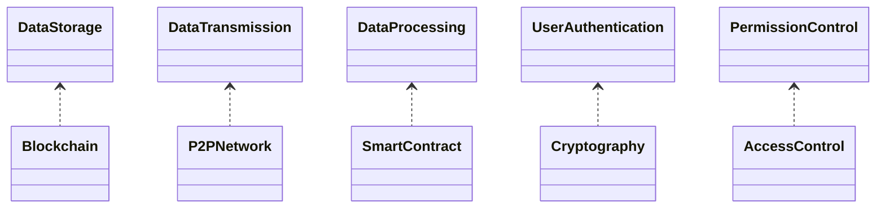
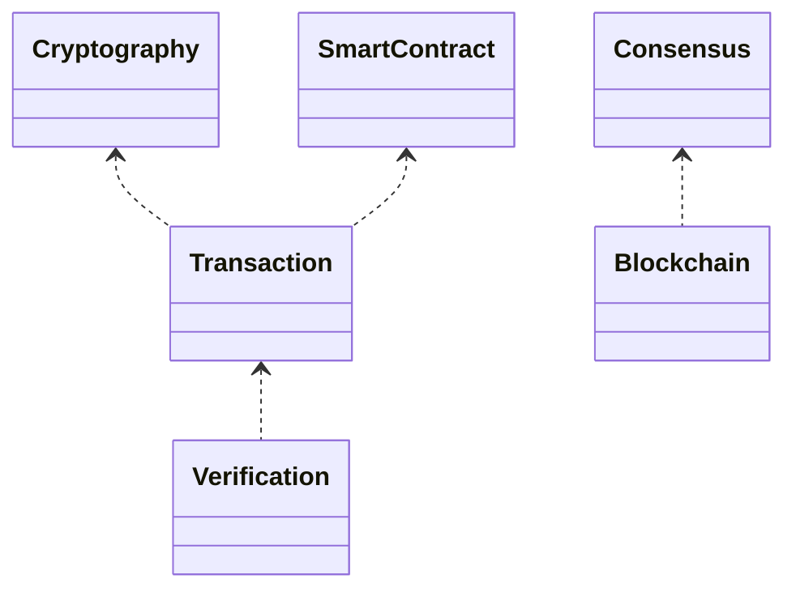
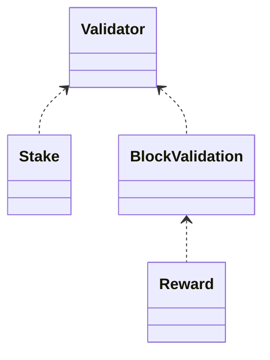

                 

## 概述

在当今的数字化时代，区块链技术以其去中心化、安全性和不可篡改性等特点，正逐渐成为技术创新的前沿领域。随着区块链技术的不断成熟，各类基于区块链的应用场景也层出不穷，涵盖了金融服务、供应链管理、数据存储等多个领域。本文将围绕“意义区块链社区：去中心化的价值交换网络平台”这一主题，深入探讨区块链在价值交换网络平台中的具体应用。

**关键词：区块链、去中心化、价值交换、网络平台、技术原理**

区块链技术，作为一种分布式账本技术，通过多个节点之间的共识机制，实现了数据的存储和传输，确保了系统的安全性和透明度。而去中心化的价值交换网络平台，则是在区块链技术的基础上，构建的一个无需中介的、点对点的价值交换体系。这种平台不仅提高了交易效率，还降低了交易成本，从而为用户提供了更加便捷和安全的交易体验。

本文将首先介绍区块链和去中心化网络平台的基本概念，解释其重要性以及它们在价值交换中的应用。接下来，我们将详细探讨区块链技术的原理，包括基本结构、安全性和智能合约等。随后，文章将分析去中心化价值交换网络平台的架构设计，从功能设计、架构设计到接口设计和系统交互，提供全面的技术解析。在此基础上，我们将通过一个实际项目来展示区块链技术如何应用于价值交换网络平台，并分析其实际运行效果。

最后，本文将总结最佳实践，提出注意事项，并展望未来的发展方向。通过这一系列深入探讨，我们希望能够帮助读者全面理解区块链在去中心化价值交换网络平台中的应用，从而为相关领域的研究和实践提供有益的参考。

### 背景介绍

区块链技术自2008年由中本聪（Satoshi Nakamoto）首次提出以来，便以其去中心化、安全性和透明性的特点迅速引起了全球的关注。区块链技术本质上是一个分布式账本系统，通过多个节点之间的共识机制，实现了数据的存储和传输。这一技术的核心优势在于其无需中心化的中介机构，从而提高了系统的透明度和安全性，降低了交易成本和风险。

去中心化的概念，源于对中心化系统的批判和反思。传统的中心化系统依赖于一个中央机构来协调和控制整个网络，这种模式虽然在一定程度上提高了效率和统一性，但也存在单点故障、数据篡改和信息不对称等问题。而去中心化系统通过去除了中心化控制，实现了更广泛、更平等的网络参与，使得数据存储和传输更加安全可靠。

去中心化网络平台的应用场景非常广泛。在金融领域，区块链技术被用于实现点对点的电子现金系统，如比特币和以太坊，从而避免了传统银行系统的中介费用和风险。在供应链管理领域，区块链技术能够实现物品全生命周期的追踪和验证，确保信息的透明度和可追溯性。此外，在数据存储领域，区块链技术通过分布式存储的方式，提高了数据的安全性和可靠性。

价值交换是区块链技术的一个重要应用方向。传统的价值交换往往依赖于中心化的金融机构，如银行和支付平台，这些中介机构不仅增加了交易成本，还可能导致信息不对称和操作风险。而区块链技术通过其去中心化的特性，实现了点对点之间的直接价值交换，不仅降低了交易成本，还提高了交易的安全性和透明度。

具体到价值交换网络平台，其核心目标是通过区块链技术实现高效、安全、透明的价值传递。这样的平台能够打破传统金融系统的瓶颈，为用户提供更加便捷和自由的交易环境。例如，用户可以通过区块链网络直接进行数字货币交易，不再需要依赖第三方支付平台，从而减少了交易费用和延迟。

此外，区块链技术在价值交换中的另一个重要应用是智能合约。智能合约是一种嵌入在区块链中的自动执行合同，通过编程逻辑实现合同条款的自动执行。这不仅提高了合同执行的效率，还避免了人工干预可能带来的错误和纠纷。在价值交换网络平台中，智能合约可以用于自动化处理交易流程，确保交易过程的安全和透明。

总的来说，区块链技术和去中心化网络平台为价值交换带来了全新的可能性。通过去中心化的价值交换网络平台，用户可以更直接、更安全地进行价值传递，从而实现更加高效、低成本的价值交换。这不仅为传统金融系统带来了变革，也为各种新兴应用场景提供了广阔的发展空间。接下来的部分，我们将深入探讨区块链技术的原理，为理解其在价值交换网络平台中的应用奠定基础。

### 核心概念与联系

在深入探讨区块链技术的原理之前，我们需要明确几个核心概念，包括区块链的基础概念、去中心化网络平台的概念、区块链在去中心化网络平台中的应用，以及它们之间的联系。

#### 区块链的基础概念

区块链是一个分布式账本系统，由多个有序的、不可篡改的区块组成。每个区块包含了若干笔交易记录，这些交易记录按时间顺序链接在一起，形成了一条不可篡改的链条。区块链的核心特点包括：

- **分布式存储**：区块链上的数据分散存储在多个节点上，每个节点都保存了一份完整的账本。这种分布式存储方式提高了系统的容错性和安全性。
- **去中心化**：区块链通过去除了中心化的控制，实现了更加平等和自主的网络参与。每个节点都可以参与数据的验证和记账，确保了系统的透明性和公正性。
- **不可篡改**：区块链上的数据一旦被记录，就无法被篡改。这是由于区块链采用了哈希算法和链式结构，确保了数据的完整性和可靠性。

#### 去中心化网络平台的概念

去中心化网络平台（Decentralized Network Platform，简称DNP）是一种无需中心化控制或中介的分布式网络系统。这种平台通过区块链技术实现了数据存储、传输和处理的去中心化，其核心特点包括：

- **无需中心化中介**：去中心化网络平台通过点对点的通信方式，实现了用户之间的直接交互，避免了传统中介机构的参与。
- **高透明度和安全性**：由于区块链的分布式和不可篡改性，去中心化网络平台能够提供高度透明和安全的交易环境。
- **自主性和灵活性**：去中心化网络平台允许用户自主参与网络管理和数据共享，提高了系统的灵活性和适应性。

#### 区块链在去中心化网络平台中的应用

区块链技术在去中心化网络平台中的应用主要体现在以下几个方面：

- **数据存储**：区块链通过分布式账本的方式，实现了数据的永久存储和不可篡改。这种存储方式不仅提高了数据的安全性和可靠性，还降低了存储成本。
- **数据传输**：区块链通过点对点的网络结构，实现了数据的快速传输和低延迟通信。这种传输方式避免了传统网络的中间环节，提高了传输效率和网络稳定性。
- **数据处理**：区块链通过智能合约的功能，实现了数据的自动化处理和执行。智能合约能够根据预设的规则自动执行交易，提高了处理效率和准确性。

#### 区块链与去中心化网络平台之间的联系

区块链技术和去中心化网络平台之间存在着紧密的联系。区块链技术为去中心化网络平台提供了基础架构，使其能够实现数据存储、传输和处理的去中心化。具体来说，区块链技术通过以下几个方面支持去中心化网络平台：

- **分布式账本**：区块链的分布式账本技术为去中心化网络平台提供了数据存储的解决方案。通过多个节点的参与和验证，确保了数据的完整性和可靠性。
- **共识机制**：区块链的共识机制为去中心化网络平台提供了数据一致性和决策机制。共识机制通过节点之间的协作，确保了网络中的数据同步和一致性。
- **智能合约**：区块链的智能合约功能为去中心化网络平台提供了自动化的数据处理和执行机制。智能合约能够根据预设的规则自动执行交易，提高了平台的效率和安全性。

综上所述，区块链技术和去中心化网络平台共同构建了一个去中心化的价值交换网络平台。通过分布式账本、共识机制和智能合约等核心技术，区块链技术为去中心化网络平台提供了可靠、安全、高效的支撑，从而实现了点对点的价值交换。在接下来的章节中，我们将进一步深入探讨区块链技术的原理，为理解其在价值交换网络平台中的应用提供更深入的洞察。

### 区块链技术原理

要深入理解区块链技术，我们首先需要掌握其基本结构、核心特点和安全性保障。

#### 基本结构

区块链由多个区块组成，每个区块包含若干笔交易记录。这些区块按照时间顺序链接在一起，形成了一条不可篡改的链条。区块链的基本结构包括以下几个关键组成部分：

- **区块**：区块是区块链的基本单元，每个区块包含了若干笔交易记录。区块通过其哈希值与上一个区块的哈希值链接在一起，形成一个链式结构。
- **交易记录**：交易记录是区块中的数据条目，记录了各种经济活动和价值转移的过程。
- **链式结构**：区块链通过链式结构确保了数据的连续性和不可篡改性。每个新区块的生成都是基于前一个区块的哈希值，从而形成了一个单向递增的链条。

#### 核心特点

区块链技术的核心特点包括去中心化、不可篡改、透明性和安全性，这些特点使得区块链在多个领域具有广泛的应用潜力。

- **去中心化**：区块链通过多个节点之间的协作，实现了数据的分布式存储和去中心化控制。每个节点都保存了一份完整的账本，从而避免了传统中心化系统的单点故障问题。
- **不可篡改**：区块链上的数据一旦被记录，就无法被篡改。这是由于区块链采用了哈希算法和链式结构，确保了数据的完整性和可靠性。
- **透明性**：区块链上的所有交易记录都是公开透明的，任何用户都可以查看账本上的数据。这种透明性增强了系统的信任度，减少了信息不对称。
- **安全性**：区块链通过加密技术和共识机制，确保了系统的安全性和数据的完整性。加密技术用于保护交易记录的隐私，共识机制则用于确保数据的合法性和一致性。

#### 安全性保障

区块链的安全性主要依赖于以下几个关键技术：

- **哈希算法**：哈希算法是区块链技术的基础，用于生成数据摘要和校验数据完整性。区块链通过哈希值确保了数据的不可篡改性。
- **非对称加密**：非对称加密技术用于保护交易记录的隐私。交易记录通过公钥加密，只有对应的私钥才能解密。这种加密方式不仅提高了数据的安全性，还确保了交易的可追溯性。
- **数字签名**：数字签名技术用于验证交易的真实性和完整性。交易记录通过私钥签名，可以确保交易数据的来源和合法性。
- **共识机制**：共识机制是区块链网络中的关键算法，用于确保数据的一致性和合法性。常见的共识机制包括工作量证明（PoW）、权益证明（PoS）和委托权益证明（DPoS）等。

#### 区块链的工作流程

区块链的工作流程可以分为以下几个步骤：

1. **交易生成**：用户在区块链网络中生成交易记录，交易记录包含了发送方、接收方和交易金额等信息。
2. **交易广播**：交易生成后，通过区块链网络广播给所有节点。
3. **交易验证**：节点接收到交易记录后，对其合法性进行验证，包括检查交易金额是否足够、交易数据是否一致等。
4. **区块生成**：当节点验证交易记录合法后，将交易记录加入到区块中，并生成一个新的区块。
5. **区块链接**：新产生的区块通过其哈希值与上一个区块链接在一起，形成一个连续的区块链。
6. **共识确认**：通过共识机制，网络中的节点对新区块进行确认，确保其合法性和一致性。
7. **账本更新**：一旦新区块被确认，所有节点的账本都将更新，记录最新的交易数据。

通过上述步骤，区块链实现了去中心化、不可篡改和安全的分布式账本系统，为各种应用场景提供了可靠的技术支持。

#### 小结

区块链技术通过其基本结构、核心特点和安全性保障，为去中心化的价值交换网络平台提供了坚实的基础。其不可篡改和透明的特性，使得区块链在金融、供应链管理、数据存储等领域具有广泛的应用前景。在接下来的章节中，我们将进一步探讨去中心化网络平台的具体架构设计，为理解区块链技术在实践中的应用奠定基础。

### 去中心化网络平台的架构设计

去中心化网络平台（Decentralized Network Platform，简称DNP）的设计目标是实现一个无需中心化中介的分布式系统，确保数据的透明性、安全性和高效性。为了实现这一目标，DNP的架构设计需要综合考虑系统的功能需求、技术实现和安全保障等多个方面。以下将详细探讨DNP的架构设计，包括系统功能设计、系统架构设计、系统接口设计和系统交互。

#### 系统功能设计

去中心化网络平台的功能设计需要满足以下几个关键需求：

1. **数据存储**：平台需要提供可靠的数据存储服务，确保数据的持久化和不可篡改性。通过区块链的分布式账本技术，平台能够实现数据的分布式存储，从而提高系统的容错性和安全性。
2. **数据传输**：平台需要实现高效的数据传输，确保数据的快速传递和低延迟通信。通过点对点的网络结构，平台能够实现去中心化的数据传输，避免传统网络中的中间环节，提高传输效率和网络稳定性。
3. **数据处理**：平台需要支持自动化数据处理，确保交易过程的高效和准确。通过智能合约技术，平台能够实现数据的自动化处理和执行，减少人工干预，提高系统的效率。
4. **用户身份验证**：平台需要提供用户身份验证机制，确保交易的合法性和安全性。通过数字签名和加密技术，平台能够验证用户的身份和交易数据的真实性。
5. **权限管理**：平台需要实现权限管理功能，确保不同用户具有不同的权限和责任。通过权限控制机制，平台能够保障数据的安全性和系统的稳定性。

在系统功能设计中，可以使用Mermaid类图来展示各功能模块及其关系。以下是一个简化的Mermaid类图示例：



#### 系统架构设计

去中心化网络平台的架构设计需要考虑系统的整体结构、各模块的分工和协同工作。一个典型的DNP架构包括以下几个核心组成部分：

1. **节点网络**：节点网络是DNP的核心，由多个分布式节点组成。每个节点都保存了一份完整的账本，并通过共识机制进行数据同步和一致性保障。
2. **区块链**：区块链负责存储所有的交易记录和数据。通过分布式账本技术，区块链实现了数据的持久化和不可篡改性。
3. **P2P网络**：P2P网络负责实现节点之间的通信和数据传输。通过点对点的通信方式，P2P网络提高了数据传输的效率和网络的稳定性。
4. **智能合约**：智能合约负责处理和执行交易。通过编程逻辑，智能合约实现了自动化数据处理和执行，提高了系统的效率和准确性。
5. **加密模块**：加密模块负责数据加密和解密，确保交易记录的隐私性和安全性。通过非对称加密和数字签名技术，加密模块实现了数据的加密和验证。
6. **权限管理**：权限管理模块负责用户权限的分配和控制，确保系统的安全性和稳定性。

以下是一个简化的Mermaid架构图示例：

```mermaid
graph TB
    Node1[节点1] --> Blockchain[区块链]
    Node2[节点2] --> Blockchain
    Node3[节点3] --> Blockchain
    P2PNetwork[点对点网络] --> Node1
    P2PNetwork --> Node2
    P2PNetwork --> Node3
    SmartContract[智能合约] --> Blockchain
    Cryptography[加密模块] --> SmartContract
    PermissionControl[权限管理] --> Node1
    PermissionControl --> Node2
    PermissionControl --> Node3
end
```

#### 系统接口设计

系统接口设计是DNP架构设计的重要组成部分，它定义了各模块之间的交互方式和数据格式。以下是几个关键的接口设计：

1. **数据存储接口**：数据存储接口负责处理数据存储和检索请求，提供对区块链的读写操作。接口应支持多种数据格式，如JSON、XML等，以便于不同的应用场景。
2. **数据传输接口**：数据传输接口负责实现节点之间的数据传输，提供点对点通信的接口和方法。接口应支持异步传输和高并发处理，确保数据传输的高效性和稳定性。
3. **智能合约接口**：智能合约接口负责调用智能合约的函数和执行交易。接口应提供简洁、易用的API，方便开发者编写和部署智能合约。
4. **用户身份验证接口**：用户身份验证接口负责处理用户身份验证请求，提供身份验证和权限管理的接口。接口应支持多种身份验证方式，如用户名/密码、数字签名等。
5. **权限管理接口**：权限管理接口负责用户权限的分配和修改，提供权限控制的接口和方法。接口应支持灵活的权限分配策略，确保系统的安全性和稳定性。

#### 系统交互

系统交互设计描述了各模块之间的协作方式和数据流动。以下是几个关键的系统交互流程：

1. **数据存储与检索**：用户通过数据存储接口将数据写入区块链，数据存储模块验证数据合法性后，将数据记录到区块链中。用户通过数据检索接口查询区块链中的数据，数据检索模块从区块链中检索并返回数据。
2. **数据传输**：节点之间通过P2P网络进行数据传输，数据传输模块将数据广播给所有节点，节点接收到数据后进行验证和同步。
3. **智能合约执行**：用户通过智能合约接口调用智能合约的函数，智能合约模块执行交易逻辑并返回结果。
4. **用户身份验证**：用户通过用户身份验证接口进行身份验证，验证成功后获得相应权限。
5. **权限管理**：权限管理模块根据用户权限分配策略，为用户分配不同的权限和责任。

以下是一个简化的Mermaid序列图示例：

```mermaid
sequenceDiagram
    participant User as 用户
    participant Storage as 数据存储模块
    participant Transmission as 数据传输模块
    participant Contract as 智能合约模块
    participant Verification as 用户身份验证模块
    participant Control as 权限管理模块

    User->>Storage: 数据存储请求
    Storage->>Verification: 身份验证请求
    Verification->>User: 验证成功
    Storage->>Blockchain: 写入数据到区块链
    Blockchain-->>Storage: 数据存储确认

    User->>Transmission: 数据传输请求
    Transmission->>P2PNetwork: 广播数据到节点
    Node1-->>Transmission: 数据传输确认
    Node2-->>Transmission: 数据传输确认
    ...

    User->>Contract: 智能合约执行请求
    Contract->>Verification: 验证用户身份
    Verification->>User: 验证成功
    Contract->>Blockchain: 执行智能合约
    Blockchain-->>Contract: 执行结果

    User->>Control: 权限管理请求
    Control->>Verification: 验证用户身份
    Verification->>User: 验证成功
    Control->>User: 分配权限
end
```

通过上述架构设计、接口设计和交互设计，去中心化网络平台能够实现数据的分布式存储、传输和自动化处理，确保系统的透明性、安全性和高效性。在接下来的章节中，我们将通过一个实际项目展示如何应用这些设计，进一步探讨区块链技术在去中心化网络平台中的具体实现。

### 去中心化交易机制

在去中心化网络平台中，交易机制是实现价值交换的核心组件。去中心化交易机制通过区块链技术确保交易的高效性、安全性和透明性。以下将详细探讨去中心化交易机制的具体流程、交易验证方法和交易的安全性保障。

#### 交易流程

去中心化交易的基本流程可以概括为以下几个步骤：

1. **交易发起**：交易发起方生成交易请求，包括交易的发送方、接收方和交易金额等信息。
2. **交易广播**：交易发起方将交易请求广播到去中心化网络中的所有节点。
3. **交易验证**：节点接收到交易请求后，对其合法性进行验证，包括检查交易金额、交易数据的一致性等。
4. **区块生成**：验证通过的交易记录会被打包到一个新区块中，新区块由节点生成并通过共识机制进行验证和确认。
5. **区块链接**：一旦新区块被确认，它将链接到区块链的现有链上，从而形成一个新的区块。
6. **账本更新**：所有节点在新区块被确认后，将更新其本地账本，记录最新的交易数据。

#### 交易验证方法

交易验证是确保去中心化交易安全性和合法性的关键步骤。以下是几种常见的交易验证方法：

1. **余额检查**：节点在验证交易时，会检查交易发起方的账户余额是否足够支付交易金额。如果余额不足，交易将被拒绝。
2. **交易数据一致性**：节点会检查交易记录中的数据是否一致，如交易金额、发送方和接收方的信息等。如果数据不一致，交易将被拒绝。
3. **哈希校验**：交易记录中的所有数据都会通过哈希算法生成一个哈希值。节点会检查交易记录的哈希值是否与区块中的哈希值一致，以确保数据未被篡改。
4. **多重签名**：在某些高级交易场景中，交易可能需要多个参与者共同签名才能生效。多重签名确保了交易的安全性，避免了单点故障的风险。

以下是一个简化的Mermaid流程图，展示了交易验证的基本流程：

```mermaid
flowchart LR
    A[交易发起] --> B[交易广播]
    B --> C{交易验证通过?}
    C -->|是| D[区块生成]
    C -->|否| E[交易拒绝]
    D --> F[区块链接]
    F --> G[账本更新]
end
```

#### 交易的安全性保障

去中心化交易的安全性依赖于多个技术手段，包括加密技术、共识机制和智能合约等。以下是几种常见的安全性保障措施：

1. **加密技术**：加密技术用于保护交易记录的隐私性。交易记录在传输过程中通过非对称加密技术进行加密，只有对应的私钥才能解密。此外，数字签名技术用于验证交易的真实性和完整性。
2. **共识机制**：共识机制通过节点之间的协作，确保交易的一致性和合法性。常见的共识机制包括工作量证明（PoW）、权益证明（PoS）和委托权益证明（DPoS）等。这些机制通过确保大多数节点达成共识，提高了系统的安全性。
3. **智能合约**：智能合约是一种嵌入在区块链中的自动执行合同，通过编程逻辑实现交易条款的自动执行。智能合约不仅提高了交易效率，还确保了交易的安全性和透明性。通过智能合约，交易条款和执行逻辑预先编写和部署在区块链上，从而避免了人为干预和操作风险。

以下是一个简化的Mermaid类图，展示了加密技术、共识机制和智能合约在交易安全性保障中的作用：



通过上述交易机制、验证方法和安全性保障措施，去中心化交易机制能够确保交易的高效性、安全性和透明性。这种交易机制不仅打破了传统金融系统的瓶颈，还为去中心化网络平台提供了强大的支撑。在接下来的部分，我们将进一步探讨共识算法，为理解区块链网络中的数据一致性提供更深入的洞察。

### 共识算法

共识算法是区块链技术中的关键组件，它确保了网络中的所有节点对账本的一致性。共识算法通过一种机制，使得网络中的所有参与者能够达成一致意见，从而确保区块链的分布式特性。以下将详细介绍几种常见的共识算法，包括其原理、工作流程和优缺点。

#### 工作量证明（Proof of Work，PoW）

工作量证明是最早采用的共识算法，由中本聪在比特币中首次提出。PoW的基本思想是通过计算复杂问题来消耗计算资源，从而防止恶意节点对网络进行攻击。

- **原理**：PoW要求节点（矿工）解决一个计算难题，即找到一个随机数，使得该随机数与当前区块的哈希值满足一定的条件。矿工需要不断地尝试不同的随机数，直到找到满足条件的解。
- **工作流程**：矿工生成交易记录，并将其打包到一个区块中。然后，矿工开始尝试解决计算难题，一旦找到解，矿工将新区块广播给其他节点。其他节点验证新区块的解是否正确，如果验证通过，新区块将被链接到区块链上。
- **优缺点**：优点是PoW具有较高的安全性，因为攻击者需要消耗大量的计算资源才能对网络进行攻击。缺点是PoW的能源消耗较大，计算资源浪费严重。

以下是一个简化的Mermaid流程图，展示了PoW的工作流程：

```mermaid
sequenceDiagram
    participant Miner as 矿工
    participant Node as 其他节点

    Miner->>Node: 发送交易记录
    Node->>Miner: 生成新区块
    Miner->>Node: 发送区块并尝试解决计算难题
    Node->>Miner: 验证区块解是否正确
    Miner->>Node: 广播新区块
end
```

#### 权益证明（Proof of Stake，PoS）

权益证明是针对PoW算法的能源消耗问题提出的一种改进算法。在PoS中，节点（验证者）通过持有和锁定代币的数量和时长来参与共识。

- **原理**：PoS通过代币持有量和锁定时长来决定验证者的权益。持有代币越多、锁定时间越长，验证者的权益越高，从而有更大的概率被选中进行区块验证。
- **工作流程**：验证者首先需要锁定一定数量的代币作为抵押。当系统需要生成新区块时，根据验证者的权益，系统随机选择一个验证者进行区块验证。验证者验证新区块后，将获得一定数量的代币奖励。
- **优缺点**：优点是PoS相较于PoW消耗较少的能源，计算资源利用率更高。缺点是PoS可能存在“富者越富”的问题，因为持有代币数量越多的验证者越有优势。

以下是一个简化的Mermaid类图，展示了PoS的基本结构：



#### 委托权益证明（Delegated Proof of Stake，DPoS）

委托权益证明是对PoS的一种改进算法，旨在提高共识过程的效率和安全性。

- **原理**：DPoS通过选举出一定数量的验证者代理，这些代理代表普通节点进行区块验证。节点通过投票选举出验证者代理，代理根据持有的代币数量和投票结果参与共识。
- **工作流程**：节点投票选举出验证者代理，代理根据投票结果和代币持有量决定区块验证顺序。验证者代理验证新区块后，将获得代币奖励。
- **优缺点**：优点是DPoS提高了共识效率，减少了计算资源的浪费。缺点是可能存在集中化的风险，因为验证者代理可能拥有较大的权益。

以下是一个简化的Mermaid流程图，展示了DPoS的工作流程：

```mermaid
sequenceDiagram
    participant Node as 普通节点
    participant Proxy as 验证者代理

    Node->>Proxy: 投票选举代理
    Proxy->>Node: 获得投票结果
    Proxy->>Node: 开始区块验证
    Node->>Proxy: 验证新区块
    Proxy->>Node: 发送区块奖励
end
```

通过上述共识算法，区块链网络能够确保数据的一致性和安全性。不同的共识算法适用于不同的应用场景，选择合适的共识算法对于构建高效、安全、去中心化的区块链网络至关重要。在接下来的部分，我们将通过一个实际项目展示区块链技术在实际应用中的实现，进一步探讨其应用价值。

### 实际项目展示

在本文的最后部分，我们将通过一个实际项目来展示区块链技术在去中心化价值交换网络平台中的具体应用。该项目名为“意义区块链社区”（Significance Blockchain Community），是一个基于区块链的去中心化价值交换网络平台。

#### 项目背景

“意义区块链社区”旨在为用户提供一个去中心化的、高效、安全的价值交换环境。用户可以通过该平台进行各种形式的数字货币交易、智能合约执行以及其他去中心化应用（DApps）的访问。该项目不仅提供了基本的价值交换功能，还集成了智能合约、去中心化身份验证和权限管理等多种技术，为用户提供了丰富的使用体验。

#### 环境搭建

为了运行“意义区块链社区”项目，我们需要搭建一个适当的环境。以下是项目环境搭建的步骤：

1. **硬件要求**：至少需要两台服务器，一台用于前端展示，另一台用于后端处理。
2. **软件要求**：操作系统可以是Linux或MacOS，数据库可以选择MongoDB或MySQL，区块链平台可以选择Ethereum或Hyperledger Fabric等。
3. **网络环境**：确保服务器之间可以正常通信，并具有公网IP地址。

以下是具体的操作步骤：

1. **安装操作系统**：在服务器上安装Linux或MacOS操作系统。
2. **安装数据库**：安装并配置MongoDB或MySQL数据库，用于存储用户数据和交易记录。
3. **安装区块链平台**：安装Ethereum或Hyperledger Fabric等区块链平台，并配置节点网络。
4. **安装开发工具**：安装Node.js、Python等开发工具，用于开发前端和后端代码。

#### 核心实现

“意义区块链社区”的核心实现包括前端界面、后端逻辑和区块链交互三个部分。以下是各个部分的详细实现：

1. **前端界面**：
   - 使用React框架开发用户界面，包括交易界面、智能合约界面和用户管理界面。
   - 通过Web3.js库与区块链进行交互，实现用户与区块链的通信。

2. **后端逻辑**：
   - 使用Node.js编写后端逻辑，负责处理用户请求、数据存储和智能合约执行。
   - 通过中间件处理HTTP请求，并与区块链进行通信，确保交易记录的合法性和一致性。

3. **区块链交互**：
   - 在区块链上部署智能合约，用于处理交易逻辑和权限管理。
   - 使用Truffle框架进行智能合约开发、部署和测试。

以下是部分核心代码示例：

**智能合约（Solidity）**：

```solidity
// SPDX-License-Identifier: MIT
pragma solidity ^0.8.0;

contract ValueExchange {
    mapping(address => uint256) public balances;

    function deposit() public payable {
        balances[msg.sender()] += msg.value;
    }

    function withdraw(uint256 amount) public {
        require(amount <= balances[msg.sender()], "Insufficient balance");
        balances[msg.sender()] -= amount;
        payable(msg.sender()).transfer(amount);
    }

    function transfer(address to, uint256 amount) public {
        require(amount <= balances[msg.sender()], "Insufficient balance");
        balances[msg.sender()] -= amount;
        balances[to] += amount;
    }
}
```

**后端（Node.js）**：

```javascript
const express = require('express');
const Web3 = require('web3');
const contractABI = require('./contractABI.json');

const app = express();
const web3 = new Web3('http://localhost:8545');

const contractAddress = '0x...';
const contract = new web3.eth.Contract(contractABI, contractAddress);

app.get('/balance', async (req, res) => {
    const balance = await contract.methods.balanceOf(req.query.address).call();
    res.json({ balance });
});

app.post('/deposit', async (req, res) => {
    const tx = {
        from: req.body.from,
        to: contractAddress,
        value: web3.utils.toWei(req.body.amount, 'ether'),
    };
    const receipt = await web3.eth.sendTransaction(tx);
    res.json({ receipt });
});

app.listen(3000, () => {
    console.log('Server listening on port 3000');
});
```

#### 应用解读与分析

通过上述代码和实现步骤，我们可以看到“意义区块链社区”项目如何通过区块链技术实现去中心化的价值交换。以下是项目应用的几个关键点：

1. **去中心化交易**：用户可以通过前端界面与区块链进行交互，实现数字货币的存取和转账。所有交易记录都会记录在区块链上，确保交易的透明性和不可篡改性。
2. **智能合约**：智能合约负责处理交易逻辑，确保交易过程的安全性和准确性。用户可以通过前端界面调用智能合约，实现自动化的交易处理。
3. **权限管理**：项目集成了去中心化身份验证和权限管理，确保不同用户具有不同的权限和责任。通过数字签名和权限控制机制，项目能够保障数据的安全性和系统的稳定性。

通过这个实际项目，我们可以看到区块链技术如何应用于去中心化的价值交换网络平台。这不仅提高了交易效率，降低了成本，还为用户提供了更加安全和透明化的交易环境。在未来的发展中，随着区块链技术的不断成熟和应用场景的拓展，意义区块链社区有望为更多用户提供便捷、安全的价值交换服务。

### 项目小结与最佳实践

通过“意义区块链社区”项目的实际应用展示，我们可以总结出一些最佳实践和经验教训，这些经验对于构建和优化去中心化价值交换网络平台具有重要意义。

#### 最佳实践

1. **高安全性设计**：在区块链应用中，安全性是首要考虑的因素。项目应采用多层加密技术，确保交易记录和数据的安全性。同时，实施严格的权限管理，防止未经授权的访问和操作。

2. **优化共识算法**：不同的共识算法适用于不同的应用场景。项目应根据实际需求选择合适的共识算法，如PoS或DPoS，以提高网络的共识效率和安全性。

3. **智能合约自动化**：智能合约可以自动化交易过程，提高系统的效率和准确性。在开发智能合约时，应充分考虑交易的合法性和可执行性，确保智能合约的稳定运行。

4. **优化用户体验**：项目应提供直观、易用的用户界面，简化用户操作流程，提高用户满意度。同时，应提供全面的用户文档和教程，帮助用户快速上手。

5. **持续维护和更新**：区块链技术不断发展，项目应持续维护和更新，以适应新的技术变化和应用需求。定期进行代码审查和漏洞修复，确保系统的稳定性和安全性。

#### 经验教训

1. **技术选型**：在项目初期，应充分评估不同区块链平台和技术的适用性，选择最适合项目需求的技术栈。

2. **性能优化**：区块链应用通常涉及大量交易处理，项目应进行性能优化，提高系统的响应速度和处理能力。

3. **社区建设**：社区是区块链项目的生命线。项目应积极建设社区，与用户和开发者保持密切沟通，收集反馈和需求，不断改进项目。

4. **合规性**：在区块链应用中，合规性是关键。项目应遵守相关法律法规，确保应用的合法性和合规性。

通过以上最佳实践和经验教训，我们可以更好地构建和优化去中心化价值交换网络平台，为用户提供安全、高效、透明的交易环境。

### 小结与展望

通过对“意义区块链社区：去中心化的价值交换网络平台”的深入探讨，我们全面了解了区块链技术在这类平台中的应用和实现。从基础概念到具体架构设计，再到实际项目的展示，本文系统地梳理了区块链技术的原理、去中心化交易机制、共识算法以及最佳实践。以下是文章的核心观点和未来研究方向：

#### 核心观点

1. **区块链的去中心化特性**：区块链通过分布式账本技术，实现了数据的去中心化存储和管理，提高了系统的透明性和安全性。
2. **去中心化交易机制**：区块链技术为去中心化的价值交换提供了高效、安全的交易环境，降低了交易成本，提升了用户体验。
3. **共识算法的重要性**：共识算法是确保区块链网络一致性和安全性的关键，不同算法适用于不同的应用场景，选择合适的算法对系统的性能和安全性至关重要。
4. **智能合约的应用**：智能合约通过编程逻辑实现了自动化交易处理，提高了系统的效率和准确性。

#### 未来研究方向

1. **性能优化**：随着区块链应用的普及，性能优化将成为关键研究方向。如何提高区块链的处理速度和扩展性，是一个重要的课题。
2. **隐私保护**：在去中心化网络平台中，隐私保护是一个亟待解决的问题。未来的研究可以关注如何在保持透明性和去中心化的同时，提高用户的隐私保护水平。
3. **跨链技术**：区块链之间的互操作性是未来的一个重要方向。研究如何实现不同区块链之间的数据传输和互操作，将推动区块链生态的发展。
4. **智能合约安全**：随着智能合约应用的普及，智能合约的安全性问题日益凸显。未来的研究可以关注如何提高智能合约的安全性，减少漏洞和攻击风险。
5. **监管合规**：区块链技术的发展与法律法规的完善密切相关。研究如何实现区块链技术的合规性和监管，是未来发展的关键之一。

通过本文的探讨，我们不仅对区块链技术有了更深入的理解，也为去中心化价值交换网络平台的应用和发展提供了有益的参考。随着技术的不断进步和应用场景的拓展，区块链技术将在更多领域展现其强大的潜力和应用价值。让我们共同期待，区块链技术在未来能带来更多的创新和变革。

### 拓展阅读

在本文的基础上，读者如果希望更深入地了解区块链技术及其应用，以下是一些推荐的专业书籍、研究报告和在线课程，这些资源将有助于您进一步拓展知识领域：

#### 专业书籍

1. **《区块链技术指南》** - 张辉，本书全面介绍了区块链的基础知识、关键技术、应用场景和未来发展趋势。
2. **《智能合约与区块链编程》** -安德鲁·埃奇，本书详细讲解了智能合约的原理、开发流程以及实际应用案例。
3. **《区块链技术原理与应用》** - 吕智民，本书从技术角度深入探讨了区块链的基本原理、实现机制和实际应用。

#### 报告与论文

1. **“区块链技术发展报告”** - 中国信息通信研究院，这份报告对区块链技术的发展现状、趋势和应用进行了深入分析。
2. **“区块链技术白皮书”** - 联合国数字合作高级别小组，该报告探讨了区块链在全球治理、数字经济等领域的应用。
3. **“区块链与供应链金融”** - 中国银行保险监督管理委员会，该论文分析了区块链技术在供应链金融中的应用场景和潜在效益。

#### 在线课程

1. **“区块链与加密货币”** - Coursera，由加密货币大师提供，系统讲解了区块链技术的基本概念和应用。
2. **“智能合约开发”** - Udacity，该课程深入介绍了智能合约的原理、开发技术和实际应用案例。
3. **“区块链技术导论”** - edX，由加州大学伯克利分校提供，全面介绍了区块链的基本知识、技术架构和应用案例。

通过阅读这些书籍、报告和课程，读者可以进一步加深对区块链技术的理解，掌握其在实际应用中的关键技术和实践方法。希望这些资源能够为您的学习和研究提供帮助。让我们共同探索区块链技术的无限可能。

