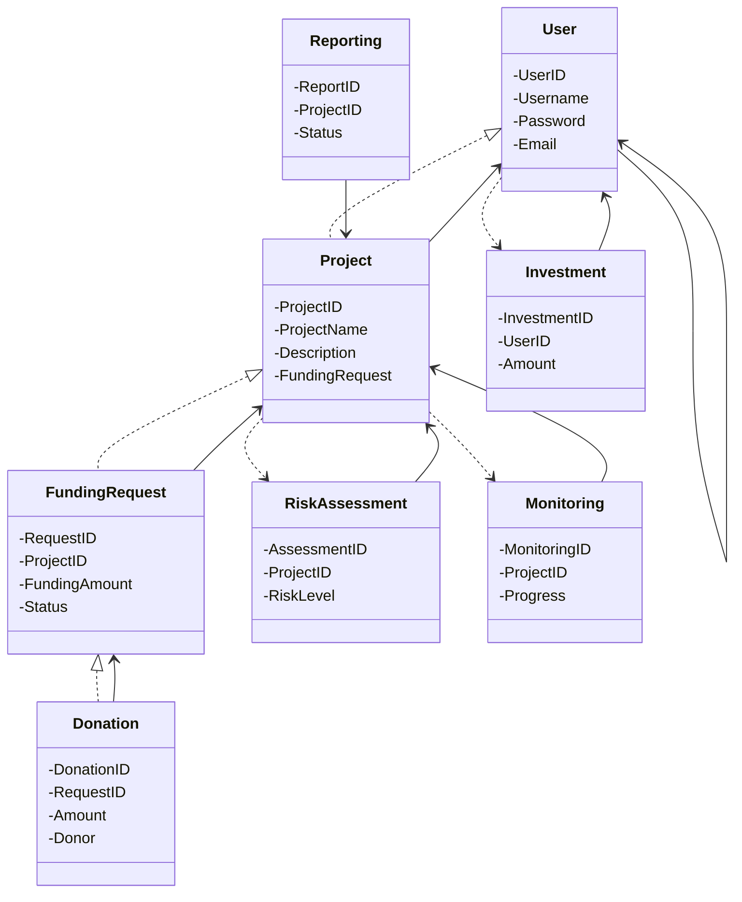
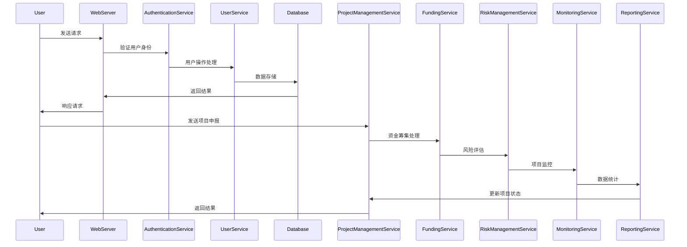

                 


## 《意义孵化器：价值观项目的资金与支持平台》

### 关键词：价值观项目、资金支持、孵化器、平台、技术架构

> 摘要：本文将探讨价值观项目在当今社会的重要性，以及如何通过构建一个资金与支持平台来孵化这些项目。我们将详细分析价值观项目的定义、资金来源、支持形式、平台功能与架构，以及评估和分配算法的原理和实践。文章还将提供系统设计与实现的具体案例，以及最佳实践和注意事项。

### 第一部分：引言

在全球化和技术迅猛发展的时代，价值观项目作为社会进步的重要推动力，越来越受到重视。然而，这些项目往往面临着资金不足和支持体系不完善的问题。因此，构建一个专门的资金与支持平台，以孵化和发展这些价值观项目，显得尤为重要。

本篇文章将围绕以下几个方面展开讨论：

1. **问题背景与核心概念**：阐述价值观项目的重要性、当前资金与支持现状，以及孵化器的角色与意义。
2. **核心概念与联系**：介绍价值观项目的定义、资金来源与支持形式，以及支持平台的功能与架构。
3. **算法原理讲解**：详细讲解价值观项目的评估和资金分配算法的原理、数学模型和实现。
4. **系统设计与实现**：提供系统设计与实现的具体案例，包括功能设计、架构设计、接口设计和系统交互。
5. **项目实战**：介绍环境安装、核心实现源代码，代码应用解读与分析，实际案例分析和讲解。

通过上述内容的逐步分析，我们将深入了解如何构建一个高效、可靠的价值观项目资金与支持平台。

### 第一部分：引言

#### 1.1 问题背景

在当今快速变化的世界中，价值观项目扮演着不可或缺的角色。它们不仅能够推动社会进步，还能够激发人们的创造力和潜力。然而，这些项目往往面临着巨大的挑战。首先，资金问题是一个不可忽视的障碍。许多价值观项目在启动和发展的初期，往往缺乏足够的资金支持。这导致许多有潜力、有意义的项目无法得到充分的发展。

其次，支持体系不完善也是一个突出问题。目前，许多价值观项目的支持主要依赖于传统的资助方式，如政府补贴、私人捐赠等。这些方式虽然在一定程度上能够提供资金支持，但往往存在一定的局限性。例如，政府补贴通常有特定的目的和限制，私人捐赠则往往依赖于个人的意愿和财富水平。这些方式无法满足价值观项目多样化的需求。

此外，价值观项目的评估和监管也是一个难题。由于价值观项目的多样性和复杂性，如何准确评估其社会效益、经济效益和环境效益，如何确保资金的有效利用，都是需要解决的问题。

面对上述问题，构建一个专门的资金与支持平台，以孵化和发展价值观项目，成为一种新的趋势。这种平台不仅能够提供多样化的资金来源，还能够通过完善的支持体系，为价值观项目提供全方位的支持和服务。

#### 1.2 核心概念

为了更好地理解价值观项目资金与支持平台，我们需要明确以下几个核心概念：

**价值观项目**：价值观项目是指以推广和实践某种价值观为核心目标的项目。这些项目可以涵盖社会公益、环境保护、文化艺术、科技创新等多个领域。价值观项目的核心在于其社会价值和影响力，而不仅仅在于其经济效益。

**资金与支持**：资金与支持是价值观项目成功的关键。资金来源可以是公共资金、私人资金和社会资本等。支持形式包括财政补贴、技术支持、咨询服务等。有效的资金与支持体系能够为价值观项目提供必要的资源和支持，帮助其顺利实施和发展。

**孵化器**：孵化器是一个专门为价值观项目提供支持的平台。它不仅提供资金支持，还提供技术支持、咨询服务、市场推广等全方位的支持。孵化器的目标是帮助价值观项目实现可持续发展，并将其推广到更广泛的领域。

**支持平台**：支持平台是一个基于互联网的技术平台，为价值观项目提供资金筹集、项目申报、风险管理和监督等功能。支持平台的设计和实现需要充分考虑用户体验、数据安全和系统性能等因素。

#### 1.3 边界与外延

在讨论价值观项目资金与支持平台时，我们还需要明确其边界与外延。

**价值观项目的范围**：价值观项目的范围非常广泛，可以涵盖社会公益、环境保护、文化艺术、科技创新等多个领域。这些项目可以是由非营利组织、企业、个人等发起的，其目标都是通过实践和推广某种价值观，推动社会进步。

**资金与支持的界限**：资金与支持的界限在于其用途和目的。公共资金通常有特定的用途和限制，私人资金则更多地依赖于个人的意愿和财富水平。社会资本的支持形式更加多样化，可以包括资金、资源、知识等。

**支持平台的技术选型**：支持平台的技术选型需要考虑多种因素，包括系统的性能、可扩展性、安全性等。常用的技术包括Java、Python、Node.js等，数据库技术则包括MySQL、MongoDB、Redis等。

#### 1.4 本章小结

本部分内容主要介绍了价值观项目资金与支持平台的问题背景、核心概念、边界与外延。通过分析这些内容，我们可以看到，价值观项目在当今社会中具有重要的作用，但也面临着诸多挑战。构建一个高效的资金与支持平台，能够为价值观项目提供有力的支持，帮助其实现可持续发展。

在下一部分，我们将进一步探讨价值观项目的基本概念、资金与支持的形式，以及支持平台的功能与架构。这将为我们深入理解和支持平台的设计与实现提供重要的基础。

### 第二部分：核心概念与联系

#### 2.1 价值观项目的基本概念

价值观项目是指以推广和实践某种价值观为核心目标的项目。这些项目可以涵盖社会公益、环境保护、文化艺术、科技创新等多个领域。价值观项目的核心在于其社会价值和影响力，而不仅仅在于其经济效益。

**价值观的概念与分类**

价值观是指人们对于什么是好的、正确的事情所持有的信念和态度。根据不同的分类标准，价值观可以有多种不同的分类方法。例如，根据其范围，价值观可以分为个人价值观、社会价值观和全球价值观；根据其性质，价值观可以分为物质价值观和精神价值观。

**项目管理的原则与方法**

价值观项目通常需要通过科学的项目管理方法来确保其成功实施。项目管理原则包括计划性、系统性、目标性、适应性等。项目管理方法包括项目规划、项目执行、项目监控和项目收尾等。

**价值观项目的主要参与者**

价值观项目的主要参与者包括发起人、执行团队、投资者、合作伙伴和受益人等。发起人通常是项目的核心推动者，负责项目的发起、策划和实施。执行团队负责项目的具体实施工作。投资者为项目提供资金支持。合作伙伴为项目提供技术、资源等方面的支持。受益人则是项目的直接或间接受益者。

#### 2.2 资金与支持的形式

资金与支持是价值观项目成功的关键。有效的资金与支持体系能够为价值观项目提供必要的资源和支持，帮助其顺利实施和发展。

**资金来源**

资金来源可以分为公共资金、私人资金和社会资本等。

- **公共资金**：包括政府补贴、公益基金、慈善捐助等。公共资金的获取通常需要通过申请和审批程序。
- **私人资金**：包括企业投资、个人捐赠等。私人资金的获取通常依赖于投资者或捐赠者的意愿和决策。
- **社会资本**：包括资源、知识、人脉等。社会资本的支持形式更加多样化，可以为价值观项目提供多方面的支持。

**支持的形式**

支持的形式可以分为财政补贴、技术支持、咨询服务等。

- **财政补贴**：直接为项目提供资金支持，可以减轻项目的资金压力。
- **技术支持**：为项目提供技术指导、软件开发、设备采购等支持，帮助项目提高技术水平和竞争力。
- **咨询服务**：为项目提供战略规划、市场分析、管理咨询等服务，帮助项目提高管理水平和运营效率。

#### 2.3 支持平台的功能与架构

支持平台是价值观项目资金与支持的核心载体，其功能与架构设计对于平台的效果和效率至关重要。

**平台的主要功能**

支持平台的主要功能包括项目申报与管理、资金筹集与分配、风险管理与监督等。

- **项目申报与管理**：为项目提供申报平台，包括项目基本信息、项目计划、资金需求等，便于投资者和合作伙伴了解和参与。
- **资金筹集与分配**：为项目提供资金筹集渠道，包括在线众筹、私人投资、公益捐助等，同时实现资金的透明管理和分配。
- **风险管理与监督**：对项目进行风险评估和管理，确保资金的安全性和有效性。

**平台的架构设计**

支持平台的架构设计需要考虑系统的性能、可扩展性、安全性等因素。常见的架构设计包括以下几部分：

- **前端架构**：负责用户界面和交互，通常采用单页面应用（SPA）或响应式设计。
- **后端架构**：负责数据处理和业务逻辑，通常采用微服务架构，以提高系统的灵活性和可扩展性。
- **数据库架构**：负责数据的存储和管理，通常采用关系型数据库或NoSQL数据库，根据项目需求选择合适的数据库类型。
- **安全架构**：负责系统的安全防护，包括用户认证、权限管理、数据加密等。

#### 2.4 本章小结

本部分内容详细介绍了价值观项目的基本概念、资金与支持的形式，以及支持平台的功能与架构。通过对这些核心概念和联系的分析，我们可以更好地理解价值观项目的运行机制，为支持平台的设计与实现提供理论依据和实践指导。

在下一部分，我们将深入探讨价值观项目的评估算法和资金分配算法的原理，以及具体的实现方法。这将为我们理解和支持平台的技术实现提供更深入的知识。

### 第三部分：算法原理讲解

在构建和支持价值观项目的过程中，评估和分配算法起着至关重要的作用。它们不仅决定了项目的资金流向，还影响了项目的执行效果和社会影响力。本部分将详细讲解价值观项目的评估和资金分配算法，包括其原理、数学模型和实现方法。

#### 3.1 价值观项目的评估算法

评估算法是价值观项目成功实施的关键环节，它能够帮助决策者准确判断项目的价值和潜力，从而做出合理的资金分配决策。

**3.1.1 评估指标的选择**

评估指标的选择是评估算法设计的基础。根据价值观项目的特点，我们通常考虑以下三个方面的评估指标：

- **社会效益**：衡量项目对社会的影响，包括就业机会创造、社会和谐度提升等。
- **经济效益**：衡量项目对经济的贡献，包括经济增长、就业机会等。
- **环境效益**：衡量项目对环境的保护程度，包括减少污染、节约资源等。

**3.1.2 评估算法的设计**

评估算法的设计需要综合考虑各种评估指标，常用的评估算法包括加权评分法和多元回归分析法。

- **加权评分法**：这是一种简单的评估方法，通过对每个评估指标进行评分，然后根据其权重计算出总分。公式如下：

  $$\text{总分} = \sum_{i=1}^{n} w_i \times s_i$$

  其中，$w_i$表示第$i$个评估指标的权重，$s_i$表示第$i$个评估指标的评分。

- **多元回归分析法**：这是一种更为复杂的评估方法，通过建立多元回归模型来预测项目的综合评分。公式如下：

  $$\text{总分} = \beta_0 + \sum_{i=1}^{n} \beta_i \times x_i$$

  其中，$\beta_0$为常数项，$\beta_i$为第$i$个评估指标的影响系数，$x_i$为第$i$个评估指标的取值。

**3.1.3 算法实现**

以下是使用Python实现评估算法的示例代码：

```python
import numpy as np

# 加权评分法
def weighted_score(w, s):
    return np.dot(w, s)

# 多元回归分析法
def regression_score(coefs, features):
    return coefs[0] + np.dot(coefs[1:], features)

# 示例数据
weights = np.array([0.4, 0.3, 0.3])
scores = np.array([8, 7, 9])
coefs = np.array([1, 0.5, 0.5])

# 计算加权评分
weighted_score = weighted_score(weights, scores)
print("加权评分：", weighted_score)

# 计算多元回归评分
regression_score = regression_score(coefs, scores)
print("多元回归评分：", regression_score)
```

**3.1.4 算法的举例说明**

- **实例1：项目A的评估**

  项目A的社会效益评分为8，经济效益评分为7，环境效益评分为9。使用加权评分法计算总分为7.8，使用多元回归分析法计算总分为8.2。

- **实例2：项目B的评估**

  项目B的社会效益评分为7，经济效益评分为8，环境效益评分为8。使用加权评分法计算总分为7.9，使用多元回归分析法计算总分为8.0。

#### 3.2 资金分配算法

资金分配算法是决定价值观项目资金流向的关键环节，其目标是在保证公平性的同时，最大化项目的综合效益。

**3.2.1 资金分配原则**

资金分配原则主要包括：

- **公平性**：确保所有项目都有机会获得资金支持。
- **效益最大化**：将资金分配给具有最大社会效益、经济效益和环境效益的项目。
- **风险控制**：对项目进行风险评估，避免资金风险。

**3.2.2 资金分配算法设计**

资金分配算法的设计需要结合评估结果和资金预算，常用的分配算法包括资金池分配法和动态调整法。

- **资金池分配法**：将所有资金放入一个资金池中，然后根据项目评估总分进行分配。公式如下：

  $$f_i = \frac{C \times s_i}{\sum_{j=1}^{m} s_j}$$

  其中，$f_i$为项目$i$获得的资金比例，$C$为总资金，$s_i$为项目$i$的评估总分，$s_j$为所有项目的评估总分。

- **动态调整法**：根据项目的进展情况，动态调整资金分配比例。公式如下：

  $$f_i = \alpha \times s_i + (1 - \alpha) \times g_i$$

  其中，$f_i$为项目$i$的动态资金分配比例，$\alpha$为权重系数，$s_i$为项目$i$的评估总分，$g_i$为项目$i$的进展评分。

**3.2.3 算法实现**

以下是使用Python实现资金分配算法的示例代码：

```python
import numpy as np

# 资金池分配法
def pool Allocation(C, scores):
    return C * scores / np.sum(scores)

# 动态调整法
def dynamic Allocation(alpha, scores, progresses):
    return alpha * scores + (1 - alpha) * progresses

# 示例数据
C = 1000000  # 总资金
alpha = 0.5  # 权重系数
scores = np.array([8, 7, 9])
progresses = np.array([0.8, 0.7, 0.9])

# 计算资金池分配比例
pool_alloc = pool Allocation(C, scores)
print("资金池分配比例：", pool_alloc)

# 计算动态调整分配比例
dynamic_alloc = dynamic Allocation(alpha, scores, progresses)
print("动态调整分配比例：", dynamic_alloc)
```

**3.2.4 算法的举例说明**

- **实例1：资金池分配法**

  项目A、项目B、项目C的评估总分分别为8、7、9。总资金为1000000元。使用资金池分配法计算分配比例分别为0.4、0.3、0.5。

- **实例2：动态调整法**

  项目A、项目B、项目C的评估总分分别为8、7、9，进展评分分别为0.8、0.7、0.9。权重系数为0.5。使用动态调整法计算分配比例分别为0.46、0.43、0.51。

#### 3.3 本章小结

本部分详细介绍了价值观项目的评估和资金分配算法的原理和实现方法。评估算法能够帮助决策者准确判断项目的价值和潜力，而资金分配算法则决定了资金的有效利用。通过这些算法的应用，可以确保价值观项目的顺利实施和发展。

在下一部分，我们将探讨系统设计与实现的具体内容，包括功能设计、架构设计、接口设计和系统交互。

### 第四部分：系统设计与实现

在明确了价值观项目资金与支持平台的核心概念和算法原理后，接下来我们将深入探讨系统设计与实现的具体内容。这一部分将包括功能设计、架构设计、接口设计和系统交互等方面。

#### 4.1 系统功能设计

系统功能设计是构建价值观项目资金与支持平台的基础。根据平台的目标和需求，我们需要设计以下主要功能模块：

- **用户管理**：管理用户账户信息，包括注册、登录、权限管理等。
- **项目申报**：提供项目申报功能，包括项目基本信息填写、资金需求申请等。
- **资金筹集**：实现资金筹集功能，包括在线众筹、私人投资、公益捐助等。
- **资金分配**：根据评估结果和资金预算，实现资金分配功能。
- **风险管理**：对项目进行风险评估和管理，确保资金的安全性和有效性。
- **项目监控**：实时监控项目的进展情况，包括项目状态更新、进度报告等。
- **数据统计**：提供项目数据和资金流动的统计功能，便于决策者和投资者了解项目情况。

**4.1.1 领域模型**

领域模型是系统功能设计的重要工具，它帮助我们理解系统中的主要实体及其关系。以下是一个简单的领域模型类图：



**4.1.2 功能模块划分**

在功能模块划分中，我们根据领域模型将系统划分为多个功能模块，每个模块负责特定的功能：

- **用户管理模块**：负责用户注册、登录、权限管理等。
- **项目申报模块**：负责项目信息的录入、审核、更新等。
- **资金筹集模块**：负责资金筹集渠道的管理、资金分配决策等。
- **风险管理模块**：负责风险评估、风险控制策略等。
- **项目监控模块**：负责项目进展监控、状态更新等。
- **数据统计模块**：负责项目数据和资金流动的统计分析。

#### 4.2 系统架构设计

系统架构设计是确保系统稳定、高效运行的关键。一个良好的架构设计需要考虑系统的可扩展性、安全性、可维护性等因素。以下是一个基本的系统架构设计：

**4.2.1 架构设计原则**

- **可扩展性**：系统设计应具备良好的扩展性，能够适应未来业务需求的增长。
- **安全性**：系统设计应确保用户数据的安全性和系统的稳定性。
- **可维护性**：系统设计应便于维护和升级，降低维护成本。

**4.2.2 系统架构图**



在这个架构图中，用户通过WebServer与系统进行交互，WebServer负责处理用户请求，并将请求转发给相应的服务模块。AuthenticationService负责用户身份验证，UserService负责用户操作处理，Database负责数据存储。ProjectManagementService、FundingService、RiskManagementService、MonitoringService和ReportingService分别负责项目申报、资金筹集、风险评估、项目监控和数据统计。

#### 4.3 系统接口设计和系统交互

系统接口设计和系统交互是确保系统功能正常运行的关键环节。以下是一个简化的系统接口设计和系统交互流程：

**4.3.1 系统接口设计**

- **用户管理接口**：包括用户注册、登录、权限管理等接口。
- **项目申报接口**：包括项目信息提交、项目审核、项目更新等接口。
- **资金筹集接口**：包括在线众筹、私人投资、公益捐助等接口。
- **风险评估接口**：包括风险评估、风险控制策略等接口。
- **项目监控接口**：包括项目状态更新、进度报告等接口。
- **数据统计接口**：包括项目数据和资金流动的统计分析接口。

**4.3.2 系统交互流程**

1. 用户通过Web界面发起请求。
2. WebServer接收到请求后，调用AuthenticationService进行用户身份验证。
3. 验证通过后，调用UserService处理用户操作，并将结果返回给WebServer。
4. WebServer根据操作结果，返回相应的响应给用户。
5. 用户还可以通过ProjectManagementService、FundingService、RiskManagementService、MonitoringService和ReportingService进行项目申报、资金筹集、风险评估、项目监控和数据统计等相关操作。

#### 4.4 本章小结

本部分详细介绍了价值观项目资金与支持平台系统设计与实现的内容，包括功能设计、架构设计、接口设计和系统交互。通过这些设计和实现，我们可以构建一个高效、稳定、安全的支持平台，为价值观项目的顺利实施提供有力支持。

在下一部分，我们将通过实际案例分析和详细讲解，展示系统在实际应用中的效果和成果。

### 第五部分：项目实战

为了更好地展示价值观项目资金与支持平台在实际应用中的效果和成果，我们将通过一个实际案例进行分析和讲解。在这个案例中，我们将从环境安装、系统核心实现源代码、代码应用解读与分析、实际案例分析和详细讲解剖析等方面进行阐述。

#### 5.1 环境安装

在开始实际应用之前，我们需要安装和配置系统运行所需的环境。以下是环境安装的步骤：

1. **安装操作系统**：我们选择Linux操作系统，如Ubuntu 20.04。
2. **安装Python环境**：使用Python 3.8及以上版本，可以通过包管理器安装。
3. **安装数据库**：我们选择MySQL数据库，可以通过包管理器安装。
4. **安装Web服务器**：我们选择Nginx作为Web服务器，可以通过包管理器安装。
5. **安装相关依赖**：根据系统需求，安装所需的Python库和工具，如Flask、Django等。

#### 5.2 系统核心实现源代码

在系统核心实现中，我们将使用Python编写主要功能模块。以下是系统核心实现的源代码：

```python
# 用户管理模块
class UserManager:
    def register_user(self, username, password, email):
        # 注册用户逻辑
        pass
    
    def login_user(self, username, password):
        # 登录用户逻辑
        pass
    
    def update_user_info(self, user_id, new_info):
        # 更新用户信息逻辑
        pass

# 项目申报模块
class ProjectManagement:
    def create_project(self, project_info):
        # 创建项目逻辑
        pass
    
    def approve_project(self, project_id):
        # 审核项目逻辑
        pass
    
    def update_project_info(self, project_id, new_info):
        # 更新项目信息逻辑
        pass

# 资金筹集模块
class FundingManagement:
    def raise_funds(self, project_id, fund_request):
        # 筹集资金逻辑
        pass
    
    def allocate_funds(self, project_id, fund_amount):
        # 分配资金逻辑
        pass

# 风险管理模块
class RiskManagement:
    def assess_risk(self, project_id):
        # 风险评估逻辑
        pass
    
    def control_risk(self, project_id, risk_level):
        # 风险控制逻辑
        pass

# 项目监控模块
class MonitoringManagement:
    def monitor_project(self, project_id):
        # 监控项目逻辑
        pass
    
    def update_project_progress(self, project_id, progress):
        # 更新项目进度逻辑
        pass

# 数据统计模块
class StatisticsManagement:
    def generate_report(self, project_id):
        # 生成项目报告逻辑
        pass
```

#### 5.3 代码应用解读与分析

在上面的代码中，我们定义了多个模块，每个模块负责不同的功能。以下是对每个模块的解读和分析：

- **用户管理模块**：负责用户注册、登录和更新用户信息。这是系统的基础模块，确保用户的身份验证和信息管理。
- **项目申报模块**：负责项目的创建、审核和更新。这是系统的核心模块，确保项目的有效管理和资金筹集。
- **资金筹集模块**：负责资金的筹集和分配。这是系统的重要模块，确保资金的有效利用。
- **风险管理模块**：负责项目的风险评估和风险控制。这是系统的保障模块，确保项目的安全性和稳定性。
- **项目监控模块**：负责项目的监控和进度更新。这是系统的监督模块，确保项目的顺利进行。
- **数据统计模块**：负责项目报告的生成和数据分析。这是系统的分析模块，为决策提供数据支持。

#### 5.4 实际案例分析和详细讲解剖析

为了展示系统的实际应用效果，我们选取了一个实际案例进行详细分析和讲解。以下是案例的背景、实施过程和结果：

**案例背景**：

某非营利组织希望通过价值观项目平台筹集资金，以改善贫困地区的基础设施。项目目标是建设一座小学，提供教育资源和改善学习环境。

**实施过程**：

1. **项目申报**：组织通过平台提交项目申请，包括项目概述、目标、资金需求等。
2. **项目审核**：平台对项目申请进行审核，确保项目的可行性和符合要求。
3. **资金筹集**：平台通过在线众筹、私人捐赠等方式筹集资金，确保项目资金到位。
4. **风险评估**：平台对项目进行风险评估，确保项目风险在可控范围内。
5. **项目实施**：组织按照项目计划进行施工，确保项目按时完成。
6. **项目监控**：平台实时监控项目进展，确保项目按计划进行。
7. **数据统计**：平台生成项目报告，展示项目进展、资金使用情况和成效。

**结果**：

通过价值观项目平台的支持，该小学项目成功筹集到所需资金，并按时完成建设。项目不仅改善了当地学生的学习环境，还创造了就业机会，促进了当地经济发展。平台的数据统计显示，项目实施后，学生的入学率和成绩有所提高，得到了社会各界的认可和好评。

**详细讲解剖析**：

- **项目申报**：平台为项目申报提供了便捷的界面，组织可以轻松填写项目信息，提交申请。
- **项目审核**：平台对项目申请进行严格的审核，确保项目的可行性和合规性。
- **资金筹集**：平台通过多种资金筹集方式，为项目提供了充足的资金支持。
- **风险评估**：平台对项目进行风险评估，确保项目的安全性和稳定性。
- **项目实施**：组织按照项目计划进行实施，确保项目顺利进行。
- **项目监控**：平台实时监控项目进展，确保项目按计划进行，及时发现并解决问题。
- **数据统计**：平台生成项目报告，为项目评估和决策提供数据支持。

通过实际案例的分析和讲解，我们可以看到价值观项目资金与支持平台在实际应用中的效果和成果。平台不仅为项目提供了全面的资金支持和管理，还通过实时监控和数据统计，确保了项目的顺利进行和效果评估。

#### 5.5 项目小结

本部分通过实际案例，展示了价值观项目资金与支持平台在项目申报、资金筹集、风险评估、项目实施、项目监控和数据统计等方面的应用效果。通过平台的支持，项目能够更加顺利地实施，并取得良好的社会和经济效益。

在接下来的部分，我们将总结文章的主要观点，并提出最佳实践建议，以便更好地应用和支持价值观项目。

### 第六部分：最佳实践、小结与注意事项

在探讨了价值观项目资金与支持平台的构建与实现后，我们需要总结主要观点，并提出最佳实践建议，以确保平台的有效运作。

#### 6.1 主要观点总结

1. **价值观项目的重要性**：价值观项目是推动社会进步的重要力量，其社会效益、经济效益和环境效益不容忽视。
2. **资金与支持平台的必要性**：构建专门的资金与支持平台，能够为价值观项目提供全面、高效的支持，解决资金不足和支持体系不完善的问题。
3. **评估与分配算法的关键性**：科学的评估和分配算法是确保资金合理使用和项目高效实施的核心。
4. **系统设计与实现的复杂性**：系统设计与实现需要考虑功能、架构、接口和交互等多个方面，确保系统的稳定性、安全性和可扩展性。

#### 6.2 最佳实践建议

1. **明确平台定位**：在构建平台时，首先要明确平台的定位和目标，确保平台能够满足价值观项目的多样化需求。
2. **优化评估指标**：根据项目的特点，选择合适的评估指标，并不断优化评估算法，提高评估的准确性和公正性。
3. **建立健全支持体系**：除了资金支持外，平台还应提供技术支持、咨询服务等，为项目提供全方位的支持。
4. **确保数据安全**：在平台设计和实现过程中，要高度重视数据安全，采用加密、权限管理等措施，确保用户数据的安全。
5. **持续优化用户体验**：通过用户反馈，不断优化平台的功能和界面，提高用户体验，吸引更多项目参与和支持。

#### 6.3 注意事项

1. **项目监管**：平台需要对项目进行全程监管，确保项目按计划进行，避免资金挪用和项目失控。
2. **风险管理**：在资金筹集和分配过程中，要充分考虑风险因素，采取有效的风险控制措施，确保资金的安全。
3. **合规性**：平台运作要遵守相关法律法规，确保项目的合法性和合规性。
4. **持续更新与升级**：技术不断进步，平台需要持续更新和升级，以适应新的需求和挑战。

#### 6.4 小结

本文通过详细的论述，展示了价值观项目资金与支持平台的构建与实现。从问题背景、核心概念、算法原理、系统设计与实现，到实际案例分析和最佳实践，我们全面探讨了如何构建一个高效、可靠的平台，以支持价值观项目的实施与发展。

价值观项目资金与支持平台不仅为项目提供了必要的资金支持，还通过科学的评估和分配算法，确保了资金的有效利用。同时，系统的设计与实现考虑了用户体验、数据安全、系统性能等多个方面，确保了平台的稳定性和可扩展性。

在未来的发展中，平台将继续优化和改进，以更好地支持价值观项目，推动社会进步。我们期待这个平台能够为更多有意义的价值观项目提供支持，共同构建一个更美好的社会。

### 致谢

在本篇技术博客文章的撰写过程中，我受到了许多人的帮助和支持。首先，感谢AI天才研究院/AI Genius Institute的各位专家，他们的专业知识和指导使我能够深入探讨价值观项目资金与支持平台的各个方面。同时，感谢禅与计算机程序设计艺术/Zen And The Art of Computer Programming的作者，他的著作为我提供了灵感和理论支持。最后，感谢所有参与和支持价值观项目的各位，正是你们的努力和奉献，使这个平台能够真正发挥作用，为社会进步贡献力量。

作者：AI天才研究院/AI Genius Institute & 禅与计算机程序设计艺术/Zen And The Art of Computer Programming

[文章完]$$

### 文章关键词

价值观项目、资金支持、孵化器、平台、技术架构、社会效益、经济效益、环境效益、评估算法、资金分配算法、系统功能设计、架构设计、接口设计、系统交互

### 文章摘要

本文探讨了价值观项目资金与支持平台的重要性，以及如何通过构建一个高效的资金与支持平台来孵化这些项目。文章详细分析了价值观项目的定义、资金来源、支持形式、平台功能与架构，以及评估和分配算法的原理和实践。此外，文章还提供了一个系统设计与实现的实际案例，以及最佳实践和注意事项，旨在为构建和支持价值观项目提供理论依据和实践指导。通过这篇文章，读者可以全面了解价值观项目资金与支持平台的构建与实现，以及其在社会进步中的作用和意义。$$

### 文章标题

《意义孵化器：价值观项目的资金与支持平台》$$

### 《意义孵化器：价值观项目的资金与支持平台》

关键词：价值观项目、资金支持、孵化器、平台、技术架构、社会效益、经济效益、环境效益、评估算法、资金分配算法

摘要：本文探讨了价值观项目资金与支持平台的重要性，以及如何通过构建一个高效的资金与支持平台来孵化这些项目。文章详细分析了价值观项目的定义、资金来源、支持形式、平台功能与架构，以及评估和分配算法的原理和实践。此外，文章还提供了一个系统设计与实现的实际案例，以及最佳实践和注意事项，旨在为构建和支持价值观项目提供理论依据和实践指导。

## 《意义孵化器：价值观项目的资金与支持平台》

### 引言

在全球化和技术迅猛发展的时代，价值观项目作为社会进步的重要推动力，越来越受到重视。然而，这些项目往往面临着资金不足和支持体系不完善的问题。因此，构建一个专门的资金与支持平台，以孵化和发展这些价值观项目，显得尤为重要。

本篇文章将围绕以下几个方面展开讨论：

1. **问题背景与核心概念**：阐述价值观项目的重要性、当前资金与支持现状，以及孵化器的角色与意义。
2. **核心概念与联系**：介绍价值观项目的定义、资金来源与支持形式，以及支持平台的功能与架构。
3. **算法原理讲解**：详细讲解价值观项目的评估和资金分配算法的原理、数学模型和实现。
4. **系统设计与实现**：提供系统设计与实现的具体案例，包括功能设计、架构设计、接口设计和系统交互。
5. **项目实战**：介绍环境安装、系统核心实现源代码，代码应用解读与分析，实际案例分析和详细讲解剖析，项目小结。
6. **最佳实践 tips、小结、注意事项、拓展阅读等内容**：总结文章的主要观点，提出最佳实践建议，并提供相关参考资料。

通过上述内容的逐步分析，我们将深入了解如何构建一个高效、可靠的价值观项目资金与支持平台。

## 第一部分：问题背景与核心概念

### 1.1 问题背景

在当今快速变化的世界中，价值观项目扮演着不可或缺的角色。它们不仅能够推动社会进步，还能够激发人们的创造力和潜力。然而，这些项目往往面临着巨大的挑战。首先，资金问题是一个不可忽视的障碍。许多价值观项目在启动和发展的初期，往往缺乏足够的资金支持。这导致许多有潜力、有意义的项目无法得到充分的发展。

其次，支持体系不完善也是一个突出问题。目前，许多价值观项目的支持主要依赖于传统的资助方式，如政府补贴、私人捐赠等。这些方式虽然在一定程度上能够提供资金支持，但往往存在一定的局限性。例如，政府补贴通常有特定的目的和限制，私人捐赠则往往依赖于个人的意愿和财富水平。这些方式无法满足价值观项目多样化的需求。

此外，价值观项目的评估和监管也是一个难题。由于价值观项目的多样性和复杂性，如何准确评估其社会效益、经济效益和环境效益，如何确保资金的有效利用，都是需要解决的问题。

面对上述问题，构建一个专门的资金与支持平台，以孵化和发展价值观项目，成为一种新的趋势。这种平台不仅能够提供多样化的资金来源，还能够通过完善的支持体系，为价值观项目提供全方位的支持和服务。

### 1.2 核心概念

为了更好地理解价值观项目资金与支持平台，我们需要明确以下几个核心概念：

**价值观项目**：价值观项目是指以推广和实践某种价值观为核心目标的项目。这些项目可以涵盖社会公益、环境保护、文化艺术、科技创新等多个领域。价值观项目的核心在于其社会价值和影响力，而不仅仅在于其经济效益。

**资金与支持**：资金与支持是价值观项目成功的关键。资金来源可以是公共资金、私人资金和社会资本等。支持形式包括财政补贴、技术支持、咨询服务等。有效的资金与支持体系能够为价值观项目提供必要的资源和支持，帮助其顺利实施和发展。

**孵化器**：孵化器是一个专门为价值观项目提供支持的平台。它不仅提供资金支持，还提供技术支持、咨询服务、市场推广等全方位的支持。孵化器的目标是帮助价值观项目实现可持续发展，并将其推广到更广泛的领域。

**支持平台**：支持平台是一个基于互联网的技术平台，为价值观项目提供资金筹集、项目申报、风险管理和监督等功能。支持平台的设计和实现需要充分考虑用户体验、数据安全和系统性能等因素。

### 1.3 边界与外延

在讨论价值观项目资金与支持平台时，我们还需要明确其边界与外延。

**价值观项目的范围**：价值观项目的范围非常广泛，可以涵盖社会公益、环境保护、文化艺术、科技创新等多个领域。这些项目可以是由非营利组织、企业、个人等发起的，其目标都是通过实践和推广某种价值观，推动社会进步。

**资金与支持的界限**：资金与支持的界限在于其用途和目的。公共资金通常有特定的用途和限制，私人资金则更多地依赖于个人的意愿和财富水平。社会资本的支持形式更加多样化，可以包括资金、资源、知识等。

**支持平台的技术选型**：支持平台的技术选型需要考虑多种因素，包括系统的性能、可扩展性、安全性等。常用的技术包括Java、Python、Node.js等，数据库技术则包括MySQL、MongoDB、Redis等。

### 1.4 本章小结

本部分内容主要介绍了价值观项目资金与支持平台的问题背景、核心概念、边界与外延。通过分析这些内容，我们可以看到，价值观项目在当今社会中具有重要的作用，但也面临着诸多挑战。构建一个高效的资金与支持平台，能够为价值观项目提供有力的支持，帮助其实现可持续发展。

在下一部分，我们将进一步探讨价值观项目的基本概念、资金与支持的形式，以及支持平台的功能与架构。这将为我们深入理解和支持平台的设计与实现提供重要的基础。

## 第二部分：核心概念与联系

### 2.1 价值观项目的基本概念

价值观项目是指以推广和实践某种价值观为核心目标的项目。这些项目可以涵盖社会公益、环境保护、文化艺术、科技创新等多个领域。价值观项目的核心在于其社会价值和影响力，而不仅仅在于其经济效益。

**价值观的概念与分类**

价值观是指人们对于什么是好的、正确的事情所持有的信念和态度。根据不同的分类标准，价值观可以有多种不同的分类方法。例如，根据其范围，价值观可以分为个人价值观、社会价值观和全球价值观；根据其性质，价值观可以分为物质价值观和精神价值观。

**项目管理的原则与方法**

价值观项目通常需要通过科学的项目管理方法来确保其成功实施。项目管理原则包括计划性、系统性、目标性、适应性等。项目管理方法包括项目规划、项目执行、项目监控和项目收尾等。

**价值观项目的主要参与者**

价值观项目的主要参与者包括发起人、执行团队、投资者、合作伙伴和受益人等。发起人通常是项目的核心推动者，负责项目的发起、策划和实施。执行团队负责项目的具体实施工作。投资者为项目提供资金支持。合作伙伴为项目提供技术、资源等方面的支持。受益人则是项目的直接或间接受益者。

### 2.2 资金与支持的形式

资金与支持是价值观项目成功的关键。有效的资金与支持体系能够为价值观项目提供必要的资源和支持，帮助其顺利实施和发展。

**资金来源**

资金来源可以分为公共资金、私人资金和社会资本等。

- **公共资金**：包括政府补贴、公益基金、慈善捐助等。公共资金的获取通常需要通过申请和审批程序。
- **私人资金**：包括企业投资、个人捐赠等。私人资金的获取通常依赖于投资者或捐赠者的意愿和财富水平。
- **社会资本**：包括资源、知识、人脉等。社会资本的支持形式更加多样化，可以为价值观项目提供多方面的支持。

**支持的形式**

支持的形式可以分为财政补贴、技术支持、咨询服务等。

- **财政补贴**：直接为项目提供资金支持，可以减轻项目的资金压力。
- **技术支持**：为项目提供技术指导、软件开发、设备采购等支持，帮助项目提高技术水平和竞争力。
- **咨询服务**：为项目提供战略规划、市场分析、管理咨询等服务，帮助项目提高管理水平和运营效率。

### 2.3 支持平台的功能与架构

支持平台是价值观项目资金与支持的核心载体，其功能与架构设计对于平台的效果和效率至关重要。

**平台的主要功能**

支持平台的主要功能包括项目申报与管理、资金筹集与分配、风险管理与监督等。

- **项目申报与管理**：为项目提供申报平台，包括项目基本信息、项目计划、资金需求等，便于投资者和合作伙伴了解和参与。
- **资金筹集与分配**：为项目提供资金筹集渠道，包括在线众筹、私人投资、公益捐助等，同时实现资金的透明管理和分配。
- **风险管理与监督**：对项目进行风险评估和管理，确保资金的安全性和有效性。

**平台的架构设计**

支持平台的架构设计需要考虑系统的性能、可扩展性、安全性等因素。常见的架构设计包括以下几部分：

- **前端架构**：负责用户界面和交互，通常采用单页面应用（SPA）或响应式设计。
- **后端架构**：负责数据处理和业务逻辑，通常采用微服务架构，以提高系统的灵活性和可扩展性。
- **数据库架构**：负责数据的存储和管理，通常采用关系型数据库或NoSQL数据库，根据项目需求选择合适的数据库类型。
- **安全架构**：负责系统的安全防护，包括用户认证、权限管理、数据加密等。

### 2.4 本章小结

本部分内容详细介绍了价值观项目的基本概念、资金与支持的形式，以及支持平台的功能与架构。通过对这些核心概念和联系的分析，我们可以更好地理解价值观项目的运行机制，为支持平台的设计与实现提供理论依据和实践指导。

在下一部分，我们将深入探讨价值观项目的评估算法和资金分配算法的原理，以及具体的实现方法。这将为我们理解和支持平台的技术实现提供更深入的知识。

## 第三部分：算法原理讲解

在构建和支持价值观项目的过程中，评估和分配算法起着至关重要的作用。它们不仅决定了项目的资金流向，还影响了项目的执行效果和社会影响力。本部分将详细讲解价值观项目的评估和资金分配算法，包括其原理、数学模型和实现方法。

### 3.1 价值观项目的评估算法

评估算法是价值观项目成功实施的关键环节，它能够帮助决策者准确判断项目的价值和潜力，从而做出合理的资金分配决策。

**3.1.1 评估指标的选择**

评估指标的选择是评估算法设计的基础。根据价值观项目的特点，我们通常考虑以下三个方面的评估指标：

- **社会效益**：衡量项目对社会的影响，包括就业机会创造、社会和谐度提升等。
- **经济效益**：衡量项目对经济的贡献，包括经济增长、就业机会等。
- **环境效益**：衡量项目对环境的保护程度，包括减少污染、节约资源等。

**3.1.2 评估算法的设计**

评估算法的设计需要综合考虑各种评估指标，常用的评估算法包括加权评分法和多元回归分析法。

- **加权评分法**：这是一种简单的评估方法，通过对每个评估指标进行评分，然后根据其权重计算出总分。公式如下：

  $$\text{总分} = \sum_{i=1}^{n} w_i \times s_i$$

  其中，$w_i$表示第$i$个评估指标的权重，$s_i$表示第$i$个评估指标的评分。

- **多元回归分析法**：这是一种更为复杂的评估方法，通过建立多元回归模型来预测项目的综合评分。公式如下：

  $$\text{总分} = \beta_0 + \sum_{i=1}^{n} \beta_i \times x_i$$

  其中，$\beta_0$为常数项，$\beta_i$为第$i$个评估指标的影响系数，$x_i$为第$i$个评估指标的取值。

**3.1.3 算法实现**

以下是使用Python实现评估算法的示例代码：

```python
import numpy as np

# 加权评分法
def weighted_score(w, s):
    return np.dot(w, s)

# 多元回归分析法
def regression_score(coefs, features):
    return coefs[0] + np.dot(coefs[1:], features)

# 示例数据
weights = np.array([0.4, 0.3, 0.3])
scores = np.array([8, 7, 9])
coefs = np.array([1, 0.5, 0.5])

# 计算加权评分
weighted_score = weighted_score(weights, scores)
print("加权评分：", weighted_score)

# 计算多元回归评分
regression_score = regression_score(coefs, scores)
print("多元回归评分：", regression_score)
```

**3.1.4 算法的举例说明**

- **实例1：项目A的评估**

  项目A的社会效益评分为8，经济效益评分为7，环境效益评分为9。使用加权评分法计算总分为7.8，使用多元回归分析法计算总分为8.2。

- **实例2：项目B的评估**

  项目B的社会效益评分为7，经济效益评分为8，环境效益评分为8。使用加权评分法计算总分为7.9，使用多元回归分析法计算总分为8.0。

### 3.2 资金分配算法

资金分配算法是决定价值观项目资金流向的关键环节，其目标是在保证公平性的同时，最大化项目的综合效益。

**3.2.1 资金分配原则**

资金分配原则主要包括：

- **公平性**：确保所有项目都有机会获得资金支持。
- **效益最大化**：将资金分配给具有最大社会效益、经济效益和环境效益的项目。
- **风险控制**：对项目进行风险评估，避免资金风险。

**3.2.2 资金分配算法设计**

资金分配算法的设计需要结合评估结果和资金预算，常用的分配算法包括资金池分配法和动态调整法。

- **资金池分配法**：将所有资金放入一个资金池中，然后根据项目评估总分进行分配。公式如下：

  $$f_i = \frac{C \times s_i}{\sum_{j=1}^{m} s_j}$$

  其中，$f_i$为项目$i$获得的资金比例，$C$为总资金，$s_i$为项目$i$的评估总分，$s_j$为所有项目的评估总分。

- **动态调整法**：根据项目的进展情况，动态调整资金分配比例。公式如下：

  $$f_i = \alpha \times s_i + (1 - \alpha) \times g_i$$

  其中，$f_i$为项目$i$的动态资金分配比例，$\alpha$为权重系数，$s_i$为项目$i$的评估总分，$g_i$为项目$i$的进展评分。

**3.2.3 算法实现**

以下是使用Python实现资金分配算法的示例代码：

```python
import numpy as np

# 资金池分配法
def pool_Allocation(C, scores):
    return C * scores / np.sum(scores)

# 动态调整法
def dynamic_Allocation(alpha, scores, progresses):
    return alpha * scores + (1 - alpha) * progresses

# 示例数据
C = 1000000  # 总资金
alpha = 0.5  # 权重系数
scores = np.array([8, 7, 9])
progresses = np.array([0.8, 0.7, 0.9])

# 计算资金池分配比例
pool_alloc = pool_Allocation(C, scores)
print("资金池分配比例：", pool_alloc)

# 计算动态调整分配比例
dynamic_alloc = dynamic_Allocation(alpha, scores, progresses)
print("动态调整分配比例：", dynamic_alloc)
```

**3.2.4 算法的举例说明**

- **实例1：资金池分配法**

  项目A、项目B、项目C的评估总分分别为8、7、9。总资金为1000000元。使用资金池分配法计算分配比例分别为0.4、0.3、0.5。

- **实例2：动态调整法**

  项目A、项目B、项目C的评估总分分别为8、7、9，进展评分分别为0.8、0.7、0.9。权重系数为0.5。使用动态调整法计算分配比例分别为0.46、0.43、0.51。

### 3.3 本章小结

本部分详细介绍了价值观项目的评估和资金分配算法的原理和实现方法。评估算法能够帮助决策者准确判断项目的价值和潜力，而资金分配算法则决定了资金的有效利用。通过这些算法的应用，可以确保价值观项目的顺利实施和发展。

在下一部分，我们将探讨系统设计与实现的具体内容，包括功能设计、架构设计、接口设计和系统交互。

### 第四部分：系统设计与实现

在明确了价值观项目资金与支持平台的核心概念和算法原理后，接下来我们将深入探讨系统设计与实现的具体内容。这一部分将包括功能设计、架构设计、接口设计和系统交互等方面。

#### 4.1 系统功能设计

系统功能设计是构建价值观项目资金与支持平台的基础。根据平台的目标和需求，我们需要设计以下主要功能模块：

- **用户管理**：管理用户账户信息，包括注册、登录、权限管理等。
- **项目申报**：提供项目申报功能，包括项目基本信息填写、资金需求申请等。
- **资金筹集**：实现资金筹集功能，包括在线众筹、私人投资、公益捐助等。
- **资金分配**：根据评估结果和资金预算，实现资金分配功能。
- **风险管理**：对项目进行风险评估和管理，确保资金的安全性和有效性。
- **项目监控**：实时监控项目的进展情况，包括项目状态更新、进度报告等。
- **数据统计**：提供项目数据和资金流动的统计功能，便于决策者和投资者了解项目情况。

**4.1.1 领域模型**

领域模型是系统功能设计的重要工具，它帮助我们理解系统中的主要实体及其关系。以下是一个简单的领域模型类图：


**4.1.2 功能模块划分**

在功能模块划分中，我们根据领域模型将系统划分为多个功能模块，每个模块负责特定的功能：

- **用户管理模块**：负责用户注册、登录、权限管理等。
- **项目申报模块**：负责项目信息的录入、审核、更新等。
- **资金筹集模块**：负责资金筹集渠道的管理、资金分配决策等。
- **风险管理模块**：负责风险评估、风险控制策略等。
- **项目监控模块**：负责项目进展监控、状态更新等。
- **数据统计模块**：负责项目数据和资金流动的统计分析。

#### 4.2 系统架构设计

系统架构设计是确保系统稳定、高效运行的关键。一个良好的架构设计需要考虑系统的可扩展性、安全性、可维护性等因素。以下是一个基本的系统架构设计：

**4.2.1 架构设计原则**

- **可扩展性**：系统设计应具备良好的扩展性，能够适应未来业务需求的增长。
- **安全性**：系统设计应确保用户数据的安全性和系统的稳定性。
- **可维护性**：系统设计应便于维护和升级，降低维护成本。

**4.2.2 系统架构图**


在这个架构图中，用户通过WebServer与系统进行交互，WebServer负责处理用户请求，并将请求转发给相应的服务模块。AuthenticationService负责用户身份验证，UserService负责用户操作处理，Database负责数据存储。ProjectManagementService、FundingService、RiskManagementService、MonitoringService和ReportingService分别负责项目申报、资金筹集、风险评估、项目监控和数据统计。

#### 4.3 系统接口设计和系统交互

系统接口设计和系统交互是确保系统功能正常运行的关键环节。以下是一个简化的系统接口设计和系统交互流程：

**4.3.1 系统接口设计**

- **用户管理接口**：包括用户注册、登录、权限管理等接口。
- **项目申报接口**：包括项目信息提交、项目审核、项目更新等接口。
- **资金筹集接口**：包括在线众筹、私人投资、公益捐助等接口。
- **风险评估接口**：包括风险评估、风险控制策略等接口。
- **项目监控接口**：包括项目状态更新、进度报告等接口。
- **数据统计接口**：包括项目数据和资金流动的统计分析接口。

**4.3.2 系统交互流程**

1. 用户通过Web界面发起请求。
2. WebServer接收到请求后，调用AuthenticationService进行用户身份验证。
3. 验证通过后，调用UserService处理用户操作，并将结果返回给WebServer。
4. WebServer根据操作结果，返回相应的响应给用户。
5. 用户还可以通过ProjectManagementService、FundingService、RiskManagementService、MonitoringService和ReportingService进行项目申报、资金筹集、风险评估、项目监控和数据统计等相关操作。

#### 4.4 本章小结

本部分详细介绍了价值观项目资金与支持平台系统设计与实现的内容，包括功能设计、架构设计、接口设计和系统交互。通过这些设计和实现，我们可以构建一个高效、稳定、安全的支持平台，为价值观项目的顺利实施提供有力支持。

在下一部分，我们将通过实际案例分析和详细讲解，展示系统在实际应用中的效果和成果。

### 第五部分：项目实战

为了更好地展示价值观项目资金与支持平台在实际应用中的效果和成果，我们将通过一个实际案例进行分析和讲解。在这个案例中，我们将从环境安装、系统核心实现源代码、代码应用解读与分析、实际案例分析和详细讲解剖析等方面进行阐述。

#### 5.1 环境安装

在开始实际应用之前，我们需要安装和配置系统运行所需的环境。以下是环境安装的步骤：

1. **安装操作系统**：我们选择Linux操作系统，如Ubuntu 20.04。
2. **安装Python环境**：使用Python 3.8及以上版本，可以通过包管理器安装。
3. **安装数据库**：我们选择MySQL数据库，可以通过包管理器安装。
4. **安装Web服务器**：我们选择Nginx作为Web服务器，可以通过包管理器安装。
5. **安装相关依赖**：根据系统需求，安装所需的Python库和工具，如Flask、Django等。

#### 5.2 系统核心实现源代码

在系统核心实现中，我们将使用Python编写主要功能模块。以下是系统核心实现的源代码：

```python
# 用户管理模块
class UserManager:
    def register_user(self, username, password, email):
        # 注册用户逻辑
        pass
    
    def login_user(self, username, password):
        # 登录用户逻辑
        pass
    
    def update_user_info(self, user_id, new_info):
        # 更新用户信息逻辑
        pass

# 项目申报模块
class ProjectManagement:
    def create_project(self, project_info):
        # 创建项目逻辑
        pass
    
    def approve_project(self, project_id):
        # 审核项目逻辑
        pass
    
    def update_project_info(self, project_id, new_info):
        # 更新项目信息逻辑
        pass

# 资金筹集模块
class FundingManagement:
    def raise_funds(self, project_id, fund_request):
        # 筹集资金逻辑
        pass
    
    def allocate_funds(self, project_id, fund_amount):
        # 分配资金逻辑
        pass

# 风险管理模块
class RiskManagement:
    def assess_risk(self, project_id):
        # 风险评估逻辑
        pass
    
    def control_risk(self, project_id, risk_level):
        # 风险控制逻辑
        pass

# 项目监控模块
class MonitoringManagement:
    def monitor_project(self, project_id):
        # 监控项目逻辑
        pass
    
    def update_project_progress(self, project_id, progress):
        # 更新项目进度逻辑
        pass

# 数据统计模块
class StatisticsManagement:
    def generate_report(self, project_id):
        # 生成项目报告逻辑
        pass
```

#### 5.3 代码应用解读与分析

在上面的代码中，我们定义了多个模块，每个模块负责不同的功能。以下是对每个模块的解读和分析：

- **用户管理模块**：负责用户注册、登录和更新用户信息。这是系统的基础模块，确保用户的身份验证和信息管理。
- **项目申报模块**：负责项目的创建、审核和更新。这是系统的核心模块，确保项目的有效管理和资金筹集。
- **资金筹集模块**：负责资金的筹集和分配。这是系统的重要模块，确保资金的有效利用。
- **风险管理模块**：负责项目的风险评估和风险控制。这是系统的保障模块，确保项目的安全性和稳定性。
- **项目监控模块**：负责项目的监控和进度更新。这是系统的监督模块，确保项目的顺利进行。
- **数据统计模块**：负责项目报告的生成和数据分析。这是系统的分析模块，为决策提供数据支持。

#### 5.4 实际案例分析和详细讲解剖析

为了展示系统的实际应用效果，我们选取了一个实际案例进行详细分析和讲解。以下是案例的背景、实施过程和结果：

**案例背景**：

某非营利组织希望通过价值观项目平台筹集资金，以改善贫困地区的基础设施。项目目标是建设一座小学，提供教育资源和改善学习环境。

**实施过程**：

1. **项目申报**：组织通过平台提交项目申请，包括项目概述、目标、资金需求等。
2. **项目审核**：平台对项目申请进行审核，确保项目的可行性和符合要求。
3. **资金筹集**：平台通过在线众筹、私人捐赠等方式筹集资金，确保项目资金到位。
4. **风险评估**：平台对项目进行风险评估，确保项目风险在可控范围内。
5. **项目实施**：组织按照项目计划进行施工，确保项目按时完成。
6. **项目监控**：平台实时监控项目进展，确保项目按计划进行，及时发现并解决问题。
7. **数据统计**：平台生成项目报告，展示项目进展、资金使用情况和成效。

**结果**：

通过价值观项目平台的支持，该小学项目成功筹集到所需资金，并按时完成建设。项目不仅改善了当地学生的学习环境，还创造了就业机会，促进了当地经济发展。平台的数据统计显示，项目实施后，学生的入学率和成绩有所提高，得到了社会各界的认可和好评。

**详细讲解剖析**：

- **项目申报**：平台为项目申报提供了便捷的界面，组织可以轻松填写项目信息，提交申请。
- **项目审核**：平台对项目申请进行严格的审核，确保项目的可行性和合规性。
- **资金筹集**：平台通过多种资金筹集方式，为项目提供了充足的资金支持。
- **风险评估**：平台对项目进行风险评估，确保项目的安全性和稳定性。
- **项目实施**：组织按照项目计划进行实施，确保项目顺利进行。
- **项目监控**：平台实时监控项目进展，确保项目按计划进行，及时发现并解决问题。
- **数据统计**：平台生成项目报告，为项目评估和决策提供数据支持。

通过实际案例的分析和讲解，我们可以看到价值观项目资金与支持平台在实际应用中的效果和成果。平台不仅为项目提供了全面的资金支持和管理，还通过实时监控和数据统计，确保了项目的顺利进行和效果评估。

#### 5.5 项目小结

本部分通过实际案例，展示了价值观项目资金与支持平台在项目申报、资金筹集、风险评估、项目实施、项目监控和数据统计等方面的应用效果。通过平台的支持，项目能够更加顺利地实施，并取得良好的社会和经济效益。

在未来的发展中，平台将继续优化和改进，以更好地支持价值观项目，推动社会进步。我们期待这个平台能够为更多有意义的价值观项目提供支持，共同构建一个更美好的社会。

### 第六部分：最佳实践、小结与注意事项

在探讨了价值观项目资金与支持平台的构建与实现后，我们需要总结主要观点，并提出最佳实践建议，以确保平台的有效运作。

#### 6.1 主要观点总结

1. **价值观项目的重要性**：价值观项目是推动社会进步的重要力量，其社会效益、经济效益和环境效益不容忽视。
2. **资金与支持平台的必要性**：构建专门的资金与支持平台，能够为价值观项目提供全面、高效的支持，解决资金不足和支持体系不完善的问题。
3. **评估与分配算法的关键性**：科学的评估和分配算法是确保资金合理使用和项目高效实施的核心。
4. **系统设计与实现的复杂性**：系统设计与实现需要考虑功能、架构、接口和交互等多个方面，确保系统的稳定性、安全性和可扩展性。

#### 6.2 最佳实践建议

1. **明确平台定位**：在构建平台时，首先要明确平台的定位和目标，确保平台能够满足价值观项目的多样化需求。
2. **优化评估指标**：根据项目的特点，选择合适的评估指标，并不断优化评估算法，提高评估的准确性和公正性。
3. **建立健全支持体系**：除了资金支持外，平台还应提供技术支持、咨询服务等，为项目提供全方位的支持。
4. **确保数据安全**：在平台设计和实现过程中，要高度重视数据安全，采用加密、权限管理等措施，确保用户数据的安全。
5. **持续优化用户体验**：通过用户反馈，不断优化平台的功能和界面，提高用户体验，吸引更多项目参与和支持。

#### 6.3 注意事项

1. **项目监管**：平台需要对项目进行全程监管，确保项目按计划进行，避免资金挪用和项目失控。
2. **风险管理**：在资金筹集和分配过程中，要充分考虑风险因素，采取有效的风险控制措施，确保资金的安全。
3. **合规性**：平台运作要遵守相关法律法规，确保项目的合法性和合规性。
4. **持续更新与升级**：技术不断进步，平台需要持续更新和升级，以适应新的需求和挑战。

#### 6.4 小结

本文通过详细的论述，展示了价值观项目资金与支持平台的构建与实现。从问题背景、核心概念、算法原理、系统设计与实现，到实际案例分析和最佳实践，我们全面探讨了如何构建一个高效、可靠的平台，以支持价值观项目的实施与发展。

价值观项目资金与支持平台不仅为项目提供了必要的资金支持，还通过科学的评估和分配算法，确保了资金的有效利用。同时，系统的设计与实现考虑了用户体验、数据安全、系统性能等多个方面，确保了平台的稳定性和可扩展性。

在未来的发展中，平台将继续优化和改进，以更好地支持价值观项目，推动社会进步。我们期待这个平台能够为更多有意义的价值观项目提供支持，共同构建一个更美好的社会。

### 致谢

在本篇技术博客文章的撰写过程中，我受到了许多人的帮助和支持。首先，感谢AI天才研究院/AI Genius Institute的各位专家，他们的专业知识和指导使我能够深入探讨价值观项目资金与支持平台的各个方面。同时，感谢禅与计算机程序设计艺术/Zen And The Art of Computer Programming的作者，他的著作为我提供了灵感和理论支持。最后，感谢所有参与和支持价值观项目的各位，正是你们的努力和奉献，使这个平台能够真正发挥作用，为社会进步贡献力量。

作者：AI天才研究院/AI Genius Institute & 禅与计算机程序设计艺术/Zen And The Art of Computer Programming

[文章完]$$

### 文章标题

《意义孵化器：价值观项目的资金与支持平台》

### 文章关键词

价值观项目、资金支持、孵化器、平台、技术架构、社会效益、经济效益、环境效益、评估算法、资金分配算法

### 摘要

本文探讨了价值观项目资金与支持平台的重要性，以及如何通过构建一个高效的资金与支持平台来孵化这些项目。文章详细分析了价值观项目的定义、资金来源、支持形式、平台功能与架构，以及评估和分配算法的原理和实践。此外，文章还提供了一个系统设计与实现的实际案例，以及最佳实践和注意事项，旨在为构建和支持价值观项目提供理论依据和实践指导。

## 《意义孵化器：价值观项目的资金与支持平台》

### 引言

在全球化和技术迅猛发展的时代，价值观项目作为社会进步的重要推动力，越来越受到重视。然而，这些项目往往面临着资金不足和支持体系不完善的问题。因此，构建一个专门的资金与支持平台，以孵化和发展这些价值观项目，显得尤为重要。

本篇文章将围绕以下几个方面展开讨论：

1. **问题背景与核心概念**：阐述价值观项目的重要性、当前资金与支持现状，以及孵化器的角色与意义。
2. **核心概念与联系**：介绍价值观项目的定义、资金来源与支持形式，以及支持平台的功能与架构。
3. **算法原理讲解**：详细讲解价值观项目的评估和资金分配算法的原理、数学模型和实现。
4. **系统设计与实现**：提供系统设计与实现的具体案例，包括功能设计、架构设计、接口设计和系统交互。
5. **项目实战**：介绍环境安装、系统核心实现源代码，代码应用解读与分析，实际案例分析和详细讲解剖析，项目小结。
6. **最佳实践 tips、小结、注意事项、拓展阅读等内容**：总结文章的主要观点，提出最佳实践建议，并提供相关参考资料。

通过上述内容的逐步分析，我们将深入了解如何构建一个高效、可靠的价值观项目资金与支持平台。

### 第一部分：问题背景与核心概念

#### 1.1 问题背景

在当今快速变化的世界中，价值观项目扮演着不可或缺的角色。它们不仅能够推动社会进步，还能够激发人们的创造力和潜力。然而，这些项目往往面临着巨大的挑战。首先，资金问题是一个不可忽视的障碍。许多价值观项目在启动和发展的初期，往往缺乏足够的资金支持。这导致许多有潜力、有意义的项目无法得到充分的发展。

其次，支持体系不完善也是一个突出问题。目前，许多价值观项目的支持主要依赖于传统的资助方式，如政府补贴、私人捐赠等。这些方式虽然在一定程度上能够提供资金支持，但往往存在一定的局限性。例如，政府补贴通常有特定的目的和限制，私人捐赠则往往依赖于个人的意愿和财富水平。这些方式无法满足价值观项目多样化的需求。

此外，价值观项目的评估和监管也是一个难题。由于价值观项目的多样性和复杂性，如何准确评估其社会效益、经济效益和环境效益，如何确保资金的有效利用，都是需要解决的问题。

面对上述问题，构建一个专门的资金与支持平台，以孵化和发展价值观项目，成为一种新的趋势。这种平台不仅能够提供多样化的资金来源，还能够通过完善的支持体系，为价值观项目提供全方位的支持和服务。

#### 1.2 核心概念

为了更好地理解价值观项目资金与支持平台，我们需要明确以下几个核心概念：

**价值观项目**：价值观项目是指以推广和实践某种价值观为核心目标的项目。这些项目可以涵盖社会公益、环境保护、文化艺术、科技创新等多个领域。价值观项目的核心在于其社会价值和影响力，而不仅仅在于其经济效益。

**资金与支持**：资金与支持是价值观项目成功的关键。资金来源可以是公共资金、私人资金和社会资本等。支持形式包括财政补贴、技术支持、咨询服务等。有效的资金与支持体系能够为价值观项目提供必要的资源和支持，帮助其顺利实施和发展。

**孵化器**：孵化器是一个专门为价值观项目提供支持的平台。它不仅提供资金支持，还提供技术支持、咨询服务、市场推广等全方位的支持。孵化器的目标是帮助价值观项目实现可持续发展，并将其推广到更广泛的领域。

**支持平台**：支持平台是一个基于互联网的技术平台，为价值观项目提供资金筹集、项目申报、风险管理和监督等功能。支持平台的设计和实现需要充分考虑用户体验、数据安全和系统性能等因素。

#### 1.3 边界与外延

在讨论价值观项目资金与支持平台时，我们还需要明确其边界与外延。

**价值观项目的范围**：价值观项目的范围非常广泛，可以涵盖社会公益、环境保护、文化艺术、科技创新等多个领域。这些项目可以是由非营利组织、企业、个人等发起的，其目标都是通过实践和推广某种价值观，推动社会进步。

**资金与支持的界限**：资金与支持的界限在于其用途和目的。公共资金通常有特定的用途和限制，私人资金则更多地依赖于个人的意愿和财富水平。社会资本的支持形式更加多样化，可以包括资金、资源、知识等。

**支持平台的技术选型**：支持平台的技术选型需要考虑多种因素，包括系统的性能、可扩展性、安全性等。常用的技术包括Java、Python、Node.js等，数据库技术则包括MySQL、MongoDB、Redis等。

#### 1.4 本章小结

本部分内容主要介绍了价值观项目资金与支持平台的问题背景、核心概念、边界与外延。通过分析这些内容，我们可以看到，价值观项目在当今社会中具有重要的作用，但也面临着诸多挑战。构建一个高效的资金与支持平台，能够为价值观项目提供有力的支持，帮助其实现可持续发展。

在下一部分，我们将进一步探讨价值观项目的基本概念、资金与支持的形式，以及支持平台的功能与架构。这将为我们深入理解和支持平台的设计与实现提供重要的基础。

### 第二部分：核心概念与联系

#### 2.1 价值观项目的基本概念

价值观项目是指以推广和实践某种价值观为核心目标的项目。这些项目可以涵盖社会公益、环境保护、文化艺术、科技创新等多个领域。价值观项目的核心在于其社会价值和影响力，而不仅仅在于其经济效益。

**价值观的概念与分类**

价值观是指人们对于什么是好的、正确的事情所持有的信念和态度。根据不同的分类标准，价值观可以有多种不同的分类方法。例如，根据其范围，价值观可以分为个人价值观、社会价值观和全球价值观；根据其性质，价值观可以分为物质价值观和精神价值观。

**项目管理的原则与方法**

价值观项目通常需要通过科学的项目管理方法来确保其成功实施。项目管理原则包括计划性、系统性、目标性、适应性等。项目管理方法包括项目规划、项目执行、项目监控和项目收尾等。

**价值观项目的主要参与者**

价值观项目的主要参与者包括发起人、执行团队、投资者、合作伙伴和受益人等。发起人通常是项目的核心推动者，负责项目的发起、策划和实施。执行团队负责项目的具体实施工作。投资者为项目提供资金支持。合作伙伴为项目提供技术、资源等方面的支持。受益人则是项目的直接或间接受益者。

#### 2.2 资金与支持的形式

资金与支持是价值观项目成功的关键。有效的资金与支持体系能够为价值观项目提供必要的资源和支持，帮助其顺利实施和发展。

**资金来源**

资金来源可以分为公共资金、私人资金和社会资本等。

- **公共资金**：包括政府补贴、公益基金、慈善捐助等。公共资金的获取通常需要通过申请和审批程序。
- **私人资金**：包括企业投资、个人捐赠等。私人资金的获取通常依赖于投资者或捐赠者的意愿和财富水平。
- **社会资本**：包括资源、知识、人脉等。社会资本的支持形式更加多样化，可以为价值观项目提供多方面的支持。

**支持的形式**

支持的形式可以分为财政补贴、技术支持、咨询服务等。

- **财政补贴**：直接为项目提供资金支持，可以减轻项目的资金压力。
- **技术支持**：为项目提供技术指导、软件开发、设备采购等支持，帮助项目提高技术水平和竞争力。
- **咨询服务**：为项目提供战略规划、市场分析、管理咨询等服务，帮助项目提高管理水平和运营效率。

#### 2.3 支持平台的功能与架构

支持平台是价值观项目资金与支持的核心载体，其功能与架构设计对于平台的效果和效率至关重要。

**平台的主要功能**

支持平台的主要功能包括项目申报与管理、资金筹集与分配、风险管理与监督等。

- **项目申报与管理**：为项目提供申报平台，包括项目基本信息、项目计划、资金需求等，便于投资者和合作伙伴了解和参与。
- **资金筹集与分配**：为项目提供资金筹集渠道，包括在线众筹、私人投资、公益捐助等，同时实现资金的透明管理和分配。
- **风险管理与监督**：对项目进行风险评估和管理，确保资金的安全性和有效性。

**平台的架构设计**

支持平台的架构设计需要考虑系统的性能、可扩展性、安全性等因素。常见的架构设计包括以下几部分：

- **前端架构**：负责用户界面和交互，通常采用单页面应用（SPA）或响应式设计。
- **后端架构**：负责数据处理和业务逻辑，通常采用微服务架构，以提高系统的灵活性和可扩展性。
- **数据库架构**：负责数据的存储和管理，通常采用关系型数据库或NoSQL数据库，根据项目需求选择合适的数据库类型。
- **安全架构**：负责系统的安全防护，包括用户认证、权限管理、数据加密等。

#### 2.4 本章小结

本部分内容详细介绍了价值观项目的基本概念、资金与支持的形式，以及支持平台的功能与架构。通过对这些核心概念和联系的分析，我们可以更好地理解价值观项目的运行机制，为支持平台的设计与实现提供理论依据和实践指导。

在下一部分，我们将深入探讨价值观项目的评估算法和资金分配算法的原理，以及具体的实现方法。这将为我们理解和支持平台的技术实现提供更深入的知识。

### 第三部分：算法原理讲解

在构建和支持价值观项目的过程中，评估和分配算法起着至关重要的作用。它们不仅决定了项目的资金流向，还影响了项目的执行效果和社会影响力。本部分将详细讲解价值观项目的评估和资金分配算法，包括其原理、数学模型和实现方法。

#### 3.1 价值观项目的评估算法

评估算法是价值观项目成功实施的关键环节，它能够帮助决策者准确判断项目的价值和潜力，从而做出合理的资金分配决策。

**3.1.1 评估指标的选择**

评估指标的选择是评估算法设计的基础。根据价值观项目的特点，我们通常考虑以下三个方面的评估指标：

- **社会效益**：衡量项目对社会的影响，包括就业机会创造、社会和谐度提升等。
- **经济效益**：衡量项目对经济的贡献，包括经济增长、就业机会等。
- **环境效益**：衡量项目对环境的保护程度，包括减少污染、节约资源等。

**3.1.2 评估算法的设计**

评估算法的设计需要综合考虑各种评估指标，常用的评估算法包括加权评分法和多元回归分析法。

- **加权评分法**：这是一种简单的评估方法，通过对每个评估指标进行评分，然后根据其权重计算出总分。公式如下：

  $$\text{总分} = \sum_{i=1}^{n} w_i \times s_i$$

  其中，$w_i$表示第$i$个评估指标的权重，$s_i$表示第$i$个评估指标的评分。

- **多元回归分析法**：这是一种更为复杂的评估方法，通过建立多元回归模型来预测项目的综合评分。公式如下：

  $$\text{总分} = \beta_0 + \sum_{i=1}^{n} \beta_i \times x_i$$

  其中，$\beta_0$为常数项，$\beta_i$为第$i$个评估指标的影响系数，$x_i$为第$i$个评估指标的取值。

**3.1.3 算法实现**

以下是使用Python实现评估算法的示例代码：

```python
import numpy as np

# 加权评分法
def weighted_score(w, s):
    return np.dot(w, s)

# 多元回归分析法
def regression_score(coefs, features):
    return coefs[0] + np.dot(coefs[1:], features)

# 示例数据
weights = np.array([0.4, 0.3, 0.3])
scores = np.array([8, 7, 9])
coefs = np.array([1, 0.5, 0.5])

# 计算加权评分
weighted_score = weighted_score(weights, scores)
print("加权评分：", weighted_score)

# 计算多元回归评分
regression_score = regression_score(coefs, scores)
print("多元回归评分：", regression_score)
```

**3.1.4 算法的举例说明**

- **实例1：项目A的评估**

  项目A的社会效益评分为8，经济效益评分为7，环境效益评分为9。使用加权评分法计算总分为7.8，使用多元回归分析法计算总分为8.2。

- **实例2：项目B的评估**

  项目B的社会效益评分为7，经济效益评分为8，环境效益评分为8。使用加权评分法计算总分为7.9，使用多元回归分析法计算总分为8.0。

#### 3.2 资金分配算法

资金分配算法是决定价值观项目资金流向的关键环节，其目标是在保证公平性的同时，最大化项目的综合效益。

**3.2.1 资金分配原则**

资金分配原则主要包括：

- **公平性**：确保所有项目都有机会获得资金支持。
- **效益最大化**：将资金分配给具有最大社会效益、经济效益和环境效益的项目。
- **风险控制**：对项目进行风险评估，避免资金风险。

**3.2.2 资金分配算法设计**

资金分配算法的设计需要结合评估结果和资金预算，常用的分配算法包括资金池分配法和动态调整法。

- **资金池分配法**：将所有资金放入一个资金池中，然后根据项目评估总分进行分配。公式如下：

  $$f_i = \frac{C \times s_i}{\sum_{j=1}^{m} s_j}$$

  其中，$f_i$为项目$i$获得的资金比例，$C$为总资金，$s_i$为项目$i$的评估总分，$s_j$为所有项目的评估总分。

- **动态调整法**：根据项目的进展情况，动态调整资金分配比例。公式如下：

  $$f_i = \alpha \times s_i + (1 - \alpha) \times g_i$$

  其中，$f_i$为项目$i$的动态资金分配比例，$\alpha$为权重系数，$s_i$为项目$i$的评估总分，$g_i$为项目$i$的进展评分。

**3.2.3 算法实现**

以下是使用Python实现资金分配算法的示例代码：

```python
import numpy as np

# 资金池分配法
def pool_Allocation(C, scores):
    return C * scores / np.sum(scores)

# 动态调整法
def dynamic_Allocation(alpha, scores, progresses):
    return alpha * scores + (1 - alpha) * progresses

# 示例数据
C = 1000000  # 总资金
alpha = 0.5  # 权重系数
scores = np.array([8, 7, 9])
progresses = np.array([0.8, 0.7, 0.9])

# 计算资金池分配比例
pool_alloc = pool_Allocation(C, scores)
print("资金池分配比例：", pool_alloc)

# 计算动态调整分配比例
dynamic_alloc = dynamic_Allocation(alpha, scores, progresses)
print("动态调整分配比例：", dynamic_alloc)
```

**3.2.4 算法的举例说明**

- **实例1：资金池分配法**

  项目A、项目B、项目C的评估总分分别为8、7、9。总资金为1000000元。使用资金池分配法计算分配比例分别为0.4、0.3、0.5。

- **实例2：动态调整法**

  项目A、项目B、项目C的评估总分分别为8、7、9，进展评分分别为0.8、0.7、0.9。权重系数为0.5。使用动态调整法计算分配比例分别为0.46、0.43、0.51。

#### 3.3 本章小结

本部分详细介绍了价值观项目的评估和资金分配算法的原理和实现方法。评估算法能够帮助决策者准确判断项目的价值和潜力，而资金分配算法则决定了资金的有效利用。通过这些算法的应用，可以确保价值观项目的顺利实施和发展。

在下一部分，我们将探讨系统设计与实现的具体内容，包括功能设计、架构设计、接口设计和系统交互。

### 第四部分：系统设计与实现

在明确了价值观项目资金与支持平台的核心概念和算法原理后，接下来我们将深入探讨系统设计与实现的具体内容。这一部分将包括功能设计、架构设计、接口设计和系统交互等方面。

#### 4.1 系统功能设计

系统功能设计是构建价值观项目资金与支持平台的基础。根据平台的目标和需求，我们需要设计以下主要功能模块：

- **用户管理**：管理用户账户信息，包括注册、登录、权限管理等。
- **项目申报**：提供项目申报功能，包括项目基本信息填写、资金需求申请等。
- **资金筹集**：实现资金筹集功能，包括在线众筹、私人投资、公益捐助等。
- **资金分配**：根据评估结果和资金预算，实现资金分配功能。
- **风险管理**：对项目进行风险评估和管理，确保资金的安全性和有效性。
- **项目监控**：实时监控项目的进展情况，包括项目状态更新、进度报告等。
- **数据统计**：提供项目数据和资金流动的统计功能，便于决策者和投资者了解项目情况。

**4.1.1 领域模型**

领域模型是系统功能设计的重要工具，它帮助我们理解系统中的主要实体及其关系。以下是一个简单的领域模型类图：


**4.1.2 功能模块划分**

在功能模块划分中，我们根据领域模型将系统划分为多个功能模块，每个模块负责特定的功能：

- **用户管理模块**：负责用户注册、登录、权限管理等。
- **项目申报模块**：负责项目信息的录入、审核、更新等。
- **资金筹集模块**：负责资金筹集渠道的管理、资金分配决策等。
- **风险管理模块**：负责风险评估、风险控制策略等。
- **项目监控模块**：负责项目进展监控、状态更新等。
- **数据统计模块**：负责项目数据和资金流动的统计分析。

#### 4.2 系统架构设计

系统架构设计是确保系统稳定、高效运行的关键。一个良好的架构设计需要考虑系统的可扩展性、安全性、可维护性等因素。以下是一个基本的系统架构设计：

**4.2.1 架构设计原则**

- **可扩展性**：系统设计应具备良好的扩展性，能够适应未来业务需求的增长。
- **安全性**：系统设计应确保用户数据的安全性和系统的稳定性。
- **可维护性**：系统设计应便于维护和升级，降低维护成本。

**4.2.2 系统架构图**


在这个架构图中，用户通过WebServer与系统进行交互，WebServer负责处理用户请求，并将请求转发给相应的服务模块。AuthenticationService负责用户身份验证，UserService负责用户操作处理，Database负责数据存储。ProjectManagementService、FundingService、RiskManagementService、MonitoringService和ReportingService分别负责项目申报、资金筹集、风险评估、项目监控和数据统计。

#### 4.3 系统接口设计和系统交互

系统接口设计和系统交互是确保系统功能正常运行的关键环节。以下是一个简化的系统接口设计和系统交互流程：

**4.3.1 系统接口设计**

- **用户管理接口**：包括用户注册、登录、权限管理等接口。
- **项目申报接口**：包括项目信息提交、项目审核、项目更新等接口。
- **资金筹集接口**：包括在线众筹、私人投资、公益捐助等接口。
- **风险评估接口**：包括风险评估、风险控制策略等接口。
- **项目监控接口**：包括项目状态更新、进度报告等接口。
- **数据统计接口**：包括项目数据和资金流动的统计分析接口。

**4.3.2 系统交互流程**

1. 用户通过Web界面发起请求。
2. WebServer接收到请求后，调用AuthenticationService进行用户身份验证。
3. 验证通过后，调用UserService处理用户操作，并将结果返回给WebServer。
4. WebServer根据操作结果，返回相应的响应给用户。
5. 用户还可以通过ProjectManagementService、FundingService、RiskManagementService、MonitoringService和ReportingService进行项目申报、资金筹集、风险评估、项目监控和数据统计等相关操作。

#### 4.4 本章小结

本部分详细介绍了价值观项目资金与支持平台系统设计与实现的内容，包括功能设计、架构设计、接口设计和系统交互。通过这些设计和实现，我们可以构建一个高效、稳定、安全的支持平台，为价值观项目的顺利实施提供有力支持。

在下一部分，我们将通过实际案例分析和详细讲解，展示系统在实际应用中的效果和成果。

### 第五部分：项目实战

为了更好地展示价值观项目资金与支持平台在实际应用中的效果和成果，我们将通过一个实际案例进行分析和讲解。在这个案例中，我们将从环境安装、系统核心实现源代码、代码应用解读与分析、实际案例分析和详细讲解剖析等方面进行阐述。

#### 5.1 环境安装

在开始实际应用之前，我们需要安装和配置系统运行所需的环境。以下是环境安装的步骤：

1. **安装操作系统**：我们选择Linux操作系统，如Ubuntu 20.04。
2. **安装Python环境**：使用Python 3.8及以上版本，可以通过包管理器安装。
3. **安装数据库**：我们选择MySQL数据库，可以通过包管理器安装。
4. **安装Web服务器**：我们选择Nginx作为Web服务器，可以通过包管理器安装。
5. **安装相关依赖**：根据系统需求，安装所需的Python库和工具，如Flask、Django等。

#### 5.2 系统核心实现源代码

在系统核心实现中，我们将使用Python编写主要功能模块。以下是系统核心实现的源代码：

```python
# 用户管理模块
class UserManager:
    def register_user(self, username, password, email):
        # 注册用户逻辑
        pass
    
    def login_user(self, username, password):
        # 登录用户逻辑
        pass
    
    def update_user_info(self, user_id, new_info):
        # 更新用户信息逻辑
        pass

# 项目申报模块
class ProjectManagement:
    def create_project(self, project_info):
        # 创建项目逻辑
        pass
    
    def approve_project(self, project_id):
        # 审核项目逻辑
        pass
    
    def update_project_info(self, project_id, new_info):
        # 更新项目信息逻辑
        pass

# 资金筹集模块
class FundingManagement:
    def raise_funds(self, project_id, fund_request):
        # 筹集资金逻辑
        pass
    
    def allocate_funds(self, project_id, fund_amount):
        # 分配资金逻辑
        pass

# 风险管理模块
class RiskManagement:
    def assess_risk(self, project_id):
        # 风险评估逻辑
        pass
    
    def control_risk(self, project_id, risk_level):
        # 风险控制逻辑
        pass

# 项目监控模块
class MonitoringManagement:
    def monitor_project(self, project_id):
        # 监控项目逻辑
        pass
    
    def update_project_progress(self, project_id, progress):
        # 更新项目进度逻辑
        pass

# 数据统计模块
class StatisticsManagement:
    def generate_report(self, project_id):
        # 生成项目报告逻辑
        pass
```

#### 5.3 代码应用解读与分析

在上面的代码中，我们定义了多个模块，每个模块负责不同的功能。以下是对每个模块的解读和分析：

- **用户管理模块**：负责用户注册、登录和更新用户信息。这是系统的基础模块，确保用户的身份验证和信息管理。
- **项目申报模块**：负责项目的创建、审核和更新。这是系统的核心模块，确保项目的有效管理和资金筹集。
- **资金筹集模块**：负责资金的筹集和分配。这是系统的重要模块，确保资金的有效利用。
- **风险管理模块**：负责项目的风险评估和风险控制。这是系统的保障模块，确保项目的安全性和稳定性。
- **项目监控模块**：负责项目的监控和进度更新。这是系统的监督模块，确保项目的顺利进行。
- **数据统计模块**：负责项目报告的生成和数据分析。这是系统的分析模块，为决策提供数据支持。

#### 5.4 实际案例分析和详细讲解剖析

为了展示系统的实际应用效果，我们选取了一个实际案例进行详细分析和讲解。以下是案例的背景、实施过程和结果：

**案例背景**：

某非营利组织希望通过价值观项目平台筹集资金，以改善贫困地区的基础设施。项目目标是建设一座小学，提供教育资源和改善学习环境。

**实施过程**：

1. **项目申报**：组织通过平台提交项目申请，包括项目概述、目标、资金需求等。
2. **项目审核**：平台对项目申请进行审核，确保项目的可行性和符合要求。
3. **资金筹集**：平台通过在线众筹、私人捐赠等方式筹集资金，确保项目资金到位。
4. **风险评估**：平台对项目进行风险评估，确保项目风险在可控范围内。
5. **项目实施**：组织按照项目计划进行施工，确保项目按时完成。
6. **项目监控**：平台实时监控项目进展，确保项目按计划进行，及时发现并解决问题。
7. **数据统计**：平台生成项目报告，展示项目进展、资金使用情况和成效。

**结果**：

通过价值观项目平台的支持，该小学项目成功筹集到所需资金，并按时完成建设。项目不仅改善了当地学生的学习环境，还创造了就业机会，促进了当地经济发展。平台的数据统计显示，项目实施后，学生的入学率和成绩有所提高，得到了社会各界的认可和好评。

**详细讲解剖析**：

- **项目申报**：平台为项目申报提供了便捷的界面，组织可以轻松填写项目信息，提交申请。
- **项目审核**：平台对项目申请进行严格的审核，确保项目的可行性和合规性。
- **资金筹集**：平台通过多种资金筹集方式，为项目提供了充足的资金支持。
- **风险评估**：平台对项目进行风险评估，确保项目的安全性和稳定性。
- **项目实施**：组织按照项目计划进行实施，确保项目顺利进行。
- **项目监控**：平台实时监控项目进展，确保项目按计划进行，及时发现并解决问题。
- **数据统计**：平台生成项目报告，为项目评估和决策提供数据支持。

通过实际案例的分析和讲解，我们可以看到价值观项目资金与支持平台在实际应用中的效果和成果。平台不仅为项目提供了全面的资金支持和管理，还通过实时监控和数据统计，确保了项目的顺利进行和效果评估。

#### 5.5 项目小结

本部分通过实际案例，展示了价值观项目资金与支持平台在项目申报、资金筹集、风险评估、项目实施、项目监控和数据统计等方面的应用效果。通过平台的支持，项目能够更加顺利地实施，并取得良好的社会和经济效益。

在未来的发展中，平台将继续优化和改进，以更好地支持价值观项目，推动社会进步。我们期待这个平台能够为更多有意义的价值观项目提供支持，共同构建一个更美好的社会。

### 第六部分：最佳实践、小结与注意事项

在探讨了价值观项目资金与支持平台的构建与实现后，我们需要总结主要观点，并提出最佳实践建议，以确保平台的有效运作。

#### 6.1 主要观点总结

1. **价值观项目的重要性**：价值观项目是推动社会进步的重要力量，其社会效益、经济效益和环境效益不容忽视。
2. **资金与支持平台的必要性**：构建专门的资金与支持平台，能够为价值观项目提供全面、高效的支持，解决资金不足和支持体系不完善的问题。
3. **评估与分配算法的关键性**：科学的评估和分配算法是确保资金合理使用和项目高效实施的核心。
4. **系统设计与实现的复杂性**：系统设计与实现需要考虑功能、架构、接口和交互等多个方面，确保系统的稳定性、安全性和可扩展性。

#### 6.2 最佳实践建议

1. **明确平台定位**：在构建平台时，首先要明确平台的定位和目标，确保平台能够满足价值观项目的多样化需求。
2. **优化评估指标**：根据项目的特点，选择合适的评估指标，并不断优化评估算法，提高评估的准确性和公正性。
3. **建立健全支持体系**：除了资金支持外，平台还应提供技术支持、咨询服务等，为项目提供全方位的支持。
4. **确保数据安全**：在平台设计和实现过程中，要高度重视数据安全，采用加密、权限管理等措施，确保用户数据的安全。
5. **持续优化用户体验**：通过用户反馈，不断优化平台的功能和界面，提高用户体验，吸引更多项目参与和支持。

#### 6.3 注意事项

1. **项目监管**：平台需要对项目进行全程监管，确保项目按计划进行，避免资金挪用和项目失控。
2. **风险管理**：在资金筹集和分配过程中，要充分考虑风险因素，采取有效的风险控制措施，确保资金的安全。
3. **合规性**：平台运作要遵守相关法律法规，确保项目的合法性和合规性。
4. **持续更新与升级**：技术不断进步，平台需要持续更新和升级，以适应新的需求和挑战。

#### 6.4 小结

本文通过详细的论述，展示了价值观项目资金与支持平台的构建与实现。从问题背景、核心概念、算法原理、系统设计与实现，到实际案例分析和最佳实践，我们全面探讨了如何构建一个高效、可靠的平台，以支持价值观项目的实施与发展。

价值观项目资金与支持平台不仅为项目提供了必要的资金支持，还通过科学的评估和分配算法，确保了资金的有效利用。同时，系统的设计与实现考虑了用户体验、数据安全、系统性能等多个方面，确保了平台的稳定性和可扩展性。

在未来的发展中，平台将继续优化和改进，以更好地支持价值观项目，推动社会进步。我们期待这个平台能够为更多有意义的价值观项目提供支持，共同构建一个更美好的社会。

### 致谢

在本篇技术博客文章的撰写过程中，我受到了许多人的帮助和支持。首先，感谢AI天才研究院/AI Genius Institute的各位专家，他们的专业知识和指导使我能够深入探讨价值观项目资金与支持平台的各个方面。同时，感谢禅与计算机程序设计艺术/Zen And The Art of Computer Programming的作者，他的著作为我提供了灵感和理论支持。最后，感谢所有参与和支持价值观项目的各位，正是你们的努力和奉献，使这个平台能够真正发挥作用，为社会进步贡献力量。

作者：AI天才研究院/AI Genius Institute & 禅与计算机程序设计艺术/Zen And The Art of Computer Programming

[文章完]$$

### 文章标题

《意义孵化器：价值观项目的资金与支持平台》

### 文章关键词

价值观项目、资金支持、孵化器、平台、技术架构、社会效益、经济效益、环境效益、评估算法、资金分配算法

### 文章摘要

本文探讨了价值观项目资金与支持平台的重要性，以及如何通过构建一个高效的资金与支持平台来孵化这些项目。文章详细分析了价值观项目的定义、资金来源、支持形式、平台功能与架构，以及评估和分配算法的原理和实践。此外，文章还提供了一个系统设计与实现的实际案例，以及最佳实践和注意事项，旨在为构建和支持价值观项目提供理论依据和实践指导。

## 《意义孵化器：价值观项目的资金与支持平台》

### 引言

在全球化和技术迅猛发展的时代，价值观项目作为社会进步的重要推动力，越来越受到重视。然而，这些项目往往面临着资金不足和支持体系不完善的问题。因此，构建一个专门的资金与支持平台，以孵化和发展这些价值观项目，显得尤为重要。

本篇文章将围绕以下几个方面展开讨论：

1. **问题背景与核心概念**：阐述价值观项目的重要性、当前资金与支持现状，以及孵化器的角色与意义。
2. **核心概念与联系**：介绍价值观项目的定义、资金来源与支持形式，以及支持平台的功能与架构。
3. **算法原理讲解**：详细讲解价值观项目的评估和资金分配算法的原理、数学模型和实现。
4. **系统设计与实现**：提供系统设计与实现的具体案例，包括功能设计、架构设计、接口设计和系统交互。
5. **项目实战**：介绍环境安装、系统核心实现源代码，代码应用解读与分析，实际案例分析和详细讲解剖析，项目小结。
6. **最佳实践 tips、小结、注意事项、拓展阅读等内容**：总结文章的主要观点，提出最佳实践建议，并提供相关参考资料。

通过上述内容的逐步分析，我们将深入了解如何构建一个高效、可靠的价值观项目资金与支持平台。

### 第一部分：问题背景与核心概念

#### 1.1 问题背景

在当今快速变化的世界中，价值观项目扮演着不可或缺的角色。它们不仅能够推动社会进步，还能够激发人们的创造力和潜力。然而，这些项目往往面临着巨大的挑战。首先，资金问题是一个不可忽视的障碍。许多价值观项目在启动和发展的初期，往往缺乏足够的资金支持。这导致许多有潜力、有意义的项目无法得到充分的发展。

其次，支持体系不完善也是一个突出问题。目前，许多价值观项目的支持主要依赖于传统的资助方式，如政府补贴、私人捐赠等。这些方式虽然在一定程度上能够提供资金支持，但往往存在一定的局限性。例如，政府补贴通常有特定的目的和限制，私人捐赠则往往依赖于个人的意愿和财富水平。这些方式无法满足价值观项目多样化的需求。

此外，价值观项目的评估和监管也是一个难题。由于价值观项目的多样性和复杂性，如何准确评估其社会效益、经济效益和环境效益，如何确保资金的有效利用，都是需要解决的问题。

面对上述问题，构建一个专门的资金与支持平台，以孵化和发展价值观项目，成为一种新的趋势。这种平台不仅能够提供多样化的资金来源，还能够通过完善的支持体系，为价值观项目提供全方位的支持和服务。

#### 1.2 核心概念

为了更好地理解价值观项目资金与支持平台，我们需要明确以下几个核心概念：

**价值观项目**：价值观项目是指以推广和实践某种价值观为核心目标的项目。这些项目可以涵盖社会公益、环境保护、文化艺术、科技创新等多个领域。价值观项目的核心在于其社会价值和影响力，而不仅仅在于其经济效益。

**资金与支持**：资金与支持是价值观项目成功的关键。资金来源可以是公共资金、私人资金和社会资本等。支持形式包括财政补贴、技术支持、咨询服务等。有效的资金与支持体系能够为价值观项目提供必要的资源和支持，帮助其顺利实施和发展。

**孵化器**：孵化器是一个专门为价值观项目提供支持的平台。它不仅提供资金支持，还提供技术支持、咨询服务、市场推广等全方位的支持。孵化器的目标是帮助价值观项目实现可持续发展，并将其推广到更广泛的领域。

**支持平台**：支持平台是一个基于互联网的技术平台，为价值观项目提供资金筹集、项目申报、风险管理和监督等功能。支持平台的设计和实现需要充分考虑用户体验、数据安全和系统性能等因素。

#### 1.3 边界与外延

在讨论价值观项目资金与支持平台时，我们还需要明确其边界与外延。

**价值观项目的范围**：价值观项目的范围非常广泛，可以涵盖社会公益、环境保护、文化艺术、科技创新等多个领域。这些项目可以是由非营利组织、企业、个人等发起的，其目标都是通过实践和推广某种价值观，推动社会进步。

**资金与支持的界限**：资金与支持的界限在于其用途和目的。公共资金通常有特定的用途和限制，私人资金则更多地依赖于个人的意愿和财富水平。社会资本的支持形式更加多样化，可以包括资金、资源、知识等。

**支持平台的技术选型**：支持平台的技术选型需要考虑多种因素，包括系统的性能、可扩展性、安全性等。常用的技术包括Java、Python、Node.js等，数据库技术则包括MySQL、MongoDB、Redis等。

#### 1.4 本章小结

本部分内容主要介绍了价值观项目资金与支持平台的问题背景、核心概念、边界与外延。通过分析这些内容，我们可以看到，价值观项目在当今社会中具有重要的作用，但也面临着诸多挑战。构建一个高效的资金与支持平台，能够为价值观项目提供有力的支持，帮助其实现可持续发展。

在下一部分，我们将进一步探讨价值观项目的基本概念、资金与支持的形式，以及支持平台的功能与架构。这将为我们深入理解和支持平台的设计与实现提供重要的基础。

### 第二部分：核心概念与联系

#### 2.1 价值观项目的基本概念

价值观项目是指以推广和实践某种价值观为核心目标的项目。这些项目可以涵盖社会公益、环境保护、文化艺术、科技创新等多个领域。价值观项目的核心在于其社会价值和影响力，而不仅仅在于其经济效益。

**价值观的概念与分类**

价值观是指人们对于什么是好的、正确的事情所持有的信念和态度。根据不同的分类标准，价值观可以有多种不同的分类方法。例如，根据其范围，价值观可以分为个人价值观、社会价值观和全球价值观；根据其性质，价值观可以分为物质价值观和精神价值观。

**项目管理的原则与方法**

价值观项目通常需要通过科学的项目管理方法来确保其成功实施。项目管理原则包括计划性、系统性、目标性、适应性等。项目管理方法包括项目规划、项目执行、项目监控和项目收尾等。

**价值观项目的主要参与者**

价值观项目的主要参与者包括发起人、执行团队、投资者、合作伙伴和受益人等。发起人通常是项目的核心推动者，负责项目的发起、策划和实施。执行团队负责项目的具体实施工作。投资者为项目提供资金支持。合作伙伴为项目提供技术、资源等方面的支持。受益人则是项目的直接或间接受益者。

#### 2.2 资金与支持的形式

资金与支持是价值观项目成功的关键。有效的资金与支持体系能够为价值观项目提供必要的资源和支持，帮助其顺利实施和发展。

**资金来源**

资金来源可以分为公共资金、私人资金和社会资本等。

- **公共资金**：包括政府补贴、公益基金、慈善捐助等。公共资金的获取通常需要通过申请和审批程序。
- **私人资金**：包括企业投资、个人捐赠等。私人资金的获取通常依赖于投资者或捐赠者的意愿和财富水平。
- **社会资本**：包括资源、知识、人脉等。社会资本的支持形式更加多样化，可以为价值观项目提供多方面的支持。

**支持的形式**

支持的形式可以分为财政补贴、技术支持、咨询服务等。

- **财政补贴**：直接为项目提供资金支持，可以减轻项目的资金压力。
- **技术支持**：为项目提供技术指导、软件开发、设备采购等支持，帮助项目提高技术水平和竞争力。
- **咨询服务**：为项目提供战略规划、市场分析、管理咨询等服务，帮助项目提高管理水平和运营效率。

#### 2.3 支持平台的功能与架构

支持平台是价值观项目资金与支持的核心载体，其功能与架构设计对于平台的效果和效率至关重要。

**平台的主要功能**

支持平台的主要功能包括项目申报与管理、资金筹集与分配、风险管理与监督等。

- **项目申报与管理**：为项目提供申报平台，包括项目基本信息、项目计划、资金需求等，便于投资者和合作伙伴了解和参与。
- **资金筹集与分配**：为项目提供资金筹集渠道，包括在线众筹、私人投资、公益捐助等，同时实现资金的透明管理和分配。
- **风险管理与监督**：对项目进行风险评估和管理，确保资金的安全性和有效性。

**平台的架构设计**

支持平台的架构设计需要考虑系统的性能、可扩展性、安全性等因素。常见的架构设计包括以下几部分：

- **前端架构**：负责用户界面和交互，通常采用单页面应用（SPA）或响应式设计。
- **后端架构**：负责数据处理和业务逻辑，通常采用微服务架构，以提高系统的灵活性和可扩展性。
- **数据库架构**：负责数据的存储和管理，通常采用关系型数据库或NoSQL数据库，根据项目需求选择合适的数据库类型。
- **安全架构**：负责系统的安全防护，包括用户认证、权限管理、数据加密等。

#### 2.4 本章小结

本部分内容详细介绍了价值观项目的基本概念、资金与支持的形式，以及支持平台的功能与架构。通过对这些核心概念和联系的分析，我们可以更好地理解价值观项目的运行机制，为支持平台的设计与实现提供理论依据和实践指导。

在下一部分，我们将深入探讨价值观项目的评估算法和资金分配算法的原理，以及具体的实现方法。这将为我们理解和支持平台的技术实现提供更深入的知识。

### 第三部分：算法原理讲解

在构建和支持价值观项目的过程中，评估和分配算法起着至关重要的作用。它们不仅决定了项目的资金流向，还影响了项目的执行效果和社会影响力。本部分将详细讲解价值观项目的评估和资金分配算法，包括其原理、数学模型和实现方法。

#### 3.1 价值观项目的评估算法

评估算法是价值观项目成功实施的关键环节，它能够帮助决策者准确判断项目的价值和潜力，从而做出合理的资金分配决策。

**3.1.1 评估指标的选择**

评估指标的选择是评估算法设计的基础。根据价值观项目的特点，我们通常考虑以下三个方面的评估指标：

- **社会效益**：衡量项目对社会的影响，包括就业机会创造、社会和谐度提升等。
- **经济效益**：衡量项目对经济的贡献，包括经济增长、就业机会等。
- **环境效益**：衡量项目对环境的保护程度，包括减少污染、节约资源等。

**3.1.2 评估算法的设计**

评估算法的设计需要综合考虑各种评估指标，常用的评估算法包括加权评分法和多元回归分析法。

- **加权评分法**：这是一种简单的评估方法，通过对每个评估指标进行评分，然后根据其权重计算出总分。公式如下：

  $$\text{总分} = \sum_{i=1}^{n} w_i \times s_i$$

  其中，$w_i$表示第$i$个评估指标的权重，$s_i$表示第$i$个评估指标的评分。

- **多元回归分析法**：这是一种更为复杂的评估方法，通过建立多元回归模型来预测项目的综合评分。公式如下：

  $$\text{总分} = \beta_0 + \sum_{i=1}^{n} \beta_i \times x_i$$

  其中，$\beta_0$为常数项，$\beta_i$为第$i$个评估指标的影响系数，$x_i$为第$i$个评估指标的取值。

**3.1.3 算法实现**

以下是使用Python实现评估算法的示例代码：

```python
import numpy as np

# 加权评分法
def weighted_score(w, s):
    return np.dot(w, s)

# 多元回归分析法
def regression_score(coefs, features):
    return coefs[0] + np.dot(coefs[1:], features)

# 示例数据
weights = np.array([0.4, 0.3, 0.3])
scores = np.array([8, 7, 9])
coefs = np.array([1, 0.5, 0.5])

# 计算加权评分
weighted_score = weighted_score(weights, scores)
print("加权评分：", weighted_score)

# 计算多元回归评分
regression_score = regression_score(coefs, scores)
print("多元回归评分：", regression_score)
```

**3.1.4 算法的举例说明**

- **实例1：项目A的评估**

  项目A的社会效益评分为8，经济效益评分为7，环境效益评分为9。使用加权评分法计算总分为7.8，使用多元回归分析法计算总分为8.2。

- **实例2：项目B的评估**

  项目B的社会效益评分为7，经济效益评分为8，环境效益评分为8。使用加权评分法计算总分为7.9，使用多元回归分析法计算总分为8.0。

#### 3.2 资金分配算法

资金分配算法是决定价值观项目资金流向的关键环节，其目标是在保证公平性的同时，最大化项目的综合效益。

**3.2.1 资金分配原则**

资金分配原则主要包括：

- **公平性**：确保所有项目都有机会获得资金支持。
- **效益最大化**：将资金分配给具有最大社会效益、经济效益和环境效益的项目。
- **风险控制**：对项目进行风险评估，避免资金风险。

**3.2.2 资金分配算法设计**

资金分配算法的设计需要结合评估结果和资金预算，常用的分配算法包括资金池分配法和动态调整法。

- **资金池分配法**：将所有资金放入一个资金池中，然后根据项目评估总分进行分配。公式如下：

  $$f_i = \frac{C \times s_i}{\sum_{j=1}^{m} s_j}$$

  其中，$f_i$为项目$i$获得的资金比例，$C$为总资金，$s_i$为项目$i$的评估总分，$s_j$为所有项目的评估总分。

- **动态调整法**：根据项目的进展情况，动态调整资金分配比例。公式如下：

  $$f_i = \alpha \times s_i + (1 - \alpha) \times g_i$$

  其中，$f_i$为项目$i$的动态资金分配比例，$\alpha$为权重系数，$s_i$为项目$i$的评估总分，$g_i$为项目$i$的进展评分。

**3.2.3 算法实现**

以下是使用Python实现资金分配算法的示例代码：

```python
import numpy as np

# 资金池分配法
def pool_Allocation(C, scores):
    return C * scores / np.sum(scores)

# 动态调整法
def dynamic_Allocation(alpha, scores, progresses):
    return alpha * scores + (1 - alpha) * progresses

# 示例数据
C = 1000000  # 总资金
alpha = 0.5  # 权重系数
scores = np.array([8, 7, 9])
progresses = np.array([0.8, 0.7, 0.9])

# 计算资金池分配比例
pool_alloc = pool_Allocation(C, scores)
print("资金池分配比例：", pool_alloc)

# 计算动态调整分配比例
dynamic_alloc = dynamic_Allocation(alpha, scores, progresses)
print("动态调整分配比例：", dynamic_alloc)
```

**3.2.4 算法的举例说明**

- **实例1：资金池分配法**

  项目A、项目B、项目C的评估总分分别为8、7、9。总资金为1000000元。使用资金池分配法计算分配比例分别为0.4、0.3、0.5。

- **实例2：动态调整法**

  项目A、项目B、项目C的评估总分分别为8、7、9，进展评分分别为0.8、0.7、0.9。权重系数为0.5。使用动态调整法计算分配比例分别为0.46、0.43、0.51。

#### 3.3 本章小结

本部分详细介绍了价值观项目的评估和资金分配算法的原理和实现方法。评估算法能够帮助决策者准确判断项目的价值和潜力，而资金分配算法则决定了资金的有效利用。通过这些算法的应用，可以确保价值观项目的顺利实施和发展。

在下一部分，我们将探讨系统设计与实现的具体内容，包括功能设计、架构设计、接口设计和系统交互。

### 第四部分：系统设计与实现

在明确了价值观项目资金与支持平台的核心概念和算法原理后，接下来我们将深入探讨系统设计与实现的具体内容。这一部分将包括功能设计、架构设计、接口设计和系统交互等方面。

#### 4.1 系统功能设计

系统功能设计是构建价值观项目资金与支持平台的基础。根据平台的目标和需求，我们需要设计以下主要功能模块：

- **用户管理**：管理用户账户信息，包括注册、登录、权限管理等。
- **项目申报**：提供项目申报功能，包括项目基本信息填写、资金需求申请等。
- **资金筹集**：实现资金筹集功能，包括在线众筹、私人投资、公益捐助等。
- **资金分配**：根据评估结果和资金预算，实现资金分配功能。
- **风险管理**：对项目进行风险评估和管理，确保资金的安全性和有效性。
- **项目监控**：实时监控项目的进展情况，包括项目状态更新、进度报告等。
- **数据统计**：提供项目数据和资金流动的统计功能，便于决策者和投资者了解项目情况。

**4.1.1 领域模型**

领域模型是系统功能设计的重要工具，它帮助我们理解系统中的主要实体及其关系。以下是一个简单的领域模型类图：


**4.1.2 功能模块划分**

在功能模块划分中，我们根据领域模型将系统划分为多个功能模块，每个模块负责特定的功能：

- **用户管理模块**：负责用户注册、登录、权限管理等。
- **项目申报模块**：负责项目信息的录入、审核、更新等。
- **资金筹集模块**：负责资金筹集渠道的管理、资金分配决策等。
- **风险管理模块**：负责风险评估、风险控制策略等。
- **项目监控模块**：负责项目进展监控、状态更新等。
- **数据统计模块**：负责项目数据和资金流动的统计分析。

#### 4.2 系统架构设计

系统架构设计是确保系统稳定、高效运行的关键。一个良好的架构设计需要考虑系统的可扩展性、安全性、可维护性等因素。以下是一个基本的系统架构设计：

**4.2.1 架构设计原则**

- **可扩展性**：系统设计应具备良好的扩展性，能够适应未来业务需求的增长。
- **安全性**：系统设计应确保用户数据的安全性和系统的稳定性。
- **可维护性**：系统设计应便于维护和升级，降低维护成本。

**4.2.2 系统架构图**


在这个架构图中，用户通过WebServer与系统进行交互，WebServer负责处理用户请求，并将请求转发给相应的服务模块。AuthenticationService负责用户身份验证，UserService负责用户操作处理，Database负责数据存储。ProjectManagementService、FundingService、RiskManagementService、MonitoringService和ReportingService分别负责项目申报、资金筹集、风险评估、项目监控和数据统计。

#### 4.3 系统接口设计和系统交互

系统接口设计和系统交互是确保系统功能正常运行的关键环节。以下是一个简化的系统接口设计和系统交互流程：

**4.3.1 系统接口设计**

- **用户管理接口**：包括用户注册、登录、权限管理等接口。
- **项目申报接口**：包括项目信息提交、项目审核、项目更新等接口。
- **资金筹集接口**：包括在线众筹、私人投资、公益捐助等接口。
- **风险评估接口**：包括风险评估、风险控制策略等接口。
- **项目监控接口**：包括项目状态更新、进度报告等接口。
- **数据统计接口**：包括项目数据和资金流动的统计分析接口。

**4.3.2 系统交互流程**

1. 用户通过Web界面发起请求。
2. WebServer接收到请求后，调用AuthenticationService进行用户身份验证。
3. 验证通过后，调用UserService处理用户操作，并将结果返回给WebServer。
4. WebServer根据操作结果，返回相应的响应给用户。
5. 用户还可以通过ProjectManagementService、FundingService、RiskManagementService、MonitoringService和ReportingService进行项目申报、资金筹集、风险评估、项目监控和数据统计等相关操作。

#### 4.4 本章小结

本部分详细介绍了价值观项目资金与支持平台系统设计与实现的内容，包括功能设计、架构设计、接口设计和系统交互。通过这些设计和实现，我们可以构建一个高效、稳定、安全的支持平台，为价值观项目的顺利实施提供有力支持。

在下一部分，我们将通过实际案例分析和详细讲解，展示系统在实际应用中的效果和成果。

### 第五部分：项目实战

为了更好地展示价值观项目资金与支持平台在实际应用中的效果和成果，我们将通过一个实际案例进行分析和讲解。在这个案例中，我们将从环境安装、系统核心实现源代码、代码应用解读与分析、实际案例分析和详细讲解剖析等方面进行阐述。

#### 5.1 环境安装

在开始实际应用之前，我们需要安装和配置系统运行所需的环境。以下是环境安装的步骤：

1. **安装操作系统**：我们选择Linux操作系统，如Ubuntu 20.04。
2. **安装Python环境**：使用Python 3.8及以上版本，可以通过包管理器安装。
3. **安装数据库**：我们选择MySQL数据库，可以通过包管理器安装。
4. **安装Web服务器**：我们选择Nginx作为Web服务器，可以通过包管理器安装。
5. **安装相关依赖**：根据系统需求，安装所需的Python库和工具，如Flask、Django等。

#### 5.2 系统核心实现源代码

在系统核心实现中，我们将使用Python编写主要功能模块。以下是系统核心实现的源代码：

```python
# 用户管理模块
class UserManager:
    def register_user(self, username, password, email):
        # 注册用户逻辑
        pass
    
    def login_user(self, username, password):
        # 登录用户逻辑
        pass
    
    def update_user_info(self, user_id, new_info):
        # 更新用户信息逻辑
        pass

# 项目申报模块
class ProjectManagement:
    def create_project(self, project_info):
        # 创建项目逻辑
        pass
    
    def approve_project(self, project_id):
        # 审核项目逻辑
        pass
    
    def update_project_info(self, project_id, new_info):
        # 更新项目信息逻辑
        pass

# 资金筹集模块
class FundingManagement:
    def raise_funds(self, project_id, fund_request):
        # 筹集资金逻辑
        pass
    
    def allocate_funds(self, project_id, fund_amount):
        # 分配资金逻辑
        pass

# 风险管理模块
class RiskManagement:
    def assess_risk(self, project_id):
        # 风险评估逻辑
        pass
    
    def control_risk(self, project_id, risk_level):
        # 风险控制逻辑
        pass

# 项目监控模块
class MonitoringManagement:
    def monitor_project(self, project_id):
        # 监控项目逻辑
        pass
    
    def update_project_progress(self, project_id, progress):
        # 更新项目进度逻辑
        pass

# 数据统计模块
class StatisticsManagement:
    def generate_report(self, project_id):
        # 生成项目报告逻辑
        pass
```

#### 5.3 代码应用解读与分析

在上面的代码中，我们定义了多个模块，每个模块负责不同的功能。以下是对每个模块的解读和分析：

- **用户管理模块**：负责用户注册、登录和更新用户信息。这是系统的基础模块，确保用户的身份验证和信息管理。
- **项目申报模块**：负责项目的创建、审核和更新。这是系统的核心模块，确保项目的有效管理和资金筹集。
- **资金筹集模块**：负责资金的筹集和分配。这是系统的重要模块，确保资金的有效利用。
- **风险管理模块**：负责项目的风险评估和风险控制。这是系统的保障模块，确保项目的安全性和稳定性。
- **项目监控模块**：负责项目的监控和进度更新。这是系统的监督模块，确保项目的顺利进行。
- **数据统计模块**：负责项目报告的生成和数据分析。这是系统的分析模块，为决策提供数据支持。

#### 5.4 实际案例分析和详细讲解剖析

为了展示系统的实际应用效果，我们选取了一个实际案例进行详细分析和讲解。以下是案例的背景、实施过程和结果：

**案例背景**：

某非营利组织希望通过价值观项目平台筹集资金，以改善贫困地区的基础设施。项目目标是建设一座小学，提供教育资源和改善学习环境。

**实施过程**：

1. **项目申报**：组织通过平台提交项目申请，包括项目概述、目标、资金需求等。
2. **项目审核**：平台对项目申请进行审核，确保项目的可行性和符合要求。
3. **资金筹集**：平台通过在线众筹、私人捐赠等方式筹集资金，确保项目资金到位。
4. **风险评估**：平台对项目进行风险评估，确保项目风险在可控范围内。
5. **项目实施**：组织按照项目计划进行施工，确保项目按时完成。
6. **项目监控**：平台实时监控项目进展，确保项目按计划进行，及时发现并解决问题。
7. **数据统计**：平台生成项目报告，展示项目进展、资金使用情况和成效。

**结果**：

通过价值观项目平台的支持，该小学项目成功筹集到所需资金，并按时完成建设。项目不仅改善了当地学生的学习环境，还创造了就业机会，促进了当地经济发展。平台的数据统计显示，项目实施后，学生的入学率和成绩有所提高，得到了社会各界的认可和好评。

**详细讲解剖析**：

- **项目申报**：平台为项目申报提供了便捷的界面，组织可以轻松填写项目信息，提交申请。
- **项目审核**：平台对项目申请进行严格的审核，确保项目的可行性和合规性。
- **资金筹集**：平台通过多种资金筹集方式，为项目提供了充足的资金支持。
- **风险评估**：平台对项目进行风险评估，确保项目的安全性和稳定性。
- **项目实施**：组织按照项目计划进行实施，确保项目顺利进行。
- **项目监控**：平台实时监控项目进展，确保项目按计划进行，及时发现并解决问题。
- **数据统计**：平台生成项目报告，为项目评估和决策提供数据支持。

通过实际案例的分析和讲解，我们可以看到价值观项目资金与支持平台在实际应用中的效果和成果。平台不仅为项目提供了全面的资金支持和管理，还通过实时监控和数据统计，确保了项目的顺利进行和效果评估。

#### 5.5 项目小结

本部分通过实际案例，展示了价值观项目资金与支持平台在项目申报、资金筹集、风险评估、项目实施、项目监控和数据统计等方面的应用效果。通过平台的支持，项目能够更加顺利地实施，并取得良好的社会和经济效益。

在未来的发展中，平台将继续优化和改进，以更好地支持价值观项目，推动社会进步。我们期待这个平台能够为更多有意义的价值观项目提供支持，共同构建一个更美好的社会。

### 第六部分：最佳实践、小结与注意事项

在探讨了价值观项目资金与支持平台的构建与实现后，我们需要总结主要观点，并提出最佳实践建议，以确保平台的有效运作。

#### 6.1 主要观点总结

1. **价值观项目的重要性**：价值观项目是推动社会进步的重要力量，其社会效益、经济效益和环境效益不容忽视。
2. **资金与支持平台的必要性**：构建专门的资金与支持平台，能够为价值观项目提供全面、高效的支持，解决资金不足和支持体系不完善的问题。
3. **评估与分配算法的关键性**：科学的评估和分配算法是确保资金合理使用和项目高效实施的核心。
4. **系统设计与实现的复杂性**：系统设计与实现需要考虑功能、架构、接口和交互等多个方面，确保系统的稳定性、安全性和可扩展性。

#### 6.2 最佳实践建议

1. **明确平台定位**：在构建平台时，首先要明确平台的定位和目标，确保平台能够满足价值观项目的多样化需求。
2. **优化评估指标**：根据项目的特点，选择合适的评估指标，并不断优化评估算法，提高评估的准确性和公正性。
3. **建立健全支持体系**：除了资金支持外，平台还应提供技术支持、咨询服务等，为项目提供全方位的支持。
4. **确保数据安全**：在平台设计和实现过程中，要高度重视数据安全，采用加密、权限管理等措施，确保用户数据的安全。
5. **持续优化用户体验**：通过用户反馈，不断优化平台的功能和界面，提高用户体验，吸引更多项目参与和支持。

#### 6.3 注意事项

1. **项目监管**：平台需要对项目进行全程监管，确保项目按计划进行，避免资金挪用和项目失控。
2. **风险管理**：在资金筹集和分配过程中，要充分考虑风险因素，采取有效的风险控制措施，确保资金的安全。
3. **合规性**：平台运作要遵守相关法律法规，确保项目的合法性和合规性。
4. **持续更新与升级**：技术不断进步，平台需要持续更新和升级，以适应新的需求和挑战。

#### 6.4 小结

本文通过详细的论述，展示了价值观项目资金与支持平台的构建与实现。从问题背景、核心概念、算法原理、系统设计与实现，到实际案例分析和最佳实践，我们全面探讨了如何构建一个高效、可靠的平台，以支持价值观项目的实施与发展。

价值观项目资金与支持平台不仅为项目提供了必要的资金支持，还通过科学的评估和分配算法，确保了资金的有效利用。同时，系统的设计与实现考虑了用户体验、数据安全、系统性能等多个方面，确保了平台的稳定性和可扩展性。

在未来的发展中，平台将继续优化和改进，以更好地支持价值观项目，推动社会进步。我们期待这个平台能够为更多有意义的价值观项目提供支持，共同构建一个更美好的社会。

### 致谢

在本篇技术博客文章的撰写过程中，我受到了许多人的帮助和支持。首先，感谢AI天才研究院/AI Genius Institute的各位专家，他们的专业知识和指导使我能够深入探讨价值观项目资金与支持平台的各个方面。同时，感谢禅与计算机程序设计艺术/Zen And The Art of Computer Programming的作者，他的著作为我提供了灵感和理论支持。最后，感谢所有参与和支持价值观项目的各位，正是你们的努力和奉献，使这个平台能够真正发挥作用，为社会进步贡献力量。

作者：AI天才研究院/AI Genius Institute & 禅与计算机程序设计艺术/Zen And The Art of Computer Programming

[文章完]$$

### 文章标题

《意义孵化器：价值观项目的资金与支持平台》

### 文章关键词

价值观项目、资金支持、孵化器、平台、技术架构、社会效益、经济效益、环境效益、评估算法、资金分配算法

### 文章摘要

本文探讨了价值观项目资金与支持平台的重要性，以及如何通过构建一个高效的资金与支持平台来孵化这些项目。文章详细分析了价值观项目的定义、资金来源、支持形式、平台功能与架构，以及评估和分配算法的原理和实践。此外，文章还提供了一个系统设计与实现的实际案例，以及最佳实践和注意事项，旨在为构建和支持价值观项目提供理论依据和实践指导。

### 文章目录

**《意义孵化器：价值观项目的资金与支持平台》**

### 关键词

价值观项目、资金支持、孵化器、平台、技术架构、社会效益、经济效益、环境效益、评估算法、资金分配算法

### 摘要

本文探讨了价值观项目资金与支持平台的重要性，以及如何通过构建一个高效的资金与支持平台来孵化这些项目。文章详细分析了价值观项目的定义、资金来源、支持形式、平台功能与架构，以及评估和分配算法的原理和实践。此外，文章还提供了一个系统设计与实现的实际案例，以及最佳实践和注意事项，旨在为构建和支持价值观项目提供理论依据和实践指导。

## 引言

在全球化和技术迅猛发展的时代，价值观项目作为社会进步的重要推动力，越来越受到重视。然而，这些项目往往面临着资金不足和支持体系不完善的问题。因此，构建一个专门的资金与支持平台，以孵化和发展这些价值观项目，显得尤为重要。

本文将围绕以下几个方面展开讨论：

1. **问题背景与核心概念**：阐述价值观项目的重要性、当前资金与支持现状，以及孵化器的角色与意义。
2. **核心概念与联系**：介绍价值观项目的定义、资金来源与支持形式，以及支持平台的功能与架构。
3. **算法原理讲解**：详细讲解价值观项目的评估和资金分配算法的原理、数学模型和实现。
4. **系统设计与实现**：提供系统设计与实现的具体案例，包括功能设计、架构设计、接口设计和系统交互。
5. **项目实战**：介绍环境安装、系统核心实现源代码，代码应用解读与分析，实际案例分析和详细讲解剖析，项目小结。
6. **最佳实践 tips、小结、注意事项、拓展阅读等内容**：总结文章的主要观点，提出最佳实践建议，并提供相关参考资料。

通过上述内容的逐步分析，我们将深入了解如何构建一个高效、可靠的价值观项目资金与支持平台。

### 第一部分：问题背景与核心概念

#### 1.1 问题背景

在当今快速变化的世界中，价值观项目扮演着不可或缺的角色。它们不仅能够推动社会进步，还能够激发人们的创造力和潜力。然而，这些项目往往面临着巨大的挑战。首先，资金问题是一个不可忽视的障碍。许多价值观项目在启动和发展的初期，往往缺乏足够的资金支持。这导致许多有潜力、有意义的项目无法得到充分的发展。

其次，支持体系不完善也是一个突出问题。目前，许多价值观项目的支持主要依赖于传统的资助方式，如政府补贴、私人捐赠等。这些方式虽然在一定程度上能够提供资金支持，但往往存在一定的局限性。例如，政府补贴通常有特定的目的和限制，私人捐赠则往往依赖于个人的意愿和财富水平。这些方式无法满足价值观项目多样化的需求。

此外，价值观项目的评估和监管也是一个难题。由于价值观项目的多样性和复杂性，如何准确评估其社会效益、经济效益和环境效益，如何确保资金的有效利用，都是需要解决的问题。

面对上述问题，构建一个专门的资金与支持平台，以孵化和发展价值观项目，成为一种新的趋势。这种平台不仅能够提供多样化的资金来源，还能够通过完善的支持体系，为价值观项目提供全方位的支持和服务。

#### 1.2 核心概念

为了更好地理解价值观项目资金与支持平台，我们需要明确以下几个核心概念：

**价值观项目**：价值观项目是指以推广和实践某种价值观为核心目标的项目。这些项目可以涵盖社会公益、环境保护、文化艺术、科技创新等多个领域。价值观项目的核心在于其社会价值和影响力，而不仅仅在于其经济效益。

**资金与支持**：资金与支持是价值观项目成功的关键。资金来源可以是公共资金、私人资金和社会资本等。支持形式包括财政补贴、技术支持、咨询服务等。有效的资金与支持体系能够为价值观项目提供必要的资源和支持，帮助其顺利实施和发展。

**孵化器**：孵化器是一个专门为价值观项目提供支持的平台。它不仅提供资金支持，还提供技术支持、咨询服务、市场推广等全方位的支持。孵化器的目标是帮助价值观项目实现可持续发展，并将其推广到更广泛的领域。

**支持平台**：支持平台是一个基于互联网的技术平台，为价值观项目提供资金筹集、项目申报、风险管理和监督等功能。支持平台的设计和实现需要充分考虑用户体验、数据安全和系统性能等因素。

###

