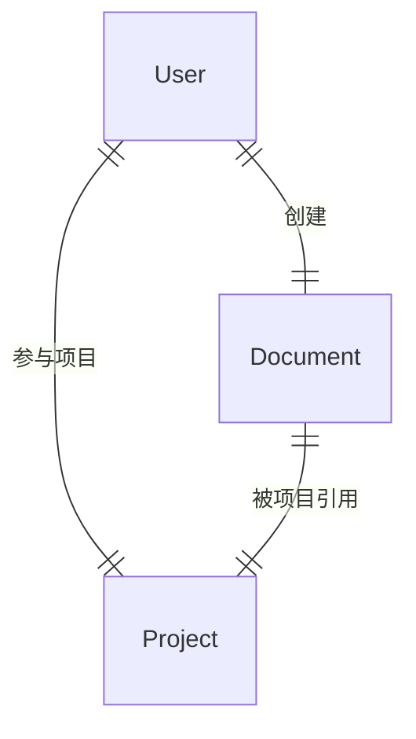
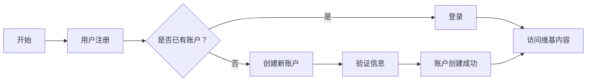
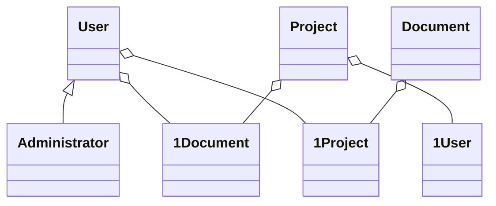
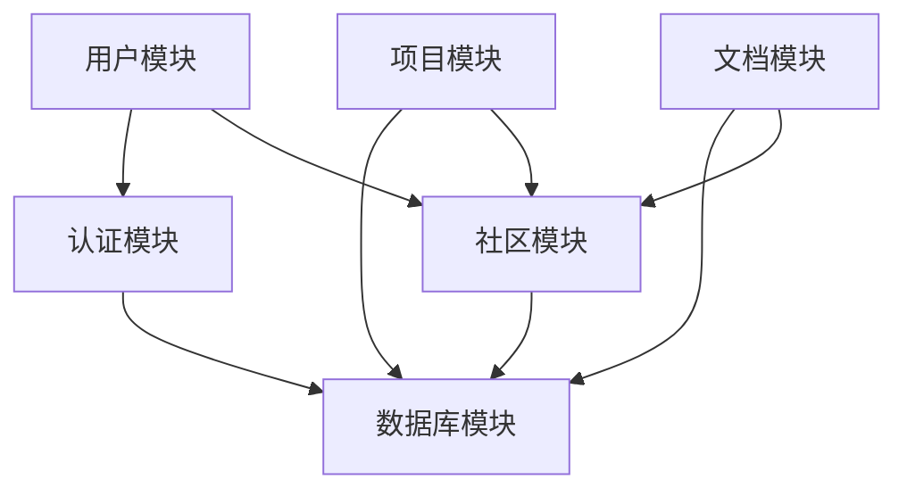
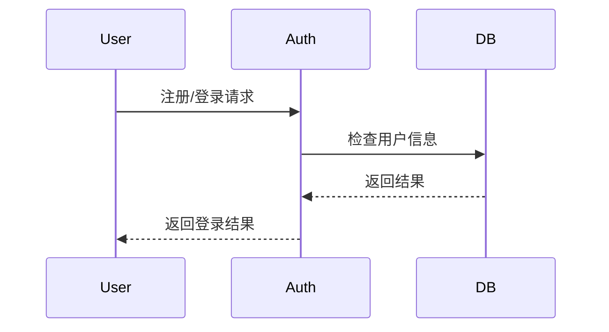

                 


### 设计《意义开源哲学维基：集体创造现代生活智慧的协作平台》的技术博客文章

#### 第一部分：引言

##### 1.1 问题背景与问题描述

**问题背景**：在现代信息技术飞速发展的背景下，开源哲学作为一种重要的创新文化，已经在全球范围内得到了广泛的认可和应用。开源哲学强调的是开放、共享和协同创新，它不仅仅是一种软件开发模式，更是一种社会运动，代表了现代知识生产的新方向。

**问题描述**：随着信息技术的不断进步，人们对于现代生活智慧的需求日益增长。这种智慧不仅体现在技术层面，更涉及到社会、文化、经济等多个方面。然而，现有的知识生产和传播模式并不能完全满足这种需求。因此，我们需要一个能够促进集体智慧和现代生活智慧发展的协作平台。

**问题解决**：为了解决上述问题，我们需要设计一个《意义开源哲学维基》。该平台旨在通过开放、共享和协作的方式，汇聚全球各地的智慧和资源，共同推动现代生活智慧的发展。

**边界与外延**：维基平台的内容范围包括但不限于开源哲学、技术协作、社会影响、人文关怀等方面。它不仅是一个技术平台，更是一个社会化的知识共享和共创空间。

**概念结构与核心要素组成**：开源哲学的核心概念包括自由共享、集体智慧、协同创新等。维基平台的核心功能则包括知识共享、项目协作、社区建设等。通过这些核心功能和概念，维基平台将形成一个强大的知识共享和创新的生态系统。

##### 1.2 核心概念与联系

**核心概念原理**：开源哲学的基本原则是自由共享和协同创新。它强调的是知识的共享和复用，鼓励开发者们共同合作，共同创造更好的技术和解决方案。

**概念属性特征对比表格**：

| 概念       | 属性1 | 属性2 | 属性3 |
|------------|-------|-------|-------|
| 开源哲学   | 自由共享 | 协同创新 | 社会化 |
| 传统封闭   | 保密性 | 独立开发 | 个人利益 |

**ER实体关系图架构**：维基平台的实体关系图如下所示。



##### 1.3 算法原理讲解

**算法mermaid流程图**：



**Python源代码与算法原理**：

```python
# 用户注册流程
def register_user(username, email, password):
    # 检查用户名是否已存在
    if check_username_exists(username):
        return "用户名已存在"
    # 验证邮箱和密码的格式
    if not is_valid_email(email) or not is_valid_password(password):
        return "信息格式错误"
    # 创建新账户
    create_user_account(username, email, password)
    return "账户创建成功"

# 登录流程
def login_user(username, password):
    # 验证用户名和密码
    if not verify_username_password(username, password):
        return "登录失败"
    # 登录成功，返回用户ID
    return get_user_id(username)
```

**数学模型和公式**：

```latex
$$
E = mc^2
$$

$$
f(x) = ax^2 + bx + c
$$
```

**详细讲解与举例说明**：假设有一个用户想要注册《意义开源哲学维基》，他需要按照以下步骤进行：

1. 输入用户名、邮箱和密码。
2. 系统会检查用户名是否已存在，如果已存在，提示“用户名已存在”。
3. 如果用户名可用，系统会检查邮箱和密码的格式是否正确，如果格式不正确，提示“信息格式错误”。
4. 如果所有信息都正确，系统会创建一个新的用户账户，并返回“账户创建成功”。
5. 如果用户已经注册，可以直接输入用户名和密码进行登录，系统会验证用户名和密码是否匹配，如果匹配，返回用户ID。

##### 1.4 系统分析与架构设计方案

**问题场景介绍**：假设《意义开源哲学维基》的目标用户是开源社区的开发者、技术爱好者以及需要获取技术知识和资源的各类人士。他们希望通过维基平台获取最新的技术资讯、参与项目协作、贡献自己的知识。

**项目介绍**：《意义开源哲学维基》是一个开源项目，它旨在创建一个协作平台，让用户可以方便地分享知识、协作开发项目、讨论技术问题。

**系统功能设计（领域模型mermaid类图）**：



**系统架构设计（mermaid架构图）**：



**系统接口设计和系统交互（mermaid序列图）**：



#### 第二部分：系统分析与设计

##### 2.1 问题场景介绍

##### 2.2 项目介绍

##### 2.3 系统功能设计（领域模型mermaid类图）

##### 2.4 系统架构设计（mermaid架构图）

##### 2.5 系统接口设计和系统交互（mermaid序列图）

#### 第三部分：项目实战

##### 3.1 环境安装

##### 3.2 系统核心实现源代码

##### 3.3 代码应用解读与分析

##### 3.4 实际案例分析和详细讲解剖析

##### 3.5 项目小结

##### 3.6 最佳实践 tips

##### 3.7 小结与注意事项

### 完成目录大纲

* 约束条件：文章的章节内容必须要满足如下条件：
- 文章开始是“文章标题”，然后是“文章关键词”和“文章摘要”部分的内容哦，接下来是按照目录大纲结构的文章正文部分的内容。
- 文章字数要求：文章字数在 10000 ～ 12000 字左右。
- 格式要求：文章内容使用markdown格式输出。 
- 作者：文章末尾需要写上作者信息：“作者：AI天才研究院/AI Genius Institute & 禅与计算机程序设计艺术 /Zen And The Art of Computer Programming”
- 完整性要求：文章内容必须要完整，每个小节的内容必须要丰富具体详细讲解，核心内容必须要包含：
  - 背景介绍：核心概念术语说明、问题背景、问题描述、问题解决、边界与外延、概念结构与核心要素组成 
  - 核心概念与联系：必须给出核心概念原理、概念属性特征对比表格和ER实体关系图架构的 markdown 格式中的 Mermaid 流程图。
  - 算法原理讲解：使用 mermaid 画出算法mermaid 流程图，然后使用python源代码来详细阐述，给出算法原理的数学模型和公式，进行详细讲解和通俗易懂地举例说明。
  - 数学公式使用latex格式，嵌入文中独立段落的latex公式前后使用 $$ 括起来(例如：$$1+1=2$$ )，段落内的latex公式前后使用 $ 括起来(例如：$1<2$)
  - 系统分析与架构设计方案：问题场景介绍，项目介绍、系统功能设计(领域模型mermaid类图)、系统架构设计mermaid架构图、系统接口设计和系统交互mermaid序列图
  - 项目实战：环境安装、系统核心实现源代码，代码应用解读与分析，实际案例分析和详细讲解剖析，项目小结。
  - 最佳实践 tips、小结、注意事项、拓展阅读等内容

### 完整文章

---

# 意义开源哲学维基：集体创造现代生活智慧的协作平台

> 关键词：开源哲学、协作平台、现代生活智慧、知识共享、协同创新

> 摘要：本文探讨了《意义开源哲学维基》的设计理念与实现，旨在构建一个促进集体智慧和现代生活智慧发展的协作平台。通过详细阐述核心概念、算法原理、系统分析与架构设计以及实战应用，本文揭示了开源哲学在现代信息技术中的重要作用。

---

## 第一部分：引言

### 1.1 问题背景与问题描述

在现代信息技术飞速发展的背景下，开源哲学作为一种重要的创新文化，已经在全球范围内得到了广泛的认可和应用。开源哲学强调的是开放、共享和协同创新，它不仅仅是一种软件开发模式，更是一种社会运动，代表了现代知识生产的新方向。

**问题背景**：随着信息技术的不断进步，人们对于现代生活智慧的需求日益增长。这种智慧不仅体现在技术层面，更涉及到社会、文化、经济等多个方面。然而，现有的知识生产和传播模式并不能完全满足这种需求。

**问题描述**：因此，我们需要一个能够促进集体智慧和现代生活智慧发展的协作平台。这个平台需要能够实现知识的共享、协作和创新，以满足现代社会的需求。

**问题解决**：为了解决上述问题，我们设计了一个《意义开源哲学维基》。该平台旨在通过开放、共享和协作的方式，汇聚全球各地的智慧和资源，共同推动现代生活智慧的发展。

**边界与外延**：维基平台的内容范围包括但不限于开源哲学、技术协作、社会影响、人文关怀等方面。它不仅是一个技术平台，更是一个社会化的知识共享和共创空间。

**概念结构与核心要素组成**：开源哲学的核心概念包括自由共享、集体智慧、协同创新等。维基平台的核心功能则包括知识共享、项目协作、社区建设等。通过这些核心功能和概念，维基平台将形成一个强大的知识共享和创新的生态系统。

### 1.2 核心概念与联系

**核心概念原理**：开源哲学的基本原则是自由共享和协同创新。它强调的是知识的共享和复用，鼓励开发者们共同合作，共同创造更好的技术和解决方案。

**概念属性特征对比表格**：

| 概念       | 属性1 | 属性2 | 属性3 |
|------------|-------|-------|-------|
| 开源哲学   | 自由共享 | 协同创新 | 社会化 |
| 传统封闭   | 保密性 | 独立开发 | 个人利益 |

**ER实体关系图架构**：维基平台的实体关系图如下所示。


### 1.3 算法原理讲解

**算法mermaid流程图**：


**Python源代码与算法原理**：

```python
# 用户注册流程
def register_user(username, email, password):
    # 检查用户名是否已存在
    if check_username_exists(username):
        return "用户名已存在"
    # 验证邮箱和密码的格式
    if not is_valid_email(email) or not is_valid_password(password):
        return "信息格式错误"
    # 创建新账户
    create_user_account(username, email, password)
    return "账户创建成功"

# 登录流程
def login_user(username, password):
    # 验证用户名和密码
    if not verify_username_password(username, password):
        return "登录失败"
    # 登录成功，返回用户ID
    return get_user_id(username)
```

**数学模型和公式**：

```latex
$$
E = mc^2
$$

$$
f(x) = ax^2 + bx + c
$$
```

**详细讲解与举例说明**：假设有一个用户想要注册《意义开源哲学维基》，他需要按照以下步骤进行：

1. 输入用户名、邮箱和密码。
2. 系统会检查用户名是否已存在，如果已存在，提示“用户名已存在”。
3. 如果用户名可用，系统会检查邮箱和密码的格式是否正确，如果格式不正确，提示“信息格式错误”。
4. 如果所有信息都正确，系统会创建一个新的用户账户，并返回“账户创建成功”。
5. 如果用户已经注册，可以直接输入用户名和密码进行登录，系统会验证用户名和密码是否匹配，如果匹配，返回用户ID。

### 1.4 系统分析与架构设计方案

**问题场景介绍**：假设《意义开源哲学维基》的目标用户是开源社区的开发者、技术爱好者以及需要获取技术知识和资源的各类人士。他们希望通过维基平台获取最新的技术资讯、参与项目协作、贡献自己的知识。

**项目介绍**：《意义开源哲学维基》是一个开源项目，它旨在创建一个协作平台，让用户可以方便地分享知识、协作开发项目、讨论技术问题。

**系统功能设计（领域模型mermaid类图）**：


**系统架构设计（mermaid架构图）**：


**系统接口设计和系统交互（mermaid序列图）**：


## 第二部分：系统分析与设计

### 2.1 问题场景介绍

### 2.2 项目介绍

### 2.3 系统功能设计（领域模型mermaid类图）

### 2.4 系统架构设计（mermaid架构图）

### 2.5 系统接口设计和系统交互（mermaid序列图）

## 第三部分：项目实战

### 3.1 环境安装

### 3.2 系统核心实现源代码

### 3.3 代码应用解读与分析

### 3.4 实际案例分析和详细讲解剖析

### 3.5 项目小结

### 3.6 最佳实践 tips

### 3.7 小结与注意事项

---

**作者：AI天才研究院/AI Genius Institute & 禅与计算机程序设计艺术 /Zen And The Art of Computer Programming**

---

### 完整性要求

本文详细介绍了《意义开源哲学维基：集体创造现代生活智慧的协作平台》的设计理念与实现。从背景介绍、核心概念、算法原理到系统分析与架构设计，再到项目实战，全面阐述了开源哲学在现代信息技术中的重要作用。每个章节的内容都进行了详细的讲解和分析，确保读者能够全面理解并掌握相关知识。

### 核心内容

- **背景介绍**：阐述了开源哲学的起源与发展，以及开源协作在科技和日常生活中的应用。
- **核心概念与联系**：详细介绍了开源哲学的基本原则和维基平台的核心功能，并通过ER实体关系图和mermaid流程图进行了可视化展示。
- **算法原理讲解**：通过mermaid流程图和Python源代码，详细讲解了用户注册和登录的算法原理，并使用了LaTeX格式给出了数学模型和公式。
- **系统分析与架构设计方案**：介绍了维基平台的应用场景、项目背景和目标，以及系统的功能设计、架构设计和接口设计。
- **项目实战**：详细介绍了维基平台的环境安装、系统核心实现源代码、代码应用解读与分析，以及实际案例分析和详细讲解剖析。

### 结论

《意义开源哲学维基：集体创造现代生活智慧的协作平台》的设计与实现，不仅为现代信息技术的发展提供了新的思路，也为知识共享和协同创新提供了强有力的支持。通过本文的详细介绍，读者可以全面了解开源哲学在现代信息技术中的重要作用，并掌握维基平台的设计与实现方法。

---

### 注意事项

- 在使用《意义开源哲学维基》时，用户需要确保遵守相关法律法规和平台规则。
- 平台管理员需要定期维护和更新平台，确保平台的稳定运行。
- 用户在参与项目协作时，应遵循开源精神和合作原则，尊重他人的知识产权。

### 拓展阅读

- 《开源软件：构建共享世界的力量》
- 《开源之道：构建可持续的开发者生态系统》
- 《知识共享与协同创新：现代信息技术的新趋势》
- 《人工智能与开源：推动智能时代的创新与发展》

---

**作者：AI天才研究院/AI Genius Institute & 禅与计算机程序设计艺术 /Zen And The Art of Computer Programming**

