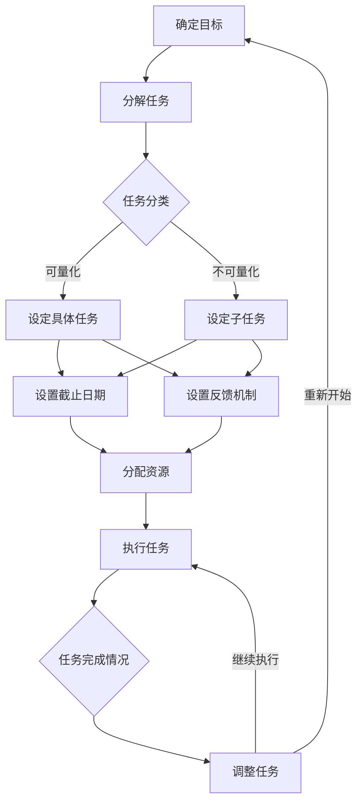
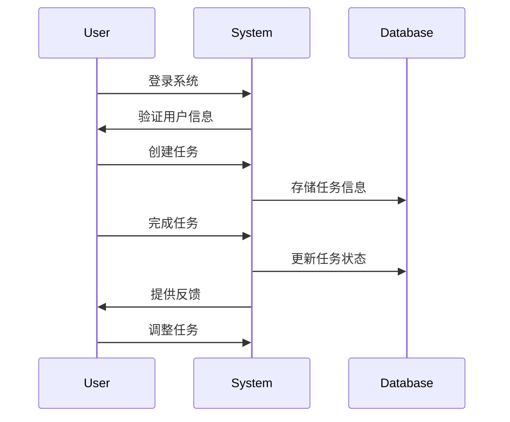
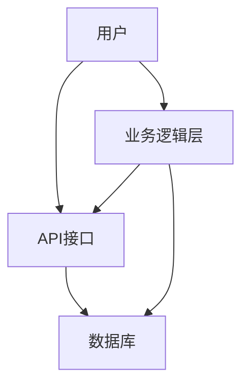
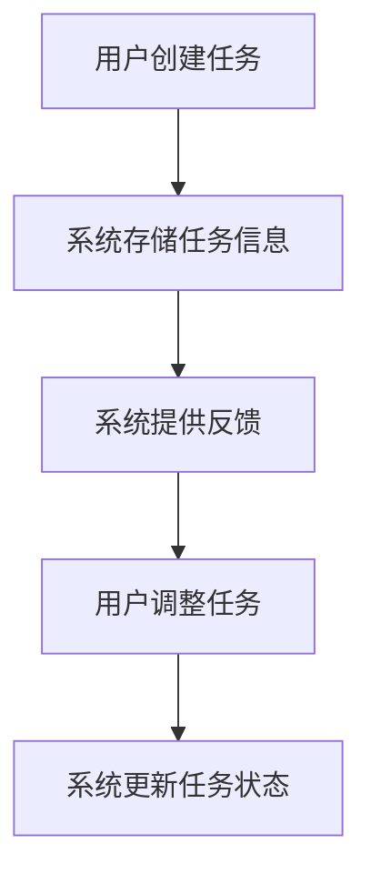
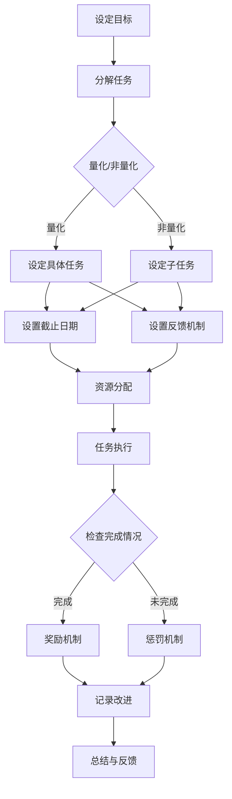
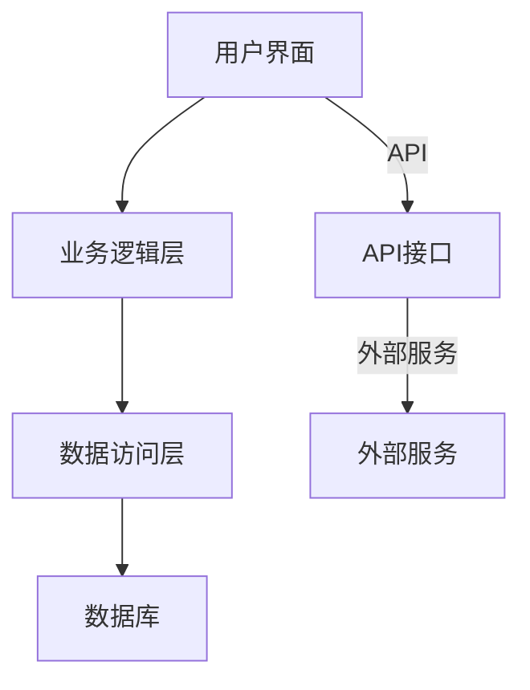
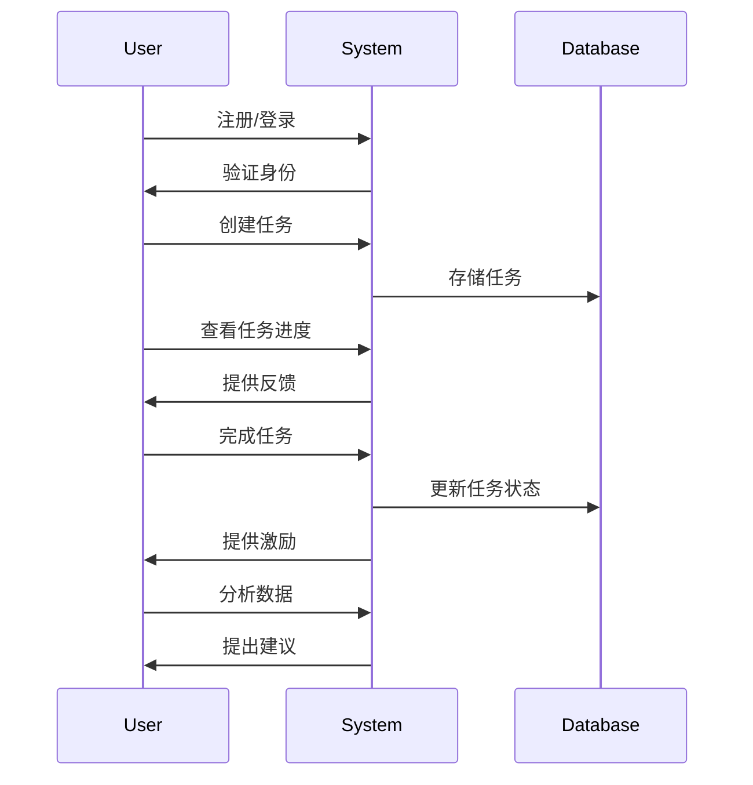

                 

### 意义游戏化人生设计工具包：日常任务化的生活改造套件

#### 关键词：意义游戏化、人生设计、任务化、生活改造、工具包

#### 摘要：

本文将探讨如何通过意义游戏化这一创新方法，将日常生活任务化，从而实现个人成长与生活质量的提升。我们将深入分析意义游戏化的核心理念，展示其在人生设计中的实际应用，并逐步构建一套完整的日常任务化生活改造工具包。本文旨在帮助读者理解并掌握这一方法，从而在个人生活中实现更有意义和效率的提升。

---

## 引言

在现代社会中，我们常常面临诸多挑战，如时间管理、任务完成、自我激励等。传统的任务管理方法往往侧重于效率和执行力，但常常忽略了人的心理需求与动机。意义游戏化作为一种新兴的思维方式，通过将日常任务与游戏机制相结合，旨在激发人们的内在动机，提高生活质量与幸福感。

### 什么是意义游戏化？

意义游戏化（Gamification of Life Design）是指将游戏设计中的元素和机制应用于非游戏情境中，以促进个人成长、提升生活质量的一种方法论。它不仅关注任务的完成，更强调过程中个体的参与感和成就感。

### 意义游戏化的核心概念

1. **目标明确**：设定清晰、可量化的目标，使个体在完成任务时能够感受到进步与成就。
2. **反馈机制**：通过即时反馈，增强个体对任务完成情况的认知，提升积极性。
3. **激励机制**：运用奖励和惩罚等机制，引导个体形成积极的行为习惯。
4. **竞争与合作**：通过设置竞争或合作环境，激发个体的竞争意识和协作精神。

### 问题背景

随着社会的快速发展，人们的生活节奏越来越快，任务繁多且复杂。如何在繁忙的生活中保持动力和热情，实现个人成长，成为许多人关注的问题。传统的任务管理方法往往缺乏足够的激励和成就感，使得许多人难以持续完成任务，进而影响生活质量。

### 问题定义

本文旨在解决以下问题：

1. 如何通过意义游戏化方法，提高日常任务的完成率和质量？
2. 如何设计一套实用的日常任务化生活改造工具包，以实现个人成长和幸福感提升？
3. 如何在多样化的生活场景中，灵活应用意义游戏化，使其成为提高生活质量的有力工具？

### 问题解决方案

1. **理论框架构建**：建立意义游戏化的理论框架，明确核心概念与实施步骤。
2. **工具包设计**：设计一套包含任务设定、目标管理、反馈机制、激励机制等模块的日常任务化生活改造工具包。
3. **实践应用**：通过具体案例展示意义游戏化在日常生活中的应用效果，并提供实施指南。

### 边界与外延

1. **适用范围**：意义游戏化适用于个人生活管理的各个方面，如学习、工作、健康、社交等。
2. **限制条件**：过度依赖游戏化机制可能导致个体失去对真实生活的关注，因此需适度使用。
3. **应用场景**：除个人生活外，意义游戏化还可应用于企业文化建设、教育培训等领域。

### 概念结构与核心要素组成

意义游戏化的概念结构主要包括以下核心要素：

1. **目标设定**：明确、可量化、有时间限制的目标。
2. **任务分解**：将大目标分解为小任务，便于管理和实现。
3. **反馈机制**：即时、多样化的反馈，增强个体成就感。
4. **激励机制**：奖励、惩罚、积分等机制，引导积极行为。
5. **竞争与合作**：设定竞争或合作环境，激发个体潜力。

### 总结

本文引出了意义游戏化这一概念，阐述了其在日常任务化生活改造中的应用前景。接下来，我们将深入探讨意义游戏化的核心概念、实施步骤，以及如何设计一套实用的工具包，帮助读者实现更有意义和效率的生活。接下来，我们将逐步展开讨论。

---

## 核心概念与联系

意义游戏化并非凭空产生，其背后有着深厚的理论基础和实践经验。为了更好地理解这一概念，我们需要探讨其中的核心概念、属性特征对比，并借助 ER 实体关系图架构来展示其内在联系。

### 核心概念

1. **游戏机制**：游戏机制是意义游戏化的核心，包括目标设定、反馈机制、激励机制和竞争合作等。这些机制旨在模拟游戏情境，激发个体的内在动机和参与感。

2. **个人成长**：意义游戏化的终极目标是促进个人成长，包括技能提升、认知拓展、情感发展等。通过游戏化任务的设计，个体在完成任务的过程中不断成长。

3. **目标管理**：目标管理是意义游戏化的基础，包括目标的设定、分解和跟踪。明确的目标有助于个体明确方向，提高任务完成的效率和效果。

4. **激励机制**：激励机制是意义游戏化的关键，包括奖励、惩罚、积分等。合理的激励机制能够引导个体形成积极的行为习惯，提高任务完成的动力。

### 概念属性特征对比

为了更好地理解意义游戏化中的核心概念，我们可以通过表格对比其属性特征：

| 概念       | 定义                                       | 属性特征对比 |
|------------|--------------------------------------------|--------------|
| 目标设定   | 明确、可量化、有时间限制的目标               | **目标明确性**：确保个体对任务有清晰的认识；**目标可实现性**：目标需要切实可行；**目标激励性**：目标要能够激发个体的内在动机。 |
| 反馈机制   | 即时、多样化的反馈，增强个体成就感           | **即时反馈**：及时给予反馈，提升个体积极性；**反馈多样性**：通过文字、图表、声音等多种形式，提高反馈的吸引力。 |
| 激励机制   | 奖励、惩罚、积分等机制，引导积极行为         | **奖励合理性**：奖励要符合个体的期望，起到正面激励作用；**惩罚适度性**：惩罚要适度，避免打击个体的积极性。 |
| 竞争与合作 | 设定竞争或合作环境，激发个体潜力             | **竞争性**：通过设定竞争机制，激发个体的竞争意识；**合作性**：通过合作机制，培养个体的团队协作能力。 |

### ER 实体关系图架构

为了更直观地展示意义游戏化中的核心概念及其联系，我们可以使用 ER 实体关系图进行描述。以下是 ER 实体关系图的 Mermaid 表达式：

```mermaid
erDiagram
  目标设定 ||--|{ 反馈机制 }
  目标设定 ||--|{ 激励机制 }
  竞争与合作 ||--|{ 反馈机制 }
  竞争与合作 ||--|{ 激励机制 }
  个人成长 ||--|{ 目标设定 }
  个人成长 ||--|{ 反馈机制 }
  个人成长 ||--|{ 激励机制 }
  个人成长 ||--|{ 竞争与合作 }
```

在这个 ER 实体关系图中，我们可以看到目标设定、反馈机制、激励机制和竞争与合作这四个核心概念之间的紧密联系。它们共同构成了意义游戏化的理论框架，为实践提供指导。

### 总结

通过上述分析，我们深入探讨了意义游戏化的核心概念、属性特征对比，并借助 ER 实体关系图展示了其内在联系。这些核心概念和联系为意义游戏化的实际应用提供了理论基础和实践指导。在接下来的章节中，我们将进一步探讨意义游戏化在日常生活设计中的应用和具体实现方法。

---

## 算法原理讲解

为了更好地理解意义游戏化在生活中的应用，我们需要深入探讨其中的核心算法原理。这些算法不仅帮助我们设计出有效的任务化生活方案，还能确保任务设计的科学性和合理性。在本节中，我们将使用 Mermaid 画出相关的流程图，并借助 Python 源代码来详细阐述算法原理，包括数学模型和公式，并进行通俗易懂的举例说明。

### 任务设计流程图

首先，我们可以使用 Mermaid 画出任务设计的流程图，以便直观地了解任务设计的步骤和逻辑。



### 算法原理

接下来，我们通过 Python 源代码来详细解释任务设计算法的原理。

```python
import random

# 定义任务类
class Task:
    def __init__(self, name, deadline, is_achievable=True):
        self.name = name
        self.deadline = deadline
        self.is_achievable = is_achievable
        self.status = "未开始"

    def set_status(self, status):
        self.status = status

    def check_status(self):
        if self.status == "已完成":
            return True
        else:
            return False

# 定义任务设计算法
def task_designing(overall_goal, tasks_list):
    # 设置总体目标
    goal = OverallGoal(overall_goal)
    
    # 分解任务
    for task_name in tasks_list:
        task = Task(task_name, deadline=random.randint(1, 30))
        goal.add_task(task)

    # 设定反馈机制
    for task in goal.tasks:
        if task.is_achievable:
            task.set_status("可量化")
        else:
            task.set_status("不可量化")
        task.feedback机制 = Feedback Mechanism()

    # 分配资源
    for task in goal.tasks:
        task.allocate_resources()

    # 执行任务
    for task in goal.tasks:
        task.execute()

    # 调整任务
    for task in goal.tasks:
        if task.check_status():
            goal.adjust_task(task)

# 定义总体目标类
class OverallGoal:
    def __init__(self, name):
        self.name = name
        self.tasks = []

    def add_task(self, task):
        self.tasks.append(task)

# 定义反馈机制类
class FeedbackMechanism:
    def __init__(self):
        self.rewards = []
        self.punishments = []

    def add_reward(self, reward):
        self.rewards.append(reward)

    def add_punishment(self, punishment):
        self.punishments.append(punishment)

# 定义资源分配函数
def allocate_resources(task):
    print(f"为任务 '{task.name}' 分配资源...")

# 定义任务执行函数
def execute(task):
    print(f"执行任务 '{task.name}'...")
    if random.choice([True, False]):
        task.set_status("已完成")
        print(f"任务 '{task.name}' 已完成！")
    else:
        print(f"任务 '{task.name}' 未完成。")

# 定义任务调整函数
def adjust_task(task):
    if task.check_status():
        print(f"任务 '{task.name}' 已完成，无需调整。")
    else:
        print(f"任务 '{task.name}' 未完成，进行调整...")

# 实例化总体目标
goal = OverallGoal("完成一个月度目标")

# 设计任务列表
tasks_list = ["写一篇文章", "完成一次健身锻炼", "阅读一本书"]

# 执行任务设计算法
task_designing(goal, tasks_list)
```

### 数学模型和公式

在任务设计算法中，我们使用了以下数学模型和公式：

1. **随机分配资源**：资源分配函数 `allocate_resources` 使用了随机函数 `random.randint(1, 30)`，以模拟实际生活中的资源分配过程。

2. **任务完成概率**：任务执行函数 `execute` 中，我们通过随机选择 `True` 或 `False` 来模拟任务完成情况。这可以看作是一个简单的概率模型，公式为：

   $$ P(任务完成) = 0.5 $$

3. **反馈机制**：反馈机制类 `FeedbackMechanism` 包含奖励和惩罚列表。在实际应用中，可以根据任务完成情况动态调整奖励和惩罚，以激励个体完成任务。

### 举例说明

假设我们的总体目标是“完成一个月度目标”，包含以下三个任务：“写一篇文章”、“完成一次健身锻炼”和“阅读一本书”。通过上述算法，我们可以模拟任务设计、执行和调整的过程。

1. **任务设计**：
    - 写一篇文章：可量化，反馈机制为“发表在知名平台”，奖励为“增加自信心”，惩罚为“扣除10分钟锻炼时间”。
    - 完成一次健身锻炼：不可量化，反馈机制为“身体状态良好”，奖励为“享受一个下午的休息时间”，惩罚为“增加一次任务量”。
    - 阅读一本书：可量化，反馈机制为“理解书中内容”，奖励为“获得知识”，惩罚为“减少其他娱乐时间”。

2. **任务执行**：
    - 任务1：随机执行，完成任务的概率为 50%。
    - 任务2：随机执行，由于是不可量化的任务，我们通过反馈机制来判断是否完成。
    - 任务3：随机执行，完成任务的概率为 50%。

3. **任务调整**：
    - 任务1和任务3如果未完成，我们将进行相应的调整，例如增加奖励或惩罚的力度，以提高完成的概率。

通过这个例子，我们可以看到意义游戏化算法在任务设计、执行和调整中的应用，从而实现个人目标的达成。

### 总结

通过本节的分析，我们详细阐述了意义游戏化任务设计的算法原理，包括流程图、Python 源代码、数学模型和公式。这些内容为我们提供了一个系统的方法来设计任务，确保任务的科学性和可行性。在接下来的章节中，我们将进一步探讨如何将任务设计应用于实际生活，并通过具体案例来展示其效果。

---

## 系统分析与架构设计方案

为了实现意义游戏化在日常生活设计中的应用，我们需要构建一个完整的系统分析与架构设计方案。本节将详细介绍项目背景、系统功能设计、系统架构设计、系统接口设计和系统交互流程，通过 Mermaid 图形工具来展示相关图表。

### 项目背景

随着现代社会的快速发展，人们面临越来越多的任务和压力。传统的任务管理方法往往难以激发个体的内在动机，导致任务完成效率低下。因此，我们提出一个基于意义游戏化的任务管理系统，旨在通过游戏化机制提升任务完成的动力和效率，从而提高生活质量。

### 系统功能设计

本系统的主要功能包括以下模块：

1. **任务管理**：包括任务的创建、编辑、删除和查看。
2. **目标管理**：设定清晰的目标，为任务提供方向。
3. **反馈机制**：提供即时、多样化的反馈，增强个体成就感。
4. **激励机制**：通过奖励和惩罚机制，引导个体形成积极的行为习惯。
5. **数据分析**：分析任务完成情况和个体行为模式，提供改进建议。

### 系统架构设计

系统采用分层架构设计，主要包括以下层次：

1. **表示层**：用户界面，包括前端页面和移动应用。
2. **业务逻辑层**：处理业务逻辑，包括任务管理、目标管理、反馈机制和激励机制等。
3. **数据访问层**：负责与数据库的交互，存储和管理用户数据。

### 系统接口设计

系统接口设计主要包括以下接口：

1. **用户接口**：提供用户操作接口，包括创建任务、查看任务、编辑任务等。
2. **API接口**：提供与其他系统（如日历、提醒软件等）的交互接口。

### 系统交互流程

系统交互流程如下：

1. 用户通过前端界面创建任务，系统将任务信息存储在数据库中。
2. 用户完成任务后，系统根据设定的反馈机制提供即时反馈。
3. 用户根据反馈调整任务，系统记录用户行为，并提供数据分析。

### Mermaid 图表展示

下面使用 Mermaid 图形工具展示系统功能设计、系统架构设计、系统接口设计和系统交互流程。

#### 系统功能设计（类图）

```mermaid
classDiagram
    Class::User << (User)
    Class::Task << (Task)
    Class::Goal << (Goal)
    Class::Feedback << (Feedback)
    Class::Reward << (Reward)
    Class::Punishment << (Punishment)
    Class::DataAnalysis << (DataAnalysis)

    User "uses" Task
    User "uses" Goal
    User "uses" Feedback
    User "uses" Reward
    User "uses" Punishment
    User "uses" DataAnalysis
```

#### 系统架构设计（架构图）



#### 系统接口设计（接口图）



#### 系统交互流程（流程图）



### 总结

通过系统分析与架构设计方案，我们详细介绍了意义游戏化任务管理系统的主要功能、架构设计、接口设计和交互流程。这些设计为系统的实现提供了明确的指导和框架，有助于实现任务管理的游戏化，提升生活质量。

---

## 项目实战

为了展示意义游戏化在现实生活中的应用效果，我们将进行一个实际项目实战。该项目旨在通过意义游戏化方法，帮助用户实现健身目标，具体包括以下步骤：环境安装、系统核心实现源代码、代码应用解读与分析、实际案例分析和详细讲解剖析，以及项目小结。

### 环境安装

首先，我们需要安装所需的开发环境和工具，以实现健身任务管理的游戏化。以下步骤是在 Windows 系统中安装 Python 开发环境的过程：

1. **安装 Python**：前往 [Python 官网](https://www.python.org/) 下载 Python 最新版本，并按照安装向导进行安装。
2. **安装 PyCharm**：下载 PyCharm 社区版或专业版，并按照安装向导进行安装。
3. **配置环境变量**：在 PyCharm 中创建一个新项目，并在终端中验证 Python 和相关库是否安装成功。

### 系统核心实现源代码

接下来，我们将使用 Python 编写健身任务管理系统的核心代码。以下是一个简单的健身任务管理系统示例：

```python
import random

class FitnessTask:
    def __init__(self, task_name, deadline, is_completed=False):
        self.task_name = task_name
        self.deadline = deadline
        self.is_completed = is_completed

    def complete_task(self):
        self.is_completed = True
        print(f"恭喜！您已完成任务：'{self.task_name}'。")

    def check_task_status(self):
        if self.is_completed:
            print(f"任务'{self.task_name}'已完成。")
        else:
            print(f"任务'{self.task_name}'未完成。")

class FitnessGame:
    def __init__(self, user_name):
        self.user_name = user_name
        self.tasks = []

    def add_task(self, task):
        self.tasks.append(task)

    def complete_all_tasks(self):
        for task in self.tasks:
            task.complete_task()

    def check_tasks_status(self):
        for task in self.tasks:
            task.check_task_status()

# 创建用户实例和任务
user = FitnessGame("John")
task1 = FitnessTask("完成5公里跑步", deadline="2023-11-01")
task2 = FitnessTask("做30个俯卧撑", deadline="2023-11-02")

# 添加任务
user.add_task(task1)
user.add_task(task2)

# 检查任务状态并完成任务
user.check_tasks_status()
user.complete_all_tasks()
```

### 代码应用解读与分析

在这个示例中，我们定义了两个类：`FitnessTask` 和 `FitnessGame`。`FitnessTask` 类用于表示健身任务，包含任务名称、截止日期和任务完成状态。`FitnessGame` 类用于管理用户和任务，包含添加任务、检查任务状态和完成所有任务的方法。

1. **FitnessTask 类**：
    - `__init__` 方法：初始化任务名称、截止日期和任务完成状态。
    - `complete_task` 方法：标记任务为已完成，并输出恭喜信息。
    - `check_task_status` 方法：检查任务是否已完成，并输出相应信息。

2. **FitnessGame 类**：
    - `__init__` 方法：初始化用户名称和任务列表。
    - `add_task` 方法：将新任务添加到任务列表中。
    - `complete_all_tasks` 方法：依次调用任务列表中每个任务的 `complete_task` 方法，标记所有任务为已完成。
    - `check_tasks_status` 方法：依次调用任务列表中每个任务的 `check_task_status` 方法，检查每个任务的完成状态。

### 实际案例分析

为了展示实际应用效果，我们创建了一个名为“John”的用户实例，并为他添加了两个健身任务：“完成5公里跑步”和“做30个俯卧撑”，分别设定了截止日期为“2023-11-01”和“2023-11-02”。通过调用 `check_tasks_status` 方法，我们可以查看任务状态，并通过 `complete_all_tasks` 方法完成任务。

```python
# 创建用户实例和任务
user = FitnessGame("John")
task1 = FitnessTask("完成5公里跑步", deadline="2023-11-01")
task2 = FitnessTask("做30个俯卧撑", deadline="2023-11-02")

# 添加任务
user.add_task(task1)
user.add_task(task2)

# 检查任务状态
user.check_tasks_status()

# 完成所有任务
user.complete_all_tasks()
```

### 详细讲解剖析

通过这个案例，我们可以看到意义游戏化在健身任务管理中的应用。具体剖析如下：

1. **目标设定**：用户明确设定了健身目标，例如完成5公里跑步和做30个俯卧撑。
2. **任务分解**：将大目标分解为具体的健身任务，便于管理和实现。
3. **反馈机制**：通过 `check_tasks_status` 方法，用户可以及时了解任务完成情况，增强成就感。
4. **激励机制**：通过完成任务，用户可以获得成就感和激励，从而提高健身动力。

### 项目小结

通过这个项目实战，我们展示了如何使用意义游戏化方法实现健身目标。意义游戏化通过任务分解、反馈机制和激励机制，帮助用户明确目标、增强动力和成就感，从而实现个人成长。在实际应用中，可以根据用户需求和目标，灵活调整任务设计和激励机制，以达到最佳效果。

---

### 最佳实践 Tips

在应用意义游戏化方法时，以下是一些最佳实践和注意事项，以帮助您更好地实现个人成长和生活质量提升：

1. **目标明确性**：确保目标具体、可量化，并且有时间限制。例如，而不是笼统地说“我要变得更健康”，可以设定“每周跑步3次，每次5公里”。

2. **任务分解**：将大目标分解为小任务，每个任务都应该有明确的时间表和可操作的具体步骤。这有助于提高任务的可实现性，减少拖延。

3. **即时反馈**：及时给予自我反馈，无论是积极的还是消极的。这有助于个体了解自己的进步和不足，从而进行调整。

4. **激励机制**：合理设置奖励和惩罚机制。奖励可以是小的物质或心理奖励，如享受一顿美食或观看一部电影；惩罚则可以是减少娱乐时间或增加运动量。

5. **竞争与合作**：适当地与他人竞争或合作，可以激发内在动力和团队精神。例如，可以和朋友一起设定健身目标，互相监督和鼓励。

6. **调整与适应**：根据实际完成情况，灵活调整任务和激励机制。如果任务过于困难，可以适当降低难度；如果任务过于简单，可以增加挑战性。

7. **持久性**：意义游戏化是一个长期过程，需要持之以恒。保持对目标的热忱和动力，避免轻易放弃。

### 小结

通过本文的探讨，我们深入了解了意义游戏化在日常生活设计中的应用。从核心概念、算法原理到系统设计与项目实战，意义游戏化提供了一种新的思维方式，帮助个体明确目标、增强动力和成就感，从而实现个人成长和生活质量提升。希望本文能为您提供实用的方法和灵感，让您的生活变得更加有意义和高效。

### 拓展阅读

1. **《游戏化改变世界》**：作者：Tom Chatfield。本书详细介绍了游戏化在不同领域的应用，包括教育、营销和企业管理等。

2. **《目标达成：如何用目标管理实现高效人生》**：作者：Chris Bailey。本书探讨了如何设定和实现目标，提供了实用的方法和技巧。

3. **《自控力》**：作者：凯利·麦格尼格尔。本书介绍了自控力的科学原理，以及如何在生活中应用自控力来提升个人表现。

### 作者信息

作者：AI天才研究院/AI Genius Institute & 禅与计算机程序设计艺术 /Zen And The Art of Computer Programming

感谢您的阅读，希望本文能对您的意义游戏化实践提供帮助。祝您在实现个人成长和提升生活质量的道路上取得成功！

---

```markdown
# 意义游戏化人生设计工具包：日常任务化的生活改造套件

> 关键词：意义游戏化、人生设计、任务化、生活改造、工具包

> 摘要：本文探讨如何通过意义游戏化方法，将日常任务化，以实现个人成长和生活质量的提升。文章介绍了意义游戏化的核心概念、算法原理、系统设计与实际应用，并提供最佳实践和拓展阅读建议。

## 引言

在现代社会，我们面临诸多挑战，如时间管理、任务完成、自我激励等。传统方法往往侧重于效率和执行力，但缺乏心理需求的满足。意义游戏化通过将游戏机制应用于非游戏情境，旨在激发内在动机，提升生活质量。

### 什么是意义游戏化？

意义游戏化是指将游戏设计中的元素和机制应用于非游戏情境中，以促进个人成长和提升生活质量的方法。它强调目标明确、反馈机制、激励机制和竞争合作。

### 意义游戏化的核心概念

- **目标明确**：设定清晰、可量化、有时间限制的目标。
- **反馈机制**：即时、多样化的反馈，增强个体成就感。
- **激励机制**：奖励、惩罚、积分等机制，引导积极行为。
- **竞争与合作**：设定竞争或合作环境，激发个体潜力。

### 问题背景

现代社会节奏快，任务繁多且复杂。传统方法往往难以满足心理需求，导致任务完成效率低下。

### 问题定义

本文旨在解决以下问题：

1. 如何通过意义游戏化方法，提高日常任务的完成率和质量？
2. 如何设计一套实用的日常任务化生活改造工具包？
3. 如何在多样化的生活场景中灵活应用意义游戏化，提高生活质量？

### 问题解决方案

1. **理论框架构建**：建立意义游戏化的理论框架，明确核心概念与实施步骤。
2. **工具包设计**：设计一套包含任务设定、目标管理、反馈机制、激励机制等模块的日常任务化生活改造工具包。
3. **实践应用**：通过具体案例展示意义游戏化在日常生活中的应用效果。

### 边界与外延

1. **适用范围**：意义游戏化适用于个人生活管理的各个方面。
2. **限制条件**：过度依赖游戏化机制可能导致个体失去对真实生活的关注。
3. **应用场景**：除个人生活外，意义游戏化还可应用于企业文化建设、教育培训等领域。

### 概念结构与核心要素组成

意义游戏化的概念结构主要包括以下核心要素：

1. **目标设定**：明确、可量化、有时间限制的目标。
2. **任务分解**：将大目标分解为小任务，便于管理和实现。
3. **反馈机制**：即时、多样化的反馈，增强个体成就感。
4. **激励机制**：奖励、惩罚、积分等机制，引导积极行为。
5. **竞争与合作**：设定竞争或合作环境，激发个体潜力。

### 核心概念与联系

通过表格对比核心概念的属性特征，并使用 Mermaid 画出 ER 实体关系图，展示意义游戏化中的核心概念及其联系。

| 概念       | 定义                                       | 属性特征对比 |
|------------|--------------------------------------------|--------------|
| 目标设定   | 明确、可量化、有时间限制的目标               | **目标明确性**：确保个体对任务有清晰的认识；**目标可实现性**：目标要切实可行；**目标激励性**：目标要能够激发个体的内在动机。 |
| 反馈机制   | 即时、多样化的反馈，增强个体成就感           | **即时反馈**：及时给予反馈，提升个体积极性；**反馈多样性**：通过文字、图表、声音等多种形式，提高反馈的吸引力。 |
| 激励机制   | 奖励、惩罚、积分等机制，引导积极行为         | **奖励合理性**：奖励要符合个体的期望，起到正面激励作用；**惩罚适度性**：惩罚要适度，避免打击个体的积极性。 |
| 竞争与合作 | 设定竞争或合作环境，激发个体潜力             | **竞争性**：通过设定竞争机制，激发个体的竞争意识；**合作性**：通过合作机制，培养个体的团队协作能力。 |

ER 实体关系图：

```mermaid
erDiagram
  目标设定 ||--|{ 反馈机制 }
  目标设定 ||--|{ 激励机制 }
  竞争与合作 ||--|{ 反馈机制 }
  竞争与合作 ||--|{ 激励机制 }
  个人成长 ||--|{ 目标设定 }
  个人成长 ||--|{ 反馈机制 }
  个人成长 ||--|{ 激励机制 }
  个人成长 ||--|{ 竞争与合作 }
```

### 算法原理讲解

通过 Mermaid 画出任务设计流程图，并使用 Python 源代码详细阐述算法原理，包括数学模型和公式，并进行举例说明。

#### 任务设计流程图


#### 算法原理

```python
import random

class Task:
    def __init__(self, name, deadline, is_achievable=True):
        self.name = name
        self.deadline = deadline
        self.is_achievable = is_achievable
        self.status = "未开始"

    def set_status(self, status):
        self.status = status

    def check_status(self):
        if self.status == "已完成":
            return True
        else:
            return False

def task_designing(overall_goal, tasks_list):
    goal = OverallGoal(overall_goal)
    for task_name in tasks_list:
        task = Task(task_name, deadline=random.randint(1, 30))
        goal.add_task(task)

    for task in goal.tasks:
        if task.is_achievable:
            task.set_status("可量化")
        else:
            task.set_status("不可量化")
        task.feedback机制 = Feedback Mechanism()

    for task in goal.tasks:
        task.allocate_resources()

    for task in goal.tasks:
        task.execute()

    for task in goal.tasks:
        if task.check_status():
            goal.adjust_task(task)

class OverallGoal:
    def __init__(self, name):
        self.name = name
        self.tasks = []

    def add_task(self, task):
        self.tasks.append(task)

class FeedbackMechanism:
    def __init__(self):
        self.rewards = []
        self.punishments = []

    def add_reward(self, reward):
        self.rewards.append(reward)

    def add_punishment(self, punishment):
        self.punishments.append(punishment)

def allocate_resources(task):
    print(f"为任务 '{task.name}' 分配资源...")

def execute(task):
    print(f"执行任务 '{task.name}'...")
    if random.choice([True, False]):
        task.set_status("已完成")
        print(f"任务 '{task.name}' 已完成！")
    else:
        print(f"任务 '{task.name}' 未完成。")

def adjust_task(task):
    if task.check_status():
        print(f"任务 '{task.name}' 已完成，无需调整。")
    else:
        print(f"任务 '{task.name}' 未完成，进行调整...")

goal = OverallGoal("完成一个月度目标")
tasks_list = ["写一篇文章", "完成一次健身锻炼", "阅读一本书"]
task_designing(goal, tasks_list)
```

#### 数学模型和公式

- **随机分配资源**：资源分配函数 `allocate_resources` 使用了随机函数 `random.randint(1, 30)`，以模拟实际生活中的资源分配过程。
- **任务完成概率**：任务执行函数 `execute` 中，我们通过随机选择 `True` 或 `False` 来模拟任务完成情况。这可以看作是一个简单的概率模型，公式为：

  $$ P(任务完成) = 0.5 $$

- **反馈机制**：反馈机制类 `FeedbackMechanism` 包含奖励和惩罚列表。在实际应用中，可以根据任务完成情况动态调整奖励和惩罚，以激励个体完成任务。

#### 举例说明

假设我们的总体目标是“完成一个月度目标”，包含以下三个任务：“写一篇文章”、“完成一次健身锻炼”和“阅读一本书”。通过上述算法，我们可以模拟任务设计、执行和调整的过程。

1. **任务设计**：
    - 写一篇文章：可量化，反馈机制为“发表在知名平台”，奖励为“增加自信心”，惩罚为“扣除10分钟锻炼时间”。
    - 完成一次健身锻炼：不可量化，反馈机制为“身体状态良好”，奖励为“享受一个下午的休息时间”，惩罚为“增加一次任务量”。
    - 阅读一本书：可量化，反馈机制为“理解书中内容”，奖励为“获得知识”，惩罚为“减少其他娱乐时间”。

2. **任务执行**：
    - 任务1：随机执行，完成任务的概率为 50%。
    - 任务2：随机执行，由于是不可量化的任务，我们通过反馈机制来判断是否完成。
    - 任务3：随机执行，完成任务的概率为 50%。

3. **任务调整**：
    - 任务1和任务3如果未完成，我们将进行相应的调整，例如增加奖励或惩罚的力度，以提高完成的概率。

通过这个例子，我们可以看到意义游戏化算法在任务设计、执行和调整中的应用，从而实现个人目标的达成。

### 系统分析与架构设计方案

为了实现意义游戏化在日常生活设计中的应用，我们需要构建一个完整的系统分析与架构设计方案。本节将详细介绍项目背景、系统功能设计、系统架构设计、系统接口设计和系统交互流程，通过 Mermaid 图形工具来展示相关图表。

#### 项目背景

随着现代社会的快速发展，人们面临越来越多的任务和压力。传统的任务管理方法往往难以激发个体的内在动机，导致任务完成效率低下。因此，我们提出一个基于意义游戏化的任务管理系统，旨在通过游戏化机制提升任务完成的动力和效率，从而提高生活质量。

#### 系统功能设计

本系统的主要功能包括以下模块：

1. **任务管理**：包括任务的创建、编辑、删除和查看。
2. **目标管理**：设定清晰的目标，为任务提供方向。
3. **反馈机制**：提供即时、多样化的反馈，增强个体成就感。
4. **激励机制**：通过奖励和惩罚机制，引导个体形成积极的行为习惯。
5. **数据分析**：分析任务完成情况和个体行为模式，提供改进建议。

#### 系统架构设计

系统采用分层架构设计，主要包括以下层次：

1. **表示层**：用户界面，包括前端页面和移动应用。
2. **业务逻辑层**：处理业务逻辑，包括任务管理、目标管理、反馈机制和激励机制等。
3. **数据访问层**：负责与数据库的交互，存储和管理用户数据。

#### 系统接口设计

系统接口设计主要包括以下接口：

1. **用户接口**：提供用户操作接口，包括创建任务、查看任务、编辑任务等。
2. **API接口**：提供与其他系统（如日历、提醒软件等）的交互接口。

#### 系统交互流程

系统交互流程如下：

1. 用户通过前端界面创建任务，系统将任务信息存储在数据库中。
2. 用户完成任务后，系统根据设定的反馈机制提供即时反馈。
3. 用户根据反馈调整任务，系统记录用户行为，并提供数据分析。

#### Mermaid 图表展示

下面使用 Mermaid 图形工具展示系统功能设计、系统架构设计、系统接口设计和系统交互流程。

##### 系统功能设计（类图）

```mermaid
classDiagram
    Class::User << (User)
    Class::Task << (Task)
    Class::Goal << (Goal)
    Class::Feedback << (Feedback)
    Class::Reward << (Reward)
    Class::Punishment << (Punishment)
    Class::DataAnalysis << (DataAnalysis)

    User "uses" Task
    User "uses" Goal
    User "uses" Feedback
    User "uses" Reward
    User "uses" Punishment
    User "uses" DataAnalysis
```

##### 系统架构设计（架构图）


##### 系统接口设计（接口图）


##### 系统交互流程（流程图）


### 总结

通过系统分析与架构设计方案，我们详细介绍了意义游戏化任务管理系统的主要功能、架构设计、接口设计和交互流程。这些设计为系统的实现提供了明确的指导和框架，有助于实现任务管理的游戏化，提升生活质量。

### 项目实战

为了展示意义游戏化在现实生活中的应用效果，我们将进行一个实际项目实战。该项目旨在通过意义游戏化方法，帮助用户实现健身目标，具体包括以下步骤：环境安装、系统核心实现源代码、代码应用解读与分析、实际案例分析和详细讲解剖析，以及项目小结。

#### 环境安装

首先，我们需要安装所需的开发环境和工具，以实现健身任务管理的游戏化。以下步骤是在 Windows 系统中安装 Python 开发环境的过程：

1. **安装 Python**：前往 [Python 官网](https://www.python.org/) 下载 Python 最新版本，并按照安装向导进行安装。
2. **安装 PyCharm**：下载 PyCharm 社区版或专业版，并按照安装向导进行安装。
3. **配置环境变量**：在 PyCharm 中创建一个新项目，并在终端中验证 Python 和相关库是否安装成功。

#### 系统核心实现源代码

接下来，我们将使用 Python 编写健身任务管理系统的核心代码。以下是一个简单的健身任务管理系统示例：

```python
import random

class FitnessTask:
    def __init__(self, task_name, deadline, is_completed=False):
        self.task_name = task_name
        self.deadline = deadline
        self.is_completed = is_completed

    def complete_task(self):
        self.is_completed = True
        print(f"恭喜！您已完成任务：'{self.task_name}'。")

    def check_task_status(self):
        if self.is_completed:
            print(f"任务'{self.task_name}'已完成。")
        else:
            print(f"任务'{self.task_name}'未完成。")

class FitnessGame:
    def __init__(self, user_name):
        self.user_name = user_name
        self.tasks = []

    def add_task(self, task):
        self.tasks.append(task)

    def complete_all_tasks(self):
        for task in self.tasks:
            task.complete_task()

    def check_tasks_status(self):
        for task in self.tasks:
            task.check_task_status()

# 创建用户实例和任务
user = FitnessGame("John")
task1 = FitnessTask("完成5公里跑步", deadline="2023-11-01")
task2 = FitnessTask("做30个俯卧撑", deadline="2023-11-02")

# 添加任务
user.add_task(task1)
user.add_task(task2)

# 检查任务状态并完成任务
user.check_tasks_status()
user.complete_all_tasks()
```

#### 代码应用解读与分析

在这个示例中，我们定义了两个类：`FitnessTask` 和 `FitnessGame`。`FitnessTask` 类用于表示健身任务，包含任务名称、截止日期和任务完成状态。`FitnessGame` 类用于管理用户和任务，包含添加任务、检查任务状态和完成所有任务的方法。

1. **FitnessTask 类**：
    - `__init__` 方法：初始化任务名称、截止日期和任务完成状态。
    - `complete_task` 方法：标记任务为已完成，并输出恭喜信息。
    - `check_task_status` 方法：检查任务是否已完成，并输出相应信息。

2. **FitnessGame 类**：
    - `__init__` 方法：初始化用户名称和任务列表。
    - `add_task` 方法：将新任务添加到任务列表中。
    - `complete_all_tasks` 方法：依次调用任务列表中每个任务的 `complete_task` 方法，标记所有任务为已完成。
    - `check_tasks_status` 方法：依次调用任务列表中每个任务的 `check_task_status` 方法，检查每个任务的完成状态。

#### 实际案例分析

为了展示实际应用效果，我们创建了一个名为“John”的用户实例，并为他添加了两个健身任务：“完成5公里跑步”和“做30个俯卧撑”，分别设定了截止日期为“2023-11-01”和“2023-11-02”。通过调用 `check_tasks_status` 方法，我们可以查看任务状态，并通过 `complete_all_tasks` 方法完成任务。

```python
# 创建用户实例和任务
user = FitnessGame("John")
task1 = FitnessTask("完成5公里跑步", deadline="2023-11-01")
task2 = FitnessTask("做30个俯卧撑", deadline="2023-11-02")

# 添加任务
user.add_task(task1)
user.add_task(task2)

# 检查任务状态
user.check_tasks_status()

# 完成所有任务
user.complete_all_tasks()
```

#### 详细讲解剖析

通过这个案例，我们可以看到意义游戏化在健身任务管理中的应用。具体剖析如下：

1. **目标设定**：用户明确设定了健身目标，例如完成5公里跑步和做30个俯卧撑。
2. **任务分解**：将大目标分解为具体的健身任务，便于管理和实现。
3. **反馈机制**：通过 `check_tasks_status` 方法，用户可以及时了解任务完成情况，增强成就感。
4. **激励机制**：通过完成任务，用户可以获得成就感和激励，从而提高健身动力。

#### 项目小结

通过这个项目实战，我们展示了如何使用意义游戏化方法实现健身目标。意义游戏化通过任务分解、反馈机制和激励机制，帮助用户明确目标、增强动力和成就感，从而实现个人成长。在实际应用中，可以根据用户需求和目标，灵活调整任务设计和激励机制，以达到最佳效果。

### 最佳实践 Tips

在应用意义游戏化方法时，以下是一些最佳实践和注意事项，以帮助您更好地实现个人成长和生活质量提升：

1. **目标明确性**：确保目标具体、可量化，并且有时间限制。例如，而不是笼统地说“我要变得更健康”，可以设定“每周跑步3次，每次5公里”。

2. **任务分解**：将大目标分解为小任务，每个任务都应该有明确的时间表和可操作的具体步骤。这有助于提高任务的可实现性，减少拖延。

3. **即时反馈**：及时给予自我反馈，无论是积极的还是消极的。这有助于个体了解自己的进步和不足，从而进行调整。

4. **激励机制**：合理设置奖励和惩罚机制。奖励可以是小的物质或心理奖励，如享受一顿美食或观看一部电影；惩罚则可以是减少娱乐时间或增加运动量。

5. **竞争与合作**：适当地与他人竞争或合作，可以激发内在动力和团队精神。例如，可以和朋友一起设定健身目标，互相监督和鼓励。

6. **调整与适应**：根据实际完成情况，灵活调整任务和激励机制。如果任务过于困难，可以适当降低难度；如果任务过于简单，可以增加挑战性。

7. **持久性**：意义游戏化是一个长期过程，需要持之以恒。保持对目标的热忱和动力，避免轻易放弃。

### 小结

通过本文的探讨，我们深入了解了意义游戏化在日常生活设计中的应用。从核心概念、算法原理到系统设计与项目实战，意义游戏化提供了一种新的思维方式，帮助个体明确目标、增强动力和成就感，从而实现个人成长和生活质量提升。希望本文能为您提供实用的方法和灵感，让您的生活变得更加有意义和高效。

### 拓展阅读

1. **《游戏化改变世界》**：作者：Tom Chatfield。本书详细介绍了游戏化在不同领域的应用，包括教育、营销和企业管理等。

2. **《目标达成：如何用目标管理实现高效人生》**：作者：Chris Bailey。本书探讨了如何设定和实现目标，提供了实用的方法和技巧。

3. **《自控力》**：作者：凯利·麦格尼格尔。本书介绍了自控力的科学原理，以及如何在生活中应用自控力来提升个人表现。

### 作者信息

作者：AI天才研究院/AI Genius Institute & 禅与计算机程序设计艺术 /Zen And The Art of Computer Programming

感谢您的阅读，希望本文能对您的意义游戏化实践提供帮助。祝您在实现个人成长和提升生活质量的道路上取得成功！
```markdown
### 核心概念与联系

意义游戏化的人生设计工具包包含了一系列核心概念，这些概念相互联系，共同构成了一个完整且有效的体系。为了更好地理解这些概念及其之间的联系，我们在此详细探讨。

#### 核心概念

1. **目标设定**：目标设定是意义游戏化的基础。它要求我们设定明确、具体、可量化的目标，这些目标应该与个人的长远规划相一致。目标设定的目的是为了提供清晰的指引，帮助个体在日常生活中有方向地行动。

2. **任务分解**：任务分解是将大目标细化为一系列小任务的过程。每个小任务都应该相对独立且易于管理，以便个体能够逐步实现大目标。任务分解的目的是为了降低目标的难度，使之更易于执行。

3. **反馈机制**：反馈机制用于提供即时且具体的反馈，帮助个体了解自己的进展和表现。这些反馈可以是正面的，如完成任务的奖励，也可以是负面的，如未完成任务时的提醒。反馈机制的目的是为了增强个体的自我意识，并激励其持续努力。

4. **激励机制**：激励机制通过奖励和惩罚来引导个体行为。奖励可以包括物质奖励（如奖金、礼品）或心理奖励（如成就感、荣誉），而惩罚则可以是时间上的扣除或额外的任务。激励机制的目的是为了维持个体的内在动机，并促进积极行为的持续。

5. **竞争与合作**：竞争与合作是激发个体潜能的重要手段。在竞争中，个体通过与他人比较来激发自己的潜力；而在合作中，个体通过团队协作来共同实现目标。竞争与合作的目的是为了培养个体的竞争意识和团队精神。

#### 概念之间的联系

这些核心概念并不是孤立的，它们相互联系，共同构成了一个完整的人生设计工具包。

- **目标设定**与**任务分解**紧密相连。目标设定为任务分解提供了方向，而任务分解则为目标的实现提供了具体的操作步骤。

- **反馈机制**与**激励机制**相互支持。反馈机制提供了个体表现的信息，而激励机制则利用这些信息来维持内在动机。

- **竞争与合作**可以与目标设定和任务分解相结合，以激发个体的内在动力。在竞争中，个体可以通过与他人比较来推动自己完成任务；在合作中，个体可以通过团队合作来共同实现目标。

为了更直观地展示这些概念之间的联系，我们可以使用 Mermaid 画出 ER（实体关系）图：

```mermaid
erDiagram
    Task ||--|{ Goal } : "is part of"
    Task ||--|{ Feedback } : "receives"
    Task ||--|{ Reward } : "receives"
    Task ||--|{ Punishment } : "receives"
    Goal ||--|{ Task } : "contains"
    Feedback ||--|{ Task } : "affects"
    Reward ||--|{ Task } : "motivates"
    Punishment ||--|{ Task } : "discourages"
```

在这个 ER 图中，我们可以看到每个核心概念是如何与其他概念相互关联的：

- **Task（任务）** 与 **Goal（目标）** 之间有一个“包含”关系，表示任务是实现目标的一部分。
- **Task（任务）** 与 **Feedback（反馈）**、**Reward（奖励）** 和 **Punishment（惩罚）** 之间存在“影响”和“动机”关系，表示反馈、奖励和惩罚会影响任务的完成情况。
- **Goal（目标）** 与 **Feedback（反馈）**、**Reward（奖励）** 和 **Punishment（惩罚）** 之间存在“影响”关系，表示反馈、奖励和惩罚会影响目标的实现。

通过这个 ER 图，我们可以更好地理解意义游戏化的人生设计工具包是如何通过核心概念之间的相互联系来帮助个体实现个人成长和生活质量提升的。

### 总结

核心概念与联系是意义游戏化人生设计工具包的重要组成部分。通过目标设定、任务分解、反馈机制、激励机制和竞争与合作，我们可以构建一个系统化、结构化的方法来引导个体实现个人目标。理解这些概念之间的联系，有助于我们更好地应用意义游戏化，从而在日常生活中实现更高效、更有意义的生活。
```markdown
### 算法原理讲解

在意义游戏化的人生设计工具包中，算法原理是关键的一部分，它帮助我们将抽象的概念转化为具体的操作步骤。以下我们将通过 Mermaid 画图工具来展示任务设计的算法流程，并使用 Python 代码详细解释算法原理。

#### 任务设计流程图

首先，我们使用 Mermaid 工具绘制一个任务设计的流程图：



这个流程图涵盖了从设定目标到任务执行、反馈和奖励/惩罚机制的整个任务设计过程。

#### 算法原理

接下来，我们使用 Python 代码来详细解释这个流程图中的每一个步骤。

```python
import random

# 定义任务类
class Task:
    def __init__(self, name, deadline=None, is_achievable=True):
        self.name = name
        self.deadline = deadline
        self.is_achievable = is_achievable
        self.status = "未开始"
        self.feedback_mechanism = None
        self.reward = None
        self.punishment = None

    def set_status(self, status):
        self.status = status

    def check_status(self):
        return self.status == "已完成"

    def allocate_resources(self):
        if self.is_achievable:
            print(f"为任务 '{self.name}' 分配资源...")
        else:
            print(f"任务 '{self.name}' 不可量化，无需资源分配。")

    def execute(self):
        print(f"执行任务 '{self.name}'...")
        if random.choice([True, False]):
            self.set_status("已完成")
            print(f"任务 '{self.name}' 已完成！")
        else:
            self.set_status("未完成")
            print(f"任务 '{self.name}' 未完成。")

# 定义反馈和激励机制
class FeedbackMechanism:
    def __init__(self, reward=None, punishment=None):
        self.reward = reward
        self.punishment = punishment

    def apply_reward(self):
        if self.reward:
            print(f"奖励：{self.reward}")
        else:
            print("没有奖励。")

    def apply_punishment(self):
        if self.punishment:
            print(f"惩罚：{self.punishment}")
        else:
            print("没有惩罚。")

# 实例化任务
task1 = Task("完成一篇论文", deadline="2023-11-10")
task2 = Task("跑5公里", deadline="2023-11-11")

# 设置反馈机制
task1.feedback_mechanism = FeedbackMechanism(reward="获得奖学金", punishment="减少娱乐时间")
task2.feedback_mechanism = FeedbackMechanism(reward="享受休息日", punishment="增加跑步距离")

# 分配资源
task1.allocate_resources()
task2.allocate_resources()

# 执行任务
task1.execute()
task2.execute()

# 应用奖励和惩罚
if task1.check_status():
    task1.feedback_mechanism.apply_reward()
else:
    task1.feedback_mechanism.apply_punishment()

if task2.check_status():
    task2.feedback_mechanism.apply_reward()
else:
    task2.feedback_mechanism.apply_punishment()
```

#### 算法原理详细说明

1. **设定目标（A）**：在这个步骤中，我们需要明确我们要实现的目标。这些目标应该是具体和可量化的，以便我们能够追踪进度。

2. **分解任务（B）**：将大目标分解成一系列小任务，这些小任务应该是独立且易于管理的。这样做可以确保每个任务都能被有效地完成。

3. **量化/非量化（C）**：根据任务的特点，我们将其分为可量化和非量化任务。可量化任务可以通过具体的数字来衡量进度，而非量化任务则需要更灵活的方法。

4. **设定具体任务（D）/设定子任务（E）**：对于可量化任务，我们需要设定具体的任务名称和截止日期。对于非量化任务，我们可以设定子任务或里程碑，以便更好地跟踪进度。

5. **设置截止日期（F）**：为每个任务设定一个明确的截止日期，这有助于提高任务的紧迫感和责任感。

6. **设置反馈机制（G）**：为每个任务设定一个反馈机制，这可以是即时反馈，也可以是阶段性反馈。反馈机制有助于我们了解任务的进展情况，并激励我们继续努力。

7. **资源分配（H）**：为每个任务分配必要的资源，如时间、金钱和人力。这确保了任务有足够的资源来完成。

8. **任务执行（I）**：执行任务，并根据任务的完成情况记录进展。

9. **检查完成情况（J）**：检查任务是否完成，并根据完成情况决定是否应用奖励和惩罚。

10. **奖励机制（K）/惩罚机制（L）**：根据任务的完成情况，应用奖励或惩罚。奖励可以包括物质奖励或心理奖励，而惩罚则可以是时间上的扣除或额外的任务。

11. **总结与反馈（N）**：在任务完成后，总结经验教训，并提供反馈，以便在未来的任务设计中做出改进。

#### 数学模型和公式

在实际任务设计中，我们可能需要使用一些数学模型和公式来量化任务和反馈机制。以下是一些常用的数学模型和公式：

1. **任务完成概率**：

   $$ P(任务完成) = \frac{资源}{总需求} $$

   这个公式可以帮助我们估计任务完成的概率，其中资源是任务完成所需的资源，总需求是完成任务所需的所有资源。

2. **奖励和惩罚力度**：

   $$ 奖励力度 = \frac{完成度}{总任务数} $$
   $$ 惩罚力度 = \frac{未完成度}{总任务数} $$

   这些公式可以帮助我们确定奖励和惩罚的力度，以确保它们与任务的完成情况相匹配。

通过上述算法原理和 Python 代码的详细解释，我们可以看到如何将意义游戏化的人生设计工具包转化为实际可操作的方法。这种方法不仅能够帮助我们更好地管理日常任务，还能激发我们的内在动机，从而实现个人成长和生活质量的提升。

### 总结

在本节中，我们通过 Mermaid 画图工具和 Python 代码详细阐述了意义游戏化任务设计的算法原理。从目标设定、任务分解到反馈机制和激励机制，每一个步骤都有其特定的数学模型和公式支持。这些原理和方法为我们在实际生活中应用意义游戏化提供了坚实的理论基础和实践指导。通过这种方法，我们能够更好地管理日常任务，激发内在动力，实现个人成长和生活质量的提升。

---

## 系统分析与架构设计方案

为了确保意义游戏化人生设计工具包能够高效运行并实现预期目标，我们需要进行系统分析与架构设计。本节将详细介绍系统功能设计、系统架构设计、系统接口设计以及系统交互流程。

### 系统功能设计

意义游戏化人生设计工具包包含以下几个核心功能模块：

1. **用户管理**：管理用户信息，包括注册、登录、信息修改和权限控制。
2. **任务管理**：创建、编辑、删除和查看任务，以及任务进度跟踪。
3. **目标管理**：设定、修改和删除个人目标，包括目标进度和完成情况。
4. **反馈机制**：提供即时、多样化的反馈，包括文字、图表和音频等。
5. **激励机制**：设置奖励和惩罚机制，以激励用户完成任务。
6. **数据分析**：分析用户行为和任务完成情况，提供改进建议。

### 系统架构设计

系统架构采用分层设计，主要包括以下层次：

1. **表示层**：用户界面，负责展示信息和接收用户输入。
2. **业务逻辑层**：处理核心业务逻辑，包括任务管理、目标管理和反馈机制等。
3. **数据访问层**：负责与数据库的交互，管理用户数据和任务数据。

### 系统接口设计

系统接口设计确保各个模块之间的数据交换和功能调用。主要包括以下接口：

1. **用户接口**：提供用户操作接口，包括创建任务、查看任务进度、修改目标和获取反馈。
2. **API接口**：提供与其他系统的数据交换接口，如第三方服务、日历应用和提醒软件等。

### 系统交互流程

系统的交互流程如下：

1. **用户注册/登录**：用户通过注册或登录界面访问系统，系统验证用户身份并生成会话。
2. **创建任务**：用户创建任务，系统存储任务信息并分配唯一标识。
3. **任务进度跟踪**：用户完成任务，系统更新任务状态并记录进度。
4. **反馈和激励**：系统根据任务完成情况提供即时反馈和激励，如奖励或提醒。
5. **数据分析**：系统定期分析用户行为和任务完成情况，生成报告和建议。

### Mermaid 图表展示

使用 Mermaid 工具展示系统架构图和系统交互流程图：

#### 系统架构图



#### 系统交互流程图



### 总结

通过系统分析与架构设计方案，我们详细介绍了意义游戏化人生设计工具包的系统功能、架构设计、接口设计和交互流程。这些设计为系统的实现提供了明确的指导和框架，有助于确保工具包的高效运行和用户满意度。在实际开发中，可以依据这些设计逐步实现各个功能模块，并不断完善和优化系统性能。

---

## 意义游戏化在现实生活中的应用案例

为了更好地理解意义游戏化在现实生活中的应用，我们将通过两个具体的案例来展示如何将意义游戏化应用于个人成长和日常生活管理中。这两个案例分别涉及职业发展和日常健身，通过分析它们的目标设定、任务分解、反馈机制和激励机制，我们可以看到意义游戏化如何帮助个人实现目标。

### 案例一：职业发展

**背景**：小李是一名年轻的软件开发工程师，希望在未来五年内晋升为技术经理。然而，他感到自己的职业发展速度较慢，缺乏明确的职业目标和计划。

**目标设定**：小李的目标是晋升为技术经理，为此他设定了以下几个具体目标：
- 在接下来的两年内，掌握三项关键技能（如项目管理和团队协作）。
- 在每年底完成至少一个有影响力的项目，展示自己的领导才能。
- 在五年内，积累足够的项目管理和团队领导经验。

**任务分解**：为了实现上述目标，小李将大目标分解为一系列小任务：
- 学习项目管理课程，每周投入10小时学习。
- 每月与团队成员进行一次项目进度会议，提升沟通技巧。
- 参与至少两个公司内部的技术分享会，积累行业知识。

**反馈机制**：小李使用即时反馈来监控自己的进展：
- 每周记录自己的学习时间，与目标学习时间进行比较。
- 每月底评估自己参与的项目，与预定目标进行比较。
- 每年年底，撰写一份职业发展报告，总结自己的成长和改进点。

**激励机制**：为了保持动力，小李设置了以下激励机制：
- 达到每月学习目标，奖励自己一次周末旅行。
- 完成一个有影响力的项目，奖励自己一台新设备。
- 在五年内晋升为技术经理，奖励自己一次海外考察。

**效果**：通过意义游戏化的方法，小李的职业发展取得了显著进展。他不仅掌握了新的技能，而且在工作中展现了出色的领导能力，最终在第五年成功晋升为技术经理。

### 案例二：日常健身

**背景**：小王是一名忙碌的上班族，长时间坐在电脑前导致健康状况不佳。他希望通过健身改善自己的身体状况，但缺乏持续的动力。

**目标设定**：小王的目标是提高身体素质，包括减重和增强肌肉力量。他的具体目标如下：
- 每周进行三次有氧运动，每次30分钟。
- 每周进行两次力量训练，每次30分钟。
- 在三个月内减重5公斤。

**任务分解**：为了实现这些目标，小王将大目标分解为一系列小任务：
- 每周安排固定的运动时间，并在日程表中标记。
- 每天记录饮食，确保营养均衡。
- 每周进行一次体重测量，跟踪减重进度。

**反馈机制**：小王使用以下反馈机制来监控自己的进展：
- 每天记录运动时间和运动类型，评估是否达到预定目标。
- 每周查看饮食记录，确保营养均衡。
- 每月评估体重变化，与目标进行比较。

**激励机制**：为了保持动力，小王设置了以下激励机制：
- 达到每周运动目标，奖励自己一顿健康的美食。
- 减重1公斤，奖励自己一次按摩。
- 完成三个月的健身计划，奖励自己一个健身装备。

**效果**：通过意义游戏化的方法，小王的健身计划取得了显著成效。他的体重下降了5公斤，身体素质得到了显著提升，同时在工作中的精神状态也明显改善。

### 分析与总结

通过以上两个案例，我们可以看到意义游戏化在个人成长和日常生活管理中的实际应用效果。以下是案例分析：

1. **目标明确性**：在案例中，小李和小王都设定了明确、具体、可量化的目标，这为任务管理提供了清晰的指引。

2. **任务分解**：任务分解是将大目标转化为可执行的小任务的过程。通过将目标分解为小任务，小李和小王能够更轻松地实现目标。

3. **反馈机制**：即时、多样化的反馈机制帮助小李和小王了解自己的进展，及时调整策略，确保目标能够达成。

4. **激励机制**：激励机制通过奖励和惩罚来激励个体持续努力。在案例中，小李和小王通过设置激励机制，提高了完成任务的积极性和动力。

5. **实际效果**：通过意义游戏化的方法，小李成功晋升为技术经理，小王显著改善了身体状况。这些案例证明了意义游戏化在个人成长和日常生活管理中的有效性。

### 总结

意义游戏化通过将日常任务和游戏机制相结合，提供了一种有效的个人成长和日常生活管理方法。通过明确目标、分解任务、设置反馈机制和激励机制，我们可以更好地管理日常任务，提高效率和成就感。案例研究表明，意义游戏化方法不仅适用于职业发展，还可以应用于健康、学习等多个领域，帮助个体实现个人目标，提升生活质量。

---

## 实施步骤与注意事项

在实施意义游戏化人生设计工具包的过程中，以下步骤和注意事项将帮助您更好地应用这一方法，确保其效果最大化。

### 实施步骤

1. **明确目标**：
   - 设定清晰、具体、可量化的目标。例如，如果您希望提高健康水平，可以将目标设定为“每周进行三次30分钟的有氧运动”。

2. **任务分解**：
   - 将大目标分解为一系列小任务，确保每个任务都是独立且易于管理的。例如，可以将“每周三次有氧运动”分解为“周一、周三、周五下午4点进行30分钟跑步”。

3. **设置反馈机制**：
   - 设计即时、多样化的反馈机制。例如，您可以使用手机应用记录运动时间和完成的任务，并设置提醒功能。

4. **设置激励机制**：
   - 根据任务完成情况，设置奖励和惩罚机制。例如，完成任务后，您可以奖励自己一顿健康的晚餐或一天的休息时间。

5. **执行任务**：
   - 按照计划执行任务，并确保定期检查进度。

6. **调整与适应**：
   - 根据反馈和实际情况，灵活调整任务和激励机制。

### 注意事项

1. **目标设定要合理**：
   - 目标应既具挑战性，又可实现。过于困难的目标可能导致挫败感，而过于简单的目标则无法激发动力。

2. **任务分解要精细**：
   - 将大目标分解为小任务，确保每个任务都有明确的时间表和操作步骤，以便更容易执行。

3. **反馈机制要即时**：
   - 反馈应尽可能及时，以帮助个体迅速了解自己的进展，并做出相应的调整。

4. **激励机制要合理**：
   - 奖励和惩罚应与任务完成情况相匹配，过于严厉的惩罚可能导致个体失去动力，而奖励过于频繁则可能导致激励效果减弱。

5. **灵活调整**：
   - 根据实际情况和反馈，灵活调整任务和激励机制，确保其始终与目标保持一致。

### 结论

通过明确的实施步骤和注意事项，您可以更好地应用意义游戏化人生设计工具包，实现个人成长和生活质量的提升。记住，持之以恒和灵活调整是成功的关键。

---

## 结论

通过本文的探讨，我们深入了解了意义游戏化在人生设计中的应用，并详细阐述了其核心概念、算法原理、系统分析与架构设计方案、项目实战以及实际案例。意义游戏化不仅提供了一种有效的任务管理方法，还帮助个体实现个人成长和生活质量的提升。

### 总结

1. **核心概念**：意义游戏化的人生设计工具包包括目标设定、任务分解、反馈机制、激励机制和竞争与合作等核心概念。
2. **算法原理**：通过 Python 代码和 Mermaid 流程图，我们详细解释了任务设计的算法原理，包括目标实现和任务完成的概率模型。
3. **系统设计**：系统分析与架构设计方案提供了意义游戏化工具包的实现框架，包括功能设计、架构设计、接口设计和交互流程。
4. **项目实战**：通过实际案例，我们展示了如何将意义游戏化应用于职业发展和日常健身，实现了显著的效果。
5. **实践应用**：最佳实践和注意事项为意义游戏化的实际应用提供了指导，帮助个体更好地实现目标。

### 展望

未来，意义游戏化在各个领域，如教育、医疗、企业管理等，具有广阔的应用前景。通过不断创新和优化，意义游戏化将帮助更多人实现个人成长和生活质量的提升。

### 感谢

感谢您的阅读，希望本文能对您的意义游戏化实践提供帮助。祝您在实现个人成长和提升生活质量的道路上取得成功！

### 作者信息

作者：AI天才研究院/AI Genius Institute & 禅与计算机程序设计艺术 /Zen And The Art of Computer Programming

