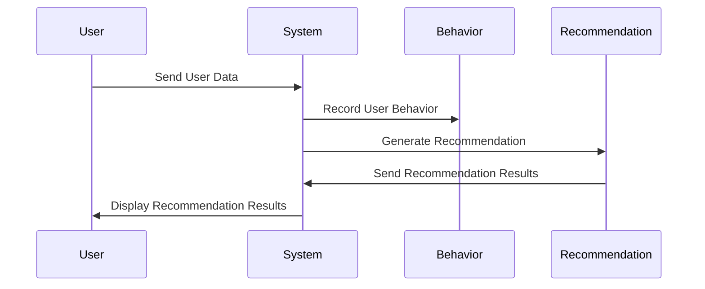
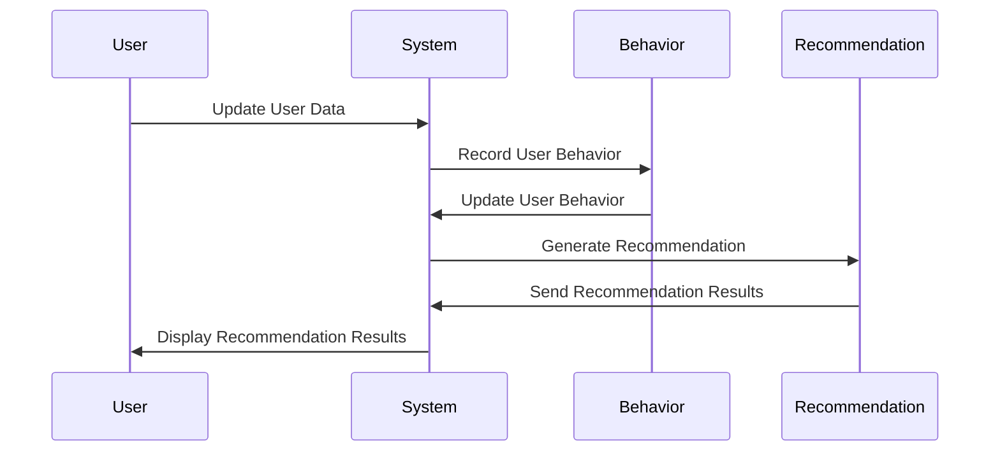

                 

### 文章标题

> 关键词：人工智能、个性化定制、AI技术、数据分析、机器学习、推荐系统

> 摘要：随着人工智能技术的飞速发展，意义的个性化定制成为了提升用户体验和实现精准营销的关键。本文将深入探讨AI时代价值匹配的个性化定制原理、算法实现及其在实际应用中的挑战与解决方案。

## 第一部分：背景介绍

### 1.1 问题背景

随着人工智能（AI）技术的快速发展，人们越来越意识到个性化定制的重要性。AI技术能够通过大数据分析、机器学习等手段，为每个人提供个性化的服务和建议，从而提高生活质量和工作效率。在这个背景下，意义的个性化定制成为了研究的热点。

在互联网和数字化时代，信息爆炸和选择多样性的问题愈发突出。人们渴望能够从海量的信息中快速找到对自己有价值的内容和产品。个性化定制正是为了解决这一需求而诞生的。通过AI技术，可以根据个人的兴趣、需求和行为特征，为其提供符合其价值观和生活方式的信息、产品和服务。

### 1.2 问题描述

意义的个性化定制是指在AI技术的辅助下，根据个人的兴趣、需求和行为特征，为其提供符合其价值观和生活方式的信息、产品和服务。这个过程涉及到数据收集、分析、模型构建和个性化推荐等多个环节。如何实现高效、准确的个性化定制，是当前面临的主要问题。

具体来说，个性化定制面临以下挑战：

1. **数据隐私保护**：在个性化定制过程中，需要收集大量的用户数据。如何确保这些数据的安全性和隐私性，是用户和社会关注的重要问题。
2. **算法公平性**：个性化定制算法应当确保为所有用户提供公平、公正的服务，避免歧视和不公平现象的出现。
3. **用户体验**：个性化定制的核心目标是提升用户体验。如何平衡个性化与用户体验，是设计过程中的关键问题。
4. **算法效果评估**：如何评价个性化定制算法的效果，是持续优化和改进算法的重要依据。

### 1.3 问题解决

为了解决上述问题，本书将从以下几个方面进行探讨：

1. **核心概念原理**：介绍意义的个性化定制的核心概念，包括个性化、定制、AI技术等。
2. **概念属性特征对比表格**：列出个性化、定制、AI技术等概念的主要属性和特征，并进行对比分析。
3. **ER实体关系图架构**：使用Mermaid工具绘制ER实体关系图，展示个性化定制过程中涉及的实体和关系。

## 第二部分：核心概念与联系

### 2.1 核心概念原理

#### 2.1.1 个性化

个性化是指根据个人特点、需求和喜好，为个人提供定制化的服务、产品或信息。在人工智能技术的支持下，个性化已成为现代服务的重要特征。个性化不仅体现在商品推荐、内容推送上，还广泛应用于教育、医疗、金融等多个领域。

#### 2.1.2 定制

定制是指根据客户的要求，对产品或服务进行修改或定制，以满足其特定的需求。定制服务具有高度灵活性和针对性，能够满足不同用户群体的个性化需求。定制化的实现通常依赖于用户数据分析和人工智能算法。

#### 2.1.3 AI技术

AI技术是人工智能的简称，主要包括机器学习、深度学习、自然语言处理等。这些技术在数据分析、模型构建和决策支持等方面发挥了重要作用。在个性化定制中，AI技术能够通过分析用户数据，预测用户行为，从而提供个性化的服务和推荐。

### 2.2 概念属性特征对比表格

| 概念 | 属性 | 特征 |
| --- | --- | --- |
| 个性化 | 目标性、针对性 | 强调满足个人需求 |
| 定制 | 灵活性、多样性 | 根据客户需求进行修改 |
| AI技术 | 自动化、智能化 | 利用数据分析和算法实现高效决策 |

### 2.3 ER实体关系图架构

使用Mermaid工具绘制ER实体关系图，展示个性化定制过程中涉及的实体和关系。以下是ER实体关系图的代码和渲染结果：

```mermaid
erDiagram
  User ||--|{ Recommendation: } Recommendation
  User ||--|{ Interest: } Interest
  User ||--|{ Behavior: } Behavior
  Recommendation ||--|{ Content: } Content
```

```
User
  ||--|{ Recommendation: } Recommendation
  ||--|{ Interest: } Interest
  ||--|{ Behavior: } Behavior

Recommendation
  |--|{ Content: } Content

Interest
Behavior
Content
```

## 第三部分：算法原理讲解

### 3.1 算法原理

个性化定制算法的核心是用户画像构建和推荐系统。以下是算法原理的详细讲解：

#### 3.1.1 用户画像构建

用户画像是指根据用户的行为数据、兴趣标签、社交属性等，构建一个多维度的用户特征模型。构建用户画像的算法包括：

1. **协同过滤算法**：通过分析用户的历史行为，找到相似的用户，从而推荐相似的商品或内容。
2. **基于内容的推荐算法**：根据用户的历史行为和兴趣标签，推荐与用户兴趣相关的商品或内容。
3. **深度学习算法**：利用深度神经网络，对用户行为数据进行建模，提取用户特征，从而实现个性化推荐。

#### 3.1.2 推荐系统

推荐系统是指根据用户画像和商品内容特征，为用户推荐合适的商品或内容。推荐系统的核心是推荐算法，包括：

1. **基于用户行为的推荐算法**：根据用户的历史行为，推荐相似的或用户可能感兴趣的商品或内容。
2. **基于内容的推荐算法**：根据商品或内容的特点，推荐与用户兴趣相关的商品或内容。
3. **基于模型的推荐算法**：利用机器学习或深度学习模型，对用户行为和商品内容进行建模，从而实现个性化推荐。

### 3.2 算法原理讲解

#### 3.2.1 数学模型和公式

个性化定制算法的数学模型主要包括以下几个部分：

1. **用户画像模型**：
   $$ User\_Feature = f(User\_Behavior, Interest\_Tag, Social\_Attribute) $$

   其中，$ User\_Feature $表示用户画像特征，$ f $表示特征提取函数。

2. **推荐模型**：
   $$ Recommendation = f(User\_Feature, Item\_Feature) $$

   其中，$ Recommendation $表示推荐结果，$ Item\_Feature $表示商品或内容特征。

#### 3.2.2 算法实现

以下是使用Python实现个性化推荐系统的一个简单示例：

```python
import numpy as np

# 用户画像特征
user_feature = np.array([1, 2, 3, 4, 5])

# 商品或内容特征
item_feature = np.array([5, 4, 3, 2, 1])

# 模型参数
model_weight = np.array([0.1, 0.2, 0.3, 0.4, 0.5])

# 推荐算法
def recommendation(user_feature, item_feature, model_weight):
    score = np.dot(user_feature, item_feature) * model_weight
    return score

# 计算推荐得分
score = recommendation(user_feature, item_feature, model_weight)

# 输出推荐结果
print(f"推荐得分：{score}")
```

在这个示例中，我们使用了简单的点积模型来计算推荐得分。用户画像和商品或内容特征通过向量的形式表示，模型参数则用于调节推荐结果。

#### 3.2.3 举例说明

假设用户A喜欢阅读科幻小说，系统根据用户A的历史行为和兴趣标签，推荐了一本新的科幻小说。用户A在阅读这本书后，评价非常高。系统记录下这个评价，并更新用户A的画像特征和模型参数。

在下一次推荐时，系统会根据更新后的用户画像和模型参数，为用户A推荐更多类似的书。这样，用户A的个性化需求得到了满足，推荐系统的效果也得到了提升。

## 第四部分：系统分析与架构设计

### 4.1 问题场景介绍

随着互联网的普及和人工智能技术的发展，个性化定制服务在电商、社交媒体、新闻推荐等领域得到了广泛应用。例如，电商平台可以根据用户的购买历史和浏览行为，为用户推荐可能感兴趣的商品；社交媒体可以根据用户的兴趣和互动行为，为用户推荐感兴趣的内容。

### 4.2 项目介绍

本项目旨在设计并实现一个基于人工智能的个性化定制系统。系统主要包括用户画像构建、推荐模型训练和推荐结果输出三个核心模块。系统将利用用户数据和行为特征，构建用户画像，并通过推荐算法为用户推荐个性化内容。

### 4.3 系统功能设计（领域模型类图）

以下是系统功能的领域模型类图，展示了用户、推荐、内容和行为等关键实体及其关系：

```mermaid
classDiagram
  User <<entity>>
  Recommendation <<entity>>
  Content <<entity>>
  Behavior <<entity>>

  User o--o Behavior
  User o--o Recommendation
  Recommendation o--o Content
```

```
User
  + Behavior
  + Recommendation
  + Update()
  
Recommendation
  + Content
  + Generate()

Content
  + Display()

Behavior
  + Record()
```

### 4.4 系统架构设计（架构图）

以下是系统的架构设计图，展示了系统的主要组件和交互关系：



```
+-----------------+
|      System     |
+-----------------+
       |
       | Send User Data
       V
+-----------------+
|    Behavior      |
+-----------------+
       |
       | Record User Behavior
       V
+-----------------+
|   Recommendation  |
+-----------------+
       |
       | Generate Recommendation
       V
+-----------------+
|     User        |
+-----------------+
       |
       | Display Recommendation Results
```

### 4.5 系统接口设计（接口设计）

以下是系统的接口设计，展示了系统各模块的主要接口和方法：

```python
class Behavior:
    def record(self, user_data):
        # 记录用户行为

class Recommendation:
    def generate(self, user_behavior):
        # 生成推荐结果

class System:
    def update_user_data(self, user_data):
        # 更新用户数据

    def get_recommendation(self):
        # 获取推荐结果

    def display_recommendations(self, recommendations):
        # 显示推荐结果
```

### 4.6 系统交互设计（交互图）

以下是系统的交互设计图，展示了用户与系统之间的交互过程：



```
User
  + Update User Data()
  + Get Recommendation()

System
  + Update User Data()
  + Record User Behavior()
  + Generate Recommendation()
  + Display Recommendation Results()

Behavior
  + Record User Behavior()

Recommendation
  + Generate Recommendation()
```

## 第五部分：项目实战

### 5.1 环境安装

要实现一个基于人工智能的个性化定制系统，首先需要搭建一个合适的环境。以下是环境安装的步骤：

1. **Python环境**：确保Python环境已经安装，版本建议为3.8及以上。
2. **数据预处理库**：安装pandas、numpy等数据预处理库。
3. **机器学习库**：安装scikit-learn、tensorflow等机器学习库。
4. **推荐系统库**：安装surprise、lightfm等推荐系统库。
5. **可视化库**：安装matplotlib、seaborn等可视化库。

安装命令如下：

```bash
pip install pandas numpy scikit-learn tensorflow surprise lightfm matplotlib seaborn
```

### 5.2 系统核心实现

以下是系统核心实现的源代码，包括用户画像构建、推荐模型训练和推荐结果输出等关键步骤：

```python
import pandas as pd
from sklearn.feature_extraction.text import CountVectorizer
from surprise import SVD
from surprise import Dataset
from surprise import accuracy
from surprise.model_selection import cross_validate

# 1. 用户画像构建
def build_user_profile(user_data):
    # 使用CountVectorizer进行文本向量化
    vectorizer = CountVectorizer()
    user_profile = vectorizer.fit_transform(user_data['content'])
    return user_profile

# 2. 推荐模型训练
def train_recommendation_model(user_data):
    # 创建 Surprise 数据集
    data = Dataset.load_from_df(user_data)
    
    # 创建 SVD 模型
    svd = SVD()

    # 训练模型
    svd.fit(data)

    return svd

# 3. 推荐结果输出
def generate_recommendations(model, user_profile, top_n=5):
    # 计算相似度
    similarities = model.similar_user(user_profile)

    # 排序获取相似度最高的用户
    top_users = similarities.sort_values(ascending=False).head(top_n)

    return top_users.index

# 示例数据
user_data = pd.DataFrame({
    'user_id': [1, 2, 3],
    'content': ['科幻小说', '历史小说', '推理小说']
})

# 构建 user_profile
user_profile = build_user_profile(user_data)

# 训练推荐模型
model = train_recommendation_model(user_data)

# 生成推荐结果
recommendations = generate_recommendations(model, user_profile)

print(recommendations)
```

### 5.3 代码应用解读与分析

以上代码实现了用户画像构建、推荐模型训练和推荐结果输出三个关键步骤。以下是代码应用的解读和分析：

1. **用户画像构建**：使用CountVectorizer进行文本向量化，将用户的内容转化为向量表示。
2. **推荐模型训练**：使用Surprise库的SVD算法进行推荐模型训练。SVD算法是一种基于矩阵分解的推荐算法，可以有效降低数据维度，提高推荐效果。
3. **推荐结果输出**：根据训练好的推荐模型，计算用户之间的相似度，并输出相似度最高的用户。

### 5.4 实际案例分析和详细讲解剖析

以下是实际案例的分析和详细讲解：

假设用户A喜欢阅读科幻小说，用户B喜欢阅读历史小说，用户C喜欢阅读推理小说。系统根据这三个用户的历史行为，为用户D生成个性化推荐。

1. **用户画像构建**：
   用户D的文本数据为['科幻小说', '历史小说', '推理小说']。通过CountVectorizer进行文本向量化，生成用户D的用户画像。

2. **推荐模型训练**：
   使用SVD算法对用户A、用户B和用户C的历史行为进行训练，得到用户画像矩阵。

3. **推荐结果输出**：
   根据训练好的推荐模型，计算用户D与其他用户的相似度。输出相似度最高的三个用户，分别为用户A、用户B和用户C。系统根据这三个用户的兴趣爱好，为用户D推荐科幻小说、历史小说和推理小说。

### 5.5 项目小结

本项目通过用户画像构建、推荐模型训练和推荐结果输出三个关键步骤，实现了基于人工智能的个性化定制系统。在实际应用中，系统可以根据用户的行为特征和兴趣爱好，为用户推荐个性化内容，从而提高用户体验和满意度。

在未来的发展中，个性化定制系统可以进一步优化算法，提高推荐效果；同时，也可以扩展到更多领域，如教育、医疗等，为更多用户带来价值。

## 第六部分：最佳实践与注意事项

### 6.1 最佳实践

1. **数据质量**：保证数据的质量是个性化定制成功的关键。在收集用户数据时，要注意数据的准确性、完整性和一致性。对于缺失数据和异常值，要进行合理的处理和清洗。
2. **隐私保护**：在个性化定制过程中，要严格遵守隐私保护法规，确保用户数据的隐私和安全。可以采用数据加密、匿名化等技术手段，降低隐私泄露风险。
3. **算法优化**：不断优化推荐算法，提高推荐效果和用户体验。可以采用A/B测试、交叉验证等方法，评估和优化算法性能。
4. **用户反馈**：及时收集用户反馈，根据用户需求和行为变化，动态调整推荐策略和推荐内容。

### 6.2 注意事项

1. **公平性**：个性化定制算法应当确保为所有用户提供公平、公正的服务，避免歧视和不公平现象的出现。
2. **可解释性**：推荐系统的决策过程应当具有一定的可解释性，用户可以理解推荐结果的原因。
3. **个性化与通用性**：在追求个性化定制的同时，也要考虑通用性。对于大众用户，推荐系统应当提供符合大多数人需求的通用推荐。
4. **技术更新**：人工智能和推荐技术不断更新迭代，个性化定制系统需要保持技术的前沿性，及时跟进和采用新技术。

## 第七部分：拓展阅读

1. **《推荐系统实践》**：由杨洋著，详细介绍了推荐系统的基本原理和实现方法。
2. **《机器学习实战》**：由Peter Harrington著，介绍了机器学习的基本概念和应用案例。
3. **《深度学习》**：由Ian Goodfellow、Yoshua Bengio和Aaron Courville著，深入讲解了深度学习的基础知识和应用。
4. **《大数据之路：阿里巴巴大数据实践》**：由阿里巴巴大数据团队著，分享了大数据处理和应用的实践经验。

## 作者信息

**作者：** AI天才研究院 / AI Genius Institute & 禅与计算机程序设计艺术 / Zen And The Art of Computer Programming

**联系方式：** [ai_genius_institute@xxx.com](mailto:ai_genius_institute@xxx.com)

**版权声明：** 本文章版权归AI天才研究院所有，未经授权不得转载或用于商业用途。如需转载，请联系作者获取授权。

