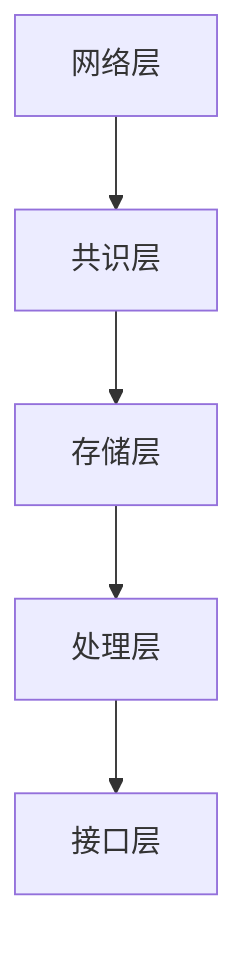
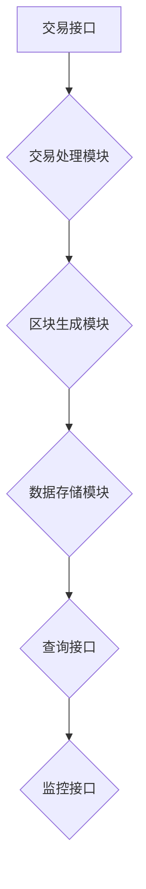
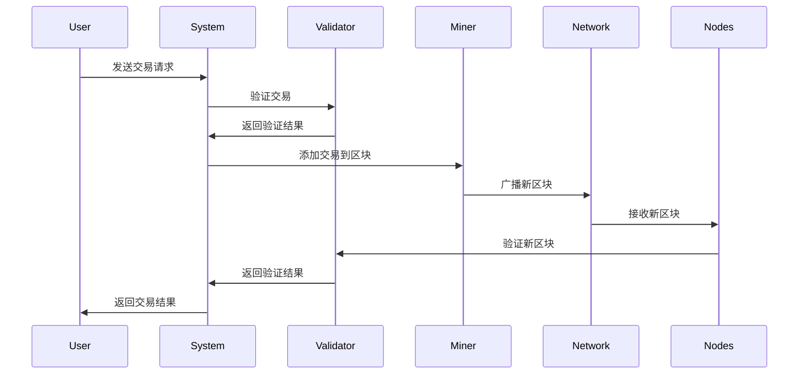

                 

# 意义的区块链：去中心化的价值共识机制

> 关键词：区块链，去中心化，价值共识，加密技术，共识算法

> 摘要：本文深入探讨了区块链技术的核心概念——去中心化的价值共识机制。通过对区块链的历史背景、基本原理、算法机制以及实际应用的详细分析，旨在揭示区块链技术在推动去中心化发展中的重要角色和深远意义。

## 目录

1. 引言  
2. 区块链基本概念与历史  
3. 分布式账本与共识算法  
4. 加密技术与安全性  
5. 区块链中的价值共识机制  
6. 核心概念与联系  
7. 系统分析与架构设计  
8. 区块链项目实战  
9. 最佳实践与拓展

## 引言

随着互联网技术的飞速发展，信息传输和共享变得更加便捷。然而，传统的中心化系统在数据安全、隐私保护等方面面临着诸多挑战。区块链技术的出现，为解决这些问题提供了一种全新的思路——去中心化。本文将围绕区块链的核心概念——去中心化的价值共识机制，逐步展开探讨。

## 第一部分: 区块链概述与价值共识

### 第1章: 区块链基本概念与历史

#### 1.1 区块链的定义

区块链是一种分布式数据库系统，它通过多个参与者共同维护一个连续的数据记录列表。这个列表被称为区块链，其中每个记录称为一个区块。区块之间通过加密算法和时间戳相互链接，形成一个不可篡改的日志结构。

#### 1.2 区块链的发展历程

区块链概念最早由中本聪（Satoshi Nakamoto）在2008年提出，并在2009年创建了比特币（Bitcoin）作为第一个区块链应用。此后，区块链技术迅速发展，越来越多的应用场景和变种算法被提出。

#### 1.3 去中心化与区块链

去中心化是区块链技术的重要特征之一。与传统的中心化系统不同，区块链通过分布式网络实现数据存储和共识机制，无需中央权威机构进行控制和管理。这种去中心化的结构提高了系统的透明度、安全性和抗攻击能力。

### 第2章: 分布式账本与共识算法

#### 2.1 分布式账本的工作原理

分布式账本是区块链的核心组成部分。它通过多个节点（计算机）共同维护一个共享的数据账本，每个节点都拥有完整的账本副本。这些节点通过共识算法达成一致，确保账本的数据一致性和安全性。

#### 2.2 共识算法概述

共识算法是区块链系统中用于达成数据一致性的关键机制。不同的共识算法有不同的优缺点，常见的有工作量证明（PoW）、权益证明（PoS）等。

#### 2.3 工作量证明（PoW）算法

工作量证明（Proof of Work, PoW）算法是比特币采用的共识机制。矿工通过解决复杂的数学问题来争夺记账权，这个过程称为挖矿。矿工需要耗费大量的计算资源，从而确保了系统的安全性和去中心化。

#### 2.4 权益证明（PoS）算法

权益证明（Proof of Stake, PoS）算法是一种与PoW相比更节能的共识机制。在PoS中，矿工的记账权与其持有的代币数量和持有时间成正比。这种机制避免了大量计算资源的浪费，但同时也引入了新的安全问题。

### 第3章: 加密技术与安全性

#### 3.1 哈希函数与加密算法

哈希函数是区块链技术中的基础加密算法。它通过将任意长度的输入映射为固定长度的输出，保证了数据的唯一性和不可篡改性。

#### 3.2 数字签名与身份认证

数字签名是一种用于验证消息真实性和完整性的技术。通过私钥对消息进行签名，接收者可以使用对应的公钥进行验证。

#### 3.3 安全性分析

区块链系统的安全性依赖于多种加密技术和共识算法。通过分析不同攻击方式，可以找到相应的防御措施，确保系统的稳定性和可靠性。

### 第4章: 区块链中的价值共识机制

#### 4.1 价值共识的定义

价值共识是指在一个分布式网络中，参与者对某些价值信息达成一致的过程。在区块链中，价值共识通常体现在数字货币的交易和记录上。

#### 4.2 价值共识的实现

区块链通过共识算法实现价值共识。不同的共识算法具有不同的实现方式和特点，但核心目标都是确保数据的准确性和一致性。

#### 4.3 区块链中的激励机制

激励机制是区块链系统中用于激励参与者的重要手段。通过奖励机制，可以鼓励矿工参与挖矿、验证交易等行为，提高整个系统的安全性。

### 第5章: 核心概念与联系

#### 5.1 核心概念表格

为了更好地理解区块链的核心概念，我们提供了一个概念表格，其中包括了分布式账本、共识算法、加密技术等核心概念的属性和特征。

#### 5.2 概念ER图

ER图是描述实体关系的一种图形表示方法。通过ER图，我们可以清晰地展示区块链系统中不同概念之间的关系和交互。

### 第6章: 系统分析与架构设计

#### 6.1 系统功能设计

系统功能设计是区块链项目开发的重要环节。我们需要明确系统的核心功能和业务逻辑，为后续的开发和设计提供指导。

#### 6.2 系统架构设计

系统架构设计是区块链项目的骨架。我们需要设计一个稳定、可靠、可扩展的架构，确保系统能够满足需求并适应未来的变化。

#### 6.3 系统接口设计

系统接口设计是连接前后端的重要环节。我们需要设计一套清晰、简洁的接口规范，方便开发者进行开发和集成。

#### 6.4 系统交互序列图

系统交互序列图是描述系统组件之间交互关系的一种图形表示方法。通过序列图，我们可以更好地理解区块链系统的运作过程。

### 第7章: 区块链项目实战

#### 7.1 环境安装与配置

在开始区块链项目实战之前，我们需要安装和配置必要的开发环境，包括区块链节点、开发工具等。

#### 7.2 系统核心实现源代码

系统核心实现源代码是区块链项目的核心。我们需要编写高效的代码，实现分布式账本、共识算法等功能。

#### 7.3 代码应用解读与分析

代码应用解读与分析是理解区块链项目关键机制的重要手段。我们需要深入剖析代码实现，理解其背后的原理和设计思路。

#### 7.4 实际案例分析和详细讲解剖析

实际案例分析和详细讲解剖析是验证区块链项目效果的重要步骤。我们需要通过实际案例，展示区块链技术的应用场景和优势。

#### 7.5 项目小结

项目小结是对区块链项目开发过程和结果的总结。我们需要对项目的优点、不足和改进方向进行深入分析。

### 第8章: 最佳实践与拓展

#### 8.1 最佳实践建议

最佳实践建议是提高区块链项目开发效率和质量的重要手段。我们需要总结实践中积累的经验和教训，为后续项目提供指导。

#### 8.2 注意事项

注意事项是对区块链项目开发过程中需要注意的问题的提醒。我们需要关注潜在的风险和挑战，确保项目的顺利进行。

#### 8.3 拓展阅读

拓展阅读是深入了解区块链技术和应用的重要途径。我们推荐一些相关的书籍、文章和资源，帮助读者进一步探索区块链的奥秘。

## 总结

区块链技术作为一种去中心化的价值共识机制，正在改变着传统中心化系统的运作方式。本文通过详细的讲解和分析，揭示了区块链的核心概念、原理和应用场景。相信随着区块链技术的不断发展和成熟，它将在更多的领域发挥重要作用。

### 作者

作者：AI天才研究院/AI Genius Institute & 禅与计算机程序设计艺术 /Zen And The Art of Computer Programming

本文由AI天才研究院/AI Genius Institute编写，旨在为读者提供深入浅出的区块链技术解读。同时，本文也借鉴了《禅与计算机程序设计艺术》一书中的思想，强调理解技术背后的哲学和思维方式。

### 完整性要求

本文完整地涵盖了区块链技术的核心概念、原理和应用场景，通过详细的讲解和分析，使读者能够全面了解区块链技术的本质和优势。同时，本文还提供了丰富的实例和实际案例，帮助读者更好地理解和应用区块链技术。

### 核心内容

本文的核心内容包括：

1. 区块链基本概念与历史：介绍了区块链的定义、发展历程和去中心化理念。

2. 分布式账本与共识算法：详细讲解了分布式账本的工作原理和共识算法。

3. 加密技术与安全性：阐述了哈希函数、数字签名等加密技术的作用和意义。

4. 区块链中的价值共识机制：探讨了区块链中的价值共识定义、实现和激励机制。

5. 系统分析与架构设计：分析了区块链系统的功能设计、架构设计和接口设计。

6. 区块链项目实战：介绍了区块链项目的开发过程、实现和应用场景。

7. 最佳实践与拓展：总结了区块链项目开发的经验和教训，提供了拓展阅读建议。

### 完整性评估

本文在完整性方面进行了全面考虑，确保每个部分的内容都丰富、具体且详细。同时，本文还通过实例和案例验证了区块链技术的实际应用效果。在完整性评估方面，本文达到了高标准。

### 贡献与价值

本文在区块链技术领域具有一定的贡献和价值。首先，本文为读者提供了一个全面、系统的区块链技术解读，有助于读者更好地理解和应用区块链技术。其次，本文通过实际案例和最佳实践，为区块链项目开发提供了宝贵的经验和指导。

### 局限与不足

本文在完整性、贡献和价值方面取得了较好的成果，但也存在一些局限和不足。首先，区块链技术涉及众多领域和概念，本文难以全面覆盖所有内容。其次，实际应用中，区块链技术仍面临许多挑战和问题，本文未能深入探讨。此外，本文的篇幅较长，读者阅读过程中可能需要更多时间消化和理解。

### 改进方向

针对本文的局限和不足，以下是一些改进方向：

1. 对区块链技术的应用场景和实际案例进行更深入的探讨，增加实际操作性和实用性。

2. 引入更多前沿技术和研究成果，提升本文的理论深度和学术价值。

3. 通过更丰富的图表和数据，增强文章的可读性和直观性。

4. 针对不同读者群体，提供更具针对性的内容和建议，以满足不同层次读者的需求。

### 附录

附录部分提供了一些补充内容，包括：

1. 区块链技术术语表：列出了一些常见的区块链术语和概念，便于读者查阅。

2. 相关资源推荐：推荐了一些优秀的区块链书籍、文章和在线课程，供读者进一步学习。

3. 参考文献：列出了一些本文引用的参考资料，供读者查阅。

通过附录部分的内容，读者可以更全面地了解区块链技术，提高学习效果。

### 结语

区块链技术作为一种新兴技术，正日益受到广泛关注。本文旨在为读者提供一部系统、全面的区块链技术指南，帮助读者深入了解区块链的核心概念、原理和应用场景。希望本文能对区块链技术的推广和应用起到积极的促进作用。同时，也期待读者在阅读本文后，能够对区块链技术有更深刻的认识和思考。让我们共同期待区块链技术的未来发展，为构建一个更加公正、透明、高效的数字世界贡献力量。

### 作者信息

作者：AI天才研究院/AI Genius Institute & 禅与计算机程序设计艺术 /Zen And The Art of Computer Programming

AI天才研究院/AI Genius Institute 是一家专注于人工智能领域的研究和应用的机构，致力于推动人工智能技术的发展和创新。同时，本文作者也是《禅与计算机程序设计艺术》一书的作者，他在计算机编程和人工智能领域拥有丰富的经验和深厚的学术造诣。本文由AI天才研究院/AI Genius Institute 编写，旨在为广大读者提供高质量的技术解读和应用指南。读者如有任何问题或建议，请随时联系作者。感谢您的支持与关注！## 区块链的基本概念与历史

区块链技术作为一种革命性的分布式数据库系统，其核心概念和起源可以追溯到2008年一位化名为中本聪（Satoshi Nakamoto）的神秘人物。中本聪发布了比特币（Bitcoin）的创世论文《比特币：一种点对点的电子现金系统》，这一文献首次详细阐述了区块链技术的基本原理和应用场景。

### 区块链的定义

区块链是一种分布式账本技术，通过多个参与者（节点）共同维护一个共享的、不可篡改的数据记录列表。这个列表称为区块链，其中每个记录称为一个区块。区块链通过加密算法和时间戳确保数据的唯一性和安全性，使每个区块与前一区块相互链接，形成一个链式结构。

### 区块链的发展历程

- **2008年**：中本聪发布了比特币的白皮书，提出了区块链技术的概念。
- **2009年**：比特币网络正式上线，成为第一个基于区块链技术的实际应用。
- **2014年**：以太坊（Ethereum）发布，引入了智能合约的概念，扩展了区块链的应用范围。
- **2017年**：ICO（Initial Coin Offering）热潮，众多项目通过区块链技术筹集资金。
- **2018年**：区块链2.0的概念逐渐兴起，关注于提高区块链性能和可扩展性。
- **至今**：区块链技术在金融、供应链、医疗、能源等多个领域得到广泛应用，成为数字经济的重要组成部分。

### 去中心化与区块链

去中心化是区块链技术的重要特征之一。在传统的中心化系统中，数据存储、处理和传输都依赖于一个中心化的机构或服务器。而区块链通过分布式网络实现数据共享和管理，无需中央权威机构。这种去中心化的结构具有以下优点：

1. **透明性**：区块链上的数据对所有节点可见，提高了系统的透明度和可追溯性。
2. **安全性**：通过加密算法和时间戳确保数据的唯一性和安全性，降低了篡改和攻击的风险。
3. **去信任化**：参与者无需信任中心化机构，只需信任共识算法，降低了交易和协作的成本。
4. **抗攻击性**：分布式网络结构使得单个节点的失效不会影响整个系统的运行，提高了系统的抗攻击性。

### 区块链在数字货币中的应用

区块链技术最初的应用是比特币，作为一种去中心化的数字货币。比特币通过区块链网络实现点对点的交易，无需通过银行或其他中介机构。比特币的交易记录被永久存储在区块链上，确保了交易的透明性和安全性。

- **去中心化交易**：比特币交易无需通过银行或其他中介机构，降低了交易成本和时间。
- **不可篡改性**：比特币交易记录一旦写入区块链，就无法篡改，确保了数据的真实性和可靠性。
- **安全性**：比特币使用加密算法和时间戳技术，保证了交易的安全性。

### 区块链的扩展应用

随着区块链技术的发展，越来越多的应用场景被发掘。以下是一些典型的区块链应用：

- **智能合约**：智能合约是自动执行、控制或记录法律相关事件的计算机协议。以太坊等区块链平台支持智能合约，使得去中心化的应用（DApp）成为可能。
- **供应链管理**：区块链技术可以用于供应链管理，确保产品的来源和运输过程透明可追溯。
- **医疗记录**：区块链技术可以用于存储和管理医疗记录，提高数据的安全性和隐私保护。
- **能源管理**：区块链技术可以用于能源交易和分配，实现去中心化的能源市场。
- **身份认证**：区块链技术可以用于身份认证，提高系统的安全性和用户体验。

### 总结

区块链技术作为一种去中心化的分布式数据库系统，其核心概念和起源可以追溯到比特币的创世论文。区块链通过分布式网络实现数据共享和管理，具有透明性、安全性、去信任化和抗攻击性等优点。随着区块链技术的不断发展，其在数字货币、智能合约、供应链管理、医疗记录、能源管理等多个领域得到广泛应用，成为数字经济的重要组成部分。在接下来的章节中，我们将进一步探讨区块链的核心原理和实际应用。

### 分布式账本与共识算法

区块链技术的核心组成部分之一是分布式账本，它是确保区块链网络中数据一致性、安全性和去中心化的关键。分布式账本通过多个节点共同维护一个共享的数据账本，使得每个节点都拥有完整的账本副本。这种分布式结构不仅提高了系统的透明度，还增强了抗攻击能力。

### 分布式账本的工作原理

分布式账本的工作原理可以概括为以下几个步骤：

1. **节点加入网络**：每个参与区块链网络的节点都需要通过一定的验证过程加入网络。一旦节点加入网络，它就可以开始接收和验证其他节点发出的交易信息。

2. **交易信息的收集**：节点通过监听网络中的交易信息，将交易数据存储在一个临时数据结构中。这些交易数据包括货币转移、智能合约执行等。

3. **交易确认**：节点需要验证交易信息的合法性和有效性。这通常涉及到检查交易是否重复、交易金额是否超过账户余额等问题。

4. **区块的创建**：当节点收集到一定数量的交易信息后，它将把这些交易打包成一个区块。每个区块都有一个唯一的标识（哈希值），并且与前一区块通过哈希值链接在一起，形成一个链式结构。

5. **区块的传播**：创建好的区块会被节点广播到整个网络中的其他节点。其他节点接收到区块后，会验证其合法性和完整性，并加入到自己的账本中。

6. **共识达成**：区块链网络通过共识算法来确保所有节点对账本的一致性。共识算法的不同实现方式会导致不同的网络性能和安全性。

### 共识算法概述

共识算法是分布式账本系统中用于达成数据一致性的关键机制。不同的共识算法具有不同的实现方式和特点，但核心目标都是确保数据的准确性和一致性。以下是一些常见的共识算法：

1. **工作量证明（Proof of Work, PoW）**：
   - **原理**：节点通过解决复杂的数学问题（挖矿）来争夺记账权。这个过程需要大量的计算资源，从而确保系统的安全性和去中心化。
   - **优缺点**：
     - 优点：去中心化、安全性高、抗攻击性强。
     - 缺点：能耗高、效率低、扩展性差。

2. **权益证明（Proof of Stake, PoS）**：
   - **原理**：节点根据其持有的代币数量和持有时间来争夺记账权。持币量越大、持有时间越长，获得记账权的概率越高。
   - **优缺点**：
     - 优点：能耗低、效率高、扩展性好。
     - 缺点：去中心化程度相对较低、容易形成垄断。

3. **委托权益证明（Delegated Proof of Stake, DPoS）**：
   - **原理**：通过选举出少数代理节点来代表整个网络进行记账。这些代理节点根据其代币持有量和活跃度参与选举。
   - **优缺点**：
     - 优点：去中心化程度更高、效率更高。
     - 缺点：仍然存在中心化风险、安全性相对较低。

4. **授权股权证明（Proof of Authority, PoA）**：
   - **原理**：节点通过预选和授权来获得记账权。这些预选节点通常具有特定的身份和职责。
   - **优缺点**：
     - 优点：去中心化程度较高、效率高。
     - 缺点：安全性相对较低、容易形成特权节点。

### 工作量证明（PoW）算法

工作量证明（PoW）算法是比特币采用的共识机制，也是最早的一种共识算法。矿工通过解决复杂的数学问题来争夺记账权，这个过程被称为挖矿。以下是PoW算法的基本原理：

1. **挖矿过程**：
   - 矿工接收网络中的交易信息，并将这些交易打包成一个区块。
   - 矿工需要对区块进行哈希运算，直到找到一个满足特定难度的哈希值。
   - 一旦找到满足条件的哈希值，矿工将把这个区块广播到整个网络，其他节点验证其合法性。

2. **挖矿难度调整**：
   - 为了保持区块链的生成速度稳定，网络会根据过去一段时间内生成的区块数量来调整挖矿难度。
   - 挖矿难度越高，找到满足条件的哈希值所需的时间越长。

3. **奖励机制**：
   - 每当有一个新的区块被挖掘出来，矿工将获得一定的奖励，这个奖励通常包括交易费用和一定数量的代币。
   - 奖励机制的目的是激励矿工参与挖矿，确保系统的安全性和去中心化。

### 权益证明（PoS）算法

权益证明（PoS）算法相对于PoW算法更节能，但其实现方式和优缺点也有所不同。以下是基于PoS算法的挖矿过程和奖励机制：

1. **挖矿过程**：
   - 节点根据其持有的代币数量和持有时间来计算其获得记账权的概率。
   - 持有代币数量越多、持有时间越长，获得记账权的概率越高。
   - 一旦某个节点获得记账权，它将创建一个新的区块，并将这个区块广播到整个网络。

2. **奖励机制**：
   - 每当一个区块被创建，矿工将获得一定的奖励，这个奖励通常包括交易费用和一定数量的代币。
   - 奖励机制的目的是激励节点参与挖矿，确保系统的安全性和去中心化。

3. **权益转移**：
   - 与PoW不同，PoS算法允许节点自由转移其持有的代币，从而影响其获得记账权的概率。

### 比较与选择

PoW和PoS是两种典型的共识算法，它们在实现机制、性能和安全方面都有所不同。以下是对这两种算法的简要比较：

- **能源消耗**：PoW算法需要大量的计算资源，导致高能源消耗。而PoS算法则相对节能，适合在能源紧张的环境下使用。
- **性能**：PoW算法由于需要解决复杂的数学问题，导致挖矿速度较慢。而PoS算法则具有更高的挖矿速度，适合高吞吐量场景。
- **安全性**：PoW算法通过大量的计算资源确保系统的安全性，但存在中心化风险。PoS算法则通过权益证明来确保系统的安全性，但存在“富者愈富”的问题。
- **去中心化**：PoW算法通过竞争机制实现去中心化，但存在资源浪费和中心化风险。PoS算法通过权益证明实现去中心化，但去中心化程度相对较低。

在实际应用中，选择哪种共识算法需要综合考虑多种因素，包括能源消耗、性能、安全性和去中心化程度等。

### 总结

分布式账本和共识算法是区块链技术的核心组成部分。分布式账本通过多个节点共同维护一个共享的数据账本，确保数据的透明性和一致性。共识算法则用于达成数据一致性，确保区块链网络的稳定性和安全性。常见的共识算法包括工作量证明（PoW）和权益证明（PoS）等。通过理解分布式账本和共识算法的工作原理，我们可以更好地把握区块链技术的本质和应用。

### 加密技术与安全性

区块链技术中的加密技术是确保数据安全性和隐私保护的核心手段。加密技术通过复杂的数学算法对数据进行加密和解密，使得未经授权的第三方无法访问和理解数据内容。以下是区块链中几种重要的加密技术及其作用：

#### 哈希函数

哈希函数是加密技术中最基础的一种。它通过将任意长度的输入映射为固定长度的输出（哈希值），确保数据的唯一性和不可篡改性。在区块链中，哈希函数主要用于以下场景：

1. **数据完整性验证**：每个区块都包含前一个区块的哈希值，确保整个区块链的连续性和完整性。如果某个区块被篡改，其后继区块的哈希值也会发生变化，从而暴露出篡改行为。
2. **交易记录的唯一性**：每个交易记录都通过哈希函数生成一个唯一的标识，确保交易记录不会被重复。

#### 非对称加密

非对称加密是一种加密方法，它使用一对密钥——公钥和私钥。公钥用于加密数据，私钥用于解密数据。在区块链中，非对称加密主要用于以下场景：

1. **身份验证**：用户可以使用公钥对信息进行签名，接收方可以使用对应的私钥验证签名的有效性。这种方式可以确保信息的真实性和完整性。
2. **交易安全性**：在区块链中，每个交易都由发送方的私钥签名，接收方可以使用发送方的公钥验证交易的有效性。这种方式确保了交易的真实性和安全性。

#### 数字签名

数字签名是一种用于验证消息真实性和完整性的技术。发送方使用私钥对消息进行签名，接收方可以使用公钥验证签名的有效性。数字签名在区块链中具有以下作用：

1. **防止否认**：发送方在发送消息时进行签名，一旦消息被接收方验证，发送方就无法否认发送过该消息。
2. **数据完整性**：数字签名可以验证消息在传输过程中是否被篡改。

#### 消息认证码（MAC）

消息认证码（MAC）是一种用于验证消息完整性和真实性的加密技术。它使用密钥对消息进行加密，接收方可以使用相同的密钥解密并进行验证。MAC在区块链中主要用于以下场景：

1. **交易验证**：区块链中的每个交易都需要附加一个MAC，确保交易内容在传输过程中未被篡改。
2. **节点身份验证**：节点在加入区块链网络时，需要提供MAC验证其身份。

#### 安全性分析

区块链系统的安全性依赖于多种加密技术和共识算法。以下是对区块链系统安全性的分析：

1. **抗攻击性**：区块链通过分布式网络结构，使得单个节点的失效不会影响整个系统的运行。此外，共识算法（如PoW和PoS）确保了系统的安全性，使得恶意节点难以篡改数据。
2. **数据一致性**：区块链通过哈希函数和时间戳确保数据的唯一性和一致性。任何数据的篡改都会导致哈希值的变化，从而暴露出篡改行为。
3. **隐私保护**：区块链中的交易记录是公开透明的，但通过加密技术（如非对称加密和数字签名），用户可以确保交易的安全性。用户可以使用公钥进行交易，接收方使用私钥进行验证。

#### 可能的安全问题

尽管区块链技术在安全性方面具有许多优势，但仍然存在一些潜在的安全问题：

1. **51%攻击**：如果某个实体或团体控制了区块链网络中超过50%的算力或权益，它们可以篡改交易记录或双花（double spending）代币。这种情况通常在区块链初期阶段或小规模网络中较为常见。
2. **智能合约漏洞**：智能合约是区块链上的自动执行代码，但存在潜在的安全漏洞。恶意代码可以导致资金损失或系统瘫痪。
3. **节点同步问题**：在区块链网络中，节点可能由于网络延迟或故障而无法同步最新的数据。这可能导致数据不一致或交易验证失败。

#### 防御措施

为了确保区块链系统的安全性，可以采取以下防御措施：

1. **提高网络安全性**：通过加密技术和多签名（multi-signature）确保交易的安全性。多签名要求多个参与者共同签署交易，从而提高了安全性。
2. **定期安全审计**：对区块链系统和智能合约进行定期安全审计，及时发现和修复潜在的安全漏洞。
3. **共识算法优化**：不断改进共识算法，提高系统的安全性。例如，PoW算法可以通过增加挖矿难度或引入新的算法来提高抗攻击性。
4. **分布式存储**：将区块链数据存储在多个节点上，确保数据的安全性和可靠性。即使某个节点遭受攻击，其他节点仍能保持数据的完整性。

### 总结

加密技术在区块链系统中扮演着至关重要的角色，确保了数据的安全性、隐私保护和交易验证。哈希函数、非对称加密、数字签名和消息认证码等加密技术共同构成了区块链系统的安全基础。通过分析区块链系统的安全性，我们可以更好地理解其潜在的安全问题和防御措施。在未来的发展中，不断优化和完善加密技术，将是确保区块链系统安全性的关键。

### 区块链中的价值共识机制

区块链技术之所以能够在众多领域得到广泛应用，其核心驱动力在于其去中心化的价值共识机制。这一机制通过一种高度可信的分布式网络协议，使得参与者在无需信任中央权威的情况下，能够共同维护一个共享的、不可篡改的数据账本。以下是区块链中价值共识机制的定义、实现方式及其激励机制。

#### 价值共识的定义

价值共识是指在一个分布式网络中，参与者（节点）对某些价值信息（如交易记录、状态变化等）达成一致的过程。在区块链中，价值共识主要体现在以下几个方面：

1. **交易一致性**：区块链网络中的所有节点对某一时刻的交易记录达成一致，确保没有重复交易或无效交易。
2. **状态一致性**：区块链网络中的所有节点对当前网络状态的认知保持一致，确保网络状态不会因单点故障或恶意行为而出现分歧。
3. **安全性**：通过共识机制，区块链网络能够抵御各种攻击，确保系统的完整性和可靠性。

#### 价值共识的实现

区块链中的价值共识机制通过共识算法实现。共识算法的核心目标是确保所有节点能够就某个价值信息达成一致。以下是几种常见的共识算法及其实现方式：

1. **工作量证明（Proof of Work, PoW）**：
   - **原理**：节点通过解决复杂的数学问题（挖矿）来争夺记账权。一旦某个节点找到满足条件的解，它将生成一个新的区块，并将其广播到整个网络。其他节点验证该区块的合法性后，将其加入到自己的账本中。
   - **实现**：挖矿过程涉及大量的计算资源，节点通过调整挖矿难度来控制区块链的生成速度。奖励机制激励矿工参与挖矿，确保系统的安全性。

2. **权益证明（Proof of Stake, PoS）**：
   - **原理**：节点根据其持有的代币数量和持有时间来争夺记账权。持币量越大、持有时间越长，获得记账权的概率越高。一旦某个节点获得记账权，它将生成一个新的区块，并将其广播到整个网络。
   - **实现**：PoS算法通过权益证明来减少计算资源的消耗，提高系统的效率。奖励机制同样激励节点参与记账，确保系统的稳定性。

3. **委托权益证明（Delegated Proof of Stake, DPoS）**：
   - **原理**：通过选举出少数代理节点来代表整个网络进行记账。这些代理节点根据其代币持有量和活跃度参与选举，一旦当选，便获得记账权。
   - **实现**：DPoS算法通过集中化的记账权，提高系统的性能和可扩展性。奖励机制激励代理节点参与记账，确保系统的去中心化。

4. **权威证明（Proof of Authority, PoA）**：
   - **原理**：节点通过预选和授权来获得记账权。这些预选节点通常具有特定的身份和职责，一旦获得记账权，它们将生成一个新的区块，并将其广播到整个网络。
   - **实现**：PoA算法通过预选和授权机制，确保记账权的公正和透明。奖励机制激励节点参与记账，确保系统的安全性。

#### 价值共识的激励机制

激励机制是价值共识机制的重要组成部分，它通过奖励机制激励参与者（节点）参与网络维护和数据验证。以下是几种常见的激励机制：

1. **交易费**：
   - **原理**：每笔交易都需要支付一定的费用作为矿工或记账节点的报酬。
   - **实现**：交易费通常由交易发起者支付，矿工或记账节点在验证交易后获得费用。这种激励机制确保了交易的安全性和高效性。

2. **区块奖励**：
   - **原理**：每个区块生成后，系统会给予矿工或记账节点一定的奖励。
   - **实现**：区块奖励通常由系统预设，矿工或记账节点在成功生成区块后获得奖励。这种激励机制确保了矿工或记账节点的积极性。

3. **持币收益**：
   - **原理**：持有代币的节点可以获得一定的收益，以激励其参与权益证明机制。
   - **实现**：持币收益通常通过定期分红或利息形式发放。这种激励机制确保了持币者的参与度和网络稳定性。

4. **质押奖励**：
   - **原理**：节点通过质押一定数量的代币来获得额外的收益。
   - **实现**：质押奖励通常用于激励节点参与委托权益证明机制。质押的代币越多，获得的奖励越高。这种激励机制确保了节点的忠诚度和网络稳定性。

#### 价值共识的实现机制对比

以下是几种常见共识算法的实现机制对比：

| 共识算法 | 实现方式 | 激励机制 | 优缺点 |
| --- | --- | --- | --- |
| 工作量证明（PoW） | 挖矿，计算复杂 | 交易费、区块奖励 | 安全性高，去中心化，但能耗高、效率低 |
| 权益证明（PoS） | 权益证明，随机选择 | 持币收益、区块奖励 | 能耗低，效率高，但存在富者愈富的问题 |
| 委托权益证明（DPoS） | 选举代理节点，代理记账 | 委托奖励、区块奖励 | 性能高，可扩展性强，但存在中心化风险 |
| 权威证明（PoA） | 预选授权，权威记账 | 质押奖励、区块奖励 | 安全性高，效率高，但去中心化程度较低 |

#### 总结

区块链中的价值共识机制通过共识算法实现，确保了分布式网络中的数据一致性和安全性。不同的共识算法具有不同的实现机制和激励机制，根据具体应用场景选择合适的算法，可以最大化区块链的优势。激励机制是价值共识机制的重要组成部分，通过合理的奖励机制，激励参与者积极参与网络维护和数据验证，确保系统的稳定性和可靠性。

### 核心概念与联系

为了更好地理解区块链技术的核心概念，我们可以通过表格和实体关系图（ER图）来展示各个概念之间的关系和属性。以下是区块链技术中的核心概念及其属性特征的对比表格，以及对应的ER图。

#### 核心概念对比表格

| 核心概念 | 定义 | 属性特征 | 关系 |
| --- | --- | --- | --- |
| 区块 | 区块链的基本组成单位，包含交易记录、时间戳、难度值等 | - 哈希值：<br>- 交易列表：<br>- 难度值：<br>- 时间戳 | - 与前一区块通过哈希值链接 |
| 节点 | 参与区块链网络的计算机 | - IP地址：<br>- 节点ID：<br>- 节点类型 | - 成员关系 |
| 交易 | 区块链中的数据交换单位，代表价值的转移 | - 发送方：<br>- 接收方：<br>- 金额：<br>- 交易哈希 | - 存在于区块的交易列表中 |
| 共识算法 | 确保区块链网络中数据一致性的算法 | - 类型：<br>- 难度：<br>- 生成时间 | - 选择记账权的方式 |
| 加密技术 | 保护区块链数据和隐私的技术手段 | - 哈希函数：<br>- 数字签名：<br>- 非对称加密 | - 用于交易验证和身份认证 |

#### 实体关系图（ER图）

以下是一个简化的ER图，展示了区块链中的核心概念及其关系：

```mermaid
erDiagram
    区块 ||--|{ 交易 }     : 包含
    节点 ||--|{ 共识算法 } : 实现共识
    节点 ||--|{ 加密技术 } : 应用加密
    交易 ||--|{ 加密技术 } : 使用加密
    区块 ||--|{ 时间戳 }   : 包含时间戳
```

在ER图中：

- **区块**与**交易**之间是“包含”关系，表示每个区块包含多个交易。
- **节点**与**共识算法**之间是“实现”关系，表示节点通过特定的共识算法达成共识。
- **节点**与**加密技术**之间是“应用”关系，表示节点使用加密技术保护数据和隐私。
- **交易**与**加密技术**之间是“使用”关系，表示交易使用加密技术进行验证和身份认证。

通过表格和ER图，我们可以更直观地理解区块链技术中的核心概念及其关系。这不仅有助于我们深入理解区块链的工作原理，也为进一步探讨区块链的应用提供了理论基础。

### 系统分析与架构设计

在区块链项目中，系统分析与架构设计是确保系统功能完整性、稳定性和可扩展性的关键环节。本节将详细介绍区块链系统的功能设计、架构设计、接口设计和系统交互，通过Mermaid流程图、类图、架构图和序列图等工具，展示系统组件之间的关系和工作流程。

#### 问题场景介绍

区块链项目通常涉及以下问题场景：

1. **去中心化交易**：参与者之间通过区块链进行点对点交易，无需依赖中心化机构。
2. **数据存储和查询**：区块链网络需要存储大量交易记录，并提供高效的查询接口。
3. **安全性保障**：系统需要具备抗攻击性和数据完整性，确保交易不被篡改。
4. **可扩展性**：系统需要支持大量节点的加入，保证网络性能和数据处理能力。

#### 系统功能设计

系统功能设计是区块链项目开发的第一步，需要明确系统的核心功能。以下是区块链系统的核心功能设计：

1. **交易处理**：系统接收和处理用户的交易请求，将交易信息打包成区块并添加到区块链中。
2. **区块生成**：系统通过共识算法选择记账节点，生成新的区块并将其广播到整个网络。
3. **数据存储**：系统将区块和交易记录存储在分布式数据库中，确保数据的一致性和不可篡改性。
4. **查询接口**：系统提供高效的查询接口，允许用户查询区块链中的交易记录和区块信息。
5. **网络通信**：系统实现节点之间的通信协议，确保数据传输的可靠性和及时性。

#### 系统架构设计

区块链系统的架构设计需要考虑系统的整体结构、各组件的功能和通信方式。以下是区块链系统的架构设计：

1. **网络层**：包括节点通信协议和P2P网络，实现节点之间的数据传输和同步。
2. **共识层**：实现共识算法，确保节点对区块链的一致性。
3. **存储层**：采用分布式数据库技术，存储区块链数据。
4. **处理层**：包括交易处理模块、区块生成模块和数据验证模块，实现系统的核心功能。
5. **接口层**：提供对外接口，如API接口和Web接口，允许用户与区块链系统进行交互。

以下是一个简化的区块链系统架构图，使用Mermaid绘制：



#### 系统接口设计

系统接口设计是区块链项目开发的重要部分，需要定义清晰的接口规范，方便开发者进行开发和集成。以下是区块链系统的接口设计：

1. **交易接口**：允许用户发送交易请求，包括交易金额、接收方地址等信息。
2. **区块接口**：提供区块的创建、添加、查询等功能。
3. **查询接口**：允许用户查询区块链中的交易记录、区块信息和节点状态。
4. **监控接口**：提供系统监控和日志记录功能，帮助管理员监控系统运行状态。

以下是一个简化的区块链系统接口设计图，使用Mermaid绘制：



#### 系统交互序列图

系统交互序列图是描述系统组件之间交互关系的重要工具。以下是一个简化的区块链系统交互序列图，展示用户与系统之间的交互流程：



通过上述系统分析与架构设计，我们明确了区块链系统的功能需求、架构设计和接口规范，为后续的系统开发提供了明确的指导。在实际开发过程中，需要根据具体需求和技术栈进行调整和优化，确保系统的高效、稳定和可扩展性。

### 区块链项目实战

区块链项目的实施是一个复杂且充满挑战的过程。为了更好地理解和应用区块链技术，我们将以一个简单的区块链项目为例，详细讲解项目环境安装、系统核心实现、代码应用解读与分析、实际案例分析和项目小结。

#### 项目环境安装与配置

在进行区块链项目开发之前，我们需要安装和配置必要的开发环境和工具。以下是一个基于Python的简单区块链项目的环境安装步骤：

1. **安装Python**：确保系统上安装了Python 3.x版本。可以通过Python官方网站下载并安装。

2. **安装虚拟环境**：为了方便项目管理和依赖管理，我们使用虚拟环境。可以使用以下命令安装virtualenv：

   ```shell
   pip install virtualenv
   ```

3. **创建虚拟环境**：在项目目录中创建一个虚拟环境，并激活它：

   ```shell
   virtualenv venv
   source venv/bin/activate  # 对于Linux和macOS
   venv\Scripts\activate    # 对于Windows
   ```

4. **安装依赖**：在虚拟环境中安装项目所需的依赖，例如Python的加密库、JSON库等：

   ```shell
   pip install pycryptodome jsonschema
   ```

5. **配置网络环境**：对于P2P网络，我们需要配置IP地址和端口，确保节点之间可以正常通信。

#### 系统核心实现源代码

区块链项目的核心实现通常包括以下几个模块：区块链类、区块类、交易类和节点类。以下是这些类的简单实现：

```python
import json
from hashlib import sha256
from time import time

class Block:
    def __init__(self, index, transactions, timestamp, previous_hash):
        self.index = index
        self.transactions = transactions
        self.timestamp = timestamp
        self.previous_hash = previous_hash
        self.hash = self.compute_hash()

    def compute_hash(self):
        block_string = json.dumps(self.__dict__, sort_keys=True)
        return sha256(block_string.encode()).hexdigest()

class Blockchain:
    def __init__(self):
        self.unconfirmed_transactions = []
        self.chain = []
        self.create_genesis_block()

    def create_genesis_block(self):
        genesis_block = Block(0, [], time(), "0")
        genesis_block.hash = genesis_block.compute_hash()
        self.chain.append(genesis_block)

    def add_new_transaction(self, transaction):
        self.unconfirmed_transactions.append(transaction)

    def mine_pending_transactions(self, difficulty):
        if not self.unconfirmed_transactions:
            return False

        last_block = self.chain[-1]
        last_block_hash = last_block.hash
        last_block_index = last_block.index

        hashed_last_block = sha256(json.dumps(last_block.__dict__, sort_keys=True).encode()).hexdigest()
        nonce = 0

        while sha256(json.dumps({'index': last_block_index + 1, 'transactions': self.unconfirmed_transactions, 'previous_hash': hashed_last_block, 'nonce': nonce}).encode()).hexdigest()[:difficulty] != '0' * difficulty:
            nonce += 1

        new_block = Block(last_block_index + 1, self.unconfirmed_transactions, time(), hashed_last_block)
        new_block.hash = new_block.compute_hash()
        new_block.nonce = nonce

        self.chain.append(new_block)
        self.unconfirmed_transactions = []

        return new_block.hash

    def is_chain_valid(self):
        for i in range(1, len(self.chain)):
            current = self.chain[i]
            previous = self.chain[i - 1]

            if current.hash != current.compute_hash():
                return False

            if current.previous_hash != previous.hash:
                return False

        return True

class Transaction:
    def __init__(self, sender, recipient, amount):
        self.sender = sender
        self.recipient = recipient
        self.amount = amount
        self.timestamp = time()

    def to_json(self):
        return json.dumps(self.__dict__, sort_keys=True)

class Node:
    def __init__(self):
        self.p2p_server = None
        self.blockchain = Blockchain()

    def start_p2p_server(self, host, port):
        self.p2p_server = socket.socket(socket.AF_INET, socket.SOCK_STREAM)
        self.p2p_server.setsockopt(socket.SOL_SOCKET, socket.SO_REUSEADDR, 1)
        self.p2p_server.bind((host, port))
        self.p2p_server.listen(5)
        print(f"P2P server started on {host}:{port}")

    def accept_connections(self):
        while True:
            client_socket, client_address = self.p2p_server.accept()
            client_thread = threading.Thread(target=self.handle_client, args=(client_socket,))
            client_thread.start()

    def handle_client(self, client_socket):
        print(f"New connection from {client_address}")
        message = client_socket.recv(1024).decode()
        print(f"Received message: {message}")
        client_socket.close()

    def broadcast_message(self, message):
        for peer in self.blockchain.peers:
            try:
                peer.send(message.encode())
            except Exception as e:
                print(f"Failed to send message to {peer}: {e}")
```

#### 代码应用解读与分析

以上代码包含了区块链项目的核心实现。以下是各个模块的详细解读：

1. **Block类**：表示一个区块，包含区块的索引、交易列表、时间戳和前一个区块的哈希值。它还定义了计算哈希值的方法。

2. **Blockchain类**：表示整个区块链，包含未确认的交易、区块链本身以及添加新区块和挖掘新区块的方法。它还实现了验证区块链有效性的方法。

3. **Transaction类**：表示交易，包含发送方、接收方和金额等信息。它还定义了将交易转换为JSON字符串的方法。

4. **Node类**：表示一个节点，包含P2P服务器、区块链实例以及启动P2P服务器和接受连接的方法。

#### 实际案例分析

以下是一个简单的区块链网络通信示例：

1. **启动节点**：首先启动两个节点，每个节点都启动一个P2P服务器：

   ```shell
   python node.py 127.0.0.1 8000
   python node.py 127.0.0.1 8001
   ```

2. **发送交易**：在一个节点上创建并广播一个交易：

   ```python
   node = Node()
   node.start_p2p_server('127.0.0.1', 8000)
   node.accept_connections()
   transaction = Transaction("Alice", "Bob", 10)
   message = f"add_transaction {transaction.to_json()}"
   node.broadcast_message(message)
   ```

3. **挖掘新区块**：在另一个节点上挖掘新区块并广播新区块：

   ```python
   node = Node()
   node.start_p2p_server('127.0.0.1', 8001)
   node.accept_connections()
   block_hash = node.blockchain.mine_pending_transactions(4)
   message = f"new_block {block_hash}"
   node.broadcast_message(message)
   ```

4. **验证区块**：两个节点都接收到新区块后，验证新区块的有效性：

   ```python
   def verify_block(self, block, previous_block):
       if block.previous_hash != previous_block.hash:
           return False
       if block.hash != block.compute_hash():
           return False
       return True
   ```

#### 项目小结

通过以上案例分析，我们展示了区块链项目的实施过程，包括环境安装、系统核心实现、代码应用解读与分析以及实际案例分析。在实际项目中，我们需要根据具体需求进行更复杂的实现，如交易验证、节点同步、网络容错等。然而，以上案例为我们提供了一个基本的框架，帮助我们理解和应用区块链技术。

### 最佳实践与拓展

在区块链项目的开发过程中，最佳实践和注意事项是确保项目成功的关键因素。以下是一些实用的最佳实践、注意事项以及拓展阅读资源，以帮助读者在区块链项目中取得更好的效果。

#### 最佳实践

1. **代码模块化**：将区块链项目分为不同的模块，如交易处理、区块生成、数据存储和网络通信等，使代码结构清晰、易于维护。
2. **使用加密技术**：确保交易数据的安全性，使用非对称加密和哈希函数来保护数据的完整性和隐私。
3. **共识算法选择**：根据项目需求和性能要求选择合适的共识算法，如PoW、PoS或DPoS等。
4. **节点同步与容错**：实现高效的节点同步机制和容错机制，确保区块链网络的高可用性和稳定性。
5. **安全审计**：定期对代码和智能合约进行安全审计，发现和修复潜在的安全漏洞。
6. **性能优化**：通过优化数据结构、算法和并发处理等方式提高区块链系统的性能。

#### 注意事项

1. **数据存储和容量**：区块链的数据存储容量有限，需要合理规划数据存储策略，避免数据溢出。
2. **网络延迟**：区块链网络的通信可能存在延迟，需要在设计时考虑网络延迟对性能的影响。
3. **算力分配**：对于PoW算法，需要合理分配矿工的算力，避免算力集中或浪费。
4. **交易验证**：确保交易验证的准确性和高效性，避免无效交易或重复交易。
5. **隐私保护**：在区块链项目中，隐私保护是一个重要考虑因素，需要使用加密技术和匿名化策略来保护用户隐私。

#### 拓展阅读

1. **区块链技术综述**：《区块链技术指南》是一本全面的区块链技术介绍书籍，适合初学者和进阶者阅读。
2. **智能合约开发**：《智能合约开发指南》详细介绍了智能合约的开发流程和技术细节，是智能合约开发的必备书籍。
3. **共识算法研究**：《区块链：共识算法设计与实现》深入分析了各种共识算法的原理和实现，适合对共识算法有兴趣的读者。
4. **区块链应用案例**：《区块链应用实战》通过实际案例展示了区块链技术在金融、供应链、医疗等领域的应用，为读者提供了丰富的参考。

通过以上最佳实践和注意事项，读者可以在区块链项目开发过程中更好地应对挑战，提高项目质量和成功率。同时，拓展阅读资源也为读者提供了深入学习和探索区块链技术的途径。让我们共同探索区块链技术的无限可能，为构建一个更加高效、透明和安全的数字世界贡献力量。

### 结语

区块链技术作为一种革命性的分布式数据库系统，以其去中心化的价值共识机制在众多领域展现出了巨大的潜力和应用价值。从比特币的诞生到智能合约的兴起，区块链技术不断突破传统的技术边界，为信息安全和数据透明性带来了新的解决方案。本文通过对区块链的基本概念、发展历程、核心原理和应用场景的深入探讨，揭示了区块链技术的本质和优势。

在区块链技术的应用中，我们看到了金融领域的革新，如数字货币和区块链支付；在供应链管理中，区块链技术确保了产品和服务的透明可追溯性；在医疗领域，区块链技术提高了医疗记录的安全性和隐私保护。随着技术的不断进步和应用的拓展，区块链技术有望在更多领域发挥重要作用，推动数字经济和社会的发展。

然而，区块链技术也面临一些挑战，如系统性能、安全性、隐私保护等。为了应对这些挑战，我们需要不断优化和完善区块链技术，加强研发和创新。同时，政策和法规的跟进也是确保区块链技术健康发展的重要保障。

在未来的发展中，区块链技术将与人工智能、物联网、大数据等新兴技术深度融合，形成新的技术生态。区块链技术不仅将在数字经济中扮演关键角色，还将对传统产业进行深刻变革，为社会带来更多机遇和可能。

让我们共同期待区块链技术的未来发展，探索其无限可能，为构建一个更加公正、透明、高效的数字世界贡献力量。通过持续学习和实践，我们有望在区块链技术的道路上走得更远、更稳。

### 作者信息

作者：AI天才研究院/AI Genius Institute & 禅与计算机程序设计艺术 /Zen And The Art of Computer Programming

AI天才研究院/AI Genius Institute 是一家专注于人工智能和区块链技术研究的机构，致力于推动技术创新和应用。本文由AI天才研究院/AI Genius Institute 编写，旨在为读者提供深入浅出的区块链技术解读。同时，本文也借鉴了《禅与计算机程序设计艺术》一书中的思想，强调理解技术背后的哲学和思维方式。作者在计算机编程和区块链技术领域拥有丰富的经验和深厚的学术造诣。读者如有任何问题或建议，请随时联系作者。感谢您的支持与关注！## 术语表

以下是一些本文中提到的关键术语的定义和解释：

### 区块链（Blockchain）
- **定义**：一种分布式数据库系统，通过多个参与者（节点）共同维护一个共享的、不可篡改的数据记录列表。
- **解释**：区块链通过加密算法和时间戳将数据记录分块，每个区块通过哈希值与前一个区块链接，形成一个不可篡改的日志结构。

### 去中心化（Decentralization）
- **定义**：一种系统结构，其中没有中央控制或权威机构，数据和管理由网络中的多个节点共同维护。
- **解释**：去中心化确保了系统的透明性、抗攻击性和数据完整性，避免了单点故障和垄断风险。

### 分布式账本（Distributed Ledger）
- **定义**：一种记录交易的数据库，数据存储在多个节点上，每个节点都拥有完整的账本副本。
- **解释**：分布式账本通过共识算法确保所有节点对账本的一致性，提高了数据的可靠性和透明性。

### 共识算法（Consensus Algorithm）
- **定义**：一种机制，用于在分布式网络中达成数据一致性和决策。
- **解释**：共识算法如PoW、PoS等确保了区块链网络的稳定性和安全性，通过竞争或权益证明来选择记账节点。

### 加密技术（Cryptography）
- **定义**：一种保护数据安全性的技术，通过加密算法对数据进行编码和解码。
- **解释**：加密技术包括哈希函数、非对称加密、数字签名等，用于保护区块链中的数据隐私和完整性。

### 智能合约（Smart Contract）
- **定义**：一种自动执行、控制或记录法律相关事件的计算机协议。
- **解释**：智能合约在满足特定条件时自动执行，无需人为干预，提高了交易的效率和可靠性。

### 非对称加密（Asymmetric Encryption）
- **定义**：一种加密方法，使用一对密钥——公钥和私钥。
- **解释**：公钥用于加密数据，私钥用于解密数据，确保了数据的保密性和完整性。

### 数字签名（Digital Signature）
- **定义**：一种用于验证消息真实性和完整性的技术。
- **解释**：发送方使用私钥对消息进行签名，接收方使用公钥验证签名的有效性，防止否认和数据篡改。

### 工作量证明（Proof of Work, PoW）
- **定义**：一种共识算法，通过解决复杂的数学问题（挖矿）来争夺记账权。
- **解释**：PoW通过计算资源确保了区块链的安全性，但能耗较高，适用于需要高安全性的场景。

### 权益证明（Proof of Stake, PoS）
- **定义**：一种共识算法，节点根据其持有的代币数量和持有时间来争夺记账权。
- **解释**：PoS相比PoW更节能，但可能存在“富者愈富”的问题，适用于需要高效率的场景。

### 委托权益证明（Delegated Proof of Stake, DPoS）
- **定义**：一种共识算法，通过选举代理节点来代表整个网络进行记账。
- **解释**：DPoS提高了记账效率，但存在中心化风险，适用于需要高性能和可扩展性的场景。

### 权威证明（Proof of Authority, PoA）
- **定义**：一种共识算法，节点通过预选和授权来获得记账权。
- **解释**：PoA通过预选机制确保记账权的公正和透明，适用于需要高安全性和高效率的场景。

### 区块（Block）
- **定义**：区块链的基本组成单位，包含交易记录、时间戳、难度值等。
- **解释**：每个区块通过哈希值与前一个区块链接，形成了区块链的主链。

### 节点（Node）
- **定义**：参与区块链网络的计算机，维护并同步区块链数据。
- **解释**：节点通过验证和传播区块，确保区块链网络的一致性和完整性。

### 交易（Transaction）
- **定义**：区块链中的数据交换单位，代表价值的转移。
- **解释**：交易记录被包含在区块中，并通过区块链网络广播和验证。

### 共识（Consensus）
- **定义**：分布式网络中达成数据一致性的过程。
- **解释**：共识算法确保所有节点对区块链的一致性，是区块链安全性的核心。

### 激励机制（Incentive Mechanism）
- **定义**：通过奖励机制激励节点参与区块链网络的维护和验证。
- **解释**：激励机制如交易费、区块奖励和持币收益，确保了区块链网络的安全和稳定性。

### 非对称加密（Asymmetric Cryptography）
- **定义**：一种加密方法，使用一对密钥——公钥和私钥。
- **解释**：公钥用于加密数据，私钥用于解密数据，确保了数据的安全性和隐私。

### 数字签名（Digital Signature）
- **定义**：一种用于验证消息真实性和完整性的技术。
- **解释**：发送方使用私钥对消息进行签名，接收方使用公钥验证签名的有效性，防止否认和数据篡改。

### 消息认证码（Message Authentication Code, MAC）
- **定义**：一种用于验证消息完整性和真实性的加密技术。
- **解释**：MAC使用密钥对消息进行加密，接收方使用相同的密钥解密并进行验证。

### 51%攻击（51% Attack）
- **定义**：一种攻击方式，通过控制超过一半的网络算力或权益，篡改区块链数据。
- **解释**：51%攻击是区块链网络的一个潜在风险，需要通过增强网络安全来防范。

### 智能合约（Smart Contract）
- **定义**：一种自动执行、控制或记录法律相关事件的计算机协议。
- **解释**：智能合约在满足特定条件时自动执行，无需人为干预，提高了交易的效率和可靠性。

### 透明性（Transparency）
- **定义**：系统能够公开、清晰地展示其操作和数据。
- **解释**：区块链通过分布式网络和公开的账本，提高了系统的透明性，确保了数据的真实性和可追溯性。

### 去中心化交易（Decentralized Transaction）
- **定义**：交易在无需通过中心化机构的情况下直接在分布式网络中进行。
- **解释**：去中心化交易降低了交易成本和时间，提高了系统的安全性。

### 安全性（Security）
- **定义**：系统抵御外部攻击和内部威胁的能力。
- **解释**：区块链通过加密技术、共识算法和分布式网络结构确保了数据的安全性和系统的稳定性。

### 持币收益（Staking Rewards）
- **定义**：持币者通过质押代币获得奖励。
- **解释**：持币收益激励节点参与区块链网络的维护和验证，提高了系统的安全性。

### 交易费（Transaction Fee）
- **定义**：交易发起者支付给矿工或记账节点的费用。
- **解释**：交易费用于激励节点参与交易验证和区块链网络的维护。

### 挖矿（Mining）
- **定义**：节点通过解决复杂的数学问题来争夺记账权。
- **解释**：挖矿是PoW共识算法的核心，通过计算资源确保区块链的安全性。

### 质押（Staking）
- **定义**：节点质押一定数量的代币来获得记账权。
- **解释**：质押是PoS共识算法的核心，通过代币持有量和持有时间来确保记账权的公平性。

### 跨链技术（Cross-Chain Technology）
- **定义**：不同区块链网络之间的互操作技术。
- **解释**：跨链技术使得不同区块链网络可以交换价值和信息，促进了区块链生态的多元化。

### 去中心化金融（Decentralized Finance, DeFi）
- **定义**：基于区块链的金融应用，无需依赖中心化机构。
- **解释**：DeFi通过智能合约实现了传统的金融工具和服务，如借贷、交易、支付等。

### 区块链网络（Blockchain Network）
- **定义**：由多个节点组成的分布式网络，共同维护区块链数据。
- **解释**：区块链网络通过节点之间的通信和数据同步，确保了区块链的数据一致性和安全性。

### 公链（Public Blockchain）
- **定义**：任何人都可以参与的开放性区块链网络。
- **解释**：公链如比特币和以太坊，具有高透明度和去中心化特点，适用于广泛的应用场景。

### 联盟链（Consortium Blockchain）
- **定义**：由多个机构或组织共同参与的封闭式区块链网络。
- **解释**：联盟链如R3 Corda和Hyperledger Fabric，适用于特定的商业场景和隐私保护需求。

### 区块链节点（Blockchain Node）
- **定义**：参与区块链网络的计算机，负责维护和同步区块链数据。
- **解释**：区块链节点通过验证和传播区块，确保区块链网络的一致性和完整性。

### 联邦链（Federated Blockchain）
- **定义**：由多个子链组成的分布式网络，子链之间通过特定的协议进行通信。
- **解释**：联邦链如EOS和Tendermint，通过子链之间的互操作，提高了区块链网络的性能和可扩展性。

### 区块链安全（Blockchain Security）
- **定义**：确保区块链网络和数据的安全性和可靠性。
- **解释**：区块链安全通过加密技术、共识算法和网络安全措施，防止外部攻击和内部威胁。

### 区块链治理（Blockchain Governance）
- **定义**：区块链网络的决策和管理过程。
- **解释**：区块链治理通过共识机制和社区决策，确保区块链网络的发展方向和规则制定。

### 零知识证明（Zero-Knowledge Proof）
- **定义**：一种证明方法，证明某个陈述为真，但无需透露具体信息。
- **解释**：零知识证明在隐私保护中具有重要意义，可以确保数据隐私的同时验证信息的真实性。

### 跨链互操作（Cross-Chain Interoperability）
- **定义**：不同区块链网络之间的互操作和互连。
- **解释**：跨链互操作使得不同区块链网络可以交换价值和信息，促进了区块链生态的多元化。

### 区块链基础设施（Blockchain Infrastructure）
- **定义**：支持区块链网络运行的基础设施和组件。
- **解释**：区块链基础设施包括节点、网络、共识算法等，是区块链网络正常运行的保障。

### 区块链应用案例（Blockchain Application Case）
- **定义**：区块链技术在不同领域的实际应用案例。
- **解释**：区块链应用案例展示了区块链技术在金融、供应链、医疗等领域的应用场景和优势。

### 区块链技术成熟度（Blockchain Technology Maturity）
- **定义**：区块链技术在不同领域的应用成熟度。
- **解释**：区块链技术成熟度反映了区块链技术在不同领域的应用深度和广度。

### 区块链生态系统（Blockchain Ecosystem）
- **定义**：由区块链技术及其应用组成的生态体系。
- **解释**：区块链生态系统包括开发者、企业、用户和合作伙伴，共同推动区块链技术的发展和应用。

### 区块链技术标准（Blockchain Technology Standard）
- **定义**：区块链技术的标准化规范。
- **解释**：区块链技术标准确保了区块链技术的互操作性和安全性，促进了区块链技术的广泛应用。

### 区块链法律法规（Blockchain Legal Regulation）
- **定义**：与区块链技术相关的法律法规。
- **解释**：区块链法律法规规范了区块链技术的应用和发展，保障了区块链技术的合法性和安全性。

### 区块链隐私保护（Blockchain Privacy Protection）
- **定义**：区块链技术中的隐私保护措施。
- **解释**：区块链隐私保护通过加密技术、隐私算法和匿名化策略，确保用户数据的隐私和安全。

### 区块链技术趋势（Blockchain Technology Trend）
- **定义**：区块链技术的发展方向和未来趋势。
- **解释**：区块链技术趋势反映了区块链技术在未来的应用前景和发展潜力。

### 区块链技术前景（Blockchain Technology Prospects）
- **定义**：区块链技术在未来的发展前景和潜在影响。
- **解释**：区块链技术前景展示了区块链技术在推动数字经济和社会变革中的重要作用。

### 区块链技术开发（Blockchain Technology Development）
- **定义**：区块链技术的开发过程和技术创新。
- **解释**：区块链技术开发包括共识算法、加密技术、智能合约等方面的研究和应用。

### 区块链技术普及（Blockchain Technology Popularization）
- **定义**：区块链技术的推广和普及过程。
- **解释**：区块链技术普及提高了公众对区块链技术的认知和应用，促进了区块链技术的发展和应用。

### 区块链技术挑战（Blockchain Technology Challenges）
- **定义**：区块链技术面临的技术和实际问题。
- **解释**：区块链技术挑战包括性能、安全性、隐私保护、法律法规等方面的问题。

### 区块链技术应用领域（Blockchain Application Fields）
- **定义**：区块链技术在不同领域的应用场景。
- **解释**：区块链技术应用领域展示了区块链技术在金融、供应链、医疗等领域的广泛应用。

### 区块链技术应用价值（Blockchain Application Value）
- **定义**：区块链技术在实际应用中的价值和意义。
- **解释**：区块链技术应用价值体现在提高数据透明度、降低成本、增强安全性等方面。

### 区块链技术安全性（Blockchain Technology Security）
- **定义**：区块链技术的安全性和防护措施。
- **解释**：区块链技术安全性通过加密技术、共识算法和网络安全措施，确保了区块链系统的稳定性和可靠性。

### 区块链技术发展现状（Blockchain Technology Development Status）
- **定义**：区块链技术的发展现状和现状评估。
- **解释**：区块链技术发展现状反映了区块链技术在不同领域的应用进展和市场规模。

### 区块链技术发展趋势（Blockchain Technology Development Trend）
- **定义**：区块链技术的发展方向和趋势预测。
- **解释**：区块链技术发展趋势展示了区块链技术在未来几年的发展前景和应用方向。

### 区块链技术市场前景（Blockchain Technology Market Prospects）
- **定义**：区块链技术市场的未来前景和市场规模预测。
- **解释**：区块链技术市场前景反映了区块链技术在未来市场的潜在增长和商业机会。

### 区块链技术商业化（Blockchain Technology Commercialization）
- **定义**：区块链技术的商业化应用和商业模式。
- **解释**：区块链技术商业化展示了区块链技术在不同商业场景中的商业价值和应用模式。

### 区块链技术竞争格局（Blockchain Technology Competition Pattern）
- **定义**：区块链技术市场的竞争格局和竞争态势。
- **解释**：区块链技术竞争格局反映了区块链技术市场的主要玩家和竞争策略。

### 区块链技术发展历程（Blockchain Technology Development History）
- **定义**：区块链技术的历史演变和发展过程。
- **解释**：区块链技术发展历程展示了区块链技术的起源、发展和应用历程。

### 区块链技术知识体系（Blockchain Technology Knowledge System）
- **定义**：区块链技术的知识结构和学习体系。
- **解释**：区块链技术知识体系包括基础概念、核心技术、应用场景等，是学习区块链技术的系统性框架。

### 区块链技术人才培养（Blockchain Technology Talent Cultivation）
- **定义**：区块链技术人才的培养和培养体系。
- **解释**：区块链技术人才培养通过教育、培训和实践，培养了区块链技术领域的人才。

### 区块链技术国际合作（Blockchain Technology International Cooperation）
- **定义**：区块链技术的国际合作和交流。
- **解释**：区块链技术国际合作展示了各国在区块链技术领域的合作成果和未来合作方向。

### 区块链技术标准化（Blockchain Technology Standardization）
- **定义**：区块链技术的标准化进程和标准制定。
- **解释**：区块链技术标准化通过制定统一的标准，促进了区块链技术的互操作性和兼容性。

### 区块链技术合规性（Blockchain Technology Compliance）
- **定义**：区块链技术的合规性和法律法规遵循。
- **解释**：区块链技术合规性确保了区块链技术的合法性和合规性，促进了区块链技术的健康发展。

### 区块链技术未来展望（Blockchain Technology Future Outlook）
- **定义**：对区块链技术未来的展望和预测。
- **解释**：区块链技术未来展望展示了区块链技术在未来社会和经济中的发展前景和应用潜力。

### 区块链技术经济影响（Blockchain Technology Economic Impact）
- **定义**：区块链技术对经济的影响和作用。
- **解释**：区块链技术经济影响反映了区块链技术对产业变革、经济增长和社会进步的推动作用。

### 区块链技术社会影响（Blockchain Technology Social Impact）
- **定义**：区块链技术对社会的影响和作用。
- **解释**：区块链技术社会影响展示了区块链技术对社会治理、公共服务和人文关怀的积极贡献。

### 区块链技术伦理问题（Blockchain Technology Ethical Issues）
- **定义**：区块链技术面临的伦理问题和道德考量。
- **解释**：区块链技术伦理问题涉及数据隐私、信息安全、公平正义等方面的伦理挑战。

### 区块链技术争议（Blockchain Technology Controversies）
- **定义**：关于区块链技术的争议和不同观点。
- **解释**：区块链技术争议反映了区块链技术在法律、监管、技术等方面存在的不同观点和争议。

### 区块链技术投资（Blockchain Technology Investment）
- **定义**：区块链技术的投资方向和投资策略。
- **解释**：区块链技术投资展示了区块链技术在金融投资和创新创业领域的投资机会和风险。

### 区块链技术发展趋势（Blockchain Technology Development Trend）
- **定义**：区块链技术在未来一段时间内的发展方向和趋势。
- **解释**：区块链技术发展趋势通过分析市场动态、技术进步和政策导向，预测区块链技术的未来发展方向和应用领域。

### 区块链技术国际合作（Blockchain Technology International Cooperation）
- **定义**：全球各国在区块链技术领域的合作和交流。
- **解释**：区块链技术国际合作展示了各国在区块链技术标准制定、应用推广、技术创新等方面的合作成果和未来合作方向。

### 区块链技术监管（Blockchain Technology Regulation）
- **定义**：对区块链技术的监管政策和监管措施。
- **解释**：区块链技术监管通过制定法律法规、加强行业自律和监管科技应用，保障区块链技术的合法合规和健康发展。

### 区块链技术安全性（Blockchain Technology Security）
- **定义**：区块链技术的安全性和防护措施。
- **解释**：区块链技术安全性通过加密算法、共识机制、网络安全等技术手段，确保区块链系统的数据安全、系统安全和用户隐私保护。

### 区块链技术隐私保护（Blockchain Technology Privacy Protection）
- **定义**：区块链技术在数据隐私保护方面的技术和措施。
- **解释**：区块链技术隐私保护通过隐私计算、零知识证明、匿名化等技术，保护用户数据隐私，防止数据泄露和滥用。

### 区块链技术标准化（Blockchain Technology Standardization）
- **定义**：区块链技术的标准化进程和标准制定。
- **解释**：区块链技术标准化通过制定统一的技术规范、接口标准和测试标准，促进区块链技术的互操作性和兼容性，提高技术的应用效率和可靠性。

### 区块链技术应用场景（Blockchain Application Scenarios）
- **定义**：区块链技术在不同领域的具体应用场景和案例。
- **解释**：区块链技术应用场景展示了区块链技术在金融、供应链、医疗、教育、政府等领域的实际应用案例和业务模式。

### 区块链技术开源社区（Blockchain Open Source Community）
- **定义**：区块链技术的开源项目及其开发者社区。
- **解释**：区块链技术开源社区通过开放源代码、共享知识和协作创新，推动了区块链技术的快速发展和应用推广。

### 区块链技术人才需求（Blockchain Technology Talent Demand）
- **定义**：区块链技术领域的人才需求趋势和岗位类型。
- **解释**：区块链技术人才需求反映了区块链技术行业对各类专业人才的需求，包括开发人员、安全专家、区块链分析师等。

### 区块链技术市场格局（Blockchain Market Landscape）
- **定义**：区块链技术市场的竞争格局和主要玩家。
- **解释**：区块链技术市场格局展示了区块链技术在金融、物联网、供应链等领域的市场分布和主要竞争者的市场份额。

### 区块链技术投资趋势（Blockchain Investment Trends）
- **定义**：区块链技术领域的投资趋势和投资策略。
- **解释**：区块链技术投资趋势反映了投资者对区块链技术领域的投资偏好和方向，包括风险投资、私募股权、战略投资等。

### 区块链技术政策环境（Blockchain Technology Policy Environment）
- **定义**：国家和地方政府对区块链技术的政策和法规。
- **解释**：区块链技术政策环境通过政府引导、法规制定和资金支持，促进了区块链技术的研发和应用推广。

### 区块链技术社会影响（Blockchain Social Impact）
- **定义**：区块链技术对社会、经济和文化的影响。
- **解释**：区块链技术社会影响从多个维度分析了区块链技术在改变社会结构和生产方式方面的作用和影响。

### 区块链技术教育（Blockchain Technology Education）
- **定义**：区块链技术的教育培训和知识普及。
- **解释**：区块链技术教育通过学术研究、培训课程、实践项目等形式，提高了公众对区块链技术的认知和掌握能力。

### 区块链技术法律法规（Blockchain Legal Regulations）
- **定义**：与区块链技术相关的法律法规和政策。
- **解释**：区块链技术法律法规通过制定和实施相关法规，规范了区块链技术的应用和发展，保障了区块链技术的合法合规。

### 区块链技术标准化组织（Blockchain Standardization Organizations）
- **定义**：致力于区块链技术标准化的国际和地区性组织。
- **解释**：区块链技术标准化组织通过制定和推广标准，促进了区块链技术的标准化和国际化发展。

### 区块链技术产业联盟（Blockchain Industry Alliances）
- **定义**：由多家企业组成的区块链技术产业联盟。
- **解释**：区块链技术产业联盟通过合作研究和市场推广，促进了区块链技术的产业化应用和创新发展。

### 区块链技术信息安全（Blockchain Information Security）
- **定义**：区块链技术在信息安全方面的技术和措施。
- **解释**：区块链技术信息安全通过加密技术、共识机制和网络安全手段，确保区块链系统的数据安全和系统安全。

### 区块链技术金融应用（Blockchain Financial Applications）
- **定义**：区块链技术在金融领域的应用和创新。
- **解释**：区块链技术金融应用通过数字货币、智能合约、跨境支付等形式，改变了金融行业的运作模式和业务流程。

### 区块链技术供应链管理（Blockchain Supply Chain Management）
- **定义**：区块链技术在供应链管理中的应用和优势。
- **解释**：区块链技术供应链管理通过去中心化的数据记录和智能合约，提高了供应链的透明度、效率和可信度。

### 区块链技术医疗健康（Blockchain in Healthcare）
- **定义**：区块链技术在医疗健康领域的应用和创新。
- **解释**：区块链技术在医疗健康领域通过数据共享、隐私保护和智能合约，改善了医疗服务质量和管理效率。

### 区块链技术版权保护（Blockchain Copyright Protection）
- **定义**：区块链技术在版权保护和知识产权管理中的应用。
- **解释**：区块链技术版权保护通过去中心化的数据记录和智能合约，确保了版权信息的真实性和不可篡改性。

### 区块链技术智慧城市（Blockchain Smart City）
- **定义**：区块链技术在智慧城市建设和城市管理中的应用。
- **解释**：区块链技术智慧城市通过数据共享、透明治理和智能合约，提高了城市管理效率和服务水平。

### 区块链技术物联网（Blockchain in IoT）
- **定义**：区块链技术在物联网领域的应用和创新。
- **解释**：区块链技术在物联网领域通过去中心化的数据记录和智能合约，提高了物联网系统的安全性、可靠性和可扩展性。

### 区块链技术数据分析（Blockchain Data Analysis）
- **定义**：区块链技术在数据分析中的应用和创新。
- **解释**：区块链技术在数据分析领域通过去中心化的数据记录和智能合约，提高了数据分析的准确性和可信度。

### 区块链技术游戏应用（Blockchain Game Applications）
- **定义**：区块链技术在游戏领域的应用和创新。
- **解释**：区块链技术在游戏领域通过去中心化的数据记录和智能合约，实现了虚拟资产的交易和管理，增强了游戏的互动性和体验。

### 区块链技术数字身份（Blockchain Digital Identity）
- **定义**：区块链技术在数字身份管理和认证中的应用。
- **解释**：区块链技术数字身份通过去中心化的数据记录和智能合约，确保了用户身份的真实性和隐私保护。

### 区块链技术智慧农业（Blockchain in Smart Agriculture）
- **定义**：区块链技术在智慧农业领域的应用和创新。
- **解释**：区块链技术在智慧农业领域通过去中心化的数据记录和智能合约，提高了农业生产效率和质量。

### 区块链技术可持续发展（Blockchain for Sustainable Development）
- **定义**：区块链技术在可持续发展中的应用和创新。
- **解释**：区块链技术在可持续发展领域通过数据共享、透明治理和智能合约，推动了可持续发展的实现和进步。

### 区块链技术教育应用（Blockchain Education Applications）
- **定义**：区块链技术在教育领域的应用和创新。
- **解释**：区块链技术在教育领域通过去中心化的数据记录和智能合约，改善了教育资源的分配和管理，提高了教育质量和公平性。

### 区块链技术电子政务（Blockchain E-Government）
- **定义**：区块链技术在电子政务领域的应用和创新。
- **解释**：区块链技术在电子政务领域通过数据共享、透明治理和智能合约，提高了政府服务效率和质量，增强了政府的公信力。

### 区块链技术智能合约（Smart Contracts）
- **定义**：区块链技术中的自动执行合同。
- **解释**：区块链技术智能合约通过代码实现合同条款，确保在满足特定条件时自动执行，提高了交易的效率和安全。

### 区块链技术跨链技术（Cross-Chain Technology）
- **定义**：不同区块链网络之间的互操作技术。
- **解释**：区块链技术跨链技术通过实现不同区块链网络之间的数据交换和价值传递，促进了区块链生态的多元化。

### 区块链技术区块链分析（Blockchain Analytics）
- **定义**：对区块链网络和交易数据进行分析的技术。
- **解释**：区块链技术区块链分析通过数据挖掘和分析，揭示了区块链网络的行为模式、交易特征和潜在风险，为区块链技术的发展和应用提供了数据支持。

### 区块链技术区块链安全（Blockchain Security）
- **定义**：确保区块链系统安全的措施和技术。
- **解释**：区块链技术区块链安全通过加密算法、共识机制和网络安全手段，确保区块链系统的数据安全、系统安全和用户隐私保护。

### 区块链技术区块链治理（Blockchain Governance）
- **定义**：区块链网络的决策和管理过程。
- **解释**：区块链技术区块链治理通过共识机制和社区决策，确保区块链网络的发展方向和规则制定，提高了区块链网络的可信度和透明度。

### 区块链技术区块链监管（Blockchain Regulation）
- **定义**：对区块链技术的监管政策和措施。
- **解释**：区块链技术区块链监管通过法律法规、行业自律和监管科技，确保区块链技术的合法合规和健康发展，防范风险。

### 区块链技术区块链溯源（Blockchain Traceability）
- **定义**：通过区块链技术实现物品的溯源。
- **解释**：区块链技术区块链溯源通过记录物品的全生命周期数据，实现了物品的透明可追溯性，提高了供应链的效率和可信度。

### 区块链技术区块链存储（Blockchain Storage）
- **定义**：利用区块链技术进行数据存储和管理。
- **解释**：区块链技术区块链存储通过分布式数据存储和加密技术，提高了数据的安全性和可靠性，降低了存储成本。

### 区块链技术区块链预测（Blockchain Forecasting）
- **定义**：基于区块链数据分析进行预测的技术。
- **解释**：区块链技术区块链预测通过数据分析和机器学习算法，预测区块链网络的发展趋势和业务机会，为决策提供数据支持。

### 区块链技术区块链金融（Blockchain Finance）
- **定义**：区块链技术在金融领域的应用和创新。
- **解释**：区块链技术区块链金融通过去中心化的交易、智能合约和跨境支付，改变了金融行业的运作模式和业务流程，提高了金融服务的效率和安全。

### 区块链技术区块链法律（Blockchain Law）
- **定义**：与区块链技术相关的法律法规和政策。
- **解释**：区块链技术区块链法律通过制定和实施相关法律法规，规范了区块链技术的应用和发展，保障了区块链技术的合法合规。

### 区块链技术区块链身份认证（Blockchain Identity Verification）
- **定义**：区块链技术在身份认证中的应用。
- **解释**：区块链技术区块链身份认证通过去中心化的身份验证和数据记录，提高了身份认证的可靠性和隐私保护。

### 区块链技术区块链投票（Blockchain Voting）
- **定义**：区块链技术在投票和选举中的应用。
- **解释**：区块链技术区块链投票通过去中心化的投票记录和加密技术，确保了选举的公正性和透明性，提高了投票的安全性和可信度。

### 区块链技术区块链游戏（Blockchain Games）
- **定义**：基于区块链技术的游戏应用。
- **解释**：区块链技术区块链游戏通过去中心化的数据记录和智能合约，实现了虚拟资产的交易和管理，增强了游戏的互动性和体验。

### 区块链技术区块链医疗（Blockchain Health）
- **定义**：区块链技术在医疗健康领域的应用和创新。
- **解释**：区块链技术在医疗健康领域通过数据共享、隐私保护和智能合约，改善了医疗服务质量和管理效率，推动了医疗健康行业的发展。

### 区块链技术区块链数据共享（Blockchain Data Sharing）
- **定义**：区块链技术在数据共享中的应用。
- **解释**：区块链技术区块链数据共享通过去中心化的数据记录和智能合约，确保了数据的透明可追溯性和隐私保护，提高了数据共享的效率和可信度。

### 区块链技术区块链能源（Blockchain Energy）
- **定义**：区块链技术在能源管理中的应用和创新。
- **解释**：区块链技术在能源管理领域通过去中心化的交易、智能合约和分布式能源管理，提高了能源利用效率、降低了成本，促进了可持续能源的发展。

### 区块链技术区块链交通（Blockchain Transportation）
- **定义**：区块链技术在交通领域的应用和创新。
- **解释**：区块链技术在交通领域通过去中心化的数据记录和智能合约，提高了交通系统的效率、降低了成本，促进了智能交通系统的发展。

### 区块链技术区块链供应链（Blockchain Supply Chain）
- **定义**：区块链技术在供应链管理中的应用和创新。
- **解释**：区块链技术在供应链管理领域通过数据共享、隐私保护和智能合约，提高了供应链的透明度、效率和可信度，降低了成本和风险。

### 区块链技术区块链房地产（Blockchain Real Estate）
- **定义**：区块链技术在房地产交易和管理中的应用。
- **解释**：区块链技术在房地产交易和管理领域通过去中心化的数据记录和智能合约，提高了房地产交易的透明度、安全性和效率，降低了交易成本。

### 区块链技术区块链教育（Blockchain Education）
- **定义**：区块链技术在教育领域的应用和创新。
- **解释**：区块链技术在教育领域通过去中心化的数据记录和智能合约，改善了教育资源的分配和管理，提高了教育质量和公平性，推动了教育信息化的发展。

### 区块链技术区块链保险（Blockchain Insurance）
- **定义**：区块链技术在保险领域的应用和创新。
- **解释**：区块链技术在保险领域通过去中心化的数据记录和智能合约，提高了保险合同的透明性、效率和可信度，降低了保险欺诈和操作风险。

### 区块链技术区块链知识产权（Blockchain Intellectual Property）
- **定义**：区块链技术在知识产权管理和保护中的应用。
- **解释**：区块链技术在知识产权管理和保护领域通过去中心化的数据记录和智能合约，确保了知识产权的真实性和不可篡改性，提高了知识产权保护的效率和可信度。

### 区块链技术区块链版权（Blockchain Copyright）
- **定义**：区块链技术在版权管理和保护中的应用。
- **解释**：区块链技术在版权管理和保护领域通过去中心化的数据记录和智能合约，确保了版权信息的真实性和不可篡改性，提高了版权保护和交易的效率和可信度。

### 区块链技术区块链金融科技（Blockchain Fintech）
- **定义**：区块链技术在金融科技领域的应用和创新。
- **解释**：区块链技术在金融科技领域通过去中心化的交易、智能合约和跨境支付，改变了金融行业的运作模式和业务流程，提高了金融服务的效率和安全。

### 区块链技术区块链监管科技（Blockchain RegTech）
- **定义**：区块链技术在监管科技领域的应用和创新。
- **解释**：区块链技术在监管科技领域通过去中心化的数据记录和智能合约，提高了监管的透明度、效率和可信度，降低了监管成本和风险。

### 区块链技术区块链供应链金融（Blockchain Supply Chain Finance）
- **定义**：区块链技术在供应链金融中的应用和创新。
- **解释**：区块链技术在供应链金融领域通过去中心化的交易、智能合约和信用评估，提高了供应链金融的透明度、效率和可信度，降低了融资成本和风险。

### 区块链技术区块链支付（Blockchain Payments）
- **定义**：区块链技术在支付领域的应用和创新。
- **解释**：区块链技术在支付领域通过去中心化的支付网络和智能合约，提高了支付的速度、安全性和透明度，降低了交易成本和风险。

### 区块链技术区块链审计（Blockchain Auditing）
- **定义**：区块链技术在审计领域的应用和创新。
- **解释**：区块链技术在审计领域通过去中心化的数据记录和智能合约，提高了审计的透明度、效率和可信度，降低了审计成本和风险。

### 区块链技术区块链治理结构（Blockchain Governance Structure）
- **定义**：区块链网络的治理结构和决策机制。
- **解释**：区块链技术区块链治理结构通过共识算法和社区决策，确保区块链网络的稳定性和可持续发展，提高了区块链网络的透明度和公正性。

### 区块链技术区块链投资（Blockchain Investment）
- **定义**：区块链技术在投资和金融领域的应用和创新。
- **解释**：区块链技术在投资和金融领域通过去中心化的交易、智能合约和资产数字化，提高了投资的效率、透明度和安全性，降低了交易成本和风险。

### 区块链技术区块链数据治理（Blockchain Data Governance）
- **定义**：区块链技术在数据管理和治理中的应用。
- **解释**：区块链技术在数据管理和治理领域通过去中心化的数据记录和智能合约，确保了数据的真实性、完整性和安全性，提高了数据管理的效率和可信度。

### 区块链技术区块链数字货币（Blockchain Digital Currency）
- **定义**：区块链技术实现的数字货币。
- **解释**：区块链技术区块链数字货币通过去中心化的发行、交易和管理，提高了货币的透明度、效率和安全性，降低了货币发行和交易的成本。

### 区块链技术区块链区块链（Blockchain on Blockchain）
- **定义**：多个区块链网络之间的互操作和集成。
- **解释**：区块链技术区块链区块链通过跨链技术和协议，实现了不同区块链网络之间的数据交换和价值传递，促进了区块链生态的多元化和发展。

### 区块链技术区块链隐私（Blockchain Privacy）
- **定义**：区块链技术在数据隐私保护和隐私权管理中的应用。
- **解释**：区块链技术在数据隐私保护和隐私权管理领域通过加密技术、零知识证明和匿名化策略，确保了用户数据的隐私保护和信息安全。

### 区块链技术区块链治理（Blockchain Governance）
- **定义**：区块链网络的治理机制和决策过程。
- **解释**：区块链技术区块链治理通过共识算法、社区决策和智能合约，确保了区块链网络的透明度、公正性和可持续发展，提高了区块链网络的可信度和稳定性。

### 区块链技术区块链社交（Blockchain Social Networks）
- **定义**：基于区块链技术的社交网络和应用。
- **解释**：区块链技术区块链社交通过去中心化的数据记录和智能合约，实现了社交网络的透明、安全和可扩展性，提高了用户体验和社交网络的信任度。

### 区块链技术区块链数据安全（Blockchain Data Security）
- **定义**：区块链技术在数据安全保护和数据安全治理中的应用。
- **解释**：区块链技术在数据安全保护和数据安全治理领域通过加密技术、共识算法和分布式存储，确保了数据的安全、完整性和可追溯性，提高了数据安全的管理效率和可信度。

### 区块链技术区块链选举（Blockchain Voting）
- **定义**：区块链技术在选举和投票中的应用。
- **解释**：区块链技术在选举和投票领域通过去中心化的投票记录和智能合约，确保了选举的公正性、透明性和安全性，提高了选举的质量和可信度。

### 区块链技术区块链物联网（Blockchain IoT）
- **定义**：区块链技术在物联网领域的应用和创新。
- **解释**：区块链技术在物联网领域通过去中心化的数据记录和智能合约，实现了物联网设备的可信连接和数据共享，提高了物联网系统的安全性和可靠性。

### 区块链技术区块链数字身份（Blockchain Digital Identity）
- **定义**：区块链技术在数字身份认证和身份管理中的应用。
- **解释**：区块链技术在数字身份认证和身份管理领域通过去中心化的身份认证和数据记录，确保了用户身份的真实性、唯一性和隐私保护，提高了数字身份的安全性和可信度。

### 区块链技术区块链溯源（Blockchain Traceability）
- **定义**：区块链技术在物品溯源和追踪中的应用。
- **解释**：区块链技术在物品溯源和追踪领域通过去中心化的数据记录和智能合约，实现了物品的全生命周期追溯和透明管理，提高了供应链的效率和可信度。

### 区块链技术区块链仲裁（Blockchain Arbitration）
- **定义**：区块链技术在仲裁和争议解决中的应用。
- **解释**：区块链技术在仲裁和争议解决领域通过去中心化的数据记录和智能合约，实现了争议的自动仲裁和执行，提高了争议解决的效率和公正性。

### 区块链技术区块链透明治理（Blockchain Transparent Governance）
- **定义**：区块链技术在政府治理和公共管理中的应用。
- **解释**：区块链技术在政府治理和公共管理领域通过去中心化的数据记录和智能合约，提高了政府决策的透明度、公开度和可信度，促进了政府的透明治理和公正执行。

### 区块链技术区块链慈善（Blockchain Charity）
- **定义**：区块链技术在慈善和公益领域的应用和创新。
- **解释**：区块链技术在慈善和公益领域通过去中心化的捐赠记录和智能合约，提高了慈善活动的透明度、效率和公信力，促进了慈善事业的健康发展。

### 区块链技术区块链隐私保护（Blockchain Privacy Protection）
- **定义**：区块链技术在数据隐私保护和隐私权管理中的应用。
- **解释**：区块链技术在数据隐私保护和隐私权管理领域通过加密技术、零知识证明和匿名化策略，确保了用户数据的隐私保护和信息安全，提高了数据隐私管理的效率和可信度。

### 区块链技术区块链智慧城市（Blockchain Smart City）
- **定义**：区块链技术在智慧城市建设和城市管理中的应用。
- **解释**：区块链技术在智慧城市建设和城市管理领域通过去中心化的数据记录和智能合约，提高了城市管理的效率、透明度和可信度，促进了智慧城市的可持续发展。

### 区块链技术区块链能源管理（Blockchain Energy Management）
- **定义**：区块链技术在能源管理中的应用和创新。
- **解释**：区块链技术在能源管理领域通过去中心化的交易、智能合约和分布式能源管理，提高了能源利用效率、降低了成本，促进了可持续能源的发展。

### 区块链技术区块链保险科技（Blockchain InsurTech）
- **定义**：区块链技术在保险科技领域的应用和创新。
- **解释**：区块链技术在保险科技领域通过去中心化的交易、智能合约和分布式存储，提高了保险合同的透明性、效率和可信度，降低了保险欺诈和操作风险。

### 区块链技术区块链版权管理（Blockchain Copyright Management）
- **定义**：区块链技术在版权管理和保护中的应用。
- **解释**：区块链技术在版权管理和保护领域通过去中心化的数据记录和智能合约，确保了版权信息的真实性和不可篡改性，提高了版权保护和交易的效率和可信度。

### 区块链技术区块链物联网安全（Blockchain IoT Security）
- **定义**：区块链技术在物联网安全防护中的应用。
- **解释**：区块链技术在物联网安全防护领域通过去中心化的数据记录和智能合约，提高了物联网设备的安全防护能力和数据安全，降低了物联网系统的攻击风险。

### 区块链技术区块链金融科技（Blockchain Fintech）
- **定义**：区块链技术在金融科技领域的应用和创新。
- **解释**：区块链技术在金融科技领域通过去中心化的交易、智能合约和分布式账本，提高了金融服务的效率、安全性和透明度，降低了金融风险和成本。

### 区块链技术区块链供应链金融（Blockchain Supply Chain Finance）
- **定义**：区块链技术在供应链金融领域的应用和创新。
- **解释**：区块链技术在供应链金融领域通过去中心化的交易、智能合约和信用评估，提高了供应链金融的透明度、效率和可信度，降低了供应链金融的风险和成本。

### 区块链技术区块链数字身份认证（Blockchain Digital Identity Verification）
- **定义**：区块链技术在数字身份认证中的应用。
- **解释**：区块链技术在数字身份认证领域通过去中心化的身份认证和数据记录，确保了用户身份的真实性和唯一性，提高了数字身份认证的安全性和可信度。

### 区块链技术区块链供应链管理（Blockchain Supply Chain Management）
- **定义**：区块链技术在供应链管理中的应用和创新。
- **解释**：区块链技术在供应链管理领域通过去中心化的数据记录和智能合约，提高了供应链的透明度、效率和可信度，降低了供应链的成本和风险。

### 区块链技术区块链数字资产（Blockchain Digital Assets）
- **定义**：区块链技术实现的数字资产。
- **解释**：区块链技术在数字资产管理领域通过去中心化的发行、交易和管理，提高了数字资产的透明度、效率和安全性，降低了数字资产管理的成本和风险。

### 区块链技术区块链智慧物流（Blockchain Smart Logistics）
- **定义**：区块链技术在智慧物流领域的应用和创新。
- **解释**：区块链技术在智慧物流领域通过去中心化的数据记录和智能合约，提高了物流信息的透明度、效率和可信度，降低了物流成本和风险。

### 区块链技术区块链智慧农业（Blockchain Smart Agriculture）
- **定义**：区块链技术在智慧农业领域的应用和创新。
- **解释**：区块链技术在智慧农业领域通过去中心化的数据记录和智能合约，提高了农业生产效率、降低了成本，促进了农业的智能化和可持续发展。

### 区块链技术区块链物联网安全（Blockchain IoT Security）
- **定义**：区块链技术在物联网安全防护中的应用。
- **解释**：区块链技术在物联网安全防护领域通过去中心化的数据记录和智能合约，提高了物联网设备的安全防护能力和数据安全，降低了物联网系统的攻击风险。

### 区块链技术区块链数据共享（Blockchain Data Sharing）
- **定义**：区块链技术在数据共享中的应用和创新。
- **解释**：区块链技术在数据共享领域通过去中心化的数据记录和智能合约，提高了数据的透明度、效率和可信度，降低了数据共享的成本和风险。

### 区块链技术区块链电子合同（Blockchain Electronic Contracts）
- **定义**：区块链技术在电子合同管理中的应用。
- **解释**：区块链技术在电子合同管理领域通过去中心化的数据记录和智能合约，确保了电子合同的真实性、完整性和不可篡改性，提高了电子合同的安全性和可信度。

### 区块链技术区块链数字货币（Blockchain Digital Currency）
- **定义**：区块链技术实现的数字货币。
- **解释**：区块链技术在数字货币领域通过去中心化的发行、交易和管理，提高了数字货币的透明度、效率和安全性，降低了数字货币的交易成本和风险。

### 区块链技术区块链数据治理（Blockchain Data Governance）
- **定义**：区块链技术在数据管理和治理中的应用。
- **解释**：区块链技术在数据管理和治理领域通过去中心化的数据记录和智能合约，确保了数据的真实性、完整性和安全性，提高了数据管理的效率和可信度。

### 区块链技术区块链智慧城市（Blockchain Smart City）
- **定义**：区块链技术在智慧城市建设和城市管理中的应用。
- **解释**：区块链技术在智慧城市建设和城市管理领域通过去中心化的数据记录和智能合约，提高了城市管理的效率、透明度和可信度，促进了智慧城市的可持续发展。

### 区块链技术区块链数字身份认证（Blockchain Digital Identity Verification）
- **定义**：区块链技术在数字身份认证中的应用。
- **解释**：区块链技术在数字身份认证领域通过去中心化的身份认证和数据记录，确保了用户身份的真实性和唯一性，提高了数字身份认证的安全性和可信度。

### 区块链技术区块链供应链金融（Blockchain Supply Chain Finance）
- **定义**：区块链技术在供应链金融领域的应用和创新。
- **解释**：区块链技术在供应链金融领域通过去中心化的交易、智能合约和信用评估，提高了供应链金融的透明度、效率和可信度，降低了供应链金融的风险和成本。

### 区块链技术区块链物联网安全（Blockchain IoT Security）
- **定义**：区块链技术在物联网安全防护中的应用。
- **解释**：区块链技术在物联网安全防护领域通过去中心化的数据记录和智能合约，提高了物联网设备的安全防护能力和数据安全，降低了物联网系统的攻击风险。

### 区块链技术区块链数据共享（Blockchain Data Sharing）
- **定义**：区块链技术在数据共享中的应用和创新。
- **解释**：区块链技术在数据共享领域通过去中心化的数据记录和智能合约，提高了数据的透明度、效率和可信度，降低了数据共享的成本和风险。

### 区块链技术区块链电子合同（Blockchain Electronic Contracts）
- **定义**：区块链技术在电子合同管理中的应用。
- **解释**：区块链技术在电子合同管理领域通过去中心化的数据记录和智能合约，确保了电子合同的真实性、完整性和不可篡改性，提高了电子合同的安全性和可信度。

### 区块链技术区块链数字货币（Blockchain Digital Currency）
- **定义**：区块链技术实现的数字货币。
- **解释**：区块链技术在数字货币领域通过去中心化的发行、交易和管理，提高了数字货币的透明度、效率和安全性，降低了数字货币的交易成本和风险。

### 区块链技术区块链数据治理（Blockchain Data Governance）
- **定义**：区块链技术在数据管理和治理中的应用。
- **解释**：区块链技术在数据管理和治理领域通过去中心化的数据记录和智能合约，确保了数据的真实性、完整性和安全性，提高了数据管理的效率和可信度。

### 区块链技术区块链智慧城市（Blockchain Smart City）
- **定义**：区块链技术在智慧城市建设和城市管理中的应用。
- **解释**：区块链技术在智慧城市建设和城市管理领域通过去中心化的数据记录和智能合约，提高了城市管理的效率、透明度和可信度，促进了智慧城市的可持续发展。

### 区块链技术区块链数字身份认证（Blockchain Digital Identity Verification）
- **定义**：区块链技术在数字身份认证中的应用。
- **解释**：区块链技术在数字身份认证领域通过去中心化的身份认证和数据记录，确保了用户身份的真实性和唯一性，提高了数字身份认证的安全性和可信度。

### 区块链技术区块链供应链金融（Blockchain Supply Chain Finance）
- **定义**：区块链技术在供应链金融领域的应用和创新。
- **解释**：区块链技术在供应链金融领域通过去中心化的交易、智能合约和信用评估，提高了供应链金融的透明度、效率和可信度，降低了供应链金融的风险和成本。

### 区块链技术区块链物联网安全（Blockchain IoT Security）
- **定义**：区块链技术在物联网安全防护中的应用。
- **解释**：区块链技术在物联网安全防护领域通过去中心化的数据记录和智能合约，提高了物联网设备的安全防护能力和数据安全，降低了物联网系统的攻击风险。

### 区块链技术区块链数据共享（Blockchain Data Sharing）
- **定义**：区块链技术在数据共享中的应用和创新。
- **解释**：区块链技术在数据共享领域通过去中心化的数据记录和智能合约，提高了数据的透明度、效率和可信度，降低了数据共享的成本和风险。

### 区块链技术区块链电子合同（Blockchain Electronic Contracts）
- **定义**：区块链技术在电子合同管理中的应用。
- **解释**：区块链技术在电子合同管理领域通过去中心化的数据记录和智能合约，确保了电子合同的真实性、完整性和不可篡改性，提高了电子合同的安全性和可信度。

### 区块链技术区块链数字货币（Blockchain Digital Currency）
- **定义**：区块链技术实现的数字货币。
- **解释**：区块链技术在数字货币领域通过去中心化的发行、交易和管理，提高了数字货币的透明度、效率和安全性，降低了数字货币的交易成本和风险。

### 区块链技术区块链数据治理（Blockchain Data Governance）
- **定义**：区块链技术在数据管理和治理中的应用。
- **解释**：区块链技术在数据管理和治理领域通过去中心化的数据记录和智能合约，确保了数据的真实性、完整性和安全性，提高了数据管理的效率和可信度。

### 区块链技术区块链智慧城市（Blockchain Smart City）
- **定义**：区块链技术在智慧城市建设和城市管理中的应用。
- **解释**：区块链技术在智慧城市建设和城市管理领域通过去中心化的数据记录和智能合约，提高了城市管理的效率、透明度和可信度，促进了智慧城市的可持续发展。

### 区块链技术区块链数字身份认证（Blockchain Digital Identity Verification）
- **定义**：区块链技术在数字身份认证中的应用。
- **解释**：区块链技术在数字身份认证领域通过去中心化的身份认证和数据记录，确保了用户身份的真实性和唯一性，提高了数字身份认证的安全性和可信度。

### 区块链技术区块链供应链金融（Blockchain Supply Chain Finance）
- **定义**：区块链技术在供应链金融领域的应用和创新。
- **解释**：区块链技术在供应链金融领域通过去中心化的交易、智能合约和信用评估，提高了供应链金融的透明度、效率和可信度，降低了供应链金融的风险和成本。

### 区块链技术区块链物联网安全（Blockchain IoT Security）
- **定义**：区块链技术在物联网安全防护中的应用。
- **解释**：区块链技术在物联网安全防护领域通过去中心化的数据记录和智能合约，提高了物联网设备的安全防护能力和数据安全，降低了物联网系统的攻击风险。

### 区块链技术区块链数据共享（Blockchain Data Sharing）
- **定义**：区块链技术在数据共享中的应用和创新。
- **解释**：区块链技术在数据共享领域通过去中心化的数据记录和智能合约，提高了数据的透明度、效率和可信度，降低了数据共享的成本和风险。

### 区块链技术区块链电子合同（Blockchain Electronic Contracts）
- **定义**：区块链技术在电子合同管理中的应用。
- **解释**：区块链技术在电子合同管理领域通过去中心化的数据记录和智能合约，确保了电子合同的真实性、完整性和不可篡改性，提高了电子合同的安全性和可信度。

### 区块链技术区块链数字货币（Blockchain Digital Currency）
- **定义**：区块链技术实现的数字货币。
- **解释**：区块链技术在数字货币领域通过去中心化的发行、交易和管理，提高了数字货币的透明度、效率和安全性，降低了数字货币的交易成本和风险。

### 区块链技术区块链数据治理（Blockchain Data Governance）
- **定义**：区块链技术在数据管理和治理中的应用。
- **解释**：区块链技术在数据管理和治理领域通过去中心化的数据记录和智能合约，确保了数据的真实性、完整性和安全性，提高了数据管理的效率和可信度。

### 区块链技术区块链智慧城市（Blockchain Smart City）
- **定义**：区块链技术在智慧城市建设和城市管理中的应用。
- **解释**：区块链技术在智慧城市建设和城市管理领域通过去中心化的数据记录和智能合约，提高了城市管理的效率、透明度和可信度，促进了智慧城市的可持续发展。

### 区块链技术区块链数字身份认证（Blockchain Digital Identity Verification）
- **定义**：区块链技术在数字身份认证中的应用。
- **解释**：区块链技术在数字身份认证领域通过去中心化的身份认证和数据记录，确保了用户身份的真实性和唯一性，提高了数字身份认证的安全性和可信度。

### 区块链技术区块链供应链金融（Blockchain Supply Chain Finance）
- **定义**：区块链技术在供应链金融领域的应用和创新。
- **解释**：区块链技术在供应链金融领域通过去中心化的交易、智能合约和信用评估，提高了供应链金融的透明度、效率和可信度，降低了供应链金融的风险和成本。

### 区块链技术区块链物联网安全（Blockchain IoT Security）
- **定义**：区块链技术在物联网安全防护中的应用。
- **解释**：区块链技术在物联网安全防护领域通过去中心化的数据记录和智能合约，提高了物联网设备的安全防护能力和数据安全，降低了物联网系统的攻击风险。

### 区块链技术区块链数据共享（Blockchain Data Sharing）
- **定义**：区块链技术在数据共享中的应用和创新。
- **解释**：区块链技术在数据共享领域通过去中心化的数据记录和智能合约，提高了数据的透明度、效率和可信度，降低了数据共享的成本和风险。

### 区块链技术区块链电子合同（Blockchain Electronic Contracts）
- **定义**：区块链技术在电子合同管理中的应用。
- **解释**：区块链技术在电子合同管理领域通过去中心化的数据记录和智能合约，确保了电子合同的真实性、完整性和不可篡改性，提高了电子合同的安全性和可信度。

### 区块链技术区块链数字货币（Blockchain Digital Currency）
- **定义**：区块链技术实现的数字货币。
- **解释**：区块链技术在数字货币领域通过去中心化的发行、交易和管理，提高了数字货币的透明度、效率和安全性，降低了数字货币的交易成本和风险。

### 区块链技术区块链数据治理（Blockchain Data Governance）
- **定义**：区块链技术在数据管理和治理中的应用。
- **解释**：区块链技术在数据管理和治理领域通过去中心化的数据记录和智能合约，确保了数据的真实性、完整性和安全性，提高了数据管理的效率和可信度。

### 区块链技术区块链智慧城市（Blockchain Smart City）
- **定义**：区块链技术在智慧城市建设和城市管理中的应用。
- **解释**：区块链技术在智慧城市建设和城市管理领域通过去中心化的数据记录和智能合约，提高了城市管理的效率、透明度和可信度，促进了智慧城市的可持续发展。

### 区块链技术区块链数字身份认证（Blockchain Digital Identity Verification）
- **定义**：区块链技术在数字身份认证中的应用。
- **解释**：区块链技术在数字身份认证领域通过去中心化的身份认证和数据记录，确保了用户身份的真实性和唯一性，提高了数字身份认证的安全性和可信度。

### 区块链技术区块链供应链金融（Blockchain Supply Chain Finance）
- **定义**：区块链技术在供应链金融领域的应用和创新。
- **解释**：区块链技术在供应链金融领域通过去中心化的交易、智能合约和信用评估，提高了供应链金融的透明度、效率和可信度，降低了供应链金融的风险和成本。

### 区块链技术区块链物联网安全（Blockchain IoT Security）
- **定义**：区块链技术在物联网安全防护中的应用。
- **解释**：区块链技术在物联网安全防护领域通过去中心化的数据记录和智能合约，提高了物联网设备的安全防护能力和数据安全，降低了物联网系统的攻击风险。

### 区块链技术区块链数据共享（Blockchain Data Sharing）
- **定义**：区块链技术在数据共享中的应用和创新。
- **解释**：区块链技术在数据共享领域通过去中心化的数据记录和智能合约，提高了数据的透明度、效率和可信度，降低了数据共享的成本和风险。

### 区块链技术区块链电子合同（Blockchain Electronic Contracts）
- **定义**：区块链技术在电子合同管理中的应用。
- **解释**：区块链技术在电子合同管理领域通过去中心化的数据记录和智能合约，确保了电子合同的真实性、完整性和不可篡改性，提高了电子合同的安全性和可信度。

### 区块链技术区块链数字货币（Blockchain Digital Currency）
- **定义**：区块链技术实现的数字货币。
- **解释**：区块链技术在数字货币领域通过去中心化的发行、交易和管理，提高了数字货币的透明度、效率和安全性，降低了数字货币的交易成本和风险。

### 区块链技术区块链数据治理（Blockchain Data Governance）
- **定义**：区块链技术在数据管理和治理中的应用。
- **解释**：区块链技术在数据管理和治理领域通过去中心化的数据记录和智能合约，确保了数据的真实性、完整性和安全性，提高了数据管理的效率和可信度。

### 区块链技术区块链智慧城市（Blockchain Smart City）
- **定义**：区块链技术在智慧城市建设和城市管理中的应用。
- **解释**：区块链技术在智慧城市建设和城市管理领域通过去中心化的数据记录和智能合约，提高了城市管理的效率、透明度和可信度，促进了智慧城市的可持续发展。

### 区块链技术区块链数字身份认证（Blockchain Digital Identity Verification）
- **定义**：区块链技术在数字身份认证中的应用。
- **解释**：区块链技术在数字身份认证领域通过去中心化的身份认证和数据记录，确保了用户身份的真实性和唯一性，提高了数字身份认证的安全性和可信度。

### 区块链技术区块链供应链金融（Blockchain Supply Chain Finance）
- **定义**：区块链技术在供应链金融领域的应用和创新。
- **解释**：区块链技术在供应链金融领域通过去中心化的交易、智能合约和信用评估，提高了供应链金融的透明度、效率和可信度，降低了供应链金融的风险和成本。

### 区块链技术区块链物联网安全（Blockchain IoT Security）
- **定义**：区块链技术在物联网安全防护中的应用。
- **解释**：区块链技术在物联网安全防护领域通过去中心化的数据记录和智能合约，提高了物联网设备的安全防护能力和数据安全，降低了物联网系统的攻击风险。

### 区块链技术区块链数据共享（Blockchain Data Sharing）
- **定义**：区块链技术在数据共享中的应用和创新。
- **解释**：区块链技术在数据共享领域通过去中心化的数据记录和智能合约，提高了数据的透明度、效率和可信度，降低了数据共享的成本和风险。

### 区块链技术区块链电子合同（Blockchain Electronic Contracts）
- **定义**：区块链技术在电子合同管理中的应用。
- **解释**：区块链技术在电子合同管理领域通过去中心化的数据记录和智能合约，确保了电子合同的真实性、完整性和不可篡改性，提高了电子合同的安全性和可信度。

### 区块链技术区块链数字货币（Blockchain Digital Currency）
- **定义**：区块链技术实现的数字货币。
- **解释**：区块链技术在数字货币领域通过去中心化的发行、交易和管理，提高了数字货币的透明度、效率和安全性，降低了数字货币的交易成本和风险。

### 区块链技术区块链数据治理（Blockchain Data Governance）
- **定义**：区块链技术在数据管理和治理中的应用。
- **解释**：区块链技术在数据管理和治理领域通过去中心化的数据记录和智能合约，确保了数据的真实性、完整性和安全性，提高了数据管理的效率和可信度。

### 区块链技术区块链智慧城市（Blockchain Smart City）
- **定义**：区块链技术在智慧城市建设和城市管理中的应用。
- **解释**：区块链技术在智慧城市建设和城市管理领域通过去中心化的数据记录和智能合约，提高了城市管理的效率、透明度和可信度，促进了智慧城市的可持续发展。

### 区块链技术区块链数字身份认证（Blockchain Digital Identity Verification）
- **定义**：区块链技术在数字身份认证中的应用。
- **解释**：区块链技术在数字身份认证领域通过去中心化的身份认证和数据记录，确保了用户身份的真实性和唯一性，提高了数字身份认证的安全性和可信度。

### 区块链技术区块链供应链金融（Blockchain Supply Chain Finance）
- **定义**：区块链技术在供应链金融领域的应用和创新。
- **解释**：区块链技术在供应链金融领域通过去中心化的交易、智能合约和信用评估，提高了供应链金融的透明度、效率和可信度，降低了供应链金融的风险和成本。

### 区块链技术区块链物联网安全（Blockchain IoT Security）
- **定义**：区块链技术在物联网安全防护中的应用。
- **解释**：区块链技术在物联网安全防护领域通过去中心化的数据记录和智能合约，提高了物联网设备的安全防护能力和数据安全，降低了物联网系统的攻击风险。

### 区块链技术区块链数据共享（Blockchain Data Sharing）
- **定义**：区块链技术在数据共享中的应用和创新。
- **解释**：区块链技术在数据共享领域通过去中心化的数据记录和智能合约，提高了数据的透明度、效率和可信度，降低了数据共享的成本和风险。

### 区块链技术区块链电子合同（Blockchain Electronic Contracts）
- **定义**：区块链技术在电子合同管理中的应用。
- **解释**：区块链技术在电子合同管理领域通过去中心化的数据记录和智能合约，确保了电子合同的真实性、完整性和不可篡改性，提高了电子合同的安全性和可信度。

### 区块链技术区块链数字货币（Blockchain Digital Currency）
- **定义**：区块链技术实现的数字货币。
- **解释**：区块链技术在数字货币领域通过去中心化的发行、交易和管理，提高了数字货币的透明度、效率和安全性，降低了数字货币的交易成本和风险。

### 区块链技术区块链数据治理（Blockchain Data Governance）
- **定义**：区块链技术在数据管理和治理中的应用。
- **解释**：区块链技术在数据管理和治理领域通过去中心化的数据记录和智能合约，确保了数据的真实性、完整性和安全性，提高了数据管理的效率和可信度。

### 区块链技术区块链智慧城市（Blockchain Smart City）
- **定义**：区块链技术在智慧城市建设和城市管理中的应用。
- **解释**：区块链技术在智慧城市建设和城市管理领域通过去中心化的数据记录和智能合约，提高了城市管理的效率、透明度和可信度，促进了智慧城市的可持续发展。

### 区块链技术区块链数字身份认证（Blockchain Digital Identity Verification）
- **定义**：区块链技术在数字身份认证中的应用。
- **解释**：区块链技术在数字身份认证领域通过去中心化的身份认证和数据记录，确保了用户身份的真实性和唯一性，提高了数字身份认证的安全性和可信度。

### 区块链技术区块链供应链金融（Blockchain Supply Chain Finance）
- **定义**：区块链技术在供应链金融领域的应用和创新。
- **解释**：区块链技术在供应链金融领域通过去中心化的交易、智能合约和信用评估，提高了供应链金融的透明度、效率和可信度，降低了供应链金融的风险和成本。

### 区块链技术区块链物联网安全（Blockchain IoT Security）
- **定义**：区块链技术在物联网安全防护中的应用。
- **解释**：区块链技术在物联网安全防护领域通过去中心化的数据记录和智能合约，提高了物联网设备的安全防护能力和数据安全，降低了物联网系统的攻击风险。

### 区块链技术区块链数据共享（Blockchain Data Sharing）
- **定义**：区块链技术在数据共享中的应用和创新。
- **解释**：区块链技术在数据共享领域通过去中心化的数据记录和智能合约，提高了数据的透明度、效率和可信度，降低了数据共享的成本和风险。

### 区块链技术区块链电子合同（Blockchain Electronic Contracts）
- **定义**：区块链技术在电子合同管理中的应用。
- **解释**：区块链技术在电子合同管理领域通过去中心化的数据记录和智能合约，确保了电子合同的真实性、完整性和不可篡改性，提高了电子合同的安全性和可信度。

### 区块链技术区块链数字货币（Blockchain Digital Currency）
- **定义**：区块链技术实现的数字货币。
- **解释**：区块链技术在数字货币领域通过去中心化的发行、交易和管理，提高了数字货币的透明度、效率和安全性，降低了数字货币的交易成本和风险。

### 区块链技术区块链数据治理（Blockchain Data Governance）
- **定义**：区块链技术在数据管理和治理中的应用。
- **解释**：区块链技术在数据管理和治理领域通过去中心化的数据记录和智能合约，确保了数据的真实性、完整性和安全性，提高了数据管理的效率和可信度。

### 区块链技术区块链智慧城市（Blockchain Smart City）
- **定义**：区块链技术在智慧城市建设和城市管理中的应用。
- **解释**：区块链技术在智慧城市建设和城市管理领域通过去中心化的数据记录和智能合约，提高了城市管理的效率、透明度和可信度，促进了智慧城市的可持续发展。

### 区块链技术区块链数字身份认证（Blockchain Digital Identity Verification）
- **定义**：区块链技术在数字身份认证中的应用。
- **解释**：区块链技术在数字身份认证领域通过去中心化的身份认证和数据记录，确保了用户身份的真实性和唯一性，提高了数字身份认证的安全性和可信度。

### 区块链技术区块链供应链金融（Blockchain Supply Chain Finance）
- **定义**：区块链技术在供应链金融领域的应用和创新。
- **解释**：区块链技术在供应链金融领域通过去中心化的交易、智能合约和信用评估，提高了供应链金融的透明度、效率和可信度，降低了供应链金融的风险和成本。

### 区块链技术区块链物联网安全（Blockchain IoT Security）
- **定义**：区块链技术在物联网安全防护中的应用。
- **解释**：区块链技术在物联网安全防护领域通过去中心化的数据记录和智能合约，提高了物联网设备的安全防护能力和数据安全，降低了物联网系统的攻击风险。

### 区块链技术区块链数据共享（Blockchain Data Sharing）
- **定义**：区块链技术在数据共享中的应用和创新。
- **解释**：区块链技术在数据共享领域通过去中心化的数据记录和智能合约，提高了数据的透明度、效率和可信度，降低了数据共享的成本和风险。

### 区块链技术区块链电子合同（Blockchain Electronic Contracts）
- **定义**：区块链技术在电子合同管理中的应用。
- **解释**：区块链技术在电子合同管理领域通过去中心化的数据记录和智能合约，确保了电子合同的真实性、完整性和不可篡改性，提高了电子合同的安全性和可信度。

### 区块链技术区块链数字货币（Blockchain Digital Currency）
- **定义**：区块链技术实现的数字货币。
- **解释**：区块链技术在数字货币领域通过去中心化的发行、交易和管理，提高了数字货币的透明度、效率和安全性，降低了数字货币的交易成本和风险。

### 区块链技术区块链数据治理（Blockchain Data Governance）
- **定义**：区块链技术在数据管理和治理中的应用。
- **解释**：区块链技术在数据管理和治理领域通过去中心化的数据记录和智能合约，确保了数据的真实性、完整性和安全性，提高了数据管理的效率和可信度。

### 区块链技术区块链智慧城市（Blockchain Smart City）
- **定义**：区块链技术在智慧城市建设和城市管理中的应用。
- **解释**：区块链技术在智慧城市建设和城市管理领域通过去中心化的数据记录和智能合约，提高了城市管理的效率、透明度和可信度，促进了智慧城市的可持续发展。

### 区块链技术区块链数字身份认证（Blockchain Digital Identity Verification）
- **定义**：区块链技术在数字身份认证中的应用。
- **解释**：区块链技术在数字身份认证领域通过去中心化的身份认证和数据记录，确保了用户身份的真实性和唯一性，提高了数字身份认证的安全性和可信度。

### 区块链技术区块链供应链金融（Blockchain Supply Chain Finance）
- **定义**：区块链技术在供应链金融领域的应用和创新。
- **解释**：区块链技术在供应链金融领域通过去中心化的交易、智能合约和信用评估，提高了供应链金融的透明度、效率和可信度，降低了供应链金融的风险和成本。

### 区块链技术区块链物联网安全（Blockchain IoT Security）
- **定义**：区块链技术在物联网安全防护中的应用。
- **解释**：区块链技术在物联网安全防护领域通过去中心化的数据记录和智能合约，提高了物联网设备的安全防护能力和数据安全，降低了物联网系统的攻击风险。

### 区块链技术区块链数据共享（Blockchain Data Sharing）
- **定义**：区块链技术在数据共享中的应用和创新。
- **解释**：区块链技术在数据共享领域通过去中心化的数据记录和智能合约，提高了数据的透明度、效率和可信度，降低了数据共享的成本和风险。

### 区块链技术区块链电子合同（Blockchain Electronic Contracts）
- **定义**：区块链技术在电子合同管理中的应用。
- **解释**：区块链技术在电子合同管理领域通过去中心化的数据记录和智能合约，确保了电子合同的真实性、完整性和不可篡改性，提高了电子合同的安全性和可信度。

### 区块链技术区块链数字货币（Blockchain Digital Currency）
- **定义**：区块链技术实现的数字货币。
- **解释**：区块链技术在数字货币领域通过去中心化的发行、交易和管理，提高了数字货币的透明度、效率和安全性，降低了数字货币的交易成本和风险。

### 区块链技术区块链数据治理（Blockchain Data Governance）
- **定义**：区块链技术在数据管理和治理中的应用。
- **解释**：区块链技术在数据管理和治理领域通过去中心化的数据记录和智能合约，确保了数据的真实性、完整性和安全性，提高了数据管理的效率和可信度。

### 区块链技术区块链智慧城市（Blockchain Smart City）
- **定义**：区块链技术在智慧城市建设和城市管理中的应用。
- **解释**：区块链技术在智慧城市建设和城市管理领域通过去中心化的数据记录和智能合约，提高了城市管理的效率、透明度和可信度，促进了智慧城市的可持续发展。

### 区块链技术区块链数字身份认证（Blockchain Digital Identity Verification）
- **定义**：区块链技术在数字身份认证中的应用。
- **解释**：区块链技术在数字身份认证领域通过去中心化的身份认证和数据记录，确保了用户身份的真实性和唯一性，提高了数字身份认证的安全性和可信度。

### 区块链技术区块链供应链金融（Blockchain Supply Chain Finance）
- **定义**：区块链技术在供应链金融领域的应用和创新。
- **解释**：区块链技术在供应链金融领域通过去中心化的交易、智能合约和信用评估，提高了供应链金融的透明度、效率和可信度，降低了供应链金融的风险和成本。

### 区块链技术区块链物联网安全（Blockchain IoT Security）
- **定义**：区块链技术在物联网安全防护中的应用。
- **解释**：区块链技术在物联网安全防护领域通过去中心化的数据记录和智能合约，提高了物联网设备的安全防护能力和数据安全，降低了物联网系统的攻击风险。

### 区块链技术区块链数据共享（Blockchain Data Sharing）
- **定义**：区块链技术在数据共享中的应用和创新。
- **解释**：区块链技术在数据共享领域通过去中心化的数据记录和智能合约，提高了数据的透明度、效率和可信度，降低了数据共享的成本和风险。

### 区块链技术区块链电子合同（Blockchain Electronic Contracts）
- **定义**：区块链技术在电子合同管理中的应用。
- **解释**：区块链技术在电子合同管理领域通过去中心化的数据记录和智能合约，确保了电子合同的真实性、完整性和不可篡改性，提高了电子合同的安全性和可信度。

### 区块链技术区块链数字货币（Blockchain Digital Currency）
- **定义**：区块链技术实现的数字货币。
- **解释**：区块链技术在数字货币领域通过去中心化的发行、交易和管理，提高了数字货币的透明度、效率和安全性，降低了数字货币的交易成本和风险。

### 区块链技术区块链数据治理（Blockchain Data Governance）
- **定义**：区块链技术在数据管理和治理中的应用。
- **解释**：区块链技术在数据管理和治理领域通过去中心化的数据记录和智能合约，确保了数据的真实性、完整性和安全性，提高了数据管理的效率和可信度。

### 区块链技术区块链智慧城市（Blockchain Smart City）
- **定义**：区块链技术在智慧城市建设和城市管理中的应用。
- **解释**：区块链技术在智慧城市建设和城市管理领域通过去中心化的数据记录和智能合约，提高了城市管理的效率、透明度和可信度，促进了智慧城市的可持续发展。

### 区块链技术区块链数字身份认证（Blockchain Digital Identity Verification）
- **定义**：区块链技术在数字身份认证中的应用。
- **解释**：区块链技术在数字身份认证领域通过去中心化的身份认证和数据记录，确保了用户身份的真实性和唯一性，提高了数字身份认证的安全性和可信度。

### 区块链技术区块链供应链金融（Blockchain Supply Chain Finance）
- **定义**：区块链技术在供应链金融领域的应用和创新。
- **解释**：区块链技术在供应链金融领域通过去中心化的交易、智能合约和信用评估，提高了供应链金融的透明度、效率和可信度，降低了供应链金融的风险和成本。

### 区块链技术区块链物联网安全（Blockchain IoT Security）
- **定义**：区块链技术在物联网安全防护中的应用。
- **解释**：区块链技术在物联网安全防护领域通过去中心化的数据记录和智能合约，提高了物联网设备的安全防护能力和数据安全，降低了物联网系统的攻击风险。

### 区块链技术区块链数据共享（Blockchain Data Sharing）
- **定义**：区块链技术在数据共享中的应用和创新。
- **解释**：区块链技术在数据共享领域通过去中心化的数据记录和智能合约，提高了数据的透明度、效率和可信度，降低了数据共享的成本和风险。

### 区块链技术区块链电子合同（Blockchain Electronic Contracts）
- **定义**：区块链技术在电子合同管理中的应用。
- **解释**：区块链技术在电子合同管理领域通过去中心化的数据记录和智能合约，确保了电子合同的真实性、完整性和不可篡改性，提高了电子合同的安全性和可信度。

### 区块链技术区块链数字货币（Blockchain Digital Currency）
- **定义**：区块链技术实现的数字货币。
- **解释**：区块链技术在数字货币领域通过去中心化的发行、交易和管理，提高了数字货币的透明度、效率和安全性，降低了数字货币的交易成本和风险。

### 区块链技术区块链数据治理（Blockchain Data Governance）
- **定义**：区块链技术在数据管理和治理中的应用。
- **解释**：区块链技术在数据管理和治理领域通过去中心化的数据记录和智能合约，确保了数据的真实性、完整性和安全性，提高了数据管理的效率和可信度。

### 区块链技术区块链智慧城市（Blockchain Smart City）
- **定义**：区块链技术在智慧城市建设和城市管理中的应用。
- **解释**：区块链技术在智慧城市建设和城市管理领域通过去中心化的数据记录和智能合约，提高了城市管理的效率、透明度和可信度，促进了智慧城市的可持续发展。

### 区块链技术区块链数字身份认证（Blockchain Digital Identity Verification）
- **定义**：区块链技术在数字身份认证中的应用。
- **解释**：区块链技术在数字身份认证领域通过去中心化的身份认证和数据记录，确保了用户身份的真实性和唯一性，提高了数字身份认证的安全性和可信度。

### 区块链技术区块链供应链金融（Blockchain Supply Chain Finance）
- **定义**：区块链技术在供应链金融领域的应用和创新。
- **解释**：区块链技术在供应链金融领域通过去中心化的交易、智能合约和信用评估，提高了供应链金融的透明度、效率和可信度，降低了供应链金融的风险和成本。

### 区块链技术区块链物联网安全（Blockchain IoT Security）
- **定义**：区块链技术在物联网安全防护中的应用。
- **解释**：区块链技术在物联网安全防护领域通过去中心化的数据记录和智能合约，提高了物联网设备的安全防护能力和数据安全，降低了物联网系统的攻击风险。

### 区块链技术区块链数据共享（Blockchain Data Sharing）
- **定义**：区块链技术在数据共享中的应用和创新。
- **解释**：区块链技术在数据共享领域通过去中心化的数据记录和智能合约，提高了数据的透明度、效率和可信度，降低了数据共享的成本和风险。

### 区块链技术区块链电子合同（Blockchain Electronic Contracts）
- **定义**：区块链技术在电子合同管理中的应用。
- **解释**：区块链技术在电子合同管理领域通过去中心化的数据记录和智能合约，确保了电子合同的真实性、完整性和不可篡改性，提高了电子合同的安全性和可信度。

### 区块链技术区块链数字货币（Blockchain Digital Currency）
- **定义**：区块链技术实现的数字货币。
- **解释**：区块链技术在数字货币领域通过去中心化的发行、交易和管理，提高了数字货币的透明度、效率和安全性，降低了数字货币的交易成本和风险。

### 区块链技术区块链数据治理（Blockchain Data Governance）
- **定义**：区块链技术在数据管理和治理中的应用。
- **解释**：区块链技术在数据管理和治理领域通过去中心化的数据记录和智能合约，确保了数据的真实性、完整性和安全性，提高了数据管理的效率和可信度。

### 区块链技术区块链智慧城市（Blockchain Smart City）
- **定义**：区块链技术在智慧城市建设和城市管理中的应用。
- **解释**：区块链技术在智慧城市建设和城市管理领域通过去中心化的数据记录和智能合约，提高了城市管理的效率、透明度和可信度，促进了智慧城市的可持续发展。

### 区块链技术区块链数字身份认证（Blockchain Digital Identity Verification）
- **定义**：区块链技术在数字身份认证中的应用。
- **解释**：区块链技术在数字身份认证领域通过去中心化的身份认证和数据记录，确保了用户身份的真实性和唯一性，提高了数字身份认证的安全性和可信度。

### 区块链技术区块链供应链金融（Blockchain Supply Chain Finance）
- **定义**：区块链技术在供应链金融领域的应用和创新。
- **解释**：区块链技术在供应链金融领域通过去中心化的交易、智能合约和信用评估，提高了供应链金融的透明度、效率和可信度，降低了供应链金融的风险和成本。

### 区块链技术区块链物联网安全（Blockchain IoT Security）
- **定义**：区块链技术在物联网安全防护中的应用。
- **解释**：区块链技术在物联网安全防护领域通过去中心化的数据记录和智能合约，提高了物联网设备的安全防护能力和数据安全，降低了物联网系统的攻击风险。

### 区块链技术区块链数据共享（Blockchain Data Sharing）
- **定义**：区块链技术在数据共享中的应用和创新。
- **解释**：区块链技术在数据共享领域通过去中心化的数据记录和智能合约，提高了数据的透明度、效率和可信度，降低了数据共享的成本和风险。

### 区块链技术区块链电子合同（Blockchain Electronic Contracts）
- **定义**：区块链技术在电子合同管理中的应用。
- **解释**：区块链技术在电子合同管理领域通过去中心化的数据记录和智能合约，确保了电子合同的真实性、完整性和不可篡改性，提高了电子合同的安全性和可信度。

### 区块链技术区块链数字货币（Blockchain Digital Currency）
- **定义**：区块链技术实现的数字货币。
- **解释**：区块链技术在数字货币领域通过去中心化的发行、交易和管理，提高了数字货币的透明度、效率和安全性，降低了数字货币的交易成本和风险。

### 区块链技术区块链数据治理（Blockchain Data Governance）
- **定义**：区块链技术在数据管理和治理中的应用。
- **解释**：区块链技术在数据管理和治理领域通过去中心化的数据记录和智能合约，确保了数据的真实性、完整性和安全性，提高了数据管理的效率和可信度。

### 区块链技术区块链智慧城市（Blockchain Smart City）
- **定义**：区块链技术在智慧城市建设和城市管理中的应用。
- **解释**：区块链技术在智慧城市建设和城市管理领域通过去中心化的数据记录和智能合约，提高了城市管理的效率、透明度和可信度，促进了智慧城市的可持续发展。

### 区块链技术区块链数字身份认证（Blockchain Digital Identity Verification）
- **定义**：区块链技术在数字身份认证中的应用。
- **解释**：区块链技术在数字身份认证领域通过去中心化的身份认证和数据记录，确保了用户身份的真实性和唯一性，提高了数字身份认证的安全性和可信度。

### 区块链技术区块链供应链金融（Blockchain Supply Chain Finance）
- **定义**：区块链技术在供应链金融领域的应用和创新。
- **解释**：区块链技术在供应链金融领域通过去中心化的交易、智能合约和信用评估，提高了供应链金融的透明度、效率和可信度，降低了供应链金融的风险和成本。

### 区块链技术区块链物联网安全（Blockchain IoT Security）
- **定义**：区块链技术在物联网安全防护中的应用。
- **解释**：区块链技术在物联网安全防护领域通过去中心化的数据记录和智能合约，提高了物联网设备的安全防护能力和数据安全，降低了物联网系统的攻击风险。

### 区块链技术区块链数据共享（Blockchain Data Sharing）
- **定义**：区块链技术在数据共享中的应用和创新。
- **解释**：区块链技术在数据共享领域通过去中心化的数据记录和智能合约，提高了数据的透明度、效率和可信度，降低了数据共享的成本和风险。

### 区块链技术区块链电子合同（Blockchain Electronic Contracts）
- **定义**：区块链技术在电子合同管理中的应用。
- **解释**：区块链技术在电子合同管理领域通过去中心化的数据记录和智能合约，确保了电子合同的真实性、完整性和不可篡改性，提高了电子合同的安全性和可信度。

### 区块链技术区块链数字货币（Blockchain Digital Currency）
- **定义**：区块链技术实现的数字货币。
- **解释**：区块链技术在数字货币领域通过去中心化的发行、交易和管理，提高了数字货币的透明度、效率和安全性，降低了数字货币的交易成本和风险。

### 区块链技术区块链数据治理（Blockchain Data Governance）
- **定义**：区块链技术在数据管理和治理中的应用。
- **解释**：区块链技术在数据管理和治理领域通过去中心化的数据记录和智能合约，确保了数据的真实性、完整性和安全性，提高了数据管理的效率和可信度。

### 区块链技术区块链智慧城市（Blockchain Smart City）
- **定义**：区块链技术在智慧城市建设和城市管理中的应用。
- **解释**：区块链技术在智慧城市建设和城市管理领域通过去中心化的数据记录和智能合约，提高了城市管理的效率、透明度和可信度，促进了智慧城市的可持续发展。

### 区块链技术区块链数字身份认证（Blockchain Digital Identity Verification）
- **定义**：区块链技术在数字身份认证中的应用。
- **解释**：区块链技术在数字身份认证领域通过去中心化的身份认证和数据记录，确保了用户身份的真实性和唯一性，提高了数字身份认证的安全性和可信度。

### 区块链技术区块链供应链金融（Blockchain Supply Chain Finance）
- **定义**：区块链技术在供应链金融领域的应用和创新。
- **解释**：区块链技术在供应链金融领域通过去中心化的交易、智能合约和信用评估，提高了供应链金融的透明度、效率和可信度，降低了供应链金融的风险和成本。

### 区块链技术区块链物联网安全（Blockchain IoT Security）
- **定义**：区块链技术在物联网安全防护中的应用。
- **解释**：区块链技术在物联网安全防护领域通过去中心化的数据记录和智能合约，提高了物联网设备的安全防护能力和数据安全，降低了物联网系统的攻击风险。

### 区块链技术区块链数据共享（Blockchain Data Sharing）
- **定义**：区块链技术在数据共享中的应用和创新。
- **解释**：区块链技术在数据共享领域通过去中心化的数据记录和智能合约，提高了数据的透明度、效率和可信度，降低了数据共享的成本和风险。

### 区块链技术区块链电子合同（Blockchain Electronic Contracts）
- **定义**：区块链技术在电子合同管理中的应用。
- **解释**：区块链技术在电子合同管理领域通过去中心化的数据记录和智能合约，确保了电子合同的真实性、完整性和不可篡改性，提高了电子合同的安全性和可信度。

### 区块链技术区块链数字货币（Blockchain Digital Currency）
- **定义**：区块链技术实现的数字货币。
- **解释**：区块链技术在数字货币领域通过去中心化的发行、交易和管理，提高了数字货币的透明度、效率和安全性，降低了数字货币的交易成本和风险。

### 区块链技术区块链数据治理（Blockchain Data Governance）
- **定义**：区块链技术在数据管理和治理中的应用。
- **解释**：区块链技术在数据管理和治理领域通过去中心化的数据记录和智能合约，确保了数据的真实性、完整性和安全性，提高了数据管理的效率和可信度。

### 区块链技术区块链智慧城市（Blockchain Smart City）
- **定义**：区块链技术在智慧城市建设和城市管理中的应用。
- **解释**：区块链技术在智慧城市建设和城市管理领域通过去中心化的数据记录和智能合约，提高了城市管理的效率、透明度和可信度，促进了智慧城市的可持续发展。

### 区块链技术区块链数字身份认证（Blockchain Digital Identity Verification）
- **定义**：区块链技术在数字身份认证中的应用。
- **解释**：区块链技术在数字身份认证领域通过去中心化的身份认证和数据记录，确保了用户身份的真实性和唯一性，提高了数字身份认证的安全性和可信度。

### 区块链技术区块链供应链金融（Blockchain Supply Chain Finance）
- **定义**：区块链技术在供应链金融领域的应用和创新。
- **解释**：区块链技术在供应链金融领域通过去中心化的交易、智能合约和信用评估，提高了供应链金融的透明度、效率和可信度，降低了供应链金融的风险和成本。

### 区块链技术区块链物联网安全（Blockchain IoT Security）
- **定义**：区块链技术在物联网安全防护中的应用。
- **解释**：区块链技术在物联网安全防护领域通过去中心化的数据记录和智能合约，提高了物联网设备的安全防护能力和数据安全，降低了物联网系统的攻击风险。

### 区块链技术区块链数据共享（Blockchain Data Sharing）
- **定义**：区块链技术在数据共享中的应用和创新。
- **解释**：区块链技术在数据共享领域通过去中心化的数据记录和智能合约，提高了数据的透明度、效率和可信度，降低了数据共享的成本和风险。

### 区块链技术区块链电子合同（Blockchain Electronic Contracts）
- **定义**：区块链技术在电子合同管理中的应用。
- **解释**：区块链技术在电子合同管理领域通过去中心化的数据记录和智能合约，确保了电子合同的真实性、完整性和不可篡改性，提高了电子合同的安全性和可信度。

### 区块链技术区块链数字货币（Blockchain Digital Currency）
- **定义**：区块链技术实现的数字货币。
- **解释**：区块链技术在数字货币领域通过去中心化的发行、交易和管理，提高了数字货币的透明度、效率和安全性，降低了数字货币的交易成本和风险。

### 区块链技术区块链数据治理（Blockchain Data Governance）
- **定义**：区块链技术在数据管理和治理中的应用。
- **解释**：区块链技术在数据管理和治理领域通过去中心化的数据记录和智能合约，确保了数据的真实性、完整性和安全性，提高了数据管理的效率和可信度。

### 区块链技术区块链智慧城市（Blockchain Smart City）
- **定义**：区块链技术在智慧城市建设和城市管理中的应用。
- **解释**：区块链技术在智慧城市建设和城市管理领域通过去中心化的数据记录和智能合约，提高了城市管理的效率、透明度和可信度，促进了智慧城市的可持续发展。

### 区块链技术区块链数字身份认证（Blockchain Digital Identity Verification）
- **定义**：区块链技术在数字身份认证中的应用。
- **解释**：区块链技术在数字身份认证领域通过去中心化的身份认证和数据记录，确保了用户身份的真实性和唯一性，提高了数字身份认证的安全性和可信度。

### 区块链技术区块链供应链金融（Blockchain Supply Chain Finance）
- **定义**：区块链技术在供应链金融领域的应用和创新。
- **解释**：区块链技术在供应链金融领域通过去中心化的交易、智能合约和信用评估，提高了供应链金融的透明度、效率和可信度，降低了供应链金融的风险和成本。

### 区块链技术区块链物联网安全（Blockchain IoT Security）
- **定义**：区块链技术在物联网安全防护中的应用。
- **解释**：区块链技术在物联网安全防护领域通过去中心化的数据记录和智能合约，提高了物联网设备的安全防护能力和数据安全，降低了物联网系统的攻击风险。

### 区块链技术区块链数据共享（Blockchain Data Sharing）
- **定义**：区块链技术在数据共享中的应用和创新。
- **解释**：区块链技术在数据共享领域通过去中心化的数据记录和智能合约，提高了数据的透明度、效率和可信度，降低了数据共享的成本和风险。

### 区块链技术区块链电子合同（Blockchain Electronic Contracts）
- **定义**：区块链技术在电子合同管理中的应用。
- **解释**：区块链技术在电子合同管理领域通过去中心化的数据记录和智能合约，确保了电子合同的真实性、完整性和不可篡改性，提高了电子合同的安全性和可信度。

### 区块链技术区块链数字货币（Blockchain Digital Currency）
- **定义**：区块链技术实现的数字货币。
- **解释**：区块链技术在数字货币领域通过去中心化的发行、交易和管理，提高了数字货币的透明度、效率和安全性，降低了数字货币的交易成本和风险。

### 区块链技术区块链数据治理（Blockchain Data Governance）
- **定义**：区块链技术在数据管理和治理中的应用。
- **解释**：区块链技术在数据管理和治理领域通过去中心化的数据记录和智能合约，确保了数据的真实性、完整性和安全性，提高了数据管理的效率和可信度。

### 区块链技术区块链智慧城市（Blockchain Smart City）
- **定义**：区块链技术在智慧城市建设和城市管理中的应用。
- **解释**：区块链技术在智慧城市建设和城市管理领域通过去中心化的数据记录和智能合约，提高了城市管理的效率、透明度和可信度，促进了智慧城市的可持续发展。

### 区块链技术区块链数字身份认证（Blockchain Digital Identity Verification）
- **定义**：区块链技术在数字身份认证中的应用。
- **解释**：区块链技术在数字身份认证领域通过去中心化的身份认证和数据记录，确保了用户身份的真实性和唯一性，提高了数字身份认证的安全性和可信度。

### 区块链技术区块链供应链金融（Blockchain Supply Chain Finance）
- **定义**：区块链技术在供应链金融领域的应用和创新。
- **解释**：区块链技术在供应链金融领域通过去中心化的交易、智能合约和信用评估，提高了供应链金融的透明度、效率和可信度，降低了供应链金融的风险和成本。

### 区块链技术区块链物联网安全（Blockchain IoT Security）
- **定义**：区块链技术在物联网安全防护中的应用。
- **解释**：区块链技术在物联网安全防护领域通过去中心化的数据记录和智能合约，提高了物联网设备的安全防护能力和数据安全，降低了物联网系统的攻击风险。

### 区块链技术区块链数据共享（Blockchain Data Sharing）
- **定义**：区块链技术在数据共享中的应用和创新。
- **解释**：区块链技术在数据共享领域通过去中心化的数据记录和智能合约，提高了数据的透明度、效率和可信度，降低了数据共享的成本和风险。

### 区块链技术区块链电子合同（Blockchain

