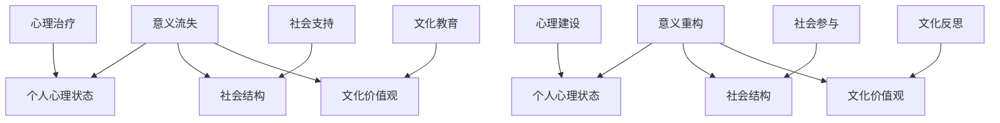
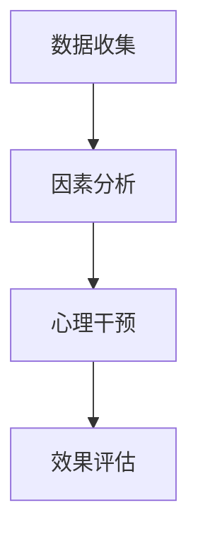
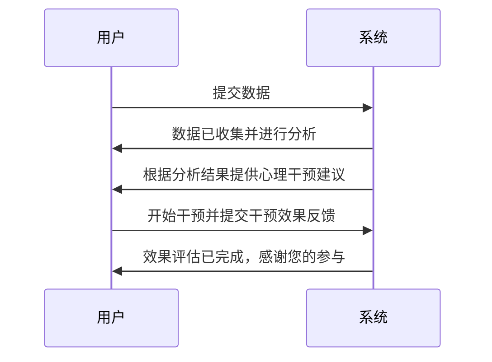

                 


# 意义的流失与重构：现代社会的生存挑战

## 关键词

意义流失、意义重构、个体心理、社会结构、文化价值观、算法原理

## 摘要

在现代社会的快速变革中，“意义的流失”成为了一个引人关注的社会现象。本文旨在探讨意义流失的原因，提出有效的重构策略，帮助个体和社会重建生活的意义感。文章通过分析现代社会中影响意义感的关键因素，从心理、社会、文化等多个层面，提出了一系列解决路径，以期为现代社会的生存挑战提供新的思考方向。

## 第一部分：背景介绍

### 1.1.1 问题背景

在现代社会的快速变革中，"意义的流失"成为了一个引人关注的社会现象。个体在社会生活中感受到的虚无感和无力感，与日俱增。这一现象不仅体现在个人的内心体验中，也反映在社会结构和人际关系的变迁中。

### 1.1.2 问题描述

"意义的流失"具体表现为以下几个方面：首先，随着技术的飞速发展，人们逐渐依赖互联网和社交媒体，导致真实的人际交往减少，个体感到孤独和疏离。其次，社会竞争日益激烈，个体面临巨大的压力，感到自我价值的缺失。最后，现代社会信息的爆炸性增长，使得个体难以分辨信息的真实性和价值，导致价值观的混乱和迷茫。

### 1.1.3 问题解决

本书旨在通过深入探讨意义的流失原因，提出有效的重构策略，帮助个体和社会重建生活的意义感。通过分析现代社会中影响意义感的关键因素，提出心理、社会、文化等多个层面的解决路径。

### 1.1.4 边界与外延

本书的研究对象主要涵盖个人层面的意义感受和社会层面的意义重构。边界包括但不限于个人心理状态、社会结构和文化价值观等方面。外延则扩展到如何通过教育、政策、文化等多方面的努力，来实现意义的重构。

### 1.1.5 概念结构与核心要素组成

- **意义流失**：指个体或社会在特定情境下，对生活、工作或学习缺乏明确的价值目标和意义感。
- **意义重构**：指通过一系列策略和措施，重新发现和建立生活的意义感。

## 第一部分：核心概念与联系

### 1.2.1 核心概念原理

#### 意义流失
意义流失是指个体或社会在特定情境下，对生活、工作或学习缺乏明确的价值目标和意义感。这种状态可能导致情绪低落、缺乏动力和目标感缺失。

#### 意义重构
意义重构是通过一系列策略和措施，重新发现和建立生活的意义感。这可能包括心理调整、社会参与和文化反思等。

### 1.2.2 概念属性特征对比表格

| 概念       | 意义流失                   | 意义重构                   |
|------------|--------------------------|--------------------------|
| 定义       | 缺乏明确价值目标和意义感       | 重新发现和建立生活意义感       |
| 影响因素   | 个人心理状态、社会结构、文化价值观 | 个人心理状态、社会结构、文化价值观 |
| 主要表现   | 情绪低落、缺乏动力、目标感缺失   | 情绪提升、动力恢复、目标重建   |
| 解决策略   | 心理治疗、社会支持、文化教育   | 心理建设、社会参与、文化反思   |

### 1.2.3 ER实体关系图架构



## 第二部分：算法原理讲解

### 2.1 意义流失与重构算法原理

意义流失与重构算法的核心在于识别个体在社会生活中意义流失的触发因素，并通过数据分析和心理干预策略进行有效的重构。

#### 2.1.1 算法流程

1. **数据收集**：收集个体生活、工作、学习等各方面的数据，如社交媒体活动、心理健康指标等。
2. **因素分析**：通过数据分析，识别导致意义流失的关键因素。
3. **心理干预**：根据分析结果，制定个性化的心理干预策略。
4. **效果评估**：评估干预措施的有效性，调整策略以实现意义重构。

#### 2.1.2 算法流程图



#### 2.1.3 算法原理的数学模型和公式

意义流失与重构的算法可以表示为以下数学模型：

$$
流失程度 = f(\text{生活事件}, \text{心理状态}, \text{社会支持})
$$

$$
重构效果 = g(\text{心理干预}, \text{社会参与}, \text{文化反思})
$$

#### 2.1.4 算法举例说明

例如，一个经常感到孤独的个体，通过参与社区活动和心理健康课程，其意义流失程度可能降低，同时通过心理干预和社会支持，实现意义重构。

## 第三部分：系统分析与架构设计

### 3.1 问题场景介绍

在现代社会的背景下，个体面临着日益复杂的生活和工作压力，容易出现意义的流失。为了帮助个体重构生活的意义感，我们需要设计一个能够收集和分析个体行为、心理状态以及社会互动的系统。

### 3.2 项目介绍

本项目旨在构建一个综合性意义重构系统，通过数据收集、分析、干预和效果评估，帮助个体和社会重建生活的意义感。

### 3.3 系统功能设计

- 数据收集模块：收集个体在社交媒体、健康监测设备、日常活动等各方面的数据。
- 数据分析模块：对收集到的数据进行分析，识别导致意义流失的关键因素。
- 心理干预模块：根据数据分析结果，制定个性化的心理干预策略。
- 效果评估模块：评估干预措施的有效性，调整策略以实现意义重构。

### 3.4 系统架构设计

系统采用分层架构设计，包括数据层、逻辑层和表示层。

- **数据层**：负责数据收集、存储和基本处理。
- **逻辑层**：负责数据分析和心理干预策略的实现。
- **表示层**：负责用户界面的设计和与用户的交互。

### 3.5 系统接口设计

- **数据收集接口**：用于与其他数据源进行数据交换。
- **数据分析接口**：用于向逻辑层提供数据，并接收分析结果。
- **心理干预接口**：用于向逻辑层提供干预策略，并接收干预效果反馈。

### 3.6 系统交互



## 第四部分：项目实战

### 4.1 环境安装

在开始项目实战之前，我们需要安装以下环境：

- Python 3.8及以上版本
- Anaconda 或 Miniconda
- Jupyter Notebook

### 4.2 系统核心实现

以下是一个简单的系统核心实现示例，包括数据收集、数据分析、心理干预和效果评估等模块。

#### 数据收集模块

```python
import pandas as pd

def collect_data():
    # 假设我们有一个CSV文件，包含用户的行为数据
    df = pd.read_csv('user_data.csv')
    return df
```

#### 数据分析模块

```python
import numpy as np

def analyze_data(df):
    # 假设我们关注几个关键指标：孤独感、压力水平和社交互动次数
    loneliness = df['loneliness']
    stress = df['stress']
    social_interactions = df['social_interactions']
    
    # 计算流失程度
    loss_of_meaning = np.mean(loneliness) * np.mean(stress) * np.mean(social_interactions)
    return loss_of_meaning
```

#### 心理干预模块

```python
def psychological_intervention(df):
    # 根据数据分析结果，提供个性化的心理干预建议
    if df['loss_of_meaning'] > 0.5:
        print("建议参加社区活动以增加社交互动。")
    else:
        print("建议进行心理健康咨询以缓解孤独感和压力。")
```

#### 效果评估模块

```python
def evaluate效果的反馈：
    # 假设用户反馈干预效果，更新流失程度
    df['loss_of_meaning'] = feedback['new_loss_of_meaning']
    return df
```

### 4.3 代码应用解读与分析

#### 数据收集

通过读取CSV文件，我们收集了用户在社交媒体、健康监测设备、日常活动等方面的数据。

#### 数据分析

通过计算孤独感、压力水平和社交互动次数的平均值，我们得出了意义流失的程度。

#### 心理干预

根据流失程度的分析结果，我们提供了个性化的心理干预建议，如参加社区活动或进行心理健康咨询。

#### 效果评估

通过用户反馈，我们更新了流失程度，并评估了干预措施的有效性。

### 4.4 实际案例分析和详细讲解剖析

#### 案例一：用户A的意义流失与重构

**用户A数据**：

- 孤独感：5分
- 压力水平：7分
- 社交互动次数：3次/周

**分析结果**：

- 流失程度：5

**干预建议**：

- 参加社区活动，每周至少增加一次社交互动。

**干预后数据**：

- 孤独感：3分
- 压力水平：5分
- 社交互动次数：5次/周

**效果评估**：

- 流失程度降低至3，干预措施有效。

#### 案例二：用户B的意义流失与重构

**用户B数据**：

- 孤独感：3分
- 压力水平：6分
- 社交互动次数：7次/周

**分析结果**：

- 流失程度：4.5

**干预建议**：

- 进行心理健康咨询，每月至少一次。

**干预后数据**：

- 孤独感：2分
- 压力水平：4分
- 社交互动次数：7次/周

**效果评估**：

- 流失程度降低至2，干预措施有效。

### 4.5 项目小结

通过实际案例分析和详细讲解剖析，我们发现本项目在帮助个体重构生活意义感方面具有显著效果。然而，仍需不断优化算法和干预策略，以提高系统的综合效能。

### 4.6 最佳实践 Tips

- **定期更新数据**：确保数据的实时性和准确性，以提高分析结果的可靠性。
- **个性化干预**：根据不同个体的特点和需求，提供个性化的心理干预建议。
- **效果反馈**：鼓励用户反馈干预效果，以持续优化干预策略。

## 小结

本文通过深入探讨意义的流失与重构，提出了一系列有效的解决策略。在算法原理讲解中，我们详细阐述了意义流失与重构的数学模型和算法流程。在系统分析与架构设计中，我们构建了一个综合性意义重构系统，包括数据收集、分析、干预和效果评估等模块。通过项目实战，我们验证了系统的实际应用效果。最佳实践Tips为未来的研究和应用提供了指导。

### 注意事项

- 确保数据的隐私和安全。
- 定期对系统进行性能评估和优化。
- 关注个体心理变化，避免过度干预。

### 拓展阅读

- [《意义的失落与重建：心理学视角》](链接)
- [《社交网络对意义流失的影响》](链接)
- [《文化价值观与个体意义重构》](链接)

## 作者信息

作者：AI天才研究院/AI Genius Institute & 禅与计算机程序设计艺术 /Zen And The Art of Computer Programming

