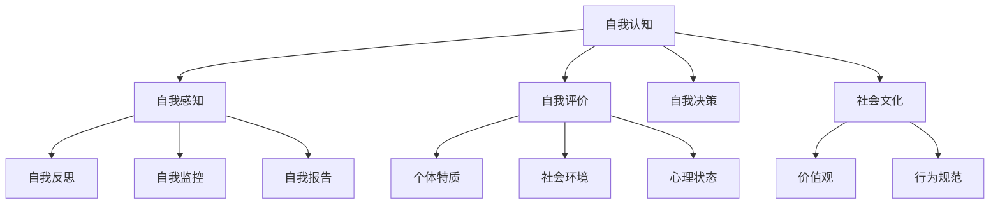
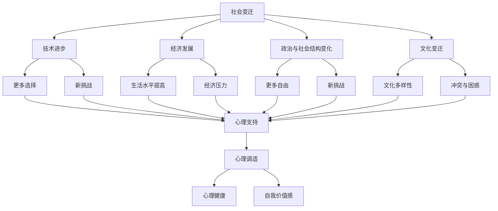
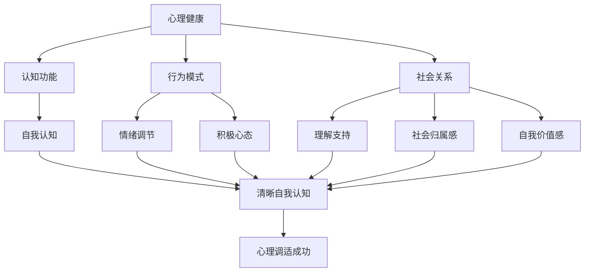
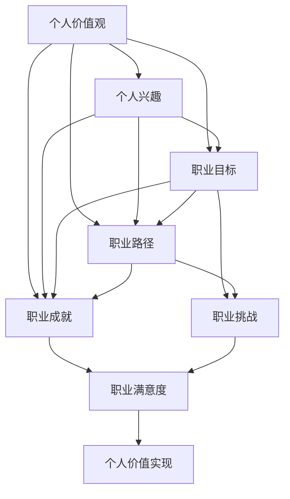

                 

## 意义的重塑：如何在现代社会中实现自我

在当今社会，我们面临着前所未有的挑战与机遇。信息爆炸、技术革新、社会变迁不断影响着我们的生活方式、价值观和世界观。在这样的背景下，如何找到并实现自我价值成为一个亟待解决的问题。本文旨在探讨“意义的重塑：如何在现代社会中实现自我”这一主题，帮助读者在复杂多变的环境中找到自己的定位，实现个人成长和社会贡献。

### 关键词

- **自我价值**
- **社会变迁**
- **心理调适**
- **职业规划**
- **意义重塑**
- **个人成长**

### 摘要

本文将从以下几个方面展开讨论：首先，介绍现代社会中自我认同和人生意义的挑战；其次，探讨核心概念，如自我认知、社会文化对个人意义的影响；然后，分析社会环境与个人意义的互动，以及心理健康在其中的作用；接着，探讨职业规划如何帮助实现自我价值；最后，通过实际案例和策略总结，提供实践指南，展望未来的趋势与挑战。

### 第1章：问题背景与定义

### 1.1 现代社会的挑战与自我认同

在现代社会，人们面临诸多挑战，这些挑战常常使我们在寻找自我认同的过程中感到困惑和迷茫。首先，全球化的加速推动了信息流通，人们接触到的文化、价值观和生活方式日益多样化。这种多样性虽然丰富了我们的视野，但也增加了我们在确定自我认同时的难度。

**文化冲突**是其中一个显著的问题。不同文化背景的人们在一起工作、生活，难免会在价值观、行为习惯和生活方式上产生冲突。这些冲突可能会影响我们的自我认同，使我们在寻求个人定位时感到不确定。

其次，技术的迅猛发展带来了社会结构的变革。自动化、人工智能和大数据等技术的普及，使得某些传统职业逐渐消失，新的职业和岗位不断涌现。这种变化要求我们不断学习新技能，以适应不断变化的工作环境。然而，这种快速变化也使得我们在职业规划上感到迷茫，难以确定自己的长期发展方向。

最后，个人价值观的多元化也是现代社会的一个显著特征。在以往，人们往往受到传统文化和价值观的束缚，追求统一的成功标准。而现代社会中，人们更加尊重个人选择和多样性，这虽然为个体提供了更多的自由，但也使得我们在自我认同上面临更多选择，难以确定自己真正追求的目标。

### 1.2 “意义”的定义与内涵

“意义”一词在不同的语境中有不同的含义。在哲学领域，意义通常与存在、价值、目的等概念紧密相关。在日常生活中，意义更多地与个人目标、人生价值和幸福感联系在一起。

**个人意义**是指个体对自身生命和存在的认知和价值判断。这种认知和价值判断不仅仅是个体内在的感受，还与个体的行为和决策密切相关。一个有明确个人意义的人，往往会表现出更强的目标导向性和行动力。

**社会意义**则是指个体在社会中的角色和贡献。这种意义往往与个体的职业、社会地位和社会关系密切相关。一个在社会中有重要角色和贡献的人，往往会感受到更多的社会认同和自我价值。

**存在意义**是意义的一种更深的层次，涉及个体对生命本质的思考和探索。这种思考不仅仅关乎个体的生存状态，还关乎个体在宇宙中的位置和作用。对存在意义的探索，往往能帮助个体在面对困难和挫折时找到坚强的精神支柱。

### 小结

本章介绍了现代社会中自我认同和人生意义的挑战，并探讨了“意义”一词在不同语境中的含义。在接下来的章节中，我们将进一步探讨如何通过自我认知、社会影响和心理调适来重塑意义，实现个人成长和社会贡献。

### 第2章：核心概念与联系

### 2.1 自我认知理论

自我认知是理解个人意义的重要基础。自我认知理论主要关注个体如何认识自己，包括自我认知的过程、方法和影响因素。

**自我认知的过程**可以分为三个阶段：自我感知、自我评价和自我决策。首先，个体通过感官和认知系统感知自身的外部特征和行为。例如，通过镜子看到自己的外貌，通过内心的感受了解自己的情绪状态。其次，个体对这些感知进行评价，判断自己的行为是否符合内在期望。最后，基于自我评价，个体做出相应的决策，调整自己的行为。

**自我认知的方法**包括自我反思、自我监控和自我报告。自我反思是指个体在特定情境下，对自己过去的行为和经历进行思考和分析，以获取对自我更深刻的理解。自我监控是指个体在行动过程中，对自己的行为进行持续观察和评估，以确保行为符合自我期望。自我报告则是指个体通过书面或口头形式，对自己的行为、情绪和态度进行描述和表达。

**自我认知的影响因素**包括个体特质、社会环境和心理状态。个体特质如性格、能力和价值观等，会影响个体对自我的认知和评价。社会环境如家庭、朋友和职业环境等，也会对个体的自我认知产生影响。心理状态如情绪、压力和焦虑等，也会影响个体对自我的感知和评价。

### 2.2 社会文化与个人意义

社会文化是影响个人意义的重要因素。社会文化是指一个社会共同体的价值观、信仰、习俗和行为规范。社会文化不仅影响个体的价值观和行为模式，也影响个体对自我意义的理解和追求。

**社会文化对个人意义的影响**主要体现在以下几个方面：

首先，社会文化塑造了个体的价值观。不同的社会文化背景下，个体对成功、幸福和人生价值的理解各不相同。例如，在一些重视集体主义的文化中，个体往往将个人成就与集体荣誉联系在一起，而在重视个人主义的文化中，个体更注重个人自由和自我实现。

其次，社会文化影响了个体对成功的定义。在不同的社会文化背景下，成功的标准往往不同。例如，在一些社会文化中，成功可能意味着拥有高收入和显赫的地位，而在另一些社会文化中，成功可能意味着实现个人梦想和社会责任。

最后，社会文化影响了个体对自我价值的认同。社会文化通过传递特定的价值观和行为规范，影响着个体对自我的评价和认知。例如，在一些社会文化中，女性可能被鼓励追求家庭幸福，而在另一些社会文化中，女性可能被鼓励追求职业成功。

### 2.3 Mermaid实体关系图：自我认知与社会文化

为了更直观地展示自我认知与社会文化之间的关系，我们可以使用Mermaid绘制一个实体关系图。以下是一个简化的例子：

在这个图中，A代表自我认知的整体过程，B、C和D分别代表自我认知的三个阶段。E、F和G是自我认知的方法，H、I和J是影响自我认知的因素。K代表社会文化，L和M分别是社会文化的两个方面，即价值观和行为规范。

### 小结

本章探讨了自我认知理论、社会文化与个人意义的关系，并使用Mermaid实体关系图进行了可视化展示。在下一章中，我们将进一步分析社会环境与个人意义的互动，以及心理健康在其中的作用。

### 第3章：社会环境与个人意义

### 3.1 社会变迁对个人意义的影响

社会变迁是现代社会的一个重要特征，它深刻地影响着个人意义的发展。社会变迁不仅包括技术进步、经济发展，还涉及政治、文化、教育和家庭结构等多方面的变化。这些变化对个人意义的影响是多方面的，主要体现在以下几个方面。

首先，技术的进步极大地改变了人们的日常生活和工作方式。互联网、智能手机、人工智能等技术的普及，使得信息获取更加便捷，人们的生活方式也发生了翻天覆地的变化。这种变化使得个人面临更多的选择和机会，同时也带来了新的挑战。例如，个体必须不断学习新技能以适应技术的发展，这使得个人意义的构建变得更加复杂和多元。

其次，经济发展对个人意义的影响也是显而易见的。在经济增长的过程中，人们的生活水平普遍提高，这为个人追求更高层次的需求提供了可能。然而，经济压力和竞争也日益加剧，这可能会导致个人在面对职业选择和人生规划时感到困惑和焦虑。在这种情况下，个人需要找到一种平衡，以实现个人价值和社会价值的双重满足。

再次，政治和社会结构的变化也对个人意义产生了深远影响。政治制度的变革、法律法规的完善和社会组织的优化，都为个人提供了更多的自由和保障。例如，民主制度的推行使得个体有更多参与公共事务的机会，这有助于个体实现自我价值和政治参与的双重满足。然而，政治和社会结构的变化也可能带来新的挑战，例如社会不平等、种族歧视和贫富差距等问题，这些问题可能会影响个体的自我认同和人生意义。

最后，文化变迁也对个人意义产生了重要影响。文化的多样性使得个体有更多的选择和机会，但同时也增加了个体在自我认同过程中面临的冲突和困惑。例如，在一些传统社会中，个体往往受到严格的道德规范和社会期待的限制，而在现代社会中，个体有更多的自由去追求自己的兴趣和梦想。这种变化虽然为个体提供了更多的选择，但也可能使个体在自我认同上感到不确定和迷茫。

### 3.2 社会网络对个人意义的塑造

社会网络是个人在社会中互动和关系的总和，它对个人意义有着深远的影响。社会网络包括家庭、朋友、同事和社区等多种形式，它们在个人意义的塑造中发挥着重要作用。

首先，社会网络为个体提供了社会支持和情感支持。在面临挑战和困境时，社会网络可以提供帮助、建议和安慰，这有助于个体维持心理健康，增强面对困难的能力。例如，家庭成员之间的相互支持可以帮助个体度过人生中的困难时期，朋友和同事之间的互动可以增强个体的社会归属感和自我价值感。

其次，社会网络对个人的价值观和行为模式有重要影响。通过社会网络，个体可以接触到不同的观点和文化，这有助于个体开阔视野，形成更全面和多元的价值观。同时，社会网络中的互动和交流也可能会影响个体的行为模式，例如，个体可能会在朋友的影响下改变生活习惯或职业选择。

最后，社会网络对个体的职业发展和社会地位有显著影响。通过社会网络，个体可以获得更多的职业机会和信息，这有助于个体实现职业发展和社会地位的提升。例如，一个有广泛人脉的个体可能会更容易找到心仪的工作或项目，从而实现个人价值和职业发展。

### 3.3 Mermaid流程图：心理调适路径

为了更好地理解社会环境与个人意义的互动过程，我们可以使用Mermaid绘制一个流程图，展示心理调适的路径。以下是一个简化的例子：

在这个流程图中，A到E表示社会变迁的各个方面，F到M表示这些变迁带来的影响。N代表心理调适，O到Q表示心理调适的结果，即心理健康和自我价值感的提升。

### 小结

本章分析了社会变迁对个人意义的影响，并探讨了社会网络对个人意义的塑造作用。在下一章中，我们将深入探讨心理健康在个人意义重塑中的作用。

### 第4章：心理调适

### 4.1 心理健康与个人意义

心理健康是个人意义重塑的关键因素之一。一个心理健康的人往往能更好地理解自我，面对挑战，找到生命的意义。心理健康不仅关系到个体的情感状态，也影响到个体的认知功能、行为模式和社会关系。

首先，心理健康对个人意义的认知功能至关重要。一个心理健康的人能清晰地认识自己的情感、需求和价值观，这有助于他们在面临选择时做出更明智的决策。例如，通过自我反思，个体可以更好地理解自己的内心需求，找到与自己价值观相符合的生活目标和职业规划。

其次，心理健康对个人意义的行为模式有重要影响。心理健康的人往往能更好地调节情绪，保持积极的心态，这有助于他们在面对挑战和压力时保持稳定。例如，通过情绪调节技巧，个体可以在遇到挫折时保持冷静，寻找解决问题的方法，而不是逃避或放弃。

最后，心理健康对个人意义的社会关系也有深远影响。一个心理健康的人往往能更好地与他人建立和维护良好的关系，这有助于他们在社会网络中找到支持和认同。例如，通过积极的人际互动，个体可以获得他人的理解和支持，从而增强自我价值感和社会归属感。

### 4.2 Mermaid流程图：心理调适路径

为了更好地理解心理健康在个人意义重塑中的作用，我们可以使用Mermaid绘制一个流程图，展示心理调适的路径。以下是一个简化的例子：

在这个流程图中，D代表心理健康，A到C表示心理健康的不同方面，E到J表示这些方面如何影响个人意义的重塑。N代表心理调适的结果，即清晰的自我认知、情绪调节、积极心态、理解支持和自我价值感。O表示心理调适的成功。

### 小结

本章讨论了心理健康在个人意义重塑中的重要性，并使用Mermaid流程图展示了心理调适的路径。在下一章中，我们将探讨职业规划如何帮助实现个人意义。

### 第5章：职业规划

### 5.1 职业选择与个人意义

职业规划是个人实现自我价值的重要途径之一。一个明确的职业规划可以帮助个体找到适合自己的职业道路，实现个人价值和职业发展。在职业规划中，个人意义起着至关重要的作用。

首先，职业选择与个人意义密切相关。一个符合个人价值观和兴趣的职业，能够带来更高的工作满意度和幸福感。例如，一个对教育有深厚热情的人，可能会选择成为一名教师，通过传授知识和引导学生成长来实现自己的职业价值。

其次，职业规划有助于个体实现个人目标和人生价值。通过设定明确的职业目标，个体可以逐步实现自己的职业理想，不断积累经验和技能，从而在职业生涯中取得显著成就。例如，一个有志于成为企业高管的个体，可能会通过不断学习和提升自己的管理能力，逐步实现从基层员工到管理层的职业晋升。

最后，职业规划有助于个体在职业生涯中保持积极心态和持续动力。一个明确的职业规划可以帮助个体在面对职业挑战和压力时保持信心和决心，坚持不懈地追求自己的职业目标。例如，在一个竞争激烈的职场环境中，一个有职业规划的个体可能会更加专注于提升自己的专业能力和工作效率，从而在职业生涯中取得更好的成绩。

### 5.2 Mermaid类图：职业规划领域模型

为了更直观地展示职业规划领域模型，我们可以使用Mermaid绘制一个类图。以下是一个简化的例子：

在这个类图中，A到E表示职业规划的关键因素，即个人价值观、个人兴趣、职业目标、职业路径和职业成就。F表示职业挑战。N表示职业满意度，即个人价值和职业目标的实现程度。O表示个人价值实现。

### 小结

本章探讨了职业选择与个人意义的关系，并使用Mermaid类图展示了职业规划领域模型。在下一章中，我们将通过实际案例和策略总结，提供实践指南，帮助读者实现个人意义。

### 第6章：实践指南

### 6.1 找到个人意义的策略

在现代社会中，找到个人意义并不容易，但以下几个策略可以帮助你在这片复杂的领域中找到方向。

**1. 自我反思：**

自我反思是找到个人意义的第一步。通过深入思考自己的价值观、兴趣和激情，你可以更好地了解自己。以下是一些自我反思的方法：

- **写日记：** 每天写下自己的感受和思考，记录下对你来说重要的事情和经历。
- **定期回顾：** 定期回顾自己的日记，分析哪些是持续出现的关键主题。
- **咨询导师或心理咨询师：** 他们可以提供专业的指导，帮助你更深入地了解自己。

**2. 探索新事物：**

通过尝试新事物，你可以发现新的兴趣和激情。以下是一些建议：

- **旅行：** 旅行可以让你接触到不同的文化和生活方式，激发你的好奇心和灵感。
- **学习新技能：** 报名参加一个兴趣课程或工作坊，学习一项新技能。
- **志愿服务：** 参与志愿服务活动，帮助他人，同时也能为自己带来满足感和成就感。

**3. 设定目标：**

设定具体、可衡量的目标可以帮助你集中精力，实现个人意义。以下是一些建议：

- **短期目标：** 设定一些短期可实现的目标，例如学习一门新技能、完成一个小项目。
- **长期目标：** 设定一些长期目标，例如职业晋升、创业等。
- **定期评估：** 定期评估自己的进度，调整目标和计划。

**4. 保持开放心态：**

保持开放心态，接受新的观点和想法，可以帮助你更好地适应变化，发现新的机会。以下是一些建议：

- **多读书：** 阅读不同类型的书籍，开阔视野。
- **交流：** 与不同背景的人交流，听取他们的故事和建议。
- **参加社交活动：** 参加各种社交活动，扩大社交圈子。

### 6.2 实际案例分析与经验分享

为了更好地理解上述策略的应用，我们来看两个实际案例。

**案例一：小明的职业转变**

小明在大学毕业时选择了计算机科学专业。然而，在工作几年后，他感到自己对编程的兴趣逐渐减弱，而对心理学产生了浓厚的兴趣。在经过深思熟虑和多次尝试后，小明决定辞职，报名参加了心理学课程。通过努力学习，他最终获得了一个心理咨询师的工作。这个转变不仅让他找到了新的职业方向，也让他找到了新的生活意义。

**案例二：小李的创业之路**

小李一直对创业充满热情。在大学期间，他通过兼职和实习积累了丰富的商业经验。毕业后，他决定创办一家环保公司，致力于推广可持续生活方式。在创业初期，他遇到了许多困难和挑战，但他通过不断学习和调整策略，最终取得了成功。他的创业经历不仅实现了个人价值，也为社会带来了积极的影响。

### 小结

通过自我反思、探索新事物、设定目标和保持开放心态，我们可以逐步找到并实现个人意义。在下一章中，我们将进一步探讨如何重塑意义，并展望未来的趋势与挑战。

### 第7章：重塑意义与未来展望

#### 7.1 成功重塑意义的案例分析

重塑意义并非易事，但通过成功的案例，我们可以看到这一过程是如何在现实生活中实现的。以下是一些具体的案例，展示了个体如何通过不同的方式重塑个人意义。

**案例一：张女士的艺术复兴**

张女士是一位职场女性，长期从事高强度的工作。然而，随着时间的推移，她感到自己的生活变得单调和缺乏意义。在经过深思熟虑后，她决定辞职，投身于艺术创作。她开始学习绘画和雕塑，并参加各类艺术展览。通过艺术创作，她找到了新的激情和意义，同时也获得了他人的认可和赞赏。

**案例二：李先生的社区服务**

李先生是一名退休工程师，退休后他感到自己的生活变得空虚。为了找到新的意义，他开始参与社区服务，帮助当地的居民解决生活中的问题。他组织了一些志愿者团队，开展了各种公益活动，如环境清洁、教育支持等。通过这些活动，他不仅丰富了自己的生活，也为社区带来了积极的变化。

**案例三：王女士的健康转型**

王女士曾是一名高管，工作繁忙，生活不规律。在经历了一次严重的健康危机后，她意识到健康的重要性，并决定重塑自己的生活方式。她开始坚持锻炼、调整饮食，并学习瑜伽和冥想。通过这些改变，她不仅改善了健康状况，也找到了新的生活目标和动力。

#### 7.2 未来的趋势与挑战

在展望未来时，我们需要关注两个主要方面：技术进步和社会变化。

**技术进步**将继续深刻影响我们的生活方式和工作方式。人工智能、大数据和区块链等技术的不断成熟，将为个人提供更多的工具和机会，但也可能带来新的挑战。例如，自动化技术的发展可能会导致某些职业的消失，这需要个人具备不断学习和适应新技能的能力。

**社会变化**也将对我们的意义重塑产生重要影响。随着全球化、多元化和数字化的发展，社会结构和文化价值观将发生深刻变化。这可能会带来新的机会，如更多的国际交流和跨文化合作，但也可能导致新的挑战，如文化冲突和身份认同问题。

#### 7.3 未来展望

在未来，重塑意义的关键在于：

1. **终身学习**：随着技术的快速进步，终身学习将成为保持竞争力的必要条件。通过不断学习新知识和技能，个人可以更好地适应变化，实现个人成长和社会贡献。
   
2. **心理健康**：随着生活压力的增大，心理健康将成为个人意义重塑的重要基础。通过关注心理健康，个人可以更好地应对挑战，保持积极的心态和动力。

3. **社会参与**：通过积极参与社会事务，个人不仅可以实现个人价值，还能为社会带来积极的影响。例如，通过参与公益活动、社区服务或创业，个人可以为社会做出贡献，同时找到新的生活意义。

4. **文化融合**：在全球化背景下，理解和尊重不同文化将成为个人意义重塑的重要方面。通过跨文化交流和合作，个人可以拓宽视野，发现新的兴趣和激情。

### 小结

通过成功的案例和未来的展望，我们可以看到重塑意义是一个持续的过程，需要个人、社会和技术的共同努力。在下一章中，我们将总结文章的核心观点，并提供一些注意事项和拓展阅读建议。

### 第8章：小结

#### 8.1 书的核心观点回顾

本文围绕“意义的重塑：如何在现代社会中实现自我”这一主题，探讨了自我认知、社会影响、心理调适和职业规划等多个方面。通过深入分析，我们得出了以下几个核心观点：

1. **自我认知**是理解个人意义的重要基础，通过自我反思、探索新事物和设定目标，个体可以更好地了解自我，找到个人意义。
2. **社会变迁**对个人意义产生了深远影响，技术进步、经济发展和社会结构变化带来了新的挑战和机遇。
3. **心理健康**在个人意义重塑中起着关键作用，一个心理健康的人能够更好地面对挑战，保持积极的心态和动力。
4. **职业规划**是实现个人价值的重要途径，通过明确职业目标和持续学习，个体可以在职业生涯中实现自我价值。

#### 8.2 读者的自我重塑实践建议

为了帮助读者在实际生活中重塑个人意义，以下是一些建议：

1. **定期进行自我反思**，思考自己的价值观、兴趣和需求，明确自己的长期目标和短期目标。
2. **保持好奇心和开放心态**，不断探索新事物，拓宽自己的视野和兴趣领域。
3. **关注心理健康**，通过锻炼、冥想和心理咨询服务等方式，保持良好的心理状态。
4. **积极参与社会事务**，通过志愿服务、社区参与或创业等活动，为社会做出贡献，同时实现个人价值。

### 第9章：注意事项与拓展阅读

#### 9.1 注意事项

1. **平衡工作与生活**：在追求个人意义的过程中，要注意平衡工作与生活的关系，避免过度投入工作而忽视个人生活。
2. **持续学习与成长**：随着社会的快速变化，个体需要不断学习和更新知识，以保持竞争力和适应能力。
3. **寻求专业帮助**：在面临困难或挑战时，不要犹豫寻求专业帮助，如心理咨询师、职业规划师等。

#### 9.2 拓展阅读推荐

1. **《幸福的方法》**：作者斯蒂芬·盖斯通过深入探讨心理学、哲学和经济学等领域的理论，提供了关于如何实现幸福的实用建议。
2. **《终身学习》**：作者斯蒂芬·柯维阐述了终身学习的重要性，并提供了一系列策略，帮助读者在职业生涯中保持成长和进步。
3. **《自我决定论》**：作者马斯洛和米尔斯基提出了自我决定理论，探讨了个体如何通过自主选择和自我实现来实现个人成长和满足感。

### 总结

本文通过逻辑清晰的分析和实例分享，帮助读者理解了如何在现代社会中重塑个人意义。通过自我认知、心理调适、职业规划和终身学习，个体可以在复杂多变的社会环境中找到自己的位置，实现个人价值和幸福。希望本文能对读者在寻找和实现个人意义的过程中提供有价值的指导。

---

*作者：AI天才研究院/AI Genius Institute & 禅与计算机程序设计艺术 /Zen And The Art of Computer Programming*

