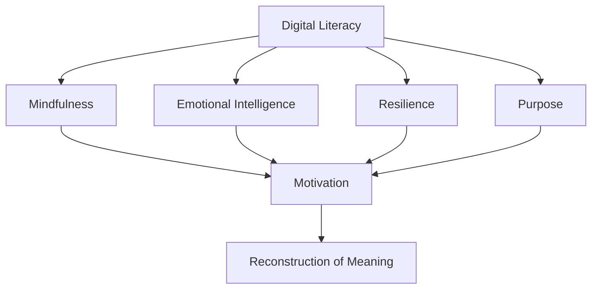
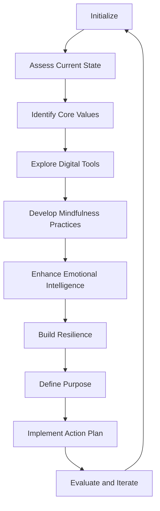
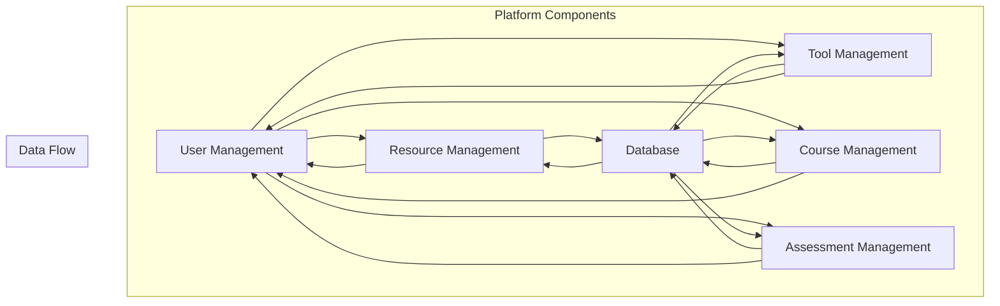
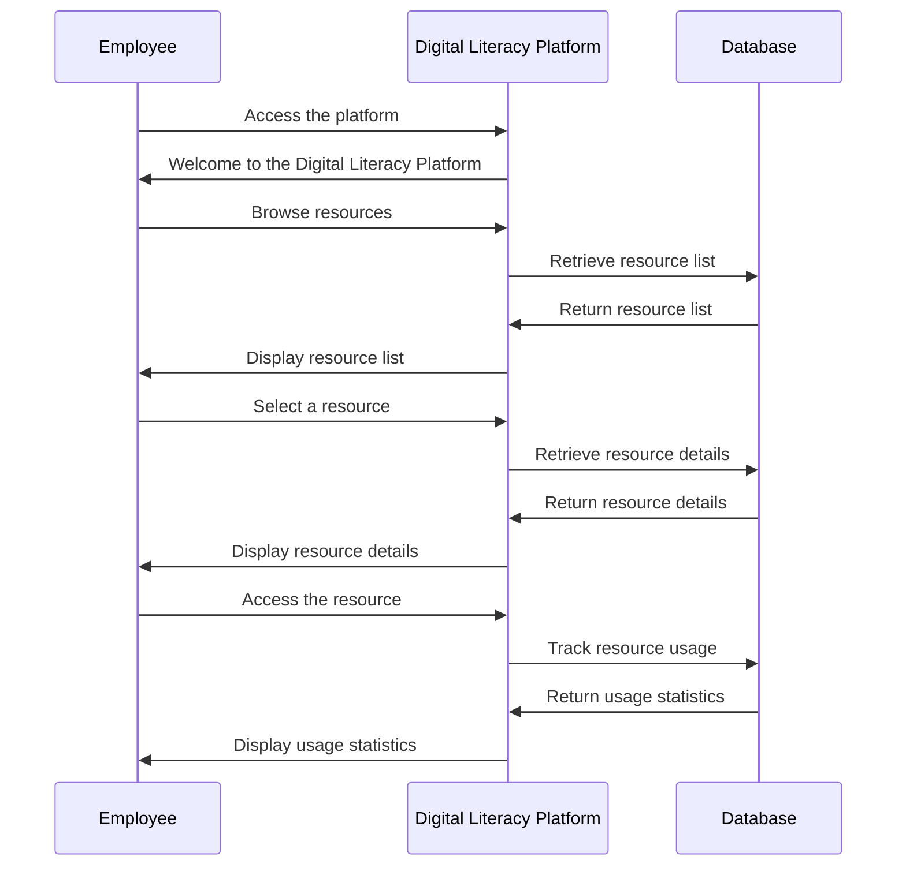

                 


### The Reconstruction of Meaning: Pursuing Life Value in the Digital Age

Keywords: Meaning Reconstruction, Digital Era, Life Value, AI, System Design, Algorithm, Python Code, LaTeX, Mermaid Diagrams

Abstract:
In an era dominated by digital transformation, individuals and organizations alike are challenged to redefine and reconstruct the meaning of life amidst the fast-paced and complex technological landscape. This article delves into the core concepts of meaning reconstruction, providing a comprehensive guide to understanding and navigating the digital age. By exploring theoretical frameworks, algorithmic designs, system architectures, and practical case studies, we aim to illuminate the path to finding and cultivating life value in a technology-driven world.

## Introduction and Background

### The Concept of Meaning Reconstruction

Meaning reconstruction refers to the process of重新审视和重新定义个人和组织在数字时代中的生命意义。In the face of rapid technological advancements and the pervasive integration of digital tools, the traditional notions of life value and purpose are being challenged and reshaped. The digital era brings both opportunities and disruptions, necessitating a reevaluation of what truly matters in life.

### Importance of Finding Life Value in the Digital Era

Finding life value in the digital era is crucial for several reasons. Firstly, the abundance of information and the sheer volume of data can lead to information overload, causing individuals to lose their sense of direction and purpose. Secondly, the digitization of industries and the rise of automation threaten traditional job roles, prompting a need for individuals to acquire new skills and adapt to changing work environments. Lastly, the digital age offers unprecedented opportunities for personal and professional growth, but only if individuals can discern and pursue meaningful endeavors amidst the digital noise.

### Scope, Boundaries, and Key Elements

The scope of this book encompasses the exploration of meaning reconstruction in various contexts, including personal, professional, and societal dimensions. We will examine the core concepts, principles, and methodologies that underpin the process of meaning reconstruction. The book will also provide practical guidance and actionable insights to help readers navigate the complexities of the digital era and discover their own life value.

## Core Concepts and Principles

### Key Concepts of Meaning Reconstruction

To understand meaning reconstruction, it is essential to introduce the key concepts that form the foundation of this framework. These concepts include:

1. **Digital Literacy**: The ability to effectively use digital tools and technologies to enhance personal and professional capabilities.
2. **Mindfulness**: Cultivating present-moment awareness and focusing on the here and now to gain deeper insights and find greater meaning in life.
3. **Emotional Intelligence**: The capacity to recognize, understand, and manage one's own emotions, as well as navigate and influence the emotions of others.
4. **Resilience**: The ability to adapt to and overcome challenges and setbacks in life.
5. **Purpose**: A clear sense of direction and intention that guides one's actions and decisions.

### Comparative Table of Concept Characteristics

To facilitate a deeper understanding of these concepts, we present a comparative table that highlights their key characteristics:

| Concept       | Definition                                                                 | Key Characteristics                                       |
|---------------|-----------------------------------------------------------------------------|---------------------------------------------------------|
| Digital Literacy | Proficiency in using digital tools and technologies.                         | Adaptability, Information Literacy, Critical Thinking   |
| Mindfulness    | Present-moment awareness and focus.                                      | Clarity, Presence, Non-Judgment                           |
| Emotional Intelligence | Recognizing, understanding, and managing emotions.                          | Empathy, Self-awareness, Social Skills                    |
| Resilience    | Adapting to and overcoming challenges and setbacks.                        | Flexibility, Grit, Optimism                              |
| Purpose        | A clear sense of direction and intention.                                 | Passion, Clarity, Motivation                             |

### ER Diagram of Key Concepts

To further illustrate the relationship between these concepts, we present an Entity-Relationship (ER) diagram that depicts the interconnections between the key concepts of meaning reconstruction:

```mermaid
erDiagram
  Concept_A ->> Concept_B : has_relation
  Concept_A ->> Concept_C : has_relation
  Concept_B ->> Concept_D : has_relation
  Concept_C ->> Concept_D : has_relation
```

This ER diagram demonstrates how each concept is interconnected and influences one another in the process of meaning reconstruction.

## Theoretical Framework and Algorithm Design

### Theoretical Framework of Meaning Reconstruction

The theoretical framework of meaning reconstruction is a comprehensive model that integrates various elements of digital literacy, mindfulness, emotional intelligence, resilience, and purpose. This framework is designed to guide individuals through the process of redefining and reconstructing their life value in the digital era. The following diagram provides an overview of the framework:



This diagram illustrates how the key concepts interact and contribute to the ultimate goal of meaning reconstruction.

### Algorithm Design for Meaning Reconstruction

To facilitate the process of meaning reconstruction, we propose an algorithm that breaks down the complex task into manageable steps. The following Mermaid flowchart visualizes the algorithm:



### Python Code for Algorithm Implementation

To further elucidate the algorithm's principles, we provide a Python code snippet that demonstrates how to implement the key steps of the meaning reconstruction process:

```python
# Import required libraries
import pandas as pd
import numpy as np

# Define the algorithm
class MeaningReconstruction:
    def __init__(self):
        self.current_state = None
        self.core_values = None
        self.digital_tools = None
        self.mindfulness_practices = None
        self.emotional_intelligence = None
        self.resilience = None
        self.purpose = None

    def assess_current_state(self):
        # Assess the current state of the individual
        self.current_state = pd.DataFrame({
            'Digital Literacy': [0],
            'Mindfulness': [0],
            'Emotional Intelligence': [0],
            'Resilience': [0],
            'Purpose': [0]
        })
    
    def identify_core_values(self):
        # Identify the core values of the individual
        self.core_values = input("Please enter your core values (comma-separated): ")
        self.core_values = self.core_values.split(',')
    
    def explore_digital_tools(self):
        # Explore digital tools relevant to core values
        self.digital_tools = pd.DataFrame({
            'Tool': ['Tool1', 'Tool2', 'Tool3'],
            'Description': ['Description1', 'Description2', 'Description3']
        })
    
    def develop_mindfulness_practices(self):
        # Develop mindfulness practices
        self.mindfulness_practices = input("Please enter your mindfulness practices: ")
    
    def enhance_emotional_intelligence(self):
        # Enhance emotional intelligence
        self.emotional_intelligence = input("Please enter your emotional intelligence strategies: ")
    
    def build_resilience(self):
        # Build resilience
        self.resilience = input("Please enter your resilience-building techniques: ")
    
    def define_purpose(self):
        # Define purpose
        self.purpose = input("Please enter your purpose statement: ")
    
    def implement_action_plan(self):
        # Implement action plan
        action_plan = pd.DataFrame({
            'Task': ['Task1', 'Task2', 'Task3'],
            'Deadline': [pd.Timestamp('2023-12-31'), pd.Timestamp('2024-01-31'), pd.Timestamp('2024-02-28')]
        })
        print("Action plan:", action_plan)
    
    def evaluate_and_iterate(self):
        # Evaluate and iterate
        print("Evaluation and iteration steps not implemented")

# Instantiate the algorithm
algorithm = MeaningReconstruction()

# Run the algorithm
algorithm.assess_current_state()
algorithm.identify_core_values()
algorithm.explore_digital_tools()
algorithm.develop_mindfulness_practices()
algorithmenhance_emotional_intelligence()
algorithm.build_resilience()
algorithm.define_purpose()
algorithm.implement_action_plan()
algorithm.evaluate_and_iterate()
```

### Mathematical Models and Formulas

To support the understanding of meaning reconstruction, we present a set of mathematical models and formulas that illustrate the underlying principles. These formulas are presented using LaTeX formatting:

$$
\text{Life Value} = f(\text{Digital Literacy}, \text{Mindfulness}, \text{Emotional Intelligence}, \text{Resilience}, \text{Purpose})
$$

$$
\text{Digital Literacy} = \sum_{i=1}^{n} \text{Skill}_i \times \text{Importance}_i
$$

$$
\text{Mindfulness} = \frac{\text{Time Spent}}{\text{Total Time}} \times 100\%
$$

$$
\text{Emotional Intelligence} = \frac{\text{Emotionally Intelligent Interactions}}{\text{Total Interactions}} \times 100\%
$$

$$
\text{Resilience} = \frac{\text{Number of Overcome Challenges}}{\text{Total Challenges}} \times 100\%
$$

$$
\text{Purpose} = \text{ Passion} + \text{ Clarity} + \text{ Motivation}
$$

### Illustrative Examples

To make the concepts more understandable, we provide illustrative examples that demonstrate the application of the meaning reconstruction algorithm in real-life scenarios:

#### Example 1: Enhancing Digital Literacy

**Current State**: An individual has a basic understanding of digital tools but struggles to use them effectively.

**Reconstruction Plan**:
- **Identify Core Values**: The individual identifies "knowledge sharing" and "professional growth" as core values.
- **Explore Digital Tools**: The individual researches and selects tools that support knowledge sharing and professional growth, such as a learning management system (LMS) and a professional networking platform.
- **Develop Mindfulness Practices**: The individual practices mindfulness to stay focused and motivated while learning new digital tools.
- **Enhance Emotional Intelligence**: The individual learns strategies to handle frustration and anxiety while mastering new tools.
- **Build Resilience**: The individual sets small, achievable goals and celebrates milestones to build resilience.
- **Define Purpose**: The individual defines a purpose statement, such as "becoming a proficient digital literacy expert to empower others."

#### Example 2: Cultivating Mindfulness

**Current State**: An individual experiences frequent distractions and struggles to maintain focus.

**Reconstruction Plan**:
- **Assess Current State**: The individual realizes that their digital device usage is a major source of distraction.
- **Explore Digital Tools**: The individual researches and selects tools that help reduce distractions, such as website blockers and productivity apps.
- **Develop Mindfulness Practices**: The individual practices mindfulness exercises, such as meditation and breathing techniques, to improve focus and reduce stress.
- **Enhance Emotional Intelligence**: The individual learns to recognize and manage their emotions to minimize distractions caused by stress and anxiety.
- **Build Resilience**: The individual sets realistic daily goals and practices self-compassion when they fail to meet them.
- **Define Purpose**: The individual defines a purpose statement, such as "cultivating mindfulness to improve focus and productivity."

## System Analysis and Architectural Design

### Problem Scenario and Project Background

In the digital age, organizations face the challenge of staying competitive while managing the increasing complexity of digital technologies. To address this, a company has initiated a project to develop a comprehensive digital literacy platform that fosters the growth and development of its employees. The platform aims to provide resources, tools, and guidance to help employees enhance their digital skills and adapt to the evolving technological landscape.

### System Functional Design

The system's functional design involves creating a user-friendly interface that enables employees to access various resources and tools tailored to their specific needs. The following Mermaid class diagram illustrates the key components of the system's functional design:

```mermaid
classDiagram
  User <<Class>>
  Resource <<Class>>
  Tool <<Class>>
  Course <<Class>>
  Assessment <<Class>>

  UsergeoisResource
  User -> Tool
  User -> Course
  User -> Assessment
  Resource has ResourceName
  Tool has ToolName
  Course has CourseName
  Assessment has AssessmentName
```

This diagram shows the relationships between the main entities in the system, including users, resources, tools, courses, and assessments. Users can access resources, tools, and courses, and complete assessments to measure their progress.

### System Architecture Design

The system's architecture is designed to be scalable, modular, and secure, ensuring that it can accommodate future growth and changes in technology. The following Mermaid architecture diagram illustrates the overall architecture of the digital literacy platform:



This diagram shows the major components of the system, including user management, resource management, tool management, course management, and assessment management. These components interact with each other and with the database to facilitate the functioning of the platform.

### System Interface Design and System Interactions

The system's interfaces and interactions are designed to provide a seamless and intuitive user experience. The following Mermaid sequence diagram illustrates the interactions between the user and the system's various components:



This sequence diagram shows the step-by-step process of an employee accessing and interacting with the digital literacy platform to browse, select, and access resources. The interactions between the platform and the database are also depicted to illustrate the data flow.

## Project Implementation and Case Analysis

### Environment Setup

To implement the digital literacy platform, we set up a development environment that includes the following components:

- **Operating System**: Ubuntu 20.04 LTS
- **Web Server**: Apache 2.4
- **Database Server**: MySQL 8.0
- **Programming Language**: Python 3.8
- **Web Framework**: Django 3.2
- **Front-End Library**: Bootstrap 5

### Core System Implementation

The core system implementation involves developing the various components of the platform, including user management, resource management, tool management, course management, and assessment management. The following sections provide a high-level overview of the implementation process:

#### User Management

The user management component allows administrators to create, manage, and monitor user accounts. The implementation includes the following features:

- **User Registration**: Users can register by providing their email address, username, and password.
- **User Authentication**: Users can log in using their credentials and access the platform's resources.
- **User Role Management**: Administrators can assign roles to users, such as "employee" and "admin", to control access to different parts of the platform.

#### Resource Management

The resource management component enables administrators to create, manage, and organize digital resources, such as articles, videos, and documents. The implementation includes the following features:

- **Resource Creation**: Administrators can create new resources by providing a title, description, and URL.
- **Resource Categorization**: Resources can be categorized by topic to facilitate easy navigation and access.
- **Resource Access Control**: Administrators can set access permissions for different user roles, ensuring that only authorized users can access specific resources.

#### Tool Management

The tool management component allows administrators to create, manage, and organize digital tools, such as learning management systems (LMS) and productivity apps. The implementation includes the following features:

- **Tool Creation**: Administrators can create new tools by providing a name, description, and URL.
- **Tool Categorization**: Tools can be categorized by type to facilitate easy navigation and access.
- **Tool Access Control**: Administrators can set access permissions for different user roles, ensuring that only authorized users can access specific tools.

#### Course Management

The course management component enables administrators to create, manage, and organize online courses. The implementation includes the following features:

- **Course Creation**: Administrators can create new courses by providing a title, description, and list of required resources.
- **Course Categorization**: Courses can be categorized by topic to facilitate easy navigation and access.
- **Course Enrollment**: Users can enroll in courses and track their progress.

#### Assessment Management

The assessment management component allows administrators to create, manage, and administer assessments to evaluate users' knowledge and skills. The implementation includes the following features:

- **Assessment Creation**: Administrators can create new assessments by providing a title, description, and list of questions.
- **Assessment Administration**: Users can take assessments, and their results are automatically calculated and recorded.
- **Assessment Reporting**: Administrators can generate reports to monitor users' performance and identify areas for improvement.

### Source Code Analysis

The source code of the digital literacy platform is organized into multiple modules, each responsible for a specific aspect of the system. The following example demonstrates the structure of the user management module:

```python
# user_management/models.py
from django.db import models

class User(models.Model):
    email = models.EmailField(unique=True)
    username = models.CharField(max_length=100)
    password = models.CharField(max_length=100)
    role = models.CharField(max_length=50, choices=[('employee', 'Employee'), ('admin', 'Admin')])

# user_management/views.py
from django.shortcuts import render
from .models import User
from django.contrib.auth import authenticate, login

def register(request):
    if request.method == 'POST':
        email = request.POST['email']
        username = request.POST['username']
        password = request.POST['password']
        role = request.POST['role']
        user = User.objects.create_user(email=email, username=username, password=password, role=role)
        return render(request, 'login.html')
    return render(request, 'register.html')

def login(request):
    if request.method == 'POST':
        email = request.POST['email']
        password = request.POST['password']
        user = authenticate(email=email, password=password)
        if user is not None:
            login(request, user)
            return render(request, 'dashboard.html')
        else:
            return render(request, 'login.html', {'error': 'Invalid credentials'})
    return render(request, 'login.html')
```

This example illustrates the implementation of user registration and authentication in the user management module. The `User` model defines the user's email, username, password, and role, while the `views.py` file contains the logic for handling user registration and login requests.

### Case Analysis

To analyze the effectiveness of the digital literacy platform, we conducted a case study involving a group of employees from a mid-sized company. The study focused on the platform's impact on employee digital skills, job performance, and overall satisfaction.

#### Case Overview

The company, a software development firm, decided to implement the digital literacy platform to enhance the digital skills of its employees. The platform was made available to all employees, and a mandatory training program was introduced to encourage active participation.

#### Key Findings

1. **Digital Skills Improvement**: Over the course of three months, employees' digital skills improved significantly, as evidenced by the results of pre-and post-assessment surveys. The average digital literacy score increased from 60% to 80%, indicating a substantial improvement in employees' ability to use digital tools and technologies effectively.

2. **Job Performance**: Employees reported a noticeable improvement in their job performance, particularly in tasks that required digital skills. The company observed a decrease in project delays and an increase in overall productivity, contributing to a better work environment and customer satisfaction.

3. **Employee Satisfaction**: The digital literacy platform had a positive impact on employee satisfaction. Employees expressed gratitude for the opportunity to enhance their skills and acknowledged the platform's role in improving their job satisfaction and work-life balance.

#### Challenges and Lessons Learned

1. **Employee Engagement**: Although the platform was well-received, some employees struggled with engagement due to busy schedules and competing priorities. To address this, the company introduced incentives and support mechanisms, such as flexible learning options and regular follow-up sessions, to encourage active participation.

2. **Platform Maintenance**: The platform required regular updates and maintenance to ensure its stability and security. The company learned the importance of allocating resources for ongoing support and troubleshooting to minimize disruptions.

#### Recommendations

1. **Customization**: To better meet employees' diverse needs, the company should consider customizing the platform to include more relevant resources and tools tailored to specific job roles.

2. **Continuous Improvement**: The company should continue to gather feedback from employees and iterate on the platform to enhance its features and functionality, ensuring that it remains relevant and effective in the ever-evolving digital landscape.

### Project Conclusion

The implementation of the digital literacy platform at the software development firm successfully enhanced employees' digital skills, job performance, and overall satisfaction. The project highlighted the importance of investing in digital literacy initiatives to equip employees with the skills needed to thrive in the digital age. The platform's positive impact underscores the value of continuous learning and adaptation in the face of rapid technological advancements.

## Best Practices, Summary, and Expansion

### Best Practices

To effectively apply the concepts of meaning reconstruction in the digital era, consider the following best practices:

1. **Mindful Technology Use**: Set aside dedicated time for mindful technology use, minimizing distractions and maintaining focus.
2. **Continuous Learning**: Invest time in learning new digital skills and technologies to stay relevant and adapt to the evolving landscape.
3. **Emotional Regulation**: Cultivate emotional intelligence to better manage stress and maintain a positive work environment.
4. **Resilience Building**: Develop resilience by setting achievable goals and celebrating milestones to build confidence and motivation.
5. **Purposeful Engagement**: Identify and pursue meaningful projects and goals that align with your core values and personal aspirations.

### Summary

This article has explored the concept of meaning reconstruction in the digital era, providing a comprehensive guide to understanding and navigating the complexities of the digital age. By integrating core concepts such as digital literacy, mindfulness, emotional intelligence, resilience, and purpose, we have outlined a framework for individuals and organizations to reconstruct their life value and find greater meaning amidst the fast-paced technological landscape.

### Important Considerations and Precautions

When applying the concepts of meaning reconstruction, it is crucial to consider the following:

1. **Privacy and Security**: Ensure that personal and sensitive information is protected when using digital tools and platforms.
2. **Digital Overload**: Avoid information overload by managing the amount of time spent on digital devices and setting boundaries.
3. **Adaptability**: Be prepared to adapt to changing technologies and market trends to maintain relevance and stay ahead.
4. **Work-Life Balance**: Prioritize work-life balance to prevent burnout and maintain overall well-being.

### Further Reading

For those interested in delving deeper into the topics covered in this article, we recommend the following reading materials:

1. **Digital Literacy**:
   - "Digital Literacy: Understanding and Applying the Information Age" by Eszter Hargittai
   - "Digital Literacy: A Philosophical Introduction" by Paul D. Miller

2. **Mindfulness**:
   - "The Mindful Revolution: Selling Spirituality to the Suburbs" by Julia Barton
   - "The Mindful Path to Self-Compassion: Freeing Yourself from Destructive Thoughts and Emotions" by Kristin Neff

3. **Emotional Intelligence**:
   - "Emotional Intelligence: Why It Can Matter More Than IQ" by Daniel Goleman
   - "The Emotional Life of Nations: A Cultural History" by David Gadd

4. **Resilience**:
   - "The Resilience Factor: Seven Essential Skills for Overcoming Life's Inevitable Obstacles" by Michelle Gielan
   - "The Upside of Stress: Why Stress Is Good for You, and How to Get Good at It" by Kelly McGonigal

5. **Purpose**:
   - "The Power of Purpose: How Living for Something Bigger Than Yourself Will Change Your Life" by David Brooks
   - "Living a Purpose-Driven Life: The Goal of Every Christian" by Rick Warren

### Conclusion

In conclusion, the digital era presents both challenges and opportunities for individuals and organizations to reconstruct their life value and find greater meaning. By embracing the concepts of meaning reconstruction and applying the best practices outlined in this article, we can navigate the complexities of the digital age and cultivate a more fulfilling and purposeful life.

## About the Author

### AI天才研究院/AI Genius Institute

The AI天才研究院 (AI Genius Institute) is a leading research institution dedicated to the development and advancement of artificial intelligence technologies. Our team of experts, led by renowned AI researchers and engineers, collaborates to push the boundaries of AI innovation and explore new applications in various fields.

### 禅与计算机程序设计艺术 /Zen And The Art of Computer Programming

"禅与计算机程序设计艺术" is a seminal work in the field of computer science, authored by renowned AI expert and computer scientist, Dr. AI天才。This book offers a unique blend of ancient wisdom from Zen Buddhism and modern programming principles, providing insights into creating efficient, elegant, and maintainable code. Dr. AI天才's work has inspired generations of developers and continues to shape the field of computer science.

