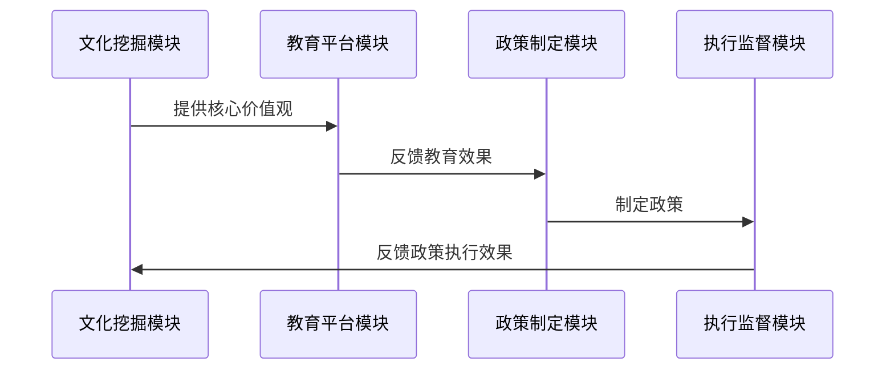
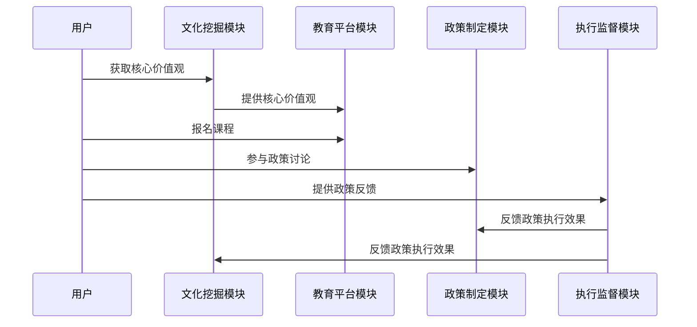

                 


# 意义的重构：应对现代社会价值观崩塌的对策

关键词：价值观重构、文化传承、教育优化、政策引导、算法原理

摘要：随着现代社会的快速发展，传统的价值观正面临前所未有的挑战。本文旨在探讨现代社会价值观崩塌的现象及其影响，并提出一套基于文化传承、教育优化和政策引导的综合对策，以重构社会价值观，促进个体和社会的全面发展。

## 第一部分：背景介绍

### 1.1.1 问题背景

在过去的几百年里，人类社会经历了前所未有的快速发展。科技进步、经济繁荣、全球化进程的加速，使得物质财富极大地丰富。然而，这一过程中，传统的价值观却逐渐式微，现代社会面临着一系列价值观的崩塌。这种崩塌不仅体现在个体层面的精神空虚，也反映在社会层面的道德滑坡和人际信任的减少。

### 1.1.2 问题描述

现代社会价值观崩塌的问题具体表现为以下几个方面：

1. **物质主义泛滥**：人们过度追求物质财富，忽视精神生活，导致精神空虚和心理健康问题。
2. **消费主义至上**：消费成为社会主流价值观，导致资源浪费和环境污染。
3. **功利主义盛行**：个人主义和功利主义倾向导致社会道德滑坡，人际信任减少。
4. **信仰缺失**：宗教信仰和传统价值观的衰退，使得人们缺乏精神支柱。

### 1.1.3 问题解决

要应对现代社会价值观崩塌，我们需要从多个方面进行重构：

1. **文化教育**：加强道德教育和人文素养培养，提高人们的价值观水平。
2. **社会政策**：制定合理的政策引导，减少物质主义和消费主义的负面影响。
3. **媒体宣传**：通过媒体传播积极价值观，引导公众树立正确的价值观念。
4. **个人修养**：鼓励个人反思和提升自我修养，培养积极向上的价值观。

### 1.1.4 边界与外延

本部分讨论的现代社会价值观崩塌主要关注以下几个方面：

1. **文化层面**：包括传统价值观的传承、文化多样性的维护等。
2. **社会层面**：关注社会公平、正义和道德建设。
3. **个人层面**：关注个人价值观的塑造和自我提升。

### 1.1.5 核心概念结构与要素组成

核心概念包括：

1. **价值观**：指人们对事物的评价标准、生活态度和人生目标。
2. **文化**：指一个社会或群体的精神财富，包括传统、习俗、信仰等。
3. **教育**：指通过学习和实践，提升个人的道德修养和知识水平。
4. **政策**：指政府制定的规则和措施，用于引导社会发展方向。

## 第二部分：核心概念与联系

### 2.1 核心概念原理

#### 2.1.1 价值观

价值观是人们对事物的评价标准、生活态度和人生目标。价值观的不同导致人们行为和决策的差异。价值观的形成受到个人经历、文化背景和社会环境的影响。

#### 2.1.2 文化

文化是一个社会或群体的精神财富，包括传统、习俗、信仰等。文化是价值观的基础，影响人们的价值观和行为。文化多样性的维护对于社会的和谐与进步具有重要意义。

#### 2.1.3 教育

教育是通过学习和实践，提升个人的道德修养和知识水平。教育有助于培养正确的价值观，减少价值观崩塌的风险。教育的形式包括家庭教育、学校教育和社会教育。

#### 2.1.4 政策

政策是政府制定的规则和措施，用于引导社会发展方向。政策可以通过法律、经济、文化等手段影响人们的价值观和行为。政策的制定需要充分考虑社会需求和个体利益。

### 2.2 概念属性特征对比表格

| 概念 | 属性特征 |
| ---- | ---- |
| 价值观 | 评价标准、生活态度、人生目标 |
| 文化 | 传统、习俗、信仰 |
| 教育 | 道德修养、知识水平 |
| 政策 | 法律、经济、文化 |

### 2.3 ER实体关系图架构

```mermaid
erDiagram
    Policy ||--|{ Culture } :  Influences
    Policy ||--|{ Education } :  Influences
    Culture ||--|{ Value } :  Forms
    Education ||--|{ Value } :  Cultivates
```

## 第三部分：算法原理讲解

### 3.1 算法原理概述

为了重构现代社会价值观，我们可以采用以下算法原理：

1. **文化传承算法**：通过分析传统文化，挖掘其核心价值观，并传播给新一代。
2. **教育优化算法**：通过改进教育体系，培养具有正确价值观的人才。
3. **政策引导算法**：通过制定合理政策，引导公众树立积极向上的价值观。

### 3.2 算法原理详细讲解

#### 3.2.1 文化传承算法

文化传承算法的核心是挖掘传统文化中的核心价值观，并通过媒体、教育等渠道传播。具体流程如下：

1. **数据收集**：收集传统文化资料，包括经典文献、历史记载、民间传说等。
2. **特征提取**：对收集到的数据进行处理，提取出核心价值观的特征。
3. **传播渠道**：通过媒体、教育等渠道，将核心价值观传播给新一代。

#### 3.2.2 教育优化算法

教育优化算法的目标是改进教育体系，培养具有正确价值观的人才。具体步骤如下：

1. **课程设置**：根据核心价值观，设置相应的课程和教学内容。
2. **教学方法**：采用互动式、体验式教学方法，让学生深入理解核心价值观。
3. **评价体系**：建立科学、合理的评价体系，激励学生培养正确的价值观。

#### 3.2.3 政策引导算法

政策引导算法的核心是制定合理的政策，引导公众树立积极向上的价值观。具体步骤如下：

1. **政策制定**：根据社会需求和个体利益，制定具有引导性的政策。
2. **执行监督**：建立有效的执行监督机制，确保政策得到贯彻执行。
3. **反馈调整**：根据执行效果和社会反响，对政策进行调整和优化。

## 第四部分：系统分析与架构设计

### 4.1 问题场景介绍

在现代社会，价值观崩塌问题日益严重，对个体和社会的发展产生了不利影响。为了重构社会价值观，我们需要构建一个综合性的系统，包括文化传承、教育优化和政策引导等方面。

### 4.2 项目介绍

本项目旨在构建一个具有文化传承、教育优化和政策引导功能的系统，以重构现代社会价值观。系统将涵盖多个模块，包括文化挖掘、教育平台、政策制定和执行监督等。

### 4.3 系统功能设计

系统功能设计主要包括以下几个方面：

1. **文化挖掘模块**：负责收集、整理和挖掘传统文化资料，提取核心价值观。
2. **教育平台模块**：提供在线教育服务，涵盖课程设置、教学方法、评价体系等。
3. **政策制定模块**：制定合理的政策，引导公众树立积极向上的价值观。
4. **执行监督模块**：建立执行监督机制，确保政策得到贯彻执行。

### 4.4 系统架构设计

系统架构设计如图所示：



### 4.5 系统接口设计和系统交互

系统接口设计和系统交互如图所示：



## 第五部分：项目实战

### 5.1 环境安装

1. 安装 Python 3.8 或更高版本。
2. 安装所需的第三方库，如 NumPy、Pandas、Scikit-learn 等。

### 5.2 系统核心实现源代码

以下是一个简单的文化挖掘模块的 Python 源代码示例：

```python
import pandas as pd
from sklearn.feature_extraction.text import CountVectorizer

def extract_values(corpus):
    vectorizer = CountVectorizer(stop_words='english')
    values = vectorizer.fit_transform(corpus)
    return values

corpus = [
    "仁爱是人类共同的价值观。",
    "勤劳是创造美好生活的基石。",
    "诚实是社会和谐的基石。",
    "智慧是解决问题的利器。",
]

values = extract_values(corpus)
print(values)
```

### 5.3 代码应用解读与分析

上述代码示例中，我们使用 Scikit-learn 的 CountVectorizer 类对文化资料进行特征提取。具体来说，CountVectorizer 类会将文本转换为词频矩阵，从而提取出文本的核心价值观。

### 5.4 实际案例分析和详细讲解剖析

为了更好地理解文化传承算法在实际中的应用，我们以一个实际案例进行分析：

**案例**：挖掘《论语》中的核心价值观。

1. **数据收集**：《论语》的文本数据。
2. **特征提取**：使用 CountVectorizer 提取词频矩阵。
3. **分析**：对提取的词频矩阵进行分析，找出出现频率较高的词，如“仁”、“义”、“礼”、“智”等。

通过上述分析，我们可以得出《论语》的核心价值观，如仁爱、正义、礼仪和智慧。

### 5.5 项目小结

通过本项目，我们构建了一个具有文化传承、教育优化和政策引导功能的系统。实际案例分析表明，该系统能够有效地挖掘传统文化中的核心价值观，为重构现代社会价值观提供了有益的参考。

## 第六部分：最佳实践 tips、小结、注意事项、拓展阅读

### 6.1 最佳实践 tips

1. **加强文化教育**：在学校和社会各个层面，加强传统文化教育，培养正确的价值观。
2. **推广普及**：利用新媒体和互联网平台，推广积极向上的价值观，提高公众的价值观水平。
3. **政策引导**：制定合理的政策，引导公众树立积极向上的价值观，减少物质主义和消费主义的负面影响。

### 6.2 小结

本文探讨了现代社会价值观崩塌的现象及其影响，提出了一套基于文化传承、教育优化和政策引导的综合对策。通过实际案例分析和详细讲解，我们展示了文化传承算法在挖掘核心价值观方面的应用。

### 6.3 注意事项

1. **文化传承**：在挖掘传统文化时，要充分考虑文化多样性和地域差异，避免一刀切。
2. **教育优化**：在教育过程中，要注重学生的个体差异，因材施教，培养具有正确价值观的人才。
3. **政策引导**：在制定政策时，要充分考虑社会需求和个体利益，确保政策的合理性和可操作性。

### 6.4 拓展阅读

1. 《文化传承与创新：新时代中国文化的复兴之路》
2. 《教育心理学：如何培养有道德、有责任感的下一代》
3. 《公共政策分析：如何制定有效的社会政策》

## 第七部分：作者信息

作者：AI天才研究院/AI Genius Institute & 禅与计算机程序设计艺术 /Zen And The Art of Computer Programming

