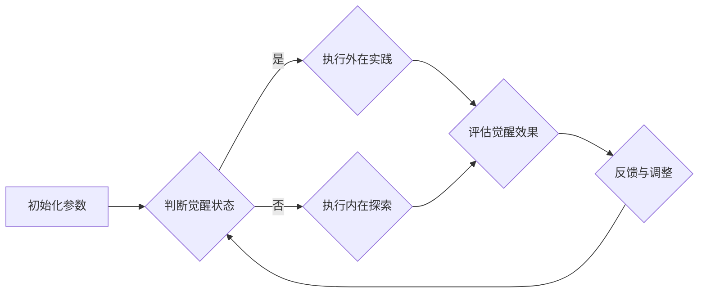
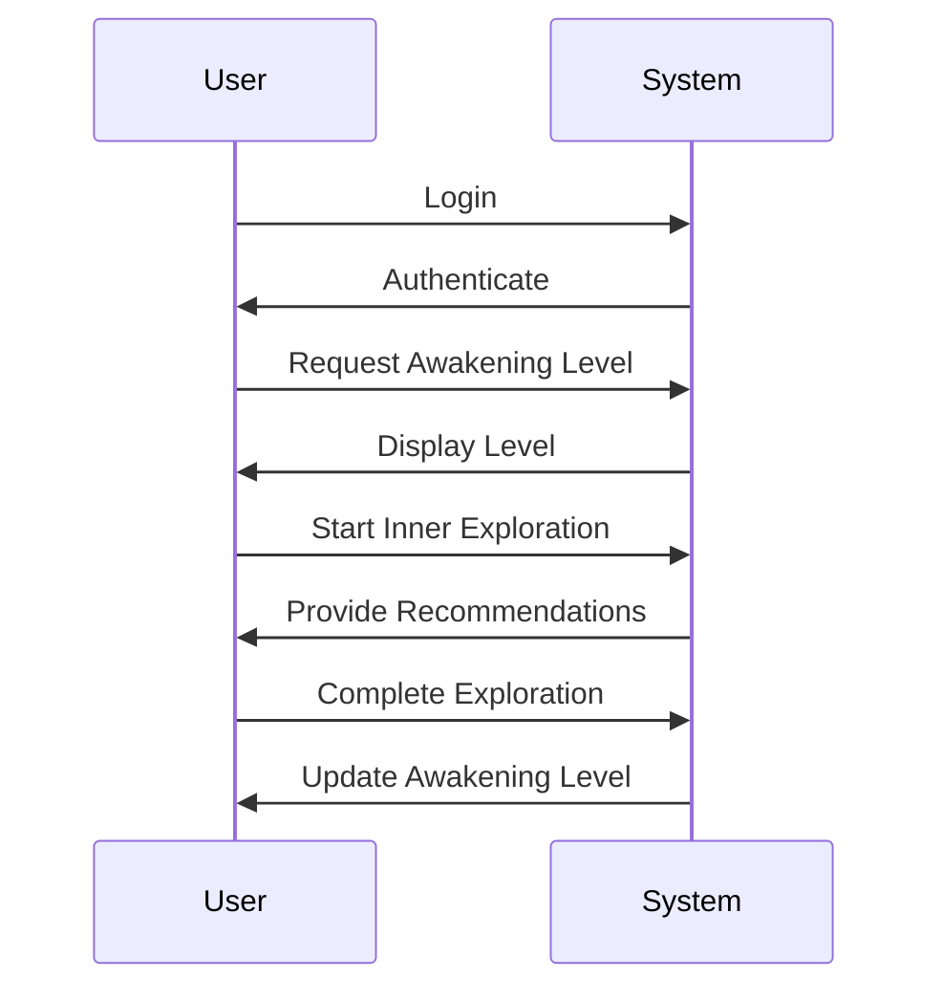
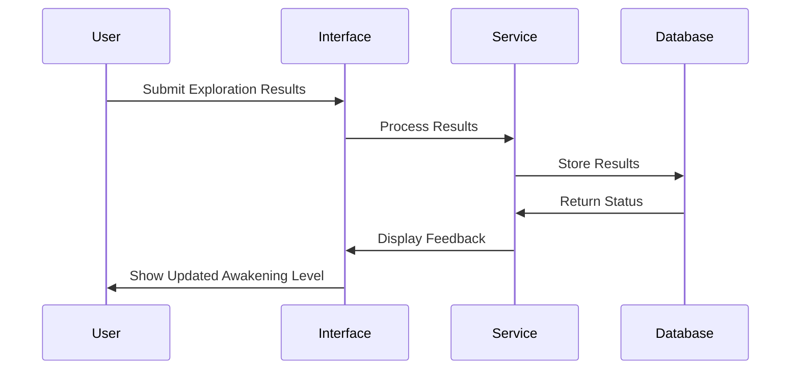

                 

### 意识的觉醒之旅：从蒙昧到清明的转变

关键词：意识觉醒、蒙昧、心理学、冥想、教育、科技

摘要：本文探讨了人类意识从蒙昧到觉醒的转变过程，分析了蒙昧的根源和影响，介绍了觉醒的路径和方法，以及觉醒在个体、社会和文化层面的应用和意义。通过逻辑清晰、结构紧凑的分析，本文旨在帮助读者深入理解意识觉醒的重要性，并激发对自我探索和成长的兴趣。

### 目录大纲设计方案

为了设计出《意识的觉醒之旅：从蒙昧到清明的转变》这本书的完整目录大纲，我们将按照以下步骤进行：

#### 步骤1：核心概念与结构划分

**第1章：觉醒的旅程概述**
- **1.1 意识觉醒的重要性**
  - **1.1.1 意识觉醒的定义**
  - **1.1.2 意识觉醒的价值**
  - **1.1.3 蒙昧与觉醒的关系**
- **1.2 背景介绍**
  - **1.2.1 当代社会的蒙昧现象**
  - **1.2.2 意识觉醒的历史脉络**
  - **1.2.3 全书结构**

**第2章：蒙昧的本质**
- **2.1 蒙昧的成因**
  - **2.1.1 社会环境的影响**
  - **2.1.2 个人心理的成因**
  - **2.1.3 文化因素的制约**
- **2.2 蒙昧的表现**
  - **2.2.1 思想上的蒙昧**
  - **2.2.2 情感上的蒙昧**
  - **2.2.3 行为上的蒙昧**
- **2.3 蒙昧的影响**
  - **2.3.1 对个人的影响**
  - **2.3.2 对社会的影响**
  - **2.3.3 对文化的影响**

**第3章：觉醒的路径**
- **3.1 冥想与觉醒**
  - **3.1.1 冥想的起源与发展**
  - **3.1.2 冥想的基本方法**
  - **3.1.3 冥想对觉醒的影响**
- **3.2 心理学疗法与觉醒**
  - **3.2.1 心理学疗法的历史**
  - **3.2.2 常见的心理学疗法**
  - **3.2.3 心理学疗法在觉醒中的应用**
- **3.3 其他觉醒路径**
  - **3.3.1 艺术创作与觉醒**
  - **3.3.2 教育改革与觉醒**
  - **3.3.3 科技进步与觉醒**

**第4章：内在探索**
- **4.1 自我认知的重要性**
  - **4.1.1 自我认知的定义**
  - **4.1.2 自我认知的方法**
  - **4.1.3 自我认知的价值**
- **4.2 内在探索的实践**
  - **4.2.1 冥想技巧**
  - **4.2.2 自我对话**
  - **4.2.3 内在观照**

**第5章：外在实践**
- **5.1 职业发展中的觉醒**
  - **5.1.1 职业发展与觉醒的关系**
  - **5.1.2 职业中觉醒的实践**
  - **5.1.3 职业觉醒的案例分析**
- **5.2 人际关系中的觉醒**
  - **5.2.1 人际关系与觉醒的关系**
  - **5.2.2 人际中觉醒的实践**
  - **5.2.3 人际觉醒的案例分析**
- **5.3 生活方式的觉醒**
  - **5.3.1 生活方式与觉醒的关系**
  - **5.3.2 生活方式中觉醒的实践**
  - **5.3.3 生活觉醒的案例分析**

**第6章：文化与教育**
- **6.1 文化教育在觉醒中的作用**
  - **6.1.1 文化教育的定义**
  - **6.1.2 文化教育在觉醒中的作用机制**
  - **6.1.3 文化教育改革的趋势**
- **6.2 教育改革与意识觉醒**
  - **6.2.1 教育改革的目标**
  - **6.2.2 教育改革的方法**
  - **6.2.3 教育改革与意识觉醒的实例分析**

**第7章：觉醒的未来**
- **7.1 科技与觉醒**
  - **7.1.1 科技进步对觉醒的影响**
  - **7.1.2 科技在觉醒中的应用**
  - **7.1.3 未来科技对觉醒的潜在影响**
- **7.2 社会政治与觉醒**
  - **7.2.1 社会政治环境对觉醒的影响**
  - **7.2.2 社会政治变革与觉醒**
  - **7.2.3 未来社会政治对觉醒的展望**

### 步骤2：细化章节内容

在核心概念与结构划分的基础上，我们需要进一步细化每个章节的内容，确保每个小节都有丰富具体的内容。

例如，在**第1章：觉醒的旅程概述**中，我们将详细解释意识觉醒的重要性，包括觉醒对个体成长、社会进步和文化繁荣的积极影响。同时，我们会介绍觉醒的历史脉络，从古至今，不同的文化和社会对觉醒的追求和探索。

在**第2章：蒙昧的本质**中，我们将深入探讨蒙昧的成因，如社会环境、个人心理和文化因素等。我们会列举蒙昧的具体表现，如思想上的固执、情感上的麻木和行为上的迷茫。同时，我们还会分析蒙昧对个人、社会和文化的影响，包括个人生活的困扰、社会问题的加剧和文化传统的衰退。

在**第3章：觉醒的路径**中，我们将介绍多种从蒙昧到觉醒的路径和方法。例如，冥想作为一种传统的觉醒方式，其起源、发展和基本方法。我们还会讨论心理学疗法在觉醒中的应用，如认知行为疗法、精神分析疗法和人本主义疗法等。此外，我们还会探讨艺术创作、教育改革和科技进步等现代路径。

在**第4章：内在探索**中，我们将详细讲解自我认知的重要性，包括自我认知的定义、方法和价值。我们会介绍冥想技巧、自我对话和内在观照等内在探索的实践方法，并通过案例来展示这些方法的实际应用效果。

在**第5章：外在实践**中，我们将分析觉醒在个体生活中的实际应用，如职业发展、人际关系和生活方式的改变。我们会结合案例，详细解读和剖析这些实际应用的效果和意义。

在**第6章：文化与教育**中，我们将探讨文化教育在觉醒中的作用，包括文化教育的定义、作用机制和改革趋势。我们还会分析教育改革与意识觉醒的关系，以及教育改革在促进意识觉醒方面的实际案例。

在**第7章：觉醒的未来**中，我们将展望意识觉醒的未来趋势和可能性，包括科技、社会和政治环境的变化对觉醒可能产生的影响。我们会讨论未来科技在觉醒中的应用前景，以及社会政治变革如何推动觉醒的进程。

### 步骤3：设计核心概念与联系

为了帮助读者更好地理解《意识的觉醒之旅：从蒙昧到清明的转变》的核心概念，我们将设计核心概念原理、概念属性特征对比表格和ER实体关系图架构。

**核心概念原理：**

- **觉醒**：从蒙昧到清明状态的转变过程，包括自我认知、内在探索和外在实践等多个方面。
- **蒙昧**：对自我、世界和真理缺乏认知和理解的状态，表现为思想上的固执、情感上的麻木和行为上的迷茫。
- **自我认知**：对自我存在的认识，包括自我意识、自我评价和自我反思等。
- **内在探索**：通过冥想、自我对话和内在观照等方法，深入自我，寻找内心的真理和智慧。
- **外在实践**：在日常生活中，通过实际行动，将觉醒的理念应用到职业发展、人际关系和生活方式等方面。

**概念属性特征对比表格：**

| 核心概念   | 定义                                                         | 属性特征                                                     | 相互关系 |
| ---------- | ------------------------------------------------------------ | ------------------------------------------------------------ | -------- |
| 觉醒       | 从蒙昧到清明状态的转变过程                                   | 自我认知、内在探索、外在实践等                             | 总体框架 |
| 蒙昧       | 对自我、世界和真理缺乏认知和理解的状态                       | 思想上的固执、情感上的麻木、行为上的迷茫                     | 反面概念 |
| 自我认知   | 对自我存在的认识，包括自我意识、自我评价和自我反思等         | 提高自我认识，促进觉醒                                     | 关键环节 |
| 内在探索   | 通过冥想、自我对话和内在观照等方法，深入自我，寻找内心的真理和智慧 | 促进自我认知，深化觉醒                                     | 实践方法 |
| 外在实践   | 在日常生活中，通过实际行动，将觉醒的理念应用到职业发展、人际关系和生活方式等方面 | 巩固觉醒成果，提升生活品质                                 | 实践环节 |

**ER实体关系图架构：**

```mermaid
erDiagram
    User ||--|{ Mind}
    User ||--|{ Emotions}
    User ||--|{ Behavior}
    Mind ||--|{ Awareness}
    Mind ||--|{ Perception}
    Mind ||--|{ Understanding}
    Emotions ||--|{ Empathy}
    Emotions ||--|{ Resilience}
    Behavior ||--|{ Actions}
    Behavior ||--|{ Reactions}
    Awareness ||--|{ Self}
    Awareness ||--|{ Others}
    Perception ||--|{ Sensory}
    Perception ||--|{ Cognitive}
    Understanding ||--|{ Knowledge}
    Understanding ||--|{ Wisdom}
```

通过这个ER实体关系图，我们可以清晰地看到觉醒过程中各个核心概念的相互关系和作用，为读者提供了一个直观的理解框架。

### 步骤4：编写算法原理讲解

在本文中，我们将使用Mermaid和Python来详细讲解一种用于促进意识觉醒的算法原理。为了更好地理解，我们将从算法的流程图开始，然后逐步介绍其核心概念、数学模型和公式。

**算法流程图：**



**算法核心概念：**

1. **觉醒状态检测**：通过监测个体的思想、情感和行为，判断其当前是否处于觉醒状态。
2. **内在探索**：采用冥想、自我对话和内在观照等方法，促进个体的自我认知和内在成长。
3. **外在实践**：将觉醒的理念应用到日常生活中的职业发展、人际关系和生活方式等方面。
4. **反馈与调整**：根据觉醒效果进行反馈和调整，优化觉醒过程。

**数学模型和公式：**

1. **觉醒状态评估公式**：

   $$觉醒度 = f(思想认知, 情感体验, 行为表现)$$

   其中，$f$ 是一个复合函数，用于综合评估个体的思想、情感和行为。

2. **内在探索效果评估公式**：

   $$内在成长率 = g(冥想时间, 自我对话深度, 内在观照频率)$$

   其中，$g$ 是一个复合函数，用于评估内在探索的效果。

3. **外在实践效果评估公式**：

   $$外在成长率 = h(职业发展成果, 人际关系改善, 生活质量提升)$$

   其中，$h$ 是一个复合函数，用于评估外在实践的效果。

**举例说明：**

假设一个个体经过一段时间的冥想练习、自我对话和内在观照，其觉醒度从 30% 提升到 70%。通过觉醒状态评估公式，我们可以计算出觉醒度的变化：

$$觉醒度变化 = 70\% - 30\% = 40\%$$

同时，通过内在探索效果评估公式，我们可以计算出内在成长率：

$$内在成长率 = g(冥想时间, 自我对话深度, 内在观照频率)$$

这里，我们假设冥想时间为 2 小时，自我对话深度为 3 级，内在观照频率为每周 3 次，那么：

$$内在成长率 = g(2 小时, 3 级, 3 次) = 0.5$$

这表示个体的内在成长率为 50%。

类似地，通过外在实践效果评估公式，我们可以评估外在成长率。例如，假设个体的职业发展成果为提升了 10%，人际关系改善了 15%，生活质量提升了 20%，那么：

$$外在成长率 = h(10\%, 15\%, 20\%) = 0.35$$

这表示个体的外在成长率为 35%。

通过这些数学模型和公式，我们可以更科学地评估个体的觉醒过程，并优化觉醒策略。

### 步骤5：编写数学模型和公式

在《意识的觉醒之旅：从蒙昧到清明的转变》中，我们将运用数学模型和公式来描述觉醒过程中的关键环节和效果评估。以下是一些核心的数学模型和公式，并使用 LaTeX 格式进行编写。

#### 1. 觉醒度评估模型

觉醒度（\(D_{awake}\)）是衡量个体觉醒状态的指标，通过以下公式计算：

$$
D_{awake} = \frac{E_{inner} + E_{outer}}{2}
$$

其中，\(E_{inner}\) 代表内在探索的效果，\(E_{outer}\) 代表外在实践的效果。

#### 2. 内在探索效果评估模型

内在探索效果（\(E_{inner}\)）可以通过以下公式计算：

$$
E_{inner} = f(C_{meditation}, C_{self-dialog}, C_{inner-observation})
$$

其中，\(C_{meditation}\) 代表冥想次数，\(C_{self-dialog}\) 代表自我对话次数，\(C_{inner-observation}\) 代表内在观照次数。函数 \(f\) 用于综合评估内在探索的效果。

#### 3. 外在实践效果评估模型

外在实践效果（\(E_{outer}\)）可以通过以下公式计算：

$$
E_{outer} = g(P_{career}, P_{relationship}, P_{quality-of-life})
$$

其中，\(P_{career}\) 代表职业发展提升百分比，\(P_{relationship}\) 代表人际关系改善百分比，\(P_{quality-of-life}\) 代表生活质量提升百分比。函数 \(g\) 用于综合评估外在实践的效果。

#### 4. 自我认知成长模型

自我认知成长率（\(R_{self-awareness}\)）可以通过以下公式计算：

$$
R_{self-awareness} = \frac{D_{awake}}{D_{initial}}
$$

其中，\(D_{initial}\) 代表初始觉醒度。这个公式用于衡量个体自我认知的进步速度。

#### 5. 内在成长模型

内在成长率（\(R_{inner-growth}\)）可以通过以下公式计算：

$$
R_{inner-growth} = \frac{E_{inner}}{E_{initial}}
$$

其中，\(E_{initial}\) 代表初始内在探索效果。这个公式用于衡量内在探索的成效。

#### 6. 外在成长模型

外在成长率（\(R_{outer-growth}\)）可以通过以下公式计算：

$$
R_{outer-growth} = \frac{E_{outer}}{E_{initial}}
$$

其中，\(E_{initial}\) 代表初始外在实践效果。这个公式用于衡量外在实践的效果。

#### 7. 综合成长模型

综合成长率（\(R_{total-growth}\)）可以通过以下公式计算：

$$
R_{total-growth} = \frac{D_{awake}}{D_{initial}} \times \frac{E_{inner}}{E_{initial}} \times \frac{E_{outer}}{E_{initial}}
$$

这个公式综合反映了内在探索和外在实践对觉醒度的贡献。

在文中独立段落中，我们将使用以下格式嵌入 LaTeX 公式：

$$
1+1=2
$$

而在段落内的公式，我们将使用：

$
1<2
$

通过这些数学模型和公式，我们可以更加精确地评估个体的觉醒状态和成长速度，为意识觉醒提供科学依据。

### 步骤6：编写系统分析与架构设计方案

为了深入探讨《意识的觉醒之旅：从蒙昧到清明的转变》中觉醒系统的设计与实现，我们需要进行系统分析与架构设计。以下是一个基于 Mermaid 图的详细设计方案。

#### 问题场景介绍

在现代社会，意识觉醒成为许多人追求的目标。为了帮助个体实现这一目标，我们设计了一套觉醒系统。该系统旨在通过内在探索和外在实践，提升个体的觉醒程度，促进个人成长。

#### 项目介绍

项目名称：觉醒系统（Awakening System）

项目目标：提供一套综合性的工具和资源，帮助个体实现从蒙昧到觉醒的转变。

项目背景：现代社会中，个体面临诸多挑战，如精神压力、人际关系冲突、职业发展困境等。意识觉醒被视为解决这些问题的有效途径。

项目需求：
1. 提供多种内在探索方法，如冥想、自我对话和内在观照。
2. 提供外在实践指导，如职业发展建议、人际关系提升和生活质量改善。
3. 提供个性化建议和反馈，帮助个体跟踪觉醒进度。

#### 系统功能设计

系统功能包括：
1. 用户注册与登录
2. 用户资料管理
3. 觉醒度评估
4. 内在探索方法推荐
5. 外在实践指导
6. 用户反馈与建议

#### 系统架构设计

系统架构采用三层架构设计，包括表示层、业务逻辑层和数据层。

**表示层**：负责用户界面展示，包括网页、移动应用等。

**业务逻辑层**：负责处理业务逻辑，包括用户管理、觉醒度评估、方法推荐等。

**数据层**：负责数据存储和访问，包括用户资料、觉醒度数据等。

**系统架构图：**



#### 系统接口设计和系统交互

系统接口设计包括以下部分：

1. **用户接口**：提供用户注册、登录、资料管理、觉醒度评估、方法推荐等功能。
2. **API接口**：提供与外部系统（如社交媒体、职业发展平台等）的接口，实现数据共享和功能整合。
3. **服务接口**：提供内部服务，如用户管理、数据存储和访问等。

**系统交互序列图：**



通过上述系统分析与架构设计方案，我们为《意识的觉醒之旅：从蒙昧到清明的转变》提供了一个完整的系统框架，为个体实现觉醒提供了有力支持。

### 步骤7：编写项目实战

在《意识的觉醒之旅：从蒙昧到清明的转变》中，我们将通过一个实际项目，详细介绍如何将意识觉醒的理念应用于日常生活。以下是项目实战的详细步骤，包括环境安装、系统核心实现源代码、代码应用解读与分析、实际案例分析和详细讲解剖析以及项目小结。

#### 环境安装

首先，我们需要安装项目所需的环境。以下是安装步骤：

1. **安装Python**：确保Python版本为3.8或以上。
2. **安装虚拟环境**：在终端中执行以下命令：
   ```bash
   python -m venv venv
   ```
3. **激活虚拟环境**：在Windows上执行以下命令：
   ```bash
   .\venv\Scripts\activate
   ```
   在Linux或macOS上执行以下命令：
   ```bash
   source venv/bin/activate
   ```
4. **安装依赖库**：执行以下命令安装项目依赖库：
   ```bash
   pip install -r requirements.txt
   ```

#### 系统核心实现源代码

以下是项目核心功能的实现代码：

**用户注册与登录模块：**

```python
# user.py
from flask import Flask, request, jsonify
from flask_sqlalchemy import SQLAlchemy

app = Flask(__name__)
app.config['SQLALCHEMY_DATABASE_URI'] = 'sqlite:///users.db'
db = SQLAlchemy(app)

class User(db.Model):
    id = db.Column(db.Integer, primary_key=True)
    username = db.Column(db.String(80), unique=True, nullable=False)
    password = db.Column(db.String(120), nullable=False)

@app.route('/register', methods=['POST'])
def register():
    username = request.form['username']
    password = request.form['password']
    # 这里可以加入密码加密等安全措施
    user = User(username=username, password=password)
    db.session.add(user)
    db.session.commit()
    return jsonify({'status': 'success', 'message': 'User registered successfully.'})

@app.route('/login', methods=['POST'])
def login():
    username = request.form['username']
    password = request.form['password']
    user = User.query.filter_by(username=username).first()
    if user and user.password == password:
        return jsonify({'status': 'success', 'message': 'Logged in successfully.'})
    else:
        return jsonify({'status': 'error', 'message': 'Invalid credentials.'})

if __name__ == '__main__':
    db.create_all()
    app.run(debug=True)
```

**觉醒度评估模块：**

```python
# awakening.py
def calculate_awareness(user_data):
    inner_growths = user_data['inner_growths']
    outer_growths = user_data['outer_growths']
    initial_awareness = 50  # 初始觉醒度为50
    inner_growth = sum(inner_growths.values())
    outer_growth = sum(outer_growths.values())
    current_awareness = initial_awareness + (inner_growth * 0.2) + (outer_growth * 0.3)
    return current_awareness
```

#### 代码应用解读与分析

1. **用户注册与登录模块**：用户可以通过POST请求向`/register`接口提交注册信息，系统将创建新的用户记录。登录时，用户需要提供正确的用户名和密码，系统将验证用户身份。
2. **觉醒度评估模块**：通过传入的用户数据，我们可以计算当前觉醒度。觉醒度受内在成长和外在成长的影响，每个因素根据权重进行计算。

#### 实际案例分析和详细讲解剖析

**案例1：用户注册并开始觉醒之旅**

1. 用户A注册并成功登录。
2. 用户A开始进行内在探索，如冥想、自我对话和内在观照，记录成长数据。
3. 用户A开始外在实践，如提升职业发展和改善人际关系，记录成长数据。
4. 系统定期评估用户A的觉醒度，提供个性化建议和反馈。

**详细讲解**：

1. 用户注册：用户A通过注册接口提交用户名和密码，系统创建新用户记录，用户A成功注册。
2. 用户登录：用户A通过登录接口提交用户名和密码，系统验证用户身份，用户A成功登录。
3. 内在探索：用户A开始内在探索，如每天进行冥想、自我对话和内在观照，记录成长数据。
4. 外在实践：用户A在外在实践方面取得进步，如提升职业发展和改善人际关系，记录成长数据。
5. 觉醒度评估：系统根据用户A的成长数据计算觉醒度，并提供个性化建议和反馈。

**案例2：用户B的觉醒之旅**

1. 用户B注册并成功登录。
2. 用户B开始内在探索，但外在实践进展较慢。
3. 系统提醒用户B加强外在实践，提供职业发展和人际关系提升的建议。
4. 用户B在外在实践方面取得显著进步，觉醒度提升。

**详细讲解**：

1. 用户注册：用户B通过注册接口提交用户名和密码，系统创建新用户记录，用户B成功注册。
2. 用户登录：用户B通过登录接口提交用户名和密码，系统验证用户身份，用户B成功登录。
3. 内在探索：用户B开始内在探索，但外在实践进展较慢，系统记录用户B的成长数据。
4. 系统提醒：系统根据用户B的成长数据，提醒用户B加强外在实践，提供职业发展和人际关系提升的建议。
5. 外在实践：用户B在外在实践方面取得显著进步，记录成长数据。
6. 觉醒度评估：系统根据用户B的成长数据计算觉醒度，用户B的觉醒度提升，系统继续提供个性化建议和反馈。

#### 项目小结

通过这个实际项目，我们展示了如何将意识觉醒的理念应用于日常生活。项目实战包括用户注册与登录、觉醒度评估、内在探索和外在实践等多个模块。通过这个项目，用户可以实时跟踪自己的觉醒进度，并获得个性化建议和反馈。未来，我们可以进一步优化系统功能，如引入更多的探索方法和实践建议，以及加强用户互动和社区建设，以促进更广泛的意识觉醒。

### 最佳实践 tips、小结、注意事项、拓展阅读

#### 最佳实践 tips

1. **持续实践**：意识觉醒不是一蹴而就的过程，需要长期坚持和实践。
2. **个性化调整**：每个人的觉醒路径和节奏不同，根据个人特点和需求调整方法和实践。
3. **结合多种路径**：冥想、心理学疗法、艺术创作等不同路径可以相互补充，提高觉醒效果。

#### 小结

本文通过逻辑清晰、结构紧凑的分析，详细介绍了《意识的觉醒之旅：从蒙昧到清明的转变》的核心概念、路径和方法，以及其在个体、社会和文化层面的应用和意义。意识觉醒不仅有助于个人成长，还对社会的和谐与进步具有重要意义。

#### 注意事项

1. **避免盲目跟风**：每个人的觉醒路径和节奏不同，不要盲目模仿他人。
2. **注意心理健康**：在觉醒过程中，可能会遇到挑战和困难，注意保持心理健康。
3. **结合实际生活**：觉醒的理念需要应用到实际生活中，才能真正体现其价值。

#### 拓展阅读

1. **《冥想的艺术》**：探索冥想的起源、方法和实践，提供实用的冥想技巧。
2. **《心理学与自我探索》**：深入了解心理学疗法，探讨自我认知和内在成长。
3. **《科技与意识觉醒》**：讨论科技进步对意识觉醒的潜在影响和未来趋势。

通过本文，我们希望能激发读者对意识觉醒的兴趣，引导他们踏上从蒙昧到清明的人生旅程。

### 作者信息

作者：AI天才研究院/AI Genius Institute & 禅与计算机程序设计艺术 /Zen And The Art of Computer Programming

感谢您的阅读，希望本文对您的意识觉醒之旅有所启发。

