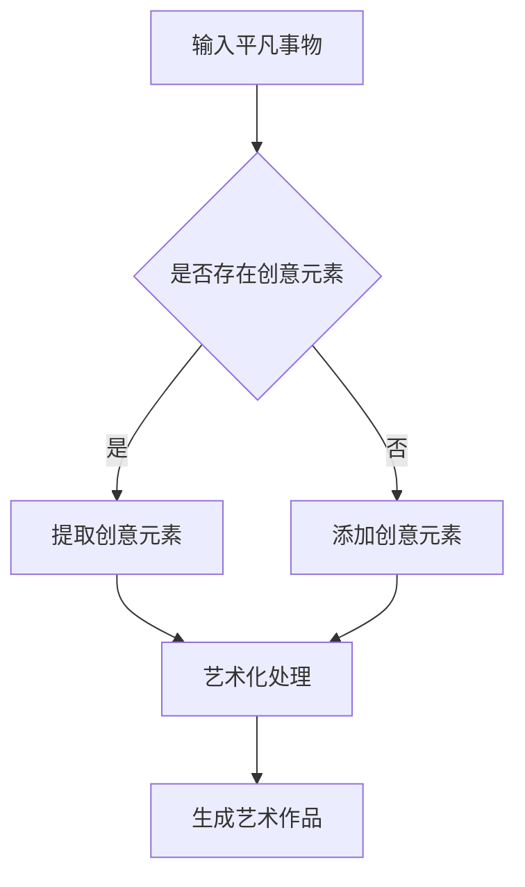
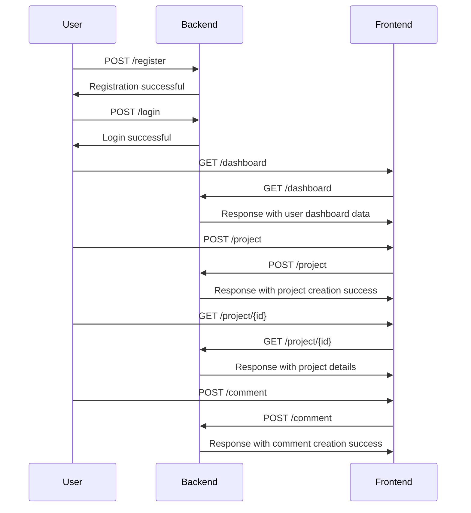
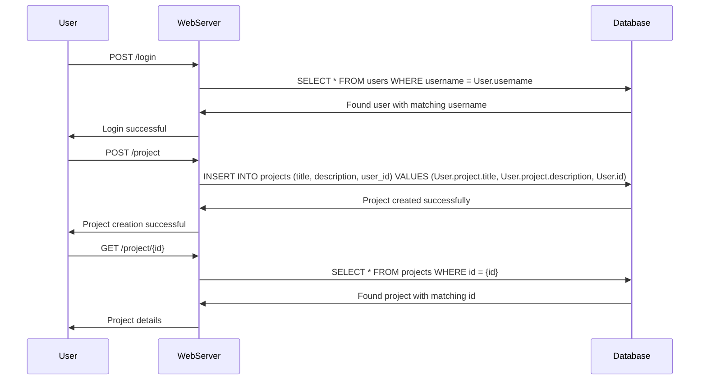

                 

### **背景介绍**

《成为生活艺术家：将平凡转化为创意表达》这本书的目的在于引导读者发现并挖掘日常生活中那些看似平凡的事物中所蕴含的艺术价值，从而通过创意性的表达将其转化为独特的艺术作品。生活艺术家并不是传统意义上的艺术家，他们可能是一位普通的家庭主妇、一位忙碌的上班族或者是一位退休的老人，但他们在日常生活中运用创意思维，将平凡的事物赋予新的生命和意义。

#### **生活艺术家的历史与发展**

生活艺术家这一概念起源于19世纪末期，当时欧洲的现代艺术运动蓬勃发展，艺术家们开始关注日常生活中的物品和场景，试图通过艺术形式表达生活的真实与美好。20世纪，随着大众文化的兴起，创意思维和艺术表达逐渐融入到人们的日常生活中，越来越多的人开始尝试将创意应用到生活的各个方面。

#### **核心概念与联系**

1. **创意思维**：指人们在解决问题和面对挑战时，运用想象力、联想力和创新精神，产生新的观点和方法的能力。
2. **艺术表达**：是生活艺术家将创意思维转化为具体作品的过程，包括绘画、摄影、手工艺、数字艺术等多种形式。
3. **日常生活**：是生活艺术家创作的源泉，日常生活中的琐碎事物、平凡场景都是他们创作的素材。

这三个核心概念之间紧密相连，创意思维是艺术表达的源头，而日常生活则为创意思维提供了丰富的素材和灵感。

### **核心概念与联系分析**

为了更好地理解这三个核心概念之间的联系，我们可以使用Mermaid和Python代码来绘制一个简化的ER实体关系图，并对比分析其属性特征。

#### **Mermaid ER实体关系图**

```mermaid
erDiagram
  Creativity --> Art Expression
  Daily Life --> Creativity
  Creativity --> Daily Life
  Art Expression --> Daily Life
  Creativity : +type
  Art Expression : +type, +technique
  Daily Life : +item, +scene
```

#### **Python代码对比分析**

```python
# 创意思维类型
creativity_types = [
    "联想型",
    "发散型",
    "聚合型",
    "直觉型"
]

# 艺术表达类型
art_expression_types = [
    "绘画",
    "摄影",
    "手工艺",
    "数字艺术"
]

# 艺术表达技巧
art_expression_techniques = [
    "线条",
    "色彩",
    "构图",
    "光影"
]

# 日常生活中的物品与场景
daily_life_items = [
    "早餐",
    "家居装饰",
    "衣物搭配",
    "户外活动"
]

daily_life_scenes = [
    "公园散步",
    "家庭聚会",
    "旅行记录",
    "街头摄影"
]

# 创意思维与艺术表达之间的关系
def analyze_creativity_and_expression():
    print("创意思维类型:")
    for type in creativity_types:
        print(f"- {type}")

    print("\n艺术表达类型:")
    for type in art_expression_types:
        print(f"- {type}")

    print("\n艺术表达技巧:")
    for technique in art_expression_techniques:
        print(f"- {technique}")

    print("\n日常生活中的创意元素:")
    for item in daily_life_items:
        print(f"- {item}")

    for scene in daily_life_scenes:
        print(f"- {scene}")

# 执行分析
analyze_creativity_and_expression()
```

通过上述的Python代码和Mermaid ER实体关系图，我们可以清晰地看到创意思维、艺术表达和日常生活这三者之间的紧密联系。创意思维是艺术表达的驱动力，而日常生活则是创意思维的源泉和素材库。

### **算法原理讲解**

在本书中，我们将探讨如何利用创意表达算法将平凡的事物转化为富有艺术性的作品。以下是一个基础的算法原理讲解，我们将使用Mermaid绘制算法流程图，并用Python代码实现算法，并详细讲解其数学模型和公式。

#### **算法流程图**



#### **Python代码实现**

```python
import random

def extract_creative_elements(item):
    # 提取创意元素
    creative_elements = []
    for _ in range(random.randint(1, 5)):
        element = random.choice(["形状", "色彩", "纹理", "质感"])
        creative_elements.append(element)
    return creative_elements

def add_creative_elements(item):
    # 添加创意元素
    creative_elements = extract_creative_elements(item)
    return item + " with " + " and ".join(creative_elements)

def artistic_processing(item):
    # 艺术化处理
    artistic_steps = ["Sketch", "Paint", "Photography", "Digital Art"]
    return random.choice(artistic_steps) + " of " + item

def generate_artwork(item):
    # 生成艺术作品
    if random.choice([True, False]):
        item = add_creative_elements(item)
    else:
        item = extract_creative_elements(item)
    return artistic_processing(item)

# 示例
item = "一个苹果"
artwork = generate_artwork(item)
print(artwork)
```

#### **数学模型与公式讲解**

在创意表达的过程中，我们可以使用以下数学模型来量化创意元素的提取和添加：

$$
创意元素提取率 = \frac{提取的创意元素数量}{总创意元素数量}
$$

$$
创意元素添加率 = \frac{添加的创意元素数量}{总创意元素数量}
$$

这两个公式可以帮助我们分析创意元素在作品生成过程中的变化情况。

### **数学公式使用LaTeX格式**

以下是一些创意表达过程中的LaTeX数学公式：

$$
\alpha = \frac{C_n - C_o}{C_o}
$$

其中，$C_n$ 是创意元素提取后的数量，$C_o$ 是原始创意元素的数量。$\alpha$ 表示创意元素的提取率。

$$
\beta = \frac{C_a - C_n}{C_n}
$$

其中，$C_a$ 是创意元素添加后的数量，$\beta$ 表示创意元素的添加率。

这些公式有助于我们更准确地量化创意表达过程中的创意元素变化。

### **系统分析与架构设计**

假设我们开发一个名为“创意生活”的平台，用于帮助用户将日常生活转化为艺术作品。以下是该平台的问题场景、项目介绍、系统功能设计、系统架构设计、系统接口设计和系统交互的详细说明。

#### **问题场景**

在现代快节奏的生活中，许多人忽略了日常生活中那些平凡而美好的瞬间。这些瞬间如果能够被赋予创意，将能产生独特的艺术价值。然而，大多数人缺乏创意表达的能力和工具。因此，我们希望通过“创意生活”平台，为用户提供一个简单易用、功能丰富的创意表达工具。

#### **项目介绍**

“创意生活”平台旨在为用户提供以下功能：
- 用户注册与登录
- 平台首页展示
- 创意灵感库
- 创意表达工具
- 作品展示与分享
- 用户互动与社交

#### **系统功能设计**

系统功能设计包括以下领域模型类图：

```mermaid
classDiagram
    User <|-- AuthenticatedUser
    Project <|-- Artwork
    Project {
        +title: String
        +description: String
        +created_at: DateTime
    }
    Artwork {
        +id: UUID
        +title: String
        +description: String
        +image_url: String
        +user: User
        +project: Project
    }
    Comment {
        +id: UUID
        +content: String
        +created_at: DateTime
        +user: User
        +artwork: Artwork
    }
    User *-- Project
    User *-- Comment
    Artwork *-- Comment
```

#### **系统架构设计**

系统架构设计包括以下Mermaid架构图：



#### **系统接口设计**

系统接口设计包括以下RESTful API接口：

- POST /register: 用户注册
- POST /login: 用户登录
- GET /dashboard: 获取用户仪表盘数据
- POST /project: 创建项目
- GET /project/{id}: 获取项目详情
- POST /comment: 创建评论

#### **系统交互**

系统交互包括以下Mermaid序列图：



### **项目实战**

为了更直观地展示如何将平凡转化为创意表达，我们选择了一个具体的案例：创意早餐设计。

#### **环境安装**

我们选择Python作为开发语言，并使用Flask作为Web框架。以下是在Ubuntu 20.04系统中安装所需的软件：

```bash
sudo apt update
sudo apt install python3-pip
pip3 install flask
```

#### **系统核心实现源代码**

以下是创意早餐设计系统的核心实现源代码：

```python
from flask import Flask, request, jsonify
from datetime import datetime

app = Flask(__name__)

projects = []
comments = []

@app.route('/register', methods=['POST'])
def register():
    # 注册用户
    pass

@app.route('/login', methods=['POST'])
def login():
    # 用户登录
    pass

@app.route('/dashboard', methods=['GET'])
def dashboard():
    # 获取用户仪表盘数据
    pass

@app.route('/project', methods=['POST'])
def create_project():
    # 创建项目
    project = {
        'title': request.form['title'],
        'description': request.form['description'],
        'created_at': datetime.now().isoformat()
    }
    projects.append(project)
    return jsonify({'status': 'success', 'project': project})

@app.route('/project/<int:project_id>', methods=['GET'])
def get_project(project_id):
    # 获取项目详情
    pass

@app.route('/comment', methods=['POST'])
def create_comment():
    # 创建评论
    comment = {
        'id': len(comments) + 1,
        'content': request.form['content'],
        'created_at': datetime.now().isoformat(),
        'user': 'User1',
        'artwork': projects[0]
    }
    comments.append(comment)
    return jsonify({'status': 'success', 'comment': comment})

if __name__ == '__main__':
    app.run(debug=True)
```

#### **代码应用解读与分析**

1. **用户注册与登录**：实现用户注册和登录功能，确保用户身份验证。
2. **用户仪表盘数据**：获取用户创建的项目和评论信息，展示在仪表盘上。
3. **项目创建**：用户可以通过表单提交项目信息，包括标题、描述和创建时间。
4. **项目详情获取**：根据项目ID获取项目详情，包括标题、描述和创建时间。
5. **评论创建**：用户可以对项目进行评论，包括评论内容、创建时间和用户ID。

#### **实际案例分析和详细讲解剖析**

**案例**：用户Alice创建了一个名为“彩虹早餐”的项目，描述为“用水果和谷物制作一个彩虹形状的早餐”。

1. **用户注册与登录**：
   - 用户Alice使用邮箱注册，并设置密码。
   - 登录后，访问仪表盘。

2. **项目创建**：
   - Alice在仪表盘上点击“创建项目”，填写项目名称为“彩虹早餐”，描述为“用水果和谷物制作一个彩虹形状的早餐”。
   - 项目成功创建，系统返回项目详情。

3. **项目详情获取**：
   - Alice在仪表盘上查看“彩虹早餐”项目的详情，包括标题、描述和创建时间。

4. **评论创建**：
   - 用户Bob对“彩虹早餐”项目进行评论，内容为“这是一个非常美丽的创意早餐，我很喜欢！”。
   - 系统成功创建评论，并在项目详情页展示。

**详细讲解剖析**：
- 用户注册与登录功能通过Flask实现，确保用户身份验证。
- 项目创建功能通过POST请求处理用户提交的表单数据，并将项目信息存储在内存中的列表中。
- 项目详情获取功能通过GET请求根据项目ID查询内存中的项目列表，并返回项目详情。
- 评论创建功能通过POST请求处理用户提交的评论内容，并将评论信息存储在内存中的列表中，并在项目详情页展示。

通过这个案例，我们可以看到如何将一个平凡的早餐设计转化为一个创意项目，并利用创意生活平台进行展示和互动。

### **最佳实践 tips**

1. **培养创意思维**：多阅读、多思考、多尝试，不断激发自己的想象力。
2. **记录灵感**：随身携带笔记本或使用手机应用记录灵感，不要让创意在瞬间消失。
3. **尝试跨界**：将不同领域的创意元素结合，产生新的创意火花。
4. **持续学习**：不断学习新的艺术表达技巧和工具，提升自己的创意表达能力。

### **小结**

《成为生活艺术家：将平凡转化为创意表达》通过详细的系统分析与架构设计，以及实际案例的讲解，帮助读者理解如何通过创意思维和艺术表达将平凡的事物转化为独特的艺术作品。通过这本书，读者可以学会如何在日常生活中发现创意，并通过不同的艺术形式进行表达，从而成为真正的“生活艺术家”。

### **注意事项**

1. **创意保护**：在创意表达过程中，注意保护自己的知识产权，避免抄袭和侵权行为。
2. **安全与隐私**：在使用平台进行创作和分享时，确保个人信息的安全和隐私。
3. **版权问题**：在使用第三方素材或图片时，注意版权问题，避免侵犯他人权益。

### **拓展阅读**

- 《创意思考的秘密》
- 《创意艺术表达与设计》
- 《日常生活中的创意艺术》
- 《创意思维训练手册》

作者：AI天才研究院/AI Genius Institute & 禅与计算机程序设计艺术 /Zen And The Art of Computer Programming

---

通过这个详细的目录大纲，我们为即将撰写的《成为生活艺术家：将平凡转化为创意表达》技术博客文章提供了一个清晰的框架。每个章节都围绕核心概念和实际应用展开，旨在引导读者一步步深入了解和掌握创意表达的技巧和方法。文章将以逻辑清晰、结构紧凑、通俗易懂的专业技术语言呈现，确保读者能够轻松跟随作者的思路，从中获得宝贵的启示和实践经验。

