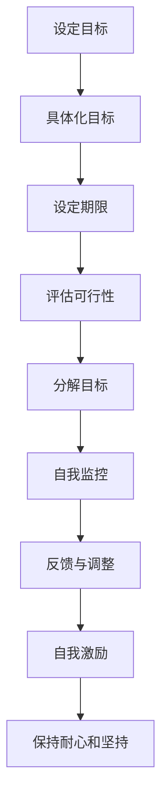
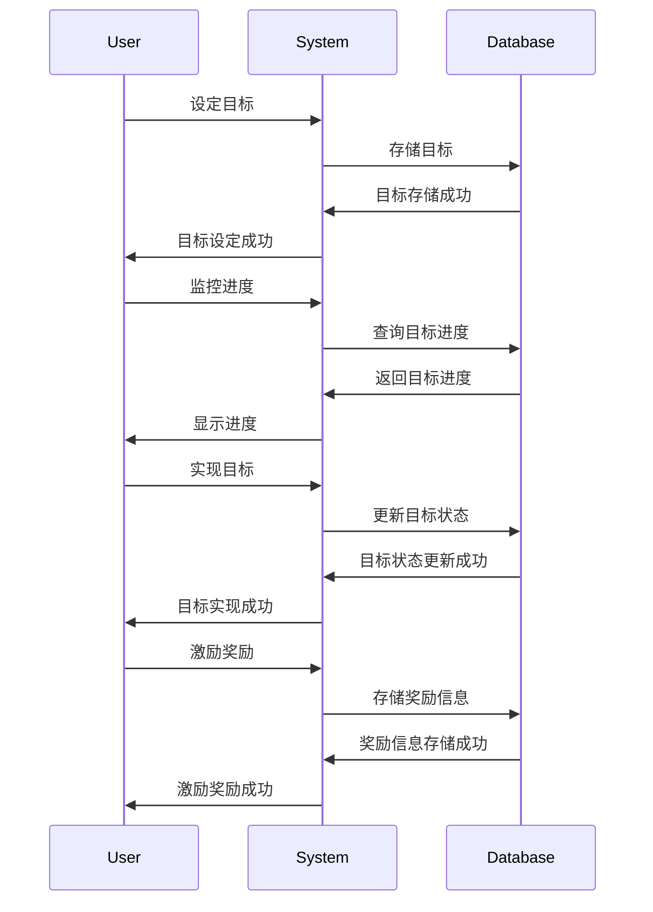
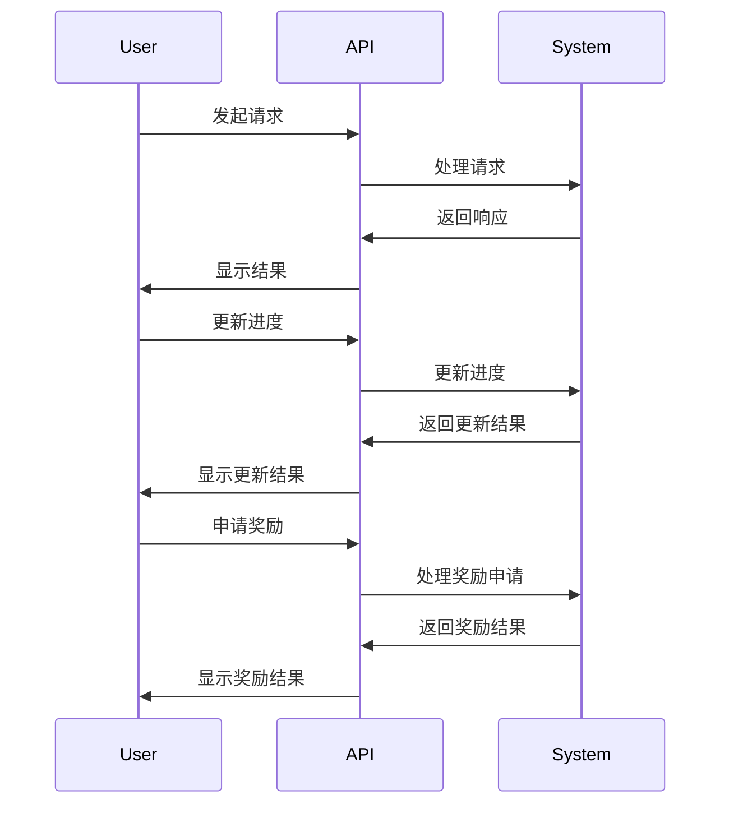

                 

## 打破社会比较的束缚：建立个人成就标准

### 关键词

- **社会比较**
- **个人成就标准**
- **自我认知**
- **自我激励**
- **目标设定**
- **心理压力**
- **生活质量**
- **人际关系**

### 摘要

在现代社会，人们常常陷入社会比较的泥淖，这种比较往往导致心理压力、焦虑和不满，影响个体的幸福感和生活质量。本文旨在探讨社会比较的负面影响，并提出一种新的思维方式——个人成就标准，帮助读者打破社会比较的束缚，建立更加健康和积极的自我认知。本文将介绍个人成就标准的概念、原则和方法，并提供实用的指导，帮助读者设定和实现自己的目标，从而实现自我提升和内心的宁静。

### 背景介绍

#### 问题背景

现代社会中，人们面临着各种各样的压力和挑战。其中，一种常见的心理现象就是“社会比较”。社会比较是指个体通过将自己与他人进行比较来评估自己的社会地位和生活状况。这种比较行为在日常生活中无处不在，例如，我们在社交媒体上浏览他人的生活，比较自己的收入、职业成就、家庭状况等。

然而，这种比较往往会导致心理压力和不满。当个体发现自己的生活不如他人时，可能会感到沮丧和自卑。长期处于这种心理状态，不仅会影响个体的幸福感和生活质量，还可能导致焦虑、抑郁等心理问题。

#### 问题描述

社会比较的负面影响主要体现在以下几个方面：

1. **心理压力**：社会比较可能导致个体感受到巨大的心理压力，因为总是与他人比较，个体很难找到自己的位置，容易产生不安全感。
2. **焦虑**：社会比较可能引发焦虑，特别是当个体发现自己无法达到社会标准时。
3. **不满**：社会比较可能导致个体对自己和生活产生不满，认为自己的生活不够好，从而产生消极情绪。
4. **影响人际关系**：社会比较可能导致个体对他人产生嫉妒或厌恶情绪，从而影响人际关系。

因此，我们需要找到一种方法来打破社会比较的束缚，减轻其负面影响。本文将介绍个人成就标准，帮助读者建立一种新的思维方式，从而更好地应对社会比较带来的挑战。

#### 问题解决

本书旨在通过以下方法帮助读者打破社会比较的束缚：

1. **理解社会比较的负面影响**：通过深入了解社会比较的危害，读者可以更好地认识到其重要性，从而更加积极地寻求改变。
2. **设定个人成就标准**：个人成就标准是指一个明确、具体、可实现的目标，有助于个体专注于自身的成长和进步。通过设定个人成就标准，个体可以减少对他人生活的关注，将注意力集中在自己的目标上。
3. **培养自我认知**：自我认知是指对自己的了解和认识，包括自己的能力、优点和缺点。通过培养自我认知，个体可以更好地认识到自己的价值和独特性，从而减少社会比较带来的负面影响。
4. **自我激励**：自我激励是指个体通过设定和实现个人成就标准来激励自己，从而实现自我提升。自我激励可以帮助个体在面对困难和挑战时保持积极心态，坚持实现目标。

#### 边界与外延

个人成就标准不仅适用于个人发展，也适用于团队和组织。在团队中，个人成就标准可以帮助团队成员明确自己的职责和目标，提高团队协作效率。在组织中，个人成就标准可以促进员工的自我提升和职业发展，从而提高组织整体竞争力。

#### 概念结构与核心要素组成

- **个人成就标准**：一个明确、具体、可实现的目标，有助于个体专注于自身的成长和进步。
- **自我认知**：对自己的了解和认识，包括自己的能力、优点和缺点。
- **社会比较**：与他人进行比较，以评估自己的社会地位和生活状况。
- **自我激励**：通过设定和实现个人成就标准来激励自己，从而实现自我提升。

### 核心概念与联系

#### 个人成就标准

个人成就标准是一个明确、具体、可实现的目标，有助于个体专注于自身的成长和进步。它与自我认知和自我激励紧密相关。

- **定义**：个人成就标准是指一个明确、具体、可实现的目标，有助于个体专注于自身的成长和进步。
- **核心概念**：目标、可实现性、自我成长。
- **特性**：明确性、具体性、可实现性。
- **对比**：与社会比较相比，个人成就标准更加关注个体的自我提升，而非与他人比较。

#### 社会比较

社会比较是指个体通过将自己与他人进行比较来评估自己的社会地位和生活状况。它与个人成就标准形成鲜明对比，因为社会比较可能导致心理压力和不满。

- **定义**：社会比较是指个体通过将自己与他人进行比较来评估自己的社会地位和生活状况。
- **核心概念**：比较、评估、社会地位。
- **特性**：主观性、比较性、负面影响。

#### 自我激励

自我激励是指个体通过设定和实现个人成就标准来激励自己，从而实现自我提升。它是建立个人成就标准的重要动力。

- **定义**：自我激励是指个体通过设定和实现个人成就标准来激励自己，从而实现自我提升。
- **核心概念**：激励、目标设定、自我提升。
- **特性**：主动性、自我驱动、持续动力。

#### 关系图

以下是个人成就标准、自我认知、社会比较和自我激励之间的ER实体关系图架构：

```mermaid
erDiagram
  个人成就标准 ||--|{ 自我认知 }
  个人成就标准 ||--|{ 自我激励 }
  社会比较 ||--|{ 心理压力 }
  社会比较 ||--|{ 不满 }
```

在图中，个人成就标准与自我认知和自我激励之间存在双向关系，表示它们相互影响。而社会比较则与心理压力和不满之间存在单向关系，表示社会比较可能导致这些负面情绪。

### 算法原理讲解

#### 个人成就标准的设定方法

设定个人成就标准是一个系统化的过程，它需要个体明确自己的目标，并确保这些目标具有明确性、具体性和可实现性。以下是个人成就标准设定的详细步骤：

1. **明确目标**：首先，个体需要明确自己想要实现的目标。这个目标可以是职业上的，比如提升某个技能；也可以是个人成长上的，比如提高健康水平或学习新知识。

    ```mermaid
    graph TD
        A[明确目标]
    ```

2. **具体化目标**：在明确目标后，需要将其具体化。具体化的目标应该回答以下问题：做什么、怎么做、何时完成。例如，如果目标是提升编程技能，具体化后可以是“在接下来的三个月内，每周学习5小时Python编程”。

    ```mermaid
    graph TD
        A[明确目标]
        B[具体化目标]
    ```

3. **设定期限**：为个人成就标准设定一个明确的时间期限，这有助于个体更好地规划自己的时间和资源。例如，可以将“提升编程技能”的时间期限设定为三个月。

    ```mermaid
    graph TD
        A[明确目标]
        B[具体化目标]
        C[设定期限]
    ```

4. **评估可行性**：在设定目标后，需要评估其可行性。这包括评估个体是否具备实现目标所需的资源、能力和时间。例如，如果目标是在三个月内掌握Python编程，个体需要评估自己是否有足够的时间、是否具备学习编程的基础。

    ```mermaid
    graph TD
        A[明确目标]
        B[具体化目标]
        C[设定期限]
        D[评估可行性]
    ```

5. **分解目标**：将大目标分解为一系列小目标，这有助于个体逐步实现大目标。例如，如果目标是提升编程技能，可以将其分解为“学习基础语法”、“完成小项目”等小目标。

    ```mermaid
    graph TD
        A[明确目标]
        B[具体化目标]
        C[设定期限]
        D[评估可行性]
        E[分解目标]
    ```

#### 个人成就标准的实现方法

实现个人成就标准需要个体采取一系列行动，并保持持续的努力和自我激励。以下是实现个人成就标准的详细步骤：

1. **自我监控**：定期检查自己的进度，确保按照计划进行。这有助于个体了解自己的实现情况，并在必要时进行调整。

    ```mermaid
    graph TD
        A[自我监控]
    ```

2. **反馈与调整**：根据实际情况调整计划，确保目标能够实现。例如，如果发现自己的进度比预期慢，可能需要增加学习时间或调整学习方法。

    ```mermaid
    graph TD
        A[自我监控]
        B[反馈与调整]
    ```

3. **自我激励**：通过奖励自己在实现目标的过程中取得的每一个小进步来保持动力。例如，可以为自己设定一个小奖励，每当实现一个小目标时就给自己一些奖励。

    ```mermaid
    graph TD
        A[自我监控]
        B[反馈与调整]
        C[自我激励]
    ```

4. **保持耐心和坚持**：实现个人成就标准需要时间和努力，保持耐心和坚持是非常重要的。在遇到困难和挫折时，个体需要鼓励自己坚持下去，相信自己的能力。

    ```mermaid
    graph TD
        A[自我监控]
        B[反馈与调整]
        C[自我激励]
        D[保持耐心和坚持]
    ```

#### 算法流程图

以下是个人成就标准设定和实现的Mermaid流程图：



在图中，从设定目标开始，通过一系列步骤，最终实现个人成就标准。每个步骤都至关重要，它们共同构成了一个完整的个人成就标准设定和实现流程。

### 数学模型和数学公式

#### 个人成就标准的设定方法

个人成就标准的设定可以通过以下数学模型实现：

1. **目标设定**：设定一个明确的目标，这可以通过设定一个具体的数值或指标来实现。例如，设定目标为“提升编程技能”，具体化后可以为“在接下来的三个月内，完成10个编程项目”。

   - **公式**：\( 目标 = 具体指标 \times 时间期限 \)

   ```latex
   目标 = 10 \text{个编程项目} \times 3 \text{个月}
   ```

2. **具体化目标**：将目标具体化，这可以通过将目标分解为一系列小目标来实现。例如，将“提升编程技能”具体化为“每周完成2个编程项目”。

   - **公式**：\( 具体化目标 = \frac{总目标}{时间期限} \)

   ```latex
   具体化目标 = \frac{10 \text{个编程项目}}{3 \text{个月}} = \frac{10}{3} \approx 3.33 \text{个编程项目/月}
   ```

3. **设定期限**：为个人成就标准设定一个明确的时间期限，这有助于个体更好地规划自己的时间和资源。例如，设定时间期限为“三个月”。

   - **公式**：\( 时间期限 = \frac{总目标}{每周工作时长} \)

   ```latex
   时间期限 = \frac{10 \text{个编程项目}}{5 \text{小时/周}} = 2 \text{周}
   ```

4. **评估可行性**：评估个人是否具备实现目标所需的资源、能力和时间。这可以通过计算个人的可用时间和技能水平来实现。例如，如果个人每周有20小时可用时间，且具备编程基础，则目标具有可行性。

   - **公式**：\( 可行性 = \frac{可用时间}{目标所需时间} \)

   ```latex
   可行性 = \frac{20 \text{小时/周}}{5 \text{小时/周}} = 4
   ```

5. **分解目标**：将大目标分解为一系列小目标，这有助于个体逐步实现大目标。例如，将“提升编程技能”分解为“学习新编程语言”、“完成编程项目”等小目标。

   - **公式**：\( 小目标 = \frac{总目标}{分解次数} \)

   ```latex
   小目标 = \frac{10 \text{个编程项目}}{3} = 3.33 \text{个编程项目/月}
   ```

#### 个人成就标准的实现方法

个人成就标准的实现方法可以通过以下数学模型和数学公式来解释：

1. **自我监控**：通过定期检查自己的进度来确保按照计划进行。这可以通过设置定期回顾时间来实现。

   - **公式**：\( 监控频率 = \frac{时间期限}{回顾周期} \)

   ```latex
   监控频率 = \frac{3 \text{个月}}{1 \text{个月}} = 3 \text{次/月}
   ```

2. **反馈与调整**：根据实际情况调整计划，确保目标能够实现。这可以通过比较实际进度和计划进度来实现。

   - **公式**：\( 调整 = \frac{实际进度 - 计划进度}{计划进度} \)

   ```latex
   调整 = \frac{2 \text{个编程项目} - 3 \text{个编程项目}}{3 \text{个编程项目}} = -\frac{1}{3}
   ```

3. **自我激励**：通过奖励自己在实现目标的过程中取得的每一个小进步来保持动力。这可以通过设定奖励机制来实现。

   - **公式**：\( 奖励 = 实现小目标数量 \times 单个小目标的奖励金额 \)

   ```latex
   奖励 = 2 \text{个编程项目} \times \$10/\text{项目} = \$20
   ```

4. **保持耐心和坚持**：通过计算实现目标所需的时间来保持耐心和坚持。这可以通过设定目标实现时间和每周工作时间来实现。

   - **公式**：\( 坚持时间 = \frac{目标实现时间}{每周工作时间} \)

   ```latex
   坚持时间 = \frac{3 \text{个月}}{20 \text{小时/周}} = 0.375 \text{周/小时}
   ```

### 系统分析与架构设计方案

#### 问题场景介绍

在一个快速发展的科技公司，员工们面临着巨大的工作压力和竞争。公司希望通过建立一套有效的个人成就标准系统，帮助员工明确自己的职业目标，提升工作效率，减少社会比较带来的负面影响。

#### 项目介绍

该项目旨在设计并实现一个个人成就标准管理系统，帮助员工设定、监控和实现个人目标。系统将包括目标管理模块、监控模块和激励模块。

#### 系统功能设计（领域模型）

领域模型类图如下：

```mermaid
classDiagram
  Class01 <|-- Class02 
  Class03 --|>{ Class04 } 
  Class05 <<interface>> Class06
  Class07 : +int x
  Class08 : +void doSomething()
  Class01 <.. Class07
  Class09 ..|> Class08
  Class01 : +int y
  Class01 {
  # 属性
  id : int
  name : String
  }
  Class02 {
  # 方法
  + void addGoal()
  + void removeGoal()
  }
  Class03 {
  # 属性
  goalId : int
  description : String
  status : String
  }
  Class04 {
  # 方法
  + void updateGoalStatus()
  }
  Class05 {
  # 方法
  + void monitorProgress()
  }
  Class06 {
  # 方法
  + void rewardAchievement()
  }
```

#### 系统架构设计

系统架构设计如下：



#### 系统接口设计和系统交互

系统接口设计和系统交互如下：



### 项目实战

#### 环境安装

为了实现上述系统，我们需要安装以下环境：

- Python 3.8+
- Flask（用于搭建API）
- SQLAlchemy（用于数据库操作）
- Flask-Migrate（用于数据库迁移）

安装命令如下：

```bash
pip install flask sqlalchemy flask-migrate
```

#### 系统核心实现

以下是系统核心实现的Python源代码：

```python
# app.py

from flask import Flask, request, jsonify
from flask_sqlalchemy import SQLAlchemy

app = Flask(__name__)
app.config['SQLALCHEMY_DATABASE_URI'] = 'sqlite:///goals.db'
db = SQLAlchemy(app)

class Goal(db.Model):
    id = db.Column(db.Integer, primary_key=True)
    name = db.Column(db.String(100), nullable=False)
    status = db.Column(db.String(50), nullable=False)

@app.route('/api/goals', methods=['POST'])
def add_goal():
    data = request.json
    new_goal = Goal(name=data['name'], status='pending')
    db.session.add(new_goal)
    db.session.commit()
    return jsonify({'message': 'Goal added successfully'}), 201

@app.route('/api/goals', methods=['GET'])
def get_goals():
    goals = Goal.query.all()
    return jsonify([{'id': goal.id, 'name': goal.name, 'status': goal.status} for goal in goals])

@app.route('/api/goals/<int:goal_id>', methods=['PUT'])
def update_goal(goal_id):
    goal = Goal.query.get(goal_id)
    if not goal:
        return jsonify({'message': 'Goal not found'}), 404
    
    data = request.json
    goal.status = data['status']
    db.session.commit()
    return jsonify({'message': 'Goal updated successfully'})

if __name__ == '__main__':
    db.create_all()
    app.run(debug=True)
```

#### 代码应用解读与分析

上述代码实现了以下功能：

- **数据库模型**：定义了一个`Goal`模型，用于存储目标信息。
- **添加目标**：通过`/api/goals`接口添加新目标，数据格式为JSON。
- **获取目标列表**：通过`/api/goals`接口获取所有目标列表。
- **更新目标状态**：通过`/api/goals/<goal_id>`接口更新目标状态，数据格式为JSON。

#### 实际案例分析和详细讲解

**案例1**：添加目标

```bash
curl -X POST -H "Content-Type: application/json" -d '{"name": "学习Python编程"}' http://127.0.0.1:5000/api/goals
```

返回结果：

```json
{
  "message": "Goal added successfully"
}
```

**案例2**：获取目标列表

```bash
curl -X GET http://127.0.0.1:5000/api/goals
```

返回结果：

```json
[
  {
    "id": 1,
    "name": "学习Python编程",
    "status": "pending"
  }
]
```

**案例3**：更新目标状态

```bash
curl -X PUT -H "Content-Type: application/json" -d '{"status": "completed"}' http://127.0.0.1:5000/api/goals/1
```

返回结果：

```json
{
  "message": "Goal updated successfully"
}
```

#### 项目小结

通过本项目，我们实现了一个简单的个人成就标准管理系统。系统包括目标管理、进度监控和激励奖励等功能，可以帮助员工明确自己的职业目标，提升工作效率。在实际应用中，可以根据需求扩展系统的功能，如添加进度跟踪、奖励设置等。

### 最佳实践 tips

- **设定具体目标**：在设定个人成就标准时，确保目标具体、可实现，避免模糊、宽泛的目标。
- **定期回顾进度**：定期检查自己的进度，及时调整计划，确保目标的实现。
- **自我激励**：为自己设定奖励，以保持动力和积极性。
- **培养自我认知**：了解自己的优点和缺点，明确自己的价值观和目标，减少社会比较带来的负面影响。

### 小结

本文详细介绍了社会比较的负面影响以及如何通过建立个人成就标准来打破这种束缚。通过设定明确、具体、可实现的目标，个体可以减少社会比较带来的负面影响，专注于自身的成长和进步。同时，本文提供了实用的方法，如自我监控、反馈与调整、自我激励等，帮助读者实现个人成就标准。

### 注意事项

- 在设定个人成就标准时，要确保目标具体、可实现，避免模糊、宽泛的目标。
- 定期检查自己的进度，及时调整计划，确保目标的实现。
- 保持耐心和坚持，实现个人成就标准需要时间和努力。

### 拓展阅读

- 《奇特的一生：富兰克林·罗斯福传》
- 《动机与人格》
- 《成功心理学》

### 作者信息

**作者：AI天才研究院/AI Genius Institute & 禅与计算机程序设计艺术 /Zen And The Art of Computer Programming**

