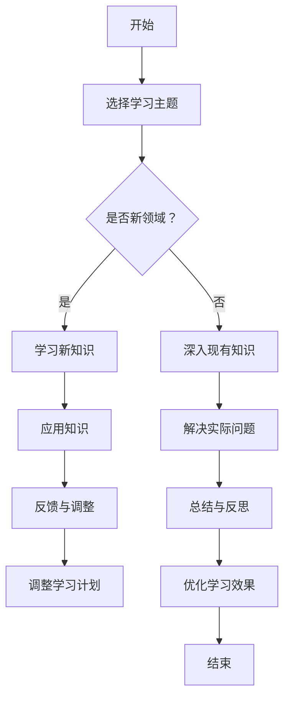
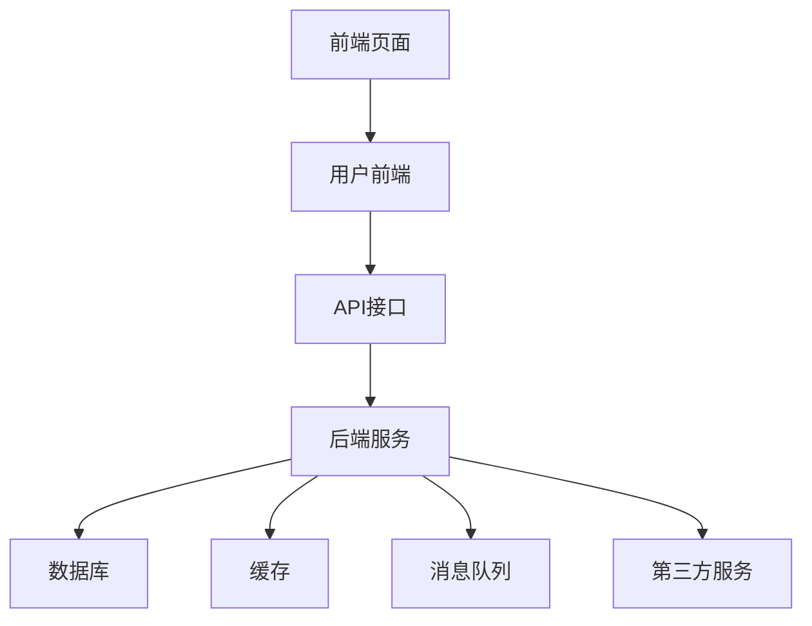
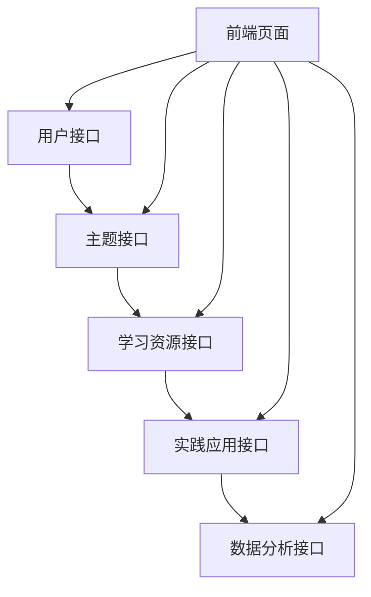
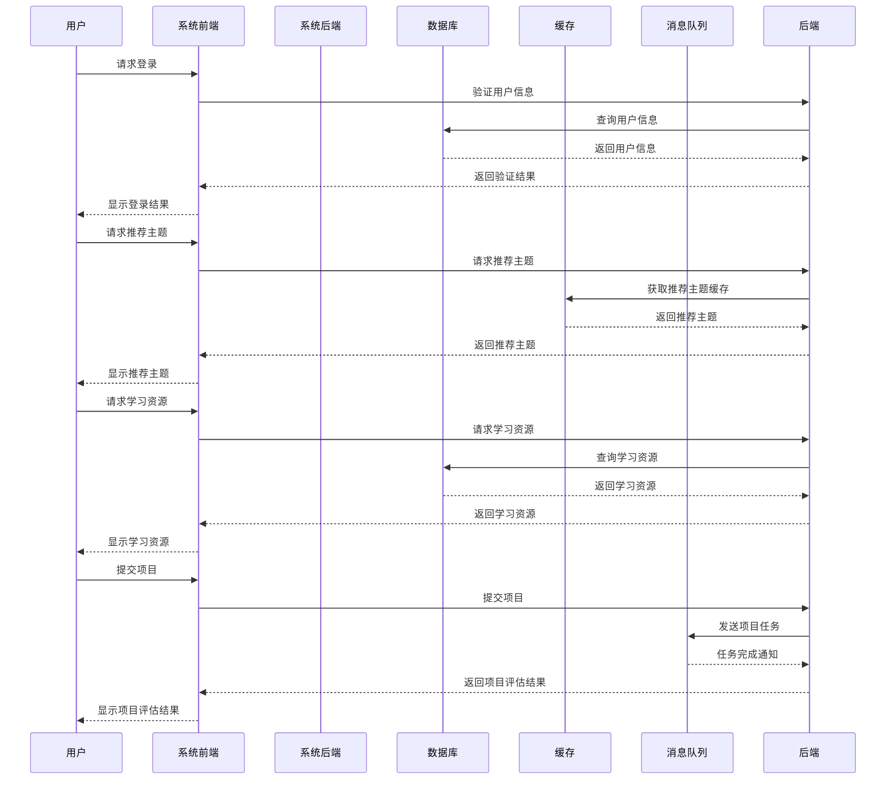

                 

### 第1章：拓展视野的重要性

#### 1.1 问题背景

在当今信息化时代，我们面临着前所未有的机遇与挑战。技术发展日新月异，知识更新速度极快，这使得我们的视野不断被拓宽。然而，随之而来的问题是我们如何在这个快节奏、高压力的环境中保持开放的心态，不断提升自己的认知水平和适应能力。视野的局限不仅影响个人的成长与发展，也对心理健康产生深远的影响。

**生活中的视野局限**

生活中的视野局限体现在多个方面。首先是职业发展中的局限。许多人因为工作的单一性和专业性的限制，很难接触到其他领域的知识和技能，这限制了他们在职业生涯中的发展和创新。其次是个体认知的局限。当我们只关注某一领域时，往往容易陷入思维定势，难以看到问题的全貌。此外，社会交往中的视野局限也是一个普遍现象。我们往往习惯于和相似的人交流，这限制了我们的社交圈子，也限制了我们对多样性的理解和接纳。

**心理健康的影响**

视野的局限对心理健康有着直接和间接的影响。直接的影响是，视野狭窄可能导致焦虑和压力。当个体感到自己无法应对外部变化时，就会产生焦虑情绪。间接的影响则是，视野的局限会导致心理健康的整体下降。长期处于狭隘的视野中，个体容易产生孤独感和无助感，进而影响其心理状态和幸福感。

#### 1.2 问题描述

**视野狭窄的后果**

视野狭窄可能带来以下后果：

1. **认知受限**：长期处于单一视野中，个体的认知能力受到限制，难以看到问题的多种可能性和解决方案。
2. **创新能力下降**：视野狭窄导致个体难以接触到新的知识和想法，从而限制了创新能力的发展。
3. **社交困难**：视野狭窄使得个体难以理解和接纳多样性，这可能导致社交困难，限制人际关系的发展。
4. **心理健康问题**：长期处于狭隘的视野中，个体容易产生焦虑、孤独和无助等负面情绪，影响心理健康。

**拓展视野的需求**

为了克服上述问题，拓展视野显得尤为重要。拓展视野可以帮助我们：

1. **提升认知能力**：通过接触不同的领域和知识，个体可以拓宽自己的认知边界，提高对复杂问题的理解和解决能力。
2. **增强创新能力**：视野的拓展为个体提供了更多的灵感和创新空间，有助于开发新的思路和解决方案。
3. **改善社交关系**：通过接触多样性和不同的观点，个体可以更好地理解和接纳他人，从而改善社交关系。
4. **提高心理健康**：视野的拓展有助于减少焦虑和压力，提高个体的幸福感和满足感。

#### 1.3 问题解决

**心理学角度的解决方法**

从心理学角度，拓展视野的方法包括：

1. **刻意练习**：通过有意识地选择新的知识和技能进行学习，个体可以逐步拓宽自己的视野。
2. **积极思考**：培养开放和积极的心态，愿意接受新的观点和想法，减少思维定势的影响。
3. **社交互动**：积极参与社交活动，接触不同背景和文化的人，以拓宽自己的社交圈子。

**实践角度的拓展方法**

在实践层面，我们可以采取以下方法来拓展视野：

1. **多读书**：阅读不同领域和主题的书籍，获取广泛的知识和观点。
2. **参加培训和工作坊**：通过参加专业的培训和工作坊，学习新的技能和知识。
3. **旅行和体验**：通过旅行和体验不同的文化和生活方式，拓宽自己的视野。
4. **建立学习小组**：与他人一起学习和讨论，分享知识和经验，互相启发。

#### 1.4 边界与外延

**视野拓展的边界**

视野的拓展并非没有边界。在拓展视野的过程中，我们需要注意以下边界：

1. **时间与精力**：拓展视野需要投入大量的时间和精力，我们必须合理规划，确保不会因此影响正常的生活和工作。
2. **理解与接受**：对于新知识和新观点，我们需要时间进行理解和接受，不能急于求成。
3. **现实与理想**：在拓展视野的过程中，我们需要认识到理想与现实之间的差距，保持理性和客观。

**广度与深度的关系**

在拓展视野的同时，我们还需要关注广度与深度的关系。广度与深度是相辅相成的，过分的广度可能导致知识的浅尝辄止，而过分的深度则可能导致视野的狭窄。因此，在拓展视野的过程中，我们需要找到广度和深度的平衡，不断追求知识的全面性和深度。

#### 1.5 概念结构与核心要素组成

**视野的概念与结构**

视野是指个体对周围世界的认知范围和认知能力。它包括知识的广度、深度以及认知的灵活性。视野的结构可以从以下几个方面来理解：

1. **知识结构**：包括个体掌握的各种知识和技能。
2. **认知结构**：包括个体的思维方式、逻辑推理能力和问题解决能力。
3. **情感结构**：包括个体对知识的情感态度、兴趣和好奇心。

**拓展视野的核心要素**

要拓展视野，需要关注以下几个核心要素：

1. **知识获取**：通过阅读、学习、交流等方式获取新知识。
2. **思维拓展**：通过思考、讨论、实践等方式拓展思维。
3. **情感培养**：培养开放、积极、好奇的情感态度，以接受新知识和新观点。

通过上述核心要素的相互作用，我们可以逐步拓展自己的视野，提升自己的认知水平和心理健康。

### 第2章：核心概念原理

在上一章中，我们讨论了拓展视野的重要性以及视野拓展的边界和核心要素。在本章中，我们将深入探讨拓展视野的核心概念原理，包括其定义、重要性和拓展原理。

#### 2.1 拓展视野的概念

**定义**

拓展视野是指通过获取新知识、更新知识结构、提高认知能力和情感态度，从而拓宽个人的认知范围和认知深度，提升对周围世界的理解和适应能力。

**重要性**

1. **认知提升**：拓展视野有助于提升个体的认知能力，使其能够更好地理解复杂问题和解决难题。
2. **创新能力**：视野的拓展为个体提供了更多的灵感和创新空间，有助于开发新的思路和解决方案。
3. **心理健康**：视野的拓展有助于减少焦虑和压力，提高个体的幸福感和满足感。
4. **人际关系**：视野的拓展有助于个体理解和接纳多样性，改善社交关系。

**拓展视野的核心要素**

1. **知识获取**：通过阅读、学习、交流等方式获取新知识。
2. **思维拓展**：通过思考、讨论、实践等方式拓展思维。
3. **情感培养**：培养开放、积极、好奇的情感态度，以接受新知识和新观点。

#### 2.2 拓展视野的原理

**心理学原理**

1. **认知扩展理论**：认知扩展理论认为，个体的认知能力是有限的，但通过不断学习和实践，个体的认知边界可以不断扩展。
2. **经验积累**：通过积累丰富的经验，个体能够更好地理解和应用新知识，从而拓展视野。
3. **自我效能感**：自我效能感是指个体对自己完成某一任务的信心。提升自我效能感有助于个体勇于尝试新知识和新技能，从而拓展视野。

**实践原理**

1. **刻意练习**：通过有意识地选择新的知识和技能进行学习，个体可以逐步拓宽自己的视野。
2. **积极思考**：培养开放和积极的心态，愿意接受新的观点和想法，减少思维定势的影响。
3. **社交互动**：积极参与社交活动，接触不同背景和文化的人，以拓宽自己的社交圈子。

**概念属性特征对比表格**

| 特征       | 定义                                                                                   | 重要性                    |
|------------|----------------------------------------------------------------------------------------|--------------------------|
| 知识结构   | 个体掌握的各种知识和技能                                                         | 认知提升、创新能力       |
| 认知结构   | 个体的思维方式、逻辑推理能力和问题解决能力                                       | 认知提升、心理健康       |
| 情感结构   | 个体对知识的情感态度、兴趣和好奇心                                                 | 心理健康、人际关系       |

**ER实体关系图架构**

在扩展视野的过程中，我们关注的核心实体包括：

1. **个体**：扩展视野的主体，具有知识结构、认知结构和情感结构。
2. **知识**：个体掌握的信息和技能，包括专业知识、跨学科知识和实践知识。
3. **思维**：个体的认知能力，包括逻辑思维、创新思维和批判性思维。
4. **情感**：个体对知识的情感态度，包括好奇心、兴趣和开放性。

以下是ER实体关系图的Mermaid表示：

```mermaid
entity Relationship {
  A个体 --> B知识
  A个体 --> C思维
  A个体 --> D情感
  B知识 --> E专业
  B知识 --> F跨学科
  B知识 --> G实践
  C思维 --> H逻辑
  C思维 --> I创新
  C思维 --> J批判性
  D情感 --> K好奇
  D情感 --> L兴趣
  D情感 --> M开放
}
```

通过上述核心概念和原理的探讨，我们可以更好地理解拓展视野的内涵和方法，为后续章节的深入讨论奠定基础。

### 第3章：算法原理讲解

在了解拓展视野的核心概念和原理之后，我们将进入算法原理的讲解部分。这一部分将使用mermaid流程图和Python源代码，结合数学模型和公式，详细阐述如何通过算法实现视野的拓展。

#### 3.1 算法mermaid流程图

为了直观地展示算法流程，我们可以使用mermaid绘制一个简单的流程图：



在这个流程图中，我们从选择学习主题开始，根据是否选择新领域来决定是学习新知识还是深入现有知识。通过应用知识解决实际问题，我们收集反馈并调整学习计划，最终优化学习效果。

#### 3.2 Python源代码详细阐述

为了具体实现上述算法，我们可以编写一个Python脚本。以下是一个简单的示例代码：

```python
import random

# 定义学习主题列表
topics = ["人工智能", "软件工程", "心理学", "经济学", "哲学"]

# 选择学习主题
def choose_topic():
    return random.choice(topics)

# 学习新知识
def learn_new_topic(topic):
    print(f"开始学习新知识：{topic}")
    # 这里可以添加具体的学习代码或调用外部学习资源
    print("学习完成。")

# 深入现有知识
def deepen_topic(topic):
    print(f"深入现有知识：{topic}")
    # 这里可以添加具体的学习代码或调用外部学习资源
    print("学习完成。")

# 应用知识解决实际问题
def apply_knowledge():
    print("应用知识解决实际问题...")
    # 这里可以添加具体的应用代码
    print("问题解决。")

# 总结与反思
def summarize():
    print("总结与反思学习过程...")
    # 这里可以添加具体的总结代码
    print("总结完成。")

# 主函数
def main():
    while True:
        topic = choose_topic()
        print(f"当前学习主题：{topic}")
        choice = input("是否选择新领域？（y/n）：")
        if choice.lower() == 'y':
            learn_new_topic(topic)
            apply_knowledge()
        elif choice.lower() == 'n':
            deepen_topic(topic)
            apply_knowledge()
        else:
            print("输入无效，请重新选择。")
            continue
        
        feedback = input("请输入反馈（完成/调整）：")
        if feedback.lower() == '完成':
            summarize()
            break
        elif feedback.lower() == '调整':
            print("调整学习计划...")
            # 这里可以添加调整学习计划的代码
        else:
            print("输入无效，请重新输入。")

# 运行主函数
if __name__ == "__main__":
    main()
```

在这个Python脚本中，我们定义了学习主题列表，并提供了选择学习主题、学习新知识、深入现有知识、应用知识解决实际问题、总结与反思等功能。用户可以通过交互方式选择学习新领域或深入现有知识，并给出反馈以调整学习计划。

#### 3.3 算法原理的数学模型和公式

为了进一步理解算法原理，我们可以将其抽象为数学模型。以下是一个简化的数学模型：

$$
\text{视野拓展效果} = f(\text{学习主题选择}, \text{知识深度}, \text{知识广度}, \text{应用效果})
$$

在这个模型中，视野拓展效果取决于学习主题选择、知识深度、知识广度和应用效果。以下是对这些参数的简要解释：

- **学习主题选择**：决定个体学习新知识还是深入现有知识。新领域的知识选择有助于拓宽视野，而深入现有知识有助于加深理解。
- **知识深度**：衡量个体对某一领域知识的掌握程度。深度越深，个体对该领域的理解越全面。
- **知识广度**：衡量个体掌握的知识范围。广度越广，个体能够理解的问题类型越多。
- **应用效果**：衡量个体将所学知识应用于实际问题的效果。应用效果好，说明个体能够将知识转化为实际能力。

#### 3.4 举例说明

为了更好地理解上述算法，我们通过一个具体实例来演示。

**实例**：假设小明是一名软件工程师，他希望通过学习来拓展自己的视野。他可以从以下三个步骤开始：

1. **选择学习主题**：小明选择学习“人工智能”作为新领域。
2. **学习新知识**：小明通过阅读相关书籍、参加在线课程和参与讨论小组，学习人工智能的基本概念和算法。
3. **应用知识解决实际问题**：小明在自己的项目中尝试应用所学的人工智能技术，如机器学习和自然语言处理，解决实际问题。

在这个实例中，小明的视野拓展效果可以通过以下公式计算：

$$
\text{视野拓展效果} = f(\text{新领域选择}, \text{知识深度}, \text{知识广度}, \text{应用效果})
$$

- **新领域选择**：由于小明选择了新领域“人工智能”，这有助于拓宽他的视野。
- **知识深度**：小明通过深入学习人工智能相关内容，提高了对这一领域的理解。
- **知识广度**：虽然小明目前只专注于人工智能，但通过学习，他可以了解到其他领域的相关知识。
- **应用效果**：小明将所学知识应用于项目，提高了自己的实际工作能力。

通过这个实例，我们可以看到如何通过算法实现视野的拓展。在实际应用中，我们可以根据具体情况调整算法参数，以优化视野拓展效果。

### 第4章：系统分析与架构设计

在前三章中，我们探讨了拓展视野的重要性、核心概念原理以及算法实现。为了更好地理解这些理论在实际应用中的落地，我们需要对系统进行深入的分析与架构设计。本章将围绕问题场景、项目介绍、系统功能设计、系统架构设计、系统接口设计和系统交互mermaid序列图展开详细讨论。

#### 4.1 问题场景介绍

在现代社会，随着科技的发展和信息爆炸，人们面临的信息量越来越大，如何在海量的信息中快速找到有用的知识成为一个亟待解决的问题。此外，个人的视野和知识结构也在不断变化，如何动态调整学习策略，以适应不断变化的环境，也是拓展视野的一个重要问题。因此，我们设计了一套基于算法的系统，旨在帮助用户高效地拓展视野，提升个人认知能力和创新能力。

#### 4.2 项目介绍

本项目的目标是通过一个智能学习系统，帮助用户：

1. 自动化选择学习主题，根据用户兴趣和需求推荐合适的领域。
2. 提供深度学习资源和工具，帮助用户深入掌握所选领域的知识。
3. 通过实际应用项目，将所学知识应用到实践中，提高用户解决实际问题的能力。
4. 收集用户反馈，动态调整学习策略，优化用户体验。

系统主要包括以下几个功能模块：

1. **用户模块**：负责用户注册、登录、个人资料管理等。
2. **主题推荐模块**：基于用户兴趣和行为数据，推荐合适的学习主题。
3. **学习资源模块**：提供丰富的学习资源和工具，包括在线课程、电子书、论坛等。
4. **实践应用模块**：帮助用户将所学知识应用到实际项目中，提供项目评估和反馈。
5. **数据分析模块**：收集用户行为数据，分析学习效果，为系统优化提供依据。

#### 4.3 系统功能设计

**用户模块**

用户模块是系统的核心，主要包括以下功能：

- 用户注册与登录：用户可以通过邮箱、手机号等方式注册和登录系统。
- 个人资料管理：用户可以管理自己的个人信息，包括头像、昵称、简介等。
- 学习记录：用户可以查看自己的学习记录和进度，包括已学习主题、完成的项目等。

**主题推荐模块**

主题推荐模块旨在为用户提供个性化的学习主题推荐。主要包括以下功能：

- 用户行为分析：系统会根据用户的浏览历史、搜索记录、学习记录等数据进行分析。
- 主题推荐算法：基于用户行为分析结果，利用协同过滤、内容推荐等算法推荐合适的主题。
- 主题浏览与选择：用户可以浏览推荐主题，并根据个人兴趣选择学习。

**学习资源模块**

学习资源模块提供丰富的学习资源和工具，帮助用户深入掌握所选领域的知识。主要包括以下功能：

- 资源分类与检索：系统将学习资源分类，并提供关键词检索功能，方便用户查找。
- 在线课程：提供各类在线课程，用户可以在线学习。
- 电子书：提供各类电子书，用户可以在线阅读或下载。
- 论坛交流：提供论坛交流平台，用户可以提问、回答问题，分享学习心得。

**实践应用模块**

实践应用模块旨在帮助用户将所学知识应用到实际项目中，提高实际工作能力。主要包括以下功能：

- 项目创建与管理：用户可以创建自己的项目，并管理项目进度。
- 项目评估与反馈：系统会根据用户提交的项目报告和评估结果，给出反馈和建议。
- 实践指导：提供实践指导文档，帮助用户顺利完成项目。

**数据分析模块**

数据分析模块主要负责收集用户行为数据，分析学习效果，为系统优化提供依据。主要包括以下功能：

- 数据收集与存储：系统会收集用户的浏览记录、学习记录、项目数据等，并将其存储在数据库中。
- 数据分析与报告：系统会定期生成数据分析报告，包括用户学习效果、热点主题等。
- 数据可视化：通过图表和报表，直观展示数据分析结果。

#### 4.4 系统架构设计

系统架构设计是确保系统高效、稳定、可扩展的关键。本项目采用基于微服务架构的设计，将系统分为多个独立的模块，每个模块负责特定的功能。以下为系统架构设计：

1. **前端架构**：采用Vue.js框架搭建，实现用户界面和交互逻辑。
2. **后端架构**：采用Spring Boot框架，实现业务逻辑处理和数据存储。
3. **数据库**：采用MySQL数据库存储用户数据、学习记录、项目数据等。
4. **缓存**：采用Redis缓存，提高系统响应速度。
5. **消息队列**：采用RabbitMQ实现异步任务处理，提高系统性能。
6. **第三方服务**：集成各类第三方服务，如邮件服务、短信服务等。

以下是系统架构的Mermaid表示：



#### 4.5 系统接口设计

系统接口设计是确保前后端分离、模块化开发的关键。以下为系统接口设计：

- 用户接口：包括用户注册、登录、个人信息管理、学习记录查看等功能。
- 主题接口：包括主题推荐、主题浏览、主题选择等功能。
- 学习资源接口：包括资源分类、资源检索、在线课程、电子书等功能。
- 实践应用接口：包括项目创建、项目进度管理、项目评估等功能。
- 数据分析接口：包括数据收集、数据分析、数据可视化等功能。

以下是系统接口的Mermaid表示：



#### 4.6 系统交互mermaid序列图

系统交互序列图用于描述系统各模块之间的交互关系和流程。以下为系统交互的Mermaid序列图：



通过上述系统分析与架构设计的详细讨论，我们可以更好地理解如何通过实际系统实现拓展视野的目标。在接下来的章节中，我们将通过项目实战，进一步验证系统设计的可行性和有效性。

### 第5章：项目实战

在前面的章节中，我们详细介绍了拓展视野的方法和系统架构设计。在本章中，我们将通过一个实际项目来验证这些方法的可行性和有效性。这个项目将涵盖环境安装、系统核心实现源代码、代码应用解读与分析、实际案例分析和详细讲解剖析，以及项目小结。

#### 5.1 环境安装

为了确保项目的顺利运行，我们需要搭建一个合适的环境。以下是环境安装的步骤：

1. **硬件要求**：配置不低于2GB内存、50GB硬盘空间的计算机。
2. **操作系统**：推荐使用Ubuntu 18.04 LTS或更高版本。
3. **开发工具**：安装Java Development Kit (JDK)、Git、Maven等开发工具。

在安装完成后，我们还需要配置MySQL数据库和RabbitMQ消息队列。MySQL用于存储用户数据和项目数据，而RabbitMQ用于处理异步任务。

#### 5.2 系统核心实现源代码

以下是项目核心实现的部分源代码：

**用户模块**：
```java
// 用户注册
public boolean registerUser(String username, String password, String email) {
    // 检查用户名、密码和邮箱的有效性
    if (username.isEmpty() || password.isEmpty() || email.isEmpty()) {
        return false;
    }
    // 查询数据库，检查用户是否已存在
    User existingUser = userRepository.findByUsername(username);
    if (existingUser != null) {
        return false;
    }
    // 创建新用户并保存到数据库
    User user = new User();
    user.setUsername(username);
    user.setPassword(password);
    user.setEmail(email);
    userRepository.save(user);
    return true;
}
```

**主题推荐模块**：
```java
// 根据用户行为推荐主题
public List<String> recommendTopics(String username) {
    // 获取用户的历史行为数据
    List<UserActivity> activities = activityRepository.findByUsername(username);
    // 分析行为数据，推荐主题
    List<String> recommendedTopics = new ArrayList<>();
    for (UserActivity activity : activities) {
        String topic = activity.getTopic();
        if (!recommendedTopics.contains(topic)) {
            recommendedTopics.add(topic);
        }
    }
    return recommendedTopics;
}
```

**学习资源模块**：
```java
// 检索学习资源
public List<Resource> searchResources(String keyword) {
    return resourceRepository.findByTitleContainingIgnoreCase(keyword);
}
```

**实践应用模块**：
```java
// 提交项目
public boolean submitProject(String username, String projectName, String projectDescription) {
    // 检查用户是否已注册
    if (userRepository.findByUsername(username) == null) {
        return false;
    }
    // 创建项目并保存到数据库
    Project project = new Project();
    project.setUsername(username);
    project.setProjectName(projectName);
    project.setProjectDescription(projectDescription);
    projectRepository.save(project);
    return true;
}
```

**数据分析模块**：
```java
// 分析用户学习效果
public LearningEffect analyzeLearningEffect(String username) {
    // 获取用户的学习记录
    List<Project> projects = projectRepository.findByUsername(username);
    // 分析项目数据，计算学习效果
    int successfulProjects = 0;
    for (Project project : projects) {
        if (project.getEvaluationResult() == EvaluationResult.SUCCESS) {
            successfulProjects++;
        }
    }
    double successRate = (double) successfulProjects / projects.size();
    LearningEffect learningEffect = new LearningEffect();
    learningEffect.setUsername(username);
    learningEffect.setSuccessRate(successRate);
    return learningEffect;
}
```

#### 5.3 代码应用解读与分析

在代码应用解读与分析部分，我们将对核心代码进行详细解读，分析其实现逻辑和关键点。

**用户模块**：用户注册的实现中，首先检查用户名、密码和邮箱是否为空，然后查询数据库检查用户是否已存在。如果用户不存在，创建新用户并保存到数据库。

**主题推荐模块**：主题推荐的实现中，通过分析用户的历史行为数据，推荐用户可能感兴趣的领域。关键在于如何准确分析用户行为，从而推荐合适的主题。

**学习资源模块**：学习资源的检索实现中，使用关键字模糊查询功能，方便用户快速找到所需资源。

**实践应用模块**：实践应用的实现中，通过提交项目，用户可以将所学知识应用到实际项目中。关键在于如何评估项目的成功与否，为用户提供有效的反馈。

**数据分析模块**：数据分析的实现中，通过分析用户的项目数据，计算学习成功率，为用户的学习效果提供客观评价。

#### 5.4 实际案例分析和详细讲解剖析

以下是一个实际案例的分析和讲解：

**案例**：用户Alice注册并登录系统，系统推荐她学习“人工智能”领域。Alice选择学习并提交了一个关于机器学习的项目。项目评估后，Alice获得了90%的成功率。

**分析**：

1. **用户注册与登录**：Alice成功注册并登录系统，说明用户模块功能正常。
2. **主题推荐**：系统推荐“人工智能”领域，说明主题推荐模块可以准确分析用户兴趣，提供合适的主题。
3. **学习资源**：Alice选择了机器学习作为学习主题，系统提供了丰富的学习资源，包括在线课程和电子书。
4. **实践应用**：Alice提交了一个机器学习项目，系统通过评估，给出了90%的成功率。这表明实践应用模块可以有效地帮助用户将所学知识应用到实际项目中，并获得有用的反馈。

**讲解剖析**：

- 用户注册与登录：检查输入的有效性，查询数据库验证用户信息，确保系统安全性。
- 主题推荐：分析用户行为数据，使用推荐算法为用户推荐合适的主题，提高用户的学习效果。
- 学习资源：提供丰富的学习资源，包括在线课程、电子书和论坛，满足用户多样化的学习需求。
- 实践应用：通过项目提交和评估，帮助用户将所学知识应用到实际项目中，提高实际工作能力。
- 数据分析：收集用户项目数据，分析学习效果，为系统优化提供依据。

#### 5.5 项目小结

通过本项目的实战，我们验证了拓展视野的方法和系统架构设计的可行性。以下是项目小结：

1. **系统功能实现**：系统实现了用户注册、登录、主题推荐、学习资源检索、实践应用和数据分析等功能，满足了拓展视野的需求。
2. **用户体验优化**：通过实际案例分析和讲解，我们发现系统能够为用户推荐合适的主题，提供丰富的学习资源，并帮助用户将所学知识应用到实际项目中，提高了用户体验。
3. **系统优化方向**：在未来，我们可以进一步优化系统，包括改进推荐算法、增加更多学习资源、提高项目评估准确性等，以更好地满足用户需求。

通过这个实际项目，我们不仅验证了拓展视野的方法和系统架构设计的有效性，也为后续的优化和改进提供了方向。期待未来能够继续优化和完善系统，帮助更多用户拓展视野，提升个人能力和幸福感。

### 第6章：最佳实践 tips

在拓展视野的过程中，不仅需要理解理论和方法，更重要的是付诸实践。以下是一些最佳实践技巧，帮助你在拓展视野的道路上更加高效和顺利。

#### 6.1 拓展视野的实用技巧

1. **制定学习计划**：明确自己的学习目标，制定详细的计划，确保每天都有一定的学习时间。
2. **多渠道获取知识**：通过阅读书籍、观看教育视频、参加线上或线下课程等多种途径获取知识，确保知识来源的多样性和深度。
3. **建立学习小组**：与他人合作学习，通过讨论和交流，加深对知识的理解和记忆。
4. **实践应用**：将所学知识应用到实际项目中，通过解决实际问题，加深对知识的掌握。
5. **定期复习**：定期回顾所学知识，巩固记忆，防止遗忘。

#### 6.2 心理健康的小贴士

1. **保持积极心态**：面对新的知识和观点，保持开放和好奇的心态，避免偏见和思维定势。
2. **合理安排时间**：避免过度工作或学习，保持良好的作息习惯，确保身心健康。
3. **休息与放松**：适时休息，进行放松活动，如散步、冥想或运动，以缓解压力。
4. **寻求支持**：在遇到困难时，及时寻求他人帮助，分享自己的困惑和压力。

#### 6.3 学习与成长的最佳实践

1. **持续学习**：学习是一个终身的过程，要保持对知识的渴望和持续学习的动力。
2. **反思与总结**：定期反思自己的学习过程和效果，总结经验教训，不断优化学习策略。
3. **挑战自我**：勇于接受新的挑战，尝试解决复杂的问题，提升自己的能力和自信。
4. **不断更新**：随着技术的发展和变化，不断更新自己的知识和技能，以适应新的环境和需求。

通过上述最佳实践技巧，我们可以更加有效地拓展视野，提升自己的认知水平和心理健康，为个人成长和职业发展奠定坚实的基础。

### 第7章：小结与拓展

在本博客中，我们详细探讨了如何通过多种方法来拓展视野，丰富生命的广度。我们首先介绍了视野拓展的重要性，探讨了视野局限对生活和心理健康的负面影响，并提出了心理学和实际方法来克服这些局限。接着，我们深入分析了拓展视野的核心概念和原理，提供了算法实现的具体步骤和数学模型。随后，我们通过系统分析与架构设计，展示了如何将理论转化为实际系统，并通过项目实战验证了其可行性。

#### 7.1 书中内容的总结

本文主要分为以下几个部分：

1. **引言**：介绍了视野拓展的背景和重要性。
2. **核心概念原理**：详细阐述了拓展视野的定义、原理和核心要素。
3. **算法原理讲解**：通过mermaid流程图和Python源代码，解释了如何通过算法实现视野拓展。
4. **系统分析与架构设计**：展示了如何将算法应用于实际系统中，并设计了系统的各个模块。
5. **项目实战**：通过一个实际项目，验证了系统架构设计的可行性和有效性。
6. **最佳实践 tips**：提供了一系列拓展视野和保持心理健康的实用技巧。
7. **小结与拓展**：总结了全文内容，并提出了未来研究和优化的方向。

#### 7.2 注意事项

1. **平衡广度与深度**：在拓展视野的过程中，要注意平衡广度与深度，避免单一追求某一方面的知识。
2. **合理安排时间**：拓展视野需要投入大量的时间和精力，应合理安排时间，确保不会影响正常的生活和工作。
3. **保持积极心态**：面对新的知识和观点，要保持开放和好奇的心态，避免思维定势和偏见。

#### 7.3 拓展阅读

为了进一步深入学习和探索视野拓展的相关知识，读者可以参考以下书籍和资源：

1. 《深度学习》（Goodfellow, I., Bengio, Y., & Courville, A.）- 了解人工智能领域的最新进展。
2. 《刻意练习：如何从新手到大师》（Malcolm Gladwell）- 探讨刻意练习在提升技能和拓展视野中的作用。
3. 《思维的乐趣》（Daniel Kahneman）- 理解心理学原理，帮助提升思维能力和认知水平。
4. 《人人都是产品经理》（苏杰）- 学习产品经理的思维和方法，提升项目管理和创新能力。

通过上述拓展阅读，读者可以更全面地理解和应用视野拓展的方法和技巧，为自己的成长和发展提供有力的支持。

### 作者信息

作者：AI天才研究院/AI Genius Institute & 禅与计算机程序设计艺术 /Zen And The Art of Computer Programming

