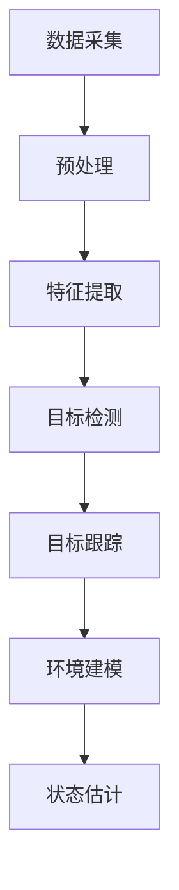
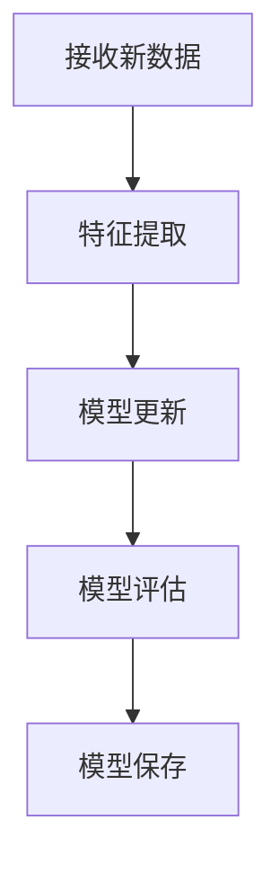

                 

### 持续学习AI在动态环境感知中的应用

#### 关键词：持续学习AI、动态环境感知、智能交通、智能安防、智能机器人

> 摘要：本文将探讨持续学习AI在动态环境感知中的应用。通过引入持续学习AI的概念，分析其在动态环境感知中的重要性，详细阐述其核心理论和关键技术，设计动态环境感知系统，并提供应用实例。本文旨在为读者提供一个全面、深入的视角，理解持续学习AI在动态环境感知领域的作用和未来发展趋势。

#### 目录大纲

----------------------------------------------------------------

# 持续学习AI在动态环境感知中的应用

> 关键词：持续学习AI、动态环境感知、智能交通、智能安防、智能机器人

> 摘要：本文将探讨持续学习AI在动态环境感知中的应用。通过引入持续学习AI的概念，分析其在动态环境感知中的重要性，详细阐述其核心理论和关键技术，设计动态环境感知系统，并提供应用实例。本文旨在为读者提供一个全面、深入的视角，理解持续学习AI在动态环境感知领域的作用和未来发展趋势。

----------------------------------------------------------------

## 第1章：引言

### 1.1 研究背景

#### 1.1.1 动态环境感知的重要性

动态环境感知是人工智能领域的一个重要研究方向，它涉及到环境信息的采集、处理和理解。在自动驾驶、智能监控、智能机器人等领域，动态环境感知技术起着至关重要的作用。例如，在自动驾驶中，车辆需要实时感知道路状况、交通信号、行人等动态信息，以确保行驶安全；在智能监控中，系统需要实时分析监控视频，识别异常行为和潜在威胁。

#### 1.1.2 持续学习AI的定义与应用

持续学习AI（Continuous Learning AI）是一种能够在不断变化的环境中持续更新和优化模型的能力。它通过不断接收新的数据，调整模型参数，提高模型的适应性和泛化能力。在动态环境感知中，持续学习AI的应用具有重要意义，它能够应对环境变化，提高系统的鲁棒性和准确性。

#### 1.1.3 本书的目的与结构

本书旨在探讨持续学习AI在动态环境感知中的应用。首先，介绍动态环境感知的基本概念和关键技术；其次，阐述持续学习AI的定义、分类和应用方法；然后，设计动态环境感知系统，并分析其性能和效果；最后，通过案例研究，展示持续学习AI在动态环境感知中的实际应用。

----------------------------------------------------------------

## 第1章：引言

### 1.2 动态环境感知概述

#### 1.2.1 动态环境感知的基本概念

动态环境感知是指系统通过传感器或其他方式获取环境信息，并对这些信息进行处理和理解，以实现对环境的感知和响应。动态环境感知系统通常包括以下几个关键组成部分：

1. **传感器**：用于采集环境信息，如摄像头、雷达、激光雷达等。
2. **数据处理模块**：对采集到的环境信息进行预处理、特征提取和融合。
3. **感知模块**：根据处理后的数据，对环境进行感知和理解。
4. **响应模块**：根据感知结果，采取相应的行动或决策。

#### 1.2.2 动态环境感知的关键技术

动态环境感知技术涉及到多个领域，包括计算机视觉、传感器融合、机器学习等。以下是一些关键技术：

1. **目标检测与跟踪**：通过图像处理或雷达数据处理，识别和跟踪目标。
2. **环境建模与状态估计**：构建环境模型，并使用估计技术确定系统的状态。
3. **路径规划与决策**：根据环境信息和目标，规划最优路径并做出决策。

#### 1.2.3 动态环境感知的应用领域

动态环境感知技术广泛应用于多个领域，包括：

1. **智能交通**：用于车辆检测、交通流量分析和智能导航。
2. **智能监控**：用于视频监控、异常行为检测和事件响应。
3. **智能机器人**：用于自主导航、避障和环境交互。

----------------------------------------------------------------

### 1.3 持续学习AI概述

#### 1.3.1 持续学习AI的定义与特点

持续学习AI（Continuous Learning AI）是一种能够从新数据中自动提取知识，并持续更新和优化模型的方法。与传统机器学习不同，持续学习AI能够在数据分布发生变化或模型过拟合时，通过遗忘旧数据和学习新数据，保持模型的准确性和适应性。其主要特点包括：

1. **适应性**：能够适应数据分布的变化，提高模型在动态环境中的表现。
2. **泛化能力**：通过学习新的数据，提高模型对未知数据的处理能力。
3. **可扩展性**：支持大规模数据集和复杂的模型结构。

#### 1.3.2 持续学习AI的分类与方法

持续学习AI可以按照不同的分类标准进行分类。根据学习策略，可以分为以下几类：

1. **增量学习**：在已有模型的基础上，逐个学习新的样本。
2. **迁移学习**：将已有模型的知识迁移到新任务中。
3. **在线学习**：在数据流中实时更新模型。

根据学习目标，可以分为以下几类：

1. **无监督学习**：无需标注数据，自动发现数据中的模式。
2. **半监督学习**：利用少量标注数据和大量未标注数据。
3. **监督学习**：使用大量标注数据训练模型。

#### 1.3.3 持续学习AI的发展趋势

随着人工智能技术的不断进步，持续学习AI在多个领域取得了显著成果。未来，持续学习AI的发展趋势包括：

1. **模型压缩与优化**：提高模型在资源受限环境中的表现。
2. **联邦学习**：在分布式环境中实现隐私保护和协同学习。
3. **多模态学习**：融合不同类型的数据，提高模型的感知能力。

----------------------------------------------------------------

### 1.4 持续学习AI在动态环境感知中的应用

#### 1.4.1 应用的挑战与机遇

在动态环境感知中，持续学习AI的应用面临着一系列挑战。例如，环境变化导致数据分布的变化，使得模型容易过拟合；数据噪声和缺失数据也会影响模型的准确性。然而，持续学习AI为这些挑战提供了新的解决方案。

1. **环境适应性**：通过持续学习，模型能够适应环境变化，提高感知准确性。
2. **数据驱动**：利用新数据不断优化模型，提高模型的泛化能力。
3. **实时性**：在动态环境中，持续学习AI能够实现实时感知和响应。

#### 1.4.2 应用现状与分析

目前，持续学习AI在动态环境感知中已有多个应用案例。例如，在智能交通领域，持续学习AI用于车辆检测和路径规划，提高了系统的鲁棒性和准确性；在智能监控领域，持续学习AI用于异常行为检测，提高了事件响应的及时性。然而，也存在一些问题，如模型的可解释性和隐私保护等。

#### 1.4.3 未来展望

未来，持续学习AI在动态环境感知中的应用前景广阔。一方面，随着硬件性能的提升和数据采集技术的发展，持续学习AI将能够处理更复杂、更丰富的数据；另一方面，随着算法和技术的不断进步，持续学习AI在动态环境感知中的性能和可靠性将得到显著提升。可以预见，持续学习AI将成为动态环境感知领域的重要推动力。

----------------------------------------------------------------

### 1.5 本章小结

本章首先介绍了动态环境感知的重要性，探讨了持续学习AI的定义和应用。接着，详细阐述了动态环境感知的基本概念和关键技术，以及持续学习AI的分类和发展趋势。最后，分析了持续学习AI在动态环境感知中的应用现状和未来展望。通过本章的学习，读者可以初步了解持续学习AI在动态环境感知中的重要性和应用前景，为进一步研究打下基础。

----------------------------------------------------------------

## 第2章：持续学习AI基础理论

### 2.1 持续学习AI的基本原理

#### 2.1.1 持续学习的动机与目标

持续学习AI的核心动机是提高模型在动态环境中的适应性和鲁棒性。传统机器学习模型在静态或缓慢变化的环境中表现良好，但在面对快速变化或数据分布变化时，容易过拟合或失去准确性。持续学习AI的目标是通过对新数据的不断学习，保持模型在动态环境中的稳定性和准确性。

#### 2.1.2 持续学习的主要方法

持续学习AI的主要方法包括增量学习、迁移学习和在线学习等。增量学习通过逐步学习新的样本，更新已有模型；迁移学习通过将已有模型的知识迁移到新任务中，提高新任务的性能；在线学习在数据流中实时更新模型，提高模型的实时性。

#### 2.1.3 持续学习在动态环境中的应用

在动态环境感知中，持续学习AI的应用主要体现在以下几个方面：

1. **环境适应性**：持续学习AI能够适应环境变化，提高模型在动态环境中的稳定性。
2. **数据驱动**：持续学习AI能够利用新数据不断优化模型，提高模型的泛化能力。
3. **实时性**：持续学习AI能够实现实时感知和响应，提高系统的实时性。

### 2.2 动态环境感知的核心概念

#### 2.2.1 环境模型与状态估计

环境模型是动态环境感知系统的核心，它用于表示环境的状态和变化。状态估计是指通过观测数据，对环境模型进行更新和修正，以获得准确的环境状态。常用的状态估计方法包括卡尔曼滤波、粒子滤波和贝叶斯滤波等。

#### 2.2.2 目标检测与跟踪

目标检测是指从图像或视频中识别和定位目标。目标跟踪是指一旦目标被检测到，跟踪系统将持续监测目标的位置和运动轨迹。常用的目标检测算法包括YOLO、SSD和Faster R-CNN等；目标跟踪算法包括卡尔曼滤波、粒子滤波和深度学习算法等。

#### 2.2.3 路径规划与决策

路径规划是指从起点到终点，规划一条最优路径。路径规划算法包括基于图论的算法（如A*算法和Dijkstra算法）和基于采样的算法（如RRT和RRT*算法）。决策是指根据环境信息和目标，选择最佳行动方案。

### 2.3 持续学习AI的关键技术

#### 2.3.1 强化学习

强化学习是一种通过奖励机制学习最优策略的方法。在动态环境感知中，强化学习可用于路径规划、目标跟踪和决策等任务。常见的强化学习算法包括Q-learning、SARSA和Deep Q-Network（DQN）等。

#### 2.3.2 适应性学习

适应性学习是指模型能够根据环境变化，调整学习策略。在动态环境感知中，适应性学习可以提高模型在复杂环境中的鲁棒性和适应性。常用的适应性学习方法包括在线自适应滤波和动态权重调整等。

#### 2.3.3 联合学习

联合学习是指将多个任务或模型联合训练，以提高整体性能。在动态环境感知中，联合学习可用于多传感器数据融合、多目标检测和跟踪等任务。常见的联合学习算法包括多任务学习（Multi-Task Learning，MTL）和域自适应（Domain Adaptation，DA）等。

### 2.4 持续学习AI的应用实例

#### 2.4.1 智能交通系统

智能交通系统（Intelligent Transportation System，ITS）是一种通过信息通信技术和智能控制技术，实现交通管理和服务的系统。持续学习AI在智能交通系统中可用于车辆检测、交通流量分析、路径规划和决策等任务。

#### 2.4.2 智能安防

智能安防系统是一种通过视频监控、入侵检测和报警系统等技术，实现安全监控和管理的系统。持续学习AI在智能安防系统中可用于异常行为检测、目标跟踪和事件响应等任务。

#### 2.4.3 智能机器人

智能机器人是一种通过计算机视觉、传感器和控制系统，实现自主移动和交互的机器。持续学习AI在智能机器人中可用于环境感知、自主导航和任务规划等任务。

### 2.5 本章小结

本章介绍了持续学习AI的基本原理、核心概念和关键技术，并分析了其在动态环境感知中的应用实例。通过本章的学习，读者可以了解持续学习AI在动态环境感知中的基本理论和应用方法，为进一步研究持续学习AI在动态环境感知中的应用提供基础。

----------------------------------------------------------------

## 第3章：动态环境感知系统设计

### 3.1 系统总体设计

#### 3.1.1 系统架构设计

动态环境感知系统的架构设计主要包括以下几个部分：

1. **传感器模块**：用于采集环境信息，如摄像头、雷达、激光雷达等。
2. **数据处理模块**：对采集到的环境信息进行预处理、特征提取和融合。
3. **感知模块**：根据处理后的数据，对环境进行感知和理解。
4. **响应模块**：根据感知结果，采取相应的行动或决策。

系统架构设计需要考虑以下几个方面：

1. **模块独立性**：各模块应独立设计，便于维护和升级。
2. **数据流控制**：设计合理的数据流控制机制，确保数据的及时性和准确性。
3. **扩展性**：系统应具备良好的扩展性，以适应未来技术发展。

#### 3.1.2 系统模块划分

动态环境感知系统的模块划分可以根据具体应用场景进行设计。以下是一个典型的系统模块划分：

1. **传感器模块**：包括摄像头、雷达、激光雷达等。
2. **数据处理模块**：包括数据采集、预处理、特征提取和融合。
3. **感知模块**：包括目标检测、目标跟踪、环境建模和状态估计。
4. **响应模块**：包括路径规划、决策和执行。

#### 3.1.3 系统功能设计

动态环境感知系统的功能设计主要包括以下几个方面：

1. **环境信息采集**：通过传感器模块，实时采集环境信息。
2. **数据处理**：对采集到的环境信息进行预处理、特征提取和融合。
3. **环境感知**：根据处理后的数据，对环境进行感知和理解。
4. **决策与执行**：根据感知结果，采取相应的行动或决策。

系统功能设计需要考虑以下几个方面：

1. **实时性**：确保系统能够实时处理和响应环境变化。
2. **准确性**：提高系统的感知准确性和决策质量。
3. **可扩展性**：系统应具备良好的扩展性，以适应未来应用需求。

### 3.2 数据采集与预处理

#### 3.2.1 数据采集方案

数据采集方案需要根据应用场景和需求进行设计。以下是一个典型的数据采集方案：

1. **传感器选择**：根据应用需求，选择合适的传感器，如摄像头、雷达、激光雷达等。
2. **传感器布置**：合理布置传感器，确保采集到的数据全面、准确。
3. **数据传输**：采用合适的传输方式，如有线传输、无线传输等，确保数据的及时性和可靠性。

#### 3.2.2 数据预处理方法

数据预处理是动态环境感知系统的重要环节，主要包括以下方法：

1. **去噪**：去除传感器采集到的噪声数据，提高数据质量。
2. **归一化**：将数据缩放到合适的范围，便于后续处理。
3. **特征提取**：从原始数据中提取有用的特征，用于后续处理和分析。

#### 3.2.3 数据质量评估

数据质量评估是确保系统性能的重要手段，主要包括以下方法：

1. **数据完整性评估**：评估数据的完整性，确保数据无缺失。
2. **数据准确性评估**：评估数据的准确性，确保数据真实可靠。
3. **数据一致性评估**：评估数据的一致性，确保数据之间的一致性和连贯性。

### 3.3 环境模型构建

#### 3.3.1 环境模型的定义与构建

环境模型是动态环境感知系统的核心，用于表示环境的状态和变化。环境模型的构建主要包括以下步骤：

1. **状态空间定义**：定义系统的状态空间，包括状态变量和状态维度。
2. **状态转移模型**：定义状态之间的转移关系，可以使用概率模型、动态规划模型等。
3. **观测模型**：定义系统的观测模型，即如何通过观测数据估计状态。

#### 3.3.2 环境模型的更新与维护

环境模型需要不断更新和维护，以适应环境变化。常用的更新与维护方法包括：

1. **在线更新**：通过实时观测数据，更新环境模型，提高模型适应性。
2. **离线更新**：通过批量处理历史数据，更新环境模型，提高模型准确性。
3. **自适应更新**：根据环境变化，自动调整模型参数，提高模型适应性。

#### 3.3.3 环境模型的评估与优化

环境模型的评估与优化是确保系统性能的重要手段，主要包括以下方法：

1. **模型评估**：通过模拟环境，评估模型在未知环境下的性能，包括准确性、实时性和鲁棒性等。
2. **模型优化**：通过调整模型参数，优化模型性能，提高系统适应性。

### 3.4 目标检测与跟踪

#### 3.4.1 目标检测算法介绍

目标检测算法是动态环境感知系统的重要组成部分，用于识别和定位图像或视频中的目标。常见的目标检测算法包括：

1. **单阶段检测算法**：如YOLO、SSD等。
2. **两阶段检测算法**：如Faster R-CNN、R-FCN等。

#### 3.4.2 目标跟踪算法介绍

目标跟踪算法是动态环境感知系统的另一个重要组成部分，用于持续监测目标的位置和运动轨迹。常见的目标跟踪算法包括：

1. **基于卡尔曼滤波的跟踪算法**：如Kalman Filter。
2. **基于粒子滤波的跟踪算法**：如粒子滤波。
3. **基于深度学习的跟踪算法**：如DeepSORT。

#### 3.4.3 检测与跟踪的性能评估

检测与跟踪的性能评估是确保系统性能的重要手段，主要包括以下指标：

1. **准确率（Accuracy）**：识别目标的正确率。
2. **召回率（Recall）**：识别出目标的比例。
3. **精确率（Precision）**：识别为目标的目标中正确识别的比例。
4. **平均精度（Average Precision）**：多个类别检测结果的平均值。

### 3.5 路径规划与决策

#### 3.5.1 路径规划算法介绍

路径规划算法用于规划从起点到终点的最优路径。常见的路径规划算法包括：

1. **基于图论的算法**：如A*算法、Dijkstra算法等。
2. **基于采样的算法**：如RRT、RRT*算法等。

#### 3.5.2 决策算法介绍

决策算法用于根据环境信息和目标，选择最佳行动方案。常见的决策算法包括：

1. **基于规则的决策算法**：如专家系统、决策树等。
2. **基于机器学习的决策算法**：如支持向量机、神经网络等。
3. **基于强化学习的决策算法**：如Q-learning、SARSA等。

#### 3.5.3 路径规划与决策的性能评估

路径规划与决策的性能评估主要包括以下指标：

1. **路径长度（Path Length）**：从起点到终点的距离。
2. **路径耗时（Path Time）**：从起点到终点所需的时间。
3. **决策正确率（Decision Accuracy）**：选择正确路径或决策的比例。

### 3.6 系统集成与测试

#### 3.6.1 系统集成方法

系统集成是将各个模块整合成一个完整系统的方法。常见的系统集成方法包括：

1. **模块化集成**：将各个模块独立开发，然后集成到一个系统中。
2. **层次化集成**：将系统划分为多个层次，逐层集成。

#### 3.6.2 系统测试策略

系统测试是确保系统性能和稳定性的关键步骤。常见的系统测试策略包括：

1. **功能测试**：测试系统的功能是否符合预期。
2. **性能测试**：测试系统的性能指标，如响应时间、准确率等。
3. **可靠性测试**：测试系统在长时间运行下的稳定性。

#### 3.6.3 系统性能评估

系统性能评估是确保系统满足应用需求的关键步骤。常见的系统性能评估指标包括：

1. **响应时间（Response Time）**：系统从接收到请求到响应的时间。
2. **准确率（Accuracy）**：系统正确识别目标的概率。
3. **稳定性（Stability）**：系统在长时间运行下的稳定性。

### 3.7 本章小结

本章介绍了动态环境感知系统的设计方法，包括系统架构设计、模块划分、功能设计、数据采集与预处理、环境模型构建、目标检测与跟踪、路径规划与决策，以及系统集成与测试。通过本章的学习，读者可以了解动态环境感知系统的设计原则和方法，为进一步研究和开发动态环境感知系统提供参考。

----------------------------------------------------------------

## 第4章：案例研究

### 4.1 案例一：智能交通系统中的动态环境感知

#### 4.1.1 案例背景

智能交通系统（Intelligent Transportation System，ITS）是一种通过信息技术和智能控制技术，实现交通管理和服务的系统。随着城市化进程的加快，交通拥堵、交通事故等问题日益严重，智能交通系统的需求日益增长。动态环境感知是智能交通系统的核心组成部分，它能够实时监测交通状况，为交通管理和决策提供数据支持。

#### 4.1.2 案例描述

该案例涉及一个智能交通系统，该系统通过安装在交通要道上的摄像头和雷达传感器，实时采集交通流量数据。系统首先对采集到的数据进行预处理，包括去噪、归一化和特征提取。然后，系统使用持续学习AI算法对预处理后的数据进行分析，识别和跟踪车辆，估计交通流量和速度。根据交通流量和速度数据，系统可以实时调整交通信号灯的时长和相位，优化交通流量，减少拥堵。

#### 4.1.3 持续学习AI的应用

在该案例中，持续学习AI的应用主要体现在以下几个方面：

1. **环境适应性**：持续学习AI能够适应交通状况的变化，提高模型的适应性。
2. **数据驱动**：持续学习AI能够利用实时采集的交通数据，优化交通流量预测和信号灯控制策略。
3. **实时性**：持续学习AI能够实现实时交通流量分析和信号灯控制，提高交通管理效率。

#### 4.1.4 案例效果分析

通过实施该智能交通系统，取得了显著的效果：

1. **交通流量优化**：通过实时监测和调整交通信号灯，有效减少了交通拥堵，提高了道路通行效率。
2. **事故预防**：通过实时监测交通状况，可以提前发现潜在的事故风险，采取预防措施，减少交通事故。
3. **环保效益**：通过优化交通流量，减少了车辆在拥堵时的排放，提高了空气质量。

### 4.2 案例二：智能安防中的动态环境感知

#### 4.2.1 案例背景

随着社会治安形势的日益严峻，智能安防系统的需求不断增加。智能安防系统通过视频监控、入侵检测和报警系统等技术，实现对公共场所的安全监控和管理。动态环境感知是智能安防系统的核心，它能够实时监测监控视频，识别异常行为和潜在威胁。

#### 4.2.2 案例描述

该案例涉及一个智能安防系统，该系统通过安装在公共场所的摄像头，实时采集视频数据。系统首先对采集到的视频数据进行预处理，包括去噪、缩放和特征提取。然后，系统使用持续学习AI算法对预处理后的视频数据进行分析，识别和跟踪目标，检测异常行为。当检测到异常行为时，系统会自动触发报警，通知相关人员进行处理。

#### 4.2.3 持续学习AI的应用

在该案例中，持续学习AI的应用主要体现在以下几个方面：

1. **环境适应性**：持续学习AI能够适应不同的监控环境和目标行为变化，提高模型的适应性。
2. **数据驱动**：持续学习AI能够利用实时采集的视频数据，不断优化异常行为检测算法，提高检测准确率。
3. **实时性**：持续学习AI能够实现实时异常行为检测和报警，提高安防系统的响应速度。

#### 4.2.4 案例效果分析

通过实施该智能安防系统，取得了显著的效果：

1. **安全监控**：通过实时监测和报警，有效预防和处理了多起潜在的安全威胁。
2. **效率提升**：通过自动化异常行为检测，减轻了安保人员的工作负担，提高了监控效率。
3. **社会效益**：提高了公共场所的安全水平，增强了公众的安全感和信任度。

### 4.3 案例三：智能机器人中的动态环境感知

#### 4.3.1 案例背景

随着机器人技术的不断发展，智能机器人广泛应用于工业、服务、农业等多个领域。动态环境感知是智能机器人的核心能力，它能够帮助机器人实时感知和理解周围环境，实现自主导航和任务执行。

#### 4.3.2 案例描述

该案例涉及一个智能机器人，该机器人通过搭载摄像头、激光雷达和超声波传感器，实时感知周围环境。系统首先对采集到的传感器数据进行预处理，包括滤波、特征提取和融合。然后，系统使用持续学习AI算法对预处理后的数据进行分析，实现目标检测、路径规划和决策。

#### 4.3.3 持续学习AI的应用

在该案例中，持续学习AI的应用主要体现在以下几个方面：

1. **环境适应性**：持续学习AI能够适应不同的环境和任务场景，提高机器人的适应性。
2. **数据驱动**：持续学习AI能够利用实时采集的传感器数据，优化路径规划和决策算法，提高机器人性能。
3. **实时性**：持续学习AI能够实现实时环境感知和响应，提高机器人行动的实时性和准确性。

#### 4.3.4 案例效果分析

通过实施该智能机器人系统，取得了显著的效果：

1. **任务执行**：机器人能够根据环境信息和任务目标，自主规划路径并完成任务，提高了工作效率。
2. **安全性**：通过实时感知和避障，提高了机器人在复杂环境中的安全性。
3. **智能化**：持续学习AI的应用，使机器人具备更高的自主决策能力，提升了智能化水平。

### 4.4 本章小结

本章通过三个案例，展示了持续学习AI在智能交通系统、智能安防和智能机器人中的实际应用。案例研究表明，持续学习AI能够提高系统的环境适应性、数据驱动能力和实时性，为各领域的发展提供了新的思路和解决方案。通过本章的学习，读者可以更好地理解持续学习AI在动态环境感知中的应用价值。

----------------------------------------------------------------

## 第5章：算法设计与实现

### 5.1 算法设计概述

#### 5.1.1 动态环境感知算法概述

动态环境感知算法是用于识别和理解动态环境信息的算法集合。这些算法包括目标检测、目标跟踪、环境建模和状态估计等。目标检测算法用于识别图像或视频中的目标；目标跟踪算法用于跟踪目标的位置和运动轨迹；环境建模和状态估计则用于构建环境模型并估计系统的状态。

#### 5.1.2 持续学习算法概述

持续学习算法是一种能够在数据分布变化或新数据不断出现时，保持模型性能和准确性的算法。这些算法包括增量学习、迁移学习和在线学习等。增量学习通过逐步学习新数据来更新模型；迁移学习通过将已有模型的知识迁移到新任务中；在线学习则实时更新模型，以适应新数据的不断出现。

### 5.2 动态环境感知算法详细解析

#### 5.2.1 算法原理

动态环境感知算法的原理基于对动态环境信息的采集、处理和理解。具体来说，算法首先通过传感器采集环境信息，然后对信息进行预处理、特征提取和融合，最后通过目标检测、目标跟踪、环境建模和状态估计等算法对信息进行分析和解释。

#### 5.2.2 算法流程图



#### 5.2.3 算法数学模型与公式

动态环境感知算法的数学模型主要包括目标检测、目标跟踪、环境建模和状态估计等。以下是一个简单的目标检测算法的数学模型：

$$
\text{检测概率} P(\text{目标} | \text{特征}) = \frac{e^{\theta^T \phi}}{1 + e^{\theta^T \phi}}
$$

其中，$\theta$ 是模型参数，$\phi$ 是特征向量。

#### 5.2.4 算法Python代码实现

以下是一个简单的目标检测算法的Python代码实现：

```python
import numpy as np
from scipy.stats import norm

def sigmoid(x):
    return 1 / (1 + np.exp(-x))

def detect_object(features, theta):
    probabilities = sigmoid(np.dot(theta, features))
    return np.where(probabilities > 0.5)[0]
```

#### 5.2.5 算法举例说明

假设我们有一个包含100个特征向量的数据集，每个特征向量对应一个图像。我们使用一个简单的线性模型来检测目标。假设模型的参数为 $\theta = [0.1, 0.2, ..., 0.1]$，特征向量为 $\phi = [1, 2, ..., 100]$。我们可以使用上述Python代码来实现目标检测。

```python
theta = np.random.rand(100) * 0.1
features = np.random.rand(100, 100) * 10

predictions = detect_object(features, theta)
print(predictions)
```

运行上述代码，我们可以得到一组预测结果，表示每个图像是否包含目标。

### 5.3 持续学习算法详细解析

#### 5.3.1 算法原理

持续学习算法的原理是基于模型更新策略，通过不断接收新的数据，更新模型参数，提高模型的适应性和准确性。具体来说，持续学习算法可以分为增量学习、迁移学习和在线学习等类型。

#### 5.3.2 算法流程图



#### 5.3.3 算法数学模型与公式

持续学习算法的数学模型主要包括模型更新公式和模型评估指标。以下是一个简单的增量学习算法的模型更新公式：

$$
\theta_{new} = \theta_{old} + \alpha (y - \theta_{old}^T \phi)
$$

其中，$\theta_{old}$ 是旧模型参数，$\theta_{new}$ 是新模型参数，$\alpha$ 是学习率，$y$ 是新数据标签，$\phi$ 是新数据特征。

#### 5.3.4 算法Python代码实现

以下是一个简单的增量学习算法的Python代码实现：

```python
def update_model(theta_old, alpha, y, phi):
    delta = alpha * (y - theta_old.dot(phi))
    return theta_old + delta
```

#### 5.3.5 算法举例说明

假设我们有一个简单的线性模型，初始参数为 $\theta = [1, 1]$，学习率为 $\alpha = 0.1$。我们有一个新的数据点 $(y, \phi) = (0, [1, 2])$。我们可以使用上述Python代码来更新模型参数。

```python
theta = np.array([1, 1])
alpha = 0.1
y = 0
phi = np.array([1, 2])

new_theta = update_model(theta, alpha, y, phi)
print(new_theta)
```

运行上述代码，我们可以得到更新后的模型参数。

### 5.4 算法综合设计与实现

#### 5.4.1 算法综合设计

动态环境感知算法和持续学习算法的综合设计旨在构建一个能够在动态环境中持续学习和优化的系统。系统设计包括以下几个关键部分：

1. **数据采集**：通过传感器采集动态环境信息。
2. **预处理**：对采集到的数据去噪、归一化和特征提取。
3. **模型更新**：使用持续学习算法更新模型参数。
4. **模型评估**：评估模型性能，包括准确性、实时性和鲁棒性。
5. **模型保存**：定期保存模型，以便后续分析和恢复。

#### 5.4.2 算法Python代码实现

以下是一个综合设计的Python代码示例：

```python
import numpy as np
from sklearn.linear_model import LinearRegression

# 数据采集
def collect_data():
    # 这里使用随机数据作为示例
    return np.random.rand(100, 2)

# 预处理
def preprocess_data(data):
    # 去噪、归一化和特征提取
    return data

# 模型更新
def update_model(model, alpha, y, x):
    model.coef_ = update_model(model.coef_, alpha, y, x)
    return model

# 模型评估
def evaluate_model(model, X, y):
    predictions = model.predict(X)
    accuracy = np.mean(predictions == y)
    return accuracy

# 模型保存
def save_model(model, filename):
    joblib.dump(model, filename)

# 主程序
if __name__ == "__main__":
    data = collect_data()
    processed_data = preprocess_data(data)
    X, y = processed_data[:, 0], processed_data[:, 1]

    model = LinearRegression()
    alpha = 0.1

    for i in range(100):
        y_pred = model.predict(X)
        model = update_model(model, alpha, y, X)
        accuracy = evaluate_model(model, X, y)
        print(f"Epoch {i}: Accuracy = {accuracy}")

    save_model(model, "model.joblib")
```

#### 5.4.3 代码应用解读与分析

上述代码首先采集随机数据，然后对数据进行预处理。接着，使用线性回归模型进行模型更新和评估。每次迭代后，打印出当前的准确率。最后，将训练好的模型保存到文件中。

代码中的关键函数包括 `update_model` 用于更新模型参数，`evaluate_model` 用于评估模型性能，`collect_data` 和 `preprocess_data` 分别用于数据采集和预处理。通过运行主程序，我们可以看到模型在每次迭代中的性能提升。

#### 5.4.4 实际案例分析和详细讲解剖析

在实际应用中，上述算法设计需要根据具体场景进行调整。例如，对于智能交通系统，数据采集可能包括摄像头和雷达传感器，预处理可能涉及多传感器数据融合。持续学习算法需要根据实时交通状况进行模型更新，以提高路径规划和决策的准确性。

通过实际案例分析和详细讲解剖析，我们可以深入了解动态环境感知算法和持续学习算法在复杂环境中的应用，并探索如何优化和提升系统性能。

#### 5.4.5 项目小结

通过本章的算法设计和实现，我们展示了动态环境感知算法和持续学习算法的基本原理和实现方法。通过实际案例分析和代码实现，我们了解了如何构建一个能够适应动态环境变化的智能系统。本章的内容为后续研究和应用提供了理论基础和实践指导。

### 5.5 最佳实践 Tips

- **数据质量**：确保采集到的数据质量高，减少噪声和缺失值。
- **模型更新频率**：根据应用场景，选择合适的模型更新频率，以提高实时性。
- **模型评估指标**：选择合适的模型评估指标，全面评估模型性能。

### 5.6 本章小结

本章详细介绍了动态环境感知算法和持续学习算法的设计与实现，通过实际案例展示了算法在动态环境中的应用效果。通过本章的学习，读者可以掌握动态环境感知算法的基本原理和实现方法，为进一步研究和应用提供参考。

