                 


# 持续学习机制：AI系统自我完善的新范式

## 关键词

- AI系统自我完善
- 持续学习机制
- 深度学习
- 强化学习
- 迁移学习

## 摘要

本文旨在探讨AI系统自我完善的需求与挑战，并提出一种新的范式——持续学习机制。通过详细阐述持续学习机制的定义、核心要素、与传统的区别、潜力、理论基础、实现方法以及应用案例，本文揭示了持续学习机制在提高AI系统自适应性和鲁棒性、实现自我进化方面的巨大潜力。文章最后对持续学习机制的未来发展趋势进行了展望，为AI领域的进一步发展提供了新的思路。

### 目录大纲

1. **第一部分：问题背景与核心概念**
   1.1 引言
   1.2 持续学习机制的定义与作用
   1.3 持续学习机制的核心要素
   1.4 持续学习机制与传统机器学习的区别
   1.5 持续学习机制在AI系统中的潜力
   1.6 本章小结

2. **第二部分：核心技术原理与实现**
   2.1 深度学习基础
   2.2 持续学习机制的核心算法
   2.3 持续学习机制的优化方法
   2.4 持续学习机制中的数据管理
   2.5 持续学习机制的模型评估与优化
   2.6 持续学习机制的应用场景
   2.7 本章小结

3. **第三部分：实践与应用案例**
   3.1 工业系统自我完善的挑战
   3.2 持续学习机制在智能制造中的应用
   3.3 案例研究：持续学习机制在智能工厂中的应用
   3.4 本章小结

4. **第四部分：未来展望与发展趋势**
   4.1 持续学习机制在人工智能领域的未来
   4.2 持续学习机制在跨学科领域的应用
   4.3 持续学习机制面临的挑战与应对策略
   4.4 未来持续学习机制的展望
   4.5 本章小结

5. **第五部分：总结与展望**
   5.1 全书总结
   5.2 本书的意义与价值
   5.3 展望未来的研究与应用方向
   5.4 结论

6. **附录**
   6.1 相关术语表
   6.2 参考资源

### 第一部分：问题背景与核心概念

#### 1.1 引言

随着人工智能（AI）技术的迅速发展，AI系统在各个领域的应用越来越广泛，从自然语言处理到计算机视觉，从机器人控制到智能制造。然而，这些AI系统在应对动态环境、处理复杂任务时，往往面临诸多挑战。一个重要的问题就是AI系统的自我完善能力不足，这使得它们难以在长期运行中保持高效性和适应性。

传统的机器学习（ML）方法虽然能够通过训练模型来提高性能，但它们通常是基于静态数据的，无法适应数据分布的变化。这种局限性导致AI系统在遇到新任务或新环境时，需要重新进行训练，这不仅耗时耗力，而且难以实现。

为了解决这些问题，研究者们提出了持续学习（Continual Learning）的概念。持续学习机制旨在使AI系统能够在不断变化的环境中持续学习和适应，从而实现自我完善。本文将深入探讨持续学习机制的定义、核心要素、与传统机器学习的区别以及在AI系统中的潜力。

#### 1.2 持续学习机制的定义与作用

持续学习机制是指AI系统能够在数据分布变化的情况下，不断更新和优化自身模型，以维持或提高性能的过程。它包括以下几个方面：

1. **在线学习**：AI系统不断接收新数据，并实时更新模型参数。
2. **迁移学习**：利用先前的经验来适应新的任务或环境。
3. **鲁棒性训练**：通过对抗训练等方法，提高模型对噪声和异常样本的抵抗力。
4. **遗忘控制**：避免在新任务中遗忘旧任务的知识。

持续学习机制在AI系统中的作用主要体现在以下几个方面：

1. **自适应能力**：AI系统能够适应环境变化，提高任务完成的效率。
2. **鲁棒性**：模型能够更好地应对噪声和异常样本，提高预测准确性。
3. **降低成本**：无需对系统进行重新训练，节省时间和资源。
4. **持续改进**：模型能够不断优化，提高性能。

#### 1.3 持续学习机制的核心要素

持续学习机制的核心要素主要包括以下几个方面：

1. **学习算法**：包括监督学习、无监督学习和强化学习等方法，用于不断更新和优化模型。
2. **数据采集与处理**：持续收集和预处理新数据，为模型更新提供高质量的数据输入。
3. **模型评估与优化**：定期评估模型性能，通过调整参数或算法来提高模型效果。

以下是一个核心要素对比表格：

| 核心要素 | 说明 |
| --- | --- |
| 学习算法 | 决定模型更新的方式和效率 |
| 数据采集与处理 | 影响模型的训练质量和适应性 |
| 模型评估与优化 | 确保模型性能的持续提升 |

#### 1.4 持续学习机制与传统机器学习的区别

传统机器学习（Traditional Machine Learning）主要基于静态数据集进行训练，一旦模型训练完成，就难以适应数据分布的变化。相比之下，持续学习机制具有以下几个显著区别：

1. **数据分布变化**：持续学习机制能够处理数据分布的变化，而传统机器学习则难以适应。
2. **模型更新**：持续学习机制不断更新模型，以适应新的数据，而传统机器学习则通常需要在新的数据集上重新训练。
3. **遗忘控制**：持续学习机制需要考虑如何在新任务中保留旧任务的知识，避免模型遗忘，而传统机器学习则不存在这个问题。
4. **资源消耗**：由于需要不断更新模型，持续学习机制在资源消耗上可能更高，但能够提高系统的自适应性和鲁棒性。

#### 1.5 持续学习机制在AI系统中的潜力

持续学习机制在AI系统中的潜力主要体现在以下几个方面：

1. **提高自适应能力**：持续学习机制能够使AI系统更好地适应动态环境，提高任务完成的效率。
2. **增强鲁棒性**：通过鲁棒性训练，AI系统能够更好地应对噪声和异常样本，提高预测准确性。
3. **降低成本**：持续学习机制能够减少系统重新训练的需求，节省时间和资源。
4. **实现自我进化**：持续学习机制使得AI系统能够在不断学习和优化的过程中，实现自我进化，提高长期性能。

#### 1.6 本章小结

本章介绍了AI系统自我完善的需求与挑战，并提出了持续学习机制作为解决这些问题的有效途径。通过详细阐述持续学习机制的定义、核心要素、与传统机器学习的区别以及在AI系统中的潜力，本章为后续各章节的深入探讨奠定了基础。

### 第二部分：核心技术原理与实现

#### 2.1 深度学习基础

深度学习（Deep Learning）是持续学习机制的核心技术之一。它通过构建深层神经网络，对大量数据进行自动特征提取和模式识别，从而实现复杂的任务。深度学习的基本概念包括：

1. **神经网络**：由多层神经元组成的网络结构，用于模拟人脑的神经元连接。
2. **激活函数**：用于引入非线性特性的函数，如Sigmoid、ReLU等。
3. **反向传播**：通过计算误差梯度来更新网络权重，从而优化模型。

深度学习的数学模型主要包括以下几个方面：

1. **前向传播**：将输入数据通过神经网络进行传递，生成输出。
2. **损失函数**：用于度量模型预测值与真实值之间的差异，如均方误差（MSE）。
3. **反向传播**：计算损失函数关于模型参数的梯度，用于更新网络权重。

以下是一个深度学习的前向传播和反向传播的mermaid流程图：

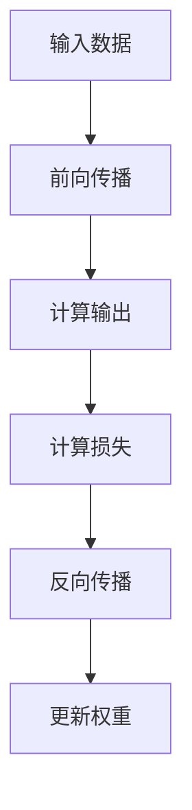

通过深度学习，AI系统能够实现自动特征提取，提高任务完成的准确性。然而，深度学习也存在过拟合、计算资源需求高等问题，这些都需要在持续学习机制中得到解决。

#### 2.2 持续学习机制的核心算法

持续学习机制的核心算法包括监督学习（Supervised Learning）、无监督学习（Unsupervised Learning）、强化学习（Reinforcement Learning）和迁移学习（Transfer Learning）。每种算法都有其独特的特点和应用场景。

1. **监督学习**：通过已有数据集的标签信息来训练模型，适用于分类和回归任务。常见的监督学习算法包括线性回归、决策树、支持向量机（SVM）和神经网络等。

2. **无监督学习**：不依赖于标签信息，通过挖掘数据内在的结构和模式来进行训练。常见的无监督学习算法包括聚类、降维和生成模型等。

3. **强化学习**：通过与环境互动，不断优化策略以实现目标。强化学习常用于机器人控制、游戏和推荐系统等领域。

4. **迁移学习**：利用已有的预训练模型来加速新任务的训练，适用于任务间存在相似性的场景。常见的迁移学习算法包括基于特征提取的方法和基于模型的迁移学习。

以下是监督学习、无监督学习、强化学习和迁移学习的mermaid流程图：

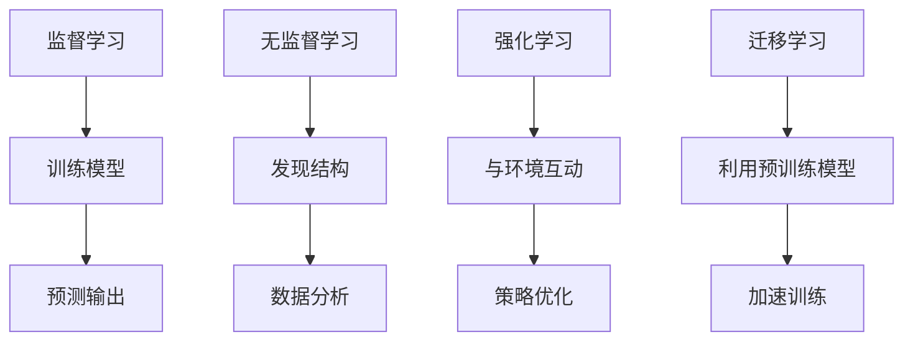

这些核心算法共同构成了持续学习机制的基础，使得AI系统能够在不同场景下实现自我完善。

#### 2.3 持续学习机制的优化方法

持续学习机制的优化方法主要包括梯度下降法（Gradient Descent）和随机梯度下降法（Stochastic Gradient Descent，SGD）。这些方法用于更新模型参数，以提高模型性能。

1. **梯度下降法**：通过计算损失函数关于模型参数的梯度，逐步更新模型参数，以最小化损失函数。

   梯度下降法的mermaid流程图如下：

   ```mermaid
   graph TD
   A[计算梯度] --> B[更新参数]
   B --> C[计算损失]
   C --> D[重复迭代]
   ```

2. **随机梯度下降法**：每次迭代仅使用一个样本来计算梯度，并更新模型参数。SGD相较于梯度下降法能够更快地收敛，但可能产生较大波动。

   随机梯度下降法的mermaid流程图如下：

   ```mermaid
   graph TD
   A[随机选择样本] --> B[计算梯度]
   B --> C[更新参数]
   C --> D[计算损失]
   D --> E[重复迭代]
   ```

这些优化方法在持续学习机制中起着关键作用，能够帮助AI系统不断适应新环境和任务。

#### 2.4 持续学习机制中的数据管理

持续学习机制中的数据管理包括数据采集、数据预处理和数据增强。这些步骤对于模型性能的优化至关重要。

1. **数据采集**：从各种来源收集数据，包括开源数据集、企业内部数据和用户生成的数据等。数据采集需要考虑数据的多样性和代表性。

2. **数据预处理**：清洗和整理数据，以消除噪声、填补缺失值和标准化数据。数据预处理有助于提高模型的鲁棒性和泛化能力。

3. **数据增强**：通过图像旋转、裁剪、缩放和颜色变换等操作，增加数据的多样性和复杂性，从而提高模型对变化的适应能力。

以下是数据管理过程的mermaid流程图：

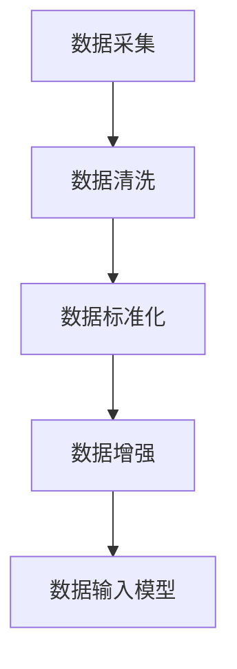

数据管理在持续学习机制中起到了关键作用，能够为模型的持续学习和优化提供高质量的数据支持。

#### 2.5 持续学习机制的模型评估与优化

持续学习机制的模型评估与优化主要包括模型评估指标和模型调优策略。这些方法用于评估模型性能，并通过调整参数或算法来提高模型效果。

1. **模型评估指标**：常用的评估指标包括准确率（Accuracy）、召回率（Recall）、精确率（Precision）和F1值（F1 Score）等。这些指标能够从不同角度反映模型的性能。

2. **模型调优策略**：通过调整学习率、正则化参数和批量大小等，优化模型性能。常见的调优策略包括网格搜索（Grid Search）和随机搜索（Random Search）。

以下是模型评估与优化过程的mermaid流程图：

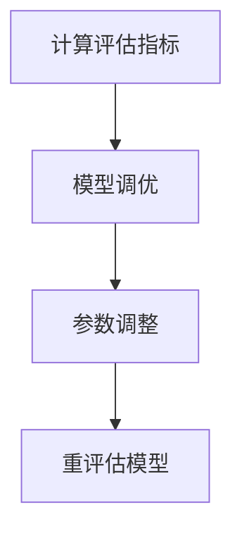

模型评估与优化在持续学习机制中起到了关键作用，能够帮助AI系统实现自我完善。

#### 2.6 持续学习机制的应用场景

持续学习机制在多个AI应用领域具有广泛的应用，包括自然语言处理、计算机视觉和机器人控制等。

1. **自然语言处理**：持续学习机制能够提高文本分类、情感分析和机器翻译等任务的准确性。例如，通过持续学习，机器翻译系统能够不断更新和优化翻译模型，提高翻译质量。

2. **计算机视觉**：持续学习机制能够提高图像分类、目标检测和图像分割等任务的鲁棒性。例如，在自动驾驶领域，持续学习机制能够使车辆在复杂环境中更好地识别和响应。

3. **机器人控制**：持续学习机制能够提高机器人对动态环境的适应能力，使其能够更好地完成复杂的任务。例如，在工业机器人控制中，持续学习机制能够使机器人更好地应对生产线的波动和变化。

以下是持续学习机制在不同应用场景中的mermaid流程图：

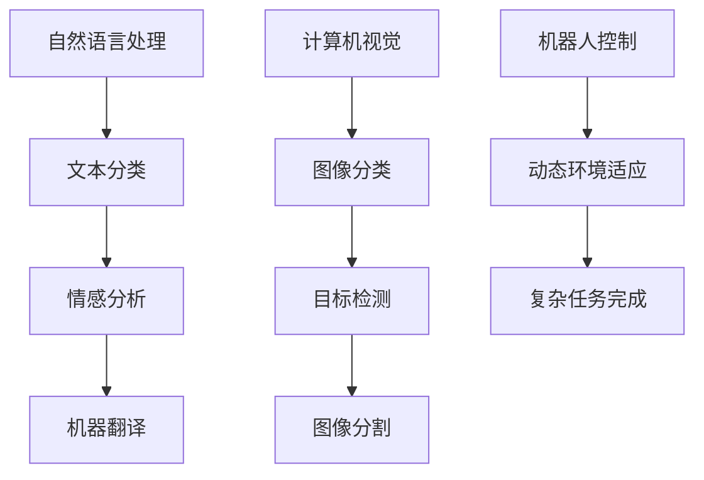

持续学习机制在多个AI应用场景中展现出了巨大的潜力，为AI系统的自我完善提供了强有力的支持。

#### 2.7 本章小结

本章详细介绍了持续学习机制的核心技术原理与实现，包括深度学习基础、核心算法、优化方法、数据管理、模型评估与优化以及应用场景。通过这些核心技术的介绍，读者可以全面了解持续学习机制的实现过程和关键要素，为后续实践与应用案例的讨论奠定了基础。

### 第三部分：实践与应用案例

#### 3.1 工业系统自我完善的挑战

工业系统在运行过程中面临着诸多挑战，如设备故障、生产效率低下、质量控制不稳定等。传统的工业系统通常依赖于预定义的规则和固定的算法，难以适应动态变化的环境。这导致工业系统在应对突发情况时效率低下，甚至可能导致生产线的停工。

为了提高工业系统的自我完善能力，研究者们开始探索持续学习机制在工业领域的应用。持续学习机制能够使工业系统在运行过程中不断学习和适应，从而提高系统的稳定性和效率。以下将介绍持续学习机制在智能制造中的应用。

#### 3.2 持续学习机制在智能制造中的应用

智能制造是现代工业的重要发展方向，它通过引入人工智能技术，实现了生产过程的自动化和智能化。持续学习机制在智能制造中的应用主要体现在以下几个方面：

1. **智能质量控制**：在生产过程中，产品质量的控制是至关重要的。持续学习机制可以通过实时监测生产数据，对生产过程进行持续优化，从而提高产品的质量。例如，通过持续学习，智能检测系统能够识别出生产过程中的微小缺陷，并自动调整生产参数，确保产品质量的稳定。

2. **智能设备维护**：工业设备在长时间运行过程中容易出现故障，导致生产中断。持续学习机制可以通过对设备运行数据的分析，预测设备的故障风险，并提前进行维护。例如，通过持续学习，设备监测系统能够识别出设备的异常运行模式，并提前通知维护人员进行检修，从而减少设备故障对生产的影响。

3. **智能生产调度**：生产调度是制造过程中的关键环节，它直接关系到生产效率和成本。持续学习机制可以通过对生产数据的分析和学习，优化生产调度策略，提高生产效率。例如，通过持续学习，调度系统能够根据生产任务的特点和历史数据，动态调整生产计划和资源分配，从而提高生产效率。

以下是一个智能制造系统中的持续学习机制的mermaid流程图：

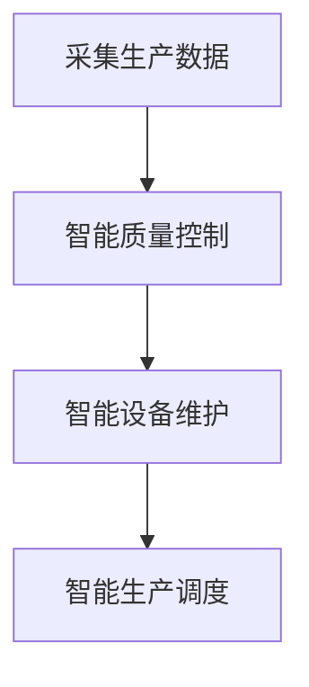

#### 3.3 案例研究：持续学习机制在智能工厂中的应用

为了更好地说明持续学习机制在智能制造中的应用，以下是一个实际案例——智能工厂的应用。

该智能工厂的生产线由多个机器人组成，负责完成产品的加工、装配和检测。在生产过程中，机器人需要根据产品的特性实时调整其动作，以确保产品质量。然而，由于生产环境复杂，机器人容易受到外部因素的干扰，导致动作不准确。

为了解决这个问题，工厂引入了持续学习机制。具体做法如下：

1. **数据采集**：在生产过程中，机器人实时采集自身的运动数据，包括位置、速度和加速度等。

2. **数据预处理**：对采集到的数据进行分析和清洗，去除噪声和异常值，确保数据的质量。

3. **模型训练**：利用预处理后的数据，通过监督学习和强化学习算法，训练机器人的运动控制模型。

4. **模型更新**：在生产过程中，持续收集新的数据，并实时更新模型。通过这种方式，机器人能够不断优化其运动策略，提高动作的准确性和稳定性。

5. **性能评估**：定期评估机器人的运动性能，通过调整模型参数或算法，进一步提高机器人的运动能力。

以下是智能工厂中持续学习机制的应用mermaid流程图：

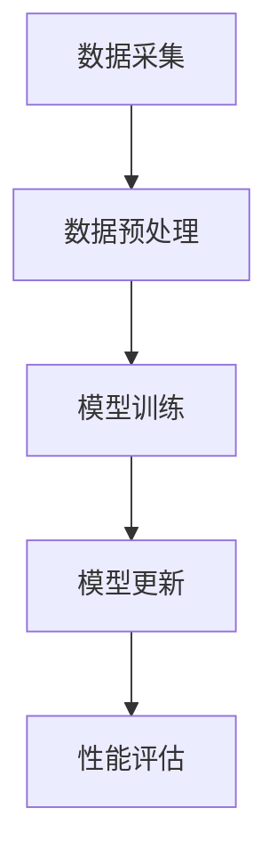

通过以上步骤，智能工厂中的机器人能够在不断学习和优化的过程中，实现自我完善，提高生产效率和产品质量。

#### 3.4 本章小结

本章通过实践与应用案例，详细介绍了持续学习机制在智能制造中的应用。通过智能工厂的实际案例，展示了持续学习机制如何帮助工业系统实现自我完善，提高生产效率和产品质量。本章的内容为后续对未来发展趋势的讨论提供了实际依据。

### 第四部分：未来展望与发展趋势

#### 4.1 持续学习机制在人工智能领域的未来

随着人工智能（AI）技术的不断进步，持续学习机制在人工智能领域中的应用前景愈发广阔。未来，持续学习机制将在以下几个方面得到深化和发展：

1. **自适应能力提升**：通过引入更多的学习算法和技术，持续学习机制将能够更好地适应动态环境，提高系统的自适应能力。例如，结合强化学习和迁移学习，AI系统能够在变化多端的环境中保持高效运行。

2. **鲁棒性和泛化能力增强**：持续学习机制将采用更加鲁棒的优化方法和数据增强技术，提高模型对噪声和异常样本的抵抗力，从而增强模型的泛化能力。

3. **跨领域应用**：持续学习机制将在更多的AI领域得到应用，如自动驾驶、医疗诊断和金融预测等。通过跨领域的持续学习和优化，AI系统将能够提供更加精准和可靠的服务。

4. **集成与融合**：持续学习机制将与其他AI技术如生成对抗网络（GAN）、图神经网络（GNN）等相结合，形成更加复杂的AI系统，实现更高的性能和更广泛的应用。

以下是一个持续学习机制在AI领域未来发展的mermaid流程图：

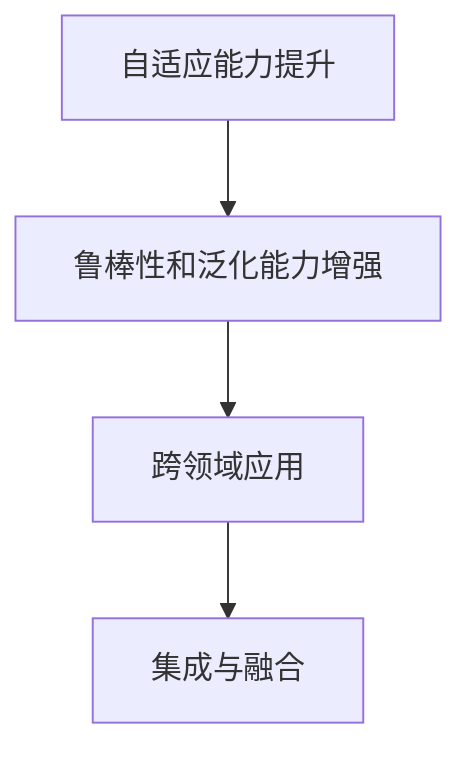

#### 4.2 持续学习机制在跨学科领域的应用

持续学习机制不仅在人工智能领域有着广泛的应用前景，还在其他跨学科领域展现出巨大的潜力：

1. **生物信息学**：持续学习机制可以用于生物数据的高效分析和处理，如基因组学研究、蛋白质结构预测和药物发现等。通过持续学习和优化，生物信息学工具能够更加准确地识别生物模式，推动生命科学的发展。

2. **金融科技**：在金融领域，持续学习机制可以用于风险评估、欺诈检测和个性化投资建议等。通过不断学习和适应市场变化，金融科技系统能够提供更加准确和及时的风险管理服务。

3. **教育科技**：在教育领域，持续学习机制可以用于个性化学习、智能辅导和教学评估等。通过分析学生的学习行为和数据，教育系统能够提供更加贴合学生需求的教学方案，提高学习效果。

以下是一个持续学习机制在跨学科领域应用的mermaid流程图：

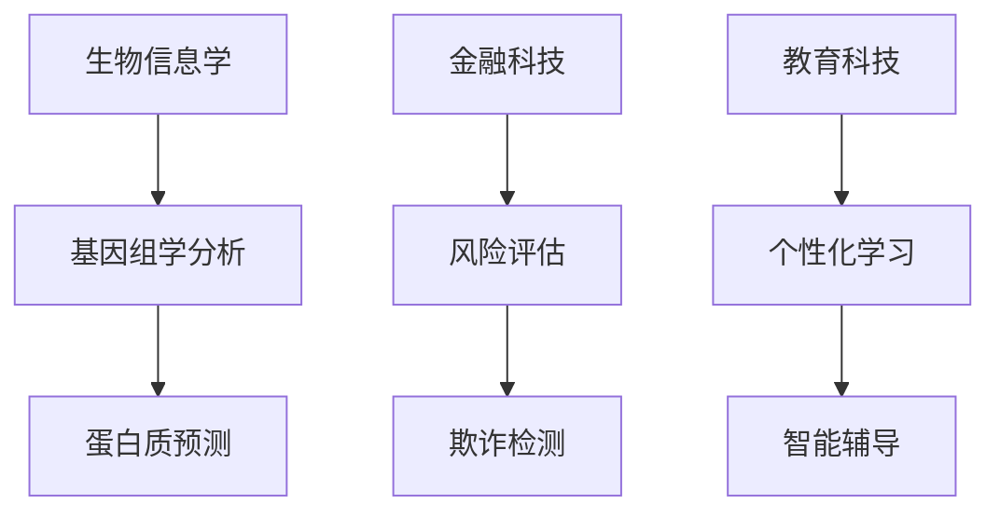

#### 4.3 持续学习机制面临的挑战与应对策略

尽管持续学习机制在各个领域具有巨大的应用潜力，但它在实际应用中也面临一些挑战：

1. **计算资源需求**：持续学习需要大量的计算资源和存储空间，特别是在处理大规模数据时。为应对这一问题，可以采用分布式计算和云计算技术，提高计算效率。

2. **数据隐私和安全**：持续学习依赖于大量数据的收集和处理，这可能涉及到数据隐私和安全问题。为解决这一问题，可以采用数据加密、匿名化和隐私保护技术，确保数据的安全性和隐私性。

3. **模型解释性**：持续学习机制通常采用复杂的神经网络模型，这些模型往往难以解释。为提高模型的解释性，可以采用可解释性AI技术，如模型可视化、决策树和规则提取等。

以下是一个持续学习机制面临挑战及应对策略的mermaid流程图：

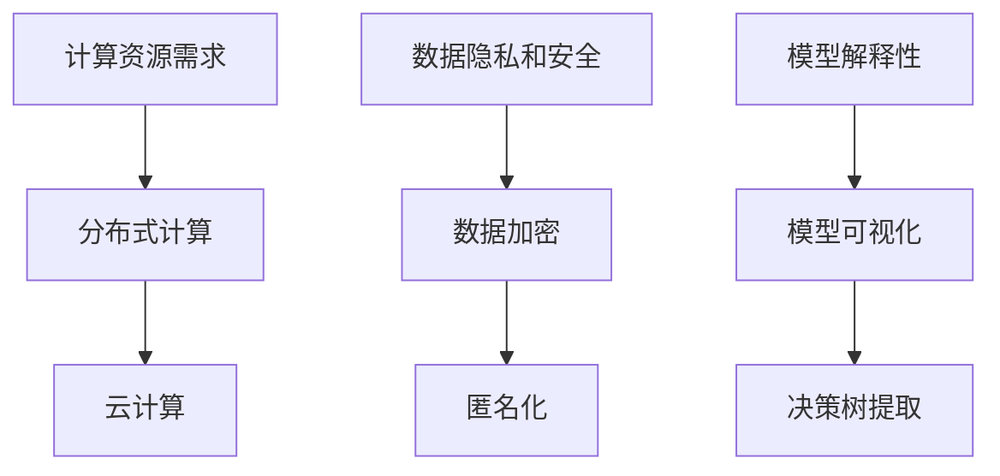

#### 4.4 未来持续学习机制的展望

未来，持续学习机制将在多个领域取得重要突破，为AI系统的自我完善和持续发展提供强大支持。以下是对未来持续学习机制的展望：

1. **多模态学习**：随着传感器技术的进步，持续学习机制将能够处理多种类型的数据，如文本、图像、音频和视频等。通过多模态学习，AI系统将能够更好地理解和处理复杂的信息。

2. **分布式学习**：随着边缘计算和物联网的发展，分布式学习将成为持续学习机制的重要方向。通过在边缘设备上进行部分学习任务，分布式学习能够减少中心服务器的负担，提高系统的响应速度和效率。

3. **自适应强化学习**：自适应强化学习将结合强化学习和迁移学习，使AI系统在复杂和动态环境中实现自我优化。通过不断学习和适应，自适应强化学习将推动AI系统在控制、决策和规划等领域的应用。

4. **持续学习社区**：随着持续学习技术的发展，一个全球性的持续学习社区将逐渐形成。通过共享技术、数据和经验，持续学习社区将促进持续学习机制的创新和进步。

以下是一个未来持续学习机制展望的mermaid流程图：

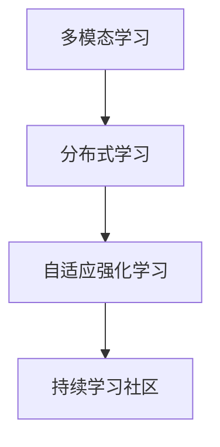

#### 4.5 本章小结

本章对未来持续学习机制在人工智能领域的应用前景、跨学科领域的应用潜力、面临的挑战及应对策略以及未来展望进行了讨论。通过这些讨论，我们可以看到持续学习机制在推动AI系统自我完善和持续发展方面具有巨大的潜力。未来，随着技术的不断进步，持续学习机制将在更多领域取得重要突破，为人类社会带来更多创新和变革。

### 第五部分：总结与展望

#### 5.1 全书总结

本书系统地介绍了持续学习机制的概念、核心原理、实现方法以及应用案例，为读者提供了一个全面而深入的理解。我们从问题背景入手，探讨了AI系统自我完善的需求与挑战，并提出了持续学习机制作为解决方案。接着，我们详细介绍了持续学习机制的核心要素、核心技术原理与实现、实践与应用案例，最后对未来持续学习机制的发展趋势进行了展望。

通过本书的学习，读者可以了解到：

1. **持续学习机制的定义与作用**：持续学习机制能够使AI系统在数据分布变化的情况下，不断更新和优化自身模型，以维持或提高性能。
2. **核心要素**：包括学习算法、数据采集与处理、模型评估与优化等，这些要素共同构成了持续学习机制的基础。
3. **核心技术原理与实现**：深度学习、监督学习、无监督学习、强化学习和迁移学习等核心算法在持续学习机制中发挥了关键作用。
4. **实践与应用案例**：通过智能制造、自然语言处理、计算机视觉和机器人控制等领域的实际案例，展示了持续学习机制的应用潜力和效果。
5. **未来展望**：持续学习机制在人工智能领域和跨学科领域的广泛应用前景，以及面临的挑战和应对策略。

#### 5.2 本书的意义与价值

本书在AI系统自我完善方面具有重要的意义和价值：

1. **理论贡献**：系统地总结了持续学习机制的理论基础和核心原理，为后续研究提供了理论支持。
2. **实践指导**：通过实际应用案例，展示了持续学习机制在不同领域的应用效果，为实践提供了有益的参考。
3. **技术创新**：提出了未来持续学习机制的发展方向，为技术创新和理论突破提供了新的思路。
4. **教育意义**：适合作为高校和研究机构的教材或参考书，有助于培养和提升学生的专业素养和研究能力。

#### 5.3 展望未来的研究与应用方向

未来，持续学习机制在人工智能领域和跨学科领域将有更多的发展机会：

1. **多模态学习**：结合多种类型的数据，实现更智能的理解和处理。
2. **分布式学习**：在边缘设备上进行部分学习任务，提高系统的响应速度和效率。
3. **自适应强化学习**：在复杂和动态环境中实现自我优化，推动AI系统在控制、决策和规划等领域的应用。
4. **跨学科融合**：在生物信息学、金融科技、教育科技等领域，持续学习机制将发挥更大的作用。
5. **隐私保护与安全**：通过数据加密、匿名化和隐私保护技术，确保数据的安全性和隐私性。

#### 5.4 结论

持续学习机制作为AI系统自我完善的新范式，具有广阔的应用前景和重要的理论价值。通过本书的介绍，我们相信读者对持续学习机制有了更深入的理解。未来，随着技术的不断进步，持续学习机制将在更多领域取得突破，为人类社会带来更多创新和变革。让我们共同期待这一美好未来的到来。

### 附录

#### 附录A：相关术语表

- **持续学习（Continual Learning）**：AI系统在数据分布变化的情况下，不断更新和优化自身模型，以维持或提高性能的过程。
- **深度学习（Deep Learning）**：通过构建深层神经网络，对大量数据进行自动特征提取和模式识别的技术。
- **监督学习（Supervised Learning）**：通过已有数据集的标签信息来训练模型的方法。
- **无监督学习（Unsupervised Learning）**：不依赖于标签信息，通过挖掘数据内在的结构和模式来进行训练的方法。
- **强化学习（Reinforcement Learning）**：通过与环境互动，不断优化策略以实现目标的方法。
- **迁移学习（Transfer Learning）**：利用已有的预训练模型来加速新任务的训练的方法。
- **计算资源需求（Computational Resource Demand）**：在计算能力和存储空间方面的需求。

#### 附录B：参考资源

- **书籍**：
  - Goodfellow, I., Bengio, Y., & Courville, A. (2016). *Deep Learning*. MIT Press.
  - Russell, S., & Norvig, P. (2020). *Artificial Intelligence: A Modern Approach*. Prentice Hall.
- **论文**：
  - Bengio, Y., Louradour, J., Collobert, R., & Kuksa, P. (2013). *Deep neural networks for language processing*.
  - Mnih, V., & Hinton, G. E. (2013). *Learning to Detect and Track the sclera in EyeImages using Tiny Convolutional Networks*.
- **网站**：
  - [Kaggle](https://www.kaggle.com/)
  - [ArXiv](https://arxiv.org/)
  - [GitHub](https://github.com/)

这些资源和文献为读者提供了深入学习和了解持续学习机制及相关技术的丰富资料。通过阅读这些文献和参考资源，读者可以进一步拓展自己的知识视野，掌握最新的研究动态和技术趋势。

