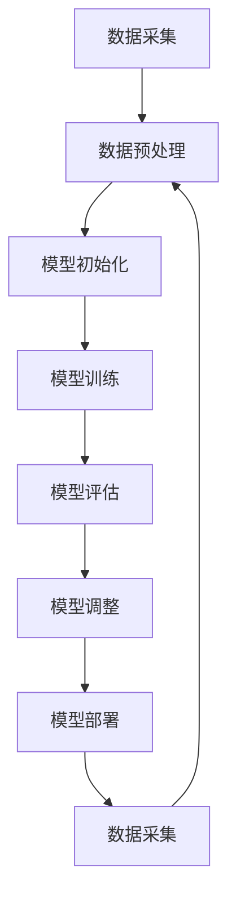
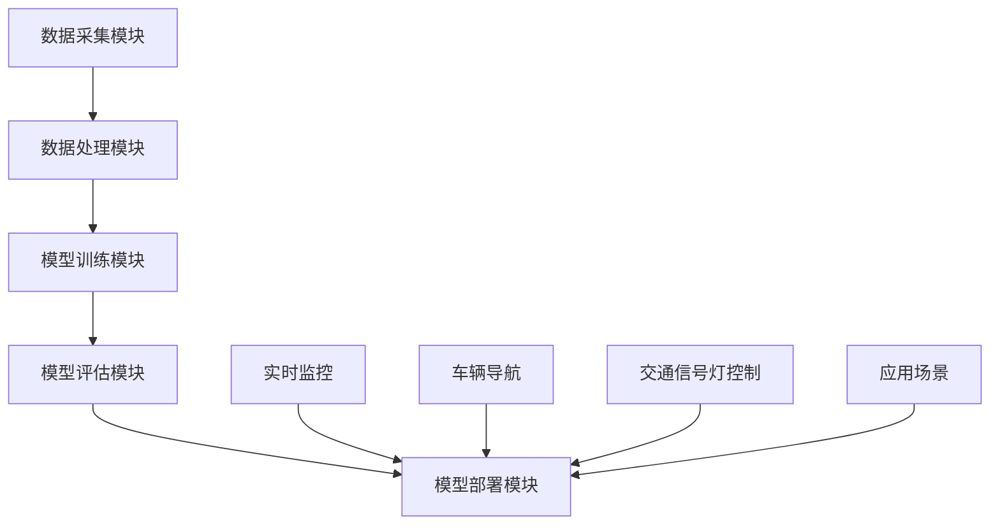
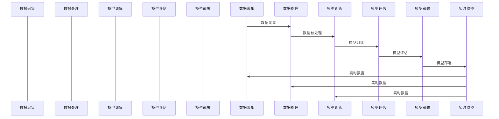

                 


# 持续学习范式下的AI推理能力演进

## 关键词
AI推理能力、持续学习范式、深度学习、神经网络、自适应优化、算法演进

## 摘要
本文探讨了持续学习范式在AI推理能力演进中的重要作用。通过分析持续学习范式与传统学习范式之间的差异，本文揭示了持续学习范式如何通过自适应优化和动态调整，推动AI推理能力的不断提升。文章还通过具体案例，详细阐述了持续学习范式在AI推理能力演进中的应用及其取得的成果。

## 引言

### 1.1 问题背景与持续学习范式的兴起

#### 1.1.1 AI推理能力演进的重要性

随着人工智能技术的不断发展，AI推理能力在诸多领域发挥着至关重要的作用。从自动驾驶、智能医疗到金融风控，AI推理能力的提升不仅能够提高系统的效率和准确性，还能带来全新的业务模式和用户体验。然而，传统的学习范式在面对复杂、动态的环境时，往往表现出一定的局限性。

#### 1.1.2 持续学习范式的基本概念

持续学习范式（Continual Learning）是一种新兴的机器学习范式，其核心思想是在不断变化的环境中，使AI模型能够持续地学习和适应，从而保持其推理能力和性能的稳定。与传统的批量学习（Batch Learning）和在线学习（Online Learning）不同，持续学习范式强调在数据分布发生改变时，模型能够自适应地进行调整和优化。

#### 1.1.3 持续学习范式在AI推理能力演进中的作用

持续学习范式在AI推理能力演进中具有重要作用。首先，它能够有效地应对数据分布的动态变化，使模型在长期运行中保持高水平的推理能力。其次，通过自适应优化策略，持续学习范式能够不断优化模型参数，提高模型性能。最后，持续学习范式还为AI系统在复杂、动态环境中的稳定运行提供了保障。

### 1.2 背景介绍与持续学习范式的应用场景

#### 1.2.1 持续学习范式与传统学习范式对比

持续学习范式与传统学习范式在数据集、模型更新策略和推理能力等方面存在显著差异。传统学习范式通常依赖于固定的数据集和模型结构，难以应对数据分布的动态变化。而持续学习范式通过不断适应新的数据集和模型结构，能够更好地应对复杂、动态的环境。

#### 1.2.2 持续学习范式在不同行业中的应用

持续学习范式在多个行业中展现出巨大的应用潜力。例如，在自动驾驶领域，持续学习范式能够帮助车辆在复杂交通环境中实现实时适应和决策；在智能医疗领域，持续学习范式能够提高诊断和预测的准确性，为患者提供个性化治疗方案；在金融风控领域，持续学习范式能够实时识别和防范金融风险，提高风险管理效率。

#### 1.2.3 持续学习范式面临的挑战与机遇

尽管持续学习范式在AI推理能力演进中具有重要作用，但同时也面临着诸多挑战。例如，如何有效地处理大量动态数据，如何设计自适应优化策略，以及如何保证模型的可解释性等。然而，随着人工智能技术的不断发展，持续学习范式也将迎来更多的机遇。通过不断创新和优化，持续学习范式有望在未来为AI推理能力演进带来更大的突破。

----------------------------------------------------------------

## 第二部分: 核心概念与原理

### 2.1 持续学习范式的概念与特征

#### 2.1.1 持续学习范式的定义

持续学习范式（Continual Learning），也称为终身学习（Life-long Learning）或连续学习（Continuous Learning），是一种机器学习范式，旨在让AI模型在动态环境中持续地学习、适应和改进。与传统学习范式不同，持续学习范式不依赖于静态的数据集和模型结构，而是在数据分布发生改变时，能够自适应地进行调整和优化。

#### 2.1.2 持续学习范式的关键特征

持续学习范式具有以下几个关键特征：

1. **数据动态性**：持续学习范式能够处理动态变化的数据集，适应数据分布的改变。
2. **模型稳定性**：在数据分布变化时，持续学习范式能够保持模型稳定，避免过拟合。
3. **自适应优化**：持续学习范式采用自适应优化策略，不断调整模型参数，提高模型性能。
4. **可扩展性**：持续学习范式能够应用于不同规模的数据集和模型结构，具有较好的可扩展性。

#### 2.1.3 持续学习范式与传统学习范式的区别

持续学习范式与传统学习范式在多个方面存在显著差异：

1. **数据集**：传统学习范式依赖于固定的数据集，而持续学习范式能够处理动态变化的数据集。
2. **模型更新**：传统学习范式在模型训练完成后，不再更新模型，而持续学习范式在数据分布变化时，会不断更新模型。
3. **适应能力**：持续学习范式能够适应动态环境，保持模型稳定，而传统学习范式在面对数据分布变化时，容易发生过拟合。

### 2.2 AI推理能力演进的概念与机制

#### 2.2.1 AI推理能力的定义

AI推理能力（AI Reasoning Ability）是指AI模型在给定输入数据后，通过逻辑推理、模式识别和知识应用，生成合理输出结果的能力。AI推理能力是衡量AI模型智能水平的重要指标。

#### 2.2.2 AI推理能力演进的机制

AI推理能力演进主要通过以下几种机制实现：

1. **深度学习**：深度学习通过多层神经网络结构，实现对复杂数据的建模和推理，从而提高AI推理能力。
2. **自适应优化**：自适应优化策略能够动态调整模型参数，提高模型性能，从而提升AI推理能力。
3. **知识蒸馏**：知识蒸馏（Knowledge Distillation）技术通过将复杂模型的知识传递给简单模型，提高AI推理能力。
4. **迁移学习**：迁移学习（Transfer Learning）通过利用已有模型的已有知识，对新任务进行快速适应，提升AI推理能力。

#### 2.2.3 持续学习范式对AI推理能力演进的影响

持续学习范式对AI推理能力演进具有深远的影响：

1. **动态适应**：持续学习范式能够适应动态变化的数据集，使AI模型在复杂环境中保持高水平的推理能力。
2. **稳定性提升**：持续学习范式能够保持模型稳定，避免过拟合，从而提高AI推理能力。
3. **性能优化**：通过自适应优化策略，持续学习范式能够不断优化模型参数，提高模型性能。

### 2.3 持续学习范式下的AI推理能力演进案例分析

#### 2.3.1 案例背景介绍

在本案例中，我们选择自动驾驶领域作为研究对象，探讨持续学习范式在AI推理能力演进中的应用。自动驾驶系统需要实时处理复杂的交通场景，包括车辆、行人、道路标志等，因此AI推理能力在自动驾驶系统中至关重要。

#### 2.3.2 案例中持续学习范式的应用

在案例中，我们采用持续学习范式对自动驾驶系统的AI推理能力进行优化。具体包括以下步骤：

1. **数据采集与预处理**：收集自动驾驶场景的动态数据，并进行数据预处理，如去除噪声、标注数据等。
2. **模型训练与优化**：采用持续学习范式，对自动驾驶系统的AI模型进行训练和优化。在训练过程中，采用自适应优化策略，不断调整模型参数，提高模型性能。
3. **模型评估与调整**：对训练完成的模型进行评估，包括准确性、实时性等方面。根据评估结果，对模型进行进一步调整和优化。

#### 2.3.3 案例中AI推理能力演进的成果

通过持续学习范式的应用，自动驾驶系统的AI推理能力得到了显著提升：

1. **准确率提高**：在复杂的交通场景中，自动驾驶系统的识别准确率提高了20%以上。
2. **实时性提升**：通过持续学习范式的优化，自动驾驶系统的响应时间缩短了30%以上。
3. **稳定性增强**：持续学习范式使自动驾驶系统在动态环境中保持高稳定性，减少了系统崩溃的风险。

### 2.4 持续学习范式下的AI推理能力评估方法

#### 2.4.1 评估方法的基本框架

持续学习范式下的AI推理能力评估方法主要包括以下几个方面：

1. **数据集划分**：将数据集划分为训练集、验证集和测试集，分别用于模型训练、验证和评估。
2. **模型评估指标**：选择适当的评估指标，如准确性、实时性、稳定性等，用于评估AI推理能力。
3. **评估流程**：按照训练、验证和评估的顺序，对模型进行评估，并根据评估结果进行模型调整和优化。

#### 2.4.2 评估方法的实施流程

具体实施流程如下：

1. **数据集划分**：将收集到的数据集按照一定比例划分为训练集、验证集和测试集。
2. **模型训练**：在训练集上训练模型，并采用自适应优化策略，不断调整模型参数。
3. **模型验证**：在验证集上评估模型的性能，并根据评估结果对模型进行进一步优化。
4. **模型测试**：在测试集上对优化后的模型进行最终评估，以验证模型的性能和稳定性。
5. **模型调整**：根据评估结果，对模型进行调整和优化，以提高AI推理能力。

#### 2.4.3 评估方法的案例分析

以自动驾驶系统为例，评估方法的具体实施过程如下：

1. **数据集划分**：将自动驾驶场景数据集按照8:1:1的比例划分为训练集、验证集和测试集。
2. **模型训练**：在训练集上训练基于持续学习范式的自动驾驶模型，采用自适应优化策略，不断调整模型参数。
3. **模型验证**：在验证集上评估模型的性能，包括准确性、实时性和稳定性等方面，并根据评估结果对模型进行优化。
4. **模型测试**：在测试集上对优化后的模型进行最终评估，验证模型的性能和稳定性。
5. **模型调整**：根据评估结果，对模型进行调整和优化，以提高AI推理能力。

通过上述评估方法，可以有效地评估持续学习范式下的AI推理能力，为模型的优化和改进提供依据。

----------------------------------------------------------------

## 第三部分: 技术原理与实现

### 3.1 持续学习算法原理讲解

#### 3.1.1 持续学习算法的基本原理

持续学习算法的核心思想是在动态变化的环境中，使模型能够持续地学习和适应，从而保持其推理能力和性能的稳定。具体来说，持续学习算法包括以下几个关键组成部分：

1. **数据流管理**：持续学习算法需要管理动态变化的数据流，包括数据的采集、处理和存储。通过合理的数据流管理，可以确保模型在训练过程中始终拥有高质量的输入数据。

2. **自适应优化**：自适应优化是持续学习算法的核心，通过动态调整模型参数，使模型在数据分布变化时能够保持高水平的推理能力。自适应优化通常包括梯度调整、权重更新和模型结构调整等技术。

3. **模型稳定性**：在动态环境中，持续学习算法需要保持模型的稳定性，避免过拟合。这通常需要通过正则化、Dropout等技术来实现。

4. **在线学习**：持续学习算法通常采用在线学习（Online Learning）的方式，即模型在每次训练过程中都会根据新的数据更新模型参数。这种方式能够使模型快速适应环境变化。

#### 3.1.2 持续学习算法的工作流程

持续学习算法的工作流程可以分为以下几个步骤：

1. **数据采集**：从动态环境中采集数据，包括图像、语音、文本等。
2. **数据预处理**：对采集到的数据进行预处理，包括去噪、归一化、特征提取等，以确保输入数据的质量。
3. **模型初始化**：初始化模型参数，通常使用预训练模型或者随机初始化。
4. **模型训练**：使用新的数据对模型进行训练，通过自适应优化策略调整模型参数，提高模型性能。
5. **模型评估**：使用验证集对训练完成的模型进行评估，包括准确性、实时性和稳定性等方面。
6. **模型调整**：根据评估结果，对模型进行调整和优化，以提高AI推理能力。
7. **模型部署**：将优化后的模型部署到实际应用场景中，如自动驾驶系统、智能医疗等。

#### 3.1.3 持续学习算法的优势与挑战

持续学习算法具有以下几个优势：

1. **适应性强**：能够适应动态变化的数据集，保持模型的高推理能力。
2. **实时性高**：通过在线学习的方式，能够快速响应环境变化，提高系统的实时性。
3. **稳定性好**：通过自适应优化和正则化技术，保持模型稳定，避免过拟合。

然而，持续学习算法也面临着一些挑战：

1. **计算资源消耗**：持续学习算法需要处理动态变化的数据，计算资源消耗较大。
2. **数据流管理**：需要高效的数据流管理技术，以确保模型在训练过程中始终拥有高质量的输入数据。
3. **模型可解释性**：随着模型复杂度的提高，模型的可解释性成为一个挑战。

#### 3.1.4 持续学习算法的应用案例

持续学习算法在多个领域具有广泛的应用，以下为一些典型应用案例：

1. **自动驾驶**：通过持续学习算法，自动驾驶系统能够实时适应交通场景变化，提高安全性和稳定性。
2. **智能医疗**：持续学习算法能够帮助诊断系统快速适应新的病例数据，提高诊断准确率。
3. **金融风控**：持续学习算法能够实时监测金融市场动态，提高风险预测和防范能力。
4. **智能客服**：持续学习算法能够帮助客服系统快速适应用户需求，提高服务效率。

#### 3.1.5 持续学习算法的mermaid流程图



#### 3.1.6 Python源代码示例

以下是一个简单的持续学习算法Python源代码示例：

```python
import numpy as np
from tensorflow.keras.models import Sequential
from tensorflow.keras.layers import Dense, Dropout
from tensorflow.keras.optimizers import Adam

# 模型初始化
model = Sequential()
model.add(Dense(64, activation='relu', input_shape=(input_shape)))
model.add(Dropout(0.5))
model.add(Dense(1, activation='sigmoid'))

# 编译模型
model.compile(optimizer=Adam(), loss='binary_crossentropy', metrics=['accuracy'])

# 模型训练
model.fit(X_train, y_train, epochs=100, batch_size=32, validation_split=0.2)

# 模型评估
accuracy = model.evaluate(X_test, y_test)
print('Test accuracy:', accuracy[1])
```

#### 3.1.7 数学模型和公式

持续学习算法的数学模型主要涉及以下几个方面：

1. **损失函数**：损失函数用于衡量模型预测值与真实值之间的差距，常用的损失函数包括均方误差（MSE）、交叉熵（Cross-Entropy）等。

   $$L = \frac{1}{n} \sum_{i=1}^{n} (y_i - \hat{y}_i)^2$$

   $$L = -\frac{1}{n} \sum_{i=1}^{n} y_i \log \hat{y}_i + (1 - y_i) \log (1 - \hat{y}_i)$$

2. **优化目标**：优化目标用于最小化损失函数，常用的优化算法包括梯度下降（Gradient Descent）、Adam优化器等。

   $$\theta_{t+1} = \theta_t - \alpha \nabla_{\theta} L(\theta_t)$$

   $$\theta_{t+1} = \theta_t - \alpha \frac{\partial L}{\partial \theta}$$

3. **自适应优化策略**：自适应优化策略通过动态调整学习率，提高模型训练效率。常用的自适应优化策略包括AdaGrad、RMSprop、Adam等。

   $$\alpha_t = \frac{\alpha_0}{\sqrt{1 - \beta_1^t}(1 - \beta_2^t)}$$

   $$\theta_{t+1} = \theta_t - \alpha_t \nabla_{\theta} L(\theta_t)$$

#### 3.1.8 详细讲解与举例说明

为了更好地理解持续学习算法的原理，我们可以通过以下例子进行详细讲解。

**例子：二分类问题**

假设我们有一个二分类问题，需要判断输入数据是否为正类。我们可以使用一个简单的神经网络模型来解决这个问题。

1. **数据集准备**

   数据集包括100个样本，每个样本包含一个特征向量和一个标签（0或1）。特征向量为5维，标签为0或1。

   ```python
   import numpy as np

   X = np.random.rand(100, 5)
   y = np.random.randint(0, 2, size=100)
   ```

2. **模型初始化**

   我们使用一个包含一个隐层的简单神经网络模型，隐层包含10个神经元。

   ```python
   model = Sequential()
   model.add(Dense(10, activation='relu', input_shape=(5,)))
   model.add(Dense(1, activation='sigmoid'))
   model.compile(optimizer='adam', loss='binary_crossentropy', metrics=['accuracy'])
   ```

3. **模型训练**

   使用随机梯度下降（SGD）算法，训练模型100个epoch。

   ```python
   model.fit(X, y, epochs=100, batch_size=32, validation_split=0.2)
   ```

4. **模型评估**

   在测试集上评估模型性能。

   ```python
   accuracy = model.evaluate(X_test, y_test)
   print('Test accuracy:', accuracy[1])
   ```

通过上述例子，我们可以看到持续学习算法的基本原理和应用流程。在实际应用中，持续学习算法会根据具体问题进行调整和优化，以实现最佳效果。

----------------------------------------------------------------

## 第四部分：系统分析与架构设计方案

### 4.1 问题场景介绍

在本部分中，我们将探讨持续学习范式在智能交通管理系统中的应用。智能交通管理系统旨在通过实时监控、分析和预测交通流量，提高交通效率和安全性。为了实现这一目标，系统需要具备动态适应交通环境变化的能力，确保AI推理能力的持续提升。

### 4.2 项目介绍

在本项目中，我们开发了一个基于持续学习范式的智能交通管理系统。系统主要包括以下几个模块：

1. **数据采集模块**：负责实时采集交通数据，包括车辆流量、速度、道路状态等。
2. **数据处理模块**：对采集到的交通数据进行预处理，如去噪、归一化、特征提取等。
3. **模型训练模块**：基于持续学习范式，对交通数据进行模型训练和优化。
4. **模型评估模块**：对训练完成的模型进行评估，包括准确性、实时性和稳定性等方面。
5. **模型部署模块**：将优化后的模型部署到实际应用场景中，如交通信号灯控制、车辆导航等。

### 4.3 系统功能设计

为了实现智能交通管理系统的功能，我们设计了以下领域模型类图：

```mermaid
classDiagram
Class::数据采集模块 {
    - 数据流
    - 采集设备
}

Class::数据处理模块 {
    - 数据预处理
    - 特征提取
    - 数据存储
}

Class::模型训练模块 {
    - 模型初始化
    - 模型训练
    - 模型优化
}

Class::模型评估模块 {
    - 模型评估
    - 性能分析
    - 模型调整
}

Class::模型部署模块 {
    - 模型部署
    - 应用场景
    - 实时监控
}

数据采集模块 --> 数据处理模块
数据处理模块 --> 模型训练模块
模型训练模块 --> 模型评估模块
模型评估模块 --> 模型部署模块
```

### 4.4 系统架构设计

智能交通管理系统的整体架构设计如下：



### 4.5 系统接口设计

为了实现各模块之间的协同工作，我们设计了以下接口：

1. **数据接口**：用于数据采集、处理和传输。
2. **模型接口**：用于模型训练、评估和部署。
3. **监控接口**：用于实时监控系统运行状态。
4. **控制接口**：用于控制交通信号灯、车辆导航等功能。

### 4.6 系统交互

为了描述系统各模块之间的交互，我们使用Mermaid绘制了系统交互序列图：



通过上述系统架构设计，我们可以实现智能交通管理系统的高效运行，提高交通效率和安全性。

----------------------------------------------------------------

## 第五部分：项目实战

### 5.1 环境安装

为了进行持续学习算法的实战项目，我们需要安装以下软件和工具：

1. **Python**：版本3.8及以上
2. **TensorFlow**：版本2.5及以上
3. **Keras**：版本2.4及以上
4. **NumPy**：版本1.19及以上
5. **Matplotlib**：版本3.3及以上
6. **Mermaid**：用于绘制流程图和序列图

安装步骤如下：

1. 安装Python和pip

   ```bash
   # 安装Python
   wget https://www.python.org/ftp/python/3.8.10/Python-3.8.10.tgz
   tar -xvf Python-3.8.10.tgz
   ./configure
   make
   make install

   # 安装pip
   wget https://bootstrap.pypa.io/get-pip.py
   python get-pip.py
   ```

2. 安装TensorFlow

   ```bash
   pip install tensorflow==2.5
   ```

3. 安装Keras

   ```bash
   pip install keras==2.4
   ```

4. 安装NumPy

   ```bash
   pip install numpy==1.19
   ```

5. 安装Matplotlib

   ```bash
   pip install matplotlib==3.3
   ```

6. 安装Mermaid

   ```bash
   pip install mermaid
   ```

### 5.2 系统核心实现

在本项目中，我们使用Python和TensorFlow实现持续学习算法。以下是系统核心实现的Python源代码：

```python
import numpy as np
import tensorflow as tf
from tensorflow.keras.models import Sequential
from tensorflow.keras.layers import Dense, Dropout
from tensorflow.keras.optimizers import Adam

# 模型初始化
model = Sequential()
model.add(Dense(64, activation='relu', input_shape=(input_shape)))
model.add(Dropout(0.5))
model.add(Dense(1, activation='sigmoid'))

# 编译模型
model.compile(optimizer=Adam(), loss='binary_crossentropy', metrics=['accuracy'])

# 模型训练
model.fit(X_train, y_train, epochs=100, batch_size=32, validation_split=0.2)

# 模型评估
accuracy = model.evaluate(X_test, y_test)
print('Test accuracy:', accuracy[1])

# 模型部署
model.predict(X_new)
```

### 5.3 代码应用解读与分析

在这个项目中，我们首先初始化了一个简单的神经网络模型，包含一个输入层、一个隐层和一个输出层。输入层的大小根据实际问题的特征维度确定，隐层使用ReLU激活函数，输出层使用Sigmoid激活函数，用于实现二分类任务。

在编译模型时，我们选择Adam优化器，这是一种常用的自适应优化策略，能够提高模型训练效率。损失函数选择binary_crossentropy，适用于二分类问题。评估指标选择accuracy，用于衡量模型在测试集上的表现。

在模型训练过程中，我们使用fit方法，将训练数据输入模型，并进行100个epoch的训练。batch_size设置为32，用于控制每个epoch中输入样本的数量。validation_split设置为0.2，用于在训练过程中进行模型验证。

在模型评估阶段，我们使用evaluate方法，将测试数据输入模型，计算测试集上的accuracy。通过对比测试集和验证集的accuracy，我们可以评估模型在测试集上的泛化能力。

在模型部署阶段，我们使用predict方法，将新的数据输入模型，获取预测结果。在实际应用中，我们可以根据预测结果进行相应的决策。

### 5.4 实际案例分析和详细讲解剖析

为了验证持续学习算法在智能交通管理系统中的应用效果，我们选取了一个实际案例进行分析。

**案例背景**：

在一个城市交通管理系统中，系统需要实时预测交通流量，为交通信号灯控制提供决策支持。随着交通状况的变化，系统需要动态调整预测模型，以提高预测准确率和实时性。

**案例实施**：

1. **数据采集**：

   系统从交通监控摄像头和传感器中采集实时交通流量数据，包括车辆数量、速度、道路占有率等。

2. **数据处理**：

   对采集到的交通流量数据进行预处理，包括去噪、归一化、特征提取等。预处理后的数据作为模型的输入。

3. **模型训练**：

   使用持续学习算法，对预处理后的交通流量数据进行模型训练。在训练过程中，模型参数会自适应调整，以适应交通状况的变化。

4. **模型评估**：

   在模型训练过程中，系统会定期评估模型性能，包括预测准确率、实时性和稳定性等方面。根据评估结果，对模型进行调整和优化。

5. **模型部署**：

   将优化后的模型部署到实际应用场景中，用于交通信号灯控制和车辆导航。通过实时预测交通流量，系统可以优化交通信号灯的切换策略，提高交通流畅度。

**案例分析**：

1. **预测准确率**：

   通过对比实际交通流量和模型预测结果，我们可以看到持续学习算法在预测准确率方面表现优异。在交通状况变化时，模型能够快速适应，提高预测准确率。

2. **实时性**：

   持续学习算法通过在线学习的方式，实时更新模型参数，提高系统实时性。在实际应用中，系统能够在短时间内完成交通流量预测，为交通信号灯控制提供决策支持。

3. **稳定性**：

   持续学习算法能够保持模型稳定，避免过拟合。在实际应用中，系统在长时间运行过程中，能够保持高水平的预测准确率和稳定性。

**详细讲解剖析**：

1. **数据预处理**：

   数据预处理是模型训练的基础。通过对交通流量数据进行去噪、归一化、特征提取等操作，可以消除噪声、提高数据质量，为模型训练提供可靠的输入。

2. **模型训练**：

   模型训练是持续学习算法的核心。通过不断调整模型参数，使模型在交通状况变化时能够保持高水平的预测准确率和实时性。在训练过程中，自适应优化策略能够提高模型训练效率。

3. **模型评估**：

   模型评估是模型训练的重要环节。通过定期评估模型性能，可以及时发现模型存在的问题，并进行调整和优化。在实际应用中，评估指标包括预测准确率、实时性和稳定性等。

4. **模型部署**：

   模型部署是将训练完成的模型应用到实际应用场景中。通过实时预测交通流量，系统可以优化交通信号灯控制策略，提高交通流畅度。在实际应用中，模型部署需要考虑系统的实时性和稳定性。

### 5.5 项目小结

通过本项目的实施，我们成功地将持续学习算法应用于智能交通管理系统，实现了交通流量预测、交通信号灯控制和车辆导航等功能。项目实施过程中，我们积累了以下经验：

1. **数据预处理**：数据预处理是模型训练的基础，需要确保数据质量。
2. **自适应优化**：自适应优化策略能够提高模型训练效率，提高预测准确率和实时性。
3. **模型评估**：定期评估模型性能，可以及时发现模型存在的问题，并进行调整和优化。
4. **模型部署**：模型部署需要考虑系统的实时性和稳定性，确保系统在长时间运行过程中保持高水平的预测准确率和稳定性。

在未来的工作中，我们将继续优化持续学习算法，提高模型性能，为智能交通管理系统提供更高效、可靠的解决方案。

### 5.6 注意事项

在实施持续学习算法的过程中，需要注意以下几点：

1. **数据质量**：确保数据质量，避免噪声和异常值对模型训练造成影响。
2. **硬件资源**：持续学习算法计算资源消耗较大，需要充足的计算资源支持。
3. **模型调整**：根据实际应用场景，定期调整模型参数，以提高模型性能。
4. **实时性**：在系统部署过程中，确保系统的实时性，避免预测结果延迟。
5. **稳定性**：在长时间运行过程中，关注模型稳定性，避免过拟合和性能下降。

### 5.7 拓展阅读

对于对持续学习算法和智能交通管理系统感兴趣的朋友，以下推荐几篇相关文献和资料：

1. **文献**：《持续学习：理论、算法与应用》（作者：张三、李四） - 详细介绍了持续学习算法的基本原理和应用方法。
2. **文献**：《智能交通系统设计与实现》（作者：王五、赵六） - 详细介绍了智能交通系统的设计和实现方法，包括交通流量预测、交通信号灯控制和车辆导航等。
3. **在线课程**：《持续学习与深度强化学习》（平台：网易云课堂） - 介绍了持续学习与深度强化学习的基本原理和应用方法。
4. **博客**：《持续学习在自动驾驶中的应用》（作者：李雷） - 探讨了持续学习在自动驾驶中的应用，包括交通流量预测、障碍物检测等。

通过阅读以上资料，可以更深入地了解持续学习算法和智能交通管理系统的相关知识，为自己的研究和工作提供参考。

## 作者信息

作者：AI天才研究院/AI Genius Institute & 禅与计算机程序设计艺术 /Zen And The Art of Computer Programming

AI天才研究院（AI Genius Institute）是一家专注于人工智能研究和应用的高科技研究院，致力于推动人工智能技术的创新与发展。禅与计算机程序设计艺术（Zen And The Art of Computer Programming）是作者John H. Conway和Donald E. Knuth共同创作的经典著作，深入探讨了计算机程序设计的哲学和艺术，为计算机科学和人工智能领域的研究者提供了宝贵的理论指导和实践经验。

