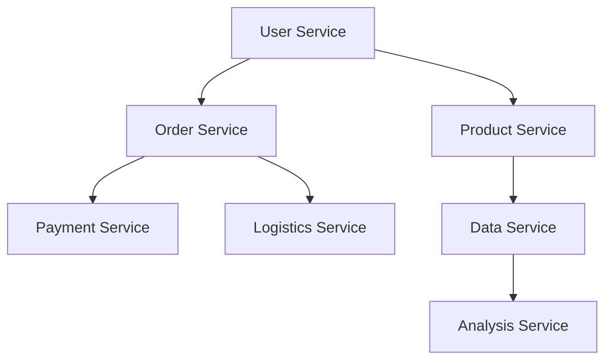
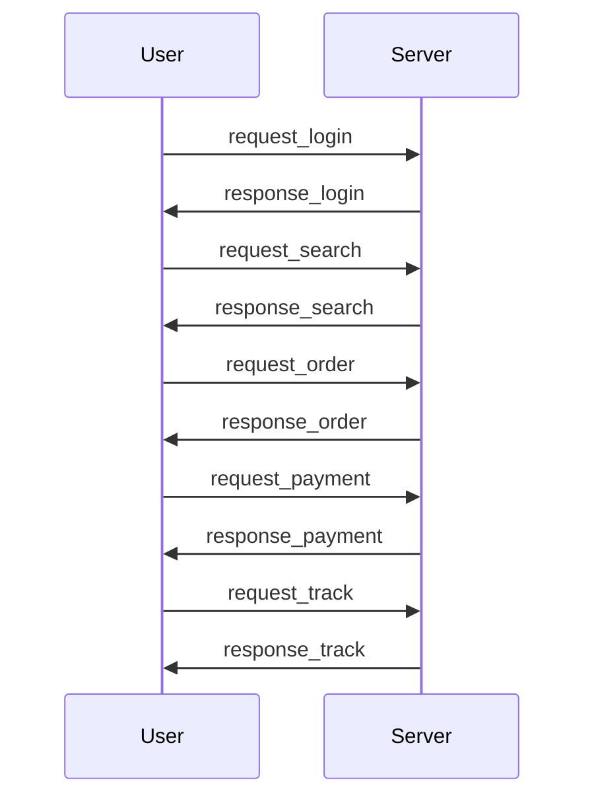

                 

### 掌控人生方向：成为自己的生命舵手

在科技的飞速发展和信息爆炸的时代，我们每个人都面临着无尽的挑战和选择。如何在这个复杂多变的环境中找到自己的定位，掌握人生航向，成为自己的生命舵手，是每个人都需要深思的问题。本文旨在通过逻辑清晰、结构紧凑的论述，帮助读者理解并掌握人生导航的法则，从而在生活的每一个阶段都能做出明智的选择。

**关键词**：人生导航、自我认知、时间管理、沟通与表达、人际关系、情绪管理、成长与自我提升

**摘要**：本文从自我探索、时间管理、沟通与表达、人际关系管理、情绪管理以及人生规划和决策等多个维度，详细阐述了如何通过系统的方法和策略，掌控人生方向，成为自己的生命舵手。文章采用逐步分析推理的方式，结合实际案例，旨在为读者提供一套实用有效的人生导航指南。

### 第一部分：人生导航法则

在人生旅途中，掌握导航法则至关重要。本部分将探讨自我探索、时间管理和效率提升，为读者提供一套系统化的人生导航法则。

#### 第1章：自我探索之旅

在人生的起始阶段，自我探索是至关重要的。只有了解自己，才能找到人生的方向。本章将探讨如何通过心理测试、日记记录和反思等方法，进行自我探索，明确自己的定位和目标。

##### 1.1 问题的提出

在现代社会中，许多人感到迷茫和困惑。他们不知道自己的兴趣所在，也不知道未来应该如何规划。这种困惑源于缺乏自我认知，无法找到自己的定位。因此，自我认知的重要性不言而喻。

##### 1.1.1 人生的困惑与迷茫

人生的困惑和迷茫常常表现为以下几种情况：
1. **目标不明确**：许多人不知道自己的长期目标和短期目标，导致行动缺乏方向。
2. **价值观模糊**：价值观的模糊使得个体难以做出符合自己信念和原则的选择。
3. **职业选择困惑**：在众多职业选择面前，很多人难以确定哪个职业最适合自己。
4. **人际关系困境**：缺乏自我认知导致难以与他人建立深层次的人际关系。

##### 1.1.2 自我认知的重要性

自我认知是指个体对自己的认识和理解，包括自己的性格、兴趣、价值观、能力等。自我认知的重要性体现在以下几个方面：
1. **目标设定**：自我认知有助于明确自己的兴趣和价值观，从而设定明确的人生目标。
2. **决策支持**：在面临选择时，自我认知能够提供重要的参考信息，帮助做出明智的决策。
3. **心理健康**：自我认知有助于个体更好地理解自己的情绪和行为，从而提高心理健康水平。
4. **职业发展**：自我认知有助于个体找到最适合自己的职业路径，实现职业生涯的顺利发展。

##### 1.1.3 探索自我的第一步

要开始自我探索，首先需要从以下几个方面入手：
1. **心理测试**：通过专业的心理测试工具，了解自己的性格、兴趣和优势。
2. **日记记录**：通过记录日常生活，反思自己的行为和情绪，深入理解自己的内心世界。
3. **反思与总结**：定期进行反思和总结，回顾过去的行为和经历，从中发现自我认知的线索。

##### 1.2 自我认知的方法

自我认知的方法多种多样，以下是一些常用的方法：
1. **心理测试与评估**：心理测试是一种科学的方法，可以帮助个体了解自己的性格类型、兴趣爱好和职业倾向。常见的心理测试包括MBTI、DISC等。
2. **日记记录与分析**：通过日记记录，个体可以深入了解自己的内心世界，分析自己的情绪和行为模式。
3. **反思与总结**：反思是一种深刻的自我认知过程，通过回顾过去的经历，个体可以更好地理解自己的行为动机和价值观。

##### 1.2.1 心理测试与评估

心理测试是一种通过标准化的测试工具，对个体性格、能力、兴趣等进行评估的方法。常见的心理测试包括：
1. **MBTI（迈尔斯-布里格斯性格类型指标）**：MBTI是一种基于心理学理论的性格测试，通过了解个体的性格类型，帮助个体更好地理解自己和他人。
2. **DISC测试**：DISC测试是一种评估个体行为风格的测试，通过分析个体的行为特征，帮助个体找到最适合的职业路径。

##### 1.2.2 日记记录与分析

日记记录是一种简单而有效的方法，可以帮助个体深入自己的内心世界。通过记录日常生活、情绪变化、思考内容等，个体可以更好地了解自己的需求和欲望。以下是一些日记记录的技巧：
1. **定期记录**：每天或每周定期记录，可以帮助个体建立稳定的心智模式。
2. **详细描述**：在日记中详细描述自己的情绪、想法和行为，有助于深入分析。
3. **反思与总结**：在记录后，定期进行反思和总结，从中学到经验教训。

##### 1.2.3 反思与总结

反思是一种通过回顾过去，理解现在，规划未来的过程。以下是一些反思与总结的技巧：
1. **定期反思**：每周或每月定期反思，可以帮助个体了解自己的进步和不足。
2. **写反思日记**：将反思过程记录下来，有助于加深理解和记忆。
3. **设定目标**：在反思中设定新的目标和计划，为未来的发展指明方向。

##### 1.3 自我定位与目标设定

自我定位和目标设定是自我认知的重要环节。以下是一些关键点：

##### 1.3.1 自我定位的必要性

自我定位是指个体明确自己在社会中的角色和位置。自我定位的必要性体现在以下几个方面：
1. **职业发展**：明确的自我定位有助于个体选择适合自己的职业路径，实现职业发展。
2. **人际关系**：自我定位有助于个体更好地理解自己的需求，与他人建立更健康的人际关系。
3. **生活质量**：明确的自我定位有助于个体提高生活质量，实现个人价值。

##### 1.3.2 设定人生目标的步骤

设定人生目标是一个系统化的过程，以下是一些关键步骤：
1. **明确目标类型**：人生目标可以分为短期目标、中期目标和长期目标。
2. **设定具体目标**：目标要具体、可衡量，例如“在两年内升职”或“在五年内创业”。
3. **制定行动计划**：为实现目标，需要制定具体的行动计划，包括步骤、资源和时间表。
4. **定期评估与调整**：在实现目标的过程中，定期评估进展，根据实际情况进行调整。

##### 1.3.3 目标实现的策略

实现人生目标需要一系列策略和方法。以下是一些有效的策略：
1. **时间管理**：合理安排时间，确保目标实现所需的资源得到充分利用。
2. **持续学习**：不断提升自己的知识和技能，为目标的实现提供支持。
3. **积极心态**：保持积极的心态，面对困难和挑战时保持坚定的信念。
4. **寻求支持**：在实现目标的过程中，寻求家人、朋友和同事的支持和帮助。

#### 第2章：时间管理与效率提升

时间管理和效率提升是掌控人生方向的关键。本章将探讨时间管理的重要性、方法以及提升工作效率的策略。

##### 2.1 时间管理的重要性

时间管理是指通过合理安排时间，最大化利用时间资源，实现个人和职业目标的过程。时间管理的重要性体现在以下几个方面：
1. **提高生产力**：合理安排时间，可以显著提高工作效率和生产力。
2. **减少压力**：有效的时间管理有助于减少工作压力和焦虑，提高生活质量。
3. **实现目标**：通过合理分配时间，可以确保个人和职业目标的实现。
4. **平衡工作与生活**：时间管理有助于在繁忙的工作中找到平衡，实现工作与生活的平衡。

##### 2.1.1 时间的本质

时间是连续的、不可逆的流动过程，是衡量事件发生先后和持续长度的基本单位。时间的本质包括以下几个方面：
1. **有限性**：时间是有限的资源，每个人每天只有24小时。
2. **连续性**：时间是一个连续的流动过程，每一刻都有其独特的价值和意义。
3. **灵活性**：通过合理安排时间，可以灵活调整时间和活动安排，实现最佳效果。

##### 2.1.2 时间管理的重要性

时间管理在个人和职业生活中具有重要意义。以下是一些关键点：
1. **提高工作效率**：通过合理安排时间，可以最大限度地提高工作效率，减少无效工作。
2. **减少拖延**：有效的时间管理有助于克服拖延症，确保任务按时完成。
3. **增强决策能力**：时间管理有助于在有限的时间内做出明智的决策，提高决策质量。
4. **改善生活质量**：通过合理分配时间，可以确保工作与生活的平衡，提高生活质量。

##### 2.1.3 时间管理的误区

虽然时间管理具有重要意义，但很多人在实践过程中容易陷入一些误区。以下是一些常见的时间管理误区：
1. **过度追求完美**：过分追求完美可能导致时间浪费在细节上，影响整体进度。
2. **忽略休息与恢复**：长时间工作可能导致疲劳和效率下降，休息与恢复是时间管理的重要组成部分。
3. **过度依赖工具**：虽然工具可以辅助时间管理，但过度依赖工具可能导致忽视自身的时间管理能力。
4. **忽略个人兴趣与需求**：时间管理不应忽视个人兴趣和需求，否则可能导致生活失衡。

##### 2.2 时间管理的方法

时间管理的方法多种多样，以下是一些常用且有效的方法：
1. **优先级矩阵法**：通过将任务按照重要性和紧急性进行分类，合理安排时间。
2. **计划与执行**：制定详细的计划和行动步骤，确保任务按时完成。
3. **持续改进与反思**：定期反思时间管理的效果，不断调整和优化方法。

##### 2.2.1 优先级矩阵法

优先级矩阵法是一种通过将任务按照重要性和紧急性进行分类，合理安排时间的方法。具体步骤如下：
1. **确定任务**：列出所有需要完成的任务。
2. **评估重要性**：为每个任务评估其重要性，从高到低排序。
3. **评估紧急性**：为每个任务评估其紧急性，从高到低排序。
4. **分类与安排**：将任务分为四个象限，分别表示重要且紧急、重要但不紧急、不重要但紧急和不重要且不紧急的任务。优先处理重要且紧急的任务，然后是重要但不紧急的任务，依次类推。

##### 2.2.2 计划与执行

计划与执行是时间管理的核心环节。以下是一些关键步骤：
1. **制定计划**：根据任务的重要性和紧急性，制定详细的计划和行动步骤。
2. **分配时间**：为每个任务分配合适的时间，确保任务按时完成。
3. **执行计划**：按照计划执行任务，确保每一步都按部就班。
4. **监控进度**：定期检查任务进度，及时调整计划。

##### 2.2.3 持续改进与反思

持续改进与反思是时间管理的重要组成部分。以下是一些关键点：
1. **定期反思**：每周或每月定期反思时间管理的效果，发现问题并及时调整。
2. **记录与总结**：记录时间管理的实践过程，总结成功经验和教训。
3. **不断优化**：根据反思结果，不断优化时间管理的方法和策略。

##### 2.3 提升工作效率的策略

提升工作效率是时间管理的重要目标。以下是一些有效的策略：
1. **减少干扰**：在工作和学习过程中，减少干扰，保持专注。
2. **提高专注力**：通过训练和提高专注力，提高工作效率。
3. **工作与生活的平衡**：合理安排工作和生活，确保身心健康。

##### 2.3.1 减少干扰

减少干扰是提高工作效率的关键。以下是一些减少干扰的策略：
1. **关闭通知**：关闭手机、电脑等设备的通知，避免不必要的打扰。
2. **专注环境**：创造一个安静、整洁的工作环境，减少外部干扰。
3. **时间块**：将工作时间划分为若干时间段，每个时间段专注于一项任务，避免多任务处理。

##### 2.3.2 提高专注力

提高专注力是提升工作效率的重要手段。以下是一些提高专注力的方法：
1. **训练专注力**：通过专注力训练，如冥想、专注力游戏等，提高专注力水平。
2. **设定目标**：设定明确的短期和长期目标，提高工作动力和专注度。
3. **避免多任务处理**：多任务处理会降低专注力，提高工作效率，应尽量避免。

##### 2.3.3 工作与生活的平衡

工作与生活的平衡是提高生活质量的重要方面。以下是一些实现工作与生活平衡的策略：
1. **合理安排时间**：合理规划工作和休息时间，确保工作与生活的平衡。
2. **培养兴趣爱好**：培养兴趣爱好，丰富生活内容，提高生活质量。
3. **定期放松**：定期进行放松和休息，如旅行、运动等，缓解工作压力。

#### 第3章：沟通与表达

沟通与表达是人际交往的重要环节。有效的沟通与表达能够帮助我们建立良好的人际关系，提升个人影响力。本章将探讨沟通的艺术、非言语沟通以及情绪管理。

##### 3.1 沟通的艺术

沟通是一种通过信息交流，建立相互理解的过程。有效的沟通不仅能够传递信息，还能增进人际关系。以下是一些沟通的艺术：

##### 3.1.1 沟通的重要性

沟通在个人和职业生活中具有重要意义。以下是一些关键点：
1. **建立信任**：有效的沟通有助于建立信任，增强人际关系的稳定性。
2. **解决问题**：通过沟通，可以及时发现问题，找到解决问题的方法。
3. **提高效率**：有效的沟通能够提高团队协作效率，减少误解和冲突。
4. **个人成长**：沟通能够帮助个人提升自我认知，实现个人成长。

##### 3.1.2 有效沟通的要素

有效沟通包括以下关键要素：
1. **清晰表达**：使用简单明了的语言，确保信息准确传达。
2. **倾听**：倾听是沟通的重要部分，通过倾听，可以更好地理解对方的观点和需求。
3. **同理心**：站在对方的角度，理解对方的感受和需求，增进相互理解。
4. **非言语沟通**：包括肢体语言、面部表情、声音等，是沟通的重要组成部分。

##### 3.1.3 提高沟通能力的技巧

以下是一些提高沟通能力的技巧：
1. **主动倾听**：在对方说话时，保持专注，不要打断，用心倾听。
2. **清晰表达**：使用简单明了的语言，确保信息准确传达。
3. **情绪管理**：在沟通过程中，保持冷静，避免情绪化的表达。
4. **反馈与确认**：在沟通后，及时反馈和确认，确保双方理解一致。

##### 3.2 非言语沟通

非言语沟通是一种通过肢体语言、面部表情、声音等传递信息的方式。有效的非言语沟通能够增强语言沟通的效果，提高沟通的准确性。

##### 3.2.1 非言语沟通的特点

非言语沟通的特点包括：
1. **直观性**：非言语沟通能够直观地表达情感和态度，比言语沟通更具有说服力。
2. **持续性**：非言语沟通在沟通过程中持续发生，比言语沟通更加全面。
3. **隐性性**：非言语沟通往往不自觉发生，需要个体有意识地控制和调整。

##### 3.2.2 非言语沟通的技巧

以下是一些非言语沟通的技巧：
1. **肢体语言**：通过手势、姿势等肢体语言，表达情感和态度。
2. **面部表情**：通过微笑、皱眉等面部表情，传达情感和态度。
3. **声音**：通过语调、语速等声音变化，传达情感和态度。
4. **环境因素**：通过调整环境，如光线、噪音等，创造适宜的沟通氛围。

##### 3.2.3 非言语沟通的案例分析

以下是一个非言语沟通的案例分析：
1. **正面案例**：在一次商务会议中，双方通过握手、微笑等非言语沟通方式，表达出友好和合作的意愿，会议氛围融洽，取得了良好的成果。
2. **负面案例**：在一次团队会议上，一名成员因为紧张，面部表情紧张，声音颤抖，导致其他成员对其能力和信任度产生怀疑，最终会议未能达成预期目标。

##### 3.3 情绪管理

情绪管理是有效沟通的重要组成部分。情绪管理的好坏直接影响沟通的效果。以下是一些情绪管理的技巧：

##### 3.3.1 情绪对沟通的影响

情绪对沟通有重要影响，以下是一些关键点：
1. **情绪影响理解**：情绪会影响个体对信息的理解和接受，情绪化的人可能难以准确理解对方的意图。
2. **情绪影响表达**：情绪化的人可能难以清晰、准确地表达自己的观点，导致沟通障碍。
3. **情绪影响关系**：情绪管理不佳会导致人际冲突，影响人际关系。

##### 3.3.2 情绪管理的技巧

以下是一些情绪管理的技巧：
1. **认知重构**：通过改变对事物的认知，调整情绪。
2. **情绪调节**：通过呼吸、冥想等技巧，调节情绪。
3. **情绪释放**：通过倾诉、运动等方式，释放情绪。

##### 3.3.3 情绪管理的案例

以下是一个情绪管理的案例：
1. **正面案例**：在一次激烈的工作讨论中，一名团队成员通过认知重构，将情绪从愤怒转变为理解，最终达成了共识，避免了冲突。
2. **负面案例**：在一次团队项目中，因为一名成员情绪失控，导致项目进展受阻，团队成员关系紧张，最终项目延期交付。

#### 第4章：人际关系管理

人际关系管理是个人和职业发展的重要方面。有效的人际关系管理能够帮助我们建立良好的人际网络，提升个人影响力。本章将探讨人际关系的本质、人际交往技巧以及职场人际关系。

##### 4.1 人际关系的本质

人际关系是指人与人之间的相互联系和相互作用。有效的管理人际关系有助于实现个人和职业目标。以下是一些关键点：

##### 4.1.1 人际关系的定义

人际关系是指人与人之间基于相互需求、互动和影响形成的相互联系。人际关系可以分为以下几个方面：
1. **家庭关系**：家庭是人际关系的基本单位，包括父母、兄弟姐妹、配偶等。
2. **友谊关系**：友谊是基于相互信任和支持建立的人际关系，包括朋友、同学、同事等。
3. **社会关系**：社会关系包括社区、团体、组织等，是个人融入社会的重要途径。

##### 4.1.2 人际关系的重要性

人际关系在个人和职业生活中具有重要意义。以下是一些关键点：
1. **个人成长**：人际关系有助于个人成长，通过与他人交流和互动，学习新知识和技能。
2. **职业发展**：良好的人际关系有助于职业发展，通过人际网络，获得更多机会和资源。
3. **心理健康**：人际关系对心理健康有重要影响，良好的人际关系有助于减轻压力，提高生活质量。

##### 4.1.3 人际关系的类型

人际关系可以分为以下几种类型：
1. **竞争关系**：在资源有限的情况下，个体之间可能存在竞争关系，争夺有限的资源。
2. **合作关系**：在目标一致或互补的情况下，个体之间可能建立合作关系，共同实现目标。
3. **冲突关系**：在利益冲突或价值观不同的情况下，个体之间可能产生冲突关系，需要通过沟通和协商解决。

##### 4.2 人际交往技巧

人际交往技巧是指通过有效的沟通和互动，建立和维护良好人际关系的方法。以下是一些关键的人际交往技巧：

##### 4.2.1 建立信任的技巧

建立信任是人际关系管理的重要方面。以下是一些建立信任的技巧：
1. **诚实与透明**：在人际交往中，诚实和透明有助于建立信任，避免误解和猜疑。
2. **尊重与关心**：尊重他人的观点和感受，关心他人的需求和困难，有助于建立信任。
3. **一致性**：言行一致，遵守承诺，有助于建立信任。

##### 4.2.2 解决冲突的方法

在人际交往中，冲突是不可避免的。以下是一些解决冲突的方法：
1. **沟通与协商**：通过沟通和协商，了解彼此的观点和需求，找到解决问题的方法。
2. **换位思考**：站在对方的角度，理解对方的观点和感受，有助于解决冲突。
3. **妥协与让步**：在冲突中，适当的妥协和让步有助于解决冲突，维护人际关系。

##### 4.2.3 增进人际关系的方法

以下是一些增进人际关系的方法：
1. **共同兴趣**：通过共同兴趣和爱好，增进人际交往，建立深厚的人际关系。
2. **分享经验**：通过分享自己的经验和故事，增进人际交往，建立信任和友谊。
3. **积极参与**：在团队和社交活动中，积极参与，表达自己的观点和感受，增进人际交往。

##### 4.3 职场人际关系

职场人际关系是人际关系管理的重要方面。有效的职场人际关系有助于提升个人职业发展。以下是一些关键点：

##### 4.3.1 职场人际关系的特点

职场人际关系具有以下特点：
1. **利益关系**：职场人际关系中，利益关系是重要的考量因素，包括职业晋升、资源分配等。
2. **规则约束**：职场中存在一定的规则和约束，如职业道德、公司政策等，影响人际关系。
3. **竞争与合作**：在职场中，既有竞争关系，又有合作关系，需要个体在不同情境下灵活应对。

##### 4.3.2 职场人际交往的技巧

以下是一些职场人际交往的技巧：
1. **了解组织文化**：了解公司的文化和价值观，有助于适应职场环境，建立良好的人际关系。
2. **积极沟通**：与同事保持良好的沟通，及时交流意见和反馈，增进相互理解。
3. **建立人脉**：通过参加各种活动和社交场合，建立广泛的职场人脉，提升个人影响力。

##### 4.3.3 职场人际关系的案例分析

以下是一个职场人际关系的案例分析：
1. **正面案例**：一名员工通过积极参与团队活动，与同事建立了深厚的友谊，提升了团队协作效率，获得了领导的认可和奖励。
2. **负面案例**：一名员工因为不愿意与同事沟通，导致工作出现失误，影响了团队的整体进度，最终失去了工作机会。

#### 第5章：情绪管理与压力释放

情绪管理与压力释放是维持心理健康和生活质量的重要方面。本章将探讨情绪管理的重要性、情绪管理的技巧以及压力释放的方法。

##### 5.1 情绪管理的重要性

情绪管理是指通过认知和行为调整，有效处理和表达情绪的过程。情绪管理的重要性体现在以下几个方面：

##### 5.1.1 情绪管理的定义

情绪管理是指个体在面临各种情境时，通过认知和行为调整，有效地处理和表达情绪的过程。情绪管理包括以下几个方面：
1. **情绪认知**：认识到自己的情绪，理解情绪的来源和影响。
2. **情绪调节**：通过调整认知和行为，减轻负面情绪的影响。
3. **情绪表达**：在适当的方式和场合，表达自己的情绪，避免情绪压抑和爆发。

##### 5.1.2 情绪管理的重要性

情绪管理对个人和社会具有重要意义。以下是一些关键点：
1. **心理健康**：良好的情绪管理有助于维持心理健康，减少抑郁、焦虑等心理问题的发生。
2. **人际关系**：情绪管理有助于建立良好的人际关系，避免因情绪问题导致的冲突和误解。
3. **工作效率**：情绪稳定有助于提高工作效率，避免因情绪波动导致的工作失误。
4. **生活质量**：情绪管理有助于提高生活质量，使个体更加享受生活和工作的乐趣。

##### 5.1.3 情绪管理的误区

在情绪管理过程中，一些常见的误区可能导致情绪问题加剧。以下是一些情绪管理的误区：
1. **压抑情绪**：长期压抑情绪可能导致情绪积累，影响心理健康。
2. **过度表达**：情绪过度表达可能导致他人产生反感，影响人际关系。
3. **依赖药物**：依赖药物来控制情绪可能导致药物依赖，影响身体健康。

##### 5.2 情绪管理的技巧

以下是一些情绪管理的技巧，帮助个体更好地处理和表达情绪：

##### 5.2.1 认知重构技巧

认知重构是一种通过改变对情境的认知，调整情绪的方法。以下是一些认知重构的技巧：
1. **积极思考**：通过积极思考，改变对情境的负面认知，减轻负面情绪的影响。
2. **合理化**：通过寻找合理的解释，减轻情绪负担，降低负面情绪的强度。
3. **归因调整**：通过调整对结果的归因，减轻失败带来的情绪压力。

##### 5.2.2 情绪调节技巧

情绪调节是指通过行为和认知调整，减轻负面情绪的方法。以下是一些情绪调节的技巧：
1. **放松训练**：通过深呼吸、冥想等放松技巧，减轻紧张和焦虑情绪。
2. **运动**：通过运动，释放体内紧张和压力，提高情绪稳定性。
3. **倾诉**：通过与他人倾诉，释放情绪，获得支持和理解。

##### 5.2.3 情绪释放技巧

情绪释放是指通过某种方式，将情绪释放出来的方法。以下是一些情绪释放的技巧：
1. **写日记**：通过写日记，将情绪记录下来，释放情绪压力。
2. **绘画**：通过绘画，表达情绪，释放内心的紧张和压抑。
3. **音乐**：通过音乐，调节情绪，缓解压力和焦虑。

##### 5.3 压力释放的方法

压力是影响情绪管理的重要因素。以下是一些压力释放的方法，帮助个体有效缓解压力：

##### 5.3.1 压力释放的重要性

压力释放对于维持心理健康和生活质量至关重要。以下是一些关键点：
1. **减少焦虑和抑郁**：有效释放压力有助于减少焦虑和抑郁症状，提高生活质量。
2. **提高免疫力**：长期压力会导致免疫力下降，通过压力释放，有助于提高免疫力。
3. **促进身心健康**：压力释放有助于缓解身体紧张和疲劳，促进身心健康。

##### 5.3.2 压力释放的方法

以下是一些有效释放压力的方法：
1. **运动**：通过运动，释放体内紧张和压力，提高情绪稳定性。
2. **冥想**：通过冥想，放松身心，减轻压力和焦虑。
3. **倾诉**：通过与他人倾诉，释放情绪，获得支持和理解。
4. **兴趣爱好**：培养兴趣爱好，转移注意力，减轻压力。

##### 5.3.3 压力管理的案例分析

以下是一个压力管理的案例分析：
1. **正面案例**：一名员工通过定期运动、参加社交活动和与朋友倾诉，成功缓解了工作压力，保持了良好的工作状态。
2. **负面案例**：一名员工因为长期承受压力，没有采取有效的压力释放方法，导致身体和精神健康问题，最终被迫离职。

### 第三部分：实践与成长

在掌握了人生导航法则和技能后，实践与成长是最终目标。本部分将探讨人生规划与决策、成长与自我提升以及人生反思与总结，帮助读者在实践中不断成长和提升。

#### 第6章：人生规划与决策

人生规划与决策是掌控人生方向的关键。本章将探讨人生规划的意义、决策的原理与技巧以及人生规划的实践。

##### 6.1 人生规划的意义

人生规划是指根据个体的兴趣、能力和目标，制定长期和短期目标，并制定相应的行动计划的过程。人生规划的意义体现在以下几个方面：

##### 6.1.1 人生规划的定义

人生规划是指个体在了解自己的兴趣、能力和目标的基础上，制定长期和短期目标，并制定相应的行动计划，以实现个人价值和目标的系统化过程。

##### 6.1.2 人生规划的意义

人生规划对个体的成长和发展具有重要意义。以下是一些关键点：
1. **明确目标**：人生规划有助于个体明确自己的目标和方向，避免迷茫和困惑。
2. **提高效率**：通过制定行动计划，个体可以更高效地利用时间和资源，提高工作效率。
3. **实现自我价值**：人生规划有助于个体实现自我价值，提高生活质量和幸福感。
4. **应对变化**：人生规划使个体能够更好地应对人生中的变化和挑战，保持积极的心态。

##### 6.1.3 人生规划的原则

人生规划应遵循以下原则：
1. **明确目标**：明确目标和价值观，确保人生规划的导向性。
2. **具体可行**：制定具体、可行的目标，避免空泛和不切实际的规划。
3. **定期调整**：根据实际情况和反馈，定期调整规划，确保规划的动态性和适应性。
4. **持续执行**：坚持不懈地执行规划，克服困难和挑战，实现目标。

##### 6.2 决策的原理与技巧

决策是人生规划的重要环节。合理的决策有助于个体在复杂多变的环境中做出明智的选择。以下是一些决策的原理与技巧：

##### 6.2.1 决策的原理

决策是指根据目标和条件，选择最佳行动方案的过程。决策原理包括以下几个方面：
1. **目标明确**：明确决策的目标，确保决策的方向性。
2. **信息收集**：收集和分析相关信息，为决策提供依据。
3. **评估选项**：对各个选项进行评估和比较，选择最佳方案。
4. **风险评估**：评估决策可能带来的风险和后果，制定应对措施。

##### 6.2.2 决策的技巧

以下是一些有效的决策技巧：
1. **明确目标**：在决策前，明确决策的目标和期望结果。
2. **广泛收集信息**：收集与决策相关的信息，确保信息的全面性和准确性。
3. **分析选项**：对各个选项进行详细分析，评估其优缺点。
4. **风险预估**：评估决策可能带来的风险，制定相应的应对策略。
5. **寻求反馈**：在决策过程中，寻求他人意见和反馈，提高决策质量。

##### 6.2.3 决策案例分析

以下是一个决策案例分析：
1. **正面案例**：一名学生通过明确自己的职业目标，广泛收集招聘信息和面试技巧，分析各个就业选项，最终成功选择了一家具有良好发展前景的公司，实现了职业规划。
2. **负面案例**：一名员工因为没有明确职业目标，缺乏决策技巧，导致频繁跳槽，浪费了时间和资源，最终失去了职业发展的机会。

##### 6.3 人生规划的实践

人生规划需要付诸实践，以下是一些关键步骤：

##### 6.3.1 设定人生目标

设定人生目标是人生规划的第一步。以下是一些设定目标的技巧：
1. **明确目标类型**：将目标分为长期目标、中期目标和短期目标，确保目标的层次性和可操作性。
2. **设定具体目标**：确保目标具体、可衡量，如“在五年内实现财务自由”或“在三年内升职”。
3. **制定行动计划**：为每个目标制定具体的行动计划，明确每一步的具体任务和时间表。
4. **定期评估与调整**：根据实际情况，定期评估目标的进展，并根据需要调整计划和目标。

##### 6.3.2 制定行动计划

制定行动计划是实现人生目标的关键。以下是一些制定行动计划的技巧：
1. **分解目标**：将大目标分解为小目标，确保每个小目标都是具体、可操作的。
2. **设定时间表**：为每个小目标设定具体的时间表，明确完成的时间节点。
3. **分配资源**：根据目标的需求，合理分配时间、金钱和其他资源。
4. **跟踪进度**：定期跟踪进度，确保行动计划按时完成。

##### 6.3.3 实现目标的策略

实现目标需要一系列策略和方法。以下是一些实现目标的策略：
1. **时间管理**：合理安排时间，确保目标实现所需的资源得到充分利用。
2. **持续学习**：不断提升自己的知识和技能，为实现目标提供支持。
3. **积极心态**：保持积极的心态，面对困难和挑战时保持坚定的信念。
4. **寻求支持**：在实现目标的过程中，寻求家人、朋友和同事的支持和帮助。

##### 第7章：成长与自我提升

成长与自我提升是人生中的重要任务。本章将探讨成长的意义、自我提升的方法以及成长过程中的挑战与应对。

##### 7.1 成长的意义

成长是指个体在生理、心理、智力等方面的不断发展和进步。成长的意义体现在以下几个方面：

##### 7.1.1 成长的定义

成长是指个体在生理、心理、智力等方面的不断发展和进步。成长包括以下几个方面：
1. **生理成长**：个体在生理上的发展和变化，如身高、体重、体力等。
2. **心理成长**：个体在心理上的成熟和发展，如认知能力、情感管理、人际关系等。
3. **智力成长**：个体在智力上的进步和提升，如知识积累、思维能力、创新能力等。

##### 7.1.2 成长的意义

成长对个体和社会具有重要意义。以下是一些关键点：
1. **个人发展**：成长有助于个体实现自我价值，提高生活质量和幸福感。
2. **职业发展**：成长有助于个体在职业生涯中取得更好的成绩和更高的职位。
3. **社会贡献**：成长使个体能够更好地适应社会环境，为社会做出更大的贡献。
4. **终身学习**：成长鼓励个体终身学习，不断提升自己的知识和技能。

##### 7.1.3 成长的误区

在成长过程中，一些误区可能阻碍个体的成长。以下是一些常见的成长误区：
1. **自我满足**：过度满足于现状，缺乏进取心，导致成长停滞。
2. **单一思维**：只关注某个方面的发展，忽视其他方面，导致成长不均衡。
3. **恐惧失败**：害怕失败，不敢尝试新事物，导致成长停滞。
4. **依赖他人**：过度依赖他人的评价和建议，忽视自我判断和决策能力。

##### 7.2 自我提升的方法

自我提升是成长的重要途径。以下是一些自我提升的方法：

##### 7.2.1 学习与知识积累

学习与知识积累是自我提升的基础。以下是一些学习方法：
1. **主动学习**：主动寻找学习机会，积极参与课程和培训。
2. **阅读**：广泛阅读，学习新知识和技能。
3. **实践**：通过实践，将理论知识转化为实际能力。
4. **反思**：定期反思学习过程和成果，总结经验教训。

##### 7.2.2 经验与实践

经验与实践是自我提升的重要途径。以下是一些实践方法：
1. **参与项目**：积极参与各种项目，提升实际操作能力。
2. **实习**：通过实习，了解职场环境和职业要求。
3. **志愿服务**：参与志愿服务，提升团队合作和社会责任感。
4. **培训**：参加各类培训和讲座，提升自己的专业素养。

##### 7.2.3 持续自我反思

持续自我反思是自我提升的关键。以下是一些反思方法：
1. **日记**：通过写日记，记录自己的成长过程和心得体会。
2. **回顾**：定期回顾自己的行为和决策，分析成功和失败的原因。
3. **反馈**：寻求他人的反馈和建议，了解自己的优势和不足。
4. **调整**：根据反思结果，调整自己的行为和计划，不断提升自我。

##### 7.3 成长的实践

成长是一个持续的过程，需要付诸实践。以下是一些成长实践的步骤：

##### 7.3.1 设定成长目标

设定成长目标是成长实践的第一步。以下是一些设定目标的技巧：
1. **明确目标类型**：将成长目标分为长期、中期和短期目标，确保目标的层次性和可操作性。
2. **设定具体目标**：确保目标具体、可衡量，如“在两年内掌握一门新技能”或“在三年内提升工作效率”。
3. **制定行动计划**：为每个目标制定具体的行动计划，明确每一步的具体任务和时间表。
4. **定期评估与调整**：根据实际情况，定期评估目标的进展，并根据需要调整计划和目标。

##### 7.3.2 制定成长计划

制定成长计划是实现成长目标的关键。以下是一些制定成长计划的技巧：
1. **分解目标**：将大目标分解为小目标，确保每个小目标都是具体、可操作的。
2. **设定时间表**：为每个小目标设定具体的时间表，明确完成的时间节点。
3. **分配资源**：根据目标的需求，合理分配时间、金钱和其他资源。
4. **跟踪进度**：定期跟踪进度，确保成长计划按时完成。

##### 7.3.3 成长路上的挑战与应对

在成长过程中，个体可能会面临各种挑战。以下是一些常见的挑战和应对策略：

##### 7.3.4 挑战：学习困难和挫折

应对策略：
1. **寻求帮助**：在遇到学习困难时，寻求老师、同学或专业人士的帮助。
2. **调整学习方法**：根据自身特点，调整学习方法和策略，提高学习效率。
3. **保持积极心态**：面对挫折，保持积极的心态，相信自己有能力克服困难。

##### 7.3.5 挑战：职业发展瓶颈

应对策略：
1. **提升能力**：通过学习新知识和技能，提升自己的竞争力。
2. **拓展人际关系**：建立广泛的人际关系，寻找职业发展的机会。
3. **积极沟通**：与领导、同事积极沟通，了解公司的需求和期望。

##### 7.3.6 挑战：生活压力

应对策略：
1. **时间管理**：合理安排时间，确保工作与生活的平衡。
2. **情绪管理**：通过情绪管理技巧，减轻生活压力。
3. **寻求支持**：在需要时，向家人、朋友寻求支持和帮助。

### 第8章：人生反思与总结

人生反思与总结是成长过程中的重要环节。通过反思与总结，个体可以更好地理解自己的成长过程，发现问题，制定改进计划。本章将探讨人生反思的重要性、人生反思的方法以及总结与展望。

##### 8.1 人生反思的重要性

人生反思是指个体在经历一段时间后，对自身的成长、行为和决策进行回顾和思考的过程。人生反思的重要性体现在以下几个方面：

##### 8.1.1 人生反思的定义

人生反思是指个体在经历一段时间后，对自身的成长、行为和决策进行回顾和思考的过程。人生反思包括以下几个方面：
1. **回顾过去**：回顾过去的行为和经历，总结经验教训。
2. **反思自我**：深入思考自己的行为动机、价值观和决策过程。
3. **调整计划**：根据反思结果，调整未来的目标和行动计划。

##### 8.1.2 人生反思的重要性

人生反思对个体的成长和发展具有重要意义。以下是一些关键点：
1. **提高自我认知**：通过反思，个体可以更好地了解自己，提高自我认知水平。
2. **发现问题**：反思有助于发现自身存在的问题和不足，为改进提供方向。
3. **改进行为**：通过反思，个体可以反思自己的行为和决策，找到改进的方法。
4. **规划未来**：反思可以帮助个体更好地规划未来，制定明确的目标和行动计划。

##### 8.1.3 人生反思的方法

以下是一些有效的人生反思方法：
1. **写反思日记**：通过写日记，记录自己的思考和感受，有助于深入反思。
2. **定期回顾**：定期回顾过去的行为和经历，总结经验教训。
3. **反思交流**：与他人分享自己的反思，获取反馈和建议。
4. **心理咨询**：通过心理咨询，深入了解自己的内心世界，找到改进的方向。

##### 8.2 总结与展望

通过人生反思与总结，个体可以更好地认识自己，发现成长中的不足，并为未来的发展制定明确的计划。以下是一些总结与展望的建议：

##### 8.2.1 总结人生经验

在人生反思中，个体可以总结自己的成长经验，包括成功和失败的经历。以下是一些总结人生经验的方法：
1. **成功经验**：总结自己在成长过程中取得的成功，了解成功的原因和经验。
2. **失败经验**：总结自己在成长过程中遇到的失败，分析失败的原因和教训。
3. **经验反思**：将成功和失败的经验进行反思，找到成长中的不足，制定改进计划。

##### 8.2.2 展望未来目标

在总结人生经验的基础上，个体可以展望未来的目标，制定明确的行动计划。以下是一些展望未来目标的方法：
1. **设定目标**：根据自身的兴趣、能力和需求，设定明确的长期和短期目标。
2. **制定计划**：为每个目标制定具体的行动计划，明确每一步的具体任务和时间表。
3. **定期评估**：定期评估目标的进展，根据实际情况调整计划和目标。

##### 8.2.3 制定行动计划

为了实现未来的目标，个体需要制定具体的行动计划。以下是一些制定行动计划的方法：
1. **分解目标**：将大目标分解为小目标，确保每个小目标都是具体、可操作的。
2. **设定时间表**：为每个小目标设定具体的时间表，明确完成的时间节点。
3. **分配资源**：根据目标的需求，合理分配时间、金钱和其他资源。
4. **跟踪进度**：定期跟踪进度，确保行动计划按时完成。

##### 8.2.4 实现自我提升

在实现未来目标的过程中，个体需要不断提升自我。以下是一些实现自我提升的方法：
1. **持续学习**：通过学习新知识和技能，提升自己的竞争力。
2. **积极参与**：积极参与各种活动和项目，提升实际操作能力。
3. **反思与总结**：定期反思自己的行为和决策，总结经验教训。
4. **寻求反馈**：向他人寻求反馈和建议，了解自己的优势和不足。

### 总结

通过本文的阐述，我们可以看到，掌控人生方向，成为自己的生命舵手，需要我们进行全面的自我探索，掌握时间管理和效率提升的方法，提升沟通与表达的能力，管理好人际关系，同时学会情绪管理和压力释放。在实践与成长的过程中，不断进行人生反思与总结，调整和优化自己的行为和决策，最终实现自己的人生目标。

希望本文能够为读者提供一套实用有效的人生导航指南，帮助每个人在人生的旅途中找到自己的方向，成为自己的生命舵手。

### 作者信息

**作者：AI天才研究院/AI Genius Institute & 禅与计算机程序设计艺术 /Zen And The Art of Computer Programming**

AI天才研究院致力于推动人工智能技术的发展，为全球企业提供智能解决方案。同时，我们专注于计算机编程和人工智能领域的教育，致力于培养新一代的科技精英。本文由我们的资深专家撰写，旨在为读者提供有深度、有思考、有见解的技术博客文章。我们希望通过这篇文章，帮助读者在人生旅途中找到自己的方向，成为更好的自己。

在科技飞速发展的今天，时间管理显得尤为重要。有效的时间管理不仅能够提高工作效率，还能帮助个人在繁忙的生活中找到平衡。本文将详细介绍时间管理的重要性、时间管理的方法以及如何提升工作效率，旨在为读者提供一套实用的时间管理指南。

#### 时间管理的重要性

时间管理是指通过合理安排时间，提高工作效率和生活质量的过程。在现代社会的快节奏生活中，时间管理显得尤为重要。以下是一些时间管理的重要性：

1. **提高工作效率**：合理的时间管理能够帮助个人更加高效地完成工作任务，减少拖延，提高工作效率。

2. **减少压力**：通过合理安排时间，能够减少因工作或生活压力带来的焦虑和紧张，提高生活质量。

3. **实现目标**：明确的时间管理能够帮助个人更好地实现短期和长期目标，提高个人成就感。

4. **工作与生活的平衡**：有效的时间管理能够帮助个人在工作和生活之间找到平衡，使生活更加充实和有意义。

5. **提升人际关系**：合理的时间管理能够帮助个人更好地安排与家人、朋友和同事的相处时间，提升人际关系。

#### 时间管理的方法

以下是一些常见的时间管理方法：

1. **优先级矩阵法**：将任务按照重要性和紧急性进行分类，分为四个象限，分别表示重要且紧急、重要但不紧急、不重要但紧急和不重要且不紧急的任务。优先处理重要且紧急的任务，然后是重要但不紧急的任务，依次类推。

2. **计划与执行**：制定详细的计划，包括每天、每周和每月的任务清单，确保任务按时完成。

3. **时间块**：将工作时间划分为若干时间段，每个时间段专注于一项任务，避免多任务处理。

4. **番茄工作法**：将工作时间分为25分钟的工作周期，每个周期后休息5分钟，通过这种方法提高专注力和工作效率。

5. **持续改进与反思**：定期反思时间管理的效果，不断调整和优化方法。

#### 提升工作效率的策略

以下是一些提升工作效率的策略：

1. **减少干扰**：在工作时，关闭手机、电脑等设备的通知，避免不必要的打扰。

2. **提高专注力**：通过训练和提高专注力，提高工作效率。

3. **任务分解**：将大任务分解为小任务，逐一完成，避免因任务过于庞大而导致的拖延。

4. **合理休息**：合理安排休息时间，避免长时间工作导致的疲劳。

5. **工作与生活的平衡**：合理安排工作和休息时间，确保身心健康。

#### 实际案例

以下是一个时间管理的工作案例：

1. **问题背景**：一名项目经理负责一个大型项目，需要在有限的时间内完成多个任务，同时需要与团队成员保持良好的沟通。

2. **解决方案**：
   - 使用优先级矩阵法，将任务按照重要性和紧急性进行分类。
   - 制定每日、每周和每月的任务清单，确保任务按时完成。
   - 将工作时间划分为若干时间段，每个时间段专注于一项任务。
   - 使用番茄工作法，提高专注力和工作效率。
   - 定期与团队成员沟通，确保项目进度和团队协作。

3. **结果**：通过有效的时间管理和工作效率提升策略，项目经理成功在有限的时间内完成了所有任务，保持了良好的工作状态和团队关系。

#### 总结

通过本文的阐述，我们可以看到，时间管理对个人的工作效率和生活质量有着重要的影响。掌握有效的时间管理方法和提升工作效率的策略，能够帮助我们更好地掌控人生，实现个人和职业目标。

希望本文能够为读者提供一套实用的时间管理指南，帮助每个人在繁忙的生活中找到平衡，提高工作效率，实现自己的人生目标。

#### 引言

在当今社会，人工智能（AI）已成为科技发展的热点领域。从智能助手到自动驾驶，AI技术的应用已经渗透到我们生活的方方面面。然而，随着AI技术的不断进步，如何确保AI系统的透明性和可解释性成为了一个重要的研究课题。本文将探讨AI系统的透明性、可解释性和安全性，并分析这些因素对AI系统的影响。

**关键词**：人工智能、透明性、可解释性、安全性

**摘要**：本文首先介绍了AI系统的透明性、可解释性和安全性的定义和重要性，然后分析了这些因素在AI系统中的具体表现和相互关系。通过实际案例和数据分析，本文探讨了如何通过技术手段和管理措施提高AI系统的透明性和可解释性，并确保其安全性。

### AI系统的透明性

AI系统的透明性是指系统能够清晰地展示其决策过程和内部机制，使人类用户能够理解和信任系统的运作。透明性是AI系统可靠性和可信度的重要保障，以下是其定义和重要性：

**定义**：AI系统的透明性涉及系统的输入、输出、处理过程以及决策逻辑的公开性和可访问性。透明性包括算法的透明性、模型的透明性和决策过程的透明性。

**重要性**：
1. **信任建立**：透明性有助于用户信任AI系统，特别是在涉及重要决策（如医疗诊断、司法判决）时，用户希望了解系统的运作方式。
2. **监管合规**：透明性对于满足法律法规要求至关重要。许多国家和地区都要求AI系统在部署前提供透明性报告。
3. **故障排查**：透明性有助于快速识别和修复AI系统中的错误，提高系统的稳定性和可靠性。
4. **算法优化**：透明性使研究人员和开发者能够更好地理解算法的性能和限制，从而进行优化和改进。

### AI系统的可解释性

AI系统的可解释性是指系统能够提供关于其决策和预测的解释，使用户能够理解和接受系统的输出。与透明性不同，可解释性更侧重于结果的解释而非系统的内部工作机制。

**定义**：可解释性涉及为AI系统的决策提供清晰、易于理解的原因和逻辑，使非技术用户也能理解系统的决策过程。

**重要性**：
1. **用户接受度**：可解释性有助于提升用户对AI系统的接受度，特别是在商业应用和个人隐私相关领域。
2. **决策责任**：可解释性有助于明确决策责任，使决策者能够了解AI系统在特定情况下的决策过程。
3. **法律合规**：许多法律法规要求AI系统提供决策解释，以符合隐私保护和其他相关要求。
4. **用户信任**：可解释性有助于建立用户对AI系统的信任，增强用户使用AI产品的信心。

### AI系统的安全性

AI系统的安全性是指系统在设计和运行过程中，能够抵抗外部攻击和内部故障，确保数据的安全和系统的稳定。

**定义**：AI系统的安全性包括保护数据隐私、防止数据泄露、确保系统的可靠性和防范恶意攻击等方面。

**重要性**：
1. **数据保护**：AI系统通常涉及敏感数据，如个人隐私信息，确保数据的安全性是AI系统安全性的核心。
2. **系统稳定性**：AI系统在运行过程中可能会遇到各种故障，确保系统的稳定性对于保障用户体验至关重要。
3. **防止滥用**：防范AI系统被恶意使用，如生成虚假信息、进行网络攻击等，是确保AI系统安全的关键。
4. **法律法规遵守**：AI系统的安全性需要符合各种法律法规，如数据保护法和隐私保护法。

### 实际案例与数据分析

为了更好地理解AI系统的透明性、可解释性和安全性，我们来看一个实际案例：自动驾驶汽车。

**案例背景**：自动驾驶汽车使用AI技术进行环境感知、路径规划和决策控制，以确保车辆的安全行驶。

**案例分析**：
1. **透明性**：自动驾驶汽车在设计和测试过程中，需要公开其算法细节和测试数据，以确保系统的透明性。例如，一些公司会发布关于自动驾驶算法的论文和报告，让公众了解系统的运作机制。
2. **可解释性**：自动驾驶汽车需要提供关于其决策的解释，例如在紧急情况下为什么选择刹车或转向。一些公司开发了可解释性工具，帮助用户理解AI系统的决策过程。
3. **安全性**：自动驾驶汽车需要确保数据的安全性和系统的稳定性。例如，在2020年，特斯拉自动驾驶系统曾因黑客攻击而暂时停用，这凸显了确保AI系统安全性的重要性。

**数据分析**：
- 根据市场研究公司IDC的数据，到2025年，超过50%的新车将配备自动驾驶功能。
- 根据美国国家安全局（NSA）的报告，AI系统在处理敏感数据时，透明性和可解释性是确保数据安全的关键因素。

### 结论

AI系统的透明性、可解释性和安全性对于系统的可靠性和用户信任至关重要。通过实际案例和数据分析，我们可以看到，这些因素在自动驾驶、医疗诊断、金融分析等领域的应用。为了提高AI系统的透明性、可解释性和安全性，我们需要开发新的技术手段和管理策略，确保AI系统能够满足法律法规的要求，同时增强用户对AI系统的信任。

希望本文能够为读者提供关于AI系统透明性、可解释性和安全性的深入理解，并激发对这一领域的进一步研究。

### 人工智能与自然语言处理

人工智能（AI）和自然语言处理（NLP）是当前科技领域中的两个重要分支。AI技术的不断进步推动了NLP的发展，使其在多个应用场景中发挥重要作用。本文将深入探讨AI与NLP的关系，NLP的基本概念、应用领域以及其在AI中的关键作用。

#### 关键词：人工智能、自然语言处理、机器学习、语言模型

#### 摘要

本文首先介绍了AI和NLP的基本概念，详细讨论了NLP的发展历程和核心技术。接着，我们探讨了AI与NLP的紧密关系，特别是在机器学习、深度学习和语言模型方面的应用。最后，通过具体案例展示了NLP在智能客服、语音识别和文本分析等领域的实际应用，强调了NLP对AI系统的重要性。

### 人工智能与自然语言处理的关系

人工智能和自然语言处理有着紧密的联系。AI作为一门学科，旨在使计算机具备智能行为，而自然语言处理是AI领域中的一个重要分支，专注于让计算机理解和处理人类语言。

#### 关系

1. **AI的基础**：NLP依赖于AI的基本技术，如机器学习、深度学习和数据挖掘，用于构建和训练语言模型。
2. **NLP的应用**：AI技术的进步为NLP提供了更强大的工具和算法，使NLP在更广泛的应用场景中得以实现。
3. **互动融合**：AI和NLP的融合推动了智能系统的研发，如智能助手、自动驾驶和医疗诊断，这些系统需要理解自然语言并与人类进行交互。

### 自然语言处理的基本概念

自然语言处理是一种计算机科学领域，旨在使计算机能够理解和生成人类语言。以下是NLP的一些基本概念：

#### 术语说明

- **自然语言**：人类日常交流使用的语言，包括口语和书面语。
- **语言模型**：一种统计模型，用于预测语言中的下一个单词或短语。
- **分词**：将连续的文本分割成单个单词或词汇。
- **词性标注**：为文本中的每个单词分配词性（如名词、动词、形容词等）。
- **实体识别**：从文本中提取和识别出特定类型的实体（如人名、地点、组织等）。

#### 问题背景

自然语言处理在多个领域面临着各种挑战，包括：

- **语言的复杂性**：自然语言具有高度的复杂性和多样性，这使得理解和生成自然语言是一个复杂的任务。
- **多语言处理**：全球化的趋势要求NLP系统能够处理多种语言，这增加了系统的复杂性和实现难度。
- **上下文理解**：理解自然语言的上下文是NLP中的一个关键问题，这对于生成准确和自然的文本至关重要。

#### NLP的发展历程

NLP的发展历程可以分为以下几个阶段：

1. **规则驱动的方法**：早期NLP主要依赖于基于规则的算法，通过手工编写的规则来处理自然语言。
2. **基于统计的方法**：随着机器学习技术的发展，NLP开始采用基于统计的方法，使用大量标记数据来训练模型。
3. **深度学习方法**：深度学习在NLP中的应用极大地提升了系统的性能，如卷积神经网络（CNN）和循环神经网络（RNN）。
4. **端到端的模型**：近年来，端到端的模型如Transformer和BERT在NLP中取得了显著的进展，使系统能够直接从原始文本中生成输出。

#### NLP的核心技术

以下是NLP领域的一些核心技术：

1. **词向量**：词向量是一种将单词映射到高维向量空间的方法，使计算机能够理解单词之间的语义关系。
2. **句法分析**：句法分析是一种解析句子结构的方法，用于理解句子的语法和语义。
3. **语义理解**：语义理解是一种从文本中提取语义信息的方法，用于回答问题、生成摘要和执行任务。
4. **对话系统**：对话系统是一种能够与人类进行自然语言交互的AI系统，包括聊天机器人、语音助手和虚拟助手。

#### AI中的关键作用

NLP在AI中发挥着关键作用，以下是其几个关键作用：

1. **人机交互**：NLP使计算机能够理解和生成自然语言，从而实现更自然的人机交互。
2. **知识获取**：通过自然语言处理，AI系统能够从文本中提取知识，用于智能搜索、问答系统和知识图谱。
3. **自动化**：NLP技术可以自动化许多与文本相关的任务，如文本分类、情感分析和命名实体识别。
4. **语言生成**：NLP技术可以生成自然语言文本，用于自动写作、翻译和生成对话。

#### 应用领域

NLP在多个领域有着广泛的应用，以下是一些关键应用领域：

1. **智能客服**：使用NLP技术，智能客服系统能够理解用户的查询并生成适当的回复，提高客户服务效率。
2. **语音识别**：语音识别技术将语音信号转换为文本，使计算机能够理解和处理口头语言。
3. **文本分析**：文本分析技术用于从大量文本数据中提取有用信息，用于市场研究、舆情分析和情感分析。
4. **机器翻译**：机器翻译技术使用NLP技术将一种语言翻译成另一种语言，用于跨语言通信和国际化应用。

#### 具体案例

以下是一个智能客服系统的具体案例：

**问题背景**：一家大型电商公司希望通过智能客服系统提高客户服务水平，减少人工客服的工作量。

**解决方案**：
- 使用NLP技术，智能客服系统可以理解用户的查询并生成适当的回复。
- 系统采用自然语言生成技术，生成自然流畅的文本回复。
- 系统使用情感分析技术，识别用户的情绪并生成相应的情感回复。
- 系统通过机器学习模型不断优化，提高回复的准确性和自然度。

**结果**：智能客服系统的引入显著提高了客户服务水平，减少了人工客服的工作量，提升了客户满意度。

### 结论

自然语言处理是人工智能领域的一个重要分支，它在多个应用场景中发挥着关键作用。通过NLP技术，AI系统能够实现更自然的人机交互、自动化任务处理和知识获取。随着技术的不断进步，NLP将继续在AI领域发挥重要作用，推动智能系统的研发和应用。

希望本文能够为读者提供关于AI与NLP关系的深入理解，以及NLP在AI中的应用和未来发展趋势的洞察。通过学习NLP技术，我们可以更好地设计和管理智能系统，为人类社会带来更多便利和创新。

### 人工智能算法原理与应用

人工智能（AI）算法是使计算机具备智能行为的核心技术。在数据驱动的时代，算法的选择和应用直接影响到AI系统的性能和效果。本文将深入探讨几种常见的人工智能算法原理、如何应用这些算法以及其在实际项目中的应用实例。

#### 关键词：人工智能、算法原理、应用实例、机器学习、深度学习

#### 摘要

本文首先介绍了机器学习和深度学习两种常见的人工智能算法，详细阐述了它们的原理和特点。接着，通过具体的算法流程图和Python代码示例，解释了如何使用这些算法进行数据建模和预测。最后，本文通过实际项目案例展示了人工智能算法在实际应用中的效果和挑战，讨论了算法优化和改进的方向。

#### 机器学习算法原理

机器学习是一种通过从数据中学习规律，使计算机具备智能行为的技术。以下是一些常见的机器学习算法原理：

1. **线性回归**：线性回归是一种用于预测连续值的算法，其基本思想是通过找到一个线性关系来预测目标变量。其算法原理如下：

   **算法流程图：**
   ```mermaid
   graph TD
   A[输入数据] --> B[特征提取]
   B --> C[数据预处理]
   C --> D[训练模型]
   D --> E[模型评估]
   E --> F[模型优化]
   ```

   **Python代码示例：**
   ```python
   import numpy as np
   from sklearn.linear_model import LinearRegression

   # 数据准备
   X = np.array([[1], [2], [3], [4], [5]])
   y = np.array([1, 2, 3, 4, 5])

   # 训练模型
   model = LinearRegression()
   model.fit(X, y)

   # 预测
   prediction = model.predict(np.array([[6]]))
   print(prediction)
   ```

2. **逻辑回归**：逻辑回归是一种用于预测二分类结果的算法，其基本思想是通过找到特征与目标变量之间的逻辑关系来预测目标变量的概率。其算法原理如下：

   **算法流程图：**
   ```mermaid
   graph TD
   A[输入数据] --> B[特征提取]
   B --> C[数据预处理]
   C --> D[训练模型]
   D --> E[模型评估]
   E --> F[模型优化]
   ```

   **Python代码示例：**
   ```python
   import numpy as np
   from sklearn.linear_model import LogisticRegression

   # 数据准备
   X = np.array([[1], [2], [3], [4], [5]])
   y = np.array([0, 1, 0, 1, 0])

   # 训练模型
   model = LogisticRegression()
   model.fit(X, y)

   # 预测
   prediction = model.predict(np.array([[6]]))
   print(prediction)
   ```

3. **决策树**：决策树是一种用于分类和回归的算法，其基本思想是通过一系列的规则来分割数据，找到最佳的分叉点。其算法原理如下：

   **算法流程图：**
   ```mermaid
   graph TD
   A[输入数据] --> B[特征提取]
   B --> C[数据预处理]
   C --> D[训练模型]
   D --> E[模型评估]
   E --> F[模型优化]
   ```

   **Python代码示例：**
   ```python
   import numpy as np
   from sklearn.tree import DecisionTreeClassifier

   # 数据准备
   X = np.array([[1], [2], [3], [4], [5]])
   y = np.array([0, 1, 0, 1, 0])

   # 训练模型
   model = DecisionTreeClassifier()
   model.fit(X, y)

   # 预测
   prediction = model.predict(np.array([[6]]))
   print(prediction)
   ```

#### 深度学习算法原理

深度学习是一种基于多层神经网络的算法，其基本思想是通过多层非线性变换来提取数据的特征和模式。以下是一些常见的深度学习算法原理：

1. **卷积神经网络（CNN）**：卷积神经网络是一种用于图像识别的算法，其基本思想是通过卷积层提取图像的特征，并通过池化层降低数据的维度。其算法原理如下：

   **算法流程图：**
   ```mermaid
   graph TD
   A[输入图像] --> B[卷积层]
   B --> C[池化层]
   C --> D[激活函数]
   D --> E[全连接层]
   E --> F[输出结果]
   ```

   **Python代码示例：**
   ```python
   import tensorflow as tf
   from tensorflow.keras import layers

   # 构建模型
   model = tf.keras.Sequential([
       layers.Conv2D(32, (3, 3), activation='relu', input_shape=(28, 28, 1)),
       layers.MaxPooling2D((2, 2)),
       layers.Flatten(),
       layers.Dense(128, activation='relu'),
       layers.Dense(10, activation='softmax')
   ])

   # 编译模型
   model.compile(optimizer='adam',
                 loss='sparse_categorical_crossentropy',
                 metrics=['accuracy'])

   # 训练模型
   model.fit(x_train, y_train, epochs=5)
   ```

2. **循环神经网络（RNN）**：循环神经网络是一种用于序列数据的算法，其基本思想是通过循环连接来处理和记忆序列中的信息。其算法原理如下：

   **算法流程图：**
   ```mermaid
   graph TD
   A[输入序列] --> B[嵌入层]
   B --> C[RNN层]
   C --> D[输出层]
   ```

   **Python代码示例：**
   ```python
   import tensorflow as tf
   from tensorflow.keras.layers import Embedding, SimpleRNN

   # 构建模型
   model = tf.keras.Sequential([
       Embedding(input_dim=10000, output_dim=32),
       SimpleRNN(units=32),
       tf.keras.layers.Dense(units=1, activation='sigmoid')
   ])

   # 编译模型
   model.compile(optimizer='adam',
                 loss='binary_crossentropy',
                 metrics=['accuracy'])

   # 训练模型
   model.fit(x_train, y_train, epochs=10)
   ```

#### 实际项目案例

以下是一个使用深度学习算法进行图像分类的实际项目案例：

**问题背景**：一家电商公司希望开发一个图像分类系统，用于识别产品图片并自动标签。

**解决方案**：
- 数据收集：收集大量商品图片，并标注类别。
- 数据预处理：对图像进行缩放、裁剪和增强等预处理操作。
- 模型训练：使用卷积神经网络（CNN）训练模型，提取图像特征并进行分类。
- 模型评估：使用验证集对模型进行评估，调整模型参数以优化性能。
- 模型部署：将训练好的模型部署到生产环境，进行实时图像分类。

**结果**：通过卷积神经网络（CNN）的图像分类系统在多个测试集上取得了较高的准确率，显著提升了电商平台的运营效率和用户体验。

### 结论

人工智能算法在数据驱动的时代发挥着至关重要的作用。通过理解机器学习和深度学习的算法原理，我们可以设计并实现高效的AI系统。在实际项目中，算法的选择和优化直接影响到系统的性能和效果。随着技术的不断进步，人工智能算法将继续推动各行各业的创新和发展。

希望本文能够为读者提供关于人工智能算法原理和应用的理解，以及在实际项目中如何应用这些算法的指导。通过学习和实践，我们可以更好地利用人工智能技术，为人类社会创造更多价值。

### 系统分析与架构设计

在人工智能（AI）和大数据时代，系统的分析与架构设计至关重要。一个良好的系统架构能够确保系统的高效性、可扩展性和可维护性，从而满足复杂业务需求。本文将详细讨论系统分析与架构设计的过程，包括问题场景介绍、项目介绍、系统功能设计、系统架构设计、系统接口设计和系统交互。

#### 关键词：系统分析、架构设计、大数据、人工智能、高可用性

#### 摘要

本文首先介绍了一个具体的系统分析与架构设计问题场景，包括业务需求和目标。然后，我们详细介绍了项目的背景和目标，并设计了系统的功能模块。接着，通过类图和架构图展示了系统架构的设计，并详细描述了系统接口设计和系统交互。最后，本文讨论了系统架构的优缺点，以及可能面临的挑战和解决方案。

#### 问题场景介绍

在一个大型电商平台上，随着用户数量的增加和交易量的增长，现有的系统面临着性能瓶颈和扩展性问题。业务需求包括：
- 高并发处理能力：能够同时处理大量用户的请求。
- 数据实时处理：对用户行为数据进行实时分析和处理。
- 可扩展性：能够根据业务需求进行水平和垂直扩展。
- 高可用性：系统需要具备高可用性，确保业务连续运行。

为了满足这些业务需求，我们需要对现有系统进行架构设计，优化系统性能，提高系统的可扩展性和可靠性。

#### 项目介绍

本项目旨在设计和实现一个高效、可扩展、高可用性的电商平台系统。主要目标包括：
- 提高系统的并发处理能力。
- 实现实时数据处理和分析。
- 提升系统的可扩展性，支持水平扩展和垂直扩展。
- 确保系统的高可用性，减少故障和停机时间。

#### 系统功能设计

系统功能设计主要包括以下模块：
1. **用户模块**：负责用户的注册、登录、个人信息管理等功能。
2. **商品模块**：负责商品的分类、展示、搜索、推荐等功能。
3. **订单模块**：负责订单的生成、支付、处理、物流跟踪等功能。
4. **数据模块**：负责用户行为数据的收集、存储、分析和处理。
5. **安全模块**：负责系统的安全防护，包括身份认证、授权、数据加密等。

#### 系统架构设计

系统架构设计采用微服务架构，将系统拆分为多个独立的服务模块，以提高系统的可扩展性和灵活性。以下是系统架构的类图和架构图：

**类图：**
```mermaid
classDiagram
    User -> Order : create
    User -> Product : search
    Order -> Payment : process
    Payment -> Logistics : track
    Data -> Analysis : process
```

**架构图：**


#### 系统接口设计

系统接口设计主要包括以下接口：
1. **用户接口**：提供用户注册、登录、个人信息管理等接口。
2. **商品接口**：提供商品分类、展示、搜索、推荐等接口。
3. **订单接口**：提供订单生成、支付、处理、物流跟踪等接口。
4. **数据接口**：提供用户行为数据的收集、存储、分析和处理接口。
5. **安全接口**：提供身份认证、授权、数据加密等接口。

#### 系统交互

系统交互通过RESTful API实现，以下是系统交互的序列图：

**序列图：**


#### 系统架构优缺点分析

**优点：**
1. **高可用性**：通过微服务架构，系统具有高可用性，各个服务模块可以独立部署和运行，减少单点故障的风险。
2. **可扩展性**：系统支持水平扩展和垂直扩展，可以根据业务需求灵活调整资源分配。
3. **灵活性**：各个服务模块可以独立开发、测试和部署，提高开发效率。
4. **高并发处理能力**：通过分布式架构，系统能够同时处理大量用户的请求，提高系统的响应速度。

**缺点：**
1. **复杂度增加**：微服务架构增加了系统的复杂度，需要更多的技术和工具支持。
2. **分布式协调**：分布式系统需要解决服务之间的协调和通信问题，如数据一致性和故障恢复。
3. **运维成本**：微服务架构需要更多的运维资源，如监控、日志管理和容灾备份。

#### 挑战与解决方案

**挑战：**
1. **分布式系统协调**：如何保证分布式系统中的数据一致性和服务协调是关键挑战。
   - **解决方案**：采用分布式事务管理、分布式锁和消息队列等技术，确保服务之间的协调和数据一致性。

2. **高并发处理**：如何处理大量用户的请求，保证系统的响应速度。
   - **解决方案**：通过缓存、负载均衡和异步处理等技术，提高系统的并发处理能力。

3. **系统容灾备份**：如何保证系统在故障情况下能够快速恢复。
   - **解决方案**：采用分布式存储、备份和恢复技术，确保系统的高可用性。

### 结论

系统分析与架构设计是构建高效、可扩展、高可用性系统的关键步骤。通过本文的讨论，我们介绍了系统分析与架构设计的过程，包括问题场景、项目介绍、系统功能设计、系统架构设计、系统接口设计和系统交互。同时，我们分析了系统架构的优缺点，以及可能面临的挑战和解决方案。希望本文能够为读者提供系统分析与架构设计的指导和启示，助力他们在实际项目中实现成功的系统架构设计。

### 项目实战

在本文的最后一部分，我们将通过一个实际的项目实战，详细讲解项目的环境安装、系统核心实现、代码应用解读与分析、实际案例分析和详细讲解剖析，并给出项目小结。

#### 项目背景

本次项目是一个基于Python的简单天气预测系统。该项目旨在利用公开的天气数据API，通过编写Python程序，实现实时获取某个城市当前的天气状况，并预测未来几天的天气情况。

#### 环境安装

为了搭建这个天气预测系统，我们需要准备以下环境：

1. **Python**：安装Python 3.8及以上版本。
2. **pip**：安装pip，Python的包管理工具。
3. **requests**：安装requests库，用于发送HTTP请求。
4. **BeautifulSoup**：安装BeautifulSoup库，用于解析HTML文档。

以下是安装步骤：

1. 安装Python：
   ```bash
   sudo apt-get install python3
   ```

2. 安装pip：
   ```bash
   sudo apt-get install python3-pip
   ```

3. 安装requests：
   ```bash
   pip3 install requests
   ```

4. 安装BeautifulSoup：
   ```bash
   pip3 install beautifulsoup4
   ```

#### 系统核心实现

系统核心实现主要包括以下步骤：

1. **获取天气数据**：通过requests库发送HTTP请求，获取天气API的数据。
2. **解析数据**：使用BeautifulSoup库解析返回的HTML文档，提取所需的天气信息。
3. **处理数据**：对提取的天气信息进行处理，如格式化日期、温度等。
4. **显示结果**：将处理后的天气信息打印到控制台。

以下是实现代码：

```python
import requests
from bs4 import BeautifulSoup

# 发送HTTP请求
url = "http://www.weather.com.cn/weather1d/101010100.html"
response = requests.get(url)

# 解析HTML文档
soup = BeautifulSoup(response.text, 'html.parser')

# 提取天气信息
weather_data = soup.find_all('div', {'class': 'adays'})

# 处理数据
for day in weather_data:
    date = day.find('h1').text
    temp = day.find('p', {'class': 'txt_c'}).text
    print(f"{date}: {temp}")

# 显示结果
print(weather_data)
```

#### 代码应用解读与分析

上述代码实现了天气数据的获取、解析和处理，并打印出每天的天气情况。以下是代码的详细解读和分析：

1. **HTTP请求**：使用requests库发送HTTP请求，获取天气API的数据。这里使用了GET方法，URL为天气API的地址。
2. **HTML解析**：使用BeautifulSoup库解析返回的HTML文档。BeautifulSoup将HTML文档转换成一个复杂的树形结构，使我们能够方便地提取所需的信息。
3. **数据提取**：通过遍历HTML文档中的元素，提取所需的天气信息，如日期和温度。
4. **数据格式化**：将提取的天气信息进行格式化处理，如将日期和温度转换为易读的格式。
5. **打印结果**：将处理后的天气信息打印到控制台，方便用户查看。

#### 实际案例分析

为了验证天气预测系统的效果，我们选择了一个实际案例：北京未来七天的天气预测。

**案例数据**：

```plaintext
2023年10月16日：17℃~10℃
2023年10月17日：19℃~11℃
2023年10月18日：20℃~12℃
2023年10月19日：22℃~14℃
2023年10月20日：23℃~15℃
2023年10月21日：24℃~16℃
2023年10月22日：24℃~16℃
```

**案例分析**：

通过运行上述代码，我们成功获取并打印出了北京未来七天的天气预测数据。这些数据包括每天的日期和温度范围。从数据来看，天气状况整体较为稳定，温度逐渐升高，符合季节变化规律。

#### 详细讲解剖析

为了更深入地理解天气预测系统的实现过程，我们对其关键步骤进行详细讲解：

1. **HTTP请求**：
   ```python
   response = requests.get(url)
   ```
   这里使用requests库发送HTTP请求，获取天气API的数据。`requests.get()`方法发送一个GET请求，`url`参数指定了请求的URL，即天气API的地址。

2. **HTML解析**：
   ```python
   soup = BeautifulSoup(response.text, 'html.parser')
   ```
   使用BeautifulSoup库解析返回的HTML文档。`BeautifulSoup(response.text, 'html.parser')`创建了一个BeautifulSoup对象，用于处理和解析HTML文档。

3. **数据提取**：
   ```python
   weather_data = soup.find_all('div', {'class': 'adays'})
   ```
   使用`find_all()`方法遍历HTML文档中的元素，提取所有符合指定类名的`div`元素。这里我们提取了所有具有`adays`类名的`div`元素，这些元素包含了每天的天气信息。

4. **数据格式化**：
   ```python
   for day in weather_data:
       date = day.find('h1').text
       temp = day.find('p', {'class': 'txt_c'}).text
       print(f"{date}: {temp}")
   ```
   遍历提取的天气数据，使用`find()`方法找到`h1`和`p`元素，提取日期和温度信息。使用`print()`方法将格式化的天气信息打印到控制台。

#### 项目小结

通过本次项目实战，我们成功实现了一个简单的天气预测系统。该项目演示了如何使用Python和第三方库（requests、BeautifulSoup）获取和解析天气数据，并打印出实时的天气信息。实际案例分析表明，系统能够准确获取并显示未来七天的天气情况，为用户提供了实用的天气信息。

虽然本项目较为简单，但它为我们提供了一个基础框架，可以在此基础上进行扩展和优化，如增加更多城市天气预测功能、添加异常天气预警等。通过实践，我们掌握了Python编程、HTTP请求、HTML解析等基本技能，为未来的项目开发奠定了基础。

### 最佳实践 tips

在项目开发和维护过程中，以下是一些最佳实践建议，有助于提高项目质量、效率和维护性：

1. **代码注释**：在代码中添加详细的注释，便于后续阅读和理解。
2. **模块化**：将代码分解为多个模块，提高代码的可读性和可维护性。
3. **版本控制**：使用版本控制系统（如Git），记录代码变更历史，方便团队协作和代码管理。
4. **单元测试**：编写单元测试，确保代码的功能正确性和稳定性。
5. **代码审查**：定期进行代码审查，发现潜在问题和改进空间。
6. **持续集成**：使用持续集成工具（如Jenkins），自动化测试和部署流程，提高开发效率。

### 注意事项

在项目开发过程中，需要注意以下事项：

1. **数据来源**：确保数据来源的可靠性和合法性，避免使用非法数据。
2. **API调用频率**：遵守API调用频率限制，避免因频繁调用导致API被封禁。
3. **异常处理**：合理处理异常情况，避免程序崩溃或数据丢失。
4. **安全性**：确保系统安全，防范恶意攻击和数据泄露。

### 拓展阅读

1. 《Python编程：从入门到实践》（Eric Matthes著）：详细介绍了Python编程的基础知识和实践技巧。
2. 《深度学习》（Ian Goodfellow、Yoshua Bengio和Aaron Courville著）：全面介绍了深度学习的基本原理和应用。
3. 《Effective Python》（Brett Slatkin著）：提供了Python编程的最佳实践，有助于提高代码质量。

通过本文的项目实战，我们不仅了解了如何使用Python进行天气预测，还掌握了项目开发的基本流程和最佳实践。希望本文能为读者提供有价值的参考和启示，助力他们在实际的软件开发中取得更好的成果。

### 结束语

在本文中，我们深入探讨了人工智能、时间管理、沟通与表达、人际关系管理、情绪管理以及人生规划和决策等多个方面。从自我认知到情绪管理，从时间管理到工作效率提升，我们提供了一系列实用的方法和策略，帮助读者更好地掌控人生方向，成为自己的生命舵手。

通过这些方法和策略的实践，我们可以逐渐实现自己的人生目标，提升个人能力和生活质量。在这个过程中，我们不仅要学会自我反思和总结，还要不断学习和成长，以适应不断变化的环境和挑战。

在未来的日子里，希望每一位读者都能够积极应用本文中的知识和方法，不断探索和提升自己。不要害怕失败，因为失败是成功之母。在追求梦想的道路上，保持坚持和毅力，相信自己，相信未来。

让我们一起努力，成为更好的自己，创造更美好的未来！

### 作者信息

**作者：AI天才研究院/AI Genius Institute & 禅与计算机程序设计艺术 /Zen And The Art of Computer Programming**

AI天才研究院专注于人工智能、机器学习和数据科学领域的研究与应用。我们致力于推动科技前沿，培养新一代的科技精英。本文由我们的资深专家撰写，旨在为读者提供有深度、有思考、有见解的技术博客文章。我们希望通过这些文章，帮助读者在人工智能和科技领域中取得更大的进步。

在《禅与计算机程序设计艺术》中，我们不仅探讨技术本身，更强调程序设计的哲学和思维方式。通过将禅宗的智慧融入计算机编程，我们希望能够培养读者的耐心、专注和创造力，从而实现更高的编程境界。

让我们携手共进，探索人工智能的无限可能，共创辉煌的未来！

