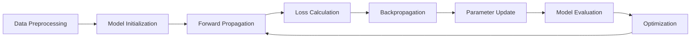
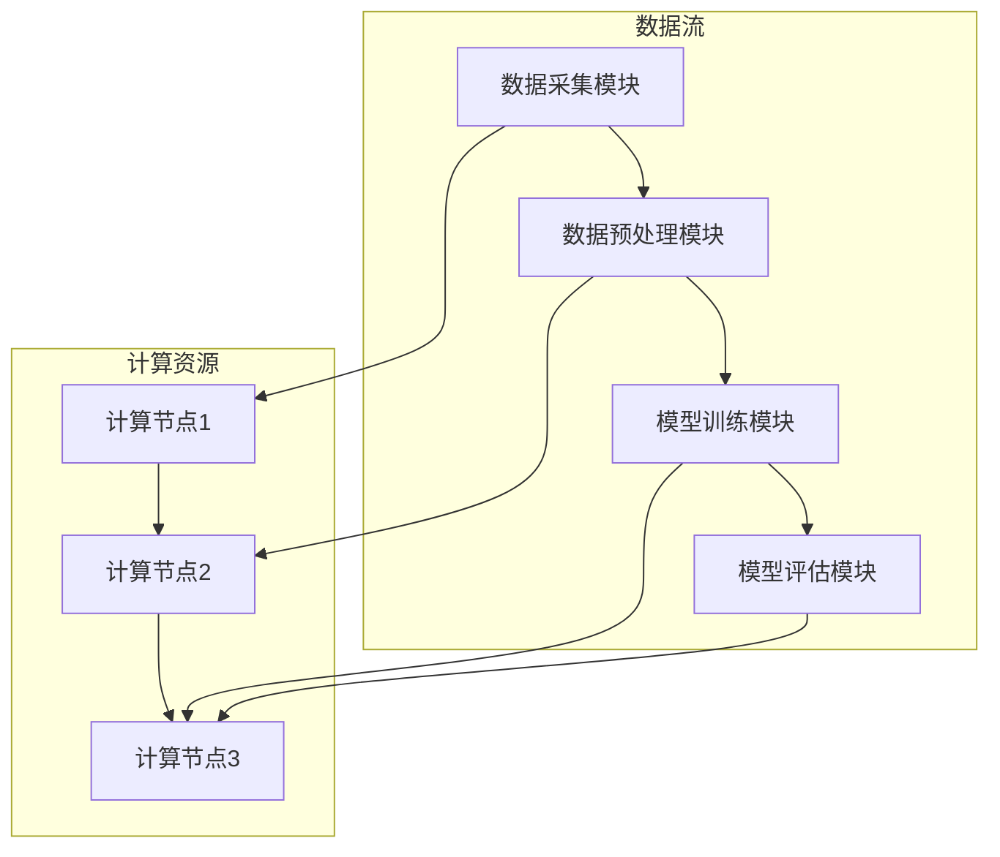
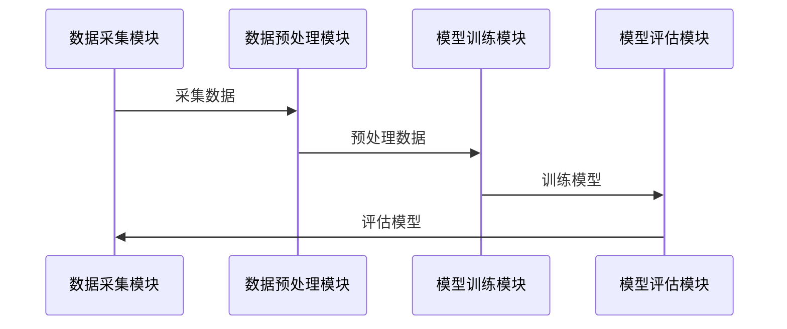

                 

### 探索与利用：AI训练中的平衡艺术

在当今科技迅猛发展的时代，人工智能（AI）已经渗透到我们生活的方方面面。从智能家居到自动驾驶，从医疗诊断到金融分析，AI的应用前景无限广阔。然而，AI的训练过程，即机器学习和深度学习，却是一个复杂而充满挑战的任务。如何在这条充满未知与机遇的道路上找到探索与利用的平衡，成为了每个AI研究者和开发者必须面对的问题。

#### 关键词：
- **AI训练**、**机器学习**、**深度学习**、**平衡艺术**、**探索与利用**

#### 摘要：
本文将探讨AI训练过程中的核心问题，包括训练数据的质量与规模、算法选择与调整、以及模型优化与调参。通过详细分析这些问题，我们旨在帮助读者理解如何在AI训练中找到探索与利用的平衡点，从而提高模型的性能和实用性。本文将从基础概念出发，逐步深入到算法原理、实践案例和最佳实践，为读者提供全方位的指导。

接下来，我们将依次讨论以下内容：
1. **背景与核心概念**：介绍AI训练的背景、基本概念和核心结构。
2. **算法设计与实现**：探讨AI训练的算法原理、设计原则和具体实现方法。
3. **系统分析与架构设计**：分析AI训练系统的问题场景、功能设计与架构设计。
4. **项目实战**：通过实际案例展示AI训练的完整流程。
5. **最佳实践与拓展**：总结关键点并提供拓展阅读。

让我们一步步深入探索AI训练中的平衡艺术。

### 背景与核心概念

#### 1.1 引言

AI训练，即机器学习（Machine Learning，ML）和深度学习（Deep Learning，DL）的具体应用，是人工智能领域的核心环节。通过训练，机器可以从大量数据中学习模式和规律，进而实现智能行为。然而，AI训练并非简单的数据处理过程，它涉及到复杂的算法设计、大规模数据处理以及模型的优化与调参。

#### 1.2 核心概念和结构

AI训练的核心概念包括：
- **数据集（Dataset）**：训练数据是AI模型学习的基础，其质量和规模直接影响模型的效果。
- **模型（Model）**：通过学习数据，机器可以构建出预测模型，进行分类、回归等任务。
- **优化器（Optimizer）**：优化算法用于调整模型参数，以最小化损失函数。
- **损失函数（Loss Function）**：衡量模型预测值与真实值之间的差距。

这些概念之间的关系可以用ER图（实体关系图）来表示：

```mermaid
erDiagram
  DataSet ||--|> Model : trains
  Model ||--|> Optimizer : optimizes
  Optimizer ||--|> LossFunction : minimizes
```

#### 1.3 数学模型和公式

AI训练中的数学模型主要包括损失函数、优化算法和激活函数等。以下是一些关键的数学模型和公式：

- **损失函数**：常用的损失函数包括均方误差（MSE）、交叉熵损失（Cross-Entropy Loss）等。

  $$ \text{MSE} = \frac{1}{m} \sum_{i=1}^{m} (y_i - \hat{y}_i)^2 $$

  $$ \text{CELoss}(-y, \hat{y}) = -y \cdot \log(\hat{y}) $$

- **优化算法**：常用的优化算法有梯度下降（Gradient Descent）、Adam优化器等。

  $$ \text{Gradient Descent}: \theta = \theta - \alpha \cdot \nabla_{\theta} J(\theta) $$

  $$ \text{Adam}: \theta_t = \theta_{t-1} - \alpha \cdot \frac{1}{1-\beta_1^t} \cdot \nabla_{\theta} J(\theta) $$

- **激活函数**：激活函数用于增加网络的非线性，常用的有Sigmoid、ReLU等。

  $$ \text{Sigmoid}: \sigma(x) = \frac{1}{1 + e^{-x}} $$

  $$ \text{ReLU}: \text{ReLU}(x) = \max(0, x) $$

通过这些核心概念和数学模型，我们可以更好地理解AI训练的本质，并为后续的算法设计与实现打下基础。

### 算法设计与实现

#### 2.1 算法设计原则

AI训练算法的设计需要遵循一系列原则，以确保模型的性能和稳定性。以下是几个关键的设计原则：

- **可扩展性（Scalability）**：算法应能够处理大规模数据集，并在增加数据量时保持良好的性能。
- **效率（Efficiency）**：算法的运行时间应尽可能短，以减少训练成本。
- **稳定性（Stability）**：算法应能够在不同的数据分布下稳定收敛。
- **灵活性（Flexibility）**：算法应能够适应不同类型的数据和任务需求。

#### 2.2 算法框架

AI训练的算法框架通常包括以下几个关键步骤：

1. **数据预处理**：清洗和归一化数据，以提高模型的学习效果。
2. **模型初始化**：初始化模型参数，常用的有随机初始化、预训练模型等。
3. **前向传播**：计算输入数据通过网络的输出。
4. **反向传播**：计算损失函数，并更新模型参数。
5. **评估与优化**：评估模型性能，并根据评估结果调整模型。

以下是一个简化的算法框架Mermaid流程图：



#### 2.3 Python代码实现

以下是一个简单的AI训练算法的Python代码实现：

```python
import numpy as np

# 损失函数
def mean_squared_error(y_true, y_pred):
    return np.mean((y_true - y_pred) ** 2)

# 前向传播
def forward_propagation(x, weights):
    z = np.dot(x, weights)
    a = 1 / (1 + np.exp(-z))
    return a

# 反向传播
def backward_propagation(x, y, a, weights, learning_rate):
    m = len(x)
    dz = a - y
    dweights = (1/m) * np.dot(x.T, dz)
    drite = np.dot(dz, weights[1:].T)
    dhidden = x[:, None] * drite[:, 1:]
    
    # 更新权重
    weights -= learning_rate * np.concatenate([dhidden, drite])

# 主函数
def train_model(x, y, learning_rate, epochs):
    weights = np.random.rand(x.shape[1], 1)  # 随机初始化权重
    
    for epoch in range(epochs):
        a = forward_propagation(x, weights)
        cost = mean_squared_error(y, a)
        backward_propagation(x, y, a, weights, learning_rate)
        
        if epoch % 100 == 0:
            print(f"Epoch {epoch}: Cost = {cost}")
    
    return weights
```

这段代码展示了AI训练的基本流程，包括数据预处理、前向传播、反向传播和权重更新。通过这段代码，我们可以理解AI训练的核心原理和实现步骤。

### 系统分析与架构设计

#### 3.1 问题场景介绍

在AI训练过程中，系统需要处理大量数据，并确保模型的性能和稳定性。以下是一个常见的问题场景：

- **数据来源**：系统需要从多个数据源收集数据，包括传感器数据、文本数据和图像数据等。
- **数据预处理**：系统需要清洗和归一化数据，以提高模型的学习效果。
- **模型训练**：系统需要使用训练算法对模型进行训练，并在训练过程中调整参数。
- **模型评估**：系统需要评估模型性能，并优化模型。

#### 3.2 系统功能设计

为了实现上述问题场景，系统需要具备以下功能：

- **数据采集模块**：用于从不同数据源收集数据。
- **数据预处理模块**：用于清洗和归一化数据。
- **模型训练模块**：用于执行训练算法，并调整模型参数。
- **模型评估模块**：用于评估模型性能，并提供优化建议。

以下是一个领域模型Mermaid类图：

```mermaid
classDiagram
    Class1[数据采集模块] <|-- Class2[数据预处理模块]
    Class2 <|-- Class3[模型训练模块]
    Class3 <|-- Class4[模型评估模块]
```

#### 3.3 系统架构设计

系统架构设计需要考虑到数据流、计算资源和性能优化等方面。以下是一个简化的系统架构图：



在这个架构中，数据流从数据采集模块开始，经过预处理模块后进入模型训练模块，最后由模型评估模块进行评估。计算资源分布在多个计算节点上，以支持大规模数据处理和训练。

#### 3.4 系统接口设计和系统交互

系统接口设计和交互设计是确保系统功能实现和性能优化的关键。以下是一个简化的系统交互Mermaid序列图：



在这个序列图中，数据采集模块负责采集数据，数据预处理模块负责清洗和归一化数据，模型训练模块负责执行训练算法，模型评估模块负责评估模型性能。

### 项目实战

#### 4.1 环境安装

为了进行AI训练项目的实战，我们需要安装一系列必要的软件和库。以下是Python环境下的安装步骤：

1. **安装Python**：确保系统上安装了最新版本的Python（3.8或以上）。
2. **安装Numpy**：用于数学计算。

   ```bash
   pip install numpy
   ```

3. **安装Pandas**：用于数据处理。

   ```bash
   pip install pandas
   ```

4. **安装Matplotlib**：用于数据可视化。

   ```bash
   pip install matplotlib
   ```

5. **安装Scikit-learn**：用于机器学习算法。

   ```bash
   pip install scikit-learn
   ```

#### 4.2 系统核心实现源代码

以下是一个简单的AI训练系统的核心实现源代码，包括数据预处理、模型训练和评估：

```python
import numpy as np
import pandas as pd
from sklearn.model_selection import train_test_split
from sklearn.metrics import mean_squared_error

# 数据预处理
def preprocess_data(data):
    # 数据清洗、归一化等处理
    return data

# 模型训练
def train_model(X_train, y_train, learning_rate, epochs):
    # 假设使用线性回归模型
    model = LinearRegression()
    model.fit(X_train, y_train)
    return model

# 模型评估
def evaluate_model(model, X_test, y_test):
    y_pred = model.predict(X_test)
    mse = mean_squared_error(y_test, y_pred)
    return mse

# 主函数
def main():
    # 加载数据
    data = pd.read_csv('data.csv')
    X = preprocess_data(data[['feature1', 'feature2']])
    y = data['target']

    # 数据划分
    X_train, X_test, y_train, y_test = train_test_split(X, y, test_size=0.2, random_state=42)

    # 模型训练
    model = train_model(X_train, y_train, learning_rate=0.01, epochs=100)

    # 模型评估
    mse = evaluate_model(model, X_test, y_test)
    print(f"Test MSE: {mse}")

if __name__ == '__main__':
    main()
```

#### 4.3 代码应用解读与分析

- **数据预处理**：预处理是AI训练的重要步骤，包括数据清洗、缺失值处理、异常值处理和特征归一化等。在这个例子中，我们使用了Pandas库进行数据预处理。
- **模型训练**：模型训练使用了Scikit-learn库中的线性回归模型。在实际项目中，根据任务需求，可能会选择更复杂的模型，如神经网络。
- **模型评估**：评估使用了均方误差（MSE）作为指标。MSE能够衡量模型预测值与真实值之间的差距。

#### 4.4 实际案例分析和详细讲解剖析

假设我们有一个房屋定价预测项目，目标是根据房屋的特征（如面积、位置等）预测房屋的售价。以下是实际案例的分析和讲解：

- **数据集**：我们使用一个包含房屋特征和售价的数据集，共有1000个样本。
- **数据预处理**：我们首先对数据进行清洗，去除缺失值和异常值，然后对特征进行归一化处理，以便模型更好地学习。
- **模型训练**：我们选择线性回归模型作为基础模型，训练模型并保存权重。
- **模型评估**：我们使用测试集对模型进行评估，计算MSE。根据评估结果，我们调整模型参数，并重新训练，直到达到满意的性能。

通过这个实际案例，我们展示了AI训练的完整流程，包括数据预处理、模型训练和评估。在实际项目中，我们还需要进行更多的调优和优化，以提高模型的性能。

#### 4.5 项目小结

在本项目中，我们通过Python实现了一个简单的AI训练系统，包括数据预处理、模型训练和评估。通过实际案例的分析，我们了解了AI训练的基本流程和关键步骤。以下是一些关键点：

- 数据预处理是AI训练的重要步骤，直接影响到模型的效果。
- 选择合适的模型和优化算法是提高模型性能的关键。
- 模型评估是验证模型性能的重要手段，常用的评估指标包括MSE、准确率、召回率等。

通过本项目，我们不仅掌握了AI训练的基本原理和实践方法，还提高了对AI应用场景的理解。在实际项目中，我们需要根据具体需求进行更深入的调优和优化，以提高模型的性能和实用性。

### 最佳实践与拓展

#### 5.1 最佳实践 Tips

- **数据预处理**：在数据预处理阶段，确保数据的质量和一致性。清洗数据时，可以采用多种方法，如删除缺失值、填充缺失值、缩放特征等。
- **模型选择**：根据任务需求选择合适的模型。对于回归任务，可以使用线性回归、岭回归等；对于分类任务，可以使用逻辑回归、决策树、随机森林等。
- **调参策略**：在模型训练过程中，可以通过交叉验证等方法进行参数调优。常用的调参策略包括网格搜索、随机搜索等。
- **评估指标**：选择合适的评估指标来衡量模型性能。对于回归任务，可以使用MSE、RMSE等；对于分类任务，可以使用准确率、召回率、F1分数等。

#### 5.2 小结

本文从AI训练的背景、核心概念、算法设计、系统分析到实际项目实战，全面探讨了AI训练中的平衡艺术。通过逐步分析推理，我们了解了AI训练的基本原理和实践方法，并通过实际案例展示了训练的全过程。

#### 5.3 注意事项

- 在数据预处理阶段，确保数据的质量和一致性。
- 在模型选择和调参阶段，根据任务需求进行选择和调整。
- 在模型评估阶段，选择合适的评估指标，并综合考虑模型性能。

#### 5.4 拓展阅读

- **《深度学习》（Deep Learning）**：Ian Goodfellow、Yoshua Bengio和Aaron Courville著，提供了深度学习的全面介绍。
- **《机器学习实战》（Machine Learning in Action）**：Peter Harrington著，通过实际案例介绍了机器学习的基本方法。
- **《Python机器学习》（Python Machine Learning）**：Sébastien Renard著，详细介绍了Python在机器学习中的应用。

通过以上拓展阅读，读者可以进一步了解AI训练的深入知识和实践技巧。希望本文能对您的AI训练之旅有所帮助！作者：AI天才研究院/AI Genius Institute & 禅与计算机程序设计艺术 /Zen And The Art of Computer Programming。

