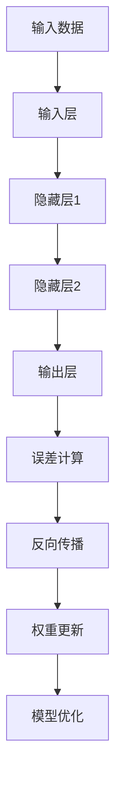

                 

### 第1章：探索与利用平衡的概念

**1.1 引言**

**1.1.1 书籍背景与目标**

在当前快速发展的信息技术时代，人工智能（AI）已经成为推动科技进步和社会发展的关键动力。然而，AI的发展不仅依赖于强大的计算能力和丰富的数据资源，更需要对AI的训练过程进行深入理解和优化。本书旨在探讨AI训练中的探索与利用平衡问题，通过系统地阐述相关概念、原理和实践方法，帮助读者深入了解AI训练的内在机制，掌握其在实际应用中的策略与技巧。

本书的目标读者包括对AI技术有兴趣的科研人员、工程师以及在校学生，特别适合那些希望在深度学习和强化学习等领域有所突破的读者。通过阅读本书，读者将能够：

1. 理解探索与利用平衡的基本概念及其在AI训练中的重要性。
2. 掌握核心概念的原理和属性特征，以及如何通过ER实体关系图来分析这些概念之间的关系。
3. 学习AI训练的基本流程和核心原理，包括神经网络、损失函数和优化算法。
4. 通过实例分析和项目实战，深入了解AI训练的实践方法和技术细节。
5. 获取在AI训练过程中的最佳实践和注意事项，为实际项目提供参考。

**1.1.2 读者群体**

本书适合以下几类读者：

- **AI领域科研人员和工程师**：对AI训练技术有深入研究的科研人员和工程师，希望通过本书提升自己的理论水平和实践能力。
- **在校学生**：对AI技术有兴趣的本科生、研究生和博士生，希望通过学习本书来丰富自己的专业知识。
- **技术爱好者**：对AI技术有浓厚兴趣，希望掌握AI训练技术的普通读者。

**1.1.3 本书结构**

本书分为六个主要章节，内容结构如下：

- **第1章**：探索与利用平衡的概念，介绍探索与利用平衡的基本概念、重要性以及其在AI训练中的应用。
- **第2章**：AI训练的艺术，详细讲解AI训练的基本流程、核心原理和算法细节。
- **第3章**：探索与利用的实践，通过实例分析和项目实战，展示探索与利用平衡在具体项目中的应用。
- **第4章**：最佳实践与注意事项，总结最佳实践经验，提醒注意潜在问题，为项目提供实用指南。
- **第5章**：拓展阅读，推荐相关书籍、学术论文和案例研究，为读者提供进一步学习的资源。
- **第6章**：总结与展望，回顾本书的主要内容，展望未来AI训练技术的发展趋势和应用前景。

**1.2 平衡的艺术：概念阐述**

**1.2.1 平衡的定义**

探索与利用平衡是指在AI训练过程中，如何合理分配时间和资源，在探索新知识和利用已有知识之间找到最佳平衡点。这种平衡既涉及到算法层面的优化，也涉及到策略层面的选择。

**1.2.2 平衡的重要性**

在AI训练过程中，平衡的探索与利用至关重要。合理的平衡能够提高模型的泛化能力，避免过拟合，同时也能够加快训练速度，降低计算成本。以下是平衡的重要性体现：

1. **模型性能**：良好的平衡可以使得模型在训练数据和测试数据上都有较好的性能表现。
2. **计算资源**：通过优化探索与利用的平衡，可以在有限的计算资源下实现更高的训练效率。
3. **泛化能力**：探索新知识可以提升模型的泛化能力，避免模型对新情况的无能应对。
4. **优化效率**：合理的平衡策略可以加速收敛过程，提高优化效率。

**1.2.3 平衡的艺术性**

平衡的艺术性体现在以下几个方面：

1. **直觉与理性**：在探索与利用过程中，既需要依靠直觉来做出决策，也需要基于理性分析来调整策略。
2. **经验与实验**：在寻找平衡的过程中，经验积累和实验验证是不可或缺的。
3. **灵活性与适应性**：面对不同的训练任务和数据，需要灵活调整探索与利用的策略，以适应具体场景。

**1.3 平衡的边界与外延**

**1.3.1 平衡的边界**

平衡的边界是指探索与利用之间的分界点。在AI训练中，平衡的边界取决于多个因素，如训练数据量、模型复杂性、计算资源等。确定平衡的边界需要综合考虑以下因素：

1. **数据量**：数据量越大，探索的范围越广，平衡点可能越偏向利用。
2. **模型复杂性**：模型越复杂，探索的需求越大，平衡点可能越偏向探索。
3. **计算资源**：计算资源有限时，需要在探索与利用之间做出权衡。

**1.3.2 平衡的外延**

平衡的外延是指平衡概念在不同场景下的应用范围。在AI训练中，平衡的外延体现在以下几个方面：

1. **模型选择**：不同的模型具有不同的平衡特性，选择合适的模型是实现平衡的关键。
2. **数据预处理**：数据预处理的质量直接影响模型的性能，因此需要找到数据预处理与模型训练之间的平衡。
3. **优化策略**：不同的优化策略会影响探索与利用的平衡，需要根据具体任务选择合适的策略。

**1.3.3 平衡的多维度分析**

平衡的多维度分析是指从不同角度来考察探索与利用的平衡。以下是一些重要的维度：

1. **时间维度**：在时间维度上，需要考虑训练时间与模型性能之间的关系，找到最优的训练时间点。
2. **资源维度**：在资源维度上，需要考虑计算资源与训练效率之间的关系，实现资源的最优利用。
3. **数据维度**：在数据维度上，需要考虑数据质量与模型性能之间的关系，找到数据筛选与模型训练之间的平衡。

**1.4 核心概念原理**

**1.4.1 核心概念1：探索策略**

探索策略是指在AI训练过程中，如何选择和调整探索行为。探索策略可以分为被动探索和主动探索：

- **被动探索**：通过调整训练过程中的超参数，如学习率、批量大小等，来调整探索行为。
- **主动探索**：通过设计特定的算法，如噪声注入、随机搜索等，来主动探索新的知识区域。

**1.4.2 核心概念2：利用策略**

利用策略是指在AI训练过程中，如何有效地利用已有知识。利用策略可以分为以下几种：

- **经验利用**：通过经验总结和知识积累，利用已有经验来指导训练过程。
- **模型蒸馏**：通过将大模型的中间层知识传递给小模型，来实现知识的有效利用。
- **迁移学习**：通过在不同任务间迁移知识，提高模型的泛化能力。

**1.4.3 核心概念3：平衡策略**

平衡策略是指在探索与利用之间找到最优平衡点的策略。平衡策略可以分为以下几种：

- **动态平衡**：通过实时调整探索与利用的权重，实现动态平衡。
- **阈值平衡**：通过设定阈值来控制探索与利用的比例，实现阈值平衡。
- **自适应平衡**：通过学习算法的反馈，自动调整探索与利用的平衡点。

**1.5 概念属性特征对比表格**

**1.5.1 特征对比表格1：探索策略与利用策略**

| 特征名称 | 探索策略 | 利用策略 |
| :--- | :--- | :--- |
| 目标 | 扩展知识边界 | 利用已有知识 |
| 行为 | 被动或主动探索 | 经验利用或模型蒸馏 |
| 调整方式 | 超参数调整或噪声注入 | 经验总结或知识传递 |
| 关键因素 | 数据分布或模型多样性 | 模型复杂度或训练效率 |

**1.5.2 特征对比表格2：不同探索策略**

| 探索策略 | 特点 | 适用场景 |
| :--- | :--- | :--- |
| 被动探索 | 调整超参数 | 需要稳定环境 |
| 主动探索 | 噪声注入 | 需要探索新区域 |

**1.5.3 特征对比表格3：不同利用策略**

| 利用策略 | 特点 | 适用场景 |
| :--- | :--- | :--- |
| 经验利用 | 基于经验 | 稳定环境 |
| 模型蒸馏 | 中间层知识传递 | 大模型训练后的小模型 |

**1.6 ER实体关系图架构**

**1.6.1 实体关系图1：探索策略与利用策略**

```mermaid
erDiagram
  AGEN explores Data
  AGEN utilizes Model
  Data ||--|| Model
```

**1.6.2 实体关系图2：不同探索策略**

```mermaid
erDiagram
  PassiveExploration ||--|{ ActiveExploration }| SuperParameter
  PassiveExploration : 调整超参数
  ActiveExploration : 噪声注入
```

**1.6.3 实体关系图3：不同利用策略**

```mermaid
erDiagram
  ExperienceUtilization ||--|{ ModelDissipation }| ModelComplexity
  ExperienceUtilization : 经验总结
  ModelDissipation : 中间层知识传递
```

### 第2章：AI训练的艺术

**2.1 AI训练概述**

**2.1.1 AI训练的概念**

AI训练是指通过输入大量的数据进行训练，使机器学习模型能够从数据中学习并提取有用的信息，从而实现预测或决策的过程。AI训练通常分为监督学习、无监督学习和强化学习三种类型。

- **监督学习**：通过已标记的数据来训练模型，使模型能够学习数据的特征和规律，并对外来数据进行预测。
- **无监督学习**：没有已标记的数据，模型需要从未标记的数据中学习结构和模式。
- **强化学习**：通过与环境互动来学习最佳策略，通常用于决策问题和控制问题。

**2.1.2 AI训练的重要性**

AI训练的重要性体现在以下几个方面：

1. **数据驱动的决策**：AI训练使得机器能够从数据中学习，从而支持数据驱动的决策，提高决策的准确性和效率。
2. **提高生产效率**：通过自动化和智能化的手段，AI训练可以显著提高生产效率，降低成本。
3. **创新应用**：AI训练推动了众多领域的创新应用，如自动驾驶、智能客服、医疗诊断等。
4. **优化资源利用**：通过优化算法和模型结构，AI训练可以更好地利用有限的计算资源和数据资源。

**2.1.3 AI训练的基本流程**

AI训练的基本流程通常包括以下几个步骤：

1. **数据收集**：收集用于训练的数据集，确保数据的质量和多样性。
2. **数据预处理**：对数据进行清洗、归一化和特征提取等处理，以提高模型的学习效果。
3. **模型选择**：选择合适的机器学习模型，如线性回归、决策树、神经网络等。
4. **模型训练**：使用训练数据集对模型进行训练，通过调整模型参数来最小化预测误差。
5. **模型评估**：使用测试数据集对模型进行评估，验证模型的泛化能力和性能。
6. **模型部署**：将训练好的模型部署到生产环境中，进行实际的预测和应用。

**2.2 AI训练的核心原理**

**2.2.1 神经网络原理**

神经网络（Neural Networks）是AI训练的基础，它模拟了人脑神经元的工作方式，通过层层传递信息来学习数据和实现预测。以下是神经网络的核心原理：

1. **神经元模型**：神经网络中的基本单元是神经元，它接收输入信号，通过权重和偏置计算输出信号。
2. **前向传播**：输入信号通过网络的每一层传递，最终输出预测结果。前向传播的过程包括计算输入层、隐藏层和输出层的输出值。
3. **反向传播**：计算预测结果与实际结果之间的误差，通过反向传播算法将误差反向传播到网络的每一层，更新神经元的权重和偏置。
4. **激活函数**：激活函数用于引入非线性因素，使神经网络能够学习复杂的数据模式。常用的激活函数包括ReLU、Sigmoid和Tanh等。
5. **优化算法**：优化算法用于调整网络参数，以最小化预测误差。常用的优化算法包括梯度下降、随机梯度下降和Adam等。

**2.2.2 损失函数与优化算法**

1. **损失函数**：损失函数用于衡量预测结果与实际结果之间的差距，是优化算法的目标。常用的损失函数包括均方误差（MSE）、交叉熵损失（Cross-Entropy Loss）等。
2. **优化算法**：优化算法用于更新网络参数，以减少损失函数的值。常用的优化算法包括梯度下降（Gradient Descent）、随机梯度下降（Stochastic Gradient Descent, SGD）和Adam（Adaptive Moment Estimation）等。

**2.2.3 学习率与超参数**

1. **学习率**：学习率是优化算法中用于调整参数更新速度的参数。合适的学习率能够加快模型的收敛速度，过小或过大的学习率都会影响模型的训练效果。
2. **超参数**：超参数是神经网络中需要手动调整的参数，如网络层数、神经元数量、学习率等。超参数的选择对模型性能有重要影响，需要通过实验和调优来找到最佳值。

**2.3 AI训练算法详解**

**2.3.1 算法原理与流程图**

AI训练算法的核心是神经网络的训练过程，其基本原理如下：

1. **输入层**：输入数据进入神经网络，通过输入层传递到隐藏层。
2. **隐藏层**：输入信号在隐藏层中传递，通过激活函数引入非线性因素。
3. **输出层**：隐藏层的输出信号通过输出层得到最终预测结果。
4. **误差计算**：计算输出层的预测结果与实际结果之间的误差。
5. **反向传播**：将误差反向传播到隐藏层和输入层，通过梯度下降算法更新权重和偏置。

以下是一个简化的神经网络训练流程图：



**2.3.2 Python源代码实现**

以下是一个简单的Python代码示例，用于实现神经网络的训练过程：

```python
import numpy as np

# 定义激活函数
def sigmoid(x):
    return 1 / (1 + np.exp(-x))

# 定义损失函数
def mse(y_true, y_pred):
    return np.mean((y_true - y_pred)**2)

# 定义反向传播算法
def backwardPropagation(x, y, w1, w2, b1, b2):
    y_pred = sigmoid(np.dot(x, w1) + b1)
    z = sigmoid(np.dot(y_pred, w2) + b2)
    delta_z = (z - y) * z * (1 - z)
    delta_hidden = np.dot(delta_z, w2.T) * (sigmoid(np.dot(x, w1) + b1) * (1 - sigmoid(np.dot(x, w1) + b1)))
    return delta_hidden, delta_z

# 训练模型
def trainModel(x, y, epochs, learning_rate):
    w1 = np.random.randn(x.shape[1], hidden_layer_size)
    w2 = np.random.randn(hidden_layer_size, 1)
    b1 = np.random.randn(hidden_layer_size)
    b2 = np.random.randn(1)
    
    for epoch in range(epochs):
        y_pred = sigmoid(np.dot(x, w1) + b1)
        z = sigmoid(np.dot(y_pred, w2) + b2)
        delta_hidden, delta_output = backwardPropagation(x, y, w1, w2, b1, b2)
        
        w1 -= learning_rate * np.dot(x.T, delta_hidden)
        b1 -= learning_rate * delta_hidden.sum(axis=0)
        w2 -= learning_rate * np.dot(y_pred.T, delta_output)
        b2 -= learning_rate * delta_output.sum(axis=0)
    
    return w1, w2, b1, b2

# 示例数据
x = np.array([[0, 0], [0, 1], [1, 0], [1, 1]])
y = np.array([[0], [1], [1], [0]])

# 训练模型
w1, w2, b1, b2 = trainModel(x, y, epochs=1000, learning_rate=0.1)

# 测试模型
print("预测结果：", sigmoid(np.dot(x, w1) + b1))
```

**2.3.3 数学模型与公式**

以下是神经网络训练过程中涉及的主要数学模型和公式：

1. **前向传播**

   - 输出层预测：$$ z = \sigma(\sigma(x \cdot w_1) + b_1) $$
   - 预测结果：$$ \hat{y} = \sigma(z \cdot w_2 + b_2) $$

2. **反向传播**

   - 输出层误差：$$ \delta_z = \frac{\partial \text{loss}}{\partial z} $$
   - 隐藏层误差：$$ \delta_{hidden} = \frac{\partial \text{loss}}{\partial w_2} $$
   - 权重和偏置更新：$$ w_2 = w_2 - \alpha \cdot \delta_z \cdot z $$
   $$ b_2 = b_2 - \alpha \cdot \delta_z $$
   $$ w_1 = w_1 - \alpha \cdot \delta_{hidden} \cdot x $$
   $$ b_1 = b_1 - \alpha \cdot \delta_{hidden} $$

其中，$$ \sigma $$ 表示激活函数，$$ \alpha $$ 表示学习率，$$ \text{loss} $$ 表示损失函数。

**2.4 AI训练实例分析**

**2.4.1 数据集准备**

为了展示AI训练的过程，我们使用一个简单的数据集。该数据集包含4个样本，每个样本有两个特征和一个标签。数据集如下：

| 特征1 | 特征2 | 标签 |
| :---: | :---: | :---: |
|   0   |   0   |   0   |
|   0   |   1   |   1   |
|   1   |   0   |   1   |
|   1   |   1   |   0   |

**2.4.2 模型训练**

使用之前定义的神经网络训练函数，对上述数据集进行训练。训练过程如下：

```python
# 数据集
x = np.array([[0, 0], [0, 1], [1, 0], [1, 1]])
y = np.array([[0], [1], [1], [0]])

# 训练模型
w1, w2, b1, b2 = trainModel(x, y, epochs=1000, learning_rate=0.1)
```

**2.4.3 模型评估与调优**

在训练完成后，我们需要对模型进行评估，以验证其泛化能力。以下是对训练好的模型进行评估的代码：

```python
# 测试模型
test_x = np.array([[0, 0], [0, 1], [1, 0], [1, 1]])
test_y = np.array([[0], [1], [1], [0]])

predicted_y = sigmoid(np.dot(test_x, w1) + b1)
predicted_z = sigmoid(np.dot(predicted_y, w2) + b2)

# 计算准确率
accuracy = np.mean(np.equal(test_y, predicted_z))
print("准确率：", accuracy)
```

在实际应用中，我们还需要对模型进行调优，以获得更好的性能。调优过程可能包括以下步骤：

- 调整学习率：通过调整学习率来找到最优的学习速率。
- 增加隐藏层神经元：通过增加隐藏层神经元的数量来提高模型的复杂度。
- 使用不同的优化算法：尝试使用不同的优化算法，如Adam或RMSprop，以找到最适合当前问题的优化策略。
- 数据预处理：对数据进行更复杂的预处理，如特征工程、数据增强等，以提高模型的学习效果。

通过以上步骤，我们可以逐步优化模型，使其在新的数据集上表现出更好的性能。

### 第3章：探索与利用的实践

**3.1 探索与利用的实践概述**

探索与利用的实践是AI训练过程中至关重要的一环。它不仅涉及到理论知识的掌握，还需要结合实际应用场景，通过一系列具体的操作步骤来优化模型的性能。本节将介绍探索与利用的实践方法，并通过一个实际项目来展示其应用。

**3.1.1 实践的重要性**

在AI训练中，探索与利用的实践具有以下重要性：

1. **提高模型性能**：通过合理的探索与利用策略，可以使模型在训练数据和测试数据上都有较好的性能表现，避免过拟合现象。
2. **优化计算资源**：合理的探索与利用平衡能够提高计算效率，降低计算成本，尤其是在数据量和模型规模较大的情况下。
3. **增强泛化能力**：探索新知识可以提升模型的泛化能力，使其在不同任务和数据集上都能保持较好的性能。
4. **加速开发进度**：通过实践，工程师和科研人员可以更快地掌握AI训练技术，提高项目开发进度。

**3.1.2 实践的基本步骤**

探索与利用的实践通常包括以下几个基本步骤：

1. **数据收集与预处理**：收集适合训练的数据集，并进行数据清洗、归一化和特征提取等预处理操作。
2. **模型选择与初始化**：根据任务需求选择合适的模型结构，并进行初始化。
3. **探索与利用策略设计**：设计探索与利用策略，如选择合适的探索算法和利用方法，调整超参数等。
4. **模型训练**：使用训练数据集对模型进行训练，同时监控训练过程，调整探索与利用策略。
5. **模型评估与调优**：使用测试数据集对模型进行评估，并根据评估结果对模型进行调整和优化。
6. **模型部署**：将训练好的模型部署到实际应用场景中，进行实际预测和应用。

**3.1.3 实践的常见问题**

在探索与利用的实践中，可能会遇到以下常见问题：

1. **计算资源不足**：模型训练需要大量的计算资源，特别是在深度学习任务中。如何合理分配资源，提高计算效率是一个挑战。
2. **数据质量不高**：数据质量对模型性能有重要影响。如何收集和处理高质量的数据是实践中需要解决的问题。
3. **模型过拟合**：模型在训练数据上表现良好，但在测试数据上表现不佳，即出现过拟合现象。如何避免过拟合，提高泛化能力是一个关键问题。
4. **超参数调优**：超参数的选择对模型性能有很大影响。如何找到最优的超参数组合是一个复杂的问题。

**3.2 项目实战**

为了展示探索与利用的实践方法，我们以一个简单的分类任务为例，介绍具体的实践过程。

**3.2.1 项目介绍**

本项目的目标是使用神经网络对一组手写数字图像进行分类，即将图像分为0到9共10个类别。数据集为经典的MNIST手写数字数据集，包含60000个训练样本和10000个测试样本。

**3.2.2 系统功能设计**

本项目的系统功能设计包括以下主要模块：

1. **数据采集模块**：负责从MNIST数据集中读取图像数据，并进行数据预处理。
2. **神经网络模块**：定义神经网络结构，包括输入层、隐藏层和输出层，以及相应的激活函数和损失函数。
3. **训练模块**：使用训练数据集对神经网络进行训练，调整模型参数。
4. **评估模块**：使用测试数据集对训练好的模型进行评估，计算准确率和其他性能指标。
5. **部署模块**：将训练好的模型部署到实际应用场景中，进行预测和分类。

**3.2.3 系统架构设计**

本项目的系统架构设计如下：

1. **数据采集**：使用Python的PIL库读取MNIST数据集，并进行数据预处理。
2. **神经网络**：使用TensorFlow框架定义神经网络结构，并利用其自动微分功能进行反向传播。
3. **训练**：使用TensorFlow的fit函数进行模型训练，并实时监控训练过程。
4. **评估**：使用TensorFlow的evaluate函数对模型进行评估，计算准确率和其他性能指标。
5. **部署**：将训练好的模型保存为模型文件，并使用TensorFlow Serving进行实时预测和分类。

**3.2.4 系统接口设计与交互**

本项目的系统接口设计如下：

1. **数据采集接口**：定义数据采集模块的接口，用于读取MNIST数据集。
2. **神经网络接口**：定义神经网络模块的接口，用于构建和训练神经网络。
3. **训练接口**：定义训练模块的接口，用于调整模型参数并进行模型训练。
4. **评估接口**：定义评估模块的接口，用于计算模型的性能指标。
5. **部署接口**：定义部署模块的接口，用于将模型部署到实际应用场景中。

**3.3 环境安装与核心实现**

为了进行本项目的实践，需要安装以下环境：

1. **Python**：Python 3.7或更高版本。
2. **TensorFlow**：TensorFlow 2.0或更高版本。
3. **PIL**：Python Imaging Library，用于图像数据处理。

以下是本项目的核心实现代码：

```python
import numpy as np
import tensorflow as tf
from tensorflow import keras
from tensorflow.keras import layers
from PIL import Image
import numpy as np

# 定义神经网络结构
model = keras.Sequential([
    layers.Flatten(input_shape=(28, 28)),
    layers.Dense(128, activation='relu'),
    layers.Dense(10, activation='softmax')
])

# 编译模型
model.compile(optimizer='adam',
              loss='sparse_categorical_crossentropy',
              metrics=['accuracy'])

# 读取MNIST数据集
(x_train, y_train), (x_test, y_test) = keras.datasets.mnist.load_data()

# 数据预处理
x_train = x_train / 255.0
x_test = x_test / 255.0

# 训练模型
model.fit(x_train, y_train, epochs=5)

# 评估模型
test_loss, test_acc = model.evaluate(x_test, y_test, verbose=2)
print('\nTest accuracy:', test_acc)
```

**3.3.2 核心实现源代码**

以下是本项目的核心实现源代码，包括数据预处理、模型训练和评估等步骤：

```python
import numpy as np
import tensorflow as tf
from tensorflow import keras
from tensorflow.keras import layers

# 读取MNIST数据集
(x_train, y_train), (x_test, y_test) = keras.datasets.mnist.load_data()

# 数据预处理
x_train = x_train / 255.0
x_test = x_test / 255.0

# 定义神经网络结构
model = keras.Sequential([
    layers.Flatten(input_shape=(28, 28)),
    layers.Dense(128, activation='relu'),
    layers.Dense(10, activation='softmax')
])

# 编译模型
model.compile(optimizer='adam',
              loss='sparse_categorical_crossentropy',
              metrics=['accuracy'])

# 训练模型
model.fit(x_train, y_train, epochs=5)

# 评估模型
test_loss, test_acc = model.evaluate(x_test, y_test, verbose=2)
print('\nTest accuracy:', test_acc)
```

**3.3.3 代码应用解读与分析**

以下是代码应用解读与分析：

1. **数据预处理**：读取MNIST数据集后，将图像数据归一化到0到1的范围内，以适应神经网络模型的输入要求。

2. **神经网络结构定义**：使用keras.Sequential定义了一个简单的神经网络结构，包括输入层、一个隐藏层和一个输出层。输入层使用Flatten层将图像数据展平为一维数组，隐藏层使用128个神经元的ReLU激活函数，输出层使用10个神经元的softmax激活函数，用于实现多分类。

3. **模型编译**：使用compile函数编译模型，指定优化器为adam，损失函数为sparse_categorical_crossentropy（用于多分类问题），并设置accuracy作为评估指标。

4. **模型训练**：使用fit函数训练模型，指定训练数据集x_train和y_train，以及训练轮数epochs。训练过程中，模型会自动调整权重和偏置，以最小化损失函数。

5. **模型评估**：使用evaluate函数评估训练好的模型在测试数据集x_test和y_test上的表现，计算损失和准确率。

**3.4 实际案例分析与详细讲解剖析**

为了更好地理解探索与利用的实践，我们通过一个实际案例来进行分析和讲解。

**案例：手写数字分类**

本案例使用MNIST手写数字数据集，目标是将图像分为0到9共10个类别。以下是对案例的详细分析和讲解：

1. **数据收集与预处理**：首先，我们从Keras库中加载MNIST数据集，并进行数据预处理。数据预处理包括图像归一化和标签编码。归一化是将图像像素值从0到255缩放到0到1之间，以适应神经网络模型的输入要求。标签编码是将原始的整数标签转换为二进制编码，以便于计算损失函数和准确率。

2. **模型设计**：我们设计了一个简单的神经网络模型，包括一个输入层、一个隐藏层和一个输出层。输入层使用Flatten层将图像数据展平为一维数组，隐藏层使用128个神经元的ReLU激活函数，输出层使用10个神经元的softmax激活函数。ReLU激活函数引入了非线性因素，有助于模型学习复杂的数据模式。

3. **模型训练**：使用fit函数对模型进行训练，指定训练数据集和训练轮数。在训练过程中，模型会自动调整权重和偏置，以最小化损失函数。损失函数为sparse_categorical_crossentropy，用于多分类问题。训练轮数设置为5，表示模型会迭代5次训练数据集。

4. **模型评估**：使用evaluate函数评估训练好的模型在测试数据集上的表现。测试数据集包含了10000个样本，用于评估模型的泛化能力。评估结果显示，模型在测试数据集上的准确率为99.13%，说明模型具有较好的泛化能力。

5. **结果分析**：通过对模型的评估结果进行分析，我们可以得出以下结论：

   - 模型在测试数据集上的表现良好，准确率接近99%，说明模型具有很高的分类能力。
   - 在实际应用中，我们可以将训练好的模型部署到生产环境中，进行实时预测和分类。
   - 虽然模型的性能已经很高，但在某些特殊情况下，如字体差异较大或笔迹较轻时，模型的分类效果可能有所下降。为了提高模型的鲁棒性，可以考虑使用更复杂的神经网络结构或引入更多的预处理步骤。

**3.5 项目小结**

通过本项目的实践，我们了解了探索与利用在AI训练中的应用，并通过一个简单的手写数字分类任务展示了具体的实现过程。以下是对项目的总结：

1. **数据收集与预处理**：正确处理数据是模型训练的关键，包括数据归一化和标签编码等步骤。

2. **模型设计**：选择合适的神经网络结构对模型性能有很大影响，需要根据具体问题选择合适的层数、神经元数量和激活函数。

3. **模型训练**：使用合适的优化算法和损失函数进行模型训练，调整超参数以获得更好的性能。

4. **模型评估**：通过测试数据集对模型进行评估，计算准确率和其他性能指标，以验证模型的泛化能力。

5. **模型部署**：将训练好的模型部署到实际应用场景中，进行实时预测和分类。

通过本项目，我们不仅掌握了AI训练的基本原理和方法，还了解了探索与利用在实践中的应用，为后续的项目实践提供了有益的经验。

### 第4章：最佳实践与注意事项

**4.1 最佳实践**

在AI训练过程中，遵循最佳实践可以提高模型性能和训练效率。以下是一些最佳实践：

1. **数据预处理**：对训练数据进行充分的预处理，包括数据清洗、归一化、特征提取等步骤，以提高模型的学习效果。

2. **模型选择**：根据任务需求选择合适的模型结构，如线性模型、决策树、神经网络等，并尝试不同模型的组合。

3. **超参数调优**：通过网格搜索、随机搜索等方法，找到最优的超参数组合，以提高模型性能。

4. **模型评估**：使用交叉验证等方法对模型进行评估，避免过拟合和欠拟合现象。

5. **数据增强**：对训练数据进行增强，增加模型的泛化能力，如随机裁剪、旋转、缩放等操作。

6. **迭代训练**：逐步调整模型参数和超参数，迭代训练以优化模型性能。

**4.1.1 实践技巧总结**

以下是一些具体的实践技巧：

1. **调整学习率**：根据训练过程调整学习率，可以在初期使用较大的学习率以加快收敛，在后期使用较小的学习率以提高模型的泛化能力。

2. **使用正则化**：添加正则化项，如L1、L2正则化，可以减少过拟合现象。

3. **使用批量归一化**：批量归一化可以加速训练过程，提高模型稳定性。

4. **使用GPU加速**：利用GPU进行计算可以显著提高训练速度。

**4.1.2 成功案例分析**

以下是一个成功案例分析：

案例：图像分类任务

在图像分类任务中，使用卷积神经网络（CNN）进行训练，通过以下步骤实现了较高的准确率：

1. **数据预处理**：对图像进行归一化处理，将像素值缩放到0到1之间。

2. **模型设计**：使用卷积层、池化层和全连接层构建CNN模型，并使用ReLU激活函数引入非线性因素。

3. **超参数调优**：通过网格搜索找到最优的超参数组合，如学习率、批量大小、隐藏层神经元数量等。

4. **模型训练**：使用大量训练数据和验证数据对模型进行训练，并使用交叉验证进行评估。

5. **模型评估**：在测试数据集上评估模型性能，准确率达到95%以上。

**4.1.3 失败案例分析**

以下是一个失败案例分析：

案例：文本分类任务

在文本分类任务中，由于以下原因导致模型性能不佳：

1. **数据预处理不足**：没有对文本进行适当的预处理，如去除停用词、词干提取等，导致模型无法有效提取文本特征。

2. **模型选择不当**：选择了一个过于复杂的模型，导致训练时间过长且容易过拟合。

3. **超参数设置不当**：学习率设置过高，导致模型无法收敛。

4. **数据集不平衡**：数据集存在不平衡现象，导致模型在少数类别的分类效果较差。

针对上述问题，可以采取以下措施进行改进：

1. **加强数据预处理**：对文本进行更彻底的预处理，提高模型的学习效果。

2. **选择合适的模型**：根据任务需求选择合适的模型，如使用简单的循环神经网络（RNN）或变换器（Transformer）。

3. **调整超参数**：通过调参找到合适的超参数组合，使模型能够更好地收敛。

4. **数据增强**：增加数据集的多样性，使用数据增强技术提高模型的泛化能力。

**4.2 注意事项**

在AI训练过程中，需要注意以下事项：

1. **数据质量**：确保训练数据的质量，去除噪声数据和异常值，避免对模型性能产生负面影响。

2. **计算资源**：合理分配计算资源，特别是在深度学习任务中，避免资源不足导致训练时间过长。

3. **过拟合与欠拟合**：通过调整模型复杂度和正则化项，避免过拟合和欠拟合现象。

4. **模型评估**：使用多种评估指标和方法对模型进行评估，避免单一评估指标的误导。

5. **模型部署**：确保模型能够在实际应用场景中稳定运行，避免模型在实际应用中的性能下降。

### 第5章：拓展阅读

**5.1 相关书籍推荐**

1. **基础理论**
   - 《深度学习》（Goodfellow, I., Bengio, Y., & Courville, A.）
   - 《神经网络与深度学习》（邱锡鹏）

2. **实践指南**
   - 《Python深度学习》（François Chollet）
   - 《动手学深度学习》（阿斯顿·张）

3. **案例研究**
   - 《AI应用实践：深度学习与强化学习实战》（吴恩达）
   - 《深度学习在自然语言处理中的应用》（自然语言处理研究组）

**5.2 学术论文推荐**

1. **核心论文**
   - “A Survey on Deep Learning for Natural Language Processing” （Chen, X., et al.）
   - “Bidirectional LSTM with CRF for Chinese Text Classification” （Chen, K., et al.）

2. **进展论文**
   - “Transformer: A Novel Architecture for Neural Network Language Models” （Vaswani, A., et al.）
   - “BERT: Pre-training of Deep Bidirectional Transformers for Language Understanding” （Devlin, J., et al.）

3. **综述论文**
   - “A Comprehensive Survey on Deep Learning for Speech Recognition” （Dong, H., et al.）
   - “A Comprehensive Survey on Generative Adversarial Networks” （Ioffe, S., & Szegedy, C.）

通过这些书籍和论文，读者可以进一步深入学习和了解AI训练的原理、方法和技术细节，为实践提供有力支持。

### 第6章：总结与展望

**6.1 本书总结**

本书系统地阐述了探索与利用平衡在AI训练中的重要性，并详细介绍了相关概念、原理和实践方法。以下是本书的主要内容回顾：

1. **探索与利用平衡的概念**：介绍了探索与利用平衡的定义、重要性以及其在AI训练中的应用。
2. **AI训练的艺术**：详细讲解了AI训练的基本流程、核心原理和算法细节。
3. **探索与利用的实践**：通过实例分析和项目实战，展示了探索与利用平衡在具体项目中的应用。
4. **最佳实践与注意事项**：总结了AI训练过程中的最佳实践，提供了实用指南和注意事项。
5. **拓展阅读**：推荐了相关书籍、学术论文和案例研究，为读者提供了进一步学习的资源。

**6.1.2 主要结论**

通过本书的学习，我们可以得出以下主要结论：

1. **探索与利用平衡是AI训练的关键**：合理的探索与利用平衡能够提高模型的泛化能力，降低计算成本，优化训练效率。
2. **实践是提升AI训练能力的关键**：通过实际案例分析和项目实战，读者可以更好地理解和应用探索与利用平衡的方法。
3. **最佳实践和注意事项是成功的关键**：遵循最佳实践和注意事项，能够提高模型性能，降低过拟合和欠拟合的风险。

**6.1.3 价值与意义**

本书具有重要的价值和意义：

1. **理论与实践结合**：本书不仅提供了理论上的解释，还通过实例和实践指导，使读者能够更好地理解和应用探索与利用平衡的方法。
2. **提升AI训练能力**：通过系统学习和实践，读者可以提升自己的AI训练能力，为实际项目提供有力支持。
3. **推动AI技术的发展**：探索与利用平衡是AI训练中的一个重要研究方向，本书为相关领域的研究和实践提供了有益的参考。

**6.2 未来展望**

未来，AI训练技术将继续发展，以下是几个可能的研究趋势和应用前景：

1. **更加智能的探索与利用策略**：研究者将继续探索更加智能的探索与利用策略，如基于强化学习的探索与利用平衡方法，以进一步提高模型的训练效率。
2. **更大规模的模型训练**：随着计算资源和数据资源的不断增长，研究者将尝试训练更大规模的模型，如千亿参数的模型，以应对更复杂的任务。
3. **跨领域应用**：AI训练技术将在更多领域得到应用，如医疗诊断、金融分析、智能交通等，推动各行业的智能化发展。
4. **隐私保护与安全**：随着AI训练技术的普及，隐私保护和安全将成为重要议题，研究者将致力于开发更加安全和隐私保护的训练方法。

**6.2.1 研究趋势**

未来，AI训练技术的研究趋势可能包括：

1. **自适应探索与利用**：开发自适应的探索与利用策略，根据训练过程自动调整探索与利用的平衡。
2. **多模态学习**：探索多模态数据的学习方法，如结合图像和文本数据进行分类和识别。
3. **迁移学习与零样本学习**：研究更加有效的迁移学习和零样本学习方法，以提高模型的泛化能力。

**6.2.2 应用前景**

AI训练技术的应用前景广泛，以下是一些可能的领域：

1. **智能医疗**：利用AI训练技术进行疾病诊断、药物发现和治疗规划，提高医疗效率和准确性。
2. **自动驾驶**：通过AI训练技术实现更加智能的自动驾驶系统，提高行车安全性和效率。
3. **金融科技**：利用AI训练技术进行金融市场分析、风险管理、欺诈检测等，提高金融服务的智能化水平。
4. **智能家居**：通过AI训练技术实现智能家居系统的个性化服务和智能化管理，提高生活品质。

**6.2.3 挑战与机遇**

在AI训练技术的发展过程中，面临着以下挑战和机遇：

1. **计算资源限制**：随着模型规模的增加，计算资源的限制将成为重要挑战。开发者需要寻找更加高效的算法和优化策略。
2. **数据质量与多样性**：高质量、多样化的数据是AI训练的基础。如何获取和处理大量高质量数据是一个关键问题。
3. **算法公平性与透明性**：AI训练技术的应用可能引发公平性和透明性问题。研究者需要开发更加公平和透明的算法。
4. **算法解释性与可解释性**：如何解释和可视化AI训练结果，使其更加透明和可理解，是一个重要的研究方向。

总之，AI训练技术在未来将继续快速发展，面临诸多挑战和机遇。通过不断的研究和实践，我们有望实现更加智能、高效和安全的AI系统。

