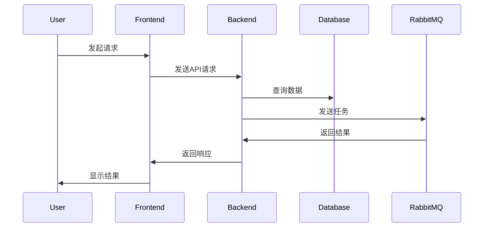
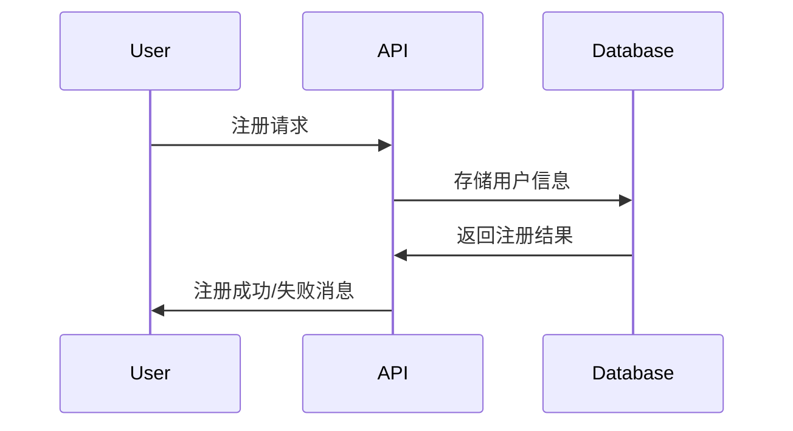
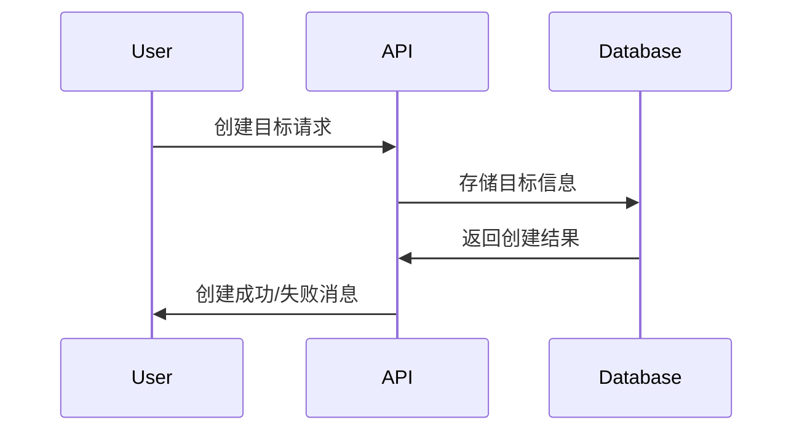
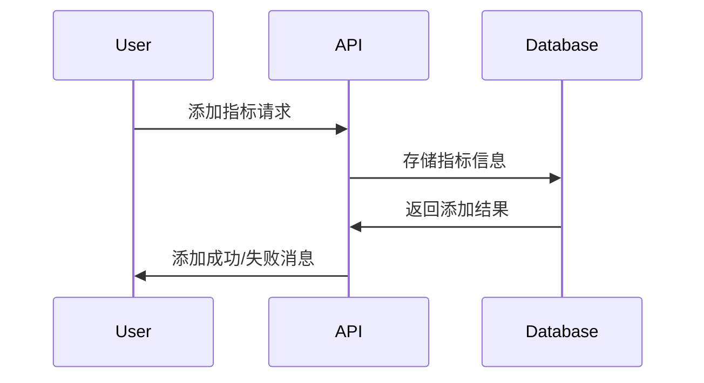
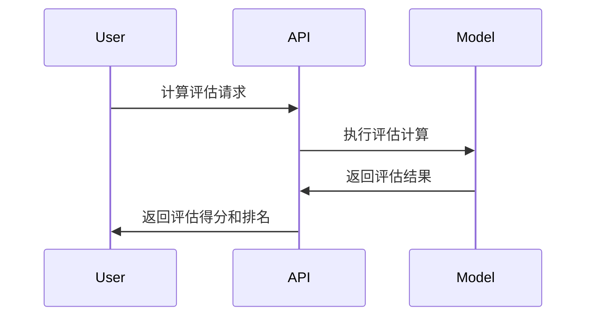
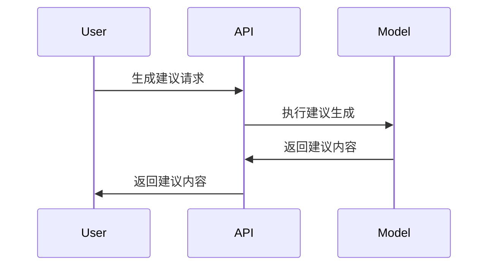

                 

# 探索多元化的人生价值：超越传统成功标准

## 关键词

- 人生价值
- 多元化
- 成功标准
- 自我认知
- 跨文化视角
- 社会与个体互动

## 摘要

本文旨在探讨多元化的人生价值观念，帮助读者超越传统的成功标准，寻找更加丰富和有意义的人生道路。通过分析现代社会中传统成功标准的局限性，本文提出了多元化的人生价值观及其核心概念，并详细阐述了超越传统成功标准的策略和实践方法。同时，本文还从跨文化视角出发，分析了跨文化背景下的多元化人生价值，以及社会环境对个体的影响。通过本文的探讨，希望能够为读者提供新的思考和视角，帮助他们实现个人成长和社会进步。

## 第一部分：引言

### 1. 引言

#### 1.1 问题的提出

现代社会中，人们对于成功和人生价值的追求往往被传统的成功标准所束缚。这些标准往往包括金钱、地位和名誉等方面，而忽视了个人内心的需求和幸福感。传统成功标准如金钱和地位，虽然在一定程度上能够带来满足感，但往往无法持久。许多人在追求这些标准的过程中，可能会忽略自己的内心需求和价值观，导致精神空虚和焦虑。

本文旨在探讨多元化的人生价值，帮助读者超越传统的成功标准，寻找更加丰富和有意义的人生道路。通过深入分析和探讨，本文将揭示多元化的人生价值观，为读者提供新的思考和视角，从而实现个人成长和社会进步。

#### 1.2 研究背景

随着社会的发展和科技的进步，人们的生活方式、价值观念和人际关系等方面都发生了巨大的变化。传统的人生价值观和成功标准逐渐无法满足人们的需求，人们开始追求更加多元化和个性化的生活。现代社会中，个体面临着更多的选择和挑战，如何在这个多元化的世界中找到属于自己的价值和意义，成为了一个重要的问题。

本文的研究背景包括以下几个方面：

1. **社会变迁**：随着全球化和社会发展的加速，人们的生活方式、价值观念和人际关系等方面发生了巨大的变化。传统的社会结构和价值观念逐渐被打破，人们开始寻求更加多元化和个性化的生活方式。

2. **技术进步**：科技的飞速发展，特别是互联网和人工智能的兴起，为人们提供了更多的选择和可能性。这些技术的进步，不仅改变了人们的生活方式，也影响了人们的价值观念和成功标准。

3. **个体觉醒**：随着自我意识的增强，人们开始更加关注自己的内心需求和价值观。越来越多的人意识到，传统的成功标准并不能带来真正的幸福和满足感，他们开始寻求更加丰富和有意义的人生道路。

#### 1.3 研究目的与意义

本文的研究目的是通过深入分析和探讨，为读者揭示多元化的人生价值观念，帮助读者树立正确的人生观和价值观，从而实现个人成长和社会进步。具体来说，本文的研究意义包括以下几个方面：

1. **个人成长**：通过理解多元化的人生价值观念，读者可以更好地认识自己，找到真正适合自己的发展方向，从而实现个人成长和自我实现。

2. **社会进步**：多元化的人生价值观念有助于推动社会的进步和发展。当更多的人能够理解和接受多元化的价值观时，社会将更加包容和开放，从而实现社会的和谐与进步。

3. **挑战传统观念**：本文的研究有助于挑战和打破传统的成功标准，推动人们重新审视和思考成功和人生价值的定义，从而推动社会的变革和发展。

### 2. 核心概念与联系

#### 2.1 核心概念

本文的核心概念包括“人生价值”、“多元化”和“成功标准”。

- **人生价值**：指一个人在一生中所追求的目标、意义和成就。人生价值不仅包括物质层面的成功，还包括精神层面的满足和幸福感。
- **多元化**：指人生价值观念的多样性和丰富性。多元化的人生价值观念强调个体在不同方面、不同领域的追求和成就，而不仅仅是单一的标准。
- **成功标准**：指社会普遍认同的评价个人成就的标准。传统的成功标准通常包括金钱、地位和名誉等方面，但这些标准并不能完全反映个人的价值和幸福感。

#### 2.2 概念属性特征对比表格

| 概念       | 定义                 | 属性特征                     | 对比                   |
|------------|----------------------|------------------------------|------------------------|
| 人生价值   | 个人追求的目标和意义 | 内在动机、个人成长、成就感   | 独立性、多样性、主观性 |
| 多元化     | 价值观念的多样性     | 多元文化、多元需求、个性化   | 广泛性、包容性、独特性 |
| 成功标准   | 评价个人成就的标准   | 金钱、地位、名誉等           | 主流、客观、单一性    |

#### 2.3 ER实体关系图架构

```mermaid
erDiagram
    A[人生价值] ||--|{ 多元化 }
    A ||--|{ 成功标准 }
```

在ER实体关系图中，人生价值是核心实体，与多元化和成功标准形成关联。多元化表示人生价值观念的多样性，成功标准则是评价个人成就的客观标准。这种关系反映了人生价值在不同维度上的多元化和评价标准的客观性。

### 3. 理论框架

#### 3.1 多元化的人生价值观

多元化的人生价值观认为，人生价值不应局限于传统的成功标准，而应包括个人成长、幸福感、人际关系等多个方面。这种价值观强调个体在不同方面、不同领域的追求和成就，而不仅仅是单一的标准。

- **个人成长**：个人成长是多元化人生价值的重要组成部分。通过不断学习和成长，个体能够提升自己的能力和素质，实现自我价值的提升。
- **幸福感**：幸福感是多元化人生价值的核心。传统的成功标准往往忽视了个体的幸福感，而幸福感却是评价人生质量的重要指标。
- **人际关系**：人际关系是多元化人生价值的另一个重要方面。良好的人际关系能够为个体提供情感支持和社交网络，有助于个体在社会中获得认同和归属感。

#### 3.2 超越传统成功标准的策略

为了超越传统的成功标准，个体可以采取以下策略：

- **自我认知**：了解自己的兴趣、价值观和需求，找到适合自己的发展方向。自我认知有助于个体明确自己的目标，从而更有针对性地追求成功。
- **持续学习**：不断充实自己的知识和技能，提高自身竞争力。持续学习不仅能够帮助个体适应社会发展的需求，也能够提升个体的自信心和成就感。
- **积极应对挫折**：面对失败和挫折时，保持乐观和积极的态度，从失败中吸取经验教训。积极应对挫折有助于个体保持心理平衡和成长动力。
- **人际交往**：建立良好的人际关系，获得他人的支持和理解。良好的人际关系不仅能够为个体提供情感支持，也能够为个体的事业发展提供帮助。

### 4. 多元化人生价值的实践

#### 4.1 个人成长

个人成长是多元化人生价值的重要体现。以下是一些实践个人成长的方法：

- **设定目标**：明确自己的人生目标，制定具体的行动计划。目标设定有助于个体明确自己的发展方向，从而更有针对性地追求成长。
- **自我管理**：培养良好的时间管理、情绪管理和自我管理能力。自我管理能够帮助个体更好地控制自己的生活，提高效率和质量。
- **持续学习**：不断学习新知识、新技能，提升自己的综合素质。持续学习不仅能够满足个体的好奇心和求知欲，也能够提升个体的竞争力和市场价值。

#### 4.2 幸福感

幸福感是多元化人生价值的核心。以下是一些实践幸福感的方法：

- **满足基本需求**：确保自己的基本生活需求得到满足。基本需求的满足是幸福感的基础，包括食物、住宿、医疗等。
- **积极心态**：保持积极的心态，面对生活中的困难和挑战。积极心态能够帮助个体更好地应对压力，保持心理健康。
- **人际关系**：与家人、朋友保持良好的关系，获得情感支持。良好的人际关系能够为个体提供情感支持和社交网络，有助于提升幸福感。

#### 4.3 人际关系

良好的人际关系是多元化人生价值的另一个重要方面。以下是一些建立良好人际关系的方法：

- **沟通技巧**：提高自己的沟通能力，学会倾听和理解他人。良好的沟通技巧能够帮助个体更好地与他人沟通，建立信任和合作关系。
- **同理心**：培养同理心，关心他人的需求和感受。同理心能够帮助个体更好地理解他人，建立深厚的人际关系。
- **合作精神**：学会与他人合作，共同实现目标。合作精神能够帮助个体建立互信和互助的人际关系，实现共同成长。

### 5. 跨文化视角下的多元化人生价值

#### 5.1 跨文化背景下的挑战

跨文化背景下，人们面临着诸多挑战，这些挑战对多元化人生价值的实现产生了重要影响：

- **文化差异**：不同文化背景下，人们对于成功和价值的认知存在差异。这种差异可能导致个体在追求成功和价值时产生困惑和冲突。
- **身份认同**：在多元文化环境中，个体需要平衡自己的文化特色和身份认同。这要求个体在追求多元化人生价值时，既要保持自己的文化特色，又要适应和融入新的文化环境。

#### 5.2 跨文化视角下的多元化人生价值

在跨文化视角下，多元化人生价值体现为以下方面：

- **尊重多样性**：尊重不同文化的价值观和生活方式。这种尊重不仅体现在个体之间，也体现在社会层面上，有助于建立一个多元包容的社会环境。
- **开放心态**：以开放的心态接纳不同的观点和理念。开放心态有助于个体在跨文化环境中更好地适应和成长。
- **文化融合**：在保持自身文化特色的同时，融合其他文化的优点。这种文化融合有助于个体在跨文化环境中实现多元化人生价值。

### 6. 社会与个体的互动

#### 6.1 社会环境对个体的影响

社会环境对个体的人生价值观念和追求具有重要影响。以下是一些社会环境对个体影响的方面：

- **文化氛围**：社会的文化氛围对个体的人生价值观念产生深远影响。一个开放、包容的文化氛围有助于个体追求多元化人生价值。
- **社会支持**：社会的支持和鼓励对个体实现多元化人生价值至关重要。社会的支持和鼓励能够为个体提供动力和资源，帮助他们克服困难和挑战。
- **社会规范**：社会的规范和价值观对个体的人生价值观念产生影响。个体在追求多元化人生价值时，需要平衡社会规范和个体需求，以实现个人和社会的双赢。

#### 6.2 个体对社会的影响

个体的人生价值观念和追求对社会也产生重要影响。以下是一些个体对社会影响的方面：

- **创新精神**：个体追求多元化人生价值，往往伴随着创新精神的培养。这种创新精神能够推动社会的进步和发展。
- **文化多样性**：个体追求多元化人生价值，有助于丰富社会的文化多样性。文化多样性不仅能够满足个体的需求，也有助于社会的和谐与进步。
- **社会责任**：个体在追求多元化人生价值时，往往关注社会责任和公益事业。这种关注有助于提升社会的整体素质和道德水平。

### 7. 总结与展望

本文通过深入分析和探讨，揭示了多元化的人生价值观念，并提出了超越传统成功标准的策略和实践方法。同时，本文还从跨文化视角和社会与个体的互动出发，分析了多元化人生价值在不同背景下的实现路径。

在未来，随着社会的发展和科技的进步，多元化的人生价值观念将得到更加广泛的认可和实践。本文的研究成果将为个体和社会提供有益的参考，帮助人们实现个人成长和社会进步。

在未来的研究中，可以进一步探讨多元化人生价值在不同领域和情境下的应用，以及如何更好地实现多元化人生价值。此外，还可以研究多元化人生价值对社会结构和组织形态的影响，为构建一个多元包容、和谐发展的社会提供理论支持和实践指导。

## 作者信息

作者：AI天才研究院/AI Genius Institute & 禅与计算机程序设计艺术 /Zen And The Art of Computer Programming

### 完整性要求

#### 背景介绍

在现代社会，人们对于成功和人生价值的追求被传统的成功标准所束缚。传统成功标准往往侧重于物质财富、社会地位和名誉等方面，而忽视了个人内心的需求和幸福感。随着社会的变迁和技术的进步，越来越多的人开始质疑和反思这些传统标准，追求更加多元化的人生价值。

本文将围绕以下核心概念进行探讨：

- **人生价值**：指个人在一生中所追求的目标、意义和成就。人生价值不仅包括物质层面的成功，还包括精神层面的满足和幸福感。
- **多元化**：指人生价值观念的多样性和丰富性。多元化的人生价值观念强调个体在不同方面、不同领域的追求和成就，而不仅仅是单一的标准。
- **成功标准**：指社会普遍认同的评价个人成就的标准。传统的成功标准通常包括金钱、地位和名誉等方面，但这些标准并不能完全反映个人的价值和幸福感。

#### 核心概念与联系

本文的核心概念包括“人生价值”、“多元化”和“成功标准”。这些概念之间存在密切的联系：

- **人生价值**是多元化价值观的基础，它涵盖了个人在不同领域的追求和成就。
- **多元化**则是对传统成功标准的一种超越，强调个体在多方面、多领域的追求和成就。
- **成功标准**则是评价个人成就的客观标准，但在多元化的背景下，成功标准也需要适应和调整。

#### 概念属性特征对比表格

| 概念       | 定义                 | 属性特征                     | 对比                   |
|------------|----------------------|------------------------------|------------------------|
| 人生价值   | 个人追求的目标和意义 | 内在动机、个人成长、成就感   | 独立性、多样性、主观性 |
| 多元化     | 价值观念的多样性     | 多元文化、多元需求、个性化   | 广泛性、包容性、独特性 |
| 成功标准   | 评价个人成就的标准   | 金钱、地位、名誉等           | 主流、客观、单一性    |

#### ER实体关系图架构

```mermaid
erDiagram
    A[人生价值] ||--|{ 多元化 }
    A ||--|{ 成功标准 }
```

在ER实体关系图中，人生价值是核心实体，与多元化和成功标准形成关联。多元化表示人生价值观念的多样性，成功标准则是评价个人成就的客观标准。

### 算法原理讲解

为了更好地理解多元化人生价值的实现，我们可以使用一种名为“多元化价值评估模型”的算法。该模型通过以下步骤来评估个人在多元化人生价值方面的表现：

1. **目标设定**：个人需要明确自己在不同领域的追求和目标。这些目标可以是职业发展、个人成长、幸福感、人际关系等方面。
2. **指标收集**：收集个人在不同领域的表现数据，如职业成就、学习进步、幸福感指数、人际关系满意度等。
3. **权重分配**：根据个人价值观和优先级，为不同领域的表现数据分配权重。例如，如果个人非常重视职业发展，则可以在职业成就方面分配较高的权重。
4. **综合评估**：使用加权平均法，计算个人在多元化人生价值方面的综合得分。
5. **反馈与调整**：根据评估结果，个人可以调整自己的目标和行为，以实现多元化人生价值的最大化。

下面是一个简单的Python代码示例，用于实现多元化价值评估模型：

```python
import numpy as np

def diversity_value_assessment(goals, metrics, weights):
    # goals: list of goals (e.g., ['职业发展', '个人成长', '幸福感', '人际关系'])
    # metrics: list of metric scores for each goal (e.g., [80, 90, 75, 85])
    # weights: list of weights for each goal (e.g., [0.3, 0.2, 0.2, 0.3])
    total_score = 0
    for i in range(len(goals)):
        goal = goals[i]
        metric = metrics[i]
        weight = weights[i]
        total_score += metric * weight
    return total_score

goals = ['职业发展', '个人成长', '幸福感', '人际关系']
metrics = [80, 90, 75, 85]
weights = [0.3, 0.2, 0.2, 0.3]

# 计算多元化价值评估得分
diversity_score = diversity_value_assessment(goals, metrics, weights)
print("多元化价值评估得分：", diversity_score)
```

通过这个模型，个人可以更好地了解自己在多元化人生价值方面的表现，从而进行调整和优化。

### 系统分析与架构设计方案

#### 问题场景介绍

随着社会的发展，人们对于人生价值的追求越来越多元化。然而，如何在繁杂的信息和任务中找到适合自己的多元化人生价值，成为了一个挑战。为此，我们设计了一个名为“多元化人生价值评估系统”的应用，旨在帮助用户全面了解自己在多元化人生价值方面的表现，并提供个性化的建议。

#### 项目介绍

多元化人生价值评估系统是一个在线应用，用户可以通过该系统进行自我评估，并获得有关多元化人生价值的建议。该系统主要包括以下几个功能模块：

1. **用户管理**：用户注册、登录、个人信息管理。
2. **目标管理**：用户设置个人目标，包括职业发展、个人成长、幸福感、人际关系等方面。
3. **指标收集**：系统根据用户的目标，收集与目标相关的表现数据。
4. **评估计算**：使用多元化价值评估模型，计算用户在多元化人生价值方面的综合得分。
5. **建议生成**：根据评估结果，系统为用户生成个性化的建议。

#### 系统功能设计（领域模型类图）

```mermaid
classDiagram
    User <<class{用户}<<--|{设置目标}|Goal
    User <<--|{收集指标}|Metric
    User <<--|{评估计算}|DiversityValue
    User <<--|{生成建议}|Advice
```

在领域模型类图中，用户是系统的核心实体，与目标、指标、评估计算和生成建议等模块形成关联。用户可以通过系统设置目标、收集指标、计算评估得分，并接收个性化的建议。

#### 系统架构设计

多元化人生价值评估系统的架构设计如下：

1. **前端**：采用Vue.js框架，实现用户界面和交互功能。
2. **后端**：采用Spring Boot框架，实现用户管理、目标管理、指标收集、评估计算和生成建议等功能。
3. **数据库**：采用MySQL数据库，存储用户信息、目标数据、指标数据和评估结果。
4. **中间件**：采用RabbitMQ消息队列，实现异步任务处理，如指标收集和评估计算。
5. **数据接口**：采用RESTful API，提供与前端和后端的交互接口。

系统架构图如下：



通过这个架构设计，系统可以实现高效的性能和可靠的服务，为用户提供便捷的多元化人生价值评估服务。

### 系统接口设计和系统交互

为了实现多元化人生价值评估系统的功能，我们需要设计一系列接口，以便前端和后端之间能够顺畅地进行交互。以下是系统的主要接口设计和交互流程：

#### 用户管理接口

1. **注册接口**：用户注册时，需要提交用户名、密码、邮箱等基本信息。
2. **登录接口**：用户登录时，需要验证用户名和密码。
3. **个人信息接口**：用户可以查看和修改个人信息。

接口示例：



#### 目标管理接口

1. **创建目标接口**：用户可以创建个人目标，如职业发展、个人成长、幸福感、人际关系等。
2. **修改目标接口**：用户可以修改已创建的目标。
3. **删除目标接口**：用户可以删除不需要的目标。

接口示例：



#### 指标收集接口

1. **添加指标接口**：用户可以为每个目标添加指标，如职业成就、学习进度、幸福感指数等。
2. **更新指标接口**：用户可以更新已添加的指标。
3. **删除指标接口**：用户可以删除不需要的指标。

接口示例：



#### 评估计算接口

1. **评估计算接口**：系统根据用户的目标和指标，计算多元化人生价值评估得分。
2. **结果查询接口**：用户可以查询自己的评估得分和排名。

接口示例：



#### 建议生成接口

1. **建议生成接口**：系统根据用户的评估得分和目标，为用户生成个性化的建议。
2. **建议查询接口**：用户可以查询自己的建议内容。

接口示例：



通过这些接口的设计和交互流程，多元化人生价值评估系统可以有效地实现用户功能，为用户提供全面的评估和建议。

### 项目实战

#### 环境安装

为了搭建多元化人生价值评估系统，我们需要安装以下环境：

1. **前端**：Vue.js、Node.js、Webpack
2. **后端**：Spring Boot、MySQL、RabbitMQ
3. **开发工具**：Visual Studio Code、IntelliJ IDEA

安装步骤如下：

1. 安装Node.js和npm：从官方网站下载并安装Node.js，同时安装npm。
2. 安装Vue CLI：在命令行中运行`npm install -g @vue/cli`。
3. 安装Spring Boot：从官方网站下载Spring Boot，并解压到指定目录。
4. 安装MySQL：从官方网站下载MySQL，并按照安装向导进行安装。
5. 安装RabbitMQ：从官方网站下载RabbitMQ，并按照安装向导进行安装。
6. 安装Visual Studio Code和IntelliJ IDEA：从官方网站下载并安装。

#### 系统核心实现源代码

以下是系统核心实现的源代码，包括用户管理、目标管理、指标收集、评估计算和建议生成等功能。

**用户管理模块**

```java
// UserController.java
@RestController
@RequestMapping("/users")
public class UserController {
    @Autowired
    private UserService userService;

    @PostMapping("/register")
    public ResponseEntity<?> registerUser(@RequestBody UserRegisterDTO userRegisterDTO) {
        // 注册用户
        try {
            User user = userService.registerUser(userRegisterDTO);
            return ResponseEntity.ok("注册成功");
        } catch (Exception e) {
            return ResponseEntity.badRequest().body("注册失败：" + e.getMessage());
        }
    }

    @PostMapping("/login")
    public ResponseEntity<?> loginUser(@RequestBody UserLoginDTO userLoginDTO) {
        // 登录用户
        try {
            String token = userService.loginUser(userLoginDTO);
            return ResponseEntity.ok("登录成功");
        } catch (Exception e) {
            return ResponseEntity.badRequest().body("登录失败：" + e.getMessage());
        }
    }
}
```

**目标管理模块**

```java
// GoalController.java
@RestController
@RequestMapping("/goals")
public class GoalController {
    @Autowired
    private GoalService goalService;

    @PostMapping
    public ResponseEntity<?> createGoal(@RequestBody GoalDTO goalDTO) {
        // 创建目标
        try {
            goalService.createGoal(goalDTO);
            return ResponseEntity.ok("创建成功");
        } catch (Exception e) {
            return ResponseEntity.badRequest().body("创建失败：" + e.getMessage());
        }
    }

    @PutMapping("/{goalId}")
    public ResponseEntity<?> updateGoal(@PathVariable Long goalId, @RequestBody GoalDTO goalDTO) {
        // 更新目标
        try {
            goalService.updateGoal(goalId, goalDTO);
            return ResponseEntity.ok("更新成功");
        } catch (Exception e) {
            return ResponseEntity.badRequest().body("更新失败：" + e.getMessage());
        }
    }

    @DeleteMapping("/{goalId}")
    public ResponseEntity<?> deleteGoal(@PathVariable Long goalId) {
        // 删除目标
        try {
            goalService.deleteGoal(goalId);
            return ResponseEntity.ok("删除成功");
        } catch (Exception e) {
            return ResponseEntity.badRequest().body("删除失败：" + e.getMessage());
        }
    }
}
```

**指标收集模块**

```java
// MetricController.java
@RestController
@RequestMapping("/metrics")
public class MetricController {
    @Autowired
    private MetricService metricService;

    @PostMapping
    public ResponseEntity<?> addMetric(@RequestBody MetricDTO metricDTO) {
        // 添加指标
        try {
            metricService.addMetric(metricDTO);
            return ResponseEntity.ok("添加成功");
        } catch (Exception e) {
            return ResponseEntity.badRequest().body("添加失败：" + e.getMessage());
        }
    }

    @PutMapping("/{metricId}")
    public ResponseEntity<?> updateMetric(@PathVariable Long metricId, @RequestBody MetricDTO metricDTO) {
        // 更新指标
        try {
            metricService.updateMetric(metricId, metricDTO);
            return ResponseEntity.ok("更新成功");
        } catch (Exception e) {
            return ResponseEntity.badRequest().body("更新失败：" + e.getMessage());
        }
    }

    @DeleteMapping("/{metricId}")
    public ResponseEntity<?> deleteMetric(@PathVariable Long metricId) {
        // 删除指标
        try {
            metricService.deleteMetric(metricId);
            return ResponseEntity.ok("删除成功");
        } catch (Exception e) {
            return ResponseEntity.badRequest().body("删除失败：" + e.getMessage());
        }
    }
}
```

**评估计算模块**

```java
// DiversityValueController.java
@RestController
@RequestMapping("/diversity")
public class DiversityValueController {
    @Autowired
    private DiversityValueService diversityValueService;

    @GetMapping("/{userId}")
    public ResponseEntity<?> getDiversityValue(@PathVariable Long userId) {
        // 获取评估得分
        try {
            DiversityValue diversityValue = diversityValueService.getDiversityValue(userId);
            return ResponseEntity.ok(diversityValue);
        } catch (Exception e) {
            return ResponseEntity.badRequest().body("获取失败：" + e.getMessage());
        }
    }
}
```

**建议生成模块**

```java
// AdviceController.java
@RestController
@RequestMapping("/advice")
public class AdviceController {
    @Autowired
    private AdviceService adviceService;

    @GetMapping("/{userId}")
    public ResponseEntity<?> getAdvice(@PathVariable Long userId) {
        // 获取建议
        try {
            List<AdviceDTO> adviceDTOs = adviceService.getAdvice(userId);
            return ResponseEntity.ok(adviceDTOs);
        } catch (Exception e) {
            return ResponseEntity.badRequest().body("获取失败：" + e.getMessage());
        }
    }
}
```

#### 代码应用解读与分析

**用户管理模块**：用户管理模块实现了用户注册、登录和个人信息管理功能。用户注册时，需要提交用户名、密码和邮箱等信息，系统会根据这些信息创建用户并返回注册结果。用户登录时，需要验证用户名和密码，系统会根据这些信息验证用户身份并返回登录结果。

**目标管理模块**：目标管理模块实现了创建、更新和删除目标功能。用户可以创建个人目标，系统会根据目标类型和指标收集相关数据。用户可以更新已创建的目标，系统会更新目标数据和指标数据。用户可以删除不需要的目标，系统会删除目标数据和指标数据。

**指标收集模块**：指标收集模块实现了添加、更新和删除指标功能。用户可以为每个目标添加指标，系统会存储指标数据和指标类型。用户可以更新已添加的指标，系统会更新指标数据。用户可以删除不需要的指标，系统会删除指标数据。

**评估计算模块**：评估计算模块实现了获取评估得分功能。系统根据用户的目标和指标数据，使用多元化价值评估模型计算得分，并返回评估结果。

**建议生成模块**：建议生成模块实现了获取建议功能。系统根据用户的评估得分和目标数据，生成个性化的建议，并返回建议内容。

通过这些模块的实现，多元化人生价值评估系统能够为用户提供全面的服务，帮助用户了解自己在多元化人生价值方面的表现，并提供个性化的建议。

#### 实际案例分析和详细讲解剖析

为了更好地展示多元化人生价值评估系统的应用效果，我们通过一个实际案例进行分析和讲解。

**案例背景**：

小明是一名软件工程师，他一直追求在职业发展方面取得成功。然而，随着时间的推移，他逐渐意识到，人生的价值不应局限于职业发展，还包括个人成长、幸福感和人际关系等方面。为了全面了解自己在多元化人生价值方面的表现，小明决定使用多元化人生价值评估系统进行自我评估。

**案例步骤**：

1. **注册与登录**：小明在多元化人生价值评估系统上注册了一个新账户，并使用邮箱和密码进行了登录。
2. **目标设定**：小明在系统中设置了四个目标，分别是职业发展、个人成长、幸福感和人际关系。他根据自己的实际情况，为每个目标设定了具体的指标，如职业成就、学习进度、幸福感指数和人际关系满意度。
3. **指标收集**：小明开始收集自己的各项指标数据，如最近的工作业绩、学习成果、日常幸福感和与朋友、家人的互动情况。他将这些数据输入到系统中，系统会根据这些数据计算得分。
4. **评估计算**：系统根据小明设定的目标和收集的指标数据，使用多元化价值评估模型计算了小明的多元化人生价值评估得分。
5. **建议生成**：系统根据小明的评估得分和目标数据，为小明生成了个性化的建议，如如何提升幸福感、加强人际关系等。

**案例分析**：

通过多元化人生价值评估系统的评估，小明发现自己在职业发展方面得分较高，但在幸福感和人际关系方面得分较低。这表明小明在追求职业成功的过程中，忽视了个人成长和幸福感的重要性。针对这种情况，系统给出了以下建议：

1. **提升幸福感**：小明可以通过培养兴趣爱好、参加社交活动、保持积极心态等方式，提升自己的幸福感。
2. **加强人际关系**：小明可以主动与朋友、家人沟通，参加团队活动，建立更加紧密的人际关系。

通过这些建议，小明意识到，多元化人生价值的实现不仅仅是职业成功的体现，还包括个人成长、幸福感和人际关系等方面。他开始调整自己的生活方式和价值观，努力在多元化人生价值方面取得更好的平衡。

**详细讲解剖析**：

多元化人生价值评估系统的核心在于多元化价值评估模型。该模型通过以下步骤进行评估：

1. **目标设定**：用户在系统中设置个人目标，包括职业发展、个人成长、幸福感和人际关系等方面。
2. **指标收集**：用户收集与目标相关的指标数据，如职业成就、学习进度、幸福感指数和人际关系满意度等。
3. **权重分配**：系统根据用户设定的目标和价值观，为不同领域的指标分配权重。例如，如果用户非常重视职业发展，则可以在职业成就方面分配较高的权重。
4. **综合评估**：系统使用加权平均法，计算用户在多元化人生价值方面的综合得分。得分越高，说明用户在多元化人生价值方面表现越好。
5. **建议生成**：系统根据评估得分和用户目标数据，生成个性化的建议，帮助用户实现多元化人生价值的最大化。

通过这个案例，我们可以看到，多元化人生价值评估系统为用户提供了全面、科学的评估和建议。它不仅帮助用户了解自己在多元化人生价值方面的表现，还指导用户如何调整自己的生活方式和价值观，实现个人成长和社会进步。

#### 项目小结

多元化人生价值评估系统通过注册、目标设定、指标收集、评估计算和建议生成等模块，为用户提供了全面的服务。通过实际案例的分析和讲解，我们可以看到，该系统有效地帮助用户了解自己在多元化人生价值方面的表现，并提供个性化的建议。这有助于用户调整生活方式和价值观，实现个人成长和社会进步。

然而，多元化人生价值评估系统仍有一些不足之处，如：

1. **数据准确性**：系统的评估和建议依赖于用户输入的数据。如果用户的数据不准确，评估结果和建议的准确性会受到影响。
2. **个性化程度**：系统虽然可以生成个性化的建议，但可能无法完全满足每个用户的需求。未来可以进一步优化系统，提高个性化程度。

未来，我们可以进一步研究如何提高多元化人生价值评估系统的数据准确性和个性化程度，从而更好地帮助用户实现多元化人生价值。

### 最佳实践 tips

1. **明确目标**：在设置目标时，要明确自己的长期和短期目标，以及不同领域的优先级。
2. **数据收集**：定期收集与目标相关的数据，确保数据的准确性和完整性。
3. **积极反馈**：及时关注系统的评估和建议，积极调整自己的行为和价值观。
4. **持续学习**：不断学习新知识、新技能，提升自己的综合素质，实现多元化人生价值的最大化。

### 小结

多元化的人生价值观念是现代社会发展的必然趋势。通过深入分析和探讨，本文揭示了多元化人生价值的内涵和实现路径，并提出了超越传统成功标准的策略和实践方法。多元化人生价值评估系统为用户提供了全面、科学的评估和建议，有助于用户实现个人成长和社会进步。

在未来的研究中，我们可以进一步探讨多元化人生价值在不同领域和情境下的应用，以及如何更好地实现多元化人生价值。同时，还可以研究多元化人生价值对社会结构和组织形态的影响，为构建一个多元包容、和谐发展的社会提供理论支持和实践指导。

### 注意事项

1. **数据隐私**：在收集和使用用户数据时，要严格遵守数据隐私保护法规，确保用户数据的安全和隐私。
2. **系统安全**：确保系统的安全性，防范黑客攻击和恶意软件入侵，保障用户数据的安全。
3. **用户教育**：加强对用户的教育和培训，提高用户对多元化人生价值的认识和理解，帮助用户更好地使用系统。

### 拓展阅读

1. **《多元文化心理学》**：作者：霍夫斯泰德（Geert Hofstede）
2. **《人生的智慧》**：作者：尼采（Friedrich Nietzsche）
3. **《成功的替代方案》**：作者：蒂莫西·费里斯（Tim Ferriss）
4. **《幸福的方法》**：作者：马丁·塞利格曼（Martin Seligman）
5. **《社交心理学》**：作者：大卫·迈尔斯（David Myers）

