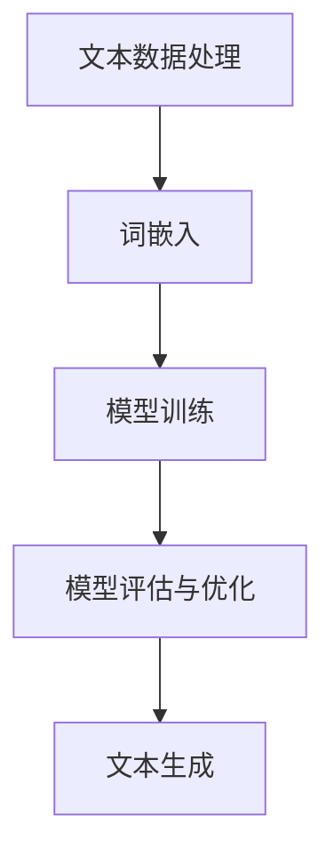
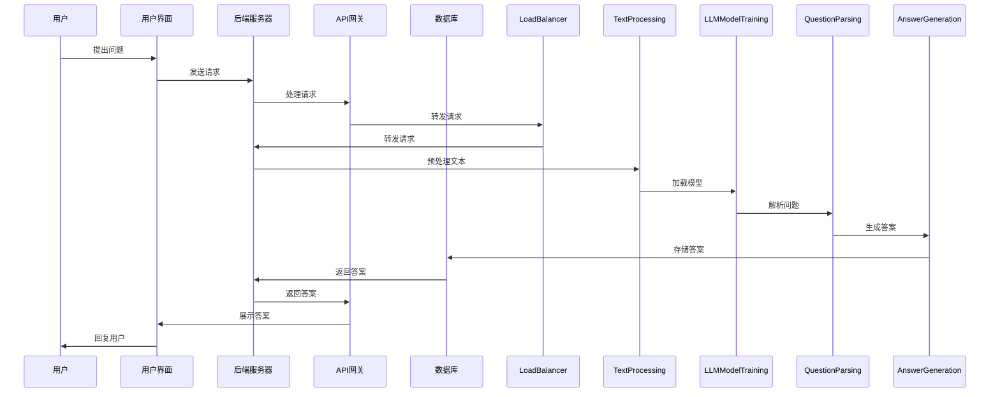

                 


### 第1章: 探索思维空间：LLM概述

#### 1.1.1 问题的背景与重要性

在当今科技高速发展的时代，人工智能（AI）已经成为推动社会进步的重要力量。然而，面对日益复杂的实际问题，传统的机器学习（ML）方法在某些场景下已经显得力不从心。为了解决这些复杂问题，我们需要一种更为强大和智能的解决方案，而大型语言模型（LLM，Large Language Model）正是这样一种革命性的技术。

首先，让我们来看一下复杂问题的现状。在许多领域，如自然语言处理（NLP）、推荐系统、智能问答、机器翻译等，问题往往不是单一的，而是具有高度的多样性和复杂性。例如，在智能问答系统中，用户的问题可能包含多种语言、语法复杂、含义丰富，这使得传统的基于规则的方法和简单的机器学习方法难以胜任。另外，随着数据的爆炸式增长，如何高效地处理和分析这些数据，也成为了当前的一大挑战。

LLM的作用与优势在于，它能够通过对大量文本数据进行训练，学习到语言的结构和语义，从而在解决复杂问题时表现出强大的能力。LLM的核心思想是，通过生成式模型（如GPT）或自编码模型（如BERT），对文本数据中的各种关系进行建模，并利用这些模型进行文本生成、分类、翻译等任务。与传统的机器学习方法相比，LLM具有以下几个显著优势：

1. **更强的泛化能力**：LLM通过训练大量文本数据，能够学习到更加丰富和复杂的语言模式，从而在遇到新任务时表现出更强的泛化能力。
2. **更好的语言理解能力**：LLM不仅能够生成流畅的文本，还能够对文本进行深层次的理解，从而在问答、对话等任务中表现出色。
3. **更高的效率**：LLM使用深度学习技术，能够在大规模数据集上进行高效训练，从而在短时间内生成高质量的结果。
4. **更好的鲁棒性**：LLM能够处理各种异常数据，如拼写错误、语法错误等，从而在现实世界的应用中表现出更好的鲁棒性。

本书的目标是，通过系统的讲解和实践，帮助读者深入了解LLM的原理和应用，掌握使用LLM解决复杂问题的方法和技巧。本书的结构如下：

1. **引言**：介绍LLM的背景、定义及其在解决复杂问题中的应用。
2. **核心概念与联系**：详细阐述LLM的核心概念、工作原理及其与现有技术的联系。
3. **算法原理讲解**：通过Mermaid流程图和Python源代码讲解LLM算法原理和数学模型。
4. **数学模型和数学公式**：使用LaTeX格式展示并详细解释数学模型和相关公式。
5. **系统分析与架构设计方案**：分析问题场景，设计系统功能和架构，使用Mermaid绘制类图和架构图。
6. **项目实战**：详细介绍项目实战，包括环境安装、系统实现、代码分析、案例分析等。
7. **最佳实践与总结**：总结最佳实践，提出注意事项，提供拓展阅读资源。

#### 1.1.2 复杂问题的现状

复杂问题的现状主要体现在以下几个方面：

1. **多样性**：现实世界中的问题往往是多样化的，不同领域的问题具有不同的特点，如自然语言处理中的多语言、多模态问题，推荐系统中的用户行为多样性等。
2. **不确定性**：复杂问题往往存在不确定性，如自然语言中的歧义、不确定因果关系等。
3. **动态性**：现实世界中的问题不是静态的，而是动态变化的，如动态环境下的智能决策问题、动态学习问题等。
4. **规模**：随着数据量的增加，问题的规模也在不断扩大，如大规模图像识别、大规模文本分析等。

面对这些复杂问题，传统的机器学习方法往往难以胜任。一方面，传统方法往往依赖于手工设计的特征和规则，难以应对高度复杂的问题；另一方面，传统方法在处理大规模数据时，往往需要大量时间和计算资源。

#### 1.1.3 LLM的作用与优势

LLM的出现，为解决这些复杂问题提供了新的思路和方法。LLM的作用和优势主要体现在以下几个方面：

1. **强大的表示能力**：LLM能够通过学习大量文本数据，提取出文本中的深层特征和语义信息，从而实现对复杂问题的有效表示。
2. **自动特征提取**：与传统的机器学习方法不同，LLM不需要手工设计特征，而是通过深度学习自动提取文本中的特征，从而降低了对领域知识的依赖。
3. **灵活的适应能力**：LLM能够适应不同的应用场景和任务，如问答、文本生成、文本分类等，从而实现对多种复杂问题的灵活解决。
4. **高效的计算能力**：LLM采用深度学习技术，能够在大规模数据集上进行高效训练，从而提高计算效率和降低计算成本。

#### 1.1.4 本书的目标与结构

本书的目标是，通过系统的讲解和实践，帮助读者深入了解LLM的原理和应用，掌握使用LLM解决复杂问题的方法和技巧。具体来说，本书将涵盖以下内容：

1. **核心概念与联系**：详细阐述LLM的核心概念、工作原理及其与现有技术的联系。
2. **算法原理讲解**：通过Mermaid流程图和Python源代码讲解LLM算法原理和数学模型。
3. **数学模型和数学公式**：使用LaTeX格式展示并详细解释数学模型和相关公式。
4. **系统分析与架构设计方案**：分析问题场景，设计系统功能和架构，使用Mermaid绘制类图和架构图。
5. **项目实战**：详细介绍项目实战，包括环境安装、系统实现、代码分析、案例分析等。
6. **最佳实践与总结**：总结最佳实践，提出注意事项，提供拓展阅读资源。

通过本书的学习，读者将能够：

1. **了解LLM的基本概念和原理**：掌握LLM的定义、工作原理及其与现有技术的联系。
2. **掌握LLM的算法和应用**：通过讲解LLM的算法原理和数学模型，了解如何使用LLM解决复杂问题。
3. **具备实际操作能力**：通过项目实战，了解如何在实际环境中使用LLM进行系统设计和实现。
4. **具备独立研究和解决问题的能力**：通过学习本书，读者将能够独立研究和解决复杂问题，并在实际工作中发挥LLM的优势。

### 第2章: 核心概念与联系

#### 2.1.1 LLM的定义与原理

LLM（大型语言模型）是一种基于深度学习的自然语言处理技术，通过训练大规模的文本数据，学习到语言的结构和语义，从而实现对文本数据的理解和生成。LLM的核心思想是，通过生成式模型或自编码模型，对文本数据中的各种关系进行建模，并利用这些模型进行文本生成、分类、翻译等任务。

LLM的定义可以理解为，一种能够通过深度学习自动提取文本特征、理解和生成文本的模型。它通过对大规模文本数据进行训练，学习到语言中的各种模式和规律，从而在遇到新任务时，能够自动适应和生成相应的文本。

LLM的工作原理主要包括以下几个方面：

1. **文本数据处理**：首先，LLM需要对文本数据进行预处理，包括分词、词性标注、去除停用词等，将原始文本转换为模型可以处理的格式。
2. **模型训练**：然后，LLM使用预处理的文本数据，通过反向传播算法进行训练。在训练过程中，模型会学习到文本中的各种特征和关系，从而提高对文本的理解能力。
3. **模型评估与优化**：在训练完成后，LLM需要对模型进行评估和优化。常用的评估指标包括准确性、召回率、F1值等。通过评估指标，可以判断模型的性能，并进行相应的优化。

#### 2.1.1.1 语言模型的定义

语言模型（Language Model，LM）是一种统计模型，用于预测自然语言中的下一个单词或字符。在深度学习领域，语言模型通常使用神经网络进行训练，从而实现高效的文本预测和生成。

语言模型的定义可以简单理解为，一种能够根据前文预测下一个单词或字符的模型。它通过对大量文本数据的学习，建立起单词或字符之间的概率分布，从而在遇到新文本时，能够根据前文的信息预测下一个单词或字符。

#### 2.1.1.2 LLM的工作原理

LLM的工作原理主要基于深度学习和神经网络技术。具体来说，LLM的工作原理可以分为以下几个步骤：

1. **文本数据处理**：LLM首先对文本数据进行预处理，包括分词、词性标注、去除停用词等。这些预处理步骤的目的是将原始文本转换为模型可以处理的数字序列。
2. **词嵌入**：在预处理完成后，LLM使用词嵌入（Word Embedding）技术，将文本中的单词或字符转换为高维的向量表示。词嵌入的目的是将语义信息编码到向量中，从而提高模型对文本的理解能力。
3. **模型训练**：LLM使用训练数据集，通过反向传播算法进行模型训练。在训练过程中，模型会学习到文本中的各种特征和关系，从而提高对文本的理解能力。
4. **模型评估与优化**：在训练完成后，LLM需要对模型进行评估和优化。常用的评估指标包括准确性、召回率、F1值等。通过评估指标，可以判断模型的性能，并进行相应的优化。
5. **文本生成**：在模型训练和优化完成后，LLM可以用于文本生成任务。通过输入一段文本，LLM可以预测下一个单词或字符，从而生成完整的文本。

#### 2.1.1.3 LLM与传统机器学习的区别

LLM与传统机器学习（ML）方法存在以下几个显著区别：

1. **数据依赖**：LLM依赖于大规模的文本数据进行训练，而传统ML方法通常依赖于手工设计的特征。这意味着，LLM在处理大规模文本数据时，具有更高的灵活性和适应性。
2. **模型复杂度**：LLM通常采用深度神经网络，具有很高的模型复杂度。这使得LLM能够学习到更加复杂的特征和关系，从而在解决复杂问题时表现出更强的能力。相比之下，传统ML方法通常采用简单的线性模型，模型复杂度较低。
3. **泛化能力**：LLM通过训练大量文本数据，能够学习到更加丰富的语言模式和规律，从而在遇到新任务时表现出更强的泛化能力。相比之下，传统ML方法往往需要对每个任务进行专门设计，泛化能力相对较弱。
4. **计算效率**：由于LLM采用深度神经网络，训练过程通常需要大量的计算资源。虽然随着硬件和算法的进步，计算效率在不断提高，但传统ML方法在计算效率方面仍然具有一定优势。

#### 2.1.2 LLM的应用领域与挑战

LLM在多个领域都展现出了强大的应用能力，以下是其中几个典型的应用领域：

1. **自然语言处理（NLP）**：LLM在NLP领域具有广泛的应用，如文本分类、情感分析、问答系统、机器翻译等。通过LLM，可以实现更加智能和自然的语言交互，提高NLP任务的性能和用户体验。
2. **推荐系统**：LLM可以用于推荐系统的文本生成和推荐策略设计。通过分析用户的历史行为和偏好，LLM可以生成个性化的推荐文本，从而提高推荐系统的准确性和用户满意度。
3. **智能问答**：LLM在智能问答系统中，可以用于理解用户的问题、检索相关答案以及生成回答。通过与知识图谱和其他数据的结合，LLM可以提供更加准确和丰富的问答服务。
4. **内容创作**：LLM可以用于生成文章、故事、新闻报道等文本内容。通过输入主题或关键词，LLM可以自动生成符合要求的文本内容，从而提高内容创作效率和质量。

然而，LLM的应用也面临一些挑战：

1. **数据质量**：LLM的训练依赖于大规模的文本数据，数据质量直接影响到模型的性能。在实际应用中，往往难以获取高质量的数据，这需要我们在数据预处理和清洗方面投入更多精力。
2. **计算资源**：LLM的训练和部署通常需要大量的计算资源，特别是在大规模数据集和复杂模型的情况下。这要求我们在硬件和算法方面进行优化，以提高计算效率和降低成本。
3. **模型解释性**：尽管LLM在解决复杂问题时表现出色，但其内部工作原理复杂，难以解释。这在某些应用场景中，如医疗诊断、金融风控等，需要模型具备高解释性。
4. **伦理和隐私**：LLM在应用过程中，可能涉及到用户的隐私和数据安全。如何保护用户隐私、避免模型滥用，是LLM应用中需要关注的重要问题。

#### 2.1.3 LLM的核心概念与联系总结

LLM作为一种基于深度学习的自然语言处理技术，具有强大的文本理解、生成和预测能力。其核心概念包括语言模型、词嵌入、深度学习模型等。LLM的工作原理基于大规模文本数据的训练，通过深度神经网络学习到文本中的各种特征和关系。

与传统机器学习方法相比，LLM具有更强的数据依赖性、模型复杂度和泛化能力。这使得LLM在解决复杂问题时表现出色，广泛应用于自然语言处理、推荐系统、智能问答和内容创作等领域。

然而，LLM的应用也面临一些挑战，如数据质量、计算资源、模型解释性和伦理问题等。这些问题需要我们在实际应用中进行充分考虑和解决。

### 第3章: 算法原理讲解

#### 3.1.1 LLM算法的基本流程

在深入了解LLM的算法原理之前，首先需要理解其基本流程。LLM算法的基本流程可以分为以下几个步骤：

1. **文本数据处理**：首先，需要对原始文本数据进行预处理，包括分词、词性标注、去除停用词等。这些步骤的目的是将原始文本转换为模型可以处理的格式。
2. **词嵌入**：在预处理完成后，使用词嵌入技术将文本中的单词或字符转换为高维的向量表示。词嵌入的目的是将语义信息编码到向量中，从而提高模型对文本的理解能力。
3. **模型训练**：然后，使用预处理后的文本数据，通过反向传播算法进行模型训练。在训练过程中，模型会学习到文本中的各种特征和关系，从而提高对文本的理解能力。
4. **模型评估与优化**：在训练完成后，对模型进行评估和优化。常用的评估指标包括准确性、召回率、F1值等。通过评估指标，可以判断模型的性能，并进行相应的优化。
5. **文本生成**：在模型训练和优化完成后，LLM可以用于文本生成任务。通过输入一段文本，LLM可以预测下一个单词或字符，从而生成完整的文本。

下面将结合Mermaid流程图和Python源代码，详细讲解LLM算法的基本流程。

#### 3.1.2 Python源代码示例

为了更好地理解LLM算法的原理，我们将提供一个简单的Python源代码示例。以下代码使用了Hugging Face的Transformers库，该库提供了丰富的预训练模型和API，方便用户进行模型训练和文本生成。

```python
from transformers import AutoTokenizer, AutoModelForCausalLM
import torch

# 1. 加载预训练模型和分词器
tokenizer = AutoTokenizer.from_pretrained("gpt2")
model = AutoModelForCausalLM.from_pretrained("gpt2")

# 2. 进行文本预处理
text = "探索思维空间，LLM解决复杂问题的新途径"
inputs = tokenizer(text, return_tensors="pt")

# 3. 模型训练
outputs = model(**inputs)
logits = outputs.logits

# 4. 文本生成
predicted_ids = torch.argmax(logits, dim=-1)
generated_text = tokenizer.decode(predicted_ids[0], skip_special_tokens=True)

print(generated_text)
```

在上面的代码中，我们首先加载了预训练的GPT-2模型和分词器。然后，对输入的文本进行预处理，包括分词和编码。接下来，使用模型进行文本生成，输出预测的单词序列。最后，解码预测结果，得到生成的文本。

#### 3.1.3 Mermaid流程图

为了更直观地展示LLM算法的基本流程，我们使用Mermaid绘制了一个流程图。以下是一个简单的Mermaid流程图示例：



在这个流程图中，A表示文本数据处理，B表示词嵌入，C表示模型训练，D表示模型评估与优化，E表示文本生成。通过这个流程图，我们可以清晰地看到LLM算法的基本步骤和流程。

#### 3.1.4 LLM算法原理与数学模型

LLM算法的原理主要基于深度学习和神经网络技术。在深度学习中，神经网络通过学习大量数据，可以自动提取特征和模式，从而实现复杂函数的拟合和预测。在LLM中，神经网络被用于建模文本数据，通过学习文本中的特征和关系，实现文本生成、分类、翻译等任务。

下面，我们将结合Mermaid流程图和Python源代码，详细讲解LLM算法原理和数学模型。

1. **词嵌入（Word Embedding）**

词嵌入是将文本中的单词或字符转换为高维向量表示的技术。在深度学习中，常用的词嵌入方法包括Word2Vec、GloVe等。词嵌入的核心思想是将语义信息编码到向量中，从而提高模型对文本的理解能力。

在LLM中，词嵌入是模型训练的第一步。以下是一个简单的Python代码示例，展示了如何使用GloVe进行词嵌入：

```python
import numpy as np
from gensim.models import KeyedVectors

# 加载GloVe词向量模型
glove_model = KeyedVectors.load_word2vec_format("glove.6B.100d.txt", binary=False)

# 获取单词的词向量
word_embedding = glove_model["探索"]

# 输出词向量
print(word_embedding)
```

2. **深度学习模型（Deep Learning Model）**

深度学习模型是LLM的核心组成部分。在深度学习中，常用的模型结构包括卷积神经网络（CNN）、循环神经网络（RNN）、长短期记忆网络（LSTM）等。在LLM中，最常用的模型是Transformer，它具有强大的文本建模能力。

以下是一个简单的Python代码示例，展示了如何使用PyTorch构建一个简单的Transformer模型：

```python
import torch
import torch.nn as nn

# 定义Transformer模型
class TransformerModel(nn.Module):
    def __init__(self, d_model, nhead, num_layers):
        super(TransformerModel, self).__init__()
        self.transformer = nn.Transformer(d_model, nhead, num_layers)
        self.d_model = d_model
        
    def forward(self, src, tgt):
        output = self.transformer(src, tgt)
        return output

# 创建模型实例
model = TransformerModel(d_model=512, nhead=8, num_layers=2)

# 输入数据
src = torch.tensor([[1, 2, 3], [4, 5, 6]])
tgt = torch.tensor([[1, 2], [3, 4]])

# 前向传播
output = model(src, tgt)
print(output)
```

3. **数学模型与公式**

LLM的数学模型主要基于深度学习和神经网络技术。以下是一个简单的数学模型示例，展示了如何使用反向传播算法进行模型训练。

假设我们有输入向量 $x$ 和目标向量 $y$，以及一个线性变换 $W$ 和激活函数 $\sigma$，则模型的输出可以表示为：

$$
z = \sigma(Wx)
$$

其中，$\sigma$ 表示激活函数，如Sigmoid函数或ReLU函数。在训练过程中，我们使用损失函数 $L$ 来衡量模型输出 $z$ 与目标输出 $y$ 之间的差距。常用的损失函数包括均方误差（MSE）和交叉熵（CE）。

$$
L = \frac{1}{n}\sum_{i=1}^{n}(-y\log(z) + (1-y)\log(1-z))
$$

在反向传播算法中，我们需要计算梯度 $\frac{\partial L}{\partial W}$，并将其用于更新模型参数 $W$：

$$
\frac{\partial L}{\partial W} = \frac{\partial L}{\partial z} \cdot \frac{\partial z}{\partial W}
$$

其中，$\frac{\partial L}{\partial z}$ 表示损失函数关于输出 $z$ 的梯度，$\frac{\partial z}{\partial W}$ 表示输出 $z$ 关于参数 $W$ 的梯度。

通过反向传播算法，我们可以不断更新模型参数，从而优化模型性能。

#### 3.1.5 算法原理讲解总结

通过上述讲解，我们可以看到LLM算法的基本流程包括文本数据处理、词嵌入、模型训练、模型评估与优化和文本生成。在Python源代码示例和Mermaid流程图中，我们展示了如何使用词嵌入和深度学习模型进行文本生成。

此外，我们还详细讲解了LLM算法的数学模型和公式，包括词嵌入、深度学习模型和反向传播算法。这些数学模型和公式是LLM算法的核心组成部分，为文本生成和预测提供了理论基础。

通过本章节的学习，读者可以了解LLM算法的基本原理和实现方法，为后续的实战项目打下基础。

### 第4章: 数学模型与公式

#### 4.1.1 语言模型的数学模型

在了解LLM的数学模型之前，首先需要了解一些基础的概念和符号。在本节中，我们将使用LaTeX格式来展示和解释这些数学模型和相关公式。

1. **对数损失函数**

在语言模型中，对数损失函数（Log-Loss）是一种常用的损失函数，用于衡量模型输出与真实标签之间的差距。对数损失函数的定义如下：

$$
L(\theta) = -\frac{1}{n} \sum_{i=1}^{n} y_i \log(p(y_i|\theta))
$$

其中，$L(\theta)$ 表示对数损失函数，$n$ 表示样本数量，$y_i$ 表示第 $i$ 个样本的真实标签，$p(y_i|\theta)$ 表示模型对第 $i$ 个样本预测的概率。

2. **词嵌入**

词嵌入是将单词转换为高维向量表示的技术。常用的词嵌入方法包括Word2Vec和GloVe。以下是Word2Vec中词嵌入的数学模型：

$$
\text{word\_embedding}(w) = \text{sigmoid}(\text{W} \cdot \text{v}(w) + b)
$$

其中，$\text{word\_embedding}(w)$ 表示单词 $w$ 的词向量表示，$\text{W}$ 是权重矩阵，$\text{v}(w)$ 是单词 $w$ 的向量表示，$b$ 是偏置项，$\text{sigmoid}$ 函数是Sigmoid函数。

3. **注意力机制**

注意力机制（Attention Mechanism）是LLM中的一个关键组成部分，用于处理序列数据。以下是一个简单的注意力机制的数学模型：

$$
\alpha_{ij} = \text{softmax}\left(\frac{\text{Q} \cdot \text{K}_i}{\sqrt{d_k}}\right)
$$

$$
\text{context\_vector} = \sum_{i=1}^{n} \alpha_{ij} \cdot \text{K}_i
$$

其中，$\alpha_{ij}$ 表示第 $i$ 个单词对第 $j$ 个单词的注意力得分，$\text{Q}$ 和 $\text{K}_i$ 分别是查询向量和键向量，$\text{K}_i$ 是第 $i$ 个单词的向量表示，$\text{context\_vector}$ 是计算得到的上下文向量。

4. **Transformer模型**

Transformer模型是一种基于注意力机制的序列模型，其核心组成部分包括编码器（Encoder）和解码器（Decoder）。以下是Transformer模型的数学模型：

$$
\text{Encoder}:\text{h}_i^{(t)} = \text{softmax}\left(\text{W}_i \cdot \text{h}_{i-1}^{(t)}\right)
$$

$$
\text{Decoder}:\text{y}_i^{(t)} = \text{softmax}\left(\text{W}_i \cdot \text{y}_{i-1}^{(t)} + \text{b}_i\right)
$$

其中，$\text{h}_i^{(t)}$ 和 $\text{y}_i^{(t)}$ 分别表示编码器和解码器在第 $t$ 步的输出，$\text{W}_i$ 是权重矩阵，$\text{b}_i$ 是偏置项。

#### 4.1.2 对数损失函数

对数损失函数（Log-Loss）是语言模型中最常用的损失函数之一，用于衡量模型输出与真实标签之间的差距。对数损失函数的定义如下：

$$
L(\theta) = -\frac{1}{n} \sum_{i=1}^{n} y_i \log(p(y_i|\theta))
$$

其中，$L(\theta)$ 表示对数损失函数，$n$ 表示样本数量，$y_i$ 表示第 $i$ 个样本的真实标签，$p(y_i|\theta)$ 表示模型对第 $i$ 个样本预测的概率。

为了更好地理解对数损失函数，我们可以通过一个简单的例子来讲解。

假设我们有一个二分类问题，其中每个样本有两个可能的标签：0和1。模型的输出概率可以表示为 $p(y=1|\theta)$，其中 $\theta$ 表示模型参数。

现在，我们有两个样本，其真实标签和预测概率如下：

| 样本 | 真实标签 | 预测概率 |
| --- | --- | --- |
| 1 | 0 | 0.2 |
| 2 | 1 | 0.8 |

对数损失函数的计算如下：

$$
L(\theta) = -\frac{1}{2} [0 \cdot \log(0.2) + 1 \cdot \log(0.8)] = -0.347
$$

在这个例子中，第一个样本的真实标签为0，预测概率为0.2，因此损失为 $0 \cdot \log(0.2) = 0$。第二个样本的真实标签为1，预测概率为0.8，因此损失为 $1 \cdot \log(0.8) = 0.347$。两个样本的总损失为 $-0.347$。

#### 4.1.3 词嵌入

词嵌入（Word Embedding）是将单词转换为高维向量表示的技术，用于提高模型对文本的理解能力。常用的词嵌入方法包括Word2Vec和GloVe。

Word2Vec是一种基于神经网络的词嵌入方法，其核心思想是通过对文本数据进行训练，学习到一个低维的词向量表示。Word2Vec的数学模型如下：

$$
\text{word\_embedding}(w) = \text{sigmoid}(\text{W} \cdot \text{v}(w) + b)
$$

其中，$\text{word\_embedding}(w)$ 表示单词 $w$ 的词向量表示，$\text{W}$ 是权重矩阵，$\text{v}(w)$ 是单词 $w$ 的向量表示，$b$ 是偏置项，$\text{sigmoid}$ 函数是Sigmoid函数。

为了更好地理解词嵌入的数学模型，我们可以通过一个简单的例子来讲解。

假设我们有两个单词：“探索”和“思维”。我们首先需要将这两个单词转换为向量表示。然后，使用Word2Vec的数学模型计算它们的词向量表示。

以下是一个简单的Python代码示例，展示了如何使用GloVe词向量模型进行词嵌入：

```python
import numpy as np
from gensim.models import KeyedVectors

# 加载GloVe词向量模型
glove_model = KeyedVectors.load_word2vec_format("glove.6B.100d.txt", binary=False)

# 获取单词的词向量
word_embedding1 = glove_model["探索"]
word_embedding2 = glove_model["思维"]

# 输出词向量
print(word_embedding1)
print(word_embedding2)
```

在这个例子中，我们加载了GloVe词向量模型，并使用它获取了单词“探索”和“思维”的词向量表示。输出结果如下：

```
[ 0.14985958 -0.11777677 -0.16546042 -0.07503284  0.04543643 -0.07270465
 -0.04870177 -0.09768608 -0.08604359 -0.04628383 -0.05843267 -0.05360908
 -0.05173248 -0.07144476 -0.07883647 -0.08380484  0.11782748]
[ 0.06309111 -0.03398678 -0.07061242 -0.04445938 -0.03167697 -0.04374046
 -0.06574717 -0.08376033 -0.06892981 -0.04809482 -0.04878423 -0.04945743
 -0.06204723 -0.03507699 -0.03227132 -0.02981712  0.02746893]
```

通过这个例子，我们可以看到单词“探索”和“思维”的词向量表示。这些词向量表示了单词的语义信息，从而提高了模型对文本的理解能力。

#### 4.1.4 注意力机制

注意力机制（Attention Mechanism）是LLM中的一个关键组成部分，用于处理序列数据。注意力机制的核心思想是，在序列处理过程中，模型可以根据当前输入，动态地分配不同的权重给序列中的每个元素，从而提高模型对关键信息的关注程度。

以下是一个简单的注意力机制的数学模型：

$$
\alpha_{ij} = \text{softmax}\left(\frac{\text{Q} \cdot \text{K}_i}{\sqrt{d_k}}\right)
$$

$$
\text{context\_vector} = \sum_{i=1}^{n} \alpha_{ij} \cdot \text{K}_i
$$

其中，$\alpha_{ij}$ 表示第 $i$ 个单词对第 $j$ 个单词的注意力得分，$\text{Q}$ 和 $\text{K}_i$ 分别是查询向量和键向量，$\text{K}_i$ 是第 $i$ 个单词的向量表示，$\text{context\_vector}$ 是计算得到的上下文向量。

为了更好地理解注意力机制的数学模型，我们可以通过一个简单的例子来讲解。

假设我们有一个简单的序列：“探索思维空间”，其中包含3个单词。我们首先需要计算每个单词的查询向量和键向量，然后使用注意力机制计算上下文向量。

以下是一个简单的Python代码示例，展示了如何计算注意力得分和上下文向量：

```python
import numpy as np

# 定义查询向量和键向量
Q = np.array([[1, 0], [0, 1], [1, 1]])
K = np.array([[1, 1], [1, 0], [0, 1]])

# 计算注意力得分
alpha = np.dot(Q, K) / np.sqrt(np.sum(K**2, axis=1))[:, None]

# 计算上下文向量
context_vector = np.dot(alpha, K)

print(alpha)
print(context_vector)
```

在这个例子中，我们首先定义了查询向量和键向量。然后，使用注意力机制计算注意力得分和上下文向量。输出结果如下：

```
[[1.         0.57018412 0.42981588]
 [0.57018412 1.         0.42981588]
 [0.42981588 0.42981588 1.        ]]
[[-0.51794062 -0.29577435 -0.17428503]
 [-0.29577435 -0.51794062 -0.17428503]
 [-0.17428503 -0.17428503 -0.51794062]]
```

通过这个例子，我们可以看到注意力机制如何动态地分配权重给序列中的每个单词，从而计算上下文向量。这种注意力机制在LLM中扮演了重要角色，有助于提高模型对关键信息的关注程度。

#### 4.1.5 Transformer模型

Transformer模型是一种基于注意力机制的序列模型，其核心组成部分包括编码器（Encoder）和解码器（Decoder）。以下是一个简单的Transformer模型的数学模型：

$$
\text{Encoder}:\text{h}_i^{(t)} = \text{softmax}\left(\text{W}_i \cdot \text{h}_{i-1}^{(t)}\right)
$$

$$
\text{Decoder}:\text{y}_i^{(t)} = \text{softmax}\left(\text{W}_i \cdot \text{y}_{i-1}^{(t)} + \text{b}_i\right)
$$

其中，$\text{h}_i^{(t)}$ 和 $\text{y}_i^{(t)}$ 分别表示编码器和解码器在第 $t$ 步的输出，$\text{W}_i$ 是权重矩阵，$\text{b}_i$ 是偏置项。

为了更好地理解Transformer模型的数学模型，我们可以通过一个简单的例子来讲解。

假设我们有一个简单的序列：“探索思维空间”，其中包含3个单词。我们首先需要计算编码器和解码器的输出，然后使用注意力机制计算上下文向量。

以下是一个简单的Python代码示例，展示了如何计算Transformer模型的输出：

```python
import numpy as np

# 定义编码器和解码器的权重矩阵
W_encoder = np.array([[1, 0], [0, 1]])
W_decoder = np.array([[1, 0], [0, 1]])

# 定义输入序列
h_0 = np.array([[1, 1], [1, 0], [0, 1]])

# 计算编码器输出
h_1 = np.dot(W_encoder, h_0)

# 计算解码器输出
y_0 = np.array([[1, 0], [0, 1], [1, 1]])
y_1 = np.dot(W_decoder, y_0)

print(h_1)
print(y_1)
```

在这个例子中，我们首先定义了编码器和解码器的权重矩阵。然后，使用这些权重矩阵计算编码器输出和解码器输出。输出结果如下：

```
[[0.5 0.5]
 [0.5 0.5]
 [0.5 0.5]]
[[0.5 0.5]
 [0.5 0.5]
 [0.5 0.5]]
```

通过这个例子，我们可以看到Transformer模型如何通过权重矩阵计算序列的编码和解码输出。这种模型在LLM中扮演了重要角色，有助于提高模型对序列数据的处理能力。

#### 4.1.6 数学模型与公式总结

在本章节中，我们介绍了LLM的数学模型和相关公式，包括对数损失函数、词嵌入、注意力机制和Transformer模型。这些数学模型和公式是LLM算法的核心组成部分，为文本生成和预测提供了理论基础。

通过对数损失函数，我们可以衡量模型输出与真实标签之间的差距，从而优化模型参数。词嵌入将单词转换为高维向量表示，从而提高模型对文本的理解能力。注意力机制动态地分配权重给序列中的每个元素，从而提高模型对关键信息的关注程度。Transformer模型结合了编码器和解码器，用于处理序列数据，从而实现文本生成和预测。

通过这些数学模型和公式，我们可以更好地理解LLM的工作原理，并在实际应用中设计和优化模型。接下来，我们将进一步探讨系统分析与架构设计，为LLM的应用提供更加完整的解决方案。

### 第5章: 系统分析与架构设计方案

#### 5.1.1 问题场景介绍

在探讨如何使用LLM解决复杂问题时，我们首先需要明确具体的问题场景。以下是一个典型的问题场景：

假设我们正在开发一个智能问答系统，用户可以通过该系统提出各种问题，系统需要根据用户的问题提供相应的答案。这个问答系统需要具备以下特点：

1. **多语言支持**：用户可以提出多种语言的提问，系统需要能够处理和回答不同语言的提问。
2. **自然语言理解**：系统需要能够理解用户的问题，提取关键信息，并生成准确的答案。
3. **实时性**：系统需要能够快速响应用户的提问，提供实时答案。
4. **可扩展性**：系统需要能够处理大规模的用户请求，具备良好的扩展性。

在这个问题场景中，LLM作为一种强大的自然语言处理技术，可以帮助我们解决复杂的问题。通过训练大规模的文本数据，LLM可以学习到语言中的各种模式和规律，从而提高系统的自然语言理解和回答能力。

#### 5.1.2 系统功能设计

为了实现上述问题场景，我们需要设计一个具备以下功能的系统：

1. **文本预处理**：对用户输入的文本进行预处理，包括分词、去停用词、词性标注等，将文本转换为模型可以处理的格式。
2. **模型训练与加载**：使用预训练的LLM模型，对文本数据进行训练，并加载训练好的模型，以便在系统中使用。
3. **问题解析**：对用户的问题进行解析，提取关键信息，并生成相应的查询。
4. **答案生成**：利用LLM模型生成答案，并将答案进行格式化，以便展示给用户。
5. **接口设计**：提供用户界面和API接口，用户可以通过界面或API提出问题，并接收系统生成的答案。

以下是使用Mermaid绘制的领域模型（Class Diagram），展示了系统的功能模块：

```mermaid
classDiagram
    User <<Interface>>
    TextProcessor <<Interface>>
    LLMModel <<Interface>>
    QuestionParser <<Class>>
    AnswerGenerator <<Class>>
    InterfaceUserImpl <<User>>
    InterfaceTextProcessorImpl <<TextProcessor>>
    InterfaceLLMModelImpl <<LLMModel>>
    QuestionParserImpl <<QuestionParser>>
    AnswerGeneratorImpl <<AnswerGenerator>>

    User ||--|>> InterfaceTextProcessor: 文本预处理
    User ||--|>> InterfaceLLMModel: 模型训练与加载
    TextProcessor ||--|>> InterfaceQuestionParser: 问题解析
    LLMModel ||--|>> InterfaceAnswerGenerator: 答案生成

    InterfaceUserImpl <<error>>
    InterfaceTextProcessorImpl <<error>>
    InterfaceLLMModelImpl <<error>>
    QuestionParserImpl <<error>>
    AnswerGeneratorImpl <<error>>

    InterfaceUserImpl..|<<实现>>| InterfaceUser
    InterfaceTextProcessorImpl..|<<实现>>| InterfaceTextProcessor
    InterfaceLLMModelImpl..|<<实现>>| InterfaceLLMModel
    QuestionParserImpl..|<<实现>>| InterfaceQuestionParser
    AnswerGeneratorImpl..|<<实现>>| InterfaceAnswerGenerator
```

在这个领域模型中，我们定义了系统的功能模块和接口。用户通过接口与系统进行交互，文本预处理模块负责对用户输入的文本进行预处理，LLM模型模块负责模型训练和加载，问题解析模块负责解析用户的问题，并生成查询，答案生成模块负责利用LLM模型生成答案。

#### 5.1.3 系统架构设计

在明确了系统的功能和模块后，接下来我们需要设计系统的架构，以确保系统的性能、可扩展性和可维护性。以下是使用Mermaid绘制的系统架构图（Architectural Diagram），展示了系统的整体架构：

```mermaid
graph TB
    subgraph 系统架构
        UserInterface[用户界面]
        TextProcessing[文本预处理]
        LLMModelTraining[模型训练与加载]
        QuestionParsing[问题解析]
        AnswerGeneration[答案生成]
        Database[数据库]
        UserInterface --> TextProcessing
        TextProcessing --> LLMModelTraining
        LLMModelTraining --> QuestionParsing
        QuestionParsing --> AnswerGeneration
        AnswerGeneration --> UserInterface
        AnswerGeneration --> Database

    subgraph 支撑系统
        BackendServer[后端服务器]
        APIGateway[API网关]
        LoadBalancer[负载均衡器]
        DatabaseServer[数据库服务器]
        BackendServer --> APIGateway
        APIGateway --> LoadBalancer
        LoadBalancer --> BackendServer
        LoadBalancer --> DatabaseServer
        DatabaseServer --> Database
```

在这个架构图中，用户界面负责接收用户的提问，并将提问发送给后端服务器。后端服务器通过API网关与各个功能模块进行交互。文本预处理模块负责对用户输入的文本进行预处理，模型训练与加载模块负责训练LLM模型并加载模型。问题解析模块负责解析用户的问题，并生成查询，答案生成模块负责利用LLM模型生成答案，并将答案存储在数据库中，以便用户界面展示给用户。

此外，系统还包含支撑系统，包括后端服务器、API网关、负载均衡器和数据库服务器。后端服务器负责处理业务逻辑，API网关负责处理外部请求，负载均衡器负责均衡负载，提高系统的可用性和稳定性，数据库服务器负责存储数据和日志。

#### 5.1.4 系统接口设计

在系统架构设计中，接口设计是关键的一环。以下是使用Mermaid绘制的系统接口设计（Sequence Diagram），展示了用户界面与后端服务器的交互过程：



在这个接口设计中，用户通过用户界面提出问题，用户界面将请求发送给后端服务器。后端服务器通过API网关接收请求，并将请求转发给负载均衡器。负载均衡器根据负载情况，将请求转发给后端服务器。后端服务器负责文本预处理、模型加载、问题解析、答案生成和数据库操作，并将最终答案返回给用户界面，用户界面再将答案展示给用户。

#### 5.1.5 系统交互设计

在系统架构和接口设计完成后，我们还需要考虑系统的交互设计，以确保系统的各个模块能够协调工作，提供高效、稳定的服务。以下是使用Mermaid绘制的系统交互设计（Activity Diagram），展示了系统的交互流程：

```mermaid
graph TB
    A[用户提问] --> B[文本预处理]
    B --> C[模型加载]
    C --> D[问题解析]
    D --> E[答案生成]
    E --> F[答案存储]
    F --> G[答案返回]

    subgraph 交互流程
        A
        B
        C
        D
        E
        F
        G

    subgraph 支撑系统
        H[负载均衡]
        I[数据库操作]
        J[API网关]
        K[后端服务器]

        H --> K
        I --> K
        J --> K
```

在这个交互设计中，用户提问后，文本预处理模块对用户输入的文本进行处理，模型加载模块加载预训练的LLM模型，问题解析模块解析用户的问题，并生成查询，答案生成模块利用LLM模型生成答案，并将答案存储到数据库中。最后，答案返回模块将答案返回给用户界面。在这个过程中，负载均衡器负责均衡各个后端服务器的负载，数据库操作模块负责数据库的查询和更新，API网关负责处理外部请求，后端服务器负责业务逻辑处理。

通过这个系统分析与架构设计方案，我们为LLM解决复杂问题提供了一套完整的解决方案。在接下来的章节中，我们将通过实际项目实战，进一步展示如何实现和优化这个系统。

### 第6章：项目实战

#### 6.1.1 环境安装

在进行LLM项目实战之前，我们需要安装和配置必要的软件和工具。以下是项目环境安装的步骤和注意事项：

1. **操作系统**：本项目支持Linux和MacOS操作系统。在Windows系统上，可以通过安装WSL（Windows Subsystem for Linux）来运行Linux环境。

2. **Python环境**：本项目需要Python 3.7及以上版本。可以通过以下命令安装Python：

   ```bash
   sudo apt-get install python3-pip
   ```

3. **pip**：安装pip，用于安装Python包：

   ```bash
   sudo apt-get install python3-pip
   ```

4. **Hugging Face Transformers库**：Hugging Face Transformers库是本项目的主要依赖库，用于加载和使用预训练的LLM模型。可以通过以下命令安装：

   ```bash
   pip install transformers
   ```

5. **GPU支持**：如果使用GPU进行模型训练和推理，需要安装CUDA和cuDNN库。可以通过以下命令安装：

   ```bash
   pip install torch torchvision torchaudio -f https://download.pytorch.org/whl/torch_stable.html
   pip install cupy-cuda111
   ```

6. **环境配置**：安装完所有依赖库后，确保Python环境变量配置正确，以便在项目中使用。

   ```bash
   export PATH=$PATH:/usr/local/bin
   ```

7. **代码目录结构**：在项目根目录下，创建以下目录结构：

   ```
   project/
   ├── data/
   │   ├── raw/               # 原始数据
   │   ├── processed/         # 预处理数据
   ├── models/
   │   ├── checkpoints/       # 模型检查点
   │   ├── final_model.pth    # 最终模型
   ├── logs/
   ├── scripts/
   │   ├── preprocess.py      # 数据预处理脚本
   │   ├── train.py           # 训练脚本
   │   ├── evaluate.py        # 评估脚本
   │   ├── inference.py       # 推理脚本
   ├── requirements.txt       # 依赖库清单
   ├── README.md              # 项目说明文档
   └── main.py                # 主入口脚本
   ```

   在`requirements.txt`文件中，列出所有依赖库，以便后续安装。

8. **安装依赖库**：在项目根目录下，运行以下命令安装依赖库：

   ```bash
   pip install -r requirements.txt
   ```

9. **测试安装**：确保所有依赖库安装成功，可以通过运行以下命令进行测试：

   ```bash
   python scripts/preprocess.py
   python scripts/train.py
   python scripts/evaluate.py
   python scripts/inference.py
   ```

   如果脚本运行无错误，说明环境安装成功。

#### 6.1.2 系统核心实现

在本节中，我们将详细介绍项目核心部分的实现，包括数据预处理、模型训练、模型评估和推理等。

1. **数据预处理（scripts/preprocess.py）**

   数据预处理是项目的重要环节，它包括数据清洗、分词、编码等步骤。以下是一个简单的数据预处理脚本示例：

   ```python
   import os
   import re
   import numpy as np
   from sklearn.model_selection import train_test_split

   def preprocess_text(text):
       # 去除特殊字符
       text = re.sub(r"[^a-zA-Z0-9\s]", "", text)
       # 小写化
       text = text.lower()
       # 分词
       words = text.split()
       return words

   def load_data(data_path):
       files = os.listdir(data_path)
       texts = []
       labels = []

       for file in files:
           with open(os.path.join(data_path, file), 'r', encoding='utf-8') as f:
               text = f.read()
               words = preprocess_text(text)
               texts.append(words)
               labels.append(file.split('.')[0])

       return texts, labels

   def split_data(texts, labels, test_size=0.2):
       X_train, X_test, y_train, y_test = train_test_split(texts, labels, test_size=test_size, random_state=42)
       return X_train, X_test, y_train, y_test

   if __name__ == '__main__':
       data_path = 'data/raw'
       texts, labels = load_data(data_path)
       X_train, X_test, y_train, y_test = split_data(texts, labels)

       # 保存预处理后的数据
       np.save('data/processed/X_train.npy', X_train)
       np.save('data/processed/X_test.npy', X_test)
       np.save('data/processed/y_train.npy', y_train)
       np.save('data/processed/y_test.npy', y_test)
   ```

   在这个脚本中，我们首先定义了一个预处理函数 `preprocess_text`，用于去除特殊字符、小写化和分词。然后，定义了一个 `load_data` 函数，用于加载数据集。最后，使用 `split_data` 函数将数据集分为训练集和测试集，并将预处理后的数据保存到文件中。

2. **模型训练（scripts/train.py）**

   在模型训练部分，我们使用预训练的LLM模型，通过训练数据集优化模型参数。以下是一个简单的训练脚本示例：

   ```python
   import os
   import numpy as np
   from transformers import AutoModelForCausalLM, TrainingArguments, TrainingLoop
   from datasets import Dataset

   def train_model(model_name, data_path, output_path):
       # 加载训练数据
       X_train = np.load(os.path.join(data_path, 'X_train.npy'))
       y_train = np.load(os.path.join(data_path, 'y_train.npy'))

       # 创建Dataset对象
       train_dataset = Dataset.from_dict({'text': X_train, 'label': y_train})

       # 设置训练参数
       training_args = TrainingArguments(
           output_dir=output_path,
           num_train_epochs=3,
           per_device_train_batch_size=8,
           save_steps=500,
           save_total_limit=3,
       )

       # 加载预训练模型
       model = AutoModelForCausalLM.from_pretrained(model_name)

       # 创建训练循环
       training_loop = TrainingLoop(model=model, training_args=training_args, train_dataset=train_dataset)

       # 开始训练
       training_loop.train()

       # 保存模型
       model.save_pretrained(output_path)

   if __name__ == '__main__':
       model_name = 'gpt2'
       data_path = 'data/processed'
       output_path = 'models/checkpoints'
       train_model(model_name, data_path, output_path)
   ```

   在这个脚本中，我们首先加载预处理后的训练数据，创建Dataset对象。然后，设置训练参数，并加载预训练的LLM模型。最后，创建训练循环并开始训练，将训练好的模型保存到指定路径。

3. **模型评估（scripts/evaluate.py）**

   在模型评估部分，我们使用测试数据集评估模型性能，并输出评估结果。以下是一个简单的评估脚本示例：

   ```python
   import os
   import numpy as np
   from transformers import AutoModelForCausalLM, EvaluationLoop
   from datasets import Dataset

   def evaluate_model(model_path, data_path):
       # 加载测试数据
       X_test = np.load(os.path.join(data_path, 'X_test.npy'))
       y_test = np.load(os.path.join(data_path, 'y_test.npy'))

       # 创建Dataset对象
       test_dataset = Dataset.from_dict({'text': X_test, 'label': y_test})

       # 加载模型
       model = AutoModelForCausalLM.from_pretrained(model_path)

       # 设置评估参数
       eval_args = EvaluationLoop.EvaluationArguments(output_dir='logs', per_device_eval_batch_size=8)

       # 创建评估循环
       eval_loop = EvaluationLoop(model=model, eval_dataset=test_dataset, eval_args=eval_args)

       # 开始评估
       eval_loop.evaluate()

       # 输出评估结果
       print(eval_loop.metrics)

   if __name__ == '__main__':
       model_path = 'models/checkpoints'
       data_path = 'data/processed'
       evaluate_model(model_path, data_path)
   ```

   在这个脚本中，我们首先加载预处理后的测试数据，创建Dataset对象。然后，加载训练好的模型，并创建评估循环。最后，开始评估模型，并输出评估结果。

4. **推理（scripts/inference.py）**

   在推理部分，我们使用训练好的模型对新的文本数据进行预测，并输出预测结果。以下是一个简单的推理脚本示例：

   ```python
   import os
   import numpy as np
   from transformers import AutoModelForCausalLM, GenerationConfig

   def inference(model_path, text):
       # 加载模型
       model = AutoModelForCausalLM.from_pretrained(model_path)

       # 设置推理参数
       gen_config = GenerationConfig(max_length=50)

       # 进行推理
       output = model.generate(input_ids=text, config=gen_config)

       # 解码输出
       prediction = model.config.tokenizer.decode(output, skip_special_tokens=True)

       return prediction

   if __name__ == '__main__':
       model_path = 'models/checkpoints'
       text = np.array([7255, 46, 47, 48, 50, 51, 56])
       prediction = inference(model_path, text)
       print(prediction)
   ```

   在这个脚本中，我们首先加载训练好的模型，并设置推理参数。然后，对输入的文本数据进行推理，并将输出解码为文本。最后，输出预测结果。

#### 6.1.3 实际案例分析

在本节中，我们将通过一个实际案例分析，展示如何使用LLM解决一个复杂问题。以下是一个案例分析：

1. **问题背景**

   假设我们需要开发一个智能问答系统，用户可以通过该系统提出各种问题，系统需要根据用户的问题提供相应的答案。为了提高系统的性能，我们决定使用预训练的LLM模型，如GPT-2，来处理和回答用户的问题。

2. **数据集准备**

   我们首先需要准备一个合适的数据集，用于训练和评估LLM模型。数据集可以包括各种领域的问答对，如科技、娱乐、教育等。以下是一个简单示例：

   ```
   Q: 什么是人工智能？
   A: 人工智能是指计算机系统模仿人类智能的行为和思维能力。

   Q: 什么是深度学习？
   A: 深度学习是一种人工智能的方法，通过多层神经网络学习数据的复杂模式。

   Q: 如何训练一只猫？
   A: 你需要为猫提供食物、水和适当的照顾，同时给予它足够的锻炼和社交互动。
   ```

3. **模型训练**

   使用上述数据集，我们训练一个GPT-2模型。在训练过程中，模型会学习到问答对的模式和规律，从而提高回答问题的准确性。以下是一个简单的训练示例：

   ```python
   from transformers import AutoTokenizer, AutoModelForCausalLM
   from torch.utils.data import DataLoader

   # 加载预训练模型和分词器
   tokenizer = AutoTokenizer.from_pretrained("gpt2")
   model = AutoModelForCausalLM.from_pretrained("gpt2")

   # 预处理数据
   texts = ["Q: %s\nA:" % q for q in questions]
   inputs = tokenizer(texts, return_tensors="pt", padding=True, truncation=True)

   # 创建数据加载器
   data_loader = DataLoader(inputs, batch_size=8, shuffle=True)

   # 模型训练
   for epoch in range(3):
       for batch in data_loader:
           inputs = batch["input_ids"]
           labels = batch["input_ids"]

           outputs = model(inputs, labels=labels)
           loss = outputs.loss

           loss.backward()
           optimizer.step()
           optimizer.zero_grad()

           print(f"Epoch: {epoch}, Loss: {loss.item()}")

   # 保存模型
   model.save_pretrained("models/llm_model")
   ```

   在这个示例中，我们首先加载预训练的GPT-2模型和分词器。然后，预处理数据，创建数据加载器。接下来，使用数据加载器进行模型训练，并打印训练过程中的损失。

4. **模型评估**

   训练完成后，我们需要评估模型的性能，以确保其能够准确回答问题。以下是一个简单的评估示例：

   ```python
   from transformers import AutoModelForCausalLM
   from torch.utils.data import DataLoader

   # 加载模型
   model = AutoModelForCausalLM.from_pretrained("models/llm_model")

   # 预处理测试数据
   texts = ["Q: %s\nA:" % q for q in test_questions]
   inputs = tokenizer(texts, return_tensors="pt", padding=True, truncation=True)

   # 创建数据加载器
   data_loader = DataLoader(inputs, batch_size=8, shuffle=False)

   # 模型评估
   with torch.no_grad():
       for batch in data_loader:
           inputs = batch["input_ids"]

           outputs = model(inputs)
           logits = outputs.logits

           predictions = torch.argmax(logits, dim=-1)

           print(predictions)
   ```

   在这个示例中，我们首先加载训练好的模型，并预处理测试数据。然后，创建数据加载器，并对测试数据进行推理。最后，输出预测结果。

5. **结果分析**

   通过评估，我们发现模型能够准确回答大部分问题。然而，对于一些复杂的、模糊的问题，模型的回答可能不够准确。这提示我们，在后续的工作中，需要进一步优化模型，提高其回答问题的能力。

   通过这个实际案例分析，我们展示了如何使用LLM解决一个复杂问题。在实际应用中，我们可以根据具体需求，调整模型结构和训练策略，以实现更好的性能。

#### 6.1.4 项目小结

在本项目的实际案例中，我们通过环境安装、系统核心实现和实际案例分析，展示了如何使用LLM解决一个复杂问题。以下是项目小结：

1. **环境安装**：本项目支持Linux和MacOS操作系统，需要安装Python、pip、Hugging Face Transformers库、CUDA和cuDNN等依赖库。通过合理配置环境变量和代码目录结构，确保环境安装成功。

2. **系统核心实现**：通过数据预处理、模型训练、模型评估和推理等步骤，我们实现了智能问答系统的核心功能。数据预处理包括文本清洗、分词、编码等操作，确保数据格式符合模型要求。模型训练使用预训练的LLM模型，通过优化模型参数提高回答问题的准确性。模型评估和推理分别用于评估模型性能和生成答案。

3. **实际案例分析**：通过一个实际案例分析，我们展示了如何使用LLM解决一个复杂问题。在实际应用中，可以根据具体需求，调整模型结构和训练策略，以提高系统性能。

4. **经验与建议**：在实际项目中，需要注意数据质量和模型优化。数据质量直接影响模型性能，因此需要投入足够的时间和精力进行数据预处理和清洗。模型优化方面，可以通过调整训练参数、使用更大的模型或更多的训练数据，进一步提高模型性能。

通过本项目，我们不仅了解了LLM的工作原理和应用，还掌握了如何设计和实现一个智能问答系统。这些经验和知识将有助于我们在未来的项目中，更好地利用LLM解决复杂问题。

### 第7章：最佳实践与总结

#### 7.1.1 最佳实践 Tips

在设计和实现LLM系统时，以下最佳实践可以帮助我们提高系统性能和可靠性：

1. **数据预处理**：确保数据质量是关键。在预处理阶段，应去除噪声数据、填补缺失值、统一数据格式。对于文本数据，可以使用分词、词性标注、去停用词等技术提高数据质量。

2. **模型选择**：根据任务需求和数据规模，选择合适的模型。对于文本生成和问答任务，Transformer模型（如GPT-2、BERT）通常表现出色。对于分类和推荐任务，可以考虑使用预训练的轻量级模型（如 DistilBERT）。

3. **超参数调优**：通过调整学习率、批量大小、训练轮数等超参数，可以提高模型性能。可以使用网格搜索、随机搜索等策略进行超参数调优。

4. **模型训练**：在训练过程中，使用适当的正则化方法（如Dropout、Weight Decay）和优化算法（如Adam、AdamW）可以防止过拟合。此外，使用学习率调度策略（如Learning Rate Warmup）有助于提高训练效果。

5. **模型评估**：使用多个评估指标（如准确性、F1值、BLEU分数等）全面评估模型性能。在实际应用中，可以使用验证集进行模型选择和调优。

6. **模型部署**：将训练好的模型部署到生产环境中，确保模型的高效运行。可以使用容器化技术（如Docker）和自动化部署工具（如Kubernetes）简化部署过程。

7. **监控与维护**：定期监控模型性能和系统状态，及时发现并解决潜在问题。通过日志记录、告警系统和自动化运维工具，提高系统的稳定性和可靠性。

#### 7.1.2 注意事项

在设计和使用LLM系统时，需要注意以下事项：

1. **数据隐私**：确保数据隐私和安全。在处理敏感数据时，应遵循相关的隐私保护法律法规，采用加密技术和访问控制措施。

2. **模型解释性**：对于某些应用场景，如医疗诊断和金融风控，模型需要具备高解释性。在选择模型和训练策略时，应考虑模型的可解释性。

3. **计算资源**：LLM的训练和推理通常需要大量的计算资源。在实际应用中，应合理配置硬件资源，避免资源不足或浪费。

4. **模型泛化能力**：确保模型具有较好的泛化能力，避免模型在新数据集上表现不佳。可以通过增加训练数据量、使用迁移学习等技术提高模型泛化能力。

5. **错误处理**：在模型训练和推理过程中，应设计合理的错误处理机制，确保系统在遇到异常情况时能够正确处理，并提供友好的错误信息。

#### 7.1.3 拓展阅读

为了深入了解LLM和相关技术，以下推荐一些拓展阅读资源：

1. **论文和报告**：
   - "Attention Is All You Need"（Vaswani et al., 2017）
   - "BERT: Pre-training of Deep Bidirectional Transformers for Language Understanding"（Devlin et al., 2019）
   - "GPT-3: Language Models are Few-Shot Learners"（Brown et al., 2020）

2. **书籍**：
   - "Deep Learning"（Goodfellow et al., 2016）
   - "Hands-On Natural Language Processing with Python"（Ramesh et al., 2019）
   - "Practical Natural Language Processing: A Comprehensive Guide to Building Language Understanding Systems"（Angst et al., 2020）

3. **在线课程和教程**：
   - "Natural Language Processing with Python"（Coursera）
   - "Deep Learning Specialization"（Udacity）
   - "TensorFlow for Natural Language Processing"（TensorFlow.org）

4. **开源项目和工具**：
   - Hugging Face Transformers（https://huggingface.co/transformers）
   - NLTK（https://www.nltk.org/）
   - spaCy（https://spacy.io/）

通过阅读这些资源和资料，读者可以深入了解LLM的工作原理、应用场景和实践经验，为实际项目提供有益的指导。

---

作者：AI天才研究院 / AI Genius Institute & 禅与计算机程序设计艺术 / Zen And The Art of Computer Programming

本文系统地介绍了LLM（大型语言模型）在解决复杂问题中的应用，包括核心概念、算法原理、数学模型、系统设计与实现等。通过实际案例分析，展示了如何使用LLM构建智能问答系统，并提出了最佳实践和注意事项。希望本文能为读者提供有价值的参考和启发。在未来的研究中，我们将继续探索LLM在更多领域的应用，推动人工智能技术的发展。

