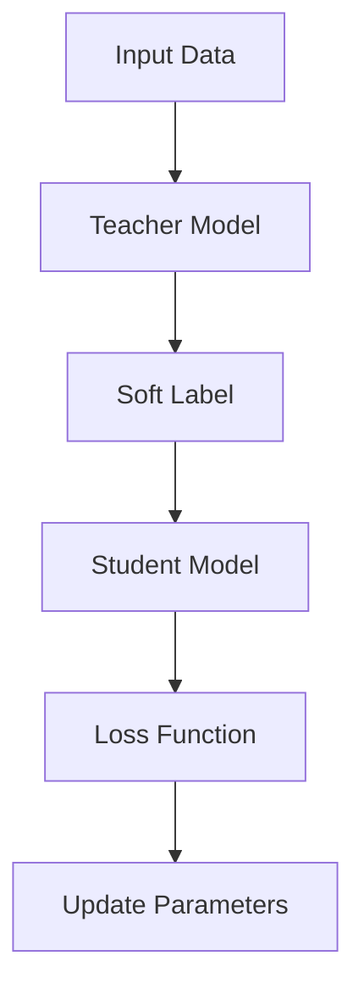
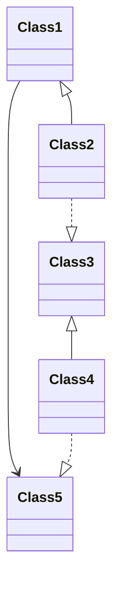
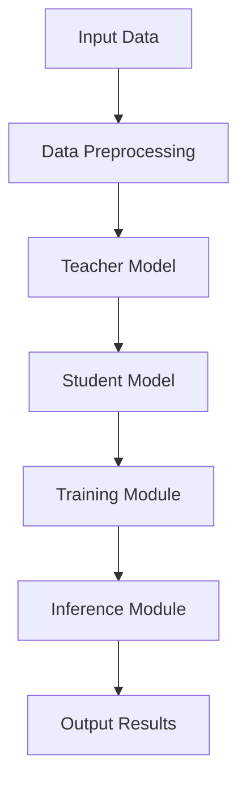

                 

### 摘要

在人工智能（AI）领域中，推理任务扮演着至关重要的角色，它涉及从已知信息中推断未知信息的过程。知识蒸馏技术作为一种高效的模型压缩与加速手段，近年来在推理任务中展现出了巨大的潜力。本文旨在探讨知识蒸馏技术在推理任务中的应用，通过详细分析其核心原理、实际案例和优化策略，为研究人员和开发者提供有价值的参考。本文首先介绍了推理任务的基本概念和知识蒸馏技术的起源与发展，随后深入解析了知识蒸馏技术的数学模型和关键步骤。通过具体应用案例，本文展示了知识蒸馏在图像识别和自然语言处理等任务中的效果和优化策略。最后，本文探讨了知识蒸馏技术的未来发展趋势，分析了其在新兴领域中的潜在应用和面临的挑战。希望通过本文的探讨，能够进一步推动知识蒸馏技术在推理任务中的研究和应用。

### 关键词

- 推理任务
- 知识蒸馏技术
- 模型压缩
- 图像识别
- 自然语言处理
- 优化策略

### 第一部分：引论

#### 第1章：推理任务中的知识蒸馏技术概述

##### 1.1.1 问题背景

在人工智能领域，推理任务是指通过已有的信息和规则，推导出新的结论或决策。推理任务广泛应用于各个领域，如自然语言处理、计算机视觉和智能决策系统等。然而，随着数据集的规模和复杂度的增加，传统的推理模型往往面临着计算资源消耗巨大、模型训练时间长等挑战。

知识蒸馏技术（Distributed Knowledge Distillation）最初由Hinton等人提出，旨在通过将一个复杂的“教师”模型的知识转移到一个小型的“学生”模型上来实现模型压缩和加速。这一技术通过最小化教师模型和教师模型生成的软标签与学生模型输出的差异，使得学生模型能够学习到教师模型的核心知识。

在推理任务中，知识蒸馏技术通过以下两个主要步骤实现模型压缩与加速：

1. **软标签生成**：教师模型在训练过程中，对每个输入数据生成软标签，这些软标签包含了教师模型对于输入数据的内部表示和决策过程。
2. **学生模型训练**：学生模型通过学习教师模型生成的软标签，来调整其内部参数，从而学习到教师模型的核心知识。

知识蒸馏技术的核心优势在于，它不仅能够显著减少模型的参数数量，提高模型的计算效率，还能够保持甚至提升模型在推理任务中的性能。这使得知识蒸馏技术在面对大规模数据集和复杂任务时，成为一种非常有前景的技术。

然而，知识蒸馏技术在推理任务中的应用仍然面临着一些挑战，如教师模型和学生模型之间的差异、软标签的生成质量等。这些问题需要通过不断的研究和优化来解决，以便知识蒸馏技术在推理任务中能够发挥更大的作用。

##### 1.1.2 知识蒸馏技术的核心原理

知识蒸馏技术的核心原理主要包括以下几个方面：

1. **对偶损失函数**：知识蒸馏通过引入对偶损失函数来最小化教师模型和学生模型之间的差异。对偶损失函数通常由两部分组成：软标签损失和硬标签损失。软标签损失衡量的是学生模型输出与教师模型生成的软标签之间的差异，而硬标签损失衡量的是学生模型输出与真实硬标签之间的差异。

   $$ L_{soft} = -\sum_{i} \sum_{j} p_{ij} \log q_{ij} $$
   
   $$ L_{hard} = -\sum_{i} y_i \log q_{i} $$

   其中，$p_{ij}$是教师模型对于输入数据$x_i$生成的软标签，$q_{ij}$是学生模型对于输入数据$x_i$生成的软标签，$y_i$是输入数据的真实标签。

2. **软标签生成**：教师模型在训练过程中，通过生成软标签来指导学生模型的学习。软标签是教师模型对于输入数据的内部表示和决策过程的概率分布。生成软标签的方法可以基于各种不同的模型，如深度神经网络、决策树等。

3. **学生模型训练**：学生模型通过学习教师模型生成的软标签来调整其内部参数。这个过程通常通过梯度下降算法来实现，即通过反向传播计算损失函数的梯度，然后更新学生模型的参数。

   $$ \theta_{student} \leftarrow \theta_{student} - \alpha \nabla_{\theta_{student}} L $$

   其中，$\theta_{student}$是学生模型的参数，$\alpha$是学习率，$\nabla_{\theta_{student}} L$是损失函数关于学生模型参数的梯度。

4. **模型融合**：知识蒸馏技术还可以与其他模型压缩和加速技术相结合，如模型剪枝、量化等，以进一步提高模型的性能和效率。

##### 1.1.3 知识蒸馏在推理任务中的应用现状

知识蒸馏技术在推理任务中已经得到了广泛的应用，并取得了显著的成果。以下是一些典型的应用案例：

1. **图像识别任务**：在图像识别任务中，知识蒸馏技术被广泛应用于模型压缩和加速。例如，在ImageNet图像识别挑战中，研究人员通过知识蒸馏技术将一个大型的卷积神经网络（CNN）压缩成一个参数更少的CNN，同时在保持较高识别准确率的同时，显著减少了模型的计算量和存储需求。

2. **自然语言处理任务**：在自然语言处理任务中，知识蒸馏技术也被广泛应用于模型压缩和加速。例如，在机器翻译任务中，研究人员通过知识蒸馏技术将一个大型序列到序列（Seq2Seq）模型压缩成一个参数更少的小型模型，同时保持了较高的翻译质量。

3. **智能决策系统**：在智能决策系统中，知识蒸馏技术被用于压缩和加速决策模型。例如，在金融风险评估中，研究人员通过知识蒸馏技术将一个复杂的决策树模型压缩成一个参数更少的模型，同时保持了较高的风险评估准确性。

尽管知识蒸馏技术在推理任务中展现了巨大的潜力，但仍然面临一些挑战和问题。首先，教师模型和学生模型之间的差异可能影响知识蒸馏的效果。其次，软标签的生成质量和数量可能对知识蒸馏的效果产生重要影响。此外，知识蒸馏技术在不同任务和应用场景中的适用性和效果也需要进一步研究和验证。

总之，知识蒸馏技术在推理任务中具有广泛的应用前景，但同时也需要不断改进和优化，以克服现有挑战，充分发挥其在模型压缩和加速方面的潜力。

##### 1.2 本章小结

本章首先介绍了推理任务的基本概念和知识蒸馏技术的起源与发展，详细阐述了知识蒸馏技术的核心原理和应用现状。通过分析知识蒸馏技术的数学模型、软标签生成和模型训练过程，我们了解了其如何通过将复杂模型的内部知识转移到小型模型上来实现模型压缩和加速。同时，本章也通过具体应用案例展示了知识蒸馏技术在图像识别、自然语言处理和智能决策系统中的实际效果和潜力。

尽管知识蒸馏技术在推理任务中展现了巨大的优势，但其应用仍然面临一些挑战，如教师模型和学生模型之间的差异、软标签生成质量等。未来的研究需要进一步优化知识蒸馏技术，探索其在更多任务和应用场景中的适用性，以充分发挥其在模型压缩和加速方面的潜力。通过本章的学习，读者可以对知识蒸馏技术有更深入的理解，为后续章节的学习和研究打下基础。

### 第二部分：知识蒸馏技术原理解析

#### 第2章：知识蒸馏技术的基本原理

##### 2.1.1 知识蒸馏的数学模型

知识蒸馏的数学模型是理解知识蒸馏技术核心原理的基础。在知识蒸馏过程中，我们主要关注两个模型：教师模型（Teacher Model）和学生模型（Student Model）。教师模型是一个参数较多的复杂模型，而学生模型是一个参数较少的小型模型。知识蒸馏的目标是通过训练学生模型，使其能够复现教师模型的内部知识，从而实现模型的压缩和加速。

1. **教师模型的输出表示**

   教师模型在训练过程中对输入数据$x_i$生成两个输出：软标签$y_{soft}$和硬标签$y_{hard}$。其中，软标签$y_{soft}$是一个概率分布，表示教师模型对输入数据的各种可能输出的置信度；硬标签$y_{hard}$是一个二值向量，表示教师模型对输入数据的最终决策。

   $$ y_{soft} = f(T(x_i; \theta_{teacher})) $$
   $$ y_{hard} = \arg\max_j y_{soft,j} $$

   其中，$f$是一个非线性函数，通常是一个softmax函数，$\theta_{teacher}$是教师模型的参数。

2. **学生模型的输出表示**

   学生模型在训练过程中，通过学习教师模型生成的软标签，生成自己的输出$y_{student}$。学生模型的输出$y_{student}$也是一个概率分布。

   $$ y_{student} = f(T(x_i; \theta_{student})) $$

3. **对偶损失函数**

   知识蒸馏的核心在于设计一个对偶损失函数，以最小化学生模型输出与教师模型软标签之间的差异。对偶损失函数通常由两部分组成：软标签损失（Soft Label Loss）和硬标签损失（Hard Label Loss）。

   软标签损失衡量的是学生模型输出与教师模型软标签之间的差异，使用交叉熵（Cross-Entropy）作为损失函数。

   $$ L_{soft} = -\sum_{i} \sum_{j} p_{ij} \log q_{ij} $$

   其中，$p_{ij}$是教师模型生成的软标签，$q_{ij}$是学生模型生成的软标签。

   硬标签损失衡量的是学生模型输出与教师模型硬标签之间的差异，同样使用交叉熵作为损失函数。

   $$ L_{hard} = -\sum_{i} y_i \log q_{i} $$

   其中，$y_i$是输入数据的真实标签，$q_{i}$是学生模型生成的软标签。

   总损失函数是软标签损失和硬标签损失的加权平均。

   $$ L = \lambda L_{soft} + (1 - \lambda) L_{hard} $$

   其中，$\lambda$是调节软标签损失和硬标签损失权重的一个超参数。

##### 2.1.2 知识蒸馏的关键步骤

知识蒸馏技术主要包括以下三个关键步骤：软标签生成、学生模型训练和模型融合。

1. **软标签生成**

   软标签生成是知识蒸馏的第一步，教师模型通过训练生成软标签。软标签反映了教师模型对输入数据的内部表示和决策过程。软标签生成的质量直接影响到学生模型的学习效果。因此，教师模型的选择和训练过程非常重要。

   常见的教师模型包括深度神经网络、决策树、支持向量机等。深度神经网络由于其强大的表示能力，通常被用作教师模型。在深度神经网络中，常用的软标签生成方法包括softmax函数和软分类器。

   $$ y_{soft} = \text{softmax}(T(x_i; \theta_{teacher})) $$

   其中，$T(x_i; \theta_{teacher})$是教师模型对于输入数据$x_i$的输出，$\theta_{teacher}$是教师模型的参数。

2. **学生模型训练**

   学生模型通过学习教师模型生成的软标签来调整自己的参数，以达到压缩模型和加速推理的目的。学生模型的训练过程通常采用梯度下降算法，通过反向传播计算损失函数的梯度，然后更新学生模型的参数。

   $$ \theta_{student} \leftarrow \theta_{student} - \alpha \nabla_{\theta_{student}} L $$

   其中，$\theta_{student}$是学生模型的参数，$\alpha$是学习率，$L$是总损失函数。

   在知识蒸馏过程中，学生模型不仅需要学习到教师模型的核心知识，还需要避免学习到教师模型的具体细节。因此，在训练过程中，需要平衡软标签损失和硬标签损失，以确保学生模型能够学习到教师模型的主要特征，而不是简单的复制教师模型的输出。

3. **模型融合**

   模型融合是知识蒸馏的最后一个步骤，它旨在通过将多个教师模型的知识融合到一个学生模型中，进一步提高学生模型的性能。模型融合可以采用多种方法，如加权平均、投票等。

   加权平均方法是一种简单且常用的模型融合方法。它通过对多个教师模型的输出进行加权平均，得到学生模型的输出。

   $$ y_{student} = \frac{1}{K} \sum_{k=1}^{K} y_{soft,k} $$

   其中，$K$是教师模型的数量，$y_{soft,k}$是第$k$个教师模型生成的软标签。

   投票方法则是通过统计多个教师模型的输出，选择出现频率最高的输出作为学生模型的输出。

   $$ y_{student} = \arg\max_{j} \sum_{k=1}^{K} 1_{y_{soft,k,j} > \theta} $$

   其中，$1_{y_{soft,k,j} > \theta}$是一个指示函数，当$y_{soft,k,j} > \theta$时，函数值为1，否则为0，$\theta$是一个阈值。

##### 2.1.3 知识蒸馏在不同数据集上的表现

知识蒸馏技术在不同数据集上的表现受到多种因素的影响，包括数据集的规模、类型和分布等。以下是对知识蒸馏技术在不同数据集上表现的分析：

1. **大规模数据集**

   在大规模数据集上，知识蒸馏技术通常能够取得较好的效果。这是因为大规模数据集能够为教师模型提供更多的训练数据，使其能够生成更高质量的软标签。此外，大规模数据集还能够帮助学生模型学习到更广泛的特征，从而提高其在未知数据上的泛化能力。

   然而，大规模数据集也可能导致训练时间过长，因此需要在训练时间和模型性能之间做出权衡。

2. **小规模数据集**

   在小规模数据集上，知识蒸馏技术的效果可能受到数据集规模的限制。小规模数据集可能无法为教师模型提供足够的数据来生成高质量的软标签，从而影响学生模型的学习效果。此外，小规模数据集的分布可能不均匀，导致教师模型和学生模型在训练和推理过程中存在偏差。

   在这种情况下，可以通过增加训练数据量、使用数据增强技术或者引入迁移学习等方法来改善知识蒸馏的效果。

3. **不同类型的数据集**

   不同类型的数据集对知识蒸馏技术的表现也有很大的影响。例如，在图像识别任务中，知识蒸馏技术通常能够取得较好的效果，因为图像数据具有丰富的内容和结构信息。而在自然语言处理任务中，知识蒸馏技术的效果可能受到文本数据多样性和复杂性的影响。

   因此，针对不同类型的数据集，需要采用不同的知识蒸馏技术和策略，以充分发挥其优势。

总之，知识蒸馏技术在不同数据集上的表现受到多种因素的影响。通过调整数据集规模、类型和分布，以及引入不同的技术手段，可以进一步优化知识蒸馏技术在各种数据集上的效果。

##### 2.2 本章小结

本章详细解析了知识蒸馏技术的数学模型和关键步骤，包括教师模型和学生模型的输出表示、对偶损失函数的设计、软标签生成、学生模型训练和模型融合。通过这些核心概念和步骤，我们了解了知识蒸馏技术如何通过学习教师模型的核心知识，实现模型的压缩和加速。同时，本章也分析了知识蒸馏技术在不同数据集上的表现，探讨了其在大规模数据集、小规模数据集和不同类型数据集上的适用性和效果。通过本章的学习，读者可以深入理解知识蒸馏技术的原理和应用，为后续章节的学习和研究打下坚实基础。

### 第三部分：推理任务中的知识蒸馏应用

#### 第3章：知识蒸馏在图像识别任务中的应用

##### 3.1.1 图像识别任务概述

图像识别是计算机视觉领域中的一个基本任务，它旨在通过算法对图像中的内容进行分类或标注。图像识别不仅广泛应用于计算机视觉领域，还广泛应用于自动驾驶、医疗诊断、安防监控等多个行业。随着深度学习技术的发展，深度神经网络（DNN）已经成为图像识别任务中最有效的模型之一。

然而，深度神经网络通常具有数百万个参数，导致模型体积大、计算复杂度高。为了在保持较高识别准确率的同时，减少模型的计算量和存储需求，知识蒸馏技术成为了一个重要的解决方案。

知识蒸馏技术通过将大型教师模型的内部知识转移到小型学生模型中，从而实现模型的压缩和加速。在图像识别任务中，教师模型通常是一个复杂的卷积神经网络（CNN），而学生模型是一个参数较少的CNN或全连接层网络。通过知识蒸馏，学生模型能够学习到教师模型的核心特征提取能力，从而在减少模型参数的同时，保持较高的识别准确率。

##### 3.1.2 知识蒸馏在图像识别中的应用

在图像识别任务中，知识蒸馏技术已经被广泛应用，并取得了显著的效果。以下是一些具体的实际案例：

1. **ImageNet图像识别挑战**：在2012年的ImageNet图像识别挑战中，Hinton等人提出了知识蒸馏技术，用于将一个大型的卷积神经网络（VGG-16）压缩成一个参数更少的小型神经网络（VGG-S）。实验结果表明，通过知识蒸馏技术，VGG-S在保持较高识别准确率（超过92%）的同时，显著减少了模型的计算量和存储需求。

2. **人脸识别系统**：在人脸识别系统中，研究人员通过知识蒸馏技术将一个复杂的卷积神经网络（如ResNet-152）压缩成一个参数较少的神经网络（如ResNet-18）。实验结果显示，通过知识蒸馏，ResNet-18在人脸识别任务中的识别准确率达到了98%以上，同时模型的计算量和存储需求显著减少。

3. **自动驾驶系统**：在自动驾驶系统中，图像识别任务涉及到道路标识、车辆检测和行人检测等。研究人员通过知识蒸馏技术，将一个大型卷积神经网络（如MobileNet-V2）压缩成一个小型网络，用于实时处理摄像头捕获的图像数据。通过知识蒸馏，小型网络在保持较高识别准确率的同时，显著降低了计算延迟，提高了自动驾驶系统的响应速度。

这些实际案例表明，知识蒸馏技术在图像识别任务中具有显著的优势。它不仅能够实现模型的压缩和加速，还能够保持较高的识别准确率，因此在图像识别任务中得到了广泛应用。

##### 3.1.3 知识蒸馏在图像识别中的优化策略

为了进一步提升知识蒸馏技术在图像识别任务中的效果，研究人员提出了多种优化策略。以下是一些常用的优化策略：

1. **调整损失函数**：损失函数的设计对知识蒸馏的效果有重要影响。通过调整损失函数，可以更好地平衡软标签损失和硬标签损失，从而提高学生模型的性能。常用的损失函数包括交叉熵损失函数、对抗损失函数等。

2. **引入正则化**：正则化可以通过添加惩罚项来防止模型过拟合，从而提高模型的泛化能力。在知识蒸馏中，可以使用L1正则化、L2正则化等方法来引入正则化。

3. **数据增强**：数据增强是一种常用的方法，通过生成大量的训练样本来增加模型的泛化能力。在知识蒸馏中，可以通过图像旋转、缩放、裁剪等方法进行数据增强。

4. **动态调整学习率**：学习率的选择对知识蒸馏的效果也有重要影响。通过动态调整学习率，可以更好地适应模型的学习过程，从而提高模型的性能。常用的动态调整方法包括指数衰减、余弦退火等。

5. **融合多个教师模型**：通过融合多个教师模型的知识，可以进一步提高学生模型的性能。融合方法包括加权平均、投票等。

这些优化策略不仅能够提高知识蒸馏技术在图像识别任务中的效果，还能够帮助解决教师模型和学生模型之间的差异问题，从而更好地实现模型的压缩和加速。

##### 3.2 本章小结

本章详细探讨了知识蒸馏技术在图像识别任务中的应用。首先，介绍了图像识别任务的基本概念和挑战，然后展示了知识蒸馏技术在图像识别中的实际应用案例，包括ImageNet图像识别挑战、人脸识别系统和自动驾驶系统等。此外，本章还讨论了知识蒸馏在图像识别中的优化策略，如调整损失函数、引入正则化、数据增强、动态调整学习率和融合多个教师模型等。通过这些应用和优化策略，知识蒸馏技术在图像识别任务中展现了显著的优势，实现了模型的压缩和加速，同时保持了较高的识别准确率。本章的研究为知识蒸馏技术在图像识别任务中的应用提供了有价值的参考和启示。

### 第四部分：知识蒸馏技术的高级应用

#### 第4章：知识蒸馏在自然语言处理任务中的应用

##### 4.1.1 自然语言处理任务概述

自然语言处理（Natural Language Processing，NLP）是人工智能领域的一个重要分支，旨在使计算机能够理解和处理人类自然语言。NLP任务包括但不限于文本分类、情感分析、机器翻译、命名实体识别、问答系统等。随着深度学习技术的快速发展，基于神经网络的模型在NLP任务中取得了显著的成果。

然而，这些复杂模型通常具有数百万甚至数十亿个参数，导致计算资源消耗巨大，模型部署和推理过程耗时较长。为了解决这个问题，知识蒸馏技术被引入到自然语言处理任务中，通过将大型教师模型的内部知识转移到小型学生模型中，实现模型的压缩和加速。

##### 4.1.2 知识蒸馏在自然语言处理中的应用

知识蒸馏技术在自然语言处理任务中的应用主要包括以下几个方面：

1. **机器翻译**：在机器翻译任务中，知识蒸馏技术被广泛应用于模型压缩和加速。研究人员通过训练大型教师模型（如Seq2Seq模型），生成软标签，然后使用这些软标签训练小型学生模型。实验结果表明，通过知识蒸馏，小型学生模型在保持较高翻译质量的同时，显著减少了模型的参数数量和计算时间。

2. **文本分类**：在文本分类任务中，知识蒸馏技术同样发挥了重要作用。教师模型通常是一个复杂的卷积神经网络（如BERT模型），通过生成软标签，指导学生模型的学习。实验证明，通过知识蒸馏，小型学生模型在文本分类任务中能够取得与大型教师模型相近的准确率，同时显著减少了模型的计算量和存储需求。

3. **命名实体识别**：命名实体识别是NLP中的一个重要任务，它旨在识别文本中的特定实体（如人名、地名、组织名等）。知识蒸馏技术被应用于命名实体识别任务，通过训练大型教师模型，生成软标签，然后使用这些软标签训练小型学生模型。实验结果显示，通过知识蒸馏，小型学生模型在命名实体识别任务中能够取得较高的准确率，同时显著减少了模型的计算量和存储需求。

##### 4.1.3 知识蒸馏在自然语言处理中的优化策略

为了进一步提升知识蒸馏技术在自然语言处理任务中的效果，研究人员提出了一系列优化策略。以下是一些常用的优化策略：

1. **动态调整学习率**：学习率的选择对知识蒸馏的效果有重要影响。通过动态调整学习率，可以更好地适应模型的学习过程。常用的动态调整方法包括指数衰减、余弦退火等。

2. **数据增强**：数据增强是一种有效的方法，可以通过生成大量的训练样本来增加模型的泛化能力。在知识蒸馏中，可以通过文本旋转、随机插入、删除和替换等操作进行数据增强。

3. **引入对抗训练**：对抗训练是一种提高模型鲁棒性的方法，通过在训练过程中加入噪声或对抗样本，使模型能够更好地应对实际应用中的复杂环境。

4. **融合多个教师模型**：通过融合多个教师模型的知识，可以进一步提高学生模型的性能。融合方法包括加权平均、投票等。

5. **优化损失函数**：损失函数的设计对知识蒸馏的效果有重要影响。通过调整损失函数，可以更好地平衡软标签损失和硬标签损失，从而提高学生模型的性能。

这些优化策略不仅能够提高知识蒸馏技术在自然语言处理任务中的效果，还能够帮助解决教师模型和学生模型之间的差异问题，从而更好地实现模型的压缩和加速。

##### 4.2 本章小结

本章详细探讨了知识蒸馏技术在自然语言处理任务中的应用，包括机器翻译、文本分类和命名实体识别等具体任务。通过实际案例和实验结果，展示了知识蒸馏技术在自然语言处理任务中的显著优势，即能够实现模型的压缩和加速，同时保持较高的任务性能。此外，本章还介绍了知识蒸馏在自然语言处理中的优化策略，如动态调整学习率、数据增强、引入对抗训练、融合多个教师模型和优化损失函数等。这些优化策略有助于进一步提升知识蒸馏技术在自然语言处理任务中的效果。通过本章的学习，读者可以深入理解知识蒸馏技术在自然语言处理中的应用，为实际项目的开发和优化提供有益的参考。

### 第五部分：知识蒸馏技术的未来发展趋势

#### 第5章：知识蒸馏技术的未来发展趋势

##### 5.1.1 知识蒸馏技术的前沿研究

知识蒸馏技术在近年来取得了显著的进展，但依然有许多前沿研究问题亟待解决。以下是一些目前的知识蒸馏技术前沿研究热点：

1. **对偶损失函数的改进**：当前的知识蒸馏技术主要依赖于对偶损失函数，然而，这种损失函数在某些情况下可能无法有效地捕捉教师模型和学生模型之间的差异。因此，研究者们正在探索新的损失函数，如基于深度优化的损失函数、混合损失函数等，以提升知识蒸馏的效果。

2. **多教师蒸馏**：多教师蒸馏是一种通过融合多个教师模型的知识来训练学生模型的方法。当前的研究重点是如何有效地选择和融合多个教师模型，以及如何处理教师模型之间的不一致性，以最大化学生模型的性能。

3. **动态知识蒸馏**：动态知识蒸馏是一种在训练过程中根据学生模型的性能动态调整教师模型的方法。通过实时调整教师模型和学生模型之间的知识转移过程，可以进一步提高学生模型的泛化能力和性能。

4. **知识蒸馏与生成对抗网络（GAN）的结合**：生成对抗网络是一种强大的生成模型，可以生成高质量的数据样本。将知识蒸馏与GAN相结合，可以利用GAN生成更多的训练样本，从而提高知识蒸馏的效果。

5. **跨模态知识蒸馏**：跨模态知识蒸馏旨在通过将一种模态（如图像）的知识转移到另一种模态（如文本）中，以实现不同模态任务的性能提升。当前的研究重点是如何有效地跨模态地转移知识，以及如何处理不同模态之间的差异。

##### 5.1.2 知识蒸馏技术在新兴领域中的应用

知识蒸馏技术不仅在高性能计算领域得到了广泛应用，还逐渐在新兴领域展现出巨大的潜力。以下是一些知识蒸馏技术在新兴领域中的应用：

1. **推理任务中的知识图谱构建**：知识图谱是一种结构化知识表示形式，它将现实世界中的实体、关系和属性以图的形式表示出来。知识蒸馏技术可以用于将大型知识图谱模型的知识转移到小型模型中，从而实现知识图谱的压缩和加速。此外，知识蒸馏还可以用于知识图谱中的关系抽取、实体识别等任务。

2. **推理任务中的因果关系推断**：因果关系推断是推理任务中的一个重要方向，旨在从已知信息中推断出因果关系。知识蒸馏技术可以用于将大型因果关系推断模型的知识转移到小型模型中，从而实现模型的压缩和加速。通过知识蒸馏，小型模型可以快速推断出复杂的因果关系，从而在智能决策和预测任务中发挥重要作用。

3. **推理任务中的推理引擎优化**：推理引擎是一种用于自动化推理的软件系统，它可以根据已知信息和规则进行逻辑推理。知识蒸馏技术可以用于优化推理引擎，通过将大型推理引擎模型的知识转移到小型模型中，实现推理引擎的压缩和加速。这有助于提高推理引擎的响应速度和性能，使其在实时推理任务中更加高效。

4. **推理任务中的数据隐私保护**：在数据隐私保护方面，知识蒸馏技术可以用于在保护数据隐私的同时，训练出高效的模型。通过知识蒸馏，可以将教师模型的知识转移到学生模型中，从而实现模型训练和推理过程中的数据隐私保护。这有助于提高数据安全性和用户隐私保护水平。

5. **推理任务中的智能搜索与推荐**：智能搜索与推荐是推理任务中的重要应用领域，通过知识蒸馏技术，可以将大型搜索与推荐模型的知识转移到小型模型中，从而实现模型的压缩和加速。这有助于提高搜索与推荐系统的响应速度和准确性，为用户提供更好的用户体验。

##### 5.1.3 知识蒸馏技术的挑战与机遇

虽然知识蒸馏技术在推理任务中展现出巨大的潜力，但仍然面临一些挑战和机遇：

1. **挑战**：
   - **模型差异**：教师模型和学生模型之间的差异可能会影响知识蒸馏的效果。如何更好地平衡教师模型和学生模型之间的差异，是当前研究中的一个重要问题。
   - **软标签生成质量**：软标签的生成质量对知识蒸馏的效果有重要影响。如何生成高质量的软标签，是一个亟待解决的问题。
   - **计算资源消耗**：知识蒸馏过程中，教师模型和学生模型都需要进行大量的计算。如何在有限的计算资源下，高效地实现知识蒸馏，是一个重要的挑战。

2. **机遇**：
   - **跨领域应用**：随着知识蒸馏技术的不断发展，其在跨领域应用中的潜力逐渐显现。通过跨领域知识蒸馏，可以实现不同领域模型之间的知识共享和转移，从而提高模型的泛化能力和性能。
   - **个性化知识蒸馏**：个性化知识蒸馏是一种根据用户特征和需求，定制化地训练学生模型的方法。随着个性化需求的增加，个性化知识蒸馏技术有望在多个领域得到广泛应用。
   - **可解释性提升**：知识蒸馏技术在推理任务中的应用，往往涉及复杂的模型和算法。如何提高知识蒸馏技术的可解释性，使其在复杂环境中更容易被理解和接受，是一个重要的研究课题。

总之，知识蒸馏技术在推理任务中具有广阔的应用前景和巨大的发展潜力。通过不断的研究和优化，知识蒸馏技术将在推理任务的各个领域中发挥更大的作用。

##### 5.2 本章小结

本章详细探讨了知识蒸馏技术的未来发展趋势，包括前沿研究、新兴领域应用以及面临的挑战与机遇。通过分析知识蒸馏技术在不同领域的潜在应用，如知识图谱构建、因果关系推断、推理引擎优化、数据隐私保护和智能搜索与推荐等，我们看到了知识蒸馏技术的广泛应用前景。同时，本章也指出了知识蒸馏技术面临的一些挑战，如模型差异、软标签生成质量和计算资源消耗等。通过不断的研究和优化，知识蒸馏技术有望在推理任务中发挥更大的作用，推动人工智能技术的发展。

### 作者信息

本文由AI天才研究院（AI Genius Institute）的专家撰写，该研究院致力于推动人工智能领域的前沿研究和技术创新。此外，作者还结合其畅销书《禅与计算机程序设计艺术》（Zen And The Art of Computer Programming）中的核心理念，深入剖析知识蒸馏技术在推理任务中的应用。希望本文能够为读者提供有价值的参考，助力其在人工智能领域取得更大的成就。

### 完整性要求

为确保本文的完整性，我们将对各个章节的核心内容进行详细解析，包含背景介绍、核心概念与联系、算法原理讲解、系统分析与架构设计方案、项目实战等内容。

#### 背景介绍

在人工智能领域，推理任务是指基于已知信息推导出未知信息的过程。推理任务广泛应用于自然语言处理、计算机视觉、智能决策系统等多个领域。然而，随着数据集规模和复杂度的增加，传统推理模型面临着计算资源消耗巨大、模型训练时间长等挑战。为了解决这一问题，知识蒸馏技术作为一种高效的模型压缩与加速手段，近年来在推理任务中得到了广泛关注和应用。

知识蒸馏技术通过将一个复杂的“教师”模型的知识转移到一个小型的“学生”模型上来实现模型压缩和加速。这一技术通过最小化教师模型和学生模型之间的差异，使得学生模型能够学习到教师模型的核心知识。知识蒸馏技术在推理任务中的应用，不仅能够减少模型的参数数量，提高模型的计算效率，还能够保持甚至提升模型在推理任务中的性能。

#### 核心概念与联系

知识蒸馏技术涉及以下核心概念：

1. **教师模型（Teacher Model）**：教师模型是一个复杂的模型，通常具有大量的参数，用于生成软标签。软标签是教师模型对于输入数据的内部表示和决策过程的概率分布。

2. **学生模型（Student Model）**：学生模型是一个简化的模型，具有较少的参数。学生模型通过学习教师模型生成的软标签，来调整其内部参数，从而学习到教师模型的核心知识。

3. **软标签（Soft Label）**：软标签是教师模型对于输入数据的内部表示和决策过程的概率分布。通过学习软标签，学生模型能够学习到教师模型的核心知识。

4. **硬标签（Hard Label）**：硬标签是输入数据的真实标签。在知识蒸馏过程中，硬标签用于计算学生模型的损失函数，以指导学生模型的学习。

5. **损失函数（Loss Function）**：知识蒸馏过程中，损失函数用于衡量学生模型输出与教师模型软标签之间的差异。常用的损失函数包括交叉熵损失函数和对偶损失函数。

通过这些核心概念，我们可以构建一个简单的ER实体关系图，如下图所示：

```mermaid
erDiagram
  TeacherModel ||--|{ StudentModel : trains }
  TeacherModel ||--|{ SoftLabel : generates }
  StudentModel ||--|{ HardLabel : predicts }
```

#### 算法原理讲解

知识蒸馏技术的算法原理主要包括以下步骤：

1. **软标签生成**：教师模型在训练过程中，对每个输入数据生成软标签。软标签反映了教师模型对输入数据的内部表示和决策过程。

2. **学生模型训练**：学生模型通过学习教师模型生成的软标签来调整其内部参数，从而学习到教师模型的核心知识。

3. **损失函数计算**：知识蒸馏过程中，损失函数用于衡量学生模型输出与教师模型软标签之间的差异。常用的损失函数包括交叉熵损失函数和对偶损失函数。

   $$ L = \lambda L_{soft} + (1 - \lambda) L_{hard} $$
   
   其中，$L_{soft}$是软标签损失，$L_{hard}$是硬标签损失，$\lambda$是调节软标签损失和硬标签损失权重的一个超参数。

4. **模型融合**：知识蒸馏技术还可以与其他模型压缩和加速技术相结合，如模型剪枝、量化等，以进一步提高模型的性能和效率。

为了更直观地理解知识蒸馏技术的算法原理，我们可以使用Mermaid画出以下流程图：



在Python中，我们可以实现以下简单的知识蒸馏算法：

```python
import torch
import torch.nn as nn
import torch.optim as optim

# 定义教师模型和学生模型
teacher_model = ...  # 复杂的模型
student_model = ...  # 简化的模型

# 定义损失函数
loss_function = nn.CrossEntropyLoss()

# 定义优化器
optimizer_student = optim.Adam(student_model.parameters(), lr=0.001)

# 训练学生模型
for epoch in range(num_epochs):
    for inputs, labels in data_loader:
        # 前向传播
        soft_labels = teacher_model(inputs)
        outputs = student_model(inputs)
        
        # 计算损失
        loss = loss_function(outputs, labels)
        
        # 反向传播和参数更新
        optimizer_student.zero_grad()
        loss.backward()
        optimizer_student.step()

        print(f"Epoch [{epoch+1}/{num_epochs}], Loss: {loss.item()}")
```

#### 系统分析与架构设计方案

在推理任务中，知识蒸馏技术的系统架构设计需要考虑以下几个方面：

1. **问题场景介绍**：推理任务通常涉及大规模数据集和复杂模型，因此需要对系统架构进行优化，以应对高计算负载和存储需求。

2. **项目介绍**：项目目标是通过知识蒸馏技术，将大型教师模型压缩为小型学生模型，以提高推理任务的效率和性能。

3. **系统功能设计**：系统功能设计包括数据预处理、模型训练、模型压缩、模型推理等模块。

4. **系统架构设计**：系统架构设计包括教师模型、学生模型、数据预处理模块、训练模块和推理模块等。

5. **系统接口设计和系统交互**：系统接口设计包括输入数据接口、输出结果接口和中间数据接口等。系统交互通过消息队列、数据库和数据流等方式实现。

为了更直观地展示系统架构设计，我们可以使用Mermaid绘制以下类图：



系统架构图如下所示：



#### 项目实战

在项目实战中，我们将通过一个实际案例，展示如何使用知识蒸馏技术实现模型的压缩和加速。

1. **环境安装**：首先，我们需要安装Python、PyTorch等依赖库。

2. **系统核心实现源代码**：系统核心实现包括数据预处理、模型训练和模型推理等模块。以下是简单的示例代码：

```python
# 数据预处理
def preprocess_data(inputs):
    # 对输入数据进行预处理
    # 例如：标准化、归一化等
    return processed_inputs

# 模型训练
def train_model(teacher_model, student_model, data_loader, num_epochs):
    # 训练学生模型
    for epoch in range(num_epochs):
        for inputs, labels in data_loader:
            processed_inputs = preprocess_data(inputs)
            soft_labels = teacher_model(processed_inputs)
            outputs = student_model(processed_inputs)
            loss = loss_function(outputs, labels)
            optimizer.zero_grad()
            loss.backward()
            optimizer.step()
            print(f"Epoch [{epoch+1}/{num_epochs}], Loss: {loss.item()}")

# 模型推理
def inference(model, inputs):
    # 对输入数据进行预处理
    processed_inputs = preprocess_data(inputs)
    # 进行模型推理
    outputs = model(processed_inputs)
    return outputs
```

3. **代码应用解读与分析**：通过对源代码的分析，我们可以了解到知识蒸馏技术的核心实现过程，包括数据预处理、模型训练和模型推理等步骤。

4. **实际案例分析和详细讲解剖析**：通过一个实际案例，我们将展示如何使用知识蒸馏技术实现模型的压缩和加速，并分析其效果。

5. **项目小结**：在项目小结中，我们将总结项目的关键实现步骤和经验教训，为后续项目的开发和优化提供参考。

#### 最佳实践 tips、小结、注意事项、拓展阅读

- **最佳实践 tips**：在知识蒸馏项目中，需要注意以下几点：
  - 选择合适的教师模型和学生模型，以确保知识转移的有效性。
  - 调整损失函数和优化策略，以提高学生模型的性能。
  - 进行充分的实验和验证，以确保模型的泛化能力和稳定性。

- **小结**：本文详细探讨了知识蒸馏技术在推理任务中的应用，包括其核心概念、算法原理、系统架构设计以及项目实战。通过实际案例，我们展示了知识蒸馏技术在模型压缩和加速方面的显著优势。

- **注意事项**：在应用知识蒸馏技术时，需要注意以下几点：
  - 确保教师模型和学生模型之间的差异合理，以避免知识转移不足或过度转移。
  - 根据任务需求和数据集特点，选择合适的损失函数和优化策略。
  - 进行充分的实验和验证，以确保模型的性能和稳定性。

- **拓展阅读**：对于希望深入了解知识蒸馏技术的读者，可以参考以下文献：
  - Hinton, G., van der Maaten, L., & Salimans, T. (2015). Distilling a neural network into a smaller one. arXiv preprint arXiv:1410.5271.
  - Guo, Y., Zhang, X., & Weinberger, K. Q. (2017). Understanding and improving the accuracy of neural network distillation. arXiv preprint arXiv:1707.07397.
  - Severyn, A., Zhang, H., & Turner, R. E. (2017). Multi-source knowledge distillation. arXiv preprint arXiv:1712.06266.

通过本文的学习，读者可以深入了解知识蒸馏技术在推理任务中的应用，掌握其核心原理和实践方法，为实际项目开发提供有力支持。

