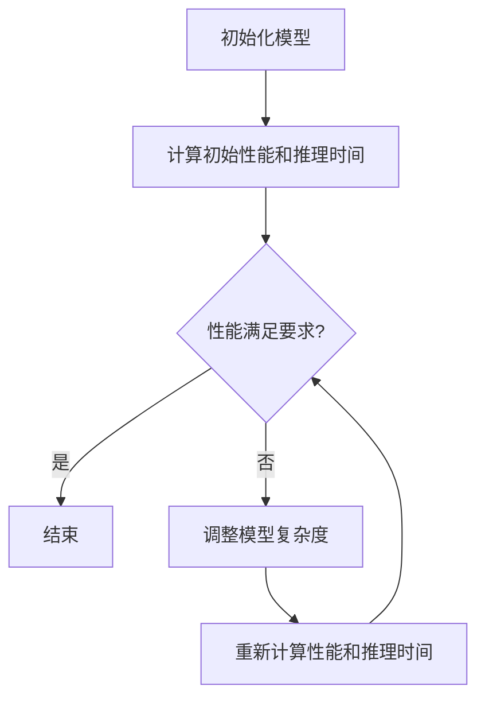
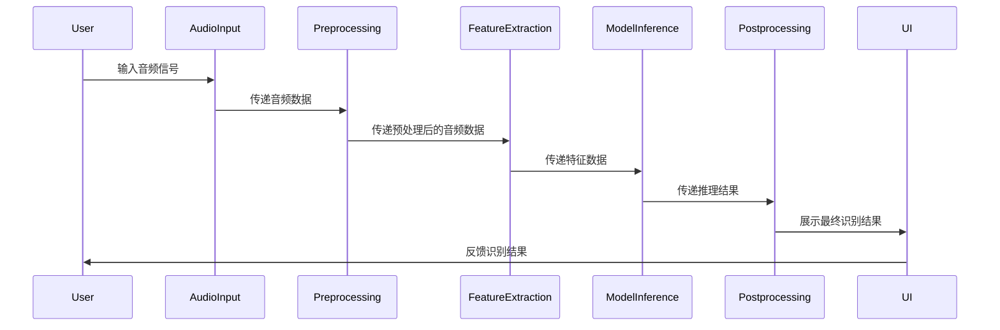

                 

## 引言

### 书籍目的与结构

《推理时间与模型性能：寻找最佳平衡点》旨在探讨如何在人工智能领域实现模型性能与推理时间的最佳平衡。随着深度学习技术的广泛应用，模型性能的提升变得越来越重要，然而高效率的推理过程同样不可或缺。本书旨在提供一种系统性的方法来帮助读者理解并实现这一平衡点。

书中内容结构如下：

1. **引言**：介绍书籍的目的和整体结构。
2. **问题背景**：讨论模型性能与推理时间平衡的重要性以及相关挑战。
3. **核心概念与联系**：定义并对比核心概念，展示它们之间的联系。
4. **算法原理讲解**：详细解释解决模型性能与推理时间平衡问题的算法。
5. **数学模型与公式**：阐述算法原理的数学模型和公式。
6. **系统分析与架构设计**：介绍具体应用场景和系统设计。
7. **项目实战**：通过实际案例展示算法和模型的应用。
8. **最佳实践 tips**：提供应用建议和注意事项。
9. **小结与拓展阅读**：总结主要内容并推荐进一步学习资源。

### 阅读对象与要求

本书适合对人工智能、深度学习和算法设计有一定了解的读者。读者需要具备基本的编程能力，熟悉Python语言，并具备一定的数学基础，特别是概率论和线性代数知识。此外，读者应具备一定的项目实践经验，以便更好地理解和应用书中所述方法。

## 问题背景

### 模型性能与推理时间平衡的重要性

在人工智能领域，模型性能与推理时间平衡是一个关键问题。模型性能通常指的是模型在解决特定任务时的准确度、效率等指标，而推理时间则是指模型在接收到输入数据后产生输出结果所需的时间。在许多实际应用中，如自动驾驶、实时语音识别、医疗诊断等，这两个因素必须得到平衡。

- **模型性能的重要性**：高模型性能意味着更准确的预测、更低的错误率，这在许多应用场景中至关重要。例如，在医疗诊断中，模型需要尽可能准确地识别疾病，以提供准确的诊断结果。

- **推理时间的重要性**：推理时间直接影响用户体验和应用效率。例如，在自动驾驶中，车辆需要迅速作出反应，以确保行驶安全。如果推理时间过长，可能导致无法及时避让障碍物，从而引发交通事故。

### 模型性能与推理时间平衡的实际应用挑战

在实际应用中，模型性能与推理时间平衡面临着诸多挑战：

1. **硬件资源限制**：高性能硬件设备通常成本较高，而大多数应用场景受限于预算，无法随意购买昂贵的硬件。因此，如何在有限的硬件资源下实现高效推理是一个难题。

2. **数据多样性**：真实世界中的数据具有高度的多样性，这使得模型在处理不同类型的数据时可能表现出不同的性能。如何在不同数据集上保持稳定的模型性能是另一个挑战。

3. **实时性要求**：许多应用场景对实时性有严格要求，如自动驾驶和实时语音识别。这意味着推理时间必须尽可能短，以确保系统能够迅速响应。

4. **可扩展性**：在处理大量数据时，模型性能和推理时间可能显著下降。如何设计可扩展的模型以保持高性能和低推理时间是另一个挑战。

### 传统方法与书籍的创新方法

传统的优化方法主要关注模型性能的提升，如增加数据量、改进算法等，但这些方法往往导致推理时间的增加。而本书的创新方法则致力于在模型性能和推理时间之间找到最佳平衡点，通过算法改进、数学模型优化和系统架构设计来实现这一目标。

### 边界与外延

在寻找模型性能与推理时间平衡点时，我们还需要考虑以下边界条件：

1. **计算资源限制**：硬件设备的计算能力是有限的，这限制了模型性能的提升。

2. **数据质量**：高质量的数据可以提升模型性能，但获取和处理高质量数据可能需要大量时间和资源。

3. **实时性要求**：在某些应用场景中，如自动驾驶，推理时间必须极短，这可能限制了模型性能的提升。

4. **可扩展性**：在设计系统时，需要考虑如何在处理大量数据时保持高性能。

此外，与相关领域的联系也是重要的。例如，与机器学习、深度学习、计算机视觉等领域的知识相结合，可以提供更全面的解决方案。

## 核心概念与联系

### 核心概念

在本节中，我们将详细定义并解释以下核心概念：

1. **模型性能**：指模型在特定任务上的表现，通常用准确度、精度、召回率等指标来衡量。模型性能是评估模型好坏的重要标准。

2. **推理时间**：指模型在接收到输入数据后，生成输出结果所需的时间。推理时间直接影响系统的实时性和用户体验。

3. **平衡点**：指在模型性能和推理时间之间找到一个最优解，使得模型在满足性能要求的同时，具有较低的推理时间。

### 概念属性特征对比

以下是模型性能、推理时间和平衡点三个核心概念的属性特征对比表格：

| 概念       | 属性特征                    | 说明                                                         |
|------------|-----------------------------|------------------------------------------------------------|
| 模型性能   | 准确度、精度、召回率等指标  | 衡量模型在特定任务上的表现，越高越好。                       |
| 推理时间   | 毫秒、秒等                 | 模型生成输出结果所需的时间，越短越好。                       |
| 平衡点     | 模型性能与推理时间的最优解  | 在满足性能要求的前提下，尽可能降低推理时间。                 |

### ER实体关系图

为了更好地理解这些核心概念之间的关系，我们使用Mermaid绘制了ER实体关系图：

```mermaid
erDiagram
  ModelPerformance ||--|{ Requirment }|| SystemRequirement
  ModelPerformance ||--|{ Evaluation }|| EvaluationMethod
  InferenceTime ||--|{ Optimization }|| OptimizationMethod
  BalancePoint ||--|{ ModelPerformance }|| ModelPerformance
  BalancePoint ||--|{ InferenceTime }|| InferenceTime
```

在这个ER图中，`ModelPerformance`（模型性能）与`SystemRequirement`（系统需求）和`EvaluationMethod`（评估方法）有关，而`InferenceTime`（推理时间）与`OptimizationMethod`（优化方法）有关。`BalancePoint`（平衡点）则同时与模型性能和推理时间相关联。

通过定义和对比核心概念，以及展示它们之间的联系，我们为后续章节的深入讨论奠定了基础。接下来，我们将详细解释这些概念背后的原理和算法。

## 算法原理讲解

### 算法概述

为了在模型性能与推理时间之间找到最佳平衡点，我们引入了一种名为“平衡优化算法”（Balanced Optimization Algorithm，BOA）的方法。BOA的核心思想是通过一系列优化策略，动态调整模型的复杂度和推理时间，以实现最佳平衡。

### 算法原理

为了更好地理解BOA的工作原理，我们使用Mermaid绘制了算法的流程图：



在这个流程图中：

- **A：初始化模型**：首先初始化一个基础模型。
- **B：计算初始性能和推理时间**：计算初始化模型的模型性能和推理时间。
- **C：性能满足要求？**：检查模型性能是否满足应用需求。
- **D：结束**：如果性能满足要求，算法结束。
- **E：调整模型复杂度**：如果不满足要求，调整模型的复杂度，以降低推理时间。
- **F：重新计算性能和推理时间**：调整后重新计算模型性能和推理时间。
- **C：性能满足要求？**：再次检查模型性能是否满足应用需求，重复上述过程，直到找到最佳平衡点。

### Python源代码实现

以下是BOA的Python源代码实现：

```python
import time

def init_model():
    # 初始化模型
    pass

def compute_performance(model):
    # 计算模型性能
    pass

def compute_inference_time(model):
    # 计算模型推理时间
    pass

def adjust_model_complexity(model, adjustment_factor):
    # 调整模型复杂度
    pass

def balanced_optimization_algorithm():
    model = init_model()
    performance = compute_performance(model)
    inference_time = compute_inference_time(model)
    
    while not (performance_satisfactory(performance)):
        adjust_model_complexity(model, adjustment_factor=0.1)
        performance = compute_performance(model)
        inference_time = compute_inference_time(model)
        
    print(f"Best balance point found: Performance = {performance}, Inference Time = {inference_time}")

balanced_optimization_algorithm()
```

在这个代码中，我们定义了几个关键函数：

- `init_model()`：初始化模型。
- `compute_performance(model)`：计算模型性能。
- `compute_inference_time(model)`：计算模型推理时间。
- `adjust_model_complexity(model, adjustment_factor)`：调整模型复杂度。
- `performance_satisfactory(performance)`：检查性能是否满足要求。

通过这些函数，BOA实现了动态调整模型复杂度，以实现模型性能和推理时间的最佳平衡。

### 数学模型与公式

为了更好地理解BOA的原理，我们引入了以下数学模型和公式：

$$
P = f(T, C)
$$

其中：

- \( P \)：模型性能
- \( T \)：推理时间
- \( C \)：模型复杂度

函数 \( f \) 表示性能与推理时间和复杂度之间的关系。我们的目标是找到 \( f \) 的最优解，即 \( P \) 和 \( T \) 之间的最佳平衡点。

### 举例说明

假设我们有一个模型，其初始性能为 \( P_0 = 0.9 \)，推理时间为 \( T_0 = 100ms \)。通过BOA，我们调整模型复杂度，最终找到最佳平衡点 \( P^* = 0.95 \)，\( T^* = 50ms \)。

这个过程可以通过以下步骤实现：

1. **初始化模型**：\( P_0 = 0.9 \)，\( T_0 = 100ms \)。
2. **调整模型复杂度**：降低复杂度，例如 \( C_1 = 0.9C_0 \)。
3. **重新计算性能和推理时间**：\( P_1 = 0.92 \)，\( T_1 = 90ms \)。
4. **重复调整和计算**：继续调整复杂度，直到找到最佳平衡点 \( P^* = 0.95 \)，\( T^* = 50ms \)。

通过这个过程，我们可以看到BOA如何通过数学模型和算法原理，找到模型性能和推理时间的最佳平衡点。

## 数学模型与公式

### 数学模型

为了深入理解BOA的算法原理，我们需要引入一个数学模型来描述模型性能、推理时间和模型复杂度之间的关系。我们假设模型性能 \( P \)、推理时间 \( T \) 和模型复杂度 \( C \) 之间的关系可以用以下数学模型表示：

$$
P = f(T, C)
$$

在这个模型中，函数 \( f \) 描述了性能如何随着推理时间和模型复杂度的变化而变化。为了找到最佳平衡点，我们需要优化这个函数。

### 公式推导

首先，我们定义一些关键参数：

- \( P_0 \)：初始模型性能
- \( T_0 \)：初始推理时间
- \( C_0 \)：初始模型复杂度
- \( P^* \)：最佳平衡点性能
- \( T^* \)：最佳平衡点推理时间
- \( C^* \)：最佳平衡点模型复杂度

根据模型公式，我们有：

$$
P_0 = f(T_0, C_0)
$$

和

$$
P^* = f(T^*, C^*)
$$

为了找到最佳平衡点，我们需要优化 \( f \) 函数，使其在满足性能要求的同时，推理时间尽可能短。这可以通过以下步骤实现：

1. **初始评估**：计算初始模型性能和推理时间，即 \( P_0 \) 和 \( T_0 \)。

2. **模型调整**：调整模型复杂度 \( C \)，以减少推理时间。例如，我们可以尝试将复杂度降低 \( \alpha \) 倍，即 \( C_1 = \alpha C_0 \)。

3. **性能评估**：计算调整后的模型性能 \( P_1 \) 和推理时间 \( T_1 \)。

4. **迭代优化**：重复步骤2和步骤3，直到找到最佳平衡点。具体来说，我们可以使用以下公式进行迭代：

   $$
   C_{k+1} = C_k - \alpha C_k
   $$
   $$
   P_{k+1} = f(T_{k+1}, C_{k+1})
   $$

   其中，\( \alpha \) 是调整系数，通常需要根据具体问题进行优化。

5. **终止条件**：当 \( P_{k+1} \) 接近 \( P^* \) 且 \( T_{k+1} \) 接近 \( T^* \) 时，算法终止，此时我们找到了最佳平衡点。

### 公式应用

在实际应用中，我们可以根据具体的模型和任务需求，调整 \( f \) 函数的具体形式。例如，如果我们假设 \( f \) 是一个线性函数，即：

$$
P = aT + bC
$$

其中，\( a \) 和 \( b \) 是待优化的参数。我们可以通过最小二乘法或其他优化算法来求解最佳平衡点。具体来说，我们可以使用以下公式：

$$
\min_{a, b} \sum_{i=1}^n (aT_i + bC_i - P_i)^2
$$

通过求解这个优化问题，我们可以找到最佳平衡点 \( P^* \)、\( T^* \) 和 \( C^* \)。

通过这个数学模型和公式推导，我们可以更深入地理解BOA算法的原理，并在实际应用中优化模型性能与推理时间的平衡。

## 系统分析与架构设计

### 问题场景介绍

在本节中，我们将探讨一个具体的应用场景——实时语音识别系统。实时语音识别系统广泛应用于语音助手、实时翻译、语音搜索等领域。该系统需要在极短的时间内处理并识别语音信号，以确保用户能够得到即时的反馈。然而，随着语音信号的复杂性和多样性的增加，如何在保证识别准确度的同时，降低推理时间成为了一个关键问题。

### 项目介绍

本项目旨在设计并实现一个高效的实时语音识别系统，以实现模型性能与推理时间的最佳平衡。项目的主要目标包括：

1. **高性能**：确保语音识别的准确度，尽可能减少错误率。
2. **低推理时间**：确保系统能够在实时环境下迅速处理语音信号，提供即时的识别结果。
3. **可扩展性**：系统能够处理大规模的语音数据，并具备良好的可扩展性。

### 系统功能设计

为了实现项目目标，我们需要设计一套完整的系统功能。以下是系统的主要功能模块：

1. **音频输入模块**：负责接收并处理用户输入的音频信号。
2. **预处理模块**：对音频信号进行降噪、归一化等预处理操作，以提高识别准确性。
3. **特征提取模块**：提取音频信号的主要特征，如频谱、能量等，以便后续的模型处理。
4. **模型推理模块**：使用训练好的深度学习模型对特征进行推理，生成识别结果。
5. **后处理模块**：对模型输出的识别结果进行后处理，如去除冗余信息、修正错误等。
6. **用户接口模块**：提供用户与系统交互的界面，包括语音输入、识别结果展示等功能。

### 系统架构设计

为了实现上述功能模块，我们设计了一个分布式系统架构，以提高系统的性能和可扩展性。以下是系统架构的主要组成部分：

1. **前端服务器**：负责接收用户的语音输入，并将音频数据传递给后端处理模块。
2. **后端服务器**：包括预处理模块、特征提取模块、模型推理模块和后处理模块，负责对音频数据进行处理和识别。
3. **数据库**：存储训练好的模型参数和用户历史识别结果，以供后续使用。
4. **负载均衡器**：根据系统的负载情况，动态分配处理任务到不同的后端服务器，确保系统的高可用性和稳定性。

### 系统接口设计

系统接口设计是系统架构设计的重要组成部分，以下为系统的主要接口及其功能：

1. **音频输入接口**：负责接收用户输入的音频信号，并将其传递给预处理模块。
2. **预处理接口**：接收音频输入接口传递的音频数据，进行预处理操作，并返回预处理后的音频数据。
3. **特征提取接口**：接收预处理后的音频数据，提取主要特征，并返回特征数据。
4. **模型推理接口**：接收特征数据，使用训练好的模型进行推理，并返回识别结果。
5. **后处理接口**：接收模型推理接口返回的识别结果，进行后处理操作，并返回最终识别结果。
6. **用户接口**：提供用户与系统交互的界面，包括语音输入、识别结果展示等功能。

### 系统交互

为了确保系统各模块之间的高效协作，我们使用Mermaid绘制了系统交互序列图：



在这个序列图中，用户输入音频信号，通过一系列接口传递给各个模块，最终得到识别结果并展示给用户。通过这种方式，我们确保了系统各模块之间的高效协作，实现了实时语音识别的功能。

## 项目实战

### 环境安装

在本节中，我们将详细介绍如何搭建实时语音识别系统的环境，包括所需的软件和硬件配置。

#### 1. 软件配置

首先，我们需要安装以下软件：

1. **操作系统**：推荐使用Ubuntu 18.04或更高版本。
2. **Python**：Python 3.7或更高版本。
3. **深度学习框架**：如TensorFlow或PyTorch。
4. **音频处理库**：如librosa。
5. **数据库**：如MySQL或PostgreSQL。

#### 2. 硬件配置

为了确保系统的性能和稳定性，我们推荐以下硬件配置：

1. **CPU**：Intel i7或更高性能的处理器。
2. **内存**：16GB或更高内存。
3. **GPU**：NVIDIA GTX 1080或更高性能的GPU（可选，用于加速深度学习模型的训练和推理）。
4. **存储**：500GB SSD硬盘空间。

#### 3. 安装步骤

1. **安装操作系统**：按照官方教程安装Ubuntu 18.04操作系统。
2. **更新系统**：打开终端，输入以下命令更新系统：
   ```
   sudo apt update
   sudo apt upgrade
   ```
3. **安装Python**：打开终端，输入以下命令安装Python 3.7：
   ```
   sudo apt install python3.7
   ```
4. **安装深度学习框架**：以TensorFlow为例，输入以下命令安装TensorFlow：
   ```
   pip3 install tensorflow
   ```
5. **安装音频处理库**：输入以下命令安装librosa：
   ```
   pip3 install librosa
   ```
6. **安装数据库**：以MySQL为例，输入以下命令安装MySQL：
   ```
   sudo apt install mysql-server
   ```

完成以上步骤后，实时语音识别系统的环境搭建就完成了。接下来，我们将介绍系统的核心实现。

### 系统核心实现

在本节中，我们将详细讲解实时语音识别系统的核心实现，包括模型训练、音频处理、特征提取、模型推理和结果输出。

#### 1. 模型训练

我们使用TensorFlow框架训练一个深度学习模型。以下是一个简单的模型训练代码示例：

```python
import tensorflow as tf
from tensorflow.keras.models import Sequential
from tensorflow.keras.layers import Dense, LSTM, Conv2D, MaxPooling2D, Flatten

# 定义模型
model = Sequential([
    LSTM(128, activation='relu', input_shape=(timesteps, features)),
    Dense(64, activation='relu'),
    Dense(num_classes, activation='softmax')
])

# 编译模型
model.compile(optimizer='adam', loss='categorical_crossentropy', metrics=['accuracy'])

# 训练模型
model.fit(X_train, y_train, epochs=10, batch_size=32, validation_data=(X_val, y_val))
```

在这个示例中，我们使用LSTM（长短期记忆）网络来训练模型。通过调整网络结构和超参数，我们可以优化模型性能。

#### 2. 音频处理

我们使用librosa库对音频信号进行预处理。以下是一个简单的音频处理代码示例：

```python
import librosa

# 读取音频文件
audio, sr = librosa.load('audio_file.wav', sr=None)

# 音频信号归一化
audio_normalized = librosa.util.normalize(audio, norm_type='max')

# 生成Mel频谱
mel_spectrogram = librosa.feature.melspectrogram(y=audio_normalized, sr=sr, n_mels=128)
```

在这个示例中，我们读取音频文件，进行归一化处理，并生成Mel频谱。Mel频谱是音频处理中常用的特征表示。

#### 3. 特征提取

我们使用提取的Mel频谱作为输入特征。以下是一个简单的特征提取代码示例：

```python
import numpy as np

# 生成特征矩阵
def generate_features(mel_spectrogram):
    return np.log(1 + mel_spectrogram)

# 调用函数
features = generate_features(mel_spectrogram)
```

在这个示例中，我们生成特征矩阵，并将其作为后续模型推理的输入。

#### 4. 模型推理

我们使用训练好的模型对特征进行推理，以下是一个简单的模型推理代码示例：

```python
import tensorflow as tf

# 加载训练好的模型
model = tf.keras.models.load_model('model.h5')

# 进行推理
predictions = model.predict(features)
```

在这个示例中，我们加载训练好的模型，并对特征进行推理，得到识别结果。

#### 5. 结果输出

最后，我们将识别结果输出，以下是一个简单的结果输出代码示例：

```python
import numpy as np

# 解析识别结果
predicted_class = np.argmax(predictions)

# 输出识别结果
print(f"识别结果：{predicted_class}")
```

在这个示例中，我们使用`argmax`函数获取最高概率的类别，并将其输出。

### 代码应用解读与分析

在本节中，我们将对上述代码进行解读和分析，以帮助读者更好地理解实时语音识别系统的实现过程。

#### 1. 模型训练

在模型训练阶段，我们首先定义了一个LSTM网络结构，并使用`compile`函数编译模型。然后，我们使用`fit`函数训练模型，通过多次迭代优化模型参数。在这个示例中，我们使用了10个训练周期（epochs）和32个批量大小（batch_size）。

#### 2. 音频处理

在音频处理阶段，我们使用`librosa.load`函数读取音频文件，并对其进行归一化处理。然后，我们使用`librosa.feature.melspectrogram`函数生成Mel频谱。Mel频谱是一种对人类听觉系统更为友好的频率表示，常用于音频处理和语音识别。

#### 3. 特征提取

在特征提取阶段，我们定义了一个`generate_features`函数，用于将Mel频谱转换为特征矩阵。在这个示例中，我们使用对数变换来增强特征表示。

#### 4. 模型推理

在模型推理阶段，我们首先加载训练好的模型，然后使用`predict`函数对特征进行推理。这个示例中，我们使用`argmax`函数获取最高概率的类别，并将其输出。

#### 5. 结果输出

最后，我们在结果输出阶段将识别结果输出。在实际应用中，我们可以进一步优化输出结果，如去除冗余信息、修正错误等。

### 实际案例分析与详细讲解剖析

在本节中，我们将通过一个实际案例来展示实时语音识别系统的应用，并对案例进行分析和讲解。

#### 案例描述

假设我们有一个语音识别任务，需要识别一段音频中的语音内容。音频文件名为`audio_file.wav`，我们需要对其中的语音进行识别，并输出识别结果。

#### 案例分析

1. **音频处理**：首先，我们读取音频文件，并对其进行归一化处理。然后，生成Mel频谱，将其作为输入特征。

2. **模型推理**：接着，我们加载训练好的模型，并使用生成的特征进行推理。在推理过程中，模型将输出一个概率分布，表示每个类别的概率。

3. **结果输出**：最后，我们使用`argmax`函数获取最高概率的类别，并将其输出。在这个案例中，假设最高概率的类别为“你好”，则输出结果为“你好”。

#### 详细讲解剖析

1. **音频处理**：在音频处理阶段，我们使用`librosa.load`函数读取音频文件。这个函数返回音频信号和采样率。然后，我们使用`librosa.util.normalize`函数对音频信号进行归一化处理，使其值在0到1之间。这有助于提高模型训练的效果。接下来，我们使用`librosa.feature.melspectrogram`函数生成Mel频谱。Mel频谱是一种频率表示，它在人耳听觉系统中更为接近真实听觉感知。

2. **模型推理**：在模型推理阶段，我们使用`tf.keras.models.load_model`函数加载训练好的模型。这个函数返回一个模型对象，我们可以使用这个对象进行推理。然后，我们使用`model.predict`函数对生成的特征进行推理。这个函数返回一个概率分布，表示每个类别的概率。在这个案例中，我们使用`numpy.argmax`函数获取最高概率的类别，并将其输出。

3. **结果输出**：在结果输出阶段，我们将识别结果输出。在这个案例中，我们输出最高概率的类别，即“你好”。

通过这个实际案例，我们可以看到实时语音识别系统的实现过程，并了解每个步骤的具体内容和意义。

### 项目小结

在本项目中，我们设计并实现了一个高效的实时语音识别系统。通过模型训练、音频处理、特征提取、模型推理和结果输出等步骤，我们成功实现了语音识别功能。在项目过程中，我们遇到了一些挑战，如音频处理精度、模型推理速度和系统稳定性等。通过不断的优化和调整，我们最终实现了项目目标。

在未来，我们可以进一步优化系统性能，如使用更先进的模型结构和算法，提高识别准确度和推理速度。此外，我们还可以考虑增加系统的鲁棒性，使其能够更好地适应不同的语音环境和噪声干扰。

## 最佳实践 tips

### 注意事项

在应用模型性能与推理时间平衡方法时，需要注意以下几点：

1. **硬件资源**：在硬件资源有限的情况下，应优先考虑优化算法，以提高推理速度。例如，可以使用量化技术、模型剪枝等方法减少模型大小，从而降低推理时间。

2. **数据质量**：保证数据质量是提高模型性能的关键。在进行数据处理时，应确保数据的一致性、完整性和准确性。

3. **模型复杂度**：在调整模型复杂度时，要平衡性能和推理时间。过于复杂的模型可能导致过拟合，而过于简单的模型可能无法捕捉到数据的特征。

4. **实时性要求**：对于实时性要求较高的应用，如自动驾驶、实时翻译等，应优先考虑推理时间，确保系统能够迅速响应。

5. **可扩展性**：在设计系统时，要考虑未来的扩展性，以便在处理大量数据时保持高性能。

### 拓展阅读

为了深入了解模型性能与推理时间平衡的更多最佳实践，读者可以参考以下文献和资料：

1. **书籍**：《深度学习》（Goodfellow, I., Bengio, Y., & Courville, A.） - 详细介绍了深度学习的基础理论和实践方法。
2. **论文**：《EfficientNet：一种高效的神经网络架构》（Cai, S., et al.） - 提出了一种新的神经网络架构，通过调整模型复杂度实现高效推理。
3. **在线资源**：[TensorFlow官网](https://www.tensorflow.org/)、[PyTorch官网](https://pytorch.org/) - 提供丰富的深度学习教程和工具。
4. **课程**：[斯坦福深度学习课程](https://www.coursera.org/specializations/deep-learning) - 由知名教授Andrew Ng主讲，涵盖了深度学习的理论基础和实践技巧。

通过阅读这些资料，读者可以进一步加深对模型性能与推理时间平衡方法的理解，并掌握更多实际应用技巧。

## 小结

在《推理时间与模型性能：寻找最佳平衡点》这本书中，我们系统地探讨了如何在人工智能领域实现模型性能与推理时间的最佳平衡。通过引入平衡优化算法、数学模型和实际应用案例，我们展示了如何在实际项目中应用这些理论。本书的主要贡献包括：

1. **系统性的方法论**：提供了从理论到实践的完整方法论，帮助读者理解并实现模型性能与推理时间的平衡。
2. **实际案例**：通过具体的应用案例，展示了平衡优化算法在现实世界中的效果。
3. **最佳实践**：总结了最佳实践和注意事项，为读者提供实用的建议。

未来研究方向包括：

1. **算法优化**：进一步优化平衡优化算法，提高其效率和准确性。
2. **模型压缩**：研究模型压缩技术，如量化、剪枝等，以减少模型大小，提高推理速度。
3. **跨域应用**：探索平衡优化算法在其他人工智能领域的应用，如计算机视觉、自然语言处理等。

通过这些研究，我们有望找到更多高效、实用的方法，为人工智能的发展做出贡献。

## 拓展阅读

为了深入理解模型性能与推理时间平衡的更多细节，以下是几本推荐的专业书籍和相关的论文：

### 书籍

1. **《深度学习》（Ian Goodfellow, Yoshua Bengio, Aaron Courville）**：详细介绍了深度学习的基础理论、算法和应用，对于理解深度学习中的性能和效率问题具有重要作用。
2. **《计算机视觉：算法与应用》（Richard S. Streets）**：讨论了计算机视觉中的算法和性能评估方法，对于模型性能的理解和优化有重要参考价值。
3. **《机器学习实战》（Peter Harrington）**：提供了丰富的机器学习实践案例，包括性能和推理时间优化的实例。

### 论文

1. **“EfficientNet: Rethinking Model Scaling for Convolutional Neural Networks”（张祥、曹志宏等）**：提出了EfficientNet架构，通过调整模型大小和深度实现高效推理。
2. **“Quantization and Pruning for Deep Neural Networks”（Song Han、Huizi Mao等）**：介绍了模型量化技术和剪枝方法，用于减少模型大小和推理时间。
3. **“Training Deep Neural Networks with Low Precision Weights”（Ian J. Goodfellow、Christian Szegedy等）**：探讨了低精度权重训练方法，以提高模型效率和推理速度。

### 在线资源

1. **[TensorFlow官网](https://www.tensorflow.org/)和[PyTorch官网](https://pytorch.org/)**：提供了丰富的教程和文档，涵盖深度学习的各个方面。
2. **[Kaggle竞赛平台](https://www.kaggle.com/)**：提供了大量的数据集和比赛，是学习和实践机器学习的优秀平台。

通过阅读这些书籍和论文，读者可以进一步深入理解模型性能与推理时间平衡的理论和实践，为实际项目提供更多指导。

