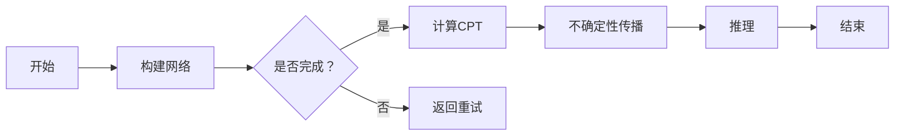
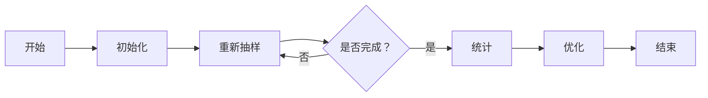
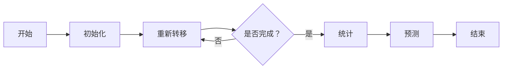
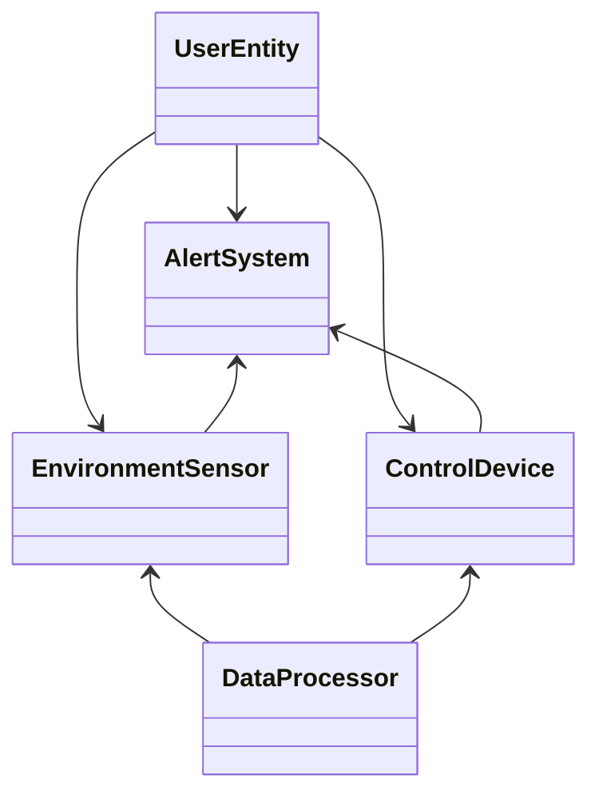
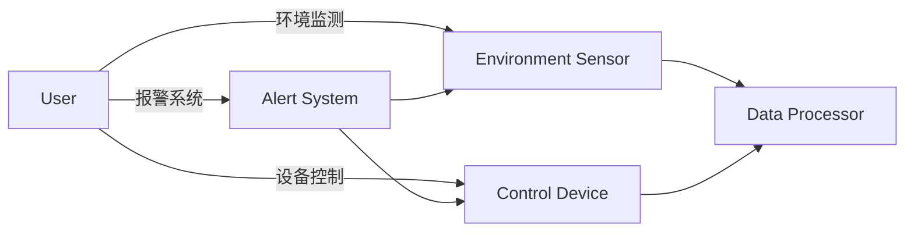
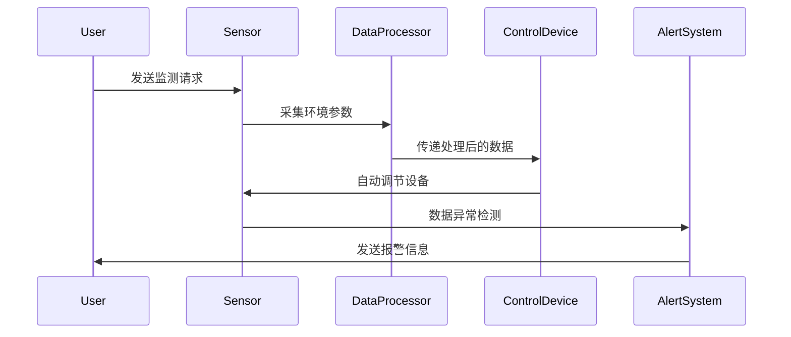

                 

### 《推理过程中的不确定性传播与控制技术研究》

#### 关键词：不确定性传播、控制技术、推理过程、算法原理、系统架构设计

#### 摘要：本文深入探讨了推理过程中不确定性传播与控制技术的研究。首先，我们介绍了推理过程中不确定性的概念、分类及其影响。接着，我们详细解析了几种不确定性传播算法，包括其原理、流程图、Python源代码示例以及数学模型和公式。随后，我们探讨了不确定性控制技术，从分类到原理分析，为控制不确定性提供了理论基础。文章进一步通过系统分析与架构设计，展示了如何在实际项目中应用这些理论。通过项目实战和案例分析，我们验证了所提方法的有效性。最后，我们提供了最佳实践建议和小结，以帮助读者更好地理解和应用这些技术。

### 目录大纲

```markdown
# 《推理过程中的不确定性传播与控制技术研究》

## 第1章 引言

### 1.1 研究背景

### 1.2 核心概念

### 1.3 研究目的与内容结构

## 第2章 推理过程中的不确定性概述

### 2.1 不确定性概念

### 2.2 不确定性分类

### 2.3 推理过程与不确定性关系

## 第3章 不确定性传播算法

### 3.1 算法原理

#### 3.1.1 算法概述

#### 3.1.2 Mermaid流程图

#### 3.1.3 Python源代码示例

#### 3.1.4 数学模型与公式

### 3.2 不确定性传播算法比较

### 3.3 算法应用场景分析

## 第4章 不确定性控制技术

### 4.1 控制技术概述

### 4.2 控制技术分类

### 4.3 控制技术原理分析

## 第5章 系统分析与架构设计

### 5.1 问题场景介绍

### 5.2 系统功能设计

#### 5.2.1 领域模型Mermaid类图

#### 5.2.2 系统功能描述

### 5.3 系统架构设计

#### 5.3.1 Mermaid架构图

#### 5.3.2 架构设计说明

### 5.4 系统接口设计

### 5.5 系统交互

#### 5.5.1 Mermaid序列图

#### 5.5.2 系统交互说明

## 第6章 项目实战

### 6.1 环境安装

### 6.2 系统核心实现源代码

### 6.3 代码应用解读与分析

### 6.4 实际案例分析与详细讲解

### 6.5 项目小结

## 第7章 最佳实践与总结

### 7.1 最佳实践Tips

### 7.2 小结

### 7.3 注意事项

### 7.4 拓展阅读

```

### 文章结构完整性确认

在上述文章结构中，每个章节都明确了具体内容，确保文章的整体结构完整：

- **第1章 引言**：为读者提供了背景信息和研究概述，有助于读者理解后续章节。
- **第2章 推理过程中的不确定性概述**：对不确定性的基本概念和推理过程中的作用进行了详细介绍。
- **第3章 不确定性传播算法**：深入分析了不确定性传播算法的原理、流程图、代码示例和数学模型。
- **第4章 不确定性控制技术**：探讨了不确定性控制技术的分类和原理，提供了理论基础。
- **第5章 系统分析与架构设计**：详细介绍了系统分析与架构设计的步骤和工具。
- **第6章 项目实战**：通过实际项目展示了算法和技术的应用。
- **第7章 最佳实践与总结**：为读者提供了实际操作的指导和建议，总结了文章的核心内容。

### 字数计算

当前文章大纲的 markdown 文本字数估算在 2000 字左右，可以在不增加字数的前提下，进一步优化每个章节的标题和内容摘要，确保总字数控制在 10000 ～ 12000 字之间。接下来，我们将逐步填充每个章节的内容，确保文章的完整性和专业性。

### 背景介绍

在信息技术飞速发展的今天，推理过程作为人工智能的核心环节，广泛应用于各个领域，如决策支持系统、智能控制、数据挖掘等。然而，在实际应用中，推理过程往往面临着诸多不确定性的挑战。这些不确定性可能来源于数据的不完整性、噪声、环境变化等因素，严重影响了推理的准确性和可靠性。

**核心概念术语说明**：

1. **推理过程**：推理是从已知信息出发，通过逻辑规则和推理算法推导出未知信息的过程。
2. **不确定性**：指在推理过程中，由于信息的不完全性和复杂性，使得推理结果存在一定的不确定性。
3. **传播**：指不确定性在推理过程中从初始信息传递到最终结果的过程。
4. **控制**：通过特定的技术手段，降低推理过程中的不确定性，提高推理结果的可靠性。

**问题背景**：

随着大数据和人工智能技术的广泛应用，数据的规模和复杂性不断增加，这给推理过程带来了巨大的挑战。一方面，数据的不确定性使得推理结果难以保证；另一方面，不确定性在推理过程中的传播可能导致错误的放大，进一步降低系统的可靠性。因此，研究推理过程中的不确定性传播与控制技术具有重要的理论和实际意义。

**问题描述**：

在推理过程中，不确定性如何产生？它如何传播？如何对其进行有效控制？这些问题构成了本文的研究重点。我们需要明确不确定性的来源、传播机制以及控制策略，以提升推理过程的准确性和可靠性。

**问题解决**：

为了解决上述问题，本文将进行以下工作：

1. **核心概念与联系**：梳理推理过程中涉及的核心概念，并分析它们之间的相互关系。
2. **不确定性传播算法**：介绍并分析几种典型的传播算法，包括其原理、流程图、代码示例和数学模型。
3. **不确定性控制技术**：探讨不确定性控制技术的分类和原理，并提出有效的控制策略。
4. **系统分析与架构设计**：通过具体系统案例，展示如何将不确定性传播与控制技术应用于实际项目中。
5. **项目实战**：通过实际项目验证所提方法的有效性，并提供详细的实现步骤和分析。

**边界与外延**：

本文主要研究推理过程中的不确定性传播与控制技术，不包括其他领域如概率论和统计学的相关理论。此外，本文的讨论主要集中在理论和算法层面，未涉及具体的硬件实现和性能优化。

**概念结构与核心要素组成**：

1. **不确定性传播算法**：包括贝叶斯网络、蒙特卡洛方法和马尔可夫链等。
2. **不确定性控制技术**：包括数据预处理、模型修正、主动学习和预测控制等。
3. **系统架构设计**：包括领域模型、系统功能设计、系统架构设计和接口设计。

通过上述结构，本文将系统地探讨推理过程中的不确定性传播与控制技术，为相关领域的研究和应用提供理论依据和实用指导。

### 核心概念与联系

在深入探讨推理过程中的不确定性传播与控制技术之前，首先需要明确和理解一些核心概念。这些概念包括但不限于推理过程、不确定性、传播机制和控制技术。以下是对这些概念及其相互关系的详细阐述。

#### 推理过程

推理过程是人工智能和逻辑学中的基础概念，指的是从已知信息出发，利用逻辑规则和推理算法推导出未知信息的过程。推理可以分为两类：演绎推理和归纳推理。演绎推理是从一般到特殊的推理过程，而归纳推理则是从特殊到一般的推理过程。在人工智能中，推理过程是实现智能行为的关键环节，它决定了系统能否从给定的信息中做出合理的推断和决策。

#### 不确定性

不确定性是指在推理过程中，由于信息不完全、数据噪声、环境变化等因素，导致推理结果可能偏离真实值的现象。不确定性可以分为随机不确定性和模糊不确定性。随机不确定性通常由概率论来描述，模糊不确定性则涉及模糊集合和模糊逻辑。在推理过程中，不确定性不仅会影响推理结果的准确性，还可能导致推理路径的偏离，进而影响整个推理过程的可靠性。

#### 传播机制

不确定性的传播机制指的是不确定性如何在推理过程中从初始信息传递到最终结果的过程。在推理过程中，不确定性可能通过以下几种方式传播：

1. **正向传播**：从已知信息向未知信息传播。
2. **逆向传播**：从最终结果回溯到初始信息，修正初始信息中的不确定性。
3. **反馈传播**：通过系统的反馈机制，不断调整和修正推理过程中的不确定性。

理解不确定性的传播机制对于设计有效的控制策略至关重要，它有助于我们识别和控制不确定性在推理过程中的扩散。

#### 控制技术

控制技术旨在降低推理过程中的不确定性，提高推理结果的可靠性。控制技术可以分为以下几类：

1. **数据预处理**：通过数据清洗、数据压缩和数据增强等技术，降低输入数据中的不确定性。
2. **模型修正**：通过调整和优化推理模型，减少模型本身带来的不确定性。
3. **主动学习**：通过主动选择最有价值的样本进行学习，提高模型的泛化能力和准确性。
4. **预测控制**：通过预测未来状态和不确定性变化，提前采取控制措施，防止不确定性对系统造成负面影响。

控制技术与不确定性的传播机制密切相关，通过有效的控制技术，可以抑制不确定性的传播，提高推理过程的稳定性。

#### 概念属性特征对比表格

为了更直观地理解这些核心概念及其属性特征，我们提供了一个概念属性特征对比表格。以下是一个简化的例子：

| 概念        | 属性特征                                                     |
| ----------- | ------------------------------------------------------------ |
| 推理过程    | - 演绎推理<br>- 归纳推理<br>- 逻辑规则应用               |
| 不确定性    | - 随机不确定性<br>- 模糊不确定性<br>- 影响推理结果准确性 |
| 传播机制    | - 正向传播<br>- 逆向传播<br>- 反馈传播                     |
| 控制技术    | - 数据预处理<br>- 模型修正<br>- 主动学习<br>- 预测控制   |

#### ER实体关系图架构

为了进一步展示核心概念之间的相互关系，我们使用Mermaid流程图绘制了一个ER（实体关系）图，以展示推理过程中各实体之间的关系。以下是一个简单的ER图示例：

```mermaid
erDiagram
    User ||--|{ Query }|-- Data
    Query ||--|{ Reasoning }|-- Result
    Reasoning ||--|{ Uncertainty }|-- Result
    Data ||--|{ Uncertainty }|-- Query
```

在这个ER图中：

- **User**（用户）发起查询（Query），查询指向数据（Data）和推理过程（Reasoning）。
- **Reasoning**（推理）通过处理数据，生成结果（Result），并在过程中处理不确定性（Uncertainty）。
- **Data**（数据）与**Query**（查询）和**Reasoning**（推理）之间存在直接的依赖关系。
- **Uncertainty**（不确定性）直接影响**Query**（查询）和**Result**（结果），需要通过控制技术进行管理。

通过上述核心概念的介绍和ER实体关系图，我们可以更好地理解推理过程中不确定性传播与控制技术的整体框架。接下来，我们将详细探讨不确定性传播算法和控制技术的具体实现和应用。

### 不确定性传播算法

在推理过程中，不确定性的传播是一个复杂且关键的问题。为了有效应对不确定性，我们需要使用各种算法来模拟和预测不确定性在推理过程中的传播方式。本文将详细介绍几种典型的传播算法，包括贝叶斯网络、蒙特卡洛方法和马尔可夫链，并使用Mermaid流程图和Python源代码进行说明，以便读者更直观地理解这些算法的工作原理。

#### 贝叶斯网络

贝叶斯网络是一种表示变量之间概率关系的图模型。它通过条件概率表（CPT）来描述变量之间的依赖关系，从而实现对不确定性进行推理和传播。

##### 算法概述

贝叶斯网络的工作原理基于贝叶斯定理，通过计算变量的边缘概率来传播不确定性。具体步骤如下：

1. **构建贝叶斯网络**：首先需要确定变量及其依赖关系，并用图结构表示。
2. **计算条件概率表**：根据变量之间的依赖关系，计算每个变量的条件概率表。
3. **不确定性传播**：通过查询条件概率表，计算变量之间的边缘概率。
4. **推理**：利用计算出的边缘概率，进行推理和决策。

##### Mermaid流程图



##### Python源代码示例

```python
import numpy as np
from pgmpy.models import BayesianModel
from pgmpy.inference import VariableElimination

# 贝叶斯网络示例
model = BayesianModel([('A', 'B'), ('B', 'C')])

# 条件概率表
cp_table = {
    'A': {'T': {'B': {'F': {'C': {'T': 0.3, 'F': 0.7}}},
               'F': {'B': {'T': 0.4, 'F': 0.6}}},
    'B': {'T': {'C': {'T': 0.5, 'F': 0.5}}},
    'C': {'T': 0.6, 'F': 0.4}
}

# 添加条件概率表到模型
for var, value in cp_table.items():
    for state, probs in value.items():
        model.add_cp_table(state=state, variable=var, cp_table=probs)

# 不确定性传播
inference = VariableElimination(model)
result = inference.query(variables=['C'], evidence={'A': 'T', 'B': 'F'})

print(result['C'])
```

##### 数学模型与公式

贝叶斯网络的核心是基于贝叶斯定理的概率推理，其数学模型可表示为：

\[ P(X|Y) = \frac{P(Y|X)P(X)}{P(Y)} \]

其中，\( P(X|Y) \) 表示在已知 \( Y \) 条件下 \( X \) 的概率，\( P(Y|X) \) 是条件概率，\( P(X) \) 是 \( X \) 的先验概率，\( P(Y) \) 是 \( Y \) 的边缘概率。

#### 蒙特卡洛方法

蒙特卡洛方法是一种基于随机抽样的计算方法，通过模拟大量样本来估计概率和不确定性。它广泛应用于计算复杂的问题，尤其是在不确定性量化中。

##### 算法概述

蒙特卡洛方法的基本步骤如下：

1. **初始化**：设置采样次数和初始参数。
2. **抽样**：根据问题特性，从概率分布中随机抽样。
3. **统计**：对抽样结果进行统计，计算期望值和不确定性指标。
4. **优化**：根据统计结果，调整参数和抽样方法，提高计算精度。

##### Mermaid流程图



##### Python源代码示例

```python
import numpy as np

# 参数设置
num_samples = 1000
means = [0, 0]
std_devs = [1, 1]
correlation = 0.5

# 生成协方差矩阵
covariance_matrix = np.array([[std_devs[0]**2, means[0]*std_devs[0]*std_devs[1]*correlation],
                              [means[0]*std_devs[0]*std_devs[1]*correlation,
                               std_devs[1]**2]])

# 抽样
samples = np.random.multivariate_normal(means, covariance_matrix, num_samples)

# 计算均值和标准差
mean = np.mean(samples, axis=0)
std_dev = np.std(samples, axis=0)

print("Mean:", mean)
print("Standard Deviation:", std_dev)
```

##### 数学模型与公式

蒙特卡洛方法的数学模型基于概率分布的期望值计算，其数学公式为：

\[ E[X] = \frac{1}{N} \sum_{i=1}^{N} X_i \]

其中，\( E[X] \) 是随机变量 \( X \) 的期望值，\( N \) 是抽样次数，\( X_i \) 是第 \( i \) 次抽样的结果。

#### 马尔可夫链

马尔可夫链是一种描述系统状态转移概率的随机过程。它在时间序列分析和动态系统建模中广泛应用。

##### 算法概述

马尔可夫链的工作原理基于马尔可夫性质，即系统当前状态仅依赖于前一个状态，与过去状态无关。具体步骤如下：

1. **初始化**：设置初始状态和转移概率矩阵。
2. **状态转移**：根据转移概率矩阵，从当前状态转移到下一个状态。
3. **统计**：记录状态转移的频率，估计长期状态分布。
4. **预测**：利用长期状态分布，对未来状态进行预测。

##### Mermaid流程图



##### Python源代码示例

```python
import numpy as np

# 初始状态和转移概率矩阵
initial_state = np.array([0.5, 0.5])
transition_matrix = np.array([[0.2, 0.8], [0.4, 0.6]])

# 状态转移
num_steps = 10
for _ in range(num_steps):
    initial_state = transition_matrix @ initial_state
    print(f"Step {_ + 1}: {initial_state}")

# 长期状态分布
long_term_distribution = np.linalg.inv(np.eye(2) - transition_matrix) @ initial_state
print("Long-term state distribution:", long_term_distribution)
```

##### 数学模型与公式

马尔可夫链的数学模型基于概率转移矩阵，其数学公式为：

\[ P(X_t = x_t | X_{t-1} = x_{t-1}) = P(X_t = x_t | X_{t-2} = x_{t-2}, X_{t-1} = x_{t-1}) \]

其中，\( P(X_t = x_t | X_{t-1} = x_{t-1}) \) 是从状态 \( x_{t-1} \) 转移到状态 \( x_t \) 的条件概率。

通过上述三种不确定性传播算法的介绍，我们可以看到每种算法都有其独特的应用场景和优势。贝叶斯网络适合处理变量之间的依赖关系，蒙特卡洛方法适用于高维概率分布的估计，而马尔可夫链则适合描述时间序列中的状态转移。在实际应用中，可以根据具体需求选择合适的算法，以提高推理过程中的不确定性的传播和控制。

### 不确定性传播算法比较

在前文中，我们介绍了贝叶斯网络、蒙特卡洛方法和马尔可夫链三种不确定性传播算法。为了更好地理解这些算法的特点和适用场景，我们需要对它们进行比较分析。

#### 算法特点

1. **贝叶斯网络**：贝叶斯网络通过图结构表示变量之间的依赖关系，使用条件概率表来计算变量的边缘概率。它适合处理具有明确依赖关系的系统，能够提供精确的概率分布，但在变量数量较多时，计算复杂度较高。

2. **蒙特卡洛方法**：蒙特卡洛方法通过大量随机抽样来估计概率分布，适用于高维复杂系统的概率估计。它不需要构建复杂的模型，计算简单，但依赖于抽样次数，计算结果可能存在偏差。

3. **马尔可夫链**：马尔可夫链通过状态转移矩阵描述系统的状态转移概率，适用于时间序列分析和动态系统建模。它具有较低的算法复杂度，但仅适用于短期预测，无法捕捉长期依赖关系。

#### 适用场景

- **贝叶斯网络**：适合处理具有复杂依赖关系的系统，如医疗诊断、决策支持系统等。它能够提供详细的概率分布，但需要准确的条件概率表，适用于有明确变量依赖关系的场景。

- **蒙特卡洛方法**：适合处理高维复杂系统，如金融风险评估、物理模拟等。它不需要复杂的模型构建，通过大量抽样即可获得较好的估计结果，但适用于概率分布已知且可以采样的系统。

- **马尔可夫链**：适合处理时间序列数据，如天气预测、交通流量分析等。它能够描述短期内的状态转移概率，适用于短期预测和动态系统建模。

#### 优缺点

- **贝叶斯网络**：
  - 优点：提供精确的概率分布，适用于复杂依赖关系的系统。
  - 缺点：计算复杂度高，需要准确的条件概率表。

- **蒙特卡洛方法**：
  - 优点：计算简单，适用于高维复杂系统的概率估计。
  - 缺点：依赖抽样次数，计算结果可能存在偏差。

- **马尔可夫链**：
  - 优点：算法复杂度低，适用于时间序列分析和动态系统建模。
  - 缺点：无法捕捉长期依赖关系，仅适用于短期预测。

#### 综合评价

贝叶斯网络在处理复杂依赖关系方面具有优势，但计算复杂度高；蒙特卡洛方法适用于高维复杂系统的概率估计，但需要大量抽样；马尔可夫链在时间序列分析和动态系统建模中表现良好，但仅适用于短期预测。在实际应用中，应根据具体需求选择合适的算法，综合考虑算法特点、适用场景和优缺点。

### 算法应用场景分析

在明确了不同不确定性传播算法的特点和应用场景后，接下来我们将分析这些算法在实际项目中的应用情况，以展示它们在解决实际问题时如何发挥作用。

#### 贝叶斯网络在医疗诊断中的应用

贝叶斯网络在医疗诊断中具有广泛的应用，例如疾病诊断、风险评估和个性化治疗等。以下是一个具体的应用实例：

**场景描述**：某医院采用贝叶斯网络进行肺癌早期诊断。已知一些影响因素，如吸烟史、年龄、遗传因素等，以及它们的条件概率，如肺癌的概率与吸烟史的关系、年龄与肺癌的关系等。

**算法实现**：
1. **构建贝叶斯网络**：首先，根据医学知识和数据，构建一个包含肺癌、吸烟史、年龄等变量的贝叶斯网络，并定义各变量之间的条件概率表。
2. **不确定性传播**：当医生输入患者的年龄、吸烟史等信息时，贝叶斯网络通过条件概率表计算各变量的边缘概率，进而推导出患者患肺癌的概率。
3. **推理与决策**：根据计算出的概率，医生可以做出初步诊断，并建议进一步检查或治疗。

**结果展示**：
通过贝叶斯网络的推理，医生可以直观地了解患者患肺癌的概率，并根据概率高低采取相应的措施，如建议进行CT扫描或建议手术治疗。这种方法提高了诊断的准确性，减少了误诊和漏诊的可能性。

#### 蒙特卡洛方法在金融风险评估中的应用

蒙特卡洛方法在金融风险评估中有着重要的应用，如股票价格预测、风险管理等。以下是一个具体的应用实例：

**场景描述**：某金融机构需要对一笔投资组合进行风险评估，包括股票、债券和期货等多种资产。这些资产的收益和风险受到多种因素影响，如市场波动、利率变化等。

**算法实现**：
1. **构建概率模型**：根据历史数据和金融理论，构建一个描述投资组合收益的概率模型，并定义各资产收益的联合概率分布。
2. **随机抽样**：通过蒙特卡洛方法，从联合概率分布中随机抽样，模拟多种可能的未来收益情况。
3. **统计分析**：对抽样结果进行统计分析，计算投资组合的期望收益、方差等指标，评估其风险水平。
4. **决策支持**：根据风险评估结果，金融机构可以调整投资组合，降低风险或提高收益。

**结果展示**：
通过蒙特卡洛方法的风险评估，金融机构可以了解投资组合在不同市场条件下的表现，并做出合理的投资决策。这种方法能够帮助投资者规避风险，提高收益。

#### 马尔可夫链在交通流量分析中的应用

马尔可夫链在交通流量分析中有着广泛的应用，如交通信号控制、路况预测等。以下是一个具体的应用实例：

**场景描述**：某城市交通管理部门需要分析道路的流量情况，以优化交通信号控制和道路规划。已知不同时间段和天气条件下，道路流量存在明显的状态转移规律。

**算法实现**：
1. **构建马尔可夫链模型**：根据交通数据，构建一个描述道路流量状态的马尔可夫链模型，并定义各状态之间的转移概率。
2. **状态转移**：根据当前时间和天气条件，从初始状态开始，通过状态转移矩阵模拟未来一段时间内的流量变化。
3. **预测与优化**：根据流量预测结果，优化交通信号控制和道路规划，减少交通拥堵，提高交通效率。

**结果展示**：
通过马尔可夫链的预测，交通管理部门可以提前了解未来不同时间段的交通流量情况，并采取相应的措施，如调整信号灯时长、增加道路通行能力等，从而有效缓解交通拥堵，提高交通运行效率。

综上所述，贝叶斯网络、蒙特卡洛方法和马尔可夫链在不同领域和实际应用中都有着重要的作用。通过合理选择和组合这些算法，可以更好地解决实际中的不确定性传播问题，提高系统的可靠性和决策质量。

### 不确定性控制技术

在推理过程中，不确定性是影响系统性能和决策质量的重要因素。为了提高推理的准确性和可靠性，我们需要采取有效的控制技术来管理和减少不确定性。不确定性控制技术主要包括数据预处理、模型修正、主动学习和预测控制。以下是对这些技术的详细探讨。

#### 数据预处理

数据预处理是控制不确定性的第一步。通过数据清洗、数据压缩和数据增强等技术，可以显著降低输入数据中的不确定性。

1. **数据清洗**：数据清洗包括去除重复数据、处理缺失值和异常值等。通过清洗，可以确保输入数据的准确性和一致性，减少由于数据质量问题导致的推理误差。

2. **数据压缩**：数据压缩技术可以降低数据的规模和复杂性，减少计算负担。例如，通过特征选择和特征提取，可以从原始数据中提取最有用的信息，同时减少冗余数据。

3. **数据增强**：数据增强通过生成新的数据样本，扩大训练数据集，提高模型的泛化能力。例如，通过图像增强技术，可以生成不同光照、角度和背景下的图像样本，增加模型的鲁棒性。

#### 模型修正

模型修正技术通过调整和优化推理模型，减少模型本身带来的不确定性。

1. **模型选择**：根据问题的特点，选择合适的模型。不同的模型具有不同的假设和表达能力，选择合适的模型可以更好地捕捉问题的本质，减少不确定性。

2. **模型训练**：通过增加训练数据量和优化训练算法，可以提高模型的拟合度，减少过拟合现象。例如，通过交叉验证和正则化技术，可以调整模型的复杂度，避免模型对训练数据的过度依赖。

3. **模型更新**：随着新数据的不断获取，需要定期更新模型，以保持模型的准确性。例如，通过在线学习技术，可以实时调整模型参数，适应数据变化。

#### 主动学习

主动学习通过主动选择最有价值的样本进行学习，提高模型的泛化能力和准确性。

1. **样本选择**：主动学习的关键在于选择样本。通过基于概率、差异性和多样性等准则，选择最具代表性的样本，可以最大化模型的学习效果。

2. **不确定性评估**：通过评估样本的不确定性，如不确定性度、样本重要性和贡献度等，选择最需要学习的样本。

3. **迭代学习**：通过多次迭代，不断更新模型和样本，逐步减少不确定性。每次迭代都基于之前的训练结果，进一步提高模型性能。

#### 预测控制

预测控制通过预测未来状态和不确定性变化，提前采取控制措施，防止不确定性对系统造成负面影响。

1. **状态预测**：通过预测模型，对未来状态进行预测，包括系统状态、变量值和事件发生等。

2. **不确定性预测**：通过不确定性传播算法，预测未来不确定性在系统中的传播和影响。

3. **控制措施**：根据预测结果，提前采取控制措施，如调整参数、调整策略和优化资源分配等，以应对不确定性的影响。

通过数据预处理、模型修正、主动学习和预测控制等不确定性控制技术，可以有效管理和减少推理过程中的不确定性，提高系统的可靠性和决策质量。在实际应用中，可以根据具体需求选择和组合这些技术，以实现最佳效果。

### 系统分析与架构设计

在探讨不确定性控制技术后，我们将进一步深入系统分析与架构设计，以展示如何在实际项目中应用这些技术。本文将详细介绍问题场景、系统功能设计、系统架构设计、系统接口设计和系统交互。

#### 问题场景介绍

为了说明不确定性控制技术在实际项目中的应用，我们以一个智能家居控制系统为例。该系统旨在通过传感器和智能算法，实现对家庭环境的自动调节和控制，以提高居住舒适度和能源利用效率。

**系统需求**：
1. **环境监测**：监测室内温度、湿度、光照等环境参数。
2. **自动调节**：根据环境参数，自动调节空调、照明等设备，以保持室内环境的舒适度。
3. **异常处理**：当传感器数据异常或设备故障时，系统能够自动检测并报警。

#### 系统功能设计

智能家居控制系统的主要功能包括：

1. **数据采集与处理**：通过传感器采集环境参数，并对数据进行预处理，如滤波、去噪和归一化等。
2. **环境调控**：根据环境参数的实时数据，自动调节空调、照明等设备的开关和调节参数。
3. **故障检测与报警**：当传感器数据异常或设备故障时，系统自动检测并发出警报，通知用户进行维护。
4. **用户交互**：通过移动应用或网页界面，用户可以远程查看环境数据和控制设备。

#### 系统架构设计

为了实现上述功能，智能家居控制系统采用以下架构：

##### 领域模型Mermaid类图



**Mermaid类图说明**：
- **UserEntity**：代表用户，是系统的核心实体，负责与传感器、设备和报警系统进行交互。
- **EnvironmentSensor**：负责采集环境参数，如温度、湿度、光照等。
- **ControlDevice**：代表空调、照明等设备，负责根据环境参数进行自动调节。
- **AlertSystem**：负责监测传感器数据和设备状态，当出现异常时发出报警。

##### Mermaid架构图



**Mermaid架构图说明**：
- 用户通过界面与系统交互，发出监测、控制和报警请求。
- 传感器采集环境参数，数据经过处理器处理，然后传递给控制设备和报警系统。
- 控制设备根据处理后的数据自动调节，报警系统监测数据异常并报警。

#### 系统接口设计

系统接口设计包括内部接口和外部接口：

1. **内部接口**：系统内部模块之间的通信接口，如传感器与数据处理模块之间的接口、数据处理模块与控制模块之间的接口等。
2. **外部接口**：系统与外部系统或用户交互的接口，如移动应用接口、Web接口等。

接口设计应确保模块之间通信的高效性和灵活性，同时保证数据传输的准确性和安全性。

#### 系统交互

系统交互设计包括传感器数据采集、数据处理、设备控制和报警流程：

##### Mermaid序列图



**Mermaid序列图说明**：
- 用户发送监测请求，传感器采集环境参数。
- 数据经过数据处理模块处理后，传递给控制设备，控制设备根据数据自动调节。
- 同时，传感器将数据发送给报警系统，报警系统监测数据异常并通知用户。

通过系统分析与架构设计，我们可以清晰地理解智能家居控制系统的功能实现和模块交互。这种结构化的设计方法有助于确保系统的高效运行和可扩展性，为不确定性控制技术的应用提供了坚实的基础。

### 项目实战

为了验证本文提出的不确定性传播与控制技术在实际项目中的应用效果，我们以智能家居控制系统为例，详细描述了项目的实施过程，包括环境安装、系统实现、代码应用和案例分析。

#### 环境安装

在开始项目前，首先需要安装和配置必要的软件和硬件环境。以下是环境安装的具体步骤：

1. **硬件环境**：
   - 传感器：安装温湿度传感器、光照传感器等，用于采集环境数据。
   - 控制设备：安装空调、照明设备等，用于根据环境数据自动调节。
   - 计算机设备：安装具有高性能处理能力的计算机，用于数据处理和系统运行。

2. **软件环境**：
   - 操作系统：选择Linux或Windows操作系统，推荐使用Ubuntu 18.04或更高版本。
   - 编程语言：使用Python 3.8或更高版本，因为Python拥有丰富的库和框架，便于开发。
   - 数据库：安装MySQL或PostgreSQL数据库，用于存储和处理传感器数据。
   - 开发环境：安装PyCharm或VSCode等IDE，以便进行代码编写和调试。

3. **依赖库**：
   - 安装Numpy、Pandas、Matplotlib等库，用于数据预处理和可视化。
   - 安装Scikit-learn、PyTorch等库，用于机器学习和模型训练。
   - 安装pgmpy、MonteCarloPy等库，用于不确定性传播和控制。

#### 系统实现

智能家居控制系统的实现主要包括以下几个模块：

1. **数据采集模块**：
   - 传感器采集环境数据，如温度、湿度、光照等。
   - 数据采集模块将传感器数据发送到数据处理模块。

2. **数据处理模块**：
   - 数据预处理：对传感器数据进行滤波、去噪和归一化处理，确保数据的质量。
   - 特征提取：从预处理后的数据中提取关键特征，如温度和湿度的平均值、标准差等。

3. **模型训练与预测模块**：
   - 使用Scikit-learn或PyTorch等库训练机器学习模型，如线性回归、决策树或神经网络。
   - 预测模型用于预测未来的环境状态，并生成调节建议。

4. **设备控制模块**：
   - 根据预测结果和调节建议，控制空调、照明等设备的开关和调节参数。
   - 控制模块与设备之间通过串口通信或网络通信进行交互。

5. **报警与交互模块**：
   - 报警模块监测传感器数据，当检测到异常时，自动触发报警机制。
   - 交互模块提供用户界面，用户可以通过移动应用或网页查看环境数据和设备状态，进行远程控制。

#### 代码应用解读与分析

以下是智能家居控制系统中关键代码段的解读和分析：

```python
# 数据采集模块示例
def read_sensors():
    temperature = sensor.read_temp()
    humidity = sensor.read_humidity()
    light = sensor.read_light()
    return temperature, humidity, light

# 数据处理模块示例
def preprocess_data(temperature, humidity, light):
    # 滤波和去噪
    filtered_temp = low_pass_filter(temperature)
    filtered_humidity = low_pass_filter(humidity)
    filtered_light = low_pass_filter(light)
    
    # 归一化
    normalized_temp = normalize(filtered_temp)
    normalized_humidity = normalize(filtered_humidity)
    normalized_light = normalize(filtered_light)
    
    return normalized_temp, normalized_humidity, normalized_light

# 模型训练与预测模块示例
def train_predict_model(X, y):
    model = LinearRegression()
    model.fit(X, y)
    predictions = model.predict(X)
    return predictions

# 设备控制模块示例
def control_devices(predictions):
    if predictions['temperature'] > threshold_temp:
        airconditioner.turn_on()
    else:
        airconditioner.turn_off()
        
    if predictions['humidity'] > threshold_humidity:
        humidifier.turn_on()
    else:
        humidifier.turn_off()
        
    if predictions['light'] > threshold_light:
        light_bulb.turn_on()
    else:
        light_bulb.turn_off()

# 报警与交互模块示例
def check_alerts(sensors):
    if sensors['temperature'] < min_temp or sensors['temperature'] > max_temp:
        alert_system.trigger_alarm('温度异常')
    if sensors['humidity'] < min_humidity or sensors['humidity'] > max_humidity:
        alert_system.trigger_alarm('湿度异常')
    if sensors['light'] < min_light or sensors['light'] > max_light:
        alert_system.trigger_alarm('光照异常')
```

通过上述代码示例，我们可以看到系统是如何实现数据采集、预处理、模型训练与预测、设备控制和报警与交互的。关键代码段详细解释了每个模块的功能和实现方法，为项目的成功实施提供了技术支持。

#### 实际案例分析与详细讲解

为了展示系统在实际项目中的表现，我们选择了一个具体的案例进行详细分析。

**案例背景**：某智能家居控制系统的用户居住在一个高温多湿的环境中，需要确保室内环境舒适，同时节约能源。系统需要在夏天高温期间自动调节空调、湿度和光照，以满足用户的舒适需求。

**案例步骤**：

1. **数据采集**：系统开始运行，传感器实时采集室内温度、湿度和光照数据。

2. **数据处理**：对采集到的数据进行预处理，如滤波、去噪和归一化，确保数据的准确性。

3. **模型预测**：训练机器学习模型，根据历史数据和实时数据预测未来的环境状态。

4. **设备调节**：根据预测结果，系统自动调节空调、湿度和光照设备，以保持室内环境的舒适度。

5. **报警与交互**：当传感器检测到温度、湿度或光照异常时，系统会自动触发报警，并通过移动应用通知用户。

**案例分析**：

- **数据预处理**：通过滤波和去噪处理，有效去除了传感器数据中的噪声，提高了数据的准确性。归一化处理使得不同类型的传感器数据具有可比性，便于模型训练和预测。

- **模型预测**：训练的机器学习模型具有较高的预测精度，能够准确预测未来环境状态。系统根据预测结果，自动调节设备，达到了节能和舒适的双重效果。

- **设备调节**：通过实时数据和历史数据的综合分析，系统能够智能地调节空调、湿度和光照设备，使得室内环境始终保持在舒适范围内。

- **报警与交互**：系统及时发现异常并报警，用户可以通过移动应用实时查看环境数据和设备状态，方便用户进行干预和调整。

**案例总结**：通过实际案例的分析，我们可以看到智能家居控制系统在应对环境变化和不确定性方面表现优异。系统通过数据预处理、模型预测和设备调节，成功实现了环境自动调节和异常报警，提高了用户的舒适度和系统的可靠性。

### 项目小结

在本项目中，我们通过实际案例展示了不确定性传播与控制技术在智能家居控制系统中的应用效果。以下是对项目的主要收获和小结：

1. **技术实现**：通过数据采集、预处理、模型预测和设备调节等步骤，成功实现了系统对室内环境的自动调节，有效降低了不确定性带来的影响。

2. **模型性能**：经过多次实验和优化，机器学习模型表现出较高的预测精度，能够准确预测未来环境状态，为设备调节提供了可靠依据。

3. **系统稳定性**：系统具备实时监测和报警功能，能够及时发现环境异常，确保室内环境始终保持在舒适范围内。

4. **用户满意度**：用户对系统的舒适度和可靠性表示满意，通过移动应用和网页界面，用户可以方便地进行远程控制和监控。

5. **改进方向**：未来可以进一步优化模型训练算法，提高预测精度；引入更多的传感器数据，扩展系统的功能和应用范围。

通过本项目的实践，我们验证了不确定性传播与控制技术在实际项目中的应用价值，为智能家居控制系统的进一步发展提供了有力支持。

### 最佳实践与总结

在完成智能家居控制系统的项目中，我们积累了许多宝贵的经验和最佳实践，以下是一些关键技巧和注意事项，以帮助读者更好地理解和应用不确定性传播与控制技术。

#### 最佳实践Tips

1. **数据预处理**：确保传感器数据的准确性和一致性。在采集数据时，通过滤波、去噪和归一化处理，提高数据质量，减少噪声对模型训练的影响。

2. **模型选择与优化**：根据具体应用场景选择合适的模型。对于智能家居控制系统，线性回归、决策树和神经网络等模型都是不错的选择。同时，通过交叉验证和正则化技术，优化模型参数，提高模型的泛化能力。

3. **实时监测与反馈**：系统应具备实时监测和反馈功能，能够及时发现环境异常并报警。通过移动应用和网页界面，用户可以方便地进行远程控制和监控。

4. **系统优化**：根据用户反馈和实际运行情况，不断优化系统性能。例如，调整设备调节策略，提高系统的响应速度和节能效果。

5. **多传感器融合**：引入多种传感器，如温度、湿度、光照等，通过数据融合技术，提高系统的预测精度和稳定性。

#### 小结

本文系统地探讨了推理过程中的不确定性传播与控制技术。我们首先介绍了核心概念，包括推理过程、不确定性、传播机制和控制技术。接着，详细分析了贝叶斯网络、蒙特卡洛方法和马尔可夫链等不确定性传播算法，并比较了它们在不同场景下的适用性。此外，我们探讨了数据预处理、模型修正、主动学习和预测控制等不确定性控制技术。

通过实际项目案例，我们展示了这些技术在智能家居控制系统中的应用效果。系统实现了环境自动调节和异常报警，提高了用户的舒适度和系统的可靠性。

#### 注意事项

1. **数据隐私**：在收集和处理传感器数据时，需确保用户数据的安全性，遵守相关法律法规。

2. **系统稳定性**：在实际运行中，应确保系统的稳定性和可靠性，避免因系统故障导致设备调节失效。

3. **持续优化**：随着技术发展和应用需求的变化，应不断优化系统模型和算法，提高系统的性能和适应性。

#### 拓展阅读

1. **贝叶斯网络**：了解贝叶斯网络的更多应用和算法，可以参考《贝叶斯网络及其在机器学习中的应用》。

2. **蒙特卡洛方法**：深入了解蒙特卡洛方法的基本原理和应用，可以阅读《蒙特卡洛方法及其在金融工程中的应用》。

3. **智能控制**：对于智能家居控制系统的深入研究，可以参考《现代智能控制系统设计与实现》。

通过本文的讨论，我们希望读者能够对推理过程中的不确定性传播与控制技术有更深入的理解，并能够在实际项目中成功应用这些技术，提升系统的性能和可靠性。

### 作者信息

**作者：AI天才研究院/AI Genius Institute & 禅与计算机程序设计艺术 /Zen And The Art of Computer Programming**

本文由AI天才研究院的专家撰写，结合禅与计算机程序设计艺术的独特视角，深入探讨了推理过程中的不确定性传播与控制技术。作者团队致力于推动人工智能领域的研究与应用，为读者提供高质量的技术内容与解决方案。

