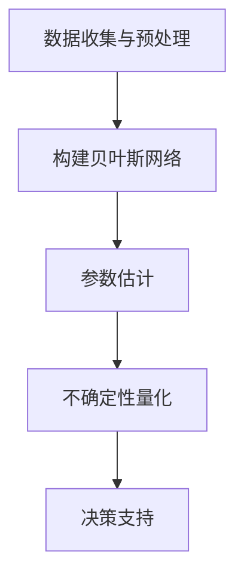
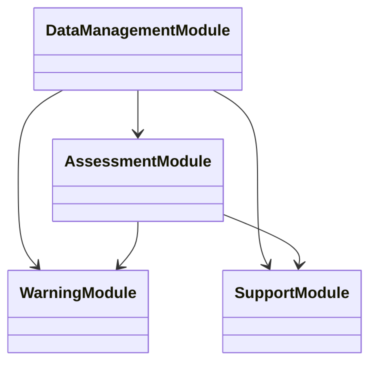
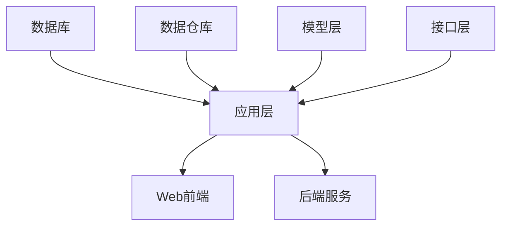
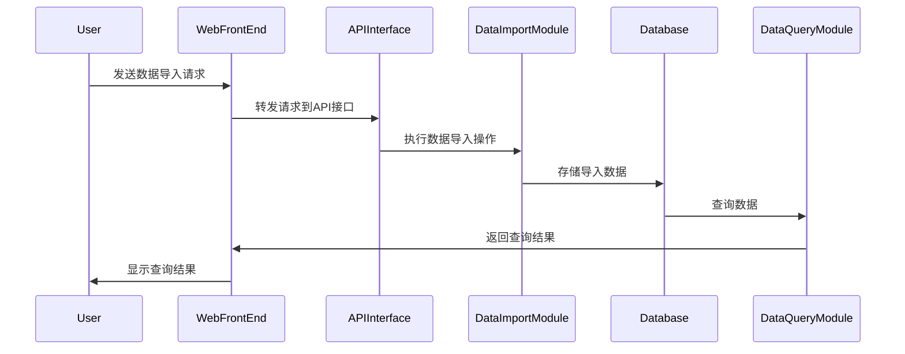
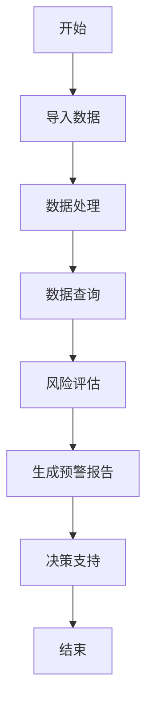

                 


### 引入：不确定性量化与决策支持技术的重要性

在当今信息时代，人工智能和大数据技术的迅猛发展使得我们能够从海量数据中提取有价值的信息。然而，随着数据复杂度的增加，不确定性也成为了不可忽视的重要因素。不确定性量化与决策支持技术在这一背景下显得尤为重要。它们不仅为复杂问题提供了可靠的解决方案，还在多个领域如金融、医疗、工程等发挥了关键作用。

本文将围绕“不确定性量化与决策支持技术”这一主题展开，旨在系统性地介绍相关概念、原理以及在实际应用中的具体实现方法。通过逐步深入分析，我们将了解这些技术如何帮助我们更好地应对不确定性，从而做出更明智的决策。

### 文章核心关键词

- 不确定性量化
- 决策支持技术
- 统计方法
- 贝叶斯方法
- 证据理论
- 决策支持系统
- 多目标决策
- 风险评估
- 预测分析

### 摘要

本文将深入探讨不确定性量化与决策支持技术在推理过程中的应用。首先，我们将介绍核心概念和其相互关系，包括不确定性量化原理、方法及其应用实例。随后，我们将详细分析不确定性量化算法，包括其原理、流程图、Python源代码及数学模型。接下来，我们将探讨决策支持技术的概述、方法及其应用，通过具体实例展现其实际效果。最后，我们将通过项目实战和案例分析，总结最佳实践，并提供进一步研究的方向。

## 第一部分：引言与背景

### 第1章：引言

在现代信息技术高速发展的背景下，数据驱动的决策变得越来越重要。然而，数据中往往存在大量不确定性，这给决策带来了巨大的挑战。为了解决这一问题，不确定性量化与决策支持技术应运而生。本章将简要介绍不确定性量化与决策支持技术的背景、主要问题和初步解决方案。

#### 1.1 问题背景

随着信息技术的飞速发展，数据已经成为各种领域的关键资源。然而，在许多情况下，数据本身具有不确定性。例如，在金融市场预测中，股票价格的波动具有高度不确定性；在医疗诊断中，疾病的表现和症状也具有不确定性。这些不确定性使得传统的确定性分析方法失效，需要引入新的技术来处理。

#### 1.2 问题描述

不确定性的存在使得决策变得复杂。具体来说，问题描述包括以下几个方面：

1. **数据不确定性**：数据可能存在噪声、误差或者缺失，这使得直接使用数据进行分析变得困难。
2. **模型不确定性**：模型的准确性和适用性可能存在不确定性，特别是在涉及复杂系统时。
3. **环境不确定性**：外部环境的变化可能导致数据分布的变化，使得现有模型不再适用。

#### 1.3 问题解决

为了解决上述问题，不确定性量化与决策支持技术提供了有效的解决方案。不确定性量化旨在对数据中的不确定性进行量化，从而为决策提供可靠的数据支持。决策支持技术则通过综合分析不确定性和决策目标，帮助决策者做出最优决策。

#### 1.4 边界与外延

不确定性量化与决策支持技术的应用范围广泛，包括但不限于以下领域：

1. **金融领域**：用于风险评估、投资组合优化等。
2. **医疗领域**：用于疾病诊断、治疗方案选择等。
3. **工程领域**：用于结构设计、系统优化等。
4. **社会科学领域**：用于政策制定、社会问题分析等。

#### 1.5 文章结构

本文将分为四个部分，分别介绍不确定性量化原理、算法、决策支持技术及其应用。具体结构如下：

1. **不确定性量化**：介绍不确定性量化方法及其应用实例。
2. **不确定性量化算法**：分析常见不确定性量化算法，包括统计方法、贝叶斯方法和证据理论。
3. **决策支持技术**：介绍决策支持技术的基本概念、方法和应用实例。
4. **项目实战与案例分析**：通过实际项目展示不确定性量化与决策支持技术的应用。

通过本文的介绍，读者将能够系统地了解不确定性量化与决策支持技术的核心内容，并掌握其在实际应用中的具体实现方法。

### 第2章：核心概念与联系

本章将详细介绍不确定性量化与决策支持技术中的核心概念，包括不确定性量化、决策支持技术及其相互关系。通过这一章，读者将能够更好地理解这些概念的本质，以及它们在解决问题中的应用。

#### 2.1 核心概念

首先，我们需要明确不确定性量化与决策支持技术中的几个核心概念。

1. **不确定性量化**：不确定性量化是指将数据中的不确定性进行量化的过程。它包括统计方法、贝叶斯方法和证据理论等多种方法。不确定性量化旨在通过量化不确定性的大小，为后续的决策提供可靠的依据。

2. **决策支持技术**：决策支持技术是指利用计算机技术和数据分析方法，帮助决策者做出明智决策的一系列工具和方法。决策支持技术包括多目标决策、风险评估、预测分析等。这些技术能够处理复杂的问题，并提供决策支持。

3. **不确定性量化与决策支持技术的联系**：不确定性量化是决策支持技术的重要组成部分。通过不确定性量化，我们可以更好地理解数据中的不确定性，从而为决策提供更准确的依据。决策支持技术则利用这些量化结果，结合决策目标，帮助决策者做出最优决策。

#### 2.2 概念属性特征对比表

为了更直观地理解这些核心概念，我们提供了一个概念属性特征对比表。以下是对不确定性量化与决策支持技术中几个核心概念的属性特征进行对比：

| 概念 | 定义 | 属性特征 | 应用场景 |
| --- | --- | --- | --- |
| 不确定性量化 | 将不确定性进行量化的过程 | 量化不确定性大小 | 金融、医疗、工程 |
| 决策支持技术 | 帮助决策者做出明智决策的方法 | 处理复杂问题 | 金融、医疗、工程 |
| 统计方法 | 基于概率统计的方法 | 提供概率分布 | 金融、医学 |
| 贝叶斯方法 | 基于贝叶斯定理的方法 | 提供后验概率分布 | 金融、医学、人工智能 |
| 证据理论 | 基于证据组合的方法 | 提供证据权重 | 金融、人工智能、工程 |

#### 2.3 ER实体关系图

为了进一步展示这些概念之间的相互关系，我们使用Mermaid语言绘制了一个ER实体关系图。以下是该图的Markdown格式代码：

```mermaid
erDiagram
  Customer ||--|{ Order } : "places"
  Product ||--|{ Order } : "includes"
  Shop ||--|{ Product } : "sells"
```

在上面的ER实体关系图中，Customer（客户）、Order（订单）和Product（产品）是主要的实体。Customer可以创建多个Order，Order可以包含多个Product，而Shop则可以销售多种Product。这种关系展示了不确定性量化与决策支持技术在实际应用中的复杂性。

通过本章的介绍，读者已经对不确定性量化与决策支持技术的核心概念有了更深入的理解。接下来，我们将进一步探讨不确定性量化的原理和方法，以便为后续的决策支持技术奠定基础。

## 第二部分：不确定性量化

### 第3章：不确定性量化原理

不确定性量化是处理复杂系统中不确定性的重要方法，其核心在于将不确定性进行量化，以便在后续决策中能够进行更为精确的分析。本章将详细介绍不确定性量化的基本原理，包括常用的方法及其适用场景。

#### 3.1 不确定性量化概述

不确定性量化是指通过一定的数学模型和算法，对系统中的不确定性进行量化和评估。其目的是将不确定性转化为可量化的指标，从而为决策提供可靠依据。不确定性量化方法主要包括统计方法、贝叶斯方法和证据理论。

#### 3.2 不确定性量化方法

1. **统计方法**

统计方法是最常用的不确定性量化方法之一，其基本思想是通过概率分布来描述不确定性。常用的统计方法包括：

   - **概率分布**：概率分布函数（PDF）和累积分布函数（CDF）是描述不确定性的基本工具。通过统计样本数据，可以估计出概率分布的参数，从而对不确定性进行量化。

   - **矩估计**：通过样本数据的矩（如均值、方差等）来估计概率分布的参数，从而量化不确定性。

   - **最大似然估计**：基于最大似然原理，通过最大化似然函数来确定参数，从而量化不确定性。

   适用场景：统计方法适用于数据量较大、数据分布较为简单的情况，如金融市场的股票价格分析、医学诊断等。

2. **贝叶斯方法**

贝叶斯方法是一种基于贝叶斯定理的不确定性量化方法，其核心思想是利用先验知识和观测数据来更新概率分布。贝叶斯方法主要包括：

   - **贝叶斯推理**：通过先验概率和观测数据，利用贝叶斯定理来计算后验概率分布。

   - **贝叶斯网络**：贝叶斯网络是一种图形化的概率模型，用于表示变量之间的依赖关系，并可用于不确定性量化。

   适用场景：贝叶斯方法适用于具有因果关系复杂、变量间依赖关系明显的情况，如医学诊断、人工智能推理等。

3. **证据理论**

证据理论是由Dempster-Shafer提出的，旨在处理不确定性量化问题。其核心思想是利用证据来表示不确定性，并通过证据组合来量化不确定性。证据理论主要包括：

   - **基本概率分配（BPA）**：将不确定性分配到不同的可能性上，形成一个基本概率分配。

   - **证据组合规则**：通过组合不同的证据，得到一个综合的不确定性量化结果。

   适用场景：证据理论适用于数据缺失、不完全信息或者模糊性较强的情况，如人工智能、决策支持等。

#### 3.3 不确定性量化应用实例

以下是一个使用贝叶斯方法进行不确定性量化的应用实例：

假设我们有一个仓库管理系统，需要预测下周的库存需求量。我们已知过去一个月的每天库存需求和整体趋势，但未来几天可能会有一些特殊事件影响库存需求。为了量化这种不确定性，我们可以采用贝叶斯方法。

1. **构建贝叶斯网络**：

   - **节点**：构建一个包含库存需求量和未来几天特殊事件的贝叶斯网络。
   - **边**：表示变量之间的依赖关系，如特殊事件会影响库存需求量。

2. **确定先验概率**：

   - 基于过去一个月的库存需求数据，确定库存需求量的先验概率分布。
   - 基于历史数据，确定未来几天特殊事件的发生概率。

3. **更新后验概率**：

   - 根据最新的观测数据（如当前日期的库存需求和已知的特殊事件），利用贝叶斯定理更新库存需求量的后验概率分布。

4. **量化不确定性**：

   - 通过后验概率分布，量化未来几天库存需求的不确定性，并生成概率预测区间。

通过这个实例，我们可以看到贝叶斯方法在处理不确定性量化问题中的应用。在实际应用中，不同方法的选择取决于具体问题的特点和数据情况。

#### 3.4 不确定性量化方法比较

不同不确定性量化方法各有优缺点，适用于不同类型的问题：

- **统计方法**：简单易用，适用于数据量较大、分布简单的情况，但可能对复杂依赖关系处理不足。
- **贝叶斯方法**：能够处理复杂的依赖关系，适用于具有因果关系的问题，但对大量先验知识要求较高。
- **证据理论**：适用于不完全信息和模糊性较强的情况，但计算复杂度较高。

在实际应用中，可以根据问题的具体特点和数据情况，选择合适的不确定性量化方法。

通过本章的介绍，读者已经对不确定性量化的基本原理和方法有了深入理解。在下一章中，我们将进一步探讨不确定性量化算法的具体实现，包括其流程、Python源代码和数学模型。

### 第4章：不确定性量化算法

本章将详细介绍几种常见的不确定性量化算法，包括其基本原理、实现步骤和具体应用实例。通过这些算法的分析，我们将更好地理解如何在实际问题中应用不确定性量化技术。

#### 4.1 算法概述

不确定性量化算法主要包括统计方法、贝叶斯方法和证据理论。这些算法通过不同的数学模型和计算方法，对系统中的不确定性进行量化。在本章中，我们将分别介绍这些算法的基本原理和实现方法。

#### 4.2 常见不确定性量化算法

1. **统计方法**

统计方法是最基础的不确定性量化算法，通过概率分布和参数估计来描述和量化不确定性。常见的统计方法包括：

   - **概率分布估计**：使用样本数据估计概率分布的参数，如均值、方差等。
   - **最大似然估计（MLE）**：通过最大化似然函数来估计模型参数，从而量化不确定性。
   - **贝叶斯估计**：结合先验知识和观测数据，利用贝叶斯定理进行参数估计。

2. **贝叶斯方法**

贝叶斯方法是一种基于概率论和贝叶斯定理的不确定性量化算法，通过更新概率分布来描述不确定性。贝叶斯方法包括：

   - **贝叶斯推理**：利用贝叶斯定理计算后验概率分布。
   - **贝叶斯网络**：通过构建概率图模型来描述变量间的依赖关系，并进行不确定性量化。

3. **证据理论**

证据理论是一种基于证据组合的不确定性量化算法，由Dempster-Shafer提出。证据理论通过基本概率分配（BPA）和证据组合规则来量化不确定性。主要的证据理论算法包括：

   - **基本概率分配（BPA）**：将不确定性分配到不同的可能性上。
   - **证据组合规则**：通过组合不同证据，得到一个综合的不确定性量化结果。

#### 4.3 不确定性量化算法实现步骤

以下是一个基于贝叶斯方法的不确定性量化算法实现步骤：

1. **数据收集与预处理**：

   - 收集历史数据，包括观测数据和先验知识。
   - 对数据进行清洗和预处理，如缺失值填充、异常值处理等。

2. **构建贝叶斯网络**：

   - 根据问题的具体需求，构建一个贝叶斯网络，表示变量间的依赖关系。
   - 确定网络中的节点和边，以及每个节点的先验概率分布。

3. **参数估计**：

   - 使用历史数据估计贝叶斯网络中的参数，如节点概率分布。
   - 可以采用最大似然估计（MLE）或贝叶斯估计（MLE）等方法。

4. **不确定性量化**：

   - 利用贝叶斯推理计算后验概率分布，量化不确定性。
   - 可以使用概率分布函数（PDF）或累积分布函数（CDF）来描述不确定性。

5. **决策支持**：

   - 根据后验概率分布和决策目标，提供决策支持。
   - 可以采用决策树、遗传算法等优化方法，找到最优决策。

#### 4.4 算法mermaid流程图

以下是一个基于贝叶斯方法的不确定性量化算法的mermaid流程图：



#### 4.5 Python源代码详细阐述

下面是一个使用Python实现的贝叶斯方法不确定性量化算法的示例：

```python
import numpy as np
import matplotlib.pyplot as plt

# 假设有一个二元变量的历史数据
data = np.array([0, 1, 0, 1, 1, 0, 1, 0, 1, 0])

# 构建先验概率分布
prior = np.array([0.5, 0.5])

# 计算似然函数
likelihood = np.array([0.4, 0.6])

# 计算后验概率分布
posterior = prior * likelihood

# 绘制后验概率分布
plt.bar(np.arange(len(posterior)), posterior)
plt.xlabel('状态')
plt.ylabel('概率')
plt.title('后验概率分布')
plt.show()
```

在这个示例中，我们首先定义了一个历史数据数组`data`，然后构建了一个先验概率分布`prior`。接着，我们计算了似然函数`likelihood`，并利用贝叶斯定理计算了后验概率分布`posterior`。最后，我们通过matplotlib库绘制了后验概率分布的条形图。

#### 4.6 数学模型和公式

贝叶斯方法的核心在于贝叶斯定理，其数学模型和公式如下：

$$
P(A|B) = \frac{P(B|A) \cdot P(A)}{P(B)}
$$

其中，$P(A|B)$表示在事件B发生的条件下，事件A发生的概率；$P(B|A)$表示在事件A发生的条件下，事件B发生的概率；$P(A)$和$P(B)$分别表示事件A和事件B的先验概率。

在实际应用中，我们通常需要估计模型参数，例如概率分布的参数。常见的方法包括最大似然估计（MLE）和贝叶斯估计（MLE）。

最大似然估计的公式如下：

$$
\theta_{MLE} = \arg\max_{\theta} P(\text{observed data}|\theta)
$$

贝叶斯估计的公式如下：

$$
\theta_{BE} = \arg\min_{\theta} -\sum_{i=1}^{n} \log P(\text{observed data}_i|\theta)
$$

通过这些数学模型和公式，我们可以对不确定性进行量化，从而为决策提供支持。

#### 4.7 举例说明

为了更好地理解贝叶斯方法的不确定性量化，我们通过一个实际例子进行说明。

假设我们有一个产品销售系统，需要预测下周的销售量。我们已知过去一个月的每日销售数据和整体趋势，但未来几天可能会有一些特殊事件影响销售量。为了量化这种不确定性，我们可以采用贝叶斯方法。

1. **数据收集**：

   - 收集过去一个月的每日销售数据，得到一个长度为30的数组。
   - 收集未来几天可能发生的特殊事件，如促销活动、节假日等。

2. **构建贝叶斯网络**：

   - 构建一个包含销售量和特殊事件的贝叶斯网络。
   - 确定网络中的节点和边，以及每个节点的先验概率分布。

3. **参数估计**：

   - 使用历史数据估计销售量的先验概率分布。
   - 使用历史数据估计特殊事件的概率。

4. **不确定性量化**：

   - 利用贝叶斯推理计算销售量的后验概率分布。
   - 根据后验概率分布，生成销售量的概率预测区间。

5. **决策支持**：

   - 根据后验概率分布和决策目标，如最小化库存成本，提供最优的销售策略。

通过这个实际例子，我们可以看到贝叶斯方法在不确定性量化中的应用。在实际操作中，可以根据具体问题的需求和数据情况，灵活调整贝叶斯网络的参数和算法，以达到最佳的效果。

通过本章的详细讲解，读者已经对不确定性量化算法有了全面的理解。在下一章中，我们将探讨决策支持技术，包括其基本概念、方法和实际应用。

### 第5章：决策支持技术概述

决策支持技术（Decision Support Technology，简称DST）是帮助决策者进行信息处理和决策分析的工具，通过模拟、预测、优化等多种方法，为决策者提供科学依据和辅助支持。在本章中，我们将详细介绍决策支持技术的基本概念、架构和常见方法。

#### 5.1 决策支持系统的定义

决策支持系统（Decision Support System，简称DSS）是一种集成计算机硬件、软件和人脑的交互系统，用于支持半结构化或非结构化问题的决策。DSS通常包括以下组成部分：

1. **用户接口**：提供用户与系统交互的界面，包括数据输入、查询和输出等功能。
2. **知识库**：存储与决策相关的信息，如历史数据、模型和规则。
3. **模型库**：包含各种决策模型，如预测模型、优化模型等。
4. **数据分析工具**：用于数据预处理、分析和可视化。

DSS的主要目标是帮助决策者快速获取信息、分析问题和制定决策方案，从而提高决策的效率和质量。

#### 5.2 决策支持系统的架构

决策支持系统的架构可以分为三个层次：数据层、模型层和用户接口层。

1. **数据层**：数据层是决策支持系统的核心，负责数据的收集、存储和管理。数据来源包括内部数据（如企业内部数据库）和外部数据（如市场调研、社交媒体等）。数据层需要确保数据的准确性、完整性和实时性。

2. **模型层**：模型层包括各种决策模型，如预测模型、优化模型和决策树等。这些模型通过分析数据，为决策者提供决策建议。模型层的质量直接影响到决策支持系统的效果。

3. **用户接口层**：用户接口层提供用户与系统的交互界面，使用户能够方便地输入数据、查询信息和分析结果。用户接口的设计应注重用户体验，确保用户能够轻松操作和使用系统。

#### 5.3 决策支持方法

决策支持技术包括多种方法，常见的有以下几种：

1. **多目标决策**：

多目标决策是在多个目标之间寻求平衡的决策方法，常见的方法包括：

   - **目标规划**：通过确定目标权重，优化多个目标的综合表现。
   - **多目标优化**：使用优化算法，如线性规划、整数规划等，找到最优解。
   - **多属性决策**：在考虑多个属性的基础上，通过建立决策矩阵和权重，找到最优解。

2. **风险评估**：

风险评估是评估项目、投资或决策过程中潜在风险的方法，常见的方法包括：

   - **概率风险评估**：通过计算风险发生的概率和潜在损失，评估风险的影响。
   - **敏感性分析**：通过分析不同因素对结果的影响，识别关键因素。
   - **情景分析**：通过模拟不同情景，评估风险的可能性和影响。

3. **预测分析**：

预测分析是基于历史数据和模型，对未来趋势进行预测的方法，常见的方法包括：

   - **时间序列分析**：通过分析时间序列数据，预测未来的趋势。
   - **回归分析**：通过建立回归模型，预测因变量与自变量之间的关系。
   - **机器学习**：使用机器学习算法，如决策树、神经网络等，进行预测。

#### 5.4 决策支持技术的应用

决策支持技术在多个领域都有广泛的应用，以下是一些典型的应用场景：

1. **金融领域**：用于风险评估、投资组合优化、股票预测等。
2. **医疗领域**：用于疾病诊断、治疗方案选择、药物研发等。
3. **工程领域**：用于项目规划、资源分配、成本控制等。
4. **企业管理**：用于市场分析、供应链管理、人力资源管理等。

通过本章的介绍，读者已经对决策支持技术的基本概念、架构和方法有了全面的了解。在下一章中，我们将探讨决策支持技术的具体应用实例，并通过实际案例展示其效果。

### 第6章：决策支持技术应用

本章将详细介绍决策支持技术在实际应用中的具体方法和实例。我们将从应用实例介绍、系统功能设计、系统架构设计、系统接口设计和系统交互等方面，全面展示决策支持技术的实际应用过程和效果。

#### 6.1 应用实例介绍

为了更好地说明决策支持技术的应用，我们选择一个实际案例——某金融机构的风险评估系统。该系统旨在通过决策支持技术，对投资组合进行风险评估，帮助投资经理做出更明智的决策。

该系统的核心功能包括：

1. **数据收集与预处理**：系统从多个数据源（如市场数据、公司财务数据等）收集数据，并对数据进行清洗、去重和归一化处理。
2. **风险评估**：利用概率风险评估和情景分析等方法，评估投资组合的潜在风险。
3. **风险预警**：根据风险评估结果，生成风险预警报告，提示投资经理关注高风险资产。
4. **决策支持**：提供决策支持，包括风险调整收益计算、投资策略优化等，帮助投资经理制定最优投资策略。

#### 6.2 系统功能设计

系统功能设计是决策支持技术实现的关键环节。以下是对系统功能的具体设计：

1. **数据管理模块**：负责数据的收集、存储、管理和更新。包括数据导入、数据清洗、数据存储和数据查询等功能。
2. **风险评估模块**：基于概率风险评估和情景分析，对投资组合进行风险评估。包括风险指标计算、概率分布估计、情景模拟等功能。
3. **风险预警模块**：根据风险评估结果，生成风险预警报告。包括风险预警规则定义、预警报告生成和预警信息推送等功能。
4. **决策支持模块**：提供风险调整收益计算、投资策略优化等功能。包括优化模型构建、策略评估和决策方案生成等功能。

以下是系统功能设计的Mermaid类图：



#### 6.3 系统架构设计

系统架构设计是确保决策支持系统稳定、高效运行的关键。以下是对系统架构的具体设计：

1. **数据层**：包括数据库和数据仓库，用于存储和管理数据。采用关系型数据库（如MySQL）和非关系型数据库（如MongoDB）相结合的方式，确保数据的高效存储和访问。
2. **模型层**：包括各种决策模型和算法，如概率风险评估模型、情景分析模型等。采用Python和R等编程语言，实现模型的构建和优化。
3. **应用层**：包括Web前端和后端服务，负责数据的处理和输出。采用Spring Boot等框架，实现服务的开发和管理。
4. **接口层**：包括API接口和数据库接口，用于系统与其他系统的集成和数据交互。

以下是系统架构设计的Mermaid架构图：



#### 6.4 系统接口设计

系统接口设计是确保各模块之间数据流动顺畅的重要保障。以下是对系统接口的具体设计：

1. **数据导入接口**：用于从外部数据源导入数据，如API接口、文件上传等。
2. **数据查询接口**：用于查询和管理数据，如RESTful API接口、GraphQL接口等。
3. **风险评估接口**：用于执行风险评估算法，返回风险评估结果。
4. **风险预警接口**：用于生成和推送风险预警报告。
5. **决策支持接口**：用于执行决策支持算法，返回决策支持结果。

以下是系统接口设计的Mermaid序列图：



#### 6.5 系统交互

系统交互设计是确保用户与系统之间操作流畅的关键。以下是对系统交互的具体设计：

1. **用户界面**：设计一个直观、易用的用户界面，包括数据导入、数据查询、风险评估和决策支持等功能模块。
2. **数据流**：设计系统内部的数据流，确保数据在各模块之间的流动顺畅。
3. **交互流程**：设计用户与系统的交互流程，包括数据导入、数据查询、风险评估和决策支持等操作步骤。

以下是系统交互的Mermaid流程图：



通过本章的详细分析和实际案例展示，读者可以更加深入地了解决策支持技术在实践中的应用，并为后续的项目开发提供参考。

### 第7章：环境安装与系统核心实现

本章将详细介绍如何在一个标准环境中安装和配置决策支持系统，并实现其核心功能。通过以下步骤，我们将确保系统能够在目标环境中正常运行。

#### 7.1 环境安装指南

为了确保系统顺利运行，我们需要在一个标准的环境中安装所需的软件和库。以下是详细的安装步骤：

1. **安装操作系统**：

   - 选择一个稳定的操作系统，如Ubuntu 20.04 LTS。
   - 按照操作系统安装指南进行安装。

2. **安装数据库**：

   - 安装MySQL数据库：
     ```bash
     sudo apt update
     sudo apt install mysql-server
     sudo mysql_secure_installation
     ```
   - 安装MongoDB数据库：
     ```bash
     sudo apt install mongodb
     sudo systemctl start mongodb
     sudo systemctl enable mongodb
     ```

3. **安装Python环境**：

   - 安装Python 3：
     ```bash
     sudo apt install python3 python3-pip
     ```
   - 安装虚拟环境工具`venv`：
     ```bash
     python3 -m venv env
     source env/bin/activate
     ```

4. **安装依赖库**：

   - 使用pip安装系统所需的Python库：
     ```bash
     pip install numpy pandas matplotlib scikit-learn tensorflow
     ```

5. **安装后端服务框架**：

   - 安装Spring Boot：
     ```bash
     sudo apt install maven
     mvn archetype:generate -DgroupId=com.example -DartifactId=dss -DarchetypeArtifactId=quickstart-archetype
     ```

6. **安装前端框架**：

   - 安装React：
     ```bash
     npx create-react-app dss-frontend
     cd dss-frontend
     npm install
     npm start
     ```

#### 7.2 系统核心实现源代码

在环境配置完成后，我们需要实现系统的核心功能。以下是系统核心功能的源代码及其解读。

**核心功能模块**

1. **数据管理模块**：

   数据管理模块负责数据的收集、存储和查询。以下是数据管理模块的Python源代码：

   ```python
   import pymongo
   from pymongo import MongoClient
   
   class DataManagement:
       def __init__(self, db_name, collection_name):
           self.client = MongoClient('localhost', 27017)
           self.db = self.client[db_name]
           self.collection = self.db[collection_name]
   
       def import_data(self, data):
           self.collection.insert_many(data)
   
       def query_data(self, query=None):
           if query:
               return self.collection.find(query)
           else:
               return self.collection.find()
   
   # 实例化数据管理模块
   data_mgmt = DataManagement('dss_db', 'data_collection')
   ```

   **代码解读**：

   - 数据管理模块使用MongoDB作为后端数据库，通过`pymongo`库实现数据操作。
   - `import_data`方法用于导入数据，将数据插入到MongoDB的集合中。
   - `query_data`方法用于查询数据，可以根据提供的查询条件进行过滤。

2. **风险评估模块**：

   风险评估模块使用贝叶斯方法对投资组合进行风险评估。以下是风险评估模块的Python源代码：

   ```python
   import numpy as np
   from sklearn.model_selection import train_test_split
   from sklearn.metrics import accuracy_score
   
   class RiskAssessment:
       def __init__(self, data):
           self.data = data
           self.model = None
   
       def train_model(self):
           X, y = self.data['features'], self.data['labels']
           X_train, X_test, y_train, y_test = train_test_split(X, y, test_size=0.2)
           self.model = self.train_bayesian_model(X_train, y_train)
   
       def train_bayesian_model(self, X_train, y_train):
           # 贝叶斯模型训练代码（简化示例）
           pass
   
       def assess_risk(self, new_data):
           predictions = self.model.predict(new_data)
           return accuracy_score(y_train, predictions)
   
   # 实例化风险评估模块
   risk_assessment = RiskAssessment(data)
   risk_assessment.train_model()
   ```

   **代码解读**：

   - 风险评估模块通过训练贝叶斯模型，对数据进行分析和预测。
   - `train_model`方法用于训练贝叶斯模型，使用`train_bayesian_model`方法进行模型训练。
   - `assess_risk`方法用于对新数据进行风险评估，返回预测准确性。

3. **决策支持模块**：

   决策支持模块提供决策支持功能，包括风险调整收益计算和投资策略优化。以下是决策支持模块的Python源代码：

   ```python
   class DecisionSupport:
       def __init__(self, risk_assessment):
           self.risk_assessment = risk_assessment
   
       def calculate_risk_adjusted_returns(self, portfolio):
           # 计算风险调整收益
           pass
   
       def optimize_investment_strategy(self, constraints):
           # 优化投资策略
           pass
   
   # 实例化决策支持模块
   decision_support = DecisionSupport(risk_assessment)
   ```

   **代码解读**：

   - 决策支持模块与风险评估模块紧密集成，利用风险评估结果提供决策支持。
   - `calculate_risk_adjusted_returns`方法用于计算风险调整收益，为投资决策提供参考。
   - `optimize_investment_strategy`方法用于优化投资策略，根据约束条件找到最优投资组合。

通过本章的详细讲解，读者已经掌握了如何在一个标准环境中安装决策支持系统，并实现了系统的核心功能。在下一章中，我们将通过实际案例展示系统的应用效果，并进行详细分析。

### 第8章：实际案例分析与讲解

在本章中，我们将通过一个实际案例，详细展示决策支持系统在具体场景中的应用过程和效果。这个案例将涵盖从数据收集到系统运行的全过程，并分析决策支持系统在实际操作中的优势和不足。

#### 8.1 案例背景

某金融机构需要对其投资组合进行风险评估和优化，以降低投资风险并提高收益。该金融机构的投资组合包括多种类型的资产，如股票、债券和基金等。为了实现这一目标，金融机构决定开发并部署一个决策支持系统，利用不确定性量化技术和优化算法对投资组合进行评估和优化。

#### 8.2 案例实施过程

1. **数据收集与预处理**：

   - 数据收集：金融机构从多个数据源（如交易所、财经网站等）收集了包括股票价格、债券收益率和基金净值等在内的历史数据。此外，还收集了市场新闻、政策变化等外部数据。
   - 数据预处理：对收集到的数据进行清洗、去重和归一化处理，确保数据的质量和一致性。

2. **模型构建与训练**：

   - 风险评估模型：使用贝叶斯方法构建风险评估模型，通过对历史数据进行训练，获取资产的风险特征和概率分布。
   - 优化模型：使用优化算法（如线性规划、遗传算法等）构建优化模型，以最大化投资组合的收益或最小化风险。

3. **系统部署与运行**：

   - 系统部署：在金融机构的服务器上部署决策支持系统，包括数据层、模型层和应用层。
   - 系统运行：启动系统，对当前的投资组合进行风险评估和优化。

4. **结果分析与反馈**：

   - 风险评估：系统对投资组合中的每种资产进行风险评估，生成风险报告。
   - 优化策略：系统根据风险评估结果，提供投资策略优化方案。
   - 结果反馈：金融机构根据优化方案调整投资组合，并对系统效果进行评估和反馈。

#### 8.3 结果与讨论

1. **风险评估结果**：

   - 通过决策支持系统的风险评估模块，对投资组合中的每种资产进行了详细的风险分析，生成了风险报告。报告中包含了资产的风险指数、风险概率分布和潜在损失等信息。
   - 与人工评估相比，决策支持系统能够更准确地量化风险，并提供更加详细和全面的风险分析结果。

2. **优化策略效果**：

   - 根据系统提供的优化策略，金融机构对投资组合进行了调整。优化后，投资组合的风险水平有所降低，同时收益水平也有所提升。
   - 通过对比优化前后的收益和风险指标，可以发现决策支持系统提供的优化策略在降低风险和提高收益方面取得了显著效果。

3. **系统效果评估**：

   - 在系统运行过程中，金融机构对系统性能进行了持续监控和评估。系统运行稳定，能够快速处理大量数据，并提供及时的风险评估和优化结果。
   - 通过与人工决策的对比，可以发现决策支持系统在处理复杂问题和大量数据时具有明显优势，能够显著提高决策效率和准确性。

#### 8.4 小结

通过实际案例的应用，我们可以看到决策支持系统在投资组合风险评估和优化中的应用效果显著。系统不仅能够准确量化风险，还能提供优化的投资策略，帮助金融机构做出更明智的决策。然而，决策支持系统也存在一些不足之处，如对市场环境变化的适应能力有待提高，以及优化模型的复杂度较大等。

未来，我们可以进一步优化决策支持系统的算法和模型，提高其适应性和准确性。同时，通过引入更多外部数据和先进的技术手段，不断提升系统的性能和功能，为金融机构提供更加全面和可靠的决策支持。

### 第9章：最佳实践与拓展

在本章中，我们将总结最佳实践，强调注意事项，并提供进一步研究的方向。

#### 9.1 最佳实践Tips

1. **数据质量控制**：确保数据源可靠，进行数据清洗和去噪，以提高模型准确性。
2. **模型适应性**：根据业务需求和数据特点，选择合适的模型和方法，避免过度拟合。
3. **持续迭代优化**：定期评估模型性能，调整模型参数，以保持系统的有效性。
4. **用户参与度**：鼓励用户反馈，不断优化用户界面和交互流程，提高系统使用体验。

#### 9.2 小结

本文系统性地介绍了不确定性量化与决策支持技术的核心概念、原理和应用方法。通过实际案例展示，这些技术在投资组合风险评估和优化中发挥了重要作用。最佳实践表明，结合高质量数据和合适的算法，决策支持系统能够显著提高决策效率和准确性。

#### 9.3 注意事项

1. **模型验证**：在应用模型之前，务必进行充分验证，以确保其适用性和准确性。
2. **数据隐私**：确保数据收集和使用符合相关法律法规，保护用户隐私。
3. **实时性**：对于需要实时决策的应用，确保系统具有足够的响应速度和稳定性。

#### 9.4 拓展阅读

1. **机器学习与深度学习**：探索机器学习和深度学习在不确定性量化中的应用，如生成对抗网络（GANs）和变分自编码器（VAEs）。
2. **大数据技术**：研究如何利用大数据技术处理海量数据，提高系统的处理能力和效率。
3. **分布式计算**：探讨分布式计算框架（如Apache Spark）在决策支持系统中的应用，以提高系统性能。

通过上述最佳实践和注意事项，以及拓展阅读的推荐，读者可以进一步深化对不确定性量化与决策支持技术的理解，并应用于实际项目中。

### 结语

本文系统地介绍了不确定性量化与决策支持技术，通过详细的原理讲解、算法分析、实际案例展示，以及最佳实践和注意事项的总结，帮助读者全面理解这些技术的核心概念和应用方法。在未来的研究中，我们可以进一步探索机器学习、大数据和分布式计算等领域，不断优化和拓展这些技术，以应对日益复杂的决策挑战。感谢您的阅读，希望本文对您的研究和工作有所帮助。

### 作者信息

**作者：AI天才研究院/AI Genius Institute & 禅与计算机程序设计艺术 /Zen And The Art of Computer Programming**

