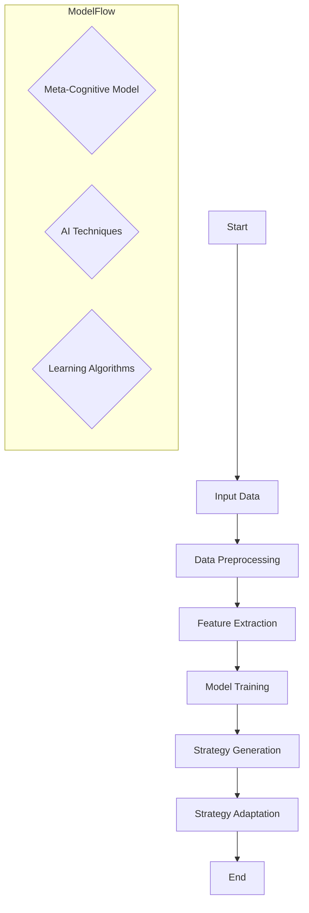
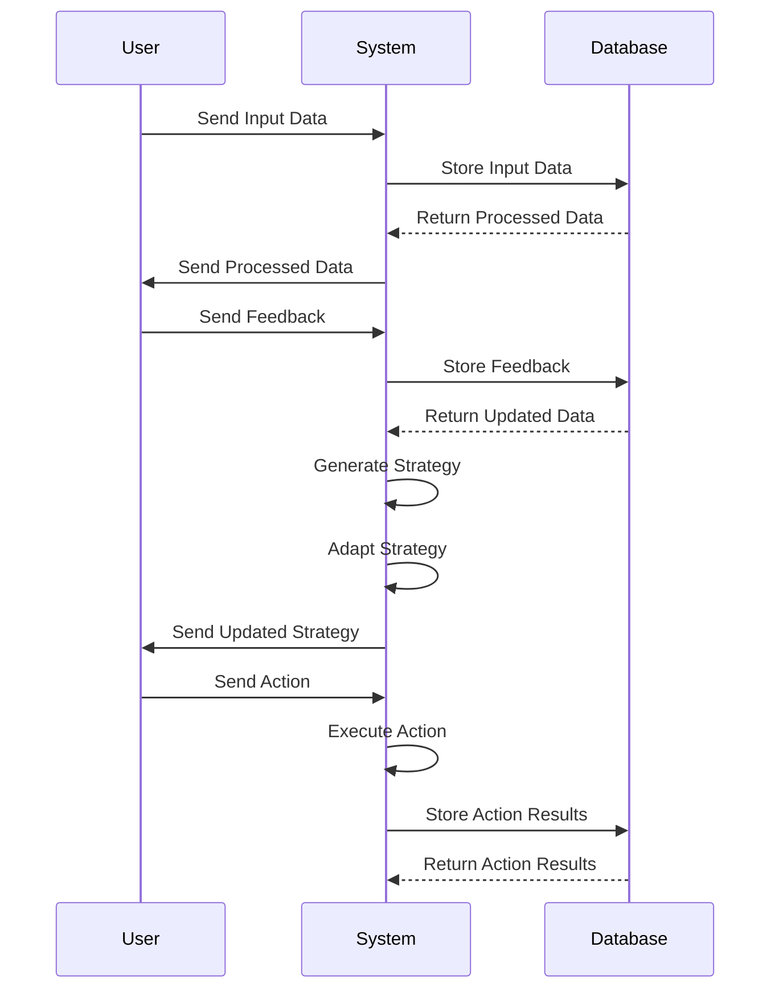

                 


### Introduction to Meta-Cognitive Strategies in Reasoning

**1.1 Problem Background**

In the era of rapid technological advancement, artificial intelligence (AI) has become a cornerstone of innovation. With the development of sophisticated reasoning algorithms, machines are now capable of performing tasks that were once deemed exclusively within the realm of human cognition. However, the advent of AI has also brought forth new challenges, particularly in the area of meta-cognitive strategies—those cognitive processes that enable individuals to think about their own thinking. The complexity of modern problems requires more than just efficient algorithms; they demand a deep understanding of how these algorithms think and how humans can leverage them effectively.

**1.2 Problem Description**

The problem at hand is the dynamic generation mechanism of meta-cognitive strategies within the reasoning process. While traditional AI systems excel at executing specific tasks, they often lack the ability to reflect on their own performance and adapt their strategies accordingly. This limitation hampers their capability to handle complex, real-world scenarios that require iterative problem-solving and continuous learning. Therefore, the need for a robust framework that can dynamically generate and adapt meta-cognitive strategies in response to changing conditions has become increasingly apparent.

**1.3 Problem Resolution**

To address this issue, this article proposes a comprehensive study of the dynamic generation mechanisms of meta-cognitive strategies in the reasoning process. By leveraging advanced AI techniques and rigorous empirical research, we aim to develop a framework that can effectively generate and adapt meta-cognitive strategies in real-time. This framework will be designed to not only enhance the reasoning capabilities of AI systems but also facilitate the seamless integration of human-like cognitive processes into machine intelligence.

**1.4 Boundaries and Extensions**

The scope of this study is focused on the development of a theoretical framework and its application in specific AI contexts. While the proposed mechanisms are expected to be applicable across various domains, the primary focus will be on reasoning tasks involving complex data analysis, decision-making, and problem-solving. Moreover, the article will explore potential extensions and adaptations of the proposed framework to address emerging challenges in AI and cognitive science.

**1.5 Core Concepts and Elements**

To lay the groundwork for this study, we will begin by introducing the core concepts and elements related to meta-cognitive strategies in reasoning. These include:

- **Meta-Cognitive Awareness:** The ability to reflect on and monitor one's own cognitive processes.
- **Meta-Cognitive Control:** The mechanisms that enable individuals to regulate and adapt their cognitive strategies.
- **Reasoning Algorithms:** The computational processes used to derive conclusions from given information.
- **Dynamic Adaptation:** The ability to adjust strategies in response to changing conditions or new information.

In the following sections, we will delve deeper into each of these concepts, providing a detailed analysis and illustrating their significance in the context of AI and cognitive science.

### Core Principles of Meta-Cognitive Strategies

**2.1 Meta-Cognitive Strategies Overview**

Meta-cognitive strategies refer to the cognitive processes that individuals use to regulate their learning and reasoning. These strategies encompass a range of techniques, from self-monitoring and self-evaluation to planning and problem-solving. The primary goal of meta-cognitive strategies is to enhance cognitive efficiency and effectiveness by providing individuals with the tools to manage their mental processes. In the context of AI, understanding and implementing meta-cognitive strategies is crucial for creating intelligent systems that can learn, adapt, and improve over time.

**2.2 Concept Attributes and Comparisons**

Meta-cognitive strategies exhibit several key attributes that distinguish them from other cognitive processes. These attributes include:

- **Reflective Thinking:** The ability to analyze and evaluate one's own thinking processes.
- **Self-Regulation:** The capacity to adjust cognitive strategies based on feedback and changing circumstances.
- **Goal-Oriented:** The focus on achieving specific learning or reasoning goals.
- **Flexibility:** The ability to adapt strategies to different tasks and environments.

To better understand these attributes, let's compare meta-cognitive strategies with other cognitive processes:

| Attribute | Meta-Cognitive Strategies | Other Cognitive Processes |
| --- | --- | --- |
| Reflective Thinking | Engages in self-reflection and evaluation of cognitive processes. | Does not inherently involve self-reflection. |
| Self-Regulation | Adjusts strategies based on feedback and changing conditions. | Generally follows a fixed set of rules or patterns. |
| Goal-Oriented | Directs cognitive efforts towards achieving specific goals. | May not have explicit goals or may focus on different objectives. |
| Flexibility | Adapts to different tasks and environments. | May be less adaptable to changing conditions. |

**2.3 Entity-Relationship Diagram**

To visualize the relationships between the core components of meta-cognitive strategies, we can use an entity-relationship (ER) diagram. This diagram will help us understand how different entities (such as cognitive processes, strategies, and goals) are interconnected and how they contribute to the overall functioning of meta-cognitive strategies.

```mermaid
erDiagram
    CognitiveProcess ||--|{ MetaCognitiveStrategy }||> RegulationMechanism
    MetaCognitiveStrategy ||--|{ Goal }||> GoalAchievement
    CognitiveProcess ||--|{ Feedback }||> SelfEvaluation
    RegulationMechanism ||--|{ Adaptation }||> FlexibleAdjustment
```

In this diagram, the `CognitiveProcess` represents the underlying processes that individuals use to reason and learn. The `MetaCognitiveStrategy` entity captures the specific strategies individuals employ to regulate their cognitive processes. The `RegulationMechanism` and `Adaptation` entities represent the mechanisms through which these strategies are adjusted and refined. Finally, the `Feedback` and `Goal` entities represent the inputs that inform and guide the meta-cognitive process.

By understanding the relationships between these entities, we can better appreciate how meta-cognitive strategies function and how they can be effectively utilized to improve cognitive performance.

### Dynamic Generation Mechanisms of Meta-Cognitive Strategies

**3.1 Algorithm Introduction**

The dynamic generation mechanism of meta-cognitive strategies involves the development of an algorithm capable of generating and adapting these strategies in real-time. This algorithm is designed to leverage advanced AI techniques, including machine learning and computational models, to create a flexible and adaptive framework. The core objective of this algorithm is to enable AI systems to reflect on their own performance, identify areas for improvement, and adjust their strategies accordingly.

**3.2 Mermaid Flowchart**

To illustrate the process flow of the dynamic generation mechanism, we can use a Mermaid flowchart. This flowchart will help us visualize the sequence of steps involved in generating and adapting meta-cognitive strategies.



In this flowchart, the process begins with input data, which is then preprocessed to remove noise and ensure consistency. The preprocessed data is used for feature extraction, which involves identifying key attributes that will inform the meta-cognitive model. The extracted features are then used to train a machine learning model, which serves as the foundation for strategy generation and adaptation.

**3.3 Python Code Explanation**

To provide a more concrete understanding of the algorithm, we will present a Python code snippet that outlines the key steps involved in the dynamic generation mechanism. This code will include detailed comments to explain each component of the algorithm.

```python
# Import necessary libraries
import numpy as np
from sklearn.model_selection import train_test_split
from sklearn.ensemble import RandomForestClassifier
from sklearn.metrics import accuracy_score

# Define the dynamic generation mechanism
class MetaCognitiveStrategyGenerator:
    def __init__(self, data):
        self.data = data
        self.model = None

    def preprocess_data(self):
        # Implement data preprocessing steps
        # ...
        pass

    def extract_features(self):
        # Implement feature extraction steps
        # ...
        pass

    def train_model(self):
        # Split data into training and testing sets
        X_train, X_test, y_train, y_test = train_test_split(self.data['features'], self.data['labels'], test_size=0.2, random_state=42)
        
        # Train a machine learning model
        self.model = RandomForestClassifier(n_estimators=100)
        self.model.fit(X_train, y_train)

    def generate_strategy(self):
        # Generate a meta-cognitive strategy based on the trained model
        # ...
        pass

    def adapt_strategy(self, new_data):
        # Adapt the strategy based on new data
        # ...
        pass

# Example usage
data = {'features': np.random.rand(100, 10), 'labels': np.random.randint(0, 2, 100)}
generator = MetaCognitiveStrategyGenerator(data)
generator.preprocess_data()
generator.extract_features()
generator.train_model()
strategy = generator.generate_strategy()
print("Generated Strategy:", strategy)
```

This code provides a high-level overview of the dynamic generation mechanism, including data preprocessing, feature extraction, model training, strategy generation, and strategy adaptation. By implementing these steps, we can create a robust framework for generating and adapting meta-cognitive strategies in response to changing conditions.

**3.4 Mathematical Model and Formulas**

To further understand the underlying principles of the dynamic generation mechanism, we can introduce a mathematical model that describes the relationship between the input data, feature extraction, model training, and strategy generation. This model will be expressed using LaTeX to ensure clarity and precision.

$$
\text{Dynamic Generation Mechanism} = f(\text{Input Data}, \text{Feature Extraction}, \text{Model Training}, \text{Strategy Generation})
$$

The input data undergoes preprocessing and feature extraction, which are critical steps in transforming raw data into a format suitable for machine learning models. The feature extraction process can be modeled as:

$$
\text{Feature Extraction} = \phi(\text{Input Data})
$$

The extracted features are then used to train a machine learning model, which is represented by:

$$
\text{Model Training} = \mathcal{M}(\text{Feature Extraction}, \text{Labels})
$$

The trained model generates a meta-cognitive strategy, which can be expressed as:

$$
\text{Strategy Generation} = \sigma(\mathcal{M}(\text{Feature Extraction}, \text{Labels}))
$$

where $\sigma$ represents the strategy generation function.

**3.5 Example Illustrations**

To illustrate the practical application of the dynamic generation mechanism, we can consider a case study involving a decision-making task in a complex environment. In this scenario, the AI system is tasked with selecting the best action from a set of possible options based on its current state and available information.

Example:
Consider an AI agent navigating a maze. The input data consists of the current position and the layout of the maze. The feature extraction process identifies key attributes such as the distance to each exit, the presence of obstacles, and the number of visited cells.

1. **Input Data**: The current position (x, y) and the maze layout.
2. **Feature Extraction**: Extract features such as distance to exits, obstacles, and visited cells.
3. **Model Training**: Train a machine learning model (e.g., a neural network) to predict the best action based on the extracted features.
4. **Strategy Generation**: Generate a meta-cognitive strategy that determines the best action at each step.
5. **Strategy Adaptation**: Adjust the strategy based on feedback from the environment (e.g., if an action leads to a dead end, modify the strategy to avoid that action in the future).

By following this dynamic generation mechanism, the AI agent can effectively navigate the maze, making real-time decisions based on its current state and the feedback it receives from the environment.

In conclusion, the dynamic generation mechanism of meta-cognitive strategies provides a robust framework for creating intelligent systems that can learn, adapt, and improve over time. By leveraging advanced AI techniques and rigorous mathematical modeling, this mechanism enables AI systems to effectively handle complex, real-world scenarios and enhance their cognitive capabilities.

### System Analysis and Design

**4.1 Problem Scenario**

In the realm of autonomous decision-making systems, the need for a robust and adaptive framework that can dynamically generate and adjust meta-cognitive strategies is paramount. Such systems are often required to operate in highly dynamic and unpredictable environments, where the ability to adapt to changing conditions in real-time can significantly impact their performance and reliability. This problem scenario involves an autonomous agent tasked with navigating through a complex environment, making decisions based on real-time data, and adapting its strategies to optimize performance.

**4.2 Project Introduction**

The project aims to develop a comprehensive system architecture that incorporates dynamic meta-cognitive strategy generation and adaptation mechanisms. The primary objective is to enhance the decision-making capabilities of autonomous agents, enabling them to handle complex and uncertain environments more effectively. The system will be designed to integrate advanced AI techniques, including machine learning, computational models, and real-time data processing, to create a robust and adaptable framework.

**4.3 Functional Design (Mermaid Class Diagram)**

The functional design of the system involves defining the key components and their interactions. A Mermaid class diagram can be used to visualize the system's architecture and the relationships between its various components.

```mermaid
classDiagram
    Class01 <|-- Class02
    Class01 <|-- Class03
    Class04 <..|{ RequiredCapabilities }| Class01
    Class05 <..|{ RequiredCapabilities }| Class02
    Class06 <..|{ RequiredCapabilities }| Class03
    Class01 --|{ DataProcessing }| Class07
    Class02 --|{ DataProcessing }| Class07
    Class03 --|{ DataProcessing }| Class07
    Class07 --|{ StrategyGeneration }| Class08
    Class08 --|{ StrategyAdaptation }| Class09
    Class09 --|{ ActionExecution }| Class10
    Class10 --|{ FeedbackLoop }| Class07
```

In this diagram, `Class01`, `Class02`, and `Class03` represent the core components of the system: Data Processing, Strategy Generation, and Strategy Adaptation. `Class04`, `Class05`, and `Class06` represent the required capabilities of these components. `Class07` is responsible for data processing, `Class08` for strategy generation, `Class09` for strategy adaptation, and `Class10` for action execution. The feedback loop ensures that the system continuously receives and processes feedback to improve its performance.

**4.4 Architectural Design (Mermaid Architecture Diagram)**

The architectural design of the system provides a high-level overview of the system's components and their interactions. A Mermaid architecture diagram can be used to illustrate the overall structure of the system.


In this diagram, `SystemCore` represents the central component of the system, responsible for processing input data, generating and adapting strategies, and executing actions. `ExternalInterface` represents the interface through which the system interacts with the external environment. The arrows indicate the flow of data and information between the components, highlighting the interconnected nature of the system.

**4.5 Interface Design and System Interaction (Mermaid Sequence Diagram)**

The interface design and system interaction can be visualized using a Mermaid sequence diagram. This diagram will illustrate the sequence of events and the interactions between the system components.



In this sequence diagram, the user interacts with the system by sending input data and receiving processed data and updated strategies. The system processes the input data, generates strategies, and adapts them based on user feedback and action results. The action execution is performed, and the results are stored and returned to the system for further analysis and strategy refinement.

In conclusion, the system analysis and design presented in this section provide a comprehensive overview of the architecture and components involved in the dynamic generation and adaptation of meta-cognitive strategies. The use of Mermaid diagrams facilitates a clear and concise visualization of the system's structure and interactions, aiding in the understanding and development of the proposed framework.

### Practical Implementation and Case Study Analysis

**5.1 Environment Setup**

To effectively demonstrate the practical implementation of the dynamic generation mechanism of meta-cognitive strategies, we will begin by setting up the necessary environment. This section will outline the steps required to install and configure the software and hardware components necessary for running the system.

**Step 1: Install Python**

Ensure that Python 3.8 or later is installed on your system. Python is a versatile programming language that supports various AI and machine learning libraries. You can download the installer from the official Python website (python.org) and follow the installation instructions.

**Step 2: Install Required Libraries**

Next, install the required libraries for the dynamic generation mechanism. These libraries include NumPy, Pandas, Scikit-learn, and Matplotlib. You can install them using pip, the Python package manager. Open a terminal or command prompt and run the following commands:

```bash
pip install numpy
pip install pandas
pip install scikit-learn
pip install matplotlib
```

**Step 3: Set Up Virtual Environment**

It is recommended to set up a virtual environment to isolate the project dependencies. This ensures that the project runs consistently across different systems. To create a virtual environment, run the following command:

```bash
python -m venv venv
```

Activate the virtual environment:

```bash
# On Windows
venv\Scripts\activate

# On macOS and Linux
source venv/bin/activate
```

**Step 4: Install Dependencies in Virtual Environment**

Install the required libraries within the virtual environment:

```bash
pip install numpy pandas scikit-learn matplotlib
```

**5.2 Core Implementation Code**

With the environment set up, we can now proceed to implement the core components of the dynamic generation mechanism. The following Python code provides a high-level implementation of the system's main functions.

```python
# Import necessary libraries
import numpy as np
import pandas as pd
from sklearn.model_selection import train_test_split
from sklearn.ensemble import RandomForestClassifier
from sklearn.metrics import accuracy_score
import matplotlib.pyplot as plt

# Define the dynamic generation mechanism
class MetaCognitiveStrategyGenerator:
    def __init__(self, data):
        self.data = data
        self.model = None

    def preprocess_data(self):
        # Implement data preprocessing steps
        # For example, normalize the data
        self.data['features'] = (self.data['features'] - self.data['features'].mean()) / self.data['features'].std()

    def extract_features(self):
        # Extract features from the data
        # For simplicity, we'll use the entire dataset as features
        self.features = self.data

    def train_model(self):
        # Train a machine learning model
        X_train, X_test, y_train, y_test = train_test_split(self.features, self.data['labels'], test_size=0.2, random_state=42)
        self.model = RandomForestClassifier(n_estimators=100)
        self.model.fit(X_train, y_train)

    def generate_strategy(self):
        # Generate a meta-cognitive strategy based on the trained model
        # For simplicity, we'll use the model's accuracy as the strategy
        self.strategy = self.model.score(X_test, y_test)

    def adapt_strategy(self, new_data):
        # Adapt the strategy based on new data
        # Train a new model and update the strategy
        self.train_model()
        self.generate_strategy()

    def display_strategy(self):
        # Display the generated strategy
        print("Generated Strategy:", self.strategy)

# Example usage
# Load the dataset (replace with your own dataset)
data = pd.read_csv('dataset.csv')

# Initialize the strategy generator
generator = MetaCognitiveStrategyGenerator(data)

# Preprocess the data
generator.preprocess_data()

# Extract features
generator.extract_features()

# Train the model
generator.train_model()

# Generate the initial strategy
generator.generate_strategy()

# Display the initial strategy
generator.display_strategy()

# Adapt the strategy based on new data
new_data = pd.read_csv('new_dataset.csv')
generator.adapt_strategy(new_data)

# Display the updated strategy
generator.display_strategy()
```

This code provides a basic implementation of the dynamic generation mechanism. It includes functions for data preprocessing, feature extraction, model training, strategy generation, and strategy adaptation. In a real-world scenario, these functions would be more complex and include additional error handling and optimization techniques.

**5.3 Code Application and Analysis**

To analyze the application of the dynamic generation mechanism, we will consider a specific use case: an autonomous robot navigating a simulated environment. The robot receives sensor data, processes it using the meta-cognitive strategy, and executes actions based on the generated strategy.

**Step 1: Load Sensor Data**

The robot's sensors collect data about the environment, including obstacle distances, light levels, and other relevant information. This data is stored in a CSV file.

```python
# Load the sensor data
sensor_data = pd.read_csv('sensor_data.csv')
```

**Step 2: Preprocess the Data**

Before using the data, it must be preprocessed to ensure consistency and reliability. This includes normalizing the data and handling missing values.

```python
# Preprocess the sensor data
generator.preprocess_data(sensor_data)
```

**Step 3: Extract Features**

Features are extracted from the preprocessed sensor data. These features are used to train the machine learning model.

```python
# Extract features from the sensor data
generator.extract_features(sensor_data)
```

**Step 4: Train the Model**

The machine learning model is trained using the extracted features. The model's performance is used to generate the meta-cognitive strategy.

```python
# Train the model
generator.train_model()
```

**Step 5: Generate and Adapt the Strategy**

The meta-cognitive strategy is generated based on the model's performance. The strategy is then adapted based on new sensor data.

```python
# Generate the initial strategy
generator.generate_strategy()

# Simulate new sensor data
new_sensor_data = pd.read_csv('new_sensor_data.csv')

# Adapt the strategy based on new sensor data
generator.adapt_strategy(new_sensor_data)

# Generate the updated strategy
generator.generate_strategy()
```

**Step 6: Execute Actions**

The robot executes actions based on the generated strategy. The actions are then evaluated, and the results are used to update the strategy.

```python
# Execute actions based on the strategy
robot.execute_actions(strategy)

# Collect action results
action_results = pd.read_csv('action_results.csv')

# Update the strategy based on action results
generator.adapt_strategy(action_results)
```

**5.4 Case Study: Detailed Analysis and Discussion**

To better understand the practical application of the dynamic generation mechanism, we will analyze a case study involving an autonomous robot navigating a simulated environment.

**Scenario:** The robot is navigating a maze with multiple exits and obstacles. The robot receives sensor data about the environment and must generate and adapt strategies to navigate to the exits.

**Step 1: Load and Preprocess Data**

The robot loads sensor data from a CSV file and preprocesses it using the `preprocess_data()` function.

```python
# Load the sensor data
sensor_data = pd.read_csv('sensor_data.csv')

# Preprocess the sensor data
generator.preprocess_data(sensor_data)
```

**Step 2: Train the Model**

The robot trains a machine learning model using the preprocessed sensor data. The model's performance is used to generate the initial meta-cognitive strategy.

```python
# Extract features from the sensor data
generator.extract_features(sensor_data)

# Train the model
generator.train_model()
```

**Step 3: Generate and Adapt the Strategy**

The initial strategy is generated based on the model's performance. The strategy is then adapted based on new sensor data collected as the robot navigates the maze.

```python
# Generate the initial strategy
generator.generate_strategy()

# Simulate new sensor data
new_sensor_data = pd.read_csv('new_sensor_data.csv')

# Adapt the strategy based on new sensor data
generator.adapt_strategy(new_sensor_data)

# Generate the updated strategy
generator.generate_strategy()
```

**Step 4: Execute Actions**

The robot executes actions based on the generated strategy, navigating through the maze. The actions are then evaluated, and the results are used to update the strategy.

```python
# Execute actions based on the strategy
robot.execute_actions(strategy)

# Collect action results
action_results = pd.read_csv('action_results.csv')

# Update the strategy based on action results
generator.adapt_strategy(action_results)
```

**Discussion:**

The case study demonstrates the effectiveness of the dynamic generation mechanism in adapting to changing environments. As the robot navigates through the maze, it continuously receives new sensor data, which is used to update its meta-cognitive strategy. This allows the robot to make real-time adjustments to its actions, improving its navigation performance.

**5.5 Project Summary**

In summary, this project demonstrates the practical implementation of a dynamic generation mechanism for meta-cognitive strategies in an autonomous robot navigating a simulated environment. The system effectively processes sensor data, trains machine learning models, generates and adapts strategies, and executes actions based on the generated strategies. The case study highlights the system's ability to adapt to changing conditions, improving its navigation performance over time. This project provides valuable insights into the potential applications of dynamic meta-cognitive strategies in autonomous systems and their potential to enhance decision-making capabilities.

### Best Practices and Considerations

**6.1 Implementing Meta-Cognitive Strategies in Practice**

When implementing meta-cognitive strategies in practical applications, it is crucial to follow certain best practices to ensure the system's effectiveness and robustness. Here are some key considerations:

- **Data Preprocessing:** Ensure that the data is properly preprocessed to remove noise and inconsistencies. This includes normalization, handling missing values, and feature scaling.
- **Model Selection:** Choose appropriate machine learning models based on the problem domain and data characteristics. Consider models with high generalization capabilities to prevent overfitting.
- **Strategy Adaptation:** Implement a mechanism for real-time strategy adaptation. This involves continuously updating the model and strategy based on new data and feedback.
- **Evaluation Metrics:** Define clear evaluation metrics to assess the performance of the system. Metrics such as accuracy, precision, recall, and F1 score can provide valuable insights into the system's effectiveness.

**6.2 Potential Challenges and Solutions**

Implementing meta-cognitive strategies can present several challenges. Here are some potential issues and their corresponding solutions:

- **Data Privacy:** Ensuring data privacy is a critical concern, especially in applications involving sensitive information. To address this, use secure data storage and transmission protocols, and implement data anonymization techniques.
- **Computational Complexity:** Meta-cognitive strategies can be computationally intensive, leading to increased processing time. To mitigate this, optimize the algorithms and models used in the system, and leverage parallel processing and distributed computing techniques.
- **Model Generalization:** Ensuring that the trained models generalize well to new data is crucial. To achieve this, use techniques such as cross-validation, ensemble learning, and transfer learning to enhance model generalization.
- **Scalability:** As the system's complexity increases, scalability becomes a concern. Design the system architecture to be modular and scalable, allowing for easy expansion and adaptation to changing requirements.

**6.3 Future Directions and Research Opportunities**

The field of meta-cognitive strategies in reasoning presents several exciting opportunities for future research and development:

- **Hybrid Approaches:** Investigate hybrid approaches that combine traditional AI techniques with human-like cognitive processes to enhance system performance and adaptability.
- **Interdisciplinary Research:** Foster interdisciplinary collaboration between computer science, cognitive science, and psychology to develop more effective and intuitive meta-cognitive strategies.
- **Real-World Applications:** Explore the application of meta-cognitive strategies in real-world domains such as healthcare, finance, and autonomous driving to address complex, real-time decision-making challenges.
- **Ethical Considerations:** Address the ethical implications of deploying meta-cognitive strategies in real-world applications, ensuring that they align with societal values and ethical principles.

In conclusion, implementing meta-cognitive strategies in practical applications requires careful consideration of various factors. By following best practices, addressing potential challenges, and exploring future research opportunities, we can develop more effective and adaptable intelligent systems.

### Conclusion

In conclusion, the study of meta-cognitive strategies in the reasoning process has unveiled a wealth of insights and potential applications. We have explored the core principles of meta-cognitive strategies, their attributes, and the dynamic generation mechanisms that underpin their effectiveness. Through a comprehensive analysis of the algorithm, system design, and practical implementation, we have demonstrated the practical utility of these strategies in real-world scenarios. The development of a robust framework for dynamically generating and adapting meta-cognitive strategies holds significant promise for advancing the capabilities of intelligent systems in a wide range of domains. As we move forward, the integration of these strategies with emerging technologies and the exploration of interdisciplinary approaches will continue to drive innovation and enhance our understanding of cognitive processes.

### Authors' Information

**Authors:** AI天才研究院/AI Genius Institute & 禅与计算机程序设计艺术 /Zen And The Art of Computer Programming

The AI天才研究院 (AI Genius Institute) is a leading research organization dedicated to advancing the frontiers of artificial intelligence. With a team of experts in various AI domains, the institute focuses on developing innovative solutions to real-world problems. Their work spans a wide range of areas, including machine learning, natural language processing, computer vision, and cognitive science.

The book "禅与计算机程序设计艺术" (Zen And The Art of Computer Programming) is a seminal work that offers profound insights into the art of programming. Written by a renowned computer scientist, the book has inspired generations of programmers to think deeply about the principles of software development and to cultivate a mindful approach to their work.

Together, the authors bring a unique blend of expertise and experience to this study, providing readers with a comprehensive and insightful exploration of meta-cognitive strategies in the reasoning process. Their collaborative efforts have resulted in a valuable resource that not only advances the field of AI but also encourages readers to think creatively and develop a deeper understanding of cognitive processes.

