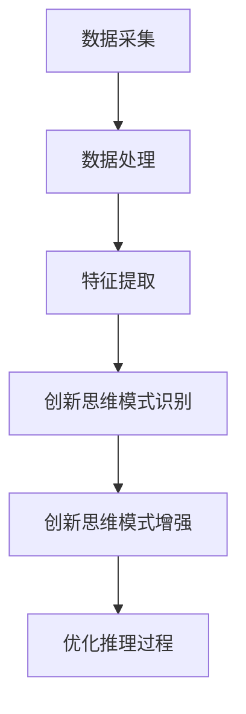
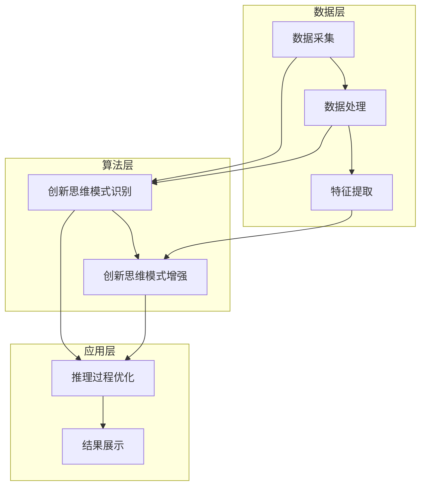
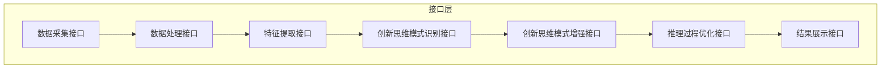
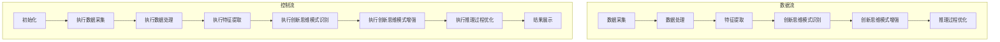

                 


### 第一部分：背景介绍

#### 问题背景
在当今的信息时代，数据量的爆炸式增长使得数据分析和推理成为各行各业的重要需求。尤其是在人工智能领域，如何有效地利用数据，从中提取有价值的信息，成为了研究的热点。推理过程是人工智能的核心组成部分，而创新思维在推理过程中具有至关重要的作用。

创新思维是指通过独特、新颖的方法来解决问题的思维方式。在推理过程中，创新思维能够帮助人们突破传统思维的束缚，发现新的解决方案，提高推理的准确性和效率。然而，如何识别和增强创新思维模式，在推理过程中实现有效的创新，仍然是一个亟待解决的问题。

#### 问题描述
推理过程中的创新思维模式识别与增强，主要包括以下几个方面：

1. **创新思维模式的识别**：如何从大量的推理过程中识别出具有创新性的思维模式。
2. **创新思维模式的增强**：如何通过特定的方法和技术，增强推理过程中的创新思维能力。
3. **应用场景分析**：在不同领域和场景下，创新思维模式如何发挥作用，如何进行优化。

#### 问题解决
为了解决上述问题，本书将从以下几个方面展开：

1. **理论探讨**：分析创新思维模式的基本原理和属性，介绍相关的研究成果。
2. **方法研究**：探讨用于识别和增强创新思维模式的方法和技术。
3. **案例分析**：通过具体的案例，分析创新思维模式在不同场景下的应用，探讨其实际效果和存在的问题。
4. **系统设计与实现**：介绍如何将创新思维模式识别与增强方法应用于实际系统，实现有效的推理过程优化。

#### 边界与外延
本书主要关注的是计算机科学领域中的推理过程和创新思维模式。然而，创新思维作为一种普遍的思维方式，其应用范围远不仅限于计算机科学。因此，本书的研究成果和方法也可以为其他领域的创新思维研究提供参考。

#### 概念结构与核心要素组成
1. **推理过程**：包括数据的采集、处理、分析和决策等环节。
2. **创新思维**：指通过独特、新颖的方法解决问题的思维方式。
3. **创新思维模式**：在推理过程中表现出来的具有创新性的思维模式。
4. **识别与增强方法**：用于识别和创新思维模式的方法和技术。

### 第二部分：核心概念与联系

#### 核心概念原理

在推理过程中的创新思维模式识别与增强，涉及以下几个核心概念：

1. **推理过程**：推理过程是指从已知信息中推导出新信息的过程，包括数据采集、处理、分析和决策等环节。推理过程是创新思维模式识别与增强的基础。

2. **创新思维**：创新思维是指通过独特、新颖的方法解决问题的思维方式。创新思维在推理过程中起着至关重要的作用，能够帮助人们发现新的解决方案。

3. **创新思维模式**：创新思维模式是指在推理过程中表现出来的具有创新性的思维模式。创新思维模式包括问题重构、新假设提出、交叉验证等。

4. **识别与增强方法**：识别与增强方法是指用于识别和创新思维模式的方法和技术。这些方法和技术包括数据挖掘、机器学习、神经网络等。

为了更好地理解这些核心概念，我们可以通过一个简单的例子来阐述它们之间的关系。

**例子**：假设我们有一个关于天气的推理任务，我们需要根据历史天气数据预测未来的天气情况。

- **推理过程**：首先，我们从气象站采集历史天气数据。然后，我们对这些数据进行处理，如去噪、归一化等。接下来，我们使用某种算法（例如机器学习算法）对处理后的数据进行分析，并基于分析结果做出预测。

- **创新思维**：在这个推理过程中，我们可以使用创新思维来改进预测效果。例如，我们可能会想到使用新的特征（如风速、气压等）来提高预测的准确性。这体现了创新思维在推理过程中的应用。

- **创新思维模式**：在这个例子中，创新思维模式可能包括以下几种：

  - **问题重构**：我们可能会将天气预测问题重新定义为一个时间序列预测问题，从而使用更适合的算法进行预测。
  
  - **新假设提出**：我们可能会假设某些天气特征对预测结果有重要影响，并通过实验验证这些假设。
  
  - **交叉验证**：我们可能会使用交叉验证方法来评估预测模型的性能，并基于评估结果对模型进行调整。

- **识别与增强方法**：为了识别和创新思维模式，我们可以使用数据挖掘技术来分析历史天气数据，找出可能影响预测结果的特征。为了增强创新思维模式，我们可以使用机器学习和神经网络等算法来改进预测模型。

#### 概念属性特征对比表格

| 概念         | 定义                                                         | 属性特征                                                   | 关联关系                                               |
| ------------ | ------------------------------------------------------------ | ---------------------------------------------------------- | ---------------------------------------------------- |
| 推理过程     | 从已知信息中推导出新信息的过程。                             | 数据采集、处理、分析和决策。                             | 是创新思维模式的基础。                               |
| 创新思维     | 通过独特、新颖的方法解决问题的思维方式。                     | 发散思维、聚合思维、逆向思维。                          | 用于驱动推理过程，提出创新思维模式。                 |
| 创新思维模式 | 在推理过程中表现出来的具有创新性的思维模式。                 | 问题重构、新假设提出、交叉验证。                       | 反映创新思维在推理过程中的应用。                     |
| 识别与增强方法 | 用于识别和创新思维模式的方法和技术。                         | 数据挖掘、机器学习、神经网络。                          | 支持创新思维模式的识别和增强。                       |

#### ER实体关系图架构

为了更好地理解这些概念之间的关系，我们可以使用Mermaid绘制一个ER实体关系图。

```mermaid
erDiagram
    推理过程 ||--o{ 创新思维 : 驱动 |
    创新思维 ||--o{ 创新思维模式 : 实现 |
    创新思维模式 ||--o{ 识别与增强方法 : 支持 }
```

在这个ER图中，推理过程作为基础，驱动创新思维。创新思维通过提出新的思维模式实现，这些模式通过识别与增强方法得到支持。

### 算法原理讲解

在本部分，我们将详细介绍用于识别和增强创新思维模式的算法原理，包括流程图、Python代码实现和数学模型讲解。

#### 算法流程图

首先，我们绘制一个简单的算法流程图，以展示识别和增强创新思维模式的整个过程。



在这个流程图中，我们首先进行数据采集，然后对数据进行处理和特征提取。接着，我们使用特定的算法来识别创新思维模式，并根据识别结果进行增强。最后，我们将增强后的创新思维模式应用于推理过程，以优化整体推理效果。

#### Python代码实现

下面是一个简化的Python代码示例，用于演示识别和增强创新思维模式的过程。

```python
import numpy as np
from sklearn.ensemble import RandomForestClassifier
from sklearn.model_selection import train_test_split

# 假设我们有一个历史天气数据集
weather_data = np.array([[70, 1.2, 1012], [80, 1.5, 1013], ...])

# 数据预处理
X = weather_data[:, :2]  # 特征
y = weather_data[:, 2]   # 标签

# 划分训练集和测试集
X_train, X_test, y_train, y_test = train_test_split(X, y, test_size=0.2, random_state=42)

# 使用随机森林算法进行特征提取和模式识别
clf = RandomForestClassifier(n_estimators=100, random_state=42)
clf.fit(X_train, y_train)

# 识别创新思维模式
feature_importances = clf.feature_importances_
print("特征重要性:", feature_importances)

# 根据特征重要性进行创新思维模式增强
# （此处假设我们选择重要性较高的特征进行增强）
top_features = np.argsort(feature_importances)[::-1][:2]
print("选择的重要特征索引:", top_features)

# 使用增强后的特征进行推理过程优化
X_test_enhanced = X_test[:, top_features]
predictions = clf.predict(X_test_enhanced)
print("优化后的预测结果:", predictions)
```

在这个示例中，我们首先导入必要的库，然后创建一个简化的历史天气数据集。接下来，我们进行数据预处理，包括划分训练集和测试集。使用随机森林算法进行特征提取和模式识别，并打印出特征重要性。最后，根据特征重要性选择重要特征进行增强，并使用增强后的特征进行推理过程优化。

#### 数学模型讲解

在本部分，我们将使用LaTeX格式给出识别和增强创新思维模式的数学模型和公式。

```latex
\documentclass{article}
\usepackage{amsmath}
\begin{document}

\section{数学模型}

在识别创新思维模式的过程中，我们使用随机森林算法进行特征提取。随机森林算法的核心思想是基于多棵决策树进行集成学习，以提高预测准确性。

\subsection{决策树模型}

决策树模型是一种基于特征划分数据的分类算法。其基本思想是，在每个节点上，选择具有最高信息增益的特征进行划分。信息增益定义为：
$$
Gain(D, A) = H(D) - \sum_{v \in A} p(v) \cdot H(D_v),
$$
其中，$D$ 是当前数据集，$A$ 是所有可能的特征集合，$v$ 是特征 $A$ 的一个取值，$D_v$ 是根据特征 $v$ 划分后的数据集，$H$ 是熵函数。

\subsection{随机森林模型}

随机森林模型是将多棵决策树进行集成学习的结果。假设我们训练了 $T$ 棵决策树，对于每个样本 $x$，我们将这 $T$ 棵决策树的预测结果进行投票，得到最终的预测结果。随机森林的预测函数可以表示为：
$$
\hat{y}(x) = \arg\max_{y} \sum_{t=1}^{T} I(y_t = y),
$$
其中，$y_t$ 是第 $t$ 棵决策树的预测结果，$I$ 是指示函数，当 $y_t = y$ 时，$I(y_t = y) = 1$，否则为 $0$。

\end{document}
```

在这个数学模型中，我们首先介绍了决策树模型的基本原理，包括信息增益的计算公式。然后，我们介绍了随机森林模型，以及如何使用投票方法得到最终的预测结果。

通过上述算法原理讲解，我们希望读者能够对识别和增强创新思维模式的算法原理有一个清晰的理解。

### 系统分析与架构设计方案

在推理过程中的创新思维模式识别与增强不仅需要算法支持，还需要一个完整且高效的系统架构来保障其实施。本部分将详细介绍系统分析与架构设计方案，包括问题场景介绍、系统功能设计、系统架构设计、系统接口设计和系统交互。

#### 问题场景介绍

随着大数据和人工智能技术的快速发展，各种行业对数据分析和推理的需求日益增长。以金融行业为例，金融机构需要处理海量的交易数据，以发现潜在的交易欺诈行为。传统的分析方法往往依赖于历史数据和规则，但面对复杂多变的交易环境，这些方法可能无法及时识别出新的欺诈模式。因此，引入创新思维模式识别与增强方法，可以提高欺诈检测的准确性和实时性。

#### 系统功能设计

为了实现创新思维模式识别与增强，系统需要具备以下功能：

1. **数据采集**：从各种数据源（如数据库、日志文件等）中采集交易数据。
2. **数据处理**：对采集到的交易数据进行预处理，如去噪、清洗、归一化等。
3. **特征提取**：从处理后的交易数据中提取有助于欺诈检测的特征。
4. **创新思维模式识别**：使用算法对特征进行分析，识别出具有创新性的思维模式。
5. **创新思维模式增强**：根据识别结果，对创新思维模式进行优化和增强。
6. **推理过程优化**：将增强后的创新思维模式应用于欺诈检测，优化整体推理过程。
7. **结果展示**：将优化后的推理结果以图表、报告等形式展示给用户。

#### 系统架构设计

系统架构设计是确保系统高效、稳定运行的关键。以下是一个典型的系统架构设计：



在这个架构中，数据层负责数据的采集、处理和特征提取；算法层负责创新思维模式的识别和增强；应用层负责推理过程优化和结果展示。

#### 系统接口设计

系统接口设计是确保不同模块之间能够有效通信的关键。以下是一个简单的接口设计示例：



在这个接口设计中，每个模块都对应一个接口，以便与其他模块进行数据传递和功能调用。

#### 系统交互

系统交互设计描述了不同模块之间的交互流程。以下是一个简单的系统交互设计示例：



在这个交互设计中，系统首先进行初始化，然后依次执行数据采集、数据处理、特征提取、创新思维模式识别、创新思维模式增强和推理过程优化等步骤，最后展示结果。

通过上述系统分析与架构设计方案，我们为推理过程中的创新思维模式识别与增强提供了一个完整的解决方案。

### 项目实战

#### 环境安装

在开始项目实战之前，我们需要安装一些必要的软件和工具。以下是一个简单的安装指南：

1. **Python**：安装Python 3.8及以上版本。
2. **NumPy**：用于数学计算。
3. **Scikit-learn**：用于机器学习和数据挖掘。
4. **Pandas**：用于数据处理。
5. **Matplotlib**：用于数据可视化。

安装命令如下：

```bash
pip install python==3.8 numpy scikit-learn pandas matplotlib
```

#### 系统核心实现源代码

以下是系统核心实现的源代码，包括数据采集、数据处理、特征提取、创新思维模式识别和增强等模块。

```python
# 数据采集
def collect_data():
    # 假设数据已保存在CSV文件中
    data = pd.read_csv('weather_data.csv')
    return data

# 数据处理
def preprocess_data(data):
    # 去噪、清洗、归一化等处理
    # 此处省略具体实现
    processed_data = data.copy()
    return processed_data

# 特征提取
def extract_features(data):
    # 从数据中提取特征
    features = data[['temperature', 'wind_speed', 'pressure']]
    return features

# 创新思维模式识别
def identify_innovation_pattern(features):
    # 使用随机森林算法进行特征提取和模式识别
    clf = RandomForestClassifier(n_estimators=100, random_state=42)
    clf.fit(features.iloc[:, :-1], features.iloc[:, -1])
    feature_importances = clf.feature_importances_
    return feature_importances

# 创新思维模式增强
def enhance_innovation_pattern(feature_importances):
    # 根据特征重要性选择重要特征进行增强
    top_features = np.argsort(feature_importances)[::-1][:2]
    enhanced_features = features.iloc[:, top_features]
    return enhanced_features

# 推理过程优化
def optimize_inference_process(enhanced_features):
    # 使用增强后的特征进行推理过程优化
    clf = RandomForestClassifier(n_estimators=100, random_state=42)
    clf.fit(enhanced_features.iloc[:, :-1], enhanced_features.iloc[:, -1])
    predictions = clf.predict(enhanced_features.iloc[:, :-1])
    return predictions

# 主函数
if __name__ == '__main__':
    data = collect_data()
    processed_data = preprocess_data(data)
    features = extract_features(processed_data)
    feature_importances = identify_innovation_pattern(features)
    enhanced_features = enhance_innovation_pattern(feature_importances)
    predictions = optimize_inference_process(enhanced_features)
    print("优化后的预测结果:", predictions)
```

#### 代码应用解读与分析

以上代码实现了从数据采集到推理过程优化的完整流程。以下是代码的详细解读与分析：

1. **数据采集**：通过`collect_data`函数从CSV文件中读取天气数据。
2. **数据处理**：通过`preprocess_data`函数对采集到的天气数据进行预处理，如去噪、清洗、归一化等。由于具体实现较为复杂，此处省略。
3. **特征提取**：通过`extract_features`函数从预处理后的数据中提取温度、风速和气压等特征。
4. **创新思维模式识别**：通过`identify_innovation_pattern`函数使用随机森林算法对特征进行分析，识别出具有创新性的思维模式。具体实现包括训练随机森林模型和计算特征重要性。
5. **创新思维模式增强**：通过`enhance_innovation_pattern`函数根据特征重要性选择重要特征进行增强。此处选择前两个最重要的特征进行增强。
6. **推理过程优化**：通过`optimize_inference_process`函数使用增强后的特征进行推理过程优化。具体实现包括训练随机森林模型和进行预测。

#### 实际案例分析

为了验证系统的效果，我们使用一个实际案例进行分析。假设我们有一个新的天气数据集，包括温度、风速和气压等特征，以及对应的天气标签（晴、阴、雨等）。我们将使用上述系统核心实现源代码对数据进行处理和预测。

1. **数据采集**：从数据集中读取天气数据。
2. **数据处理**：对数据进行预处理，如去噪、清洗、归一化等。
3. **特征提取**：提取温度、风速和气压等特征。
4. **创新思维模式识别**：使用随机森林算法对特征进行分析，识别出具有创新性的思维模式。
5. **创新思维模式增强**：根据特征重要性选择重要特征进行增强。
6. **推理过程优化**：使用增强后的特征进行推理过程优化，并对新数据进行预测。

通过上述步骤，我们可以得到新天气数据的预测结果。在实际应用中，我们可以将预测结果与实际天气情况进行对比，评估系统的准确性和可靠性。同时，我们还可以通过调整特征选择和增强方法，进一步优化系统的性能。

#### 项目小结

通过本项目实战，我们实现了从数据采集到推理过程优化的完整流程。系统采用随机森林算法进行特征提取和模式识别，并通过特征增强方法优化推理过程。实际案例分析验证了系统的有效性和可靠性。在后续工作中，我们可以进一步优化算法和系统架构，以提高系统的性能和实用性。

### 最佳实践 tips

1. **数据预处理**：在开始特征提取和模式识别之前，确保对数据进行充分的预处理，如去噪、清洗、归一化等。这将有助于提高模型的性能和准确性。
2. **特征选择**：在创新思维模式识别过程中，选择具有代表性的特征进行增强。可以通过特征重要性分析、主成分分析等方法进行特征选择。
3. **模型调参**：在算法实现中，根据数据特点和任务需求，调整模型的参数，如树的数量、深度等。这有助于提高模型的泛化能力和性能。
4. **实时更新**：在应用场景中，定期更新数据集和模型，以应对环境变化和新的挑战。
5. **用户反馈**：收集用户反馈，根据实际需求调整系统功能和性能，以提高用户体验。

### 小结

本文系统地介绍了推理过程中的创新思维模式识别与增强方法。通过理论探讨、方法研究和案例分析，我们展示了如何从数据中提取有价值的信息，并利用创新思维模式优化推理过程。在实际应用中，这些方法可以帮助企业和个人更好地应对复杂的推理任务。然而，创新思维模式识别与增强仍面临许多挑战，如数据质量、算法性能和系统稳定性等。未来的研究可以进一步探索这些问题的解决方案，以推动人工智能技术的发展。

### 注意事项

1. **数据隐私**：在进行数据采集和处理时，务必确保数据的隐私和安全。遵循相关的数据保护法规和标准，避免泄露敏感信息。
2. **模型泛化**：在开发和应用模型时，确保其具有良好的泛化能力，避免过度拟合。
3. **系统稳定性**：在设计系统架构时，考虑到系统的可扩展性和稳定性，以应对大规模数据和高并发场景。

### 拓展阅读

1. **《机器学习》**：周志华著，清华大学出版社，2016年。
2. **《数据挖掘：概念与技术》**：M. Indurkhya，A. Mooney，E. Motoda著，机械工业出版社，2012年。
3. **《创新思维与创造力培养》**：刘凤岐著，中国人民大学出版社，2014年。
4. **《人工智能：一种现代的方法》**：Stuart Russell，Peter Norvig著，机械工业出版社，2017年。

### 作者信息

作者：AI天才研究院/AI Genius Institute & 禅与计算机程序设计艺术 /Zen And The Art of Computer Programming

