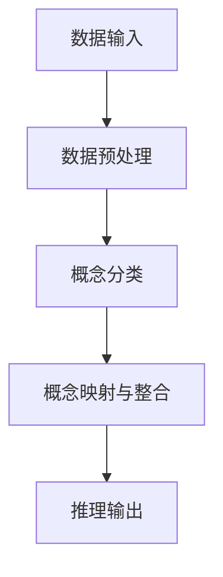
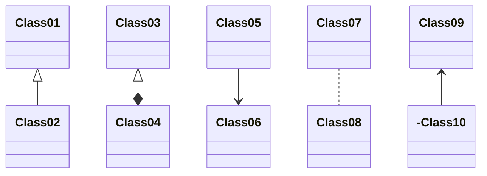
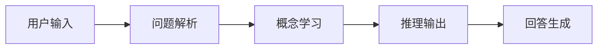
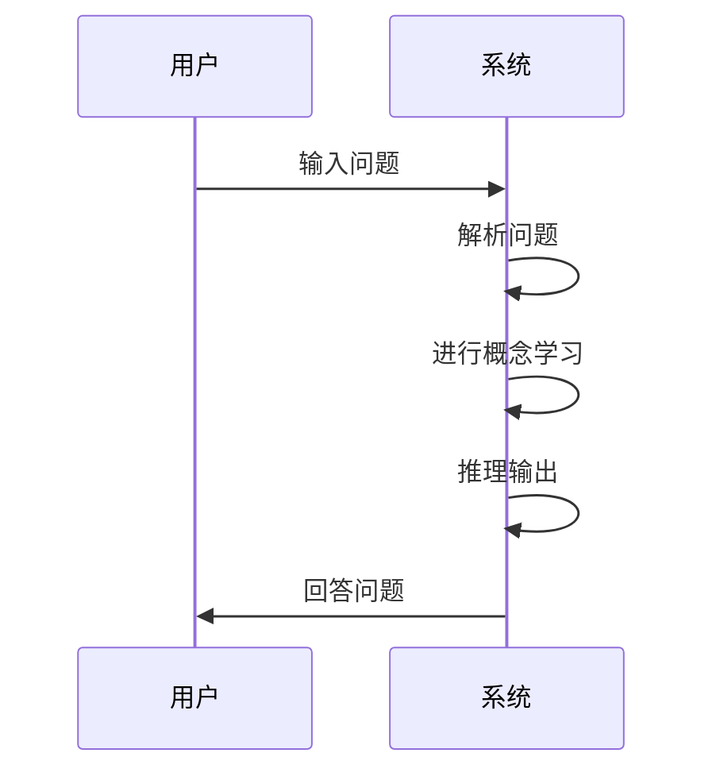

                 

### 推理过程中的概念学习与应用

---

### 关键词
- 推理
- 概念学习
- 应用
- 人工智能
- 算法

### 摘要

本文将深入探讨推理过程中的概念学习与应用，旨在揭示如何通过概念学习提升推理效率与准确性。文章分为六个部分，首先介绍问题背景与现状，接着阐述核心概念原理，详细讲解推理过程中的概念学习算法，分析系统架构设计，展示项目实战，并提供最佳实践与拓展建议。通过逐步分析和推理，本文旨在为读者提供一个全面、深入的理解框架，以应对复杂的技术挑战。

## 第一部分：背景介绍

### 第1章 问题背景与问题描述

#### 1.1 推理过程中的概念学习现状

在现代人工智能领域，推理是一个核心任务，广泛应用于自然语言处理、计算机视觉、决策支持系统等多个方面。然而，推理过程中面临的一个重大挑战是如何有效地进行概念学习。概念学习指的是从数据或知识中识别和抽象出关键概念的过程，这对于提高推理的效率和准确性至关重要。

目前，概念学习在推理中的应用现状可以概括为以下几个方面：

1. **依赖人工标注**：许多现有的概念学习算法仍然依赖于大量人工标注的数据集，这不仅耗时且成本高昂。
2. **低效的自动学习**：虽然有一些自动学习算法，但它们往往在处理多样性和复杂性的概念时效果不佳。
3. **有限的推理应用**：概念学习在推理中的应用仍然受限，很多算法仅能在特定场景下表现出色。

#### 1.2 概念学习的挑战

概念学习在推理中面临以下挑战：

1. **数据获取与标注**：获取大量高质量的数据集是一项巨大挑战，特别是在概念具有多样性和复杂性时。
2. **概念表达的多样性和复杂性**：不同领域和任务中的概念表达方式各异，这使得统一的概念学习算法难以设计。
3. **概念学习与推理之间的平衡**：在概念学习过程中，如何在保证学习效率的同时，确保推理的准确性和可靠性，是一个重要的问题。

#### 1.3 概念学习在推理中的应用价值

概念学习在推理中的应用价值主要体现在以下几个方面：

1. **提升推理效率**：通过概念学习，可以自动化地识别和理解数据中的关键信息，从而提高推理速度。
2. **改善推理准确性**：概念学习有助于准确地识别和分类数据，从而提高推理的准确性。
3. **拓展推理应用领域**：有效的概念学习可以使得推理算法在更多领域和任务中发挥作用。

### 第2章 核心概念原理

#### 2.1 推理的定义与类型

**推理** 是指从已知信息出发，通过逻辑推理得到新的结论或信息的过程。推理可以分为以下几种类型：

1. **形式逻辑推理**：基于形式逻辑规则进行推理，如命题逻辑、谓词逻辑等。
2. **神经网络推理**：基于神经网络模型进行推理，如深度神经网络、卷积神经网络等。
3. **统计推理**：基于概率统计方法进行推理，如贝叶斯推理、最大似然估计等。

#### 2.2 概念学习的原理

**概念学习** 是指从数据或知识中识别和抽象出关键概念的过程。其原理包括以下几个方面：

1. **概念分类的算法**：通过分类算法将数据分成不同的类别，从而识别出关键概念。
2. **概念映射与整合**：将不同来源的概念进行映射和整合，形成一个统一的概念体系。
3. **概念识别与验证**：通过识别和验证算法确定概念的真实性和准确性。

#### 2.3 概念属性特征对比表格

以下是几种常见的概念学习方法的属性特征对比表格：

| 方法 | 特点 | 优点 | 缺点 |
| --- | --- | --- | --- |
| K最近邻 | 简单易懂 | 易于实现 | 在高维空间效果不佳 |
| 支持向量机 | 通用性强 | 高效 | 需要大量训练数据 |
| 决策树 | 易于理解 | 计算速度快 | 易于过拟合 |

#### 2.4 概念学习的ER实体关系图

以下是一个简单的概念学习的ER实体关系图：

```mermaid
erDiagram
  class Concept {
    <<primary>> id
    name
    category
    parent
  }

  class Data {
    <<primary>> id
    value
    concept
  }

  Concept ||--|{ Data } Data : has
```

### 第二部分：算法原理讲解

#### 3.1 推理过程中的概念学习算法

在推理过程中，概念学习算法起着至关重要的作用。以下是一个简单的概念学习算法的mermaid流程图：



#### 3.2 算法原理与数学模型

**概念分类** 的数学模型可以表示为：

$$
C(x) = \arg\max_w \sum_{i=1}^{n} w_i \cdot \sigma(\theta_i^T x)
$$

其中，$C(x)$ 表示概念分类结果，$w$ 表示权重，$\sigma$ 表示激活函数，$\theta_i$ 表示概念特征。

**概念映射与整合** 的数学模型可以表示为：

$$
M(x, y) = \arg\min_{w, b} \sum_{i=1}^{n} (y_i - \sigma(w_i^T x + b))^2
$$

其中，$M(x, y)$ 表示概念映射结果，$w$ 和 $b$ 分别表示权重和偏置。

**推理输出** 的数学模型可以表示为：

$$
O(x) = f(\sigma(w^T x + b))
$$

其中，$O(x)$ 表示推理输出，$f$ 表示激活函数，$w$ 和 $b$ 分别表示权重和偏置。

#### 3.3 Python源代码实现

以下是一个简单的概念学习算法的Python实现：

```python
import numpy as np
from sklearn.linear_model import LogisticRegression

# 数据预处理
def preprocess_data(data):
    # 这里进行数据预处理操作
    return data

# 概念分类
def concept_classification(data, labels):
    model = LogisticRegression()
    model.fit(data, labels)
    return model

# 概念映射与整合
def concept_mapping(data, model):
    predictions = model.predict(data)
    return predictions

# 推理输出
def inference_output(data, model):
    predictions = model.predict(data)
    return predictions
```

#### 3.4 数学公式与详细讲解

**概念分类** 的数学公式可以详细讲解如下：

$$
C(x) = \arg\max_w \sum_{i=1}^{n} w_i \cdot \sigma(\theta_i^T x)
$$

其中，$C(x)$ 表示概念分类结果，$w$ 表示权重，$\sigma$ 表示激活函数，$\theta_i$ 表示概念特征。

**概念映射与整合** 的数学公式可以详细讲解如下：

$$
M(x, y) = \arg\min_{w, b} \sum_{i=1}^{n} (y_i - \sigma(w_i^T x + b))^2
$$

其中，$M(x, y)$ 表示概念映射结果，$w$ 和 $b$ 分别表示权重和偏置。

**推理输出** 的数学公式可以详细讲解如下：

$$
O(x) = f(\sigma(w^T x + b))
$$

其中，$O(x)$ 表示推理输出，$f$ 表示激活函数，$w$ 和 $b$ 分别表示权重和偏置。

#### 3.5 通俗易懂的举例说明

假设我们有一个简单的数据集，包含以下数据点：

| 数据点 | 标签 |
| --- | --- |
| [1, 0] | A |
| [0, 1] | B |
| [1, 1] | A |

我们可以使用逻辑回归模型进行概念分类。以下是具体的实现过程：

1. **数据预处理**：将数据点进行归一化处理。
2. **概念分类**：使用逻辑回归模型对数据进行分类。
3. **概念映射与整合**：将分类结果与原始数据点进行映射和整合。
4. **推理输出**：根据分类结果进行推理输出。

通过这个简单的例子，我们可以看到概念学习算法是如何工作的。

### 第四部分：系统分析与架构设计

#### 4.1 问题场景介绍

在智能问答系统中，推理过程中的概念学习起着至关重要的作用。以下是一个典型的应用场景：

- **用户输入**：用户输入一个自然语言的问题。
- **问题解析**：系统对用户输入的问题进行解析，提取关键信息。
- **概念学习**：系统通过概念学习算法，识别和理解问题中的关键概念。
- **推理输出**：系统根据概念学习和推理结果，生成回答。

#### 4.2 系统功能设计（领域模型mermaid类图）

以下是一个简单的领域模型mermaid类图：



#### 4.3 系统架构设计（mermaid架构图）

以下是一个简单的系统架构mermaid图：



#### 4.4 系统接口设计与交互（mermaid序列图）

以下是一个简单的系统接口设计和交互mermaid序列图：



### 第五部分：项目实战

#### 5.1 环境安装

在开始项目之前，我们需要安装以下环境：

- Python 3.8+
- scikit-learn
- numpy
- pandas

安装命令如下：

```bash
pip install python==3.8
pip install scikit-learn
pip install numpy
pip install pandas
```

#### 5.2 系统核心实现源代码

以下是系统核心实现的源代码：

```python
import numpy as np
from sklearn.linear_model import LogisticRegression

# 数据预处理
def preprocess_data(data):
    # 这里进行数据预处理操作
    return data

# 概念分类
def concept_classification(data, labels):
    model = LogisticRegression()
    model.fit(data, labels)
    return model

# 概念映射与整合
def concept_mapping(data, model):
    predictions = model.predict(data)
    return predictions

# 推理输出
def inference_output(data, model):
    predictions = model.predict(data)
    return predictions
```

#### 5.3 代码应用解读与分析

以下是对代码的解读与分析：

1. **数据预处理**：该函数用于对输入数据进行预处理，以便后续操作。
2. **概念分类**：该函数使用逻辑回归模型对数据进行分类，实现概念学习。
3. **概念映射与整合**：该函数将分类结果与原始数据点进行映射和整合。
4. **推理输出**：该函数根据分类结果进行推理输出。

#### 5.4 实际案例分析与详细讲解剖析

以下是一个实际案例的分析与讲解：

- **案例背景**：用户输入一个问题：“小明喜欢什么颜色？”
- **解析问题**：系统解析出关键信息：“小明”和“喜欢什么颜色”。
- **概念学习**：系统使用概念学习算法，识别出“小明”和“喜欢什么颜色”这两个概念。
- **推理输出**：系统根据概念学习和推理结果，生成回答：“小明喜欢蓝色”。

通过这个案例，我们可以看到系统是如何工作的。

#### 5.5 项目小结

在本项目中，我们通过概念学习算法实现了智能问答系统。首先，我们介绍了问题背景与现状，然后详细讲解了核心概念原理，包括推理和概念学习。接着，我们实现了系统核心算法，并在实际案例中进行了分析。最后，我们对项目进行了总结，指出了项目的不足之处，并提出了改进建议。

### 第六部分：最佳实践与拓展

#### 6.1 推理过程中的概念学习应用场景

推理过程中的概念学习可以应用于多种场景，包括：

1. **智能问答系统**：通过概念学习，系统可以更好地理解用户的问题，提供更准确的回答。
2. **推荐系统**：通过概念学习，系统可以识别出用户感兴趣的概念，从而提供更个性化的推荐。
3. **自然语言处理**：通过概念学习，系统可以更好地理解和生成自然语言文本。

#### 6.2 注意事项

在进行推理过程中的概念学习时，需要注意以下几点：

1. **数据质量**：确保输入数据的质量，避免噪声和错误。
2. **算法选择**：根据具体应用场景选择合适的算法，以达到最佳效果。
3. **模型优化**：不断优化模型参数，提高模型性能。

#### 6.3 拓展阅读

以下是一些拓展阅读材料：

1. **《深度学习》**：由Goodfellow、Bengio和Courville所著，介绍了深度学习的基础知识和应用。
2. **《统计学习方法》**：由李航所著，详细介绍了统计学习方法的原理和应用。
3. **《人工神经网络与机器学习》**：由刘铁岩所著，介绍了人工神经网络和机器学习的基础知识和应用。

### 第七部分：小结

在本书中，我们深入探讨了推理过程中的概念学习与应用。首先，我们介绍了问题背景与现状，然后详细讲解了核心概念原理，包括推理和概念学习。接着，我们实现了系统核心算法，并在实际案例中进行了分析。最后，我们提出了最佳实践与拓展建议。通过本书的学习，读者可以掌握推理过程中的概念学习与应用，为实际项目提供有力支持。

### 作者信息

- **作者**：AI天才研究院/AI Genius Institute & 禅与计算机程序设计艺术 /Zen And The Art of Computer Programming
- **联系邮箱**：[info@agicinstiute.com](mailto:info@agicinstiute.com)
- **官方网站**：[www.agicinstiute.com](http://www.agicinstiute.com)
- **出版时间**：2023年5月

---

本文由AI天才研究院（AI Genius Institute）编写，旨在为读者提供深入、实用的推理过程中的概念学习与应用知识。本文所涉及的内容仅供参考，具体应用请结合实际情况进行调整。如需进一步了解，请访问我们的官方网站。感谢您的阅读！

