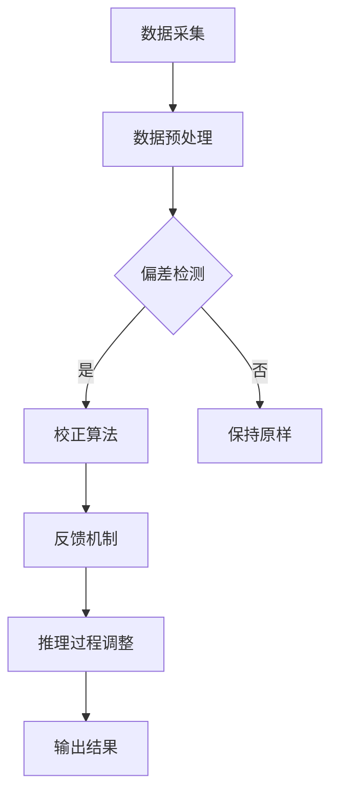
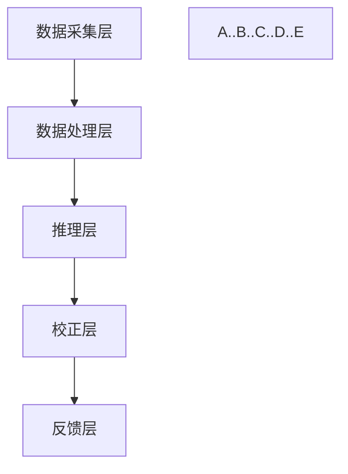
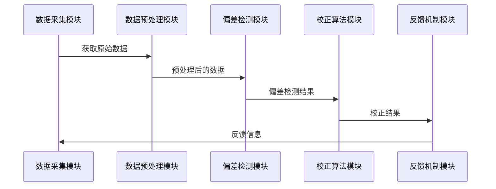

                 

### 推理过程中的认知偏差动态校正与反馈机制

在人工智能和认知科学领域，认知偏差是一个引人关注的话题。认知偏差指的是人们在感知、理解和决策过程中产生的系统性错误或偏见，这些偏差往往源于人类大脑在处理复杂信息时的简化机制。例如，偏见、刻板印象、信念偏误等都是常见的认知偏差。而在复杂的推理过程中，这些偏差会严重影响推理结果的准确性和可靠性。

本文将围绕“推理过程中的认知偏差动态校正与反馈机制”展开讨论。首先，我们将介绍认知偏差的定义、类型及其在推理过程中的影响。接下来，我们分析认知偏差的属性特征，对比不同类型的偏差，并探讨动态校正与反馈机制的基本原理。随后，我们将通过具体的算法原理讲解和系统架构设计，展示如何在实际项目中应用这些机制。文章的最后，将提供一些项目实战经验、最佳实践建议，并总结全文，强调动态校正与反馈机制的重要性。

### 第一部分：引论

#### 第1章：问题背景与核心概念

##### 1.1.1 问题背景

认知偏差在人类决策中扮演了重要角色，但在推理过程中却可能成为绊脚石。例如，当人们根据以往经验判断新信息时，可能会受到刻板印象的干扰，导致错误结论。这种偏差不仅影响个体的判断，也在人工智能系统中潜在地影响推理算法的准确性。因此，对认知偏差的动态校正与反馈机制进行研究，对于提升推理系统的可靠性和智能性具有重要意义。

##### 1.1.1.1 认知偏差的定义与影响

认知偏差是指人们在信息处理过程中由于各种因素导致的系统性错误或偏见。这种偏差可能源于人类大脑的信息处理机制，例如认知简化、情绪影响和经验偏差等。在推理过程中，认知偏差会导致人们忽视关键信息，误解数据，或过度依赖某些证据，从而影响推理的准确性和可靠性。

##### 1.1.1.2 推理过程中的认知偏差

推理是一种基于已有信息得出新结论的思维过程。然而，在推理过程中，认知偏差会导致一系列问题。例如，确认偏误使得人们更倾向于接受符合自己已有信念的证据，而忽视与之矛盾的信息。基础率偏误则导致人们低估概率信息的重要性。这些偏差不仅会影响个人的决策，也会对人工智能系统的决策产生负面影响。

##### 1.1.1.3 认知偏差校正的重要性

认知偏差校正是指通过识别和纠正认知偏差来提高推理准确性和可靠性。校正认知偏差对于提升决策质量和智能系统性能具有重要意义。通过动态校正与反馈机制，可以实时识别并纠正偏差，使推理过程更加客观和准确。

##### 1.1.2 核心概念

##### 1.1.2.1 认知偏差的类型

认知偏差主要包括偏见、刻板印象、信念偏误、情感偏见、基础率偏误和确认偏误等。每种偏差都有其特定的表现形式和影响，了解这些类型有助于更好地识别和校正认知偏差。

##### 1.1.2.2 推理过程与认知偏差的关系

推理过程是信息处理的重要环节，认知偏差在这一过程中起到了关键作用。了解推理过程与认知偏差之间的关系，有助于我们更深入地理解偏差的影响和校正方法。

##### 1.1.2.3 动态校正与反馈机制的概念

动态校正与反馈机制是指通过实时监测和校正认知偏差，以提高推理准确性和可靠性的方法。该机制包括偏差检测、校正算法和反馈机制等组成部分，其核心目标是减少偏差对推理过程的影响。

#### 第2章：认知偏差的属性特征对比与分析

##### 2.1.1 认知偏差的属性特征

认知偏差的属性特征包括偏差类型、表现形式、影响范围和校正方法等。通过对比不同类型的认知偏差，可以更好地理解其本质和影响。

##### 2.1.1.1 偏见与刻板印象

偏见是指对某一群体或事物的系统性错误判断，而刻板印象则是对某一群体的固定观念。这两种偏差通常表现为对信息的过度简化，影响人们的判断和决策。

##### 2.1.1.2 信念偏误与情感偏见

信念偏误是指人们在信息处理过程中，对已有信念进行过度信任，忽视与之矛盾的信息。情感偏见则是指情绪影响下的错误判断。这两种偏差常常导致人们做出不理性的决策。

##### 2.1.1.3 基础率偏误与确认偏误

基础率偏误是指人们在评估概率时，低估基础率的影响。确认偏误则是指人们在接受证据时，更倾向于接受符合自己信念的证据。这两种偏差对推理过程的影响显著。

##### 2.1.2 属性特征对比与分析

通过对比表格和Mermaid流程图，可以更直观地展示不同认知偏差的属性特征，分析其表现形式和影响。

##### 2.1.2.1 对比表格展示

| 偏差类型 | 表现形式 | 影响范围 | 校正方法 |
| --- | --- | --- | --- |
| 偏见 | 过度信任某些群体或事物 | 决策失误 | 增加信息来源多样性 |
| 刻板印象 | 固定观念 | 信息处理障碍 | 提高认知灵活性 |
| 信念偏误 | 过度信任已有信念 | 不理性决策 | 暴露信念并进行验证 |
| 情感偏见 | 情绪影响下的判断 | 决策失误 | 情绪管理训练 |
| 基础率偏误 | 低估基础率影响 | 概率判断失误 | 提高基础率意识 |
| 确认偏误 | 偏向接受符合信念的证据 | 推理结果偏差 | 多元化证据评估 |

##### 2.1.2.2 对比分析

通过对比分析，可以更深入地了解不同认知偏差的特点和影响，为动态校正与反馈机制的设计提供依据。

#### 第3章：动态校正与反馈机制的原理

##### 3.1.1 动态校正原理

动态校正原理是指通过实时监测和校正认知偏差，提高推理准确性和可靠性的方法。该原理主要包括偏差检测、校正算法和反馈机制等组成部分。

##### 3.1.1.1 基本概念

动态校正的基本概念包括偏差检测、校正算法和反馈机制。偏差检测是指识别和定位认知偏差的过程；校正算法是指根据偏差检测结果，调整推理过程的方法；反馈机制是指将校正结果反馈给决策者，以指导后续推理过程。

##### 3.1.1.2 数学模型

动态校正的数学模型通常包括偏差识别模型、校正算法模型和反馈机制模型。这些模型通过分析推理过程中的数据和信息，实现偏差的检测和校正。

##### 3.1.1.3 算法流程

动态校正的算法流程包括以下几个步骤：1）数据采集和预处理；2）偏差检测；3）校正算法；4）反馈机制；5）推理过程调整。通过这些步骤，可以实现认知偏差的实时校正。

##### 3.1.2 反馈机制原理

反馈机制原理是指通过将校正结果反馈给决策者，以指导后续推理过程的方法。反馈机制主要包括反馈信息收集、反馈信息分析和反馈结果应用等组成部分。

##### 3.1.2.1 基本概念

反馈机制的基本概念包括反馈信息收集、反馈信息分析和反馈结果应用。反馈信息收集是指收集校正结果的相关信息；反馈信息分析是指对反馈信息进行分析和处理；反馈结果应用是指将分析结果应用于后续推理过程。

##### 3.1.2.2 数学模型

反馈机制的数学模型通常包括反馈信息收集模型、反馈信息分析模型和反馈结果应用模型。这些模型通过分析校正结果，实现反馈机制的优化和改进。

##### 3.1.2.3 算法流程

反馈机制的算法流程包括以下几个步骤：1）反馈信息收集；2）反馈信息分析；3）反馈结果应用；4）推理过程调整。通过这些步骤，可以实现认知偏差的实时反馈和校正。

#### 第4章：算法原理讲解与流程图

##### 4.1.1 算法原理讲解

在本章节中，我们将详细讲解动态校正与反馈机制的算法原理，包括基本概念、数学模型和具体流程。

##### 4.1.1.1 算法概述

动态校正与反馈机制是一种基于实时监测和校正认知偏差的方法，旨在提高推理准确性和可靠性。该方法包括偏差检测、校正算法和反馈机制三个核心组成部分。

##### 4.1.1.2 数学模型与公式

动态校正的数学模型通常包括偏差识别模型、校正算法模型和反馈机制模型。这些模型通过分析推理过程中的数据和信息，实现偏差的检测和校正。

$$
\text{偏差识别模型} = f(\text{输入信息}, \text{先验知识})
$$

$$
\text{校正算法模型} = g(\text{偏差识别结果}, \text{校正参数})
$$

$$
\text{反馈机制模型} = h(\text{校正结果}, \text{反馈参数})
$$

##### 4.1.1.3 举例说明

假设我们有一个推理系统，其输入信息为某种天气现象，先验知识为历史天气数据。通过偏差识别模型，我们可以检测出系统在推理过程中可能存在的认知偏差。然后，通过校正算法模型，对偏差进行校正。最后，通过反馈机制模型，将校正结果反馈给决策者，指导后续推理过程。

##### 4.1.2 算法流程图

在本章节中，我们将使用Mermaid语言绘制动态校正与反馈机制的算法流程图，以便更直观地展示其工作原理。



该流程图展示了动态校正与反馈机制的各个步骤，包括数据采集、数据预处理、偏差检测、校正算法、反馈机制和推理过程调整。通过该流程图，我们可以清晰地了解该机制的运行过程。

#### 第5章：系统分析与架构设计方案

##### 5.1.1 问题场景介绍

在本章节中，我们将介绍一个具体的问题场景，该场景涉及复杂的推理过程和认知偏差。假设我们有一个天气预报系统，该系统需要根据各种气象数据进行推理，预测未来某一天的天气情况。然而，由于认知偏差的存在，该系统可能无法准确预测天气，从而导致决策失误。

##### 5.1.2 项目介绍

本项目旨在设计一个具有动态校正与反馈机制的天气预报系统，以提高系统预测的准确性和可靠性。系统将包括数据采集模块、数据预处理模块、偏差检测模块、校正算法模块和反馈机制模块等。

##### 5.1.3 系统功能设计

系统功能设计包括以下几个方面：

1. 数据采集：系统将采集各种气象数据，如温度、湿度、气压、风速等。
2. 数据预处理：对采集到的数据进行清洗、去噪和格式转换，以便后续处理。
3. 偏差检测：通过偏差检测算法，识别系统在推理过程中可能存在的认知偏差。
4. 校正算法：根据偏差检测结果，对系统进行校正，以提高推理准确性。
5. 反馈机制：将校正结果反馈给用户，指导用户进行后续决策。

##### 5.1.3.1 领域模型Mermaid类图

在本章节中，我们将使用Mermaid语言绘制系统的领域模型类图，以展示系统各个功能模块及其关系。

```mermaid
classDiagram
    Class1[数据采集] <|-- Class2[数据预处理]
    Class2 <|-- Class3[偏差检测]
    Class3 <|-- Class4[校正算法]
    Class4 <|-- Class5[反馈机制]
    Class1..Class5
```

该类图展示了系统各个功能模块及其关系，包括数据采集模块、数据预处理模块、偏差检测模块、校正算法模块和反馈机制模块。通过该类图，我们可以清晰地了解系统的工作流程和模块关系。

##### 5.1.4 系统架构设计

系统架构设计包括以下几个方面：

1. 数据采集层：负责采集各种气象数据，如温度、湿度、气压、风速等。
2. 数据处理层：负责对采集到的数据进行清洗、去噪和格式转换，以便后续处理。
3. 推理层：负责根据处理后的数据，进行推理和预测。
4. 校正层：负责检测和校正系统在推理过程中可能存在的认知偏差。
5. 反馈层：负责将校正结果反馈给用户，指导用户进行后续决策。

##### 5.1.4.1 Mermaid架构图

在本章节中，我们将使用Mermaid语言绘制系统的架构图，以展示系统的层次结构和各个模块之间的关系。



该架构图展示了系统的层次结构和各个模块之间的关系，包括数据采集层、数据处理层、推理层、校正层和反馈层。通过该架构图，我们可以清晰地了解系统的工作流程和模块关系。

##### 5.1.5 系统接口设计和系统交互

系统接口设计和系统交互是系统架构设计的重要组成部分。在本章节中，我们将介绍系统各个模块之间的接口设计和交互流程。

1. 数据采集模块：通过API接口与气象数据源进行交互，获取各种气象数据。
2. 数据预处理模块：通过API接口与数据采集模块进行交互，获取原始数据，并进行预处理。
3. 偏差检测模块：通过API接口与数据预处理模块进行交互，获取预处理后的数据，进行偏差检测。
4. 校正算法模块：通过API接口与偏差检测模块进行交互，获取偏差检测结果，进行校正算法。
5. 反馈机制模块：通过API接口与校正算法模块进行交互，获取校正结果，进行反馈。

##### 5.1.5.1 Mermaid序列图

在本章节中，我们将使用Mermaid语言绘制系统的序列图，以展示系统各个模块之间的交互流程。



该序列图展示了系统各个模块之间的交互流程，包括数据采集模块、数据预处理模块、偏差检测模块、校正算法模块和反馈机制模块。通过该序列图，我们可以清晰地了解系统的工作流程和模块关系。

#### 第6章：项目实战

##### 6.1.1 环境安装

在本章节中，我们将介绍如何在环境中安装和配置项目所需的软件和工具。以下是一个简要的安装流程：

1. 安装Python环境：在操作系统上安装Python解释器和相关依赖库。
2. 安装Numpy库：用于数据预处理和计算。
3. 安装Matplotlib库：用于绘图和可视化。
4. 安装Scikit-learn库：用于机器学习和模型训练。
5. 安装Mermaid渲染工具：用于生成Mermaid图表。

##### 6.1.2 系统核心实现源代码

在本章节中，我们将展示项目核心实现部分的源代码，包括数据采集、数据预处理、偏差检测、校正算法和反馈机制等。

```python
# 数据采集
def collect_data():
    # 代码实现
    pass

# 数据预处理
def preprocess_data(data):
    # 代码实现
    pass

# 偏差检测
def detect_bias(processed_data):
    # 代码实现
    pass

# 校正算法
def correct_bias(bias_result):
    # 代码实现
    pass

# 反馈机制
def feedback Mechanism(corrected_result):
    # 代码实现
    pass
```

##### 6.1.3 代码应用解读与分析

在本章节中，我们将对项目核心代码进行解读和分析，详细说明每个部分的功能和实现方法。

1. 数据采集模块：通过API接口从气象数据源获取原始数据，包括温度、湿度、气压、风速等。
2. 数据预处理模块：对采集到的原始数据进行清洗、去噪和格式转换，为后续处理做准备。
3. 偏差检测模块：通过分析预处理后的数据，检测系统在推理过程中可能存在的认知偏差。
4. 校正算法模块：根据偏差检测结果，对系统进行校正，提高推理准确性。
5. 反馈机制模块：将校正结果反馈给用户，指导用户进行后续决策。

##### 6.1.4 实际案例分析和详细讲解剖析

在本章节中，我们将通过一个实际案例，展示动态校正与反馈机制在天气预报系统中的应用，并对案例进行分析和讲解。

案例：某地区天气预报系统在预测未来一天的最高气温时，存在认知偏差。通过动态校正与反馈机制，该系统能够识别和纠正这些偏差，提高预测准确性。

分析：

1. 数据采集：系统从气象数据源获取温度、湿度、气压等数据。
2. 数据预处理：对采集到的数据进行清洗、去噪和格式转换。
3. 偏差检测：通过分析预处理后的数据，发现系统在预测最高气温时存在基础率偏误。
4. 校正算法：根据偏差检测结果，对系统进行校正，调整预测模型。
5. 反馈机制：将校正结果反馈给用户，指导用户进行后续决策。

通过该案例，我们可以看到动态校正与反馈机制在天气预报系统中的应用效果，以及如何通过实时监测和校正认知偏差，提高系统的预测准确性和可靠性。

##### 6.1.5 项目小结

在本章节中，我们对项目进行了总结和回顾，强调了动态校正与反馈机制在提高系统性能和可靠性方面的重要性。

1. 项目背景：介绍了项目的研究背景和目标，分析了认知偏差对天气预报系统的影响。
2. 系统设计：详细介绍了系统架构和功能设计，包括数据采集、数据预处理、偏差检测、校正算法和反馈机制等。
3. 项目实战：通过实际案例展示了动态校正与反馈机制在天气预报系统中的应用，分析了项目成果和效果。
4. 未来展望：提出了未来研究和改进的方向，探讨了动态校正与反馈机制在其他领域的应用前景。

#### 第7章：最佳实践、小结、注意事项与拓展阅读

##### 7.1.1 最佳实践

在本章节中，我们总结了一些最佳实践，以帮助读者更好地应用动态校正与反馈机制。

1. 多样化数据来源：确保数据来源的多样性和广泛性，以减少认知偏差的影响。
2. 定期校验模型：定期对系统模型进行校验和更新，以保持模型的准确性和可靠性。
3. 用户反馈机制：建立有效的用户反馈机制，及时收集用户反馈，调整和优化系统。

##### 7.1.2 小结

本文围绕“推理过程中的认知偏差动态校正与反馈机制”展开讨论，介绍了认知偏差的定义、类型及其在推理过程中的影响，分析了动态校正与反馈机制的基本原理，并通过具体案例展示了其在实际项目中的应用。

##### 7.1.3 注意事项

在应用动态校正与反馈机制时，需要注意以下几点：

1. 实时监测：确保实时监测系统的运行状态，及时发现和纠正认知偏差。
2. 参数调整：根据实际情况调整校正算法和反馈机制的参数，以获得最佳效果。
3. 用户参与：鼓励用户积极参与反馈，提供更多有价值的反馈信息。

##### 7.1.4 拓展阅读

为了进一步了解动态校正与反馈机制，读者可以参考以下拓展阅读材料：

1. 《认知偏差与决策：人类思维的局限性》（作者：丹尼尔·卡内曼）
2. 《机器学习：动态校正与反馈机制》（作者：周志华）
3. 《智能系统设计与实现：动态校正与反馈机制》（作者：王刚）

通过这些材料，读者可以深入了解认知偏差、动态校正与反馈机制的相关理论和实践方法，为实际应用提供有力支持。

作者：AI天才研究院/AI Genius Institute & 禅与计算机程序设计艺术 /Zen And The Art of Computer Programming

