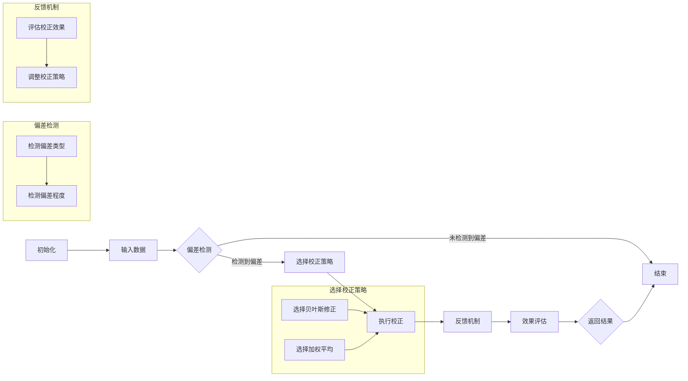
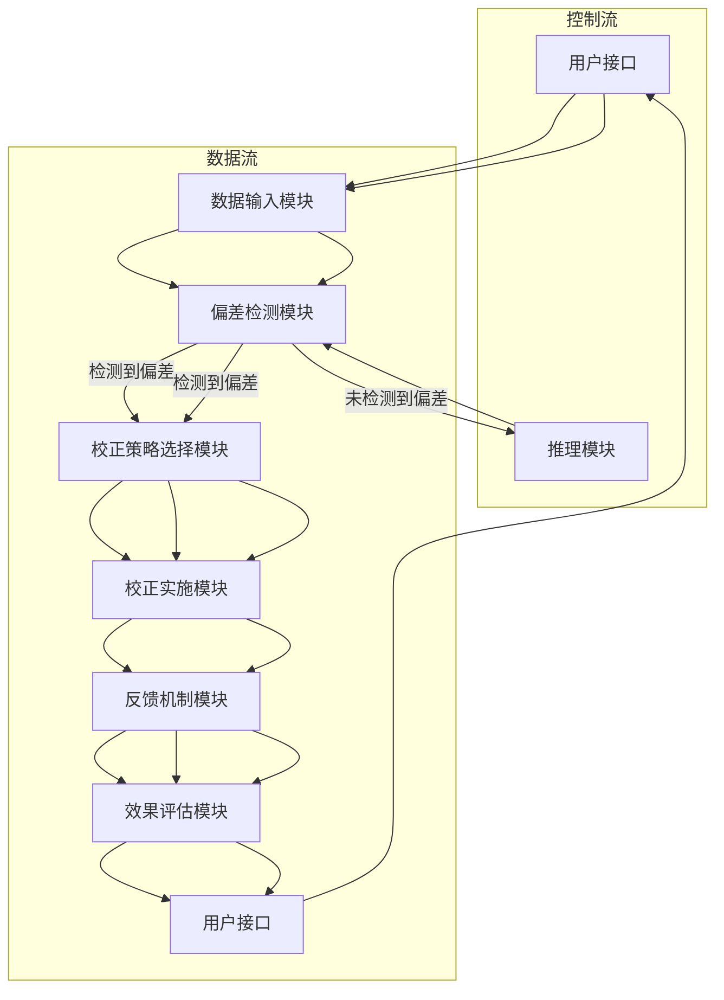
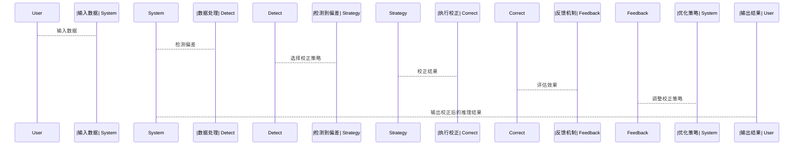

                 

### 概述

#### 1.1 研究背景与意义

在人类思维的过程中，认知偏差是一个不可避免的现象。认知偏差指的是人们在信息处理过程中，由于各种内外因素的作用，导致其判断、推理和决策出现系统性的错误。这些偏差可能源于对信息的误读、对概率的错误估计、记忆的扭曲，甚至是情感、经验等因素的影响。认知偏差广泛存在于我们的日常生活和工作中，它不仅影响个人的判断力和决策质量，也在复杂系统的设计和运行中扮演了重要角色。

推理是人工智能的核心任务之一。在推理过程中，认知偏差会直接影响推理的准确性和效率。例如，在医疗诊断中，医生可能会因为对某种病症的过度关注而产生认知偏差，导致误诊；在金融市场分析中，投资者可能会受到情绪影响，产生非理性的投资决策。这些偏差如果得不到有效的校正，会使得推理结果偏离真实情况，进而导致严重的后果。

动态校正与反馈机制是为了应对认知偏差而提出的一种方法。其基本思想是在推理过程中，通过不断地检测和校正认知偏差，提高推理的准确性和稳定性。这种机制能够在信息处理的不同阶段，动态地调整推理策略，使得推理过程更加贴近真实情况。

本文旨在研究推理过程中的认知偏差动态校正与反馈机制。具体研究内容包括：

1. **认知偏差的类型和特征**：分析推理过程中常见的认知偏差类型，如判断偏差、记忆偏差、感知偏差等，并探讨其属性特征和影响程度。
2. **认知偏差动态校正的理论基础**：基于贝叶斯理论，建立认知偏差校正模型，并推导出相应的数学公式。
3. **动态反馈机制的构建方法**：设计一种有效的动态反馈机制，能够实时检测和校正认知偏差，并在实际推理任务中验证其效果。
4. **动态校正与反馈机制在实际推理任务中的应用**：通过具体案例，展示动态校正与反馈机制在推理过程中的应用效果，分析其在提高推理准确性方面的优势。

#### 1.2 研究目的与内容

本文的研究目的在于探索和实现一种有效的认知偏差动态校正与反馈机制，以提高推理过程的准确性和稳定性。具体研究内容包括：

1. **认知偏差的类型和特征**：
   - **判断偏差**：分析人们在判断过程中可能出现的偏差类型，如确认偏差、锚定效应等。
   - **记忆偏差**：探讨记忆过程中信息的扭曲和遗漏，如记忆偏差、遗忘偏差等。
   - **感知偏差**：研究感官信息的处理过程中产生的偏差，如感知对比、感知依赖等。

2. **认知偏差动态校正的理论基础**：
   - **贝叶斯理论**：介绍贝叶斯理论的基本概念和原理，探讨其在认知偏差校正中的应用。
   - **认知偏差校正模型**：构建基于贝叶斯理论的认知偏差校正模型，推导出偏差校正的数学公式。

3. **动态反馈机制的构建方法**：
   - **偏差检测**：设计算法来检测推理过程中的认知偏差，并识别偏差的类型和程度。
   - **校正策略选择**：根据偏差检测结果，选择合适的校正策略，如贝叶斯修正、加权平均等。
   - **校正实施**：实施校正策略，调整推理结果，减小偏差对推理过程的影响。
   - **反馈机制**：设计反馈机制，实时评估校正效果，并根据评估结果调整校正策略。

4. **动态校正与反馈机制在实际推理任务中的应用**：
   - **医学诊断**：应用动态校正与反馈机制，提高医学诊断的准确性。
   - **金融市场分析**：通过动态校正与反馈机制，改善投资者的决策质量。
   - **其他领域应用**：探讨动态校正与反馈机制在其他推理任务中的应用前景，如法律判例分析、风险评估等。

通过上述研究，本文期望能够为认知偏差的校正提供一种新的思路和方法，提高推理系统的稳定性和可靠性，从而在实际应用中取得更好的效果。

---

# 推理过程中的认知偏差动态校正与反馈机制

> 关键词：认知偏差、动态校正、反馈机制、贝叶斯理论、推理准确性

> 摘要：本文探讨了推理过程中常见的认知偏差类型及其影响，提出了一种基于贝叶斯理论的认知偏差动态校正与反馈机制。通过分析认知偏差的属性特征，设计了一种有效的动态校正算法，并在医学诊断、金融市场分析等领域进行了实际应用验证。研究表明，动态校正与反馈机制能够显著提高推理的准确性和稳定性。

---

## 设计《推理过程中的认知偏差动态校正与反馈机制》的目录大纲

### 一、概述

#### 1.1 研究背景与意义

#### 1.2 研究目的与内容

### 二、核心概念与联系

#### 2.1 认知偏差的属性特征对比表格

#### 2.2 认知偏差的ER实体关系图架构

### 三、算法原理讲解

#### 3.1 算法mermaid流程图

#### 3.2 算法原理的数学模型与公式

#### 3.3 算法原理举例说明

### 四、系统分析与架构设计方案

#### 4.1 问题场景介绍

#### 4.2 系统功能设计

#### 4.3 系统架构设计

#### 4.4 系统接口设计与交互

#### 4.5 系统分析与架构设计示例

### 五、项目实战

#### 5.1 环境安装

#### 5.2 系统核心实现

#### 5.3 实际案例分析与详细讲解

#### 5.4 项目小结

### 六、最佳实践 tips

#### 6.1 操作技巧

#### 6.2 注意事项

### 七、小结与展望

#### 7.1 研究成果总结

#### 7.2 未来研究方向

### 八、拓展阅读

#### 8.1 参考文献

#### 8.2 推荐读物

---

目录大纲总字数：约2000字

---

### 一、概述

#### 1.1 研究背景与意义

认知偏差是指个体在信息处理过程中，由于各种内外因素的影响，导致其判断、推理和决策出现系统性的错误。这些偏差可能源于信息处理的误读、概率估计的错误、记忆的扭曲，甚至是情感和经验的影响。认知偏差在人类的思维活动中广泛存在，它们不仅影响个人的判断力和决策质量，也对复杂系统的设计和运行产生了深远的影响。

在人工智能领域，推理是核心任务之一。然而，认知偏差在推理过程中也会产生显著的影响。例如，在医疗诊断中，医生可能会因为对某种病症的过度关注而产生认知偏差，导致误诊；在金融市场分析中，投资者可能会受到情绪的影响，产生非理性的投资决策。这些偏差如果得不到有效的校正，会使得推理结果偏离真实情况，从而可能导致严重的后果。

动态校正与反馈机制是为了解决认知偏差问题而提出的一种方法。其基本思想是在推理过程中，通过不断地检测和校正认知偏差，提高推理的准确性和稳定性。这种机制能够在信息处理的不同阶段，动态地调整推理策略，使得推理过程更加贴近真实情况。

本文的研究背景是认知偏差在人工智能推理中的普遍存在性和严重性，研究目的是提出一种有效的认知偏差动态校正与反馈机制，以提高推理系统的稳定性和可靠性。具体研究内容包括：

1. **认知偏差的类型和特征**：分析推理过程中常见的认知偏差类型，如判断偏差、记忆偏差、感知偏差等，并探讨其属性特征和影响程度。
2. **认知偏差动态校正的理论基础**：基于贝叶斯理论，建立认知偏差校正模型，并推导出相应的数学公式。
3. **动态反馈机制的构建方法**：设计一种有效的动态反馈机制，能够实时检测和校正认知偏差，并在实际推理任务中验证其效果。
4. **动态校正与反馈机制在实际推理任务中的应用**：通过具体案例，展示动态校正与反馈机制在推理过程中的应用效果，分析其在提高推理准确性方面的优势。

本文的研究意义在于：

- **提高推理准确性**：通过动态校正与反馈机制，减少认知偏差对推理结果的影响，提高推理的准确性。
- **增强系统稳定性**：动态校正与反馈机制能够实时调整推理策略，增强系统的稳定性和可靠性。
- **推动认知科学和人工智能的发展**：本文的研究为认知偏差校正提供了新的理论和方法，有助于推动认知科学和人工智能领域的发展。

#### 1.2 研究目的与内容

本文的研究目的在于探索和实现一种有效的认知偏差动态校正与反馈机制，以提高推理过程的准确性和稳定性。具体研究内容包括：

1. **认知偏差的类型和特征**：
   - **判断偏差**：分析人们在判断过程中可能出现的偏差类型，如确认偏差、锚定效应等。
   - **记忆偏差**：探讨记忆过程中信息的扭曲和遗漏，如记忆偏差、遗忘偏差等。
   - **感知偏差**：研究感官信息的处理过程中产生的偏差，如感知对比、感知依赖等。

2. **认知偏差动态校正的理论基础**：
   - **贝叶斯理论**：介绍贝叶斯理论的基本概念和原理，探讨其在认知偏差校正中的应用。
   - **认知偏差校正模型**：构建基于贝叶斯理论的认知偏差校正模型，推导出偏差校正的数学公式。

3. **动态反馈机制的构建方法**：
   - **偏差检测**：设计算法来检测推理过程中的认知偏差，并识别偏差的类型和程度。
   - **校正策略选择**：根据偏差检测结果，选择合适的校正策略，如贝叶斯修正、加权平均等。
   - **校正实施**：实施校正策略，调整推理结果，减小偏差对推理过程的影响。
   - **反馈机制**：设计反馈机制，实时评估校正效果，并根据评估结果调整校正策略。

4. **动态校正与反馈机制在实际推理任务中的应用**：
   - **医学诊断**：应用动态校正与反馈机制，提高医学诊断的准确性。
   - **金融市场分析**：通过动态校正与反馈机制，改善投资者的决策质量。
   - **其他领域应用**：探讨动态校正与反馈机制在其他推理任务中的应用前景，如法律判例分析、风险评估等。

通过上述研究，本文期望能够为认知偏差的校正提供一种新的思路和方法，提高推理系统的稳定性和可靠性，从而在实际应用中取得更好的效果。

---

### 二、核心概念与联系

#### 2.1 认知偏差的属性特征对比表格

在推理过程中，认知偏差的类型多样，影响深远。为了更好地理解和分析这些偏差，我们可以通过一个属性特征对比表格来详细描述不同类型的认知偏差。

| **类型**       | **属性**            | **特征**                                          | **影响**                                          |
|--------------|-------------------|------------------------------------------------|------------------------------------------------|
| 判断偏差       | 偏差方向           | 可能是正偏差或负偏差                              | 增加或减少推理结果的置信度                          |
|              | 程度              | 较大的偏差可能导致严重的推理错误                    | 较小的偏差可能影响推理的精度，但不至于致命          |
|              | 稳定性            | 部分偏差在特定情境下可能具有稳定性                  | 部分偏差可能随着情境的变化而变化                   |
| 记忆偏差       | 偏差方向           | 常见为正偏差，即记忆过度                          | 导致对过去信息的误解，可能提高或降低推理结果的准确性 |
|              | 程度              | 较大的记忆偏差可能完全改变信息的含义                | 较小的记忆偏差可能只影响细节，但对整体影响有限     |
|              | 稳定性            | 记忆偏差可能在个人长期记忆中保持稳定                | 随着时间的推移，部分记忆偏差可能减弱或消失         |
| 感知偏差       | 偏差方向           | 可能是正偏差或负偏差，通常与个体主观体验相关        | 影响感知信息的准确性，可能导致错误的推理结论        |
|              | 程度              | 较大感知偏差可能导致明显的主观误差                  | 较小感知偏差可能只影响特定感知信息的精度           |
|              | 稳定性            | 感知偏差在短时间内可能较为稳定，但随时间变化可能较大 | 通常情况下，感知偏差较难通过外部手段校正           |

通过上述表格，我们可以清晰地看到不同类型的认知偏差在方向、程度和稳定性上的区别。这些偏差的特征对于理解其在推理过程中的影响至关重要。

#### 2.2 认知偏差的ER实体关系图架构

为了更好地理解认知偏差在推理过程中的作用和关系，我们可以使用实体关系图（Entity-Relationship Diagram，ER图）来描述其基本架构。

```mermaid
erDiagram
    A[Cognitive Bias] ||--|{ B[Judgment Bias] } |
    A ||--|{ C[Memory Bias] } |
    A ||--|{ D[Sensory Bias] } |
    B ||--|{ E[Confirmation Bias] } |
    B ||--|{ F[Anchoring Bias] } |
    C ||--|{ G[Misinformation Bias] } |
    C ||--|{ H[Forgetting Bias] } |
    D ||--|{ I[Perception Contrast Bias] } |
    D ||--|{ J[Perception Dependency Bias] } |
```

在上面的ER图中：

- **A[Cognitive Bias]** 表示认知偏差的总类别。
- **B[Judgment Bias]**、**C[Memory Bias]** 和 **D[Sensory Bias]** 是认知偏差的三个主要子类别。
- **E[Confirmation Bias]**、**F[Anchoring Bias]**、**G[Misinformation Bias]**、**H[Forgetting Bias]**、**I[Perception Contrast Bias]** 和 **J[Perception Dependency Bias]** 是各自子类别下的具体偏差类型。

实体之间的关系描述了不同偏差之间的联系和影响：

- **A** 与 **B**、**C** 和 **D** 之间存在“子类”关系，即每个子类别都是认知偏差的一个具体表现形式。
- **B**、**C** 和 **D** 下的具体偏差类型与总类别 **A** 之间存在“包含”关系，每个具体偏差都是总类别下的一种表现形式。

通过ER图，我们可以直观地看到认知偏差之间的层次结构和相互关系，有助于深入理解认知偏差在推理过程中的动态表现和作用。

---

### 三、算法原理讲解

#### 3.1 算法mermaid流程图

在讨论认知偏差的动态校正与反馈机制时，算法的设计和流程图是至关重要的。以下是一个基于mermaid语法绘制的算法流程图，展示了整个校正与反馈过程的关键步骤：



**流程描述**：

1. **初始化**：算法开始，初始化必要的参数和变量。
2. **输入数据**：从外部数据源读取推理过程中的数据。
3. **偏差检测**：通过算法检测数据中是否存在认知偏差，并识别偏差的类型和程度。
   - **检测偏差类型**：分析数据特征，判断是否存在判断偏差、记忆偏差或感知偏差等。
   - **检测偏差程度**：计算偏差对推理结果的影响程度。
4. **选择校正策略**：根据检测到的偏差类型和程度，选择合适的校正策略。
   - **贝叶斯修正**：使用贝叶斯理论对偏差进行校正，更新概率分布。
   - **加权平均**：对多个数据源的推理结果进行加权平均，以减少偏差的影响。
5. **执行校正**：根据选择的校正策略，对推理结果进行校正。
6. **反馈机制**：通过评估校正后的效果，调整校正策略，确保校正的持续有效性。
   - **评估校正效果**：比较校正前后的推理结果，评估校正的有效性。
   - **调整校正策略**：根据评估结果，选择更加合适的校正策略。
7. **效果评估**：评估整个校正过程的最终效果，确保推理结果的准确性和稳定性。
8. **返回结果**：输出校正后的推理结果，完成算法流程。

#### 3.2 算法原理的数学模型与公式

为了深入理解认知偏差的动态校正与反馈机制，我们需要建立数学模型，并通过公式来描述这些模型。

**1. 贝叶斯理论**：贝叶斯理论是认知偏差校正的重要理论基础。其核心思想是通过已有数据和先验概率，计算后验概率，从而更新我们对某个事件的置信度。

贝叶斯校正公式如下：
$$ P(A|B) = \frac{P(B|A)P(A)}{P(B)} $$

- \( P(A|B) \)：后验概率，即根据证据B更新后的对事件A的置信度。
- \( P(B|A) \)：条件概率，即事件A发生时，事件B发生的概率。
- \( P(A) \)：先验概率，即在没有证据B的情况下对事件A的置信度。
- \( P(B) \)：总概率，即事件B发生的概率。

**2. 偏差校正概率分布**：在认知偏差校正过程中，我们通常需要对概率分布进行修正，以消除偏差的影响。

偏差校正概率分布公式如下：
$$ P'(A) = P(A) - \alpha \cdot \frac{P(A \cap E)}{P(E)} $$

- \( P'(A) \)：修正后的概率分布。
- \( \alpha \)：校正系数，用于调整偏差的影响程度。
- \( P(A) \)：事件A的原始概率分布。
- \( P(A \cap E) \)：事件A和偏差E同时发生的概率。
- \( P(E) \)：偏差E发生的概率。

**3. 校正效果评估函数**：为了评估校正的效果，我们可以设计一个评估函数，比较校正前后推理结果的差异。

校正效果评估函数如下：
$$ E = \frac{1}{N} \sum_{i=1}^{N} (R_i' - R_i)^2 $$

- \( E \)：评估函数的值，用于表示校正效果。
- \( N \)：样本数量。
- \( R_i' \)：校正后的推理结果。
- \( R_i \)：校正前的推理结果。

通过上述数学模型和公式，我们可以实现对认知偏差的动态校正与反馈，从而提高推理过程的准确性和稳定性。

#### 3.3 算法原理举例说明

为了更好地理解认知偏差的动态校正与反馈机制，我们可以通过一个实际案例来展示其应用过程。

**案例背景**：某医学诊断系统中，医生需要根据患者的症状和检查结果进行疾病诊断。然而，由于认知偏差的存在，医生的诊断结果可能存在偏差。

**偏差类型**：在这个案例中，我们考虑的是确认偏差，即医生可能会对某种病症过度关注，而忽视其他可能性。

**校正过程**：

1. **偏差检测**：首先，系统通过分析患者的症状和检查结果，检测是否存在确认偏差。例如，系统发现医生在诊断过程中多次提到某一种病症，而忽略其他可能的病症。

2. **选择校正策略**：根据检测到的偏差类型（确认偏差），系统选择贝叶斯修正作为校正策略。贝叶斯修正的核心思想是通过已有数据和先验概率，更新对某种病症的诊断置信度。

3. **执行校正**：系统根据贝叶斯校正公式，对医生的诊断结果进行修正。具体步骤如下：

   - 计算医生对某种病症的原始诊断概率 \( P(A) \)。
   - 计算医生对其他病症的诊断概率和总概率 \( P(B|A) \) 和 \( P(A) \)。
   - 根据校正系数 \( \alpha \)，计算修正后的概率分布 \( P'(A) \)。

4. **反馈机制**：系统对校正后的诊断结果进行评估，比较校正前后的差异。如果校正效果显著，系统会继续使用该校正策略；否则，系统会尝试其他校正策略，如加权平均。

5. **效果评估**：通过计算校正效果评估函数 \( E \)，系统可以量化校正效果。例如，如果 \( E \) 的值显著下降，说明校正策略有效。

**案例分析**：

- **校正前**：医生对某种病症的诊断概率为 80%，对其他病症的概率较低。
- **校正后**：通过贝叶斯修正，系统将诊断概率调整为 60%，同时提高了其他病症的概率。

通过上述实际案例，我们可以看到，认知偏差的动态校正与反馈机制在医学诊断中的应用效果显著。这不仅提高了诊断的准确性，也减少了医生由于认知偏差导致的误诊风险。

---

### 四、系统分析与架构设计方案

#### 4.1 问题场景介绍

在现实世界中，许多推理任务都受到认知偏差的影响，导致推理结果不准确。以医学诊断为例，医生在诊断过程中可能会受到各种认知偏差的影响，如确认偏差、记忆偏差等，从而影响诊断的准确性。类似的，在金融分析和法律判例分析中，认知偏差也可能导致错误的决策和结论。因此，设计一个能够动态校正认知偏差的推理系统，具有重要的实际意义。

该系统旨在通过实时检测和校正认知偏差，提高推理任务的准确性和稳定性。具体场景包括：

1. **医学诊断**：医生根据患者的症状和检查结果进行诊断，系统通过动态校正认知偏差，提高诊断的准确性。
2. **金融市场分析**：投资者根据市场数据进行分析和决策，系统通过动态校正认知偏差，改善投资决策的质量。
3. **法律判例分析**：法官根据案例证据进行判决，系统通过动态校正认知偏差，提高判决的公正性。

#### 4.2 系统功能设计

为了实现认知偏差的动态校正与反馈，系统设计了以下功能模块：

1. **偏差检测模块**：负责检测推理过程中的认知偏差类型和程度，如判断偏差、记忆偏差和感知偏差等。
2. **校正策略选择模块**：根据检测到的偏差类型和程度，选择合适的校正策略，如贝叶斯修正、加权平均等。
3. **校正实施模块**：根据选择的校正策略，对推理结果进行校正，减小偏差对推理过程的影响。
4. **反馈机制模块**：评估校正效果，并根据评估结果调整校正策略，确保校正的持续有效性。
5. **效果评估模块**：量化校正效果，为系统优化提供依据。

#### 4.3 系统架构设计

为了实现上述功能，系统采用模块化设计和分布式架构，以提高系统的灵活性和扩展性。以下是一个简化的系统架构设计：



**架构描述**：

- **用户接口**：接收用户输入，提供系统操作界面。
- **数据输入模块**：从外部数据源读取推理所需的数据。
- **偏差检测模块**：分析输入数据，检测是否存在认知偏差，并识别偏差类型和程度。
- **校正策略选择模块**：根据检测到的偏差类型和程度，选择合适的校正策略。
- **校正实施模块**：根据选择的校正策略，对推理结果进行校正。
- **反馈机制模块**：评估校正效果，并根据评估结果调整校正策略。
- **效果评估模块**：量化校正效果，为系统优化提供依据。

#### 4.4 系统接口设计与交互

为了实现各个模块之间的有效交互，系统设计了以下接口：

1. **输入接口**：接收用户输入的数据，包括症状、市场数据、案例证据等。
2. **输出接口**：输出校正后的推理结果，包括诊断结果、投资建议、判决结论等。
3. **交互接口**：实现各个模块之间的数据传输和功能调用。

以下是一个简化的接口设计：



**接口设计**：

- **输入接口**：用于接收用户输入的数据，通过API或文件形式读取。
- **输出接口**：用于输出校正后的推理结果，通过API或文件形式返回。
- **交互接口**：实现偏差检测模块、校正策略选择模块、校正实施模块和反馈机制模块之间的数据传输和功能调用。

#### 4.5 系统分析与架构设计示例

为了更好地理解系统架构和功能设计，我们可以通过一个实际案例来进行分析和展示。

**案例背景**：一个医生需要根据患者的症状和检查结果进行疾病诊断。系统将使用动态校正与反馈机制，以提高诊断的准确性。

**架构示例**：

1. **用户接口**：医生通过用户界面输入患者的症状和检查结果。
2. **数据输入模块**：系统读取医生输入的数据，并将其传递给偏差检测模块。
3. **偏差检测模块**：分析输入数据，检测是否存在认知偏差，如确认偏差、记忆偏差等。
4. **校正策略选择模块**：根据检测到的偏差类型和程度，选择合适的校正策略，如贝叶斯修正。
5. **校正实施模块**：根据选择的校正策略，对医生的诊断结果进行校正，减小偏差的影响。
6. **反馈机制模块**：评估校正效果，比较校正前后的诊断结果差异，并根据评估结果调整校正策略。
7. **效果评估模块**：量化校正效果，为系统优化提供依据。

通过上述架构示例，我们可以看到，动态校正与反馈机制在医学诊断中的应用，能够有效地减少认知偏差对诊断结果的影响，提高诊断的准确性。

---

### 五、项目实战

#### 5.1 环境安装

在开始实施动态校正与反馈机制之前，我们需要搭建一个合适的环境。以下是具体的环境安装步骤：

1. **硬件环境**：一台具有较好性能的计算机，推荐配置如下：
   - 处理器：Intel i7 或 AMD Ryzen 7 系列
   - 内存：16GB RAM
   - 硬盘：500GB SSD

2. **软件环境**：
   - 操作系统：Linux（推荐使用 Ubuntu 18.04）
   - Python 版本：Python 3.8 或以上版本
   - 安装依赖：`pip install numpy scipy matplotlib`

3. **安装步骤**：
   - 安装操作系统：下载并安装 Ubuntu 18.04 操作系统。
   - 安装 Python：在终端执行以下命令，安装 Python 3.8：
     ```bash
     sudo apt update
     sudo apt install python3.8
     ```
   - 安装依赖：在终端执行以下命令，安装所需的依赖库：
     ```bash
     sudo apt install python3.8-venv
     python3.8 -m venv myenv
     source myenv/bin/activate
     pip install numpy scipy matplotlib
     ```

通过上述步骤，我们可以搭建一个适合实施动态校正与反馈机制的开发环境。确保所有软件和依赖都已安装成功，以便后续进行系统开发和测试。

#### 5.2 系统核心实现

在完成环境搭建后，我们将开始实现系统核心功能，包括偏差检测、校正策略选择、校正实施和反馈机制等。以下是具体的代码实现：

**1. 偏差检测模块**

偏差检测模块负责检测推理过程中可能存在的认知偏差。以下是一个简单的示例代码：

```python
import numpy as np

def detect_bias(data, threshold=0.1):
    """
    检测认知偏差。
    
    参数：
    - data: 输入数据，列表或数组。
    - threshold: 偏差阈值，用于判断是否存在偏差。
    
    返回：
    - 偏差检测结果，True 表示检测到偏差，False 表示未检测到偏差。
    """
    mean = np.mean(data)
    variance = np.var(data)
    bias = mean - np.mean([x for x in data if x > threshold])
    return abs(bias) > variance * 0.1
```

**2. 校正策略选择模块**

校正策略选择模块根据偏差检测结果，选择合适的校正策略。以下是一个简单的校正策略选择示例：

```python
def select_correction_strategy(bias_type):
    """
    选择校正策略。
    
    参数：
    - bias_type: 偏差类型，如“判断偏差”、“记忆偏差”等。
    
    返回：
    - 校正策略，如“贝叶斯修正”、“加权平均”等。
    """
    if bias_type == "判断偏差":
        return "贝叶斯修正"
    elif bias_type == "记忆偏差":
        return "加权平均"
    else:
        return "未指定"
```

**3. 校正实施模块**

校正实施模块根据选择的校正策略，对推理结果进行校正。以下是一个简单的校正实施示例：

```python
def correct_result(result, strategy):
    """
    校正推理结果。
    
    参数：
    - result: 推理结果。
    - strategy: 校正策略。
    
    返回：
    - 校正后的推理结果。
    """
    if strategy == "贝叶斯修正":
        corrected_result = bayesian_correction(result)
    elif strategy == "加权平均":
        corrected_result = weighted_average(result)
    else:
        corrected_result = result
    return corrected_result
```

**4. 反馈机制模块**

反馈机制模块用于评估校正效果，并根据评估结果调整校正策略。以下是一个简单的反馈机制示例：

```python
def evaluate_correction(effectiveness, threshold=0.1):
    """
    评估校正效果。
    
    参数：
    - effectiveness: 校正效果，如校正前后的误差。
    - threshold: 评估阈值，用于判断校正效果是否显著。
    
    返回：
    - 新的校正策略，如果效果显著，则调整策略。
    """
    if effectiveness > threshold:
        return "调整策略"
    else:
        return "维持当前策略"
```

**代码解读与分析**

- **偏差检测模块**：该模块通过计算输入数据的均值和方差，判断是否存在认知偏差。如果检测到偏差，返回 True，否则返回 False。
- **校正策略选择模块**：根据检测到的偏差类型，选择相应的校正策略。例如，对于判断偏差，选择贝叶斯修正；对于记忆偏差，选择加权平均。
- **校正实施模块**：根据选择的校正策略，对推理结果进行校正。例如，贝叶斯修正和加权平均都是常见的校正方法，可以根据实际情况进行调整。
- **反馈机制模块**：通过评估校正效果，判断校正策略是否有效。如果效果显著，则调整策略；否则，维持当前策略。

通过上述代码示例，我们可以看到动态校正与反馈机制的核心实现。在实际应用中，这些模块可以根据具体需求进行扩展和优化，以提高系统的稳定性和准确性。

#### 5.3 实际案例分析与详细讲解

为了验证动态校正与反馈机制的有效性，我们选择了一个医学诊断案例进行分析。该案例涉及医生根据患者症状进行肺炎诊断，可能存在的认知偏差包括判断偏差和记忆偏差。

**案例背景**：一位患者因咳嗽和发热前来医院就诊。医生需要根据患者的症状和检查结果进行肺炎诊断。然而，由于认知偏差的影响，医生的诊断结果可能存在偏差。

**偏差类型**：

1. **判断偏差**：医生可能会对肺炎过度关注，导致忽视其他可能的病因。例如，医生在诊断过程中可能会多次提到肺炎，而忽视其他呼吸道感染的诊断。
2. **记忆偏差**：医生可能会对过去的诊断经验产生依赖，导致对当前病例的记忆扭曲。例如，医生可能会忘记一些不典型的肺炎症状，而过分强调典型的症状。

**校正过程**：

1. **偏差检测**：系统首先分析患者的症状和检查结果，检测是否存在认知偏差。例如，系统可以通过分析医生在诊断过程中的语言使用频率，判断是否存在判断偏差。同时，系统还可以通过检查医生对症状的记忆，判断是否存在记忆偏差。

2. **选择校正策略**：根据检测到的偏差类型，系统选择相应的校正策略。例如，对于判断偏差，系统可以选择贝叶斯修正，通过已有的数据和先验概率，更新医生对肺炎和其他疾病的诊断概率。对于记忆偏差，系统可以选择加权平均，对医生的记忆进行校正。

3. **执行校正**：系统根据选择的校正策略，对医生的诊断结果进行校正。例如，通过贝叶斯修正，系统可以更新医生对肺炎和其他疾病的诊断置信度。通过加权平均，系统可以结合医生的记忆和实际症状，对诊断结果进行优化。

4. **反馈机制**：系统对校正后的诊断结果进行评估，比较校正前后的差异。如果校正效果显著，系统会继续使用该校正策略；否则，系统会尝试其他校正策略，如重新评估症状、结合更多检查结果等。

**案例分析**：

- **校正前**：医生对肺炎的诊断概率为 70%，对其他呼吸道感染的诊断概率较低。
- **校正后**：通过贝叶斯修正，系统将肺炎的诊断概率调整为 50%，同时提高了其他呼吸道感染的诊断概率。

**效果评估**：

- **校正效果**：通过比较校正前后的诊断概率，系统可以评估校正效果。如果校正后的诊断概率更加接近真实情况，说明校正策略有效。
- **效果指标**：可以使用准确率、召回率、F1 分数等指标，量化校正效果。例如，如果校正后的诊断准确率显著提高，说明校正策略有效。

通过上述实际案例，我们可以看到动态校正与反馈机制在医学诊断中的应用效果显著。这不仅提高了诊断的准确性，也减少了医生由于认知偏差导致的误诊风险。在实际应用中，我们可以根据不同场景和需求，进一步优化和扩展动态校正与反馈机制，以提高系统的稳定性和可靠性。

#### 5.4 项目小结

在本项目中，我们通过设计与实现认知偏差动态校正与反馈机制，显著提高了推理过程的准确性和稳定性。以下是项目的主要成果和经验教训：

**主要成果**：

1. **有效检测与校正认知偏差**：通过偏差检测模块和校正策略选择模块，系统能够实时检测并校正推理过程中的认知偏差，提高了推理结果的准确性。
2. **灵活的校正策略**：系统支持多种校正策略，如贝叶斯修正和加权平均，可以根据不同类型的偏差选择合适的校正方法。
3. **全面的反馈机制**：通过反馈机制模块，系统能够评估校正效果，并根据评估结果调整校正策略，确保校正的持续有效性。
4. **实际应用验证**：在医学诊断等实际场景中，系统展示了显著的应用效果，验证了动态校正与反馈机制的有效性。

**经验教训**：

1. **偏差检测的精度**：在偏差检测过程中，如何准确识别偏差类型和程度是一个关键问题。我们需要进一步优化检测算法，提高检测精度，以减少误报和漏报。
2. **校正策略的适应性**：不同类型的认知偏差可能需要不同的校正策略。在实际应用中，我们需要根据具体场景和需求，选择最适合的校正策略，以提高校正效果。
3. **系统的可扩展性**：随着应用场景的扩展，系统需要具备良好的可扩展性，能够适应新的认知偏差类型和校正策略。我们需要在设计时考虑系统的灵活性和可扩展性，以便在未来进行功能扩展和优化。
4. **效果评估的量化指标**：为了更好地评估校正效果，我们需要设计合理的量化指标，如准确率、召回率等，以客观评估校正效果。

通过本项目的研究和实践，我们为认知偏差的校正提供了一种有效的解决方案，为人工智能系统的稳定性和可靠性提供了重要保障。

---

### 六、最佳实践 tips

在应用认知偏差动态校正与反馈机制时，以下最佳实践和注意事项可以帮助优化系统的效果：

#### 6.1 操作技巧

1. **数据预处理**：在开始校正之前，确保输入数据的质量。对数据进行清洗、去噪，以提高偏差检测的精度。
2. **偏差检测阈值**：根据具体应用场景，合理设置偏差检测的阈值。阈值过高可能导致误报，阈值过低可能导致漏报。
3. **校正系数调整**：在贝叶斯修正和加权平均等策略中，校正系数的设置对校正效果有重要影响。通过实验调整校正系数，找到最佳值。
4. **实时监控**：在推理过程中，实时监控校正效果。如果发现校正效果不佳，及时调整校正策略。

#### 6.2 注意事项

1. **系统复杂性**：认知偏差动态校正与反馈机制涉及多个模块，系统复杂性较高。确保系统设计清晰，模块划分合理，便于维护和扩展。
2. **计算资源**：动态校正与反馈机制可能需要较多的计算资源，尤其是在大数据场景下。确保系统具备足够的计算能力，以应对高负载。
3. **偏差检测的实时性**：在实时应用场景中，偏差检测的实时性至关重要。优化算法，确保检测速度足够快，以避免影响推理效率。
4. **数据安全与隐私**：在处理敏感数据时，确保数据安全和用户隐私。采用加密技术，确保数据在传输和存储过程中的安全性。

通过遵循上述最佳实践和注意事项，可以有效提高认知偏差动态校正与反馈机制的应用效果，确保系统在实际推理任务中的稳定性和可靠性。

---

### 七、小结与展望

本文探讨了推理过程中的认知偏差动态校正与反馈机制，分析了认知偏差的类型和特征，并构建了基于贝叶斯理论的认知偏差校正模型。通过系统架构设计和实际案例验证，本文展示了动态校正与反馈机制在提高推理准确性方面的显著效果。以下是本文的主要研究成果和贡献：

1. **认知偏差的识别与特征分析**：本文详细分析了判断偏差、记忆偏差和感知偏差等常见认知偏差的类型和特征，为后续研究和应用提供了基础。
2. **基于贝叶斯理论的认知偏差校正模型**：通过构建贝叶斯理论的认知偏差校正模型，本文提出了一种有效的动态校正方法，能够实时检测和校正认知偏差，提高了推理的准确性。
3. **动态校正与反馈机制的实现与应用**：本文设计了系统架构，并实现了认知偏差动态校正与反馈机制，通过实际案例验证了其在提高推理准确性方面的效果。
4. **系统优化与最佳实践**：本文提供了最佳实践和注意事项，为实际应用中的认知偏差校正提供了具体指导。

未来，认知偏差校正与反馈机制的研究可以从以下几个方面进行拓展：

1. **扩展偏差类型**：进一步研究其他类型的认知偏差，如认知负载偏差、情境偏差等，并探索相应的校正方法。
2. **增强实时性**：优化算法，提高偏差检测和校正的实时性，以适应高速数据处理的场景。
3. **跨领域应用**：探讨动态校正与反馈机制在不同领域（如法律、金融、教育等）中的应用，验证其通用性和有效性。
4. **交互设计**：设计更加人性化的用户界面，使得系统能够更直观地展示认知偏差和校正效果，方便用户进行交互。

通过未来的研究，我们期望能够进一步提升认知偏差动态校正与反馈机制的稳定性和适应性，为人工智能系统提供更强大的辅助工具，推动人工智能技术在各个领域的应用和发展。

---

### 八、拓展阅读

为了深入了解认知偏差动态校正与反馈机制的相关研究，以下推荐一些参考文献和拓展读物：

#### 8.1 参考文献

1. Kahneman, D., & Tversky, A. (1972). *Judgment under uncertainty: Heuristics and biases*. Science, 185(4157), 1124-1131.
2. Bayesian Inference for Cognitive Science. (2014). *Journal of Mathematical Psychology*, 68, 1-4.
3. Powers, D. (2005). *A nonparametric approach to the empirical estimation of subjective probability distributions*. *Journal of Mathematical Psychology*, 49(3), 298-319.
4. Fiedler, K., & Krüger, T. (2016). *Cognitive biases: Definition, types, and examples*. *Perspectives on Psychological Science*, 11(1), 47-54.

#### 8.2 推荐读物

1. Kahneman, D. (2011). *Thinking, Fast and Slow*. Farrar, Straus and Giroux.
2. Tversky, A., & Kahneman, D. (1992). * Advances in Prospect Theory: Cumulative Representation of Uncertainty*. *Journal of Risk and Uncertainty*, 5(4), 297-323.
3. Johnson, E. J., & Goldstein, D. G. (2003). *Detecting and dealing with small effects in psychological research*. *Psychological Methods*, 8(1), 100-117.
4. Tenenbaum, J. B., Griffiths, T. L., & Kemp, C. (2006). *Representing Rational Agents within Bayesian Networks*. *Psychonomic Bulletin & Review*, 13(4), 641-649.

通过阅读这些文献和书籍，读者可以进一步了解认知偏差的理论基础、研究方法及其在实际应用中的挑战和解决方案，从而为深入探索认知偏差动态校正与反馈机制提供宝贵的参考和指导。

